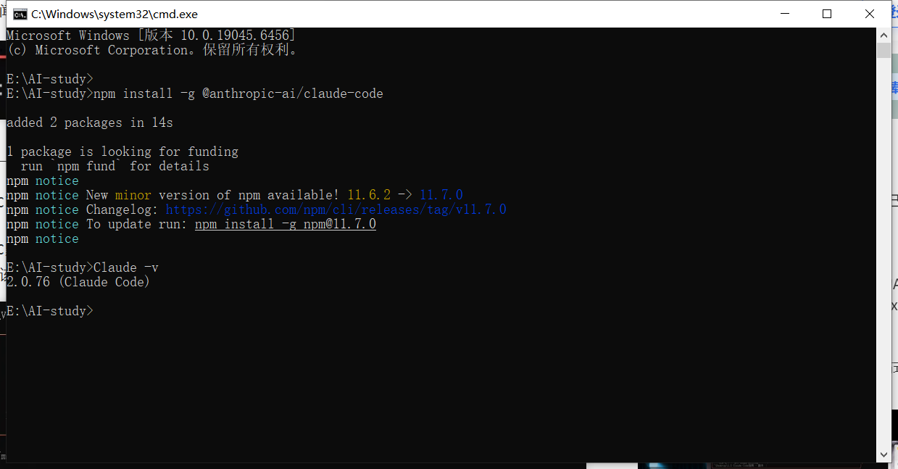
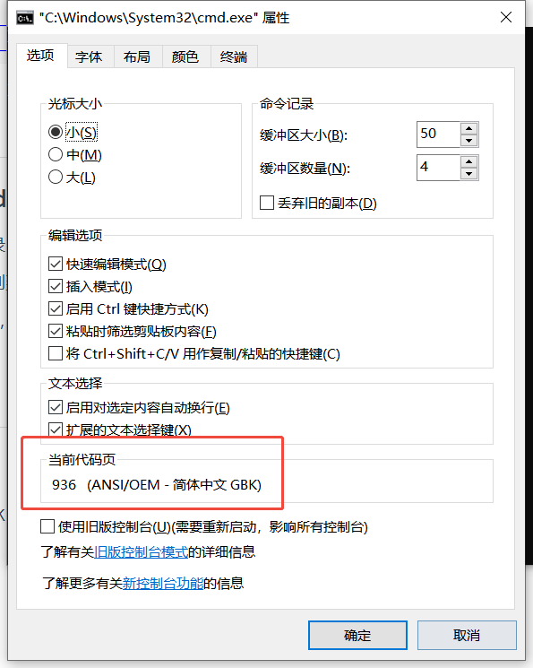

# Claude

## 安装

- 安装node.js（最新TLS版本）

- 安装claude-code

```sh
npm install -g @anthropic-ai/claude-code
```



- 安装jq

**windows**

1. 访问 jq 官方下载页：https://stedolan.github.io/jq/download/
2. 下载 Windows 版本（如 `jq-win64.exe`）；
3. 将下载的 `jq-win64.exe` 重命名为 `jq.exe`，放到系统 `PATH` 目录（如 `C:\Windows\System32`）；
4. 验证：打开 CMD/PowerShell，执行 `jq --version`。

## 切换大模型

### windows

设置以下环境变量

| key                                      | value                                  |
| ---------------------------------------- | -------------------------------------- |
| ANTHROPIC_BASE_URL                       | https://open.bigmodel.cn/api/anthropic |
| ANTHROPIC_AUTH_TOKEN                     | 你的key                                |
| ANTHROPIC_DEFAULT_OPUS_MODEL             | 大模型类型，如：GLM-4.7                |
| ANTHROPIC_DEFAULT_SONNET_MODEL           | 大模型类型，如：GLM-4.7                |
| ANTHROPIC_DEFAULT_HAIKU_MODEL            | 大模型类型，如：GLM-4.7                |
| API_TIMEOUT_MS                           | 3000000                                |
| CLAUDE_CODE_DISABLE_NONESSENTIAL_TRAFFIC | 1                                      |

### Linux

~~~sh
export ANTHROPIC_BASE_URL=https://open.bigmodel.cn/api/anthropic
export ANTHROPIC_AUTH_TOKEN=你的key
export ANTHROPIC_DEFAULT_OPUS_MODEL=大模型类型，如：GLM-4.7
export ANTHROPIC_DEFAULT_SONNET_MODEL=大模型类型，如：GLM-4.7
export ANTHROPIC_DEFAULT_HAIKU_MODEL=大模型类型，如：GLM-4.7
export API_TIMEOUT_MS=3000000
export CLAUDE_CODE_DISABLE_NONESSENTIAL_TRAFFIC=1
~~~

## skills

### 本地安装（cmd命令）

1. 创建本地技能目录：`mkdir -p ~/.claude/skills`
2. 将技能文件夹复制到该目录：`cp -r my-dev-skill ~/.claude/skills/`
3. 重启 Claude Code，自动加载技能

### 样例

~~~markdown
```
name: "PDF 表单填充"        # 技能名称（必填）
description: "按公司PEP8+FastAPI规范生成后端代码，含路由、模型、依赖注入与单元测试"  # 触发描述（必填）
author: "DevTeam"                   # 作者（可选）
version: "1.0"                      # 版本（可选）
tags: ["Python", "FastAPI", "PDF"]  # 标签（可选，便于搜索）
```

## PDF 表单填充工作流

复制此清单并在完成项目时检查：

```
任务进度：
- [ ] 步骤 1：分析表单（运行 analyze_form.py）
- [ ] 步骤 2：创建字段映射（编辑 fields.json）
- [ ] 步骤 3：验证映射（运行 validate_fields.py）
- [ ] 步骤 4：填充表单（运行 fill_form.py）
- [ ] 步骤 5：验证输出（运行 verify_output.py）
```

**步骤 1：分析表单**

运行：`python scripts/analyze_form.py input.pdf`

这提取表单字段及其位置，保存到 `fields.json`。

**步骤 2：创建字段映射**

编辑 `fields.json` 为每个字段添加值。

**步骤 3：验证映射**

运行：`python scripts/validate_fields.py fields.json`

在继续之前修复任何验证错误。

**步骤 4：填充表单**

运行：`python scripts/fill_form.py input.pdf fields.json output.pdf`

**步骤 5：验证输出**

运行：`python scripts/verify_output.py output.pdf`

如果验证失败，返回步骤 2。
~~~


## 问题（坑）

### 中文乱码

windows的cmd默认GBK，可以先在cmd中执行`chcp 65001`临时修改为UTF-8（关闭cmd失效）。



在cmd中使用curl发送post请求入参中含中文时，也会有乱码，需要使用-f @file.json 这种方式传参。