# 集群/主备

## MySQL双主热备

###   一、主从复制的原理

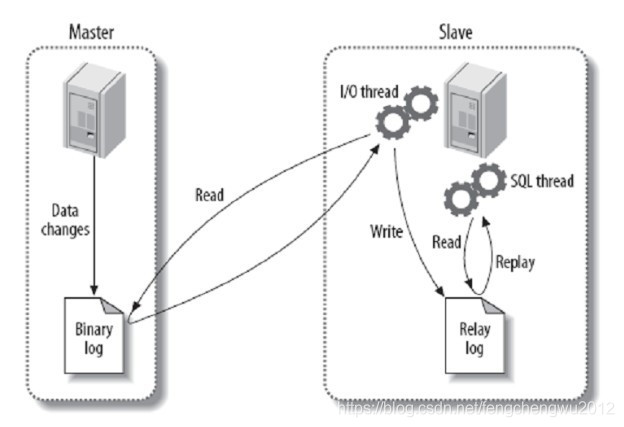

> MySQL之间数据复制的基础是二进制日志文件（binary log file）。一台MySQL数据库一旦启用二进制日志后，其作为master，它的数据库中所有操作都会以“事件”的方式记录在二进制日志中，其他数据库作为slave通过一个I/O线程与主服务器保持通信，并监控master的二进制日志文件的变化，如果发现master二进制日志文件发生变化，则会把变化复制到自己的中继日志中，然后slave的一个SQL线程会把相关的“事件”执行到自己的数据库中，以此实现从数据库和主数据库的一致性，也就实现了主从复制。

### 二、环境准备

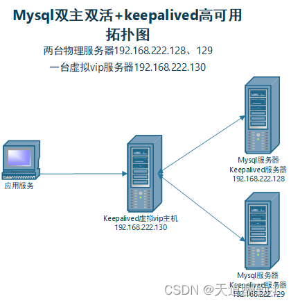

> ​	MySQL双主双活是指两台mysql服务器mysql-1、mysql-2都为master主节点服务器，同时又是对方的slave从节点，每个数据库都可作为主数据库使用，并将对数据库操作的数据同步至另外一台mysql服务中。
>
> ​    当应用服务开发过程中使用了mysql-1连接信息，在打包发布后，数据库连接信息已经固定，当数据库mysql-1出现异常时，需要人工干预先将应用服务停止-->将应用服务的mysql连接信息改为mysql-2 -->在启动应用服务器，比较繁琐，当应用服务器较多时，一个一个关闭，修改，再重启，将耽误更多时间，应用服务器修复故障时间延长，严重时会造成灾难性的后果。
>
> ​    故而引入了keepalived，keepalived通过VIP虚拟IP的漂移实现高可用，在相同集群内发送组播包，master主通过VRRP协议发送组播包，告诉从主的状态。
>
> ​    当我们通过keepalived虚拟出一个ip服务 mysql-3，应用服务只需要将mysql配置信息更改为mysql-3的配置信息，mysql-3实际代理的实体服务器为mysql-1或mysql-2。
>
> ​    例如：当mysql-3实际代理mysql-1时，mysql-1服务出现故障后，keepalived通过自身机制，自动将mysql-2作为实际代理主服务器，不需要人工干预去修改mysql配置信息，从而实现了高可用。

​      安装mysql服务

| 节点              | IP                                      |
| ----------------- | --------------------------------------- |
| 主节点master      | 192.168.222.128:3306      (root/123456) |
| 主节点master_back | 192.168.222.129:3306     (root/123456)  |

### 三、双主热备架构

​          master和master_back互为主从关系

####   1、my.cnf双主配置

 (1) master节点配置

~~~sh
#主从复制配置
server-id =1
#主从同步bin-log日志文件名
log-bin = mysql-bin
#主从同步时，不需要同步的数据库，多个数据库写多行binlog_ignore_db配置
binlog-ignore-db = mysql
binlog-ignore-db = information_schema
binlog-ignore-db = performance-schema
#主从同步时，需要同步的数据库，多个数据库写多行binlog_do_db配置
binlog-do-db = test_db
#binlog_format=mixed
#主-主热备主库配置
#log-slave-updates
#sync_binlog = 1
auto-increment-offset = 1
auto-increment-increment = 2
slave-skip-errors = all
replicate-do-db = test_db
replicate-ignore-db = mysql
replicate-ignore-db = information-schema
replicate-ignore-db = performance-schema
~~~

(2)master_back节点配置

~~~sh
#主从复制从库配置
#binlog_format=mixed
server-id = 6
#主从同步bin-log日志文件名
log-bin = mysql-bin
#主从同步时，需要同步的数据库，多个数据库写多行binlog_do_db配置
replicate-do-db = test_db
#主从同步时，不需要同步的数据库，多个数据库写多行binlog_ignore_db配置
replicate-ignore-db = mysql
replicate-ignore-db = information_schema
replicate-ignore-db = performance_schema
#双主热备从库配置
#sync_binlog = 1
auto-increment-increment = 2
auto-increment-offset = 1
slave-skip-errors = all
binlog-do-db = test_db
binlog-ignore-db = mysql
binlog-ignore-db = information_schema
binlog-ignore-db = performance_schema
~~~

#### 2、主从节点授权

 **1.连接128服务器mysql，并创建主从同步账户slavebak，并查看master状态，记录下file、psition值，配置129mysql从库时使用**

```sh
[root@128 ~]# /opt/mysql5.7/bin/mysql -uroot -proot
mysql: [Warning] Using a password on the command line interface can be insecure.
......
Type 'help;' or '\h' for help. Type '\c' to clear the current input statement.
 
mysql> grant replication slave on *.* to slavebak@'%' identified by 'slavebak';
mysql> flush privileges;
mysql> show master status;
+------------------+----------+--------------+------------------+-------------------+
| File             | Position | Binlog_Do_DB | Binlog_Ignore_DB | Executed_Gtid_Set |
+------------------+----------+--------------+------------------+-------------------+
| mysql-bin.000002 |     1287 | test_db      |                  |                   |
+------------------+----------+--------------+------------------+-------------------+
1 row in set (0.01 sec)
mysql>
```

 **2.连接129服务器，使用slavebak用户远程登录128mysql，测试连接是否正常。**

~~~sh
[root@129 ~]# /opt/mysql5.7/bin/mysql -h192.168.222.128 -uslavebak -pslavebak
mysql: [Warning] Using a password on the command line interface can be insecure.
......
Type 'help;' or '\h' for help. Type '\c' to clear the current input statement.

mysql> exit;
[root@129 ~]# 
~~~

**3.在129服务器用root连接本服务器mysql，并配置128的主库信息**

~~~sh
[root@129 ~]# /opt/mysql5.7/bin/mysql -uroot -proot
mysql: [Warning] Using a password on the command line interface can be insecure.
......
Type 'help;' or '\h' for help. Type '\c' to clear the current input statement.

mysql> change master to master_host='192.168.222.128',master_port=3306,master_user='slavebak',master_password='slavebak',master_log_file='mysql-bin.000002',master_log_pos=1287;
Query OK, 0 rows affected, 2 warnings (0.02 sec)

mysql> start slave;            #启动从库配置
~~~

**4.查看129从库配置是否成功Slave_IO_Running、Slave_SQL_Running都为yes则成功**

~~~sh
mysql> show slave status;
mysql> show slave status \G;
*************************** 1. row ***************************
            ......
            Slave_IO_Running:  Yes                    #此值为yes配置成功
            Slave_SQL_Running: Yes                    #此值为yes配置i成功
            ......
1 row in set (0.01 sec)
~~~

**5.在129服务器mysql创建主从同步账户slavebak，查看master状态，记录下file、psition值**

~~~sh
mysql> grant replication slave on *.* to slavebak@'%' identified by 'slavebak';
mysql> flush privileges;
mysql> show master status;
+------------------+----------+--------------+------------------+-------------------+
| File             | Position | Binlog_Do_DB | Binlog_Ignore_DB | Executed_Gtid_Set |
+------------------+----------+--------------+------------------+-------------------+
| mysql-bin.000002 |     848  | test_db      |                  |                   |
+------------------+----------+--------------+------------------+-------------------+
1 row in set (0.01 sec)
~~~

**6.连接128服务器并使用root用户连接本服务器mysql，配置129的主库信息**

~~~sh
[root@128 ~]# /opt/mysql5.7/bin/mysql -uroot -proot
mysql: [Warning] Using a password on the command line interface can be insecure.
......
Type 'help;' or '\h' for help. Type '\c' to clear the current input statement.

mysql> change master to master_host='192.168.222.129',master_port=3306,master_user='slavebak',master_password='slavebak',master_log_file='mysql-bin.000002',master_log_pos=848;
Query OK, 0 rows affected, 2 warnings (0.02 sec)

mysql> start slave;            #启动从库配置
~~~

**7.查看128从库配置是否成功Slave_IO_Running、Slave_SQL_Running都为yes则成功**

~~~sh
mysql> show slave status;
mysql> show slave status \G;
*************************** 1. row ***************************
            ......
            Slave_IO_Running:  Yes                    #此值为yes配置成功
            Slave_SQL_Running: Yes                    #此值为yes配置i成功
            ......
1 row in set (0.01 sec)
~~~

至此，128服务器，129服务器双主双从配置完成


> `binlog_format类型`  
>
> 在MySQL 5.7.7之前，默认值是`STATEMENT`。在之后的版本中，默认值变成了`ROW`。
>
> （1）Row
>       Row模式下日志中会记录成每一行数据被修改的形式，日志内容会非常清楚地记录下每一行数据修改的细节。但是Row 格式有一个很大的问题，那就是日志量太大了，特别是批量 update、整表 delete、alter 表等操作，由于要记录每一行数据的变化，此时会产生大量的日志，大量的日志也会带来 IO 性能问题。
>
> （2）Statement
>    Statement模式下只记录执行的 SQL，每一条会修改数据的 SQL 都会记录到 master 的 bin-log 中。slave 在复制的时候 SQL 进程会解析成和原来 master 端执行过的相同的 SQL 再次执行。   
>
>    优点：首先就是解决了 row 模式的缺点，不需要记录每一行数据的变化，减少了 bin-log 日志量，节省 I/O 以及存储资源，提高性能。因为他只需要记录在 master 上所执行的语句的细节，以及执行语句时候的上下文的信息。
>     缺点：在 statement 模式下，由于他是记录的执行语句，在修改改数据的时候使用了某些特定的函数或者功能的时候会出现，比如：sleep() 函数在有些版本中就不能被正确复制，在存储过程中使用了 last_insert_id() 函数，可能会使 slave 和 master 上得到不一致的 id 等等。由于 row 是基于每一行来记录的变化，所以不会出现类似的问题。
>
>   （3）Mixed
>      Mixed 模式下系统会自动判断该用 Statement 还是 Row，一般的语句修改使用 Statement 格式保存 binlog，对于一些 Statement 无法准确完成主从复制的操作，则采用 Row保存binlog。Mixed 模式中，MySQL 会根据执行的每一条具体的 SQL 语句来区别对待记录的日志格式，也就是在 Statement 和 Row 之间选择一种。


###  四、故障转移

​       双主热备的目的是为了实现故障转移，一旦master节点挂了，master_back还能继续充当主节点工作，保证集群的高可用。在msyql集群中接入keepalived，实现主节点自动切换。

#### keepalived安装

128、129两台服务器安装步骤相同，配置文件不同，下面有介绍。

**1.安装相关依赖包，并下载keepalived安装包，解压，配置，编译**

~~~shell
[root@128 ~]# cd /opt
[root@128 opt]# yum -y install gcc openssl-devel popt-devel psmisc
[root@128 opt]# wget https://www.keepalived.org/software/keepalived-2.2.7.tar.gz
[root@128 opt]# tar -zxvf keepalived-2.2.7.tar.gz
[root@128 opt]# cd keepalived-2.2.7
[root@128 keepalived-2.2.7]# ./configure --prefix=/opt/keepalived-2.2.7
[root@128 keepalived-2.2.7]# make && make install
~~~

**2.将文件复制到对应目录下**

~~~sh
[root@128 keepalived-2.2.7]# mkdir /etc/keepalived
[root@128 keepalived-2.2.7]# cp keepalived/etc/keepalived/keepalived.conf.sample /etc/keepalived/keepalived.conf
[root@128 keepalived-2.2.7]# cp keepalived/etc/init.d/keepalived /etc/init.d/
[root@128 keepalived-2.2.7]# cp keepalived/etc/sysconfig/keepalived /etc/sysconfig/
[root@128 keepalived-2.2.7]# cp bin/keepalived /usr/sbin/
~~~

**3.新建/etc/keepalived/shutdown.sh文件，内容为：**

~~~sh
#!/bin/bash
#该脚本是在mysql服务出现异常时，将keepalived应用停止，从而使虚拟vip主机自动连接到另一台mysql上
killall keepalived
~~~

**4.使用ifconfig命令查看下网卡名称，本机网卡名称为ens33**

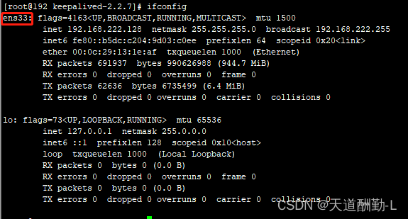

**5.修改128服务器/etc/keepalived/keepalived.conf配置文件，内容如下：**

~~~sh
! Configuration File for keepalived
 
global_defs {
   notification_email {
     acassen@firewall.loc
     failover@firewall.loc
     sysadmin@firewall.loc
   }
   notification_email_from Alexandre.Cassen@firewall.loc
   smtp_server 192.168.200.1
   smtp_connect_timeout 30
   router_id LVS_MASTER
   vrrp_skip_check_adv_addr
   vrrp_strict
   vrrp_garp_interval 0
   vrrp_gna_interval 0
}
 
vrrp_instance VI_1 {
    state MASTER
    #interface为刚才查到的本机网卡名称
    interface ens33
    #同一网段中同一组virtual_router_id值相同。不同组virtual_router_id值唯一。
    #如server-1、server-2为一组，virtual_router_id=51
    #server-3、server-4为一组，则virtual_router_id不能为51
    virtual_router_id 51
    #字数越大，优先级越高，master必须大于backup
    priority 100
    advert_int 1
    authentication {
        auth_type PASS
        auth_pass 1111
    }
    virtual_ipaddress {
       #该ip为虚拟出来的vip地址
       192.168.222.130
    }
}
 
#配置virtual_server  ip为上面配置的虚拟vip地址  端口为mysql的端口
virtual_server 192.168.222.130 3306 {
    delay_loop 6
    lb_algo rr
    lb_kind NAT
    persistence_timeout 50
    protocol TCP
    #real_server 该配置为实际物理机ip地址 以及实际物理机mysql端口
    real_server 192.168.222.128 3306 {
        #当该ip 端口连接异常时，执行该脚本
        notify_down /etc/keepalived/shutdown.sh
        TCP_CHECK {
            #实际物理机ip地址
            connect_ip 192.168.222.128
            #实际物理机port端口
            connect_port 3306
            connect_timeout 3
            nb_get_retry 3
            delay_before_retry 3
        }
    }
}
~~~

**6.修改129服务器/etc/keepalived/keepalived.conf配置文件，与128的配置不同地方为real_server、connect_ip 两个配置，需要配置对应的实际主机ip，详细内容如下：**

~~~sh
! Configuration File for keepalived
 
global_defs {
   notification_email {
     acassen@firewall.loc
     failover@firewall.loc
     sysadmin@firewall.loc
   }
   notification_email_from Alexandre.Cassen@firewall.loc
   smtp_server 192.168.200.1
   smtp_connect_timeout 30
   router_id LVS_MASTER
   vrrp_skip_check_adv_addr
   vrrp_strict
   vrrp_garp_interval 0
   vrrp_gna_interval 0
}
 
vrrp_instance VI_1 {
    state BACKUP
    #interface为刚才查到的本机网卡名称
    interface ens33
    #同一网段中同一组virtual_router_id值相同。不同组virtual_router_id值唯一。
    #如server-1、server-2为一组，virtual_router_id=51
    #server-3、server-4为一组，则virtual_router_id不能为51
    virtual_router_id 51
    #字数越大，优先级越高，master必须大于backup
    priority 90
    advert_int 1
    authentication {
        auth_type PASS
        auth_pass 1111
    }
    virtual_ipaddress {
       #该ip为虚拟出来的vip地址
       192.168.222.130
    }
}
 
#配置virtual_server  ip为上面配置的虚拟vip地址  端口为mysql的端口
virtual_server 192.168.222.130 3306 {
    delay_loop 6
    lb_algo rr
    lb_kind NAT
    persistence_timeout 50
    protocol TCP
    #real_server 该配置为实际物理机ip地址 以及实际物理机mysql端口
    real_server 192.168.222.129 3306 {
        #当该ip 端口连接异常时，执行该脚本
        notify_down /etc/keepalived/shutdown.sh
        TCP_CHECK {
            #实际物理机ip地址
            connect_ip 192.168.222.129
            #实际物理机port端口
            connect_port 3306
            connect_timeout 3
            nb_get_retry 3
            delay_before_retry 3
        }
    }
}
~~~

详细配置参考[《Keepalived 安装和配置详解》](https://blog.csdn.net/D1179869625/article/details/126198495)

**7.将128、129服务器keepalived加入开机自启，并启动服务**

~~~sh
[root@128 keepalived-2.2.7]# systemctl enable keepalived
[root@128 keepalived-2.2.7]# systemctl start keepalived
~~~

**8.启动后keepalived状态为：active(running)则正常**

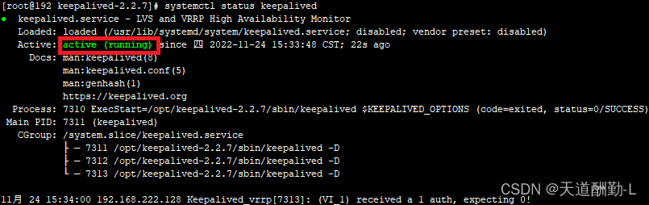

**9.启动后相当于虚拟出一个vip 192.168.222.130，可使用远程连接工具，连接该服务器，连接进去后使用ifconfig查看该虚拟vip实际上使用的实体服务器是129服务器。**

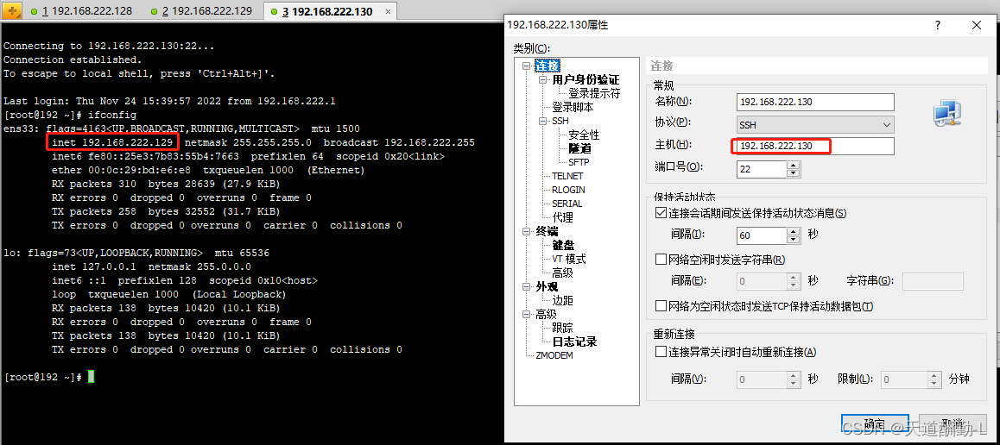

**10.将129服务器的keepalived应用停止，再次查看130服务ifconfig，可以看到，130服务器自动将实体机ip漂移到了128服务器上**

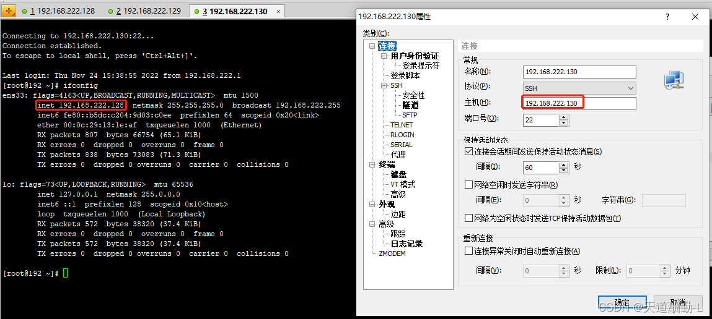

至此，keepalived部署完成。

### 五、mysql双主双活+keepalived高可用整体测试

**1.首先将128、129两台服务器mysql、keepalived应用全部启动，然后用mysql连接工具连接keepalived虚拟出来的192.168.222.130服务器**

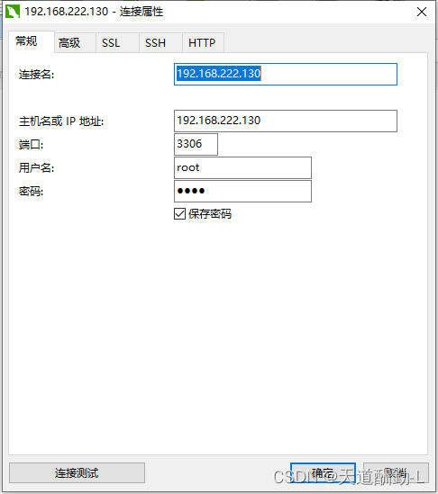

**2.再130数据库test_db库t_test表插入id=3，name='wangwu'**

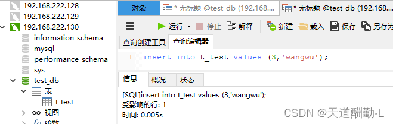

**3.此时可以查看128、129数据库，数据已同步**

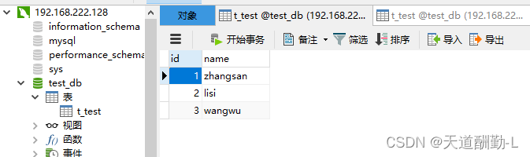

**4.查看130服务器ifconfig实际使用的物理机为128，所以128服务器mysql为主数据库。**

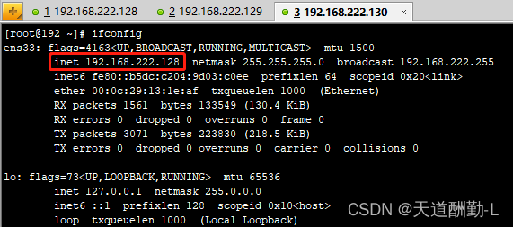

**5.此时手动将128服务器mysql停止，keepalived检测到128服务3306端口连接失败，会执行/etc/keepalived/shutdown.sh脚本，将128服务器keepalived应用结束。** 

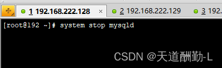

**6.此时再连接130服务下，ifconfig查看，发现已经实际将物理机由128转移到129服务器上**

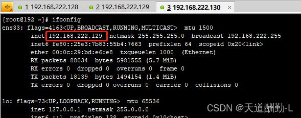

**7.再使用mysql连接工具连接130的mysql，插入一条数据id=4，name='zhaoliu'，测试是否将数据存入129服务器mysql中**

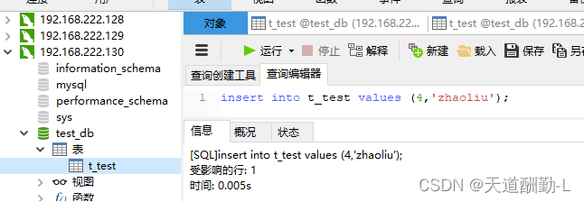

**8.查看129服务器mysql数据，数据已同步，说明keepalived搭建高可用成功，当128服务器mysql出现问题后keepalived自动漂移IP到实体机129服务器上，从而使129服务器mysql作为主数据库。**

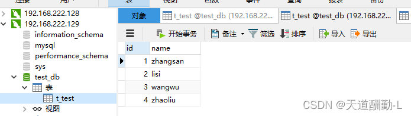

**9.此时再启动128服务器mysql、keepalived应用**

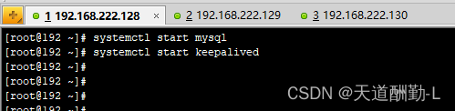

**10.查看128数据库t_test表数据，数据已同步成功。**

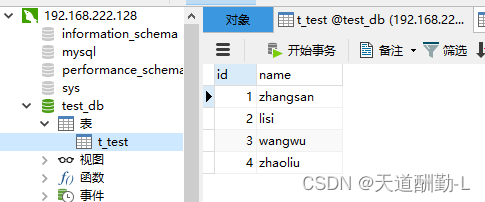

**11.如果漂移失败，可能是virtual_router_id在同网段内重复导致。可执行命令查看是否有其他ip使用**

~~~sh
[root@128 keepalived-2.2.7]# tcpdump -i 网卡名 vrrp -n |grep virtual_router_id值
#例如：
[root@128 keepalived-2.2.7]# tcpdump -i eno16777736 vrrp -n |grep 51
~~~

至此，mysql双主双活+keepalived高可用部署并测试完成。