# GitlabCI

## GitLab CI/CD简介

### GitLab 内置持续集成功能

### 持续集成 （CI）

- 集成团队中每个开发人员提交的代码到代码存储库中。
- 开发人员在Merge或者Pull请求中合并拉取新代码。
- 在提交或者合并更改到代码存储库之前，会触发了构建，测试和新代码验证的管道。
- CI可帮助您在开发周期的早期发现并减少错误

### 连续交付 （CD）

- 可通过结构化的部署管道确保将经过CI验证的代码交付给您的应用程序。
- CD可以将经过验证的代码更快地移至您的应用程序。

CI/CD 一起 可以加快团队为客户和利益相关者交付成果的速度。CI和CD必须无缝协作，以使您的团队快速有效地进行构建，并且对于确保完全优化的开发实践至关重要。

[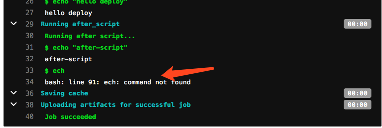](http://docs.idevops.site/gitlabci/chapter01/02/images/02.png)

------

### GitLab CI/CD优势

- 开源： CI/CD是开源GitLab社区版和专有GitLab企业版的一部分。
- 易于学习： 具有详细的入门文档。
- 无缝集成： GitLab CI / CD是GitLab的一部分，支持从计划到部署,具有出色的用户体验。
- 可扩展： 测试可以在单独的计算机上分布式运行，可以根据需要添加任意数量的计算机。
- 更快的结果： 每个构建可以拆分为多个作业，这些作业可以在多台计算机上并行运行。
- 针对交付进行了优化： 多个阶段，手动部署， 环境 和 变量。

[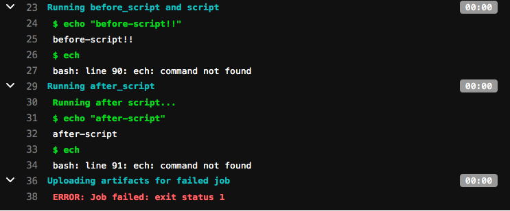](http://docs.idevops.site/gitlabci/chapter01/02/images/03.png)

------

### GitLab CI/CD特点

- 多平台： Unix，Windows，macOS和任何其他支持Go的平台上执行构建。
- 多语言： 构建脚本是命令行驱动的，并且可以与Java，PHP，Ruby，C和任何其他语言一起使用。
- 稳定构建： 构建在与GitLab不同的机器上运行。
- 并行构建： GitLab CI / CD在多台机器上拆分构建，以实现快速执行。
- 实时日志记录： 合并请求中的链接将您带到动态更新的当前构建日志。
- 灵活的管道： 您可以在每个阶段定义多个并行作业，并且可以 触发其他构建。
- 版本管道： 一个 .gitlab-ci.yml文件 包含您的测试，整个过程的步骤，使每个人都能贡献更改，并确保每个分支获得所需的管道。
- 自动缩放： 您可以 自动缩放构建机器，以确保立即处理您的构建并将成本降至最低。
- 构建工件： 您可以将二进制文件和其他构建工件上载到 GitLab并浏览和下载它们。
- Docker支持： 可以使用自定义Docker映像， 作为测试的一部分启动 服务， 构建新的Docker映像，甚至可以在Kubernetes上运行。
- 容器注册表： 内置的容器注册表， 用于存储，共享和使用容器映像。
- 受保护的变量： 在部署期间使用受每个环境保护的变量安全地存储和使用机密。
- 环境： 定义多个环境。

[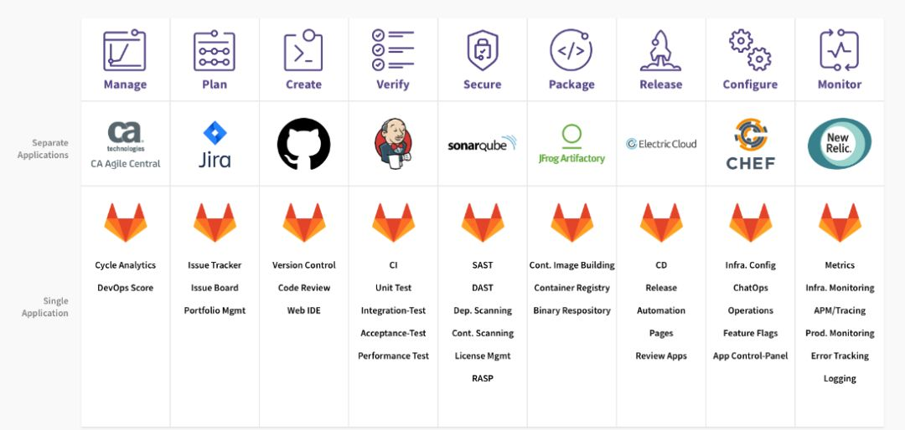](http://docs.idevops.site/gitlabci/chapter01/02/images/04.jpeg)

------

### GitLab CI/CD架构

### GitLab CI / CD

GitLab的一部分，GitLab是一个Web应用程序，具有将其状态存储在数据库中的API。 除了GitLab的所有功能之外，它还管理项目/构建并提供一个不错的用户界面。

### GitLab Runner

是一个处理构建的应用程序。 它可以单独部署，并通过API与GitLab CI / CD一起使用。

[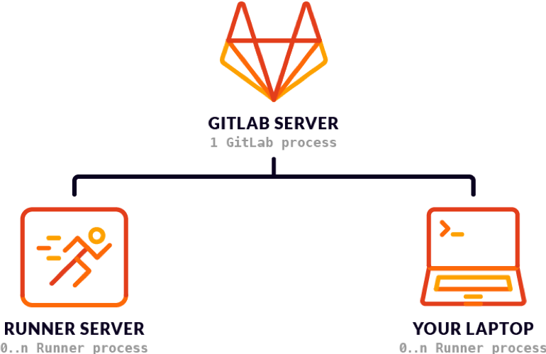](http://docs.idevops.site/gitlabci/chapter01/02/images/01.png)

### .gitlab-ci.yml

定义流水线作业运行，位于应用项目根目录下 。

[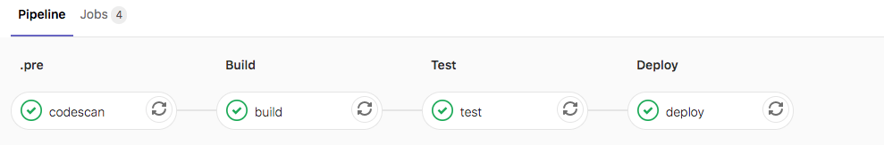](http://docs.idevops.site/gitlabci/chapter01/02/images/05.png)

**为了运行测试，至少需要一个 GitLab 实例、一个 GitLab Runner、一个gitlab-ci文件**

------

### GitLab CI/CD工作原理

- 将代码托管到Git存储库。
- 在项目根目录创建ci文件 `.gitlab-ci.yml` ，在文件中指定构建，测试和部署脚本。
- GitLab将检测到它并使用名为GitLab Runner的工具运行脚本。
- 脚本被分组为**作业**，它们共同组成了一个**管道**。

[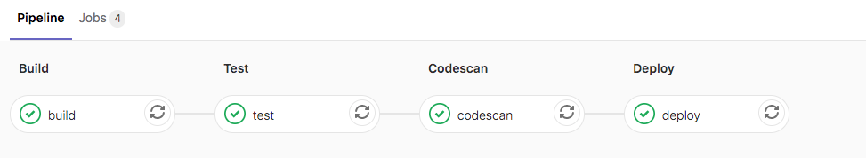](http://docs.idevops.site/gitlabci/chapter01/02/images/06.png)

管道状态也会由GitLab显示：

[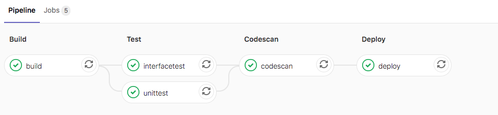](http://docs.idevops.site/gitlabci/chapter01/02/images/07.png)

最后，如果出现任何问题，可以轻松地 [回滚](https://docs.gitlab.com/12.9/ee/ci/environments.html#retrying-and-rolling-back)所有更改：

[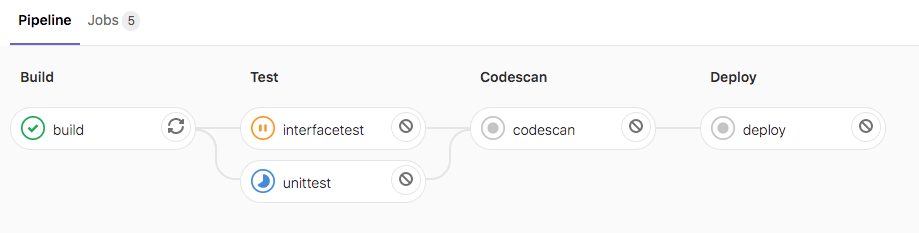](http://docs.idevops.site/gitlabci/chapter01/02/images/08.png)

## 安装

### rpm方式

源地址：https://mirrors.tuna.tsinghua.edu.cn/gitlab-ce/yum/el7/

```sh
wget https://mirrors.tuna.tsinghua.edu.cn/gitlab-ce/yum/el7/gitlab-ce-12.9.0-ce.0.el7.x86_64.rpm


rpm -ivh gitlab-ce-12.9.0-ce.0.el7.x86_64.rpm

vim /etc/gitlab.rb   # 编辑站点地址
gitlab-ctl reconfigure  # 配置


#服务控制
gitlab-ctl start 
gitlab-ctl status
gitlab-ctl stop 
```

### Docker方式

1.部署gitlab

```sh
mkdir -p /opt/data/gitlab/config /opt/data/gitlab/logs /opt/data/gitlab/data
docker pull gitlab/gitlab-ce:12.9.0-ce.0

docker run -d  -p 443:443 -p 80:80 -p 222:22 --name gitlab --restart always -v /opt/data/gitlab/config:/etc/gitlab -v /opt/data/gitlab/logs:/var/log/gitlab -v /opt/data/gitlab/data:/var/opt/gitlab gitlab/gitlab-ce:12.9.0-ce.0
```

2.修改gitlab.rb文件中的IP与端口号

vi /opt/data/gitlab/config/gitlab.rb

直接添加以下配置：

~~~sh
# 配置http协议所使用的访问地址,不加端口号默认为80
external_url 'http://192.168.200.128'

# 配置ssh协议所使用的访问地址和端口
gitlab_rails['gitlab_ssh_host'] = '192.168.200.128'
gitlab_rails['gitlab_shell_ssh_port'] = 222 # 此端口是run时22端口映射的端口
~~~

3.重启gitlab

### Kubernetes部署

文件地址： https://github.com/zeyangli/devops-on-k8s/blob/master/devops/gitlab.yaml

```yaml
---
kind: Deployment
apiVersion: apps/v1
metadata:
  labels:
    k8s-app: gitlab
  name: gitlab
  namespace: devops
spec:
  replicas: 1
  revisionHistoryLimit: 10
  selector:
    matchLabels:
      k8s-app: gitlab
  template:
    metadata:
      labels:
        k8s-app: gitlab
      namespace: devops
      name: gitlab
    spec:
      containers:
        - name: gitlab
          image: gitlab/gitlab-ce:12.6.0-ce.0
          imagePullPolicy: Always
          ports:
            - containerPort: 30088
              name: web
              protocol: TCP
            - containerPort: 22
              name: agent
              protocol: TCP
          resources:
            limits:
              cpu: 1000m
              memory: 4Gi
            requests:
              cpu: 500m
              memory: 512Mi
          livenessProbe:
            httpGet:
              path: /users/sign_in
              port: 30088
            initialDelaySeconds: 60
            timeoutSeconds: 5
            failureThreshold: 12
          readinessProbe:
            httpGet:
              path: /users/sign_in
              port: 30088
            initialDelaySeconds: 60
            timeoutSeconds: 5
            failureThreshold: 12
          volumeMounts:
            - name: gitlab-conf
              mountPath: /etc/gitlab
            - name: gitlab-log
              mountPath: /var/log/gitlab
            - name: gitlab-data
              mountPath: /var/opt/gitlab
          env:
            - name: gitlab_HOME
              value: /var/lib/gitlab
      volumes:
        - name: gitlab-conf
          hostPath: 
            path: /data/devops/gitlab/config
            type: Directory
        - name: gitlab-log
          hostPath: 
            path: /data/devops/gitlab/logs
            type: Directory
        - name: gitlab-data
          hostPath: 
            path: /data/devops/gitlab/data
            type: Directory
      serviceAccountName: gitlab
---
apiVersion: v1
kind: ServiceAccount
metadata:
  labels:
    k8s-app: gitlab
  name: gitlab
  namespace: devops
---
kind: Service
apiVersion: v1
metadata:
  labels:
    k8s-app: gitlab
  name: gitlab
  namespace: devops
spec:
  type: NodePort
  ports:
    - name: web
      port: 30088
      targetPort: 30088
      nodePort: 30088
    - name: slave
      port: 22
      targetPort: 22
      nodePort: 30022
  selector:
    k8s-app: gitlab
---
kind: Role
apiVersion: rbac.authorization.k8s.io/v1beta1
metadata:
 name: gitlab
 namespace: devops
rules:
 - apiGroups: [""]
   resources: ["pods"]
   verbs: ["create","delete","get","list","patch","update","watch"]
 - apiGroups: [""]
   resources: ["pods/exec"]
   verbs: ["create","delete","get","list","patch","update","watch"]
 - apiGroups: [""]
   resources: ["pods/log"]
   verbs: ["get","list","watch"]
 - apiGroups: [""]
   resources: ["secrets"]
   verbs: ["get"]
---
apiVersion: rbac.authorization.k8s.io/v1beta1
kind: RoleBinding
metadata:
 name: gitlab
 namespace: devops
roleRef:
 apiGroup: rbac.authorization.k8s.io
 kind: Role
 name: gitlab
subjects:
 - kind: ServiceAccount
   name: gitlab
   namespace: devops
kubectl create -f gitlab.yaml
kubectl delete -f gitlab.yaml
```

注意： 需要修改gitlab.rb配置文件中的站点地址。这里指定的端口是30088（不是必须的）也就是需要将gitlab.rb配置的地址改成30088和nodePort端口为30088。

为什么端口要改成一致的？如果不修改gitlab.rb中的站点地址则默认是80端口，这时候做nodePort的时候例如将80映射到30088，此时对外访问30088可以打开gitlab页面，但是下载代码的时候会发现地址为80端口，导致下载代码失败。所以这里强调一致哦。

```sh
external-url-for-gitlab
external_url 'http://192.168.1.200:30088'
```

`gitlab管理员账号为root`

# GitlabRunner

GitLab Runner是一个开源项目，用于运行您的作业并将结果发送回GitLab。它与[GitLab CI](https://about.gitlab.com/product/continuous-integration/)结合使用，[GitLab CI](https://about.gitlab.com/product/continuous-integration/)是[GitLab](https://about.gitlab.com/product/continuous-integration/)随附的用于协调作业的开源持续集成服务。

## 安装

### Docker安装

1.创建gitlab-runner容器

~~~sh
mkdir -p /opt/data/gitlab-runner/config
docker run -d -v /opt/data/gitlab-runner/config:/etc/gitlab-runner gitlab/gitlab-runner:v12.6.0 
~~~

2.注册

~~~sh
docker exec -it [容器id/name] gitlab-runner register
~~~

根据提示填入信息：

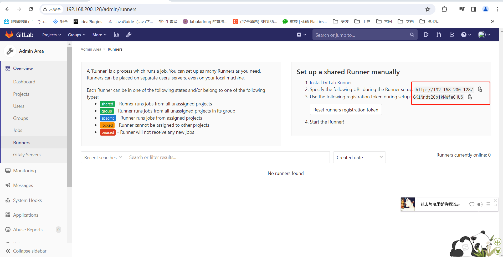

~~~groovy
Runtime platform                                    arch=amd64 os=linux pid=6 revision=ac8e767a version=12.6.0
Running in system-mode.

Please enter the gitlab-ci coordinator URL (e.g. https://gitlab.com/):
http://192.168.1.105
Please enter the gitlab-ci token for this runner:
4tutaeWWL3srNEcmHs1s
Please enter the gitlab-ci description for this runner:
[00e4f023b5ae]: devops-service-runner
Please enter the gitlab-ci tags for this runner (comma separated):
build
Registering runner... succeeded                     runner=4tutaeWW
Please enter the executor: parallels, virtualbox, docker-ssh+machine, kubernetes, docker+machine, custom, docker, docker-ssh, shell, ssh:
shell
Runner registered successfully. Feel free to start it, but if it's running already the config should be automatically reloaded!
~~~

3.重启gitlab-runner

~~~sh
docker restart [容器id/name]
~~~

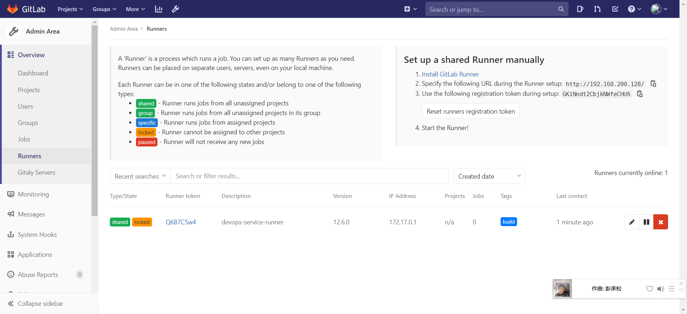

## GitLabRunner命令

GitLab Runner包含一组命令，可用于注册，管理和运行构建。

### 启动命令

```sh
gitlab-runner --debug <command>   #调试模式排查错误特别有用。
gitlab-runner <command> --help    #获取帮助信息
gitlab-runner run       #普通用户模式  配置文件位置 ~/.gitlab-runner/config.toml
sudo gitlab-runner run  # 超级用户模式  配置文件位置/etc/gitlab-runner/config.toml
```

### 注册命令

```sh
gitlab-runner register  #默认交互模式下使用，非交互模式添加 --non-interactive
gitlab-runner list      #此命令列出了保存在配置文件中的所有运行程序
gitlab-runner verify    #此命令检查注册的runner是否可以连接，但不验证GitLab服务是否正在使用runner。 --delete 删除
gitlab-runner unregister   #该命令使用GitLab取消已注册的runner。


#使用令牌注销
gitlab-runner unregister --url http://gitlab.example.com/ --token t0k3n

#使用名称注销（同名删除第一个）
gitlab-runner unregister --name test-runner

#注销所有
gitlab-runner unregister --all-runners
```

### 服务管理

```sh
gitlab-runner install --user=gitlab-runner --working-directory=/home/gitlab-runner

# --user指定将用于执行构建的用户
#`--working-directory  指定将使用**Shell** executor 运行构建时所有数据将存储在其中的根目录

gitlab-runner uninstall #该命令停止运行并从服务中卸载GitLab Runner。

gitlab-runner start     #该命令启动GitLab Runner服务。

gitlab-runner stop      #该命令停止GitLab Runner服务。

gitlab-runner restart   #该命令将停止，然后启动GitLab Runner服务。

gitlab-runner status #此命令显示GitLab Runner服务的状态。当服务正在运行时，退出代码为零；而当服务未运行时，退出代码为非零。
```

# pipeline 语法

## job/script/before_script/after_script/stages/stage/variables

### job

在每个项目中，我们使用名为`.gitlab-ci.yml`的YAML文件配置GitLab CI / CD 管道。

这里在pipeline中定义了两个作业，每个作业运行不同的命令。命令可以是shell或脚本。

```
job1:
  script: "execute-script-for-job1"

job2:
  script: "execute-script-for-job2"
```

- 可以定义一个或多个作业(job)。
- 每个作业必须具有唯一的名称（不能使用关键字）。
- 每个作业是独立执行的。
- 每个作业至少要包含一个script。

------

### script

```
job:
  script:
    - uname -a
    - bundle exec rspec
```

**注意：**有时， `script`命令将需要用单引号或双引号引起来. 例如，包含冒号命令（ `:` ）需要加引号，以便被包裹的YAML解析器知道来解释整个事情作为一个字符串，而不是一个"键：值"对. 使用特殊字符时要小心： `:` ， `{` ， `}` ， `[` ， `]` ， `,` ， `&` ， `*` ， `#` ， `?` ， `|` ， `-` ， `<` ， `>` ， `=` `!` ， `%` ， `@` .

------

### before_script

用于定义一个命令，该命令在每个作业之前运行。必须是一个数组。指定的`script`与主脚本中指定的任何脚本串联在一起，并在单个shell中一起执行。

### after_script

用于定义将在每个作业（包括失败的作业）之后运行的命令。这必须是一个数组。指定的脚本在新的shell中执行，与任何`before_script`或`script`脚本分开。

可以在全局定义，也可以在job中定义。在job中定义会覆盖全局。

```
before_script:
  - echo "before-script!!"

variables:
  DOMAIN: example.com

stages:
  - build
  - deploy
 

build:
  before_script:
    - echo "before-script in job"
  stage: build
  script:
    - echo "mvn clean "
    - echo "mvn install"
  after_script:
    - echo "after script in job"


deploy:
  stage: deploy
  script:
    - echo "hello deploy"
    
after_script:
  - echo "after-script"
```

after_script失败不会影响作业失败。

[](http://docs.idevops.site/gitlabci/chapter03/01/images/02.png)

before_script失败导致整个作业失败，其他作业将不再执行。作业失败不会影响after_script运行。

[](http://docs.idevops.site/gitlabci/chapter03/01/images/03.png)

------

### stages

用于定义作业可以使用的阶段，并且是全局定义的。同一阶段的作业并行运行，不同阶段按顺序执行。

```
stages：
  - build
  - test
  - deploy
```

这里定义了三个阶段，首先build阶段并行运行，然后test阶段并行运行，最后deploy阶段并行运行。deploy阶段运行成功后将提交状态标记为passed状态。如果任何一个阶段运行失败，最后提交状态为failed。

**未定义stages**

全局定义的stages是来自于每个job。如果job没有定义stage则默认是test阶段。如果全局未定义stages,则按顺序运行 build,test,deploy。

[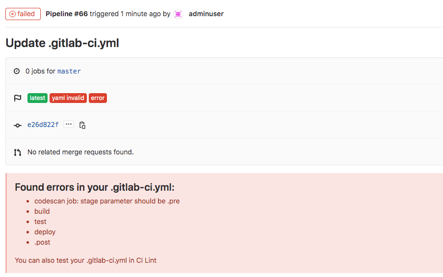](http://docs.idevops.site/gitlabci/chapter03/01/images/04.png)

如果作业中定义了其他阶段，例如"codescan"则会出现错误。原因是因为除了build test deploy阶段外的其他阶段作为.pre运行（也就是作为第一个阶段运行，需要将此作业的stage指定为.pre）。

[](http://docs.idevops.site/gitlabci/chapter03/01/images/05.png)

```
codescan:
  stage: .pre
  script:
    - echo "codescan"
```

**定义stages控制stage运行顺序**

一个标准的yaml文件中是需要定义stages，可以帮助我们对每个stage进行排序。

```
stages:
  - build
  - test
  - codescan
  - deploy
```

[](http://docs.idevops.site/gitlabci/chapter03/01/images/06.png)

### .pre & .post

.pre始终是整个管道的第一个运行阶段，.post始终是整个管道的最后一个运行阶段。 用户定义的阶段都在两者之间运行。`.pre`和`.post`的顺序无法更改。如果管道仅包含`.pre`或`.post`阶段的作业，则不会创建管道。

[](http://docs.idevops.site/gitlabci/chapter03/01/images/05.png)

------

### stage

是按JOB定义的，并且依赖于全局定义的[`stages`](http://s0docs0gitlab0com.icopy.site/12.9/ee/ci/yaml/README.html#stages) 。 它允许将作业分为不同的阶段，并且同一`stage`作业可以并行执行（取决于[特定条件](http://s0docs0gitlab0com.icopy.site/12.9/ee/ci/yaml/README.html#using-your-own-runners) ）。

```
unittest:
  stage: test
  script:
    - echo "run test"
    
interfacetest:
  stage: test
  script:
    - echo "run test"
```

[](http://docs.idevops.site/gitlabci/chapter03/01/images/07.png)

可能遇到的问题： 阶段并没有并行运行。

在这里我把这两个阶段在同一个runner运行了，所以需要修改runner每次运行的作业数量。默认是1，改为10.

[](http://docs.idevops.site/gitlabci/chapter03/01/images/08.png)

vim /etc/gitlab-runner/config.toml 更改后自动加载无需重启。

```
concurrent = 10
```

------

### variables

定义变量，pipeline变量、job变量、Runner变量。job变量优先级最大。

------

### 综合实例

综合实例:

```
before_script:
  - echo "before-script!!"

variables:
  DOMAIN: example.com
  
stages:
  - build
  - test
  - codescan
  - deploy

build:
  before_script:
    - echo "before-script in job"
  stage: build
  script:
    - echo "mvn clean "
    - echo "mvn install"
    - echo "$DOMAIN"
  after_script:
    - echo "after script in buildjob"

unittest:
  stage: test
  script:
    - echo "run test"

deploy:
  stage: deploy
  script:
    - echo "hello deploy"
    - sleep 2;
  
codescan:
  stage: codescan
  script:
    - echo "codescan"
    - sleep 5;
 
after_script:
  - echo "after-script"
  - ech
```

实验效果

[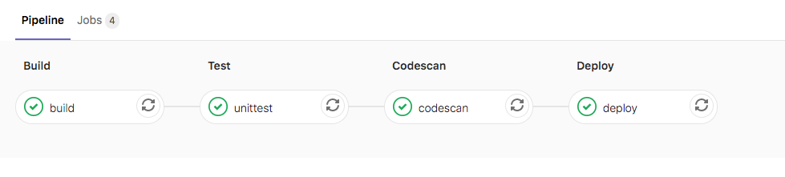](http://docs.idevops.site/gitlabci/chapter03/01/images/17.png)

可能遇到的问题： pipeline卡主,为降低复杂性目前没有学习tags，所以流水线是在共享的runner中运行的。需要设置共享的runner运行没有tag的作业。

[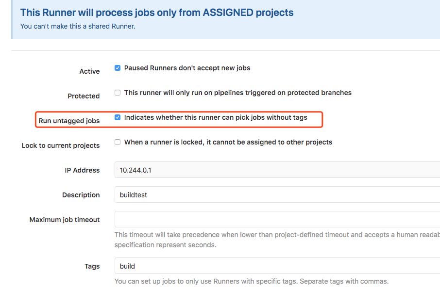](http://docs.idevops.site/gitlabci/chapter03/01/images/18.png)

## tags/allow_failure/when/retry/timeout/parallel

### tags

用于从允许运行该项目的所有Runner列表中选择特定的Runner,在Runner注册期间，您可以指定Runner的标签。

`tags`可让您使用指定了标签的runner来运行作业,此runner具有ruby和postgres标签。

```
job:
  tags:
    - ruby
    - postgres
```

给定带有`osx`标签的OS X Runner和带有`windows`标签的Windows Runner，以下作业将在各自的平台上运行。

```
windows job:
  stage:
    - build
  tags:
    - windows
  script:
    - echo Hello, %USERNAME%!

osx job:
  stage:
    - build
  tags:
    - osx
  script:
    - echo "Hello, $USER!"
```

[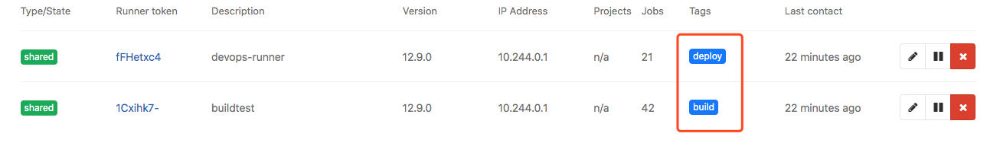](http://docs.idevops.site/gitlabci/chapter03/01/images/09.png)

------

### allow_failure

`allow_failure`允许作业失败，默认值为`false` 。启用后，如果作业失败，该作业将在用户界面中显示橙色警告. 但是，管道的逻辑流程将认为作业成功/通过，并且不会被阻塞。 假设所有其他作业均成功，则该作业的阶段及其管道将显示相同的橙色警告。但是，关联的提交将被标记为"通过”，而不会发出警告。

```
job1:
  stage: test
  script:
    - execute_script_that_will_fail
  allow_failure: true
```

[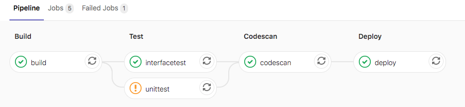](http://docs.idevops.site/gitlabci/chapter03/01/images/10.png)

------

### when

`on_success`前面阶段中的所有作业都成功（或由于标记为`allow_failure`而被视为成功）时才执行作业。 这是默认值。

`on_failure`当前面阶段出现失败则执行。

`always` -执行作业，而不管先前阶段的作业状态如何，放到最后执行。总是执行。

#### manual 手动

`manual` -手动执行作业,不会自动执行，需要由用户显式启动. 手动操作的示例用法是部署到生产环境. 可以从管道，作业，环境和部署视图开始手动操作。

此时在deploy阶段添加manual，则流水线运行到deploy阶段为锁定状态，需要手动点击按钮才能运行deploy阶段。

[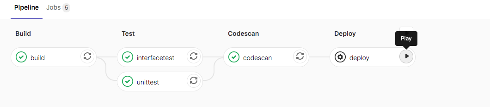](http://docs.idevops.site/gitlabci/chapter03/01/images/11.png)

#### delayed 延迟

`delayed` 延迟一定时间后执行作业（在GitLab 11.14中已添加）。

有效值`'5',10 seconds,30 minutes, 1 day, 1 week` 。

[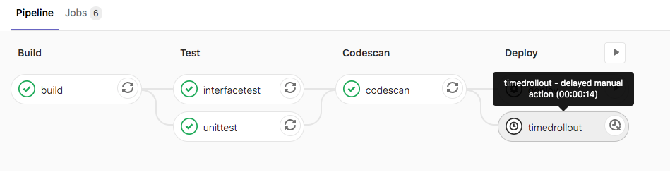](http://docs.idevops.site/gitlabci/chapter03/01/images/12.png)

实验demo

```
before_script:
  - echo "before-script!!"

variables:
  DOMAIN: example.com
  
stages:
  - build
  - test
  - codescan
  - deploy

build:
  before_script:
    - echo "before-script in job"
  stage: build
  script:
    - echo "mvn clean "
    - echo "mvn install"
    - echo "$DOMAIN"
  after_script:
    - echo "after script in buildjob"

unittest:
  stage: test
  script:
    - ech "run test"
  when: delayed
  start_in: '30'
  allow_failure: true
  

deploy:
  stage: deploy
  script:
    - echo "hello deploy"
    - sleep 2;
  when: manual
  
codescan:
  stage: codescan
  script:
    - echo "codescan"
    - sleep 5;
  when: on_success
 
after_script:
  - echo "after-script"
  - ech
  
```

------

### retry

配置在失败的情况下重试作业的次数。

当作业失败并配置了`retry` ，将再次处理该作业，直到达到`retry`关键字指定的次数。如果`retry`设置为2，并且作业在第二次运行成功（第一次重试），则不会再次重试. `retry`值必须是一个正整数，等于或大于0，但小于或等于2（最多两次重试，总共运行3次）.

```
unittest:
  stage: test
  retry: 2
  script:
    - ech "run test"
```

[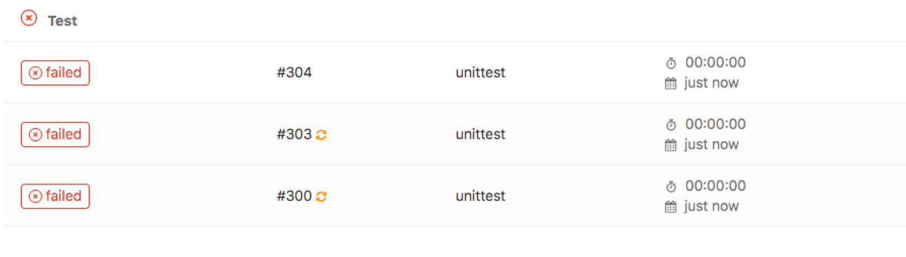](http://docs.idevops.site/gitlabci/chapter03/01/images/19.png)

默认情况下，将在所有失败情况下重试作业。为了更好地控制`retry`哪些失败，可以是具有以下键的哈希值：

- `max` ：最大重试次数.
- `when` ：重试失败的案例.

根据错误原因设置重试的次数。

```
always ：在发生任何故障时重试（默认）.
unknown_failure ：当失败原因未知时。
script_failure ：脚本失败时重试。
api_failure ：API失败重试。
stuck_or_timeout_failure ：作业卡住或超时时。
runner_system_failure ：运行系统发生故障。
missing_dependency_failure: 如果依赖丢失。
runner_unsupported ：Runner不受支持。
stale_schedule ：无法执行延迟的作业。
job_execution_timeout ：脚本超出了为作业设置的最大执行时间。
archived_failure ：作业已存档且无法运行。
unmet_prerequisites ：作业未能完成先决条件任务。
scheduler_failure ：调度程序未能将作业分配给运行scheduler_failure。
data_integrity_failure ：检测到结构完整性问题。
```

### 实验

定义当出现脚本错误重试两次，也就是会运行三次。

```
unittest:
  stage: test
  tags:
    - build
  only:
    - master
  script:
    - ech "run test"
  retry:
    max: 2
    when:
      - script_failure
```

效果

[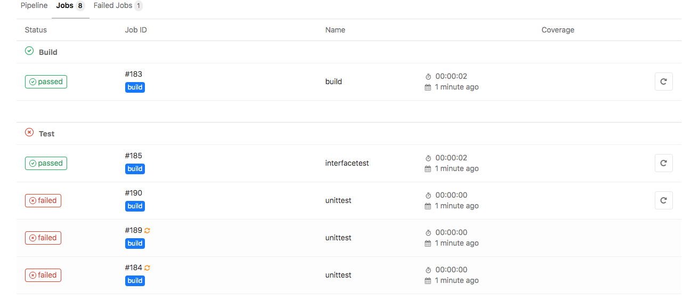](http://docs.idevops.site/gitlabci/chapter03/01/images/13.png)

------

### timeout 超时

特定作业配置超时，作业级别的超时可以超过[项目级别的超时，](http://s0docs0gitlab0com.icopy.site/12.9/ee/ci/pipelines/settings.html#timeout)但不能超过Runner特定的超时。

```
build:
  script: build.sh
  timeout: 3 hours 30 minutes

test:
  script: rspec
  timeout: 3h 30m
```

#### 项目设置流水线超时时间

超时定义了作业可以运行的最长时间（以分钟为单位）。 这可以在项目的**“设置">” CI / CD">"常规管道"设置下进行配置** 。 默认值为60分钟。

[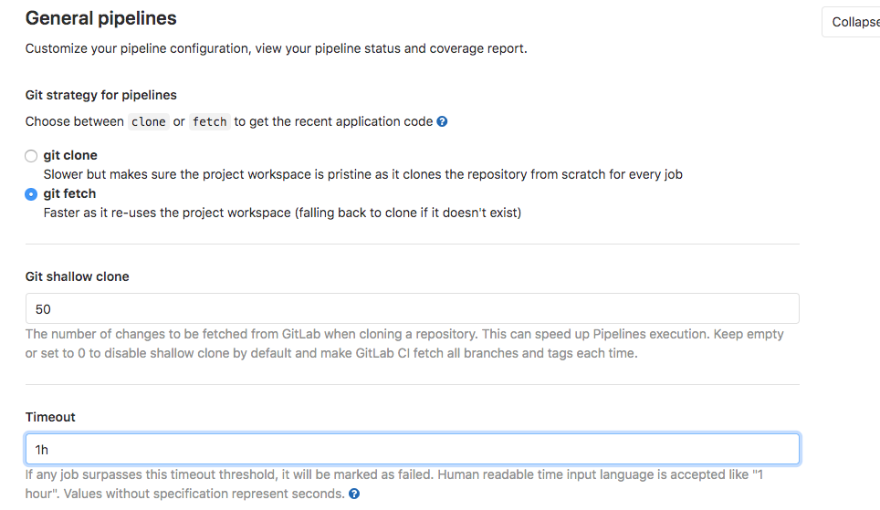](http://docs.idevops.site/gitlabci/chapter03/01/images/14.png)

#### runner超时时间

此类超时（如果小于[项目定义的超时](http://s0docs0gitlab0com.icopy.site/12.9/ee/ci/pipelines/settings.html#timeout) ）将具有优先权。此功能可用于通过设置大超时（例如一个星期）来防止Shared Runner被项目占用。未配置时，Runner将不会覆盖项目超时。

[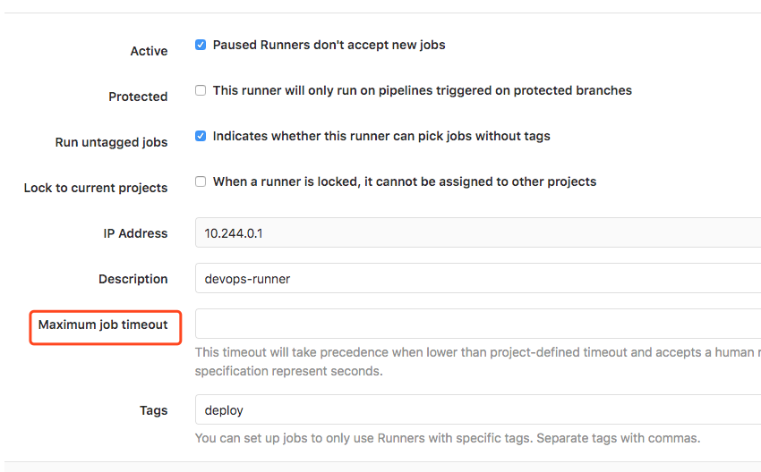](http://docs.idevops.site/gitlabci/chapter03/01/images/15.png)

此功能如何工作：

**示例1-运行程序超时大于项目超时**

runner超时设置为24小时，项目的CI / CD超时设置为2小时。该工作将在2小时后超时。

**示例2-未配置运行程序超时**

runner不设置超时时间，项目的CI / CD超时设置为2小时。该工作将在2小时后超时。

**示例3-运行程序超时小于项目超时**

runner超时设置为30分钟，项目的CI / CD超时设置为2小时。工作在30分钟后将超时

------

### parallel

配置要并行运行的作业实例数,此值必须大于或等于2并且小于或等于50。

这将创建N个并行运行的同一作业实例. 它们从`job_name 1/N`到`job_name N/N`依次命名。

```
codescan:
  stage: codescan
  tags:
    - build
  only:
    - master
  script:
    - echo "codescan"
    - sleep 5;
  parallel: 5
```

[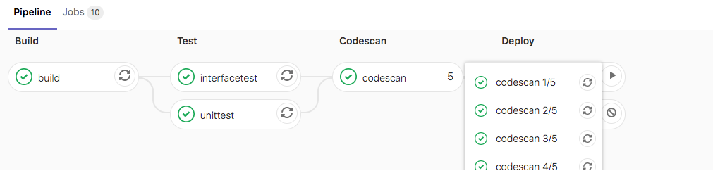](http://docs.idevops.site/gitlabci/chapter03/01/images/16.png)

------

### 综合实例

```
before_script:
  - echo "before-script!!"

variables:
  DOMAIN: example.com
  
stages:
  - build
  - test
  - codescan
  - deploy

build:
  before_script:
    - echo "before-script in job"
  stage: build
  script:
    - echo "mvn clean "
    - echo "mvn install"
    - echo "$DOMAIN"
  after_script:
    - echo "after script in buildjob"

unittest:
  stage: test
  script:
    - ech "run test"
  when: delayed
  start_in: '5'
  allow_failure: true
  retry:
    max: 1
    when:
      - script_failure
  timeout: 1 hours 10 minutes
  
  

deploy:
  stage: deploy
  script:
    - echo "hello deploy"
    - sleep 2;
  when: manual
  
codescan:
  stage: codescan
  script:
    - echo "codescan"
    - sleep 5;
  when: on_success
  parallel: 5
 
after_script:
  - echo "after-script"
  - ech
```

## only/except/rules/workflow

### only & except

only和except是两个参数用分支策略来限制jobs构建：

1. `only`定义哪些分支和标签的git项目将会被job执行。
2. `except`定义哪些分支和标签的git项目将不会被job执行。

```
job:
  # use regexp
  only:
    - /^issue-.*$/
  # use special keyword
  except:
    - branches
```

------

### rules

`rules`允许*按顺序*评估单个规则对象的列表，直到一个匹配并为作业动态提供属性. 请注意， `rules`不能`only/except`与`only/except`组合使用。

可用的规则条款包括：

- [`if`](http://s0docs0gitlab0com.icopy.site/12.9/ee/ci/yaml/README.html#rulesif) （类似于[`only:variables`](http://s0docs0gitlab0com.icopy.site/12.9/ee/ci/yaml/README.html#onlyvariablesexceptvariables) ）
- [`changes`](http://s0docs0gitlab0com.icopy.site/12.9/ee/ci/yaml/README.html#ruleschanges) （ [`only:changes`](http://s0docs0gitlab0com.icopy.site/12.9/ee/ci/yaml/README.html#onlychangesexceptchanges)相同）
- [`exists`](http://s0docs0gitlab0com.icopy.site/12.9/ee/ci/yaml/README.html#rulesexists)

#### rules:if

如果`DOMAIN`的值匹配，则需要手动运行。不匹配`on_success`。 条件判断从上到下，匹配即停止。多条件匹配可以使用`&& ||`

```
variables:
  DOMAIN: example.com

codescan:
  stage: codescan
  tags:
    - build
  script:
    - echo "codescan"
    - sleep 5;
  #parallel: 5
  rules:
    - if: '$DOMAIN == "example.com"'
      when: manual
    - when: on_success
```

#### rules:changes

接受文件路径数组。 如果提交中`Jenkinsfile`文件发生的变化则为true。

```
codescan:
  stage: codescan
  tags:
    - build
  script:
    - echo "codescan"
    - sleep 5;
  #parallel: 5
  rules:
    - changes:
      - Jenkinsfile
      when: manual
    - if: '$DOMAIN == "example.com"'
      when: on_success
    - when: on_success
```

#### rules:exists

接受文件路径数组。当仓库中存在指定的文件时操作。

```
codescan:
  stage: codescan
  tags:
    - build
  script:
    - echo "codescan"
    - sleep 5;
  #parallel: 5
  rules:
    - exists:
      - Jenkinsfile
      when: manual 
    - changes:
      - Jenkinsfile
      when: on_success
    - if: '$DOMAIN == "example.com"'
      when: on_success
    - when: on_success
```

#### rules:allow_failure

使用[`allow_failure: true`](http://s0docs0gitlab0com.icopy.site/12.9/ee/ci/yaml/README.html#allow_failure) `rules:`在不停止管道本身的情况下允许作业失败或手动作业等待操作.

```
job:
  script: "echo Hello, Rules!"
  rules:
    - if: '$CI_MERGE_REQUEST_TARGET_BRANCH_NAME == "master"'
      when: manual
      allow_failure: true
```

在此示例中，如果第一个规则匹配，则作业将具有以下`when: manual`和`allow_failure: true`。

------

### workflow:rules

顶级`workflow:`关键字适用于整个管道，并将确定是否创建管道。[`when`](http://s0docs0gitlab0com.icopy.site/12.9/ee/ci/yaml/README.html#when) ：可以设置为`always`或`never` . 如果未提供，则默认值`always`。

```
variables:
  DOMAIN: example.com

workflow:
  rules:
    - if: '$DOMAIN == "example.com"'
    - when: always
```

------

### 综合实例

```
before_script:
  - echo "before-script!!"

variables:
  DOMAIN: example.com
  
workflow:
  rules:
    - if: '$DOMAIN == "example.com"'
      when: always
    - when: never
    
stages:
  - build
  - test
  - codescan
  - deploy

build:
  before_script:
    - echo "before-script in job"
  stage: build
  script:
    - echo "mvn clean "
    - echo "mvn install"
    - ech "$DOMAIN"
  after_script:
    - echo "after script in buildjob"
  rules:
    - exists:
      - Dockerfile
      when: on_success 
      allow_failure: true

    - changes:
      - Dockerfile
      when: manual
    - when: on_failure

unittest:
  stage: test
  script:
    - ech "run test"
  when: delayed
  start_in: '5'
  allow_failure: true
  retry:
    max: 1
    when:
      - script_failure
  timeout: 1 hours 10 minutes
  
  

deploy:
  stage: deploy
  script:
    - echo "hello deploy"
    - sleep 2;
  rules:
    - if: '$DOMAIN == "example.com"'
      when: manual
    - if: '$DOMAIN == "aexample.com"'
      when: delayed
      start_in: '5'
    - when: on_failure
  
codescan:
  stage: codescan
  script:
    - echo "codescan"
    - sleep 5;
  when: on_success
  parallel: 5
 
after_script:
  - echo "after-script"
  - ech
```

## cache 缓存

用来指定需要在job之间缓存的文件或目录。只能使用该项目工作空间内的路径。不要使用缓存在阶段之间传递工件，因为缓存旨在存储编译项目所需的运行时依赖项。

如果在job范围之外定义了`cache` ，则意味着它是全局设置，所有job都将使用该定义。如果未全局定义或未按job定义则禁用该功能。

### cache:paths

使用`paths`指令选择要缓存的文件或目录，路径是相对于项目目录，不能直接链接到项目目录之外。

`$CI_PROJECT_DIR` 项目目录

在job build中定义缓存，将会缓存target目录下的所有.jar文件。

```
build:
  script: test
  cache:
    paths:
      - target/*.jar
```

当在全局定义了cache:paths会被job中覆盖。以下实例将缓存binaries目录。

```
cache:
  paths:
    - my/files

build:
  script: echo "hello"
  cache:
    key: build
    paths:
      - target/
```

由于缓存是在job之间共享的，如果不同的job使用不同的路径就出现了缓存覆盖的问题。如何让不同的job缓存不同的cache呢？设置不同的`cache:key`。

------

### cache:key 缓存标记

为缓存做个标记，可以配置job、分支为key来实现分支、作业特定的缓存。为不同 job 定义了不同的 `cache:key` 时， 会为每个 job 分配一个独立的 cache。cache:key`变量可以使用任何预定义变量，默认`default ，从GitLab 9.0开始，默认情况下所有内容都在管道和作业之间共享。

按照分支设置缓存

```
cache:
  key: ${CI_COMMIT_REF_SLUG}
```

files： 文件发生变化自动重新生成缓存(files最多指定两个文件)，提交的时候检查指定的文件。

根据指定的文件生成密钥计算SHA校验和，如果文件未改变值为default。

```
cache:
  key:
    files:
      - Gemfile.lock
      - package.json
  paths:
    - vendor/ruby
    - node_modules
```

prefix: 允许给定prefix的值与指定文件生成的秘钥组合。

在这里定义了全局的cache，如果文件发生变化则值为 rspec-xxx111111111222222 ，未发生变化为rspec-default。

```
cache:
  key:
    files:
      - Gemfile.lock
    prefix: ${CI_JOB_NAME}
  paths:
    - vendor/ruby

rspec:
  script:
    - bundle exec rspec
```

例如，添加`$CI_JOB_NAME` `prefix`将使密钥看起来像： `rspec-feef9576d21ee9b6a32e30c5c79d0a0ceb68d1e5` ，并且作业缓存在不同分支之间共享，如果分支更改了`Gemfile.lock` ，则该分支将为`cache:key:files`具有新的SHA校验和. 将生成一个新的缓存密钥，并为该密钥创建一个新的缓存. 如果`Gemfile.lock`未发生变化 ，则将前缀添加`default` ，因此示例中的键为`rspec-default` 。

------

### cache:policy 策略

默认：在执行开始时下载文件，并在结束时重新上传文件。称为” `pull-push`缓存策略.

`policy: pull` 跳过下载步骤

`policy: push` 跳过上传步骤

```
stages:
  - setup
  - test

prepare:
  stage: setup
  cache:
    key: gems
    paths:
      - vendor/bundle
  script:
    - bundle install --deployment

rspec:
  stage: test
  cache:
    key: gems
    paths:
      - vendor/bundle
    policy: pull
  script:
    - bundle exec rspec ...
```

------

### 综合实例(一) 全局缓存

```
before_script:
  - echo "before-script!!"

variables:
  DOMAIN: example.com

cache: 
  paths:
   - target/

stages:
  - build
  - test
  - deploy
  
build:
  before_script:
    - echo "before-script in job"
  stage: build
  tags:
    - build
  only:
    - master
  script:
    - ls
    - id
    - mvn clean package -DskipTests
    - ls target
    - echo "$DOMAIN"
    - false && true ; exit_code=$?
    - if [ $exit_code -ne 0 ]; then echo "Previous command failed"; fi;
    - sleep 2;
  after_script:
    - echo "after script in job"


unittest:
  stage: test
  tags:
    - build
  only:
    - master
  script:
    - echo "run test"
    - echo 'test' >> target/a.txt
    - ls target
  retry:
    max: 2
    when:
      - script_failure
  
deploy:
  stage: deploy
  tags:
    - build
  only:
    - master
  script:
    - echo "run deploy"
    - ls target
  retry:
    max: 2
    when:
      - script_failure
      

after_script:
  - echo "after-script"
```

------

Pipeline日志分析

build作业运行时会对项目代码打包，然后生成target目录。作业结束创建缓存。

[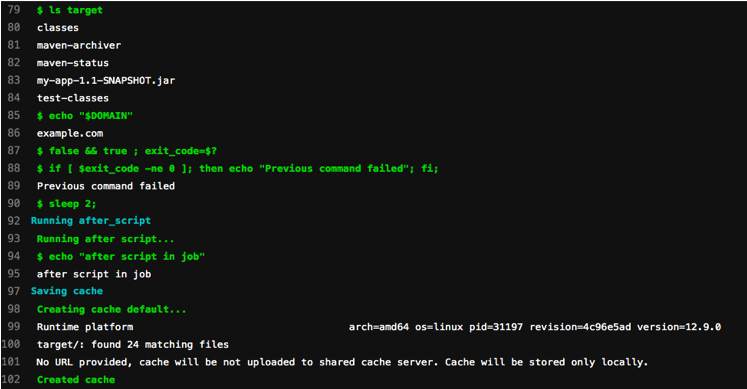](http://docs.idevops.site/gitlabci/chapter03/01/images/20.png)

开始第二个作业test，此时会把当前目录中的target目录删除掉（因为做了git 对比）。

[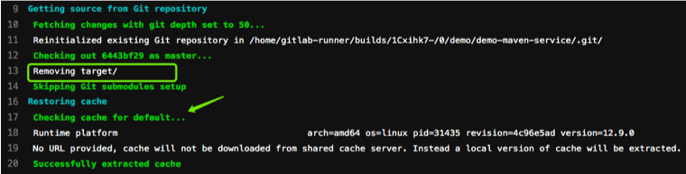](http://docs.idevops.site/gitlabci/chapter03/01/images/22.png)

获取到第一个作业生成的缓存target目录。

[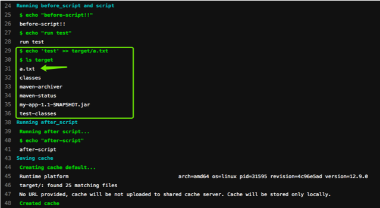](http://docs.idevops.site/gitlabci/chapter03/01/images/21.png)

开始第三个作业，同样先删除了target目录，然后获取了第二个作业的缓存。最后生成了当前的缓存。

[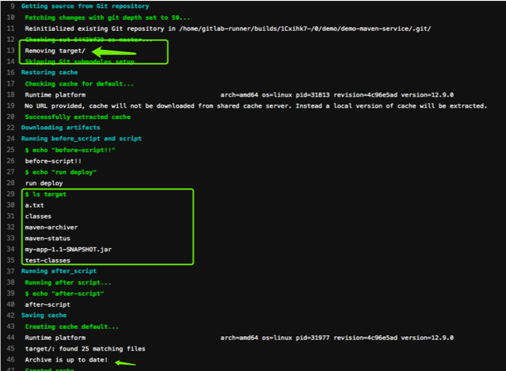](http://docs.idevops.site/gitlabci/chapter03/01/images/23.png)

------

Runner缓存

在做本次实验的时候我现在本地runner清除了项目的工作目录和历史缓存。

```
[root@zeyang-nuc-service ~]# cd /home/gitlab-runner/builds/1Cxihk7-/0/demo/demo-maven-service/
[root@zeyang-nuc-service demo-maven-service]# ls
Jenkinsfile  README.md  aaaaa  jenkins  pom.xml  src  target
[root@zeyang-nuc-service demo-maven-service]# cd ..
[root@zeyang-nuc-service demo]# ls
demo-maven-service  demo-maven-service.tmp
[root@zeyang-nuc-service demo]# rm -fr demo-maven-service
[root@zeyang-nuc-service demo]# rm -fr demo-maven-service.tmp/
[root@zeyang-nuc-service demo]# cd
[root@zeyang-nuc-service ~]# cd /home/gitlab-runner/cache/
[root@zeyang-nuc-service cache]# ls
demo
[root@zeyang-nuc-service cache]# rm -rf *
```

项目代码默认不会删除，可以发现是第二次作业的缓存。（因为上面的例子中第三次作业并没有修改缓存内容）

```
[root@zeyang-nuc-service cache]# cd /home/gitlab-runner/builds/1Cxihk7-/0/demo/demo-maven-service/
[root@zeyang-nuc-service demo-maven-service]# ls
Jenkinsfile  README.md  aaaaa  jenkins  pom.xml  src  target
[root@zeyang-nuc-service demo-maven-service]# cd ..
[root@zeyang-nuc-service demo]# ls
demo-maven-service  demo-maven-service.tmp
[root@zeyang-nuc-service demo]# rm -fr *
[root@zeyang-nuc-service demo]# ls
[root@zeyang-nuc-service demo]# ls
demo-maven-service  demo-maven-service.tmp
[root@zeyang-nuc-service demo]# cd demo-maven-service
[root@zeyang-nuc-service demo-maven-service]# ls
Jenkinsfile  README.md  aaaaa  jenkins  pom.xml  src  target
[root@zeyang-nuc-service demo-maven-service]# cat target/a.txt
test
```

进入runner缓存目录中查看缓存。

```
[root@zeyang-nuc-service ~]# cd /home/gitlab-runner/cache/demo/demo-maven-service/default/
[root@zeyang-nuc-service default]# ls
cache.zip
[root@zeyang-nuc-service default]# unzip cache.zip
Archive:  cache.zip
   creating: target/
  inflating: target/a.txt
   creating: target/classes/
   creating: target/classes/com/
   creating: target/classes/com/mycompany/
   creating: target/classes/com/mycompany/app/
  inflating: target/classes/com/mycompany/app/App.class
   creating: target/maven-archiver/
  inflating: target/maven-archiver/pom.properties
   creating: target/maven-status/
   creating: target/maven-status/maven-compiler-plugin/
   creating: target/maven-status/maven-compiler-plugin/compile/
   creating: target/maven-status/maven-compiler-plugin/compile/default-compile/
  inflating: target/maven-status/maven-compiler-plugin/compile/default-compile/createdFiles.lst
  inflating: target/maven-status/maven-compiler-plugin/compile/default-compile/inputFiles.lst
   creating: target/maven-status/maven-compiler-plugin/testCompile/
   creating: target/maven-status/maven-compiler-plugin/testCompile/default-testCompile/
  inflating: target/maven-status/maven-compiler-plugin/testCompile/default-testCompile/createdFiles.lst
  inflating: target/maven-status/maven-compiler-plugin/testCompile/default-testCompile/inputFiles.lst
  inflating: target/my-app-1.1-SNAPSHOT.jar
   creating: target/test-classes/
   creating: target/test-classes/com/
   creating: target/test-classes/com/mycompany/
   creating: target/test-classes/com/mycompany/app/
  inflating: target/test-classes/com/mycompany/app/AppTest.class
[root@zeyang-nuc-service default]# ls
cache.zip  target
[root@zeyang-nuc-service default]# cd target/
[root@zeyang-nuc-service target]# ls
a.txt  classes  maven-archiver  maven-status  my-app-1.1-SNAPSHOT.jar  test-classes
[root@zeyang-nuc-service target]# cat a.txt
test
```

此时此刻再次运行流水线作业，第一个作业用的是上个作业最后生成的缓存。

[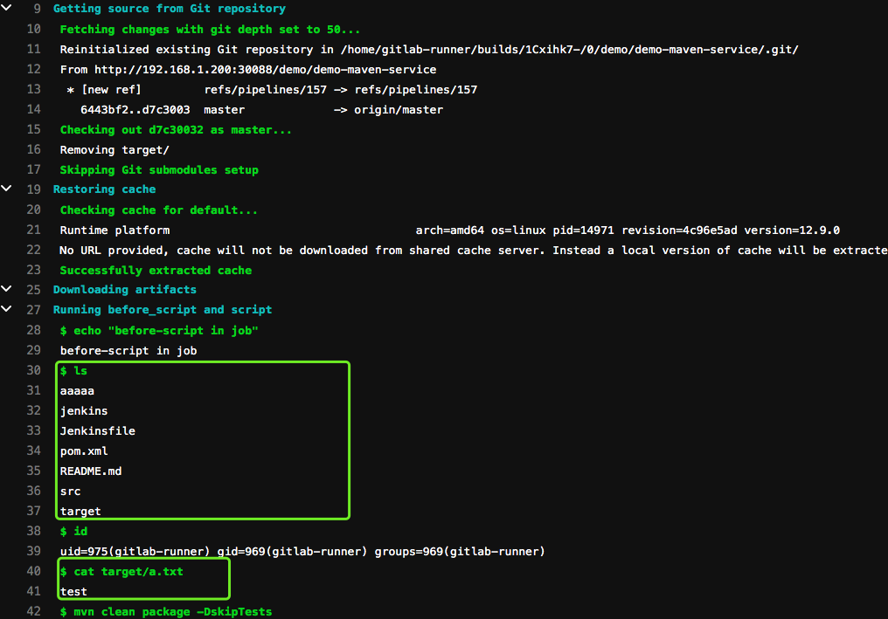](http://docs.idevops.site/gitlabci/chapter03/01/images/24.png)

进入runner缓存目录查看,cache.zip时间已经发生的变化。

```
[root@zeyang-nuc-service default]# ll
total 12
-rw------- 1 gitlab-runner gitlab-runner 9172 Apr 29 10:27 cache.zip
drwxrwxr-x 6 root          root           127 Apr 29 10:05 target
```

结论： 全局缓存生效于未在作业中定义缓存的所有作业，这种情况如果每个作业都对缓存目录做了更改，会出现缓存被覆盖的场景。

------

### 综合实例（二）

控制缓存策略

例如build阶段我们需要生成新的target目录内容，可以优化设置job运行时不下载缓存。

[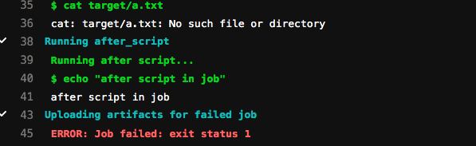](http://docs.idevops.site/gitlabci/chapter03/01/images/25.png)

```
before_script:
  - echo "before-script!!"

variables:
  DOMAIN: example.com

cache: 
  paths:
   - target/

stages:
  - build
  - test
  - deploy
  
build:
  before_script:
    - echo "before-script in job"
  stage: build
  tags:
    - build
  only:
    - master
  script:
    - ls
    - id
    - cat target/a.txt
    - mvn clean package -DskipTests
    - ls target
    - echo "$DOMAIN"
    - false && true ; exit_code=$?
    - if [ $exit_code -ne 0 ]; then echo "Previous command failed"; fi;
    - sleep 2;
  after_script:
    - echo "after script in job"
  cache:
    policy: pull   #不下载缓存


unittest:
  stage: test
  tags:
    - build
  only:
    - master
  script:
    - echo "run test"
    - echo 'test' >> target/a.txt
    - ls target
    - cat target/a.txt
  retry:
    max: 2
    when:
      - script_failure
  
deploy:
  stage: deploy
  tags:
    - build
  only:
    - master
  script:
    - cat target/a.txt
    - echo "run deploy"
    - ls target
    - echo "deploy" >> target/a.txt
  retry:
    max: 2
    when:
      - script_failure
      

after_script:
  - echo "after-script"
  
  
```

## artifacts/dependencies

### artifacts

用于指定在作业成功或者失败时应附加到作业的文件或目录的列表。作业完成后，工件将被发送到GitLab，并可在GitLab UI中下载。

#### artifacts:paths

路径是相对于项目目录的，不能直接链接到项目目录之外。

将制品设置为target目录

```
artifacts:
  paths:
    - target/
```

[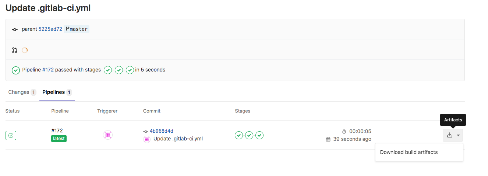](http://docs.idevops.site/gitlabci/chapter03/01/images/26.png)

禁用工件传递

```
job:
  stage: build
  script: make build
  dependencies: []
```

您可能只想为标记的发行版创建构件，以避免用临时构建构件填充构建服务器存储。仅为标签创建工件（ `default-job`不会创建工件）：

```
default-job:
  script:
    - mvn test -U
  except:
    - tags

release-job:
  script:
    - mvn package -U
  artifacts:
    paths:
      - target/*.war
  only:
    - tags
```

------

#### artifacts:expose_as

关键字`expose_as`可用于在合并请求 UI中公开作业工件。

例如，要匹配单个文件：

```
test:
  script: 
    - echo 1
  artifacts:
    expose_as: 'artifact 1'
    paths: 
      - path/to/file.txt
```

使用此配置，GitLab将在指向的相关合并请求中添加链接`file1.txt`。

[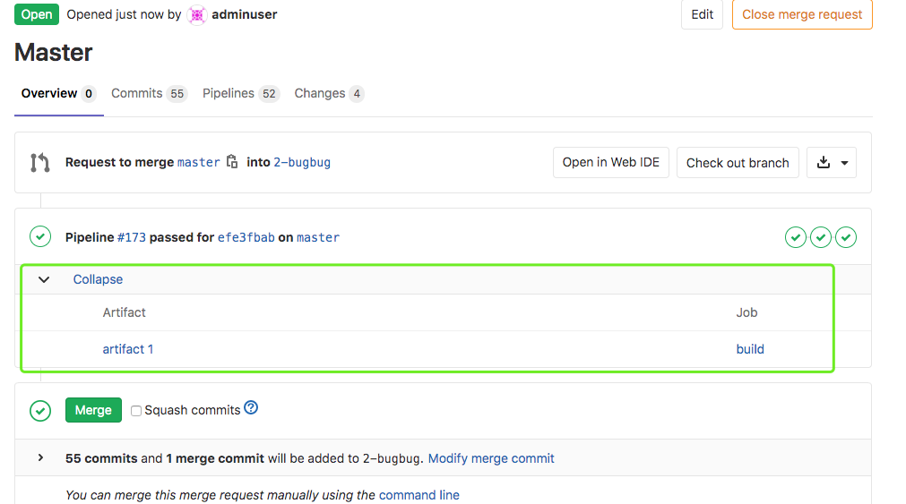](http://docs.idevops.site/gitlabci/chapter03/01/images/27.png)

制品浏览

[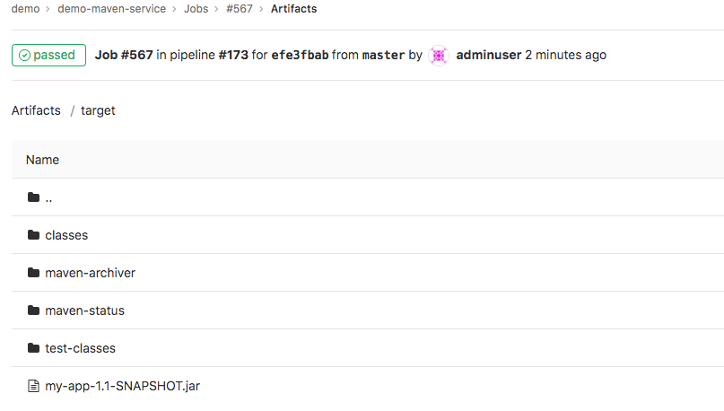](http://docs.idevops.site/gitlabci/chapter03/01/images/28.png)

请注意以下几点：

- 每个合并请求最多可以公开10个作业工件。
- 如果指定了目录，那么如果目录中有多个文件，则该链接将指向指向作业工件浏览器。
- 如果开启GitlabPages可以对.html .htm .txt .json .log扩展名单个文件工件渲染工件。

------

#### artifacts:name

通过`name`指令定义所创建的工件存档的名称。可以为每个档案使用唯一的名称。 `artifacts:name`变量可以使用任何[预定义变量](http://s0docs0gitlab0com.icopy.site/12.9/ee/ci/variables/README.html)。默认名称是`artifacts`，下载`artifacts`改为`artifacts.zip`。

使用当前作业的名称创建档案

```
job:
  artifacts:
    name: "$CI_JOB_NAME"
    paths:
      - binaries/
```

使用内部分支或标记的名称（仅包括binaries目录）创建档案，

```
job:
  artifacts:
    name: "$CI_COMMIT_REF_NAME"
    paths:
      - binaries/
```

使用当前作业的名称和当前分支或标记（仅包括二进制文件目录）创建档案

```
job:
  artifacts:
    name: "$CI_JOB_NAME-$CI_COMMIT_REF_NAME"
    paths:
      - binaries/
```

要创建一个具有当前[阶段](http://s0docs0gitlab0com.icopy.site/12.9/ee/ci/yaml/README.html#stages)名称和分支名称的档案

```
job:
  artifacts:
    name: "$CI_JOB_STAGE-$CI_COMMIT_REF_NAME"
    paths:
      - binaries/
```

------

#### artifacts:when

用于在作业失败时或尽管失败而上传工件。on_success仅在作业成功时上载工件。这是默认值。on_failure仅在作业失败时上载工件。always 上载工件，无论作业状态如何。

要仅在作业失败时上传工件：

```
job:
  artifacts:
    when: on_failure
```

------

#### artifacts:expire_in

制品的有效期，从上传和存储到GitLab的时间开始算起。如果未定义过期时间，则默认为30天。

`expire_in`的值以秒为单位的经过时间，除非提供了单位。可解析值的示例：

```
‘42’
‘3 mins 4 sec’
‘2 hrs 20 min’
‘2h20min’
‘6 mos 1 day’
‘47 yrs 6 mos and 4d’
‘3 weeks and 2 days’
```

一周后过期

```
job:
  artifacts:
    expire_in: 1 week
```

------

#### artifacts:reports

用于从作业中收集测试报告，代码质量报告和安全报告. 在GitLab的UI中显示这些报告。

**注意：**无论作业结果（成功或失败），都将收集测试报告。

##### `artifacts:reports:junit`

收集junit单元测试报告，收集的JUnit报告将作为工件上传到GitLab，并将自动显示在合并请求中。

```
build:
  stage: build
  tags:
    - build
  only:
    - master
  script:
    - mvn test
    - mvn cobertura:cobertura
    - ls target
  artifacts:
    name: "$CI_JOB_NAME-$CI_COMMIT_REF_NAME"
    when: on_success
    expose_as: 'artifact 1'
    paths:
      - target/*.jar
    reports:
      junit: target/surefire-reports/TEST-*.xml
```

**注意：**如果您使用的JUnit工具导出到多个XML文件，则可以在一个作业中指定多个测试报告路径，它们将被自动串联到一个文件中. 使用文件名模式（ `junit: rspec-*.xml` ），文件名数组（ `junit: [rspec-1.xml, rspec-2.xml, rspec-3.xml]` ）或其组合（ `junit: [rspec.xml, test-results/TEST-*.xml]` ）。

[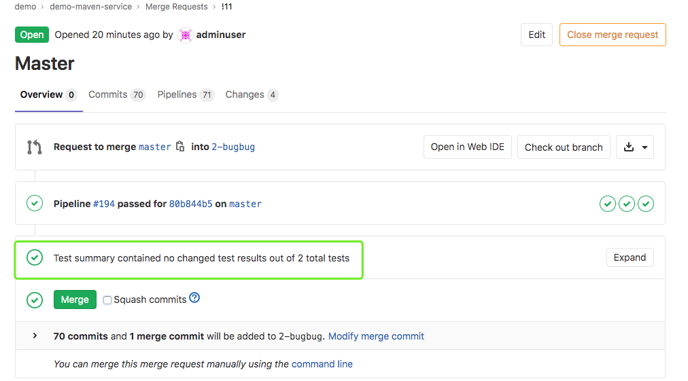](http://docs.idevops.site/gitlabci/chapter03/01/images/30.png)

[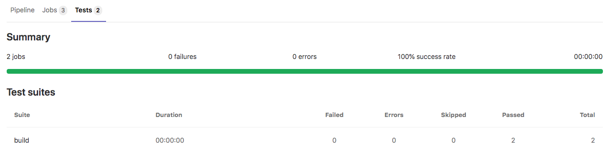](http://docs.idevops.site/gitlabci/chapter03/01/images/29.png)

如果无法显示此页面，需要更改系统设置。此选项可能会加大资源占用，默认禁用了需要启用。

```
登录gitlab
su -  git
$ gitlab-rails console
--------------------------------------------------------------------------------
 GitLab:       12.9.0 (9a382ff2c82) FOSS
 GitLab Shell: 12.0.0
 PostgreSQL:   10.12
--------------------------------------------------------------------------------
Feature.enable(:junit_pipeline_view)Loading production environment (Rails 6.0.2)
irb(main):001:0>
irb(main):002:0>
irb(main):003:0> Feature.enable(:junit_pipeline_view)
=> true
irb(main):004:0>
```

参考链接：https://docs.gitlab.com/ee/ci/junit_test_reports.html

------

##### `artifacts:reports:cobertura`

收集的Cobertura覆盖率报告将作为工件上传到GitLab，并在合并请求中自动显示。

```
build:
  stage: build
  tags:
    - build
  only:
    - master
  script:
    - mvn test
    - mvn cobertura:cobertura
    - ls target
  artifacts:
    name: "$CI_JOB_NAME-$CI_COMMIT_REF_NAME"
    when: on_success
    expose_as: 'artifact 1'
    paths:
      - target/*.jar
    reports:
      junit: target/surefire-reports/TEST-*.xml
      cobertura: target/site/cobertura/coverage.xml
$ gitlab-rails console
--------------------------------------------------------------------------------
 GitLab:       12.9.0 (9a382ff2c82) FOSS
 GitLab Shell: 12.0.0
 PostgreSQL:   10.12
--------------------------------------------------------------------------------


Loading production environment (Rails 6.0.2)
irb(main):001:0>
irb(main):002:0>
irb(main):003:0> Feature.enable(:coverage_report_view)
=> true
```

#### maven集成cobertura插件

```
<plugins>       
  <!--  cobertura plugin start -->
  <plugin>
    <groupId>org.codehaus.mojo</groupId>  
    <artifactId>cobertura-maven-plugin</artifactId>  
    <version>2.7</version>  
    <configuration>  
      <formats>  
          <format>html</format>  
          <format>xml</format>  
      </formats>  
  	</configuration>  
  </plugin>       
  <!--  cobertura plugin end -->

</plugins>
```

执行 mvn cobertura:cobertura 运行测试并产生 Cobertura 覆盖率报告。

参考链接：https://docs.gitlab.com/12.9/ee/user/project/merge_requests/test_coverage_visualization.html

备注实验未做出效果，具体问题待排查。

[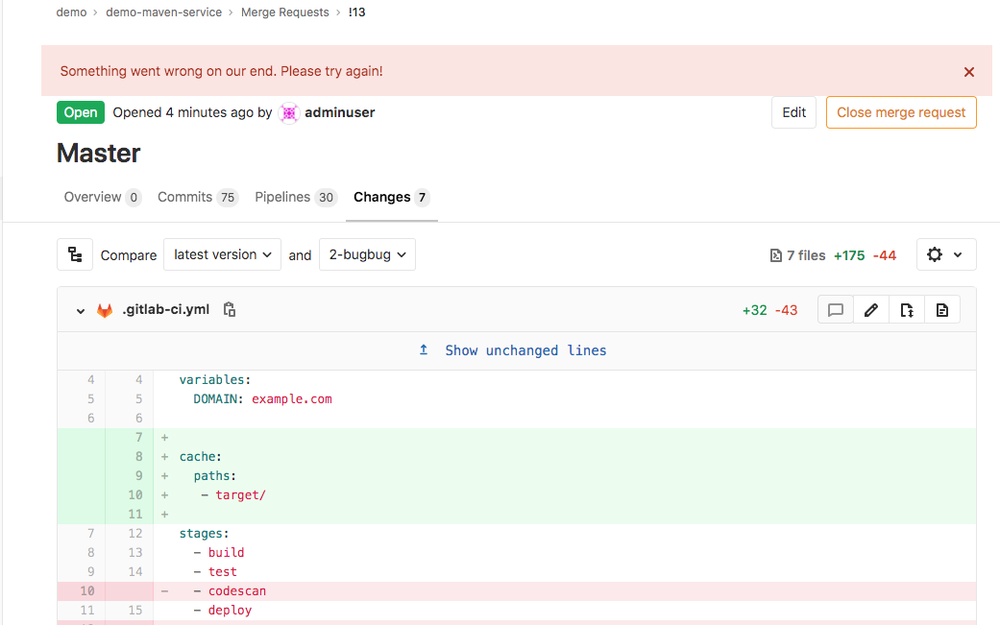](http://docs.idevops.site/gitlabci/chapter03/01/images/31.png)

------

### dependencies

定义要获取工件的作业列表，只能从当前阶段之前执行的阶段定义作业。定义一个空数组将跳过下载该作业的任何工件不会考虑先前作业的状态，因此，如果它失败或是未运行的手动作业，则不会发生错误。

[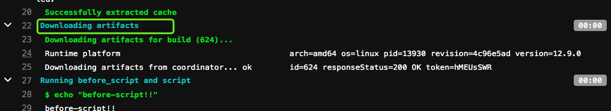](http://docs.idevops.site/gitlabci/chapter03/01/images/32.png)

如果设置为依赖项的作业的工件已过期或删除，那么依赖项作业将失败。

------

### 综合实例

```
before_script:
  - echo "before-script!!"

variables:
  DOMAIN: example.com


cache: 
  paths:
   - target/

stages:
  - build
  - test
  - deploy
  
build:
  before_script:
    - echo "before-script in job"
  stage: build
  tags:
    - build
  only:
    - master
  script:
    - ls
    - id
    - mvn test
    - mvn cobertura:cobertura
    - ls target
    - echo "$DOMAIN"
    - false && true ; exit_code=$?
    - if [ $exit_code -ne 0 ]; then echo "Previous command failed"; fi;
    - sleep 2;
  after_script:
    - echo "after script in job"
  artifacts:
    name: "$CI_JOB_NAME-$CI_COMMIT_REF_NAME"
    when: on_success
    #expose_as: 'artifact 1'
    paths:
      - target/*.jar
      #- target/surefire-reports/TEST*.xml
    reports:
      junit: target/surefire-reports/TEST-*.xml
      cobertura: target/site/cobertura/coverage.xml
  coverage: '/Code coverage: \d+\.\d+/'


unittest:
  dependencies:
    - build
  stage: test
  tags:
    - build
  only:
    - master
  script:
    - echo "run test"
    - echo 'test' >> target/a.txt
    - ls target
  retry:
    max: 2
    when:
      - script_failure
  
deploy:
  stage: deploy
  tags:
    - build
  only:
    - master
  script:
    - echo "run deploy"
    - ls target
  retry:
    max: 2
    when:
      - script_failure
      
      

after_script:
  - echo "after-script"
```

## needs/include/extends/trigger

### needs 并行阶段

可无序执行作业，无需按照阶段顺序运行某些作业，可以让多个阶段同时运行。

```
stages:
  - build
  - test
  - deploy

module-a-build:
  stage: build
  script: 
    - echo "hello3a"
    - sleep 10
    
module-b-build:
  stage: build
  script: 
    - echo "hello3b"
    - sleep 10

module-a-test:
  stage: test
  script: 
    - echo "hello3a"
    - sleep 10
  needs: ["module-a-build"]
    
module-b-test:
  stage: test
  script: 
    - echo "hello3b"
    - sleep 10
  needs: ["module-b-build"]
    
```

[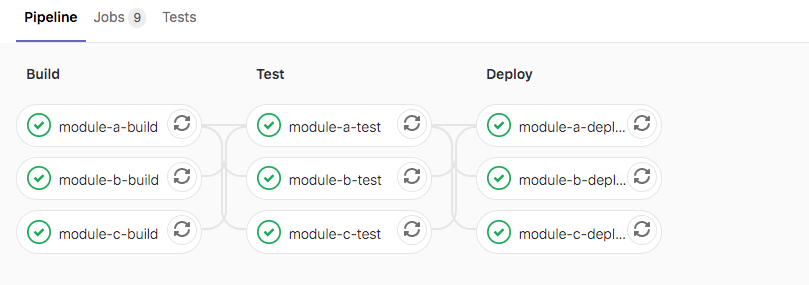](http://docs.idevops.site/gitlabci/chapter03/01/images/33.png)

如果`needs:`设置为指向因`only/except`规则而未实例化的作业，或者不存在，则创建管道时会出现YAML错误。

暂时限制了作业在`needs:`可能需要的最大作业数分配,`ci_dag_limit_needs`功能标志已启用（默认）分配10个，如果功能被禁用为50。

```
Feature::disable(:ci_dag_limit_needs)   # 50
Feature::enable(:ci_dag_limit_needs)  #10
```

------

### 制品下载

在使用`needs`，可通过`artifacts: true`或`artifacts: false`来控制工件下载。 默认不指定为true。

```
module-a-test:
  stage: test
  script: 
    - echo "hello3a"
    - sleep 10
  needs: 
    - job: "module-a-build"
      artifacts: true
```

相同项目中的管道制品下载,通过将`project`关键字设置为当前项目的名称，并指定引用，可以使用`needs`从当前项目的不同管道中下载工件。在下面的示例中，`build_job`将使用`other-ref`ref下载最新成功的`build-1`作业的工件：

```
build_job:
  stage: build
  script:
    - ls -lhR
  needs:
    - project: group/same-project-name
      job: build-1
      ref: other-ref
      artifacts: true
```

不支持从[`parallel:`](http://s0docs0gitlab0com.icopy.site/12.9/ee/ci/yaml/README.html#parallel)运行的作业中下载工件。

------

### include

https://gitlab.com/gitlab-org/gitlab/-/tree/master/lib/gitlab/ci/templates

可以允许引入外部YAML文件，文件具有扩展名`.yml`或`.yaml` 。使用合并功能可以自定义和覆盖包含本地定义的CI / CD配置。相同的job会合并，参数值以源文件为准。

#### local

引入同一存储库中的文件，使用相对于根目录的完整路径进行引用，与配置文件在同一分支上使用。

ci/localci.yml: 定义一个作业用于发布。

```
stages:
  - deploy
  
deployjob:
  stage: deploy
  script:
    - echo 'deploy'
```

.gitlab-ci.yml 引入本地的CI文件’ci/localci.yml’。

```
include:
  local: 'ci/localci.yml'
  

stages:
  - build
  - test
  - deploy
  

buildjob:
  stage: build
  script: ls
  
 
testjob:
  stage: test
  script: ls
```

效果

[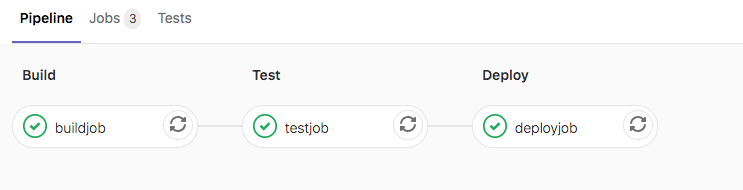](http://docs.idevops.site/gitlabci/chapter03/01/images/38.png)

------

#### file

包含来自另一个项目的文件

```
include:
  - project: demo/demo-java-service
    ref: master
    file: '.gitlab-ci.yml'
```

#### template

只能使用官方提供的模板 https://gitlab.com/gitlab-org/gitlab/tree/master/lib/gitlab/ci/templates

```
include:
  - template: Auto-DevOps.gitlab-ci.yml
```

#### remote

用于通过HTTP / HTTPS包含来自其他位置的文件，并使用完整URL进行引用. 远程文件必须可以通过简单的GET请求公开访问，因为不支持远程URL中的身份验证架构。

```
include:
  - remote: 'https://gitlab.com/awesome-project/raw/master/.gitlab-ci-template.yml'
```

------

### extends

继承模板作业

```
stages:
  - test
variables:
  RSPEC: 'test'

.tests:
  script: echo "mvn test"
  stage: test
  only:
    refs:
      - branches

testjob:
  extends: .tests
  script: echo "mvn clean test"
  only:
    variables:
      - $RSPEC
```

合并后

```
testjob:
  stage: test
  script: mvn clean test
  only:
    variables:
      - $RSPEC
    refs:
      - branches
```

------

### extends & include

aa.yml

```
#stages:
#  - deploy
  
deployjob:
  stage: deploy
  script:
    - echo 'deploy'
  only:
    - dev

.template:
  stage: build
  script: 
    - echo "build"
  only:
    - master
include:
  local: 'ci/localci.yml'

stages:
  - test
  - build 
  - deploy
  
variables:
  RSPEC: 'test'

.tests:
  script: echo "mvn test"
  stage: test
  only:
    refs:
      - branches

testjob:
  extends: .tests
  script: echo "mvn clean test"
  only:
    variables:
      - $RSPEC
      

newbuildjob:
  script:
    - echo "123"
  extends: .template
```

这将运行名为`useTemplate`的作业，该作业运行`echo Hello!` 如`.template`作业中所定义，并使用本地作业中所定义的`alpine` Docker映像.

------

### trigger 管道触发

当GitLab从`trigger`定义创建的作业启动时，将创建一个下游管道。允许创建多项目管道和子管道。将`trigger`与`when:manual`一起使用会导致错误。

多项目管道： 跨多个项目设置流水线，以便一个项目中的管道可以触发另一个项目中的管道。[微服务架构]

父子管道: 在同一项目中管道可以触发一组同时运行的子管道,子管道仍然按照阶段顺序执行其每个作业，但是可以自由地继续执行各个阶段，而不必等待父管道中无关的作业完成。

#### 多项目管道

当前面阶段运行完成后，触发demo/demo-java-service项目master流水线。创建上游管道的用户需要具有对下游项目的访问权限。如果发现下游项目用户没有访问权限以在其中创建管道，则`staging`作业将被标记为*失败*。

```
staging:
  variables:
    ENVIRONMENT: staging
  stage: deploy
  trigger: 
    project: demo/demo-java-service
    branch: master
    strategy: depend
```

`project`关键字，用于指定下游项目的完整路径。该`branch`关键字指定由指定的项目分支的名称。使用`variables`关键字将变量传递到下游管道。 全局变量也会传递给下游项目。上游管道优先于下游管道。如果在上游和下游项目中定义了两个具有相同名称的变量，则在上游项目中定义的变量将优先。默认情况下，一旦创建下游管道，`trigger`作业就会以`success`状态完成。`strategy: depend`将自身状态从触发的管道合并到源作业。

[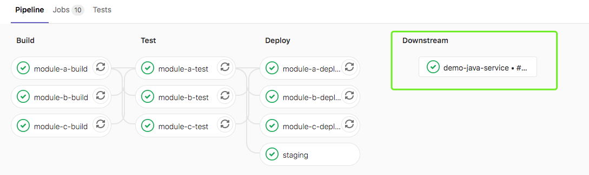](http://docs.idevops.site/gitlabci/chapter03/01/images/34.png)

在下游项目中查看管道信息

[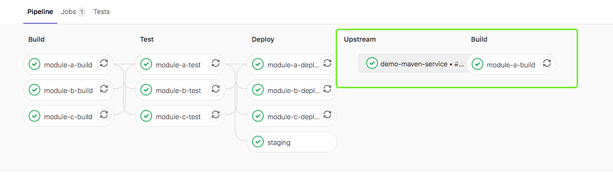](http://docs.idevops.site/gitlabci/chapter03/01/images/35.png)

在此示例中，一旦创建了下游管道，该`staging`将被标记为成功。

### 父子管道

创建子管道ci/child01.yml

```
stages:
  - build

child-a-build:
  stage: build
  script: 
    - echo "hello3a"
    - sleep 10
```

在父管道触发子管道

```
staging2:
  variables:
    ENVIRONMENT: staging
  stage: deploy
  trigger: 
    include: ci/child01.yml  
    strategy: depend
```

[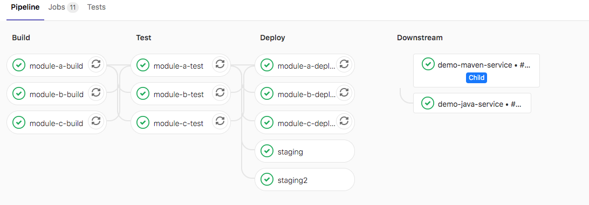](http://docs.idevops.site/gitlabci/chapter03/01/images/36.png)

## image/services/environment/inherit

### 准备工作注册docker类型的runner

```
gitlab-runner register \
  --non-interactive \
  --executor "docker" \
  --docker-image alpine:latest \
  --url "http://192.168.1.200:30088/" \
  --registration-token "JRzzw2j1Ji6aBjwvkxAv" \
  --description "docker-runner" \
  --tag-list "newdocker" \
  --run-untagged="true" \
  --locked="false" \
  --docker-privileged \ 
  --access-level="not_protected"
[[runners]]
  name = "docker-runner"
  url = "http://192.168.1.200:30088/"
  token = "xuaLZD7xUVviTsyeJAWh"
  executor = "docker"
  [runners.custom_build_dir]
  [runners.cache]
    [runners.cache.s3]
    [runners.cache.gcs]
  [runners.docker]
    pull_policy = "if-not-present"
    tls_verify = false
    image = "alpine:latest"
    privileged = true
    disable_entrypoint_overwrite = false
    oom_kill_disable = false
    disable_cache = false
    volumes = ["/cache"]
    shm_size = 0
```

### image

默认在注册runner的时候需要填写一个基础的镜像，请记住一点只要使用执行器为docker类型的runner所有的操作运行都会在容器中运行。 如果全局指定了images则所有作业使用此image创建容器并在其中运行。 全局未指定image，再次查看job中是否有指定，如果有此job按照指定镜像创建容器并运行，没有则使用注册runner时指定的默认镜像。

```
#image: maven:3.6.3-jdk-8

before_script:
  - ls
  
  
build:
  image: maven:3.6.3-jdk-8
  stage: build
  tags:
    - newdocker
  script:
    - ls
    - sleep 2
    - echo "mvn clean "
    - sleep 10

deploy:
  stage: deploy
  tags:
    - newdocker
  script:
    - echo "deploy"
```

------

### services

工作期间运行的另一个Docker映像，并link到`image`关键字定义的Docker映像。这样，您就可以在构建期间访问服务映像.

服务映像可以运行任何应用程序，但是最常见的用例是运行数据库容器，例如`mysql` 。与每次安装项目时都安装`mysql`相比，使用现有映像并将其作为附加容器运行更容易，更快捷。

```
services:
  - name: mysql:latest
    alias: mysql-1
```

------

### environment

```
deploy to production:
  stage: deploy
  script: git push production HEAD:master
  environment:
    name: production
    url: https://prod.example.com
```

------

### inherit

使用或禁用全局定义的环境变量（variables）或默认值(default)。

*使用true、false决定是否使用，默认为true*

```
inherit:
  default: false
  variables: false
```

*继承其中的一部分变量或默认值使用list*

```
inherit:
  default:
    - parameter1
    - parameter2
  variables:
    - VARIABLE1
    - VARIABLE2
```