# 基本概念

## Docker架构

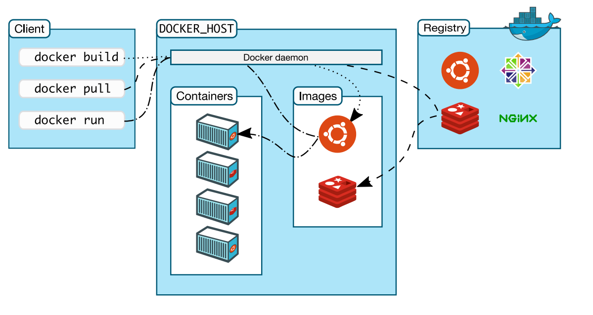

K8S：CRI（Container Runtime Interface） 

Client： 客户端；操作docker服务器的客户端（命令行或者界面） 

Docker_Host：Docker主机；安装Docker服务的主机 

Docker_Daemon：后台进程；运行在Docker服务器的后台进程 

Containers：容器；在Docker服务器中的容器（一个容器一般是一个应用实例，容器间互相隔离） 

Images：镜像、映像、程序包；Image是只读模板，其中包含创建Docker容器的说明。容器是由Image运 行而来，Image固定不变。 

Registries：仓库；存储Docker Image的地方。官方远程仓库地址： https://hub.docker.com/search

>Docker用Go编程语言编写，并利用Linux内核的多种功能来交付其功能。 Docker使用一种称为名称空间的技术来提供容器的隔离工作区。 运行容器时，Docker会为该容器创建一组名称空间。 这些名称空间提供了一层隔离。 容器的每个方面都在单独的名称空间中运行，并且对其的访问仅限于该名称空间。 

## Docker隔离原理

- **namespace 6项隔离** （资源隔离）

| namespace | **系统调用参数** | **隔离内容 **              |
| --------- | ---------------- | -------------------------- |
| UTS       | CLONE_NEWUTS     | 主机和域名                 |
| IPC       | CLONE_NEWIPC     | 信号量、消息队列和共享内存 |
| PID       | CLONE_NEWPID     | 进程编号                   |
| Network   | CLONE_NEWNET     | 网络设备、网络栈、端口等   |
| Mount     | CLONE_NEWNS      | 挂载点(文件系统)           |
| User      | CLONE_NEWUSER    | 用户和用户组               |

- **cgroups资源限制** （资源限制） 

  cgroup提供的主要功能如下：

  **资源限制**：限制任务使用的资源总额，并在超过这个配额时发出提示

  **优先级分配**：分配CPU时间片数量及磁盘IO带宽大小、控制任务运行的优先级

  **资源统计**：统计系统资源使用量，如CPU使用时长、内存用量等

  **任务控制**：对任务执行挂起、恢复等操作

cgroup资源控制系统，每种子系统独立地控制一种资源。功能如下

| **子系统**                      | **功能**                                                     |
| ------------------------------- | ------------------------------------------------------------ |
| cpu                             | 使用调度程序控制任务对CPU的使用                              |
| cpuacct(CPU Accounting)         | 自动生成cgroup中任务对CPU资源使用情况的报告                  |
| cpuset                          | 为cgroup中的任务分配独立的CPU(多处理器系统时)和内存          |
| devices                         | 开启或关闭cgroup中任务对设备的访问                           |
| freezer                         | 挂起或恢复cgroup中的任务                                     |
| memory                          | 设定cgroup中任务对内存使用量的限定，并生成这些任务对内存资源使用情况的报告 |
| perf_event(Linux CPU性能探测器) | 使cgroup中的任务可以进行统一的性能测试                       |
| net_cls(Docker未使用)           | 通过等级识别符标记网络数据包，从而允许Linux流量监控程序(Tra?icController)识别从具体cgroup中生成的数据包 |

## Docker 如何工作？

Docker 技术使用 Linux 内核和内核功能（例如 Cgroups 和 namespaces）来分隔进程，以便各进程相互独立运行。这种独立性正是采用容器的目的所在；它可以独立运行多种进程、多个应用程序，更加充分地发挥基础设施的作用，同时保持各个独立系统的安全性。

 容器工具（包括 Docker）可提供基于镜像的部署模式。这使得它能够轻松跨多种环境，与其依赖程序共享应用或服务组。Docker 还可在这一容器环境中自动部署应用程序（或者合并多种流程，以构建单个应用程序）。

## Docker安装

> 以下以centos为例；
>
> 更多其他安装方式，详细参照文档： https://docs.docker.com/engine/install/centos/

### 1、移除旧版本

```sh
sudo yum remove docker*
```

### 2、设置docker yum源

```sh
sudo yum install -y yum-utils
sudo yum-config-manager --add-repo http://mirrors.aliyun.com/docker-ce/linux/centos/docker-ce.repo
```

### 3、安装最新docker engine (可不安装)

```sh
# sudo yum install docker-ce docker-ce-cli containerd.io 
```

### 4、安装指定版本docker engine

#### 1）、在线安装

```sh
#找到所有可用docker版本列表
yum list docker-ce --showduplicates | sort -r
# 安装指定版本，用上面的版本号替换<VERSION_STRING>
#sudo yum install docker-ce-<VERSION_STRING>.x86_64 docker-ce-cli-<VERSION_STRING>.x86_64 containerd.io
#例如
yum install -y docker-ce-19.03.9  docker-ce-cli-19.03.9 containerd.io
```

#### 2）、离线安装

```sh
https://download.docker.com/linux/centos/7/x86_64/stable/Packages/
rpm -ivh xxx.rpm
可以下载 tar
解压启动即可
https://docs.docker.com/engine/install/binaries/#install-daemon-and-client-binaries-on-linux
```

### 5、启动服务

```sh
# 启动
systemctl start docker

# 开机自启
systemctl enable docker
```

### 6、镜像加速

```sh
sudo mkdir -p /etc/docker
sudo tee /etc/docker/daemon.json <<-'EOF'
{
  "registry-mirrors": ["https://c9jwzg2k.mirror.aliyuncs.com"]
}
EOF
sudo systemctl daemon-reload
sudo systemctl restart docker
# 阿里云的镜像是从docker hub来的，我们配置了加速，默认是从阿里云（缓存）下载
# 以后docker下载直接从阿里云拉取相关镜像
#/etc/docker/daemon.json 是Docker的核心配置文件。

{
    "registry-mirrors": [
        "https://mirror.ccs.tencentyun.com"
    ]
}
```

## Docker镜像生命周期

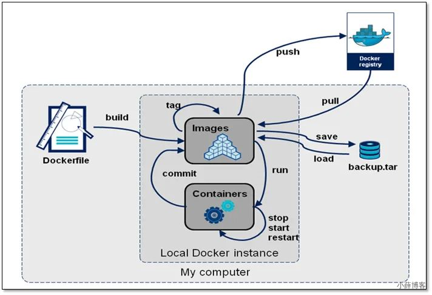

# 镜像、容器

## 1、常见命令

所有Docker命令手册:https://docs.docker.com/engine/reference/commandline/docker/

| 命令      | 作用                                                         |
| --------- | ------------------------------------------------------------ |
| attach    | 绑定到运行中容器的 标准输入, 输出,以及错误流（这样似乎也能进入容器内，但是一定小心，他们操作的就是控制台，控制台的退出命令会生效，比如redis,nginx...） |
| build     | 从一个 Dockerfile 文件构建镜像                               |
| commit    | 把容器的改变 提交创建一个新的镜像                            |
| cp        | 容器和本地文件系统间 复制 文件/文件夹                        |
| create    | 创建新容器，但并不启动（注意与docker run 的区分）需要手动启动。start\stop |
| diff      | 检查容器里文件系统结构的更改【A：添加文件或目录 D：文件或者目录删除 C：文件或者目录更改】 |
| events    | 获取服务器的实时事件                                         |
| exec      | 在运行时的容器内运行命令                                     |
| export    | 导出容器的文件系统为一个tar文件。commit是直接提交成镜像，export是导出成文件方便传输 |
| history   | 显示镜像的历史                                               |
| images    | 列出所有镜像                                                 |
| import    | 导入tar的内容创建一个镜像，再导入进来的镜像直接启动不了容器。/docker-entrypoint.sh nginx -g 'daemon o?;' docker ps --no-trunc 看下之前的完整启动命令再用他 |
| info      | 显示系统信息                                                 |
| inspect   | 获取docker对象的底层信息                                     |
| kill      | 杀死一个或者多个容器                                         |
| load      | 从 tar 文件加载镜像                                          |
| login     | 登录Docker registry                                          |
| logout    | 退出Docker registry                                          |
| logs      | 获取容器日志；容器以前在前台控制台能输出的所有内容，都可以看到 |
| pause     | 暂停一个或者多个容器                                         |
| port      | 列出容器的端口映射                                           |
| ps        | 列出所有容器                                                 |
| pull      | 从registry下载一个image 或者repository                       |
| push      | 给registry推送一个image或者repository                        |
| rename    | 重命名一个容器                                               |
| restart   | 重启一个或者多个容器                                         |
| rm        | 移除一个或者多个容器                                         |
| rmi       | 移除一个或者多个镜像                                         |
| run       | 创建并启动容器                                               |
| save      | 把一个或者多个镜像保存为tar文件                              |
| search    | 去docker hub寻找镜像                                         |
| start     | 启动一个或者多个容器                                         |
| stats     | 显示容器资源的实时使用状态                                   |
| stop      | 停止一个或者多个容器                                         |
| tag       | 给源镜像创建一个新的标签，变成新的镜像                       |
| top       | 显示正在运行容器的进程                                       |
| unpause   | pause的反操作                                                |
| update    | 更新一个或者多个docker容器配置                               |
| version   | Show the Docker version information                          |
| container | 管理容器                                                     |
| image     | 管理镜像                                                     |
| network   | 管理网络                                                     |
| volume    | 管理卷                                                       |

根据正在运行的容器制作出相关的镜像：反向

根据镜像启动一个容器：正向

有了Docker：

1、先去软件市场搜镜像：https://registry.hub.docker.com/ docker hub

2、下载镜像 docker pull xxx

3、启动软件 docker run 镜像名；

对于镜像的所有管理操作都在这一个命令：docker image --help

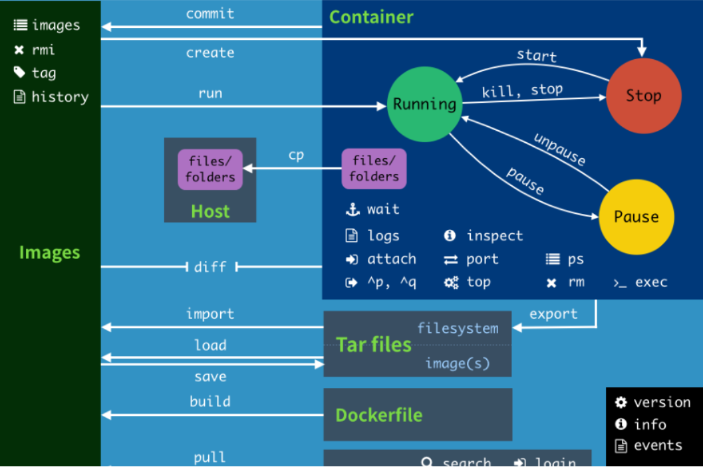

### 1、docker ps

```sh
# 查看容器
docker ps
# 查看停止的容器
docker ps -f status=exited
# 查看所有容器（包括运行和停止）。
docker ps -a
# 查看最后一次运行的容器。
docker ps -l
# 列出最近创建的 n 个容器。
docker ps -n 5
```

### 2、docker images

```sh
# 列出所有镜像
docker images
```

### 3、docker pull

```sh
# 以redis为例
docker pull redis

# 不写标签相当于
docker pull redis:latest（最新版）
```

### 4、docker create

```sh
# 创建容器
docker create --name myredis -p 6379:6379 redis
docker create --name myredis -p 6379（主机的端口）:6379（容器的端口） redis
```

https://docs.docker.com/engine/reference/commandline/create/

### 5、docker start

```sh
# 用create创建的容器要用start启动
docker start 容器名或者容器id
docker start myredis
```

### 6、docker stop

```sh
# 停止容器
docker stop 容器名或者容器id
docker stop myredis
```

### 7、docker restart

```sh
# 重启容器
docker restart 容器名或者容器id
docker restart myredis
```

### 8、docker rm

```sh
# 删除容器
docker rm 容器名或者容器id

# 强制删除
docker rm -f 容器名或者容器id

# 删除全部容器
docker rm -f $(docker ps -aq)
```

### 9、docker rmi

```sh
# 删除镜像
docker rmi 镜像名或者镜像id

# 强制删除
docker rmi -f 镜像名或者镜像id

# 删除全部镜像
docker rmi -f $(docker images -aq)
```

### 10、docker kill

```sh
# 强制停止容器
docker kill 容器名或者容器id
```

### 11、docker port

```sh
# 查看容器端口映射
docker port 容器名或者容器id
docker port myredis
```

### 12、docker logs

```sh
# 查看容器运行日志
docker logs 容器名或者容器id
docker logs myredis

# 实时查看
docker logs -f myredis

# 查看最后100 行日志
docker logs -f --tail 100 myredis

# 查看最近30分钟的日志
docker logs --since 30m myredis

# 查看时间段日志
docker logs -t --since="2021-11-01" --until "2021-11-05" myredis
```

### 13、docker rename

```sh
# 重命名容器
docker rename 容器名 新容器名
docker rename myredis redis
```

### 14、docker stats

```sh
# 查看容器资源的实时使用状态
docker stats 容器名或者容器id
```

### 15、docker update

```sh
# 更新容器配置
# 更新容器为开机自启
docker update 容器名或者容器id --restart=always
```

### 16、docker tag

```sh
# 给镜像重新打标签
docker tag 原镜像:标签 新镜像名:标签 
```

### 17、docker prune

```sh
# 查看游离镜像 dangling：游离镜像（没有镜像名字的）
docker image prune

# 清理docker system
docker system prune
```

### 18、docker pause

```sh
# 暂停容器
docker pause 容器名或者容器id
```

### 19、docker unpause

```sh
# 启动已暂停的容器
docker unpause 容器名或者容器id
```

### 20、docker inspect

```sh
# 查看镜像详细信息
docker inspect 镜像id或者镜像名

# 查看容器详细信息
docker container inspect 容器名或者容器id

# network volume等等都可以查看
docker inspect image/network/volume ....
```

### 21、docker exec（推荐）

```sh
# 进入容器
docker exec -it 容器名或者容器id /bin/bash

# 0用户，以特权方式进入容器
docker exec -it -u 0:0 --privileged myredis /bin/bash
```

https://docs.docker.com/engine/reference/commandline/exec/

### 22、docker attach（不推荐）

```sh
# 进容器 绑定的是控制台. 可能导致容器停止。不要用这个
docker attach 
```

### 23、docker export、import（不推荐）

```sh
# 导出镜像
docker export 导出的文件被import导入以后变成镜像，并不能直接启动容器，需要知道之前的启动命令
docker export -o nginx.tar 容器id
docker import nginx.tar mynginx:v6
（docker ps --no-trunc），然后再用下面启动。
docker run -d -P mynginx:v6 /docker-entrypoint.sh nginx -g 'daemon off;'
或者docker image inspect 看之前的镜像，把 之前镜像的 Entrypoint的所有和 Cmd的连接起来就
能得到启动命令
```

### 24、docker save、load（推荐）

```sh
docker save -o busybox.tar busybox:latest 把busybox镜像保存成tar文件
docker load -i busybox.tar  把压缩包里面的内容直接导成镜像
```

### 25、docker commit

```sh
# 一般运行中的容器会常年修改，我们要使用最终的新镜像,把新的镜像放到远程docker hub，方便后来在其他机器下载
docker commit -a xueqimiao -m "first commit" mynginx4 mynginx:v4
# 会产生游离镜像
```

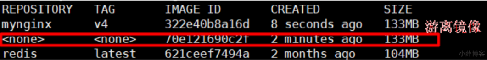

## 2、典型命令

### 1、docker run

- `-d: 后台运行容器，并返回容器ID`；
- `-i: 以交互模式运行容器，通常与 -t 同时使用`；
- `-P: 随机端口映射，容器内部端口随机映射到主机的端口`
- `-p:指定端口映射，格式为：主机(宿主)端口:容器端口`
- `-t: 为容器重新分配一个伪输入终端，通常与 -i 同时使用`
- `--name="nginx-lb":为容器指定一个名称`；
- --dns 8.8.8.8: 指定容器使用的DNS服务器，默认和宿主一致；
- --dns-search example.com: 指定容器DNS搜索域名，默认和宿主一致；
- -h "mars": 指定容器的hostname；
- `-e username="ritchie": 设置环境变量`；
- --env-file=[]: 从指定文件读入环境变量；
- `--cpuset="0-2" or --cpuset="0,1,2": 绑定容器到指定CPU运行`；
- `-m :设置容器使用内存最大值`；
- `--net="bridge": 指定容器的网络连接类型，支持 bridge/host/none/container: 四种类型`；
- --link=[]: 添加链接到另一个容器；
- --expose=[]: 开放一个端口或一组端口；
- `--restart , 指定重启策略，可以写--restart=awlays 总是故障重启`
- `--volume , -v: 绑定一个卷。一般格式 主机文件或文件夹:虚拟机文件或文件夹`

#### 1、重启策略

```text
no，默认策略，在容器退出时不重启容器
on-failure，在容器非正常退出时（退出状态非0），才会重启容器
on-failure:3，在容器非正常退出时重启容器，最多重启3次
always，在容器退出时总是重启容器
unless-stopped，在容器退出时总是重启容器，但是不考虑在Docker守护进程启动时就已经停止了的容器
```

### 2、docker exec

```sh
# 进入容器
docker exec -it 容器名或者容器id /bin/bash

# 0用户，以特权方式进入容器
docker exec -it -u 0:0 --privileged myredis /bin/bash
```

### 3、docker build

```sh
docker build -t imageName -f DockerfileName . 

# 不带缓存构建
docker build --no-cache
```

## 3、容器的状态

`Created`（新建）、`Up`（运行中）、`Pause`（暂停）、`Exited`（退出）

# 安装基本应用

## 1、安装Nginx

```sh
# 注意 外部的/nginx/conf下面的内容必须存在，否则挂载会覆盖
docker run --name nginx-app \
-v /app/nginx/html:/usr/share/nginx/html:ro \
-v /app/nginx/conf:/etc/nginx
-d nginx:1.20.1

# nginx目录放在/opt/docker/下

# 随便启动一个 nginx 实例，只是为了复制出配置
docker run -p 80:80 -p 443:443 --name nginx443 -d nginx:1.20.1

mkdir -p /usr/local/docker/nginx/html
mkdir -p /usr/local/docker/nginx/logs
mkdir -p /usr/local/docker/nginx/conf


# 复制到/opt/docker/temp下
docker container cp nginx:/etc/nginx /opt/docker/temp 
# 比如
docker container cp 8662e037621d:/etc/nginx /usr/local/docker/nginx/conf/

mv /usr/local/docker/nginx/conf/nginx/*  /usr/local/docker/nginx/conf

rm -rf /opt/docker/temp

docker stop nginx

docker rm $Containerid

docker run -p 80:80 --name nginx \
 -v /opt/docker/nginx/html:/usr/share/nginx/html \
 -v /opt/docker/nginx/logs:/var/log/nginx \
 -v /opt/docker/nginx/conf/:/etc/nginx \
 -d nginx:1.10
 
 docker run -p 80:80 -p 443:443 --name nginx \
 -v /usr/local/docker/nginx/html:/usr/share/nginx/html \
 -v /usr/local/docker/nginx/logs:/var/log/nginx \
 -v /usr/local/docker/nginx/conf/:/etc/nginx \
 -d nginx:1.20.1
```

## 2、安装MySQL

### 1、单机安装

```sh
# 5.7版本
docker run -p 3306:3306 --name mysql57-app \
-v /app/mysql/log:/var/log/mysql \
-v /app/mysql/data:/var/lib/mysql \
-v /app/mysql/conf:/etc/mysql/conf.d \
-e MYSQL_ROOT_PASSWORD=123456 \
-d mysql:5.7

docker run -p 4408:3306 --name mysql57-app \
-v /usr/local/mysql/log:/var/log/mysql \
-v /usr/local/mysql/data:/var/lib/mysql \
-v /usr/local/mysql/conf:/etc/mysql/conf.d \
-e MYSQL_ROOT_PASSWORD=xUeMysqlPass \
-d mysql:5.7

#8.x版本,引入了 secure-file-priv 机制，磁盘挂载将没有权限读写data数据，所以需要将权限透传，
或者chmod -R 777 /app/mysql/data

# --privileged 特权容器，容器内使用真正的root用户
docker run -p 3306:3306 --name mysql8-app \
-v /app/mysql/conf:/etc/mysql/conf.d \
-v /app/mysql/log:/var/log/mysql \
-v /app/mysql/data:/var/lib/mysql \
-e MYSQL_ROOT_PASSWORD=123456 \
--privileged \ 
-d mysql

docker run -d --name mysql \-p 3306:3306 -e MYSQL_ROOT_PASSWORD=123456 \-v /usr/local/docker/mysql/mysql:/etc/mysql \-v /usr/local/docker/mysql/logs:/var/log/mysql \-v /usr/local/docker/mysql/data/:/var/lib/mysql \mysql:5.7 --lower_case_table_names=1
```


```sh
# 新建 my.cnf (/usr/local/mysql/conf)
[client]
default_character_set=utf8 
[mysqld] 
collation_server = utf8_general_ci 
character_set_server = utf8 


docker run -d -p 3306:3306 --privileged=true -v /usr/local/mysql/log:/var/log/mysql -v /usr/local/mysql/data:/var/lib/mysql -v /usr/local/mysql/conf:/etc/mysql/conf.d -e MYSQL_ROOT_PASSWORD=123456 --name mysql mysql:5.7
```


### 2、安装mysql主从复制

```sh
# 1、新建主服务器容器实例3307
docker run -p 3307:3306 --name mysql-master \
-v /usr/local/docker/mysql-master/log:/var/log/mysql \
-v /usr/local/docker/mysql-master/data:/var/lib/mysql \
-v /usr/local/docker/mysql-master/conf:/etc/mysql \
-e MYSQL_ROOT_PASSWORD=root -d mysql:5.7

# 2、进入/usr/local/docker/mysql-master/conf目录下新建 my.cnf
vim my.cnf

[mysqld]
## 设置server_id，同一局域网中需要唯一 
server_id=101
## 指定不需要同步的数据库名称 
binlog-ignore-db=mysql
## 开启二进制日志功能 
log-bin=mall-mysql-bin 
## 设置二进制日志使用内存大小（事务） 
binlog_cache_size=1M
## 设置使用的二进制日志格式（mixed,statement,row） 
binlog_format=mixed
## 二进制日志过期清理时间。默认值为0，表示不自动清理。 
expire_logs_days=7
## 跳过主从复制中遇到的所有错误或指定类型的错误，避免slave端复制中断。 
## 如：1062错误是指一些主键重复，1032错误是因为主从数据库数据不一致 
slave_skip_errors=1062

# 3、修改完配置后重启master实例
docker restart mysql-master

# 4、进入mysql-master容器
docker exec -it mysql-master /bin/bash
mysql -uroot -proot


# 5、master容器实例内创建数据同步用户
CREATE USER 'slave'@'%' IDENTIFIED BY '123456';
GRANT REPLICATION SLAVE, REPLICATION CLIENT ON *.* TO 'slave'@'%';

# 6、新建从服务器容器实例3308
docker run -p 3308:3306 --name mysql-slave \
-v /usr/local/docker/mysql-slave/log:/var/log/mysql \
-v /usr/local/docker/mysql-slave/data:/var/lib/mysql \
-v /usr/local/docker/mysql-slave/conf:/etc/mysql \
-e MYSQL_ROOT_PASSWORD=root -d mysql:5.7

# 7、进入/usr/local/docker/mysql-slave/conf目录下新建my.cnf
vim my.cnf

[mysqld] 
## 设置server_id，同一局域网中需要唯一 
server_id=102
## 指定不需要同步的数据库名称 
binlog-ignore-db=mysql
## 开启二进制日志功能，以备Slave作为其它数据库实例的Master时使用 
log-bin=mall-mysql-slave1-bin
## 设置二进制日志使用内存大小（事务） 
binlog_cache_size=1M
## 设置使用的二进制日志格式（mixed,statement,row） 
binlog_format=mixed
## 二进制日志过期清理时间。默认值为0，表示不自动清理。 
expire_logs_days=7
## 跳过主从复制中遇到的所有错误或指定类型的错误，避免slave端复制中断。 
## 如：1062错误是指一些主键重复，1032错误是因为主从数据库数据不一致 
slave_skip_errors=1062
## relay_log配置中继日志 
relay_log=mall-mysql-relay-bin
## log_slave_updates表示slave将复制事件写进自己的二进制日志 
log_slave_updates=1
## slave设置为只读（具有super权限的用户除外） 
read_only=1

# 8、修改完配置后重启slave实例
docker restart mysql-slave

# 9、在主数据库中查看主从同步状态
docker exec -it mysql-master /bin/bash
mysql -uroot -proot
show master status;
mysql> show master status;
+-----------------------+----------+--------------+------------------+-------------------+
| File                  | Position | Binlog_Do_DB | Binlog_Ignore_DB | Executed_Gtid_Set |
+-----------------------+----------+--------------+------------------+-------------------+
| mall-mysql-bin.000001 |      617 |              | mysql            |                   |
+-----------------------+----------+--------------+------------------+-------------------+
1 row in set (0.00 sec)

# 10、在从数据库中配置主从复制
change master to master_host='宿主机ip', master_user='slave', master_password='123456', master_port=3307, master_log_file='mall-mysql-bin.000001', master_log_pos=617, master_connect_retry=30; 

change master to master_host='106.14.76.55', master_user='slave', master_password='123456', master_port=3307, master_log_file='mall-mysql-bin.000001', master_log_pos=617, master_connect_retry=30;

mysql> change master to master_host='106.14.76.55', master_user='slave', master_password='123456', master_port=3307, master_log_file='mall-mysql-bin.000001', master_log_pos=617, master_connect_retry=30;
Query OK, 0 rows affected, 2 warnings (0.03 sec)

master_host：主数据库的IP地址； 
master_port：主数据库的运行端口； 
master_user：在主数据库创建的用于同步数据的用户账号； 
master_password：在主数据库创建的用于同步数据的用户密码； 
master_log_file：指定从数据库要复制数据的日志文件，通过查看主数据的状态，获取File参数； 
master_log_pos：指定从数据库从哪个位置开始复制数据，通过查看主数据的状态，获取Position参数； 
master_connect_retry：连接失败重试的时间间隔，单位为秒。 

# 11、在从数据库中查看主从同步状态
docker exec -it mysql-slave /bin/bash
mysql -uroot -proot
show slave status \G;

# 12、在从数据库中开启主从同步
start slave;

# 13、查看从数据库状态发现已经同步
```

## 3、安装Redis

### 1、单机安装

```sh
# 提前准备好redis.conf文件，创建好相应的文件夹。如：
port 6379
appendonly yes
#更多配置参照 https://raw.githubusercontent.com/redis/redis/6.0/redis.conf
docker run -p 6379:6379 --name redis \
-v /usr/local/redis/redis.conf:/etc/redis/redis.conf \
-v /usr/local/redis/data:/data \
-d redis:6.0.8 \
redis-server /etc/redis/redis.conf --appendonly yes


docker run  -p 6379:6379 --name myredis --privileged=true -v /usr/local/redis/redis.conf:/etc/redis/redis.conf -v /usr/local/redis/data:/data -d redis:6.0.8 redis-server /etc/redis/redis.conf 

# 可以提前准备redis的原厂配置
# 修改以下属性即可
# 开启redis验证     可选 
requirepass 123
# 允许redis外地连接  必须 

#注释掉 
# bind 127.0.0.1

#将daemonize yes注释起来或者 daemonize no设置，因为该配置和docker run中-d参数冲突，会导致容器一直启动失败 
daemonize no 

开启redis数据持久化  appendonly yes  可选 
```

### 2、集群安装

```sh
# 1、新建6个docker容器redis实例
## --net host 使用宿主机的IP和端口，默认
## --privileged=true 获取宿主机root用户权限
## --cluster-enabled yes 开启redis集群
## --appendonly yes 开启持久化

docker run -d --name redis-node-1 --net host --privileged=true -v /data/redis/share/redis-node-1:/data redis:6.0.8 --cluster-enabled yes --appendonly yes --port 6381
  
docker run -d --name redis-node-2 --net host --privileged=true -v /data/redis/share/redis-node-2:/data redis:6.0.8 --cluster-enabled yes --appendonly yes --port 6382
  
docker run -d --name redis-node-3 --net host --privileged=true -v /data/redis/share/redis-node-3:/data redis:6.0.8 --cluster-enabled yes --appendonly yes --port 6383
  
docker run -d --name redis-node-4 --net host --privileged=true -v /data/redis/share/redis-node-4:/data redis:6.0.8 --cluster-enabled yes --appendonly yes --port 6384
  
docker run -d --name redis-node-5 --net host --privileged=true -v /data/redis/share/redis-node-5:/data redis:6.0.8 --cluster-enabled yes --appendonly yes --port 6385
  
docker run -d --name redis-node-6 --net host --privileged=true -v /data/redis/share/redis-node-6:/data redis:6.0.8 --cluster-enabled yes --appendonly yes --port 6386

[root@k8s-node01 ~]# docker ps
CONTAINER ID        IMAGE               COMMAND                  CREATED             STATUS              PORTS               NAMES
ddf96486e225        redis:6.0.8         "docker-entrypoint.s…"   3 seconds ago       Up 3 seconds                            redis-node-6
d57db8d161fd        redis:6.0.8         "docker-entrypoint.s…"   9 seconds ago       Up 8 seconds                            redis-node-5
77eafa6d8c7c        redis:6.0.8         "docker-entrypoint.s…"   9 seconds ago       Up 8 seconds                            redis-node-4
10d1ee880364        redis:6.0.8         "docker-entrypoint.s…"   9 seconds ago       Up 8 seconds                            redis-node-3
f6022234fd1d        redis:6.0.8         "docker-entrypoint.s…"   9 seconds ago       Up 8 seconds                            redis-node-2
ca53aa9f1845        redis:6.0.8         "docker-entrypoint.s…"   16 seconds ago      Up 15 seconds                           redis-node-1

# 2、进入容器redis-node-1并为6台机器构建集群关系
docker exec -it redis-node-1 /bin/bash
#注意，进入docker容器后才能执行一下命令，且注意自己的真实IP地址 
redis-cli --cluster create 139.198.28.196:6381 139.198.28.196:6382 139.198.28.196:6383 139.198.28.196:6384 139.198.28.196:6385 139.198.28.196:6386  --cluster-replicas 1

## --cluster-replicas 1 表示为每个master创建一个slave节点 
## 根据提示输入 yes
>>> Performing hash slots allocation on 6 nodes...
Master[0] -> Slots 0 - 5460
Master[1] -> Slots 5461 - 10922
Master[2] -> Slots 10923 - 16383
Adding replica 139.198.28.196:6385 to 139.198.28.196:6381
Adding replica 139.198.28.196:6386 to 139.198.28.196:6382
Adding replica 139.198.28.196:6384 to 139.198.28.196:6383
>>> Trying to optimize slaves allocation for anti-affinity
[WARNING] Some slaves are in the same host as their master
M: edf165b5d01f1a1f276237517d391c86c32d9f93 139.198.28.196:6381
   slots:[0-5460] (5461 slots) master
M: f9a9d79d384861a899b37b2012f13846bc43d83e 139.198.28.196:6382
   slots:[5461-10922] (5462 slots) master
M: f775463e061e9c32d48f6d0afd9d4916ead686fa 139.198.28.196:6383
   slots:[10923-16383] (5461 slots) master
S: c6a6fc3c1998f285eeea44b1f7c6869782393a88 139.198.28.196:6384
   replicates f775463e061e9c32d48f6d0afd9d4916ead686fa
S: 70fdcbfd740408267c2f121835e9e38c79e564d5 139.198.28.196:6385
   replicates edf165b5d01f1a1f276237517d391c86c32d9f93
S: b0bbc5373ce8b238fe0e07fcbf63d1dd225c5664 139.198.28.196:6386
   replicates f9a9d79d384861a899b37b2012f13846bc43d83e
Can I set the above configuration? (type 'yes' to accept): yes
>>> Nodes configuration updated
>>> Assign a different config epoch to each node
>>> Sending CLUSTER MEET messages to join the cluster
Waiting for the cluster to join
.
>>> Performing Cluster Check (using node 139.198.28.196:6381)
M: edf165b5d01f1a1f276237517d391c86c32d9f93 139.198.28.196:6381
   slots:[0-5460] (5461 slots) master
   1 additional replica(s)
M: f9a9d79d384861a899b37b2012f13846bc43d83e 139.198.28.196:6382
   slots:[5461-10922] (5462 slots) master
   1 additional replica(s)
S: 70fdcbfd740408267c2f121835e9e38c79e564d5 139.198.28.196:6385
   slots: (0 slots) slave
   replicates edf165b5d01f1a1f276237517d391c86c32d9f93
S: b0bbc5373ce8b238fe0e07fcbf63d1dd225c5664 139.198.28.196:6386
   slots: (0 slots) slave
   replicates f9a9d79d384861a899b37b2012f13846bc43d83e
M: f775463e061e9c32d48f6d0afd9d4916ead686fa 139.198.28.196:6383
   slots:[10923-16383] (5461 slots) master
   1 additional replica(s)
S: c6a6fc3c1998f285eeea44b1f7c6869782393a88 139.198.28.196:6384
   slots: (0 slots) slave
   replicates f775463e061e9c32d48f6d0afd9d4916ead686fa
[OK] All nodes agree about slots configuration.
>>> Check for open slots...
>>> Check slots coverage...
[OK] All 16384 slots covered.

# 3、连接进入6381作为切入点，查看集群状态
docker exec -it redis-node-1 /bin/bash
redis-cli -p 6381
cluster info

127.0.0.1:6381> cluster info
cluster_state:ok
cluster_slots_assigned:16384
cluster_slots_ok:16384
cluster_slots_pfail:0
cluster_slots_fail:0
cluster_known_nodes:6
cluster_size:3
cluster_current_epoch:6
cluster_my_epoch:1
cluster_stats_messages_ping_sent:249
cluster_stats_messages_pong_sent:271
cluster_stats_messages_sent:520
cluster_stats_messages_ping_received:266
cluster_stats_messages_pong_received:249
cluster_stats_messages_meet_received:5
cluster_stats_messages_received:520


cluster nodes

127.0.0.1:6381> cluster nodes
f9a9d79d384861a899b37b2012f13846bc43d83e 139.198.28.196:6382@16382 master - 0 1641719386000 2 connected 5461-10922
70fdcbfd740408267c2f121835e9e38c79e564d5 139.198.28.196:6385@16385 slave edf165b5d01f1a1f276237517d391c86c32d9f93 0 1641719384000 1 connected
b0bbc5373ce8b238fe0e07fcbf63d1dd225c5664 139.198.28.196:6386@16386 slave f9a9d79d384861a899b37b2012f13846bc43d83e 0 1641719385000 2 connected
f775463e061e9c32d48f6d0afd9d4916ead686fa 139.198.28.196:6383@16383 master - 0 1641719383000 3 connected 10923-16383
c6a6fc3c1998f285eeea44b1f7c6869782393a88 139.198.28.196:6384@16384 slave f775463e061e9c32d48f6d0afd9d4916ead686fa 0 1641719386738 3 connected
edf165b5d01f1a1f276237517d391c86c32d9f93 10.140.122.28:6381@16381 myself,master - 0 1641719382000 1 connected 0-5460
```

### 3、主从扩容

```sh
# 1、新建6387、6388两个节点+新建后启动+查看是否8节点
docker run -d --name redis-node-7 --net host --privileged=true -v /data/redis/share/redis-node-7:/data redis:6.0.8 --cluster-enabled yes --appendonly yes --port 6387
docker run -d --name redis-node-8 --net host --privileged=true -v /data/redis/share/redis-node-8:/data redis:6.0.8 --cluster-enabled yes --appendonly yes --port 6388

# 2、进入6387容器实例内部
docker exec -it redis-node-7 /bin/bash

# 3、将新增的6387节点(空槽号)作为master节点加入原集群
将新增的6387作为master节点加入集群
redis-cli --cluster  add-node  自己实际IP地址: 6387  自己实际IP地址: 6381 
6387 就是将要作为master新增节点 
6381 就是原来集群节点里面的领路人，相当于6387拜拜6381的码头从而找到组织加入集群 

redis-cli --cluster add-node 139.198.28.196:6387 139.198.28.196:6381

# 4、检查集群情况第1次
redis-cli --cluster check 139.198.28.196:6381 
root@k8s-node01:/data# redis-cli --cluster check 139.198.28.196:6381
139.198.28.196:6381 (edf165b5...) -> 0 keys | 5461 slots | 1 slaves.
139.198.28.196:6382 (f9a9d79d...) -> 0 keys | 5462 slots | 1 slaves.
139.198.28.196:6383 (f775463e...) -> 0 keys | 5461 slots | 1 slaves.
139.198.28.196:6387 (3a732104...) -> 0 keys | 0 slots | 0 slaves.

6387暂时没有槽号

# 5、重新分派槽号
redis-cli --cluster reshard 139.198.28.196:6381

# 每台分4分之一
How many slots do you want to move (from 1 to 16384)? 4096
# 6387 的 id
What is the receiving node ID? 3a732104b11d3cf81d1128def9f0158fb5708ca7
# 输入 all
Source node #1: all

# 6、检查集群情况第2次
redis-cli --cluster check 139.198.28.196:6381
root@k8s-node01:/data# redis-cli --cluster check 139.198.28.196:6381
139.198.28.196:6381 (edf165b5...) -> 0 keys | 4096 slots | 1 slaves.
139.198.28.196:6382 (f9a9d79d...) -> 0 keys | 4096 slots | 1 slaves.
139.198.28.196:6383 (f775463e...) -> 0 keys | 4096 slots | 1 slaves.
139.198.28.196:6387 (3a732104...) -> 0 keys | 4096 slots | 0 slaves.
[OK] 0 keys in 4 masters.
0.00 keys per slot on average.
>>> Performing Cluster Check (using node 139.198.28.196:6381)
M: edf165b5d01f1a1f276237517d391c86c32d9f93 139.198.28.196:6381
   slots:[1365-5460] (4096 slots) master
   1 additional replica(s)
M: f9a9d79d384861a899b37b2012f13846bc43d83e 139.198.28.196:6382
   slots:[6827-10922] (4096 slots) master
   1 additional replica(s)
S: 70fdcbfd740408267c2f121835e9e38c79e564d5 139.198.28.196:6385
   slots: (0 slots) slave
   replicates edf165b5d01f1a1f276237517d391c86c32d9f93
S: b0bbc5373ce8b238fe0e07fcbf63d1dd225c5664 139.198.28.196:6386
   slots: (0 slots) slave
   replicates f9a9d79d384861a899b37b2012f13846bc43d83e
M: f775463e061e9c32d48f6d0afd9d4916ead686fa 139.198.28.196:6383
   slots:[12288-16383] (4096 slots) master
   1 additional replica(s)
S: c6a6fc3c1998f285eeea44b1f7c6869782393a88 139.198.28.196:6384
   slots: (0 slots) slave
   replicates f775463e061e9c32d48f6d0afd9d4916ead686fa
M: 3a732104b11d3cf81d1128def9f0158fb5708ca7 139.198.28.196:6387
   slots:[0-1364],[5461-6826],[10923-12287] (4096 slots) master
[OK] All nodes agree about slots configuration.
>>> Check for open slots...
>>> Check slots coverage...
[OK] All 16384 slots covered.

## 为什么6387是3个新的区间，以前的还是连续？
## 重新分配成本太高，所以前3家各自匀出来一部分，从6381/6382/6383三个旧节点分别匀出1364个坑位给新节点6387 

# 7、为主节点6387分配从节点6388
redis-cli  --cluster add-node  ip:新slave端口 ip:新master端口 --cluster-slave --cluster-master-id 新主机节点ID

redis-cli --cluster add-node 139.198.28.196:6388 139.198.28.196:6387 --cluster-slave --cluster-master-id 3a732104b11d3cf81d1128def9f0158fb5708ca7 
## 这个是6387的编号，按照自己实际情况 

# 8、检查集群情况第3次
redis-cli --cluster check 139.198.28.196:6381
root@k8s-node01:/data# redis-cli --cluster check 139.198.28.196:6381
139.198.28.196:6381 (edf165b5...) -> 0 keys | 4096 slots | 1 slaves.
139.198.28.196:6382 (f9a9d79d...) -> 0 keys | 4096 slots | 1 slaves.
139.198.28.196:6383 (f775463e...) -> 0 keys | 4096 slots | 1 slaves.
139.198.28.196:6387 (3a732104...) -> 0 keys | 4096 slots | 1 slaves.
[OK] 0 keys in 4 masters.
0.00 keys per slot on average.
>>> Performing Cluster Check (using node 139.198.28.196:6381)
M: edf165b5d01f1a1f276237517d391c86c32d9f93 139.198.28.196:6381
   slots:[1365-5460] (4096 slots) master
   1 additional replica(s)
M: f9a9d79d384861a899b37b2012f13846bc43d83e 139.198.28.196:6382
   slots:[6827-10922] (4096 slots) master
   1 additional replica(s)
S: 76edd8aa5b95afb268873f5b3131fb4077277efc 139.198.28.196:6388
   slots: (0 slots) slave
   replicates 3a732104b11d3cf81d1128def9f0158fb5708ca7
S: 70fdcbfd740408267c2f121835e9e38c79e564d5 139.198.28.196:6385
   slots: (0 slots) slave
   replicates edf165b5d01f1a1f276237517d391c86c32d9f93
S: b0bbc5373ce8b238fe0e07fcbf63d1dd225c5664 139.198.28.196:6386
   slots: (0 slots) slave
   replicates f9a9d79d384861a899b37b2012f13846bc43d83e
M: f775463e061e9c32d48f6d0afd9d4916ead686fa 139.198.28.196:6383
   slots:[12288-16383] (4096 slots) master
   1 additional replica(s)
S: c6a6fc3c1998f285eeea44b1f7c6869782393a88 139.198.28.196:6384
   slots: (0 slots) slave
   replicates f775463e061e9c32d48f6d0afd9d4916ead686fa
M: 3a732104b11d3cf81d1128def9f0158fb5708ca7 139.198.28.196:6387
   slots:[0-1364],[5461-6826],[10923-12287] (4096 slots) master
   1 additional replica(s)
[OK] All nodes agree about slots configuration.
>>> Check for open slots...
>>> Check slots coverage...
[OK] All 16384 slots covered.
```

### 4、主从缩容

```sh
# 1、将6387和6388下线

# 2、检查集群情况 获得6388的节点ID
redis-cli --cluster check 139.198.28.196:6381
76edd8aa5b95afb268873f5b3131fb4077277efc

# 3、将6388删除 从集群中将4号从节点6388删除
redis-cli --cluster  del-node  ip:从机端口 从机6388节点ID
  
redis-cli --cluster del-node  139.198.28.196:6388 76edd8aa5b95afb268873f5b3131fb4077277efc

redis-cli --cluster check 139.198.28.196:6381
## 检查一下发现，6388被删除了，只剩下7台机器了。

# 4、将6387的槽号清空，重新分配，本例将清出来的槽号都给6381
redis-cli --cluster reshard 139.198.28.196:6381


How many slots do you want to move (from 1 to 16384)?4096
# 6381的id
What is the receiving node ID? edf165b5d01f1a1f276237517d391c86c32d9f93
# 6387的id
Source node #1: 3a732104b11d3cf81d1128def9f0158fb5708ca7
Source node #2: done

# 5、检查集群情况第二次
redis-cli --cluster check 139.198.28.196:6381
# 4096个槽位都指给6381，它变成了8192个槽位，相当于全部都给6381了，不然要输入3次，一锅端 

# 6、将6387删除
redis-cli --cluster del-node ip:端口 6387节点ID
redis-cli --cluster del-node 192.168.111.147:6387 3a732104b11d3cf81d1128def9f0158fb5708ca7

# 7、检查集群情况第三次
redis-cli --cluster check 139.198.28.196:6381
```

## 4、安装ElasticSearch

```sh
#准备文件和文件夹，并chmod -R 777 xxx
#配置文件内容，参照
https://www.elastic.co/guide/en/elasticsearch/reference/7.5/node.name.html 搜索相
关配置
# 考虑为什么挂载使用esconfig ...
docker run --name=elasticsearch -p 9200:9200 -p 9300:9300 \
-e "discovery.type=single-node" \
-e ES_JAVA_OPTS="-Xms300m -Xmx300m" \
-v /app/es/data:/usr/share/elasticsearch/data \
-v /app/es/plugins:/usr/shrae/elasticsearch/plugins \
-v esconfig:/usr/share/elasticsearch/config \
-d elasticsearch:7.12.0

#######################################

docker pull elasticsearch:7.4.2  存储和检索数据
docker pull kibana:7.4.2 可视化检索数据    

mkdir -p /opt/docker/elasticsearch/config # 用来存放配置文件
mkdir -p /opt/docker/elasticsearch/data  # 数据
echo "http.host: 0.0.0.0" >/opt/docker/elasticsearch/config/elasticsearch.yml # 允许任何机器访问
chmod -R 777 /opt/docker/elasticsearch/ ## 设置elasticsearch文件可读写权限

# 启动es
docker run --name elasticsearch -p 9200:9200 -p 9300:9300 \
-e  "discovery.type=single-node" \
-e ES_JAVA_OPTS="-Xms64m -Xmx512m" \
-v /opt/docker/elasticsearch/config/elasticsearch.yml:/usr/share/elasticsearch/config/elasticsearch.yml \
-v /opt/docker/elasticsearch/data:/usr/share/elasticsearch/data \
-v  /opt/docker/elasticsearch/plugins:/usr/share/elasticsearch/plugins \
-d elasticsearch:7.4.2

#以后再外面装好插件重启就可

#特别注意：
-e ES_JAVA_OPTS="-Xms64m -Xmx128m" \ 测试环境下，设置 ES 的初始内存和最大内存，否则导致过大启动不了ES

# 开机启动
docker update elasticsearch --restart=always

# 启动kibana
docker run --name kibana -e ELASTICSEARCH_HOSTS=http://42.192.52.168:9200 -p 5601:5601 -d kibana:7.4.2

http://42.192.52.168:9200 改成自己Elasticsearch上的地址
```

## 5、安装Tomcat

```sh
# 考虑，如果我们每次 -v 都是指定磁盘路径，是不是很麻烦？
docker run --name tomcat-app -p 8080:8080 \
-v tomcatconf:/usr/local/tomcat/conf \
-v tomcatwebapp:/usr/local/tomcat/webapps \
-d tomcat:jdk8-openjdk-slim-buster
```

## 6、安装dubbo-admin

```sh
docker run -d \
--name dubbo_admin \
-p 8083:8080 \
-e dubbo.registry.address=zookeeper://172.16.253.50:2181 \
-e dubbo.admin.root.password=root \
-e dubbo.admin.guest.password=root \
chenchuxin/dubbo-admin 
```

## 7、安装activemq

```sh
docker run --name='activemq' \
  -itd \
  -p 8161:8161 \
  -p 61616:61616 \
  -e ACTIVEMQ_ADMIN_LOGIN=admin \
  -e ACTIVEMQ_ADMIN_PASSWORD=admin \
  --restart=always \
  -v activemq_data:/data/activemq \
  -v activemq_log:/var/log/activemq \
  -v activemq_conf:/opt/activemq/conf \
  webcenter/activemq:latest
```

## 8、YAPI

```sh
# 启动 MongoDB
docker run -d --name mongo-yapi mongo

# 获取yapi镜像
docker pull registry.cn-hangzhou.aliyuncs.com/anoy/yapi

# 初始化数据库索引及管理员账号
docker run -it --rm \
  --link mongo-yapi:mongo \
  --entrypoint npm \
  --workdir /api/vendors \
  registry.cn-hangzhou.aliyuncs.com/anoy/yapi \
  run install-server
  
# 启动yapi服务
docker run -d \
  --name yapi \
  --link mongo-yapi:mongo \
  --workdir /api/vendors \
  -p 3000:3000 \
  registry.cn-hangzhou.aliyuncs.com/anoy/yapi \
  server/app.js
```

## 9、RabbitMQ

```sh
docker search rabbitmq

docker run -d --hostname my-rabbit --name rabbit -p 15672:15672 -p 5672:5672 rabbitmq

docker exec -it 镜像ID /bin/bash
# 开启Web-UI后台界面
rabbitmq-plugins enable rabbitmq_management

http://linuxip地址:15672，用户名和密码默认都是guest

# stats in management UI are disabled on this node
docker exec -it {rabbitmq容器名称或者id} /bin/bash
cd /etc/rabbitmq/conf.d/
echo management_agent.disable_metrics_collector = false > management_agent.disable_metrics_collector.conf
# 重启容器

docker pull rabbitmq:3.9.15-management
docker run -d --name=rabbitmq -p 15672:15672 -p 5672:5672 rabbitmq:3.9.15-management
```

# 网络和存储原理

问题：

- 容器： 某个软件完整的运行环境；包含了一个小型的linux系统
- 宿主机里面同时4个nginx； 一个nginx运行时完整环境有20MB？
- - 4个nginx 合起来占用多少的磁盘空间
  - 80？如果每一个容器启动都是一个完整的linux系统一定会很大....

docker装的和宿主机的优缺点：

优点：docker的移植性、便捷性高于在宿主机部署、进程隔离、很方便的资源限制

缺点：docker基于虚拟化技术，损失不到3%的性能。

**镜像 容器**

`镜像`（Image）：固定不变的。一个镜像可以启动很多容器

`容器`（Container）：文件系统可能logs经常变化的，一个镜像可以启动很多容器。

docker在底层使用自己的存储驱动。来组件文件内容 storage drivers。

## 1、Docker存储

### 1、镜像如何存储

截取的nginx的分层

```sh
docker history nginx
```

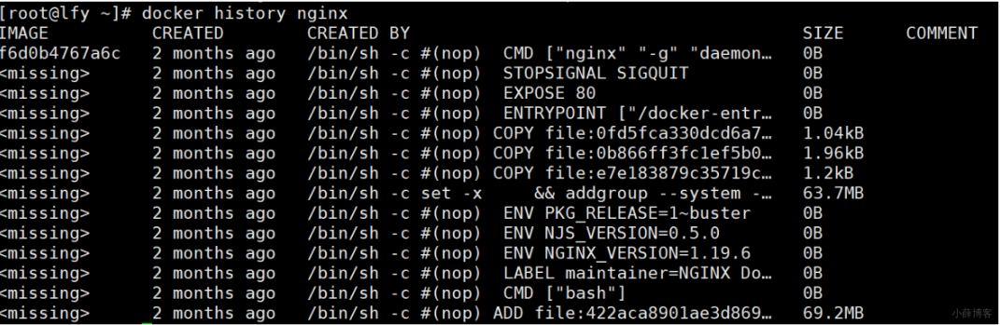

```sh
nginx这个镜像怎么存的
使用：docker image inspect nginx
```

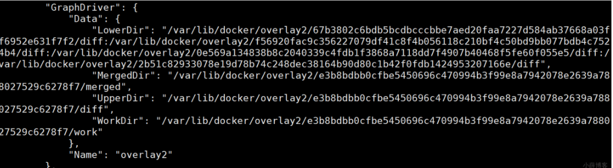

> 指示了镜像怎么存的
>
> LowerDir ：底层目录; diff（只是存储不同）；包含小型linux和装好的软件

```sh
/var/lib/docker/overlay2/67b3802c6bdb5bcdbcccbbe7aed20faa7227d584ab37668a03ff6952e631f7f2/diff：用户文件；

/var/lib/docker/overlay2/f56920fac9c356227079df41c8f4b056118c210bf4c50bd9bb077bdb4c7524b4/diff： nginx的启动命令放在这里

/var/lib/docker/overlay2/0e569a134838b8c2040339c4fdb1f3868a7118dd7f4907b40468f5fe60f055e5/diff： nginx的配置文件在这里

/var/lib/docker/overlay2/2b51c82933078e19d78b74c248dec38164b90d80c1b42f0fdb1424953207166e/diff: 小linux系统
```

- 倒着看

- - 小linux系统（FROM apline） + Dockerfile的每一个命令可能都引起了系统的修改，所以和git一样，只记录变化

    ```sh
    ls -i
    ```

    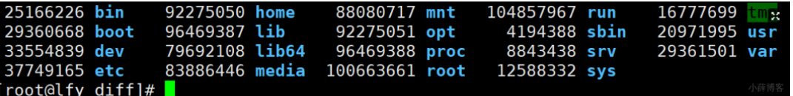

- - 我们进入到这个镜像启动的容器，容器的文件系统就是镜像的；
  - docker ps -s；可以看到这个容器真正用到的文件大小
  - 容器会自己建立层；如果想要改东西，把改的内容复制到容器层即可 docker inspect container

```text
"LowerDir":
"/var/lib/docker/overlay2/41e4fa41a2ad1dca9616d4c8254a04c4d9d6a3d462
c862f1e9a0562de2384dbc-
init/diff:/var/lib/docker/overlay2/e3b8bdbb0cfbe5450696c470994b3f99e
8a7942078e2639a788027529c6278f7/diff:/var/lib/docker/overlay2/67b380
2c6bdb5bcdbcccbbe7aed20faa7227d584ab37668a03ff6952e631f7f2/diff:/var
/lib/docker/overlay2/f56920fac9c356227079df41c8f4b056118c210bf4c50bd
9bb077bdb4c7524b4/diff:/var/lib/docker/overlay2/0e569a134838b8c20403
39c4fdb1f3868a7118dd7f4907b40468f5fe60f055e5/diff:/var/lib/docker/ov
erlay2/2b51c82933078e19d78b74c248dec38164b90d80c1b42f0fdb14249532071
66e/diff",
       "MergedDir":
"/var/lib/docker/overlay2/41e4fa41a2ad1dca9616d4c8254a04c4d9d6a3d462
c862f1e9a0562de2384dbc/merged",
       "UpperDir": （镜像的上层可以感知变
化）"/var/lib/docker/overlay2/41e4fa41a2ad1dca9616d4c8254a04c4d9d6a3d
462c862f1e9a0562de2384dbc/diff",【容器的修改后的文件，保存再宿主机哪里呀。
容器删除后，那些容器目录还存在吗？一定不在】
       "WorkDir":
"/var/lib/docker/overlay2/41e4fa41a2ad1dca9616d4c8254a04c4d9d6a3d462
c862f1e9a0562de2384dbc/work"
```

- MergedDir ：合并目录；容器最终的完整工作目录全内容都在合并层；数据卷在容器层产生；所有的增删改都在容器层；

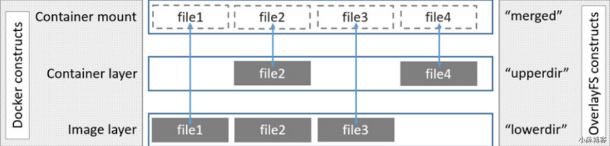

- UpperDir ：上层目录；
- WorkDir ：工作目录（临时层），pid；

> LowerDir（底层）\UpperDir（）\MergedDir\WorkDir(临时东西)
>
> docker底层的 storage driver完成了以上的目录组织结果；

哪些东西适合容器运行？

- docker启动一个MySQL，默认什么都不做？
- MySQL就会丢失数据
- - 文件挂载
  - docker commit：能提交，MySQL的容器，也能提交。100G；100G，一般不采用这种方式

#### 1、Images and layers

Docker映像由一系列层组成。 每层代表图像的Dockerfile中的一条指令。 除最后一层外的每一层都是只读的。 如以下Dockerfile：

- Dockerfile文件里面几句话，镜像就有几层

```dockerfile
FROM ubuntu:15.04
COPY . /app
RUN make /app
CMD python /app/app.py
# 每一个指令都可能会引起镜像改变，这些改变类似git的方式逐层叠加。
```

> 该Dockerfile包含四个命令，每个命令创建一个层。
>
> FROM语句从ubuntu：15.04映像创建一个图层开始。
>
> COPY命令从Docker客户端的当前目录添加一些文件。
>
> RUN命令使用make命令构建您的应用程序。
>
> 最后，最后一层指定要在容器中运行的命令。
>
> 每一层只是与上一层不同的一组。 这些层彼此堆叠。
>
> 创建新容器时，可以在基础层之上添加一个新的可写层。 该层通常称为“容器层”。 对运行中的容器所做的所有更改（例如写入新文件，修改现有文件和删除文件）都将写入此薄可写容器层。

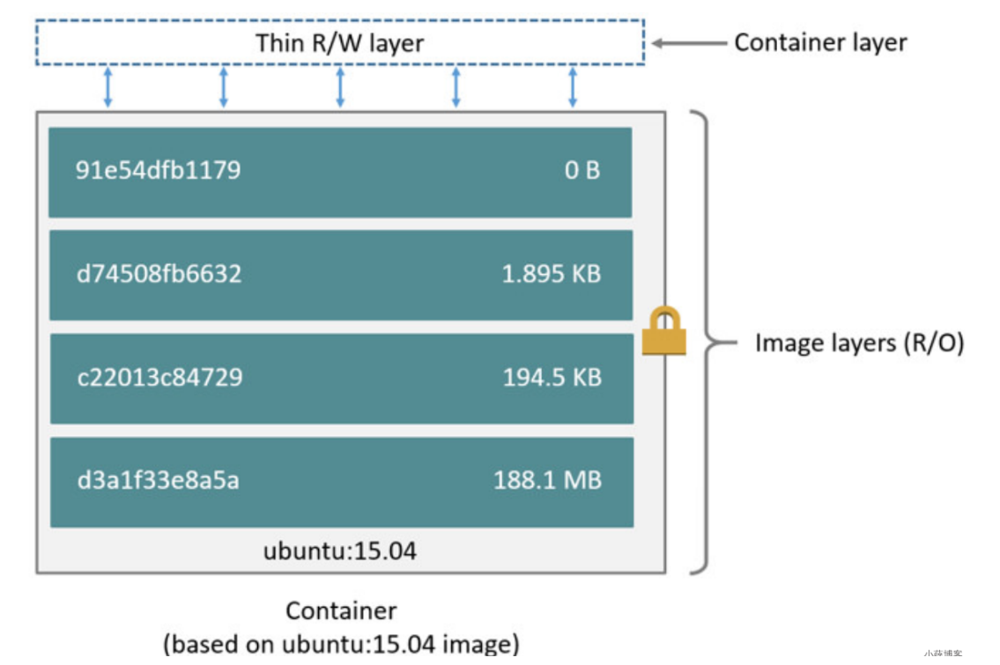

#### 2、Container and layers

> - 容器和镜像之间的主要区别是可写顶层。
> - 在容器中添加新数据或修改现有数据的所有写操作都存储在此可写层中。
> - 删除容器后，可写层也会被删除。 基础图像保持不变。 因为每个容器都有其自己的可写容器层，并且所有更改都存储在该容器层中，所以多个容器可以共享对同一基础映像的访问，但具有自己的数据状态。

- 下图显示了共享同一Ubuntu 15.04映像的多个容器。

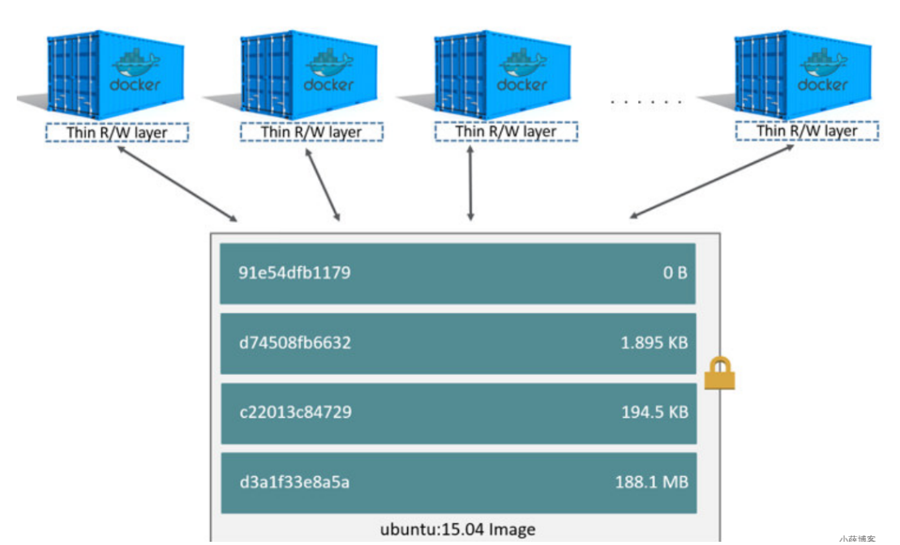

#### 3、磁盘容量预估

> docker ps -s
>
> size：用于每个容器的可写层的数据量（在磁盘上）。
>
> virtual size：容器使用的用于只读图像数据的数据量加上容器的可写图层大小。
>
> 多个容器可以共享部分或全部只读图像数据。
>
> 从同一图像开始的两个容器共享100％的只读数据，而具有不同图像的两个容器（具有相同的层）共享这些公共层。 因此，不能只对虚拟大小进行总计。这高估了总磁盘使用量，可能是一笔不小的数目。

#### 4、镜像如何挑选

> busybox：是一个集成了一百多个最常用Linux命令和工具的软件。linux工具里的瑞士军刀
>
> alpine：Alpine操作系统是一个面向安全的轻型Linux发行版经典最小镜像，基于busybox，功能比Busybox完善。
>
> slim：docker hub中有些镜像有slim标识，都是瘦身了的镜像。也要优先选择
>
> 无论是制作镜像还是下载镜像，优先选择alpine类型.

#### 5、Copy On Write

- 写时复制是一种共享和复制文件的策略，可最大程度地提高效率。
- 如果文件或目录位于映像的较低层中，而另一层（包括可写层）需要对其进行读取访问，则它仅使用现有文件。
- 另一层第一次需要修改文件时（在构建映像或运行容器时），将文件复制到该层并进行修改。 这样可以将I / O和每个后续层的大小最小化。

### 2、容器如何挂载

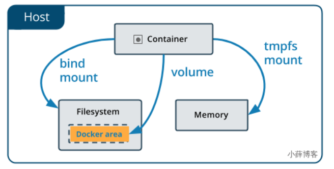

每一个容器里面的内容，支持三种挂载方式：

1）、docker自动在外部创建文件夹自动挂载容器内部指定的文件夹内容【Dockerfile VOLUME指令的作用】

2）、自己在外部创建文件夹，手动挂载

3）、可以把数据挂载到内存中。

--mount 挂载到 linux宿主机，手动挂载（**不用了**）

-v 可以自动挂载，到linux主机或者docker自动管理的这一部分区域

- Volumes(卷) ：存储在主机文件系统的一部分中，该文件系统由Docker管理（在Linux上是“ /var/lib/docker/ volumes/”）。 非Docker进程不应修改文件系统的这一部分。 **卷是在Docker中持久存储数据的最佳方法**。
- Bind mounts(绑定挂载) 可以在任何地方 存储在主机系统上。 它们甚至可能是重要的系统文件或目录。 Docker主机或Docker容器上的非Docker进程可以随时对其进行修改。
- tmpfs mounts(临时挂载) 仅存储在主机系统的内存中，并且永远不会写入主机系统的文件系统。

#### 1、volume(卷)

- **匿名卷使用**

```sh
docker run -dP -v /etc/nginx nginx
# docker将创建出匿名卷，并保存容器/etc/nginx下面的内容
# -v 宿主机:容器里的目录 
```

- **具名卷使用**

```sh
docker run -dP -v nginx:/etc/nginx nginx
#docker将创建出名为nginx的卷，并保存容器/etc/nginx下面的内容
```

> 如果将空卷装入存在文件或目录的容器中的目录中，则容器中的内容（复制）到该卷中。
>
> 如果启动一个容器并指定一个尚不存在的卷，则会创建一个空卷。

`-v 宿主机绝对路径:Docker容器内部绝对路径：叫挂载；`**这个有空挂载问题**

`-v 不以/开头的路径:Docker容器内部绝对路径：叫绑定（docker会自动管理，docker不会把他当成目录，而把它当成卷）`

**以上用哪个比较好？？？？？？**

- 如果自己开发测试，用 -v 绝对路径的方式
- 如果是生产环境建议用卷
- 除非特殊 /bin/docker 需要挂载主机路径的则操作 绝对路径挂载

```sh
nginx--Docker
/usr/share/nginx/html

nginx测试html挂载几种不同情况：

1.不挂载 效果：访问默认欢迎页

2.挂载 -v /root/html:/usr/share/nginx/html 
效果：访问forbidden (空挂载)
docker run -dP -v /root/html:/usr/share/nginx/html nginx

3.具名卷 -v html:/usr/share/nginx/html:ro 效果：访问默认欢迎页(:ro 表示容器内只读)
docker run -dP -v html:/usr/share/nginx/html:ro nginx

4.匿名卷 -v /usr/share/nginx/html （什么都不写也不要加冒号，直接写容器内的目录）
docker run -dP -v /usr/share/nginx/html nginx

原因：
-v html:/usr/share/nginx/html;
# -v不以绝对路径方式；
### 1、先在docker底层创建一个你指定名字的卷（具名卷） html
### 2、把这个卷和容器内部目录绑定
### 3、容器启动以后，目录里面的内容就在卷里面存着；
##### -v nginxhtml:/usr/share/nginx/html 也可以以下操作
## 1、 docker create volume nginxhtml 如果给卷里面就行修改，容器内部的也就改了。
## 2、 docker volume inspect nginxhtml
## 3、docker run -d -P -v nginxhtml:/usr/share/nginx/html --
# docker inspect 容器的时候可以看到
"Mounts": [
     {
        "Type": "volume", //这是个卷
        "Name": "html",  //名字是html
        "Source": "/var/lib/docker/volumes/html/_data",  //宿主机的目录。容器里面的那两个文件都在
        "Destination": "/usr/share/nginx/html",  //容器内部
        "Driver": "local",
        "Mode": "z",
        "RW": true,  //读写模式
        "Propagation": ""
     }
   ]
#卷：就是为了保存数据
docker volume  #可以对docker自己管理的卷目录进行操作；
/var/lib/docker/volumes(卷的根目录)
```

#### 2、bind mount

> 如果将绑定安装或非空卷安装到存在某些文件或目录的容器中的目录中，则这些文件或目录会被安装遮盖。就像将文件保存到Linux主机上的/mnt中一样，然后将USB驱动器安装到/mnt中。在卸载USB驱动器之前，/mnt的内容将被USB驱动器的内容遮盖。 被遮盖的文件不会被删除或更改，但是在安装绑定安装或卷时将无法访问。
>
> 总结：外部目录覆盖内部容器目录内容，但不是修改。所以谨慎，外部空文件夹挂载方式也会导致容器内部是空文件夹。（`空挂载问题`）

```text
docker run -dP -v /my/nginx:/etc/nginx nginx

# bind mount和 volumes 的方式写法区别在于 
# 所有以/开始的都认为是 bind mount ，不以/开始的都认为是 volumes.
```

警惕bind mount 方式，文件挂载没有在外部准备好内容而导致的容器启动失败问题

```sh
# 一行命令启动nginx，并且配置文件和html页面。需要知道卷的位置才能改 
docker run -d -P -v nginxconf:/etc/nginx/ -v nginxpage:/usr/share/nginx/html nginx 
# 想要实现 docker run -d -P -v /root/nginxconf:/etc/nginx/ -v /root/nginxhtml:/usr/share/nginx/html --name=nginx999 nginx 
### 1、提前准备好东西 目录nginxconf，目录里面的配置文件都放里面，再调用命令 
### 2、docker cp nginxdemo:/etc/nginx /root/nginxconf #注意/的使用 
### 3、docker run -d -P -v /root/nginxconf:/etc/nginx/ -v /root/nginxhtml:/usr/share/nginx/html --name=nginx999 nginx
```

### 3、管理卷

```text
docker volume create xxx：创建卷名
docker volume inspect xxx：查询卷详情
docker volume ls: 列出所有卷
docker volume prune: 移除无用卷
```

### 4、docker cp

cp的细节

```sh
docker cp [OPTIONS] CONTAINER:SRC_PATH DEST_PATH|- ：把容器里面的复制出来
docker cp [OPTIONS] SRC_PATH|- CONTAINER:DEST_PATH：把外部的复制进去
```

- SRC_PATH 指定为一个**文件**

- - DEST_PATH 不存在：文件名为 DEST_PATH ，内容为SRC的内容

    ```sh
    # 复制index.html 到nginx的/usr/share/nginx/html/test/(test目录不存在)目录下
    # 不以斜杠结尾
    docker cp index.html nginx:/usr/share/nginx/html/test
    # 文件名为test，内容为index.html内容
    ```

  - DEST_PATH 不存在并且以 / 结尾：报错

    ```sh
    # 复制index.html 到nginx的/usr/share/nginx/html/test/(test目录不存在)目录下
    docker cp index.html nginx:/usr/share/nginx/html/test/
    
    # 报错
    no such directory
    ```

  - DEST_PATH 存在并且是文件：目标文件内容被替换为SRC_PATH的文件内容。

    ```sh
    # 如果test文件存在并且是文件 index.html内容会覆盖test文件的内容，文件名不变
    docker cp index.html nginx:/usr/share/nginx/html/test
    ```

  - DEST_PATH 存在并且是目录：文件复制到目录内，文件名为SRC_PATH指定的名字

    ```sh
    # 如果test文件存在并且是文件夹，index.html会复制到test目录下，文件名就是index.html
    docker cp index.html nginx:/usr/share/nginx/html/test
    ```

  ```sh
  docker cp [OPTIONS] CONTAINER:SRC_PATH DEST_PATH|- ：把容器里面的复制出来
  docker cp [OPTIONS] SRC_PATH|- CONTAINER:DEST_PATH：把外部的复制进去
  ```

- SRC_PATH 指定为一个**目录**

- - DEST_PATH 不存在： DEST_PATH 创建文件夹，复制源文件夹内的所有内容

    ```sh
    # testdir 文件夹，容器内会创建文件夹，并复制文件夹内的所有内容
    docker cp testdir nginx:/usr/share/nginx/html
    ```

  - DEST_PATH 存在，是文件：报错

    ```sh
    # 如果容器内testdir2是文件，会报错
    docker cp testdir2 nginx:/usr/share/nginx/html/testdir2
    ```

  - DEST_PATH 存在是目录

- - - SRC_PATH 不以 /. 结束：源文件夹复制到目标里面

      ```sh
      # testdir不以/.结束，会把testdir整个文件夹复制到testdir2里面去
      docker cp testdir nginx:/usr/share/nginx/html/testdir2
      ```

    - SRC_PATH 以 /. 结束：源文件夹里面的内容复制到目标里面

      ```sh
      # testdir以/.结束，会把testdir文件夹里面的内容复制到testdir2里面去
      docker cp testdir/. nginx:/usr/share/nginx/html/testdir2
      ```

自动创建文件夹不会做递归。把父文件夹做好

```sh
# 本地文件复制到容器
docker cp index.html mynginx4:/usr/share/nginx/html

# 从容器中复制出来
docker cp mynginx4:/etc/nginx/nginx.conf nginx.conf
```

## 2、Docker网络

### 1、Docker启动后，网络情况

会产生一个名为 **docker0** 的虚拟网桥

```sh
# 查看docker网络模式命令
docker network ls
```

**容器间的互联和通信以及端口映射**

**容器IP变动时候可以通过服务名直接网络通信而不受到影响**

### 2、常用命令

```sh
# 所有命令
docker network --help

# 创建网络
docker network create XXX网络名字

# 查看网络
docker network ls

# 查看网络源数据
docker network inspect  XXX网络名字

# 删除网络
docker network rm XXX网络名字
```

### 3、网络模式

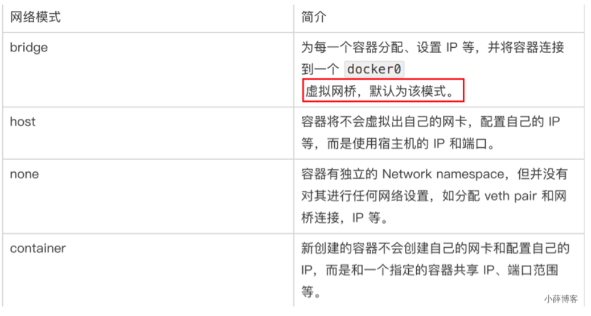

- bridge模式：使用--network bridge指定，默认使用docker0
- host模式：使用--network host指定
- none模式：使用--network none指定
- container模式：使用--network container:NAME或者容器ID指定

**docker容器内部的ip是有可能会发生改变的**

#### 1、bridge

Docker 服务默认会创建一个 docker0 网桥（其上有一个 docker0 内部接口），该桥接网络的名称为docker0，它在 **内核层** 连通了其他的物理或虚拟网卡，这就将所有容器和本地主机都放到 **同一个物理网络** 。Docker 默认指定了 docker0 接口 的 IP 地址和子网掩码， **让主机和容器之间可以通过网桥相互通信**。

```sh
# 查看 bridge 网络的详细信息，并通过 grep 获取名称项 
docker network inspect bridge | grep name

ifconfig | grep docker
```

> 1、Docker使用Linux桥接，在宿主机虚拟一个Docker容器网桥(docker0)，Docker启动一个容器时会根据Docker网桥的网段分配给容器一个IP地址，称为Container-IP，同时Docker网桥是每个容器的默认网关。因为在同一宿主机内的容器都接入同一个网桥，这样容器之间就能够通过容器的Container-IP直接通信。
>
> 2、docker run 的时候，没有指定network的话默认使用的网桥模式就是bridge，使用的就是docker0 。在宿主机ifconfig,就可以看到docker0和自己create的network(后面讲)eth0，eth1，eth2……代表网卡一，网卡二，网卡三…… ，lo代表127.0.0.1，即localhost ，inet addr用来表示网卡的IP地址
>
> 3、网桥docker0创建一对对等虚拟设备接口一个叫veth，另一个叫eth0，成对匹配。
>
> 1） 整个宿主机的网桥模式都是docker0，类似一个交换机有一堆接口，每个接口叫veth，在本地主机和容器内分别创建一个虚拟接口，并让他们彼此联通（这样一对接口叫veth pair）；
>
> 2） 每个容器实例内部也有一块网卡，每个接口叫eth0；
>
> 3）docker0上面的每个veth匹配某个容器实例内部的eth0，两两配对，一 一匹配。
>
> 通过上述，将宿主机上的所有容器都连接到这个内部网络上，两个容器在同一个网络下,会从这个网关下各自拿到分配的ip，此时两个容器的网络是互通的。
>
> 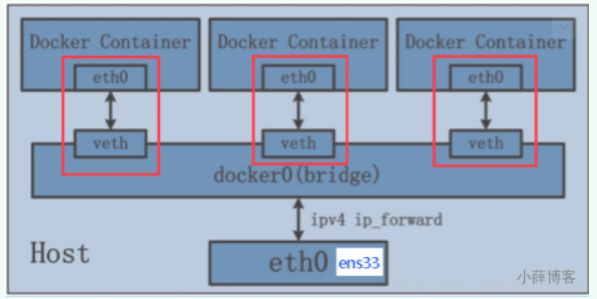

```sh
docker run -d -p 8081:8080   --name tomcat81 billygoo/tomcat8-jdk8
docker run -d -p 8082:8080   --name tomcat82 billygoo/tomcat8-jdk8

docker exec -it tomcat81 bash
ip addr
docker exec -it tomcat82 bash
ip addr

# 查看 eth0
```

#### 2、host

直接使用宿主机的 IP 地址与外界进行通信，不再需要额外进行NAT 转换。

容器将不会获得 一个独立的Network Namespace， 而是和宿主机共用一个Network Namespace。 容器将不会虚拟出自己的网卡而是使用宿主机的IP和端口。

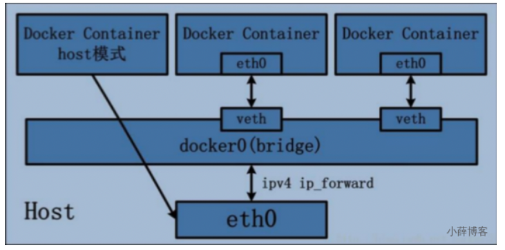

> ```sh
> # 警告
> docker run -d -p 8083:8080 --network host --name tomcat83 billygoo/tomcat8-jdk8
> ```
>
> 问题：
>
> docke启动时总是遇见标题中的警告
>
> 原因：
>
> docker启动时指定--network=host或-net=host，如果还指定了-p映射端口，那这个时候就会有此警告，
>
> 并且通过-p设置的参数将不会起到任何作用，端口号会以主机端口号为主，重复时则递增。
>
> 解决:
>
> 解决的办法就是使用docker的其他网络模式，例如--network=bridge，这样就可以解决问题，或者直接无视.
>
> ```sh
> # 正确
> docker run -d --network host --name tomcat83 billygoo/tomcat8-jdk8
> ```
>
> 无之前的配对显示了，看容器实例内部
>
> ```sh
> docker inspect tomcat83 | tail -n 20
> ```
>
> 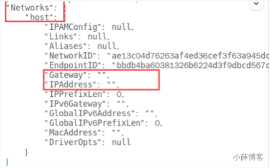
>
> **没有设置-p的端口映射了，如何访问启动的tomcat83？**
>
> http://宿主机IP:8080/
>
> 在CentOS里面用默认的火狐浏览器访问容器内的tomcat83看到访问成功，因为此时容器的IP借用主机的，
>
> 所以容器共享宿主机网络IP，这样的好处是外部主机与容器可以直接通信。

#### 3、none

在none模式下，并不为Docker容器进行任何网络配置。

也就是说，这个Docker容器没有网卡、IP、路由等信息，只有一个lo

需要我们自己为Docker容器添加网卡、配置IP等。

**禁用网络功能，只有lo标识(就是127.0.0.1表示本地回环)**

> ```sh
> docker run -d -p 8084:8080 --network none --name tomcat84 billygoo/tomcat8-jdk8 
> 
> # 进入容器内部查看
> docker exec -it tomcat84 | tail -n 20
> ```
>
> 

#### 4、container

新建的容器和已经存在的一个容器共享一个网络ip配置而不是和宿主机共享。新创建的容器不会创建自己的网卡、配置自己的IP，而是和一个指定的容器共享IP、端口范围等。同样，两个容器除了网络方面，其他的如文件系统、进程列表等还是隔离的。

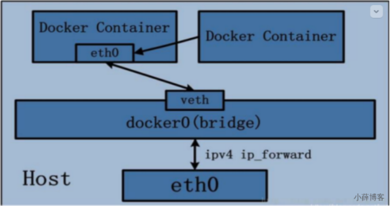

> Alpine Linux 是一款独立的、非商业的通用 Linux 发行版，专为追求安全性、简单性和资源效率的用户而设计。 可能很多人没听说过这个 Linux 发行版本，但是经常用 Docker 的朋友可能都用过，因为他小，简单，安全而著称，所以作为基础镜像是非常好的一个选择，可谓是麻雀虽小但五脏俱全，镜像非常小巧，不到 6M的大小，所以特别适合容器打包。
>
> ```sh
> # 正确
> docker run -it --name alpine1  alpine /bin/sh
> docker run -it --network container:alpine1 --name alpine2  alpine /bin/sh
> 
> # 运行结果，验证共用搭桥
> # 查看eth0
> 
> # 假如此时关闭alpine1，再看看alpine2
> ip addr
> # eth0消失了
> ```

#### 5、自定义网络

**link 已过时**

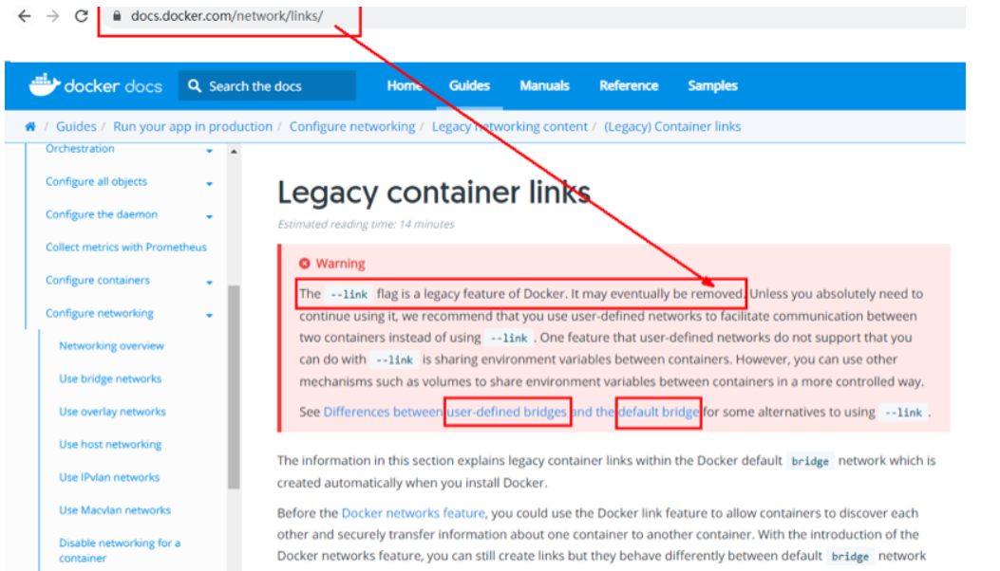

> ```sh
> docker run -d -p 8081:8080  --name tomcat81 billygoo/tomcat8-jdk8
> docker run -d -p 8082:8080  --name tomcat82 billygoo/tomcat8-jdk8
> # 上述成功启动并用docker exec进入各自容器实例内部
> docker exec -it tomcat81 bash
> docker exec -it tomcat82 bash
> # 按照IP地址ping是OK的
> 
> # 按照服务名ping结果???
> ## 不行
> ```
>
> 
>
> ```sh
> # 自定义桥接网络,自定义网络默认使用的是桥接网络bridge
> # 新建自定义网络
> docker network create xue_network
> 
> # 新建容器加入上一步新建的自定义网络
> docker run -d -p 8081:8080 --network xue_network  --name tomcat81 billygoo/tomcat8-jdk8
> docker run -d -p 8082:8080 --network xue_network  --name tomcat82 billygoo/tomcat8-jdk8
> 
> # 按照服务名ping是OK的
> ```
>
> 
>
> **自定义网络本身就维护好了主机名和ip的对应关系（ip和域名都能通）**
>
> **自定义网络本身就维护好了主机名和ip的对应关系（ip和域名都能通）**
>
> **自定义网络本身就维护好了主机名和ip的对应关系（ip和域名都能通）**

### 4、端口映射

```sh
docker create -p 3306:3306 -e MYSQL_ROOT_PASSWORD=123456 --name hello-mysql mysql:5.7
```

### 5、容器互联

> --link name:alias ，name连接容器的名称，alias连接的别名

场景：我们无需暴露mysql的情况下，让web应用使用mysql；

```sh
docker run -d -e MYSQL_ROOT_PASSWORD=123456 --name mysql01 mysql:5.7
docker run -d --link mysql01:mysql --name tomcat tomcat:7
docker exec -it tomcat bash
cat /etc/hosts
ping mysql
```

### 6、自定义网络（原理）

#### 1、默认网络原理

Docker使用Linux桥接，在宿主机虚拟一个Docker容器网桥(docker0)，Docker启动一个容器时会根据Docker网桥的网段分配给容器一个IP地址，称为Container-IP，同时Docker网桥是每个容器的默认网关。因为在同一宿主机内的容器都接入同一个网桥，这样容器之间就能够通过容器的Container-IP直接通信。

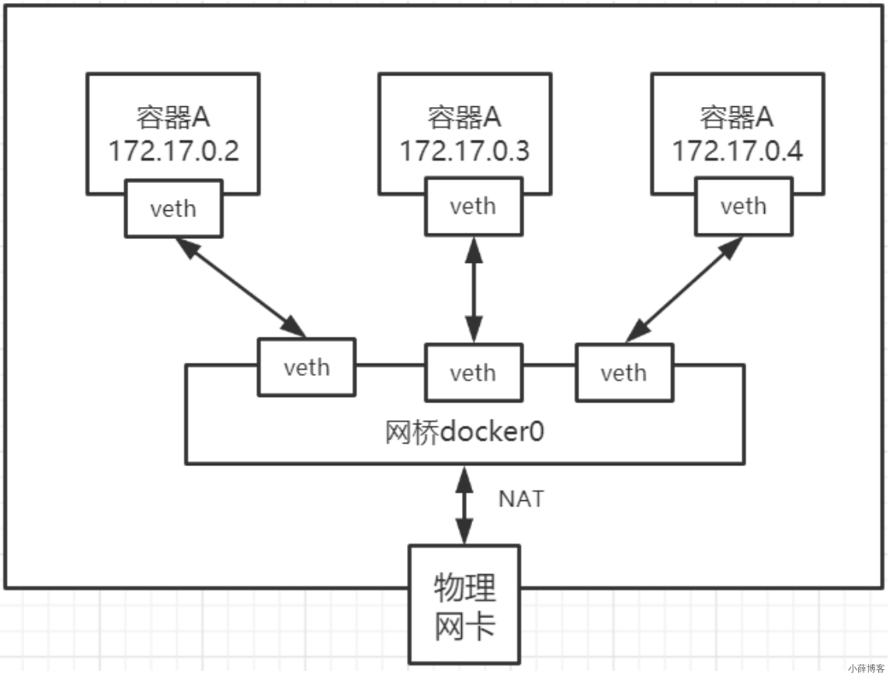

`Linux虚拟网络技术`:

> Docker容器网络就很好的利用了Linux虚拟网络技术，在本地主机和容器内分别创建一个虚拟接口，并让
>
> 他们彼此联通（这样一对接口叫veth pair）；
>
> Docker中的网络接口默认都是虚拟的接口。虚拟接口的优势就是转发效率极高（**因为Linux是在内核中进**
>
> **行数据的复制来实现虚拟接口之间的数据转发，无需通过外部的网络设备交换**），对于本地系统和容器
>
> 系统来说，虚拟接口跟一个正常的以太网卡相比并没有区别，只是他的速度快很多。

原理：

1、每一个安装了Docker的linux主机都有一个docker0的虚拟网卡。桥接网卡

2、每启动一个容器linux主机多了一个虚拟网卡。

3、docker run -d -P --name tomcat --net bridge tomcat:8

#### 2、网络模式

| 网络模式      | 配置                    | 说明                                                         |
| ------------- | ----------------------- | ------------------------------------------------------------ |
| bridge模式    | --net=bridge            | 默认值，在Docker网桥docker0上为容器创建新的网络栈            |
| none模式      | --net=none              | 不配置网络，用户可以稍后进入容器，自行配置                   |
| container模式 | --net=container:name/id | 容器和另外一个容器共享Network namespace。kubernetes中的pod就是多个容器共享一个Network namespace。 |
| host模式      | --net=host              | 容器和宿主机共享Network namespace                            |
| 用户自定义    | --net=自定义网络        | 用户自己使用network相关命令定义网络,创建容器的时候可以指定为自己定义的网络 |

#### 3、自建网络测试

```sh
#1、docker0网络的特点。，
默认、域名访问不通、--link 域名通了，但是删了又不行
#2、可以让容器创建的时候使用自定义网络
1、自定义创建的默认default "bridge"
2、自定义创建一个网络网络
docker network create --driver bridge --subnet 192.168.0.0/16 --gateway 192.168.0.1 mynet
docker run -d -P --name=tomcat1 --network=mynet tomcat:jre8-alpine
docker run -d -P --name=redisserver --network=mynet redis
# 以上tomcat和redis可以互相ping通
# 对于没有ping命令的容器可以这样测试
docker run -it --network container:redisserver alpine
# 所有东西实时维护好，直接域名ping通
docker network connect [OPTIONS] NETWORK CONTAINER
#3、跨网络连接别人就用。把tomcat加入到mynet网络
docker network connect mynet tomcat
效果：
1、自定义网络，默认都可以用主机名访问通
2、跨网络连接别人就用 docker network connect mynet tomcat
#4、命令
1、容器启动，指定容器ip。 docker run --ip 192.168.0.3 --net 自定义网络 
2、创建子网。docker network create --subnet 指定子网范围  --driver bridge 所有东西实时
维护好，直接域名ping同
3、docker compose 中的网络默认就是自定义网络方式
```

### 7、Docker平台架构

Docker 运行的基本流程为：

1. 用户是使用 Docker Client 与 Docker Daemon 建立通信，并发送请求给后者。
2. Docker Daemon 作为 Docker 架构中的主体部分，首先提供 Docker Server 的功能使其可以接受 Docker Client 的请求。
3. Docker Engine 执行 Docker 内部的一系列工作，每一项工作都是以一个 Job 的形式的存在。
4. Job 的运行过程中，当需要容器镜像时，则从 Docker Registry 中下载镜像，并通过镜像管理驱动 Graph driver将下载镜像以Graph的形式存储。
5. 当需要为 Docker 创建网络环境时，通过网络管理驱动 Network driver 创建并配置 Docker 容器网络环境。
6. 当需要限制 Docker 容器运行资源或执行用户指令等操作时，则通过 Execdriver 来完成。
7. Libcontainer是一项独立的容器管理包，Network driver以及Exec driver都是通过Libcontainer来实现具体对容器进行的操作。

# Dockerfile

**Dockerfile由一行行命令语句组成，并且支持以#开头的注释行。基础的小linux系统。jdk； 一般而言，Dockerfile可以分为四部分**

```
基础镜像信息` `维护者信息` `镜像操作指令` `启动时执行指令
```

| **指令**    | **说明**                                                     |
| ----------- | ------------------------------------------------------------ |
| FROM        | 指定基础镜像                                                 |
| MAINTAINER  | 指定维护者信息，已经**过时**，可以使用LABEL maintainer=xxx 来替代 |
| LABEL       | 指定维护者信息 maintainer=xxx auth=xueqimiao a=b (语法 k=v ) |
| RUN         | 运行命令 代表**镜像构建过程中运行的命令**                    |
| CMD         | 指定启动容器时默认的命令 **容器启动时要执行的命令**          |
| ENTRYPOINT  | **指定镜像的默认入口.运行命令**                              |
| EXPOSE      | 声明镜像内服务监听的端口                                     |
| ENV         | 指定**环境变量**，可以在docker run的时候使用-e改变，会被固化到image的config里面 |
| ADD         | 复制指定的src路径下的内容到容器中的dest路径下，src可以为url会自动下载，可以为tar文件，会自动解压 |
| COPY        | 复制本地主机的src路径下的内容到镜像中的dest路径下，但不会自动解压等 |
| LABEL       | 指定生成镜像的元数据标签信息                                 |
| VOLUME      | 创建数据卷挂载点                                             |
| USER        | 指定运行容器时的用户名或UID                                  |
| WORKDIR     | 配置工作目录，为后续的RUN、CMD、ENTRYPOINT指令配置工作目录   |
| ARG         | 指定镜像内使用的参数（如版本号信息等），可以在build的时候，使用--build-args改变 |
| OBBUILD     | 配置当创建的镜像作为其他镜像的基础镜像是，所指定的创建操作指令 |
| STOPSIGNAL  | 容器退出的信号值                                             |
| HEALTHCHECK | 健康检查                                                     |
| SHELL       | 指定使用shell时的默认shell类型                               |

## 1、FROM

**FROM 指定基础镜像，最好挑一些apline，slim之类的基础小镜像.指定一个已经存在的镜像作为模板**，`第一条必须是from`

**scratch镜像是一个空镜像，常用于多阶段构建**

**如何确定我需要的基础镜像？**

- Java应用当然是java基础镜像（SpringBoot应用）或者Tomcat基础镜像（War应用）
- JS模块化应用一般用nodejs基础镜像
- 其他各种语言用自己的服务器或者基础环境镜像，如python、golang、java、php等

```sh
# 注释
# 基础镜像
FROM alpine

# 给镜像加标签
LABEL auth = xueqimiao

# 运行的指令 默认是使用id=0的用户 也就是root 是这个基础系统的root用户
# 代表镜像构建过程中运行的命令
RUN echo 111

# 容器启动时要执行的命令
# 镜像启动如果要运行很长、很多命令 可以准备一个sh文件 让镜像启动运行sh文件（大多数镜像这么操作）
CMD sleep 10;echo success
```

## 2、LABEL、MAINTAINER

标注镜像的一些说明信息。镜像维护者的姓名和邮箱地址

```sh
LABEL multi.label1="value1" multi.label2="value2" other="value3"
LABEL multi.label1="value1" \
  multi.label2="value2" \
  other="value3"
```

## 3、RUN

- RUN指令在当前镜像层顶部的新层执行任何命令，并提交结果，生成新的镜像层。
- 生成的提交映像将用于Dockerfile中的下一步。 分层运行RUN指令并生成提交符合Docker的核心概念，就像源代码控制一样。
- exec形式可以避免破坏shell字符串，并使用不包含指定shell可执行文件的基本映像运行RUN命令。可以使用SHELL命令更改shell形式的默认shell。 在shell形式中，您可以使用\（反斜杠）将一条RUN指令继续到下一行
- RUN是在 docker build时运行

```sh
# shell格式
RUN yum -y install vim

# exec格式
RUN ["可执行文件","参数1","参数2"]
```

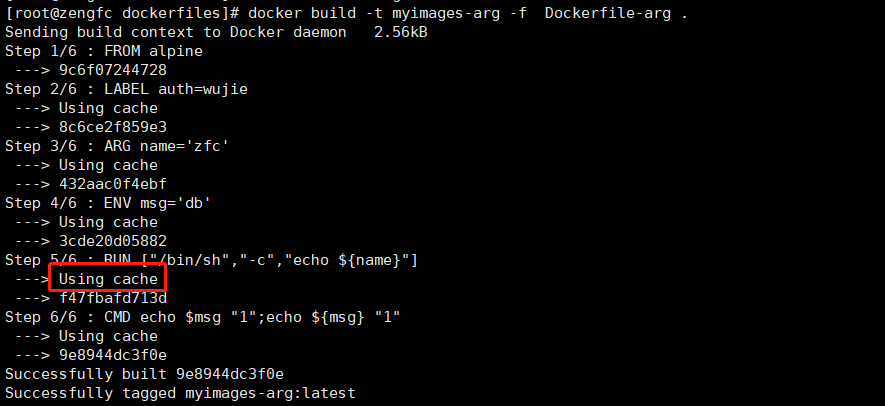

```sh
# --no-cache 不使用缓存构建
docker build --no-cache  -t myalpine:v111 -f D2 .
```


```sh
FROM alpine
LABEL auth=wujie
ARG name='zfc' 
ENV msg='db'
# shell* 形式； 
RUN echo $name;echo ${name}
# exec 形式: 
RUN ["/bin/sh","-c","echo ${name}"]
RUN ["/bin/sh","-c","echo $name"]
```

## 4、CMD和ENTRYPOINT

### 1、都可以作为容器启动入口

CMD 的三种写法：

```sh
CMD ["executable","param1","param2"] ( exec 方式, 首选方式)
CMD ["param1","param2"] (为ENTRYPOINT提供默认参数)
CMD command param1 param2 ( shell 形式)
```

ENTRYPOINT 的两种写法：

```sh
ENTRYPOINT ["executable", "param1", "param2"] ( exec 方式, 首选方式)
ENTRYPOINT command param1 param2 (shell 形式)
# 一个示例
FROM alpine
LABEL maintainer=xueqimiao

CMD ["1111"]
CMD ["2222"]
ENTRYPOINT ["echo"]

#构建出如上镜像后测试
docker run xxxx：效果 echo 2222
```

### 2、只能有一个CMD

- Dockerfile中只能有一个CMD和ENTRYPOINT 指令。 如果您列出多个，则只有最后一个才会生效。
- CMD的主要目的是为执行中的容器提供默认值。 这些默认值可以包含可执行文件，也可以省略可执行文件，在这种情况下，您还必须指定ENTRYPOINT指令。
- CMD会被 docker run 之后的参数替换。
- CMD和ENTRYPOINT是在docker run 时运行，`只能取env参数`。
- RUN是在 docker build时运行，`可以取arg和env参数`。
- 类似于 CMD 指令，但是ENTRYPOINT不会被docker run后面的命令覆盖，而且这些命令行参数会被当作参数送给 ENTRYPOINT 指令指定的程序。
- 在执行docker run的时候可以指定 ENTRYPOINT 运行所需的参数。

### 3、CMD为ENTRYPOINT提供默认参数

如果使用CMD为ENTRYPOINT指令提供默认参数，则CMD和ENTRYPOINT指令均应使用JSON数组格式指定。

ENTRYPOINT可以和CMD一起用，一般是 变参 才会使用 CMD ，这里的 CMD 等于是在给 ENTRYPOINT 传参。

当指定了ENTRYPOINT后，CMD的含义就发生了变化，不再是直接运行其命令而是将CMD的内容作为参数传递给ENTRYPOINT指令，他两个组合会变成 <ENTRYPOINT><CMD>

假设已通过 Dockerfile 构建了 nginx:test 镜像 ：

```dockerfile
FROM nginx

ENTRYPOINT ["nginx","-c"] # 定参
CMD ["/etc/nginx/nginx.conf"] # 变参
```

|  是否传参  |     安装dockerfile编写执行     |                      传参运行                      |
| :--------: | :----------------------------: | :------------------------------------------------: |
| Docker命令 |     docker run nginx:test      | docker run nginx:test /etc/nginx/**nginxnew.conf** |
|  实际命令  | nginx -c /etc/nginx/nginx.conf |       nginx -c /etc/nginx/**nginxnew.conf**        |

### 4、组合最终效果

```text
ENTRYPOINT ping baidu.com 怎么写都没用，容器启动都是以ENTRYPOINT的完整命令为准
```

|                           | 无 ENTRYPOINT                                                | ENTRYPOINT exec_entry p1_entry ENTRYPOINT ping baidu.com | ENTRYPOINT [“exec_entry”, “p1_entry”]          |
| ------------------------- | ------------------------------------------------------------ | -------------------------------------------------------- | ---------------------------------------------- |
| 无CMD                     | 错误 , 不允许的写法;容器没有启动命令                         | /bin/sh -c exec_entry p1_entry                           | exec_entry p1_entry                            |
| CMD [“exec_cmd”,“p1_cmd”] | exec_cmd p1_cmd CMD ["ping","baidu.com"]                     | /bin/sh -c exec_entry p1_entry                           | exec_entry p1_entryexec_cmd p1_cmd             |
| CMD[“p1_cmd”,“p2_cmd”]    | p1_cmd p2_cmd CMD [ "5","baidu.com" ]                        | /bin/sh -c exec_entry p1_entry                           | exec_entry p1_entry p1_cmd p2_cmd              |
| CMD exec_cmd p1_cmd       | /bin/sh -c exec_cmd p1_cmd CMD ["/bin/sh","-c","ping ${url}"] | /bin/sh -c exec_entry p1_entry                           | exec_entry p1_entry /bin/sh -c exec_cmd p1_cmd |
|                           |                                                              |                                                          |                                                |

```sh
FROM alpine
ENV url=baidu.com
# CMD ping ${url}
# 官方都是建议使用 []方式
# CMD ["/bin/sh","-c","ping ${url}"]
# ENTRYPOINT ping baidu.com + CMD怎么写都没用，容器启动都是以ENTRYPOINT的完整命令为准
# java -jar xxxx.jar --spring.profile=dev --server.port=8888

# 这两个合在一起不能是错误的命令

#官方推荐的写法,，变化的写CMD，而CMD是提供参数给ENTRYPOINT
# docker run imageName  cmd1  一旦传递了cmd1，CMD指定的所有参数都会被覆盖，
# 自定义参数的情况下一定要传完
CMD [ "5","baidu.com" ]
#exec的写法 不变的写 ENTRYPOINT；未来他是容器启动的唯一入口，
ENTRYPOINT [ "ping","-c" ]
```

### 5、docker run启动参数会覆盖CMD内容

> \# 一个示例
>
> FROM alpine
>
> LABEL maintainer=xueqimiao
>
> CMD ["1111"]
>
> ENTRYPOINT ["echo"]
>
> \#构建出如上镜像后测试
>
> docker run xxxx：什么都不传则 echo 1111
>
> docker run xxx arg1：传入arg1 则echo arg1

```sh
FROM alpine
# ENTRYPOINT: 入口（真正的门）
# ENTRYPOINT [ "ping" ]
# 命令（进门的时候带口令）
# 最终的用法: CMD是给ENTRYPOINT提供参数的
#CMD可以被修改
#CMD ping baidu.com

ENTRYPOINT ping baidu.com
# ENTRYPOINT + CMD = 容器的完整启动命令
# 这是启动命令
# ENTRYPOINT ping + CMD baidu.com = 错误
# 多个CMD只有最后一次生效
# CMD ping baidu.com
# ["echo","${param}"] 不是bash -c的方式，取不出环境变量信息
# echo $param     = ["/bin/sh","-c","多长的命令都写在这里  echo ${param}"]
# ENTRYPOINT或者CMD作为唯一入口，只能写一个，最后一个生效
# ENTRYPOINT ping baidu.com
# RUN，CMD，ENTRYPOINT
# []:  ["/bin/sh","-c"] = shell
# shell:
```

## 5、ARG和ENV

### 1、ARG

- ARG指令定义了一个变量，用户可以在构建时使用--build-arg = 传递，docker build命令会将其传递给构建器。
- --build-arg 指定参数会覆盖Dockerfile 中指定的同名参数
- 如果用户指定了 未在Dockerfile中定义的构建参数 ，则构建会输出 警告 。
- ARG只在构建期有效，运行期无效，`所以CMD和ENTRYPOINT无法引用`。

```sh
#docker build --no-cache --build-arg version=3.13.4 demo:test -f D2 .
#可以动态传入版本
#可以在任意位置定义 并在以后取值使用
#ARG version=latest
#FROM alpine:$version
FROM alpine
LABEL maintainer = xueqimiao
# 定义以后的剩下环节生效 不包括运行时
# 可以在构建时进行变化，docker build 时
# ARG 不像 env 不能并排写
ARG param=222
ARG msg="hello docker"
# 构建时传入ARG
# docker build --no-cache --build-arg param=333 --build-arg msg=xue -t demo:test -f D2 .
# 构建时期会运行的指令(根据Dockerfile创建一个镜像的整个过程时期)
RUN echo $param
RUN echo $msg
# 运行时期我们会运行的指令（根据之前创建的镜像启动一个容器，容器启动默认运行的命令）
#CMD echo 1111;echo $param
# CMD ENTRYPOINT 都是指定的运行时的指令
CMD ["/bin/sh","-c","echo 1111;echo $param"]
```

### 2、ENV

- 在构建阶段中所有后续指令的环境中使用，并且在许多情况下也可以内联替换。
- 引号和反斜杠可用于在值中包含空格。
- ENV 可以使用key value的写法，但是这种不建议使用了，后续版本可能会删除

```sh
ENV MY_MSG hello
ENV MY_NAME="John Doe"
ENV MY_DOG=Rex\ The\ Dog
ENV MY_CAT=fluffy
#多行写法如下
ENV MY_NAME="John Doe" MY_DOG=Rex\ The\ Dog \
 MY_CAT=fluffy
```

- `docker run -e 可以修改这些值`
- 容器运行时ENV值可以生效
- `ENV在image阶段就会被解析并持久化`（docker inspect image查看），参照下面示例

```dockerfile
FROM alpine
ENV arg=1111111
ENV runcmd=$arg
RUN echo $runcmd
CMD echo $runcmd
# 改变arg，会不会改变 echo的值，会改变哪些值，如果修改这些值?
```

### 3、综合测试示例

```sh
FROM alpine
ARG arg1=22222
ENV arg2=1111111
ENV runcmd=$arg1
RUN echo $arg1 $arg2 $runcmd
CMD echo $arg1 $arg2 $runcmd
```

### 4、ENV的坑

```sh
# ENV的坑
FROM alpine
#ARG msg=hello
# ENV 肯定能引用ARG的参数
#ENV name=${msg}
#RUN echo ${msg}
#RUN echo ${name}
ENV msg1=hello
ENV msg2=$msg1
# 以上构建期间就已经确定好值了
RUN echo ${msg1}
RUN echo ${msg2}
# msg1=msg2 没问题
# 如果运行期修改msg1的值
# docker run -it -e msg1=6666 demo:test
# 结果输出 msg1的值会改变 msg2的值是不会改变的 msg2还是hello
# 原因：docker build 的时候 env环境的信息会固话 直接在镜像配置里面就已经写死
# -e 只能修改当前env本身
# 运行期间能使用ENV 是因为ENV 固化到了镜像的配置
CMD ["/bin/sh","-c","echo ${msg1};echo ${msg1}"]
```

## 6、ADD和COPY

### 1、COPY

COPY的两种写法

```sh
COPY [--chown=<user>:<group>] <src>... <dest>
COPY [--chown=<user>:<group>] ["<src>",... "<dest>"]
```

- --chown功能仅在用于构建Linux容器的Dockerfiles上受支持，而在Windows容器上不起作用
- COPY指令从 src 复制新文件或目录，并将它们添加到容器的文件系统中，路径为 dest 。
- 可以指定多个 src 资源，但是文件和目录的路径将被解释为相对于构建上下文的源。
- 每个 src 都可以包含通配符，并且匹配将使用Go的filepath.Match规则进行。

```sh
COPY hom* /mydir/ #当前上下文，以home开始的所有资源
COPY hom?.txt /mydir/ # ?匹配单个字符
COPY test.txt relativeDir/ # 目标路径如果设置为相对路径，则相对与 WORKDIR 开始
# 把 “test.txt” 添加到 <WORKDIR>/relativeDir/

COPY test.txt /absoluteDir/ #也可以使用绝对路径，复制到容器指定位置


#所有复制的新文件都是uid(0)/gid(0)的用户，可以使用--chown改变
COPY --chown=55:mygroup files* /somedir/
COPY --chown=bin files* /somedir/
COPY --chown=1 files* /somedir/
COPY --chown=10:11 files* /somedir/
```

### 2、ADD

同COPY用法，不过 ADD拥有**自动下载远程文件和解压**的功能。

注意：

- src 路径必须在构建的上下文中； 不能使用 ../something /something 这种方式，因为docker构建的第一步是将上下文目录（和子目录）发送到docker守护程序。
- 如果 src 是URL，并且 dest 不以斜杠结尾，则从URL下载文件并将其复制到 dest 。
- 如果 dest 以斜杠结尾，将自动推断出url的名字（保留最后一部分），保存到 dest。
- 如果 src 是目录，则将复制目录的整个内容，包括文件系统元数据。

```sh
FROM alpine
# 把上下文指定的内容添加到镜像中 如果是压缩包 自动解压 如果是远程文件 自动下载
# 把当前内容复制到 这个 alpine 小系统里面 /dest
# 如果是远程文件 自动下载 如果下载的还是压缩包 不会自动解压
ADD https://download.redis.io/releases/redis-6.2.4.tar.gz /dest/
RUN ls
# RUN 指令并没有上下文关系 RUN cd /dest RUN ls 这样还是在跟目录下 并不是进入了dest 再ls
RUN cd /dest
# 当前还是列举的根目录
RUN ls
RUN cd /dest && ls -l
```

```sh
FROM alpine
# 本地linux系统的文件添加进去 【宿主机到镜像内】
# wget https://download.redis.io/releases/redis-6.2.4.tar.gz
# 自动解压
ADD *.tar.gz /app/
# COPY *.tar.gz /app/
RUN cd /app && ls -l
```

## 7、WORKDIR和VOLUME

### 1、WORKDIR

- 指定在创建容器后，终端默认登陆的进来工作目录，一个落脚点
- WORKDIR指令为Dockerfile中跟随它的所有 RUN，CMD，ENTRYPOINT，COPY，ADD 指令设置工作目录。 如果WORKDIR不存在，即使以后的Dockerfile指令中未使用它也将被创建。
- WORKDIR指令可在Dockerfile中多次使用。 如果提供了相对路径，则它将相对于上一个WORKDIR指令的路径。 例如：

```sh
WORKDIR /a
WORKDIR b
WORKDIR c
RUN pwd
#结果 /a/b/c
```

- 也可以用到环境变量

```sh
ENV DIRPATH=/path
WORKDIR $DIRPATH/$DIRNAME
RUN pwd
#结果 /path/$DIRNAME
```

```
FROM alpine
RUN pwd && ls -l
# 为以下所有的命令运行指定了基础目录
WORKDIR /app
RUN pwd && ls -l
# 可以为进入容器指定一个默认目录
WORKDIR abc
##比如我们的nginx镜像可以做成这样
#WORKDIR /usr/share/nginx/html
# /app/abc  多个WORKDIR可以嵌套
RUN pwd && ls -l
#复制到当前目录下
COPY *.txt   ./
RUN  pwd && ls -l
CMD ping baidu.com
```

### 2、VOLUME

作用：把容器的某些文件夹映射到主机外部

写法：

```text
VOLUME ["/var/log/"]  #可以是JSON数组
VOLUME /var/log  #可以直接写
VOLUME /var/log /var/db #可以空格分割多个
```

注意：

用 VOLUME 声明了卷，那么以后对于卷内容的修改会被丢弃，所以， 一定在volume声明之前修改内容 ；

```sh
FROM alpine

RUN mkdir /hello && mkdir /app
RUN echo 1111 > /hello/a.txt
RUN echo 222 > /app/b.txt
# 挂载 容器内指定的文件夹 不存在会创建
# 指定了 VOLUME ,即使启动容器没有指定 -v 参数，我们也会自动进行匿名卷挂载
# 容器内的 /hello ，/app 文件夹，请你在使用镜像启动容器的时候，自动给宿主机上挂载

# VOLUME挂载出去的东西，容器改变也不会最终commit的时候生效
# -v 使用 VOLUME和-v挂载出去的目录（外面变，容器里面变）。所有改变也生效了
# 1）、但是 docker commit 提交当前容器的所有变化为镜像的时候，就会丢弃
# 2）、VOLUME [ "/hello","/app" ] 容器以后自动挂载，在Dockerfile中对VOLUME的所有修改都不生效 要想生效 可以在声明挂载之前修改
# 3）、挂载只有一点就是方便在外面修改，或者把外面的东西直接拿过来
# 所以这个写在最后
# 挂载了两个卷，通过docker inspect xx|grep mounts  查看挂载的本机目录
VOLUME ["/hello","/app"]
# 这两句话没有生效
RUN echo 6666 >> /hello/a.txt
RUN echo 8888 >> /app/b.txt
CMD ping baidu.com
```

## 8、USER

```sh
FROM alpine
# 开用户
# RUN adduser -u 1000 -g 1000
# 以后的所有命令会用 abc:abc 来执行。有可能没有执行权限
# 容器中的ROOT虽然不是linux宿主机的真实root，但是可以改掉这个镜像的所有
USER 1000:1000
# 把复制来的文件给用户所有权
COPY --chown=1000:1000   *.txt   /a.txt
RUN ls -l /
# 不是root不能写
RUN echo 2222 >> a.txt
```


```text
USER <user>[:<group>]
USER <UID>[:<GID>]
```


- USER指令设置运行映像时要使用的用户名（或UID）以及可选的用户组（或GID），以及Dockerfile中USER后面所有RUN，CMD和ENTRYPOINT指令。

## 9、EXPOSE

- EXPOSE指令通知Docker容器在运行时在指定的网络端口上进行侦听。 可以指定端口是侦听TCP还是UDP，如果未指定协议，则默认值为TCP。
- EXPOSE指令实际上不会发布端口。 它充当构建映像的人员和运行容器的人员之间的一种文档，即有关打算发布哪些端口的信息。 要在运行容器时实际发布端口，请在docker run上使用-p标志发布并映射一个或多个端口，或使用-P标志发布所有公开的端口并将其映射到高阶端口。

```text
EXPOSE <port> [<port>/<protocol>...]
EXPOSE [80,443]
EXPOSE 80/tcp
EXPOSE 80/udp
```

```sh
FROM alpine
# 暴露 ，这个只是一个声明；给程序员看。docker也能看到
# docker -d -P（随机分配端口，）
EXPOSE 8080
EXPOSE 9090
CMD ping baidu.com
```

## 10、自动以Nginx镜像安装vim

```dockerfile
FROM nginx

#安装vim编辑器
RUN apt-get update && apt-get install vim -y
```

## 11、自定义镜像mycentosjava8

```sh
# 要求:
## Centos7镜像具备vim+ifconfig+jdk8
## jdk下载地址：https://www.oracle.com/java/technologies/downloads/#java8
## jdk的包和Dockerfile放到同一目录
```

```dockerfile
FROM centos
  
ENV MYPATH /usr/local 
WORKDIR $MYPATH 
  
#安装vim编辑器 
RUN yum -y install vim 
#安装ifconfig命令查看网络IP 
RUN yum -y install net-tools 
#安装java8及lib库 
RUN yum -y install glibc.i686 
RUN mkdir /usr/local/java 
#ADD 是相对路径jar,把jdk-8u171-linux-x64.tar.gz添加到容器中,安装包必须要和Dockerfile文件在同一位置 
ADD jdk-8u171-linux-x64.tar.gz /usr/local/java/ 
#配置java环境变量 
ENV JAVA_HOME /usr/local/java/jdk1.8.0_171 
ENV JRE_HOME $JAVA_HOME/jre 
ENV CLASSPATH $JAVA_HOME/lib/dt.jar:$JAVA_HOME/lib/tools.jar:$JRE_HOME/lib:$CLASSPATH 
ENV PATH $JAVA_HOME/bin:$PATH 
  
EXPOSE 80 
 
CMD echo $MYPATH 
CMD echo "success--------------ok" 
CMD /bin/bash 
```


```sh
# 构建镜像
docker build -t centosjava8:1.5 .
# 注意，上面TAG后面有个空格，有个点

# 运行
docker run -it 新镜像名字:TAG 
docker run -it centosjava8:1.5 /bin/bash
```


```sh
# 虚悬镜像

# 仓库名、标签都是<none>的镜像，俗称dangling image

from ubuntu
CMD echo 'action is success' 


docker image ls -f dangling=true

docker image prune
```

## 12、multi-stage builds

### 1、使用

https://docs.docker.com/develop/develop-images/multistage-build/

多阶段构建

解决：如何让一个镜像变得更小; 多阶段构建的典型示例

```sh
### 我们如何打包一个Java镜像
FROM maven
WORKDIR /app
COPY . .
RUN mvn clean package
COPY /app/target/*.jar /app/app.jar
ENTRYPOINT java -jar app.jar
## 这样的镜像有多大？
## 我们最小做到多大？？
```

### 2、生产示例

```sh
#以下所有前提 保证Dockerfile和项目在同一个文件夹
# 第一阶段：环境构建;
FROM maven:3.5.0-jdk-8-alpine AS builder
WORKDIR /app
ADD ./ /app
RUN mvn clean package -Dmaven.test.skip=true

# 第二阶段，最小运行时环境，只需要jre
FROM openjdk:8-jre-alpine
# 修改时区
RUN ln -sf /usr/share/zoneinfo/Asia/Shanghai /etc/localtime && echo 'Asia/Shanghai' >/etc/timezone
LABEL maintainer="91941@qq.com"
# 从上一个阶段复制内容
COPY --from=builder /app/target/*.jar /app.jar
ENV JAVA_OPTS=""
ENV PARAMS=""
# 运行jar包
ENTRYPOINT ["sh", "-c", "java -Djava.security.egd=file:/dev/./urandom $JAVA_OPTS
-jar /app.jar $PARAMS"]
<!--为了加速下载需要在pom文件中复制如下 -->
  <repositories>
    <repository>
      <id>aliyun</id>
      <name>Nexus Snapshot Repository</name>
      <url>https://maven.aliyun.com/repository/public</url>
      <layout>default</layout>
      <releases>
        <enabled>true</enabled>
      </releases>
      <!--snapshots默认是关闭的,需要开启 -->
      <snapshots>
        <enabled>true</enabled>
      </snapshots>
    </repository>
  </repositories>
  <pluginRepositories>
    <pluginRepository>
      <id>aliyun</id>
      <name>Nexus Snapshot Repository</name>
      <url>https://maven.aliyun.com/repository/public</url>
      <layout>default</layout>
      <releases>
        <enabled>true</enabled>
      </releases>
      <snapshots>
        <enabled>true</enabled>
      </snapshots>
    </pluginRepository>
  </pluginRepositories>
```

## 13、Images瘦身实践

- 选择最小的基础镜像
- 合并RUN环节的所有指令，少生成一些层
- RUN期间可能安装其他程序会生成临时缓存，要自行删除。如：

```sh
# 开发期间，逐层验证正确的 
RUN xxx 
RUN xxx 
RUN aaa \ 
aaa \ 
vvv \

# 生产环境
RUN apt-get update && apt-get install -y \
bzr \
cvs \
git \
mercurial \
subversion \
&& rm -rf /var/lib/apt/lists/*
```

- 使用 .dockerignore 文件，排除上下文中无需参与构建的资源

  ```sh
  # 比如
  *.iml
  target/*
  ```

- 使用多阶段构建

- 合理使用构建缓存加速构建。--no-cache

- 学习更多Dockerfile的写法：https://github.com/docker-library/

## 14、SpringBoot应用最终写法

```dockerfile
FROM openjdk:8-jdk-alpine
LABEL maintainer="919417579@qq.com"
COPY target/*.jar /app.jar
# 时区设置
RUN ln -sf /usr/share/zoneinfo/Asia/Shanghai /etc/localtime; echo 'Asia/Shanghai' >/etc/timezone && RUN touch /app.jar

# 记录一下最后保存进来的时间
# RUN touch /app.jar
ENV JAVA_OPTS=""
ENV PARAMS=""
ENTRYPOINT [ "sh", "-c", "java -Djava.security.egd=file:/dev/./urandom $JAVA_OPTS -jar /app.jar $PARAMS" ]
# 运行命令 docker run -e JAVA_OPTS="-Xmx512m -Xms33 -" -e PARAMS="--spring.profiles=dev --server.port=8080" -jar /app/app.jar
```

# Docker-compose

## 1、简介

Compose 是 Docker 公司推出的一个工具软件，可以管理多个 Docker 容器组成一个应用。你需要定义一个 YAML 格式的配置文件docker-compose.yml， **写好多个容器之间的调用关系** 。然后，只要一个命令，就能同时启动/关闭这些容器

Docker-Compose是Docker官方的开源项目，负责实现对Docker容器集群的快速编排。

https://docs.docker.com/compose/compose-file/compose-file-v3/

https://docs.docker.com/compose/install/

## 2、安装与卸载

```sh
sudo curl -L "https://github.com/docker/compose/releases/download/1.29.2/docker-compose-$(uname -s)-$(uname -m)" -o /usr/local/bin/docker-compose

sudo chmod +x /usr/local/bin/docker-compose

docker-compose --version 

# 如果是使用的 curl 方式来安装的，就这样卸载
sudo rm /usr/local/bin/docker-compose
```

## 3、核心概念

**一文件**

```
docker-compose.yml
```

**两要素**

- 服务（service） 一个个应用容器实例，比如订单微服务、库存微服务、mysql容器、nginx容器或者redis容器
- 工程（project） 由一组关联的应用容器组成的一个完整业务单元，在 docker-compose.yml 文件中定义。

## 4、Compose使用的三个步骤

- 编写Dockerfile定义各个微服务应用并构建出对应的镜像文件
- 使用 docker-compose.yml 定义一个完整业务单元，安排好整体应用中的各个容器服务。
- 最后，执行docker-compose up命令 来启动并运行整个应用程序，完成一键部署上线

## 5、docker-compose常用命令

```sh
docker-compose -h                           #  查看帮助 
docker-compose up                           #  启动所有 docker-compose服务 
docker-compose up -d                        #  启动所有 docker-compose服务 并后台运行 
docker-compose down                         #  停止并删除容器、网络、卷、镜像。 
docker-compose exec  yml里面的服务id                 # 进入容器实例内部  docker-compose exec  docker-compose.yml文件中写的服务id  /bin/bash 
docker-compose ps                      # 展示当前docker-compose编排过的运行的所有容器 
docker-compose top                     # 展示当前docker-compose编排过的容器进程 
 
docker-compose logs  yml里面的服务id     #  查看容器输出日志 
docker-compose config     #  检查配置 
docker-compose config -q  #  检查配置，有问题才有输出 
docker-compose restart   #  重启服务 
docker-compose start     #  启动服务 
docker-compose stop      #  停止服务 

docker-compose up -d nginx                     # 构建建启动nignx容器
docker-compose exec nginx bash            # 登录到nginx容器中
docker-compose down                              # 删除所有nginx容器,镜像
docker-compose ps                                   # 显示所有容器
docker-compose restart nginx                   # 重新启动nginx容器
docker-compose run --no-deps --rm php-fpm php -v  # 在php-fpm中不启动关联容器，并容器执行php -v 执行完成后删除容器
docker-compose build nginx                     # 构建镜像 。        
docker-compose build --no-cache nginx   # 不带缓存的构建。
docker-compose logs  nginx                     # 查看nginx的日志 
docker-compose logs -f nginx                   # 查看nginx的实时日志
 
docker-compose config  -q                        # 验证（docker-compose.yml）文件配置，当配置正确时，不输出任何内容，当文件配置错误，输出错误信息。 
docker-compose events --json nginx       # 以json的形式输出nginx的docker日志
docker-compose pause nginx                 # 暂停nignx容器
docker-compose unpause nginx              # 恢复ningx容器
docker-compose rm nginx                       # 删除容器（删除前必须关闭容器）
docker-compose stop nginx                    # 停止nignx容器
docker-compose start nginx                    # 启动nignx容器
```

## 6、docker-compose-yaml

### 1、docker-compose.yaml

```yaml
version: '2'
services:
  tomcat:
    image: tomcat:8.5
    container_name: tomcat
    ports: 
    - "8081:8080"
    volumes:
    - ./tomcat/webapps:/usr/local/tomcat/webapps
    - ./tomcat/conf/:/usr/local/tomcat/conf/
    - ./tomcat/bin/:/usr/local/tomcat/bin/
    - ./tomcat/logs/:/usr/local/tomcat/logs/
  mysql:
    image: mysql:5.7
    container_name: mysql
    restart: always
    ports: 
    - "3306:3306"
    volumes: 
    - ./mysql/mysql:/etc/mysql
    - ./mysql/logs:/var/log/mysql
    - ./mysql/data/:/var/lib/mysql
    environment:
    - MYSQL_ROOT_PASSWORD=123456
  nginx:
    image: nginx
    container_name: nginx
    ports:
    - "80:80"
    - "9920:9920"
    volumes:
    - ./nginx/html:/usr/share/nginx/html
    - ./nginx/conf/nginx.conf:/etc/nginx/nginx.conf
    - ./nginx/logs:/var/log/nginx
  activemq:
    image: webcenter/activemq
    container_name: activemq
    ports:
    - "61616:61616"
    - "8161:8161"
    volumes:
    - ./activemq/conf:/opt/activemq/conf
    environment:
    - ACTIVEMQ_ADMIN_LOGIN=admin
    - ACTIVEMQ_ADMIN_PASSWORD=admin
    - ACTIVEMQ_CONFIG_MINMEMORY=512
    - ACTIVEMQ_CONFIG_MAXMEMORY=2048
    - TZ=Asia/Shanghai
# redis
  master:
    image: redis
    container_name: redis-master
    command: redis-server --requirepass boShang@Redis --slave-announce-ip 172.16.253.210 --slave-announce-port 6379
    ports:
    - "6379:6379"
    networks:
    - my_network
  slave1:
    image: redis
    container_name: redis-slave-1
    ports:
    - "6380:6379"
    command: redis-server --slave-announce-ip 172.16.253.210 --slave-announce-port 6380 --slaveof redis-master 6379 --requirepass boShang@Redis --masterauth boShang@Redis
    depends_on:
    - master
    networks:
    - my_network
  slave2:
    image: redis               
    container_name: redis-slave-2
    ports:
    - "6381:6379"
    command: redis-server --slave-announce-ip 172.16.253.210 --slave-announce-port 6381 --slaveof redis-master 6379 --requirepass boShang@Redis --masterauth boShang@Redis
    depends_on:
    - master
    networks:
    - my_network
  sentinel1:
    image: redis
    container_name: redis-sentinel-1
    ports:
    - 26379:26379
    command:
    - /bin/sh
    - -c
    - |
      mkdir /var/log/redis
      touch /var/log/redis/sentinel.log
      redis-sentinel /usr/local/etc/redis/sentinel.conf
    volumes:
    - ./redis/sentinel_1.conf:/usr/local/etc/redis/sentinel.conf
  sentinel2:
    image: redis
    container_name: redis-sentinel-2
    ports:
    - 26380:26379
    command:
    - /bin/sh
    - -c
    - |
      mkdir /var/log/redis
      touch /var/log/redis/sentinel.log
      redis-sentinel /usr/local/etc/redis/sentinel.conf
    volumes:
    - ./redis/sentinel_2.conf:/usr/local/etc/redis/sentinel.conf
  sentinel3:
    image: redis
    container_name: redis-sentinel-3
    ports:
    - 26381:26379
    command:
    - /bin/sh
    - -c
    - |
      mkdir /var/log/redis
      touch /var/log/redis/sentinel.log
      redis-sentinel /usr/local/etc/redis/sentinel.conf
    volumes:
    - ./redis/sentinel_3.conf:/usr/local/etc/redis/sentinel.conf

networks:
  my_network:
```


### 2、docker-compose redis 集群

```yaml
version: '2'
services:
  master:
    image: redis
    container_name: redis-master
    command: redis-server --requirepass boShang@Redis --slave-announce-ip 172.16.253.210 --slave-announce-port 6379
    ports:
    - "6379:6379"
    networks:
    - sentinel-master
  slave1:
    image: redis
    container_name: redis-slave-1
    ports:
    - "6380:6379"
    command: redis-server --slave-announce-ip 172.16.253.210 --slave-announce-port 6380 --slaveof redis-master 6379 --requirepass boShang@Redis --masterauth boShang@Redis
    depends_on:
    - master
    networks:
    - sentinel-master
  slave2:
    image: redis                ## 镜像
    container_name: redis-slave-2
    ports:
    - "6381:6379"
    command: redis-server --slave-announce-ip 172.16.253.210 --slave-announce-port 6381 --slaveof redis-master 6379 --requirepass boShang@Redis --masterauth boShang@Redis
    depends_on:
    - master
    networks:
    - sentinel-master
networks:
  sentinel-master:
```


```yaml
# 哨兵模式

version: '2'
services:
  sentinel1:
    image: redis
    container_name: redis-sentinel-1
    ports:
    - 26379:26379
    command:
    - /bin/sh
    - -c
    - |
      mkdir /var/log/redis
      touch /var/log/redis/sentinel.log
      redis-sentinel /usr/local/etc/redis/sentinel.conf
    volumes:
    - ./sentinel_1.conf:/usr/local/etc/redis/sentinel.conf
  sentinel2:
    image: redis
    container_name: redis-sentinel-2
    ports:
    - 26380:26379
    command:
    - /bin/sh
    - -c
    - |
      mkdir /var/log/redis
      touch /var/log/redis/sentinel.log
      redis-sentinel /usr/local/etc/redis/sentinel.conf
    volumes:
    - ./sentinel_2.conf:/usr/local/etc/redis/sentinel.conf
  sentinel3:
    image: redis
    container_name: redis-sentinel-3
    ports:
    - 26381:26379
    command:
    - /bin/sh
    - -c
    - |
      mkdir /var/log/redis
      touch /var/log/redis/sentinel.log
      redis-sentinel /usr/local/etc/redis/sentinel.conf
    volumes:
    - ./sentinel_3.conf:/usr/local/etc/redis/sentinel.conf
networks:
  default:
    external:
      name: redis_sentinel-master
```


### 3、zookeeper.compose.yml

```yaml
version: '2.0'
services:
  zoo1:
    image: zookeeper
    restart: always
    hostname: zoo1
    container_name: zookeeper_1
    #domainname:
    ports:
      - 2181:2181
    volumes:
      - ./zoo1/data:/data
      - ./zoo1/datalog:/datalog
    environment:
      ZOO_MY_ID: 1
      ZOO_SERVERS: server.1=zoo1:2888:3888;2181 server.2=zoo2:2888:3888;2181 server.3=zoo3:2888:3888;2181

  zoo2:
    image: zookeeper
    restart: always
    hostname: zoo2
    container_name: zookeeper_2
    ports:
      - 2182:2181
    volumes:
      - ./zoo2/data:/data
      - ./zoo2/datalog:/datalog
    environment:
      ZOO_MY_ID: 2
      ZOO_SERVERS: server.1=zoo1:2888:3888;2181 server.2=zoo2:2888:3888;2181 server.3=zoo3:2888:3888;2181

  zoo3:
    image: zookeeper
    restart: always
    hostname: zoo3
    container_name: zookeeper_3
    ports:
      - 2183:2181
    volumes:
      - ./zoo3/data:/data
      - ./zoo3/datalog:/datalog
    environment:
      ZOO_MY_ID: 3
      ZOO_SERVERS: server.1=zoo1:2888:3888;2181 server.2=zoo2:2888:3888;2181 server.3=zoo3:2888:3888;2181
```


### 4、SpringBoot基本应用

```yaml
version: "3" 
  
services: 
  microService: 
    image: my_docker:1.6 
    container_name: ms01 
    ports: 
      - "6001:6001" 
    volumes: 
      - /app/microService:/data 
    networks:  
      - my_net  
    depends_on:  
      - redis 
      - mysql 
  
  redis: 
    image: redis:6.0.8 
    ports: 
      - "6379:6379" 
    volumes: 
      - /app/redis/redis.conf:/etc/redis/redis.conf 
      - /app/redis/data:/data 
    networks:  
      - my_net 
    command: redis-server /etc/redis/redis.conf 
  
  mysql: 
    image: mysql:5.7 
    environment: 
      MYSQL_ROOT_PASSWORD: '123456' 
      MYSQL_ALLOW_EMPTY_PASSWORD: 'no' 
      MYSQL_DATABASE: 'db2021' 
      MYSQL_USER: 'test_user' 
      MYSQL_PASSWORD: 'test_user123' 
    ports: 
       - "3306:3306" 
    volumes: 
       - /app/mysql/db:/var/lib/mysql 
       - /app/mysql/conf/my.cnf:/etc/my.cnf 
       - /app/mysql/init:/docker-entrypoint-initdb.d 
    networks: 
      - my_net 
    command: --default-authentication-plugin=mysql_native_password #解决外部无法访问 
  
networks:  
   my_net:  
```

# 镜像仓库

## 1、docker hub

- 注册docker hub并登录
- 可以创建一个仓库，选为public
- docker push xue/mynginx:tagname
- docker hub一个完整镜像的全路径是
- docker.io/library/redis:alpine3.13 我们的 docker.io/xue/mynginx:tagname
- docker images的时候镜像缩略了全名 默认官方镜像没有docker.io/library/
- docker.io/ rediscommander / redis-commander:latest
- docker.io/xue/mynginx:v4 我的镜像的全称
- 登录远程docker仓库
- 当前会话登录以后 docker login 。所有的东西都会push到这个人的仓库
- docker push xue/mynginx:tagname
- 上面命令的完整版 docker push docker.io/xue/mynginx:v4
- 怎么知道是否登录了 cat ~/.docker/config.json 有没有 auth的值，没有就是没有登录
- docker hub太慢了，用阿里云的镜像仓库，或者以后的habor仓库

```sh
sudo docker tag [ImageId] registry.cn-hangzhou.aliyuncs.com/xue/mynginx:[镜像版sudo docker push registry.cn-hangzhou.aliyuncs.com/xue/mynginx:[镜
像版本号]
仓库网址/名称空间(xue/xue_name)/仓库名:版本号
```

## 2、阿里云仓库

### 1、进入阿里云控制台

https://cr.console.aliyun.com/cn-hangzhou/instances

### 2、新建命名空间


### 3、新建镜像仓库


### 4、登录阿里云Docker Registry

```sh
docker login --username=xueqimiao2 registry.cn-hangzhou.aliyuncs.com
```

### 5、将镜像推送到Registry

```sh
docker tag [ImageId] registry.cn-hangzhou.aliyuncs.com/xue_app/jenkins:[镜像版本号]
docker push registry.cn-hangzhou.aliyuncs.com/xue_app/jenkins:[镜像版本号]
```


```sh
# 实例
docker images
REPOSITORY                        TAG       	IMAGE ID     		CREATED        VIRTUAL SIZE
registry.aliyuncs.com/acs/agent  0.7-dfb6816  37bb9c63c8b2        7 days ago          37.89 MB
docker tag 37bb9c63c8b2 registry-vpc.cn-hangzhou.aliyuncs.com/acs/agent:0.7-dfb6816
docker push registry-vpc.cn-hangzhou.aliyuncs.com/acs/agent:0.7-dfb6816
```

# 可视化工具Portainer

## 1、什么是Portainer

https://documentation.portainer.io/

https://www.portainer.io/

https://docs.portainer.io/v/ce-2.9/start/install/server/docker/linux

 Portainer 是一款轻量级的应用，它提供了图形化界面，用于方便地管理Docker环境，包括单机环境和集群环境。

 Portainer社区版2.0拥有超过50万的普通用户，是功能强大的开源工具集，可让您轻松地在Docker，Swarm，Kubernetes和Azure ACI中构建和管理容器。 Portainer的工作原理是在易于使用的GUI后面隐藏使管理容器变得困难的复杂性。通过消除用户使用CLI，编写YAML或理解清单的需求，Portainer使部署应用程序和解决问题变得如此简单，任何人都可以做到。 Portainer开发团队在这里为您的Docker之旅提供帮助；

## 2、安装

```sh
# 服务端部署
docker run -d -p 8000:8000 -p 9000:9000 --restart=always -v /var/run/docker.sock:/var/run/docker.sock -v portainer_data:/data --name prtainer portainer/portainer

docker run -d \
-p 9000:9000 \   # portainer默认端口是9000，映射到本地9000端口，通过本地地址访问
--restart=always \  # 设置自动重启
-v /var/run/docker.sock:/var/run/docker.sock \  # 单机必须指定docker.sock
--name Prtainer portainer/portainer
# 访问 9000 端口即可
#agent端部署
docker run -d -p 9001:9001 --name portainer_agent --restart=always -v
/var/run/docker.sock:/var/run/docker.sock -v
/var/lib/docker/volumes:/var/lib/docker/volumes portainer/agent

# 修改容器总是开机重启
docker update 容器id --restart=always
```

# 容器监控CAdvisor+InfluxDB+Granfana

## 1、原生命令

```sh
docker stats

# 通过docker stats命令可以很方便的看到当前宿主机上所有容器的CPU,内存以及网络流量等数据， 一般小公司够用了。。。。
# 但是， docker stats统计结果只能是当前宿主机的全部容器，数据资料是实时的，没有地方存储、没有健康指标过线预警等功能 
```

## 2、简介

CAdvisor监控收集+InfluxDB存储数据+Granfana展示图表

### 1、CAdvisor

> CAdvisor是一个**容器资源监控工具**，包括**容器的内存、CPU、网络IO、磁盘IO等监控，**同时提供了一个Web页面展示容器实时运行状态。**CAdvisor默认存储2分钟的数据，而且只是针对单物理机。**不过CAdvisor提供了很多数据集成接口，支持InfluxDB、Redis、Kafka、ElasticSearch等集成，可以加上对应配置将监控数据发往这些数据库存储起来。
>
> 主要特点：
>
> - 展示Host和容器两个层次的监控数据
> - 展示历史变化数据

### 2、InfluxDB

> CAdvisor默认只在本机保存最近2分钟数据，为了**持久化**存储数据和统一收集展示监控数据，需要将数据存储到InfluxDB中。InfluxDB是用Go编写的一个开源分布式时序、事件和指标数据库，无需外部依赖，专门用于**存储时序相关数据**，很适合存储CAdvisor的数据。而且，CAdvisor本身已经提供了InfluxDB的集成方法，启动容器时指定配置即可。

### 3、Granfana

> Granfana是一个开源的数据监控分析可视化平台，支持多种数据源配置（包括InfluxDB、MySQL、ElasticSearch、OpenTSDB、Graphite等）和丰富的插件及模板功能，支持图表权限控制和报警。
>
> 主要特性：
>
> - 灵活丰富的图形化选项
> - 可以混合多种风格
> - 支持白天和夜间模式
> - 多个数据源

## 3、安装

```sh
# 新建目录
mkdir -p /mydocker/cig

# 新建3件套组合的 docker-compose.yml
```


```yaml
version: '3.1' 
  
volumes: 
  grafana_data: {} 
  
services: 
 influxdb: 
  image: tutum/influxdb:0.9 
  restart: always 
  environment: 
    - PRE_CREATE_DB=cadvisor 
  ports: 
    - "8083:8083" 
    - "8086:8086" 
  volumes: 
    - ./data/influxdb:/data 
  
 cadvisor: 
  image: google/cadvisor 
  links: 
    - influxdb:influxsrv 
  command: -storage_driver=influxdb -storage_driver_db=cadvisor -storage_driver_host=influxsrv:8086 
  restart: always 
  ports: 
    - "8080:8080" 
  volumes: 
    - /:/rootfs:ro 
    - /var/run:/var/run:rw 
    - /sys:/sys:ro 
    - /var/lib/docker/:/var/lib/docker:ro 
  
 grafana: 
  user: "104" 
  image: grafana/grafana 
  user: "104" 
  restart: always 
  links: 
    - influxdb:influxsrv 
  ports: 
    - "3000:3000" 
  volumes: 
    - grafana_data:/var/lib/grafana 
  environment: 
    - HTTP_USER=admin 
    - HTTP_PASS=admin 
    - INFLUXDB_HOST=influxsrv 
    - INFLUXDB_PORT=8086 
    - INFLUXDB_NAME=cadvisor 
    - INFLUXDB_USER=root 
    - INFLUXDB_PASS=root 
```


```sh
# 启动docker-compose文件
docker-compose up
```


```sh
# 浏览cAdvisor收集服务，http://ip:8080/
# 第一次访问慢，请稍等
#cadvisor也有基础的图形展现功能，这里主要用它来作数据采集

# 浏览influxdb存储服务，http://ip:8083/

# 浏览grafana展现服务，http://ip:3000
ip+3000端口的方式访问,默认帐户密码（admin/admin）
```


> **配置步骤**
>
> 配置数据源
>
> 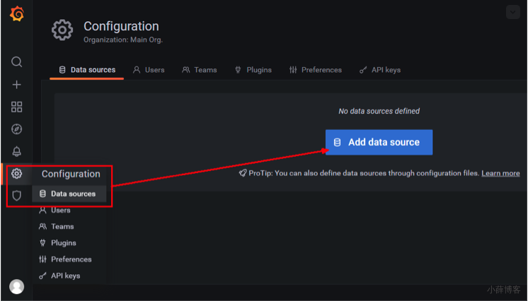
>
> 选择influxdb数据源
>
> 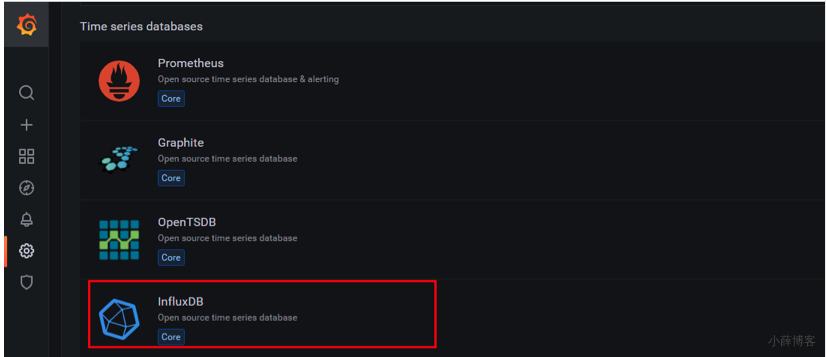
>
> 
>
> 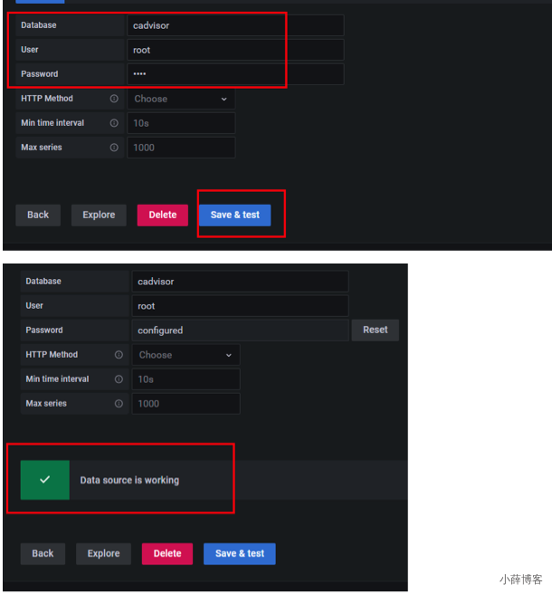
>
> 配置面板panel
>
> 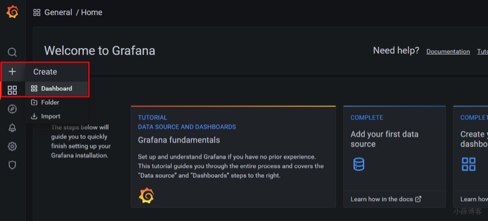
>
> 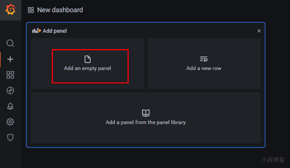
>
> 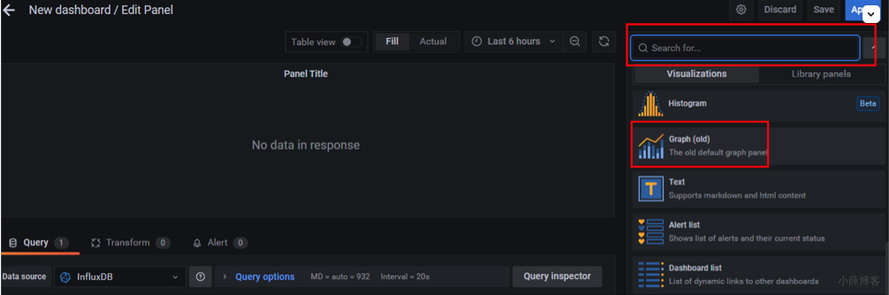
>
> 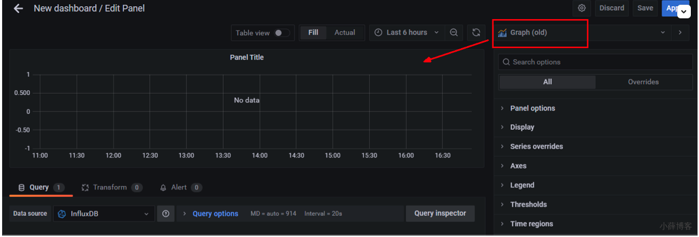
>
> 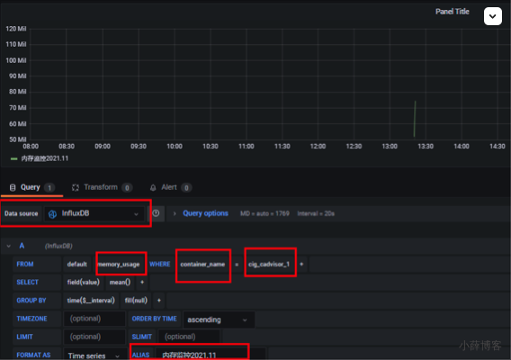
>
> 