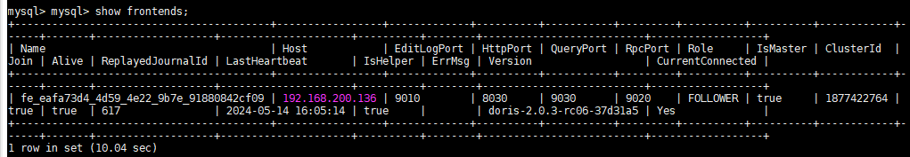
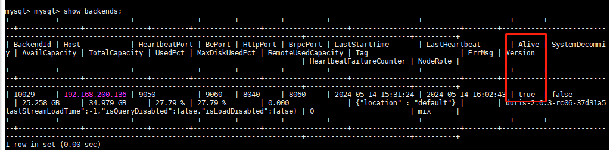
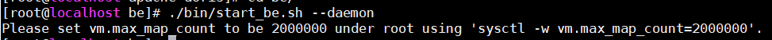
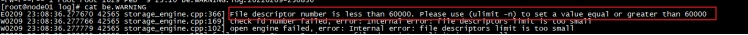

# 安装

## 前置依赖

jdk1.8

mysql5.6

### 更新yum源（可选）

1.备份当前的YUM源文件（可选，但推荐）

~~~sh
sudo cp -ar /etc/yum.repos.d /etc/yum.repos.d.bak
~~~

2.清理原有的YUM缓存

```sh
sudo yum clean all
```

3.以CentOS为例，更新为阿里云的源，首先下载阿里云的源配置文件

```sh
sudo wget -O /etc/yum.repos.d/CentOS-Base.repo http://mirrors.aliyun.com/repo/Centos-7.repo
```

4.重新生成缓存

```sh
sudo yum makecache
```

5.更新已安装的软件包

```sh
sudo yum update
```

## 安装

### 1.下载二进制包

从 doris.apache.org 下载相应的 Doris 安装包，并且解压。

```Bash
# 下载 Doris 二进制安装包
wget https://apache-doris-releases.oss-accelerate.aliyuncs.com/apache-doris-2.0.3-bin-x64.tar.gz

# 解压安装包
tar zxf apache-doris-2.0.3-bin-x64.tar.gz

# 目录重命名为更为简单的 apache-doris 
mv apache-doris-2.0.3-bin-x64 apache-doris
```

### 2.配置 FE

**如果用${DORIS_HOME}，记得配置下环境变量：/etc/profile，并执行source /etc/profile使其生效。**

FE 的配置文件为 apache-doris/fe/fe.conf。下面是一些需要关注的核心配置。除了 JAVA_HOME, 需要手动增加，并且指向你的 JDK8 运行环境。其它配置，可以使用默认值，即可支持单机快速体验。

```sh
# 增加 JAVA_HOME 配置，指向 JDK8 的运行环境。假如我们 JDK8 位于 /home/doris/jdk8, 则设置如下
JAVA_HOME=/opt/jdk1.8.0_341

# FE 监听 IP 的 CIDR 网段。默认设置为空，有 Doris 启动时自动选择一个可用网段。如有多个网段，需要指定一个网段，可以类似设置 priority_networks=192.168.0.0/24
priority_networks = 192.168.200.0/24

# FE 元数据存放的目录，默认是在 DORIS_HOME 下的 doris-meta 目录。已经创建，可以更改为你的元数据存储路径。
meta_dir = ${DORIS_HOME}/doris-meta
```

### 3.启动 FE

在 apache-doris/fe 下，运行下面命令启动 FE。

```Bash
# 将 FE 启动成后台运行模式，这样确保退出终端后，进程依旧运行。
./fe/bin/start_fe.sh --daemon
```

### 4.配置 BE

BE 的配置文件为 apache-doris/be/be.conf。下面是一些需要关注的核心配置。除了 JAVA_HOME, 需要手动增加，并且指向你的 JDK8 运行环境。其它配置，可以使用默认值，即可支持我们的快速体验。

```sh
# 增加 JAVA_HOME 配置，指向 JDK8 的运行环境。假如我们 JDK8 位于 /home/doris/jdk8, 则设置如下
JAVA_HOME=/opt/jdk1.8.0_341

# BE 监听 IP 的 CIDR 网段。默认设置为空，有 Doris 启动时自动选择一个可用网段。如有多个网段，需要指定一个网段，可以类似设置 priority_networks=192.168.0.0/24
priority_networks = 192.168.200.0/24

# BE 数据存放的目录，默认是在 DORIS_HOME 下的 storage 下，默认已经创建，可以更改为你的数据存储路径
storage_root_path = ${DORIS_HOME}/storage
```

### 5.启动 BE

在 apache-doris/be 下，运行下面命令启动 BE。

```Bash
# 将 BE 启动成后台运行模式，这样确保退出终端后，进程依旧运行。
./be/bin/start_be.sh --daemon
```

### 6.连接 FE

```Bash
mysql -uroot -P9030 -h127.0.0.1 -p
```

通过 show frontends 语句可以查看FE 节点。



### 7.将 BE 节点添加到集群

在 MySQL 客户端执行类似下面的 SQL，将 BE 添加到集群中

```sh
 #ALTER SYSTEM ADD BACKEND "be_host_ip:heartbeat_service_port";
 ALTER SYSTEM ADD BACKEND "192.168.200.136:9050";
```

注意：

1. be_host_ip：要添加 BE 的 IP 地址
2. heartbeat_service_port：要添加 BE 的心跳上报端口，可以查看 `be.conf` 里的 `heartbeat_service_port`，默认是 `9050`。
3. 通过 show backends 语句可以查看新添加的 BE 节点。



### 8.修改 root 和 admin 的密码（可选）

在 MySQL 客户端，执行类似下面的 SQL，为 root 和 admin 用户设置新密码

```sql
mysql> SET PASSWORD FOR 'root' = PASSWORD('123456');                                                                                  
Query OK, 0 rows affected (0.01 sec)                                                                                                                                                           
mysql> SET PASSWORD FOR 'admin' = PASSWORD('123456');                                                                                   
Query OK, 0 rows affected (0.00 sec)        
```

> root 和 admin 用户的区别：
>
> root 和 admin 用户都属于 Doris 安装完默认存在的 2 个账户。其中 root 拥有整个集群的超级权限，可以对集群完成各种管理操作，比如添加节点，去除节点。admin 用户没有管理权限，是集群中的 Superuser，拥有除集群管理相关以外的所有权限。建议只有在需要对集群进行运维管理超级权限时才使用 root 权限。

### 9.验证

访问http://192.168.200.136:8030/login

## 常见问题

### 1.提示Please set vm.max_map_count to be 2000000 under root using 'sysctl -w vm.max_map_count=2000000'.



解决方法：修改可打开文件数

1）临时修改配置（在重启系统后失效）

~~~sh
ulimit -n 65535
########上述方式在重启系统后失效#########
~~~

2）修改配置文件: `/etc/security/limits.conf`, 添加

~~~sh
* soft nofile 65535 
* hard nofile 65535 
* soft nproc 65535 
* hard nproc 65535
~~~

这种方法需要重启机器才能生效（**所有BE节点都需要进行配置**）

否则启动不成功, 日志报错

\

### 2.提示Please set vm.max_map_count to be 2000000 under root using 'sysctl -w vm.max_map_count=2000000'.

`vm.max_map_count`是Linux内核参数，它限制了一个进程可以拥有的VMA（虚拟内存区域）的数量

为了使设置永久生效，在`/etc/sysctl.conf`文件中添加以下行：

~~~sh
vm.max_map_count=2000000
~~~

再执行以下命令

~~~sh
sudo sysctl -p
~~~

### 3.提示Please disable swap memory before installation, eg: 'swapoff -a'.

按提示执行命令：swapoff -a

### 4.fe、be正常启动，但web页面无法访问

由于本人fe、be是从原来环境拷贝，meta_data未删除导致

