# 常用命令

~~~sh
#查看集群状态
GET /_cluster/health?pretty&human
#查看集群节点情况
GET /_cat/nodes?pretty
#查看集群负载情况
GET /_cat/nodes?v
#集群任务处理情况
GET /_cat/thread_pool?v
#查看索引
GET /_cat/indices?v
#查看索引模板
GET /_cat/templates
~~~


# 安装

## 安装ES

~~~sh
#准备文件和文件夹，并chmod -R 777 xxx
#配置文件内容，参照
https://www.elastic.co/guide/en/elasticsearch/reference/7.5/node.name.html 搜索相关配置
# 考虑为什么挂载使用esconfig ...
docker run --name=elasticsearch -p 9200:9200 -p 9300:9300 \
-e "discovery.type=single-node" \
-e ES_JAVA_OPTS="-Xms300m -Xmx300m" \
-v /app/es/data:/usr/share/elasticsearch/data \
-v /app/es/plugins:/usr/shrae/elasticsearch/plugins \
-v esconfig:/usr/share/elasticsearch/config \
-d elasticsearch:7.12.0

####################我一般使用以下###################

docker pull elasticsearch:7.4.2
docker pull kibana:7.4.2

mkdir -p /opt/docker_app/elasticsearch/{config,data,plugins} # 用来存放配置文件、数据、插件
echo "http.host: 0.0.0.0" >/opt/docker_app/elasticsearch/config/elasticsearch.yml # 允许任何机器访问
chmod -R 777 /opt/docker_app/elasticsearch/ ## 设置elasticsearch文件可读写权限

# 启动es
docker run --name elasticsearch -p 9200:9200 -p 9300:9300 \
-e  "discovery.type=single-node" \
-e ES_JAVA_OPTS="-Xms64m -Xmx512m" \
-v /opt/docker_app/elasticsearch/config/elasticsearch.yml:/usr/share/elasticsearch/config/elasticsearch.yml \
-v /opt/docker_app/elasticsearch/data:/usr/share/elasticsearch/data \
-v  /opt/docker_app/elasticsearch/plugins:/usr/share/elasticsearch/plugins \
-d elasticsearch:7.4.2

#以后再外面装好插件重启就可

#特别注意：
-e ES_JAVA_OPTS="-Xms64m -Xmx128m" \ 测试环境下，设置 ES 的初始内存和最大内存，否则导致过大启动不了ES

# 开机启动
docker update elasticsearch --restart=always

# 启动kibana
docker run --name kibana -e ELASTICSEARCH_HOSTS=http://192.168.200.128:9200 -p 5601:5601 -d kibana:7.4.2

~~~

## 安装ik分词器

1. 下载 https://release.infinilabs.com/analysis-ik/stable/

2. 放入plugins目录

   ~~~sh
   #由于安装es的时候已经挂载了plugins目录，若没挂载则需要docker cp到容器内
   #docker cp ik [容器id]:/usr/share/elasticsearch/plugins
   cd /opt/docker/elasticsearch/plugins
   mkdir ik
   #解压上传到ik目录下
   ~~~

3. 重启es

4. 验证

   ~~~sh
   #进入容器
   docker exec -it [容器id] bash
   #查看是否安装成功
   ./bin/elasticsearch-plugin list
   ~~~

# ES实现原理


>Lucene将上面三列分别作为词典文件、频率文件、位置文件保存。其中词典文件不仅保存了每个关键词，还保留了指向频率文件和位置文件的指针，通过指针即可找到对应文件信息。
>
>Lucene使用了field概念，用于表达信息所在位置（如标题中、文章中、URL中），在建索引时，该field信息也记录在词典文件中，每个关键词都有一个field信息，因为每个关键字一定属于一个或多个field。

# ES一些术语和概念

1. 索引词（term）

   > 精确值，foo、Foo、FOO被认为是不同的term

2. 文本（text）

   >文本是一段普通的非结构化文字。通常，**文本会被分析成一个个的索引词**，存储在索引库中。为了让文本能够进行搜索，文本字段需要事先进行分析，当对文本中的关键词进行查询的时候，搜索引擎应该根据搜索条件搜索出原文本。

3. 分析（analysis）

   > 分析是将文本转换成索引词的过程，分析过程依赖分词器。

4. 集群

5. 节点

6. 路由

   > 当存储doc时，它会根据hash(doc的ID)值存储在唯一的主分片中。如果文档有一个指定的父文档，则从父文档ID中生成，该值可以存储文档的时候进行修改。

7. 分片（shard）

   > 分片是单个Lucene实例，这是ES管理比较底层的功能。索引是指向主分片和副本分片的逻辑空间。对于使用，只需要指定分片的数量。在开发使用过程中，我们对应的对象都是index，ES会自动管理集群中的所有分片，发生故障时，ES会把分片移动到不同的节点或新节点。
   >
   > 一个index可以存很大的数据，这些空间可以超过一个节点的物理空间，若数据都存储在单节点对搜索性能也有影响。因此，ES将index分解成多个分片。当你创建index，你可以简单定义你想要的分片数量，每个分片本身是一个全功能的、独立的单元，可以托管在集群中的任何节点。

8. 主分片

   > 每个doc都存储在一个分片中，当你存储一个doc时，系统会首先存储在主分片中，然后复制到不同的副本分片中。默认情况下一个index有5个主分片，你可以事先定义分片数量，但之后无法修改。

9. 副本分片

10. 复制（replica）

    > 复制是一个非常有用的功能，不然会有单点问题。当网络中的某个节点出现问题，复制可以故障转移，保证高可用。因此ES允许你创建一个或多个拷贝，你的索引分片就形成了所谓的副本或副本分片。
    >
    > 复制是重要的，原因：
    >
    > - 保证了高可用，当节点失败不受影响，需要注意的是，一个复制的分片不会存储在同一个节点中。
    > - 它允许你扩展搜索量，提供并发量，因为搜索可以在所有副本上并行执行。
    >
    > 每个索引可以拆分成多个分片，索引可以复制0个或多个分片。一旦复制，每个索引就有了主分片和副本分片。分片数量和副本的数量可以在创建索引时定义。但之后只能改变副本的数量，不能改变分片的数量。
    >
    > **注意**：每个ES分片是一个Lucene的索引，最大是Integer.MAX_VALUE-128。可以使用 _cat/shards 监控分片大小

11. 索引（index）

    > 具有相同结构的doc集合，类似MySQL的**表**。

12. 类型（已废除）

    > 类型是index的逻辑分区，一种类型被定义具有一组公共字段的doc。例如，你想将博客系统所有信息存入一个index，则底下的user、blog等就是一种类型。

13. 文档（doc）

    > doc是以json格式存储在ES中的字符串，类似MySQL中的**行**。
    >
    > 每个doc都有一个类型和ID，原始的JSON文档被存储在一个叫_source的字段中，当搜索文档时默认返回就是这个字段。

14. 映射（mapping）

    > 类似MySQL的**表结构**，可以事先定义，也可以被ES智能识别。

15. 字段（field）

    > 类型MySQL的**字段**。

16. 来源字段（source field）

    > 默认情况，你的源文档存储在_source这个字段中，当你查询时也会返回这个字段。这允许你可以从搜索结构中访问原始对象，这个对象返回一个精确的json，这个对象不显示索引分析后的其他任何数据。

17. 主键（ID）

    > ID是一个文件的唯一标识，如果在存库时没有提供ID，系统会自动生存ID，文档的index/type/id必须是唯一的。

**返回值字段说明**


- `took` – Elasticsearch运行查询所花费的时间（以毫秒为单位）
- `timed_out` –搜索请求是否超时
- `_shards` - 搜索了多少个碎片，以及成功，失败或跳过了多少个碎片的细目分类。
- `max_score` – 找到的最相关文档的分数
- `hits.total.value` - 找到了多少个匹配的文档
- `hits.sort` - 文档的排序位置（不按相关性得分排序时）
- `hits._score` - 文档的相关性得分（使用match_all时不适用）


# ES字段类型

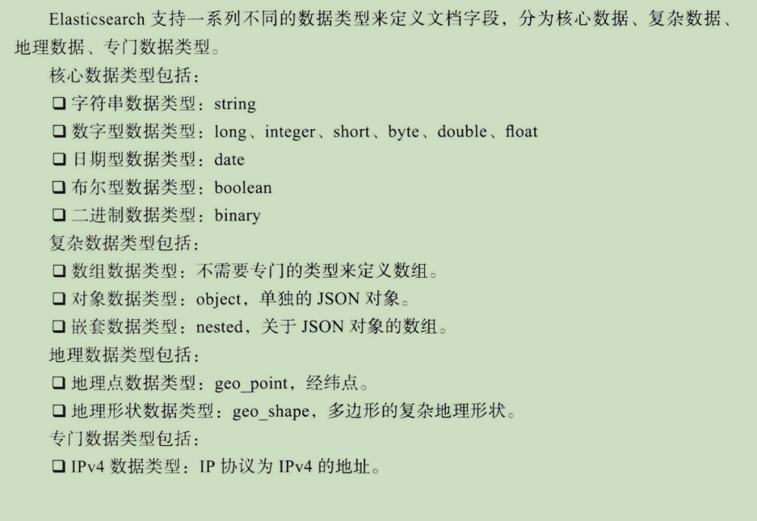


# 索引

> **注意：新版ES已经废除了type**，所以以前的/index/type/id推荐变为 /index/_doc/id
>
> 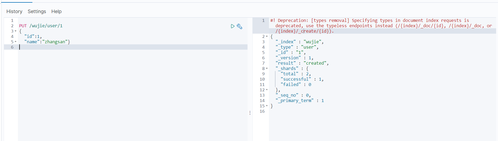

|      method      |                   url地址                    |          描述          |
| :--------------: | :------------------------------------------: | :--------------------: |
| PUT（创建,修改） |     localhost:9200/索引名称/_doc/文档id      | 创建文档（指定文档id） |
|   POST（创建）   |         localhost:9200/索引名称/_doc         | 创建文档（随机文档id） |
|   POST（修改）   | localhost:9200/索引名称/__doc/文档id/_update |        修改文档        |
|  DELETE（删除）  |     localhost:9200/索引名称/_doc/文档id      |        删除文档        |
|   GET（查询）    |     localhost:9200/索引名称/_doc/文档id      |   查询文档通过文档ID   |
|   POST（查询）   | localhost:9200/索引名称/__doc/文档id/_search |      查询所有数据      |

## 创建空索引

> 说明：**可以直接创建索引**，不需要创建空索引后再修改数据
>
> 可以在index里加一些参数：
>
> - index.data_path：字符型索引数据使用的路径。ES默认附加节点序号到路径中，确保系统机器上的多重实例不会共享数据目录。
> - index.shadow_replicas：索引是否使用副本。默认false。
> - index.shared_filesystem：索引是否使用共享文件系统，默认为true。
> - index.shared_filesystem.recover_on_any_node：索引的主分片是否可以恢复到集群中任何节点，默认false。

```json
PUT /myindex
{
    "settings": {
        "index": {
            "number_of_shards": "2", #分片数
            "number_of_replicas": "0" #副本数
        }
    }
}
#不指定分片数和副本数，系统默认1个分片，1个副本
```

## 修改索引

~~~json
#可以修改索引副本数，分词器等
PUT /wujie/_settings
{
  "number_of_replicas": 2
}
#注意：【无法修改分片数量，否则报错】
~~~

## 打开/关闭索引

> 关闭索引后，只能查看索引的元数据，不能读写数据

~~~json
POST /wujie/_close
POST /wujie/_open
~~~

查看所有索引

~~~sh
Get /_cat/indices?v
~~~

## 创建映射（索引）

~~~json
#为index创建mappings
PUT /zfc
{
  "mappings": {
    "properties": {
      "id":{
        "type": "integer"
      },
      "name":{
        "type": "text"
      },
      "brithday":{
        "type": "date"
      }
    }
  }
}


#为doc创建mappings
PUT /zfc/_doc/1
{
  "mappings": {
    "properties": {
      "id":{
        "type": "integer"
      },
      "name":{
        "type": "text"
      },
      "brithday":{
        "type": "date"
      }
    }
  }
}
~~~

## 修改映射（重建索引）

>**index的mappings无法修改**，可以通过**_reindex** 重建索引,方式修改

~~~json
#doc的mappings可以修改（感觉没啥用）
POST /zfc/_doc/1
{
  "mappings": {
    "properties": {
      "id":{
        "type": "integer"
      },
      "name":{
        "type": "text"
      },
      "brithday":{
        "type": "date"
      },
      "key":{
        "type": "keyword"
      }
    }
  }
}
~~~

通过reindex修改index的mappings

~~~json
#1. 创建一个新的index，设置新的mappings
PUT /zfc1
{
  "mappings": {
    "properties": {
      "id":{
        "type": "long"  #修改处
      },
      "name":{
        "type": "text"
      },
      "brithday":{
        "type": "date"
      },
      "key":{
        "type": "keyword"
      }
    }
  }
}
#2. _reindex进行迁移
POST _reindex
{
  "source": {
    "index": "zfc"
  },
  "dest": {
    "index": "zfc1"
  }
}
#3. 删除旧的index
DELETE zfc
#4. 设置别名
POST _aliases
{
  "actions": [
    {
      "add": {
        "index": "zfc1",
        "alias": "zfc"
      }
    }
  ]
}
~~~

> dest.version_type:
>
> - interval：导致es盲目转储文件到目标索引，任何具有相同类型和ID的文档将会被重写。
> - external：会导致es保护源索引，如果在目标索引中有一个比源索引旧的版本，则会更新文档。对于源文件中丢失的文档也会在目标中被创建。
> - create：会导致目标索引中仅创建丢失的文件，所有现有的文件将导致版本冲突。
>
> 正常情况下发生冲突时，_reindex过程将会被终止，可以在请求中设置 conflicts:proceed，可以只进行计算。

## 索引别名

~~~json
#创建别名
POST _aliases
{
  "actions": [
    {
      "add": {
        "index": "zfc1",
        "alias": "zfc"
      },
      "add": {                   #一个别名是可以关联n个index的，根据别名查的时候会列出所有index
        "index": "wujie",
        "alias": "zfc"
      },
      "add": {                   #也可以通过通配符
        "index": "z*",
        "alias": "zfc"
      }
    }
  ]
}
#修改别名（没有修改），可以先remove，后add
POST _aliases
{
  "actions": [
    {
      "remove": {
        "index": "zfc1",
        "alias": "zfc"
      },
      "add": {                 
        "index": "zfc1",
        "alias": "wujie"
      }
    }
  ]
}
#删除别名
DELETE /zfc1/_alias/zfc

或

POST _aliases
{
  "actions": [
    {
      "remove": {
        "index": "zfc1",
        "alias": "zfc"
      }
    }
  ]
}

#查看index下所有的别名
GET zfc1/_alias


#带filter和routing的别名
#作用：在使用别名进行查找时，只有满足filter中的要求，才能查到数据
POST _aliases
{
  "actions": [
    {
      "add": {
        "index": "wujie",
        "alias": "zfc2",
        "filter": {
          "term": {
            "age": "21"
          }
        },
        "routing": "1",
        "search_routing": "1,2",
        "index_routing": "1"    #index_routing只能一个值
      }
    }
  ]
}
~~~

## 索引分析

> - 字符过滤器：字符串经过字符过滤器（character filter）处理，它们的工作是在标记化之前处理字符串。字符过滤器能够去除HTML标记，或者转换"&"为“and”。
> - 分词器：分词器（tokenizer）被标记化成独立的词。一个简单的分词器可以根据空格或逗号将单词分开。
> - 标记过滤器：每个词都通过标记过滤处理，它可以修改词（例如Quick转小写），去掉词（例如a、and、the等），或者增加词（例如同义词jump和leap）。

~~~json
GET /_analyze
{
  "analyzer": "standard", 
  "text": ["zfc is a db"]
}
~~~

TODO P65，几个例子

## 索引模板

### 创建索引模板

~~~json
PUT /_template/mytemplate
{
  "index_patterns":"my-*",
  "settings": {
    "number_of_shards": 1
  },
  "mappings": {
    "_source": {
      "enabled": false
    }
  }
  
}
~~~

### 删除索引模板

~~~json
DELETE /_template/mytemplate
~~~

### 查看索引模板

~~~json
GET /_template/mytemplate
~~~

> 当匹配到多个模板时，会合并模板，重复的地方根据order的优先级（小的先）

## 索引监控

### 索引统计

~~~json
//查看索引统计数据
GET /zfc/_stats
~~~

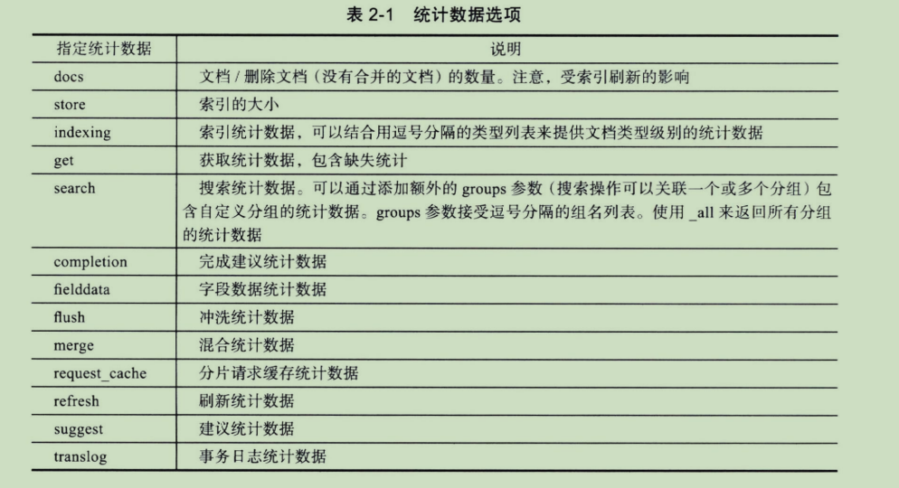

> 注意：当分片在集群中移动的时候，它们的统计数据会被清除，视为他们在其他节点中被创建。另一方面，即使分片“离开”了一个节点，那个节点依旧会保存分片之前的统计数据。

### 索引分片

~~~json
//查看索引分片数据
GET /enis-1/_segments

//返回值
{
  "_shards" : {
    "total" : 2,
    "successful" : 1,
    "failed" : 0
  },
  "indices" : {
    "enis-1" : {
      "shards" : {
        "0" : [
          {
            "routing" : {
              "state" : "STARTED",
              "primary" : true,
              "node" : "D4sGVhVrQDC5FKcfU_L7Cg"
            },
            "num_committed_segments" : 0,
            "num_search_segments" : 0,
            "segments" : { }
          }
        ]
      }
    }
  }
}

~~~

### 索引恢复

~~~json
//查看索引恢复数据
GET /enis-1/_recovery

//返回
{
  "enis-1" : {
    "shards" : [
      {
        "id" : 0,
        "type" : "EMPTY_STORE",
        "stage" : "DONE",
        "primary" : true,
        "start_time_in_millis" : 1697510829256,
        "stop_time_in_millis" : 1697510829279,
        "total_time_in_millis" : 23,
        "source" : { },
        "target" : {
          "id" : "D4sGVhVrQDC5FKcfU_L7Cg",
          "host" : "127.0.0.1",
          "transport_address" : "127.0.0.1:9300",
          "ip" : "127.0.0.1",
          "name" : "6f1f914508dd"
        },
        "index" : {
          "size" : {
            "total_in_bytes" : 0,
            "reused_in_bytes" : 0,
            "recovered_in_bytes" : 0,
            "percent" : "0.0%"
          },
          "files" : {
            "total" : 0,
            "reused" : 0,
            "recovered" : 0,
            "percent" : "0.0%"
          },
          "total_time_in_millis" : 11,
          "source_throttle_time_in_millis" : 0,
          "target_throttle_time_in_millis" : 0
        },
        "translog" : {
          "recovered" : 0,
          "total" : 0,
          "percent" : "100.0%",
          "total_on_start" : 0,
          "total_time_in_millis" : 8
        },
        "verify_index" : {
          "check_index_time_in_millis" : 0,
          "total_time_in_millis" : 0
        }
      }
    ]
  }
}

~~~

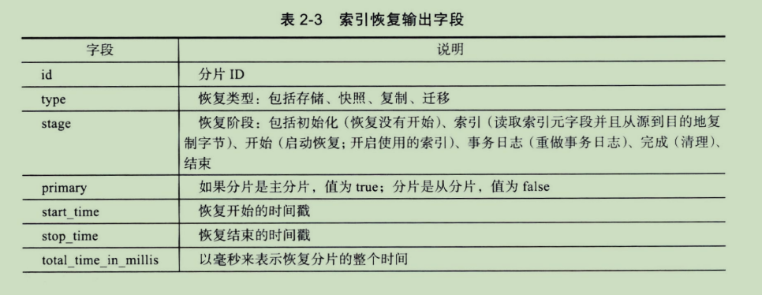


### 索引分片存储

~~~json
//查看索引分片存储信息
GET /enis-1/_shard_stores


//返回
{
  "indices" : {
    "enis-1" : {
      "shards" : {
        "0" : {
          "stores" : [
            {
              "D4sGVhVrQDC5FKcfU_L7Cg" : {
                "name" : "6f1f914508dd",
                "ephemeral_id" : "r3Pp8tZOSqO0_Jad-WNdTw",
                "transport_address" : "127.0.0.1:9300",
                "attributes" : {
                  "ml.machine_memory" : "8181829632",
                  "xpack.installed" : "true",
                  "ml.max_open_jobs" : "20"
                }
              },
              "allocation_id" : "VbGJ_rlPTPmxssOm2L2Fdg",
              "allocation" : "primary"
            }
          ]
        }
      }
    }
  }
}

~~~

## 索引状态

### 清除缓存

### 索引刷新

### 冲洗

### 合并索引

TODO P77页


# 文档

## 新增数据

~~~json
PUT /wujie/_doc/1
{
  "id":2,
  "name":"zhangsan"
}

或

POST /wujie/_doc/1
{
  "id":2,
  "name":"zhangsan"
}
~~~

### op_type参数

在ES中，`op_type`是一个用于指定操作类型的参数，它决定了在索引文档时的行为。

以下是一些常见的`op_type`选项：

1. `index`（默认值）：以`index`操作类型将文档添加到索引中。如果指定的文档ID已经存在，则会覆盖原有文档。
2. `create`：以`create`操作类型创建新文档。如果指定的文档ID已经存在，则会返回错误，不进行任何修改。
3. `update`：以`update`操作类型更新现有文档。如果指定的文档ID不存在，则会返回错误。
4. `delete`：以`delete`操作类型从索引中删除指定的文档。

可以在执行索引操作的请求中设置`op_type`参数。例如：

```json
POST my_index/_doc/1
{
  "field": "value",
  "op_type": "create"
}
```

上述示例中，使用`create`操作类型创建一个新的文档。如果文档ID为1的文档已经存在，则会返回错误。

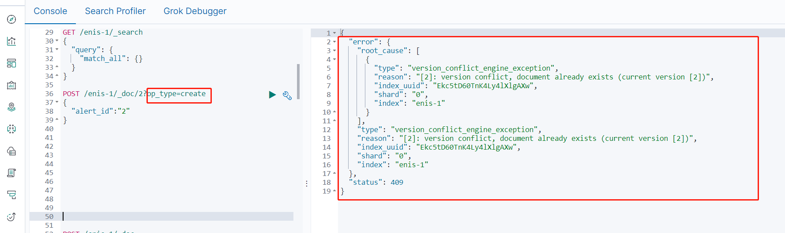

### 分片的选择

> 默认通过hash(id)控制。但可以通过routing手动控制，还是hash(routing)。


## 查看数据

~~~json
#根据doc的id搜索index下的某个doc
GET /wujie/_doc/1
#搜索index下所有的doc（默认最多10条）
GET /wujie/_search
#查询年龄等于20的用户
GET /wujie/_search?q=age:20
~~~

> 查询参数：
> _primary:在主节点进行查询
>
> _local:尽可能在本地节点上进行查询

## 删除数据

~~~json
DELETE /wujie
~~~

## 修改数据

~~~json
POST /wujie/_update/1
{
  "doc":{
    "id":1,
    "age":21
  }
}

或

PUT /wujie/_doc/1
{
  "id":1,
  "name":"lisi"
}
~~~

## script

TODO P82

## 多文档

### _mget

~~~json
//多index查询多doc
GET /_mget
{
  "docs": [
    {
      "_index": "test-agg-cars",
      "_id":"1"
    },
    {
      "_index":"test-agg-logs",
      "_id":"1"
    }
  ]
}
~~~


### _bulk

~~~json
//批量插入
POST /test-agg-cars/_bulk
{ "index": {}}
{ "price" : 10000, "color" : "red", "make" : "honda", "sold" : "2014-10-28" }
{ "index": {}}
{ "price" : 20000, "color" : "red", "make" : "honda", "sold" : "2014-11-05" }
{ "index": {}}
{ "price" : 30000, "color" : "green", "make" : "ford", "sold" : "2014-05-18" }
{ "index": {}}
{ "price" : 15000, "color" : "blue", "make" : "toyota", "sold" : "2014-07-02" }
{ "index": {}}
{ "price" : 12000, "color" : "green", "make" : "toyota", "sold" : "2014-08-19" }
{ "index": {}}
{ "price" : 20000, "color" : "red", "make" : "honda", "sold" : "2014-11-05" }
{ "index": {}}
{ "price" : 80000, "color" : "red", "make" : "bmw", "sold" : "2014-01-01" }
{ "index": {}}
{ "price" : 25000, "color" : "blue", "make" : "ford", "sold" : "2014-02-12" }
~~~


# DSL

## filter

~~~json
//age>30&last_name=smith的所有员工
GET /megacorp/employee/_search
{
    "query": {
        "filtered": {
            "filter": {
                "range": {
                    "age": {
                        "gt": 30
                    }
                }
            },
            "query": {
                "match": {
                    "last_name": "smith"
                }
            }
        }
    }
}
~~~

## match

> 相关性查询，ES会自动分词

~~~json
GET /megacorp/employee/_search
{
    "query": {
        "match": {
            "about": "rock climbing"
        }
    }
}


//查询结果如下：有相关的都被查到，但score不同
{
...
"hits": {
        "total": 2,
        "max_score": 0.16273327,
        "hits": [
            {
...
"_score": 0.16273327, <1>
"_source": {
                    "first_name": "John",
                    "last_name": "Smith",
                    "age": 25,
                    "about": "I love to go rock climbing",
                    "interests": [
                        "sports",
                        "music"
                    ]
                }
            },
            {
...
"_score": 0.016878016, <2>
"_source": {
                    "first_name": "Jane",
                    "last_name": "Smith",
                    "age": 32,
                    "about": "I like to collect rock albums",
                    "interests": [
                        "music"
                    ]
                }
            }
        ]
    }
}
~~~

## match_phrase

> 与match相对，全词搜索（短语搜索）

~~~json
GET /megacorp/employee/_search
{
    "query": {
        "match_phrase": {
            "about": "rock climbing"
        }
    }
}
~~~

## highlight

~~~json
GET /megacorp/employee/_search
{
    "query": {
        "match_phrase": {
            "about": "rock climbing"
        }
    },
    "highlight": {
        "fields": {
            "about": {}
        }
    }
}


//查询结果如下：<em></em>包裹
{
...
"hits": {
        "total": 1,
        "max_score": 0.23013961,
        "hits": [
            {
...
"_score": 0.23013961,
                "_source": {
                    "first_name": "John",
                    "last_name": "Smith",
                    "age": 25,
                    "about": "I love to go rock climbing",
                    "interests": [
                        "sports",
                        "music"
                    ]
                },
                "highlight": {
                    "about": [
                        "I love to go <em>rock</em> <em>climbing</em>" <1>
                    ]
                }
            }
        ]
    }
}
~~~

## aggs

~~~json
GET /megacorp/employee/_search
{
    "aggs": {
        "all_interests": {
            "terms": {
                "field": "interests"
            }
        }
    }
}


//返回结果：
{
...
"hits": { ...
    },
    "aggregations": {
        "all_interests": {
            "buckets": [
                {
                    "key": "music",
                    "doc_count": 2
                },
                {
                    "key": "forestry",
                    "doc_count": 1
                },
                {
                    "key": "sports",
                    "doc_count": 1
                }
            ]
        }
    }
}
~~~

~~~json
//统计每种兴趣的员工平均年龄
GET /megacorp/employee/_search
{
    "aggs": {
        "all_interests": {
            "terms": {
                "field": "interests"
            },
            "aggs": {
                "avg_age": {
                    "avg": {
                        "field": "age"
                    }
                }
            }
        }
    }
}


//返回结果
...
"all_interests": {
    "buckets": [
        {
            "key": "music",
            "doc_count": 2,
            "avg_age": {
                "value": 28.5
            }
        },
        {
            "key": "forestry",
            "doc_count": 1,
            "avg_age": {
                "value": 35
            }
        },
        {
            "key": "sports",
            "doc_count": 1,
            "avg_age": {
                "value": 25
            }
        }
    ]
}
~~~

## scroll

> `scroll` 是 Elasticsearch 提供的一种机制，用于在大型搜索结果中进行分页处理。它允许你在多个请求之间保持“滚动”状态，以获取连续的结果集。

下面是一个使用 `scroll` API 的示例：

1.开始一个滚动上下文（Scroll Context）：

```json
POST /索引名/_search?scroll=1m
{
  "size": 100,
  "query": {
    "match_all": {}
  }
}
```

- `索引名`: 替换为实际的索引名称。
- `size`: 每次滚动获取的文档数量。
- `scroll`: 指定滚动时间窗口，表示滚动上下文保持有效的时间，默认为1m（1分钟）。

该请求将返回第一批结果以及一个 `scroll_id`，它是用于检索下一批结果的标识符。

2.使用滚动上下文检索下一批结果：

```json
POST /_search/scroll
{
  "scroll": "1m",
  "scroll_id": "scroll_id"
}
```

- `scroll`: 指定滚动时间窗口，保持与初始滚动请求相同的时间窗口。
- `scroll_id`: 初始滚动请求返回的 `scroll_id`。

该请求将返回下一批结果以及一个新的 `scroll_id`，可以继续检索更多的结果。

3.重复第2步，直到所有结果都被检索完毕。

需要注意的是，每次滚动请求都会生成一个新的 `scroll_id`，所以在进行下一次滚动请求时需要使用最新的 `scroll_id`。

当你完成了所有的滚动操作后，应该显式地清除滚动上下文，以释放资源:

```json
DELETE /_search/scroll
{
  "scroll_id": ["scroll_id1", "scroll_id2"]
}
```

- `scroll_id`: 指定要清除的滚动上下文的 `scroll_id` 列表。

这样可以确保滚动上下文被正确关闭并释放资源。

使用 `scroll` 可以高效地处理大量数据，避免一次性获取所有结果而导致资源消耗过大。同时，它也适用于对实时搜索结果进行持续处理的场景。记得根据实际需求设置合适的 `size` 和 `scroll` 参数值。

# 分布式集群

## 集群健康

| 颜色   | 说明                                       |
| ------ | ------------------------------------------ |
| green  | 所有主要分片和复制分片都可用               |
| yellow | 所有主要分片可用，但不是所有复制分片都可用 |
| red    | 不是所有的主要分片都可用                   |

查看集群健康

~~~json
GET /_cluster/health

//返回结果：
{
"cluster_name": "elasticsearch",
"status": "green", <1>
"timed_out": false,
"number_of_nodes": 1,
"number_of_data_nodes": 1,
"active_primary_shards": 0,
"active_shards": 0,
"relocating_shards": 0,
"initializing_shards": 0,
"unassigned_shards": 0
}
~~~


# 路由TODO

>

# 检索

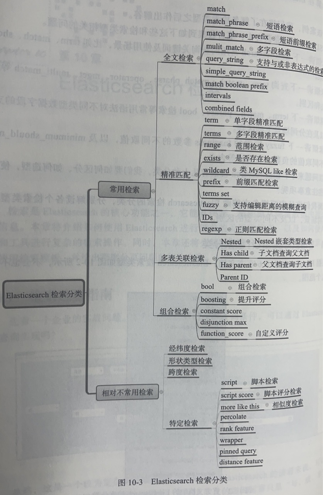

## 全文检索

> es会进行分词匹配

### match

~~~json
POST my_index_1001/_search
{
  "query": {
    "match": {
      "title": "乌兰新闻"
    }
  }
}
~~~

### match_phrase

> match_phrase检索适用于注重精准度的召回场景。与match检索(分词检索)不同，match_phrase检索更适合称为短语匹配检索。这是因为match_phrase检索要求查询的词条顺序和文档中的词条顺序保持一致，以确保更高的精准度。因此，场景差异在于match_phrase 检索强调短语的完整性和顺序，以提高查询结果的准确性。实战中建议一一在需要精确匹配短语时使用 match_phrase 检索，以满足高精准度召回的需求。

~~~json
####短语匹配检索
POST my_index_1001/_search
{
  "query": {
    "match_phrase": {
      "title": {
        "query": "乌兰新闻网"
      }
    }
  }
}
~~~

### match_phrase_prefix

> 查询词语需要按顺序匹配文档中的内容，同时允许最后一个词语只匹配其前缀。使得在部分用户输入、搜索建议或自动补全等场景下非常有用。

~~~json
POST my_index_1001/_search
{
  "query": {
    "match_phrase_prefix": {
      "title": {
        "query": "乌兰新"
      }
    }
  }
}
~~~

### multi_match

~~~json
#### mulit_match 检索案例
POST my_index_1001/_search
{
  "query": {
    "multi_match" : {
      "query" : "乌兰",
      "fields" : [ "title^3", "message" ]  #^3用来提高权重，提高score
    }
  }
}
~~~

### query_string

~~~json
#### query_string检索案例
POST my_index_1001/_search
{
  "query": {
    "query_string": {
      "default_field": "title",
      "query": "乌兰 AND 新闻"
    }
  }
}
~~~

### simple_query_string

> simple_query_string 和query_string 的区别如下
> 1) simple_query_string对语法的核查并不严格。simple_query_string在输入语句的语法不对时并不会报错。
>
> 2) simple_query_string是一种简单的査询语法，只支持单词查询、短语查询或者包含查询，不支持使用通配符和正则表达式。这种查询方式更加安全，因为它不会产生性能问题。
>
> 3) query_string是一种复杂的查询语法，它支持使用通配符、正则表达式和复杂的布尔运算。但这种复杂性可能会导致性能问题。
>
> 总的来说，如果查询语法比较简单，则可以使用simple_query_string 。如果查询语法非常复杂，则可以使用 query_string。

~~~json
POST my_index_1001/_search
{
  "query": {
    "simple_query_string": {
      "query": "乌兰 AND 新闻 AND",
      "fields": ["title"]
    }
  }
}
~~~

### match boolean prefix

### intervals

### combined fields

## 精准匹配

> 不分词，严格equals。`一般对keyword类型的字段进行检索`。

### term

~~~json
### term单字段精准匹配
POST my_index_1001/_search
{
  "query": {
    "term": {
      "title.keyword": "乌兰新闻网欢迎您!"
    }
  }
}
~~~

### terms

~~~json
#### terms 多字段精准检索
POST my_index_1001/_search
{
  "query": {
    "terms": {
      "souce_class": [
        "weibo",
        "wechat"
      ]
    }
  }
}
~~~

### range

~~~json
#### range 区间范围检索
POST my_index_1001/_search
{
  "query": {
    "range": {
      "popular_degree": {
        "gte": 10,
        "lte": 100
      }
    }
  },
  "sort": [
    {
      "popular_degree": {
        "order": "desc"
      }
    }
  ]
}
~~~

### exists

> 字段存在
>
> `注意：字段值为空值也会认为存在！！！`
>
> 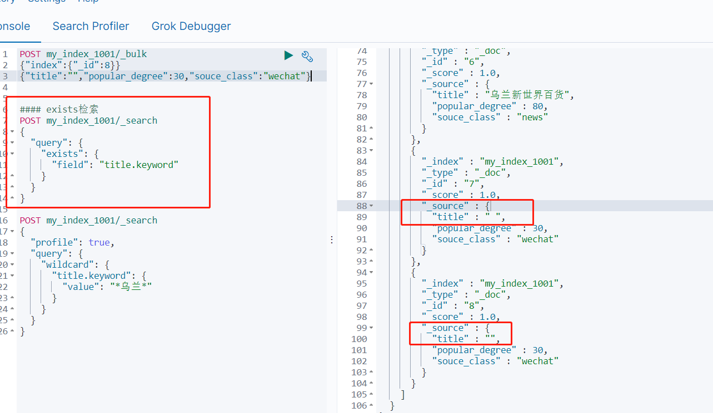

~~~json
#### exists检索
POST my_index_1001/_search
{
  "query": {
    "exists": {
      "field": "title.keyword"
    }
  }
}
~~~

### wildcard

> 模糊查询
>
> *表示0或多个字符，可用于匹配任意长度的字符串
>
> ?表示一个字符，可用于匹配任意单个字符

~~~json
POST my_index_1001/_search
{
  "profile": true, 
  "query": {
    "wildcard": {
      "title.keyword": {
        "value": "*乌兰*"
      }
    }
  }
}
~~~

### prefix

> 等同于startWith

~~~json
####执行前缀匹配检索
POST my_index_1002/_search
{
  "query": {
    "prefix": {
      "title.keyword": {
        "value": "考试"
      }
    }
  }
}
~~~

### terms set

> 主要解决多值字段中的文档匹配问题，其中匹配的数量可以是固定值，也可以是某个字段的动态值。
>
> minimum_should_match_field、minimum_should_match_script

~~~json
GET my_index_1003/_search
{
  "query": {
    "terms_set": {
      "tags": {
        "terms": ["喜剧", "动作", "科幻"],
        "minimum_should_match_field": "tags_count"  #决定最少匹配数量的字段
      }
    }
  }
}


##返回结果
{
  "took" : 1019,
  "timed_out" : false,
  "_shards" : {
    "total" : 1,
    "successful" : 1,
    "skipped" : 0,
    "failed" : 0
  },
  "hits" : {
    "total" : {
      "value" : 2,
      "relation" : "eq"
    },
    "max_score" : 1.8215328,
    "hits" : [
      {
        "_index" : "my_index_1003",
        "_type" : "_doc",
        "_id" : "1",
        "_score" : 1.8215328,
        "_source" : {
          "title" : "电影1",
          "tags" : [
            "喜剧",
            "动作",
            "科幻"
          ],
          "tags_count" : 3
        }
      },
      {
        "_index" : "my_index_1003",
        "_type" : "_doc",
        "_id" : "4",
        "_score" : 1.0304071,
        "_source" : {
          "title" : "电影3",
          "tags" : [
            "动作",
            "科幻",
            "家庭"
          ],
          "tags_count" : 2
        }
      }
    ]
  }
}
~~~

~~~json
GET my_index_1003/_search
{
  "query": {
    "terms_set": {
      "tags": {
        "terms": [
          "喜剧",
          "动作",
          "科幻"
        ],
        "minimum_should_match_script": {
          "source": "doc['tags_count'].value * 0.7"
        }
      }
    }
  }
}
~~~

### fuzzy

> 支持编辑距离的模糊检索，fuzzy检索是一种强大的搜索功能，它能够在用户输入内容存在拼写错误或上下文不一致时，仍然返回与搜索词相似的文档，

~~~json
####执行检索，输入：apple，langauge，pager均能召回数据。
POST my_index_1004/_search
{
  "query": {
    "fuzzy": {
      "title": {
        "value": "langauge"
      }
    }
  }
}
~~~

### IDs

~~~json
####基于id进行检索
POST my_index_1005/_search
{
  "query": {
    "ids": {
      "values": [
        "1",
        "2",
        "3"
      ]
    }
  }
}
~~~

### regexp

~~~json
#正则
GET my_index_1005/_search
{
  "query": {
    "regexp": {
      "product_name.keyword": {
        "value": "Lap.."  #以Lap开头、后面紧跟两个任意字符的product_name
      }
    }
  }
}
~~~

## 多表关联检索

nested

has child

has parent

parent id

## 组合检索

bool

boosting

constant score

disjunction max

function_score

## 检索模板

> ES使用Mustache模板引擎（参考http://mustache.github.io）来为查询模板生成可用的查询语句。如你所见，每个变量被双大括号包裹，这一点是Mustache规范要求的，是该模板引擎间接引用变量的方式。
>
> 使用模板好处：
>
> - 避免在多个地方重复代码
> - 更容易测试和执行您的查询
> - 在应用程序间共享查询
> - 允许用户只执行一些预定义的查询
> - 将搜索逻辑与应用程序逻辑分离

### 1. 条件表达式

{{val}}表达式用来插入变量val的值。{{#val}}和{{/val}}则用来在变量val取值计算为true时把位于它们之间的变量标记替换为变量值。

我们看一下下面这个示例：

~~~json
curl -XGET http://10.8.10.12:9200/operator_website_index/_search/template?pretty -H 'Content-Type: application/json' -d '
{
	"template":"{ {{#limit}}\"size\":2 {{/limit}} }",
	"params":{
		"limit": false
	}
}'
~~~

当 limit 为 true 或者 有值时(随便赋值只有有内容) 条件则生效 size: 2条件生效

当limit为false或者未设置limit参数，条件size: 2不生效

### 2.循环

循环结构定义和条件表达式一模一样，都位于{{#val}}和{{/val}}之间。如果表达式中变量取值是数组，则可以使用{{.}}标记来指代当前变量值。

例如，假定我们需要模板引擎遍历一个词项数组来生成一个词项查询，可以执行如下命令：

~~~json
curl -XGET http://10.8.10.12:9200/operator_website_index/_search/template?pretty -H 'Content-Type: application/json' -d '
{
        "template":{
                "query":{
                        "terms":{
                                "website_name":[
                                        "{{#website_name_param}}",
                                        "{{.}}",
                                        "{{/website_name_param}}"
                                ]
                        }
                }
        },
        "params":{
                "website_name_param":["fron","罗浮宫"]
        }
}'
~~~

#### 3. 默认值

默认值标记允许我们在参数未定义时给它设置默认取值。比如，给var变量设置默认值语法的代码如下：

~~~json
{{var}}{{^var}}default value{{/var}}
~~~

举个例子，假定我们要给查询模板中的website_name_param参数设置默认值“1”，可以使用如下命令：

~~~json
curl -XGET http://10.8.10.12:9200/operator_website_index/_search/template?pretty -H 'Content-Type: application/json' -d '
{
	"template":{
		"query":{
			"term":{
                        	"website_name": "{{website_name_param}}{{^website_name_param}}1{{/website_name_param}}"
                        }
                }
        },
        "params":{
                "website_name_param": "罗浮宫"
        }
}'
~~~

这个命令将从Elasticsearch查询出所有website_name字段中包含罗浮宫的文档。而如果我们在params片段中不指定phrase参数的值，website_name_param则使用默认1来搜索。

### 4.创建Mustache模板保存到ElasticSearch

普通查询Demo
创建template

~~~json
curl -XPOST http://10.8.10.12:9200/_scripts/my_search_template -H 'Content-Type: application/json' -d '
    {
      "script": {
        "lang": "mustache",
        "source": {
          "query": {
            "match": {
              "{{my_field}}": "{{my_value}}"
            }
          }
        }
      }
    }'
~~~

在这里，我们定义了一个叫做my_search_template的search template。如果我们想更新这个search template，我们可以直接进行修改，然后再次运行上面的命令即可。

在match的字段里，我们定义了两个参数：my_field及my_value。下面，我们来首先建立一个叫做twitter的数据库：

~~~json
curl -XPUT http://10.8.10.12:9200/twitter/_doc/1  -H 'Content-Type: application/json' -d '
    {
      "user" : "双榆树-张三",
      "message" : "今儿天气不错啊，出去转转去",
      "uid" : 2,
      "age" : 20,
      "city" : "北京",
      "province" : "北京",
      "country" : "中国",
      "address" : "中国北京市海淀区",
      "location" : {
        "lat" : "39.970718",
        "lon" : "116.325747"
      }
    }'
     
curl -XPUT http://10.8.10.12:9200/twitter/_doc/2  -H 'Content-Type: application/json' -d '
    {
      "user" : "虹桥-老吴",
      "message" : "好友来了都今天我生日，好友来了,什么 birthday happy 就成!",
      "uid" : 7,
      "age" : 90,
      "city" : "上海",
      "province" : "上海",
      "country" : "中国",
      "address" : "中国上海市闵行区",
      "location" : {
        "lat" : "31.175927",
        "lon" : "121.383328"
      }
    }'

~~~

我们这里把上面的两个文档存于到twitter的index之中。我们现在可以使用我们刚才定义的search template来进行搜索：

```json
curl -XGET http://10.8.10.12:9200/twitter/_search/template -H 'Content-Type: application/json' -d '
    {
      "id": "my_search_template",
      "params": {
        "my_field": "city",
        "my_value": "北京"
      }
    }'


#返回结果
{
  "took" : 1,
  "timed_out" : false,
  "_shards" : {
    "total" : 1,
    "successful" : 1,
    "skipped" : 0,
    "failed" : 0
  },
  "hits" : {
    "total" : {
      "value" : 1,
      "relation" : "eq"
    },
    "max_score" : 1.3862942,
    "hits" : [
      {
        "_index" : "twitter",
        "_type" : "_doc",
        "_id" : "1",
        "_score" : 1.3862942,
        "_source" : {
          "user" : "双榆树-张三",
          "message" : "今儿天气不错啊，出去转转去",
          "uid" : 2,
          "age" : 20,
          "city" : "北京",
          "province" : "北京",
          "country" : "中国",
          "address" : "中国北京市海淀区",
          "location" : {
            "lat" : "39.970718",
            "lon" : "116.325747"
          }
        }
      }
    ]
  }
}
```

# 聚合

## 聚合分类

### 分桶聚合

> 类似group by

| 子类名称          | 含义               |
| ----------------- | ------------------ |
| terms             | 分桶聚合结果       |
| range             | 分区间聚合         |
| histogram         | 间隔聚合           |
| date histogram    | 时间间隔聚合       |
| date range        | 时间范围聚合       |
| composite组合聚合 | 支持聚合后分页     |
| filters过滤聚合   | 满足过滤条件的聚合 |

~~~json
POST my_index_1101/_search
{
  "size": 0,
  "aggs": {
    "color_terms_agg": {
      "terms": {
        "field": "color"
      }
    }
  }
}

####返回结果####
{
  "took" : 2,
  "timed_out" : false,
  "_shards" : {
    "total" : 1,
    "successful" : 1,
    "skipped" : 0,
    "failed" : 0
  },
  "hits" : {
    "total" : {
      "value" : 8,
      "relation" : "eq"
    },
    "max_score" : null,
    "hits" : [ ]
  },
  "aggregations" : {
    "color_terms_agg" : {
      "doc_count_error_upper_bound" : 0,
      "sum_other_doc_count" : 0,
      "buckets" : [
        {
          "key" : "red",
          "doc_count" : 4
        },
        {
          "key" : "blue",
          "doc_count" : 2
        },
        {
          "key" : "green",
          "doc_count" : 2
        }
      ]
    }
  }
}

~~~

~~~json
####聚合内嵌套聚合实现
POST my_index_1103/_search
{
  "size": 0,
  "aggs": {
    "hole_terms_agg": {
      "terms": {
        "field": "has_hole"
      },
      "aggs": {
        "color_terms": {
          "terms": {
            "field": "color"
          }
        }
      }
    }
  }
}

##返回结果
{
  "took" : 4,
  "timed_out" : false,
  "_shards" : {
    "total" : 1,
    "successful" : 1,
    "skipped" : 0,
    "failed" : 0
  },
  "hits" : {
    "total" : {
      "value" : 19,
      "relation" : "eq"
    },
    "max_score" : null,
    "hits" : [ ]
  },
  "aggregations" : {
    "hole_terms_agg" : {
      "doc_count_error_upper_bound" : 0,
      "sum_other_doc_count" : 0,
      "buckets" : [
        {
          "key" : "0",
          "doc_count" : 10,
          "color_terms" : {
            "doc_count_error_upper_bound" : 0,
            "sum_other_doc_count" : 0,
            "buckets" : [
              {
                "key" : "green",
                "doc_count" : 4
              },
              {
                "key" : "blue",
                "doc_count" : 2
              },
              {
                "key" : "red",
                "doc_count" : 2
              },
              {
                "key" : "yellow",
                "doc_count" : 2
              }
            ]
          }
        },
        {
          "key" : "1",
          "doc_count" : 9,
          "color_terms" : {
            "doc_count_error_upper_bound" : 0,
            "sum_other_doc_count" : 0,
            "buckets" : [
              {
                "key" : "yellow",
                "doc_count" : 4
              },
              {
                "key" : "blue",
                "doc_count" : 2
              },
              {
                "key" : "red",
                "doc_count" : 2
              },
              {
                "key" : "green",
                "doc_count" : 1
              }
            ]
          }
        }
      ]
    }
  }
}
~~~


### 指标聚合

> 即统计最大值、最小值、平均值等

| 子类名称    | 含义                                  |
| ----------- | ------------------------------------- |
| avg         | 求平均值                              |
| sum         | 求和                                  |
| max         | 求最大值                              |
| min         | 求最小值                              |
| stats       | 求统计结果值（由max、min、avg等组成） |
| top hits    | 求各外层桶的详情                      |
| cardinality | 去重                                  |
| value count | 计数                                  |

~~~json
####执行指标聚合统计最大值、最小值
POST my_index_1102/_search
{
  "size": 0,
  "aggs": {
    "max_agg": {
      "max": {
        "field": "size"
      }
    },
    "min_agg": {
      "min": {
        "field": "size"
      }
    },
    "avg_agg": {
      "avg": {
        "field": "size"
      }
    }
  }
}

###返回结果
{
  "took" : 22,
  "timed_out" : false,
  "_shards" : {
    "total" : 1,
    "successful" : 1,
    "skipped" : 0,
    "failed" : 0
  },
  "hits" : {
    "total" : {
      "value" : 10,
      "relation" : "eq"
    },
    "max_score" : null,
    "hits" : [ ]
  },
  "aggregations" : {
    "max_agg" : {
      "value" : 9.0
    },
    "avg_agg" : {
      "value" : 4.5
    },
    "min_agg" : {
      "value" : 0.0
    }
  }
}
~~~

```json
####stats指标聚合统计
POST my_index_1102/_search
 {
   "size": 0,
   "aggs": {
     "size_stats": {
       "stats": {
         "field": "size"
       }
     }
   }
 }

###返回
{
  "took" : 5,
  "timed_out" : false,
  "_shards" : {
    "total" : 1,
    "successful" : 1,
    "skipped" : 0,
    "failed" : 0
  },
  "hits" : {
    "total" : {
      "value" : 10,
      "relation" : "eq"
    },
    "max_score" : null,
    "hits" : [ ]
  },
  "aggregations" : {
    "size_stats" : {
      "count" : 10,
      "min" : 0.0,
      "max" : 9.0,
      "avg" : 4.5,
      "sum" : 45.0
    }
  }
}
```

### 管道聚合

> 管道聚合是一种特殊的聚合类型，对其他聚合的结果进行再次计算和分析，从而实现更复杂的数据统计和分析任务。
>
> 以下示例中的max_bucket可以理解为子聚合或者管道子聚合，在已聚合结果基础上进一步取出所有bucket中的最大值及最大值所在bucket。

| 子类名称                  | 含义                                             |
| ------------------------- | ------------------------------------------------ |
| bucket selector选择子聚合 | 对聚合结果进一步筛选和运算                       |
| bucket script脚本子聚合   | 对聚合结果进行脚本运算，生成新的聚合结果         |
| bucket sort排序子聚合     | 对聚合结果某字段进行排序                         |
| max bucket最大值子聚合    | 获取外层聚合下度量的最大值的桶，并输出桶的值和键 |
| min bucket最小值子聚合    | 获取外层聚合下度量的最小值的桶，并输出桶的值和键 |
| stats bucket统计子聚合    | 获取外层聚合统计结果                             |
| sum bucket求和子聚合      | 获取外层聚合求和结果                             |

~~~json
####pipeline管道子聚合
POST my_index_1103/_search
{
  "size": 0,
  "aggs": {
    "hole_terms_agg": {
      "terms": {
        "field": "has_hole"
      },
      "aggs": {
        "max_value_aggs": {
          "max": {
            "field": "size"
          }
        }
      }
    },
    "max_hole_color_aggs": {
      "max_bucket": {
        "buckets_path": "hole_terms_agg>max_value_aggs"
      }
    }
  }
}

##返回结果
{
  "took" : 1,
  "timed_out" : false,
  "_shards" : {
    "total" : 1,
    "successful" : 1,
    "skipped" : 0,
    "failed" : 0
  },
  "hits" : {
    "total" : {
      "value" : 19,
      "relation" : "eq"
    },
    "max_score" : null,
    "hits" : [ ]
  },
  "aggregations" : {
    "hole_terms_agg" : {
      "doc_count_error_upper_bound" : 0,
      "sum_other_doc_count" : 0,
      "buckets" : [
        {
          "key" : "0",
          "doc_count" : 10,
          "max_value_aggs" : {
            "value" : 9.0
          }
        },
        {
          "key" : "1",
          "doc_count" : 9,
          "max_value_aggs" : {
            "value" : 8.0
          }
        }
      ]
    },
    "max_hole_color_aggs" : {
      "value" : 9.0,
      "keys" : [
        "0"
      ]
    }
  }
}
~~~

## 组合聚合

### 1、背景

我们知道在`sql`中是可以实现 `group by 字段a,字段b`，那么这种效果在`elasticsearch`中该如何实现呢？此处我们记录在`elasticsearch`中的3种方式来实现这个效果。

### 2、实现多字段聚合的思路

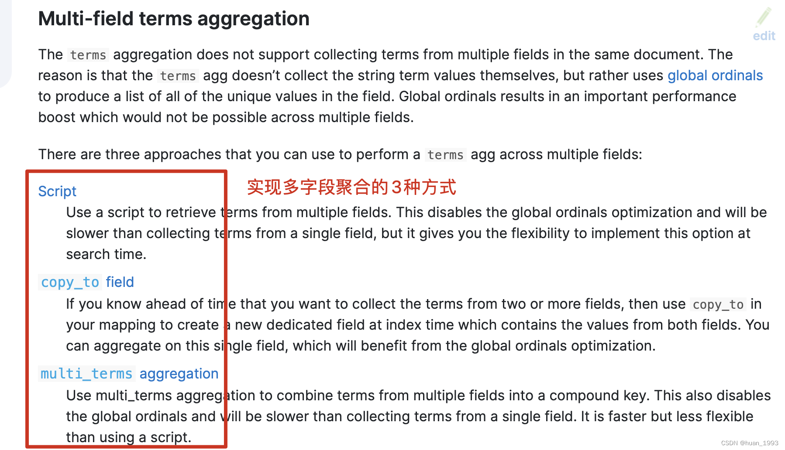

图片来源：https://www.elastic.co/guide/en/elasticsearch/reference/current/search-aggregations-bucket-terms-aggregation.html
从上图中，我们可以知道，可以通过3种方式来实现 多字段的聚合操作。

### 3、需求

根据省(province)和性别(sex)来进行聚合，再根据每个桶中的最大年龄(age)倒序。

### 4、数据准备

#### 4.1 创建索引

~~~json
PUT /index_person
{
  "settings": {
    "number_of_shards": 1
  },
  "mappings": {
    "properties": {
      "id": {
        "type": "long"
      },
      "name": {
        "type": "keyword"
      },
      "province": {
        "type": "keyword"
      },
      "sex": {
        "type": "keyword"
      },
      "age": {
        "type": "integer"
      },
      "address": {
        "type": "text",
        "analyzer": "ik_max_word",
        "fields": {
          "keyword": {
            "type": "keyword",
            "ignore_above": 256
          }
        }
      }
    }
  }
}
~~~

#### 4.2 准备数据

~~~json
PUT /_bulk
{"create":{"_index":"index_person","_id":1}}
{"id":1,"name":"张三","sex":"男","age":20,"province":"湖北","address":"湖北省黄冈市罗田县匡河镇"}
{"create":{"_index":"index_person","_id":2}}
{"id":2,"name":"李四","sex":"男","age":19,"province":"江苏","address":"江苏省南京市"}
{"create":{"_index":"index_person","_id":3}}
{"id":3,"name":"王武","sex":"女","age":25,"province":"湖北","address":"湖北省武汉市江汉区"}
{"create":{"_index":"index_person","_id":4}}
{"id":4,"name":"赵六","sex":"女","age":30,"province":"北京","address":"北京市东城区"}
{"create":{"_index":"index_person","_id":5}}
{"id":5,"name":"钱七","sex":"女","age":16,"province":"北京","address":"北京市西城区"}
{"create":{"_index":"index_person","_id":6}}
{"id":6,"name":"王八","sex":"女","age":45,"province":"北京","address":"北京市朝阳区"}
~~~

### 5、实现方式

#### 5.1 multi_terms实现（V8.x）

> multi_terms存在性能问题。当需要按文档数或组合键上的度量聚合进行排序并获得前N个结果时，multi_term聚合是最有用的。如果不需要排序，并且希望使用嵌套项检索所有值，则nested terms聚合（嵌套聚合）或 composite聚合将是一种更快、更节省内存的解决方案。

##### 5.1.1 dsl

~~~json
GET /index_person/_search
{
  "size": 0,
  "aggs": {
    "agg_province_sex": {
      "multi_terms": {
        "size": 10,
        "shard_size": 25,
        "order":{
          "max_age": "desc"    
        },
        "terms": [
          {
            "field": "province",
            "missing": "defaultProvince"
          },
          {
            "field": "sex"
          }
        ]
      },
      "aggs": {
        "max_age": {
          "max": {
            "field": "age"
          }
        }
      }
    }
  }
}
~~~

##### 5.1.2 java 代码

```java
    @Test
    @DisplayName("多term聚合-根据省和性别聚合，然后根据最大年龄倒序")
    public void agg01() throws IOException {

        SearchRequest searchRequest = new SearchRequest.Builder()
                .size(0)
                .index("index_person")
                .aggregations("agg_province_sex", agg ->
                        agg.multiTerms(multiTerms ->
                                        multiTerms.terms(term -> term.field("province"))
                                                .terms(term -> term.field("sex"))
                                                .order(new NamedValue<>("max_age", SortOrder.Desc))
                                )
                                .aggregations("max_age", ageAgg ->
                                        ageAgg.max(max -> max.field("age")))

                )
                .build();
        System.out.println(searchRequest);
        SearchResponse<Object> response = client.search(searchRequest, Object.class);
        System.out.println(response);
    }

```

##### 5.1.3 运行结果

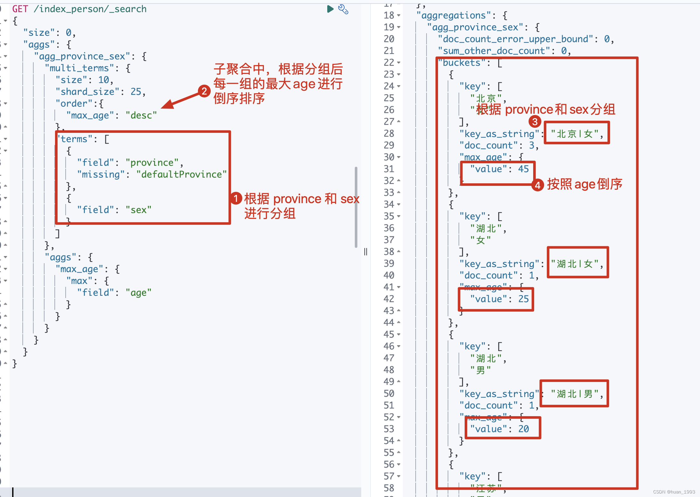

#### 5.2 script实现

##### 5.2.1 dsl

~~~json
GET /index_person/_search
{
  "size": 0,
  "runtime_mappings": {
    "runtime_province_sex": {
      "type": "keyword",
      "script": """
          String province = doc['province'].value;
          String sex = doc['sex'].value;
          emit(province + '|' + sex);
      """
    }
  },
  "aggs": {
    "agg_province_sex": {
      "terms": {
        "field": "runtime_province_sex",
        "size": 10,
        "shard_size": 25,
        "order": {
          "max_age": "desc"
        }
      },
      "aggs": {
        "max_age": {
          "max": {
            "field": "age"
          }
        }
      }
    }
  }
}
~~~

##### 5.2.2 java代码

```java
@Test
    @DisplayName("多term聚合-根据省和性别聚合，然后根据最大年龄倒序")
    public void agg02() throws IOException {

        SearchRequest searchRequest = new SearchRequest.Builder()
                .size(0)
                .index("index_person")
                .runtimeMappings("runtime_province_sex", field -> {
                    field.type(RuntimeFieldType.Keyword);
                    field.script(script -> script.inline(new InlineScript.Builder()
                            .lang(ScriptLanguage.Painless)
                            .source("String province = doc['province'].value;\n" +
                                    "          String sex = doc['sex'].value;\n" +
                                    "          emit(province + '|' + sex);")
                            .build()));
                    return field;
                })
                .aggregations("agg_province_sex", agg ->
                        agg.terms(terms ->
                                        terms.field("runtime_province_sex")
                                                .size(10)
                                                .shardSize(25)
                                                .order(new NamedValue<>("max_age", SortOrder.Desc))
                                )
                                .aggregations("max_age", minAgg ->
                                        minAgg.max(max -> max.field("age")))
                )
                .build();
        System.out.println(searchRequest);
        SearchResponse<Object> response = client.search(searchRequest, Object.class);
        System.out.println(response);
    }

```

##### 5.2.3 运行结果

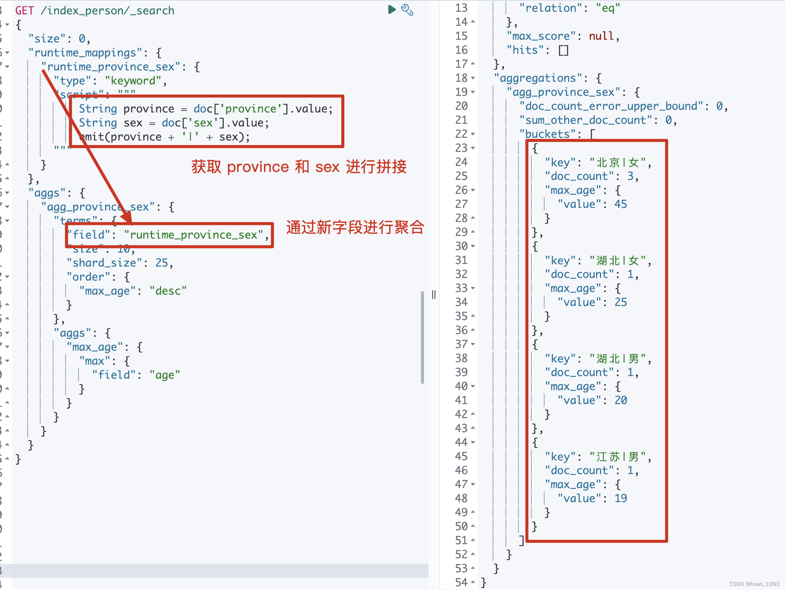

#### 5.3 通过copyto实现

通过copyto没实现，此处故先不考虑

#### 5.4 通过pipeline来实现

实现思路：
创建mapping时，多创建一个字段pipeline_province_sex，该字段的值由创建数据时指定pipeline来生产。

##### 5.4.1 创建mapping

~~~json
PUT /index_person
{
  "settings": {
    "number_of_shards": 1
  },
  "mappings": {
    "properties": {
      "id": {
        "type": "long"
      },
      "name": {
        "type": "keyword"
      },
      "province": {
        "type": "keyword"
      },
      "sex": {
        "type": "keyword"
      },
      "age": {
        "type": "integer"
      },
      #此处指定了一个字段pipeline_province_sex，该字段的值会由pipeline来处理。
      "pipeline_province_sex":{
        "type": "keyword"
      },
      "address": {
        "type": "text",
        "analyzer": "ik_max_word",
        "fields": {
          "keyword": {
            "type": "keyword",
            "ignore_above": 256
          }
        }
      }
    }
  }
}
~~~

##### 5.4.2 创建pipeline

~~~json
PUT _ingest/pipeline/pipeline_index_person_provice_sex
{
  "description": "将provice和sex的值拼接起来",
  "processors": [
    {
      "set": {
        "field": "pipeline_province_sex",
        "value": ["{{province}}", "{{sex}}"]
      }, 
      "join": {
        "field": "pipeline_province_sex",
        "separator": "|"
      }
    }
  ]
}
~~~

##### 5.4.3 插入数据

~~~json
#注意： 此处的插入需要指定上一步的pipeline。pipeline=pipeline_index_person_provice_sex
PUT /_bulk?pipeline=pipeline_index_person_provice_sex
{"create":{"_index":"index_person","_id":1}}
{"id":1,"name":"张三","sex":"男","age":20,"province":"湖北","address":"湖北省黄冈市罗田县匡河镇"}
{"create":{"_index":"index_person","_id":2}}
{"id":2,"name":"李四","sex":"男","age":19,"province":"江苏","address":"江苏省南京市"}
{"create":{"_index":"index_person","_id":3}}
{"id":3,"name":"王武","sex":"女","age":25,"province":"湖北","address":"湖北省武汉市江汉区"}
{"create":{"_index":"index_person","_id":4}}
{"id":4,"name":"赵六","sex":"女","age":30,"province":"北京","address":"北京市东城区"}
{"create":{"_index":"index_person","_id":5}}
{"id":5,"name":"钱七","sex":"女","age":16,"province":"北京","address":"北京市西城区"}
{"create":{"_index":"index_person","_id":6}}
{"id":6,"name":"王八","sex":"女","age":45,"province":"北京","address":"北京市朝阳区"}
~~~

##### 5.4.4 聚合dsl

~~~json
GET /index_person/_search
{
  "size": 0,
  "aggs": {
    "agg_province_sex": {
      "terms": {
        "field": "pipeline_province_sex",
        "size": 10,
        "shard_size": 25,
        "order": {
          "max_age": "desc"   
        }
      }, 
      "aggs": {
        "max_age": {
          "max": {
            "field": "age"
          }
        }
      }
    }
  }
}
~~~

##### 5.4.5 运行结果

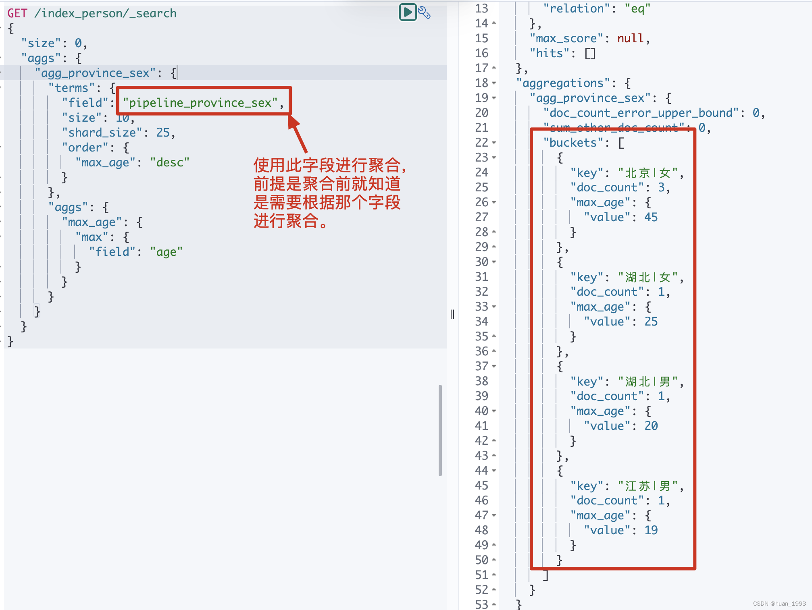

#### 5.5 composite

> 1.组合聚合打破了传统的多痛聚合只能依赖单一类型的限制，可以对多种类型的桶聚合进行复合。很灵活。
>
> 2.支持聚合后分页（仅支持向后翻页），返回值带有after，每次请求带上即可完成分页功能。

##### 5.5.1 dsl

~~~json
GET /index_person/_search
{
  "size": 0,
  "aggs": {
    "agg_province_sex": {
      "composite": {
        "sources": [
          {
            "agg_province": {
              "terms": {
                "field": "province"
              }
            }
          },
          {
            "agg_sex": {
              "terms": {
                "field": "sex"
              }
            }
          }
        ]
      },
      "aggs": {
        "max_age": {
          "max": {
            "field": "age"
          }
        }
      }
    }
  }
}
~~~

##### 5.5.2 运行结果

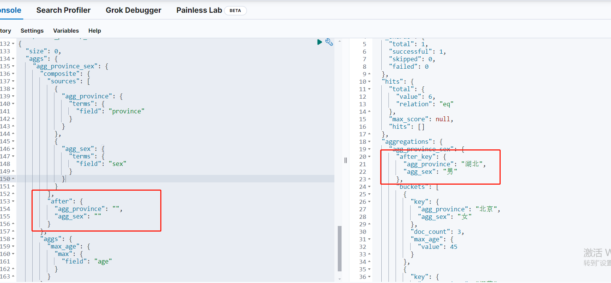

### 环比问题

~~~json
####环比求解实现
POST my_index_1105/_search
{
  "size": 0,----------------------------------------------------不显示检索结果
  "aggs": {
    "range_aggs": {
      "range": {------------------------------------------------全量数据聚合
        "field": "insert_date",
        "format": "yyyy-MM-dd",
        "ranges": [
          {
            "from": "2022-11-01",
            "to": "2022-12-31"
          }
        ]
      },
      "aggs": {
        "11month_count": {--------------------------------------11月数据聚合
          "filter": {
            "range": {
              "insert_date": {
                "gte": "2022-11-01",
                "lte": "2022-11-30"
              }
            }
          },
          "aggs": {
            "sum_aggs": {
              "sum": {
                "field": "count"
              }
            }
          }
        },
        "12month_count": {-----------------------------------12月数据聚合
          "filter": {
            "range": {
              "insert_date": {
                "gte": "2022-12-01",
                "lte": "2022-12-31"
              }
            }
          },
          "aggs": {
            "sum_aggs": {
              "sum": {
                "field": "count"
              }
            }
          }
        },
        "bucket_division": {----------------------------------求解环比上升比例
          "bucket_script": {
            "buckets_path": {
              "pre_month_count": "11month_count > sum_aggs",
              "cur_month_count": "12month_count > sum_aggs"
            },
            "script": "(params.cur_month_count - params.pre_month_count) / params.pre_month_count"
          }
        }
      }
    }
  }
}
~~~

## ES去重

> 1.对ES检索结果进行去重计数

### cardinality

~~~json
POST my_index_1106/_search
{
  "size": 0,
  "aggs": {
    "brand_count": {
      "cardinality": {
        "field": "brand.keyword"
      }
    }
  }
}

#返回结果
{
  "took" : 182,
  "timed_out" : false,
  "_shards" : {
    "total" : 1,
    "successful" : 1,
    "skipped" : 0,
    "failed" : 0
  },
  "hits" : {
    "total" : {
      "value" : 2,
      "relation" : "eq"
    },
    "max_score" : null,
    "hits" : [ ]
  },
  "aggregations" : {
    "brand_count" : {
      "value" : 2
    }
  }
}
~~~

> 2.对ES检索结果进行去重后显示

### top_hits

~~~json
####top_hits子聚合
POST my_index_1106/_search
{
  "size": 0,
  "query": {
    "match_all": {}
  },
  "aggs": {
    "aggs_by_brand": {
      "terms": {
        "field": "brand",
        "size": 10
      },
      "aggs": {
        "pt_tops": {
          "top_hits": {
            "_source": {
              "includes": [
                "brand",
                "name",
                "color"
              ]
            },
            "sort": [
              {
                "pt": {
                  "order": "desc"
                }
              }
            ],
            "size": 1
          }
        }
      }
    }
  }
}

#返回结果
{
  "took" : 25,
  "timed_out" : false,
  "_shards" : {
    "total" : 1,
    "successful" : 1,
    "skipped" : 0,
    "failed" : 0
  },
  "hits" : {
    "total" : {
      "value" : 2,
      "relation" : "eq"
    },
    "max_score" : null,
    "hits" : [ ]
  },
  "aggregations" : {
    "aggs_by_brand" : {
      "doc_count_error_upper_bound" : 0,
      "sum_other_doc_count" : 0,
      "buckets" : [
        {
          "key" : "brand_a",
          "doc_count" : 1,
          "pt_tops" : {
            "hits" : {
              "total" : {
                "value" : 1,
                "relation" : "eq"
              },
              "max_score" : null,
              "hits" : [
                {
                  "_index" : "my_index_1106",
                  "_type" : "_doc",
                  "_id" : "10",
                  "_score" : null,
                  "_source" : {
                    "color" : "red",
                    "name" : "product_01",
                    "brand" : "brand_a"
                  },
                  "sort" : [
                    1609459200000
                  ]
                }
              ]
            }
          }
        },
        {
          "key" : "brand_b",
          "doc_count" : 1,
          "pt_tops" : {
            "hits" : {
              "total" : {
                "value" : 1,
                "relation" : "eq"
              },
              "max_score" : null,
              "hits" : [
                {
                  "_index" : "my_index_1106",
                  "_type" : "_doc",
                  "_id" : "11",
                  "_score" : null,
                  "_source" : {
                    "color" : "red",
                    "name" : "product_02",
                    "brand" : "brand_b"
                  },
                  "sort" : [
                    1612137600000
                  ]
                }
              ]
            }
          }
        }
      ]
    }
  }
}

~~~

### 折叠去重

> **collapse去重：**可以将多个相同的文档缩成一个文档，并仅保留一个代表文档。collapse的去重是在聚合之前进行的，因此它可以有效地减少数据量，提高查询性能。在Elasticsearch中，collapse功能扮演着合并及简化查询结果的角色。它可以将具有相同字段值的多个文档折叠成一个具有代表性的文档。请注意，虽然collapse
> 操作在一定程度上类似于去重，但collapse实际上是对查询结果进行的优化处理而非聚合操作的一部分。
>
> **tophits去重:**一种子聚合方式，可以在聚合结果中查找最高分的文档。在某些情况下，可以使用top_hits来对文档进行去重，因为它只会返回每个聚合组中分数最高的文档。但是，top_hits的去重是在聚合之后进行的，因此可能不会有效地减小数据量。
>
> 总之，在想要尽早减少数据量并提高查询性能时，请使用collapse去重方式;如果需要在聚合结果中查找最高分的文档，则应使用tophits方式。

~~~json
####折叠去重实现
POST my_index_1106/_search
{
  "query": {
    "match_all": {}
  },
  "collapse": {
    "field": "brand.keyword",
    "inner_hits": {
      "name": "by_color",
      "collapse": {
        "field": "color.keyword"
      },
      "size": 5
    }
  }
}

#返回结果
{
  "took" : 9,
  "timed_out" : false,
  "_shards" : {
    "total" : 1,
    "successful" : 1,
    "skipped" : 0,
    "failed" : 0
  },
  "hits" : {
    "total" : {
      "value" : 2,
      "relation" : "eq"
    },
    "max_score" : null,
    "hits" : [
      {
        "_index" : "my_index_1106",
        "_type" : "_doc",
        "_id" : "10",
        "_score" : 1.0,
        "_source" : {
          "brand" : "brand_a",
          "pt" : "2021-01-01",
          "name" : "product_01",
          "color" : "red",
          "price" : 600
        },
        "fields" : {
          "brand.keyword" : [
            "brand_a"
          ]
        },
        "inner_hits" : {
          "by_color" : {
            "hits" : {
              "total" : {
                "value" : 1,
                "relation" : "eq"
              },
              "max_score" : null,
              "hits" : [
                {
                  "_index" : "my_index_1106",
                  "_type" : "_doc",
                  "_id" : "10",
                  "_score" : 1.0,
                  "_source" : {
                    "brand" : "brand_a",
                    "pt" : "2021-01-01",
                    "name" : "product_01",
                    "color" : "red",
                    "price" : 600
                  },
                  "fields" : {
                    "color.keyword" : [
                      "red"
                    ]
                  }
                }
              ]
            }
          }
        }
      },
      {
        "_index" : "my_index_1106",
        "_type" : "_doc",
        "_id" : "11",
        "_score" : 1.0,
        "_source" : {
          "brand" : "brand_b",
          "pt" : "2021-02-01",
          "name" : "product_02",
          "color" : "red",
          "price" : 200
        },
        "fields" : {
          "brand.keyword" : [
            "brand_b"
          ]
        },
        "inner_hits" : {
          "by_color" : {
            "hits" : {
              "total" : {
                "value" : 1,
                "relation" : "eq"
              },
              "max_score" : null,
              "hits" : [
                {
                  "_index" : "my_index_1106",
                  "_type" : "_doc",
                  "_id" : "11",
                  "_score" : 1.0,
                  "_source" : {
                    "brand" : "brand_b",
                    "pt" : "2021-02-01",
                    "name" : "product_02",
                    "color" : "red",
                    "price" : 200
                  },
                  "fields" : {
                    "color.keyword" : [
                      "red"
                    ]
                  }
                }
              ]
            }
          }
        }
      }
    ]
  }
}
~~~

# ES安全之X-Pack

## 1、什么是Xpack

> X-Pack是ES扩展功能，提供安全性，警报，监视，报告，机器学习和许多其他功能。 ES7.0+之后，默认情况下，当安装ElasticSearch时，会安装X-Pack，无需单独再安装。

基础版本安全功能列表如下：


## 2、相关安全配置介绍

这里挑一些比较重要常见的配置项介绍，完整的配置介绍可以查看官方文档

### 2.1、xpack.security.enabled

默认为true，启用节点上ES的XPACK安全功能，相当于总开关

### 2.2、xpack.security.http.ssl

这个是用来开启https的，以及对应的设置，整体配置项如下：

~~~yaml
xpack.security.http.ssl:
  enabled: false 【开启还是关闭】
  verification_mode: certificate【如下】
   【full：它验证所提供的证书是否由受信任的权威机构(CA)签名，并验证服务器的主机名(或IP地址)是否与证书中识别的名称匹配。】
   【certificate：它验证所提供的证书是否由受信任的机构(CA)签名，但不执行任何主机名验证。】
   【none：它不执行服务器证书的验证。】
  truststore.path: certs/elastic-certificates.p12 【信任存储库文件的存放位置】
  keystore.path: certs/elastic-certificates.p12【密钥存储库文件的存放位置】
~~~

### 2.3、xpack.security.transport.ssl

这个是传输层的认证设置，整体配置项如下：

~~~yaml
xpack.security.transport.ssl:
  enabled: true【开启还是关闭】
  verification_mode: certificate【如下】
   【full：它验证所提供的证书是否由受信任的权威机构(CA)签名，并验证服务器的主机名(或IP地址)是否与证书中识别的名称匹配。】
   【certificate：它验证所提供的证书是否由受信任的机构(CA)签名，但不执行任何主机名验证。】
   【none：它不执行服务器证书的验证。】
  keystore.path: certs/elastic-certificates.p12【信任存储库文件的存放位置】
  truststore.path: certs/elastic-certificates.p12【密钥存储库文件的存放位置】
~~~

## 3、ES集群认证配置

命令操作都是在ES安装根目录下执行的

### 3.1、创建证书

#### a、创建一个证书颁发机构

提示命名文件：直接回车，默认文件名elastic-stack-ca.p12文件
提示输入密码：可以直接回车，也可以输入密码进行设置

~~~sh
./bin/elasticsearch-certutil ca
~~~

#### b、为节点生成证书和私钥

提示命名文件，直接回车，默认文件名elastic-certificates.p12文件
提示输入密码：可以直接回车，也可以输入密码进行设置

~~~sh
./bin/elasticsearch-certutil cert --ca elastic-stack-ca.p12
~~~

#### c、config目录下创建下certs目录

~~~sh
makdir config/certs 
~~~

#### d、将文件可拷贝到certs目录下

~~~sh
mv elastic-certificates.p12 config/certs/
~~~

### 3.2、给keystore和truststore设置密码(可选)

注解：
keystore可以看成一个放key的库，key就是公钥，私钥，数字签名等组成的一个信息。
truststore是放信任的证书的一个store
truststore和keystore的性质是一样的，都是存放key的一个仓库，区别在于，truststore里存放的是只包含公钥的数字证书，代表了可以信任的证书，而keystore是包含私钥的。

如果在创建证书的过程中加了密码，需要输入这个密码（每个节点都需要）。

~~~sh
./bin/elasticsearch-keystore add xpack.security.transport.ssl.keystore.secure_password

./bin/elasticsearch-keystore add xpack.security.transport.ssl.truststore.secure_password

./bin/elasticsearch-keystore add xpack.security.http.ssl.keystore.secure_password

./bin/elasticsearch-keystore add xpack.security.http.ssl.truststore.secure_password
~~~

这样就会在config目录下keystore文件了

### 3.3、修改配置文件并重启

配置文件中加入以下配置，然后重启

~~~sh
xpack.security.enabled: true

xpack.security.http.ssl:
  enabled: false
  verification_mode: certificate
  truststore.path: certs/elastic-certificates.p12
  keystore.path: certs/elastic-certificates.p12

xpack.security.transport.ssl:
  enabled: true
  verification_mode: certificate
  keystore.path: certs/elastic-certificates.p12
  truststore.path: certs/elastic-certificates.p12
~~~

`注意：需要设置elastic-certificates.p12文件权限，否则报错。`

chmod 777 -R certs/

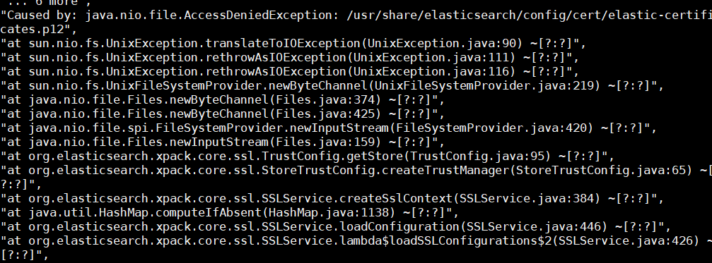

### 3.4、创建用户密码

把elastic-certificates.p12文件复制到其他节点certs目录下，就可以设置账号密码了。在其中一个节点设置密码即可，设置完之后，数据会自动同步到其他节点。

#### a、手动输入密码

~~~sh
./bin/elasticsearch-setup-passwords interactive
~~~

#### b、重置用户密码（随机密码）

~~~sh
./bin/elasticsearch-reset-password -u elastic
~~~

#### c、重置用户密码（指定密码）

~~~sh
./bin/elasticsearch-reset-password -u elastic -i <password>
~~~

## 4、ES单机认证配置

### 1.修改配置

需要在配置文件中开启x-pack验证, 修改config目录下面的elasticsearch.yml文件，在里面添加如下内容,并重启es.

~~~sh
xpack.security.enabled: true
xpack.license.self_generated.type: basic
xpack.security.transport.ssl.enabled: true
~~~

### 2.设置密码

进入es的安装根目录bin下，执行设置用户名和密码的命令,这里需要为4个用户分别设置密码，elastic, [kibana](https://so.csdn.net/so/search?q=kibana&spm=1001.2101.3001.7020), logstash_system,beats_system

~~~sh
./elasticsearch-setup-passwords interactive
~~~

## 5、认证验证场景

### 5.1、浏览器访问验证

这里说明一下：
xpack.security.http.ssl的enable为true 就会是https，为false就是http，我这里是关掉了

### 5.2、curl 认证

当你执行curl去访问es api的时候也会提示需要进行认证


但是带上账号密码就可以了

### 5.3、kibana 认证

kibana中配置ES中配置的kibana账号密码即可连接ES认证

~~~sh
elasticsearch.username: "elastic"
elasticsearch.password: "XXX"
elasticsearch.hosts: ["http://1.1.1.1:9200","http://2.2.2.2:9200","http://3.3.3.3:9200"]
server.port: 5601
~~~

## 中孚elasticsearch.yml

~~~yaml
cluster.name: zf-es
node.name: node-1
network.host: 0.0.0.0
http.port: 9200
#设置节点之间的tcp端口，默认是9300
transport.tcp.host: 8544
#集群的节点列表
discovery.seed_hosts: ["node128:9301"]
#初始master节点
cluster.initial_master_nodes: ["node128"]

path.data: /opt/zfbdp/data/elasticsearch
path.logs: /opt/zfbdp/logs/elasticsearch

xpack.security.enabled: true
xpack.security.http.ssl:
  enabled: false
  verification_mode: certificate
  truststore.path: certs/elastic-certificates.p12
  keystore.path: certs/elastic-certificates.p12
xpack.security.transport.ssl:
  enabled: true
  verification_mode: certificate
  keystore.path: certs/elastic-certificates.p12
  truststore.path: certs/elastic-certificates.p12

action.destructive_requires_name: true
bootstrap.system_call_filter: false
#是否允许跨域REST请求
http.cors.enabled: true
#允许REST请求来自何处
http.cors.allow-origin: "*"
~~~

