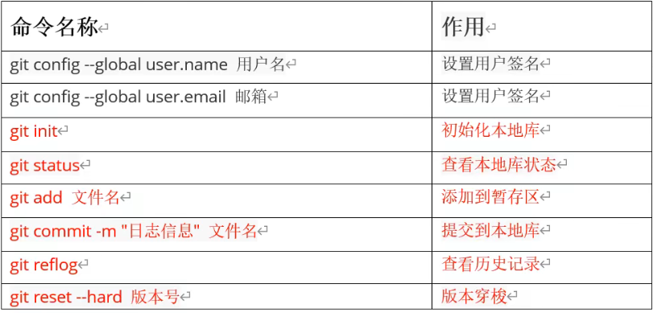

# Git

## 常用命令



### 分支操作

查看分支：git branch -v

创建分支：git branch 分支名

切换分支：git checkout 分支名

合并分支：git merge 分支名

### 推送远程库操作

查看别名：git remote -v

创建别名：git remote add 别名

推送到远程库：git push url/别名 分支

拉取：git pull url/别名 分支

### 添加ssh免密登录

ssh-keygen -t rsa -C 1531548541@qq.com   接下来一路回车


#### gitignore

```
# Created by .ignore support plugin (hsz.mobi)
### my_java template
# Compiled class file
*.class

# Log file
*.log

# BlueJ files
*.ctxt

# Mobile Tools for Java (J2ME)
.mtj.tmp/

# Package Files #
*.jar
*.war
*.nar
*.ear
*.zip
*.tar.gz
*.rar

# virtual machine crash logs, see http://www.java.com/en/download/help/error_hotspot.xml
hs_err_pid*

.idea/
target/
```

