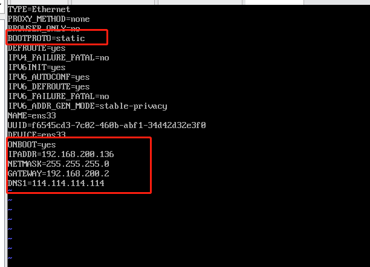
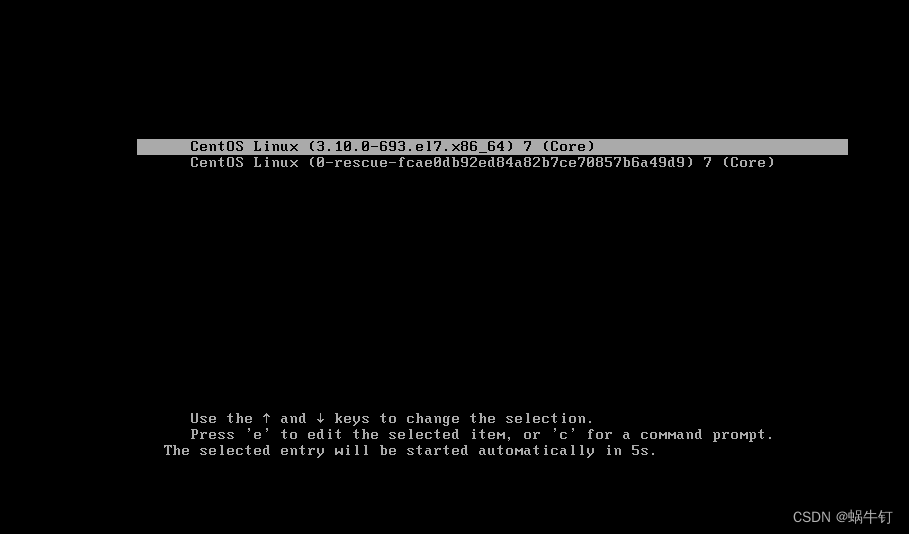
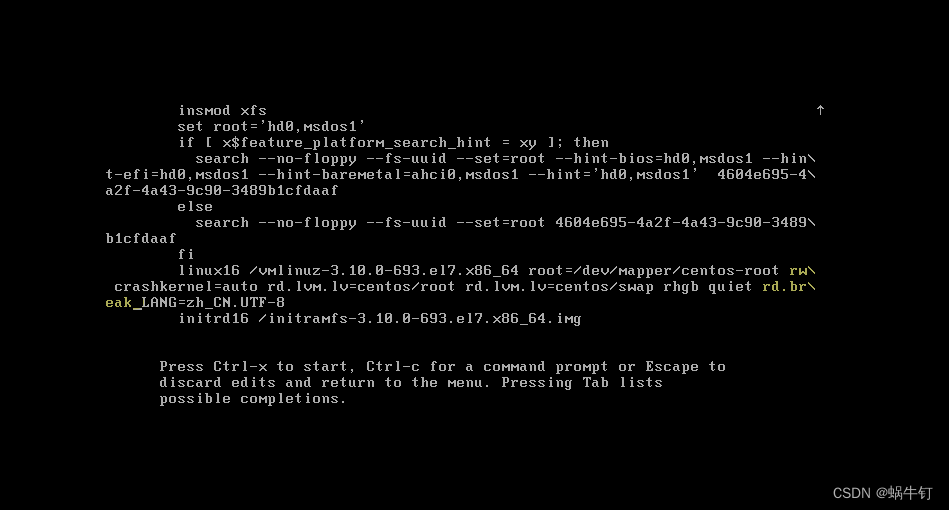
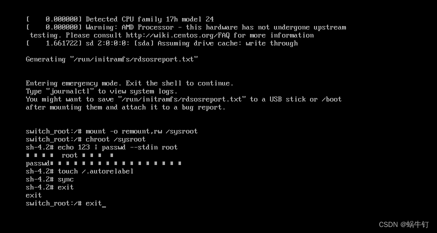
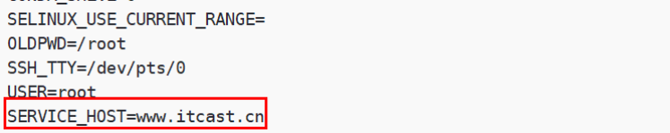
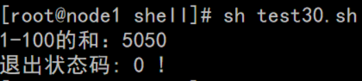
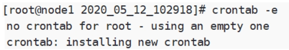

# VM配置静态ip

| 环境   | version                  |
| ------ | ------------------------ |
| centos | CentOS-7-x86_64-DVD-2009 |

~~~sh
#1.修改网络配置
vi /etc/sysconfig/network-scripts/ifcfg-ens33

#添加一下内容
IPADDR=192.168.200.136
NETMASK=255.255.255.0
GATEWAY=192.168.200.2
DNS1=114.114.114.114
~~~

~~~sh
#2.重启网络
systemctl restart network
~~~

3.修改VM配置

~~~sh
#4.验证
ip addr
~~~

# VM克隆

**注意：克隆之后注意要将mac重新生成，此时ip和源主机一样，所以先别登源主机，改完ip再登。**

~~~sh
#修改ip
vi /etc/sysconfig/network-scripts/ifcfg-ens33
~~~

# 分区与挂载

## 一、linux分区

### 1.原理介绍

> 1、对Linux来说，无论有几个分区，分给哪一目录使用，他归根结底只有一个根目录，一个独立且唯一的文件结构，Linux中每个分区都是用来组成整个文件系统的一部分。
>
> 2、Linux采用了一种叫"载入"的处理方法，它的整个文件系统中包含了一整套的文件和目录，且将一个分区和一个目录联系起来，这是要载入的一个分区将使它的存储空间在一个目录下获得。

### 2.分区和文件关系示意图：

## 二、linux挂载

### 1.查看所有设备挂载情况

~~~shell
指令：lsblk 或者lsblk -f
~~~

这里sda1、2、3分别代表第一块硬盘的第一分区第二分区第三分区

## 三、挂载案例

### 1.使用lsblk命令查看

### 2. 虚拟机硬盘分区

~~~sh
分区指令：fdisk   /dev/sdb    其中：sdb 根据实际情况变更
~~~

开始对sdb分区

m 显示命令列表

p 显示磁盘分区同[fdisk](https://so.csdn.net/so/search?q=fdisk&spm=1001.2101.3001.7020) -l

n 新增分区

d 删除分区

w 写入并退出

说明：开始分区后输入n，新增分区，然后选择p，分区类型为主分区。两次回车默认剩余全部空间，最后输入w写入分区并退出，若不保存退出输入q

~~~sh
[root@localhost ~]# fdisk   /dev/sdb
Welcome to fdisk (util-linux 2.23.2).

Changes will remain in memory only, until you decide to write them.
Be careful before using the write command.

Device does not contain a recognized partition table
Building a new DOS disklabel with disk identifier 0x60ab3813.

Command (m for help): m
Command action
   a   toggle a bootable flag
   b   edit bsd disklabel
   c   toggle the dos compatibility flag
   d   delete a partition
   g   create a new empty GPT partition table
   G   create an IRIX (SGI) partition table
   l   list known partition types
   m   print this menu
   n   add a new partition
   o   create a new empty DOS partition table
   p   print the partition table
   q   quit without saving changes
   s   create a new empty Sun disklabel
   t   change a partition's system id
   u   change display/entry units
   v   verify the partition table
   w   write table to disk and exit
   x   extra functionality (experts only)

Command (m for help): p

Disk /dev/sdb: 1073 MB, 1073741824 bytes, 2097152 sectors
Units = sectors of 1 * 512 = 512 bytes
Sector size (logical/physical): 512 bytes / 512 bytes
I/O size (minimum/optimal): 512 bytes / 512 bytes
Disk label type: dos
Disk identifier: 0x60ab3813

   Device Boot      Start         End      Blocks   Id  System

Command (m for help): n
Partition type:
   p   primary (0 primary, 0 extended, 4 free)
   e   extended
Select (default p): p
Partition number (1-4, default 1): 1
First sector (2048-2097151, default 2048): 
Using default value 2048
Last sector, +sectors or +size{K,M,G} (2048-2097151, default 2097151): 
Using default value 2097151
Partition 1 of type Linux and of size 1023 MiB is set

Command (m for help): w
The partition table has been altered!

Calling ioctl() to re-read partition table.
Syncing disks.
~~~

### 3.虚拟机硬盘分区格式化

**格式化磁盘，格式化之后才会分配UUID**

~~~sh
格式化指令：mkfs  -t  ext4     /dev/sdb1    sdb1  根据时间情况变更
~~~

**其中ext4是分区类型**

~~~sh
 mkfs -t ext4 /dev/sdb1
lsblk -f
~~~

### 4.mount挂载 重启挂载失效

#### 4.1挂载名词解释

> 挂载：将一个分区与一个目录联系起来，

#### 4.2注意事项

**挂载的路径有文件，如果执行挂载新磁盘后原文件会消失**
如果很不幸，挂载的路径有文件，不小心把其它文件覆盖了，怎么办？
比如挂载到了 /apps下，原来/home下的文件全都不见了。

此时我们只需要解挂:

~~~sh
 umount /dev/sdb1  /apps
~~~

**umount /apps ###解除挂载,可能会出现占用无法删除,可以使用 umount -fl /apps 强行卸载,**
解挂后，操作系统指向 /home 的地址改变了，原来的文件又能看见了。

#### 4.3挂载

~~~sh
mount /dev/sdb1 /apps
~~~

#### 4.4挂载非空目录解决方案

~~~sh
##############核心就是先备份到临时目录，挂载完再拷贝回来###############
# mkdir /new                  //创建临时目录

# cp -R /apps/*  /new     //将/oradata下的所有数据复制到/new

# rm -rf /apps/*          //腾出空间给原来的硬盘（可选）

#mount /dev/sdb /apps  //挂载/apps到新硬盘

# cp -R /new/*  /apps //将/new下的所有数据复制回/apps

# rm -rf /new              //删除临时目录
~~~

### 5.实现永久挂载（即重启不消失）

****

> **永久挂载的本质是自动挂载上**
>
> 永久挂载：通过修改  /etc/fstab实现挂载
>
> **添加完成后执行mount -a或reboot即可生效**

# 防火墙、端口相关

~~~sh
#开启端口
firewall-cmd --zone=public --add-port=80/tcp --permanent
#已开启端口
firewall-cmd --list-port
#某个端口是否开启
firewall-cmd --query-port=80/tcp
#重启防火墙
firewall-cmd --reload
#关闭防火墙
systemctl stop firewalld.service

#查看端口
netstat -nlptu
~~~

# 文件

~~~sh
#查看某个目录下所有文件的大小
du -h
~~~

# vi

~~~sh
#删除某一行
dd
#删除全部
d+G
#复制当前行
yy复制当前行，在合适的位置，p粘贴
#复制n行
nyy复制n行（n=1,2,3...），在合适的位置，p粘贴
~~~

# cat/more/less命令

## cat命令

cat 文件路径

**cat** **/**root**/**initial-setup-ks.cfg

 

## more命令

分页显示文件内容，还支持直接跳转行等功能

more 文件路径

**相关操作:**

**Enter:** 向下n行, 需要定义, 默认为1行

**空格键:** 向下滚动一屏 或 Ctrl + F

**B键** : 返回上一屏 或 Ctrl+B 

**q:** 退出more

 

**more** **/**root**/**initial-setup-ks.cfg

## **less命令**

分页显示文件内容，还支持直接跳转行等功能

**语法:** more filePath

**空格键:** 前进一页 或 page down

**b :** 后退一页 或 page up

**d :** 前进半页

**u :** 后退半页

# grep

~~~sh
#查看xx文件xx内容后的20行
cat xx.conf | grep xx -A 20
~~~

# rpm

~~~sh
#安装
rpm -ivh xx.rpm
#查看某个rpm是否安装了
rpm -qa|grep xx
#卸载
rpm -e xx.rpm
#升级
rpm -Uvh xx.rpm
#查询软件描述信息的命令格式
rpm -qpi xxx.rpm
#列出软件文件信息的命令格式
rpm -qpl xxx.rpm
#查询文件属于哪个RPM的命令格式
rpm -qf xxx.rpm

#参数说明
-a 　查询所有套件。
-b<完成阶段><套件档>+或-t <完成阶段><套件档>+ 　设置包装套件的完成阶段，并指定套件档的文件名称。
-c 　只列出组态配置文件，本参数需配合"-l"参数使用。
-d 　只列出文本文件，本参数需配合"-l"参数使用。
-e<套件档>或--erase<套件档> 　删除指定的套件。
-f<文件>+ 　查询拥有指定文件的套件。
-h或--hash 　套件安装时列出标记。
-i 　显示套件的相关信息。
-i<套件档>或--install<套件档> 　安装指定的套件档。
-l 　显示套件的文件列表。
-p<套件档>+ 　查询指定的RPM套件档。
-q 　使用询问模式，当遇到任何问题时，rpm指令会先询问用户。
-R 　显示套件的关联性信息。
-s 　显示文件状态，本参数需配合"-l"参数使用。
-U<套件档>或--upgrade<套件档> 升级指定的套件档。
-v 　显示指令执行过程。
-vv 　详细显示指令执行过程，便于排错。
-addsign<套件档>+ 　在指定的套件里加上新的签名认证。
--allfiles 　安装所有文件。
--allmatches 　删除符合指定的套件所包含的文件。
--badreloc 　发生错误时，重新配置文件。
--buildroot<根目录> 　设置产生套件时，欲当作根目录的目录。
--changelog 　显示套件的更改记录。
--checksig<套件档>+ 　检验该套件的签名认证。
--clean 　完成套件的包装后，删除包装过程中所建立的目录。
--dbpath<数据库目录> 　设置欲存放RPM数据库的目录。
--dump 　显示每个文件的验证信息。本参数需配合"-l"参数使用。
--excludedocs 　安装套件时，不要安装文件。
--excludepath<排除目录> 　忽略在指定目录里的所有文件。
--force 　强行置换套件或文件。
--ftpproxy<主机名称或IP地址> 　指定FTP代理服务器。
--ftpport<通信端口> 　设置FTP服务器或代理服务器使用的通信端口。
--help 　在线帮助。
--httpproxy<主机名称或IP地址> 　指定HTTP代理服务器。
--httpport<通信端口> 　设置HTTP服务器或代理服务器使用的通信端口。
--ignorearch 　不验证套件档的结构正确性。
--ignoreos 　不验证套件档的结构正确性。
--ignoresize 　安装前不检查磁盘空间是否足够。
--includedocs 　安装套件时，一并安装文件。
--initdb 　确认有正确的数据库可以使用。
--justdb 　更新数据库，当不变动任何文件。
--nobulid 　不执行任何完成阶段。
--nodeps 　不验证套件档的相互关联性。
--nofiles 　不验证文件的属性。
--nogpg 　略过所有GPG的签名认证。
--nomd5 　不使用MD5编码演算确认文件的大小与正确性。
--nopgp 　略过所有PGP的签名认证。
--noorder 　不重新编排套件的安装顺序，以便满足其彼此间的关联性。
--noscripts 　不执行任何安装Script文件。
--notriggers 　不执行该套件包装内的任何Script文件。
--oldpackage 　升级成旧版本的套件。
--percent 　安装套件时显示完成度百分比。
--pipe<执行指令> 　建立管道，把输出结果转为该执行指令的输入数据。
--prefix<目的目录> 　若重新配置文件，就把文件放到指定的目录下。
--provides 　查询该套件所提供的兼容度。
--queryformat<档头格式> 　设置档头的表示方式。
--querytags 　列出可用于档头格式的标签。
--rcfile<配置文件> 　使用指定的配置文件。
--rebulid<套件档> 　安装原始代码套件，重新产生二进制文件的套件。
--rebuliddb 　以现有的数据库为主，重建一份数据库。
--recompile<套件档> 　此参数的效果和指定"--rebulid"参数类似，当不产生套件档。
--relocate<原目录>=<新目录> 　把本来会放到原目录下的文件改放到新目录。
--replacefiles 　强行置换文件。
--replacepkgs 　强行置换套件。
--requires 　查询该套件所需要的兼容度。
--resing<套件档>+ 　删除现有认证，重新产生签名认证。
--rmsource 　完成套件的包装后，删除原始代码。
--rmsource<文件> 　删除原始代码和指定的文件。
--root<根目录> 　设置欲当作根目录的目录。
--scripts 　列出安装套件的Script的变量。
--setperms 　设置文件的权限。
--setugids 　设置文件的拥有者和所属群组。
--short-circuit 　直接略过指定完成阶段的步骤。
--sign 　产生PGP或GPG的签名认证。
--target=<安装平台>+ 　设置产生的套件的安装平台。
--test 　仅作测试，并不真的安装套件。
--timecheck<检查秒数> 　设置检查时间的计时秒数。
--triggeredby<套件档> 　查询该套件的包装者。
--triggers 　展示套件档内的包装Script。
--verify 　此参数的效果和指定"-q"参数相同。
--version 　显示版本信息。
--whatprovides<功能特性> 　查询该套件对指定的功能特性所提供的兼容度。
--whatrequires<功能特性> 　查询该套件对指定的功能特性所需要的兼容度。
~~~

# zip

~~~sh
#把/home目录下面的data目录压缩为data.zip
zip -r data.zip data #压缩data目录
#把/home目录下面的data.zip解压到databak目录里面
unzip data.zip -d databak
#/home目录下面的a文件夹和3.txt压缩成为a123.zip
zip -r a123.zip a 3.txt
#/home目录下面的t.zip直接解压到/home目录里面
unzip t.zip
#/home目录下面的a1.zip、a2.zip、a3.zip同时解压到/home目录里面
unzip a*.zip
#/home目录下面w.zip里面的所有文件解压到第一级目录
unzip -j wt.zip
#指定密码
zip data.zip ./data/* -e 
~~~

选项	说明
-q	不显示指令执行过程
-r	递归处理，将指定目录下的所有文件和子目录一起处理
-z	给压缩文件加上注释
-v	显示指令的执行过程
-d	删除压缩包内的文件
-n   <后缀>	不压缩具有特定后缀的文件
-e	加密压缩文件
-u	更新或追加文件到压缩包内
-f	更新现有的文件
-m	将文件压缩并加入压缩文件后，删除原始文件，即把文件移到压缩文件中
-o	以压缩文件内拥有最新更改时间的文件为准，将压缩文件的更改时间设成和该文件相同

# 时间/日期

| 命令                      | 作用                       |
| ------------------------- | -------------------------- |
| date                      | 查看系统时间(**默认**)     |
| date +"%Y-%m-%d %H:%M:%S" | 查看系统时间(**指定格式**) |
| date -s "时间字符串"      | 设置系统时间               |

实例:

**[**root**@**node1 export**]**# date

Wed Jul 31 07**:**20**:**31 CST 2019

**[**root**@**node1 export**]**# date **+**"%Y-%m-%d %H:%M:%S"

2019**-**07**-**31 07**:**20**:**49

**[**root**@**node1 export**]**# date -s '2019-07-31 20:21:49'

Wed Jul 31 20**:**21**:**49 CST 2019

**[**root**@**node1 export**]**# date **+**"%Y-%m-%d %H:%M:%S"  

2019**-**07**-**31 20**:**21**:**52

 

# 实用命令

清缓存

~~~sh
#清理前最好sync一下，防止正在运行的程序崩溃
sync
echo 3 > /proc/sys/vm/drop_caches
~~~

scp

~~~sh
#将本机/root/lk目录下所有的文件传输到服务器43.224.34.73的/home/lk/cpfile目录下
scp -r /root/lk root@43.224.34.73:/home/lk/cpfile
#将服务器43.224.34.73上/home/lk/目录下所有的文件全部复制到本地的/root目录下
scp -r root@43.224.34.73:/home/lk /root
~~~

目录/文件相关

~~~sh
#查看某个目录下文件数
ls | wc -l
~~~

# pg

~~~sh
#进去cmd
psql -U postgres -h localhost -p 5432 -d dbname
# 备份sql（结构+数据），数据加上 -a ,结构加上-s , 什么都不加就是结构+数据
1. cd到pg的bin
2. pg_dump -h localhost -U postgres databasename > databasename.bak
# 恢复sql
3. psql -h localhost -U postgres -d databasename < databasename.bak
~~~

# 查看日志

~~~sh
#查看某个service日志
journalctl -e -u 服务名
#查看系统日志
cat /var/log/message
~~~

# 查看磁盘

~~~sh
#查看磁盘使用
df -h
#查看某个目录磁盘
~~~

# 查看端口

~~~sh
查看端口是否使用
netstat -nltp|grep xx
~~~

# lsof

> `lsof`（List Open Files）命令在Linux系统中用于查看当前系统上所有打开的文件和与之关联的进程。每个进程在系统中都有文件描述符，用于指向打开的文件，这些文件可以是磁盘文件、网络套接字、管道等。
>
> `lsof`命令可以帮助用户了解哪些文件被哪个进程打开，以及这些文件的状态信息。命令可以帮助系统管理员或者开发人员诊断和排查各种与文件访问相关的问题。

~~~sh
lsof [选项] [文件]

`-a` 或 `--all`：显示所有打开的文件，不仅仅是已经被映射到内存中的文件。
`-c <字符串>` 或 `--command <字符串>`：只显示指定命令的打开文件。
`-d <文件描述符>` 或 `--disk-only`：只显示指定文件描述符的文件。
`-h` 或 `--human-readable`：以易读的格式显示文件大小。
`-i` 或 `--network`：显示网络相关的文件（如套接字）。
`-n` 或 `--numeric`：不解析网络地址，显示数字形式的端口号和进程ID。
`-p <PID>` 或 `--pid <PID>`：只显示指定进程ID的打开文件。
`-u <用户>` 或 `--user <用户>`：只显示指定用户的所有打开文件。
`-v` 或 `--verbose`：详细显示信息，包括进程的环境和文件的状态。
`-t` 或 `--tables`：只更新打开文件的表，而不显示它们。
`-x` 或 `--extend`：显示额外的信息，如文件权限和文件系统类型。
~~~

## 常见用法

### 1. 查找占用特定端口的进程：

~~~sh
[root@ecs-52a1 121yunwei]# lsof -i:26088
COMMAND       PID   USER   FD   TYPE    DEVICE SIZE/OFF NODE NAME
nginx.out 4067399   root    8u  IPv4 762811375      0t0  TCP *:26088 (LISTEN)
nginx.out 4067405 nobody    8u  IPv4 762811375      0t0  TCP *:26088 (LISTEN)
~~~

> COMMAND：进程的命令名称。
>
> PID：             进程ID。
>
> USER：        进程所属的用户。
>
> FD：             文件描述符。在Unix系统中，每个打开的文件都有一个唯一的文件描述符。
>
> TYPE：        文件类型，可以是REG（普通文件）、DIR（目录）、CHR（字符设备）、BLK（块设备）、FIFO（管道）、LINK（符号链接）、SOCK（套接字）等。
>
> DEVICE：    文件的设备编号，对于普通文件，这通常是文件的inode号。
>
> SIZE/OFF：文件的大小或者偏移量，对于块设备和字符设备尤其重要。
>
> NODE：      文件的inode号。
>
> NAME：      打开文件的路径。
>

### 2. 查看某个文件被哪个进程打开：

~~~sh
lsof /path-to-file
~~~

### 3. 查找特定用户的打开文件：

~~~sh
lsof -u username
~~~

### 4. 查看详细信息，包括环境和文件状态：

~~~sh
lsof -v
~~~

# linux系统忘记密码

`以CentOS7为例`

**1.开机/或者重新启动CentOS系统，然后如图所示，迅速按下'e'**

**2.按下'e'之后，进入到了如图所示页面,键盘上下键找到 ro**

将图中的 ro 改为 rw 

再在 rhgb quiet 后面写上 rd.break  记得注意空格。

然后按Ctrl + X 确定

3. **然后进入如下界面，依次输入以下命令.....[注意命令之间的空格]**

~~~bash
mount -o remount,rw /sysroot   # 意思是重新挂载 remount 文件系统，并将其设置为可读写
chroot /sysroot   # 更改root目录
echo 123 | password --stdin root  # 给root设置密码为123 
touch /.autorelabel   # 重新给系统打一下selinux标签
sync # 同步到系统里
exit
exit
~~~

# shell编程

## 格式

~~~sh
#!/bin/bash
echo 'hello world'
~~~

#!是一个约定的标记，它告诉系统这个脚本需要什么解释器来执行，即使用哪一种 Shell。

echo命令用于向窗口输出文本。

`注意：在shel脚本中除了第一行的#表示特殊格式外，其他地方的#一般表示注释。`

## **解释器**

Java需要虚拟机解释器,同理 shell脚本也需要解析器，査看Linux系统支持的解释器:

~~~bash
[root@node1 shelll#cat /etc/shells
/bin/sh
/bin/bash
/sbin/nologin
/bin/dash
/bin/tcsh
/bin/csh
~~~

常见Shell解释器:
sh: 的全称是 Bourne shell，由 AT&T 公司的 Steve Bourne开发，为了纪念他，就用他的名字命名了。sh 是UNIX 上的标准 shell,很多 UNIX 版本都配有 sh。sh 是第一个流行的 Shell。

Bash:从名称可以看出是Bsh的升级版本，是著名的开源软件项目，`目前大多数的Linux版本都使用Bash 作为默认的Shell程序`，当运行Shell程序时，实际运行的是Bash程序。

Csh:是因使用C语言的语法风格而得名，在用户的命令行交互界面上进行了很多改进，并增加了历史，别名，文件名替换，作业掏等功能，相比Bsh，Csh在更加适用为用户提供命令交互操作。在现代的 Linux上，sh 已经被 bash 代替，/bin/sh往往是指向/bin/bash的符号链接。

如果你希望査看当前 Linux 的默认 Shell，那么可以输出 SHELL 环境变量:

~~~sh
[root@node1 shell]# echo $SHELL
/bin/bash
~~~

输出结果表明默认的 Shell 是 bash。

## shell脚本执行方式

shell脚本有三种执行方式:

方式一：sh执行脚本
sh执行，进入脚本的工作目录，然后使用对应的sh或bash来执行脚本，`这种执行方式，脚本文件`
`不需要具有可执行权限`。

~~~sh
[root@node1~]# cd /export/data/shell/
[root@node1 shell]#sh hello.sh
hello world
~~~

方式二：工作目录执行
执行脚本时，先进入到脚本所在的目录，然后使用 .脚本方式执行，`这种执行方式，必须保证脚本`
`文件具有可执行权限`。

~~~sh
[root@node1 ~]#cd /export/data/shell
[root@node1 shell]# chmod +x hello.sh
[root@node1 shell]#./hello.sh
hello world
~~~

方式三：绝对路径执行

绝对路径中执行，指的是直接从根目录/到脚本目录的绝对路径，`这种执行方式，必须保证脚本文件具有可执行权限`。

~~~sh
[root@node1 ~]#/export/shell/hello.sh
hello world
~~~

## shell的数据类型

字符串:
字符串是shell编程中最常用最有用的数据类型，字符串可以用单引号，也可以用双引号，也可以不用引号。建议使用双引号，因为双引号里可以有变量和特殊字符,可以按照变量和特殊字符去使用。

整数型
在Shell中所有的变量默认都是字符串型。默认情况下，所有的数值都是不能进行运算的，如果想要进行数学运算，可以使用“$((运算式))”或“$[运算式]”方式运算。

## 变量

### 简介

shell变量是一种很“弱”的变量，默认情况下，一个变量保存一个串，shell不关心这个串是什么含义。所以若要进行数学运算，必须使用一些命令例如let、declare、expr、双括号等。

在shell中有3种变量:用户变量、环境变量、特殊变量，其中用户变量在编程过程中使用量最多，环境变量主要是在程序运行时需要设置，特殊变量在对参数判断和命令返回值判断时会使用。

- 变量的定义语法:
  变量名=变量值

- 变量的定义需遵循的规则
  1)变量名可以由字母、数字和下画线组成，但是不能以数字开头。

  2)在 Bash中，变量的默认类型都是字符串型，如果要进行数值运算，则必须使用特殊命令。

  3)`变量用等号"="连接值，"="左右两侧不能有空格`

  4)变量值中如果有空格，则需要使用单引号或双引号包含，如 test="hello world!"。双引号括起来的内容"$"和反引号者都拥有特殊含义，而单引号括起来的内容都是普通字符。

  5)在变量值中，可以使用转义符 \。

  6)不能使用bash里的关键字(可用help命令查看保留关键字)。

### 用户变量

#### **定义变量**

在对变量赋于字符串值时，建议使用引号将其包裹。如果字符串中存在空格，请一定要使用单引号或双引号将整个内容包裹。

`注意:单引号里的内容原封不动的输出，双引号里有变量的调用则会调用变量。`

~~~sh
[root@node1 shell]# username="itcast"
~~~

#### **访问变量**

要对变量进行调用时，在变量名前加美元符号$

~~~sh
[root@node1 shelll# echo $username
itcast
~~~

如果需要增加变量的值，那么可以进行变量值的叠加。不过变量需要用双引号包含"$变量名"或${变量名}

~~~sh
[root@node1 ~]# usernmae="itcast"
[root@node1 ~]# echo $usernamedb.log #这种方式不可以（echo $username.log可以）
.log
[root@node1 ~]# echo "$username"db.log #可以
itcastdb.log
[root@node1 ~]# echo ${username}db.log #可以
itcastdb.log
~~~

#### **变量的其他赋值方式**

1) 可以使用read关键字从键盘获取内容赋值给变量

2) 可以通过$(linux命令)或者$`linux命令`来执行linux命令，并将命令的执行结果赋值给变量

test2.sh

~~~sh
#!/bin/bash 
echo "who are you?" 
read name  #从键盘获取变量的值 
pwd_string=$(pwd) #将当前的绝对路径赋值给pwd_string变量 
date_string=`date` #将当前时间赋值给date_string变量,注意这里使用的是反引号
echo "hello, $name" 
echo $pwd_string 
echo $date_string 
~~~

执行脚本

~~~sh
[root@node1 shell]# sh test2.sh 
who are you?
itcast
hello, itcast
/export/data/shell
2020年 05月 10日 星期日 16:50:21 CST
~~~

#### **只读变量**

使用 readonly 命令可以将变量定义为只读变量，只读变量的值不能被改变
下面的例子尝试更改只读变量，结果报错:

test3. sh

~~~sh
#!/bin/bash
myUrl="http://www.google.com"
readonly myUrl
myUrl="http://www.runoob.com"
~~~

运行脚本，结果如下:
/bin/sh: NAME: This variable is read only.

#### **删除变量**

使用 unset 命令可以删除变量。语法:
unset xx
变量被删除后不能再次使用。unset 命令不能删除只读变量
实例:

test4.sh

~~~sh
#!/bin/sh
myUrl="http://www.runoob.com"
unset myUrl
echo $myUrl
~~~

以上实例执行将没有任何输出。

### 环境变量

当shel程序启动时，都自动设置一组变量，这组变量就是环境变量。shell中的所有命令都可以使用这些变量，环境变量可以在/etc/profile中设置,环境变量的名字习惯上使用大写字母。

常见的环境变量

可以使用env命令查看所有的系统环境变量

~~~sh
[root@node1 shell]# env
XDG SESSION ID=2
HOSTNAME=node1
SELINUX ROLE REQUESTED=
TERM=xterm
SHELL=/bin/bash
HISTSIZE=1000
SSH CLIENT=192.168.88.5 8047 22
CONDA SHLVL=0
SELINUX USE CURRENT RANGE=
SSH TTY=/dev/pts/0
USER=root
~~~

**常见的环境变量**:
PATH 决定了shell将到哪些目录中寻找命令或程序
HOME 当前用户主目录
HISTSIZE 历史记录数
LOGNAME 当前用户的登录名
HOSTNAME 指主机的名称
SHELL 当前用户Shell类型
LANGUGE 语言相关的环境变量，多语言可以修改此环境变量
MAIL 当前用户的邮件存放目录
PS1 基本提示符，对于root用户是#，对于普通用户是$

### 自定义环境变量

1)vi /etc/profile,在文件末尾加上要定义的环境变量，语法如下：

~~~sh
#export 变量名=变量值
export SERVICE_HOST=www.itcast.cn
~~~

2)wq退出
3)source /etc/profile
4)输入 env查看环境变量，是否有自己定义的环境变量。

5)使用环境变量
环境变量的使用方式和普通变量是一样的：$环境变量名

~~~sh
[root@node1 shell]# echo $SERVICE_HOST
~~~

### 特殊变量

我们可以在执行 Shell 脚本时，向脚本传递参数，这时候可以使用特殊变量来获取参数，Shell常用的特殊变量如下:

| **变量** | **解释**                                     |
| -------- | -------------------------------------------- |
| $#       | 命令行参数的个数                             |
| $n       | $1表示第一个参数，$2表示第二个参数，以此类推 |
| $0       | 当前程序的名称                               |
| $?       | 前一个命令退出码或函数的返回码               |
| $*       | 以“参数1 参数2 。。。”形式保存所有参数       |
| $@       | 以“参数1”“参数2”。。。形式保存所有参数       |
| $$       | 本程序的（进程ID号）PID                      |
| $!       | 上一个命令的PID                              |

**实例:**

以下实例我们向脚本传递三个参数，并分别输出，其中 $0 为执行的文件名：

test5.sh

~~~sh
#!/bin/bash 
echo "Shell 传递参数实例！"; 
echo "执行的文件名：$0"; 
echo "第一个参数为：$1"; 
echo "第二个参数为：$2"; 
echo "第三个参数为：$3"; 
echo "参数个数为：$#"; 
echo "传递的参数作为一个字符串显示*：$*"; 
~~~

执行脚本:

~~~sh
[root@node1 shell]# chmod +x test5.sh 
[root@node1 shell]# ./test5.sh aaa bbb ccc
Shell 传递参数实例！
执行的文件名：./demo4.sh
第一个参数为：aaa
第二个参数为：bbb
第三个参数为：ccc
参数个数为：3
传递的参数作为一个字符串显示*：aaa bbb ccc
~~~

$* 与 $@ 区别:

相同点：都是引用所有参数。

不同点：只有在双引号中体现出来。假设在脚本运行时写了三个参数 1、2、3，，则 " $* " 等价于 "1 2 3"（传递了一个参数），而 "$@" 等价于 "1" "2" "3"（传递了三个参数）。

## 字符串

字符串是shell编程中最常用最有用的数据类型（除了数字和字符串，也没啥其它类型好用了），字符串可以用单引号，也可以用双引号，也可以不用引号。

### 单引号

~~~sh
name='乔布斯'
str='我很崇拜$name'
echo $str

输出结果为:
我很崇拜$name
~~~

**单引号字符串的限制**：

单引号里的任何字符都会原样输出，单引号字符串中的变量是无效的,单引号字串中不能出现单独一个的单引号（对单引号使用转义符后也不行），但可成对出现，作为字符串拼接使用。

### 双引号

~~~sh
name="乔布斯"
str="我很崇拜$name"
echo $str

输出结果为：
我很崇拜乔布斯
~~~

双引号的优点：

1) 双引号里可以有变量

2) 双引号里可以出现转义字符

### **拼接字符串**

#### 使用双引号拼接

test6.sh

~~~sh
#!/bin/bash
yourname="吴恩达"
wenhou_1="你好,$yourname ."
wenhou_2="你好,"$yourname" ."
wenhou_3="你好,\"$yourname\" ."
echo $wenhou_1 $wenhou_2 $wenhou_3

输出结果为：
你好,吴恩达 . 你好,吴恩达 . 你好,"吴恩达" .
~~~

#### 使用单引号拼接

test7.sh

~~~sh
#!/bin/bash
yourname="乔布斯"
wenhou_4='你好,$yourname.'
wenhou_5='你好,'$yourname.''
wenhou_6='你好,"$yourname" .'
echo $wenhou_3 $wenhou_4 $wenhou_5

输出结果:
你好,$yourname. 你好,乔布斯. 你好,"$yourname" .
~~~

### **获取字符串长度**

~~~sh
#!/bin/bash
string="jobs"
echo ${string}    # 输出结果: jobs
echo ${#string}   # 输出结果: 4
~~~

### **提取子字符串**

从字符串索引为2 的字符开始截取 2 个字符

~~~sh
#!/bin/bash
string="敢于亮剑决不后退"
echo ${string:2:2}    # 输出结果为: 亮剑
~~~

### **查找子字符串**

查找字符 i 或 o 的位置(哪个字母先出现就计算哪个)：

~~~sh
#!/bin/bash
string="i am a boy"
echo `expr index "$string" o`    # 输出是: 1
~~~

**注意：** 以上脚本中 ` 是反引号(Esc下面的)，而不是单引号 '，不要看错了哦。

## **算术运算符**

Shell 和其他编程一样，支持包括：算术、关系、布尔、字符串等运算符。原生 bash 不支持简单的数学运算，但是可以通过其他命令来实现，例如expr。expr 是一款表达式计算工具，使用它能完成表达式的求值操作。

**例如，两个数相加：**

~~~sh
val=`expr 2 + 2`
echo $val
~~~

**注意：**

表达式和运算符之间要有空格，例如 2+2 是不对的，必须写成 2 + 2。

`完整的表达式要被反引号包含。`

下表列出了常用的算术运算符，假定变量 a为10，变量b为20：

| **运算符** | **说明**                                      | **举例**                     |
| ---------- | --------------------------------------------- | ---------------------------- |
| +          | 加法                                          | `expr $a + $b` 结果为 30。   |
| -          | 减法                                          | `expr $a - $b` 结果为 -10。  |
| *          | 乘法                                          | `expr $a \* $b` 结果为 200。 |
| /          | 除法                                          | `expr $b / $a` 结果为 2。    |
| %          | 取余                                          | `expr $b % $a` 结果为 0。    |
| =          | 赋值                                          | a=$b 将把变量 b 的值赋给 a。 |
| ==         | 相等。用于比较两个数字，相同则返回 true。     | [ a == b ] 返回 false。      |
| !=         | 不相等。用于比较两个数字，不相同则返回 true。 | [ a != b ] 返回 true。       |

**注意：**条件表达式要放在方括号之间，并且要有空格，例如: [a==b] 是错误的，必须写成 [ a == b ]。 

~~~sh
#!/bin/bash 
a=4
b=20
#加法运算 
echo `expr $a + $b`
#减法运算 
echo `expr $a - $b`
#乘法运算，注意*号前面需要反斜杠 
echo `expr $a \* $b`
#除法运算 
echo `expr $a / $b`
#此外，还可以通过$(())、$[]进行算术运算。 
echo "a = $a" 
c=$((a+b))
d=$[a+b]
echo "c = $c" 
echo "d = $d"
~~~

##  **流程控制**

Shell提供了丰富的语句判断方式，包括数字，字符串和文件。

### **语句判断**

##### **数字：**

| **运算符** | **说明**                                              |
| ---------- | ----------------------------------------------------- |
| -eq        | 检测两个数是否相等，相等返回 true。                   |
| -ne        | 检测两个数是否不相等，不相等返回 true。               |
| -gt        | 检测左边的数是否大于右边的，如果是，则返回 true。     |
| -lt        | 检测左边的数是否小于右边的，如果是，则返回 true。     |
| -ge        | 检测左边的数是否大于等于右边的，如果是，则返回 true。 |
| -le        | 检测左边的数是否小于等于右边的，如果是，则返回 true。 |

##### **字符串:**

| **判断符** | **说明**                 |
| ---------- | ------------------------ |
| -n STRING  | 字符串长度不为零         |
| -z STRING  | 字符串长度为0            |
| =          | 判断两个字符串是否一样   |
| !=         | 判断两个字符串是否不一样 |

##### **文件**

| **判断符** | 说明               |
| ---------- | ------------------ |
| -f         | 存在且是普通文件   |
| -d         | 存在且是目录       |
| -h         | 存在且是符号链接   |
| -e         | 文件存在           |
| –r         | 文件存在并且可读   |
| –w         | 文件存在并且可写   |
| –x         | 文件存在并且可执行 |

### **if语句**

#### **if**

if 语句语法格式：

~~~sh
if condition
then
    command1 
    command2
    ...
    commandN 
fi
~~~

1）判断当前系统是否有多个ssh进程，如果有则打印true

~~~sh
#!/bin/bash
if [ $(ps -ef | grep -c "ssh") -gt 1 ]
then 
 echo "true" 
fi
~~~

**解释:grep -c 用来统计字符串出现的次数**

2）判断/media/cdrom文件是否存在，若不存在就去创建这个目录

~~~sh
#!/bin/bash 
DIR="/media/cdrom" 
if [ ! -e $DIR ] 
then 
	mkdir -p $DIR 
fi
~~~

#### if else

~~~sh
if condition
then
    command1
    command2
    ...
    commandN
else
    command
fi
~~~

1) 根据年龄判断是否成年

~~~sh
#!/bin/bash
read -p "Enter your age(1-100）：" age
if [ $age -ge 18 ]
then
     echo '已经成年！'
else
     echo '未成年!'
fi
~~~

2）if else语句经常与test命令结合使用

test 命令允许你做各种测试并在测试成功或失败时返回它的退出状态码（为0表示为真，为1表示为假）。使用这个状态码，可以让 Bash 对测试的结果做出反应。

test 命令的语法为：

**test EXPRESSION**

或

**[ EXPRESSION ]**

~~~sh
#!/bin/bash
num1=$[2*3]
num2=$[1+5]
if test $num1 -eq $num2
then
    echo '两个数字相等!'
else
    echo '两个数字不相等!'
fi
~~~

#### **if else-if else**

~~~sh
if condition1
then
    command1
elif condition2 
then 
    command2
else
    commandN
fi
~~~

1）以下实例判断两个变量是否相等：

~~~sh
#!/bin/bash 
echo "请输入a的值:" 
read a 

echo "请输入b的值:" 
read b
if [ $a - $b ] 
then 
echo "a 等于 b" 
elif [ $a -gt $b ] 
then 
echo "a 大于 b" 
elif [ $a -lt $b ] 
then 
echo "a 小于 b" 
else 
echo "没有符合的条件" 
fi
~~~

2)输入成绩,判断成绩“优”“良”“中”

~~~sh
#!/bin/bash
read -p "Enter your score（0-100）：" n #-p参数表示给出提示信息
if [ $n -ge 85 ] && [ $n -le 100 ] ; then
 echo "优"
elif [ $n -ge 70 ] && [ $n -le 84 ] ; then
 echo "良"
elif [ $n -ge 60 ] && [ $n -le 69 ] ; then
 echo "中"
else
 echo "差" 
fi
~~~

### **for循环**

与其他编程语言类似，Shell支持for循环。

#### 字符型循环

~~~sh
for 变量 in 值1 值2 值3…
do
程序
done
~~~

当变量值在列表里，for循环即执行一次所有命令，使用变量名获取列表中的当前取值。命令可为任何有效的shell命令和语句。in列表可以包含替换、字符串和文件名。

in列表是可选的，如果不用它，for循环使用命令行的位置参数。

**实例:**

1) 顺序输出当前列表中的数字：

~~~sh
#!/bin/bash
for loop in 1 2 3 4 5
do
    echo "The value is: $loop"
done
~~~

输出结果：

~~~sh
The value is: 1
The value is: 2
The value is: 3
The value is: 4
The value is: 5
~~~

2）顺序输出字符串中的字符

~~~sh
#!/bin/bash
for str in 'This is a string'
do
    echo $str
done
~~~

输出结果：

~~~sh
This is a string
~~~

3）打印/root目录下所有文件的名字 

~~~sh
#!/bin/bash  
for file in $(ls /root)
do 
        echo $file  
done
~~~

#### **数字型循环**

~~~sh
for ((初始值；循环控制条件；变量变化)）
do
程序
done
~~~

**需要注意以下几点：**

**初始值**：在循环开始时，需要给某个变量赋予初始值，如 i=1。

**循环控制条件**：用于指定变量循环的次数，如 i<=100，则只要 i 的值小于等于 100，循环就会继续。

**变量变化：**每次循环之后，变量该如何变化，如 i=i+1，代表每次循环之后，变量的值都加 1。

语法二和其他语言中的 for 循环类似，也就是事先决定循环次数的固定循环。

**实例:**

1）输出文本数据

~~~sh
#!/bin/bash
for ((i = 0; i <= 5; i++)) 
do
    echo "welcome $i times"
done
~~~

2)求1-100的和

~~~sh
#!/bin/bash
s=0
#从1加到100
for(( i=1;i<=100;i=i+1))
#定义循环100次
do
 #每次循环给变量s赋值
 s=$(($s+$i))
done
#输出从1加到100的和
echo "The sum of 1+2+..+100 is : $s"
~~~

### **while循环**

~~~sh
while 条件
do
    程序
done
~~~

**1)案例1**

以下是一个基本的while循环，测试条件是：如果int小于等于5，那么条件返回真。int从0开始，每次循环处理时，int加1。运行上述脚本，返回数字1到5，然后终止。

~~~sh
#!/bin/bash
num=1
while [ $num -le 5 ]
do
    echo $num
    let num++
done
~~~

输出结果：

~~~sh
1
2
3
4
5
~~~

**2)案例2**

求1-100的和

~~~sh
#!/bin/bash
i=1
sum=0
while [ $i -le 100 ]
do
  let sum+=i
  let i++
done
echo $sum
~~~

### **无限循环**

~~~sh
while :
do
    command
done
~~~

~~~sh
while true
do
    command
done
~~~

~~~sh
for (( ; ; ))
~~~

### **case语句**

~~~sh
case 值 in
模式1)
    command1
    command2
    ...
    commandN
    ;;
模式2）
    command1
    command2
    ...
    commandN
    ;;
esac
~~~

case工作方式如上所示。取值后面必须为单词in，每一模式必须以右括号结束。取值可以为变量或常数。匹配发现取值符合某一模式后，其间所有命令开始执行直至 ;;。

取值将检测匹配的每一个模式。一旦模式匹配，则执行完匹配模式相应命令后不再继续其他模式。如果无一匹配模式，使用星号 * 捕获该值，再执行后面的命令。

下面的脚本提示输入1到4，与每一种模式进行匹配：

~~~sh
#!/bin/bash
echo '输入 1 到 4 之间的数字:'

echo '你输入的数字为:'
read aNum
case $aNum in
    1)  echo '你选择了 1'
    ;;
    2)  echo '你选择了 2'
    ;;
    3)  echo '你选择了 3'
    ;;
    4)  echo '你选择了 4'
    ;;
    *)  echo '你没有输入 1 到 4 之间的数字'
    ;;
esac
~~~

## **函数**

### 简介

~~~sh
[ function ] funname()
{
    action;
    [return int;]
}
~~~

**说明：**

1、可以带function fun() 定义，也可以直接fun() 定义,不带任何参数。

**实例：**

1）定义一个函数并进行调用

~~~sh
#!/bin/bash
demoFun(){
   echo "这是我的第一个 shell 函数!"
}
echo "-----函数开始执行-----"
demoFun
echo "-----函数执行完毕-----"
~~~

输出结果

~~~sh
-----函数开始执行-----
这是我的第一个 shell 函数!
-----函数执行完毕-----
~~~

注意：所有函数在使用前必须定义。这意味着必须将函数放在脚本开始部分，直至shell解释器首次发现它时，才可以使用。调用函数仅使用其函数名即可。

2)定义一个带有return语句的函数

~~~sh
funWithReturn(){

    echo "这个函数会对输入的两个数字进行相加运算..."

    echo "输入第一个数字: "
	read aNum

    echo "输入第二个数字: "

    read anotherNum
    echo "两个数字分别为 $aNum 和 $anotherNum !"

    echo "两个数的和为:$(($aNum+$anotherNum))"
    return 100
}

funWithReturn
echo "退出状态码: $? !"
~~~

输出结果

~~~sh
这个函数会对输入的两个数字进行相加运算...
输入第一个数字: 
1000
输入第二个数字: 
2000
两个数字分别为 1000 和 2000 !
两个数的和为:3000
退出状态码: 100 !
~~~

3) 获取函数的运算结果

~~~sh
#!/bin/bash
funWithReturn(){
  s=0
  #求1-n的和，$1为传入的第一个参数
  for(( i=1;i<=$1;i=i+1))
  do
    s=$(($s+$i))
  done
  #返回计算结果
  echo $s 
  return 0;
}
#调用函数，并传入参数,求1-100的和
#result用户获取函数的返回结果，也就是echo后边的内容
result=$(funWithReturn 100)
echo "1-$1的和：$result"
#状态码为0表示正常退出，非0表示不正常退出
echo "退出状态码: $? !"
~~~

### 函数参数

在Shell中，调用函数时可以向其传递参数。在函数体内部，通过 的形式来获取参数的值，例如，1表示第一个参数，$2表示第二个参数...

带参数的函数示例：

~~~sh
#!/bin/bash
funWithParam(){
    echo "第一个参数为 $1 !"
    echo "第二个参数为 $2 !"
    echo "第十个参数为 $10 !"
    echo "第十个参数为 ${10} !"
    echo "第十一个参数为 ${11} !"
    echo "参数总数有 $# 个!"
    echo "作为一个字符串输出所有参数 $* !"
}

funWithParam 1 2 3 4 5 6 7 8 9 34 73
~~~

输出结果

~~~sh
第一个参数为 1 !

第二个参数为 2 !

第十个参数为 10 !

第十个参数为 34 !

第十一个参数为 73 !

参数总数有 11 个!

作为一个字符串输出所有参数 1 2 3 4 5 6 7 8 9 34 73 !
~~~

## **数组**

### **定义数组**

数组中可以存放多个值。Bash Shell 只支持一维数组（不支持多维数组），初始化时不需要定义数组大小（与 PHP 类似）。

与大部分编程语言类似，数组元素的下标由0开始。

Shell 数组用括号来表示，元素用"空格"符号分割开，语法格式如下：

**array_name=(value1 ... valuen)**

~~~sh
#!/bin/bash

my_array=("A" "B" "C" "D")

#我们也可以使用下标来定义数组:

array_name[0]=value0

array_name[1]=value1

array_name[2]=value2
~~~

### **读取数组**

~~~sh
${array_name[index]}
~~~

#### **实例**

~~~sh
#!/bin/bash

my_array=("A" "B" "C" "D")

echo "第一个元素为: ${my_array[0]}"

echo "第二个元素为: ${my_array[1]}"

echo "第三个元素为: ${my_array[2]}"

echo "第四个元素为: ${my_array[3]}"
~~~

执行脚本，输出结果如下所示：

~~~sh
$ chmod +x test.sh 
$ ./test.sh

第一个元素为: A
第二个元素为: B
第三个元素为: C
第四个元素为: D
~~~

### **获取数组中的所有元素**

使用@ 或 * 可以获取数组中的所有元素，例如：

~~~sh
#!/bin/bash
my_array[0]="A"
my_array[1]="B"
my_array[2]="C"
my_array[3]="D"
echo "数组的元素为: ${my_array[*]}"
echo "数组的元素为: ${my_array[@]}"
~~~

输出结果

~~~sh
数组的元素为: A B C D
数组的元素为: A B C D
~~~

### **获取数组的长度**

获取数组长度的方法与获取字符串长度的方法相同，例如：

~~~sh
#!/bin/bash
my_array[0]="A"
my_array[1]="B"
my_array[2]="C"
my_array[3]="D"

echo "数组元素个数为: ${#my_array[*]}"
echo "数组元素个数为: ${#my_array[@]}"
~~~

输出结果

~~~sh
数组元素个数为: 4
数组元素个数为: 4
~~~

### 遍历数组

方式一

~~~sh
#!/bin/bash

my_arr=(AA BB CC)

for var in ${my_arr[*]}
do
  echo $var
done
~~~

方式二

~~~sh
#!/bin/bash

my_arr=(AA BB CC)
my_arr_num=${#my_arr[*]}
for((i=0;i<my_arr_num;i++));
do
  echo "-----------------------------"
  echo ${my_arr[$i]}
done
~~~

## **select**

### 简介

select表达式是bash的一种扩展应用，擅长于交互式场合。用户可以从一组不同的值中进行选择：

~~~sh
select var in ... ;
do
　commond
done
.... now $var can be used ...
~~~

**注意：**

select 是个无限循环，因此要记住用 break 命令退出循环，或用exit 命令终止脚本

### **实例**

~~~sh
#!/bin/bash
 
echo "What is your favourite OS?"
PS3="Please enter your choice:"
select var in "Linux" "Gnu Hurd" "Free BSD" "Other"
do
  break;
done
echo "You have selected $var"
~~~

这里PS3作为select语句的shell界面提示符，注意：PS3一定要定义在select语句的前面

该脚本的运行结果如下：

~~~sh
What is your favourite OS?
1) Linux
2) Gnu Hurd
3) Free BSD
4) Other
Please enter your choice:3
You have selected Free BSD
~~~

### **select和case的综合练习**

~~~sh
#!/bin/bash
echo "你想学习什么语言?"
PS3="请输入你的选择:"    # 设置提示字符串
select var in java c++ shell python
do
  case $var in
     "java")
       echo "恭喜你选择成功.java最牛"
     ;;
     "c++")
       echo "驱动开发  网络优化  go 语言"
     ;;
     "shell")
       echo "运维必会"
     ;;
     "python")
       echo "人工智能"
     esac
     break    # 如果这里没有break 将会进行无限循环
done
echo "你选择的是:$var"
~~~

## **加载其它文件的变量**

### 简介

和其他语言一样，Shell 也可以包含外部脚本。这样可以很方便的封装一些公用的代码作为一个独立的文件。

Shell 文件包含的语法格式如下：

~~~sh
. filename   # 注意点号(.)和文件名中间有一空格
或
source filename 
~~~

### 实战

定义两个文件 demo1.sh和demo2.sh，在test1中定义一个变量arr=(java c++ shell),在demo2中对arr进行循环打印输出。

第一步: vim demo1.sh

~~~sh
#!/bin/bash 
my_arr=(AA BB CC) 
~~~

第二步: vim demo2.sh

~~~sh
#!/bin/bash
source ./test1.sh  # 加载test1.sh 的文件内容
for var in ${my_arr[*]}
do
  echo $var
done
~~~

第三步: 执行demo2.sh

~~~sh
sh demo2.sh
~~~

好处 : 

 1. 数据源和业务处理分离

 2. 复用代码扩展性更强

## **shell脚本综合案例**

### **猜字游戏**

游戏规则为：程序内置一个1到100 之间的数字作为猜测的结果，由用户猜测此数字。用户每猜测一次，由系统提示猜测结果：大了、小了或者猜对了；直到用户猜对结果，则提示游戏结束。

~~~sh
#!/bin/bash
#生成100以内的随机数 提示用户猜测 猜对为止
#random 系统自带，值为0-32767任意数
#随机数1-100
num=$[RANDOM%100+1]
#read 提示用户猜数字
#if判断
while  :
do
	read -p "计算机生成了一个 1‐100 的随机数,你猜: " cai
    if [ $cai -eq $num ]
    then
       	echo "恭喜,猜对了"
       	exit
    	elif [ $cai -gt $num ]
    	then
           	echo "不巧,猜大了"
      	else
           	echo "不巧,猜小了"
  	fi
done
~~~

### **一键安装jdk**

~~~sh
#!/bin/bash
# 1.提示安装jdk
echo "现在开始安装jdk"
sleep 1     # 休眠1秒钟
# 2.删除centos自带的jdk
oldjava=$(rpm -qa | grep java )
for old in ${oldjava}
do
   # echo $old
   rpm -e --nodeps $old
done
# 3.创建安装目录/export/server, 进入安装目录
java_path="/export/server"
if [ ! -d $java_path  ]
then
   mkdir -p $java_path
fi

#4:解压jdk安装包
tar -xvf /export/software/jdk-8u241-linux-x64.tar.gz  -C $java_path

# 6.设置环境变量
JAVA_HOME="/export/server/jdk1.8.0_241"
grep "JAVA_HOME" /etc/profile
if [ $? -ne 0 ]
then
  # JAVA_HOME
  echo "--------------JAVA_HOME------------------"
  echo 'export JAVA_HOME=/export/server/jdk1.8.0_241' >> /etc/profile
  # PATH
  echo "--------------PATH------------------------"
  echo 'export PATH=:$JAVA_HOME/bin:$PATH' >> /etc/profile
fi
# 7.加载环境变量
source /etc/profile
# 8.提示用户安装成功,查看jdk安装版本
echo "恭喜您,jdk安装成功!"
java -version
~~~

### **数据库定时备份**

#### **需求**

1)每天凌晨1:15备份 数据库 itcast_shop到 /export/data/db目录

2)备份开始和备份结束能够给出相应的提示信息

3)备份后的文件要求以备份时间为文件名，并打包成 .tar.gz 的形式，比如：2020-05-12_021501.tar.gz

4) 在备份的同时，检查是否有10天前备份的数据库文件，如果有就将其删除

~~~sh
#!/bin/bash
#完成数据库的定时备份
#备份的路径
BACKUP=/export/data/db
#当前时间作为文件名
DATETIME=$(date +%Y_%m_%d_%H%M%S)
#可以通过输出变量来调试
#echo $DATETIME
#使用变量的时候，也可以用{}花括号的方式把变量名包起来，如下：
#echo ${DATETIME}
 
echo "---------------------开始备份数据库---------------------"
echo "---------------------备份的路径是$BACKUP/$DATETIME.tar.gz---------------------"
#主机ip地址
HOST=192.168.88.161
#数据库用户名
DB_USER=root
#数据库密码
DB_PWD=123456
#数据库名
DATABASE=itcast_shop
#创建备份路径
#如果备份的文件夹路径存在的话，就直接使用，否则就创建
[ ! -d "${BACKUP}/${DATETIME}" ] && mkdir -p "${BACKUP}/${DATETIME}"
#执行mysql的备份数据库的指令
mysqldump -u${DB_USER} -p${DB_PWD} --host=${HOST} ${DATABASE} > ${BACKUP}/${DATETIME}/${DATETIME}.sql
#打包备份文件
cd ${BACKUP}
tar -czvf ${DATETIME}.tar.gz ${DATETIME}
#删除临时目录
rm -rf ${BACKUP}/${DATETIME}
#删除10天前的备份文件
find ${BACKUP} -mtime +10 -name "*.tar.gz" -exec rm -rf {} \;
echo "-------------------------备份成功-------------------------"
~~~

代码说明:

1. 代码中HOS、DB_USER、DB_PWD这三个变量的值要根据自己的情况来设置

2. mysqldump就是系统内置的用来备份数据库的工具

3. 语句**find ${BACKUP} -mtime +10 -name "\*.tar.gz" -exec rm -rf {} \;** 解释:

    1）find命令只是来查找匹配的文件，如果查到文件之后还需要进一步的操作，则需要添加-exec参数，{}表示find查询出来的文件名字。

   2）-exec 参数后面跟的是要执行的command命令，它的终止是以;为结束标志的，所以这句命令后面的分号是不可缺少的，考虑到各个系统中分号会有不同的意义，所以前面加反斜杠。

   3）-mtime 文件状态修改时间 ，**-**mtime +10：表示10天前的文件

#### **定时执行**

这里配置定时任务，需要使用Linux的定时工具crontab，crontab语法如下:

在以上各个字段中，还可以使用以下特殊字符：

星号（*）：代表所有可能的值，例如month字段如果是星号，则表示在满足其它字段的制约条件后每月都执行该命令操作。

“？”字符仅被用于天（月）和天（星期）两个子表达式，表示不指定值

逗号（,）：可以用逗号隔开的值指定一个列表范围，例如，“1,2,5,7,8,9”

中杠（-）：可以用整数之间的中杠表示一个整数范围，例如“2-6”表示“2,3,4,5,6”

正斜线（/）：可以用正斜线指定时间的间隔频率，例如“0-23/2”表示每两小时执行一次。同时正斜线可以和星号一起使用，例如*/10，如果用在minute字段，表示每十分钟执行一次。

**实例:**

~~~sh
秒（0~59）----
分（0~59） 
时（0~23）
日（0~31，但是你需要考虑你月的天数）
月（0~11）
周（0~6 0=SUN 或 SUN，MON，TUE，WED，THU，FRI，SAT）
年（1970－2099）

"* * * * *"         #每隔一分钟触发
"15 * ? * *"       #每小时的第15分触发
"15 10 ? * *"      #每天上午10:15触发
"15 10 * * ?"      #每天上午10:15触发
"* 14 * * ?"       #在每天下午2点到下午2:59期间的每1分钟触发
"0/5 14 * * ?"     #在每天下午2点到下午2:55期间的每5分钟触发
"0/5 14,18 * * ?"  #在每天下午2点到2:55期间和下午6点到6:55期间的每5分钟触发
"0-5 14 * * ?"     #在每天下午2点到下午2:05期间的每1分钟触发
"10,44 14 ? 3 WED" #每年三月的星期三的下午2:10和2:44触发
~~~

**实现步骤:**

1.命令行输入crontab -e 进入编辑模式

2.编辑，写入以下内容

~~~sh
15 1 * * * /export/data/shell/mysqldump_demo.sh
~~~

3.wq保存退出即可

4.配置定时任务调度成功！这样的话，每天的凌晨 1:15就会自动的备份数据库

