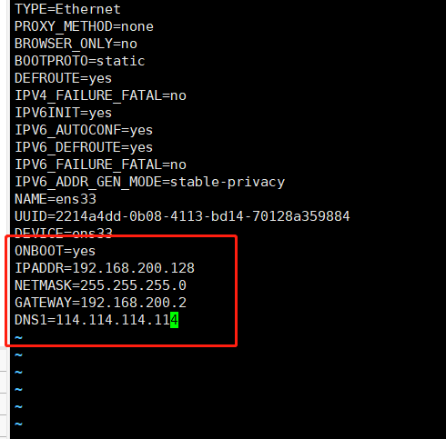
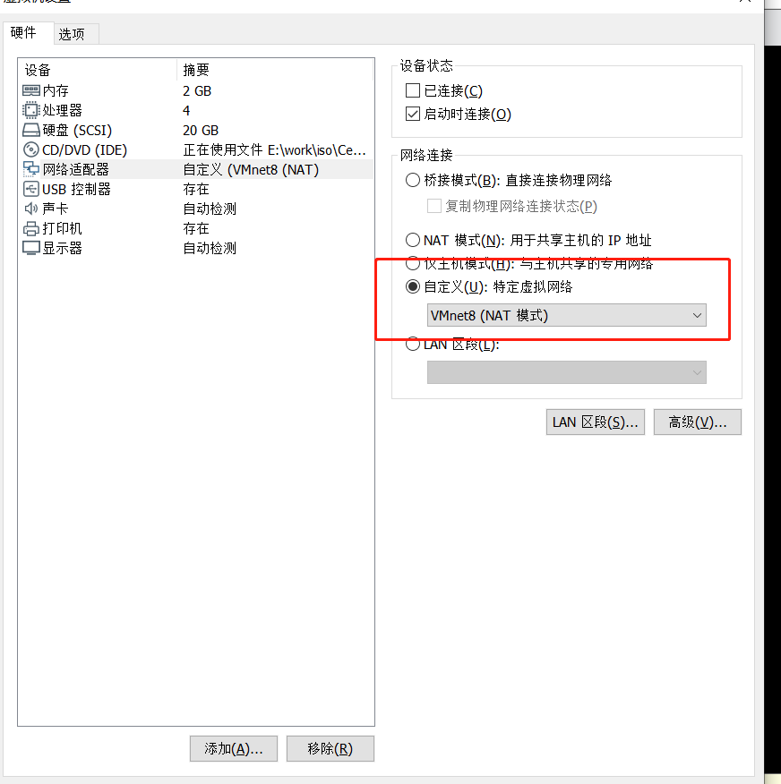
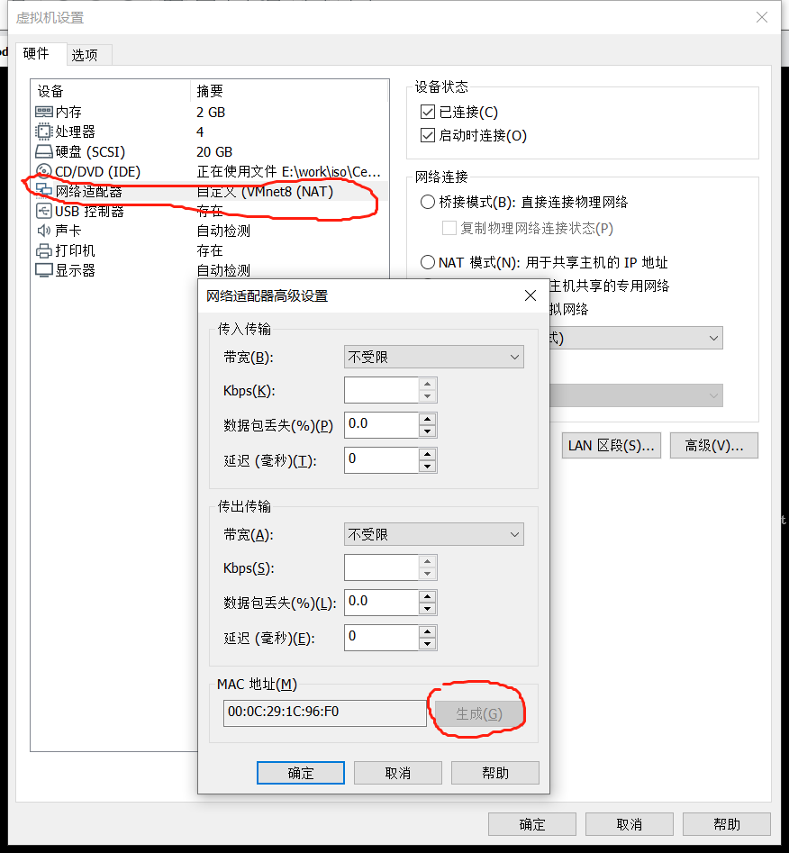

# VM配置静态ip

| 环境   | version                  |
| ------ | ------------------------ |
| centos | CentOS-7-x86_64-DVD-2009 |

~~~sh
#1.修改网络配置
vi /etc/sysconfig/network-scripts/ifcfg-ens33
~~~

~~~sh
#2.重启网络
systemctl restart network
~~~

3.修改VM配置

~~~sh
#4.验证
ip addr
~~~

# VM克隆

**注意：克隆之后注意要将mac重新生成，此时ip和源主机一样，所以先别登源主机，改完ip再登。**

~~~sh
#修改ip
vi /etc/sysconfig/network-scripts/ifcfg-ens33
~~~

# 防火墙、端口相关

~~~sh
#开启端口
firewall-cmd --zone=public --add-port=80/tcp --permanent
#已开启端口
firewall-cmd --list-port
#某个端口是否开启
firewall-cmd --query-port=80/tcp
#重启防火墙
firewall-cmd --reload
#关闭防火墙
systemctl stop firewalld.service

#查看端口
netstat -nlptu
~~~

# 文件

~~~sh
#查看某个目录下所有文件的大小
du -h
~~~

# vi

~~~sh
#删除某一行
dd
#删除全部
d+G
#复制当前行
yy复制当前行，在合适的位置，p粘贴
#复制n行
nyy复制n行（n=1,2,3...），在合适的位置，p粘贴
~~~

# grep

~~~sh
#查看xx文件xx内容后的20行
cat xx.conf | grep xx -A 20
~~~

# rpm

~~~sh
#解压
rpm -Uvh xx.rpm
#查看某个rpm是否安装了
rpm -qa|grep xx
~~~

# unzip

~~~sh
#把/home目录下面的data目录压缩为data.zip
zip -r data.zip data #压缩data目录
#把/home目录下面的data.zip解压到databak目录里面
unzip data.zip -d databak
#/home目录下面的a文件夹和3.txt压缩成为a123.zip
zip -r a123.zip a 3.txt
#/home目录下面的t.zip直接解压到/home目录里面
unzip t.zip
#/home目录下面的a1.zip、a2.zip、a3.zip同时解压到/home目录里面
unzip a*.zip
#/home目录下面w.zip里面的所有文件解压到第一级目录
unzip -j wt.zip
~~~

# 实用命令

清缓存

~~~sh
#清理前最好sync一下，防止正在运行的程序崩溃
sync
echo 3 > /proc/sys/vm/drop_caches
~~~

scp

~~~sh
#将本机/root/lk目录下所有的文件传输到服务器43.224.34.73的/home/lk/cpfile目录下
scp -r /root/lk root@43.224.34.73:/home/lk/cpfile
#将服务器43.224.34.73上/home/lk/目录下所有的文件全部复制到本地的/root目录下
scp -r root@43.224.34.73:/home/lk /root
~~~

