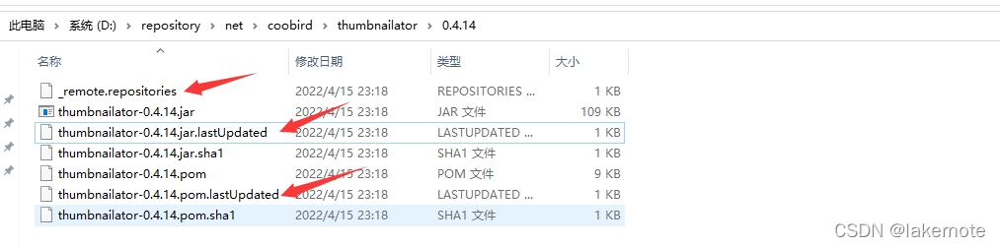
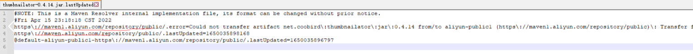

maven将jar包做成maven依赖

~~~sh
mvn install:install-file -Dfile=./target/datax/datax/lib/datax-common-0.0.1-SNAPSHOT.jar -DgroupId=com.alibaba.datax -DartifactId=common -Dversion=0.0.1-SNAPSHOT -Dpackaging=jar
~~~

# Maven仓库

## 本地仓库

路径 `${M2_HOME}/conf/settings.xml`

~~~xml
<!-- 默认的值是${user.home}/.m2/repository -->
<localRepository>D:\maven\aliyun-repository</localRepository>
~~~

## 中央仓库

Maven必须要知道至少一个可用的远程仓库，中央仓库就是这样一个默认的远程仓库，Maven 默认有一个 super pom 文件。
maven super pom 文件位置,，例如：D:\apache-maven-3.0.4\lib 下的 maven-model-builder-3.0.4.jar 中的 org/apache/maven/model/pom-4.0.0.xml

~~~xml
··· 省略其他
<repositories>
    <repository>
        <id>central</id>
        <name>Central Repository</name>
        <url>https://repo.maven.apache.org/maven2</url>
        <layout>default</layout>
        <snapshots>
            <enabled>false</enabled>
        </snapshots>
    </repository>
</repositories>
···
~~~

> 这个时候我们就明白了，我们在 settings 文件配置一个 mirror 的 mirrorOf 为 **central** 的镜像就会替代 ‘中央仓库’

## Maven镜像

常用的阿里云镜像仓库：https://developer.aliyun.com/mvn/guide

镜像（Mirroring）是冗余的一种类型，一个磁盘上的数据在另一个磁盘上存在一个完全相同的副本即为镜像。
为什么配置镜像?

> 1.一句话，你有的我也有，你没有的我也有。（拥有远程仓库的所有 jar，包括远程仓库没有的 jar）
> 2.还是一句话，我跑的比你快。（有时候远程仓库获取 jar 的速度可能比镜像慢，这也是为什么我们一般要配置中央仓库的原因，外国的 maven 仓库一般获取速度比较慢）

如果你配置 maven 镜像不是为了以上两点，那基本就不用配置镜像了。

> **注意:当远程仓库被镜像匹配到的，则在获取 jar 包将从镜像仓库获取，而不是我们配置的 repository 仓库, repository 将失去作用**

### mirrorOf 标签

mirrorOf 标签里面放置的是 repository 配置的 id,为了满足一些复杂的需求，Maven还支持更高级的镜像配置：

~~~
external:* = 不在本地仓库的文件才从该镜像获取
repo,repo1 = 远程仓库 repo 和 repo1 从该镜像获取
*,!repo1 =  所有远程仓库都从该镜像获取，除 repo1 远程仓库以外
* = 所用远程仓库都从该镜像获取
~~~

## 私有仓库

> 私服（私有仓库）是一种特殊的远程Maven仓库，它是架设在局域网内的仓库服务，私服一般被配置为互联网远程仓库的镜像，供局域网内的Maven用户使用。
>
> 当Maven需要下载构件的时候，先向私服请求，如果私服上不存在该构件，则从外部的远程仓库下载，同时缓存在私服之上，然后为Maven下载请求提供下载服务，另外，对于自定义或第三方的jar可以从本地上传到私服，供局域网内其他maven用户使用。


优点主要有：

1.节省外网宽带
2.加速Maven构建
3.部署第三方构件：可以将公司项目的 jar 发布到私服上，方便项目与项目之间的调用
4.提高稳定性、增强控制：原因是外网不稳定
5.降低中央仓库的负荷：原因是中央仓库访问量太大

### 配置

所有可以配置位置如下

- pom.xml的repository

- pom.xml的profile的repository

- settings.xml的profile的repository

- settings.xml的mirror

  

  

  排除镜像代理*的情况，优先级如下

本地仓库 > 私服 （settingxml.profile）> 远程仓库（pom.xml-repository）和 镜像 （mirror）。镜像是一个特殊的配置，其实镜像等同与远程仓库，没有匹配远程仓库的镜像就毫无作用。更改配置不生效的话，重启Idea。

**配置一 setting.xml的配置为 ***

maven中setting.xml的不能配置为*,否则其他所有配置都没用了，代理了所有，都默认走这个url下载。即优先级最高，一般不这么干，除非你就是想所有都走阿里云镜像下载。个人可以，公司不建议这种配置哈，太粗鲁。

~~~xml
<mirror>
    <id>nexus-aliyun</id>
	<mirrorOf>*</mirrorOf> // 注意这种情况太暴力，其他配置啥也废了。
    <name>Nexus aliyun</name>
    <url>https://maven.aliyun.com/repository/public</url>
</mirror>
~~~

**详细注释版本**

~~~xml
 <mirrors>
    	<!-- 配置多个mirror，当mirrorOf的值相同时，当且仅当上一个远程仓库连接失败才会访问下一个远程仓库，连接成功后，即使没有获取想要的jar包，也不会访问下一个远程仓库，故一般配置一个就好，若担心配置的这个镜像会连接失败，可以在加一个-->
        <mirror>
          <!-- 唯一标识一个mirror -->
          <id>aliyun-maven-mirror</id>
          <!-- 指定该镜像代替的时那个仓库，例如central就表示代替官方的中央库，*表示所有仓库都是用该镜像，！表示该仓库除外
               <mirrorOf>*, ! central</mirrorOf> 表示所有的远程仓库 central除外，都使用该阿里云镜像
           -->
          <mirrorOf>central</mirrorOf>
          <-- 该镜像库的名称，并无特殊用处 -->
          <name>aliyun Maven</name>
          <-- 代理镜像库的地址 -->
          <url>https://maven.aliyun.com/repository/public</url>
        </mirror>
</mirrors>
~~~

**配置二 pom.xml配置多个repository**

> setting.xml没有配置mirror和profile，默认的；pom.xml配置多个repository

**pom.xml**

```xml
    <parent>
        <groupId>org.springframework.boot</groupId>
        <artifactId>spring-boot-starter-parent</artifactId>
        <version>2.3.7.RELEASE</version>
        <relativePath/> <!-- lookup parent from repository -->
    </parent>
    <dependencies>
        <!-- 图片处理 -->
        <dependency>
            <groupId>net.coobird</groupId>
            <artifactId>thumbnailator</artifactId>
            <version>0.4.14</version>
        </dependency>
    </dependencies>
     ......
    <repositories>
        <!-- https://developer.aliyun.com/mvn/guide -->
        <repository>
            <id>aliyun-public1</id>
            <url>https://maven1.aliyun.com/repository/public</url>
            <snapshots>
                <enabled>false</enabled>
            </snapshots>
        </repository>
        <repository>
            <id>aliyun-public2</id>
            <url>https://maven.aliyun.com/repository/public</url>
            <snapshots>
                <enabled>false</enabled>
            </snapshots>
        </repository>
    </repositories>
</project>
```

**结果**


**查看具体的jar**



_remote.repositories

~~~properties
thumbnailator-0.4.14.jar>aliyun-public2=
thumbnailator-0.4.14.pom>aliyun-public2=
~~~

thumbnailator-0.4.14.jar.lastUpdated



结论：pom.xml中配置多个repository，会按照配置的先后顺序从repository1、repository2（repository1中找不到的情况下才会从repository2下载）下载依赖jar。

**配置三 配置先走私服，找不到再走阿里云镜像**

~~~xml
<?xml version="1.0" encoding="UTF-8"?>

<settings xmlns="http://maven.apache.org/SETTINGS/1.2.0"
          xmlns:xsi="http://www.w3.org/2001/XMLSchema-instance"
          xsi:schemaLocation="http://maven.apache.org/SETTINGS/1.2.0 https://maven.apache.org/xsd/settings-1.2.0.xsd">
  <localRepository>C:/repository</localRepository>

  <servers>
    <!-- 私服用户名密码 注意id与下面 profile.repository.id 对应 -->
    <server>
      <id>lakernexus</id>
      <username>laker</username>
      <password>laker123</password>
    </server>
  </servers>
  
  <mirrors>	 
	<mirror>
		<id>aliyunmaven</id>
		<mirrorOf>central</mirrorOf> <!-- 只代理central中央仓库镜像-->
		<name>阿里云公共仓库</name>
		<url>https://maven.aliyun.com/repository/public</url>
	</mirror>
  </mirrors>

  <profiles>
	<profile>
	<!-- 定义profile注意下面激活的时候使用-->
	 <id>lakerProfile</id>
      <repositories>
        <repository>
        	<!-- server.id对应-->
          <id>lakernexus</id>
          <url>https://lakernexus.com/repository/public/</url>
          <releases><enabled>true</enabled></releases>
          <snapshots><enabled>true</enabled></snapshots>
        </repository>
      </repositories>
     <pluginRepositories>
        <pluginRepository>
          <id>lakernexus</id>
          <url>https://lakernexus.com/repository/public/</url>
          <releases><enabled>true</enabled></releases>
          <snapshots><enabled>true</enabled></snapshots>
        </pluginRepository>
      </pluginRepositories>
    </profile>
  </profiles>

    <activeProfiles>
    	<!-- 定义profile注意下面激活的时候使用-->
       <activeProfile>lakerProfile</activeProfile>
  </activeProfiles>
</settings>
~~~

#### 配置三 setting.xml配置多个profile.repository

~~~xml
<profiles>
        <profile>
            <id>maven-aliyun</id>
            <repositories>
                <repository>
                    <id>aliyun-public</id>
                    <name>aliyun public</name>
                    <url>https://maven.aliyun.com/repository/public</url>
                    <releases>
                        <enabled>true</enabled>
                    </releases>
                    <snapshots>
                        <enabled>false</enabled>
                    </snapshots>
                    <layout>default</layout>        
                </repository>
                <repository>
                    <id>aliyun-public</id>
                    <name>aliyun public</name>
                    <url>https://maven.aliyun.com/repository/public</url>
                    <releases>
                        <enabled>true</enabled>
                    </releases>
                    <snapshots>
                        <enabled>false</enabled>
                    </snapshots>
                    <layout>default</layout>        
                </repository>         
            </repositories>
        </profile>
    </profiles>
  <!-- 激活profile -->
    <activeProfiles>
        <!-- activeProfile的属性值就是上面profiles列表种profile的id，若不存在则忽视 -->
        <activeProfile>maven-aliyun</activeProfile>
        <activeProfile>maven-nexus</activeProfile>
    </activeProfiles>
~~~

## 查看生效配置

> 1.选中项目=>右键=>Run Maven=>New Goal
>
> 2.输入help:effective-settings，点击运行，控制台会输出合并、覆盖之后最终的settings.xml文件。
>
> 3.输入help:active-profiles，点击运行，控制台会输出生效的profiles；Idea工具Maven窗口会直接显示profiles生效情况。
>
> settings.xml全局搜索下，防止乱覆盖。
>

## 结论

优先级可以认为是如下：

> 本地仓库 >profile > pom中的repository > mirror
>