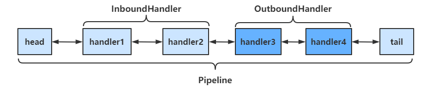
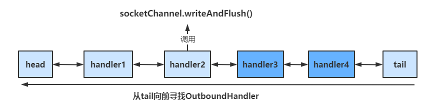
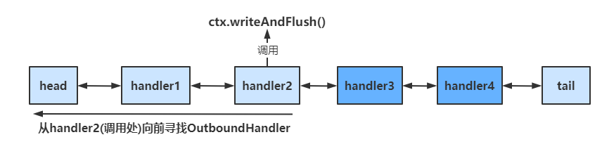
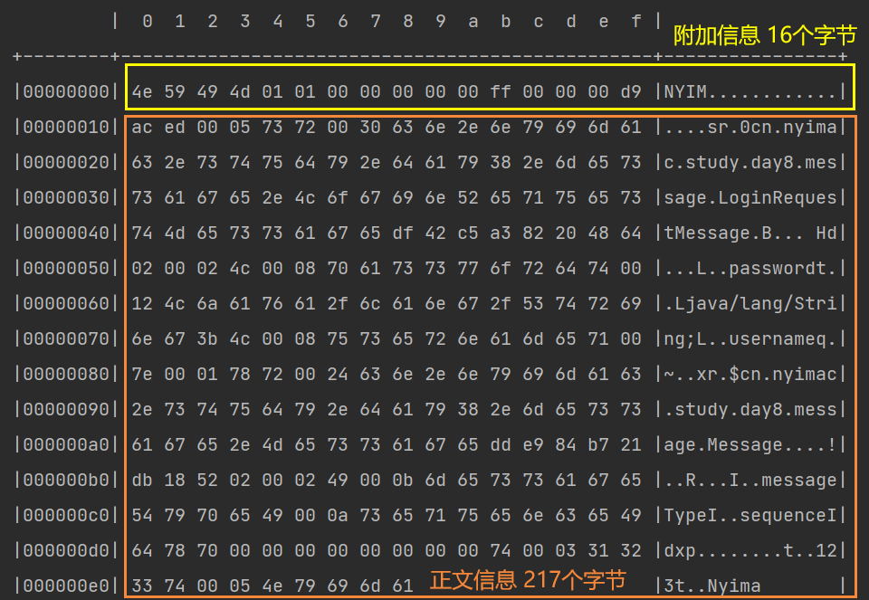
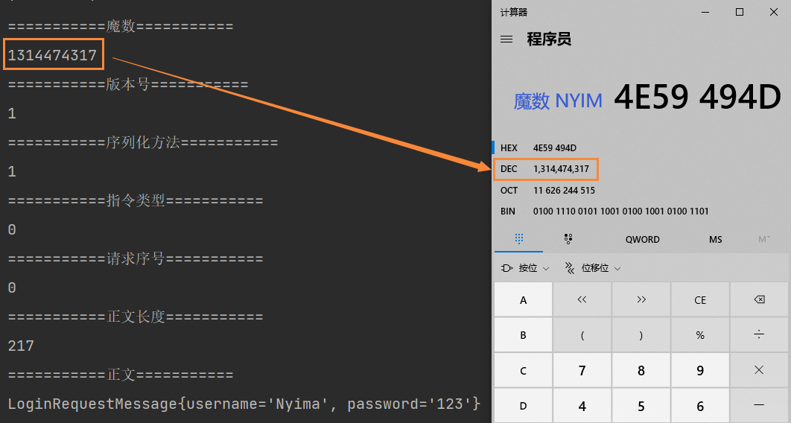

# NET

## DES

### 网络编程

网络编程，就是在一定的协议下，实现两台计算机的通信的技术

通信一定是基于软件结构实现的:

* C/S 结构 ：全称为 Client/Server 结构，是指客户端和服务器结构，常见程序有 QQ、IDEA等软件。
* B/S 结构 ：全称为 Browser/Server 结构，是指浏览器和服务器结构。

两种架构各有优势，但是无论哪种架构，都离不开网络的支持。

网络通信的三要素：

1. 协议：计算机网络客户端与服务端通信必须约定和彼此遵守的通信规则，HTTP、FTP、TCP、UDP、SMTP

2. IP地址：互联网协议地址（Internet Protocol Address），用来给一个网络中的计算机设备做唯一的编号

   * IPv4 ：4个字节，32位组成，192.168.1.1
   * Pv6：可以实现为所有设备分配 IP  128 位

   * ipconfig：查看本机的 IP
     * ping 检查本机与某个 IP 指定的机器是否联通，或者说是检测对方是否在线。
     * ping 空格 IP地址 ：ping 220.181.57.216，ping www.baidu.com

   特殊的IP地址： 本机IP地址，**127.0.0.1 == localhost**，回环测试

3. 端口：端口号就可以唯一标识设备中的进程（应用程序）
   端口号：用两个字节表示的整数，的取值范围是 0-65535，0-1023 之间的端口号用于一些知名的网络服务和应用，普通的应用程序需要使用 1024 以上的端口号。如果端口号被另外一个服务或应用所占用，会导致当前程序启动失败，报出端口被占用异常

利用**协议+IP 地址+端口号** 三元组合，就可以标识网络中的进程了，那么进程间的通信就可以利用这个标识与其它进程进行交互。


参考视频：https://www.bilibili.com/video/BV1kT4y1M7vt


****


### 通信协议

网络通信协议：对计算机必须遵守的规则，只有遵守这些规则，计算机之间才能进行通信

> 应用层：应用程序（QQ、微信、浏览器），可能用到的协议（HTTP、FTP、SMTP）
>
> 传输层：TCP/IP 协议 - UDP 协议
>
> 网络层  ：IP 协议，封装自己的 IP 和对方的 IP 和端口
>
> 数据链路层 ： 进入到硬件（网）

通信**是进程与进程之间的通信**，不是主机与主机之间的通信

TCP/IP协议：传输控制协议 (Transmission Control Protocol)

传输控制协议 TCP（Transmission Control Protocol）是面向连接的，提供可靠交付，有流量控制，拥塞控制，提供全双工通信，面向字节流，每一条 TCP 连接只能是点对点的（一对一）

* 在通信之前必须确定对方在线并且连接成功才可以通信
* 例如下载文件、浏览网页等（要求可靠传输）

用户数据报协议 UDP（User Datagram Protocol）是无连接的，尽最大可能交付，不可靠，没有拥塞控制，面向报文，支持一对一、一对多、多对一和多对多的交互通信

* 直接发消息给对方，不管对方是否在线，发消息后也不需要确认
* 无线（视频会议，通话），性能好，可能丢失一些数据


****


### Java模型

相关概念：

* 同步：当前线程要自己进行数据的读写操作（自己去银行取钱）
* 异步：当前线程可以去做其他事情（委托别人拿银行卡到银行取钱，然后给你）
* 阻塞：在数据没有的情况下，还是要继续等待着读（排队等待）
* 非阻塞：在数据没有的情况下，会去做其他事情，一旦有了数据再来获取（柜台取款，取个号，然后坐在椅子上做其它事，等号广播会通知你办理） 

Java 中的通信模型:

1. BIO 表示同步阻塞式通信，服务器实现模式为一个连接一个线程，即客户端有连接请求时服务器端就需要启动一个线程进行处理，如果这个连接不做任何事情会造成不必要的线程开销，可以通过线程池机制改善。

   同步阻塞式性能极差：大量线程，大量阻塞

2. 伪异步通信：引入线程池，不需要一个客户端一个线程，实现线程复用来处理很多个客户端，线程可控。 

   高并发下性能还是很差：线程数量少，数据依然是阻塞的，数据没有来线程还是要等待

3. NIO 表示**同步非阻塞 IO**，服务器实现模式为请求对应一个线程，客户端发送的连接会注册到多路复用器上，多路复用器轮询到连接有 I/O 请求时才启动一个线程进行处理

   工作原理：1 个主线程专门负责接收客户端，1 个线程轮询所有的客户端，发来了数据才会开启线程处理

   同步：线程还要不断的接收客户端连接，以及处理数据

   非阻塞：如果一个管道没有数据，不需要等待，可以轮询下一个管道是否有数据

4. AIO 表示异步非阻塞 IO，AIO 引入异步通道的概念，采用了 Proactor 模式，有效的请求才启动线程，特点是先由操作系统完成后才通知服务端程序启动线程去处理，一般适用于连接数较多且连接时间较长的应用

   异步：服务端线程接收到了客户端管道以后就交给底层处理 IO 通信，线程可以做其他事情

   非阻塞：底层也是客户端有数据才会处理，有了数据以后处理好通知服务器应用来启动线程进行处理

各种模型应用场景：

* BIO 适用于连接数目比较小且固定的架构，该方式对服务器资源要求比较高，并发局限于应用中，程序简单
* NIO 适用于连接数目多且连接比较短（轻操作）的架构，如聊天服务器，并发局限于应用中，编程复杂，JDK 1.4 开始支持
* AIO 适用于连接数目多且连接比较长（重操作）的架构，如相册服务器，充分调用操作系统参与并发操作，JDK 1.7 开始支持


****


## I/O

### IO模型

#### 五种模型

对于一个套接字上的输入操作，第一步是等待数据从网络中到达，当数据到达时被复制到内核中的某个缓冲区。第二步就是把数据从内核缓冲区复制到应用进程缓冲区

Linux 有五种 I/O 模型：

- 阻塞式 I/O
- 非阻塞式 I/O
- I/O 复用（select 和 poll）
- 信号驱动式 I/O（SIGIO）
- 异步 I/O（AIO）

五种模型对比：

* 同步 I/O 包括阻塞式 I/O、非阻塞式 I/O、I/O 复用和信号驱动 I/O ，它们的主要区别在第一个阶段，非阻塞式 I/O 、信号驱动 I/O 和异步 I/O 在第一阶段不会阻塞

- 同步 I/O：将数据从内核缓冲区复制到应用进程缓冲区的阶段（第二阶段），应用进程会阻塞
- 异步 I/O：第二阶段应用进程不会阻塞


***


#### 阻塞式IO

应用进程通过系统调用 recvfrom 接收数据，会被阻塞，直到数据从内核缓冲区复制到应用进程缓冲区中才返回。阻塞不意味着整个操作系统都被阻塞，其它应用进程还可以执行，只是当前阻塞进程不消耗 CPU 时间，这种模型的 CPU 利用率会比较高

recvfrom() 用于**接收 Socket 传来的数据，并复制到应用进程的缓冲区 buf 中**，把 recvfrom() 当成系统调用


***


#### 非阻塞式

应用进程通过 recvfrom 调用不停的去和内核交互，直到内核准备好数据。如果没有准备好数据，内核返回一个错误码，过一段时间应用进程再执行 recvfrom 系统调用，在两次发送请求的时间段，进程可以进行其他任务，这种方式称为轮询（polling）

由于 CPU 要处理更多的系统调用，因此这种模型的 CPU 利用率比较低


***


#### 信号驱动

应用进程使用 sigaction 系统调用，内核立即返回，应用进程可以继续执行，等待数据阶段应用进程是非阻塞的。当内核数据准备就绪时向应用进程发送 SIGIO 信号，应用进程收到之后在信号处理程序中调用 recvfrom 将数据从内核复制到应用进程中

相比于非阻塞式 I/O 的轮询方式，信号驱动 I/O 的 CPU 利用率更高


***


#### IO复用

IO 复用模型使用 select 或者 poll 函数等待数据，select 会监听所有注册好的 IO，**等待多个套接字中的任何一个变为可读**，等待过程会被阻塞，当某个套接字准备好数据变为可读时 select 调用就返回，然后调用 recvfrom 把数据从内核复制到进程中

IO 复用让单个进程具有处理多个 I/O 事件的能力，又被称为 Event Driven I/O，即事件驱动 I/O

如果一个 Web 服务器没有 I/O 复用，那么每一个 Socket 连接都要创建一个线程去处理，如果同时有几万个连接，就需要创建相同数量的线程。相比于多进程和多线程技术，I/O 复用不需要进程线程创建和切换的开销，系统开销更小


***


#### 异步IO

应用进程执行 aio_read 系统调用会立即返回，给内核传递描述符、缓冲区指针、缓冲区大小等。应用进程可以继续执行不会被阻塞，内核会在所有操作完成之后向应用进程发送信号。

异步 I/O 与信号驱动 I/O 的区别在于，异步 I/O 的信号是通知应用进程 I/O 完成，而信号驱动 I/O 的信号是通知应用进程可以开始 I/O


****


### 多路复用

#### select

##### 函数

Socket 不是文件，只是一个标识符，但是 Unix 操作系统把所有东西都**看作**是文件，所以 socket 说成 file descriptor，也就是 fd

select 允许应用程序监视一组文件描述符，等待一个或者多个描述符成为就绪状态，从而完成 I/O 操作。

```c
int select(int n, fd_set *readfds, fd_set *writefds, fd_set *exceptfds, struct timeval *timeout);
```

- fd_set 使用 **bitmap 数组**实现，数组大小用 FD_SETSIZE 定义，只能监听少于 FD_SETSIZE 数量的描述符，32 位机默认是 1024 个，64 位机默认是 2048，可以对进行修改，然后重新编译内核

- fd_set 有三种类型的描述符：readset、writeset、exceptset，对应读、写、异常条件的描述符集合

- n 是监测的 socket 的最大数量

- timeout 为超时参数，调用 select 会一直阻塞直到有描述符的事件到达或者等待的时间超过 timeout

  ```c
  struct timeval{
      long tv_sec; 	//秒
      long tv_usec;	//微秒
  }
  ```

  timeout == null：等待无限长的时间
  tv_sec == 0 && tv_usec == 0：获取后直接返回，不阻塞等待
  tv_sec != 0 || tv_usec != 0：等待指定时间

- 方法成功调用返回结果为**就绪的文件描述符个数**，出错返回结果为 -1，超时返回结果为 0

Linux 提供了一组宏为 fd_set 进行赋值操作：

```c
int FD_ZERO(fd_set *fdset);			// 将一个 fd_set 类型变量的所有值都置为 0
int FD_CLR(int fd, fd_set *fdset);	// 将一个 fd_set 类型变量的 fd 位置为 0
int FD_SET(int fd, fd_set *fdset);	// 将一个 fd_set 类型变量的 fd 位置为 1
int FD_ISSET(int fd, fd_set *fdset);// 判断 fd 位是否被置为 1
```

示例：

```c
sockfd = socket(AF_INET, SOCK_STREAM, 0);
memset(&addr, 0, sizeof(addr)));
addr.sin_family = AF_INET;
addr.sin_port = htons(2000);
addr.sin_addr.s_addr = INADDR_ANY;
bind(sockfd, (struct sockaddr*)&addr, sizeof(addr));//绑定连接
listen(sockfd, 5);//监听5个端口
for(i = 0; i < 5; i++) {
	memset(&client, e, sizeof(client));
    addrlen = sizeof(client);
	fds[i] = accept(sockfd, (struct sockaddr*)&client, &addrlen);
    //将监听的对应的文件描述符fd存入fds：[3,4,5,6,7]
    if(fds[i] > max)
		max = fds[i];
}
while(1) {
    FD_ZERO(&rset);//置为0
    for(i = 0; i < 5; i++) {
    	FD_SET(fds[i], &rset);//对应位置1 [0001 1111 00.....]
	}
	print("round again");
	select(max + 1, &rset, NULL, NULL, NULL);//监听
    
	for(i = 0; i <5; i++) {
        if(FD_ISSET(fds[i], &rset)) {//判断监听哪一个端口
            memset(buffer, 0, MAXBUF);
            read(fds[i], buffer, MAXBUF);//进入内核态读数据
            print(buffer);
        }
    }
}
```


参考视频：https://www.bilibili.com/video/BV19D4y1o797


****


##### 流程

select 调用流程图：


1. 使用 copy_from_user 从用户空间拷贝 fd_set 到内核空间，进程阻塞
2. 注册回调函数 _pollwait
3. 遍历所有 fd，调用其对应的 poll 方法判断当前请求是否准备就绪，对于 socket，这个 poll 方法是 sock_poll，sock_poll 根据情况会调用到 tcp_poll、udp_poll 或者 datagram_poll，以 tcp_poll 为例，其核心实现就是 _pollwait
4. _pollwait 把 **current（调用 select 的进程）**挂到设备的等待队列，不同设备有不同的等待队列，对于 tcp_poll ，其等待队列是 sk → sk_sleep（把进程挂到等待队列中并不代表进程已经睡眠），在设备收到消息（网络设备）或填写完文件数据（磁盘设备）后，会唤醒设备等待队列上睡眠的进程，这时 current 便被唤醒，进入就绪队列
5. poll 方法返回时会返回一个描述读写操作是否就绪的 mask 掩码，根据这个 mask 掩码给 fd_set 赋值
6. 如果遍历完所有的 fd，还没有返回一个可读写的 mask 掩码，则会调用 schedule_timeout 让 current 进程进入睡眠。当设备驱动发生自身资源可读写后，会唤醒其等待队列上睡眠的进程，如果超过一定的超时时间（schedule_timeout）没有其他线程唤醒，则调用 select 的进程会重新被唤醒获得 CPU，进而重新遍历 fd，判断有没有就绪的 fd
7. 把 fd_set 从内核空间拷贝到用户空间，阻塞进程继续执行


参考文章：https://www.cnblogs.com/anker/p/3265058.html

其他流程图：https://www.processon.com/view/link/5f62b9a6e401fd2ad7e5d6d1


****


#### poll

poll 的功能与 select 类似，也是等待一组描述符中的一个成为就绪状态

```c
int poll(struct pollfd *fds, unsigned int nfds, int timeout);
```

poll 中的描述符是 pollfd 类型的数组，pollfd 的定义如下：

```c
struct pollfd {
    int   fd;         /* file descriptor */
    short events;     /* requested events */
    short revents;    /* returned events */
};
```

select 和 poll 对比：

- select 会修改描述符，而 poll 不会
- select 的描述符类型使用数组实现，有描述符的限制；而 poll 使用**链表**实现，没有描述符数量的限制
- poll 提供了更多的事件类型，并且对描述符的重复利用上比 select 高

* select 和 poll 速度都比较慢，**每次调用**都需要将全部描述符数组 fd 从应用进程缓冲区复制到内核缓冲区，同时每次都需要在内核遍历传递进来的所有 fd ，这个开销在 fd 很多时会很大
* 几乎所有的系统都支持 select，但是只有比较新的系统支持 poll
* select 和 poll 的时间复杂度 O(n)，对 socket 进行扫描时是线性扫描，即采用轮询的方法，效率较低，因为并不知道具体是哪个 socket 具有事件，所以随着 FD 数量的增加会造成遍历速度慢的**线性下降**性能问题
* poll 还有一个特点是水平触发，如果报告了 fd 后，没有被处理，那么下次 poll 时会再次报告该 fd
* 如果一个线程对某个描述符调用了 select 或者 poll，另一个线程关闭了该描述符，会导致调用结果不确定


参考文章：https://github.com/CyC2018/CS-Notes/blob/master/notes/Socket.md


****


#### epoll

##### 函数

epoll 使用事件的就绪通知方式，通过 epoll_ctl() 向内核注册新的描述符或者是改变某个文件描述符的状态。已注册的描述符在内核中会被维护在一棵**红黑树**上，一旦该 fd 就绪，**内核通过 callback 回调函数将 I/O 准备好的描述符加入到一个链表中**管理，进程调用 epoll_wait() 便可以得到事件就绪的描述符

```c
int epoll_create(int size);
int epoll_ctl(int epfd, int op, int fd, struct epoll_event *event)；
int epoll_wait(int epfd, struct epoll_event * events, int maxevents, int timeout);
```

* epall_create：一个系统函数，函数将在内核空间内创建一个 epoll 数据结构，可以理解为 epoll 结构空间，返回值为 epoll 的文件描述符编号，以后有 client 连接时，向该 epoll 结构中添加监听，所以 epoll 使用一个文件描述符管理多个描述符

* epall_ctl：epoll 的事件注册函数，select 函数是调用时指定需要监听的描述符和事件，epoll 先将用户感兴趣的描述符事件注册到 epoll 空间。此函数是非阻塞函数，用来增删改 epoll 空间内的描述符，参数解释：

  * epfd：epoll 结构的进程 fd 编号，函数将依靠该编号找到对应的 epoll 结构

  * op：表示当前请求类型，有三个宏定义：

    * EPOLL_CTL_ADD：注册新的 fd 到 epfd 中
    * EPOLL_CTL_MOD：修改已经注册的 fd 的监听事件
    * EPOLL_CTI_DEL：从 epfd 中删除一个 fd

  * fd：需要监听的文件描述符，一般指 socket_fd

  * event：告诉内核对该 fd 资源感兴趣的事件，epoll_event 的结构：

    ```c
    struct epoll_event {
        _uint32_t events;	/*epoll events*/
        epoll_data_t data;	/*user data variable*/
    }
    ```

    events 可以是以下几个宏集合：EPOLLIN、EPOLOUT、EPOLLPRI、EPOLLERR、EPOLLHUP（挂断）、EPOLET（边缘触发）、EPOLLONESHOT（只监听一次，事件触发后自动清除该 fd，从 epoll 列表）

* epoll_wait：等待事件的产生，类似于 select() 调用，返回值为本次就绪的 fd 个数，直接从就绪链表获取，时间复杂度 O(1)

  * epfd：**指定感兴趣的 epoll 事件列表**
  * events：指向一个 epoll_event 结构数组，当函数返回时，内核会把就绪状态的数据拷贝到该数组
  * maxevents：标明 epoll_event 数组最多能接收的数据量，即本次操作最多能获取多少就绪数据
  * timeout：单位为毫秒
    * 0：表示立即返回，非阻塞调用
    * -1：阻塞调用，直到有用户感兴趣的事件就绪为止
    * 大于 0：阻塞调用，阻塞指定时间内如果有事件就绪则提前返回，否则等待指定时间后返回

epoll 的描述符事件有两种触发模式：LT（level trigger）和 ET（edge trigger）：

* LT 模式：当 epoll_wait() 检测到描述符事件到达时，将此事件通知进程，进程可以不立即处理该事件，下次调用 epoll_wait() 会再次通知进程。是默认的一种模式，并且同时支持 Blocking 和 No-Blocking
* ET 模式：通知之后进程必须立即处理事件，下次再调用 epoll_wait() 时不会再得到事件到达的通知。减少了 epoll 事件被重复触发的次数，因此效率要比 LT 模式高；只支持 No-Blocking，以避免由于一个 fd 的阻塞读/阻塞写操作把处理多个文件描述符的任务饥饿

```c
// 创建 epoll 描述符，每个应用程序只需要一个，用于监控所有套接字
int pollingfd = epoll_create(0xCAFE);
if ( pollingfd < 0 )// report error
// 初始化 epoll 结构
struct epoll_event ev = { 0 };

// 将连接类实例与事件相关联，可以关联任何想要的东西
ev.data.ptr = pConnection1;

// 监视输入，并且在事件发生后不自动重新准备描述符
ev.events = EPOLLIN | EPOLLONESHOT;
// 将描述符添加到监控列表中，即使另一个线程在epoll_wait中等待，描述符将被正确添加
if ( epoll_ctl( epollfd, EPOLL_CTL_ADD, pConnection1->getSocket(), &ev) != 0 )
    // report error

// 最多等待 20 个事件
struct epoll_event pevents[20];

// 等待10秒，检索20个并存入epoll_event数组
int ready = epoll_wait(pollingfd, pevents, 20, 10000);
// 检查epoll是否成功
if ( ret == -1)// report error and abort
else if ( ret == 0)// timeout; no event detected
else
{
    for (int i = 0; i < ready; i+ )
    {
        if ( pevents[i].events & EPOLLIN )
        {
            // 获取连接指针
            Connection * c = (Connection*) pevents[i].data.ptr;
            c->handleReadEvent();
         }
    }
}
```


流程图：https://gitee.com/seazean/images/blob/master/Java/IO-epoll%E5%8E%9F%E7%90%86%E5%9B%BE.jpg

参考视频：https://www.bilibili.com/video/BV19D4y1o797


***


##### 特点

epoll 的特点：

* epoll 仅适用于 Linux 系统
* epoll 使用**一个文件描述符管理多个描述符**，将用户关系的文件描述符的事件存放到内核的一个事件表（个人理解成哑元节点）
* 没有最大描述符数量（并发连接）的限制，打开 fd 的上限远大于1024（1G 内存能监听约 10 万个端口）
* epoll 的时间复杂度 O(1)，epoll 理解为 event poll，不同于忙轮询和无差别轮询，调用 epoll_wait **只是轮询就绪链表**。当监听列表有设备就绪时调用回调函数，把就绪 fd 放入就绪链表中，并唤醒在 epoll_wait 中阻塞的进程，所以 epoll 实际上是**事件驱动**（每个事件关联上fd）的，降低了 system call 的时间复杂度
* epoll 内核中根据每个 fd 上的 callback 函数来实现，只有活跃的 socket 才会主动调用 callback，所以使用 epoll 没有前面两者的线性下降的性能问题，效率提高

* epoll 注册新的事件都是注册到到内核中 epoll 句柄中，不需要每次调用 epoll_wait 时重复拷贝，对比前面两种，epoll 只需要将描述符从进程缓冲区向内核缓冲区**拷贝一次**，epoll 也可以利用 **mmap() 文件映射内存**加速与内核空间的消息传递（只是可以用）
* 前面两者要把 current 往设备等待队列中挂一次，epoll 也只把 current 往等待队列上挂一次，但是这里的等待队列并不是设备等待队列，只是一个 epoll 内部定义的等待队列，这样可以节省开销
* epoll 对多线程编程更有友好，一个线程调用了 epoll_wait() 另一个线程关闭了同一个描述符，也不会产生像 select 和 poll 的不确定情况


参考文章：https://www.jianshu.com/p/dfd940e7fca2

参考文章：https://www.cnblogs.com/anker/p/3265058.html


***


#### 应用

应用场景： 

* select 应用场景：
  * select 的 timeout 参数精度为微秒，poll 和 epoll 为毫秒，因此 select 适用**实时性要求比较高**的场景，比如核反应堆的控制
  * select 可移植性更好，几乎被所有主流平台所支持

* poll 应用场景：poll 没有最大描述符数量的限制，适用于平台支持并且对实时性要求不高的情况

* epoll 应用场景：
  * 运行在 Linux 平台上，有大量的描述符需要同时轮询，并且这些连接最好是**长连接**
  * 需要同时监控小于 1000 个描述符，没必要使用 epoll，因为这个应用场景下并不能体现 epoll 的优势
  * 需要监控的描述符状态变化多，而且是非常短暂的，就没有必要使用 epoll。因为 epoll 中的所有描述符都存储在内核中，每次对描述符的状态改变都需要通过 epoll_ctl() 进行系统调用，频繁系统调用降低效率，并且 epoll 的描述符存储在内核，不容易调试


参考文章：https://github.com/CyC2018/CS-Notes/blob/master/notes/Socket.md


****


### 系统调用

#### 内核态

用户空间：用户代码、用户堆栈

内核空间：内核代码、内核调度程序、进程描述符（内核堆栈、thread_info 进程描述符）

* 进程描述符和用户的进程是一一对应的
* SYS_API 系统调用：如 read、write，系统调用就是 0X80 中断
* 进程描述符 pd：进程从用户态切换到内核态时，需要保存用户态时的上下文信息在 PCB 中
* 线程上下文：用户程序基地址，程序计数器、cpu cache、寄存器等，方便程序切回用户态时恢复现场
* 内核堆栈：**系统调用函数也是要创建变量的，**这些变量在内核堆栈上分配


***


#### 80中断

在用户程序中调用操作系统提供的核心态级别的子功能，为了系统安全需要进行用户态和内核态转换，状态的转换需要进行 CPU 中断，中断分为硬中断和软中断：

* 硬中断：如网络传输中，数据到达网卡后，网卡经过一系列操作后发起硬件中断
* 软中断：如程序运行过程中本身产生的一些中断
  - 发起 `0X80` 中断
  - 程序执行碰到除 0 异常

系统调用 system_call 函数所对应的中断指令编号是 0X80（十进制是 8×16=128），而该指令编号对应的就是系统调用程序的入口，所以称系统调用为 80 中断

系统调用的流程：

* 在 CPU 寄存器里存一个系统调用号，表示哪个系统函数，比如 read
* 将 CPU 的临时数据都保存到 thread_info 中
* 执行 80 中断处理程序，找到刚刚存的系统调用号（read），先检查缓存中有没有对应的数据，没有就去磁盘中加载到内核缓冲区，然后从内核缓冲区拷贝到用户空间
* 最后恢复到用户态，通过 thread_info 恢复现场，用户态继续执行


参考视频：https://www.bilibili.com/video/BV19D4y1o797


****


### 零拷贝

#### DMA

DMA (Direct Memory Access) ：直接存储器访问，让外部设备不通过 CPU 直接与系统内存交换数据的接口技术

作用：可以解决批量数据的输入/输出问题，使数据的传送速度取决于存储器和外设的工作速度

把内存数据传输到网卡然后发送：

* 没有 DMA：CPU 读内存数据到 CPU 高速缓存，再写到网卡，这样就把 CPU 的速度拉低到和网卡一个速度
* 使用 DMA：把数据读到 Socket 内核缓存区（CPU 复制），CPU 分配给 DMA 开始**异步**操作，DMA 读取 Socket 缓冲区到 DMA 缓冲区，然后写到网卡。DMA 执行完后中断（就是通知） CPU，这时 Socket 内核缓冲区为空，CPU 从用户态切换到内核态，执行中断处理程序，将需要使用 Socket 缓冲区的阻塞进程移到就绪队列

一个完整的 DMA 传输过程必须经历 DMA 请求、DMA 响应、DMA 传输、DMA 结束四个步骤：


DMA 方式是一种完全由硬件进行信息传送的控制方式，通常系统总线由 CPU 管理，在 DMA 方式中，CPU 的主存控制信号被禁止使用，CPU 把总线（地址总线、数据总线、控制总线）让出来由 DMA 控制器接管，用来控制传送的字节数、判断 DMA 是否结束、以及发出 DMA 结束信号，所以 DMA 控制器必须有以下功能：

* 接受外设发出的 DMA 请求，并向 CPU 发出总线接管请求
* 当 CPU 发出允许接管信号后，进入 DMA 操作周期
* 确定传送数据的主存单元地址及长度，并自动修改主存地址计数和传送长度计数
* 规定数据在主存和外设间的传送方向，发出读写等控制信号，执行数据传送操作
* 判断 DMA 传送是否结束，发出 DMA 结束信号，使 CPU 恢复正常工作状态（中断）


***


#### BIO

传统的 I/O 操作进行了 4 次用户空间与内核空间的上下文切换，以及 4 次数据拷贝：

* JVM 发出 read 系统调用，OS 上下文切换到内核模式（切换 1）并将数据从网卡或硬盘等设备通过 DMA 读取到内核空间缓冲区（拷贝 1）
* OS 内核将数据复制到用户空间缓冲区（拷贝 2），然后 read 系统调用返回，又会导致一次内核空间到用户空间的上下文切换（切换 2）
* JVM 处理代码逻辑并发送 write() 系统调用，OS 上下文切换到内核模式（切换3）并从用户空间缓冲区复制数据到内核空间缓冲区（拷贝3）
* 将内核空间缓冲区中的数据写到 hardware（拷贝4），write 系统调用返回，导致内核空间到用户空间的再次上下文切换（切换4）

流程图中的箭头反过来也成立，可以从网卡获取数据


read 调用图示：read、write 都是系统调用指令


***


#### mmap

mmap（Memory Mapped Files）加 write 实现零拷贝，**零拷贝就是没有数据从内核空间复制到用户空间**

用户空间和内核空间都使用内存，所以可以共享同一块物理内存地址，省去用户态和内核态之间的拷贝。写网卡时，共享空间的内容拷贝到 Socket 缓冲区，然后交给 DMA 发送到网卡，只需要 3 次复制

进行了 4 次用户空间与内核空间的上下文切换，以及 3 次数据拷贝（2 次 DMA，一次 CPU 复制）：

* 发出 mmap 系统调用，DMA 拷贝到内核缓冲区，映射到共享缓冲区；mmap 系统调用返回，无需拷贝
* 发出 write 系统调用，将数据从内核缓冲区拷贝到内核 Socket 缓冲区；write系统调用返回，DMA 将内核空间 Socket 缓冲区中的数据传递到协议引擎


原理：利用操作系统的 Page 来实现文件到物理内存的直接映射，完成映射后对物理内存的操作会**被同步**到硬盘上

缺点：不可靠，写到 mmap 中的数据并没有被真正的写到硬盘，操作系统会在程序主动调用 flush 的时候才把数据真正的写到硬盘

Java NIO 提供了 **MappedByteBuffer** 类可以用来实现 mmap 内存映射，MappedByteBuffer 类对象**只能通过调用 `FileChannel.map()` 获取**


****


#### sendfile

sendfile 实现零拷贝，打开文件的文件描述符 fd 和 socket 的 fd 传递给 sendfile，然后经过 3 次复制和 2 次用户态和内核态的切换

原理：数据根本不经过用户态，直接从内核缓冲区进入到 Socket Buffer，由于和用户态完全无关，就减少了两次上下文切换


sendfile2.4 之后，sendfile 实现了更简单的方式，文件到达内核缓冲区后，不必再将数据全部复制到 socket buffer 缓冲区，而是只**将记录数据位置和长度相关等描述符信息**保存到 socket buffer，DMA 根据 Socket 缓冲区中描述符提供的位置和偏移量信息直接将内核空间缓冲区中的数据拷贝到协议引擎上（2 次复制 2 次切换）

Java NIO 对 sendfile 的支持是 `FileChannel.transferTo()/transferFrom()`，把磁盘文件读取 OS 内核缓冲区后的 fileChannel，直接转给 socketChannel 发送，底层就是 sendfile


参考文章：https://blog.csdn.net/hancoder/article/details/112149121


***


## BIO

### Inet

一个 InetAddress 类的对象就代表一个 IP 地址对象

成员方法：

* `static InetAddress getLocalHost()`：获得本地主机 IP 地址对象
* `static InetAddress getByName(String host)`：根据 IP 地址字符串或主机名获得对应的IP地址对象
* `String getHostName()`：获取主机名
* `String getHostAddress()`：获得 IP 地址字符串

```java
public class InetAddressDemo {
    public static void main(String[] args) throws Exception {
        // 1.获取本机地址对象
        InetAddress ip = InetAddress.getLocalHost();
        System.out.println(ip.getHostName());//DESKTOP-NNMBHQR
        System.out.println(ip.getHostAddress());//192.168.11.1
        // 2.获取域名ip对象
        InetAddress ip2 = InetAddress.getByName("www.baidu.com");
        System.out.println(ip2.getHostName());//www.baidu.com
        System.out.println(ip2.getHostAddress());//14.215.177.38
        // 3.获取公网IP对象。
        InetAddress ip3 = InetAddress.getByName("182.61.200.6");
        System.out.println(ip3.getHostName());//182.61.200.6
        System.out.println(ip3.getHostAddress());//182.61.200.6
        
        // 4.判断是否能通： ping  5s之前测试是否可通
        System.out.println(ip2.isReachable(5000)); // ping百度
    }
}
```


***


### UDP

#### 基本介绍

UDP（User Datagram Protocol）协议的特点：

* 面向无连接的协议
* 发送端只管发送，不确认对方是否能收到
* 基于数据包进行数据传输
* 发送数据的包的大小限制 **64KB** 以内
* 因为面向无连接，速度快，但是不可靠，会丢失数据

UDP 协议的使用场景：在线视频、网络语音、电话


***


#### 实现UDP

UDP 协议相关的两个类：

* DatagramPacket（数据包对象）：用来封装要发送或要接收的数据，比如：集装箱
* DatagramSocket（发送对象）：用来发送或接收数据包，比如：码头

**DatagramPacket**：

* DatagramPacket 类：

  `public new DatagramPacket(byte[] buf, int length, InetAddress address, int port)`：创建发送端数据包对象 

  * buf：要发送的内容，字节数组
  * length：要发送内容的长度，单位是字节
  * address：接收端的IP地址对象
  * port：接收端的端口号

  `public new DatagramPacket(byte[] buf, int length)`：创建接收端的数据包对象

  * buf：用来存储接收到内容		
  * length：能够接收内容的长度

* DatagramPacket 类常用方法：

  * `public int getLength()`：获得实际接收到的字节个数
  * `public byte[] getData()`：返回数据缓冲区

**DatagramSocket**：

* DatagramSocket 类构造方法：
  * `protected DatagramSocket()`：创建发送端的 Socket 对象，系统会随机分配一个端口号
  * `protected DatagramSocket(int port)`：创建接收端的 Socket 对象并指定端口号
* DatagramSocket 类成员方法：
  * `public void send(DatagramPacket dp)`：发送数据包
  * `public void receive(DatagramPacket p)`：接收数据包
  * `public void close()`：关闭数据报套接字

```java
public class UDPClientDemo {
    public static void main(String[] args) throws Exception {
        System.out.println("===启动客户端===");
        // 1.创建一个集装箱对象，用于封装需要发送的数据包!
        byte[] buffer = "我学Java".getBytes();
        DatagramPacket packet = new DatagramPacket(buffer,bubffer.length,InetAddress.getLoclHost,8000);
        // 2.创建一个码头对象
        DatagramSocket socket = new DatagramSocket();
        // 3.开始发送数据包对象
        socket.send(packet);
        socket.close();
    }
}
public class UDPServerDemo{
    public static void main(String[] args) throws Exception {
        System.out.println("==启动服务端程序==");
        // 1.创建一个接收客户都端的数据包对象（集装箱）
        byte[] buffer = new byte[1024*64];
        DatagramPacket packet = new DatagramPacket(buffer, bubffer.length);
        // 2.创建一个接收端的码头对象
        DatagramSocket socket = new DatagramSocket(8000);
        // 3.开始接收
        socket.receive(packet);
        // 4.从集装箱中获取本次读取的数据量
        int len = packet.getLength();
        // 5.输出数据
        // String rs = new String(socket.getData(), 0, len)
        String rs = new String(buffer , 0 , len);
        System.out.println(rs);
        // 6.服务端还可以获取发来信息的客户端的IP和端口。
        String ip = packet.getAddress().getHostAdress();
        int port = packet.getPort();
        socket.close();
    }
}
```


***


#### 通讯方式

UDP 通信方式：

+ 单播：用于两个主机之间的端对端通信

+ 组播：用于对一组特定的主机进行通信

  IP : 224.0.1.0

  Socket 对象 : MulticastSocket

+ 广播：用于一个主机对整个局域网上所有主机上的数据通信

  IP : 255.255.255.255

  Socket 对象 : DatagramSocket

  

***


### TCP

#### 基本介绍

TCP/IP (Transfer Control Protocol) 协议，传输控制协议

TCP/IP 协议的特点：

* 面向连接的协议
* 只能由客户端主动发送数据给服务器端，服务器端接收到数据之后，可以给客户端响应数据
* 通过**三次握手**建立连接，连接成功形成数据传输通道；通过**四次挥手**断开连接
* 基于字节流进行数据传输
* 传输数据大小没有限制
* 因为面向连接的协议，速度慢，但是是可靠的协议。

TCP 协议的使用场景：文件上传和下载、邮件发送和接收、远程登录

注意：**TCP 不会为没有数据的 ACK 超时重传**


推荐阅读：https://yuanrengu.com/2020/77eef79f.html


***


#### Socket

TCP 通信也叫 **Socket 网络编程**，只要代码基于 Socket 开发，底层就是基于了可靠传输的 TCP 通信

双向通信：Java Socket 是全双工的，在任意时刻，线路上存在 `A -> B` 和 `B -> A` 的双向信号传输，即使是阻塞 IO，读和写也是可以同时进行的，只要分别采用读线程和写线程即可，读不会阻塞写、写也不会阻塞读

TCP 协议相关的类：

* Socket：一个该类的对象就代表一个客户端程序。
* ServerSocket：一个该类的对象就代表一个服务器端程序。

Socket 类：

* 构造方法：

  * `Socket(InetAddress address,int port)`：创建流套接字并将其连接到指定 IP 指定端口号

  * `Socket(String host, int port)`：根据ip地址字符串和端口号创建客户端 Socket 对象

    注意事项：执行该方法，就会立即连接指定的服务器，连接成功，则表示三次握手通过，反之抛出异常

* 常用 API：

  * `OutputStream getOutputStream()`：获得字节输出流对象
  * `InputStream getInputStream()`：获得字节输入流对象
  * `void shutdownInput()`：停止接受
  * `void shutdownOutput()`：停止发送数据，终止通信
  * `SocketAddress getRemoteSocketAddress() `：返回套接字连接到的端点的地址，未连接返回 null

ServerSocket 类：

* 构造方法：`public ServerSocket(int port)`

* 常用API：`public Socket accept()`，**阻塞等待**接收一个客户端的 Socket 管道连接请求，连接成功返回一个 Socket 对象

  三次握手后 TCP 连接建立成功，服务器内核会把连接从 SYN 半连接队列（一次握手时在服务端建立的队列）中移出，移入 accept 全连接队列，等待进程调用 accept 函数时把连接取出。如果进程不能及时调用 accept 函数，就会造成 accept 队列溢出，最终导致建立好的 TCP 连接被丢弃

  

相当于客户端和服务器建立一个数据管道，管道一般不用 close


***


#### 实现TCP

##### 开发流程

客户端的开发流程：

1. 客户端要请求于服务端的 Socket 管道连接
2. 从 Socket 通信管道中得到一个字节输出流
3. 通过字节输出流给服务端写出数据

服务端的开发流程：

1. 用 ServerSocket 注册端口
2. 接收客户端的 Socket 管道连接
3. 从 Socket 通信管道中得到一个字节输入流
4. 从字节输入流中读取客户端发来的数据


* 如果输出缓冲区空间不够存放主机发送的数据，则会被阻塞，输入缓冲区同理
* 缓冲区不属于应用程序，属于内核
* TCP 从输出缓冲区读取数据会加锁阻塞线程


***


##### 实现通信

需求一：客户端发送一行数据，服务端接收一行数据

````java
public class ClientDemo {
    public static void main(String[] args) throws Exception {
        // 1.客户端要请求于服务端的socket管道连接。
        Socket socket = new Socket("127.0.0.1", 8080);
        // 2.从socket通信管道中得到一个字节输出流
        OutputStream os = socket.getOutputStream();
        // 3.把低级的字节输出流包装成高级的打印流。
        PrintStream ps = new PrintStream(os);
        // 4.开始发消息出去
        ps.println("我是客户端");
        ps.flush();//一般不关闭IO流
        System.out.println("客户端发送完毕~~~~");
    }
}
public class ServerDemo{
    public static void main(String[] args) throws Exception {
        System.out.println("----服务端启动----");
        // 1.注册端口: public ServerSocket(int port)
        ServerSocket serverSocket = new ServerSocket(8080);
        // 2.开始等待接收客户端的Socket管道连接。
        Socket socket = serverSocket.accept();
        // 3.从socket通信管道中得到一个字节输入流。
        InputStream is = socket.getInputStream();
        // 4.把字节输入流转换成字符输入流
        BufferedReader br = new BufferedReader(new InputStreamReader(is));
        // 6.按照行读取消息 。
        String line;
        if((line = br.readLine()) != null){
            System.out.println(line);
        }
    }
}
````


需求二：客户端可以反复发送数据，服务端可以反复数据

```java
public class ClientDemo {
    public static void main(String[] args) throws Exception {
        // 1.客户端要请求于服务端的socket管道连接。
        Socket socket = new Socket("127.0.0.1",8080);
        // 2.从socket通信管道中得到一个字节输出流
        OutputStream os = socket.getOutputStream();
        // 3.把低级的字节输出流包装成高级的打印流。
        PrintStream ps = new PrintStream(os);
        // 4.开始发消息出去
         while(true){
            Scanner sc = new Scanner(System.in);
            System.out.print("请说：");
            ps.println(sc.nextLine());
            ps.flush();
        }
    }
}
public class ServerDemo{
    public static void main(String[] args) throws Exception {
        System.out.println("----服务端启动----");
        // 1.注册端口: public ServerSocket(int port)
        ServerSocket serverSocket = new ServerSocket(8080);
        // 2.开始等待接收客户端的Socket管道连接。
        Socket socket = serverSocket.accept();
        // 3.从socket通信管道中得到一个字节输入流。
        InputStream is = socket.getInputStream();
        // 4.把字节输入流转换成字符输入流
        BufferedReader br = new BufferedReader(new InputStreamReader(is));
        // 6.按照行读取消息 。
        String line;
        while((line = br.readLine()) != null){
            System.out.println(line);
        }
    }
}
```


需求三：实现一个服务端可以同时接收多个客户端的消息

```java
public class ClientDemo {
    public static void main(String[] args) throws Exception {
        Socket socket = new Socket("127.0.0.1",8080);
        OutputStream os = new socket.getOutputStream();
        PrintStream ps = new PrintStream(os);
		while(true){
            Scanner sc = new Scanner(System.in);
            System.out.print("请说：");
            ps.println(sc.nextLine());
            ps.flush();
        }
    }
}
public class ServerDemo{
    public static void main(String[] args) throws Exception {
        System.out.println("----服务端启动----");
        ServerSocket serverSocket = new ServerSocket(8080);
        while(true){
            // 开始等待接收客户端的Socket管道连接。
             Socket socket = serverSocket.accept();
            // 每接收到一个客户端必须为这个客户端管道分配一个独立的线程来处理与之通信。
            new ServerReaderThread(socket).start();
        }
    }
}
class ServerReaderThread extends Thread{
    privat Socket socket;
    public ServerReaderThread(Socket socket){this.socket = socket;}
    @Override
    public void run() {
        try(InputStream is = socket.getInputStream();
           	BufferedReader br = new BufferedReader(new InputStreamReader(is))
           ){
            String line;
            while((line = br.readLine()) != null){
                sout(socket.getRemoteSocketAddress() + ":" + line);
            }
        }catch(Exception e){
            sout(socket.getRemoteSocketAddress() + "下线了~~~~~~");
        }
    }
}
```


***


##### 伪异步

一个客户端要一个线程，并发越高系统瘫痪的越快，可以在服务端引入线程池，使用线程池来处理与客户端的消息通信

* 优势：不会引起系统的死机，可以控制并发线程的数量

* 劣势：同时可以并发的线程将受到限制

```java
public class BIOServer {
    public static void main(String[] args) throws Exception {
        //线程池机制
        //创建一个线程池，如果有客户端连接，就创建一个线程，与之通讯(单独写一个方法)
        ExecutorService newCachedThreadPool = Executors.newCachedThreadPool();
        //创建ServerSocket
        ServerSocket serverSocket = new ServerSocket(6666);
        System.out.println("服务器启动了");
        while (true) {
            System.out.println("线程名字 = " + Thread.currentThread().getName());
            //监听，等待客户端连接
            System.out.println("等待连接....");
            final Socket socket = serverSocket.accept();
            System.out.println("连接到一个客户端");
            //创建一个线程，与之通讯
            newCachedThreadPool.execute(new Runnable() {
                public void run() {
                    //可以和客户端通讯
                    handler(socket);
                }
            });
        }
    }

    //编写一个handler方法，和客户端通讯
    public static void handler(Socket socket) {
        try {
            System.out.println("线程名字 = " + Thread.currentThread().getName());
            byte[] bytes = new byte[1024];
            //通过socket获取输入流
            InputStream inputStream = socket.getInputStream();
            int len;
            //循环的读取客户端发送的数据
            while ((len = inputStream.read(bytes)) != -1) {
                System.out.println("线程名字 = " + Thread.currentThread().getName());
                //输出客户端发送的数据
                System.out.println(new String(bytes, 0, read));
            }
        } catch (Exception e) {
            e.printStackTrace();
        } finally {
            System.out.println("关闭和client的连接");
            try {
                socket.close();
            } catch (Exception e) {
                e.printStackTrace();
            }
        }
    }
}
```


****


#### 文件传输

##### 字节流

客户端：本地图片:  ‪E:\seazean\图片资源\beautiful.jpg
服务端：服务器路径：E:\seazean\图片服务器

UUID. randomUUID() : 方法生成随机的文件名

**socket.shutdownOutput()**：这个必须执行，不然服务器会一直循环等待数据，最后文件损坏，程序报错

```java
//常量包
public class Constants {
    public static final String SRC_IMAGE = "D:\\seazean\\图片资源\\beautiful.jpg";
    public static final String SERVER_DIR = "D:\\seazean\\图片服务器\\";
    public static final String SERVER_IP = "127.0.0.1";
    public static final int SERVER_PORT = 8888;

}
public class ClientDemo {
    public static void main(String[] args) throws Exception {
        Socket socket = new Socket(Constants.ERVER_IP,Constants.SERVER_PORT);
        BufferedOutputStream bos=new BufferedOutputStream(socket.getOutputStream());
        //提取本机的图片上传给服务端。Constants.SRC_IMAGE
        BufferedInputStream bis = new BufferedInputStream(new FileInputStream());
        byte[] buffer = new byte[1024];
        int len ;
        while((len = bis.read(buffer)) != -1) {
            bos.write(buffer, 0 ,len);
        }
        bos.flush();// 刷新图片数据到服务端！！
        socket.shutdownOutput();// 告诉服务端我的数据已经发送完毕，不要在等我了！
        bis.close();
        
        //等待着服务端的响应数据！！
        BufferedReader br = new BufferedReader(
           				 new InputStreamReader(socket.getInputStream()));
        System.out.println("收到服务端响应："+br.readLine());
    }
}
```

```java
public class ServerDemo {
    public static void main(String[] args) throws Exception {
        System.out.println("----服务端启动----");
        // 1.注册端口: 
        ServerSocket serverSocket = new ServerSocket(Constants.SERVER_PORT);
        // 2.定义一个循环不断的接收客户端的连接请求
        while(true){
            // 3.开始等待接收客户端的Socket管道连接。
            Socket socket = serverSocket.accept();
            // 4.每接收到一个客户端必须为这个客户端管道分配一个独立的线程来处理与之通信。
            new ServerReaderThread(socket).start();
        }
    }
}
class ServerReaderThread extends Thread{
    private Socket socket ;
    public ServerReaderThread(Socket socket){this.socket = socket;}
    @Override
    public void run() {
        try{
            InputStream is = socket.getInputStream();
           	BufferedInputStream bis = new BufferedInputStream(is);
            BufferedOutputStream bos = new BufferedOutputStream(
                new FileOutputStream
                (Constants.SERVER_DIR+UUID.randomUUID().toString()+".jpg"));
            byte[] buffer = new byte[1024];
            int len;
            while((len = bis.read(buffer)) != -1){
                bos.write(buffer,0,len);
            }
            bos.close();
            System.out.println("服务端接收完毕了！");
            
            // 4.响应数据给客户端
            PrintStream ps = new PrintStream(socket.getOutputStream());
            ps.println("您好，已成功接收您上传的图片！");
            ps.flush();
            Thread.sleep(10000);
        }catch (Exception e){
            sout(socket.getRemoteSocketAddress() + "下线了");
        }
    }
}
```


****


##### 数据流

构造方法：

* `DataOutputStream(OutputStream out)` : 创建一个新的数据输出流，以将数据写入指定的底层输出流
* `DataInputStream(InputStream in) ` : 创建使用指定的底层 InputStream 的 DataInputStream

常用API：

* `final void writeUTF(String str)` : 使用机器无关的方式使用 UTF-8 编码将字符串写入底层输出流
* `final String readUTF()` : 读取以 modified UTF-8 格式编码的 Unicode 字符串，返回 String 类型

```java
public class Client {
    public static void main(String[] args) {
		InputStream is = new FileInputStream("path");
            //  1、请求与服务端的Socket链接
            Socket socket = new Socket("127.0.0.1" , 8888);
            //  2、把字节输出流包装成一个数据输出流
            DataOutputStream dos = new DataOutputStream(socket.getOutputStream());
            //  3、先发送上传文件的后缀给服务端
            dos.writeUTF(".png");
            //  4、把文件数据发送给服务端进行接收
            byte[] buffer = new byte[1024];
            int len;
            while((len = is.read(buffer)) > 0 ){
                dos.write(buffer , 0 , len);
            }
            dos.flush();
            Thread.sleep(10000);
    }
}

public class Server {
    public static void main(String[] args) {
        ServerSocket ss = new ServerSocket(8888);
        Socket socket = ss.accept();
 		// 1、得到一个数据输入流读取客户端发送过来的数据
		DataInputStream dis = new DataInputStream(socket.getInputStream());
		// 2、读取客户端发送过来的文件类型
		String suffix = dis.readUTF();
		// 3、定义一个字节输出管道负责把客户端发来的文件数据写出去
		OutputStream os = new FileOutputStream("path"+
                    UUID.randomUUID().toString()+suffix);
		// 4、从数据输入流中读取文件数据，写出到字节输出流中去
		byte[] buffer = new byte[1024];
		int len;
		while((len = dis.read(buffer)) > 0){
 			os.write(buffer,0, len);
		}
		os.close();
		System.out.println("服务端接收文件保存成功！");
    }
}
```


***


## NIO

### 基本介绍

**NIO的介绍**：

Java NIO（New IO、Java non-blocking IO），从 Java 1.4 版本开始引入的一个新的 IO API，可以替代标准的  Java IO API，NIO 支持面向缓冲区的、基于通道的 IO 操作，以更加高效的方式进行文件的读写操作。

* NIO 有三大核心部分：**Channel( 通道) ，Buffer( 缓冲区)，Selector( 选择器)**
* NIO 是非阻塞IO，传统 IO 的 read 和 write 只能阻塞执行，线程在读写 IO 期间不能干其他事情，比如调用 socket.accept()，如果服务器没有数据传输过来，线程就一直阻塞，而 NIO 中可以配置 Socket 为非阻塞模式
* NIO 可以做到用一个线程来处理多个操作的。假设有 1000 个请求过来，根据实际情况可以分配20 或者 80个线程来处理，不像之前的阻塞 IO 那样分配 1000 个

NIO 和 BIO 的比较：

* BIO 以流的方式处理数据，而 NIO 以块的方式处理数据，块 I/O 的效率比流 I/O 高很多

* BIO 是阻塞的，NIO 则是非阻塞的

* BIO 基于字节流和字符流进行操作，而 NIO 基于 Channel 和 Buffer 进行操作，数据从通道读取到缓冲区中，或者从缓冲区写入到通道中。Selector 用于监听多个通道的事件（比如：连接请求，数据到达等），因此使用单个线程就可以监听多个客户端通道

  | NIO                       | BIO                 |
  | ------------------------- | ------------------- |
  | 面向缓冲区（Buffer）      | 面向流（Stream）    |
  | 非阻塞（Non Blocking IO） | 阻塞IO(Blocking IO) |
  | 选择器（Selectors）       |                     |


***


### 实现原理

NIO 三大核心部分：Channel( 通道) ，Buffer( 缓冲区), Selector( 选择器)

* Buffer 缓冲区

  缓冲区本质是一块可以写入数据、读取数据的内存，**底层是一个数组**，这块内存被包装成NIO Buffer对象，并且提供了方法用来操作这块内存，相比较直接对数组的操作，Buffer 的 API 更加容易操作和管理

* Channel 通道

  Java NIO 的通道类似流，不同的是既可以从通道中读取数据，又可以写数据到通道，流的读写通常是单向的，通道可以非阻塞读取和写入通道，支持读取或写入缓冲区，也支持异步地读写。

* Selector 选择器

  Selector 是一个 Java NIO 组件，能够检查一个或多个 NIO 通道，并确定哪些通道已经准备好进行读取或写入，这样一个单独的线程可以管理多个channel，从而管理多个网络连接，提高效率

NIO 的实现框架：


* 每个 Channel 对应一个 Buffer
* 一个线程对应 Selector ， 一个 Selector 对应多个 Channel（连接）
* 程序切换到哪个 Channel 是由事件决定的，Event 是一个重要的概念
* Selector 会根据不同的事件，在各个通道上切换
* Buffer 是一个内存块 ， 底层是一个数组
* 数据的读取写入是通过 Buffer 完成的 , BIO 中要么是输入流，或者是输出流，不能双向，NIO 的 Buffer 是可以读也可以写， flip() 切换 Buffer 的工作模式

Java NIO 系统的核心在于：通道和缓冲区，通道表示打开的 IO 设备（例如：文件、 套接字）的连接。若要使用 NIO 系统，获取用于连接 IO 设备的通道以及用于容纳数据的缓冲区，然后操作缓冲区，对数据进行处理。简而言之，Channel 负责传输， Buffer 负责存取数据


***


### 缓冲区

#### 基本介绍

缓冲区（Buffer）：缓冲区本质上是一个**可以读写数据的内存块**，用于特定基本数据类型的容器，用于与 NIO 通道进行交互，数据是从通道读入缓冲区，从缓冲区写入通道中的


**Buffer 底层是一个数组**，可以保存多个相同类型的数据，根据数据类型不同 ，有以下 Buffer 常用子类：ByteBuffer、CharBuffer、ShortBuffer、IntBuffer、LongBuffer、FloatBuffer、DoubleBuffer 


***


#### 基本属性

* 容量（capacity）：作为一个内存块，Buffer 具有固定大小，缓冲区容量不能为负，并且创建后不能更改

* 限制 （limit）：表示缓冲区中可以操作数据的大小（limit 后数据不能进行读写），缓冲区的限制不能为负，并且不能大于其容量。写入模式，limit 等于 buffer 的容量；读取模式下，limit 等于写入的数据量

* 位置（position）：**下一个要读取或写入的数据的索引**，缓冲区的位置不能为负，并且不能大于其限制

* 标记（mark）与重置（reset）：标记是一个索引，通过 Buffer 中的 mark() 方法指定 Buffer 中一个特定的位置，可以通过调用 reset() 方法恢复到这个 position

* 位置、限制、容量遵守以下不变式： **0 <= position <= limit <= capacity**

  


***


#### 常用API

`static XxxBuffer allocate(int capacity)`：创建一个容量为 capacity 的 XxxBuffer 对象

Buffer 基本操作：

| 方法                                        | 说明                                                         |
| ------------------------------------------- | ------------------------------------------------------------ |
| public Buffer clear()                       | 清空缓冲区，不清空内容，将位置设置为零，限制设置为容量       |
| public Buffer flip()                        | 翻转缓冲区，将缓冲区的界限设置为当前位置，position 置 0      |
| public int capacity()                       | 返回 Buffer的 capacity 大小                                  |
| public final int limit()                    | 返回 Buffer 的界限 limit 的位置                              |
| public Buffer limit(int n)                  | 设置缓冲区界限为 n                                           |
| public Buffer mark()                        | 在此位置对缓冲区设置标记                                     |
| public final int position()                 | 返回缓冲区的当前位置 position                                |
| public Buffer position(int n)               | 设置缓冲区的当前位置为n                                      |
| public Buffer reset()                       | 将位置 position 重置为先前 mark 标记的位置                   |
| public Buffer rewind()                      | 将位置设为为 0，取消设置的 mark                              |
| public final int remaining()                | 返回当前位置 position 和 limit 之间的元素个数                |
| public final boolean hasRemaining()         | 判断缓冲区中是否还有元素                                     |
| public static ByteBuffer wrap(byte[] array) | 将一个字节数组包装到缓冲区中                                 |
| abstract ByteBuffer asReadOnlyBuffer()      | 创建一个新的只读字节缓冲区                                   |
| public abstract ByteBuffer compact()        | 缓冲区当前位置与其限制（如果有）之间的字节被复制到缓冲区的开头 |

Buffer 数据操作：

| 方法                                              | 说明                                            |
| ------------------------------------------------- | ----------------------------------------------- |
| public abstract byte get()                        | 读取该缓冲区当前位置的单个字节，然后位置 + 1    |
| public ByteBuffer get(byte[] dst)                 | 读取多个字节到字节数组 dst 中                   |
| public abstract byte get(int index)               | 读取指定索引位置的字节，不移动 position         |
| public abstract ByteBuffer put(byte b)            | 将给定单个字节写入缓冲区的当前位置，position+1  |
| public final ByteBuffer put(byte[] src)           | 将 src 字节数组写入缓冲区的当前位置             |
| public abstract ByteBuffer put(int index, byte b) | 将指定字节写入缓冲区的索引位置，不移动 position |

提示："\n"，占用两个字节


****


#### 读写数据

使用 Buffer 读写数据一般遵循以下四个步骤：

* 写入数据到 Buffer
* 调用 flip()方法，转换为读取模式
* 从 Buffer 中读取数据
* 调用 buffer.clear() 方法清除缓冲区（不是清空了数据，只是重置指针）

```java
public class TestBuffer {
	@Test
    public void test(){
		String str = "seazean";
		//1. 分配一个指定大小的缓冲区
		ByteBuffer buffer = ByteBuffer.allocate(1024);
		System.out.println("-----------------allocate()----------------");
		System.out.println(bufferf.position());//0
		System.out.println(buffer.limit());//1024
		System.out.println(buffer.capacity());//1024
        
        //2. 利用 put() 存入数据到缓冲区中
      	buffer.put(str.getBytes());
     	System.out.println("-----------------put()----------------");
		System.out.println(bufferf.position());//7
		System.out.println(buffer.limit());//1024
		System.out.println(buffer.capacity());//1024
        
        //3. 切换读取数据模式
        buffer.flip();
        System.out.println("-----------------flip()----------------");
        System.out.println(buffer.position());//0
        System.out.println(buffer.limit());//7
        System.out.println(buffer.capacity());//1024
        
        //4. 利用 get() 读取缓冲区中的数据
        byte[] dst = new byte[buffer.limit()];
        buffer.get(dst);
        System.out.println(dst.length);
        System.out.println(new String(dst, 0, dst.length));
        System.out.println(buffer.position());//7
        System.out.println(buffer.limit());//7
       
        //5. clear() : 清空缓冲区. 但是缓冲区中的数据依然存在，但是处于“被遗忘”状态
        System.out.println(buffer.hasRemaining());//true
        buffer.clear();
        System.out.println(buffer.hasRemaining());//true
      	System.out.println("-----------------clear()----------------");
      	System.out.println(buffer.position());//0
      	System.out.println(buffer.limit());//1024
      	System.out.println(buffer.capacity());//1024
    }
}
```


****


#### 粘包拆包

网络上有多条数据发送给服务端，数据之间使用 \n 进行分隔，但这些数据在接收时，被进行了重新组合

```java
// Hello,world\n
// I'm zhangsan\n
// How are you?\n
------ > 黏包，半包
// Hello,world\nI'm zhangsan\nHo
// w are you?\n
```

```java
public static void main(String[] args) {
    ByteBuffer source = ByteBuffer.allocate(32);
    //                     11            24
    source.put("Hello,world\nI'm zhangsan\nHo".getBytes());
    split(source);

    source.put("w are you?\nhaha!\n".getBytes());
    split(source);
}

private static void split(ByteBuffer source) {
    source.flip();
    int oldLimit = source.limit();
    for (int i = 0; i < oldLimit; i++) {
        if (source.get(i) == '\n') {
            // 根据数据的长度设置缓冲区
            ByteBuffer target = ByteBuffer.allocate(i + 1 - source.position());
            // 0 ~ limit
            source.limit(i + 1);
            target.put(source); // 从source 读，向 target 写
            // debugAll(target); 访问 buffer 的方法
            source.limit(oldLimit);
        }
    }
    // 访问过的数据复制到开头
    source.compact();
}
```


****


### 直接内存

#### 基本介绍

Byte Buffer 有两种类型，一种是基于直接内存（也就是非堆内存），另一种是非直接内存（也就是堆内存）

Direct Memory 优点：

* Java 的 NIO 库允许 Java 程序使用直接内存，用于数据缓冲区，使用 native 函数直接分配堆外内存
* **读写性能高**，读写频繁的场合可能会考虑使用直接内存
* 大大提高 IO 性能，避免了在 Java 堆和 native 堆来回复制数据

直接内存缺点：

* 分配回收成本较高，不受 JVM 内存回收管理
* 可能导致 OutOfMemoryError 异常：OutOfMemoryError: Direct buffer memory
* 回收依赖 System.gc() 的调用，但这个调用 JVM 不保证执行、也不保证何时执行，行为是不可控的。程序一般需要自行管理，成对去调用 malloc、free

应用场景：

- 有很大的数据需要存储，数据的生命周期很长
- 适合频繁的 IO 操作，比如网络并发场景

数据流的角度：

* 非直接内存的作用链：本地IO → 内核缓冲区→ 用户（JVM）缓冲区 →内核缓冲区 → 本地IO
* 直接内存是：本地IO → 直接内存 → 本地IO

JVM 直接内存图解：


***


#### 通信原理

堆外内存不受 JVM GC 控制，可以使用堆外内存进行通信，防止 GC 后缓冲区位置发生变化的情况

NIO 使用的 SocketChannel 也是使用的堆外内存，源码解析：

* SocketChannel#write(java.nio.ByteBuffer) → SocketChannelImpl#write(java.nio.ByteBuffer)

  ```java
  public int write(ByteBuffer var1) throws IOException {
       do {
           var3 = IOUtil.write(this.fd, var1, -1L, nd);
       } while(var3 == -3 && this.isOpen());
  }
  ```

* IOUtil#write(java.io.FileDescriptor, java.nio.ByteBuffer, long, sun.nio.ch.NativeDispatcher)

  ```java
  static int write(FileDescriptor var0, ByteBuffer var1, long var2, NativeDispatcher var4) {
      // 【判断是否是直接内存，是则直接写出，不是则封装到直接内存】
      if (var1 instanceof DirectBuffer) {
          return writeFromNativeBuffer(var0, var1, var2, var4);
      } else {
          //....
          // 从堆内buffer拷贝到堆外buffer
          ByteBuffer var8 = Util.getTemporaryDirectBuffer(var7);
          var8.put(var1);
          //...
          // 从堆外写到内核缓冲区
  		int var9 = writeFromNativeBuffer(var0, var8, var2, var4);
  	}
  }
  ```

* 读操作相同


***


#### 分配回收

直接内存创建 Buffer 对象：`static XxxBuffer allocateDirect(int capacity)`

DirectByteBuffer 源码分析：

```java
DirectByteBuffer(int cap) { 
    //....
    long base = 0;
    try {
        // 分配直接内存
        base = unsafe.allocateMemory(size);
    }
    // 内存赋值
    unsafe.setMemory(base, size, (byte) 0);
    if (pa && (base % ps != 0)) {
        address = base + ps - (base & (ps - 1));
    } else {
        address = base;
    }
    // 创建回收函数
    cleaner = Cleaner.create(this, new Deallocator(base, size, cap));
}
private static class Deallocator implements Runnable {
    public void run() {
        unsafe.freeMemory(address);
		//...
    }
}
```

**分配和回收原理**：

* 使用了 Unsafe 对象的 allocateMemory 方法完成直接内存的分配，setMemory 方法完成赋值
* ByteBuffer 的实现类内部，使用了 Cleaner （虚引用）来监测 ByteBuffer 对象，一旦 ByteBuffer 对象被垃圾回收，那么 ReferenceHandler 线程通过 Cleaner 的 clean 方法调用 Deallocator 的 run方法，最后通过 freeMemory 来释放直接内存

```java
/**
 * 直接内存分配的底层原理：Unsafe
 */
public class Demo1_27 {
    static int _1Gb = 1024 * 1024 * 1024;

    public static void main(String[] args) throws IOException {
        Unsafe unsafe = getUnsafe();
        // 分配内存
        long base = unsafe.allocateMemory(_1Gb);
        unsafe.setMemory(base, _1Gb, (byte) 0);
        System.in.read();
        // 释放内存
        unsafe.freeMemory(base);
        System.in.read();
    }

    public static Unsafe getUnsafe() {
        try {
            Field f = Unsafe.class.getDeclaredField("theUnsafe");
            f.setAccessible(true);
            Unsafe unsafe = (Unsafe) f.get(null);
            return unsafe;
        } catch (NoSuchFieldException | IllegalAccessException e) {
            throw new RuntimeException(e);
        }
    }
}
```


****


#### 共享内存

FileChannel 提供 map 方法返回 MappedByteBuffer 对象，把文件映射到内存，通常情况可以映射整个文件，如果文件比较大，可以进行分段映射，完成映射后对物理内存的操作会被**同步**到硬盘上

FileChannel 中的成员属性：

* MapMode.mode：内存映像文件访问的方式，共三种：
  * `MapMode.READ_ONLY`：只读，试图修改得到的缓冲区将导致抛出异常。
  * `MapMode.READ_WRITE`：读/写，对得到的缓冲区的更改最终将写入文件；但该更改对映射到同一文件的其他程序不一定是可见的
  * `MapMode.PRIVATE`：私用，可读可写，但是修改的内容不会写入文件，只是 buffer 自身的改变，称之为写时复制

* `public final FileLock lock()`：获取此文件通道的排他锁

MappedByteBuffer，可以让文件在直接内存（堆外内存）中进行修改，这种方式叫做**内存映射**，可以直接调用系统底层的缓存，没有 JVM 和 OS 之间的复制操作，提高了传输效率，作用：

* **用在进程间的通信，能达到共享内存页的作用**，但在高并发下要对文件内存进行加锁，防止出现读写内容混乱和不一致性，Java 提供了文件锁 FileLock，但在父/子进程中锁定后另一进程会一直等待，效率不高
* 读写那些太大而不能放进内存中的文件，分段映射

MappedByteBuffer 较之 ByteBuffer 新增的三个方法：

- `final MappedByteBuffer force()`：缓冲区是 READ_WRITE 模式下，对缓冲区内容的修改强行写入文件
- `final MappedByteBuffer load()`：将缓冲区的内容载入物理内存，并返回该缓冲区的引用
- `final boolean isLoaded()`：如果缓冲区的内容在物理内存中，则返回真，否则返回假

```java
public class MappedByteBufferTest {
    public static void main(String[] args) throws Exception {
        // 读写模式
        RandomAccessFile ra = new RandomAccessFile("1.txt", "rw");
        //获取对应的通道
        FileChannel channel = ra.getChannel();

        /**
         * 参数1	FileChannel.MapMode.READ_WRITE 使用的读写模式
         * 参数2	0: 文件映射时的起始位置
         * 参数3	5: 是映射到内存的大小（不是索引位置），即将 1.txt 的多少个字节映射到内存
         * 可以直接修改的范围就是 0-5
         * 实际类型 DirectByteBuffer
         */
        MappedByteBuffer buffer = channel.map(FileChannel.MapMode.READ_WRITE, 0, 5);

        buffer.put(0, (byte) 'H');
        buffer.put(3, (byte) '9');
        buffer.put(5, (byte) 'Y');	//IndexOutOfBoundsException

        ra.close();
        System.out.println("修改成功~~");
    }
}
```

从硬盘上将文件读入内存，要经过文件系统进行数据拷贝，拷贝操作是由文件系统和硬件驱动实现。通过内存映射的方法访问硬盘上的文件，拷贝数据的效率要比 read 和 write 系统调用高：

- read() 是系统调用，首先将文件从硬盘拷贝到内核空间的一个缓冲区，再将这些数据拷贝到用户空间，实际上进行了两次数据拷贝
- mmap() 也是系统调用，但没有进行数据拷贝，当缺页中断发生时，直接将文件从硬盘拷贝到共享内存，只进行了一次数据拷贝

注意：mmap 的文件映射，在 Full GC 时才会进行释放，如果需要手动清除内存映射文件，可以反射调用 sun.misc.Cleaner 方法


参考文章：https://www.jianshu.com/p/f90866dcbffc


***


### 通道

#### 基本介绍

通道（Channel）：表示 IO 源与目标打开的连接，Channel 类似于传统的流，只不过 Channel 本身不能直接访问数据，Channel 只能与 Buffer **进行交互**

1. NIO 的通道类似于流，但有些区别如下：
   * 通道可以同时进行读写，而流只能读或者只能写
   * 通道可以实现异步读写数据
   * 通道可以从缓冲读数据，也可以写数据到缓冲

2. BIO 中的 Stream 是单向的，NIO中的 Channel 是双向的，可以读操作，也可以写操作

3. Channel 在 NIO 中是一个接口：`public interface Channel extends Closeable{}`

Channel 实现类：

* FileChannel：用于读取、写入、映射和操作文件的通道，**只能工作在阻塞模式下**

  * 通过 FileInputStream 获取的 Channel 只能读
  * 通过 FileOutputStream 获取的 Channel 只能写
  * 通过 RandomAccessFile 是否能读写根据构造 RandomAccessFile 时的读写模式决定

* DatagramChannel：通过 UDP 读写网络中的数据通道

* SocketChannel：通过 TCP 读写网络中的数据

* ServerSocketChannel：可以监听新进来的 TCP 连接，对每一个新进来的连接都会创建一个 SocketChannel

  提示：ServerSocketChanne 类似 ServerSocket、SocketChannel 类似 Socket

  


***


#### 常用API

获取 Channel 方式：

* 对支持通道的对象调用 `getChannel()` 方法
* 通过通道的静态方法 `open()` 打开并返回指定通道
* 使用 Files 类的静态方法 `newByteChannel()` 获取字节通道

Channel 基本操作：**读写都是相对于内存来看，也就是缓冲区**

| 方法                                       | 说明                                                     |
| ------------------------------------------ | -------------------------------------------------------- |
| public abstract int read(ByteBuffer dst)   | 从 Channel 中读取数据到 ByteBuffer，从 position 开始储存 |
| public final long read(ByteBuffer[] dsts)  | 将 Channel 中的数据分散到 ByteBuffer[]                   |
| public abstract int write(ByteBuffer src)  | 将 ByteBuffer 中的数据写入 Channel，从 position 开始写出 |
| public final long write(ByteBuffer[] srcs) | 将 ByteBuffer[] 到中的数据聚集到 Channel                 |
| public abstract long position()            | 返回此通道的文件位置                                     |
| FileChannel position(long newPosition)     | 设置此通道的文件位置                                     |
| public abstract long size()                | 返回此通道的文件的当前大小                               |

**SelectableChannel 的操作 API**：

| 方法                                                     | 说明                                                         |
| -------------------------------------------------------- | ------------------------------------------------------------ |
| SocketChannel accept()                                   | 如果通道处于非阻塞模式，没有请求连接时此方法将立即返回 NULL，否则将阻塞直到有新的连接或发生 I/O 错误，**通过该方法返回的套接字通道将处于阻塞模式** |
| SelectionKey register(Selector sel, int ops)             | 将通道注册到选择器上，并指定监听事件                         |
| SelectionKey register(Selector sel, int ops, Object att) | 将通道注册到选择器上，并在当前通道绑定一个附件对象，Object 代表可以是任何类型 |


****


#### 文件读写

```java
public class ChannelTest {
    @Test
	public void write() throws Exception{
 		// 1、字节输出流通向目标文件
        FileOutputStream fos = new FileOutputStream("data01.txt");
        // 2、得到字节输出流对应的通道  【FileChannel】
        FileChannel channel = fos.getChannel();
        // 3、分配缓冲区
        ByteBuffer buffer = ByteBuffer.allocate(1024);
        buffer.put("hello,黑马Java程序员！".getBytes());
        // 4、把缓冲区切换成写出模式
        buffer.flip();
        channel.write(buffer);
        channel.close();
        System.out.println("写数据到文件中！");
    }
    @Test
    public void read() throws Exception {
        // 1、定义一个文件字节输入流与源文件接通
        FileInputStream fis = new FileInputStream("data01.txt");
        // 2、需要得到文件字节输入流的文件通道
        FileChannel channel = fis.getChannel();
        // 3、定义一个缓冲区
        ByteBuffer buffer = ByteBuffer.allocate(1024);
        // 4、读取数据到缓冲区
        channel.read(buffer);
        buffer.flip();
        // 5、读取出缓冲区中的数据并输出即可
        String rs = new String(buffer.array(),0,buffer.remaining());
        System.out.println(rs);
    }
}
```


***


#### 文件复制

Channel 的方法：sendfile 实现零拷贝

* `abstract long transferFrom(ReadableByteChannel src, long position, long count)`：从给定的可读字节通道将字节传输到该通道的文件中
  * src：源通道
  * position：文件中要进行传输的位置，必须是非负的 
  * count：要传输的最大字节数，必须是非负的 

* `abstract long transferTo(long position, long count, WritableByteChannel target)`：将该通道文件的字节传输到给定的可写字节通道。
  * position：传输开始的文件中的位置; 必须是非负的 
  * count：要传输的最大字节数; 必须是非负的 
  * target：目标通道 

文件复制的两种方式：

1. Buffer
2. 使用上述两种方法


```java
public class ChannelTest {
    @Test
    public void copy1() throws Exception {
        File srcFile = new File("C:\\壁纸.jpg");
        File destFile = new File("C:\\Users\\壁纸new.jpg");
        // 得到一个字节字节输入流
        FileInputStream fis = new FileInputStream(srcFile);
        // 得到一个字节输出流
        FileOutputStream fos = new FileOutputStream(destFile);
        // 得到的是文件通道
        FileChannel isChannel = fis.getChannel();
        FileChannel osChannel = fos.getChannel();
        // 分配缓冲区
        ByteBuffer buffer = ByteBuffer.allocate(1024);
        while(true){
            // 必须先清空缓冲然后再写入数据到缓冲区
            buffer.clear();
            // 开始读取一次数据
            int flag = isChannel.read(buffer);
            if(flag == -1){
                break;
            }
            // 已经读取了数据 ，把缓冲区的模式切换成可读模式
            buffer.flip();
            // 把数据写出到
            osChannel.write(buffer);
        }
        isChannel.close();
        osChannel.close();
        System.out.println("复制完成！");
    }
    
	@Test
	public void copy02() throws Exception {
    	// 1、字节输入管道
   	 	FileInputStream fis = new FileInputStream("data01.txt");
   	 	FileChannel isChannel = fis.getChannel();
    	// 2、字节输出流管道
    	FileOutputStream fos = new FileOutputStream("data03.txt");
    	FileChannel osChannel = fos.getChannel();
    	// 3、复制
    	osChannel.transferFrom(isChannel,isChannel.position(),isChannel.size());
    	isChannel.close();
    	osChannel.close();
	}
    
	@Test
	public void copy03() throws Exception {
    	// 1、字节输入管道
    	FileInputStream fis = new FileInputStream("data01.txt");
    	FileChannel isChannel = fis.getChannel();
    	// 2、字节输出流管道
    	FileOutputStream fos = new FileOutputStream("data04.txt");
    	FileChannel osChannel = fos.getChannel();
    	// 3、复制
    	isChannel.transferTo(isChannel.position() , isChannel.size() , osChannel);
    	isChannel.close();
    	osChannel.close();
	}
}
```


***


#### 分散聚集

分散读取（Scatter ）：是指把 Channel 通道的数据读入到多个缓冲区中去

聚集写入（Gathering ）：是指将多个 Buffer 中的数据聚集到 Channel

```java
public class ChannelTest {
    @Test
    public void test() throws IOException{
    	// 1、字节输入管道
        FileInputStream is = new FileInputStream("data01.txt");
        FileChannel isChannel = is.getChannel();
        // 2、字节输出流管道
        FileOutputStream fos = new FileOutputStream("data02.txt");
        FileChannel osChannel = fos.getChannel();
        // 3、定义多个缓冲区做数据分散
        ByteBuffer buffer1 = ByteBuffer.allocate(4);
        ByteBuffer buffer2 = ByteBuffer.allocate(1024);
        ByteBuffer[] buffers = {buffer1 , buffer2};
        // 4、从通道中读取数据分散到各个缓冲区
        isChannel.read(buffers);
        // 5、从每个缓冲区中查询是否有数据读取到了
        for(ByteBuffer buffer : buffers){
            buffer.flip();// 切换到读数据模式
            System.out.println(new String(buffer.array() , 0 , buffer.remaining()));
        }
        // 6、聚集写入到通道
        osChannel.write(buffers);
        isChannel.close();
        osChannel.close();
        System.out.println("文件复制~~");
    }
}
```


***


### 选择器

#### 基本介绍

选择器（Selector） 是 SelectableChannle 对象的**多路复用器**，Selector 可以同时监控多个通道的状况，利用 Selector 可使一个单独的线程管理多个 Channel，**Selector 是非阻塞 IO 的核心**。


* Selector 能够检测多个注册的通道上是否有事件发生（多个 Channel 以事件的方式可以注册到同一个 Selector)，如果有事件发生，便获取事件然后针对每个事件进行相应的处理，就可以只用一个单线程去管理多个通道，也就是管理多个连接和请求
* 只有在连接/通道真正有读写事件发生时，才会进行读写，就大大地减少了系统开销，并且不必为每个连接都创建一个线程，不用去维护多个线程
* 避免了多线程之间的上下文切换导致的开销


***


#### 常用API

创建 Selector：`Selector selector = Selector.open();`

向选择器注册通道：`SelectableChannel.register(Selector sel, int ops, Object att)`

* 参数一：选择器，指定当前 Channel 注册到的选择器
* 参数二：选择器对通道的监听事件，监听的事件类型用四个常量表示
  * 读 : SelectionKey.OP_READ （1）
  * 写 : SelectionKey.OP_WRITE （4）
  * 连接 : SelectionKey.OP_CONNECT （8）
  * 接收 : SelectionKey.OP_ACCEPT （16）
  * 若不止监听一个事件，使用位或操作符连接：`int interest = SelectionKey.OP_READ | SelectionKey.OP_WRITE`
* 参数三：可以关联一个附件，可以是任何对象

**Selector API**：

| 方法                                             | 说明                                        |
| ------------------------------------------------ | ------------------------------------------- |
| public static Selector open()                    | 打开选择器                                  |
| public abstract void close()                     | 关闭此选择器                                |
| public abstract int select()                     | **阻塞**选择一组通道准备好进行 I/O 操作的键 |
| public abstract int select(long timeout)         | **阻塞**等待 timeout 毫秒                   |
| public abstract int selectNow()                  | 获取一下，**不阻塞**，立刻返回              |
| public abstract Selector wakeup()                | 唤醒正在阻塞的 selector                     |
| public abstract Set<SelectionKey> selectedKeys() | 返回此选择器的选择键集                      |

SelectionKey API:

| 方法                                        | 说明                                               |
| ------------------------------------------- | -------------------------------------------------- |
| public abstract void cancel()               | 取消该键的通道与其选择器的注册                     |
| public abstract SelectableChannel channel() | 返回创建此键的通道，该方法在取消键之后仍将返回通道 |
| public final Object attachment()            | 返回当前 key 关联的附件                            |
| public final boolean isAcceptable()         | 检测此密钥的通道是否已准备好接受新的套接字连接     |
| public final boolean isConnectable()        | 检测此密钥的通道是否已完成或未完成其套接字连接操作 |
| public final boolean isReadable()           | 检测此密钥的频道是否可以阅读                       |
| public final boolean isWritable()           | 检测此密钥的通道是否准备好进行写入                 |

基本步骤：

```java
//1.获取通道
ServerSocketChannel ssChannel = ServerSocketChannel.open();
//2.切换非阻塞模式
ssChannel.configureBlocking(false);
//3.绑定连接
ssChannel.bin(new InetSocketAddress(9999));
//4.获取选择器
Selector selector = Selector.open();
//5.将通道注册到选择器上，并且指定“监听接收事件”
ssChannel.register(selector, SelectionKey.OP_ACCEPT);
```


***


### NIO实现

#### 常用API

* SelectableChannel_API

  | 方法                                                         | 说明                                         |
  | ------------------------------------------------------------ | -------------------------------------------- |
  | public final SelectableChannel configureBlocking(boolean block) | 设置此通道的阻塞模式                         |
  | public final SelectionKey register(Selector sel, int ops)    | 向给定的选择器注册此通道，并选择关注的的事件 |

* SocketChannel_API：

  | 方法                                                    | 说明                           |
  | :------------------------------------------------------ | ------------------------------ |
  | public static SocketChannel open()                      | 打开套接字通道                 |
  | public static SocketChannel open(SocketAddress remote)  | 打开套接字通道并连接到远程地址 |
  | public abstract boolean connect(SocketAddress remote)   | 连接此通道的到远程地址         |
  | public abstract SocketChannel bind(SocketAddress local) | 将通道的套接字绑定到本地地址   |
  | public abstract SocketAddress getLocalAddress()         | 返回套接字绑定的本地套接字地址 |
  | public abstract SocketAddress getRemoteAddress()        | 返回套接字连接的远程套接字地址 |

* ServerSocketChannel_API：

  | 方法                                                       | 说明                                                         |
  | ---------------------------------------------------------- | ------------------------------------------------------------ |
  | public static ServerSocketChannel open()                   | 打开服务器套接字通道                                         |
  | public final ServerSocketChannel bind(SocketAddress local) | 将通道的套接字绑定到本地地址，并配置套接字以监听连接         |
  | public abstract SocketChannel accept()                     | 接受与此通道套接字的连接，通过此方法返回的套接字通道将处于阻塞模式 |

  * 如果 ServerSocketChannel 处于非阻塞模式，如果没有挂起连接，则此方法将立即返回 null
  * 如果通道处于阻塞模式，如果没有挂起连接将无限期地阻塞，直到有新的连接或发生 I/O 错误


***


#### 代码实现

服务端 ：

1. 获取通道，当客户端连接服务端时，服务端会通过 `ServerSocketChannel.accept` 得到 SocketChannel 

2. 切换非阻塞模式

3. 绑定连接

4. 获取选择器

5. 将通道注册到选择器上，并且指定监听接收事件

6. **轮询式**的获取选择器上已经准备就绪的事件

客户端：

1. 获取通道：`SocketChannel sc = SocketChannel.open(new InetSocketAddress(HOST, PORT))`
2. 切换非阻塞模式
3. 分配指定大小的缓冲区：`ByteBuffer buffer = ByteBuffer.allocate(1024)`
4. 发送数据给服务端

37 行代码，如果判断条件改为 !=-1，需要客户端 close 一下

```java
public class Server {
    public static void main(String[] args){
        // 1、获取通道
        ServerSocketChannel serverSocketChannel = ServerSocketChannel.open();
        // 2、切换为非阻塞模式
        serverSocketChannel.configureBlocking(false);
        // 3、绑定连接的端口
        serverSocketChannel.bind(new InetSocketAddress(9999));
        // 4、获取选择器Selector
        Selector selector = Selector.open();
        // 5、将通道都注册到选择器上去，并且开始指定监听接收事件
        serverSocketChannel.register(selector, SelectionKey.OP_ACCEPT);
		// 6、使用Selector选择器阻塞等待轮已经就绪好的事件
        while (selector.select() > 0) {
            System.out.println("----开始新一轮的时间处理----");
            // 7、获取选择器中的所有注册的通道中已经就绪好的事件
            Set<SelectionKey> selectionKeys = selector.selectedKeys();
            Iterator<SelectionKey> it = selectionKeys.iterator();
            // 8、开始遍历这些准备好的事件
            while (it.hasNext()) {
                SelectionKey key = it.next();// 提取当前这个事件
                // 9、判断这个事件具体是什么
                if (key.isAcceptable()) {
                    // 10、直接获取当前接入的客户端通道
                    SocketChannel socketChannel = serverSocketChannel.accept();
                    // 11 、切换成非阻塞模式
                    socketChannel.configureBlocking(false);
                    /*
                     ByteBuffer buffer = ByteBuffer.allocate(16);
                	 // 将一个 byteBuffer 作为附件【关联】到 selectionKey 上
                	 SelectionKey scKey = sc.register(selector, 0, buffer);
                    */
                    // 12、将本客户端通道注册到选择器
                    socketChannel.register(selector, SelectionKey.OP_READ);
                } else if (key.isReadable()) {
                    // 13、获取当前选择器上的读就绪事件
                    SelectableChannel channel = key.channel();
                    SocketChannel socketChannel = (SocketChannel) channel;
                    // 14、读取数据
                    ByteBuffer buffer = ByteBuffer.allocate(1024);
                    // 获取关联的附件
                    // ByteBuffer buffer = (ByteBuffer) key.attachment();
                    int len;
                    while ((len = socketChannel.read(buffer)) > 0) {
                        buffer.flip();
                        System.out.println(socketChannel.getRemoteAddress() + ":" + new String(buffer.array(), 0, len));
                        buffer.clear();// 清除之前的数据
                    }
                }
                // 删除当前的 selectionKey，防止重复操作
                it.remove();
            }
        }
    }
}
```

```java
public class Client {
    public static void main(String[] args) throws Exception {
        // 1、获取通道
        SocketChannel socketChannel = SocketChannel.open(new InetSocketAddress("127.0.0.1", 9999));
        // 2、切换成非阻塞模式
        socketChannel.configureBlocking(false);
        // 3、分配指定缓冲区大小
        ByteBuffer buffer = ByteBuffer.allocate(1024);
        // 4、发送数据给服务端
        Scanner sc = new Scanner(System.in);
        while (true){
            System.out.print("请说：");
            String msg = sc.nextLine();
            buffer.put(("Client：" + msg).getBytes());
            buffer.flip();
            socketChannel.write(buffer);
            buffer.clear();
        }
    }
}
```


***


## AIO

Java AIO(NIO.2) ： AsynchronousI/O，异步非阻塞，采用了 Proactor 模式。服务器实现模式为一个有效请求一个线程，客户端的 I/O 请求都是由 OS 先完成了再通知服务器应用去启动线程进行处理。

```java
AIO异步非阻塞，基于NIO的，可以称之为NIO2.0
  BIO                     NIO                                AIO        
Socket                SocketChannel                    AsynchronousSocketChannel
ServerSocket          ServerSocketChannel	       AsynchronousServerSocketChannel
```

当进行读写操作时，调用 API 的 read 或 write 方法，这两种方法均为异步的，完成后会主动调用回调函数：

* 对于读操作，当有流可读取时，操作系统会将可读的流传入 read 方法的缓冲区
* 对于写操作，当操作系统将 write 方法传递的流写入完毕时，操作系统主动通知应用程序

在 JDK1.7 中，这部分内容被称作 NIO.2，主要在 Java.nio.channels 包下增加了下面四个异步通道：
AsynchronousSocketChannel、AsynchronousServerSocketChannel、AsynchronousFileChannel、AsynchronousDatagramChannel


# NIO基础

# 一、三大组件简介

Channel与Buffer

Java NIO系统的**核心**在于：**通道(Channel)和缓冲区(Buffer)**。通道表示打开到 IO 设备(例如：文件、套接字)的连接。若需要使用 NIO 系统，需要获取用于**连接 IO 设备的通道**以及用于**容纳数据的缓冲区**。然后操作缓冲区，对数据进行处理

简而言之，**通道负责传输，缓冲区负责存储**

**常见的Channel有以下四种**，其中FileChannel主要用于文件传输，其余三种用于网络通信

- FileChannel
- DatagramChannel
- SocketChannel
- ServerSocketChannel

**Buffer有以下几种**，其中使用较多的是ByteBuffer

- ByteBuffer
  - MappedByteBuffer
  - DirectByteBuffer
  - HeapByteBuffer
- ShortBuffer
- IntBuffer
- LongBuffer
- FloatBuffer
- DoubleBuffer
- CharBuffer

[](https://nyimapicture.oss-cn-beijing.aliyuncs.com/img/20210412135510.png)

## 1、Selector

在使用Selector之前，处理socket连接还有以下两种方法

**使用多线程技术**

为每个连接分别开辟一个线程，分别去处理对应的socke连接

[](https://nyimapicture.oss-cn-beijing.aliyuncs.com/img/20210418181918.png)

这种方法存在以下几个问题

- 内存占用高
  - 每个线程都需要占用一定的内存，当连接较多时，会开辟大量线程，导致占用大量内存
- 线程上下文切换成本高
- 只适合连接数少的场景
  - 连接数过多，会导致创建很多线程，从而出现问题

**使用线程池技术**

使用线程池，让线程池中的线程去处理连接

[](https://nyimapicture.oss-cn-beijing.aliyuncs.com/img/20210418181933.png)

这种方法存在以下几个问题

- 阻塞模式下，线程仅能处理一个连接

  - 线程池中的线程获取任务（task）后，**只有当其执行完任务之后（断开连接后），才会去获取并执行下一个任务**
  - 若socke连接一直未断开，则其对应的线程无法处理其他socke连接

- 仅适合

  短连接

  场景

  - 短连接即建立连接发送请求并响应后就立即断开，使得线程池中的线程可以快速处理其他连接

**使用选择器**

**selector 的作用就是配合一个线程来管理多个 channel（fileChannel因为是阻塞式的，所以无法使用selector）**，获取这些 channel 上发生的**事件**，这些 channel 工作在**非阻塞模式**下，当一个channel中没有执行任务时，可以去执行其他channel中的任务。**适合连接数多，但流量较少的场景**

[](https://nyimapicture.oss-cn-beijing.aliyuncs.com/img/20210418181947.png)

若事件未就绪，调用 selector 的 select() 方法会阻塞线程，直到 channel 发生了就绪事件。这些事件就绪后，select 方法就会返回这些事件交给 thread 来处理

## 2、ByteBuffer

### 使用案例

#### 使用方式

- 向 buffer 写入数据，例如调用 channel.read(buffer)

- 调用 flip() 切换至读模式

  - **flip会使得buffer中的limit变为position，position变为0**

- 从 buffer 读取数据，例如调用 buffer.get()

- 调用 clear() 或者compact()切换至写模式

  - 调用clear()方法时**position=0，limit变为capacity**
  - 调用compact()方法时，**会将缓冲区中的未读数据压缩到缓冲区前面**
  
- 重复以上步骤

**使用ByteBuffer读取文件中的内容**

```java
public class TestByteBuffer {
    public static void main(String[] args) {
        // 获得FileChannel
        try (FileChannel channel = new FileInputStream("stu.txt").getChannel()) {
            // 获得缓冲区
            ByteBuffer buffer = ByteBuffer.allocate(10);
            int hasNext = 0;
            StringBuilder builder = new StringBuilder();
            while((hasNext = channel.read(buffer)) > 0) {
                // 切换模式 limit=position, position=0
                buffer.flip();
                // 当buffer中还有数据时，获取其中的数据
                while(buffer.hasRemaining()) {
                    builder.append((char)buffer.get());
                }
                // 切换模式 position=0, limit=capacity
                buffer.clear();
            }
            System.out.println(builder.toString());
        } catch (IOException e) {
        }
    }
}Copy
```

打印结果

```java
0123456789abcdefCopy
```

### 核心属性

字节缓冲区的父类Buffer中有几个核心属性，如下

```java
// Invariants: mark <= position <= limit <= capacity
private int mark = -1;
private int position = 0;
private int limit;
private int capacity;Copy
```

- **capacity**：缓冲区的容量。通过构造函数赋予，一旦设置，无法更改
- **limit**：缓冲区的界限。位于limit 后的数据不可读写。缓冲区的限制不能为负，并且**不能大于其容量**
- **position**：**下一个**读写位置的索引（类似PC）。缓冲区的位置不能为负，并且**不能大于limit**
- **mark**：记录当前position的值。**position被改变后，可以通过调用reset() 方法恢复到mark的位置。**

以上四个属性必须满足以下要求

**mark <= position <= limit <= capacity**

### 核心方法

#### put()方法

- put()方法可以将一个数据放入到缓冲区中。
- 进行该操作后，postition的值会+1，指向下一个可以放入的位置。capacity = limit ，为缓冲区容量的值。

[](https://nyimapicture.oss-cn-beijing.aliyuncs.com/img/20201109145709.png)

#### flip()方法

- flip()方法会**切换对缓冲区的操作模式**，由写->读 / 读->写
- 进行该操作后
  - 如果是写模式->读模式，position = 0 ， limit 指向最后一个元素的下一个位置，capacity不变
  - 如果是读->写，则恢复为put()方法中的值

[](https://nyimapicture.oss-cn-beijing.aliyuncs.com/img/20201109145753.png)

#### get()方法

- get()方法会读取缓冲区中的一个值
- 进行该操作后，position会+1，如果超过了limit则会抛出异常
- **注意：get(i)方法不会改变position的值**

[](https://nyimapicture.oss-cn-beijing.aliyuncs.com/img/20201109145822.png)

#### rewind()方法

- 该方法**只能在读模式下使用**
- rewind()方法后，会恢复position、limit和capacity的值，变为进行get()前的值

[](https://nyimapicture.oss-cn-beijing.aliyuncs.com/img/20201109145852.png)

#### clear()方法

- clear()方法会将缓冲区中的各个属性恢复为最初的状态，position = 0, capacity = limit
- **此时缓冲区的数据依然存在**，处于“被遗忘”状态，下次进行写操作时会覆盖这些数据

[](https://nyimapicture.oss-cn-beijing.aliyuncs.com/img/20201109145905.png)

#### mark()和reset()方法

- mark()方法会将postion的值保存到mark属性中
- reset()方法会将position的值改为mark中保存的值

#### compact()方法

**此方法为ByteBuffer的方法，而不是Buffer的方法**

- compact会把未读完的数据向前压缩，然后切换到写模式
- 数据前移后，原位置的值并未清零，写时会**覆盖**之前的值

[](https://nyimapicture.oss-cn-beijing.aliyuncs.com/img/20210412155726.png)

#### clear() VS compact()

clear只是对position、limit、mark进行重置，而compact在对position进行设置，以及limit、mark进行重置的同时，还涉及到数据在内存中拷贝（会调用arraycopy）。**所以compact比clear更耗性能。**但compact能保存你未读取的数据，将新数据追加到为读取的数据之后；而clear则不行，若你调用了clear，则未读取的数据就无法再读取到了

**所以需要根据情况来判断使用哪种方法进行模式切换**

### 方法调用及演示

#### ByteBuffer调试工具类

需要先导入netty依赖

```java
<dependency>
  <groupId>io.netty</groupId>
  <artifactId>netty-all</artifactId>
  <version>4.1.51.Final</version>
</dependency>
import java.nio.ByteBuffer;

import io.netty.util.internal.MathUtil;
import io.netty.util.internal.StringUtil;
import io.netty.util.internal.MathUtil.*;


/**
 * @author Panwen Chen
 * @date 2021/4/12 15:59
 */
public class ByteBufferUtil {
    private static final char[] BYTE2CHAR = new char[256];
    private static final char[] HEXDUMP_TABLE = new char[256 * 4];
    private static final String[] HEXPADDING = new String[16];
    private static final String[] HEXDUMP_ROWPREFIXES = new String[65536 >>> 4];
    private static final String[] BYTE2HEX = new String[256];
    private static final String[] BYTEPADDING = new String[16];

    static {
        final char[] DIGITS = "0123456789abcdef".toCharArray();
        for (int i = 0; i < 256; i++) {
            HEXDUMP_TABLE[i << 1] = DIGITS[i >>> 4 & 0x0F];
            HEXDUMP_TABLE[(i << 1) + 1] = DIGITS[i & 0x0F];
        }

        int i;

        // Generate the lookup table for hex dump paddings
        for (i = 0; i < HEXPADDING.length; i++) {
            int padding = HEXPADDING.length - i;
            StringBuilder buf = new StringBuilder(padding * 3);
            for (int j = 0; j < padding; j++) {
                buf.append("   ");
            }
            HEXPADDING[i] = buf.toString();
        }

        // Generate the lookup table for the start-offset header in each row (up to 64KiB).
        for (i = 0; i < HEXDUMP_ROWPREFIXES.length; i++) {
            StringBuilder buf = new StringBuilder(12);
            buf.append(StringUtil.NEWLINE);
            buf.append(Long.toHexString(i << 4 & 0xFFFFFFFFL | 0x100000000L));
            buf.setCharAt(buf.length() - 9, '|');
            buf.append('|');
            HEXDUMP_ROWPREFIXES[i] = buf.toString();
        }

        // Generate the lookup table for byte-to-hex-dump conversion
        for (i = 0; i < BYTE2HEX.length; i++) {
            BYTE2HEX[i] = ' ' + StringUtil.byteToHexStringPadded(i);
        }

        // Generate the lookup table for byte dump paddings
        for (i = 0; i < BYTEPADDING.length; i++) {
            int padding = BYTEPADDING.length - i;
            StringBuilder buf = new StringBuilder(padding);
            for (int j = 0; j < padding; j++) {
                buf.append(' ');
            }
            BYTEPADDING[i] = buf.toString();
        }

        // Generate the lookup table for byte-to-char conversion
        for (i = 0; i < BYTE2CHAR.length; i++) {
            if (i <= 0x1f || i >= 0x7f) {
                BYTE2CHAR[i] = '.';
            } else {
                BYTE2CHAR[i] = (char) i;
            }
        }
    }

    /**
     * 打印所有内容
     * @param buffer
     */
    public static void debugAll(ByteBuffer buffer) {
        int oldlimit = buffer.limit();
        buffer.limit(buffer.capacity());
        StringBuilder origin = new StringBuilder(256);
        appendPrettyHexDump(origin, buffer, 0, buffer.capacity());
        System.out.println("+--------+-------------------- all ------------------------+----------------+");
        System.out.printf("position: [%d], limit: [%d]\n", buffer.position(), oldlimit);
        System.out.println(origin);
        buffer.limit(oldlimit);
    }

    /**
     * 打印可读取内容
     * @param buffer
     */
    public static void debugRead(ByteBuffer buffer) {
        StringBuilder builder = new StringBuilder(256);
        appendPrettyHexDump(builder, buffer, buffer.position(), buffer.limit() - buffer.position());
        System.out.println("+--------+-------------------- read -----------------------+----------------+");
        System.out.printf("position: [%d], limit: [%d]\n", buffer.position(), buffer.limit());
        System.out.println(builder);
    }

    private static void appendPrettyHexDump(StringBuilder dump, ByteBuffer buf, int offset, int length) {
        if (MathUtil.isOutOfBounds(offset, length, buf.capacity())) {
            throw new IndexOutOfBoundsException(
                    "expected: " + "0 <= offset(" + offset + ") <= offset + length(" + length
                            + ") <= " + "buf.capacity(" + buf.capacity() + ')');
        }
        if (length == 0) {
            return;
        }
        dump.append(
                "         +-------------------------------------------------+" +
                        StringUtil.NEWLINE + "         |  0  1  2  3  4  5  6  7  8  9  a  b  c  d  e  f |" +
                        StringUtil.NEWLINE + "+--------+-------------------------------------------------+----------------+");

        final int startIndex = offset;
        final int fullRows = length >>> 4;
        final int remainder = length & 0xF;

        // Dump the rows which have 16 bytes.
        for (int row = 0; row < fullRows; row++) {
            int rowStartIndex = (row << 4) + startIndex;

            // Per-row prefix.
            appendHexDumpRowPrefix(dump, row, rowStartIndex);

            // Hex dump
            int rowEndIndex = rowStartIndex + 16;
            for (int j = rowStartIndex; j < rowEndIndex; j++) {
                dump.append(BYTE2HEX[getUnsignedByte(buf, j)]);
            }
            dump.append(" |");

            // ASCII dump
            for (int j = rowStartIndex; j < rowEndIndex; j++) {
                dump.append(BYTE2CHAR[getUnsignedByte(buf, j)]);
            }
            dump.append('|');
        }

        // Dump the last row which has less than 16 bytes.
        if (remainder != 0) {
            int rowStartIndex = (fullRows << 4) + startIndex;
            appendHexDumpRowPrefix(dump, fullRows, rowStartIndex);

            // Hex dump
            int rowEndIndex = rowStartIndex + remainder;
            for (int j = rowStartIndex; j < rowEndIndex; j++) {
                dump.append(BYTE2HEX[getUnsignedByte(buf, j)]);
            }
            dump.append(HEXPADDING[remainder]);
            dump.append(" |");

            // Ascii dump
            for (int j = rowStartIndex; j < rowEndIndex; j++) {
                dump.append(BYTE2CHAR[getUnsignedByte(buf, j)]);
            }
            dump.append(BYTEPADDING[remainder]);
            dump.append('|');
        }

        dump.append(StringUtil.NEWLINE +
                "+--------+-------------------------------------------------+----------------+");
    }

    private static void appendHexDumpRowPrefix(StringBuilder dump, int row, int rowStartIndex) {
        if (row < HEXDUMP_ROWPREFIXES.length) {
            dump.append(HEXDUMP_ROWPREFIXES[row]);
        } else {
            dump.append(StringUtil.NEWLINE);
            dump.append(Long.toHexString(rowStartIndex & 0xFFFFFFFFL | 0x100000000L));
            dump.setCharAt(dump.length() - 9, '|');
            dump.append('|');
        }
    }

    public static short getUnsignedByte(ByteBuffer buffer, int index) {
        return (short) (buffer.get(index) & 0xFF);
    }
}
```

#### 调用ByteBuffer的方法

```java
public class TestByteBuffer {
    public static void main(String[] args) {
        ByteBuffer buffer = ByteBuffer.allocate(10);
        // 向buffer中写入1个字节的数据
        buffer.put((byte)97);
        // 使用工具类，查看buffer状态
        ByteBufferUtil.debugAll(buffer);

        // 向buffer中写入4个字节的数据
        buffer.put(new byte[]{98, 99, 100, 101});
        ByteBufferUtil.debugAll(buffer);

        // 获取数据
        buffer.flip();
        ByteBufferUtil.debugAll(buffer);
        System.out.println(buffer.get());
        System.out.println(buffer.get());
        ByteBufferUtil.debugAll(buffer);

        // 使用compact切换模式
        buffer.compact();
        ByteBufferUtil.debugAll(buffer);

        // 再次写入
        buffer.put((byte)102);
        buffer.put((byte)103);
        ByteBufferUtil.debugAll(buffer);
    }
}
```

运行结果

```java
// 向缓冲区写入了一个字节的数据，此时postition为1
+--------+-------------------- all ------------------------+----------------+
position: [1], limit: [10]
         +-------------------------------------------------+
         |  0  1  2  3  4  5  6  7  8  9  a  b  c  d  e  f |
+--------+-------------------------------------------------+----------------+
|00000000| 61 00 00 00 00 00 00 00 00 00                   |a.........      |
+--------+-------------------------------------------------+----------------+

// 向缓冲区写入四个字节的数据，此时position为5
+--------+-------------------- all ------------------------+----------------+
position: [5], limit: [10]
         +-------------------------------------------------+
         |  0  1  2  3  4  5  6  7  8  9  a  b  c  d  e  f |
+--------+-------------------------------------------------+----------------+
|00000000| 61 62 63 64 65 00 00 00 00 00                   |abcde.....      |
+--------+-------------------------------------------------+----------------+

// 调用flip切换模式，此时position为0，表示从第0个数据开始读取
+--------+-------------------- all ------------------------+----------------+
position: [0], limit: [5]
         +-------------------------------------------------+
         |  0  1  2  3  4  5  6  7  8  9  a  b  c  d  e  f |
+--------+-------------------------------------------------+----------------+
|00000000| 61 62 63 64 65 00 00 00 00 00                   |abcde.....      |
+--------+-------------------------------------------------+----------------+
// 读取两个字节的数据             
97
98
            
// position变为2             
+--------+-------------------- all ------------------------+----------------+
position: [2], limit: [5]
         +-------------------------------------------------+
         |  0  1  2  3  4  5  6  7  8  9  a  b  c  d  e  f |
+--------+-------------------------------------------------+----------------+
|00000000| 61 62 63 64 65 00 00 00 00 00                   |abcde.....      |
+--------+-------------------------------------------------+----------------+
             
// 调用compact切换模式，此时position及其后面的数据被压缩到ByteBuffer前面去了
// 此时position为3，会覆盖之前的数据             
+--------+-------------------- all ------------------------+----------------+
position: [3], limit: [10]
         +-------------------------------------------------+
         |  0  1  2  3  4  5  6  7  8  9  a  b  c  d  e  f |
+--------+-------------------------------------------------+----------------+
|00000000| 63 64 65 64 65 00 00 00 00 00                   |cdede.....      |
+--------+-------------------------------------------------+----------------+
             
// 再次写入两个字节的数据，之前的 0x64 0x65 被覆盖         
+--------+-------------------- all ------------------------+----------------+
position: [5], limit: [10]
         +-------------------------------------------------+
         |  0  1  2  3  4  5  6  7  8  9  a  b  c  d  e  f |
+--------+-------------------------------------------------+----------------+
|00000000| 63 64 65 66 67 00 00 00 00 00                   |cdefg.....      |
+--------+-------------------------------------------------+----------------+
```

### **字符串与ByteBuffer的相互转换**

#### 方法一

**编码**：字符串调用getByte方法获得byte数组，将byte数组放入ByteBuffer中

**解码**：**先调用ByteBuffer的flip方法，然后通过StandardCharsets的decoder方法解码**

```java
public class Translate {
    public static void main(String[] args) {
        // 准备两个字符串
        String str1 = "hello";
        String str2 = "";


        ByteBuffer buffer1 = ByteBuffer.allocate(16);
        // 通过字符串的getByte方法获得字节数组，放入缓冲区中
        buffer1.put(str1.getBytes());
        ByteBufferUtil.debugAll(buffer1);

        // 将缓冲区中的数据转化为字符串
        // 切换模式
        buffer1.flip();
        
        // 通过StandardCharsets解码，获得CharBuffer，再通过toString获得字符串
        str2 = StandardCharsets.UTF_8.decode(buffer1).toString();
        System.out.println(str2);
        ByteBufferUtil.debugAll(buffer1);
    }
}
```

运行结果

```java
+--------+-------------------- all ------------------------+----------------+
position: [5], limit: [16]
         +-------------------------------------------------+
         |  0  1  2  3  4  5  6  7  8  9  a  b  c  d  e  f |
+--------+-------------------------------------------------+----------------+
|00000000| 68 65 6c 6c 6f 00 00 00 00 00 00 00 00 00 00 00 |hello...........|
+--------+-------------------------------------------------+----------------+
hello
+--------+-------------------- all ------------------------+----------------+
position: [5], limit: [5]
         +-------------------------------------------------+
         |  0  1  2  3  4  5  6  7  8  9  a  b  c  d  e  f |
+--------+-------------------------------------------------+----------------+
|00000000| 68 65 6c 6c 6f 00 00 00 00 00 00 00 00 00 00 00 |hello...........|
+--------+-------------------------------------------------+----------------+
```

#### 方法二

**编码**：通过StandardCharsets的encode方法获得ByteBuffer，此时获得的ByteBuffer为读模式，无需通过flip切换模式

**解码**：通过StandardCharsets的decoder方法解码

```java
public class Translate {
    public static void main(String[] args) {
        // 准备两个字符串
        String str1 = "hello";
        String str2 = "";

        // 通过StandardCharsets的encode方法获得ByteBuffer
        // 此时获得的ByteBuffer为读模式，无需通过flip切换模式
        ByteBuffer buffer1 = StandardCharsets.UTF_8.encode(str1);
        ByteBufferUtil.debugAll(buffer1);

        // 将缓冲区中的数据转化为字符串
        // 通过StandardCharsets解码，获得CharBuffer，再通过toString获得字符串
        str2 = StandardCharsets.UTF_8.decode(buffer1).toString();
        System.out.println(str2);
        ByteBufferUtil.debugAll(buffer1);
    }
}
```

运行结果

```java
+--------+-------------------- all ------------------------+----------------+
position: [0], limit: [5]
         +-------------------------------------------------+
         |  0  1  2  3  4  5  6  7  8  9  a  b  c  d  e  f |
+--------+-------------------------------------------------+----------------+
|00000000| 68 65 6c 6c 6f                                  |hello           |
+--------+-------------------------------------------------+----------------+
hello
+--------+-------------------- all ------------------------+----------------+
position: [5], limit: [5]
         +-------------------------------------------------+
         |  0  1  2  3  4  5  6  7  8  9  a  b  c  d  e  f |
+--------+-------------------------------------------------+----------------+
|00000000| 68 65 6c 6c 6f                                  |hello           |
+--------+-------------------------------------------------+----------------+
```

#### **方法三**

**编码**：字符串调用getByte()方法获得字节数组，将字节数组传给**ByteBuffer的wrap()方法**，通过该方法获得ByteBuffer。**同样无需调用flip方法切换为读模式**

**解码**：通过StandardCharsets的decoder方法解码

```java
public class Translate {
    public static void main(String[] args) {
        // 准备两个字符串
        String str1 = "hello";
        String str2 = "";

        // 通过StandardCharsets的encode方法获得ByteBuffer
        // 此时获得的ByteBuffer为读模式，无需通过flip切换模式
        ByteBuffer buffer1 = ByteBuffer.wrap(str1.getBytes());
        ByteBufferUtil.debugAll(buffer1);

        // 将缓冲区中的数据转化为字符串
        // 通过StandardCharsets解码，获得CharBuffer，再通过toString获得字符串
        str2 = StandardCharsets.UTF_8.decode(buffer1).toString();
        System.out.println(str2);
        ByteBufferUtil.debugAll(buffer1);
    }
}
```

运行结果

```java
+--------+-------------------- all ------------------------+----------------+
position: [0], limit: [5]
         +-------------------------------------------------+
         |  0  1  2  3  4  5  6  7  8  9  a  b  c  d  e  f |
+--------+-------------------------------------------------+----------------+
|00000000| 68 65 6c 6c 6f                                  |hello           |
+--------+-------------------------------------------------+----------------+
hello
+--------+-------------------- all ------------------------+----------------+
position: [5], limit: [5]
         +-------------------------------------------------+
         |  0  1  2  3  4  5  6  7  8  9  a  b  c  d  e  f |
+--------+-------------------------------------------------+----------------+
|00000000| 68 65 6c 6c 6f                                  |hello           |
+--------+-------------------------------------------------+----------------+
```

### 粘包与半包

#### 现象

网络上有多条数据发送给服务端，数据之间使用 \n 进行分隔
但由于某种原因这些数据在接收时，被进行了重新组合，例如原始数据有3条为

- Hello,world\n
- I’m Nyima\n
- How are you?\n

变成了下面的两个 byteBuffer (粘包，半包)

- Hello,world\nI’m Nyima\nHo
- w are you?\n

#### 出现原因

**粘包**

发送方在发送数据时，并不是一条一条地发送数据，而是**将数据整合在一起**，当数据达到一定的数量后再一起发送。这就会导致多条信息被放在一个缓冲区中被一起发送出去

**半包**

接收方的缓冲区的大小是有限的，当接收方的缓冲区满了以后，就需要**将信息截断**，等缓冲区空了以后再继续放入数据。这就会发生一段完整的数据最后被截断的现象

#### 解决办法

- 通过get(index)方法遍历ByteBuffer，遇到分隔符时进行处理。

  注意：get(index)不会改变position的值

  - 记录该段数据长度，以便于申请对应大小的缓冲区
  - 将缓冲区的数据通过get()方法写入到target中
  
- 调用**compact方法**切换模式，因为缓冲区中可能还有未读的数据

```java
public class ByteBufferDemo {
    public static void main(String[] args) {
        ByteBuffer buffer = ByteBuffer.allocate(32);
        // 模拟粘包+半包
        buffer.put("Hello,world\nI'm Nyima\nHo".getBytes());
        // 调用split函数处理
        split(buffer);
        buffer.put("w are you?\n".getBytes());
        split(buffer);
    }

    private static void split(ByteBuffer buffer) {
        // 切换为读模式
        buffer.flip();
        for(int i = 0; i < buffer.limit(); i++) {

            // 遍历寻找分隔符
            // get(i)不会移动position
            if (buffer.get(i) == '\n') {
                // 缓冲区长度
                int length = i+1-buffer.position();
                ByteBuffer target = ByteBuffer.allocate(length);
                // 将前面的内容写入target缓冲区
                for(int j = 0; j < length; j++) {
                    // 将buffer中的数据写入target中
                    target.put(buffer.get());
                }
                // 打印查看结果
                ByteBufferUtil.debugAll(target);
            }
        }
        // 切换为写模式，但是缓冲区可能未读完，这里需要使用compact
        buffer.compact();
    }
}
```

运行结果

```java
+--------+-------------------- all ------------------------+----------------+
position: [12], limit: [12]
         +-------------------------------------------------+
         |  0  1  2  3  4  5  6  7  8  9  a  b  c  d  e  f |
+--------+-------------------------------------------------+----------------+
|00000000| 48 65 6c 6c 6f 2c 77 6f 72 6c 64 0a             |Hello,world.    |
+--------+-------------------------------------------------+----------------+
+--------+-------------------- all ------------------------+----------------+
position: [10], limit: [10]
         +-------------------------------------------------+
         |  0  1  2  3  4  5  6  7  8  9  a  b  c  d  e  f |
+--------+-------------------------------------------------+----------------+
|00000000| 49 27 6d 20 4e 79 69 6d 61 0a                   |I'm Nyima.      |
+--------+-------------------------------------------------+----------------+
+--------+-------------------- all ------------------------+----------------+
position: [13], limit: [13]
         +-------------------------------------------------+
         |  0  1  2  3  4  5  6  7  8  9  a  b  c  d  e  f |
+--------+-------------------------------------------------+----------------+
|00000000| 48 6f 77 20 61 72 65 20 79 6f 75 3f 0a          |How are you?.   |
+--------+-------------------------------------------------+----------------+
```

# 二、文件编程

## 1、FileChannel

### 工作模式

FileChannel**只能在阻塞模式下工作**，所以无法搭配Selector

### 获取

不能直接打开 FileChannel，**必须**通过 FileInputStream、FileOutputStream 或者 RandomAccessFile 来获取 FileChannel，它们都有 getChannel 方法

- 通过 FileInputStream 获取的 channel **只能读**
- 通过 FileOutputStream 获取的 channel **只能写**
- 通过 RandomAccessFile 是否能读写**根据构造 RandomAccessFile 时的读写模式决定**

### 读取

通过 FileInputStream 获取channel，通过read方法将数据写入到ByteBuffer中

read方法的返回值表示读到了多少字节，若读到了文件末尾则返回-1

```
int readBytes = channel.read(buffer);Copy
```

**可根据返回值判断是否读取完毕**

```java
while(channel.read(buffer) > 0) {
    // 进行对应操作
    ...
}
```

### 写入

因为channel也是有大小的，所以 write 方法并不能保证一次将 buffer 中的内容全部写入 channel。必须**需要按照以下规则进行写入**

```java
// 通过hasRemaining()方法查看缓冲区中是否还有数据未写入到通道中
while(buffer.hasRemaining()) {
	channel.write(buffer);
}
```

### 关闭

通道需要close，一般情况通过try-with-resource进行关闭，**最好使用以下方法获取strea以及channel，避免某些原因使得资源未被关闭**

```java
public class TestChannel {
    public static void main(String[] args) throws IOException {
        try (FileInputStream fis = new FileInputStream("stu.txt");
             FileOutputStream fos = new FileOutputStream("student.txt");
             FileChannel inputChannel = fis.getChannel();
             FileChannel outputChannel = fos.getChannel()) {
            
            // 执行对应操作
            ...
                
        }
    }
}
```

### 位置

**position**

channel也拥有一个保存读取数据位置的属性，即position

```java
long pos = channel.position();
```

可以通过position(int pos)设置channel中position的值

```java
long newPos = ...;
channel.position(newPos);
```

设置当前位置时，如果设置为文件的末尾

- 这时读取会返回 -1
- 这时写入，会追加内容，但要注意如果 position 超过了文件末尾，再写入时在新内容和原末尾之间会有空洞（00）

### 强制写入

操作系统出于性能的考虑，会将数据缓存，不是立刻写入磁盘，而是等到缓存满了以后将所有数据一次性的写入磁盘。可以调用 **force(true)** 方法将文件内容和元数据（文件的权限等信息）立刻写入磁盘

## 2、两个Channel传输数据

### transferTo方法

使用transferTo方法可以快速、高效地将一个channel中的数据传输到另一个channel中，但**一次只能传输2G的内容**

transferTo底层使用了零拷贝技术

```java
public class TestChannel {
    public static void main(String[] args){
        try (FileInputStream fis = new FileInputStream("stu.txt");
             FileOutputStream fos = new FileOutputStream("student.txt");
             FileChannel inputChannel = fis.getChannel();
             FileChannel outputChannel = fos.getChannel()) {
            // 参数：inputChannel的起始位置，传输数据的大小，目的channel
            // 返回值为传输的数据的字节数
            // transferTo一次只能传输2G的数据
            inputChannel.transferTo(0, inputChannel.size(), outputChannel);
        } catch (IOException e) {
            e.printStackTrace();
        }
    }
}
```

当传输的文件**大于2G**时，需要使用以下方法进行多次传输

```java
public class TestChannel {
    public static void main(String[] args){
        try (FileInputStream fis = new FileInputStream("stu.txt");
             FileOutputStream fos = new FileOutputStream("student.txt");
             FileChannel inputChannel = fis.getChannel();
             FileChannel outputChannel = fos.getChannel()) {
            long size = inputChannel.size();
            long capacity = inputChannel.size();
            // 分多次传输
            while (capacity > 0) {
                // transferTo返回值为传输了的字节数
                capacity -= inputChannel.transferTo(size-capacity, capacity, outputChannel);
            }
        } catch (IOException e) {
            e.printStackTrace();
        }
    }
}
```

## 3、Path与Paths

- Path 用来表示文件路径
- Paths 是工具类，用来获取 Path 实例

```java
Path source = Paths.get("1.txt"); // 相对路径 不带盘符 使用 user.dir 环境变量来定位 1.txt

Path source = Paths.get("d:\\1.txt"); // 绝对路径 代表了  d:\1.txt 反斜杠需要转义

Path source = Paths.get("d:/1.txt"); // 绝对路径 同样代表了  d:\1.txt

Path projects = Paths.get("d:\\data", "projects"); // 代表了  d:\data\projectsCopy
```

- `.` 代表了当前路径
- `..` 代表了上一级路径

例如目录结构如下

```java
d:
	|- data
		|- projects
			|- a
			|- bCopy
```

代码

```java
Path path = Paths.get("d:\\data\\projects\\a\\..\\b");
System.out.println(path);
System.out.println(path.normalize()); // 正常化路径 会去除 . 以及 ..
```

输出结果为

```java
d:\data\projects\a\..\b
d:\data\projects\bCopy
```

## 4、Files

### 查找

检查文件是否存在

```java
Path path = Paths.get("helloword/data.txt");
System.out.println(Files.exists(path));
```

### 创建

创建**一级目录**

```java
Path path = Paths.get("helloword/d1");
Files.createDirectory(path);
```

- 如果目录已存在，会抛异常 FileAlreadyExistsException
- 不能一次创建多级目录，否则会抛异常 NoSuchFileException

创建**多级目录用**

```java
Path path = Paths.get("helloword/d1/d2");
Files.createDirectories(path);
```

### 拷贝及移动

**拷贝文件**

```java
Path source = Paths.get("helloword/data.txt");
Path target = Paths.get("helloword/target.txt");

Files.copy(source, target);
```

- 如果文件已存在，会抛异常 FileAlreadyExistsException

如果希望用 source **覆盖**掉 target，需要用 StandardCopyOption 来控制

```
Files.copy(source, target, StandardCopyOption.REPLACE_EXISTING);Copy
```

移动文件

```java
Path source = Paths.get("helloword/data.txt");
Path target = Paths.get("helloword/data.txt");

Files.move(source, target, StandardCopyOption.ATOMIC_MOVE);
```

- **StandardCopyOption.ATOMIC_MOVE 保证文件移动的原子性**

### 删除

删除文件

```java
Path target = Paths.get("helloword/target.txt");

Files.delete(target);
```

- 如果文件不存在，会抛异常 NoSuchFileException

删除目录

```java
Path target = Paths.get("helloword/d1");

Files.delete(target);
```

- 如果**目录还有内容**，会抛异常 DirectoryNotEmptyException

### 遍历

可以**使用Files工具类中的walkFileTree(Path, FileVisitor)方法**，其中需要传入两个参数

- Path：文件起始路径

- FileVisitor：文件访问器，

  使用访问者模式

  - 接口的实现类

    SimpleFileVisitor

    有四个方法

    - preVisitDirectory：访问目录前的操作
    - visitFile：访问文件的操作
    - visitFileFailed：访问文件失败时的操作
    - postVisitDirectory：访问目录后的操作

```java
public class TestWalkFileTree {
    public static void main(String[] args) throws IOException {
        Path path = Paths.get("F:\\JDK 8");
        // 文件目录数目
        AtomicInteger dirCount = new AtomicInteger();
        // 文件数目
        AtomicInteger fileCount = new AtomicInteger();
        Files.walkFileTree(path, new SimpleFileVisitor<Path>(){
            @Override
            public FileVisitResult preVisitDirectory(Path dir, BasicFileAttributes attrs) throws IOException {
                System.out.println("===>"+dir);
                // 增加文件目录数
                dirCount.incrementAndGet();
                return super.preVisitDirectory(dir, attrs);
            }

            @Override
            public FileVisitResult visitFile(Path file, BasicFileAttributes attrs) throws IOException {
                System.out.println(file);
                // 增加文件数
                fileCount.incrementAndGet();
                return super.visitFile(file, attrs);
            }
        });
        // 打印数目
        System.out.println("文件目录数:"+dirCount.get());
        System.out.println("文件数:"+fileCount.get());
    }
}
```

运行结果如下

```java
...
===>F:\JDK 8\lib\security\policy\unlimited
F:\JDK 8\lib\security\policy\unlimited\local_policy.jar
F:\JDK 8\lib\security\policy\unlimited\US_export_policy.jar
F:\JDK 8\lib\security\trusted.libraries
F:\JDK 8\lib\sound.properties
F:\JDK 8\lib\tzdb.dat
F:\JDK 8\lib\tzmappings
F:\JDK 8\LICENSE
F:\JDK 8\README.txt
F:\JDK 8\release
F:\JDK 8\THIRDPARTYLICENSEREADME-JAVAFX.txt
F:\JDK 8\THIRDPARTYLICENSEREADME.txt
F:\JDK 8\Welcome.html
文件目录数:23
文件数:279
```

# 三、网络编程

## 1、阻塞

- 阻塞模式下，相关方法都会导致线程暂停
  - ServerSocketChannel.accept 会在**没有连接建立时**让线程暂停
  - SocketChannel.read 会在**通道中没有数据可读时**让线程暂停
  - 阻塞的表现其实就是线程暂停了，暂停期间不会占用 cpu，但线程相当于闲置
- 单线程下，阻塞方法之间相互影响，几乎不能正常工作，需要多线程支持
- 但多线程下，有新的问题，体现在以下方面
  - 32 位 jvm 一个线程 320k，64 位 jvm 一个线程 1024k，如果连接数过多，必然导致 OOM，并且线程太多，反而会因为频繁上下文切换导致性能降低
  - 可以采用线程池技术来减少线程数和线程上下文切换，但治标不治本，如果有很多连接建立，但长时间 inactive，会阻塞线程池中所有线程，因此不适合长连接，只适合短连接

**服务端代码**

```java
public class Server {
    public static void main(String[] args) {
        // 创建缓冲区
        ByteBuffer buffer = ByteBuffer.allocate(16);
        // 获得服务器通道
        try(ServerSocketChannel server = ServerSocketChannel.open()) {
            // 为服务器通道绑定端口
            server.bind(new InetSocketAddress(8080));
            // 用户存放连接的集合
            ArrayList<SocketChannel> channels = new ArrayList<>();
            // 循环接收连接
            while (true) {
                System.out.println("before connecting...");
                // 没有连接时，会阻塞线程
                SocketChannel socketChannel = server.accept();
                System.out.println("after connecting...");
                channels.add(socketChannel);
                // 循环遍历集合中的连接
                for(SocketChannel channel : channels) {
                    System.out.println("before reading");
                    // 处理通道中的数据
                    // 当通道中没有数据可读时，会阻塞线程
                    channel.read(buffer);
                    buffer.flip();
                    ByteBufferUtil.debugRead(buffer);
                    buffer.clear();
                    System.out.println("after reading");
                }
            }
        } catch (IOException e) {
            e.printStackTrace();
        }
    }
}
```

客户端代码j

```java
public class Client {
    public static void main(String[] args) {
        try (SocketChannel socketChannel = SocketChannel.open()) {
            // 建立连接
            socketChannel.connect(new InetSocketAddress("localhost", 8080));
            System.out.println("waiting...");
        } catch (IOException e) {
            e.printStackTrace();
        }
    }
}
```

运行结果

- 客户端-服务器建立连接前：服务器端因accept阻塞

[](https://nyimapicture.oss-cn-beijing.aliyuncs.com/img/20210413213318.png)

- 客户端-服务器建立连接后，客户端发送消息前：服务器端因通道为空被阻塞

[](https://nyimapicture.oss-cn-beijing.aliyuncs.com/img/20210413213446.png)

- 客户端发送数据后，服务器处理通道中的数据。再次进入循环时，再次被accept阻塞

[](https://nyimapicture.oss-cn-beijing.aliyuncs.com/img/20210413214109.png)

- 之前的客户端再次发送消息**，服务器端因为被accept阻塞**，无法处理之前客户端发送到通道中的信息

[](https://nyimapicture.oss-cn-beijing.aliyuncs.com/img/20210413214505.png)

## 2、非阻塞

- 可以通过ServerSocketChannel的configureBlocking(**false**)方法将**获得连接设置为非阻塞的**。此时若没有连接，accept会返回null
- 可以通过SocketChannel的configureBlocking(**false**)方法将从通道中**读取数据设置为非阻塞的**。若此时通道中没有数据可读，read会返回-1

服务器代码如下

```java
public class Server {
    public static void main(String[] args) {
        // 创建缓冲区
        ByteBuffer buffer = ByteBuffer.allocate(16);
        // 获得服务器通道
        try(ServerSocketChannel server = ServerSocketChannel.open()) {
            // 为服务器通道绑定端口
            server.bind(new InetSocketAddress(8080));
            // 用户存放连接的集合
            ArrayList<SocketChannel> channels = new ArrayList<>();
            // 循环接收连接
            while (true) {
                // 设置为非阻塞模式，没有连接时返回null，不会阻塞线程
                server.configureBlocking(false);
                SocketChannel socketChannel = server.accept();
                // 通道不为空时才将连接放入到集合中
                if (socketChannel != null) {
                    System.out.println("after connecting...");
                    channels.add(socketChannel);
                }
                // 循环遍历集合中的连接
                for(SocketChannel channel : channels) {
                    // 处理通道中的数据
                    // 设置为非阻塞模式，若通道中没有数据，会返回0，不会阻塞线程
                    channel.configureBlocking(false);
                    int read = channel.read(buffer);
                    if(read > 0) {
                        buffer.flip();
                        ByteBufferUtil.debugRead(buffer);
                        buffer.clear();
                        System.out.println("after reading");
                    }
                }
            }
        } catch (IOException e) {
            e.printStackTrace();
        }
    }
}
```

这样写存在一个问题，因为设置为了非阻塞，会一直执行while(true)中的代码，CPU一直处于忙碌状态，会使得性能变低，所以实际情况中不使用这种方法处理请求

## 3、Selector

### 多路复用

单线程可以配合 Selector 完成对多个 Channel 可读写事件的监控，这称之为多路复用

- **多路复用仅针对网络 IO**，普通文件 IO **无法**利用多路复用
- 如果不用 Selector 的非阻塞模式，线程大部分时间都在做无用功，而 Selector 能够保证
  - 有可连接事件时才去连接
  - 有可读事件才去读取
  - 有可写事件才去写入
    - 限于网络传输能力，Channel 未必时时可写，一旦 Channel 可写，会触发 Selector 的可写事件

## 4、使用及Accpet事件

要使用Selector实现多路复用，服务端代码如下改进

```java
public class SelectServer {
    public static void main(String[] args) {
        ByteBuffer buffer = ByteBuffer.allocate(16);
        // 获得服务器通道
        try(ServerSocketChannel server = ServerSocketChannel.open()) {
            server.bind(new InetSocketAddress(8080));
            // 创建选择器
            Selector selector = Selector.open();
            
            // 通道必须设置为非阻塞模式
            server.configureBlocking(false);
            // 将通道注册到选择器中，并设置感兴趣的事件
            server.register(selector, SelectionKey.OP_ACCEPT);
            while (true) {
                // 若没有事件就绪，线程会被阻塞，反之不会被阻塞。从而避免了CPU空转
                // 返回值为就绪的事件个数
                int ready = selector.select();
                System.out.println("selector ready counts : " + ready);
                
                // 获取所有事件
                Set<SelectionKey> selectionKeys = selector.selectedKeys();
                
                // 使用迭代器遍历事件
                Iterator<SelectionKey> iterator = selectionKeys.iterator();
                while (iterator.hasNext()) {
                    SelectionKey key = iterator.next();
                    
                    // 判断key的类型
                    if(key.isAcceptable()) {
                        // 获得key对应的channel
                        ServerSocketChannel channel = (ServerSocketChannel) key.channel();
                        System.out.println("before accepting...");
                        
        				// 获取连接并处理，而且是必须处理，否则需要取消
                        SocketChannel socketChannel = channel.accept();
                        System.out.println("after accepting...");
                        
                        // 处理完毕后移除
                        iterator.remove();
                    }
                }
            }
        } catch (IOException e) {
            e.printStackTrace();
        }
    }
}
```

**步骤解析**

- 获得选择器Selector

```java
Selector selector = Selector.open();
```

- 将通道设置为非阻塞模式，并注册到选择器中，并设置感兴趣的事件

  - channel 必须工作在非阻塞模式

  - FileChannel 没有非阻塞模式，因此不能配合 selector 一起使用

  - 绑定的事件类型可以有

    - connect - 客户端连接成功时触发
- accept - 服务器端成功接受连接时触发
    - read - 数据可读入时触发，有因为接收能力弱，数据暂不能读入的情况
- write - 数据可写出时触发，有因为发送能力弱，数据暂不能写出的情况

```java
// 通道必须设置为非阻塞模式
server.configureBlocking(false);
// 将通道注册到选择器中，并设置感兴趣的实践
server.register(selector, SelectionKey.OP_ACCEPT);
```

- 通过Selector监听事件，并获得就绪的通道个数，若没有通道就绪，线程会被阻塞

  - 阻塞直到绑定事件发生

    ```java
    int count = selector.select();
    ```

  - 阻塞直到绑定事件发生，**或是超时**（时间单位为 ms）

    ```java
    int count = selector.select(long timeout);
    ```

  - **不会阻塞**，也就是不管有没有事件，立刻返回，自己根据返回值检查是否有事件

    ```java
    int count = selector.selectNow();
    ```

- 获取就绪事件并**得到对应的通道**，然后进行处理

```java
// 获取所有事件
Set<SelectionKey> selectionKeys = selector.selectedKeys();
                
// 使用迭代器遍历事件
Iterator<SelectionKey> iterator = selectionKeys.iterator();

while (iterator.hasNext()) {
	SelectionKey key = iterator.next();
                    
	// 判断key的类型，此处为Accept类型
	if(key.isAcceptable()) {
        // 获得key对应的channel
        ServerSocketChannel channel = (ServerSocketChannel) key.channel();

        // 获取连接并处理，而且是必须处理，否则需要取消
        SocketChannel socketChannel = channel.accept();

        // 处理完毕后移除
        iterator.remove();
	}
}
```

**事件发生后能否不处理**

事件发生后，**要么处理，要么取消（cancel）**，不能什么都不做，**否则下次该事件仍会触发**，这是因为 nio 底层使用的是水平触发

## 5、Read事件

- 在Accept事件中，若有客户端与服务器端建立了连接，**需要将其对应的SocketChannel设置为非阻塞，并注册到选择其中**
- 添加Read事件，触发后进行读取操作

```java
public class SelectServer {
    public static void main(String[] args) {
        ByteBuffer buffer = ByteBuffer.allocate(16);
        // 获得服务器通道
        try(ServerSocketChannel server = ServerSocketChannel.open()) {
            server.bind(new InetSocketAddress(8080));
            // 创建选择器
            Selector selector = Selector.open();
            // 通道必须设置为非阻塞模式
            server.configureBlocking(false);
            // 将通道注册到选择器中，并设置感兴趣的实践
            server.register(selector, SelectionKey.OP_ACCEPT);
            // 为serverKey设置感兴趣的事件
            while (true) {
                // 若没有事件就绪，线程会被阻塞，反之不会被阻塞。从而避免了CPU空转
                // 返回值为就绪的事件个数
                int ready = selector.select();
                System.out.println("selector ready counts : " + ready);
                // 获取所有事件
                Set<SelectionKey> selectionKeys = selector.selectedKeys();
                // 使用迭代器遍历事件
                Iterator<SelectionKey> iterator = selectionKeys.iterator();
                while (iterator.hasNext()) {
                    SelectionKey key = iterator.next();
                    // 判断key的类型
                    if(key.isAcceptable()) {
                        // 获得key对应的channel
                        ServerSocketChannel channel = (ServerSocketChannel) key.channel();
                        System.out.println("before accepting...");
                        // 获取连接
                        SocketChannel socketChannel = channel.accept();
                        System.out.println("after accepting...");
                        // 设置为非阻塞模式，同时将连接的通道也注册到选择其中
                        socketChannel.configureBlocking(false);
                        socketChannel.register(selector, SelectionKey.OP_READ);
                        // 处理完毕后移除
                        iterator.remove();
                    } else if (key.isReadable()) {
                        SocketChannel channel = (SocketChannel) key.channel();
                        System.out.println("before reading...");
                        channel.read(buffer);
                        System.out.println("after reading...");
                        buffer.flip();
                        ByteBufferUtil.debugRead(buffer);
                        buffer.clear();
                        // 处理完毕后移除
                        iterator.remove();
                    }
                }
            }
        } catch (IOException e) {
            e.printStackTrace();
        }
    }
}
```

**删除事件**

**当处理完一个事件后，一定要调用迭代器的remove方法移除对应事件，否则会出现错误**。原因如下

以我们上面的 **Read事件** 的代码为例

- 当调用了 server.register(selector, SelectionKey.OP_ACCEPT)后，Selector中维护了一个集合，**用于存放SelectionKey以及其对应的通道**

  ```java
  // WindowsSelectorImpl 中的 SelectionKeyImpl数组
  private SelectionKeyImpl[] channelArray = new SelectionKeyImpl[8];
  ```

  ```java
  public class SelectionKeyImpl extends AbstractSelectionKey {
      // Key对应的通道
      final SelChImpl channel;
      ...
  }
  ```

  [](https://nyimapicture.oss-cn-beijing.aliyuncs.com/img/20210414192429.png)

- 当**选择器中的通道对应的事件发生后**，selecionKey会被放到另一个集合中，但是**selecionKey不会自动移除**，所以需要我们在处理完一个事件后，通过迭代器手动移除其中的selecionKey。否则会导致已被处理过的事件再次被处理，就会引发错误[](https://nyimapicture.oss-cn-beijing.aliyuncs.com/img/20210414193143.png)

### 断开处理

当客户端与服务器之间的连接**断开时，会给服务器端发送一个读事件**，对异常断开和正常断开需要加以不同的方式进行处理

- **正常断开**

  - 正常断开时，服务器端的channel.read(buffer)方法的返回值为-1，**所以当结束到返回值为-1时，需要调用key的cancel方法取消此事件，并在取消后移除该事件**

    ```java
    int read = channel.read(buffer);
    // 断开连接时，客户端会向服务器发送一个写事件，此时read的返回值为-1
    if(read == -1) {
        // 取消该事件的处理
    	key.cancel();
        channel.close();
    } else {
        ...
    }
    // 取消或者处理，都需要移除key
    iterator.remove();
    ```

- 异常断开

  - 异常断开时，会抛出IOException异常， 在try-catch的**catch块中捕获异常并调用key的cancel方法即可**

### 消息边界

**不处理消息边界存在的问题**

将缓冲区的大小设置为4个字节，发送2个汉字（你好），通过decode解码并打印时，会出现乱码

```java
ByteBuffer buffer = ByteBuffer.allocate(4);
// 解码并打印
System.out.println(StandardCharsets.UTF_8.decode(buffer));Copy
你�
��
```

这是因为UTF-8字符集下，1个汉字占用3个字节，此时缓冲区大小为4个字节，**一次读时间无法处理完通道中的所有数据，所以一共会触发两次读事件**。这就导致 `你好` 的 `好` 字被拆分为了前半部分和后半部分发送，解码时就会出现问题

**处理消息边界**

传输的文本可能有以下三种情况

- 文本大于缓冲区大小
  - 此时需要将缓冲区进行扩容
- 发生半包现象
- 发生粘包现象

[](https://nyimapicture.oss-cn-beijing.aliyuncs.com/img/20210415103442.png)

解决思路大致有以下三种

- **固定消息长度**，数据包大小一样，服务器按预定长度读取，当发送的数据较少时，需要将数据进行填充，直到长度与消息规定长度一致。缺点是浪费带宽

- 另一种思路是按分隔符拆分，缺点是效率低，需要一个一个字符地去匹配分隔符

- TLV 格式，即 Type 类型、Length 长度、Value 数据（也就是在消息开头用一些空间存放后面数据的长度），如HTTP请求头中的Content-Type与Content-Length。类型和长度已知的情况下，就可以方便获取消息大小，分配合适的 buffer，缺点是 buffer 需要提前分配，如果内容过大，则影响 server 吞吐量

  - Http 1.1 是 TLV 格式
- Http 2.0 是 LTV 格式[](https://nyimapicture.oss-cn-beijing.aliyuncs.com/img/20210415103926.png)

下文的消息边界处理方式为**第二种：按分隔符拆分**

**附件与扩容**

Channel的register方法还有**第三个参数**：`附件`，可以向其中放入一个Object类型的对象，该对象会与登记的Channel以及其对应的SelectionKey绑定，可以从SelectionKey获取到对应通道的附件

```java
public final SelectionKey register(Selector sel, int ops, Object att)
```

可通过SelectionKey的**attachment()方法获得附件**

```java
ByteBuffer buffer = (ByteBuffer) key.attachment();
```

我们需要在Accept事件发生后，将通道注册到Selector中时，**对每个通道添加一个ByteBuffer附件**，让每个通道发生读事件时都使用自己的通道，避免与其他通道发生冲突而导致问题

```java
// 设置为非阻塞模式，同时将连接的通道也注册到选择其中，同时设置附件
socketChannel.configureBlocking(false);
ByteBuffer buffer = ByteBuffer.allocate(16);
// 添加通道对应的Buffer附件
socketChannel.register(selector, SelectionKey.OP_READ, buffer);
```

当Channel中的数据大于缓冲区时，需要对缓冲区进行**扩容**操作。此代码中的扩容的判定方法：**Channel调用compact方法后的position与limit相等，说明缓冲区中的数据并未被读取（容量太小），此时创建新的缓冲区，其大小扩大为两倍。同时还要将旧缓冲区中的数据拷贝到新的缓冲区中，同时调用SelectionKey的attach方法将新的缓冲区作为新的附件放入SelectionKey中**

```java
// 如果缓冲区太小，就进行扩容
if (buffer.position() == buffer.limit()) {
    ByteBuffer newBuffer = ByteBuffer.allocate(buffer.capacity()*2);
    // 将旧buffer中的内容放入新的buffer中
    newBuffer.put(buffer);
    // 将新buffer作为附件放到key中
    key.attach(newBuffer);
}
```

**改造后的服务器代码如下**

```java
public class SelectServer {
    public static void main(String[] args) {
        // 获得服务器通道
        try(ServerSocketChannel server = ServerSocketChannel.open()) {
            server.bind(new InetSocketAddress(8080));
            // 创建选择器
            Selector selector = Selector.open();
            // 通道必须设置为非阻塞模式
            server.configureBlocking(false);
            // 将通道注册到选择器中，并设置感兴趣的事件
            server.register(selector, SelectionKey.OP_ACCEPT);
            // 为serverKey设置感兴趣的事件
            while (true) {
                // 若没有事件就绪，线程会被阻塞，反之不会被阻塞。从而避免了CPU空转
                // 返回值为就绪的事件个数
                int ready = selector.select();
                System.out.println("selector ready counts : " + ready);
                // 获取所有事件
                Set<SelectionKey> selectionKeys = selector.selectedKeys();
                // 使用迭代器遍历事件
                Iterator<SelectionKey> iterator = selectionKeys.iterator();
                while (iterator.hasNext()) {
                    SelectionKey key = iterator.next();
                    // 判断key的类型
                    if(key.isAcceptable()) {
                        // 获得key对应的channel
                        ServerSocketChannel channel = (ServerSocketChannel) key.channel();
                        System.out.println("before accepting...");
                        // 获取连接
                        SocketChannel socketChannel = channel.accept();
                        System.out.println("after accepting...");
                        // 设置为非阻塞模式，同时将连接的通道也注册到选择其中，同时设置附件
                        socketChannel.configureBlocking(false);
                        ByteBuffer buffer = ByteBuffer.allocate(16);
                        socketChannel.register(selector, SelectionKey.OP_READ, buffer);
                        // 处理完毕后移除
                        iterator.remove();
                    } else if (key.isReadable()) {
                        SocketChannel channel = (SocketChannel) key.channel();
                        System.out.println("before reading...");
                        // 通过key获得附件（buffer）
                        ByteBuffer buffer = (ByteBuffer) key.attachment();
                        int read = channel.read(buffer);
                        if(read == -1) {
                            key.cancel();
                            channel.close();
                        } else {
                            // 通过分隔符来分隔buffer中的数据
                            split(buffer);
                            // 如果缓冲区太小，就进行扩容
                            if (buffer.position() == buffer.limit()) {
                                ByteBuffer newBuffer = ByteBuffer.allocate(buffer.capacity()*2);
                                // 将旧buffer中的内容放入新的buffer中
                                buffer.flip();
                                newBuffer.put(buffer);
                                // 将新buffer放到key中作为附件
                                key.attach(newBuffer);
                            }
                        }
                        System.out.println("after reading...");
                        // 处理完毕后移除
                        iterator.remove();
                    }
                }
            }
        } catch (IOException e) {
            e.printStackTrace();
        }
    }

    private static void split(ByteBuffer buffer) {
        buffer.flip();
        for(int i = 0; i < buffer.limit(); i++) {
            // 遍历寻找分隔符
            // get(i)不会移动position
            if (buffer.get(i) == '\n') {
                // 缓冲区长度
                int length = i+1-buffer.position();
                ByteBuffer target = ByteBuffer.allocate(length);
                // 将前面的内容写入target缓冲区
                for(int j = 0; j < length; j++) {
                    // 将buffer中的数据写入target中
                    target.put(buffer.get());
                }
                // 打印结果
                ByteBufferUtil.debugAll(target);
            }
        }
        // 切换为写模式，但是缓冲区可能未读完，这里需要使用compact
        buffer.compact();
    }
}
```

### ByteBuffer的大小分配

- 每个 channel 都需要记录可能被切分的消息，因为 **ByteBuffer 不能被多个 channel 共同使用**，因此需要为每个 channel 维护一个独立的 ByteBuffer
- ByteBuffer 不能太大，比如一个 ByteBuffer 1Mb 的话，要支持百万连接就要 1Tb 内存，因此需要设计大小可变的 ByteBuffer
- 分配思路可以参考
  - 一种思路是首先分配一个较小的 buffer，例如 4k，如果发现数据不够，再分配 8k 的 buffer，将 4k buffer 内容拷贝至 8k buffer，优点是消息连续容易处理，缺点是数据拷贝耗费性能
    - 参考实现 http://tutorials.jenkov.com/java-performance/resizable-array.html
  - 另一种思路是用多个数组组成 buffer，一个数组不够，把多出来的内容写入新的数组，与前面的区别是消息存储不连续解析复杂，优点是避免了拷贝引起的性能损耗

## 6、Write事件

服务器通过Buffer向通道中写入数据时，**可能因为通道容量小于Buffer中的数据大小，导致无法一次性将Buffer中的数据全部写入到Channel中，这时便需要分多次写入**，具体步骤如下

- 执行一次写操作，向将buffer中的内容写入到SocketChannel中，然后判断Buffer中是否还有数据

- 若Buffer中还有数据，则**需要将SockerChannel注册到Seletor中，并关注写事件，同时将未写完的Buffer作为附件一起放入到SelectionKey中**

  ```java
   int write = socket.write(buffer);
  // 通道中可能无法放入缓冲区中的所有数据
  if (buffer.hasRemaining()) {
      // 注册到Selector中，关注可写事件，并将buffer添加到key的附件中
      socket.configureBlocking(false);
      socket.register(selector, SelectionKey.OP_WRITE, buffer);
  }
  ```

- 添加写事件的相关操作`key.isWritable()`，对Buffer再次进行写操作

  - 每次写后需要判断Buffer中是否还有数据（是否写完）。**若写完，需要移除SelecionKey中的Buffer附件，避免其占用过多内存，同时还需移除对写事件的关注**

  ```java
  SocketChannel socket = (SocketChannel) key.channel();
  // 获得buffer
  ByteBuffer buffer = (ByteBuffer) key.attachment();
  // 执行写操作
  int write = socket.write(buffer);
  System.out.println(write);
  // 如果已经完成了写操作，需要移除key中的附件，同时不再对写事件感兴趣
  if (!buffer.hasRemaining()) {
      key.attach(null);
      key.interestOps(0);
  }
  ```

**整体代码如下**

```java
public class WriteServer {
    public static void main(String[] args) {
        try(ServerSocketChannel server = ServerSocketChannel.open()) {
            server.bind(new InetSocketAddress(8080));
            server.configureBlocking(false);
            Selector selector = Selector.open();
            server.register(selector, SelectionKey.OP_ACCEPT);
            while (true) {
                selector.select();
                Set<SelectionKey> selectionKeys = selector.selectedKeys();
                Iterator<SelectionKey> iterator = selectionKeys.iterator();
                while (iterator.hasNext()) {
                    SelectionKey key = iterator.next();
                    // 处理后就移除事件
                    iterator.remove();
                    if (key.isAcceptable()) {
                        // 获得客户端的通道
                        SocketChannel socket = server.accept();
                        // 写入数据
                        StringBuilder builder = new StringBuilder();
                        for(int i = 0; i < 500000000; i++) {
                            builder.append("a");
                        }
                        ByteBuffer buffer = StandardCharsets.UTF_8.encode(builder.toString());
                        // 先执行一次Buffer->Channel的写入，如果未写完，就添加一个可写事件
                        int write = socket.write(buffer);
                        System.out.println(write);
                        // 通道中可能无法放入缓冲区中的所有数据
                        if (buffer.hasRemaining()) {
                            // 注册到Selector中，关注可写事件，并将buffer添加到key的附件中
                            socket.configureBlocking(false);
                            socket.register(selector, SelectionKey.OP_WRITE, buffer);
                        }
                    } else if (key.isWritable()) {
                        SocketChannel socket = (SocketChannel) key.channel();
                        // 获得buffer
                        ByteBuffer buffer = (ByteBuffer) key.attachment();
                        // 执行写操作
                        int write = socket.write(buffer);
                        System.out.println(write);
                        // 如果已经完成了写操作，需要移除key中的附件，同时不再对写事件感兴趣
                        if (!buffer.hasRemaining()) {
                            key.attach(null);
                            key.interestOps(0);
                        }
                    }
                }
            }
        } catch (IOException e) {
            e.printStackTrace();
        }
    }
}
```

## 7、优化

### 多线程优化

充分利用多核CPU，分两组选择器

- 单线程配一个选择器（Boss），**专门处理 accept 事件**
- 创建 cpu 核心数的线程（Worker），**每个线程配一个选择器，轮流处理 read 事件**

#### 实现思路

- 创建**一个**负责处理Accept事件的Boss线程，与**多个**负责处理Read事件的Worker线程

- **Boss线程**执行的操作

  - 接受并处理Accepet事件，当Accept事件发生后，调用Worker的register(SocketChannel socket)方法，让Worker去处理Read事件，其中需要**根据标识robin去判断将任务分配给哪个Worker**

    ```java
    // 创建固定数量的Worker
    Worker[] workers = new Worker[4];
    // 用于负载均衡的原子整数
    AtomicInteger robin = new AtomicInteger(0);
    // 负载均衡，轮询分配Worker
    workers[robin.getAndIncrement()% workers.length].register(socket);
    ```

  - register(SocketChannel socket)方法会**通过同步队列完成Boss线程与Worker线程之间的通信**，让SocketChannel的注册任务被Worker线程执行。添加任务后需要调用selector.wakeup()来唤醒被阻塞的Selector

    ```java
    public void register(final SocketChannel socket) throws IOException {
        // 只启动一次
        if (!started) {
           // 初始化操作
        }
        // 向同步队列中添加SocketChannel的注册事件
        // 在Worker线程中执行注册事件
        queue.add(new Runnable() {
            @Override
            public void run() {
                try {
                    socket.register(selector, SelectionKey.OP_READ);
                } catch (IOException e) {
                    e.printStackTrace();
                }
            }
        });
        // 唤醒被阻塞的Selector
        // select类似LockSupport中的park，wakeup的原理类似LockSupport中的unpark
        selector.wakeup();
    }
    ```

- **Worker线程执行**的操作
  - **从同步队列中获取注册任务，并处理Read事件**

#### 实现代码

```java
public class ThreadsServer {
    public static void main(String[] args) {
        try (ServerSocketChannel server = ServerSocketChannel.open()) {
            // 当前线程为Boss线程
            Thread.currentThread().setName("Boss");
            server.bind(new InetSocketAddress(8080));
            // 负责轮询Accept事件的Selector
            Selector boss = Selector.open();
            server.configureBlocking(false);
            server.register(boss, SelectionKey.OP_ACCEPT);
            // 创建固定数量的Worker
            Worker[] workers = new Worker[4];
            // 用于负载均衡的原子整数
            AtomicInteger robin = new AtomicInteger(0);
            for(int i = 0; i < workers.length; i++) {
                workers[i] = new Worker("worker-"+i);
            }
            while (true) {
                boss.select();
                Set<SelectionKey> selectionKeys = boss.selectedKeys();
                Iterator<SelectionKey> iterator = selectionKeys.iterator();
                while (iterator.hasNext()) {
                    SelectionKey key = iterator.next();
                    iterator.remove();
                    // BossSelector负责Accept事件
                    if (key.isAcceptable()) {
                        // 建立连接
                        SocketChannel socket = server.accept();
                        System.out.println("connected...");
                        socket.configureBlocking(false);
                        // socket注册到Worker的Selector中
                        System.out.println("before read...");
                        // 负载均衡，轮询分配Worker
                        workers[robin.getAndIncrement()% workers.length].register(socket);
                        System.out.println("after read...");
                    }
                }
            }
        } catch (IOException e) {
            e.printStackTrace();
        }
    }

    static class Worker implements Runnable {
        private Thread thread;
        private volatile Selector selector;
        private String name;
        private volatile boolean started = false;
        /**
         * 同步队列，用于Boss线程与Worker线程之间的通信
         */
        private ConcurrentLinkedQueue<Runnable> queue;

        public Worker(String name) {
            this.name = name;
        }

        public void register(final SocketChannel socket) throws IOException {
            // 只启动一次
            if (!started) {
                thread = new Thread(this, name);
                selector = Selector.open();
                queue = new ConcurrentLinkedQueue<>();
                thread.start();
                started = true;
            }
            
            // 向同步队列中添加SocketChannel的注册事件
            // 在Worker线程中执行注册事件
            queue.add(new Runnable() {
                @Override
                public void run() {
                    try {
                        socket.register(selector, SelectionKey.OP_READ);
                    } catch (IOException e) {
                        e.printStackTrace();
                    }
                }
            });
            // 唤醒被阻塞的Selector
            // select类似LockSupport中的park，wakeup的原理类似LockSupport中的unpark
            selector.wakeup();
        }

        @Override
        public void run() {
            while (true) {
                try {
                    selector.select();
                    // 通过同步队列获得任务并运行
                    Runnable task = queue.poll();
                    if (task != null) {
                        // 获得任务，执行注册操作
                        task.run();
                    }
                    Set<SelectionKey> selectionKeys = selector.selectedKeys();
                    Iterator<SelectionKey> iterator = selectionKeys.iterator();
                    while(iterator.hasNext()) {
                        SelectionKey key = iterator.next();
                        iterator.remove();
                        // Worker只负责Read事件
                        if (key.isReadable()) {
                            // 简化处理，省略细节
                            SocketChannel socket = (SocketChannel) key.channel();
                            ByteBuffer buffer = ByteBuffer.allocate(16);
                            socket.read(buffer);
                            buffer.flip();
                            ByteBufferUtil.debugAll(buffer);
                        }
                    }
                } catch (IOException e) {
                    e.printStackTrace();
                }
            }
        }
    }
}
```

# 四、NIO与BIO

## 1、Stream与Channel

- stream 不会自动缓冲数据，channel 会利用系统提供的发送缓冲区、接收缓冲区（更为底层）

- stream 仅支持阻塞 API，channel 同时支持阻塞、非阻塞 API，**网络 channel 可配合 selector 实现多路复用**

- 二者

  均为全双工

  ，即读写可以同时进行

  - 虽然Stream是单向流动的，但是它也是全双工的

## 2、IO模型

- 同步

  ：线程自己去获取结果（一个线程）

  - 例如：线程调用一个方法后，需要等待方法返回结果

- 异步

  ：线程自己不去获取结果，而是由其它线程返回结果（至少两个线程）

  - 例如：线程A调用一个方法后，继续向下运行，运行结果由线程B返回

当调用一次 channel.**read** 或 stream.**read** 后，会由用户态切换至操作系统内核态来完成真正数据读取，而读取又分为两个阶段，分别为：

- 等待数据阶段

- 复制数据阶段

  [](https://nyimapicture.oss-cn-beijing.aliyuncs.com/img/20210418151243.png)

根据UNIX 网络编程 - 卷 I，IO模型主要有以下几种

### 阻塞IO

[](https://nyimapicture.oss-cn-beijing.aliyuncs.com/img/20210418151605.png)

- 用户线程进行read操作时，**需要等待操作系统执行实际的read操作**，此期间用户线程是被阻塞的，无法执行其他操作

### 非阻塞IO

[](https://nyimapicture.oss-cn-beijing.aliyuncs.com/img/20210418152137.png)

- 用户线程

  在一个循环中一直调用read方法

  ，若内核空间中还没有数据可读，立即返回

  - **只是在等待阶段非阻塞**

- 用户线程发现内核空间中有数据后，等待内核空间执行复制数据，待复制结束后返回结果

### 多路复用

[](https://nyimapicture.oss-cn-beijing.aliyuncs.com/img/20210418154208.png)

**Java中通过Selector实现多路复用**

- 当没有事件是，调用select方法会被阻塞住
- 一旦有一个或多个事件发生后，就会处理对应的事件，从而实现多路复用

**多路复用与阻塞IO的区别**

- 阻塞IO模式下，**若线程因accept事件被阻塞，发生read事件后，仍需等待accept事件执行完成后**，才能去处理read事件
- 多路复用模式下，一个事件发生后，若另一个事件处于阻塞状态，不会影响该事件的执行

### 异步IO

[](https://nyimapicture.oss-cn-beijing.aliyuncs.com/img/20210418160106.png)

- 线程1调用方法后理解返回，**不会被阻塞也不需要立即获取结果**
- 当方法的运行结果出来以后，由线程2将结果返回给线程1

## 3、零拷贝

**零拷贝指的是数据无需拷贝到 JVM 内存中**，同时具有以下三个优点

- 更少的用户态与内核态的切换
- 不利用 cpu 计算，减少 cpu 缓存伪共享
- 零拷贝适合小文件传输

### 传统 IO 问题

传统的 IO 将一个文件通过 socket 写出

```java
File f = new File("helloword/data.txt");
RandomAccessFile file = new RandomAccessFile(file, "r");

byte[] buf = new byte[(int)f.length()];
file.read(buf);

Socket socket = ...;
socket.getOutputStream().write(buf);
```

**内部工作流如下**

[](https://nyimapicture.oss-cn-beijing.aliyuncs.com/img/20210418162306.png)

- Java 本身并不具备 IO 读写能力，因此 read 方法调用后，要从 Java 程序的**用户态切换至内核态**，去调用操作系统（Kernel）的读能力，将数据读入**内核缓冲区**。这期间用户线程阻塞，操作系统使用 DMA（Direct Memory Access）来实现文件读，其间也不会使用 CPU

  `DMA 也可以理解为硬件单元，用来解放 cpu 完成文件 IO`

- 从**内核态**切换回**用户态**，将数据从**内核缓冲区**读入**用户缓冲区**（即 byte[] buf），这期间 **CPU 会参与拷贝**，无法利用 DMA

- 调用 write 方法，这时将数据从**用户缓冲区**（byte[] buf）写入 **socket 缓冲区，CPU 会参与拷贝**

- 接下来要向网卡写数据，这项能力 Java 又不具备，因此又得从**用户态**切换至**内核态**，调用操作系统的写能力，使用 DMA 将 **socket 缓冲区**的数据写入网卡，不会使用 CPU

可以看到中间环节较多，java 的 IO 实际不是物理设备级别的读写，而是缓存的复制，底层的真正读写是操作系统来完成的

- 用户态与内核态的切换发生了 3 次，这个操作比较重量级
- 数据拷贝了共 4 次

### NIO 优化

通过 **DirectByteBuf**

- ByteBuffer.allocate(10)

  - 底层对应 HeapByteBuffer，使用的还是 Java 内存

- ByteBuffer.

  allocateDirect

  (10)

  - 底层对应DirectByteBuffer，**使用的是操作系统内存**

[](https://nyimapicture.oss-cn-beijing.aliyuncs.com/img/20210418162410.png)

大部分步骤与优化前相同，唯有一点：**Java 可以使用 DirectByteBuffer 将堆外内存映射到 JVM 内存中来直接访问使用**

- 这块内存不受 JVM 垃圾回收的影响，因此内存地址固定，有助于 IO 读写
- Java 中的 DirectByteBuf 对象仅维护了此内存的虚引用，内存回收分成两步
  - DirectByteBuffer 对象被垃圾回收，将虚引用加入引用队列
    - 当引用的对象ByteBuffer被垃圾回收以后，虚引用对象Cleaner就会被放入引用队列中，然后调用Cleaner的clean方法来释放直接内存
    - DirectByteBuffer 的释放底层调用的是 Unsafe 的 freeMemory 方法
  - 通过专门线程访问引用队列，根据虚引用释放堆外内存
- **减少了一次数据拷贝，用户态与内核态的切换次数没有减少**

### 进一步优化1

**以下两种方式都是零拷贝**，即无需将数据拷贝到用户缓冲区中（JVM内存中）

底层采用了 **linux 2.1** 后提供的 **sendFile** 方法，Java 中对应着两个 channel 调用 **transferTo/transferFrom** 方法拷贝数据

[](https://nyimapicture.oss-cn-beijing.aliyuncs.com/img/20210418162750.png)

- Java 调用 transferTo 方法后，要从 Java 程序的**用户态**切换至**内核态**，使用 DMA将数据读入**内核缓冲区**，不会使用 CPU
- 数据从**内核缓冲区**传输到 **socket 缓冲区**，CPU 会参与拷贝
- 最后使用 DMA 将 **socket 缓冲区**的数据写入网卡，不会使用 CPU

这种方法下

- 只发生了1次用户态与内核态的切换
- 数据拷贝了 3 次

### 进一步优化2

**linux 2.4** 对上述方法再次进行了优化

[](https://nyimapicture.oss-cn-beijing.aliyuncs.com/img/20210418163033.png)

- Java 调用 transferTo 方法后，要从 Java 程序的**用户态**切换至**内核态**，使用 DMA将数据读入**内核缓冲区**，不会使用 CPU
- 只会将一些 offset 和 length 信息拷入 **socket 缓冲区**，几乎无消耗
- 使用 DMA 将 **内核缓冲区**的数据写入网卡，不会使用 CPU

**整个过程仅只发生了1次用户态与内核态的切换，数据拷贝了 2 次**

## 4、AIO

AIO 用来解决数据复制阶段的阻塞问题

- 同步意味着，在进行读写操作时，线程需要等待结果，还是相当于闲置
- 异步意味着，在进行读写操作时，线程不必等待结果，而是将来由操作系统来通过回调方式由另外的线程来获得结果

> 异步模型需要底层操作系统（Kernel）提供支持
>
> - Windows 系统通过 IOCP **实现了真正的异步 IO**
> - Linux 系统异步 IO 在 2.6 版本引入，但其**底层实现还是用多路复用模拟了异步 IO，性能没有优势**


# Netty

# 一、概述

## 1、什么是Netty

```
Netty is an asynchronous event-driven network application framework
for rapid development of maintainable high performance protocol servers & clients.Copy
```

Netty 是一个异步的、基于事件驱动的网络应用框架，用于快速开发可维护、高性能的网络服务器和客户端

**注意**：`netty的异步还是基于多路复用的，并没有实现真正意义上的异步IO`

## 2、Netty的优势

如果使用传统NIO，其工作量大，bug 多

- 需要自己构建协议
- 解决 TCP 传输问题，如粘包、半包
- 因为bug的存在，epoll 空轮询导致 CPU 100%

Netty 对 API 进行增强，使之更易用，如

- FastThreadLocal => ThreadLocal
- ByteBuf => ByteBuffer

# 二、入门案例

## 1、服务器端代码

```java
public class HelloServer {
    public static void main(String[] args) {
        // 1、启动器，负责装配netty组件，启动服务器
        new ServerBootstrap()
                // 2、创建 NioEventLoopGroup，可以简单理解为 线程池 + Selector
                .group(new NioEventLoopGroup())
                // 3、选择服务器的 ServerSocketChannel 实现
                .channel(NioServerSocketChannel.class)
                // 4、child 负责处理读写，该方法决定了 child 执行哪些操作
            	// ChannelInitializer 处理器（仅执行一次）
            	// 它的作用是待客户端SocketChannel建立连接后，执行initChannel以便添加更多的处理器
                .childHandler(new ChannelInitializer<NioSocketChannel>() {
                    @Override
                    protected void initChannel(NioSocketChannel nioSocketChannel) throws Exception {
                        // 5、SocketChannel的处理器，使用StringDecoder解码，ByteBuf=>String
                        nioSocketChannel.pipeline().addLast(new StringDecoder());
                        // 6、SocketChannel的业务处理，使用上一个处理器的处理结果
                        nioSocketChannel.pipeline().addLast(new SimpleChannelInboundHandler<String>() {
                            @Override
                            protected void channelRead0(ChannelHandlerContext channelHandlerContext, String s) throws Exception {
                                System.out.println(s);
                            }
                        });
                    }
                    // 7、ServerSocketChannel绑定8080端口
                }).bind(8080);
    }
}Copy
```

## 2、客户端代码

```java
public class HelloClient {
    public static void main(String[] args) throws InterruptedException {
        new Bootstrap()
                .group(new NioEventLoopGroup())
                // 选择客户 Socket 实现类，NioSocketChannel 表示基于 NIO 的客户端实现
                .channel(NioSocketChannel.class)
                // ChannelInitializer 处理器（仅执行一次）
                // 它的作用是待客户端SocketChannel建立连接后，执行initChannel以便添加更多的处理器
                .handler(new ChannelInitializer<Channel>() {
                    @Override
                    protected void initChannel(Channel channel) throws Exception {
                        // 消息会经过通道 handler 处理，这里是将 String => ByteBuf 编码发出
                        channel.pipeline().addLast(new StringEncoder());
                    }
                })
                // 指定要连接的服务器和端口
                .connect(new InetSocketAddress("localhost", 8080))
                // Netty 中很多方法都是异步的，如 connect
                // 这时需要使用 sync 方法等待 connect 建立连接完毕
                .sync()
                // 获取 channel 对象，它即为通道抽象，可以进行数据读写操作
                .channel()
                // 写入消息并清空缓冲区
                .writeAndFlush("hello world");
    }
}Copy
```

## 3、运行流程

**左：客户端 右：服务器端**

[](https://nyimapicture.oss-cn-beijing.aliyuncs.com/img/20210420132155.png)

### 组件解释

- channel 可以理解为数据的通道

- msg 理解为流动的数据，最开始输入是 ByteBuf，但经过 pipeline 中的各个 handler 加工，会变成其它类型对象，最后输出又变成 ByteBuf

- handler 可以理解为数据的处理工序

  - 工序有多道，

    合在一起就是 pipeline（传递途径）

    ，pipeline 负责发布事件（读、读取完成…）传播给每个 handler， handler 对自己感兴趣的事件进行处理（重写了相应事件处理方法）

    - pipeline 中有多个 handler，处理时会依次调用其中的 handler

  - handler 分 Inbound 和 Outbound 两类

    - Inbound 入站
    - Outbound 出站

- eventLoop 可以理解为处理数据的工人

  - eventLoop 可以管理多个 channel 的 io 操作，并且一旦 eventLoop 负责了某个 channel，就**会将其与channel进行绑定**，以后该 channel 中的 io 操作都由该 eventLoop 负责
  - eventLoop 既可以执行 io 操作，**也可以进行任务处理**，每个 eventLoop 有自己的任务队列，队列里可以堆放多个 channel 的待处理任务，任务分为普通任务、定时任务
  - eventLoop 按照 pipeline 顺序，依次按照 handler 的规划（代码）处理数据，可以为每个 handler 指定不同的 eventLoop

# 三、组件

## 1、EventLoop

**事件循环对象** EventLoop

EventLoop 本质是一个**单线程执行器**（同时**维护了一个 Selector**），里面有 run 方法处理一个或多个 Channel 上源源不断的 io 事件

它的继承关系如下

- 继承自 j.u.c.ScheduledExecutorService 因此包含了线程池中所有的方法
- 继承自 netty 自己的 OrderedEventExecutor
  - 提供了 boolean inEventLoop(Thread thread) 方法判断一个线程是否属于此 EventLoop
  - 提供了 EventLoopGroup parent() 方法来看看自己属于哪个 EventLoopGroup

**事件循环组** EventLoopGroup

EventLoopGroup 是一组 EventLoop，Channel 一般会调用 EventLoopGroup 的 register 方法来绑定其中一个 EventLoop，后续这个 Channel 上的 io 事件都由此 EventLoop 来处理（保证了 io 事件处理时的线程安全）

- 继承自 netty 自己的 EventExecutorGroup
  - 实现了 Iterable 接口提供遍历 EventLoop 的能力
  - 另有 next 方法获取集合中下一个 EventLoop

### 处理普通与定时任务

```
public class TestEventLoop {
    public static void main(String[] args) {
        // 创建拥有两个EventLoop的NioEventLoopGroup，对应两个线程
        EventLoopGroup group = new NioEventLoopGroup(2);
        // 通过next方法可以获得下一个 EventLoop
        System.out.println(group.next());
        System.out.println(group.next());

        // 通过EventLoop执行普通任务
        group.next().execute(()->{
            System.out.println(Thread.currentThread().getName() + " hello");
        });

        // 通过EventLoop执行定时任务
        group.next().scheduleAtFixedRate(()->{
            System.out.println(Thread.currentThread().getName() + " hello2");
        }, 0, 1, TimeUnit.SECONDS);
        
        // 优雅地关闭
        group.shutdownGracefully();
    }
}Copy
```

输出结果如下

```
io.netty.channel.nio.NioEventLoop@7bb11784
io.netty.channel.nio.NioEventLoop@33a10788
nioEventLoopGroup-2-1 hello
nioEventLoopGroup-2-2 hello2
nioEventLoopGroup-2-2 hello2
nioEventLoopGroup-2-2 hello2Copy
```

**关闭 EventLoopGroup**

优雅关闭 `shutdownGracefully` 方法。该方法会首先切换 `EventLoopGroup` 到关闭状态从而拒绝新的任务的加入，然后在任务队列的任务都处理完成后，停止线程的运行。从而确保整体应用是在正常有序的状态下退出的

### 处理IO任务

#### 服务器代码

```
public class MyServer {
    public static void main(String[] args) {
        new ServerBootstrap()
                .group(new NioEventLoopGroup())
                .channel(NioServerSocketChannel.class)
                .childHandler(new ChannelInitializer<SocketChannel>() {
                    @Override
                    protected void initChannel(SocketChannel socketChannel) throws Exception {
                        socketChannel.pipeline().addLast(new ChannelInboundHandlerAdapter() {
                            @Override
                            public void channelRead(ChannelHandlerContext ctx, Object msg) throws Exception {
                                ByteBuf buf = (ByteBuf) msg;
                                System.out.println(Thread.currentThread().getName() + " " + buf.toString(StandardCharsets.UTF_8));

                            }
                        });
                    }
                })
                .bind(8080);
    }
}Copy
```

#### 客户端代码

```
public class MyClient {
    public static void main(String[] args) throws IOException, InterruptedException {
        Channel channel = new Bootstrap()
                .group(new NioEventLoopGroup())
                .channel(NioSocketChannel.class)
                .handler(new ChannelInitializer<SocketChannel>() {
                    @Override
                    protected void initChannel(SocketChannel socketChannel) throws Exception {
                        socketChannel.pipeline().addLast(new StringEncoder());
                    }
                })
                .connect(new InetSocketAddress("localhost", 8080))
                .sync()
                .channel();
        System.out.println(channel);
        // 此处打断点调试，调用 channel.writeAndFlush(...);
        System.in.read();
    }
}Copy
```

### 分工

Bootstrap的group()方法**可以传入两个EventLoopGroup参数**，分别负责处理不同的事件

```
public class MyServer {
    public static void main(String[] args) {
        new ServerBootstrap()
            	// 两个Group，分别为Boss 负责Accept事件，Worker 负责读写事件
                .group(new NioEventLoopGroup(1), new NioEventLoopGroup(2))
            
				...
    }
}Copy
```

多个客户端分别发送 `hello` 结果

```
nioEventLoopGroup-3-1 hello1
nioEventLoopGroup-3-2 hello2
nioEventLoopGroup-3-1 hello3
nioEventLoopGroup-3-2 hello4
nioEventLoopGroup-3-2 hello4Copy
```

可以看出，一个EventLoop可以**负责多个**Channel，且EventLoop一旦与Channel绑定，则**一直负责**处理该Channel中的事件

[](https://nyimapicture.oss-cn-beijing.aliyuncs.com/img/20210421103251.png)

#### 增加自定义EventLoopGroup

当有的**任务需要较长的时间处理时，可以使用非NioEventLoopGroup**，避免同一个NioEventLoop中的其他Channel在较长的时间内都无法得到处理

```
public class MyServer {
    public static void main(String[] args) {
        // 增加自定义的非NioEventLoopGroup
        EventLoopGroup group = new DefaultEventLoopGroup();
        
        new ServerBootstrap()
                .group(new NioEventLoopGroup(1), new NioEventLoopGroup(2))
                .channel(NioServerSocketChannel.class)
                .childHandler(new ChannelInitializer<SocketChannel>() {
                    @Override
                    protected void initChannel(SocketChannel socketChannel) throws Exception {
                        // 增加两个handler，第一个使用NioEventLoopGroup处理，第二个使用自定义EventLoopGroup处理
                        socketChannel.pipeline().addLast("nioHandler",new ChannelInboundHandlerAdapter() {
                            @Override
                            public void channelRead(ChannelHandlerContext ctx, Object msg) throws Exception {
                                ByteBuf buf = (ByteBuf) msg;
                                System.out.println(Thread.currentThread().getName() + " " + buf.toString(StandardCharsets.UTF_8));
                                // 调用下一个handler
                                ctx.fireChannelRead(msg);
                            }
                        })
                        // 该handler绑定自定义的Group
                        .addLast(group, "myHandler", new ChannelInboundHandlerAdapter() {
                            @Override
                            public void channelRead(ChannelHandlerContext ctx, Object msg) throws Exception {
                                ByteBuf buf = (ByteBuf) msg;
                                System.out.println(Thread.currentThread().getName() + " " + buf.toString(StandardCharsets.UTF_8));
                            }
                        });
                    }
                })
                .bind(8080);
    }
}Copy
```

启动四个客户端发送数据

```
nioEventLoopGroup-4-1 hello1
defaultEventLoopGroup-2-1 hello1
nioEventLoopGroup-4-2 hello2
defaultEventLoopGroup-2-2 hello2
nioEventLoopGroup-4-1 hello3
defaultEventLoopGroup-2-3 hello3
nioEventLoopGroup-4-2 hello4
defaultEventLoopGroup-2-4 hello4Copy
```

可以看出，客户端与服务器之间的事件，被nioEventLoopGroup和defaultEventLoopGroup分别处理

[](https://nyimapicture.oss-cn-beijing.aliyuncs.com/img/20210421103607.png)

#### 切换的实现

**不同的EventLoopGroup切换的实现原理如下**

由上面的图可以看出，当handler中绑定的Group不同时，需要切换Group来执行不同的任务

```
static void invokeChannelRead(final AbstractChannelHandlerContext next, Object msg) {
    final Object m = next.pipeline.touch(ObjectUtil.checkNotNull(msg, "msg"), next);
    // 获得下一个EventLoop, excutor 即为 EventLoopGroup
    EventExecutor executor = next.executor();
    
    // 如果下一个EventLoop 在当前的 EventLoopGroup中
    if (executor.inEventLoop()) {
        // 使用当前 EventLoopGroup 中的 EventLoop 来处理任务
        next.invokeChannelRead(m);
    } else {
        // 否则让另一个 EventLoopGroup 中的 EventLoop 来创建任务并执行
        executor.execute(new Runnable() {
            public void run() {
                next.invokeChannelRead(m);
            }
        });
    }
}Copy
```

- 如果两个 handler 绑定的是**同一个EventLoopGroup**，那么就直接调用
- 否则，把要调用的代码封装为一个任务对象，由下一个 handler 的 EventLoopGroup 来调用

## 2、Channel

Channel 的常用方法

- close() 可以用来关闭Channel
- closeFuture() 用来处理 Channel 的关闭
  - sync 方法作用是同步等待 Channel 关闭
  - 而 addListener 方法是异步等待 Channel 关闭
- pipeline() 方法用于添加处理器
- write() 方法将数据写入
  - 因为缓冲机制，数据被写入到 Channel 中以后，不会立即被发送
  - **只有当缓冲满了或者调用了flush()方法后**，才会将数据通过 Channel 发送出去
- writeAndFlush() 方法将数据写入并**立即发送（刷出）**

### ChannelFuture

#### 连接问题

**拆分客户端代码**

```
public class MyClient {
    public static void main(String[] args) throws IOException, InterruptedException {
        ChannelFuture channelFuture = new Bootstrap()
                .group(new NioEventLoopGroup())
                .channel(NioSocketChannel.class)
                .handler(new ChannelInitializer<SocketChannel>() {
                    @Override
                    protected void initChannel(SocketChannel socketChannel) throws Exception {
                        socketChannel.pipeline().addLast(new StringEncoder());
                    }
                })
                // 该方法为异步非阻塞方法，主线程调用后不会被阻塞，真正去执行连接操作的是NIO线程
            	// NIO线程：NioEventLoop 中的线程
                .connect(new InetSocketAddress("localhost", 8080));
        
        // 该方法用于等待连接真正建立
        channelFuture.sync();
        
        // 获取客户端-服务器之间的Channel对象
        Channel channel = channelFuture.channel();
        channel.writeAndFlush("hello world");
        System.in.read();
    }
}Copy
```

如果我们去掉`channelFuture.sync()`方法，会服务器无法收到`hello world`

这是因为建立连接(connect)的过程是**异步非阻塞**的，若不通过`sync()`方法阻塞主线程，等待连接真正建立，这时通过 channelFuture.channel() **拿到的 Channel 对象，并不是真正与服务器建立好连接的 Channel**，也就没法将信息正确的传输给服务器端

所以需要通过`channelFuture.sync()`方法，阻塞主线程，**同步处理结果**，等待连接真正建立好以后，再去获得 Channel 传递数据。使用该方法，获取 Channel 和发送数据的线程**都是主线程**

下面还有一种方法，用于**异步**获取建立连接后的 Channel 和发送数据，使得执行这些操作的线程是 NIO 线程（去执行connect操作的线程）

**addListener方法**

通过这种方法可以**在NIO线程中获取 Channel 并发送数据**，而不是在主线程中执行这些操作

```
public class MyClient {
    public static void main(String[] args) throws IOException, InterruptedException {
        ChannelFuture channelFuture = new Bootstrap()
                .group(new NioEventLoopGroup())
                .channel(NioSocketChannel.class)
                .handler(new ChannelInitializer<SocketChannel>() {
                    @Override
                    protected void initChannel(SocketChannel socketChannel) throws Exception {
                        socketChannel.pipeline().addLast(new StringEncoder());
                    }
                })
                // 该方法为异步非阻塞方法，主线程调用后不会被阻塞，真正去执行连接操作的是NIO线程
                // NIO线程：NioEventLoop 中的线程
                .connect(new InetSocketAddress("localhost", 8080));
        
		// 当connect方法执行完毕后，也就是连接真正建立后
        // 会在NIO线程中调用operationComplete方法
        channelFuture.addListener(new ChannelFutureListener() {
            @Override
            public void operationComplete(ChannelFuture channelFuture) throws Exception {
                Channel channel = channelFuture.channel();
                channel.writeAndFlush("hello world");
            }
        });
        System.in.read();
    }
}Copy
```

#### 处理关闭

```
public class ReadClient {
    public static void main(String[] args) throws InterruptedException {
        // 创建EventLoopGroup，使用完毕后关闭
        NioEventLoopGroup group = new NioEventLoopGroup();
        
        ChannelFuture channelFuture = new Bootstrap()
                .group(group)
                .channel(NioSocketChannel.class)
                .handler(new ChannelInitializer<SocketChannel>() {
                    @Override
                    protected void initChannel(SocketChannel socketChannel) throws Exception {
                        socketChannel.pipeline().addLast(new StringEncoder());
                    }
                })
                .connect(new InetSocketAddress("localhost", 8080));
        channelFuture.sync();

        Channel channel = channelFuture.channel();
        Scanner scanner = new Scanner(System.in);

        // 创建一个线程用于输入并向服务器发送
        new Thread(()->{
            while (true) {
                String msg = scanner.next();
                if ("q".equals(msg)) {
                    // 关闭操作是异步的，在NIO线程中执行
                    channel.close();
                    break;
                }
                channel.writeAndFlush(msg);
            }
        }, "inputThread").start();

        // 获得closeFuture对象
        ChannelFuture closeFuture = channel.closeFuture();
        System.out.println("waiting close...");
        
        // 同步等待NIO线程执行完close操作
        closeFuture.sync();
        
        // 关闭之后执行一些操作，可以保证执行的操作一定是在channel关闭以后执行的
        System.out.println("关闭之后执行一些额外操作...");
        
        // 关闭EventLoopGroup
        group.shutdownGracefully();
    }
}Copy
```

**关闭channel**

当我们要关闭channel时，可以调用channel.close()方法进行关闭。但是该方法也是一个**异步方法**。真正的关闭操作并不是在调用该方法的线程中执行的，而是**在NIO线程中执行真正的关闭操作**

如果我们想在channel**真正关闭以后**，执行一些额外的操作，可以选择以下两种方法来实现

- 通过channel.closeFuture()方法获得对应的ChannelFuture对象，然后调用**sync()方法**阻塞执行操作的线程，等待channel真正关闭后，再执行其他操作

  ```
  // 获得closeFuture对象
  ChannelFuture closeFuture = channel.closeFuture();
  
  // 同步等待NIO线程执行完close操作
  closeFuture.sync();Copy
  ```

- 调用**closeFuture.addListener**方法，添加close的后续操作

  ```
  closeFuture.addListener(new ChannelFutureListener() {
      @Override
      public void operationComplete(ChannelFuture channelFuture) throws Exception {
          // 等待channel关闭后才执行的操作
          System.out.println("关闭之后执行一些额外操作...");
          // 关闭EventLoopGroup
          group.shutdownGracefully();
      }
  });Copy
  ```

## 3、Future与Promise

### 概念

netty 中的 Future 与 jdk 中的 Future **同名**，但是是两个接口

netty 的 Future 继承自 jdk 的 Future，而 Promise 又对 netty Future 进行了扩展

- jdk Future 只能同步等待任务结束（或成功、或失败）才能得到结果
- netty Future 可以同步等待任务结束得到结果，也可以异步方式得到结果，但**都是要等任务结束**
- netty Promise 不仅有 netty Future 的功能，而且脱离了任务独立存在，**只作为两个线程间传递结果的容器**

| 功能/名称    | jdk Future                     | netty Future                                                 | Promise      |
| ------------ | ------------------------------ | ------------------------------------------------------------ | ------------ |
| cancel       | 取消任务                       | -                                                            | -            |
| isCanceled   | 任务是否取消                   | -                                                            | -            |
| isDone       | 任务是否完成，不能区分成功失败 | -                                                            | -            |
| get          | 获取任务结果，阻塞等待         | -                                                            | -            |
| getNow       | -                              | 获取任务结果，非阻塞，还未产生结果时返回 null                | -            |
| await        | -                              | 等待任务结束，如果任务失败，**不会抛异常**，而是通过 isSuccess 判断 | -            |
| sync         | -                              | 等待任务结束，如果任务失败，抛出异常                         | -            |
| isSuccess    | -                              | 判断任务是否成功                                             | -            |
| cause        | -                              | 获取失败信息，非阻塞，如果没有失败，返回null                 | -            |
| addLinstener | -                              | 添加回调，异步接收结果                                       | -            |
| setSuccess   | -                              | -                                                            | 设置成功结果 |
| setFailure   | -                              | -                                                            | 设置失败结果 |

### JDK Future

```
public class JdkFuture {
    public static void main(String[] args) throws ExecutionException, InterruptedException {
        ThreadFactory factory = new ThreadFactory() {
            @Override
            public Thread newThread(Runnable r) {
                return new Thread(r, "JdkFuture");
            }
        };
        // 创建线程池
        ThreadPoolExecutor executor = new ThreadPoolExecutor(5, 10,10, TimeUnit.SECONDS, new ArrayBlockingQueue<>(10), factory);

        // 获得Future对象
        Future<Integer> future = executor.submit(new Callable<Integer>() {

            @Override
            public Integer call() throws Exception {
                TimeUnit.SECONDS.sleep(1);
                return 50;
            }
        });

        // 通过阻塞的方式，获得运行结果
        System.out.println(future.get());
    }
}Copy
```

### Netty Future

```
public class NettyFuture {
    public static void main(String[] args) throws ExecutionException, InterruptedException {
        NioEventLoopGroup group = new NioEventLoopGroup();

        // 获得 EventLoop 对象
        EventLoop eventLoop = group.next();
        Future<Integer> future = eventLoop.submit(new Callable<Integer>() {
            @Override
            public Integer call() throws Exception {
                return 50;
            }
        });

        // 主线程中获取结果
        System.out.println(Thread.currentThread().getName() + " 获取结果");
        System.out.println("getNow " + future.getNow());
        System.out.println("get " + future.get());

        // NIO线程中异步获取结果
        future.addListener(new GenericFutureListener<Future<? super Integer>>() {
            @Override
            public void operationComplete(Future<? super Integer> future) throws Exception {
                System.out.println(Thread.currentThread().getName() + " 获取结果");
                System.out.println("getNow " + future.getNow());
            }
        });
    }
}Copy
```

**运行结果**

```
main 获取结果
getNow null
get 50
nioEventLoopGroup-2-1 获取结果
getNow 50Copy
```

Netty中的Future对象，可以通过EventLoop的sumbit()方法得到

- 可以通过Future对象的**get方法**，阻塞地获取返回结果
- 也可以通过**getNow方法**，获取结果，若还没有结果，则返回null，该方法是非阻塞的
- 还可以通过**future.addListener方法**，在Callable方法执行的线程中，异步获取返回结果

### Netty Promise

Promise相当于一个容器，可以用于存放各个线程中的结果，然后让其他线程去获取该结果

```
public class NettyPromise {
    public static void main(String[] args) throws ExecutionException, InterruptedException {
        // 创建EventLoop
        NioEventLoopGroup group = new NioEventLoopGroup();
        EventLoop eventLoop = group.next();

        // 创建Promise对象，用于存放结果
        DefaultPromise<Integer> promise = new DefaultPromise<>(eventLoop);

        new Thread(()->{
            try {
                TimeUnit.SECONDS.sleep(1);
            } catch (InterruptedException e) {
                e.printStackTrace();
            }
            // 自定义线程向Promise中存放结果
            promise.setSuccess(50);
        }).start();

        // 主线程从Promise中获取结果
        System.out.println(Thread.currentThread().getName() + " " + promise.get());
    }
}Copy
```

## 4、Handler与Pipeline

### Pipeline

```
public class PipeLineServer {
    public static void main(String[] args) {
        new ServerBootstrap()
                .group(new NioEventLoopGroup())
                .channel(NioServerSocketChannel.class)
                .childHandler(new ChannelInitializer<SocketChannel>() {
                    @Override
                    protected void initChannel(SocketChannel socketChannel) throws Exception {
                        // 在socketChannel的pipeline中添加handler
                        // pipeline中handler是带有head与tail节点的双向链表，的实际结构为
    				 	// head <-> handler1 <-> ... <-> handler4 <->tail
                        // Inbound主要处理入站操作，一般为读操作，发生入站操作时会触发Inbound方法
                        // 入站时，handler是从head向后调用的
                        socketChannel.pipeline().addLast("handler1" ,new ChannelInboundHandlerAdapter() {
                            @Override
                            public void channelRead(ChannelHandlerContext ctx, Object msg) throws Exception {
                                System.out.println(Thread.currentThread().getName() + " Inbound handler 1");
                                // 父类该方法内部会调用fireChannelRead
                                // 将数据传递给下一个handler
                                super.channelRead(ctx, msg);
                            }
                        });
                        socketChannel.pipeline().addLast("handler2", new ChannelInboundHandlerAdapter() {
                            @Override
                            public void channelRead(ChannelHandlerContext ctx, Object msg) throws Exception {
                                System.out.println(Thread.currentThread().getName() + " Inbound handler 2");
                                // 执行write操作，使得Outbound的方法能够得到调用
          socketChannel.writeAndFlush(ctx.alloc().buffer().writeBytes("Server...".getBytes(StandardCharsets.UTF_8)));
                                super.channelRead(ctx, msg);
                            }
                        });
                        // Outbound主要处理出站操作，一般为写操作，发生出站操作时会触发Outbound方法
                        // 出站时，handler的调用是从tail向前调用的
                        socketChannel.pipeline().addLast("handler3" ,new ChannelOutboundHandlerAdapter(){
                            @Override
                            public void write(ChannelHandlerContext ctx, Object msg, ChannelPromise promise) throws Exception {
                                System.out.println(Thread.currentThread().getName() + " Outbound handler 1");
                                super.write(ctx, msg, promise);
                            }
                        });
                        socketChannel.pipeline().addLast("handler4" ,new ChannelOutboundHandlerAdapter(){
                            @Override
                            public void write(ChannelHandlerContext ctx, Object msg, ChannelPromise promise) throws Exception {
                                System.out.println(Thread.currentThread().getName() + " Outbound handler 2");
                                super.write(ctx, msg, promise);
                            }
                        });
                    }
                })
                .bind(8080);
    }
}Copy
```

**运行结果如下**

```
nioEventLoopGroup-2-2 Inbound handler 1
nioEventLoopGroup-2-2 Inbound handler 2
nioEventLoopGroup-2-2 Outbound handler 2
nioEventLoopGroup-2-2 Outbound handler 1Copy
```

通过channel.pipeline().addLast(name, handler)添加handler时，**记得给handler取名字**。这样可以调用pipeline的**addAfter、addBefore等方法更灵活地向pipeline中添加handler**

handler需要放入通道的pipeline中，才能根据放入顺序来使用handler

- pipeline是结构是一个带有head与tail指针的双向链表，其中的节点为handler
  - 要通过ctx.fireChannelRead(msg)等方法，**将当前handler的处理结果传递给下一个handler**
- 当有**入站**（Inbound）操作时，会从**head开始向后**调用handler，直到handler不是处理Inbound操作为止
- 当有**出站**（Outbound）操作时，会从**tail开始向前**调用handler，直到handler不是处理Outbound操作为止

**具体结构如下**

[](https://nyimapicture.oss-cn-beijing.aliyuncs.com/img/20210423102354.png)

**调用顺序如下**

[](https://nyimapicture.oss-cn-beijing.aliyuncs.com/img/20210423105200.png)

### OutboundHandler

#### socketChannel.writeAndFlush()

当handler中调用该方法进行写操作时，会触发Outbound操作，**此时是从tail向前寻找OutboundHandler**

[](https://nyimapicture.oss-cn-beijing.aliyuncs.com/img/20210423122010.png)

#### ctx.writeAndFlush()

当handler中调用该方法进行写操作时，会触发Outbound操作，**此时是从当前handler向前寻找OutboundHandler**

[](https://nyimapicture.oss-cn-beijing.aliyuncs.com/img/20210423122050.png)

### EmbeddedChannel

EmbeddedChannel可以用于测试各个handler，通过其构造函数按顺序传入需要测试handler，然后调用对应的Inbound和Outbound方法即可

```
public class TestEmbeddedChannel {
    public static void main(String[] args) {
        ChannelInboundHandlerAdapter h1 = new ChannelInboundHandlerAdapter() {
            @Override
            public void channelRead(ChannelHandlerContext ctx, Object msg) throws Exception {
                System.out.println("1");
                super.channelRead(ctx, msg);
            }
        };

        ChannelInboundHandlerAdapter h2 = new ChannelInboundHandlerAdapter() {
            @Override
            public void channelRead(ChannelHandlerContext ctx, Object msg) throws Exception {
                System.out.println("2");
                super.channelRead(ctx, msg);
            }
        };

        ChannelOutboundHandlerAdapter h3 = new ChannelOutboundHandlerAdapter() {
            @Override
            public void write(ChannelHandlerContext ctx, Object msg, ChannelPromise promise) throws Exception {
                System.out.println("3");
                super.write(ctx, msg, promise);
            }
        };

        ChannelOutboundHandlerAdapter h4 = new ChannelOutboundHandlerAdapter() {
            @Override
            public void write(ChannelHandlerContext ctx, Object msg, ChannelPromise promise) throws Exception {
                System.out.println("4");
                super.write(ctx, msg, promise);
            }
        };

        // 用于测试Handler的Channel
        EmbeddedChannel channel = new EmbeddedChannel(h1, h2, h3, h4);
        
        // 执行Inbound操作 
        channel.writeInbound(ByteBufAllocator.DEFAULT.buffer().writeBytes("hello".getBytes(StandardCharsets.UTF_8)));
        // 执行Outbound操作
        channel.writeOutbound(ByteBufAllocator.DEFAULT.buffer().writeBytes("hello".getBytes(StandardCharsets.UTF_8)));
    }
}Copy
```

## 5、ByteBuf

**调试工具方法**

```
private static void log(ByteBuf buffer) {
    int length = buffer.readableBytes();
    int rows = length / 16 + (length % 15 == 0 ? 0 : 1) + 4;
    StringBuilder buf = new StringBuilder(rows * 80 * 2)
        .append("read index:").append(buffer.readerIndex())
        .append(" write index:").append(buffer.writerIndex())
        .append(" capacity:").append(buffer.capacity())
        .append(NEWLINE);
    appendPrettyHexDump(buf, buffer);
    System.out.println(buf.toString());
}Copy
```

该方法可以帮助我们更为详细地查看ByteBuf中的内容

### 创建

```
public class ByteBufStudy {
    public static void main(String[] args) {
        // 创建ByteBuf
        ByteBuf buffer = ByteBufAllocator.DEFAULT.buffer(16);
        ByteBufUtil.log(buffer);

        // 向buffer中写入数据
        StringBuilder sb = new StringBuilder();
        for(int i = 0; i < 20; i++) {
            sb.append("a");
        }
        buffer.writeBytes(sb.toString().getBytes(StandardCharsets.UTF_8));

        // 查看写入结果
        ByteBufUtil.log(buffer);
    }
}Copy
```

**运行结果**

```
read index:0 write index:0 capacity:16

read index:0 write index:20 capacity:64
         +-------------------------------------------------+
         |  0  1  2  3  4  5  6  7  8  9  a  b  c  d  e  f |
+--------+-------------------------------------------------+----------------+
|00000000| 61 61 61 61 61 61 61 61 61 61 61 61 61 61 61 61 |aaaaaaaaaaaaaaaa|
|00000010| 61 61 61 61                                     |aaaa            |
+--------+-------------------------------------------------+----------------+Copy
```

ByteBuf**通过`ByteBufAllocator`选择allocator并调用对应的buffer()方法来创建的**，默认使用**直接内存**作为ByteBuf，容量为256个字节，可以指定初始容量的大小

当ByteBuf的容量无法容纳所有数据时，**ByteBuf会进行扩容操作**

**如果在handler中创建ByteBuf，建议使用`ChannelHandlerContext ctx.alloc().buffer()`来创建**

### 直接内存与堆内存

通过该方法创建的ByteBuf，使用的是**基于直接内存**的ByteBuf

```
ByteBuf buffer = ByteBufAllocator.DEFAULT.buffer(16);Copy
```

可以使用下面的代码来创建池化**基于堆**的 ByteBuf

```
ByteBuf buffer = ByteBufAllocator.DEFAULT.heapBuffer(16);Copy
```

也可以使用下面的代码来创建池化**基于直接内存**的 ByteBuf

```
ByteBuf buffer = ByteBufAllocator.DEFAULT.directBuffer(16);Copy
```

- 直接内存创建和销毁的代价昂贵，但读写性能高（少一次内存复制），适合配合池化功能一起用
- 直接内存对 GC 压力小，因为这部分内存不受 JVM 垃圾回收的管理，但也要注意及时主动释放

**验证**

```
public class ByteBufStudy {
    public static void main(String[] args) {
        ByteBuf buffer = ByteBufAllocator.DEFAULT.buffer(16);
        System.out.println(buffer.getClass());

        buffer = ByteBufAllocator.DEFAULT.heapBuffer(16);
        System.out.println(buffer.getClass());

        buffer = ByteBufAllocator.DEFAULT.directBuffer(16);
        System.out.println(buffer.getClass());
    }
}Copy
// 使用池化的直接内存
class io.netty.buffer.PooledUnsafeDirectByteBuf
    
// 使用池化的堆内存    
class io.netty.buffer.PooledUnsafeHeapByteBuf
    
// 使用池化的直接内存    
class io.netty.buffer.PooledUnsafeDirectByteBufCopy
```

### 池化与非池化

池化的最大意义在于可以**重用** ByteBuf，优点有

- 没有池化，则每次都得创建新的 ByteBuf 实例，这个操作对直接内存代价昂贵，就算是堆内存，也会增加 GC 压力
- 有了池化，则可以重用池中 ByteBuf 实例，并且采用了与 jemalloc 类似的内存分配算法提升分配效率
- 高并发时，池化功能更节约内存，减少内存溢出的可能

池化功能是否开启，可以通过下面的系统环境变量来设置

```
-Dio.netty.allocator.type={unpooled|pooled}Copy
```

- 4.1 以后，**非 Android 平台默认启用池化实现**，Android 平台启用非池化实现
- 4.1 之前，池化功能还不成熟，默认是非池化实现

### 组成

ByteBuf主要有以下几个组成部分

- 最大容量与当前容量

  - 在构造ByteBuf时，可传入两个参数，分别代表初始容量和最大容量，若未传入第二个参数（最大容量），最大容量默认为Integer.MAX_VALUE
  - 当ByteBuf容量无法容纳所有数据时，会进行扩容操作，若**超出最大容量**，会抛出`java.lang.IndexOutOfBoundsException`异常

- 读写操作不同于ByteBuffer只用position进行控制，

  ByteBuf分别由读指针和写指针两个指针控制

  。进行读写操作时，无需进行模式的切换

  - 读指针前的部分被称为废弃部分，是已经读过的内容
  - 读指针与写指针之间的空间称为可读部分
  - 写指针与当前容量之间的空间称为可写部分

[](https://nyimapicture.oss-cn-beijing.aliyuncs.com/img/20210423143030.png)

### 写入

常用方法如下

| 方法签名                                                     | 含义                       | 备注                                                    |
| ------------------------------------------------------------ | -------------------------- | ------------------------------------------------------- |
| writeBoolean(boolean value)                                  | 写入 boolean 值            | **用一字节 01\|00 代表 true\|false**                    |
| writeByte(int value)                                         | 写入 byte 值               |                                                         |
| writeShort(int value)                                        | 写入 short 值              |                                                         |
| writeInt(int value)                                          | 写入 int 值                | Big Endian（大端写入），即 0x250，写入后 00 00 02 50    |
| writeIntLE(int value)                                        | 写入 int 值                | Little Endian（小端写入），即 0x250，写入后 50 02 00 00 |
| writeLong(long value)                                        | 写入 long 值               |                                                         |
| writeChar(int value)                                         | 写入 char 值               |                                                         |
| writeFloat(float value)                                      | 写入 float 值              |                                                         |
| writeDouble(double value)                                    | 写入 double 值             |                                                         |
| writeBytes(ByteBuf src)                                      | 写入 netty 的 ByteBuf      |                                                         |
| writeBytes(byte[] src)                                       | 写入 byte[]                |                                                         |
| writeBytes(ByteBuffer src)                                   | 写入 nio 的 **ByteBuffer** |                                                         |
| int writeCharSequence(CharSequence sequence, Charset charset) | 写入字符串                 | CharSequence为字符串类的父类，第二个参数为对应的字符集  |

> 注意
>
> - 这些方法的未指明返回值的，其返回值都是 ByteBuf，意味着可以链式调用来写入不同的数据
> - 网络传输中，**默认习惯是 Big Endian**，使用 writeInt(int value)

**使用方法**

```
public class ByteBufStudy {
    public static void main(String[] args) {
        // 创建ByteBuf
        ByteBuf buffer = ByteBufAllocator.DEFAULT.buffer(16, 20);
        ByteBufUtil.log(buffer);

        // 向buffer中写入数据
        buffer.writeBytes(new byte[]{1, 2, 3, 4});
        ByteBufUtil.log(buffer);

        buffer.writeInt(5);
        ByteBufUtil.log(buffer);

        buffer.writeIntLE(6);
        ByteBufUtil.log(buffer);

        buffer.writeLong(7);
        ByteBufUtil.log(buffer);
    }
}Copy
```

**运行结果**

```
read index:0 write index:0 capacity:16

read index:0 write index:4 capacity:16
         +-------------------------------------------------+
         |  0  1  2  3  4  5  6  7  8  9  a  b  c  d  e  f |
+--------+-------------------------------------------------+----------------+
|00000000| 01 02 03 04                                     |....            |
+--------+-------------------------------------------------+----------------+

read index:0 write index:8 capacity:16
         +-------------------------------------------------+
         |  0  1  2  3  4  5  6  7  8  9  a  b  c  d  e  f |
+--------+-------------------------------------------------+----------------+
|00000000| 01 02 03 04 00 00 00 05                         |........        |
+--------+-------------------------------------------------+----------------+

read index:0 write index:12 capacity:16
         +-------------------------------------------------+
         |  0  1  2  3  4  5  6  7  8  9  a  b  c  d  e  f |
+--------+-------------------------------------------------+----------------+
|00000000| 01 02 03 04 00 00 00 05 06 00 00 00             |............    |
+--------+-------------------------------------------------+----------------+

read index:0 write index:20 capacity:20
         +-------------------------------------------------+
         |  0  1  2  3  4  5  6  7  8  9  a  b  c  d  e  f |
+--------+-------------------------------------------------+----------------+
|00000000| 01 02 03 04 00 00 00 05 06 00 00 00 00 00 00 00 |................|
|00000010| 00 00 00 07                                     |....            |
+--------+-------------------------------------------------+----------------+Copy
```

还有一类方法是 **set 开头**的一系列方法，也**可以写入数据，但不会改变写指针位置**

### 扩容

当ByteBuf中的容量无法容纳写入的数据时，会进行扩容操作

```
buffer.writeLong(7);
ByteBufUtil.log(buffer);Copy
// 扩容前
read index:0 write index:12 capacity:16
...

// 扩容后
read index:0 write index:20 capacity:20
         +-------------------------------------------------+
         |  0  1  2  3  4  5  6  7  8  9  a  b  c  d  e  f |
+--------+-------------------------------------------------+----------------+
|00000000| 01 02 03 04 00 00 00 05 06 00 00 00 00 00 00 00 |................|
|00000010| 00 00 00 07                                     |....            |
+--------+-------------------------------------------------+----------------+Copy
```

#### 扩容规则

- 如何写入后数据大小未超过 512 字节，则选择下一个 16 的整数倍进行扩容

  - 例如写入后大小为 12 字节，则扩容后 capacity 是 16 字节

- 如果写入后数据大小超过 512 字节，则选择下一个 2

  n

  - 例如写入后大小为 513 字节，则扩容后 capacity 是 210=1024 字节（29=512 已经不够了）

- 扩容**不能超过** maxCapacity，否则会抛出`java.lang.IndexOutOfBoundsException`异常

```
Exception in thread "main" java.lang.IndexOutOfBoundsException: writerIndex(20) + minWritableBytes(8) exceeds maxCapacity(20): PooledUnsafeDirectByteBuf(ridx: 0, widx: 20, cap: 20/20)
...Copy
```

### 读取

读取主要是通过一系列read方法进行读取，读取时会根据读取数据的字节数移动读指针

如果需要**重复读取**，需要调用`buffer.markReaderIndex()`对读指针进行标记，并通过`buffer.resetReaderIndex()`将读指针恢复到mark标记的位置

```
public class ByteBufStudy {
    public static void main(String[] args) {
        // 创建ByteBuf
        ByteBuf buffer = ByteBufAllocator.DEFAULT.buffer(16, 20);

        // 向buffer中写入数据
        buffer.writeBytes(new byte[]{1, 2, 3, 4});
        buffer.writeInt(5);

        // 读取4个字节
        System.out.println(buffer.readByte());
        System.out.println(buffer.readByte());
        System.out.println(buffer.readByte());
        System.out.println(buffer.readByte());
        ByteBufUtil.log(buffer);

        // 通过mark与reset实现重复读取
        buffer.markReaderIndex();
        System.out.println(buffer.readInt());
        ByteBufUtil.log(buffer);

        // 恢复到mark标记处
        buffer.resetReaderIndex();
        ByteBufUtil.log(buffer);
    }
}Copy
1
2
3
4
read index:4 write index:8 capacity:16
         +-------------------------------------------------+
         |  0  1  2  3  4  5  6  7  8  9  a  b  c  d  e  f |
+--------+-------------------------------------------------+----------------+
|00000000| 00 00 00 05                                     |....            |
+--------+-------------------------------------------------+----------------+
5
read index:8 write index:8 capacity:16

read index:4 write index:8 capacity:16
         +-------------------------------------------------+
         |  0  1  2  3  4  5  6  7  8  9  a  b  c  d  e  f |
+--------+-------------------------------------------------+----------------+
|00000000| 00 00 00 05                                     |....            |
+--------+-------------------------------------------------+----------------+Copy
```

还有以 get 开头的一系列方法，这些**方法不会改变读指针的位置**

### 释放

由于 Netty 中有堆外内存（直接内存）的 ByteBuf 实现，**堆外内存最好是手动来释放**，而不是等 GC 垃圾回收。

- UnpooledHeapByteBuf 使用的是 JVM 内存，只需等 GC 回收内存即可
- UnpooledDirectByteBuf 使用的就是直接内存了，需要特殊的方法来回收内存
- PooledByteBuf 和它的子类使用了池化机制，需要更复杂的规则来回收内存

Netty 这里采用了引用计数法来控制回收内存，每个 ByteBuf 都实现了 ReferenceCounted 接口

- 每个 ByteBuf 对象的初始计数为 1
- 调用 release 方法计数减 1，如果计数为 0，ByteBuf 内存被回收
- 调用 retain 方法计数加 1，表示调用者没用完之前，其它 handler 即使调用了 release 也不会造成回收
- 当计数为 0 时，底层内存会被回收，这时即使 ByteBuf 对象还在，其各个方法均无法正常使用

#### 释放规则

因为 pipeline 的存在，一般需要将 ByteBuf 传递给下一个 ChannelHandler，如果在每个 ChannelHandler 中都去调用 release ，就失去了传递性（如果在这个 ChannelHandler 内这个 ByteBuf 已完成了它的使命，那么便无须再传递）

**基本规则是，谁是最后使用者，谁负责 release**

- 起点，对于 NIO 实现来讲，在 io.netty.channel.nio.AbstractNioByteChannel.NioByteUnsafe.read 方法中首次创建 ByteBuf 放入 pipeline（line 163 pipeline.fireChannelRead(byteBuf)）

- 入站 ByteBuf 处理原则

  - 对原始 ByteBuf 不做处理，调用 ctx.fireChannelRead(msg) 向后传递，这时无须 release
  - **将原始 ByteBuf 转换为其它类型的 Java 对象，这时 ByteBuf 就没用了，必须 release**
  - **如果不调用 ctx.fireChannelRead(msg) 向后传递，那么也必须 release**
  - **注意各种异常，如果 ByteBuf 没有成功传递到下一个 ChannelHandler，必须 release**
  - 假设消息**一直向后传**，那么 TailContext 会负责释放未处理消息（原始的 ByteBuf）

- 出站 ByteBuf 处理原则

  - **出站消息最终都会转为 ByteBuf 输出，一直向前传，由 HeadContext flush 后 release**

- 异常处理原则

  - 有时候不清楚 ByteBuf 被引用了多少次，但又必须彻底释放，可以**循环调用 release 直到返回 true**

    ```
    while (!buffer.release()) {}Copy
    ```

当ByteBuf**被传到了pipeline的head与tail时**，ByteBuf会被其中的方法彻底释放，但**前提是ByteBuf被传递到了head与tail中**

**TailConext中释放ByteBuf的源码**

```
protected void onUnhandledInboundMessage(Object msg) {
    try {
        logger.debug("Discarded inbound message {} that reached at the tail of the pipeline. Please check your pipeline configuration.", msg);
    } finally {
        // 具体的释放方法
        ReferenceCountUtil.release(msg);
    }
}Copy
```

判断传过来的是否为ByteBuf，是的话才需要释放

```
public static boolean release(Object msg) {
	return msg instanceof ReferenceCounted ? ((ReferenceCounted)msg).release() : false;
}Copy
```

### 切片

ByteBuf切片是【零拷贝】的体现之一，对原始 ByteBuf 进行切片成多个 ByteBuf，**切片后的 ByteBuf 并没有发生内存复制，还是使用原始 ByteBuf 的内存**，切片后的 ByteBuf 维护独立的 read，write 指针

得到分片后的buffer后，要调用其retain方法，使其内部的引用计数加一。避免原ByteBuf释放，导致切片buffer无法使用

修改原ByteBuf中的值，也会影响切片后得到的ByteBuf

[](https://nyimapicture.oss-cn-beijing.aliyuncs.com/img/20210423154059.png)

```
public class TestSlice {
    public static void main(String[] args) {
        // 创建ByteBuf
        ByteBuf buffer = ByteBufAllocator.DEFAULT.buffer(16, 20);

        // 向buffer中写入数据
        buffer.writeBytes(new byte[]{1, 2, 3, 4, 5, 6, 7, 8, 9, 10});

        // 将buffer分成两部分
        ByteBuf slice1 = buffer.slice(0, 5);
        ByteBuf slice2 = buffer.slice(5, 5);

        // 需要让分片的buffer引用计数加一
        // 避免原Buffer释放导致分片buffer无法使用
        slice1.retain();
        slice2.retain();
        
        ByteBufUtil.log(slice1);
        ByteBufUtil.log(slice2);

        // 更改原始buffer中的值
        System.out.println("===========修改原buffer中的值===========");
        buffer.setByte(0,5);

        System.out.println("===========打印slice1===========");
        ByteBufUtil.log(slice1);
    }
}Copy
```

运行结果

```
read index:0 write index:5 capacity:5
         +-------------------------------------------------+
         |  0  1  2  3  4  5  6  7  8  9  a  b  c  d  e  f |
+--------+-------------------------------------------------+----------------+
|00000000| 01 02 03 04 05                                  |.....           |
+--------+-------------------------------------------------+----------------+
read index:0 write index:5 capacity:5
         +-------------------------------------------------+
         |  0  1  2  3  4  5  6  7  8  9  a  b  c  d  e  f |
+--------+-------------------------------------------------+----------------+
|00000000| 06 07 08 09 0a                                  |.....           |
+--------+-------------------------------------------------+----------------+
===========修改原buffer中的值===========
===========打印slice1===========
read index:0 write index:5 capacity:5
         +-------------------------------------------------+
         |  0  1  2  3  4  5  6  7  8  9  a  b  c  d  e  f |
+--------+-------------------------------------------------+----------------+
|00000000| 05 02 03 04 05                                  |.....           |
+--------+-------------------------------------------------+----------------+Copy
```

### 优势

- 池化思想 - 可以重用池中 ByteBuf 实例，更节约内存，减少内存溢出的可能
- **读写指针分离**，不需要像 ByteBuffer 一样切换读写模式
- 可以**自动扩容**
- 支持链式调用，使用更流畅
- 很多地方体现零拷贝，例如
  - slice、duplicate、CompositeByteBuf

# 四、应用

## 1、粘包与半包

### 服务器代码

```
public class StudyServer {
    static final Logger log = LoggerFactory.getLogger(StudyServer.class);
    void start() {
        NioEventLoopGroup boss = new NioEventLoopGroup(1);
        NioEventLoopGroup worker = new NioEventLoopGroup();
        try {
            ServerBootstrap serverBootstrap = new ServerBootstrap();
            serverBootstrap.channel(NioServerSocketChannel.class);
            serverBootstrap.group(boss, worker);
            serverBootstrap.childHandler(new ChannelInitializer<SocketChannel>() {
                @Override
                protected void initChannel(SocketChannel ch) {
                    ch.pipeline().addLast(new LoggingHandler(LogLevel.DEBUG));
                    ch.pipeline().addLast(new ChannelInboundHandlerAdapter() {
                        @Override
                        public void channelActive(ChannelHandlerContext ctx) throws Exception {
                            // 连接建立时会执行该方法
                            log.debug("connected {}", ctx.channel());
                            super.channelActive(ctx);
                        }

                        @Override
                        public void channelInactive(ChannelHandlerContext ctx) throws Exception {
                            // 连接断开时会执行该方法
                            log.debug("disconnect {}", ctx.channel());
                            super.channelInactive(ctx);
                        }
                    });
                }
            });
            ChannelFuture channelFuture = serverBootstrap.bind(8080);
            log.debug("{} binding...", channelFuture.channel());
            channelFuture.sync();
            log.debug("{} bound...", channelFuture.channel());
            // 关闭channel
            channelFuture.channel().closeFuture().sync();
        } catch (InterruptedException e) {
            log.error("server error", e);
        } finally {
            boss.shutdownGracefully();
            worker.shutdownGracefully();
            log.debug("stopped");
        }
    }

    public static void main(String[] args) {
        new StudyServer().start();
    }
}Copy
```

### 粘包现象

**客户端代码**

```
public class StudyClient {
    static final Logger log = LoggerFactory.getLogger(StudyClient.class);
    public static void main(String[] args) {
        NioEventLoopGroup worker = new NioEventLoopGroup();
        try {
            Bootstrap bootstrap = new Bootstrap();
            bootstrap.channel(NioSocketChannel.class);
            bootstrap.group(worker);
            bootstrap.handler(new ChannelInitializer<SocketChannel>() {
                @Override
                protected void initChannel(SocketChannel ch) throws Exception {
                    log.debug("connected...");
                    ch.pipeline().addLast(new ChannelInboundHandlerAdapter() {
                        @Override
                        public void channelActive(ChannelHandlerContext ctx) throws Exception {
                            log.debug("sending...");
                            // 每次发送16个字节的数据，共发送10次
                            for (int i = 0; i < 10; i++) {
                                ByteBuf buffer = ctx.alloc().buffer();
                                buffer.writeBytes(new byte[]{0, 1, 2, 3, 4, 5, 6, 7, 8, 9, 10, 11, 12, 13, 14, 15});
                                ctx.writeAndFlush(buffer);
                            }
                        }
                    });
                }
            });
            ChannelFuture channelFuture = bootstrap.connect("127.0.0.1", 8080).sync();
            channelFuture.channel().closeFuture().sync();

        } catch (InterruptedException e) {
            log.error("client error", e);
        } finally {
            worker.shutdownGracefully();
        }
    }
}Copy
```

**服务器接收结果**

```
7999 [nioEventLoopGroup-3-1] DEBUG io.netty.handler.logging.LoggingHandler  - [id: 0x5b43ecb0, L:/127.0.0.1:8080 - R:/127.0.0.1:53797] READ: 160B
         +-------------------------------------------------+
         |  0  1  2  3  4  5  6  7  8  9  a  b  c  d  e  f |
+--------+-------------------------------------------------+----------------+
|00000000| 00 01 02 03 04 05 06 07 08 09 0a 0b 0c 0d 0e 0f |................|
|00000010| 00 01 02 03 04 05 06 07 08 09 0a 0b 0c 0d 0e 0f |................|
|00000020| 00 01 02 03 04 05 06 07 08 09 0a 0b 0c 0d 0e 0f |................|
|00000030| 00 01 02 03 04 05 06 07 08 09 0a 0b 0c 0d 0e 0f |................|
|00000040| 00 01 02 03 04 05 06 07 08 09 0a 0b 0c 0d 0e 0f |................|
|00000050| 00 01 02 03 04 05 06 07 08 09 0a 0b 0c 0d 0e 0f |................|
|00000060| 00 01 02 03 04 05 06 07 08 09 0a 0b 0c 0d 0e 0f |................|
|00000070| 00 01 02 03 04 05 06 07 08 09 0a 0b 0c 0d 0e 0f |................|
|00000080| 00 01 02 03 04 05 06 07 08 09 0a 0b 0c 0d 0e 0f |................|
|00000090| 00 01 02 03 04 05 06 07 08 09 0a 0b 0c 0d 0e 0f |................|
+--------+-------------------------------------------------+----------------+Copy
```

可见虽然客户端是分别以16字节为单位，通过channel向服务器发送了10次数据，可是**服务器端却只接收了一次，接收数据的大小为160B，即客户端发送的数据总大小，这就是粘包现象**

### 半包现象

将客户端-服务器之间的channel容量进行调整

**服务器代码**

```
// 调整channel的容量
serverBootstrap.option(ChannelOption.SO_RCVBUF, 10);Copy
```

**注意**

> serverBootstrap.option(ChannelOption.SO_RCVBUF, 10) 影响的底层接收缓冲区（即滑动窗口）大小，仅决定了 netty 读取的最小单位，**netty 实际每次读取的一般是它的整数倍**

**服务器接收结果**

```
5901 [nioEventLoopGroup-3-1] DEBUG io.netty.handler.logging.LoggingHandler  - [id: 0xc73284f3, L:/127.0.0.1:8080 - R:/127.0.0.1:49679] READ: 36B
         +-------------------------------------------------+
         |  0  1  2  3  4  5  6  7  8  9  a  b  c  d  e  f |
+--------+-------------------------------------------------+----------------+
|00000000| 00 01 02 03 04 05 06 07 08 09 0a 0b 0c 0d 0e 0f |................|
|00000010| 00 01 02 03 04 05 06 07 08 09 0a 0b 0c 0d 0e 0f |................|
|00000020| 00 01 02 03                                     |....            |
+--------+-------------------------------------------------+----------------+

5901 [nioEventLoopGroup-3-1] DEBUG io.netty.handler.logging.LoggingHandler  - [id: 0xc73284f3, L:/127.0.0.1:8080 - R:/127.0.0.1:49679] READ: 40B
         +-------------------------------------------------+
         |  0  1  2  3  4  5  6  7  8  9  a  b  c  d  e  f |
+--------+-------------------------------------------------+----------------+
|00000000| 04 05 06 07 08 09 0a 0b 0c 0d 0e 0f 00 01 02 03 |................|
|00000010| 04 05 06 07 08 09 0a 0b 0c 0d 0e 0f 00 01 02 03 |................|
|00000020| 04 05 06 07 08 09 0a 0b                         |........        |
+--------+-------------------------------------------------+----------------+

5901 [nioEventLoopGroup-3-1] DEBUG io.netty.handler.logging.LoggingHandler  - [id: 0xc73284f3, L:/127.0.0.1:8080 - R:/127.0.0.1:49679] READ: 40B
         +-------------------------------------------------+
         |  0  1  2  3  4  5  6  7  8  9  a  b  c  d  e  f |
+--------+-------------------------------------------------+----------------+
|00000000| 0c 0d 0e 0f 00 01 02 03 04 05 06 07 08 09 0a 0b |................|
|00000010| 0c 0d 0e 0f 00 01 02 03 04 05 06 07 08 09 0a 0b |................|
|00000020| 0c 0d 0e 0f 00 01 02 03                         |........        |
+--------+-------------------------------------------------+----------------+

5901 [nioEventLoopGroup-3-1] DEBUG io.netty.handler.logging.LoggingHandler  - [id: 0xc73284f3, L:/127.0.0.1:8080 - R:/127.0.0.1:49679] READ: 40B
         +-------------------------------------------------+
         |  0  1  2  3  4  5  6  7  8  9  a  b  c  d  e  f |
+--------+-------------------------------------------------+----------------+
|00000000| 04 05 06 07 08 09 0a 0b 0c 0d 0e 0f 00 01 02 03 |................|
|00000010| 04 05 06 07 08 09 0a 0b 0c 0d 0e 0f 00 01 02 03 |................|
|00000020| 04 05 06 07 08 09 0a 0b                         |........        |
+--------+-------------------------------------------------+----------------+

5901 [nioEventLoopGroup-3-1] DEBUG io.netty.handler.logging.LoggingHandler  - [id: 0xc73284f3, L:/127.0.0.1:8080 - R:/127.0.0.1:49679] READ: 4B
         +-------------------------------------------------+
         |  0  1  2  3  4  5  6  7  8  9  a  b  c  d  e  f |
+--------+-------------------------------------------------+----------------+
|00000000| 0c 0d 0e 0f                                     |....            |
+--------+-------------------------------------------------+----------------+Copy
```

可见客户端每次发送的数据，**因channel容量不足，无法将发送的数据一次性接收**，便产生了半包现象

### 现象分析

#### 粘包

- 现象
  - 发送 abc def，接收 abcdef
- 原因
  - 应用层
    - 接收方 ByteBuf 设置太大（Netty 默认 1024）
  - 传输层-网络层
    - 滑动窗口：假设发送方 256 bytes 表示一个完整报文，但由于接收方处理不及时且**窗口大小足够大（大于256 bytes），这 256 bytes 字节就会缓冲在接收方的滑动窗口中，**当滑动窗口中缓冲了多个报文就会粘包
    - Nagle 算法：会造成粘包

#### 半包

- 现象
  - 发送 abcdef，接收 abc def
- 原因
  - 应用层
    - 接收方 ByteBuf 小于实际发送数据量
  - 传输层-网络层
    - 滑动窗口：假设接收方的窗口只剩了 128 bytes，发送方的报文大小是 256 bytes，这时**接收方窗口中无法容纳发送方的全部报文，发送方只能先发送前 128 bytes，等待 ack 后才能发送剩余部分，这就造成了半包**
  - 数据链路层
    - MSS 限制：当发送的数据超过 MSS 限制后，会将数据切分发送，就会造成半包

#### 本质

发生粘包与半包现象的本质是**因为 TCP 是流式协议，消息无边界**

### 解决方案

#### 短链接

**客户端每次向服务器发送数据以后，就与服务器断开连接，此时的消息边界为连接建立到连接断开**。这时便无需使用滑动窗口等技术来缓冲数据，则不会发生粘包现象。但如果一次性数据发送过多，接收方无法一次性容纳所有数据，还是会发生半包现象，所以**短链接无法解决半包现象**

**客户端代码改进**

修改channelActive方法

```
public void channelActive(ChannelHandlerContext ctx) throws Exception {
    log.debug("sending...");
    ByteBuf buffer = ctx.alloc().buffer(16);
    buffer.writeBytes(new byte[]{0, 1, 2, 3, 4, 5, 6, 7, 8, 9, 10, 11, 12, 13, 14, 15});
    ctx.writeAndFlush(buffer);
    // 使用短链接，每次发送完毕后就断开连接
    ctx.channel().close();
}Copy
```

将发送步骤整体封装为send()方法，调用10次send()方法，模拟发送10次数据

```
public static void main(String[] args) {
    // 发送10次
    for (int i = 0; i < 10; i++) {
        send();
    }
}Copy
```

**运行结果**

```
6452 [nioEventLoopGroup-3-1] DEBUG io.netty.handler.logging.LoggingHandler  - [id: 0x3eb6a684, L:/127.0.0.1:8080 - R:/127.0.0.1:65024] ACTIVE

6468 [nioEventLoopGroup-3-1] DEBUG io.netty.handler.logging.LoggingHandler  - [id: 0x3eb6a684, L:/127.0.0.1:8080 - R:/127.0.0.1:65024] READ: 16B
         +-------------------------------------------------+
         |  0  1  2  3  4  5  6  7  8  9  a  b  c  d  e  f |
+--------+-------------------------------------------------+----------------+
|00000000| 00 01 02 03 04 05 06 07 08 09 0a 0b 0c 0d 0e 0f |................|
+--------+-------------------------------------------------+----------------+

6468 [nioEventLoopGroup-3-1] DEBUG io.netty.handler.logging.LoggingHandler  - [id: 0x3eb6a684, L:/127.0.0.1:8080 ! R:/127.0.0.1:65024] INACTIVE

6483 [nioEventLoopGroup-3-2] DEBUG io.netty.handler.logging.LoggingHandler  - [id: 0x7dcc31ff, L:/127.0.0.1:8080 - R:/127.0.0.1:65057] ACTIVE

6483 [nioEventLoopGroup-3-2] DEBUG io.netty.handler.logging.LoggingHandler  - [id: 0x7dcc31ff, L:/127.0.0.1:8080 - R:/127.0.0.1:65057] READ: 16B
         +-------------------------------------------------+
         |  0  1  2  3  4  5  6  7  8  9  a  b  c  d  e  f |
+--------+-------------------------------------------------+----------------+
|00000000| 00 01 02 03 04 05 06 07 08 09 0a 0b 0c 0d 0e 0f |................|
+--------+-------------------------------------------------+----------------+

6483 [nioEventLoopGroup-3-2] DEBUG io.netty.handler.logging.LoggingHandler  - [id: 0x7dcc31ff, L:/127.0.0.1:8080 ! R:/127.0.0.1:65057] INACTIVE

...Copy
```

客户端先于服务器建立连接，此时控制台打印`ACTIVE`，之后客户端向服务器发送了16B的数据，发送后断开连接，此时控制台打印`INACTIVE`，可见**未出现粘包现象**

#### 定长解码器

客户端于服务器**约定一个最大长度，保证客户端每次发送的数据长度都不会大于该长度**。若发送数据长度不足则需要**补齐**至该长度

服务器接收数据时，**将接收到的数据按照约定的最大长度进行拆分**，即使发送过程中产生了粘包，也可以通过定长解码器将数据正确地进行拆分。**服务端需要用到`FixedLengthFrameDecoder`对数据进行定长解码**，具体使用方法如下

```
ch.pipeline().addLast(new FixedLengthFrameDecoder(16));Copy
```

**客户端代码**

客户端发送数据的代码如下

```
// 约定最大长度为16
final int maxLength = 16;
// 被发送的数据
char c = 'a';
// 向服务器发送10个报文
for (int i = 0; i < 10; i++) {
    ByteBuf buffer = ctx.alloc().buffer(maxLength);
    // 定长byte数组，未使用部分会以0进行填充
    byte[] bytes = new byte[maxLength];
    // 生成长度为0~15的数据
    for (int j = 0; j < (int)(Math.random()*(maxLength-1)); j++) {
        bytes[j] = (byte) c;
    }
    buffer.writeBytes(bytes);
    c++;
    // 将数据发送给服务器
    ctx.writeAndFlush(buffer);
}Copy
```

**服务器代码**

使用`FixedLengthFrameDecoder`对粘包数据进行拆分，该handler需要添加在`LoggingHandler`之前，保证数据被打印时已被拆分

```
// 通过定长解码器对粘包数据进行拆分
ch.pipeline().addLast(new FixedLengthFrameDecoder(16));
ch.pipeline().addLast(new LoggingHandler(LogLevel.DEBUG));Copy
```

**运行结果**

```
8222 [nioEventLoopGroup-3-1] DEBUG io.netty.handler.logging.LoggingHandler  - [id: 0xbc122d07, L:/127.0.0.1:8080 - R:/127.0.0.1:52954] READ: 16B
         +-------------------------------------------------+
         |  0  1  2  3  4  5  6  7  8  9  a  b  c  d  e  f |
+--------+-------------------------------------------------+----------------+
|00000000| 61 61 61 61 00 00 00 00 00 00 00 00 00 00 00 00 |aaaa............|
+--------+-------------------------------------------------+----------------+

8222 [nioEventLoopGroup-3-1] DEBUG io.netty.handler.logging.LoggingHandler  - [id: 0xbc122d07, L:/127.0.0.1:8080 - R:/127.0.0.1:52954] READ: 16B
         +-------------------------------------------------+
         |  0  1  2  3  4  5  6  7  8  9  a  b  c  d  e  f |
+--------+-------------------------------------------------+----------------+
|00000000| 62 62 62 00 00 00 00 00 00 00 00 00 00 00 00 00 |bbb.............|
+--------+-------------------------------------------------+----------------+


8222 [nioEventLoopGroup-3-1] DEBUG io.netty.handler.logging.LoggingHandler  - [id: 0xbc122d07, L:/127.0.0.1:8080 - R:/127.0.0.1:52954] READ: 16B
         +-------------------------------------------------+
         |  0  1  2  3  4  5  6  7  8  9  a  b  c  d  e  f |
+--------+-------------------------------------------------+----------------+
|00000000| 63 63 00 00 00 00 00 00 00 00 00 00 00 00 00 00 |cc..............|
+--------+-------------------------------------------------+----------------+

...Copy
```

#### 行解码器

行解码器的是**通过分隔符对数据进行拆分**来解决粘包半包问题的

可以通过`LineBasedFrameDecoder(int maxLength)`来拆分以**换行符(\n)**为分隔符的数据，也可以通过`DelimiterBasedFrameDecoder(int maxFrameLength, ByteBuf... delimiters)`来**指定通过什么分隔符来拆分数据（可以传入多个分隔符）**

两种解码器**都需要传入数据的最大长度**，若超出最大长度，会抛出`TooLongFrameException`异常

**以换行符 \n 为分隔符**

客户端代码

```
// 约定最大长度为 64
final int maxLength = 64;
// 被发送的数据
char c = 'a';
for (int i = 0; i < 10; i++) {
    ByteBuf buffer = ctx.alloc().buffer(maxLength);
    // 生成长度为0~62的数据
    Random random = new Random();
    StringBuilder sb = new StringBuilder();
    for (int j = 0; j < (int)(random.nextInt(maxLength-2)); j++) {
        sb.append(c);
    }
    // 数据以 \n 结尾
    sb.append("\n");
    buffer.writeBytes(sb.toString().getBytes(StandardCharsets.UTF_8));
    c++;
    // 将数据发送给服务器
    ctx.writeAndFlush(buffer);
}Copy
```

服务器代码

```
// 通过行解码器对粘包数据进行拆分，以 \n 为分隔符
// 需要指定最大长度
ch.pipeline().addLast(new DelimiterBasedFrameDecoder(64));
ch.pipeline().addLast(new LoggingHandler(LogLevel.DEBUG));Copy
```

运行结果

```
4184 [nioEventLoopGroup-3-1] DEBUG io.netty.handler.logging.LoggingHandler  - [id: 0x9d6ac701, L:/127.0.0.1:8080 - R:/127.0.0.1:58282] READ: 10B
         +-------------------------------------------------+
         |  0  1  2  3  4  5  6  7  8  9  a  b  c  d  e  f |
+--------+-------------------------------------------------+----------------+
|00000000| 61 61 61 61 61 61 61 61 61 61                   |aaaaaaaaaa      |
+--------+-------------------------------------------------+----------------+

4184 [nioEventLoopGroup-3-1] DEBUG io.netty.handler.logging.LoggingHandler  - [id: 0x9d6ac701, L:/127.0.0.1:8080 - R:/127.0.0.1:58282] READ: 11B
         +-------------------------------------------------+
         |  0  1  2  3  4  5  6  7  8  9  a  b  c  d  e  f |
+--------+-------------------------------------------------+----------------+
|00000000| 62 62 62 62 62 62 62 62 62 62 62                |bbbbbbbbbbb     |
+--------+-------------------------------------------------+----------------+

4184 [nioEventLoopGroup-3-1] DEBUG io.netty.handler.logging.LoggingHandler  - [id: 0x9d6ac701, L:/127.0.0.1:8080 - R:/127.0.0.1:58282] READ: 2B
         +-------------------------------------------------+
         |  0  1  2  3  4  5  6  7  8  9  a  b  c  d  e  f |
+--------+-------------------------------------------------+----------------+
|00000000| 63 63                                           |cc              |
+--------+-------------------------------------------------+----------------+

...Copy
```

**以自定义分隔符 \c 为分隔符**

客户端代码

```
...
    
// 数据以 \c 结尾
sb.append("\\c");
buffer.writeBytes(sb.toString().getBytes(StandardCharsets.UTF_8));

...Copy
```

服务器代码

```
// 将分隔符放入ByteBuf中
ByteBuf bufSet = ch.alloc().buffer().writeBytes("\\c".getBytes(StandardCharsets.UTF_8));
// 通过行解码器对粘包数据进行拆分，以 \c 为分隔符
ch.pipeline().addLast(new DelimiterBasedFrameDecoder(64, ch.alloc().buffer().writeBytes(bufSet)));
ch.pipeline().addLast(new LoggingHandler(LogLevel.DEBUG));Copy
```

运行结果

```
8246 [nioEventLoopGroup-3-1] DEBUG io.netty.handler.logging.LoggingHandler  - [id: 0x86215ccd, L:/127.0.0.1:8080 - R:/127.0.0.1:65159] READ: 14B
         +-------------------------------------------------+
         |  0  1  2  3  4  5  6  7  8  9  a  b  c  d  e  f |
+--------+-------------------------------------------------+----------------+
|00000000| 61 61 61 61 61 61 61 61 61 61 61 61 61 61       |aaaaaaaaaaaaaa  |
+--------+-------------------------------------------------+----------------+


8247 [nioEventLoopGroup-3-1] DEBUG io.netty.handler.logging.LoggingHandler  - [id: 0x86215ccd, L:/127.0.0.1:8080 - R:/127.0.0.1:65159] READ: 3B
         +-------------------------------------------------+
         |  0  1  2  3  4  5  6  7  8  9  a  b  c  d  e  f |
+--------+-------------------------------------------------+----------------+
|00000000| 62 62 62                                        |bbb             |
+--------+-------------------------------------------------+----------------+

...Copy
```

#### 长度字段解码器

在传送数据时可以在数据中**添加一个用于表示有用数据长度的字段**，在解码时读取出这个用于表明长度的字段，同时读取其他相关参数，即可知道最终需要的数据是什么样子的

`LengthFieldBasedFrameDecoder`解码器可以提供更为丰富的拆分方法，其构造方法有五个参数

```
public LengthFieldBasedFrameDecoder(
    int maxFrameLength,
    int lengthFieldOffset, int lengthFieldLength,
    int lengthAdjustment, int initialBytesToStrip)Copy
```

**参数解析**

- maxFrameLength 数据最大长度
  - 表示数据的最大长度（包括附加信息、长度标识等内容）
- lengthFieldOffset **数据长度标识的起始偏移量**
  - 用于指明数据第几个字节开始是用于标识有用字节长度的，因为前面可能还有其他附加信息
- lengthFieldLength **数据长度标识所占字节数**（用于指明有用数据的长度）
  - 数据中用于表示有用数据长度的标识所占的字节数
- lengthAdjustment **长度表示与有用数据的偏移量**
  - 用于指明数据长度标识和有用数据之间的距离，因为两者之间还可能有附加信息
- initialBytesToStrip **数据读取起点**
  - 读取起点，**不读取** 0 ~ initialBytesToStrip 之间的数据

**参数图解**

[](https://nyimapicture.oss-cn-beijing.aliyuncs.com/img/20210425200007.png)

```
lengthFieldOffset   = 0
lengthFieldLength   = 2
lengthAdjustment    = 0
initialBytesToStrip = 0 (= do not strip header)
  
BEFORE DECODE (14 bytes)         AFTER DECODE (14 bytes)
+--------+----------------+      +--------+----------------+
| Length | Actual Content |----->| Length | Actual Content |
| 0x000C | "HELLO, WORLD" |      | 0x000C | "HELLO, WORLD" |
+--------+----------------+      +--------+----------------+Copy
```

从0开始即为长度标识，长度标识长度为2个字节

**0x000C** 即为后面 `HELLO, WORLD`的长度

------

```
lengthFieldOffset   = 0
lengthFieldLength   = 2
lengthAdjustment    = 0
initialBytesToStrip = 2 (= the length of the Length field)
  
BEFORE DECODE (14 bytes)         AFTER DECODE (12 bytes)
+--------+----------------+      +----------------+
| Length | Actual Content |----->| Actual Content |
| 0x000C | "HELLO, WORLD" |      | "HELLO, WORLD" |
+--------+----------------+      +----------------+Copy
```

从0开始即为长度标识，长度标识长度为2个字节，**读取时从第二个字节开始读取**（此处即跳过长度标识）

因为**跳过了用于表示长度的2个字节**，所以此处直接读取`HELLO, WORLD`

------

```
lengthFieldOffset   = 2 (= the length of Header 1)
lengthFieldLength   = 3
lengthAdjustment    = 0
initialBytesToStrip = 0
  
BEFORE DECODE (17 bytes)                      AFTER DECODE (17 bytes)
+----------+----------+----------------+      +----------+----------+----------------+
| Header 1 |  Length  | Actual Content |----->| Header 1 |  Length  | Actual Content |
|  0xCAFE  | 0x00000C | "HELLO, WORLD" |      |  0xCAFE  | 0x00000C | "HELLO, WORLD" |
+----------+----------+----------------+      +----------+----------+----------------+Copy
```

长度标识**前面还有2个字节的其他内容**（0xCAFE），第三个字节开始才是长度标识，长度表示长度为3个字节(0x00000C)

Header1中有附加信息，**读取长度标识时需要跳过这些附加信息来获取长度**

------

```
lengthFieldOffset   = 0
lengthFieldLength   = 3
lengthAdjustment    = 2 (= the length of Header 1)
initialBytesToStrip = 0
  
BEFORE DECODE (17 bytes)                      AFTER DECODE (17 bytes)
+----------+----------+----------------+      +----------+----------+----------------+
|  Length  | Header 1 | Actual Content |----->|  Length  | Header 1 | Actual Content |
| 0x00000C |  0xCAFE  | "HELLO, WORLD" |      | 0x00000C |  0xCAFE  | "HELLO, WORLD" |
+----------+----------+----------------+      +----------+----------+----------------+Copy
```

从0开始即为长度标识，长度标识长度为3个字节，**长度标识之后还有2个字节的其他内容**（0xCAFE）

长度标识(0x00000C)表示的是**从其后lengthAdjustment（2个字节）开始的数据的长度，即`HELLO, WORLD`**，不包括0xCAFE

------

```
lengthFieldOffset   = 1 (= the length of HDR1)
lengthFieldLength   = 2
lengthAdjustment    = 1 (= the length of HDR2)
initialBytesToStrip = 3 (= the length of HDR1 + LEN)
  
BEFORE DECODE (16 bytes)                       AFTER DECODE (13 bytes)
+------+--------+------+----------------+      +------+----------------+
| HDR1 | Length | HDR2 | Actual Content |----->| HDR2 | Actual Content |
| 0xCA | 0x000C | 0xFE | "HELLO, WORLD" |      | 0xFE | "HELLO, WORLD" |
+------+--------+------+----------------+      +------+----------------+Copy
```

长度标识**前面有1个字节的其他内容，后面也有1个字节的其他内容，读取时从长度标识之后3个字节处开始读取**，即读取 `0xFE HELLO, WORLD`

------

**使用**

通过 **EmbeddedChannel** 对 handler 进行测试

```
public class EncoderStudy {
    public static void main(String[] args) {
        // 模拟服务器
        // 使用EmbeddedChannel测试handler
        EmbeddedChannel channel = new EmbeddedChannel(
                // 数据最大长度为1KB，长度标识前后各有1个字节的附加信息，长度标识长度为4个字节（int）
                new LengthFieldBasedFrameDecoder(1024, 1, 4, 1, 0),
                new LoggingHandler(LogLevel.DEBUG)
        );

        // 模拟客户端，写入数据
        ByteBuf buffer = ByteBufAllocator.DEFAULT.buffer();
        send(buffer, "Hello");
        channel.writeInbound(buffer);
        send(buffer, "World");
        channel.writeInbound(buffer);
    }

    private static void send(ByteBuf buf, String msg) {
        // 得到数据的长度
        int length = msg.length();
        byte[] bytes = msg.getBytes(StandardCharsets.UTF_8);
        // 将数据信息写入buf
        // 写入长度标识前的其他信息
        buf.writeByte(0xCA);
        // 写入数据长度标识
        buf.writeInt(length);
        // 写入长度标识后的其他信息
        buf.writeByte(0xFE);
        // 写入具体的数据
        buf.writeBytes(bytes);
    }
}Copy
```

运行结果

```
146  [main] DEBUG io.netty.handler.logging.LoggingHandler  - [id: 0xembedded, L:embedded - R:embedded] READ: 11B
         +-------------------------------------------------+
         |  0  1  2  3  4  5  6  7  8  9  a  b  c  d  e  f |
+--------+-------------------------------------------------+----------------+
|00000000| ca 00 00 00 05 fe 48 65 6c 6c 6f                |......Hello     |
+--------+-------------------------------------------------+----------------+

146  [main] DEBUG io.netty.handler.logging.LoggingHandler  - [id: 0xembedded, L:embedded - R:embedded] READ: 11B
         +-------------------------------------------------+
         |  0  1  2  3  4  5  6  7  8  9  a  b  c  d  e  f |
+--------+-------------------------------------------------+----------------+
|00000000| ca 00 00 00 05 fe 57 6f 72 6c 64                |......World     |
+--------+-------------------------------------------------+----------------+Copy
```

## 2、协议设计与解析

### 协议的作用

TCP/IP 中消息传输基于流的方式，没有边界

**协议的目的就是划定消息的边界，制定通信双方要共同遵守的通信规则**

### Redis协议

如果我们要向Redis服务器发送一条`set name Nyima`的指令，需要遵守如下协议

```
// 该指令一共有3部分，每条指令之后都要添加回车与换行符
*3\r\n
// 第一个指令的长度是3
$3\r\n
// 第一个指令是set指令
set\r\n
// 下面的指令以此类推
$4\r\n
name\r\n
$5\r\n
Nyima\r\nCopy
```

**客户端代码如下**

```
public class RedisClient {
    static final Logger log = LoggerFactory.getLogger(StudyServer.class);
    public static void main(String[] args) {
        NioEventLoopGroup group =  new NioEventLoopGroup();
        try {
            ChannelFuture channelFuture = new Bootstrap()
                    .group(group)
                    .channel(NioSocketChannel.class)
                    .handler(new ChannelInitializer<SocketChannel>() {
                        @Override
                        protected void initChannel(SocketChannel ch) {
                            // 打印日志
                            ch.pipeline().addLast(new LoggingHandler(LogLevel.DEBUG));
                            ch.pipeline().addLast(new ChannelInboundHandlerAdapter() {
                                @Override
                                public void channelActive(ChannelHandlerContext ctx) throws Exception {
                                    // 回车与换行符
                                    final byte[] LINE = {'\r','\n'};
                                    // 获得ByteBuf
                                    ByteBuf buffer = ctx.alloc().buffer();
                                    // 连接建立后，向Redis中发送一条指令，注意添加回车与换行
                                    // set name Nyima
                                    buffer.writeBytes("*3".getBytes());
                                    buffer.writeBytes(LINE);
                                    buffer.writeBytes("$3".getBytes());
                                    buffer.writeBytes(LINE);
                                    buffer.writeBytes("set".getBytes());
                                    buffer.writeBytes(LINE);
                                    buffer.writeBytes("$4".getBytes());
                                    buffer.writeBytes(LINE);
                                    buffer.writeBytes("name".getBytes());
                                    buffer.writeBytes(LINE);
                                    buffer.writeBytes("$5".getBytes());
                                    buffer.writeBytes(LINE);
                                    buffer.writeBytes("Nyima".getBytes());
                                    buffer.writeBytes(LINE);
                                    ctx.writeAndFlush(buffer);
                                }

                            });
                        }
                    })
                    .connect(new InetSocketAddress("localhost", 6379));
            channelFuture.sync();
            // 关闭channel
            channelFuture.channel().close().sync();
        } catch (InterruptedException e) {
            e.printStackTrace();
        } finally {
            // 关闭group
            group.shutdownGracefully();
        }
    }
}Copy
```

**控制台打印结果**

```
1600 [nioEventLoopGroup-2-1] DEBUG io.netty.handler.logging.LoggingHandler  - [id: 0x28c994f1, L:/127.0.0.1:60792 - R:localhost/127.0.0.1:6379] WRITE: 34B
         +-------------------------------------------------+
         |  0  1  2  3  4  5  6  7  8  9  a  b  c  d  e  f |
+--------+-------------------------------------------------+----------------+
|00000000| 2a 33 0d 0a 24 33 0d 0a 73 65 74 0d 0a 24 34 0d |*3..$3..set..$4.|
|00000010| 0a 6e 61 6d 65 0d 0a 24 35 0d 0a 4e 79 69 6d 61 |.name..$5..Nyima|
|00000020| 0d 0a                                           |..              |
+--------+-------------------------------------------------+----------------+Copy
```

**Redis中查询执行结果**

[](https://nyimapicture.oss-cn-beijing.aliyuncs.com/img/20210426101530.png)

### HTTP协议

HTTP协议在请求行请求头中都有很多的内容，自己实现较为困难，可以使用`HttpServerCodec`作为**服务器端的解码器与编码器，来处理HTTP请求**

```
// HttpServerCodec 中既有请求的解码器 HttpRequestDecoder 又有响应的编码器 HttpResponseEncoder
// Codec(CodeCombine) 一般代表该类既作为 编码器 又作为 解码器
public final class HttpServerCodec extends CombinedChannelDuplexHandler<HttpRequestDecoder, HttpResponseEncoder>
        implements HttpServerUpgradeHandler.SourceCodecCopy
```

**服务器代码**

```
public class HttpServer {
    static final Logger log = LoggerFactory.getLogger(StudyServer.class);

    public static void main(String[] args) {
        NioEventLoopGroup group = new NioEventLoopGroup();
        new ServerBootstrap()
                .group(group)
                .channel(NioServerSocketChannel.class)
                .childHandler(new ChannelInitializer<SocketChannel>() {
                    @Override
                    protected void initChannel(SocketChannel ch) {
                        ch.pipeline().addLast(new LoggingHandler(LogLevel.DEBUG));
                        // 作为服务器，使用 HttpServerCodec 作为编码器与解码器
                        ch.pipeline().addLast(new HttpServerCodec());
                        // 服务器只处理HTTPRequest
                        ch.pipeline().addLast(new SimpleChannelInboundHandler<HttpRequest>() {
                            @Override
                            protected void channelRead0(ChannelHandlerContext ctx, HttpRequest msg) {
                                // 获得请求uri
                                log.debug(msg.uri());

                                // 获得完整响应，设置版本号与状态码
                                DefaultFullHttpResponse response = new DefaultFullHttpResponse(msg.protocolVersion(), HttpResponseStatus.OK);
                                // 设置响应内容
                                byte[] bytes = "<h1>Hello, World!</h1>".getBytes(StandardCharsets.UTF_8);
                                // 设置响应体长度，避免浏览器一直接收响应内容
                                response.headers().setInt(CONTENT_LENGTH, bytes.length);
                                // 设置响应体
                                response.content().writeBytes(bytes);

                                // 写回响应
                                ctx.writeAndFlush(response);
                            }
                        });
                    }
                })
                .bind(8080);
    }
}Copy
```

服务器负责处理请求并响应浏览器。所以**只需要处理HTTP请求**即可

```
// 服务器只处理HTTPRequest
ch.pipeline().addLast(new SimpleChannelInboundHandler<HttpRequest>()Copy
```

获得请求后，需要返回响应给浏览器。需要创建响应对象`DefaultFullHttpResponse`，设置HTTP版本号及状态码，为避免浏览器获得响应后，因为获得`CONTENT_LENGTH`而一直空转，需要添加`CONTENT_LENGTH`字段，表明响应体中数据的具体长度

```
// 获得完整响应，设置版本号与状态码
DefaultFullHttpResponse response = new DefaultFullHttpResponse(msg.protocolVersion(), HttpResponseStatus.OK);
// 设置响应内容
byte[] bytes = "<h1>Hello, World!</h1>".getBytes(StandardCharsets.UTF_8);
// 设置响应体长度，避免浏览器一直接收响应内容
response.headers().setInt(CONTENT_LENGTH, bytes.length);
// 设置响应体
response.content().writeBytes(bytes);Copy
```

**运行结果**

浏览器

[](https://nyimapicture.oss-cn-beijing.aliyuncs.com/img/20210426111017.png)

控制台

```
// 请求内容
1714 [nioEventLoopGroup-2-2] DEBUG io.netty.handler.logging.LoggingHandler  - [id: 0x72630ef7, L:/0:0:0:0:0:0:0:1:8080 - R:/0:0:0:0:0:0:0:1:55503] READ: 688B
         +-------------------------------------------------+
         |  0  1  2  3  4  5  6  7  8  9  a  b  c  d  e  f |
+--------+-------------------------------------------------+----------------+
|00000000| 47 45 54 20 2f 66 61 76 69 63 6f 6e 2e 69 63 6f |GET /favicon.ico|
|00000010| 20 48 54 54 50 2f 31 2e 31 0d 0a 48 6f 73 74 3a | HTTP/1.1..Host:|
|00000020| 20 6c 6f 63 61 6c 68 6f 73 74 3a 38 30 38 30 0d | localhost:8080.|
|00000030| 0a 43 6f 6e 6e 65 63 74 69 6f 6e 3a 20 6b 65 65 |.Connection: kee|
|00000040| 70 2d 61 6c 69 76 65 0d 0a 50 72 61 67 6d 61 3a |p-alive..Pragma:|
....

// 响应内容
1716 [nioEventLoopGroup-2-2] DEBUG io.netty.handler.logging.LoggingHandler  - [id: 0x72630ef7, L:/0:0:0:0:0:0:0:1:8080 - R:/0:0:0:0:0:0:0:1:55503] WRITE: 61B
         +-------------------------------------------------+
         |  0  1  2  3  4  5  6  7  8  9  a  b  c  d  e  f |
+--------+-------------------------------------------------+----------------+
|00000000| 48 54 54 50 2f 31 2e 31 20 32 30 30 20 4f 4b 0d |HTTP/1.1 200 OK.|
|00000010| 0a 43 6f 6e 74 65 6e 74 2d 4c 65 6e 67 74 68 3a |.Content-Length:|
|00000020| 20 32 32 0d 0a 0d 0a 3c 68 31 3e 48 65 6c 6c 6f | 22....<h1>Hello|
|00000030| 2c 20 57 6f 72 6c 64 21 3c 2f 68 31 3e          |, World!</h1>   |
+--------+-------------------------------------------------+----------------+Copy
```

### 自定义协议

#### 组成要素

- **魔数**：用来在第一时间判定接收的数据是否为无效数据包

- **版本号**：可以支持协议的升级

- 序列化算法

  ：消息正文到底采用哪种序列化反序列化方式

  - 如：json、protobuf、hessian、jdk

- **指令类型**：是登录、注册、单聊、群聊… 跟业务相关

- **请求序号**：为了双工通信，提供异步能力

- **正文长度**

- **消息正文**

#### 编码器与解码器

```
public class MessageCodec extends ByteToMessageCodec<Message> {

    @Override
    protected void encode(ChannelHandlerContext ctx, Message msg, ByteBuf out) throws Exception {
        // 设置魔数 4个字节
        out.writeBytes(new byte[]{'N','Y','I','M'});
        // 设置版本号 1个字节
        out.writeByte(1);
        // 设置序列化方式 1个字节
        out.writeByte(1);
        // 设置指令类型 1个字节
        out.writeByte(msg.getMessageType());
        // 设置请求序号 4个字节
        out.writeInt(msg.getSequenceId());
        // 为了补齐为16个字节，填充1个字节的数据
        out.writeByte(0xff);

        // 获得序列化后的msg
        ByteArrayOutputStream bos = new ByteArrayOutputStream();
        ObjectOutputStream oos = new ObjectOutputStream(bos);
        oos.writeObject(msg);
        byte[] bytes = bos.toByteArray();

        // 获得并设置正文长度 长度用4个字节标识
        out.writeInt(bytes.length);
        // 设置消息正文
        out.writeBytes(bytes);
    }

    @Override
    protected void decode(ChannelHandlerContext ctx, ByteBuf in, List<Object> out) throws Exception {
        // 获取魔数
        int magic = in.readInt();
        // 获取版本号
        byte version = in.readByte();
        // 获得序列化方式
        byte seqType = in.readByte();
        // 获得指令类型
        byte messageType = in.readByte();
        // 获得请求序号
        int sequenceId = in.readInt();
        // 移除补齐字节
        in.readByte();
        // 获得正文长度
        int length = in.readInt();
        // 获得正文
        byte[] bytes = new byte[length];
        in.readBytes(bytes, 0, length);
        ObjectInputStream ois = new ObjectInputStream(new ByteArrayInputStream(bytes));
        Message message = (Message) ois.readObject();
		// 将信息放入List中，传递给下一个handler
        out.add(message);
        
        // 打印获得的信息正文
        System.out.println("===========魔数===========");
        System.out.println(magic);
        System.out.println("===========版本号===========");
        System.out.println(version);
        System.out.println("===========序列化方法===========");
        System.out.println(seqType);
        System.out.println("===========指令类型===========");
        System.out.println(messageType);
        System.out.println("===========请求序号===========");
        System.out.println(sequenceId);
        System.out.println("===========正文长度===========");
        System.out.println(length);
        System.out.println("===========正文===========");
        System.out.println(message);
    }
}Copy
```

- 编码器与解码器方法源于**父类ByteToMessageCodec**，通过该类可以自定义编码器与解码器，**泛型类型为被编码与被解码的类**。此处使用了自定义类Message，代表消息

  ```
  public class MessageCodec extends ByteToMessageCodec<Message>Copy
  ```

- 编码器**负责将附加信息与正文信息写入到ByteBuf中**，其中附加信息**总字节数最好为2n，不足需要补齐**。正文内容如果为对象，需要通过**序列化**将其放入到ByteBuf中

- 解码器**负责将ByteBuf中的信息取出，并放入List中**，该List用于将信息传递给下一个handler

**编写测试类**

```
public class TestCodec {
    static final org.slf4j.Logger log = LoggerFactory.getLogger(StudyServer.class);
    public static void main(String[] args) throws Exception {
        EmbeddedChannel channel = new EmbeddedChannel();
        // 添加解码器，避免粘包半包问题
        channel.pipeline().addLast(new LengthFieldBasedFrameDecoder(1024, 12, 4, 0, 0));
        channel.pipeline().addLast(new LoggingHandler(LogLevel.DEBUG));
        channel.pipeline().addLast(new MessageCodec());
        LoginRequestMessage user = new LoginRequestMessage("Nyima", "123");

        // 测试编码与解码
        ByteBuf byteBuf = ByteBufAllocator.DEFAULT.buffer();
        new MessageCodec().encode(null, user, byteBuf);
        channel.writeInbound(byteBuf);
    }
}Copy
```

- 测试类中用到了LengthFieldBasedFrameDecoder，避免粘包半包问题
- 通过MessageCodec的encode方法将附加信息与正文写入到ByteBuf中，通过channel执行入站操作。入站时会调用decode方法进行解码

运行结果

[](https://nyimapicture.oss-cn-beijing.aliyuncs.com/img/20210427111344.png)

[](https://nyimapicture.oss-cn-beijing.aliyuncs.com/img/20210427134513.png)

#### @Sharable注解

为了**提高handler的复用率，可以将handler创建为handler对象**，然后在不同的channel中使用该handler对象进行处理操作

```
LoggingHandler loggingHandler = new LoggingHandler(LogLevel.DEBUG);
// 不同的channel中使用同一个handler对象，提高复用率
channel1.pipeline().addLast(loggingHandler);
channel2.pipeline().addLast(loggingHandler);Copy
```

但是**并不是所有的handler都能通过这种方法来提高复用率的**，例如`LengthFieldBasedFrameDecoder`。如果多个channel中使用同一个LengthFieldBasedFrameDecoder对象，则可能发生如下问题

- channel1中收到了一个半包，LengthFieldBasedFrameDecoder发现不是一条完整的数据，则没有继续向下传播
- 此时channel2中也收到了一个半包，**因为两个channel使用了同一个LengthFieldBasedFrameDecoder，存入其中的数据刚好拼凑成了一个完整的数据包**。LengthFieldBasedFrameDecoder让该数据包继续向下传播，**最终引发错误**

为了提高handler的复用率，同时又避免出现一些并发问题，**Netty中原生的handler中用`@Sharable`注解来标明，该handler能否在多个channel中共享。**

**只有带有该注解，才能通过对象的方式被共享**，否则无法被共享

#### **自定义编解码器能否使用@Sharable注解**

**这需要根据自定义的handler的处理逻辑进行分析**

我们的MessageCodec本身接收的是LengthFieldBasedFrameDecoder处理之后的数据，那么数据肯定是完整的，按分析来说是可以添加@Sharable注解的

但是实际情况我们并**不能**添加该注解，会抛出异常信息`ChannelHandler cn.nyimac.study.day8.protocol.MessageCodec is not allowed to be shared`

- 因为MessageCodec**继承自ByteToMessageCodec**，ByteToMessageCodec类的注解如下

  [](https://nyimapicture.oss-cn-beijing.aliyuncs.com/img/20210427144049.png)

  这就意味着**ByteToMessageCodec不能被多个channel所共享的**

  - 原因：**因为该类的目标是：将ByteBuf转化为Message，意味着传进该handler的数据还未被处理过**。所以传过来的ByteBuf**可能并不是完整的数据**，如果共享则会出现问题

**如果想要共享，需要怎么办呢？**

继承**MessageToMessageDecoder**即可。**该类的目标是：将已经被处理的完整数据再次被处理。**传过来的Message**如果是被处理过的完整数据**，那么被共享也就不会出现问题了，也就可以使用@Sharable注解了。实现方式与ByteToMessageCodec类似

```
@ChannelHandler.Sharable
public class MessageSharableCodec extends MessageToMessageCodec<ByteBuf, Message> {
    @Override
    protected void encode(ChannelHandlerContext ctx, Message msg, List<Object> out) throws Exception {
        ...
    }

    @Override
    protected void decode(ChannelHandlerContext ctx, ByteBuf msg, List<Object> out) throws Exception {
		...
    }
}Copy
```

## 3、在线聊天室

### 聊天室业务

#### 用户登录接口

```
public interface UserService {

    /**
     * 登录
     * @param username 用户名
     * @param password 密码
     * @return 登录成功返回 true, 否则返回 false
     */
    boolean login(String username, String password);
}Copy
```

#### 用户会话接口

```
public interface Session {

    /**
     * 绑定会话
     * @param channel 哪个 channel 要绑定会话
     * @param username 会话绑定用户
     */
    void bind(Channel channel, String username);

    /**
     * 解绑会话
     * @param channel 哪个 channel 要解绑会话
     */
    void unbind(Channel channel);

    /**
     * 获取属性
     * @param channel 哪个 channel
     * @param name 属性名
     * @return 属性值
     */
    Object getAttribute(Channel channel, String name);

    /**
     * 设置属性
     * @param channel 哪个 channel
     * @param name 属性名
     * @param value 属性值
     */
    void setAttribute(Channel channel, String name, Object value);

    /**
     * 根据用户名获取 channel
     * @param username 用户名
     * @return channel
     */
    Channel getChannel(String username);
}Copy
```

#### 群聊会话接口

```
public interface GroupSession {

    /**
     * 创建一个聊天组, 如果不存在才能创建成功, 否则返回 null
     * @param name 组名
     * @param members 成员
     * @return 成功时返回组对象, 失败返回 null
     */
    Group createGroup(String name, Set<String> members);

    /**
     * 加入聊天组
     * @param name 组名
     * @param member 成员名
     * @return 如果组不存在返回 null, 否则返回组对象
     */
    Group joinMember(String name, String member);

    /**
     * 移除组成员
     * @param name 组名
     * @param member 成员名
     * @return 如果组不存在返回 null, 否则返回组对象
     */
    Group removeMember(String name, String member);

    /**
     * 移除聊天组
     * @param name 组名
     * @return 如果组不存在返回 null, 否则返回组对象
     */
    Group removeGroup(String name);

    /**
     * 获取组成员
     * @param name 组名
     * @return 成员集合, 如果群不存在或没有成员会返回 empty set
     */
    Set<String> getMembers(String name);

    /**
     * 获取组成员的 channel 集合, 只有在线的 channel 才会返回
     * @param name 组名
     * @return 成员 channel 集合
     */
    List<Channel> getMembersChannel(String name);
    
    /**
     * 判断群聊是否一被创建
     * @param name 群聊名称
     * @return 是否存在
     */
    boolean isCreated(String name);
}Copy
```

#### 整体结构

[](https://nyimapicture.oss-cn-beijing.aliyuncs.com/img/20210428154749.png)

[](https://nyimapicture.oss-cn-beijing.aliyuncs.com/img/20210428154801.png)

- client包：存放客户端相关类
- message包：存放各种类型的消息
- protocol包：存放自定义协议
- server包：存放服务器相关类
  - service包：存放用户相关类
  - session包：单聊及群聊相关会话类

#### 客户端代码结构

```
public class ChatClient {
    static final Logger log = LoggerFactory.getLogger(ChatClient.class);
    public static void main(String[] args) {
        NioEventLoopGroup group = new NioEventLoopGroup();
        LoggingHandler loggingHandler = new LoggingHandler(LogLevel.DEBUG);
        MessageSharableCodec messageSharableCodec = new MessageSharableCodec();
        try {
            Bootstrap bootstrap = new Bootstrap();
            bootstrap.group(group);
            bootstrap.channel(NioSocketChannel.class);
            bootstrap.handler(new ChannelInitializer<SocketChannel>() {
                @Override
                protected void initChannel(SocketChannel ch) throws Exception {
                    ch.pipeline().addLast(new ProtocolFrameDecoder());
                    ch.pipeline().addLast(loggingHandler);
                    ch.pipeline().addLast(messageSharableCodec);
                }
            });
            Channel channel = bootstrap.connect().sync().channel();
            channel.closeFuture().sync();
        } catch (InterruptedException e) {
            e.printStackTrace();
        } finally {
           group.shutdownGracefully();
        }
    }
}Copy
```

#### 服务器代码结构

```
public class ChatServer {
    static final Logger log = LoggerFactory.getLogger(ChatServer.class);
    public static void main(String[] args) {
        NioEventLoopGroup boss = new NioEventLoopGroup();
        NioEventLoopGroup worker = new NioEventLoopGroup();
        LoggingHandler loggingHandler = new LoggingHandler(LogLevel.DEBUG);
        MessageSharableCodec messageSharableCodec = new MessageSharableCodec();
        try {
            ServerBootstrap bootstrap = new ServerBootstrap();
            bootstrap.group(boss, worker);
            bootstrap.channel(NioServerSocketChannel.class);
            bootstrap.childHandler(new ChannelInitializer<SocketChannel>() {
                @Override
                protected void initChannel(SocketChannel ch) throws Exception {
                    ch.pipeline().addLast(new ProtocolFrameDecoder());
                    ch.pipeline().addLast(loggingHandler);
                    ch.pipeline().addLast(messageSharableCodec);
                }
            });
            Channel channel = bootstrap.bind(8080).sync().channel();
            channel.closeFuture().sync();
        } catch (InterruptedException e) {
            e.printStackTrace();
        } finally {
            boss.shutdownGracefully();
            worker.shutdownGracefully();
        }
    }
}Copy
```

### 登录

#### 客户端代码

客户端添加如下handler，**分别处理登录、聊天等操作**

```
ch.pipeline().addLast(new ChannelInboundHandlerAdapter() {
    /**
     * 创建连接时执行的处理器，用于执行登陆操作
     */
    @Override
    public void channelActive(ChannelHandlerContext ctx) throws Exception {
        // 开辟额外线程，用于用户登陆及后续操作
        new Thread(()->{
            Scanner scanner = new Scanner(System.in);
            System.out.println("请输入用户名");
            String username = scanner.next();
            System.out.println("请输入密码");
            String password = scanner.next();
            // 创建包含登录信息的请求体
            LoginRequestMessage message = new LoginRequestMessage(username, password);
            // 发送到channel中
            ctx.writeAndFlush(message);
            System.out.println("等待后续操作...");
            // 阻塞，直到登陆成功后CountDownLatch被设置为0
            try {
                waitLogin.await();
            } catch (InterruptedException e) {
                e.printStackTrace();
            }
            // 执行后续操作
            if (!loginStatus.get()) {
                // 登陆失败，关闭channel并返回
                ctx.channel().close();
                return;
            }
            // 登录成功后，执行其他操作
            while (true) {
                System.out.println("==================================");
                System.out.println("send [username] [content]");
                System.out.println("gsend [group name] [content]");
                System.out.println("gcreate [group name] [m1,m2,m3...]");
                System.out.println("gmembers [group name]");
                System.out.println("gjoin [group name]");
                System.out.println("gquit [group name]");
                System.out.println("quit");
                System.out.println("==================================");
                String command = scanner.nextLine();
                // 获得指令及其参数，并发送对应类型消息
                String[] commands = command.split(" ");
                switch (commands[0]){
                    case "send":
                        ctx.writeAndFlush(new ChatRequestMessage(username, commands[1], commands[2]));
                        break;
                    case "gsend":
                        ctx.writeAndFlush(new GroupChatRequestMessage(username,commands[1], commands[2]));
                        break;
                    case "gcreate":
                        // 分割，获得群员名
                        String[] members = commands[2].split(",");
                        Set<String> set = new HashSet<>(Arrays.asList(members));
                        // 把自己加入到群聊中
                        set.add(username);
                        ctx.writeAndFlush(new GroupCreateRequestMessage(commands[1],set));
                        break;
                    case "gmembers":
                        ctx.writeAndFlush(new GroupMembersRequestMessage(commands[1]));
                        break;
                    case "gjoin":
                        ctx.writeAndFlush(new GroupJoinRequestMessage(username, commands[1]));
                        break;
                    case "gquit":
                        ctx.writeAndFlush(new GroupQuitRequestMessage(username, commands[1]));
                        break;
                    case "quit":
                        ctx.channel().close();
                        return;
                    default:
                        System.out.println("指令有误，请重新输入");
                        continue;
                }
            }
        }, "login channel").start();
    }

    @Override
    public void channelRead(ChannelHandlerContext ctx, Object msg) throws Exception {
        log.debug("{}", msg);
        if (msg instanceof LoginResponseMessage) {
            // 如果是登录响应信息
            LoginResponseMessage message = (LoginResponseMessage) msg;
            boolean isSuccess = message.isSuccess();
            // 登录成功，设置登陆标记
            if (isSuccess) {
                loginStatus.set(true);
            }
            // 登陆后，唤醒登陆线程
            waitLogin.countDown();
        }
    }
});Copy
```

#### 服务器代码

服务器添加如下handler，并添加到对应的channel中，**负责处理登录请求信息，并作出响应**

```
@ChannelHandler.Sharable // 必须添加该注解
public class LoginRequestMessageHandler extends SimpleChannelInboundHandler<LoginRequestMessage> {
    @Override
    protected void channelRead0(ChannelHandlerContext ctx, LoginRequestMessage msg) throws Exception {
        // 获得登录信息
        String username = msg.getUsername();
        String password = msg.getPassword();
        // 校验登录信息
        boolean login = UserServiceFactory.getUserService().login(username, password);
        LoginResponseMessage message;
        if (login) {
            message = new LoginResponseMessage(true, "登陆成功");
            // 绑定channel与user
            SessionFactory.getSession().bind(ctx.channel(), username);
        } else {
            message = new LoginResponseMessage(false, "登陆失败");
        }
        ctx.writeAndFlush(message);
    }
}Copy
// 该handler处理登录请求
LoginRequestMessageHandler loginRequestMessageHandler = new LoginRequestMessageHandler();
ch.pipeline().addLast(new LoginRequestMessageHandler());Copy
```

#### 运行结果

**客户端**

```
5665 [nioEventLoopGroup-2-1] DEBUG cn.nyimac.study.day8.protocol.MessageSharableCodec  - 1314474317, 1, 1, 1, 0, 279
5667 [nioEventLoopGroup-2-1] DEBUG cn.nyimac.study.day8.protocol.MessageSharableCodec  - message:AbstractResponseMessage{success=true, reason='登陆成功'}
5667 [nioEventLoopGroup-2-1] DEBUG cn.nyimac.study.day8.client.ChatClient  - AbstractResponseMessage{success=true, reason='登陆成功'}
successCopy
```

**服务器**

```
11919 [nioEventLoopGroup-3-1] DEBUG cn.nyimac.study.day8.protocol.MessageSharableCodec  - 1314474317, 1, 1, 0, 0, 217
11919 [nioEventLoopGroup-3-1] DEBUG cn.nyimac.study.day8.protocol.MessageSharableCodec  - message:LoginRequestMessage{username='Nyima', password='123'}

7946 [nioEventLoopGroup-3-1] DEBUG io.netty.handler.logging.LoggingHandler  - [id: 0x8e7c07f6, L:/127.0.0.1:8080 - R:/127.0.0.1:60572] WRITE: 295B
         +-------------------------------------------------+
         |  0  1  2  3  4  5  6  7  8  9  a  b  c  d  e  f |
+--------+-------------------------------------------------+----------------+
|00000000| 4e 59 49 4d 01 01 01 00 00 00 00 ff 00 00 01 17 |NYIM............|
|00000010| ac ed 00 05 73 72 00 31 63 6e 2e 6e 79 69 6d 61 |....sr.1cn.nyima|
|00000020| 63 2e 73 74 75 64 79 2e 64 61 79 38 2e 6d 65 73 |c.study.day8.mes|
|00000030| 73 61 67 65 2e 4c 6f 67 69 6e 52 65 73 70 6f 6e |sage.LoginRespon|
|00000040| 73 65 4d 65 73 73 61 67 65 e2 34 49 24 72 52 f3 |seMessage.4I$rR.|
|00000050| 07 02 00 00 78 72 00 34 63 6e 2e 6e 79 69 6d 61 |....xr.4cn.nyima|
|00000060| 63 2e 73 74 75 64 79 2e 64 61 79 38 2e 6d 65 73 |c.study.day8.mes|
|00000070| 73 61 67 65 2e 41 62 73 74 72 61 63 74 52 65 73 |sage.AbstractRes|
|00000080| 70 6f 6e 73 65 4d 65 73 73 61 67 65 b3 7e 19 32 |ponseMessage.~.2|
|00000090| 9b 88 4d 7b 02 00 02 5a 00 07 73 75 63 63 65 73 |..M{...Z..succes|
|000000a0| 73 4c 00 06 72 65 61 73 6f 6e 74 00 12 4c 6a 61 |sL..reasont..Lja|
|000000b0| 76 61 2f 6c 61 6e 67 2f 53 74 72 69 6e 67 3b 78 |va/lang/String;x|
|000000c0| 72 00 24 63 6e 2e 6e 79 69 6d 61 63 2e 73 74 75 |r.$cn.nyimac.stu|
|000000d0| 64 79 2e 64 61 79 38 2e 6d 65 73 73 61 67 65 2e |dy.day8.message.|
|000000e0| 4d 65 73 73 61 67 65 dd e9 84 b7 21 db 18 52 02 |Message....!..R.|
|000000f0| 00 02 49 00 0b 6d 65 73 73 61 67 65 54 79 70 65 |..I..messageType|
|00000100| 49 00 0a 73 65 71 75 65 6e 63 65 49 64 78 70 00 |I..sequenceIdxp.|
|00000110| 00 00 00 00 00 00 00 01 74 00 0c e7 99 bb e9 99 |........t.......|
|00000120| 86 e6 88 90 e5 8a 9f                            |.......         |
+--------+-------------------------------------------------+----------------+Copy
```

### 单聊

客户端输入`send username content`即可发送单聊消息，需要**服务器端添加处理ChatRequestMessage的handler**

```
@ChannelHandler.Sharable // 必须添加该注解
public class ChatRequestMessageHandler extends SimpleChannelInboundHandler<ChatRequestMessage> {
    @Override
    protected void channelRead0(ChannelHandlerContext ctx, ChatRequestMessage msg) throws Exception {
        // 获得user所在的channel
        Channel channel = SessionFactory.getSession().getChannel(msg.getTo());
        // 如果双方都在线
        if (channel != null) {
            // 通过接收方与服务器之间的channel发送信息
            channel.writeAndFlush(new ChatResponseMessage(msg.getFrom(), msg.getContent()));
        } else {
            // 通过发送方与服务器之间的channel发送消息
            ctx.writeAndFlush(new ChatResponseMessage(false, "对方用户不存在或离线，发送失败"));
        }
    }
}Copy
// 该handler处理单聊请求
ChatRequestMessageHandler chatRequestMessageHandler = new ChatRequestMessageHandler();
ch.pipeline().addLast(chatRequestMessageHandler);Copy
```

**运行结果**

发送方（zhangsan）

```
send Nyima helloCopy
```

接收方（Nyima）

```
// 收到zhangsan发来的消息
20230 [nioEventLoopGroup-2-1] DEBUG cn.nyimac.study.day8.client.ChatClient  - ChatResponseMessage{from='zhangsan', content='hello'}Copy
```

### 群聊

#### 创建

添加处理`GroupCreateRequestMessage`的handler

```
@ChannelHandler.Sharable
public class GroupCreateMessageHandler extends SimpleChannelInboundHandler<GroupCreateRequestMessage> {
    @Override
    protected void channelRead0(ChannelHandlerContext ctx, GroupCreateRequestMessage msg) throws Exception {
        // 获得要创建的群聊名
        String groupName = msg.getGroupName();
        // 获得要创建的群聊的成员组
        Set<String> members = msg.getMembers();
        // 判断该群聊是否创建过，未创建返回null并创建群聊
        Group group = GroupSessionFactory.getGroupSession().createGroup(groupName, members);
        if (group == null) {
            // 发送创建成功消息
            GroupCreateResponseMessage groupCreateResponseMessage = new GroupCreateResponseMessage(true, groupName + "创建成功");
            ctx.writeAndFlush(groupCreateResponseMessage);
            // 获得在线群员的channel，给群员发送入群聊消息
            List<Channel> membersChannel = GroupSessionFactory.getGroupSession().getMembersChannel(groupName);
            groupCreateResponseMessage = new GroupCreateResponseMessage(true, "您已被拉入"+groupName);
            // 给每个在线群员发送消息
            for(Channel channel : membersChannel) {
                channel.writeAndFlush(groupCreateResponseMessage);
            }
        } else {
            // 发送失败消息
            GroupCreateResponseMessage groupCreateResponseMessage = new GroupCreateResponseMessage(false, groupName + "已存在");
            ctx.writeAndFlush(groupCreateResponseMessage);
        }
    }
}Copy
// 该handler处理创建群聊请求
GroupCreateMessageHandler groupCreateMessageHandler = new GroupCreateMessageHandler();
ch.pipeline().addLast(groupCreateMessageHandler);Copy
```

**运行结果**

创建者客户端

```
// 首次创建
gcreate Netty学习 zhangsan,lisi

31649 [nioEventLoopGroup-2-1] DEBUG cn.nyimac.study.day8.client.ChatClient  - AbstractResponseMessage{success=true, reason='Netty学习创建成功'}
15244 [nioEventLoopGroup-2-1] DEBUG cn.nyimac.study.day8.client.ChatClient  - AbstractResponseMessage{success=true, reason='您已被拉入Netty学习'}


// 再次创建
gcreate Netty学习 zhangsan,lisi
40771 [nioEventLoopGroup-2-1] DEBUG cn.nyimac.study.day8.client.ChatClient  - AbstractResponseMessage{success=false, reason='Netty学习已存在'}Copy
```

群员客户端

```
28788 [nioEventLoopGroup-2-1] DEBUG cn.nyimac.study.day8.client.ChatClient  - AbstractResponseMessage{success=true, reason='您已被拉入Netty学习'}Copy
```

#### 聊天

```
@ChannelHandler.Sharable
public class GroupChatMessageHandler extends SimpleChannelInboundHandler<GroupChatRequestMessage> {
    @Override
    protected void channelRead0(ChannelHandlerContext ctx, GroupChatRequestMessage msg) throws Exception {
        String groupName = msg.getGroupName();
        GroupSession groupSession = GroupSessionFactory.getGroupSession();
        // 判断群聊是否存在
        boolean isCreated = groupSession.isCreated(groupName);
        if (isCreated) {
            // 给群员发送信息
            List<Channel> membersChannel = groupSession.getMembersChannel(groupName);
            for(Channel channel : membersChannel) {
                channel.writeAndFlush(new GroupChatResponseMessage(msg.getFrom(), msg.getContent()));
            }
        } else {
            ctx.writeAndFlush(new GroupChatResponseMessage(false, "群聊不存在"));
        }
    }
}Copy
// 该handler处理群聊聊天
GroupChatMessageHandler groupChatMessageHandler = new GroupChatMessageHandler();
ch.pipeline().addLast(groupChatMessageHandler);Copy
```

**运行结果**

发送方（群聊存在）

```
gsend Netty学习 你们好

45408 [nioEventLoopGroup-2-1] DEBUG cn.nyimac.study.day8.client.ChatClient  - GroupChatResponseMessage{from='zhangsan', content='你们好'}Copy
```

接收方

```
48082 [nioEventLoopGroup-2-1] DEBUG cn.nyimac.study.day8.client.ChatClient  - GroupChatResponseMessage{from='zhangsan', content='你们好'}Copy
```

发送方（群聊不存在）

```
gsend Spring学习 你们好

25140 [nioEventLoopGroup-2-1] DEBUG cn.nyimac.study.day8.client.ChatClient  - AbstractResponseMessage{success=false, reason='群聊不存在'}Copy
```

#### 加入

```
@ChannelHandler.Sharable
public class GroupJoinMessageHandler extends SimpleChannelInboundHandler<GroupJoinRequestMessage> {
    @Override
    protected void channelRead0(ChannelHandlerContext ctx, GroupJoinRequestMessage msg) throws Exception {
        GroupSession groupSession = GroupSessionFactory.getGroupSession();
        // 判断该用户是否在群聊中
        Set<String> members = groupSession.getMembers(msg.getGroupName());
        boolean joinFlag = false;
        // 群聊存在且用户未加入，才能加入
        if (!members.contains(msg.getUsername()) && groupSession.isCreated(msg.getGroupName())) {
            joinFlag = true;
        }

        if (joinFlag) {
            // 加入群聊
            groupSession.joinMember(msg.getGroupName(), msg.getUsername());
            ctx.writeAndFlush(new GroupJoinResponseMessage(true,"加入"+msg.getGroupName()+"成功"));
        } else {
            ctx.writeAndFlush(new GroupJoinResponseMessage(false, "加入失败，群聊未存在或您已加入该群聊"));
        }
    }
}Copy
// 该handler处理加入群聊
GroupJoinMessageHandler groupJoinMessageHandler = new GroupJoinMessageHandler();
ch.pipeline().addLast(groupJoinMessageHandler);Copy
```

**运行结果**

正常加入群聊

```
94921 [nioEventLoopGroup-2-1] DEBUG cn.nyimac.study.day8.client.ChatClient  - AbstractResponseMessage{success=true, reason='加入Netty学习成功'}Copy
```

加入不能存在或已加入的群聊

```
44025 [nioEventLoopGroup-2-1] DEBUG cn.nyimac.study.day8.client.ChatClient  - AbstractResponseMessage{success=false, reason='加入失败，群聊未存在或您已加入该群聊'}Copy
```

#### 退出

```
@ChannelHandler.Sharable
public class GroupQuitMessageHandler extends SimpleChannelInboundHandler<GroupQuitRequestMessage> {
    @Override
    protected void channelRead0(ChannelHandlerContext ctx, GroupQuitRequestMessage msg) throws Exception {
        GroupSession groupSession = GroupSessionFactory.getGroupSession();
        String groupName = msg.getGroupName();
        Set<String> members = groupSession.getMembers(groupName);
        String username = msg.getUsername();
        // 判断用户是否在群聊中以及群聊是否存在
        boolean joinFlag = false;
        if (groupSession.isCreated(groupName) && members.contains(username)) {
            // 可以退出
            joinFlag = true;
        }

        if (joinFlag) {
            // 退出成功
            groupSession.removeMember(groupName, username);
            ctx.writeAndFlush(new GroupQuitResponseMessage(true, "退出"+groupName+"成功"));
        } else {
            // 退出失败
            ctx.writeAndFlush(new GroupQuitResponseMessage(false, "群聊不存在或您未加入该群，退出"+groupName+"失败"));
        }
    }
}Copy
// 该handler处理退出群聊
GroupQuitMessageHandler groupQuitMessageHandler = new GroupQuitMessageHandler();
ch.pipeline().addLast(groupQuitMessageHandler);Copy
```

**运行结果**

正常退出

```
32282 [nioEventLoopGroup-2-1] DEBUG cn.nyimac.study.day8.client.ChatClient  - AbstractResponseMessage{success=true, reason='退出Netty学习成功'}Copy
```

退出不存在或未加入的群聊

```
67404 [nioEventLoopGroup-2-1] DEBUG cn.nyimac.study.day8.client.ChatClient  - AbstractResponseMessage{success=false, reason='群聊不存在或您未加入该群，退出Netty失败'}Copy
```

#### 查看成员

```
@ChannelHandler.Sharable
public class GroupMembersMessageHandler extends SimpleChannelInboundHandler<GroupMembersRequestMessage> {
    @Override
    protected void channelRead0(ChannelHandlerContext ctx, GroupMembersRequestMessage msg) throws Exception {
        ctx.writeAndFlush(new GroupMembersResponseMessage(GroupSessionFactory.getGroupSession().getMembers(msg.getGroupName())));
    }
}Copy
// 该handler处理查看成员
GroupMembersMessageHandler groupMembersMessageHandler = new GroupMembersMessageHandler();
ch.pipeline().addLast(groupMembersMessageHandler);Copy
```

**运行结果**

```
46557 [nioEventLoopGroup-2-1] DEBUG cn.nyimac.study.day8.client.ChatClient  - GroupMembersResponseMessage{members=[zhangsan, Nyima]}Copy
```

### 退出聊天室

```
@ChannelHandler.Sharable
public class QuitHandler extends ChannelInboundHandlerAdapter {
    /**
     * 断开连接时触发 Inactive事件
     */
    @Override
    public void channelInactive(ChannelHandlerContext ctx) throws Exception {
        // 解绑
        SessionFactory.getSession().unbind(ctx.channel());
    }

    /**
     * 异常退出，需要解绑
     */
    @Override
    public void exceptionCaught(ChannelHandlerContext ctx, Throwable cause) throws Exception {
        // 解绑
        SessionFactory.getSession().unbind(ctx.channel());
    }
}Copy
// 该handler处理退出聊天室
ch.pipeline().addLast(quitHandler);
GroupMembersMessageHandler groupMembersMessageHandler = new GroupMembersMessageHandler();Copy
```

**退出时，客户端会关闭channel并返回**

```
case "quit":
	// 关闭channel并返回
    ctx.channel().close();
    return;Copy
```

### 空闲检测

#### 连接假死

**原因**

- 网络设备出现故障，例如网卡，机房等，底层的 TCP 连接已经断开了，**但应用程序没有感知到**，仍然占用着资源
- 公网网络不稳定，出现丢包。如果连续出现丢包，这时现象就是客户端数据发不出去，服务端也一直收不到数据，会白白地消耗资源
- 应用程序线程阻塞，无法进行数据读写

**问题**

- 假死的连接占用的资源不能自动释放
- 向假死的连接发送数据，得到的反馈是发送超时

#### 解决方法

可以添加`IdleStateHandler`对空闲时间进行检测，通过构造函数可以传入三个参数

- readerIdleTimeSeconds 读空闲经过的秒数
- writerIdleTimeSeconds 写空闲经过的秒数
- allIdleTimeSeconds 读和写空闲经过的秒数

当指定时间内未发生读或写事件时，**会触发特定事件**

[](https://nyimapicture.oss-cn-beijing.aliyuncs.com/img/20210428132848.png)

- 读空闲会触发`READER_IDLE`
- 写空闲会触发`WRITE_IDLE`
- 读和写空闲会触发`ALL_IDEL`

想要处理这些事件，**需要自定义事件处理函数**

**服务器端代码**

```
// 用于空闲连接的检测，5s内未读到数据，会触发READ_IDLE事件
ch.pipeline().addLast(new IdleStateHandler(5, 0, 0));
// 添加双向处理器，负责处理READER_IDLE事件
ch.pipeline().addLast(new ChannelDuplexHandler() {
    @Override
    public void userEventTriggered(ChannelHandlerContext ctx, Object evt) throws Exception {
        // 获得事件
        IdleStateEvent event = (IdleStateEvent) evt;
        if (event.state() == IdleState.READER_IDLE) {
            // 断开连接
            ctx.channel().close();
        }
    }
});Copy
```

- 使用`IdleStateHandler`进行空闲检测

- 使用双向处理器

  ```
  ChannelDuplexHandler
  ```

  对入站与出站事件进行处理

  - `IdleStateHandler`中的事件为特殊事件，需要实现`ChannelDuplexHandler`的`userEventTriggered`方法，判断事件类型并自定义处理方式，来对事件进行处理

为**避免因非网络等原因引发的READ_IDLE事件**，比如网络情况良好，只是用户本身没有输入数据，这时发生READ_IDLE事件，**直接让服务器断开连接是不可取的**

为避免此类情况，需要在**客户端向服务器发送心跳包**，发送频率要**小于**服务器设置的`IdleTimeSeconds`，一般设置为其值的一半

**客户端代码**

```
// 发送心跳包，让服务器知道客户端在线
// 3s未发生WRITER_IDLE，就像服务器发送心跳包
// 该值为服务器端设置的READER_IDLE触发时间的一半左右
ch.pipeline().addLast(new IdleStateHandler(0, 3, 0));
ch.pipeline().addLast(new ChannelDuplexHandler() {
    @Override
    public void userEventTriggered(ChannelHandlerContext ctx, Object evt) throws Exception {
        IdleStateEvent event = (IdleStateEvent) evt;
        if (event.state() == IdleState.WRITER_IDLE) {
            // 发送心跳包
            ctx.writeAndFlush(new PingMessage());
        }
    }
});Copy
```

# 五、优化

## 1、拓展序列化算法

### 序列化接口

```
public interface Serializer {
    /**
     * 序列化
     * @param object 被序列化的对象
     * @param <T> 被序列化对象类型
     * @return 序列化后的字节数组
     */
    <T> byte[] serialize(T object);

    /**
     * 反序列化
     * @param clazz 反序列化的目标类的Class对象
     * @param bytes 被反序列化的字节数组
     * @param <T> 反序列化目标类
     * @return 反序列化后的对象
     */
    <T> T deserialize(Class<T> clazz, byte[] bytes);
}Copy
```

### 枚举实现类

```
public enum SerializerAlgorithm implements Serializer {
    // Java的序列化和反序列化
    Java {
        @Override
        public <T> byte[] serialize(T object) {
            // 序列化后的字节数组
            byte[] bytes = null;
            try (ByteArrayOutputStream bos = new ByteArrayOutputStream();
                 ObjectOutputStream oos = new ObjectOutputStream(bos)) {
                oos.writeObject(object);
                bytes = bos.toByteArray();
            } catch (IOException e) {
                e.printStackTrace();
            }
            return bytes;
        }

        @Override
        public <T> T deserialize(Class<T> clazz, byte[] bytes) {
            T target = null;
            System.out.println(Arrays.toString(bytes));
            try (ByteArrayInputStream bis = new ByteArrayInputStream(bytes);
                 ObjectInputStream ois = new ObjectInputStream(bis)) {
                target = (T) ois.readObject();
            } catch (IOException | ClassNotFoundException e) {
                e.printStackTrace();
            }
            // 返回反序列化后的对象
            return target;
        }
    }
    
     // Json的序列化和反序列化
    Json {
        @Override
        public <T> byte[] serialize(T object) {
            String s = new Gson().toJson(object);
            System.out.println(s);
            // 指定字符集，获得字节数组
            return s.getBytes(StandardCharsets.UTF_8);
        }

        @Override
        public <T> T deserialize(Class<T> clazz, byte[] bytes) {
            String s = new String(bytes, StandardCharsets.UTF_8);
            System.out.println(s);
            // 此处的clazz为具体类型的Class对象，而不是父类Message的
            return new Gson().fromJson(s, clazz);
        }
    }
}Copy
```

### 修改原编解码器

**编码**

```
// 获得序列化后的msg
// 使用指定的序列化方式
SerializerAlgorithm[] values = SerializerAlgorithm.values();
// 获得序列化后的对象
byte[] bytes = values[out.getByte(5)-1].serialize(msg);Copy
```

**解码**

```
// 获得反序列化方式
SerializerAlgorithm[] values = SerializerAlgorithm.values();
// 通过指定方式进行反序列化
// 需要通过Message的方法获得具体的消息类型
Message message = values[seqType-1].deserialize(Message.getMessageClass(messageType), bytes);Copy
```

## 2、参数调优

### CONNECT_TIMEOUT_MILLIS

- 属于 **SocketChannal** 的参数
- 用在**客户端建立连接**时，如果在指定毫秒内无法连接，会抛出 timeout 异常
- **注意**：Netty 中不要用成了SO_TIMEOUT 主要用在阻塞 IO，而 Netty 是非阻塞 IO

#### **使用**

```
public class TestParam {
    public static void main(String[] args) {
        // SocketChannel 5s内未建立连接就抛出异常
        new Bootstrap().option(ChannelOption.CONNECT_TIMEOUT_MILLIS, 5000);
        
        // ServerSocketChannel 5s内未建立连接就抛出异常
        new ServerBootstrap().option(ChannelOption.CONNECT_TIMEOUT_MILLIS,5000);
        // SocketChannel 5s内未建立连接就抛出异常
        new ServerBootstrap().childOption(ChannelOption.CONNECT_TIMEOUT_MILLIS, 5000);
    }
}Copy
```

- 客户端通过 `Bootstrap.option` 函数来配置参数，**配置参数作用于 SocketChannel**

- 服务器通过

   

  ```
  ServerBootstrap
  ```

  来配置参数，但是对于不同的 Channel 需要选择不同的方法

  - 通过 `option` 来配置 **ServerSocketChannel** 上的参数
  - 通过 `childOption` 来配置 **SocketChannel** 上的参数

#### 源码分析

客户端中连接服务器的线程是 NIO 线程，抛出异常的是主线程。这是如何做到超时判断以及线程通信的呢？

`AbstractNioChannel.AbstractNioUnsafe.connect`方法中

```
public final void connect(
                final SocketAddress remoteAddress, final SocketAddress localAddress, final ChannelPromise promise) {
    
    ...
        
    // Schedule connect timeout.
    // 设置超时时间，通过option方法传入的CONNECT_TIMEOUT_MILLIS参数进行设置
    int connectTimeoutMillis = config().getConnectTimeoutMillis();
    // 如果超时时间大于0
    if (connectTimeoutMillis > 0) {
        // 创建一个定时任务，延时connectTimeoutMillis（设置的超时时间时间）后执行
        // schedule(Runnable command, long delay, TimeUnit unit)
        connectTimeoutFuture = eventLoop().schedule(new Runnable() {
            @Override
            public void run() {
                // 判断是否建立连接，Promise进行NIO线程与主线程之间的通信
                // 如果超时，则通过tryFailure方法将异常放入Promise中
                // 在主线程中抛出
                ChannelPromise connectPromise = AbstractNioChannel.this.connectPromise;
                ConnectTimeoutException cause = new ConnectTimeoutException("connection timed out: " + remoteAddress);
                if (connectPromise != null && connectPromise.tryFailure(cause)) {
                    close(voidPromise());
                }
            }
        }, connectTimeoutMillis, TimeUnit.MILLISECONDS);
    }
    
   	...
        
}Copy
```

超时的判断**主要是通过 Eventloop 的 schedule 方法和 Promise 共同实现的**

- schedule 设置了一个定时任务，延迟`connectTimeoutMillis`秒后执行该方法
- 如果指定时间内没有建立连接，则会执行其中的任务
  - 任务负责创建 `ConnectTimeoutException` 异常，并将异常通过 Pormise 传给主线程并抛出

### SO_BACKLOG

该参数是 **ServerSocketChannel** 的参数

#### 三次握手与连接队列

第一次握手时，因为客户端与服务器之间的连接还未完全建立，连接会被放入**半连接队列**中

[](https://nyimapicture.oss-cn-beijing.aliyuncs.com/img/20210429211913.png)

当完成三次握手以后，连接会被放入**全连接队列中**

[](https://nyimapicture.oss-cn-beijing.aliyuncs.com/img/20210429211952.png)

服务器处理Accept事件是在TCP三次握手，也就是建立连接之后。服务器会从全连接队列中获取连接并进行处理

[](https://nyimapicture.oss-cn-beijing.aliyuncs.com/img/20210430094836.png)

在 linux 2.2 之前，backlog 大小包括了两个队列的大小，**在 linux 2.2 之后，分别用下面两个参数来控制**

- 半连接队列 - sync queue
  - 大小通过 /proc/sys/net/ipv4/tcp_max_syn_backlog 指定，在 `syncookies` 启用的情况下，逻辑上没有最大值限制，这个设置便被忽略
- 全连接队列 - accept queue
  - 其大小通过 /proc/sys/net/core/somaxconn 指定，在使用 listen 函数时，**内核会根据传入的 backlog 参数与系统参数，取二者的较小值**
  - 如果 accpet queue 队列满了，server 将发送一个拒绝连接的错误信息到 client

#### 作用

在Netty中，`SO_BACKLOG`主要用于设置全连接队列的大小。**当处理Accept的速率小于连接建立的速率时，全连接队列中堆积的连接数大于`SO_BACKLOG`设置的值是，便会抛出异常**

**设置方式如下**

```
// 设置全连接队列，大小为2
new ServerBootstrap().option(ChannelOption.SO_BACKLOG, 2);Copy
```

#### 默认值

backlog参数在`NioSocketChannel.doBind`方法被使用

```
@Override
protected void doBind(SocketAddress localAddress) throws Exception {
    if (PlatformDependent.javaVersion() >= 7) {
        javaChannel().bind(localAddress, config.getBacklog());
    } else {
        javaChannel().socket().bind(localAddress, config.getBacklog());
    }
}Copy
```

其中backlog被保存在了`DefaultServerSocketChannelConfig`配置类中

```
private volatile int backlog = NetUtil.SOMAXCONN;Copy
```

具体的赋值操作如下

```
SOMAXCONN = AccessController.doPrivileged(new PrivilegedAction<Integer>() {
    @Override
    public Integer run() {
        // Determine the default somaxconn (server socket backlog) value of the platform.
        // The known defaults:
        // - Windows NT Server 4.0+: 200
        // - Linux and Mac OS X: 128
        int somaxconn = PlatformDependent.isWindows() ? 200 : 128;
        File file = new File("/proc/sys/net/core/somaxconn");
        BufferedReader in = null;
        try {
            // file.exists() may throw a SecurityException if a SecurityManager is used, so execute it in the
            // try / catch block.
            // See https://github.com/netty/netty/issues/4936
            if (file.exists()) {
                in = new BufferedReader(new FileReader(file));
                // 将somaxconn设置为Linux配置文件中设置的值
                somaxconn = Integer.parseInt(in.readLine());
                if (logger.isDebugEnabled()) {
                    logger.debug("{}: {}", file, somaxconn);
                }
            } else {
                ...
            }
            ...
        }  
        // 返回backlog的值
        return somaxconn;
    }
}Copy
```

- backlog的值会根据操作系统的不同，来

  选择不同的默认值

  - Windows 200
  - Linux/Mac OS 128

- **如果配置文件`/proc/sys/net/core/somaxconn`存在**，会读取配置文件中的值，并将backlog的值设置为配置文件中指定的

### TCP_NODELAY

- 属于 **SocketChannal** 参数
- 因为 Nagle 算法，数据包会堆积到一定的数量后一起发送，这就**可能导致数据的发送存在一定的延时**
- **该参数默认为false**，如果不希望的发送被延时，则需要将该值设置为true

### SO_SNDBUF & SO_RCVBUF

- SO_SNDBUF 属于 **SocketChannal** 参数
- SO_RCVBUF **既可用于 SocketChannal 参数，也可以用于 ServerSocketChannal 参数**（建议设置到 ServerSocketChannal 上）
- 该参数用于**指定接收方与发送方的滑动窗口大小**

### ALLOCATOR

- 属于 **SocketChannal** 参数
- 用来配置 ByteBuf 是池化还是非池化，是直接内存还是堆内存

#### 使用

```
// 选择ALLOCATOR参数，设置SocketChannel中分配的ByteBuf类型
// 第二个参数需要传入一个ByteBufAllocator，用于指定生成的 ByteBuf 的类型
new ServerBootstrap().childOption(ChannelOption.ALLOCATOR, new PooledByteBufAllocator());Copy
```

**ByteBufAllocator类型**

- 池化并使用直接内存

  ```
  // true表示使用直接内存
  new PooledByteBufAllocator(true);Copy
  ```

- 池化并使用堆内存

  ```
  // false表示使用堆内存
  new PooledByteBufAllocator(false);Copy
  ```

- 非池化并使用直接内存

  ```
  // ture表示使用直接内存
  new UnpooledByteBufAllocator(true);Copy
  ```

- 非池化并使用堆内存

  ```
  // false表示使用堆内存
  new UnpooledByteBufAllocator(false);Copy
  ```

### RCVBUF_ALLOCATOR

- 属于 **SocketChannal** 参数
- **控制 Netty 接收缓冲区大小**
- 负责入站数据的分配，决定入站缓冲区的大小（并可动态调整），**统一采用 direct 直接内存**，具体池化还是非池化由 allocator 决定

## 3、RPC框架

### 准备工作

在聊天室代码的基础上进行一定的改进

**Message**中添加如下代码

```
public abstract class Message implements Serializable {

    ...

    // 添加RPC消息类型
    public static final int RPC_MESSAGE_TYPE_REQUEST = 101;
    public static final int  RPC_MESSAGE_TYPE_RESPONSE = 102;

    static {
        // 将消息类型放入消息类对象Map中
        messageClasses.put(RPC_MESSAGE_TYPE_REQUEST, RpcRequestMessage.class);
        messageClasses.put(RPC_MESSAGE_TYPE_RESPONSE, RpcResponseMessage.class);
    }

}Copy
```

**RPC请求消息**

```
public class RpcRequestMessage extends Message {
    /**
     * 调用的接口全限定名，服务端根据它找到实现
     */
    private String interfaceName;
    
    /**
     * 调用接口中的方法名
     */
    private String methodName;
    
    /**
     * 方法返回类型
     */
    private Class<?> returnType;
    
    /**
     * 方法参数类型数组
     */
    private Class[] parameterTypes;
    
    /**
     * 方法参数值数组
     */
    private Object[] parameterValue;

    public RpcRequestMessage(int sequenceId, String interfaceName, String methodName, Class<?> returnType, Class[] parameterTypes, Object[] parameterValue) {
        super.setSequenceId(sequenceId);
        this.interfaceName = interfaceName;
        this.methodName = methodName;
        this.returnType = returnType;
        this.parameterTypes = parameterTypes;
        this.parameterValue = parameterValue;
    }

    @Override
    public int getMessageType() {
        return RPC_MESSAGE_TYPE_REQUEST;
    }
    
     public String getInterfaceName() {
        return interfaceName;
    }

    public String getMethodName() {
        return methodName;
    }

    public Class<?> getReturnType() {
        return returnType;
    }

    public Class[] getParameterTypes() {
        return parameterTypes;
    }

    public Object[] getParameterValue() {
        return parameterValue;
    }
    
    @Override
    public String toString() {
        return "RpcRequestMessage{" +
                "interfaceName='" + interfaceName + '\'' +
                ", methodName='" + methodName + '\'' +
                ", returnType=" + returnType +
                ", parameterTypes=" + Arrays.toString(parameterTypes) +
                ", parameterValue=" + Arrays.toString(parameterValue) +
                '}';
    }
}Copy
```

想要远程调用一个方法，必须知道以**下五个信息**

- 方法所在的全限定类名
- 方法名
- 方法返回值类型
- 方法参数类型
- 方法参数值

**RPC响应消息**

```
public class RpcResponseMessage extends Message {
    /**
     * 返回值
     */
    private Object returnValue;
    /**
     * 异常值
     */
    private Exception exceptionValue;

    @Override
    public int getMessageType() {
        return RPC_MESSAGE_TYPE_RESPONSE;
    }
    
    
    public void setReturnValue(Object returnValue) {
        this.returnValue = returnValue;
    }

    public void setExceptionValue(Exception exceptionValue) {
        this.exceptionValue = exceptionValue;
    }
    
     public Object getReturnValue() {
        return returnValue;
    }

    public Exception getExceptionValue() {
        return exceptionValue;
    }
    
    @Override
    public String toString() {
        return "RpcResponseMessage{" +
                "returnValue=" + returnValue +
                ", exceptionValue=" + exceptionValue +
                '}';
    }
}Copy
```

响应消息中只需要获取**返回结果和异常值**

**服务器**

```
public class RPCServer {
    public static void main(String[] args) {
        NioEventLoopGroup boss = new NioEventLoopGroup();
        NioEventLoopGroup worker = new NioEventLoopGroup();
        LoggingHandler loggingHandler = new LoggingHandler(LogLevel.DEBUG);
        MessageSharableCodec messageSharableCodec = new MessageSharableCodec();

        // PRC 请求消息处理器
        RpcRequestMessageHandler rpcRequestMessageHandler = new RpcRequestMessageHandler();
        try {
            ServerBootstrap serverBootstrap = new ServerBootstrap();
            serverBootstrap.channel(NioServerSocketChannel.class);
            serverBootstrap.group(boss, worker);
            serverBootstrap.childHandler(new ChannelInitializer<SocketChannel>() {
                @Override
                protected void initChannel(SocketChannel ch) throws Exception {
                    ch.pipeline().addLast(new ProtocolFrameDecoder());
                    ch.pipeline().addLast(loggingHandler);
                    ch.pipeline().addLast(messageSharableCodec);
                    ch.pipeline().addLast(rpcRequestMessageHandler);
                }
            });
            Channel channel = serverBootstrap.bind(8080).sync().channel();
            channel.closeFuture().sync();
        } catch (InterruptedException e) {
            e.printStackTrace();
        } finally {
            boss.shutdownGracefully();
            worker.shutdownGracefully();
        }
    }
}Copy
```

服务器中添加了**处理RPCRequest消息的handler**

**客户端**

```
public class RPCClient {
    public static void main(String[] args) {
        NioEventLoopGroup group = new NioEventLoopGroup();
        LoggingHandler loggingHandler = new LoggingHandler(LogLevel.DEBUG);
        MessageSharableCodec messageSharableCodec = new MessageSharableCodec();

        // PRC 请求消息处理器
        RpcResponseMessageHandler rpcResponseMessageHandler = new RpcResponseMessageHandler();
        try {
            Bootstrap bootstrap = new Bootstrap();
            bootstrap.channel(NioSocketChannel.class);
            bootstrap.group(group);
            bootstrap.handler(new ChannelInitializer<SocketChannel>() {
                @Override
                protected void initChannel(SocketChannel ch) throws Exception {
                    ch.pipeline().addLast(new ProtocolFrameDecoder());
                    ch.pipeline().addLast(loggingHandler);
                    ch.pipeline().addLast(messageSharableCodec);
                    ch.pipeline().addLast(rpcResponseMessageHandler);
                }
            });
            Channel channel = bootstrap.connect(new InetSocketAddress("localhost", 8080)).sync().channel();
            channel.closeFuture().sync();
        } catch (InterruptedException e) {
            e.printStackTrace();
        } finally {
            group.shutdownGracefully();
        }
    }
}Copy
```

通过接口Class获取实例对象的**Factory**

```
public class ServicesFactory {
    static HashMap<Class<?>, Object> map = new HashMap<>(16);

    public static Object getInstance(Class<?> interfaceClass) throws ClassNotFoundException, IllegalAccessException, InstantiationException {
        // 根据Class创建实例
        try {
            Class<?> clazz = Class.forName("cn.nyimac.study.day8.server.service.HelloService");
            Object instance = Class.forName("cn.nyimac.study.day8.server.service.HelloServiceImpl").newInstance();
           
            // 放入 InterfaceClass -> InstanceObject 的映射
            map.put(clazz, instance);
        } catch (ClassNotFoundException | InstantiationException | IllegalAccessException e) {
            e.printStackTrace();
        }  
        return map.get(interfaceClass);
    }
}Copy
```

### RpcRequestMessageHandler

```
@ChannelHandler.Sharable
public class RpcRequestMessageHandler extends SimpleChannelInboundHandler<RpcRequestMessage> {
    @Override
    protected void channelRead0(ChannelHandlerContext ctx, RpcRequestMessage rpcMessage) {
        RpcResponseMessage rpcResponseMessage = new RpcResponseMessage();
        try {
            // 设置返回值的属性
            rpcResponseMessage.setSequenceId(rpcMessage.getSequenceId());
            // 返回一个实例
            HelloService service = (HelloService) ServicesFactory.getInstance(Class.forName(rpcMessage.getInterfaceName()));
            
            // 通过反射调用方法，并获取返回值
            Method method = service.getClass().getMethod(rpcMessage.getMethodName(), rpcMessage.getParameterTypes());
            // 获得返回值
            Object invoke = method.invoke(service, rpcMessage.getParameterValue());
            // 设置返回值
            rpcResponseMessage.setReturnValue(invoke);
        } catch (Exception e) {
            e.printStackTrace();
            // 设置异常
            rpcResponseMessage.setExceptionValue(e);
        }
    }
    // 向channel中写入Message
    ctx.writeAndFlush(rpcResponseMessage);
}Copy
```

远程调用方法主要是通过反射实现的，大致步骤如下

- 通过**请求消息传入被调入方法的各个参数**
- 通过**全限定接口名，在map中查询到对应的类并实例化对象**
- 通过反射获取Method，并调用其invoke方法的**返回值，并放入响应消息中**
- 若有**异常需要捕获，并放入响应消息中**

### RpcResponseMessageHandler

```
@ChannelHandler.Sharable
public class RpcResponseMessageHandler extends SimpleChannelInboundHandler<RpcResponseMessage> {
    static final Logger log = LoggerFactory.getLogger(ChatServer.class);

    @Override
    protected void channelRead0(ChannelHandlerContext ctx, RpcResponseMessage msg) throws Exception {
        log.debug("{}", msg);
        System.out.println((String)msg.getReturnValue());
    }
}Copy
```

### 客户端发送消息

```
public class RPCClient {
    public static void main(String[] args) {
		...
           
        // 创建请求并发送
		RpcRequestMessage message = new RpcRequestMessage(1,
               "cn.nyimac.study.day8.server.service.HelloService",
               "sayHello",
               String.class,
               new Class[]{String.class},
               new Object[]{"Nyima"});
		
        channel.writeAndFlush(message);   
            
        ...    
    }
}Copy
```

**运行结果**

客户端

```
1606 [nioEventLoopGroup-2-1] DEBUG cn.nyimac.study.day8.server.ChatServer  - RpcResponseMessage{returnValue=你好，Nyima, exceptionValue=null}Copy
```

### 改进客户端

```
public class RPCClientManager {
    /**
     * 产生SequenceId
     */
    private static AtomicInteger sequenceId = new AtomicInteger(0);
    private static volatile Channel channel = null;
    private static final Object lock = new Object();
    public static void main(String[] args) {
        // 创建代理对象
        HelloService service = (HelloService) getProxy(HelloService.class);
        // 通过代理对象执行方法
        System.out.println(service.sayHello("Nyima"));
        System.out.println(service.sayHello("Hulu"));
    }

    /**
     * 单例模式创建Channel
     */
    public static Channel getChannel() {
        if (channel == null) {
            synchronized (lock) {
                if (channel == null) {
                    init();
                }
            }
        }
        return channel;
    }

    /**
     * 使用代理模式，帮助我们创建请求消息并发送
     */
    public static Object getProxy(Class<?> serviceClass) {
        Class<?>[] classes = new Class<?>[]{serviceClass};
        // 使用JDK代理，创建代理对象
        Object o = Proxy.newProxyInstance(serviceClass.getClassLoader(), classes, new InvocationHandler() {
            @Override
            public Object invoke(Object proxy, Method method, Object[] args) throws Throwable {
                // 创建请求消息
                int id = sequenceId.getAndIncrement();
                RpcRequestMessage message = new RpcRequestMessage(id, serviceClass.getName(),
                        method.getName(), method.getReturnType(),
                        method.getParameterTypes(),
                        args);
                // 发送消息
                getChannel().writeAndFlush(message);

                // 创建Promise，用于获取NIO线程中的返回结果，获取的过程是异步的
                DefaultPromise<Object> promise = new DefaultPromise<>(getChannel().eventLoop());
                // 将Promise放入Map中
                RpcResponseMessageHandler.promiseMap.put(id, promise);
                // 等待被放入Promise中结果
                promise.await();
                if (promise.isSuccess()) {
                    // 调用方法成功，返回方法执行结果
                    return promise.getNow();
                } else {
                    // 调用方法失败，抛出异常
                    throw new RuntimeException(promise.cause());
                }
            }
        });
        return o;
    }

    private static void init() {
        NioEventLoopGroup group = new NioEventLoopGroup();
        LoggingHandler loggingHandler = new LoggingHandler(LogLevel.DEBUG);
        MessageSharableCodec messageSharableCodec = new MessageSharableCodec();

        // PRC 请求消息处理器
        RpcResponseMessageHandler rpcResponseMessageHandler = new RpcResponseMessageHandler();

        Bootstrap bootstrap = new Bootstrap();
        bootstrap.channel(NioSocketChannel.class);
        bootstrap.group(group);
        bootstrap.handler(new ChannelInitializer<SocketChannel>() {
            @Override
            protected void initChannel(SocketChannel ch) throws Exception {
                ch.pipeline().addLast(new ProtocolFrameDecoder());
                ch.pipeline().addLast(loggingHandler);
                ch.pipeline().addLast(messageSharableCodec);
                ch.pipeline().addLast(rpcResponseMessageHandler);
            }
        });
        try {
            channel = bootstrap.connect(new InetSocketAddress("localhost", 8080)).sync().channel();
            // 异步关闭 group，避免Channel被阻塞
            channel.closeFuture().addListener(future -> {
                group.shutdownGracefully();
            });
        } catch (InterruptedException e) {
            e.printStackTrace();
        }
    }
}Copy
```

**获得Channel**

- 建立连接，获取Channel的操作被封装到了`init`方法中，当连接断开时，通过`addListener`方**法异步关闭group**
- 通过**单例模式**创建与获取Channel

**远程调用方法**

- 为了让方法的调用变得简洁明了，将`RpcRequestMessage`的**创建与发送过程通过JDK的动态代理来完成**
- 通过返回的代理对象调用方法即可，**方法参数为被调用方法接口的Class类**

**远程调用方法返回值获取**

- 调用方法的是主线程，处理返回结果的是NIO线程（RpcResponseMessageHandler）。**要在不同线程中进行返回值的传递，需要用到Promise**

- 在`RpcResponseMessageHandler`中创建一个Map

  - Key为**SequenceId**
  - Value为对应的**Promise**

- **主线程**的代理类将RpcResponseMessage发送给服务器后，需要创建Promise对象，并将其放入到RpcResponseMessageHandler的Map中。**需要使用await等待结果被放入Promise中**。获取结果后，根据结果类型（判断是否成功）来返回结果或抛出异常

  ```
  // 创建Promise，用于获取NIO线程中的返回结果，获取的过程是异步的
  DefaultPromise<Object> promise = new DefaultPromise<>(getChannel().eventLoop());
  // 将Promise放入Map中
  RpcResponseMessageHandler.promiseMap.put(id, promise);
  // 等待被放入Promise中结果
  promise.await();
  if (promise.isSuccess()) {
      // 调用方法成功，返回方法执行结果
      return promise.getNow();
  } else {
      // 调用方法失败，抛出异常
      throw new RuntimeException(promise.cause());
  }Copy
  ```

- **NIO线程**负责通过SequenceId**获取并移除（remove）**对应的Promise，然后根据RpcResponseMessage中的结果，向Promise中放入不同的值

  - 如果**没有异常信息**（ExceptionValue），就调用`promise.setSuccess(returnValue)`放入方法返回值
  - 如果**有异常信息**，就调用`promise.setFailure(exception)`放入异常信息

  ```
  // 将返回结果放入对应的Promise中，并移除Map中的Promise
  Promise<Object> promise = promiseMap.remove(msg.getSequenceId());
  Object returnValue = msg.getReturnValue();
  Exception exception = msg.getExceptionValue();
  if (promise != null) {
      if (exception != null) {
          // 返回结果中有异常信息
          promise.setFailure(exception);
      } else {
          // 方法正常执行，没有异常
          promise.setSuccess(returnValue);
      }
  }Copy
  ```

### 改进RpcResponseMessageHandler

```
@ChannelHandler.Sharable
public class RpcResponseMessageHandler extends SimpleChannelInboundHandler<RpcResponseMessage> {
    static final Logger log = LoggerFactory.getLogger(ChatServer.class);

    /**
     * 用于存放Promise的集合，Promise用于主线程与NIO线程之间传递返回值
     */
    public static Map<Integer, Promise<Object>> promiseMap = new ConcurrentHashMap<>(16);

    @Override
    protected void channelRead0(ChannelHandlerContext ctx, RpcResponseMessage msg) throws Exception {
        // 将返回结果放入对应的Promise中，并移除Map中的Promise
        Promise<Object> promise = promiseMap.remove(msg.getSequenceId());
        Object returnValue = msg.getReturnValue();
        Exception exception = msg.getExceptionValue();
        if (promise != null) {
            if (exception != null) {
                // 返回结果中有异常信息
                promise.setFailure(exception);
            } else {
                // 方法正常执行，没有异常
                promise.setSuccess(returnValue);
            }
        }
        // 拿到返回结果并打印
        log.debug("{}", msg);
    }
}Copy
```

# 六、源码

## 1、启动流程

Netty启动流程可以简化成如下代码

```
// netty 中使用 NioEventLoopGroup （简称 nio boss 线程）来封装线程和 selector
Selector selector = Selector.open(); 

// 创建 NioServerSocketChannel，同时会初始化它关联的 handler，以及为原生 ssc 存储 config
NioServerSocketChannel attachment = new NioServerSocketChannel();

// 创建 NioServerSocketChannel 时，创建了 java 原生的 ServerSocketChannel
ServerSocketChannel serverSocketChannel = ServerSocketChannel.open(); 
serverSocketChannel.configureBlocking(false);

// 启动 nio boss 线程执行接下来的操作

//注册（仅关联 selector 和 NioServerSocketChannel），未关注事件
SelectionKey selectionKey = serverSocketChannel.register(selector, 0, attachment);

// head -> 初始化器 -> ServerBootstrapAcceptor -> tail，初始化器是一次性的，只为添加 acceptor

// 绑定端口
serverSocketChannel.bind(new InetSocketAddress(8080));

// 触发 channel active 事件，在 head 中关注 op_accept 事件
selectionKey.interestOps(SelectionKey.OP_ACCEPT);Copy
```

- 获得选择器Selector，Netty中使用NioEventloopGroup中的NioEventloop封装了线程和选择器
- 创建`NioServerSocketChannel`，该Channel**作为附件**添加到`ServerSocketChannel`中
- 创建`ServerSocketChannel`，将其设置为非阻塞模式，并注册到Selector中，**此时未关注事件，但是添加了附件**`NioServerSocketChannel`
- 绑定端口
- 通过`interestOps`设置感兴趣的事件

### bind

选择器Selector的创建是在NioEventloopGroup中完成的。**NioServerSocketChannel与ServerSocketChannel的创建，ServerSocketChannel注册到Selector中以及绑定操作都是由`bind`方法完成的**

所以服务器启动的**入口**便是`io.netty.bootstrap.ServerBootstrap.bind`

```
public ChannelFuture bind(SocketAddress localAddress) {
	validate();
	return doBind(ObjectUtil.checkNotNull(localAddress, "localAddress"));
}Copy
```

### doBind

真正完成初始化、注册以及绑定的**方法是`io.netty.bootstrap.AbstractBootstrap.doBind`**

**dobind方法在主线程中执行**

```
private ChannelFuture doBind(final SocketAddress localAddress) {
    // 负责NioServerSocketChannel和ServerSocketChannel的创建
    // ServerSocketChannel的注册工作
    // init由main线程完成，regisetr由NIO线程完成
    final ChannelFuture regFuture = initAndRegister();
    final Channel channel = regFuture.channel();
    if (regFuture.cause() != null) {
        return regFuture;
    }

    // 因为register操作是异步的
    // 所以要判断主线程执行到这里时，register操作是否已经执行完毕
    if (regFuture.isDone()) {
        // At this point we know that the registration was complete and successful.
        ChannelPromise promise = channel.newPromise();
        
        // 执行doBind0绑定操作
        doBind0(regFuture, channel, localAddress, promise);
        return promise;
    } else {
        // Registration future is almost always fulfilled already, but just in case it's not.
        // 如果register操作还没执行完，就会到这个分支中来
        final PendingRegistrationPromise promise = new PendingRegistrationPromise(channel);
        
        // 添加监听器，NIO线程异步进行doBind0操作
        regFuture.addListener(new ChannelFutureListener() {
            @Override
            public void operationComplete(ChannelFuture future) throws Exception {
                Throwable cause = future.cause();
                if (cause != null) {
                    // Registration on the EventLoop failed so fail the ChannelPromise directly to not cause an
                    // IllegalStateException once we try to access the EventLoop of the Channel.
                    promise.setFailure(cause);
                } else {
                    // Registration was successful, so set the correct executor to use.
                    // See https://github.com/netty/netty/issues/2586
                    promise.registered();

                    doBind0(regFuture, channel, localAddress, promise);
                }
            }
        });
        return promise;
    }
}Copy
```

- doBind()中有两个重要方法`initAndRegister()`和`doBind0(regFuture, channel, localAddress, promise)`
- **initAndRegister**主要负责NioServerSocketChannel和ServerSocketChannel的创建（主线程中完成）与ServerSocketChannel注册（NIO线程中完成）工作
- **doBind0**则负责连接的创建工作

### initAndRegisterd

代码

```
final ChannelFuture initAndRegister() {
    Channel channel = null;
    try {
        channel = channelFactory.newChannel();
        init(channel);
    } catch (Throwable t) {
        if (channel != null) {
            // channel can be null if newChannel crashed (eg SocketException("too many open files"))
            channel.unsafe().closeForcibly();
            // as the Channel is not registered yet we need to force the usage of the GlobalEventExecutor
            return new DefaultChannelPromise(channel, GlobalEventExecutor.INSTANCE).setFailure(t);
        }
        // as the Channel is not registered yet we need to force the usage of the GlobalEventExecutor
        return new DefaultChannelPromise(new FailedChannel(), GlobalEventExecutor.INSTANCE).setFailure(t);
    }

    ChannelFuture regFuture = config().group().register(channel);
    if (regFuture.cause() != null) {
        if (channel.isRegistered()) {
            channel.close();
        } else {
            channel.unsafe().closeForcibly();
        }
    }

    // If we are here and the promise is not failed, it's one of the following cases:
    // 1) If we attempted registration from the event loop, the registration has been completed at this point.
    //    i.e. It's safe to attempt bind() or connect() now because the channel has been registered.
    // 2) If we attempted registration from the other thread, the registration request has been successfully
    //    added to the event loop's task queue for later execution.
    //    i.e. It's safe to attempt bind() or connect() now:
    //         because bind() or connect() will be executed *after* the scheduled registration task is executed
    //         because register(), bind(), and connect() are all bound to the same thread.

    return regFuture;
}Copy
```

#### init

```
Channel channel = null;
try {
    // 通过反射初始化NioServerSocketChannel
    channel = channelFactory.newChannel();
    init(channel);
}Copy
```

newChannel方法

```
@Override
public T newChannel() {
    try {
        // 通过反射调用NioServerSocketChannel的构造方法
        // 创建NioServerSocketChannel对象
        return constructor.newInstance();
    } catch (Throwable t) {
        throw new ChannelException("Unable to create Channel from class " + constructor.getDeclaringClass(), t);
    }
}Copy
```

NioServerSocketChannel构造方法

```
public NioServerSocketChannel() {
    // 创建了ServerSocketChannel实例
    this(newSocket(DEFAULT_SELECTOR_PROVIDER));
}Copy
```

newSocket方法

```
private static ServerSocketChannel newSocket(SelectorProvider provider) {
    try {
        // ServerSocketChannel.open方法：
        // SelectorProvider.provider().openServerSocketChannel()
	    // 所以此处相当于ServerSocketChannel.open()
        // 创建了ServerSocketChannel实例
    	return provider.openServerSocketChannel();
	} catch (IOException e) {
  	  throw new ChannelException("Failed to open a server socket.", e);
	}
}Copy
```

**init方法**

```
@Override
void init(Channel channel) {
   	...
		
    // NioSocketChannl的Pipeline    
    ChannelPipeline p = channel.pipeline();
		
    ...

    // 向Pipeline中添加了一个handler，该handler等待被调用
    p.addLast(new ChannelInitializer<Channel>() {
        @Override
        // register之后才调用该方法
        public void initChannel(final Channel ch) {
            final ChannelPipeline pipeline = ch.pipeline();
            
            // 创建handler并加入到pipeline中
            ChannelHandler handler = config.handler();
            if (handler != null) {
                pipeline.addLast(handler);
            }

            ch.eventLoop().execute(new Runnable() {
                @Override
                public void run() {
                    // 添加新的handler，在发生Accept事件后建立连接
                    pipeline.addLast(new ServerBootstrapAcceptor(
                            ch, currentChildGroup, currentChildHandler, currentChildOptions, currentChildAttrs));
                }
            });
        }
    });
}Copy
```

**init主要完成了以下三个操作**

- 创建NioServerSocketChannel

- 通过NioServerSocketChannel的构造器，创建了ServerSocketChannel

- 由

  ```
  initChannel
  ```

  方法向NioServerSocketChannel中添加了两个handler，

  添加操作在register之后被执行

  - 一个handler负责设置配置
  - 一个handler负责发生Accepet事件后建立连接

#### Register

init执行完毕后，便执行`ChannelFuture regFuture = config().group().register(channel)`操作

该方法最终调用的是`promise.channel().unsafe().register(this, promise)`方法

**promise.channel().unsafe().register(this, promise)**

```
@Override
public final void register(EventLoop eventLoop, final ChannelPromise promise) {
    ...

    // 获取EventLoop
    AbstractChannel.this.eventLoop = eventLoop;

   	// 此处完成了由 主线程 到 NIO线程 的切换
    // eventLoop.inEventLoop()用于判断当前线程是否为NIO线程
    if (eventLoop.inEventLoop()) {
        register0(promise);
    } else {
        try {
            // 向NIO线程中添加任务
            eventLoop.execute(new Runnable() {
                @Override
                public void run() {
                    // 该方法中会执行doRegister
                    // 执行真正的注册操作
                    register0(promise);
                }
            });
        } catch (Throwable t) {
           ...
        }
    }
}Copy
```

register0方法

```
private void register0(ChannelPromise promise) {
    try {
       	...
            
        // 执行真正的注册操作
        doRegister();
        neverRegistered = false;
        registered = true;

        // Ensure we call handlerAdded(...) before we actually notify the promise. This is needed as the
        // user may already fire events through the pipeline in the ChannelFutureListener.
        
        // 调用init中的initChannel方法
        pipeline.invokeHandlerAddedIfNeeded();

        ...
    } catch (Throwable t) {
        ...
    }
}Copy
```

**doRegister方法**

```
@Override
protected void doRegister() throws Exception {
    boolean selected = false;
    for (;;) {
        try {
            // javaChannel()即为ServerSocketChannel
            // eventLoop().unwrappedSelector()获取eventLoop中的Selector
            // this为NIOServerSocketChannel，作为附件
            selectionKey = javaChannel().register(eventLoop().unwrappedSelector(), 0, this);
            return;
        } catch (CancelledKeyException e) {
            ...
           
        }
    }
}Copy
```

回调initChannel

```
@Override
public void initChannel(final Channel ch) {
    final ChannelPipeline pipeline = ch.pipeline();
    ChannelHandler handler = config.handler();
    if (handler != null) {
        pipeline.addLast(handler);
    }

    // 添加新任务，任务负责添加handler
    // 该handler负责发生Accepet事件后建立连接
    ch.eventLoop().execute(new Runnable() {
        @Override
        public void run() {
            pipeline.addLast(new ServerBootstrapAcceptor(
                    ch, currentChildGroup, currentChildHandler, currentChildOptions, currentChildAttrs));
        }
    });
}Copy
```

Register主要完成了以下三个操作

- 完成了主线程到NIO的**线程切换**

  - 通过`eventLoop.inEventLoop()`进行线程判断，判断当前线程是否为NIO线程
  - 切换的方式为让eventLoop执行register的操作
  - **register的操作在NIO线程中完成**

- **调用doRegister方法**

  ```
  // javaChannel()即为ServerSocketChannel
  // eventLoop().unwrappedSelector()获取eventLoop中的Selector
  // this为NIOServerSocketChannel，作为附件
  selectionKey = javaChannel().register(eventLoop().unwrappedSelector(), 0, this);Copy
  ```

  - **将ServerSocketChannel注册到EventLoop的Selector中**
  - 此时还未关注事件
  - 添加NioServerSocketChannel附件

- 通过`invokeHandlerAddedIfNeeded`调用init中的`initChannel`方法

  - initChannel方法主要创建了

    两个handler

    - 一个handler负责设置配置
    - 一个handler负责发生Accept事件后建立连接

### doBind0

#### 绑定端口

在`doRegister`和`invokeHandlerAddedIfNeeded`操作中的完成后，会调用`safeSetSuccess(promise)`方法，向Promise中设置执行成功的结果。此时`doBind`方法中由`initAndRegister`返回的ChannelFuture对象regFuture便会由NIO线程异步执行doBind0绑定操作

```
// initAndRegister为异步方法，会返回ChannelFuture对象
final ChannelFuture regFuture = initAndRegister();
regFuture.addListener(new ChannelFutureListener() {
    @Override
    public void operationComplete(ChannelFuture future) throws Exception {
        Throwable cause = future.cause();
        if (cause != null) {
            // Registration on the EventLoop failed so fail the ChannelPromise directly to not cause an
            // IllegalStateException once we try to access the EventLoop of the Channel.
            promise.setFailure(cause);
        } else {
            // Registration was successful, so set the correct executor to use.
            // See https://github.com/netty/netty/issues/2586
            promise.registered();
            // 如果没有异常，则执行绑定操作
            doBind0(regFuture, channel, localAddress, promise);
        }
    }
});Copy
```

**doBind0最底层调用的是ServerSocketChannel的bind方法**

NioServerSocketChannel.doBind方法

通过该方法，绑定了对应的端口

```
@SuppressJava6Requirement(reason = "Usage guarded by java version check")
@Override
protected void doBind(SocketAddress localAddress) throws Exception {
    if (PlatformDependent.javaVersion() >= 7) {
        // 调用ServerSocketChannel的bind方法，绑定端口
        javaChannel().bind(localAddress, config.getBacklog());
    } else {
        javaChannel().socket().bind(localAddress, config.getBacklog());
    }
}Copy
```

#### 关注事件

在绑定端口操作完成后，会判断各种所有初始化操作是否已经完成，若完成，则会添加ServerSocketChannel感兴趣的事件

```
if (!wasActive && isActive()) {
    invokeLater(new Runnable() {
        @Override
        public void run() {
            pipeline.fireChannelActive();
        }
    });
}Copy
```

最终在`AbstractNioChannel.doBeginRead`方法中，会添加ServerSocketChannel添加Accept事件

```
@Override
protected void doBeginRead() throws Exception {
    // Channel.read() or ChannelHandlerContext.read() was called
    final SelectionKey selectionKey = this.selectionKey;
    if (!selectionKey.isValid()) {
        return;
    }
    readPending = true;
    final int interestOps = selectionKey.interestOps();
    // 如果ServerSocketChannel没有关注Accept事件
    if ((interestOps & readInterestOp) == 0) {
        // 则让其关注Accepet事件
        // readInterestOp 取值是 16
        // 在 NioServerSocketChannel 创建时初始化
        selectionKey.interestOps(interestOps | readInterestOp);
    }
}Copy
```

**注意**：此处设置interestOps时使用的方法，**避免覆盖关注的其他事件**

- 首先获取Channel所有感兴趣的事件

  ```
  final int interestOps = selectionKey.interestOps();Copy
  ```

- 然后再设置其感兴趣的事件

  ```
  selectionKey.interestOps(interestOps | readInterestOp);Copy
  ```

**各个事件对应的值**

[](https://nyimapicture.oss-cn-beijing.aliyuncs.com/img/20210506090047.png)

### 总结

通过上述步骤，完成了

- NioServerSocketChannel与ServerSocketChannel的创建
- ServerSocketChannel绑定到EventLoop的Selecot中，并添加NioServerSocketChannel附件
- 绑定了对应的端口
- 关注了Accept事件

## 2、NioEventLoop剖析

### 组成

NioEventLoop的重要组成部分有三个

- **Selector**

  ```
  public final class NioEventLoop extends SingleThreadEventLoop {
      
      ...
          
      // selector中的selectedKeys是基于数组的
      // unwrappedSelector中的selectedKeys是基于HashSet的    
      private Selector selector;
      private Selector unwrappedSelector;
      private SelectedSelectionKeySet selectedKeys;
      
      ...
  }Copy
  ```

- **Thread与TaskQueue**

  ```
  public abstract class SingleThreadEventExecutor extends AbstractScheduledEventExecutor implements OrderedEventExecutor {
      // 任务队列
      private final Queue<Runnable> taskQueue;
  
      // 线程
      private volatile Thread thread;
  }Copy
  ```

#### Selector的创建

Selector是在NioEventLoop的构造方法中被创建的

```
NioEventLoop(NioEventLoopGroup parent, Executor executor, SelectorProvider selectorProvider, SelectStrategy strategy, RejectedExecutionHandler rejectedExecutionHandler, EventLoopTaskQueueFactory queueFactory) {
    
        ...
           
        // 初始化selector，初始化过程在openSelector中
        final SelectorTuple selectorTuple = openSelector();
        this.selector = selectorTuple.selector;
        this.unwrappedSelector = selectorTuple.unwrappedSelector;
}


private SelectorTuple openSelector() {
    final Selector unwrappedSelector;
    try {
        // 此处等同于 Selector.open()方法
        // 创建了unwrappedSelector对象
        unwrappedSelector = provider.openSelector();
    } catch (IOException e) {
        throw new ChannelException("failed to open a new selector", e);
    }
}Copy
```

NioEventLoop的构造方法中，调用了`openSelector()`方法， 该方法会返回一个

**SelectorTuple**对象，该方法**是创建Selector的核心方法**。`openSelector()`方法内部调用了

```
unwrappedSelector = provider.openSelector();Copy
```

获得了Selector对象`unwrappedSelector`

后面会通过反射，修改`unwrappedSelector`中SelectedKeys的实现，然后通过`SelectedSelectionKeySetSelector`方法获得selector。**最后通过SelectorTuple的构造方法，将该Selector的值赋给SelectorTuple类中的selector与unwrappedSelector**

```
private static final class SelectorTuple {
    final Selector unwrappedSelector;
    final Selector selector;

    SelectorTuple(Selector unwrappedSelector) {
        this.unwrappedSelector = unwrappedSelector;
        this.selector = unwrappedSelector;
    }

    /**
    * 一般调用的是这个构造方法
    */
    SelectorTuple(Selector unwrappedSelector, Selector selector) {
        this.unwrappedSelector = unwrappedSelector;
        this.selector = selector;
    }
}Copy
```

**再通过NioEventLoop的构造方法，将SelectorTuple中的Selector赋值给NioEventLoop中的Selector**

#### 两个Selector

NioEventLoop中有selector和unwrappedSelector两个Selector，**它们的区别主要在于SelectedKeys的数据结构**

- selector中的SelectedKeys是**基于数组**的
- unwrappedSelector中的是**基于HashSet**的

这样做的主要目的是，**数组的遍历效率要高于HashSet**

```
private SelectorTuple openSelector() {
    final Selector unwrappedSelector;
    try {
        unwrappedSelector = provider.openSelector();
    } catch (IOException e) {
        throw new ChannelException("failed to open a new selector", e);
    }

    ...
    
    // 获得基于数组的selectedKeySet实现
    final SelectedSelectionKeySet selectedKeySet = new SelectedSelectionKeySet();


    Object maybeException = AccessController.doPrivileged(new PrivilegedAction<Object>() {
        @Override
        public Object run() {
            try {
                // 通过反射拿到unwrappedSelector中的selectedKeys属性
                Field selectedKeysField = selectorImplClass.getDeclaredField("selectedKeys");
                Field publicSelectedKeysField = selectorImplClass.getDeclaredField("publicSelectedKeys");

                ...
	
                // 暴力反射，修改私有属性
                Throwable cause = ReflectionUtil.trySetAccessible(selectedKeysField, true);
                if (cause != null) {
                    return cause;
                }
                cause = ReflectionUtil.trySetAccessible(publicSelectedKeysField, true);
                if (cause != null) {
                    return cause;
                }

                // 替换为基于数组的selectedKeys实现
                selectedKeysField.set(unwrappedSelector, selectedKeySet);
                publicSelectedKeysField.set(unwrappedSelector, selectedKeySet);
                return null;
            } catch (NoSuchFieldException e) {
                return e;
            } catch (IllegalAccessException e) {
                return e;
            }
        }
    });

    selectedKeys = selectedKeySet;
    
    // 调用构造函数，创建unwrappedSelector与selector
    return new SelectorTuple(unwrappedSelector,
                             new SelectedSelectionKeySetSelector(unwrappedSelector, selectedKeySet));
}Copy
```

获得数组实现SelectedKeys的Selector的原理是反射，主要步骤如下

- 获得**基于数组**的selectedKeySet实现

  ```
  // 获得基于数组的selectedKeySet实现
  final SelectedSelectionKeySet selectedKeySet = new SelectedSelectionKeySet();
  
  SelectedSelectionKeySet() {
  	keys = new SelectionKey[1024];
  }Copy
  ```

- 通过**反射**拿到unwrappedSelector中的SelectedKeySet并将其**替换为selectedKeySet**

- **通过Selector的构造方法**获得selector

  ```
  new SelectedSelectionKeySetSelector(unwrappedSelector, selectedKeySet)Copy
  ```

- **通过SelectorTuple的构造方法**获得拥有两种Selector的SelectorTuple对象，并返回给NioEventLoop

  ```
  // 调用构造函数，创建unwrappedSelector与selector
  return new SelectorTuple(unwrappedSelector, new SelectedSelectionKeySetSelector(unwrappedSelector, selectedKeySet));Copy
  ```

### NIO线程启动时机

#### 启动

NioEventLoop中的线程，**在首次执行任务时，才会被创建，且只会被创建一次**

**测试代码**

```
public class TestNioEventLoop {
    public static void main(String[] args) {
        EventLoop eventLoop = new NioEventLoopGroup().next();
        // 使用NioEventLoop执行任务
        eventLoop.execute(()->{
            System.out.println("hello");
        });
    }
}Copy
```

进入`execute`执行任务

```
@Override
public void execute(Runnable task) {
    // 检测传入的任务是否为空，为空会抛出NullPointerException
    ObjectUtil.checkNotNull(task, "task");
    // 执行任务
    // 此处判断了任务是否为懒加载任务，wakesUpForTask的返回值只会为true
    execute(task, !(task instanceof LazyRunnable) && wakesUpForTask(task));
}Copy
```

进入上述代码的`execute`方法

```
private void execute(Runnable task, boolean immediate) {
    // 判断当前线程是否为NIO线程
    // 判断方法为 return thread == this.thread;
    // this.thread即为NIO线程，首次执行任务时，其为null
    boolean inEventLoop = inEventLoop();
    
    // 向任务队列taskQueue中添加任务
    addTask(task);
    
    // 当前线程不是NIO线程，则进入if语句
    if (!inEventLoop) {
        // 启动NIO线程的核心方法
        startThread();
        
        ...
        
    }
	
    // 有任务需要被执行时，唤醒阻塞的NIO线程
    if (!addTaskWakesUp && immediate) {
        wakeup(inEventLoop);
    }
}Copy
```

进入`startThread`方法

```
private void startThread() {
    // 查看NIO线程状态是否为未启动
    // 该if代码块只会执行一次
    // state一开始的值就是ST_NOT_STARTED
    // private volatile int state = ST_NOT_STARTED;
    if (state == ST_NOT_STARTED) {
        // 通过原子属性更新器将状态更新为启动（ST_STARTED）
        if (STATE_UPDATER.compareAndSet(this, ST_NOT_STARTED, ST_STARTED)) {
            boolean success = false;
            try {
                // 执行启动线程
                doStartThread();
                success = true;
            } finally {
                if (!success) {
                    STATE_UPDATER.compareAndSet(this, ST_STARTED, ST_NOT_STARTED);
                }
            }
        }
    }
}Copy
```

**进入`doStartThread`，真正创建NIO线程并执行任务**

```
private void doStartThread() {
    assert thread == null;
    // 创建NIO线程并执行任务
    executor.execute(new Runnable() {
        @Override
        public void run() {
            // thread即为NIO线程
            thread = Thread.currentThread();
            if (interrupted) {
                thread.interrupt();
            }

            boolean success = false;
            updateLastExecutionTime();
            try {
                // 执行内部run方法
                SingleThreadEventExecutor.this.run();
                success = true;
            } 
            
            ...
    });
}Copy
```

通过`SingleThreadEventExecutor.this.run()`执行传入的任务（task）

该run方法是**NioEvnetLoop的run方法**

```
@Override
protected void run() {
    int selectCnt = 0;
    // 死循环，不断地从任务队列中获取各种任务来执行
    for (;;) {	
      	// 执行各种任务
   		try {
            int strategy;
            try {
                strategy = selectStrategy.calculateStrategy(selectNowSupplier, hasTasks());
                switch (strategy) {
                case SelectStrategy.CONTINUE:
                    continue;

                case SelectStrategy.BUSY_WAIT:
                    // fall-through to SELECT since the busy-wait is not supported with NIO

                case SelectStrategy.SELECT:
                    long curDeadlineNanos = nextScheduledTaskDeadlineNanos();
                    if (curDeadlineNanos == -1L) {
                        curDeadlineNanos = NONE; // nothing on the calendar
                    }
                    nextWakeupNanos.set(curDeadlineNanos);
                    try {
                        if (!hasTasks()) {
                            strategy = select(curDeadlineNanos);
                        }
                    } finally {
                        // This update is just to help block unnecessary selector wakeups
                        // so use of lazySet is ok (no race condition)
                        nextWakeupNanos.lazySet(AWAKE);
                    }
                    // fall through
                default:
                }
       		}
    	}
	}Copy
```

### 

#### 唤醒

NioEvnetLoop需要IO事件、普通任务以及定时任务，任务在run方法的for循环中

```
@Override
protected void run() {
    int selectCnt = 0;
    // 死循环，不断地从任务队列中获取各种任务来执行
    for (;;) {
      	// 执行各种任务
   		...
    }
}Copy
```

中被执行，但**该循环不会空转，执行到某些代码时，会被阻塞**

run方法中有SELECT分支

```
case SelectStrategy.SELECT:
	long curDeadlineNanos = nextScheduledTaskDeadlineNanos();
	if (curDeadlineNanos == -1L) {
        curDeadlineNanos = NONE; // nothing on the calendar
    }
	nextWakeupNanos.set(curDeadlineNanos);
	try {
    	if (!hasTasks()) {
            // 执行select方法
            strategy = select(curDeadlineNanos);
        }
    }
	...Copy
```

会执行NioEvnetLoop的`select`方法，**该方法内部会根据情况，执行selector的有参和无参的select方法**

```
private int select(long deadlineNanos) throws IOException {
    // 如果没有指定阻塞事件，就调用select()
    if (deadlineNanos == NONE) {
        return selector.select();
    }
    // 否则调用select(timeoutMillis)，指定时间内未发生事件就停止阻塞
    // Timeout will only be 0 if deadline is within 5 microsecs
    long timeoutMillis = deadlineToDelayNanos(deadlineNanos + 995000L) / 1000000L;
    return timeoutMillis <= 0 ? selector.selectNow() : selector.select(timeoutMillis);
}Copy
```

但需要注意的是，**`select`方法是会阻塞线程的，当没有IO事件，但有其他任务需要执行时，需要唤醒线程**

唤醒是通过execute最后的if代码块来完成的

```
// 有任务需要被执行时，唤醒阻塞的NIO线程
if (!addTaskWakesUp && immediate) {
    wakeup(inEventLoop);
}Copy
```

`NioEventLoop.wakeup`唤醒被selector.select方法阻塞的NIO线程

```
@Override
protected void wakeup(boolean inEventLoop) {
    // 只有当其他线程给当前NIO线程提交任务时（如执行execute），才会被唤醒
    // 通过AtomicLong进行更新，保证每次只能有一个线程唤醒成功
    if (!inEventLoop && nextWakeupNanos.getAndSet(AWAKE) != AWAKE) {
        // 唤醒被selector.select方法阻塞的NIO线程
        selector.wakeup();
    }
}Copy
```

唤醒时需要进行两个判断

- 判断提交任务的

  是否为NIO线程

  - 若是其他线程，才能唤醒NIO线程
  - 若是NIO线程自己，则不能唤醒

- 通过**AtomicLong**保证有多个线程同时提交任务时，只有一个线程能够唤醒NIO线程

#### SELECT分支

run方法的switch语句有多条分支，具体执行分支的代码由strategy变量控制

```
int strategy = selectStrategy.calculateStrategy(selectNowSupplier, hasTasks());
switch (strategy) {
	...
}Copy
```

strategy的值由`calculateStrategy`方法确定

```
@Override
public int calculateStrategy(IntSupplier selectSupplier, boolean hasTasks) throws Exception {
    // selectSupplier.get() 底层是 selector.selectNow();
    return hasTasks ? selectSupplier.get() : SelectStrategy.SELECT;
}Copy
```

该方法会**根据hasTaks变量判断任务队列中是否有任务**

- 若有任务，则**通过selectSupplier获得strategy的值**

  - **get方法会selectNow方法，顺便拿到IO事件**

    ```
    private final IntSupplier selectNowSupplier = new IntSupplier() {
        public int get() throws Exception {
            return NioEventLoop.this.selectNow();
        }
    };
    
    int selectNow() throws IOException {
        return this.selector.selectNow();
    }Copy
    ```

- 若没有任务，就会进入SELECT分支

也就说，**当任务队列中没有任务时，才会进入SELECT分支，让NIO线程阻塞，而不是空转。若有任务，则会通过`get`方法调用`selector.selectNow`方法，顺便拿到IO事件**

### Java NIO空轮询BUG

Java NIO空轮询BUG也就是JavaNIO在Linux系统下的epoll空轮询问题

**在NioEventLoop中，因为run方法中存在一个死循环，需要通过selector.select方法来阻塞线程。但是select方法因为BUG，可能无法阻塞线程，导致循环一直执行，使得CPU负载升高**

```
@Override
protected void run() {
    ...
    for(;;){
        ...
        // 可能发生空轮询，无法阻塞NIO线程
        strategy = select(curDeadlineNanos);  
        ...     
    
     	if(...) {
			...
     	} else if (unexpectedSelectorWakeup(selectCnt) ){
            // 通过unexpectedSelectorWakeup方法中的rebuildSelector重建selector
            // 并将selectCnt重置为0
            selectCnt = 0;
        }
	}
}Copy
```

**Netty中通过`selectCnt`变量来检测`select`方法是否发生空轮询BUG**

若发生空轮询BUG，那么selectCnt的值会**增长是十分迅速**。当`selectCnt`的值大于等于`SELECTOR_AUTO_REBUILD_THRESHOLD`（默认512）时，Netty则判断其出现了空轮询BUG，进行如下处理

```
if (SELECTOR_AUTO_REBUILD_THRESHOLD > 0 && selectCnt >= SELECTOR_AUTO_REBUILD_THRESHOLD) {
    // The selector returned prematurely many times in a row.
    // Rebuild the selector to work around the problem.
    logger.warn("Selector.select() returned prematurely {} times in a row; rebuilding Selector {}.",selectCnt, selector);
    // 重建selector，将原selector的配置信息传给新selector
    // 再用新selector覆盖旧selector
    rebuildSelector();
    return true;
}Copy
```

**通过`rebuildSelector`方法重建selector，将原selector的配置信息传给新selector，再用新selector覆盖旧selector。同时将selectCnt的值设置为0**

### ioRatio

NioEventLoop可以处理IO事件和其他任务。不同的操作所耗费的时间是不同的，**想要控制NioEventLoop处理IO事件花费时间占执行所有操作的总时间的比例，需要通过ioRatio来控制**

**NioEventLoop.run方法**

```
// 处理IO事件时间比例，默认为50%
final int ioRatio = this.ioRatio;

// 如果IO事件时间比例设置为100%
if (ioRatio == 100) {
    try {
        // 如果需要去处理IO事件
        if (strategy > 0) {
            // 先处理IO事件
            processSelectedKeys();
        }
    } finally {
        // Ensure we always run tasks.
        // 剩下的时间都去处理普通任务和定时任务
        ranTasks = runAllTasks();
    }
} else if (strategy > 0) { // 如果需要去处理IO事件
    // 记录处理IO事件前的时间
    final long ioStartTime = System.nanoTime();
    try {
        // 去处理IO事件
        processSelectedKeys();
    } finally {
        // Ensure we always run tasks.
        // ioTime为处理IO事件耗费的事件
        final long ioTime = System.nanoTime() - ioStartTime;
        // 计算出处理其他任务的事件
        // 超过设定的时间后，将会停止任务的执行，会在下一次循环中再继续执行
        ranTasks = runAllTasks(ioTime * (100 - ioRatio) / ioRatio);
    }
} else { // 没有IO事件需要处理
    // This will run the minimum number of tasks
    // 直接处理普通和定时任务
    ranTasks = runAllTasks(0); 
}Copy
```

**通过ioRatio控制各个任务执行的过程如下**

- 判断ioRatio是否为100

  - 若是，判断是否需要处理IO事件（strategy>0）

    - 若需要处理IO事件，则先处理IO事件

  - 若否（或IO事件已经处理完毕），**接下来去执行所有的普通任务和定时任务，直到所有任务都被处理完**

    ```
    // 没有指定执行任务的时间
    ranTasks = runAllTasks();Copy
    ```

- 若ioRatio不为100

  - 先去处理IO事件，**记录处理IO事件所花费的事件保存在ioTime中**

  - 接下来去处理其他任务，**根据ioTime与ioRatio计算执行其他任务可用的时间**

    ```
    // 比如ioTime为10s，ioRatio为50
    // 那么通过 10*(100-50)/50=10 计算出其他任务可用的时间为 10s
    // 处理IO事件占用的事件总比例为50%
    ranTasks = runAllTasks(ioTime * (100 - ioRatio) / ioRatio);Copy
    ```

  - 执行其他任务一旦超过可用时间，则会停止执行，在下一次循环中再继续执行

- 若没有IO事件需要处理，则去执行**最少数量**的普通任务和定时任务

  ```
  // 运行最少数量的任务
  ranTasks = runAllTasks(0);Copy
  ```

### 处理事件

IO事件是通过`NioEventLoop.processSelectedKeys()`方法处理的

```
private void processSelectedKeys() {
    // 如果selectedKeys是基于数组的
    // 一般情况下都走这个分支
    if (selectedKeys != null) {
        // 处理各种IO事件
        processSelectedKeysOptimized();
    } else {
        processSelectedKeysPlain(selector.selectedKeys());
    }
}Copy
```

processSelectedKeysOptimized方法

```
private void processSelectedKeysOptimized() {
    for (int i = 0; i < selectedKeys.size; ++i) {
        // 拿到SelectionKeyec
        final SelectionKey k = selectedKeys.keys[i];
        // null out entry in the array to allow to have it GC'ed once the Channel close
        // See https://github.com/netty/netty/issues/2363
        selectedKeys.keys[i] = null;

        // 获取SelectionKey上的附件，即NioServerSocketChannel
        final Object a = k.attachment();

        if (a instanceof AbstractNioChannel) {
            // 处理事件，传入附件NioServerSocketChannel
            processSelectedKey(k, (AbstractNioChannel) a);
        } else {
            @SuppressWarnings("unchecked")
            NioTask<SelectableChannel> task = (NioTask<SelectableChannel>) a;
            processSelectedKey(k, task);
        }

        if (needsToSelectAgain) {
            // null out entries in the array to allow to have it GC'ed once the Channel close
            // See https://github.com/netty/netty/issues/2363
            selectedKeys.reset(i + 1);

            selectAgain();
            i = -1;
        }
    }
}Copy
```

该方法中通过fori的方法，遍历基于数组的SelectedKey，通过

```
final SelectionKey k = selectedKeys.keys[i];Copy
```

获取到SelectionKey，**然后获取其再Register时添加的附件`NioServerSocketChannel`**

```
// 获取SelectionKey上的附件，即NioServerSocketChannel
final Object a = k.attachment();Copy
```

如果附件继承自AbstractNioChannel，则会调用

```
// 处理事件，传入附件NioServerSocketChannel
processSelectedKey(k, (AbstractNioChannel) a);Copy
```

去处理各个事件

**真正处理各种事件的方法`processSelectedKey`**

获取SelectionKey的事件，然后进行相应处理

```
private void processSelectedKey(SelectionKey k, AbstractNioChannel ch) {
    final AbstractNioChannel.NioUnsafe unsafe = ch.unsafe();
    if (!k.isValid()) {
        final EventLoop eventLoop;
        try {
            eventLoop = ch.eventLoop();
        } catch (Throwable ignored) {
            // If the channel implementation throws an exception because there is no event loop, we ignore this
            // because we are only trying to determine if ch is registered to this event loop and thus has authority
            // to close ch.
            return;
        }
        // Only close ch if ch is still registered to this EventLoop. ch could have deregistered from the event loop
        // and thus the SelectionKey could be cancelled as part of the deregistration process, but the channel is
        // still healthy and should not be closed.
        // See https://github.com/netty/netty/issues/5125
        if (eventLoop == this) {
            // close the channel if the key is not valid anymore
            unsafe.close(unsafe.voidPromise());
        }
        return;
    }

    try {
        int readyOps = k.readyOps();
        // We first need to call finishConnect() before try to trigger a read(...) or write(...) as otherwise
        // the NIO JDK channel implementation may throw a NotYetConnectedException.
        if ((readyOps & SelectionKey.OP_CONNECT) != 0) {
            // remove OP_CONNECT as otherwise Selector.select(..) will always return without blocking
            // See https://github.com/netty/netty/issues/924
            int ops = k.interestOps();
            ops &= ~SelectionKey.OP_CONNECT;
            k.interestOps(ops);

            unsafe.finishConnect();
        }

        // Process OP_WRITE first as we may be able to write some queued buffers and so free memory.
        if ((readyOps & SelectionKey.OP_WRITE) != 0) {
            // Call forceFlush which will also take care of clear the OP_WRITE once there is nothing left to write
            ch.unsafe().forceFlush();
        }

        // Also check for readOps of 0 to workaround possible JDK bug which may otherwise lead
        // to a spin loop
        if ((readyOps & (SelectionKey.OP_READ | SelectionKey.OP_ACCEPT)) != 0 || readyOps == 0) {
            unsafe.read();
        }
    } catch (CancelledKeyException ignored) {
        unsafe.close(unsafe.voidPromise());
    }
}Copy
```

## 3、Accept剖析

### NIO中处理Accept事件流程

NIO中处理Accept事件主要有以下六步

- selector.select()阻塞线程，直到事件发生
- 遍历selectionKeys
- 获取一个key，判断事件类型是否为Accept

------

- 创建SocketChannel，设置为非阻塞
- 将SocketChannel注册到selector中
- 关注selectionKeys的read事件

代码如下

```
// 阻塞直到事件发生
selector.select();

Iterator<SelectionKey> iter = selector.selectionKeys().iterator();
while (iter.hasNext()) {    
    // 拿到一个事件
    SelectionKey key = iter.next();
    
    // 如果是 accept 事件
    if (key.isAcceptable()) {
        
        // 执行accept，获得SocketChannel
        SocketChannel channel = serverSocketChannel.accept();
        channel.configureBlocking(false);
        
        // 将SocketChannel注册到selector中，并关注read事件
        channel.register(selector, SelectionKey.OP_READ);
    }
    // ...
}Copy
```

**其中前三步，在NioEventLoop剖析中已经分析过了，所以接下来主要分析后三步**

### SocketChannel的创建与注册

发生Accept事件后，会执行`NioEventLoop.run`方法的如下if分支

```
if ((readyOps & (SelectionKey.OP_READ | SelectionKey.OP_ACCEPT)) != 0 || readyOps == 0) {
	unsafe.read();
}Copy
```

`NioMessageUnsafe.read`方法

```
public void read() {

    ...
    
    try {
        try {
            do {
				// doReadMessages中执行了accept获得了SocketChannel
                // 并创建NioSocketChannel作为消息放入readBuf
                // readBuf是一个ArrayList用来缓存消息
                // private final List<Object> readBuf = new ArrayList<Object>();
                int localRead = doReadMessages(readBuf);
                
                ...
                
				// localRead值为1，就一条消息，即接收一个客户端连接
                allocHandle.incMessagesRead(localRead);
            } while (allocHandle.continueReading());
        } catch (Throwable t) {
            exception = t;
        }

        int size = readBuf.size();
        for (int i = 0; i < size; i ++) {
            readPending = false;
            // 触发read事件，让pipeline上的handler处理
            // ServerBootstrapAcceptor.channelRead
            pipeline.fireChannelRead(readBuf.get(i));
        }
        
        ...
        
    } finally {
        if (!readPending && !config.isAutoRead()) {
            removeReadOp();
        }
    }
}Copy
```

`NioSocketChannel.doReadMessages`方法

该方法中处理accpet事件，**获得SocketChannel**，同时**创建了NioSocketChannel**，作为消息放在了readBuf中

```
@Override
protected int doReadMessages(List<Object> buf) throws Exception {
    // 处理accpet事件，获得SocketChannel
    SocketChannel ch = SocketUtils.accept(javaChannel());

    try {
        if (ch != null) {
            // 创建了NioSocketChannel，作为消息放在了readBuf中
            buf.add(new NioSocketChannel(this, ch));
            return 1;
        }
    } catch (Throwable t) {
       ...
    }

    return 0;
}Copy
ServerBootstrapAcceptor.channelRead
public void channelRead(ChannelHandlerContext ctx, Object msg) {
    // 这时的msg是NioSocketChannel
    final Channel child = (Channel) msg;

    // NioSocketChannel添加childHandler，即初始化器
    child.pipeline().addLast(childHandler);

    // 设置选项
    setChannelOptions(child, childOptions, logger);

    for (Entry<AttributeKey<?>, Object> e: childAttrs) {
        child.attr((AttributeKey<Object>) e.getKey()).set(e.getValue());
    }

    try {
        // 注册 NioSocketChannel到nio worker线程，接下来的处理也移交至nio worker线程
        childGroup.register(child).addListener(new ChannelFutureListener() {
            @Override
            public void operationComplete(ChannelFuture future) throws Exception {
                if (!future.isSuccess()) {
                    forceClose(child, future.cause());
                }
            }
        });
    } catch (Throwable t) {
        forceClose(child, t);
    }
}Copy
```

通过`AbstractUnsafe.register` 方法，将SocketChannel注册到了Selector中，**过程与启动流程中的Register过程类似**

```
public final void register(EventLoop eventLoop, final ChannelPromise promise) {
    
    ...

    AbstractChannel.this.eventLoop = eventLoop;

    if (eventLoop.inEventLoop()) {
        register0(promise);
    } else {
        try {
            // 这行代码完成的是nio boss -> nio worker线程的切换
            eventLoop.execute(new Runnable() {
                @Override
                public void run() {
                    // 真正的注册操作
                    register0(promise);
                }
            });
        } catch (Throwable t) {
            ...
        }
    }
}Copy
AbstractChannel.AbstractUnsafe.register0
private void register0(ChannelPromise promise) {
    try {
        
        ...
            
        // 该方法将SocketChannel注册到Selector中
        doRegister();
        
        // 执行初始化器，执行前 pipeline 中只有 head -> 初始化器 -> tail
        pipeline.invokeHandlerAddedIfNeeded();
        // 执行后就是 head -> logging handler -> my handler -> tail

        safeSetSuccess(promise);
        pipeline.fireChannelRegistered();
        
        if (isActive()) {
            if (firstRegistration) {
                // 触发pipeline上active事件
                pipeline.fireChannelActive();
            } else if (config().isAutoRead()) {
                beginRead();
            }
        }
    } catch (Throwable t) {
        closeForcibly();
        closeFuture.setClosed();
        safeSetFailure(promise, t);
    }
}Copy
```

`AbstractNioChannel.doRegister`将SocketChannel注册到Selector中

```
@Override
protected void doRegister() throws Exception {
    boolean selected = false;
    for (;;) {
        try {
            // 将Selector注册到Selector中
            selectionKey = javaChannel().register(eventLoop().unwrappedSelector(), 0, this);
            return;
        } catch (CancelledKeyException e) {
            ...
        }
    }
}Copy
HeadContext.channelActive
public void channelActive(ChannelHandlerContext ctx) {
    ctx.fireChannelActive();
	// 触发read(NioSocketChannel这里read只是为了触发channel的事件注册，还未涉及数据读取)
    readIfIsAutoRead();
}Copy
```

`AbstractNioChannel.doBeginRead`，通过该方法，SocketChannel关注了read事件

```
protected void doBeginRead() throws Exception {
    // Channel.read() or ChannelHandlerContext.read() was called
    final SelectionKey selectionKey = this.selectionKey;
    if (!selectionKey.isValid()) {
        return;
    }

    readPending = true;
	// 这时候 interestOps是0
    final int interestOps = selectionKey.interestOps();
    if ((interestOps & readInterestOp) == 0) {
        // 关注read事件
        selectionKey.interestOps(interestOps | readInterestOp);
    }
}Copy
```

## 4、Read剖析

read事件的处理也是在

```
if ((readyOps & (SelectionKey.OP_READ | SelectionKey.OP_ACCEPT)) != 0 || readyOps == 0) {
	unsafe.read();
}Copy
```

分支中，通过`unsafe.read()`方法处理的，**不过此处调用的方法在AbstractNioByteChannel.NioByteUnsafe类中**

```
@Override
public final void read() {
    // 获得Channel的配置
    final ChannelConfig config = config();
    if (shouldBreakReadReady(config)) {
        clearReadPending();
        return;
    }
    final ChannelPipeline pipeline = pipeline();
	// 根据配置创建ByteBufAllocator（池化非池化、直接非直接内存）
	final ByteBufAllocator allocator = config.getAllocator();
    // 用来分配 byteBuf，确定单次读取大小
    final RecvByteBufAllocator.Handle allocHandle = recvBufAllocHandle();
    allocHandle.reset(config);

    ByteBuf byteBuf = null;
    boolean close = false;
    try {
        do {
            // 创建ByteBuf
            byteBuf = allocHandle.allocate(allocator);
            // 读取内容，放入ByteBUf中
            allocHandle.lastBytesRead(doReadBytes(byteBuf));
            if (allocHandle.lastBytesRead() <= 0) {
                byteBuf.release();
                byteBuf = null;
                close = allocHandle.lastBytesRead() < 0;
                if (close) {
                    readPending = false;
                }
                break;
            }

            allocHandle.incMessagesRead(1);
            readPending = false;
            // 触发read 事件，让pipeline上的handler处理
            // 这时是处理NioSocketChannel上的handler
            pipeline.fireChannelRead(byteBuf);
            byteBuf = null;
        } 
        // 是否要继续循环
        while (allocHandle.continueReading());

        allocHandle.readComplete();
        // 触发 read complete事件
        pipeline.fireChannelReadComplete();

        if (close) {
            closeOnRead(pipeline);
        }
    } catch (Throwable t) {
        handleReadException(pipeline, byteBuf, t, close, allocHandle);
    } finally {
         // Check if there is a readPending which was not processed yet.
         // This could be for two reasons:
         // * The user called Channel.read() or ChannelHandlerContext.read() in channelRead(...) method
         // * The user called Channel.read() or ChannelHandlerContext.read() in channelReadComplete(...) method
         //
         // See https://github.com/netty/netty/issues/2254
        if (!readPending && !config.isAutoRead()) {
            removeReadOp();
        }
    }
}Copy
DefaultMaxMessagesRecvByteBufAllocator.MaxMessageHandle.continueReading(io.netty.util.UncheckedBooleanSupplier)
public boolean continueReading(UncheckedBooleanSupplier maybeMoreDataSupplier) {
    return 
           // 一般为true
           config.isAutoRead() &&
           // respectMaybeMoreData默认为true
           // maybeMoreDataSupplier的逻辑是如果预期读取字节与实际读取字节相等，返回true
           (!respectMaybeMoreData || maybeMoreDataSupplier.get()) &&
           // 小于最大次数，maxMessagePerRead默认16
           totalMessages < maxMessagePerRead &&
           // 实际读到了数据
           totalBytesRead > 0;
}
```
