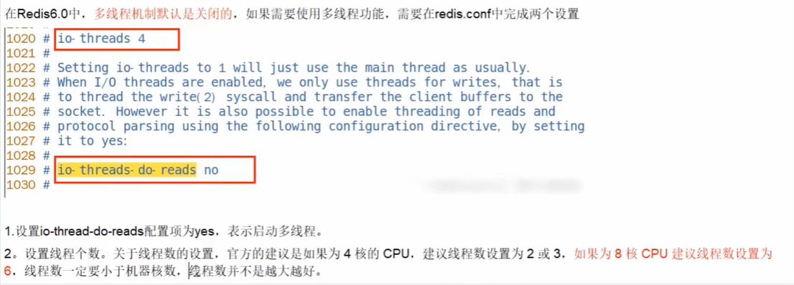
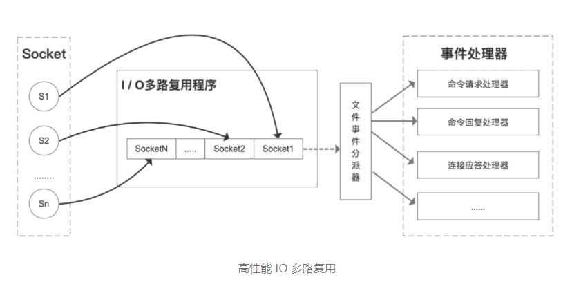
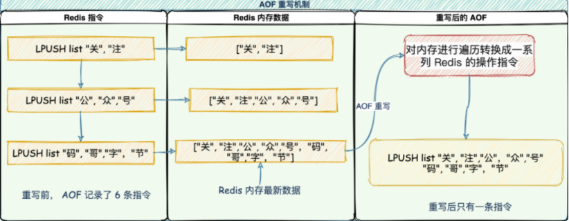

## 基本数据类型

### string（SDS，动态字符串）

1. free:还剩多少空间 len:字符串长度 buf:存放的字符数组。
2. 空间预分配：SDS 被修改后，程序不仅会为 SDS 分配所需要的必须空间，还会分配额外的未使用空间。
3. 惰性空间释放：当对 SDS 进行缩短操作时，程序并不会回收多余的内存空间，而是使用 free 字段将这些字节数量记录下来不释放，后面如果需要 append 操作，则直接使用 free 中未使用的空间，减少了内存的分配。

> 总结：
>
> Redis 的字符串是动态字符串，是可以修改的字符串，内部结构实现上类似于 Java 的ArrayList，采用预分配冗余空间的方式来减少内存的频繁分配，如图中所示，内部为当前字符串实际分配的空间 capacity 一般要高于实际字符串长度 len。当字符串长度小于 1M 时，扩容都是加倍现有的空间，如果超过 1M，扩容时一次只会多扩 1M 的空间。需要注意的是字符串最大长度为 512M。

#### 实战

**键值对** 

~~~shell
\> set name codehole 

OK 

\> get name 

"codehole"

\> exists name 

(integer) 1 

\> del name 

(integer) 1 

\> get name 

(nil) 
~~~

**批量键值对**

可以批量对多个字符串进行读写，节省网络耗时开销。

~~~sh
\> set name1 codehole 

OK 

\> set name2 holycoder 

OK 

\> mget name1 name2 name3 # 返回一个列表

1) "codehole" 

2) "holycoder" 

3) (nil) 

\> mset name1 boy name2 girl name3 unknown 

\> mget name1 name2 name3 

1) "boy" 

2) "girl" 

3) "unknown"
~~~

**过期和 set 命令扩展** 

可以对 key 设置过期时间，到点自动删除，这个功能常用来控制缓存的失效时间。

~~~sh
\> set name codehole 

\> get name "codehole" 

\> expire name 5 # 5s 后过期

... # wait for 5s 

\> get name 

(nil) 

\> setex name 5 codehole # 5s 后过期，等价于 set+expire

\> get name 

"codehole" 

... # wait for 5s 

\> get name 

(nil) 

\> setnx name codehole # 如果 name 不存在就执行 set 创建

(integer) 1 

\> get name 

"codehole" 

\> setnx name holycoder 

(integer) 0 # 因为 name 已经存在，所以 set 创建不成功

\> get name 

"codehole"

\# 没有改变
~~~

**计数** 

如果 value 值是一个整数，还可以对它进行自增操作。自增是有范围的，它的范围是

signed long 的最大最小值，超过了这个值，Redis 会报错。

~~~sh
\> set age 30 

OK 

\> incr age 

(integer) 31 

\> incrby age 5 

(integer) 36 

\> incrby age -5 

(integer) 31 

\> set codehole 9223372036854775807 

\# Long.Max 

OK 

\> incr codehole

(error) ERR increment or decrement would overflow 
~~~

### ziplist

压缩列表是 List 、hash、 sorted Set 三种数据类型底层实现之一。

当一个列表只有少量数据的时候，并且每个列表项要么就是小整数值，要么就是长度比较短的字符串，那么 Redis 就会使用压缩列表来做列表键的底层实现。

### quicklist

**quicklist 是 ziplist 和 linkedlist 的混合体，它将 linkedlist 按段切分，每一段使用 ziplist 来紧凑存储，多个 ziplist 之间使用双向指针串接起来。**

### skipList 

sorted set 类型的排序功能便是通过「跳跃列表」数据结构来实现。

跳跃表（skiplist）是一种有序数据结构，它通过在每个节点中维持多个指向其他节点的指针，从而达到快速访问节点的目的。

跳表在链表的基础上，增加了多层级索引，通过索引位置的几个跳转，实现数据的快速定位，如下图所示：

## redis多线程配置

> Redis将所有数据放在内存中，内存响应时长约为100ns，对于小数据包Redis服务器可以处理8-10w的QPS,这也是Redis的极限了，对于大部分公司来说，单线程的Redis已经足够了。

## 缓存击穿

## list应用场景

1. 微信公众号订阅消息
2. 评论列表（评论按时间倒序）

## I/O 多路复用模型

Redis 采用 I/O 多路复用技术，并发处理连接。采用了 epoll + 自己实现的简单的事件框架。epoll 中的读、写、关闭、连接都转化成了事件，然后利用 epoll 的多路复用特性，绝不在 IO 上浪费一点时间。

Redis 线程不会阻塞在某一个特定的监听或已连接套接字上，也就是说，不会阻塞在某一个特定的客户端请求处理上。正因为此，Redis 可以同时和多个客户端连接并处理请求，从而提升并发性。

## Hash 冲突怎么办？(拉链法+渐进式rehash)

Redis 通过**链式哈希**解决冲突：**也就是同一个 桶里面的元素使用链表保存**。但是当链表过长就会导致查找性能变差可能，所以 Redis 为了追求快，使用了两个全局哈希表。用于 rehash 操作，增加现有的哈希桶数量，减少哈希冲突。

开始默认使用 「hash 表 1 」保存键值对数据，「hash 表 2」 此刻没有分配空间。当数据越来越多触发 rehash 操作，则执行以下操作：

1. 给 「hash 表 2 」分配更大的空间；
2. 将 「hash 表 1 」的数据重新映射拷贝到 「hash 表 2」 中；
3. 释放 「hash 表 1」 的空间。

**值得注意的是，将 hash 表 1 的数据重新映射到 hash 表 2 的过程中并不是一次性的，这样会造成 Redis 阻塞，无法提供服务。**

而是采用了**渐进式 rehash**，每次处理客户端请求的时候，先从「 hash 表 1」 中第一个索引开始，将这个位置的 所有数据拷贝到 「hash 表 2」 中，就这样将 rehash 分散到多次请求过程中，避免耗时阻塞。

## RDB、AOF

### RDB

在 Redis 执行「写」指令过程中，内存数据会一直变化。所谓的内存快照，指的就是 Redis 内存中的数据在某一刻的状态数据。

Redis 跟这个类似，就是把某一刻的数据以文件的形式拍下来，写到磁盘上。这个快照文件叫做 **RDB 文件，RDB 就是 Redis DataBase 的缩写。**在做数据恢复时，直接将 RDB 文件读入内存完成恢复。

**有两个严重性能开销**：

1. 频繁生成 RDB 文件写入磁盘，磁盘压力过大。会出现上一个 RDB 还未执行完，下一个又开始生成，陷入死循环。
2. fork 出 bgsave 子进程会阻塞主线程，主线程的内存越大，阻塞时间越长。

#### 在生成 RDB 期间，Redis 可以同时处理写请求么？

可以的，Redis 使用操作系统的多进程**写时复制技术 COW(Copy On Write)** 来实现快照持久化，保证数据一致性。

Redis 在持久化时会调用 glibc 的函数`fork`产生一个子进程，快照持久化完全交给子进程来处理，父进程继续处理客户端请求。

当主线程执行写指令修改数据的时候，这个数据就会复制一份副本， `bgsave` 子进程读取这个副本数据写到 RDB 文件。

这既保证了快照的完整性，也允许主线程同时对数据进行修改，避免了对正常业务的影响。

### AOF

AOF 日志记录了自 Redis 实例创建以来所有的**修改**性指令序列。

Redis 提供的 AOF 配置项`appendfsync`写回策略直接决定 AOF 持久化功能的效率和安全性。

- **always**：同步写回，写指令执行完毕立马将 `aof_buf`缓冲区中的内容刷写到 AOF 文件。
- **everysec**：每秒写回，写指令执行完，日志只会写到 AOF 文件缓冲区，每隔一秒就把缓冲区内容同步到磁盘。
- **no：** 操作系统控制，写执行执行完毕，把日志写到 AOF 文件内存缓冲区，由操作系统决定何时刷写到磁盘。

#### 重写机制

AOF 记录的是每个「写」指令操作。不会像 RDB 全量快照导致性能损耗，但是执行速度没有 RDB 快，同时日志文件过大也会造成性能问题。

所以，Redis 设计了一个杀手锏「AOF 重写机制」，Redis 提供了 `bgrewriteaof`指令用于对 AOF 日志进行瘦身。

其原理就是开辟一个子进程对内存进行遍历转换成一系列 Redis 的操作指令，序列化到一个新的 AOF 日志文件中。序列化完毕后再将操作期间发生的增量 AOF 日志追加到这个新的 AOF 日志文件中，追加完毕后就立即替代旧的 AOF 日志文件，瘦身工作就完成了。

### 如何实现数据尽可能少丢失又能兼顾性能呢？

**混合持久化**。将 rdb 文件的内容和增量的 AOF 日志文件存在一起。这里的 AOF 日志不再是全量的日志，而是**自持久化开始到持久化结束的这段时间发生的增量 AOF 日志**，通常这部分 AOF 日志很小。

于是**在 Redis 重启的时候，可以先加载 rdb 的内容，然后再重放增量 AOF 日志就可以完全替代之前的 AOF 全量文件重放，重启效率因此大幅得到提升**。

## 数据过期清理策略

### 过期键清理策略

- 定时删除，为每个过期键建立一个timer，缺点占用CPU

- 惰性删除，键获取的时候判断过期再清除，对内存不友好。

- Redis使用惰性删除和定期删除结合的方式配合使用。

- 定期删除，即根据设定执行时长和操作频率清理，缺点难以确定。

  > Redis 底层会通过限制删除操作执行的时长和频率来减少删除操作对CPU时间的影响，默认100ms就随机抽一些设置了过期时间的key，不会扫描全部的过期键，因为开销过大。

redis在内存空间不足的时候，为了保证命中率，就会选择一定的数据淘汰策略——**内存淘汰机制（过期键的补充措施）**

### 内存淘汰机制

内存淘汰机制：八种大体上可以分为4中，lru（最近最少使用）、lfu（最少使用频率）、random（随机）、ttl（根据生存时间，快过期）。

1. volatile-lru：从已设置过期时间的数据集中挑选最近最少使用的数据淘汰。
2. volatile-ttl：从已设置过期时间的数据集中挑选将要过期的数据淘汰。
3. volatile-random：从已设置过期时间的数据集中任意选择数据淘汰。
4. volatile-lfu：从已设置过期时间的数据集挑选使用频率最低的数据淘汰。
5. allkeys-lru：从数据集中挑选最近最少使用的数据淘汰
6. allkeys-lfu：从数据集中挑选使用频率最低的数据淘汰。
7. allkeys-random：从数据集（server.db[i].dict）中任意选择数据淘汰
8. no-enviction（驱逐）：禁止驱逐数据，这也是默认策略。意思是当内存不足以容纳新入数据时，新写入操作就会报错，请求可以继续进行，线上任务也不能持续进行，采用no-enviction策略可以保证数据不被丢失。