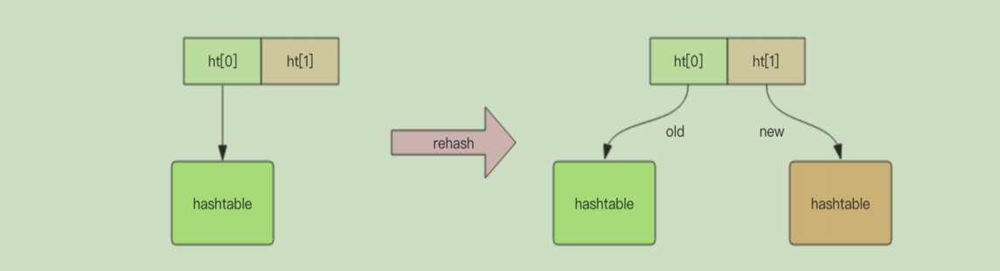
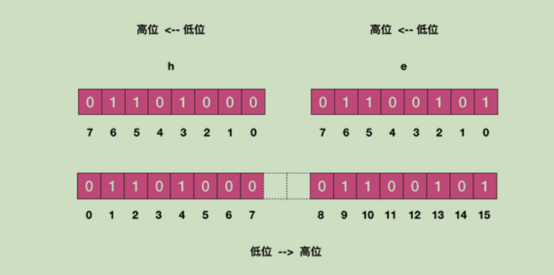
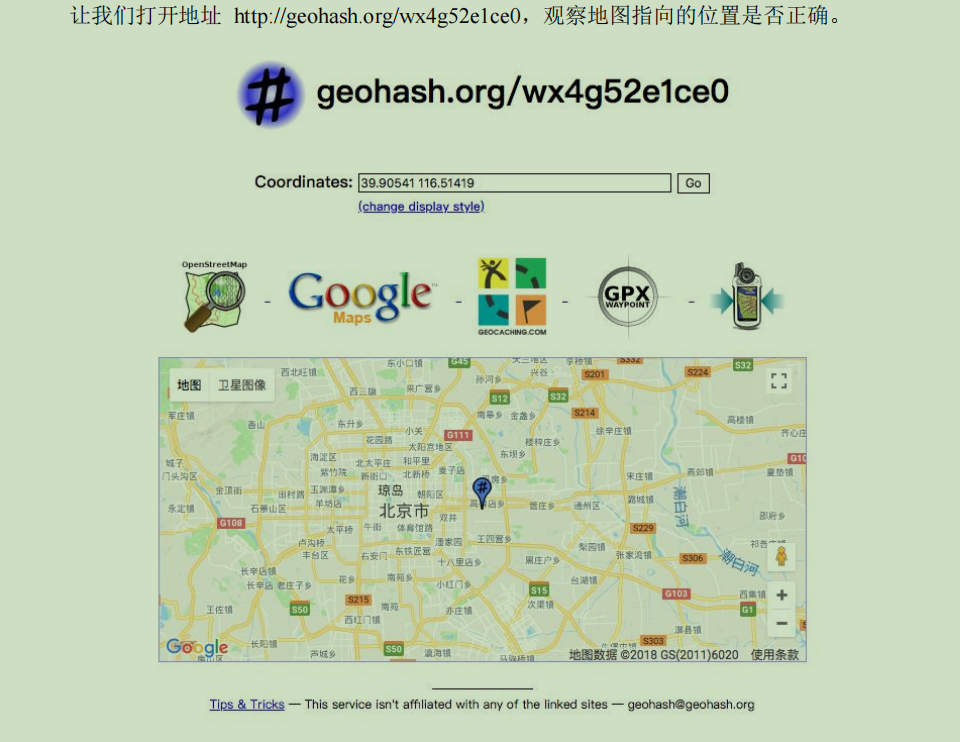
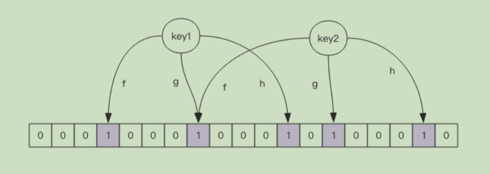
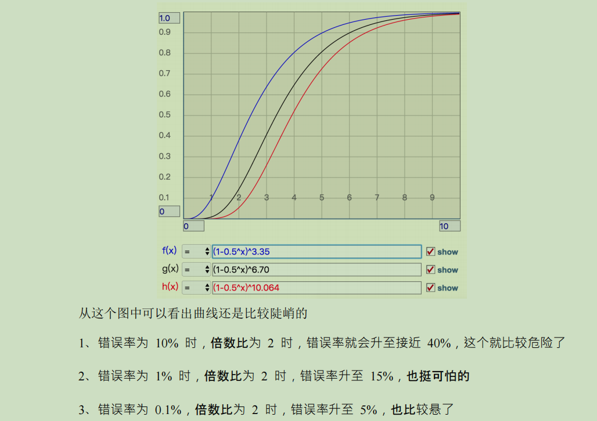
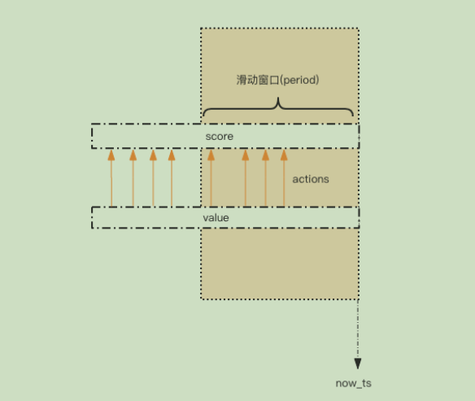
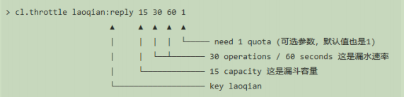

# 基本数据类型

> redis的数据结构比较特殊，本质上都是`kv`，过期时间也是针对k。

## string（SDS，动态字符串）


> 1. free:还剩多少空间 len:字符串长度 buf:存放的字符数组。
> 2. 空间预分配：SDS 被修改后，程序不仅会为 SDS 分配所需要的必须空间，还会分配额外的未使用空间。
> 3. 惰性空间释放：当对 SDS 进行缩短操作时，程序并不会回收多余的内存空间，而是使用 free 字段将这些字节数量记录下来不释放，后面如果需要 append 操作，则直接使用 free 中未使用的空间，减少了内存的分配。
>

> 总结：
>
> Redis 的字符串是动态字符串，是可以修改的字符串，内部结构实现上类似于 Java 的ArrayList，采用预分配冗余空间的方式来减少内存的频繁分配，如图中所示，内部为当前字符串实际分配的空间 capacity 一般要高于实际字符串长度 len。当字符串长度小于 1M 时，扩容都是加倍现有的空间，如果超过 1M，扩容时一次只会多扩 1M 的空间。需要注意的是字符串最大长度为 512M。

### 实战

**键值对** 

~~~shell
\> set name codehole 

OK 

\> get name 

"codehole"

\> exists name 

(integer) 1 

\> del name 

(integer) 1 

\> get name 

(nil) 
~~~


**批量键值对**

可以批量对多个字符串进行读写，节省网络耗时开销。

~~~sh
\> set name1 codehole 

OK 

\> set name2 holycoder 

OK 

\> mget name1 name2 name3 # 返回一个列表

1) "codehole" 

2) "holycoder" 

3) (nil) 

\> mset name1 boy name2 girl name3 unknown 

\> mget name1 name2 name3 

1) "boy" 

2) "girl" 

3) "unknown"
~~~


**过期和 set 命令扩展** 

可以对 key 设置过期时间，到点自动删除，这个功能常用来控制缓存的失效时间。

~~~sh
\> set name codehole 

\> get name "codehole" 

\> expire name 5 # 5s 后过期

... # wait for 5s 

\> get name 

(nil) 

\> setex name 5 codehole # 5s 后过期，等价于 set+expire

\> get name 

"codehole" 

... # wait for 5s 

\> get name 

(nil) 

\> setnx name codehole # 如果 name 不存在就执行 set 创建

(integer) 1 

\> get name 

"codehole" 

\> setnx name holycoder 

(integer) 0 # 因为 name 已经存在，所以 set 创建不成功

\> get name 

"codehole"

\# 没有改变
~~~


**计数** 

如果 value 值是一个整数，还可以对它进行自增操作。自增是有范围的，它的范围是

signed long 的最大最小值，超过了这个值，Redis 会报错。

~~~sh
\> set age 30 

OK 

\> incr age 

(integer) 31 

\> incrby age 5 

(integer) 36 

\> incrby age -5 

(integer) 31 

\> set codehole 9223372036854775807 

\# Long.Max 

OK 

\> incr codehole

(error) ERR increment or decrement would overflow 
~~~

## list

> Redis 的列表相当于 Java 语言里面的 LinkedList，注意它是链表而不是数组。这意味着list 的插入和删除操作非常快，时间复杂度为 O(1)，但是索引定位很慢，时间复杂度为O(n)，这点让人非常意外。
>
> 当列表弹出了最后一个元素之后，该数据结构自动被删除，内存被回收。
>
> Redis 的列表结构常用来做异步队列使用。将需要延后处理的任务结构体序列化成字符串塞进 Redis 的列表，另一个线程从这个列表中轮询数据进行处理。

### 实战

**右边进左边出：队列** 

~~~shell
\> rpush books python java golang 

(integer) 3 

\> llen books 

(integer) 3 

\> lpop books 

"python" 

\> lpop books 

"java" 

\> lpop books 

"golang" 

\> lpop books 

(nil) 
~~~


**右边进右边出：栈** 

~~~sh
\> rpush books python java golang 

(integer) 3 

\> rpop books 

"golang" 

\> rpop books 

"java" 

\> rpop books 

"python" 

\> rpop books

(nil) 
~~~


**慢操作** 

> lindex 相当于 Java 链表的 get(int index)方法，它需要对链表进行遍历，性能随着参数index 增大而变差。 ltrim 和字面上的含义不太一样，个人觉得它叫 lretain(保留) 更合适一些，因为 ltrim 跟的两个参数 start_index 和 end_index 定义了一个区间，在这个区间内的值，ltrim 要保留，区间之外统统砍掉。我们可以通过 ltrim 来实现一个定长的链表，这一点非常有用。index 可以为负数，index=-1 表示倒数第一个元素，同样 index=-2 表示倒数第二个元素。

~~~sh
\> rpush books python java golang 

(integer) 3 

\> lindex books 1 # O(n) 慎用

"java" 

\> lrange books 0 -1 # 获取所有元素，O(n) 慎用

1) "python" 

2) "java" 

3) "golang" 

\> ltrim books 1 -1 # O(n) 慎用

OK 

\> lrange books 0 -1 

1) "java" 

2) "golang" 

\> ltrim books 1 0 # 这其实是清空了整个列表，因为区间范围长度为负

OK 

\> llen books 

(integer) 0
~~~


## ziplist

> 压缩列表是 List 、hash、 sorted Set 三种数据类型底层实现之一。
>
> 当一个列表只有少量数据的时候，并且每个列表项要么就是小整数值，要么就是长度比较短的字符串，那么 Redis 就会使用压缩列表来做列表键的底层实现。
>


## quicklist

> **quicklist 是 ziplist 和 linkedlist 的混合体，它将 linkedlist 按段切分，每一段使用 ziplist 来紧凑存储，多个 ziplist 之间使用双向指针串接起来。**


## skipList 

> sorted set 类型的排序功能便是通过「跳跃列表」数据结构来实现。
>
> 跳跃表（skiplist）是一种有序数据结构，它通过在每个节点中维持多个指向其他节点的指针，从而达到快速访问节点的目的。
>
> 跳表在链表的基础上，增加了多层级索引，通过索引位置的几个跳转，实现数据的快速定位，如下图所示：
>


## hash

> 跟java中的hashMap一样，数组+链表。
>
> 不同的是，Redis 的字典的值只能是字符串，另外它们 rehash 的方式不一样，因为Java 的 HashMap 在字典很大时，rehash 是个耗时的操作，需要一次性全部 rehash。Redis 为了高性能，不能堵塞服务，所以采用了**渐进式 rehash** 策略。

### Hash 冲突怎么办？(拉链法+渐进式rehash)

Redis 通过**链式哈希**解决冲突：**也就是同一个 桶里面的元素使用链表保存**。但是当链表过长就会导致查找性能变差可能，所以 Redis 为了追求快，使用了两个全局哈希表。用于 rehash 操作，增加现有的哈希桶数量，减少哈希冲突。

开始默认使用 「hash 表 1 」保存键值对数据，「hash 表 2」 此刻没有分配空间。当数据越来越多触发 rehash 操作，则执行以下操作：

1. 给 「hash 表 2 」分配更大的空间；
2. 将 「hash 表 1 」的数据重新映射拷贝到 「hash 表 2」 中；
3. 释放 「hash 表 1」 的空间。

**值得注意的是，将 hash 表 1 的数据重新映射到 hash 表 2 的过程中并不是一次性的，这样会造成 Redis 阻塞，无法提供服务。**

而是采用了**渐进式 rehash**，每次处理客户端请求的时候，先从「 hash 表 1」 中第一个索引开始，将这个位置的 所有数据拷贝到 「hash 表 2」 中，就这样将 rehash 分散到多次请求过程中，避免耗时阻塞。

### 渐进式 rehash



**渐进式 rehash** 会在 rehash 的同时，保留新旧两个 hash 结构，查询时会同时查询两个hash 结构，然后在后续的定时任务中以及 hash 的子指令中，循序渐进地将旧 hash 的内容一点点迁移到新的 hash 结构中。


### 实战

~~~sh
\> hset books java "think in java" # 命令行的字符串如果包含空格，要用引号括起来

(integer) 1 

\> hset books golang "concurrency in go" 

(integer) 1 

\> hset books python "python cookbook" 

(integer) 1 

\> hgetall books # entries()，key 和 value 间隔出现

1) "java" 

2) "think in java" 

3) "golang" 

4) "concurrency in go" 

5) "python" 

6) "python cookbook" 

\> hlen books 

(integer) 3 

\> hget books java 

"think in java" 

\> hset books golang "learning go programming" # 因为是更新操作，所以返回 0

(integer) 0 

\> hget books golang "learning go programming" 

\> hmset books java "effective java" python "learning python" golang "modern golang 

programming" # 批量 set 

OK 

# 老钱又老了一岁
> hincrby user-laoqian age 1 
(integer) 30
~~~

### set

> Redis 的集合相当于 Java 语言里面的 HashSet，它内部的键值对是`无序`的`唯一`的。它的内部实现相当于一个特殊的字典，字典中所有的 value 都是一个值 NULL。

#### 实战

~~~sh
> sadd books python 
(integer) 1 
> sadd bookspython # 重复
(integer) 0 
> sadd books java golang 
(integer) 2 
> smembers books # 注意顺序，和插入的并不一致，因为 set 是无序的
1) "java" 
2) "python" 
3) "golang" 
> sismember books java # 查询某个 value 是否存在，相当于 contains(o)
(integer) 1 
> sismember books rust 
(integer) 0 
> scard books # 获取长度相当于 count()
(integer) 3 
> spop books # 弹出一个
"java"
~~~

### zset

> 它类似于 Java 的 SortedSet 和 HashMap 的结合体，一方面它是一个 set，保证了内部value 的唯一性，另一方面它可以给每个 value 赋予一个 `score`，代表这个 value 的排序权重。`内部实现为「跳跃列表」`。

#### 实战

~~~sh
> zadd books 9.0 "think in java" 
(integer) 1 
> zadd books 8.9 "java concurrency" 
(integer) 1 
> zadd books 8.6 "java cookbook" 
(integer) 1 
> zrange books 0 -1 # 按 score 排序列出，参数区间为排名范围
1) "java cookbook" 
2) "java concurrency" 
3) "think in java" 
> zrevrange books 0 -1 # 按 score 逆序列出，参数区间为排名范围
1) "think in java" 
2) "java concurrency" 
3) "java cookbook" 
> zcard books # 相当于 count()
(integer) 3 
> zscore books "java concurrency" # 获取指定 value 的 score
"8.9000000000000004" # 内部 score 使用 double 类型进行存储，所以存在小数点精度问题
> zrank books "java concurrency" # 排名
(integer) 1 
> zrangebyscore books 0 8.91 # 根据分值区间遍历 zset
1) "java cookbook" 
2) "java concurrency" 
> zrangebyscore books -inf 8.91 withscores # 根据分值区间 (-∞, 8.91] 遍历 zset，同时返
回分值。inf 代表 infinite，无穷大的意思。
1) "java cookbook" 
2) "8.5999999999999996" 
3) "java concurrency" 
4) "8.9000000000000004" 
> zrem books "java concurrency" # 删除 value
(integer) 1 
> zrange books 0 -1 
1) "java cookbook" 
2) "think in java"
~~~

# 其他数据类型

## 位图（bitmap）

> 位图的内容其实就是普通的字符串，本质就是byte[]，所以读取的时候是按8bit转成ASCII对应的字符串。自动扩展，如果设置了某个偏移位置超出了现有的内容范围，就会自动将位数组进行零扩充。
>
> 「零存」就是使用 setbit 对位值进行逐个设置，「整存」就是使用字符串一次性填充所有位数组，覆盖掉旧值。

### 实战

将hello存入，注意：bitmap存数据是按`低位->高位`存储的。



**零存零取**

~~~sh
127.0.0.1:6379> setbit w 1 1
(integer) 0
127.0.0.1:6379> setbit w 2 1
(integer) 0
127.0.0.1:6379> setbit w 4 1
(integer) 0
127.0.0.1:6379> getbit w 1 # 获取某个具体位置的值 0/1
(integer) 1
127.0.0.1:6379> getbit w 2
(integer) 1
127.0.0.1:6379> getbit w 4
(integer) 1
127.0.0.1:6379> getbit w 5
(integer) 0
~~~

**整存零取**

~~~sh
127.0.0.1:6379> set w h # 整存
(integer) 0
127.0.0.1:6379> getbit w 1
(integer) 1
127.0.0.1:6379> getbit w 2
(integer) 1
127.0.0.1:6379> getbit w 4
(integer) 1
127.0.0.1:6379> getbit w 5
(integer) 0
~~~

如果对应位的字节是不可打印字符，redis-cli 会显示该字符的 16 进制形式

~~~sh
127.0.0.1:6379> setbit x 0 1
(integer) 0
127.0.0.1:6379> setbit x 1 1
(integer) 0
127.0.0.1:6379> get x
"\xc0"
~~~

**统计和查找**

bitcount 用来统计指定位置范围内 1 的个数，bitpos 用来查找指定范围内出现的第一个 0 或 1。

遗憾的是， start 和 end 参数是字节索引，也就是说`指定的位范围必须是 8 的倍数`，而不能任意指定。

```sh
127.0.0.1:6379> set w hello
OK
127.0.0.1:6379> bitcount w
(integer) 21
127.0.0.1:6379> bitcount w 0 0 # 第一个字符中 1 的位数
(integer) 3
127.0.0.1:6379> bitcount w 0 1 # 前两个字符中 1 的位数
(integer) 7
127.0.0.1:6379> bitpos w 0 # 第一个 0 位
(integer) 0
127.0.0.1:6379> bitpos w 1 # 第一个 1 位
(integer) 1
127.0.0.1:6379> bitpos w 1 1 1 # 从第二个字符算起，第一个 1 位
(integer) 9
127.0.0.1:6379> bitpos w 1 2 2 # 从第三个字符算起，第一个 1 位
(integer) 17
```

**读取/设置多位**

~~~sh
127.0.0.1:6379> set w hello
OK
127.0.0.1:6379> bitfield w get u4 0 # 从第一个位开始取 4 个位，结果是无符号数 (u)
(integer) 6
127.0.0.1:6379> bitfield w get u3 2 # 从第三个位开始取 3 个位，结果是无符号数 (u)
(integer) 5
127.0.0.1:6379> bitfield w get i4 0 # 从第一个位开始取 4 个位，结果是有符号数 (i)
1) (integer) 6
127.0.0.1:6379> bitfield w get i3 2 # 从第三个位开始取 3 个位，结果是有符号数 (i)
1) (integer) -3

127.0.0.1:6379> bitfield w get u4 0 get u3 2 get i4 0 get i3 2
1) (integer) 6
2) (integer) 5
3) (integer) 6
4) (integer) -3

127.0.0.1:6379> bitfield w set u8 8 97 # 从第 8 个位开始，将接下来的 8 个位用无符号数 97 替换
1) (integer) 101
127.0.0.1:6379> get w
"hallo"
~~~

## HyperLogLog

> 用来统计数量，例如统计网站的UV。
>
> 实现原理比较复杂，涉及数学和概率论！！！

### 实战

~~~sh
127.0.0.1:6379> pfadd codehole user1
(integer) 1
127.0.0.1:6379> pfcount codehole
(integer) 1
127.0.0.1:6379> pfadd codehole user2
(integer) 1
127.0.0.1:6379> pfcount codehole
(integer) 2
127.0.0.1:6379> pfadd codehole user3
(integer) 1
127.0.0.1:6379> pfcount codehole
(integer) 3
127.0.0.1:6379> pfadd codehole user4
(integer) 1
127.0.0.1:6379> pfcount codehole
(integer) 4
127.0.0.1:6379> pfadd codehole user5
(integer) 1
127.0.0.1:6379> pfcount codehole
(integer) 5
127.0.0.1:6379> pfadd codehole user6
(integer) 1
127.0.0.1:6379> pfcount codehole
(integer) 6
127.0.0.1:6379> pfadd codehole user7 user8 user9 user10
(integer) 1
127.0.0.1:6379> pfcount codehole
(integer) 10
~~~

**pfmerge 适合什么场合用？**

用于将多个 pf 计数值累加在一起形成一个新的 pf 值。比如在网站中我们有两个内容差不多的页面，运营说需要这两个页面的数据进行合并。其中页面的 UV 访问量也需要合并，那这个时候 pfmerge 就可以派上用场了。

## GeoHash

> 存储经纬度，用于计算距离、附近等，底层zset。

### geoadd

新增数据

~~~sh
127.0.0.1:6379> geoadd company 116.48105 39.996794 juejin
(integer) 1
127.0.0.1:6379> geoadd company 116.514203 39.905409 ireader
(integer) 1
127.0.0.1:6379> geoadd company 116.489033 40.007669 meituan
(integer) 1
127.0.0.1:6379> geoadd company 116.562108 39.787602 jd 116.334255 40.027400 xiaomi
(integer) 2
~~~

### geodist

计算两个元素之间的距离，携带集合名称、2 个名称和距离单位

~~~sh
127.0.0.1:6379> geodist company juejin ireader km
"10.5501"
127.0.0.1:6379> geodist company juejin meituan km
"1.3878"
127.0.0.1:6379> geodist company juejin jd km
"24.2739"
127.0.0.1:6379> geodist company juejin xiaomi km
"12.9606"
127.0.0.1:6379> geodist company juejin juejin km
"0.0000"
~~~

### geopos

获取集合中任意元素的经纬度坐标，可以一次获取多个。获取的经纬度坐标和 geoadd 进去的坐标有`轻微的误差`，原因是 geohash 对二维坐标进行的一维映射是有损的，通过映射再还原回来的值会出现较小的差别。

~~~sh
127.0.0.1:6379> geopos company juejin
1) 1) "116.48104995489120483"
 2) "39.99679348858259686"
127.0.0.1:6379> geopos company ireader
1) 1) "116.5142020583152771"
 2) "39.90540918662494363"
127.0.0.1:6379> geopos company juejin ireader
1) 1) "116.48104995489120483"
 2) "39.99679348858259686"
2) 1) "116.5142020583152771"
 2) "39.90540918662494363"
~~~

###  geohash

获取元素的经纬度编码字符串，上面已经提到，它是 base32 编码。 可以使用这个编码值去 http://geohash.org/${hash}中进行直接定位，它是 geohash 的标准编码值。

~~~sh
127.0.0.1:6379> geohash company ireader
1) "wx4g52e1ce0"
127.0.0.1:6379> geohash company juejin
1) "wx4gd94yjn0"
~~~



### georadiusbymember

查询指定元素附近的其它元素，它的参数非常复杂。

~~~sh
# 范围 20 公里以内最多 3 个元素按距离正排，它不会排除自身
127.0.0.1:6379> georadiusbymember company ireader 20 km count 3 asc
1) "ireader"
2) "juejin"
3) "meituan"
# 范围 20 公里以内最多 3 个元素按距离倒排
127.0.0.1:6379> georadiusbymember company ireader 20 km count 3 desc
1) "jd"
2) "meituan"
3) "juejin"
# 三个可选参数 withcoord withdist withhash 用来携带附加参数
# withdist 很有用，它可以用来显示距离
127.0.0.1:6379> georadiusbymember company ireader 20 km withcoord withdist withhash count 3 asc
1) 
 1) "ireader"
 2) "0.0000"
 3) (integer) 4069886008361398
 4) 1) "116.5142020583152771"
 2) "39.90540918662494363"
2) 
 1) "juejin"
 2) "10.5501"
 3) (integer) 4069887154388167
 4) 1) "116.48104995489120483"
 2) "39.99679348858259686"
3) 
 1) "meituan"
 2) "11.5748"
 3) (integer) 4069887179083478
 4) 1) "116.48903220891952515"
 2) "40.00766997707732031"
~~~

Redis 还提供了根据坐标值来查询附近的元素，这个指令更加有用，它可以根据用户的定位来计算「附近的车」，「附近的餐馆」等。它的参数和 georadiusbymember 基本一致，除了将目标元素改成经纬度坐标值。

~~~sh
127.0.0.1:6379> georadius company 116.514202 39.905409 20 km withdist count 3 asc
1) 1) "ireader"
 2) "0.0000"
2) 1) "juejin"
 2) "10.5501"
3) 1) "meituan"
 2) "11.5748"
~~~

在一个地图应用中，车的数据、餐馆的数据、人的数据可能会有百万千万条，如果使用Redis 的 Geo 数据结构，它们将全部放在一个 zset 集合中。在 Redis 的集群环境中，集合可能会从一个节点迁移到另一个节点，如果单个 key 的数据过大，会对集群的迁移工作造成较大的影响，在集群环境中单个 key 对应的数据量不宜超过 1M，否则会导致集群迁移出现卡顿现象，影响线上服务的正常运行。

所以，这里建议 Geo 的数据使用单独的 Redis 实例部署，不使用集群环境。如果数据量过亿甚至更大，就需要对 Geo 数据进行拆分，按国家拆分、按省拆分，按市拆分，在人口特大城市甚至可以按区拆分。这样就可以显著降低单个 zset 集合的大小。

# 布隆过滤器

> 创建布隆时两个参数：初始大小、误判率。
>
> 存在误判：存在有可能不存在，不存在一定不存在。

原理：多hash



## 空间占用估计

布隆过滤器有两个参数，第一个是预计元素的数量 n，第二个是错误率 f。公式根据这两个输入得到两个输出，第一个输出是位数组的长度 l，也就是需要的存储空间大小 (bit)，第二个输出是 hash 函数的最佳数量 k。hash 函数的数量也会直接影响到错误率，最佳的数量会有最低的错误率。

~~~sh
k=0.7*(l/n) # 约等于

f=0.6185^(l/n) # ^ 表示次方计算，也就是 math.pow
~~~

从公式中可以看出

 1、位数组相对越长 (l/n)，错误率 f 越低，这个和直观上理解是一致的

 2、位数组相对越长 (l/n)，hash 函数需要的最佳数量也越多，影响计算效率

 3、当一个元素平均需要 1 个字节 (8bit) 的指纹空间时 (l/n=8)，错误率大约为 2%

 4、错误率为 10%，一个元素需要的平均指纹空间为 4.792 个 bit，大约为 5bit

 5、错误率为 1%，一个元素需要的平均指纹空间为 9.585 个 bit，大约为 10bit

 6、错误率为 0.1%，一个元素需要的平均指纹空间为 14.377 个 bit，大约为 15bit

## 实际元素超出时，误判率会怎样变化

当实际元素超出预计元素时，错误率会有多大变化，它会急剧上升么，还是平缓地上升，这就需要另外一个公式，引入参数 t 表示实际元素和预计元素的倍数 t

~~~sh
f=(1-0.5^t)^k # 极限近似，k 是 hash 函数的最佳数量
~~~

当 t 增大时，错误率，f 也会跟着增大，分别选择错误率为 10%,1%,0.1% 的 k 值，画出它的曲线进行直观观察。



# 限流

> 需求：[a,b]时间窗口内，最多有n个请求。

## 简单限流



~~~java
public class SimpleRateLimiter {
 private Jedis jedis;
 public SimpleRateLimiter(Jedis jedis) {
 	this.jedis = jedis;
 }
 public boolean isActionAllowed(String userId, String actionKey, int period, int maxCount) {
     String key = String.format("hist:%s:%s", userId, actionKey);
     long nowTs = System.currentTimeMillis();
     Pipeline pipe = jedis.pipelined();
     pipe.multi();
     pipe.zadd(key, nowTs, "" + nowTs);
     pipe.zremrangeByScore(key, 0, nowTs - period * 1000);
     Response<Long> count = pipe.zcard(key);
     pipe.expire(key, period + 1);
     pipe.exec();
     pipe.close();
     return count.get() <= maxCount;
 }
 public static void main(String[] args) {
     Jedis jedis = new Jedis();
     SimpleRateLimiter limiter = new SimpleRateLimiter(jedis);
     for(int i=0;i<20;i++) {
        System.out.println(limiter.isActionAllowed("laoqian", "reply", 60, 5));
     }
 }
}
~~~

> 整体思路：每一个行为到来时，都维护一次时间窗口。将时间窗口外的记录全部清理掉，只保留窗口内的记录。zset 集合中只有 score 值非常重要，value 值没有特别的意义，只需要保证它是唯一的就可以了。
>
> 因为这几个连续的 Redis 操作都是针对同一个 key 的，使用 pipeline 可以显著提升Redis 存取效率。但这种方案也有缺点，因为它要记录时间窗口内所有的行为记录，如果这个量很大，比如限定 60s 内操作不得超过 100w 次这样的参数，它是不适合做这样的限流的，因为会消耗大量的存储空间。

## 漏斗限流

~~~java
public class FunnelRateLimiter {
    static class Funnel {
        int capacity;
        float leakingRate;
        int leftQuota;
        long leakingTs;
        public Funnel(int capacity, float leakingRate) {
            this.capacity = capacity;
            this.leakingRate = leakingRate;
            this.leftQuota = capacity;
            this.leakingTs = System.currentTimeMillis();
        }
        void makeSpace() {
            long nowTs = System.currentTimeMillis();
            long deltaTs = nowTs - leakingTs;
            int deltaQuota = (int) (deltaTs * leakingRate);
            if (deltaQuota < 0) { // 间隔时间太长，整数数字过大溢出
                this.leftQuota = capacity;
                this.leakingTs = nowTs;
                return;
            }
            if (deltaQuota < 1) { // 腾出空间太小，最小单位是 1
                return;
            }
            this.leftQuota += deltaQuota;
            this.leakingTs = nowTs;
            if (this.leftQuota > this.capacity) {
                this.leftQuota = this.capacity;
            }
        }
        boolean watering(int quota) {
            makeSpace();
            if (this.leftQuota >= quota) {
                this.leftQuota -= quota;
                return true;
            }
            return false;
        }
    }
    private Map<String, Funnel> funnels = new HashMap<>();
    public boolean isActionAllowed(String userId, String actionKey, int capacity, float leakingRate) {
        String key = String.format("%s:%s", userId, actionKey);
        Funnel funnel = funnels.get(key);
        if (funnel == null) {
            funnel = new Funnel(capacity, leakingRate);
            Redis 深度历险：核心原理与应用实践 | 钱文品 著
            第 74 页 共 226 页
            funnels.put(key, funnel);
        }
        return funnel.watering(1); // 需要 1 个 quota
    }
}
~~~

> Funnel 对象的 make_space 方法是漏斗算法的核心，其在每次灌水前都会被调用以触发漏水，给漏斗腾出空间来。能腾出多少空间取决于过去了多久以及流水的速率。Funnel 对象占据的空间大小不再和行为的频率成正比，它的空间占用是一个常量。
>
> 问题来了，分布式的漏斗算法该如何实现？能不能使用 Redis 的基础数据结构来搞定？
>
> 我们观察 Funnel 对象的几个字段，我们发现可以将 Funnel 对象的内容按字段存储到一个 hash 结构中，灌水的时候将 hash 结构的字段取出来进行逻辑运算后，再将新值回填到hash 结构中就完成了一次行为频度的检测。
>
> 但是有个问题，我们无法保证整个过程的原子性。从 hash 结构中取值，然后在内存里运算，再回填到 hash 结构，这三个过程无法原子化，意味着需要进行适当的加锁控制。而一旦加锁，就意味着会有加锁失败，加锁失败就需要选择重试或者放弃。如果重试的话，就会导致性能下降。如果放弃的话，就会影响用户体验。同时，代码的复杂度也跟着升高很多。这真是个艰难的选择，我们该如何解决这个问题呢？Redis-Cell 救星来了。

### Redis-Cell 

> Redis 4.0 提供了一个限流 Redis 模块，它叫 redis-cell。该模块也使用了漏斗算法，并提供了原子的限流指令。



上面这个指令的意思是允许「用户老钱回复行为」的频率为每 60s 最多 30 次(漏水速率)，漏斗的初始容量为 15，也就是说一开始可以连续回复 15 个帖子，然后才开始受漏水速率的影响。我们看到这个指令中漏水速率变成了 2 个参数，替代了之前的单个浮点数。用两个参数相除的结果来表达漏水速率相对单个浮点数要更加直观一些。

~~~sh
\> cl.throttle laoqian:reply 15 30 60

1) (integer) 0 # 0 表示允许，1 表示拒绝

2) (integer) 15 # 漏斗容量 capacity

3) (integer) 14 # 漏斗剩余空间 left_quota

4) (integer) -1 # 如果拒绝了，需要多长时间后再试(漏斗有空间了，单位秒)

5) (integer) 2 # 多长时间后，漏斗完全空出来(left_quota==capacity，单位秒)
~~~

在执行限流指令时，如果被拒绝了，就需要丢弃或重试。cl.throttle 指令考虑的非常周到，连重试时间都帮你算好了，直接取返回结果数组的第四个值进行 sleep 即可，如果不想阻塞线程，也可以异步定时任务来重试。

# redis多线程配置

> Redis将所有数据放在内存中，内存响应时长约为100ns，对于小数据包Redis服务器可以处理8-10w的QPS,这也是Redis的极限了，对于大部分公司来说，单线程的Redis已经足够了。


# 缓存击穿


# list应用场景

1. 微信公众号订阅消息
2. 评论列表（评论按时间倒序）

# I/O 多路复用模型

Redis 采用 I/O 多路复用技术，并发处理连接。采用了 epoll + 自己实现的简单的事件框架。epoll 中的读、写、关闭、连接都转化成了事件，然后利用 epoll 的多路复用特性，绝不在 IO 上浪费一点时间。

Redis 线程不会阻塞在某一个特定的监听或已连接套接字上，也就是说，不会阻塞在某一个特定的客户端请求处理上。正因为此，Redis 可以同时和多个客户端连接并处理请求，从而提升并发性。


# RDB、AOF

## RDB

在 Redis 执行「写」指令过程中，内存数据会一直变化。所谓的内存快照，指的就是 Redis 内存中的数据在某一刻的状态数据。

Redis 跟这个类似，就是把某一刻的数据以文件的形式拍下来，写到磁盘上。这个快照文件叫做 **RDB 文件，RDB 就是 Redis DataBase 的缩写。**在做数据恢复时，直接将 RDB 文件读入内存完成恢复。

**有两个严重性能开销**：

1. 频繁生成 RDB 文件写入磁盘，磁盘压力过大。会出现上一个 RDB 还未执行完，下一个又开始生成，陷入死循环。
2. fork 出 bgsave 子进程会阻塞主线程，主线程的内存越大，阻塞时间越长。

### 在生成 RDB 期间，Redis 可以同时处理写请求么？

可以的，Redis 使用操作系统的多进程**写时复制技术 COW(Copy On Write)** 来实现快照持久化，保证数据一致性。

Redis 在持久化时会调用 glibc 的函数`fork`产生一个子进程，快照持久化完全交给子进程来处理，父进程继续处理客户端请求。

当主线程执行写指令修改数据的时候，这个数据就会复制一份副本， `bgsave` 子进程读取这个副本数据写到 RDB 文件。

这既保证了快照的完整性，也允许主线程同时对数据进行修改，避免了对正常业务的影响。


## AOF

AOF 日志记录了自 Redis 实例创建以来所有的**修改**性指令序列。

Redis 提供的 AOF 配置项`appendfsync`写回策略直接决定 AOF 持久化功能的效率和安全性。

- **always**：同步写回，写指令执行完毕立马将 `aof_buf`缓冲区中的内容刷写到 AOF 文件。
- **everysec**：每秒写回，写指令执行完，日志只会写到 AOF 文件缓冲区，每隔一秒就把缓冲区内容同步到磁盘。
- **no：** 操作系统控制，写执行执行完毕，把日志写到 AOF 文件内存缓冲区，由操作系统决定何时刷写到磁盘。

### 重写机制

AOF 记录的是每个「写」指令操作。不会像 RDB 全量快照导致性能损耗，但是执行速度没有 RDB 快，同时日志文件过大也会造成性能问题。

所以，Redis 设计了一个杀手锏「AOF 重写机制」，Redis 提供了 `bgrewriteaof`指令用于对 AOF 日志进行瘦身。

其原理就是开辟一个子进程对内存进行遍历转换成一系列 Redis 的操作指令，序列化到一个新的 AOF 日志文件中。序列化完毕后再将操作期间发生的增量 AOF 日志追加到这个新的 AOF 日志文件中，追加完毕后就立即替代旧的 AOF 日志文件，瘦身工作就完成了。


### 如何实现数据尽可能少丢失又能兼顾性能呢？

**混合持久化**。将 rdb 文件的内容和增量的 AOF 日志文件存在一起。这里的 AOF 日志不再是全量的日志，而是**自持久化开始到持久化结束的这段时间发生的增量 AOF 日志**，通常这部分 AOF 日志很小。

于是**在 Redis 重启的时候，可以先加载 rdb 的内容，然后再重放增量 AOF 日志就可以完全替代之前的 AOF 全量文件重放，重启效率因此大幅得到提升**。


# 数据过期清理策略

## 过期键清理策略

- 定时删除，为每个过期键建立一个timer，缺点占用CPU

- 惰性删除，键获取的时候判断过期再清除，对内存不友好。

- Redis使用惰性删除和定期删除结合的方式配合使用。

- 定期删除，即根据设定执行时长和操作频率清理，缺点难以确定。

  > Redis 底层会通过限制删除操作执行的时长和频率来减少删除操作对CPU时间的影响，默认100ms就随机抽一些设置了过期时间的key，不会扫描全部的过期键，因为开销过大。

redis在内存空间不足的时候，为了保证命中率，就会选择一定的数据淘汰策略——**内存淘汰机制（过期键的补充措施）**

## 内存淘汰机制

内存淘汰机制：八种大体上可以分为4中，lru（最近最少使用）、lfu（最少使用频率）、random（随机）、ttl（根据生存时间，快过期）。

1. volatile-lru：从已设置过期时间的数据集中挑选最近最少使用的数据淘汰。
2. volatile-ttl：从已设置过期时间的数据集中挑选将要过期的数据淘汰。
3. volatile-random：从已设置过期时间的数据集中任意选择数据淘汰。
4. volatile-lfu：从已设置过期时间的数据集挑选使用频率最低的数据淘汰。
5. allkeys-lru：从数据集中挑选最近最少使用的数据淘汰
6. allkeys-lfu：从数据集中挑选使用频率最低的数据淘汰。
7. allkeys-random：从数据集（server.db[i].dict）中任意选择数据淘汰
8. no-enviction（驱逐）：禁止驱逐数据，这也是默认策略。意思是当内存不足以容纳新入数据时，新写入操作就会报错，请求可以继续进行，线上任务也不能持续进行，采用no-enviction策略可以保证数据不被丢失。