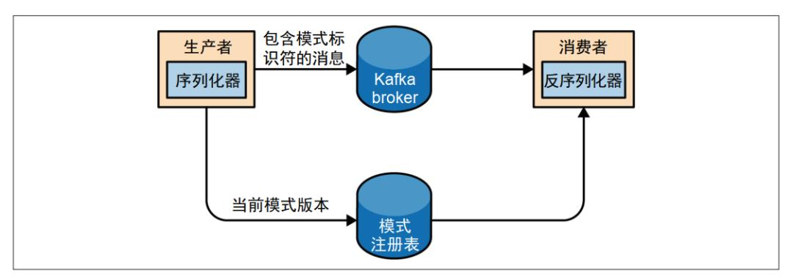

#  Avro Schema（Apache 标准）

**官方规范**：https://avro.apache.org/docs/current/spec.html

**特点**：JSON 格式，支持嵌套结构、类型系统、默认值，广泛用于数据湖和消息队列（如 Kafka）。

## 简介

> Apache Avro（以下简称 Avro，读音：阿夫罗）是一个数据序列化系统，是一种与编程语言无关的序列化格式，是提供一种共享数据文件的方式。Avro是Hadoop中的一个子项目，Avro是一个基于二进制数据传输高性能的中间件。Avro可以做到将数据进行序列化，适用于远程或本地大批量数据交互。在传输的过程中Avro对数据二进制序列化后节约数据存储空间和网络传输带宽。

序列化就是将对象转换成二进制流，相应的反序列化就是将二进制流再转换成对应的对象。因此，Avro就是用来在传输数据之前，将对象转换成二进制流，然后此二进制流达到目标地址后，Avro再将二进制流转换成对象。

## 特点

1. 丰富的数据结构
2. 一个紧凑的，快速的，二进制的数据格式
3. 一个容器文件，来存储持久化数据
4. 远程过程调用（RPC）
5. 简单的动态语言集成。
6. Avro模式是使用JSON定义的 。这有助于以已经具有JSON库的语言实现。

JSON是一种轻量级的数据传输格式，对于大数据集，JSON数据会显示力不从心，因为JSON的格式是key：value型，每条记录都要附上key的名字，有的时候，光key消耗的空间甚至会超过value所占空间，这对空间的浪费十分严重，尤其是对大型数据集来说，因为它不仅不够紧凑，还要重复地加上key信息，不仅会造成存储空间上的浪费，更会增加了数据传输的压力，从而给集群增加负担，进而影响整个集群的吞吐量。

而采用Avro数据序列化系统可以比较好的解决此问题，因为用Avro序列化后的文件由schema和真实内容组成，schema只是数据的元数据，相当于JSON数据的key信息，schema单独存放在一个JSON文件中，这样一来，数据的元数据只存了一次，相比JSON数据格式的文件，大大缩小了存储容量。从而使得Avro文件可以更加紧凑地组织数据。

## 为什么使用Avro

Avro 序列化相比常见的序列化（比如 json）会更快，序列化的数据会更小。相比 protobuf ，它可以支持实时编译，不需要像 protobuf 那样先定义好数据格式文件，编译之后才能使用。

Avro 有一个很有意思的特性，当发送消息的应用程序使用了新模式时，读取消息的应用程序可以继续处理消息而无须做任何修改，这个特性使它特别适合用在像 Kafka 这样的消息系统中。

假设最初的模式是下面这样的。

```
{
 "namespace": "customerManagement.avro",
 "type": "record",
 "name": "Customer",
 "fields": [{
   "name": "id",
   "type": "int"
  },
  {
   "name": "name",
   "type": "string"
  },
  {
   "name": "faxNumber",
   "type": ["null", "string"],
   "default": "null"
  }
 ]
}
```

假设我们已经使用这个模式几个月时间，并用它生成了几太字节的数据，现在决定对其做一些修改。因为在 21 世纪我们不再需要 faxNumber 这个字段，所以要用 email 字段来替代它。

新的模式如下所示。

```
{
 "namespace": "customerManagement.avro",
 "type": "record",
 "name": "Customer",
 "fields": [{
   "name": "id",
   "type": "int"
  },
  {
   "name": "name",
   "type": "string"
  },
  {
   "name": "email",
   "type": ["null", "string"],
   "default": "null"
  }
 ]
}
```

更新到新模式后，旧记录仍然包含 faxNumber 字段，而新记录则包含 email 字段。在很多公司里，应用程序升级是一个缓慢的过程，通常需要几个月时间。所以，需要考虑如何让还在使用 faxNumber 字段的旧应用程序和已经使用 email 字段的新应用程序正常处理 Kafka中的所有消息。

读取消息的应用程序会调用类似 getName()、 getId() 和 getFaxNumber() 这样的方法。如果读取到使用新模式构建的消息，那么getName() 方法和 getId() 方法仍然能够正常返回，但 getFaxNumber() 方法将返回 null，因为消息里不包含传真号码。

现在，假设升级了应用程序，用 getEmail() 方法替代了 getFaxNumber() 方法。如果读取到一个使用旧模式构建的消息，那么 getEmail() 方法将返回 null，因为旧消息不包含邮件地址。

现在可以看出 Avro 的好处了：即使在未更新所有读取消息的应用程序的情况下修改了模式，也不会遇到异常或阻断性错误，也不需要修改已有的数据。

## 数据类型

### 原生类型

原生类型如下所示：

- null: 表示没有值
- boolean: 表示一个二进制布尔值
- int: 表示32位有符号整数
- long: 表示64位有符号整数
- float: 表示32位的单精度浮点数
- double: 表示64位双精度浮点数
- bytes: 表示8位的无符号字节序列
- string: Unicode 编码的字符序列

### 复杂类型

AVRO支持6种复杂类型，分别是：record, enum, array, map, union，fixed，常用的 Recoed类型。

### Record类型

Record类型使用的类型名字是 “record”，还支持其它属性的设置：

- name(必填)：record类型的名字

- namespace：命名空间(可选)，相当于java中的包名

- doc：这个类型的文档说明(可选)

- aliases：record类型的别名，是个字符串数组(可选)

- fields(必填)：record类型中的字段，是个对象数组。每个字段需要以下属性：

- - name(必填)：字段名字
  - doc：字段说明文档(可选)
  - type(必填)：一个schema的json对象或者一个类型名字
  - default：默认值(可选)
  - order：排序(可选)，只有3个值ascending(默认)，descending或ignore
  - aliases：别名，字符串数组(可选)

一个record例子。例如，代表产品销售的事件可能是这样的:

```
{
  "time": 1424849130111,
  "customer_id": 1234,
  "product_id": 5678,
  "quantity":3,
  "payment_type": "mastercard"
}
```

它可能有这样一个schema，它定义了这五个字段:

```
{
  "type": "record",
  "doc":"This event records the sale of a product",
  "name": "ProductSaleEvent",
  "fields" : [
    {"name":"time", "type":"long", "doc":"The time of the purchase"},
    {"name":"customer_id", "type":"long", "doc":"The customer"},
    {"name":"product_id", "type":"long", "doc":"The product"},
    {"name":"quantity", "type":"int"},
    {"name":"payment",
     "type":{"type":"enum",
         "name":"payment_types",
             "symbols":["cash","mastercard","visa"]},
     "doc":"The method of payment"}
  ]
}
```

### Eunm类型

枚举类型的类型名字是"enum"，还支持其它属性的设置：

- name：枚举类型的名字(必填)
- namespace：命名空间(可选)
- aliases：字符串数组，别名(可选)
- doc：说明文档(可选)
- symbols：字符串数组，所有的枚举值(必填)，不允许重复数据。

一个枚举例子：

```
{
  "type": "enum",
  "name": "customer_status",
  "symbols": [
    "BRONZE",
    "SILVER",
    "GOLD"
  ]
}
```

### Array类型

数组类型的类型名字是”array”并且只支持一个属性：

items：数组元素的schema

一个数组例子：

```
{
    "name": "email", 
    "type": "array", 
    "items": "string"
}
```

### Map类型

Map是一种定义keys和values列表的方法，其中keys是字符串.

Example: secrets questions

- "What’s your favourite color?": "green"
- "Where were you born?": "Tapei"
- "Who you love most?": "My wife"

Map类型的类型名字是"map"并且只支持一个属性：

values：map值的schema

Map的key必须是字符串。

一个Map例子：

```
{
    "name": "secrets",
    "type": "map", 
    "values": "long"
}
```

### Union类型

组合类型，表示各种类型的组合，使用数组进行组合。比如[“null”, “string”]表示类型可以为null或者string。

组合类型的默认值是组合类型的第一个元素，因此如果一个组合类型包括null类型，那么null类型一般都会放在第一个位置，这样子的话这个组合类型的默认值就是null。

组合类型中不允许同一种类型的元素的个数不会超过1个，除了record，fixed和enum。比如组合类中有2个array类型或者2个map类型，这是不允许的。

组合类型不允许嵌套组合类型

## 模式演变 ( Schema Evolution )

**Schema Evolution**有4种：

**Backward:** 向后兼容，用新schema可以读取旧数据，有些字段没有数据，就用default值

**Forward:** 向前兼容，用旧schema可以读取新数据，avro将忽略新加的字段

**Full**: 全兼容，支持向前兼容，向后兼容

**Breaking**: 不兼容

 

### **1. Backward Compatible change**

Backward**:** 向后兼容，用新schema可以读取旧数据，有些字段没有数据，就用default

 

· 由于有了默认值，我们可以使用新schema读取旧数据。如果字段不存在，Avro将使用默认值

· 如果要向后兼容，新schema的新增栏位必须要有默认值

### **2. Forward Compatible change**

· Forward: 向前兼容，用旧schema可以读取新数据，avro将忽略新加的字段

· 如果要向前兼容，删掉的栏位必须要有默认值

 

 

### **3. Fully Compatible change**

Full: 全兼容，支持向前兼容，向后兼容

想要全兼容要做到以下两点:

· 只添加有默认值的字段

· 只移除有默认值的字段

### **4. Not Compatible change**

下面的一些改变会导致不兼容:

· 从枚举中添加/删除元素

· 更改字段数据类型(例如:string à int)

· 重命名必需的字段(字段没有默认值)

思路上大体可以粗略做下面的约束：

- 表/数据模型的主键，设为 required，且唯一字段
- 将未来有可能被删除的字段设置一个初始值
- 避免使用 Enum 类型，因为增添、删除 Enum 类型很难做 Schema Evolution
- 如果需要重命名字段，可以使用 Alias 代替
- 如果添加字段，一定要设置其初始值（这样读取历史数据时才不会出问题）
- Avro 中的 required 的字段绝对不能删除，反之，只能删除有 default 值的字段
- 字段的数据类型不能被更改（比如 String 改为 Integer）

## Kafka中的应用

### Schema Registry

### 简介

`Schema Registry`是在Confluent公司开发的产品，它对Kafka一个比较大的增强是：它使得Kafka的数据流必须符合注册的Schema，从而增强了可用性。而且部署时，它并不是 Kafka Cluster 的一部分，而是独立在 Kafka 之外单独部署的。



为什么`schema registry`不整合在kafka broker，因为这样会打破kafka优秀的特性: 就Kafka而言，它甚至不知道你的资料是否是整数或是字串，这样才能保持Kafka的高性能。

所以：

- Schema Registry需要是独立的组件
- 生产者和消费者需要能够与之对话
- 必须商定通用的格式(Avro, JSON, protobuf…)
- 它需要支持格式变动
- 它需要是轻量级的

`Schema-Registry`是为元数据管理提供的服务，同样提供了RESTful接口用来存储和获取schemas，它能够保存数据格式变化的所有版本。

### 总结

- 补充了 Schema Evolution 后，我们的微服务变得更加 Robust。
- 作为消费者，可以在 Producer 升级后继续流畅地运行，同时Producer 也可以自行独立升级。
- 有了 Schema Registry 的支持后，会对 Topic 中的数据做严格的输入检查，从而避免了工业事故和不必要的运维成本（数据重新建模、Refactoring 等）。

# JSON Schema（IETF 标准）

**官方规范**：https://json-schema.org/

**特点**：用于验证 JSON 数据结构，支持复杂约束（如正则表达式、枚举）。

# XML Schema（W3C 标准）

**官方规范**：https://www.w3.org/XML/Schema

**特点**：用于验证 XML 文档结构。

