# SpringBoot源码剖析

```
* 1.Starter是什么? 我们如何使用这些Starter?
* 2.为什么包扫描只会扫描核心启动类所在的包及其子包?
* 3.在SpringBoot启动过程中，是如何完成自动配置的?
* 4.内嵌Tomcat是如何创建并启动的?
* 5.引入了web场景对应的Starter，SpringMVC是如何完成自动装配的?
```

## SpringBoot概念

### 什么是SpringBoot

**spring官方的网站：https://spring.io/**

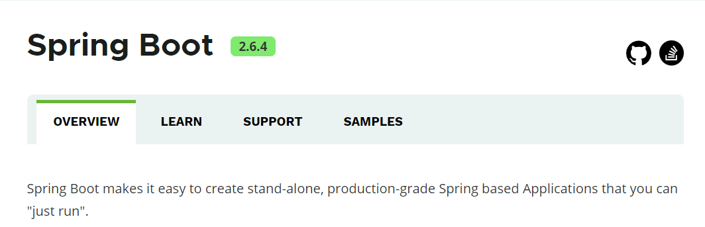

翻译：通过Spring Boot，可以轻松地创建独立的，基于生产级别的基于Spring的应用程序，并且可以“运行”它们

其实Spring Boot 的设计是为了让你尽可能快的跑起来 Spring 应用程序并且尽可能减少你的配置文件。

**以下内容来自百度百科**

SpringBoot是由Pivotal团队在2013年开始研发、2014年4月发布第一个版本的全新开源的轻量级框架。它基于Spring4.0设计，不仅继承了Spring框架原有的优秀特性，而且还通过简化配置来进一步简化了Spring应用的整个搭建和开发过程。另外SpringBoot通过集成大量的框架使得依赖包的版本冲突，以及引用的不稳定性等问题得到了很好的解决

 

### SpringBoot主要特性

1、 SpringBoot Starter：他将常用的依赖分组进行了整合，将其合并到一个依赖中，这样就可以一次性添加到项目的Maven或Gradle构建中；

2、 使编码变得简单，SpringBoot采用 JavaConfig的方式对Spring进行配置，并且提供了大量的注解，极大的提高了工作效率。

3、 自动配置：SpringBoot的自动配置特性利用了Spring对条件化配置的支持，合理地推测应用所需的bean并自动化配置他们；

4、 使部署变得简单，SpringBoot内置了三种Servlet容器，Tomcat，Jetty,undertow.我们只需要一个Java的运行环境就可以跑SpringBoot的项目了，SpringBoot的项目可以打成一个jar包。

 

## 1 SpringBoot源码环境构建

### 1.1 下载源码

- https://github.com/spring-projects/spring-boot/releases 
- 下载对应版本的源码（课程中采用spring-boot-2.2.9.RELEASE）


### 1.2 环境准备

1、JDK1.8+

2、Maven3.5+

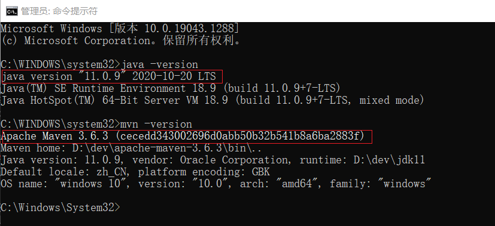

 

### 1.2 编译源码

- 进⼊spring-boot源码根⽬录
- 执⾏mvn命令:  **mvn clean install -DskipTests -Pfast**  // 跳过测试⽤例，会下载⼤量 jar 包（时间会长一些）

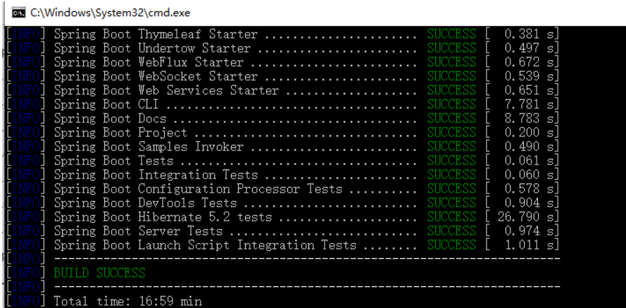

 

### 1.3 导入IDEA

将编译后的项目导入IDEA中

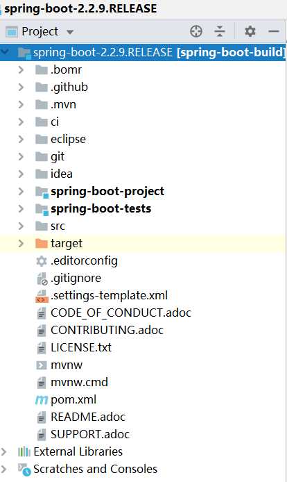

 

打开pom.xml关闭maven代码检查

```xml
<properties>
        <revision>2.2.9.RELEASE</revision>
        <main.basedir>${basedir}</main.basedir>
        <disable.checks>true</disable.checks>
</properties>
```

### 1.4 新建一个module

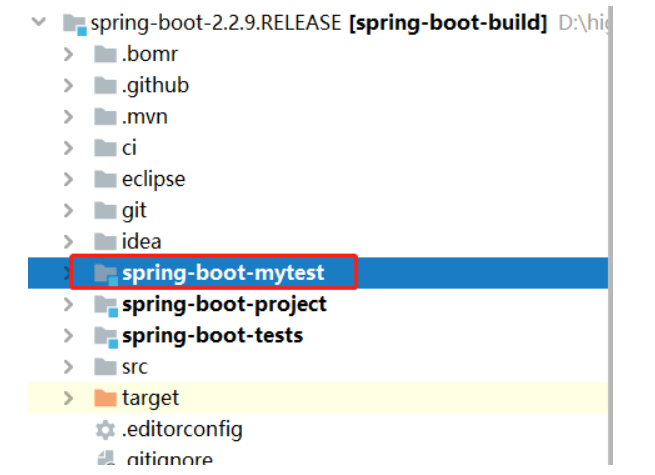

### 1.5 新建一个Controller

```java
@RestController
public class TestController {

   @RequestMapping("/test")
   public String test(){
      System.out.println("源码环境搭建完成");
      return "源码环境搭建完成";
   }
   
}
```

启动测试

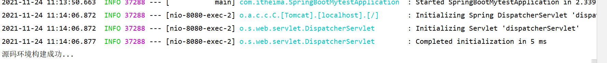

## 2 源码剖析-依赖管理

​	**问题：（1）为什么导入dependency时不需要指定版本？**

​      在Spring Boot入门程序中，项目pom.xml文件有两个核心依赖，分别是spring-boot-starter-parent和spring-boot-starter-web，关于这两个依赖的相关介绍具体如下

### spring-boot-starter-parent

在chapter01项目中的pom.xml文件中找到spring-boot-starter-parent依赖，示例代码如下:

```xml
<!-- Spring Boot父项目依赖管理 -->
    <parent>
        <groupId>org.springframework.boot</groupId>
        <artifactId>spring-boot-starter-parent</artifactId>
        <version>2.2.9.RELEASE</version>
        <relativePath/> <!-- lookup parent from repository -->
    </parent>
```

​         上述代码中，将spring-boot-starter-parent依赖作为Spring Boot项目的统一父项目依赖管理，并将项目版本号统一为2.2.9.RELEASE，该版本号根据实际开发需求是可以修改的    

​         使用“Ctrl+鼠标左键”进入并查看spring-boot-starter-parent底层源文件，先看spring-boot-starter-parent做了哪些事

首先看`spring-boot-starter-parent`的`properties`节点

```xml
<properties>
        <main.basedir>${basedir}/../../..</main.basedir>
        <java.version>1.8</java.version>
        <resource.delimiter>@</resource.delimiter> <!-- delimiter that doesn't clash with Spring ${} placeholders -->
        <project.build.sourceEncoding>UTF-8</project.build.sourceEncoding>
        <project.reporting.outputEncoding>UTF-8</project.reporting.outputEncoding>
        <maven.compiler.source>${java.version}</maven.compiler.source>
        <maven.compiler.target>${java.version}</maven.compiler.target>
    </properties>
```

在这里`spring-boot-starter-parent`定义了：

1. 工程的Java版本为`1.8`。
2. 工程代码的编译源文件编码格式为`UTF-8`
3. 工程编译后的文件编码格式为`UTF-8`
4. Maven打包编译的版本

 

再来看`spring-boot-starter-parent`的「build」节点

接下来看POM的`build`节点，分别定义了`resources`资源和`pluginManagement`

```xml
    <resources>
      <resource>
        <filtering>true</filtering>
        <directory>${basedir}/src/main/resources</directory>
        <includes>
          <include>**/application*.yml</include>
          <include>**/application*.yaml</include>
          <include>**/application*.properties</include>
        </includes>
      </resource>
      <resource>
        <directory>${basedir}/src/main/resources</directory>
        <excludes>
          <exclude>**/application*.yml</exclude>
          <exclude>**/application*.yaml</exclude>
          <exclude>**/application*.properties</exclude>
        </excludes>
      </resource>
    </resources>
```

我们详细看一下`resources`节点，里面定义了资源过滤，针对`application`的`yml`、`properties`格式进行了过滤，可以支持支持不同环境的配置，比如`application-dev.yml`、`application-test.yml`、`application-dev.properties`、`application-dev.properties`等等。

`pluginManagement`则是引入了相应的插件和对应的版本依赖

 

最后来看spring-boot-starter-parent的父依赖`spring-boot-dependencies`

spring-boot-dependencies的properties节点

我们看定义POM，这个才是SpringBoot项目的真正管理依赖的项目，里面定义了SpringBoot相关的版本

```xml
<properties>
        <main.basedir>${basedir}/../..</main.basedir>
        <!-- Dependency versions -->
        <activemq.version>5.15.13</activemq.version>
        <antlr2.version>2.7.7</antlr2.version>
        <appengine-sdk.version>1.9.81</appengine-sdk.version>
        <artemis.version>2.10.1</artemis.version>
        <aspectj.version>1.9.6</aspectj.version>
        <assertj.version>3.13.2</assertj.version>
        <atomikos.version>4.0.6</atomikos.version>
        <awaitility.version>4.0.3</awaitility.version>
        <bitronix.version>2.1.4</bitronix.version>
        <byte-buddy.version>1.10.13</byte-buddy.version>
        <caffeine.version>2.8.5</caffeine.version>
        <cassandra-driver.version>3.7.2</cassandra-driver.version>
        <classmate.version>1.5.1</classmate.version>
        .......
</properties>       
```

spring-boot-dependencies的dependencyManagement节点

在这里，dependencies定义了SpringBoot版本的依赖的组件以及相应版本。

```xml
<dependencyManagement>
        <dependencies>
            <!-- Spring Boot -->
            <dependency>
                <groupId>org.springframework.boot</groupId>
                <artifactId>spring-boot</artifactId>
                <version>${revision}</version>
            </dependency>
            <dependency>
                <groupId>org.springframework.boot</groupId>
                <artifactId>spring-boot-test</artifactId>
                <version>${revision}</version>
            </dependency>
            <dependency>
                <groupId>org.springframework.boot</groupId>
                <artifactId>spring-boot-test-autoconfigure</artifactId>
                <version>${revision}</version>
            </dependency>
            <dependency>
                <groupId>org.springframework.boot</groupId>
                <artifactId>spring-boot-actuator</artifactId>
                <version>${revision}</version>
            </dependency>
            <dependency>
                <groupId>org.springframework.boot</groupId>
                <artifactId>spring-boot-actuator-autoconfigure</artifactId>
                <version>${revision}</version>
            </dependency>
            ....
</dependencyManagement>         
```

`spring-boot-starter-parent`通过继承`spring-boot-dependencies`从而实现了SpringBoot的版本依赖管理,所以我们的SpringBoot工程继承spring-boot-starter-parent后已经具备版本锁定等配置了,这也就是在 Spring Boot 项目中**部分依赖**不需要写版本号的原因

 

**（2）问题2： spring-boot-starter-parent父依赖启动器的主要作用是进行版本统一管理，那么项目运行依赖的JAR包是从何而来的？**

### spring-boot-starter-web

​    查看spring-boot-starter-web依赖文件源码，核心代码具体如下

```xml
        <dependency>
            <groupId>org.springframework.boot</groupId>
            <artifactId>spring-boot-starter-tomcat</artifactId>
        </dependency>
        <dependency>
            <groupId>org.springframework.boot</groupId>
            <artifactId>spring-boot-starter-validation</artifactId>
            <exclusions>
                <exclusion>
                    <groupId>org.apache.tomcat.embed</groupId>
                    <artifactId>tomcat-embed-el</artifactId>
                </exclusion>
            </exclusions>
        </dependency>
        <dependency>
            <groupId>org.springframework</groupId>
            <artifactId>spring-web</artifactId>
        </dependency>
        <dependency>
            <groupId>org.springframework</groupId>
            <artifactId>spring-webmvc</artifactId>
        </dependency>
    </dependencies>
```

从上述代码可以发现，spring-boot-starter-web依赖启动器的主要作用是打包了Web开发场景所需的底层所有依赖（基于依赖传递，当前项目也存在对应的依赖jar包）

正是如此，在pom.xml中引入spring-boot-starter-web依赖启动器时，就可以实现Web场景开发，而不需要额外导入Tomcat服务器以及其他Web依赖文件等。

当然，这些引入的依赖文件的版本号还是由spring-boot-starter-parent父依赖进行的统一管理。

 

​         Spring Boot除了提供有上述介绍的Web依赖启动器外，还提供了其他许多开发场景的相关依赖，我们可以打开Spring Boot官方文档，搜索“Starters”关键字查询场景依赖启动器

 


列出了Spring Boot官方提供的部分场景依赖启动器，这些依赖启动器适用于不同的场景开发，使用时只需要在pom.xml文件中导入对应的依赖启动器即可。

需要说明的是，Spring Boot官方并不是针对所有场景开发的技术框架都提供了场景启动器，例如阿里巴巴的Druid数据源等，Spring Boot官方就没有提供对应的依赖启动器。为了充分利用Spring Boot框架的优势，在Spring Boot官方没有整合这些技术框架的情况下，Druid等技术框架所在的开发团队主动与Spring Boot框架进行了整合，实现了各自的依赖启动器，例如druid-spring-boot-starter等。我们在pom.xml文件中引入这些第三方的依赖启动器时，切记要配置对应的版本号  

 

## 3 源码剖析-自动配置

自动配置：根据我们添加的jar包依赖，会自动将一些配置类的bean注册进ioc容器，我们可以需要的地方使用@Autowired或者@Resource等注解来使用它。

**问题：Spring Boot到底是如何进行自动配置的，都把哪些组件进行了自动配置？**

Spring Boot应用的启动入口是@SpringBootApplication注解标注类中的main()方法，       

  `@SpringBootApplication`：`SpringBoot`应用标注在某个类上说明这个类是`SpringBoot`的主配置类，`SpringBoot`就应该运行这个类的`main()`方法启动`SpringBoot`应用。

### @SpringBootApplication

下面，查看@SpringBootApplication内部源码进行分析 ，核心代码具体如下

```java
@Target({ElementType.TYPE}) //注解的适用范围,Type表示注解可以描述在类、接口、注解或枚举中
@Retention(RetentionPolicy.RUNTIME) //表示注解的生命周期，Runtime运行时
@Documented //表示注解可以记录在javadoc中
@Inherited  //表示可以被子类继承该注解
@SpringBootConfiguration     // 标明该类为配置类
@EnableAutoConfiguration     // 启动自动配置功能
@ComponentScan(excludeFilters = { @Filter(type = FilterType.CUSTOM, classes = TypeExcludeFilter.class),
        @Filter(type = FilterType.CUSTOM, classes = AutoConfigurationExcludeFilter.class) })
public @interface SpringBootApplication {

    // 根据class来排除特定的类，使其不能加入spring容器，传入参数value类型是class类型。
    @AliasFor(annotation = EnableAutoConfiguration.class)
    Class<?>[] exclude() default {};

    // 根据classname 来排除特定的类，使其不能加入spring容器，传入参数value类型是class的全类名字符串数组。
    @AliasFor(annotation = EnableAutoConfiguration.class)
    String[] excludeName() default {};

    // 指定扫描包，参数是包名的字符串数组。
    @AliasFor(annotation = ComponentScan.class, attribute = "basePackages")
    String[] scanBasePackages() default {};

    // 扫描特定的包，参数类似是Class类型数组。
    @AliasFor(annotation = ComponentScan.class, attribute = "basePackageClasses")
    Class<?>[] scanBasePackageClasses() default {};

}
```

 从上述源码可以看出，@SpringBootApplication注解是一个组合注解，前面 4 个是注解的元数据信息， 我们主要看后面 3 个注解：@SpringBootConfiguration、@EnableAutoConfiguration、@ComponentScan三个核心注解，关于这三个核心注解的相关说明具体如下

 

### @SpringBootConfiguration

`@SpringBootConfiguration`：`SpringBoot`的配置类，标注在某个类上，表示这是一个`SpringBoot`的配置类。

查看@SpringBootConfiguration注解源码，核心代码具体如下。 

```java
@Target({ElementType.TYPE})
@Retention(RetentionPolicy.RUNTIME)
@Documented

@Configuration // 配置类的作用等同于配置文件，配置类也是容器中的一个对象
public @interface SpringBootConfiguration {
}
```

 从上述源码可以看出，@SpringBootConfiguration注解内部有一个核心注解@Configuration，该注解是Spring框架提供的，表示当前类为一个配置类（XML配置文件的注解表现形式），并可以被组件扫描器扫描。由此可见，@SpringBootConfiguration注解的作用与@Configuration注解相同，都是标识一个可以被组件扫描器扫描的配置类，只不过@SpringBootConfiguration是被Spring Boot进行了重新封装命名而已  

 

### @EnableAutoConfiguration

```java
package org.springframework.boot.autoconfigure;

// 自动配置包
@AutoConfigurationPackage

// Spring的底层注解@Import，给容器中导入一个组件；
// 导入的组件是AutoConfigurationPackages.Registrar.class 
@Import(AutoConfigurationImportSelector.class)

// 告诉SpringBoot开启自动配置功能，这样自动配置才能生效。
public @interface EnableAutoConfiguration {

    String ENABLED_OVERRIDE_PROPERTY = "spring.boot.enableautoconfiguration";

    // 返回不会被导入到 Spring 容器中的类
    Class<?>[] exclude() default {};

    // 返回不会被导入到 Spring 容器中的类名
    String[] excludeName() default {};

}
```

 `Spring` 中有很多以`Enable`开头的注解，其作用就是借助`@Import`来收集并注册特定场景相关的`Bean`，并加载到`IOC`容器。

@EnableAutoConfiguration就是借助@Import来收集所有符合自动配置条件的bean定义，并加载到IoC容器。

 

 

#### @AutoConfigurationPackage

```java
package org.springframework.boot.autoconfigure;

@Import(AutoConfigurationPackages.Registrar.class) // 导入Registrar中注册的组件
public @interface AutoConfigurationPackage {

}
```

 `@AutoConfigurationPackage`：自动配置包，它也是一个组合注解，其中最重要的注解是`@Import(AutoConfigurationPackages.Registrar.class)`，它是`Spring`框架的底层注解，它的作用就是给容器中导入某个组件类，例如`@Import(AutoConfigurationPackages.Registrar.class)`，它就是将`Registrar`这个组件类导入到容器中，可查看`Registrar`类中`registerBeanDefinitions`方法：

```java
@Override
public void registerBeanDefinitions(AnnotationMetadata metadata, BeanDefinitionRegistry registry) {
    // 将注解标注的元信息传入，获取到相应的包名
    register(registry, new PackageImport(metadata).getPackageName());
}
```

我们对`new PackageImport(metadata).getPackageName()`进行检索，看看其结果是什么？

可以发现，结果是：com.itheima  是包名

再看register方法

```java
    public static void register(BeanDefinitionRegistry registry, String... packageNames) {
        // 这里参数 packageNames 缺省情况下就是一个字符串，是使用了注解
        // @SpringBootApplication 的 Spring Boot 应用程序入口类所在的包
        
        if (registry.containsBeanDefinition(BEAN)) {
            // 如果该bean已经注册，则将要注册包名称添加进去
            BeanDefinition beanDefinition = registry.getBeanDefinition(BEAN);
            ConstructorArgumentValues constructorArguments = beanDefinition
                    .getConstructorArgumentValues();
            constructorArguments.addIndexedArgumentValue(0,
                    addBasePackages(constructorArguments, packageNames));
        }
        else {
            //如果该bean尚未注册，则注册该bean，参数中提供的包名称会被设置到bean定义中去
            GenericBeanDefinition beanDefinition = new GenericBeanDefinition();
            beanDefinition.setBeanClass(BasePackages.class);
            beanDefinition.getConstructorArgumentValues().addIndexedArgumentValue(0,
                    packageNames);
            beanDefinition.setRole(BeanDefinition.ROLE_INFRASTRUCTURE);
            registry.registerBeanDefinition(BEAN, beanDefinition);
        }
    }
```

AutoConfigurationPackages.Registrar这个类就干一个事，注册一个`Bean`，这个`Bean`就是`org.springframework.boot.autoconfigure.AutoConfigurationPackages.BasePackages`，它有一个参数，这个参数是使用了`@AutoConfigurationPackage`这个注解的类所在的包路径,保存自动配置类以供之后的使用，比如给`JPA entity`扫描器用来扫描开发人员通过注解`@Entity`定义的`entity`类。

 

#### @Import(AutoConfigurationImportSelector.class)

​    `@Import({AutoConfigurationImportSelector.class})`：将`AutoConfigurationImportSelector`这个类导入到`Spring`容器中，`AutoConfigurationImportSelector`可以帮助`Springboot`应用将所有符合条件的`@Configuration`配置都加载到当前`SpringBoot`创建并使用的`IOC`容器(`ApplicationContext`)中。


 可以看到`AutoConfigurationImportSelector`重点是实现了`DeferredImportSelector`接口和各种`Aware`接口，然后`DeferredImportSelector`接口又继承了`ImportSelector`接口。

  其不光实现了`ImportSelector`接口，还实现了很多其它的`Aware`接口，分别表示在某个时机会被回调。

**确定自动配置实现逻辑的入口方法：**

跟自动配置逻辑相关的入口方法在**`DeferredImportSelectorGrouping`**类的**`getImports`**方法处，因此我们就从`DeferredImportSelectorGrouping`类的`getImports`方法来开始分析SpringBoot的自动配置源码好了。

先看一下`getImports`方法代码：

```java
// ConfigurationClassParser.java

public Iterable<Group.Entry> getImports() {
    // 遍历DeferredImportSelectorHolder对象集合deferredImports，deferredImports集合装了各种ImportSelector，当然这里装的是AutoConfigurationImportSelector
    for (DeferredImportSelectorHolder deferredImport : this.deferredImports) {
        // 【1】，利用AutoConfigurationGroup的process方法来处理自动配置的相关逻辑，决定导入哪些配置类（这个是我们分析的重点，自动配置的逻辑全在这了）
        this.group.process(deferredImport.getConfigurationClass().getMetadata(),
                deferredImport.getImportSelector());
    }
    // 【2】，经过上面的处理后，然后再进行选择导入哪些配置类
    return this.group.selectImports();
}
```

标`【1】`处的的代码是我们分析的**重中之重**，自动配置的相关的绝大部分逻辑全在这里了。那么`this.group.process(deferredImport.getConfigurationClass().getMetadata(), deferredImport.getImportSelector())`；主要做的事情就是在**`this.group`即`AutoConfigurationGroup`**对象的**`process`**方法中，传入的`AutoConfigurationImportSelector`对象来选择一些符合条件的自动配置类，过滤掉一些不符合条件的自动配置类，就是这么个事情。

```
注：
AutoConfigurationGroup：是AutoConfigurationImportSelector的内部类，主要用来处理自动配置相关的逻辑，拥有process和selectImports方法，然后拥有entries和autoConfigurationEntries集合属性，这两个集合分别存储被处理后的符合条件的自动配置类，我们知道这些就足够了；
AutoConfigurationImportSelector：承担自动配置的绝大部分逻辑，负责选择一些符合条件的自动配置类；
metadata:标注在SpringBoot启动类上的@SpringBootApplication注解元数据
标【2】的this.group.selectImports的方法主要是针对前面的process方法处理后的自动配置类再进一步有选择的选择导入
```

再进入到AutoConfigurationImportSelector$AutoConfigurationGroup的process方法：

------

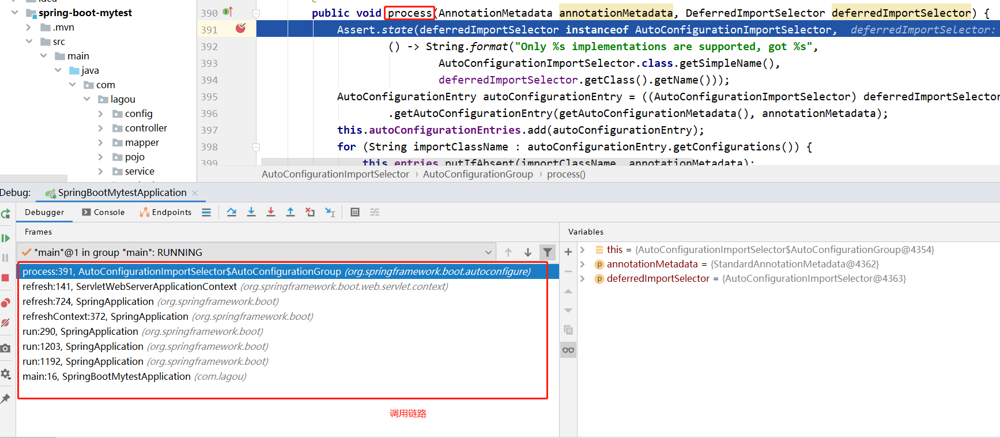

通过图中我们可以看到，跟自动配置逻辑相关的入口方法在process方法中

**分析自动配置的主要逻辑**

```java
// AutoConfigurationImportSelector$AutoConfigurationGroup.java

// 这里用来处理自动配置类，比如过滤掉不符合匹配条件的自动配置类
public void process(AnnotationMetadata annotationMetadata,
        DeferredImportSelector deferredImportSelector) {
    Assert.state(
            deferredImportSelector instanceof AutoConfigurationImportSelector,
            () -> String.format("Only %s implementations are supported, got %s",
                    AutoConfigurationImportSelector.class.getSimpleName(),
                    deferredImportSelector.getClass().getName()));
    // 【1】,调用getAutoConfigurationEntry方法得到自动配置类放入autoConfigurationEntry对象中
    AutoConfigurationEntry autoConfigurationEntry = ((AutoConfigurationImportSelector) deferredImportSelector)
            .getAutoConfigurationEntry(getAutoConfigurationMetadata(),
                    annotationMetadata);
    // 【2】，又将封装了自动配置类的autoConfigurationEntry对象装进autoConfigurationEntries集合
    this.autoConfigurationEntries.add(autoConfigurationEntry); 
    // 【3】，遍历刚获取的自动配置类
    for (String importClassName : autoConfigurationEntry.getConfigurations()) {
        // 这里符合条件的自动配置类作为key，annotationMetadata作为值放进entries集合
        this.entries.putIfAbsent(importClassName, annotationMetadata); 
    }
}
```

上面代码中我们再来看标`【1】`的方法`getAutoConfigurationEntry`，这个方法主要是用来获取自动配置类有关，承担了自动配置的主要逻辑。直接上代码：

```java
// AutoConfigurationImportSelector.java

// 获取符合条件的自动配置类，避免加载不必要的自动配置类从而造成内存浪费
protected AutoConfigurationEntry getAutoConfigurationEntry(
        AutoConfigurationMetadata autoConfigurationMetadata,
        AnnotationMetadata annotationMetadata) {
    // 获取是否有配置spring.boot.enableautoconfiguration属性，默认返回true
    if (!isEnabled(annotationMetadata)) {
        return EMPTY_ENTRY;
    }
    // 获得@Congiguration标注的Configuration类即被审视introspectedClass的注解数据，
    // 比如：@SpringBootApplication(exclude = FreeMarkerAutoConfiguration.class)
    // 将会获取到exclude = FreeMarkerAutoConfiguration.class和excludeName=""的注解数据
    AnnotationAttributes attributes = getAttributes(annotationMetadata);
    // 【1】得到spring.factories文件配置的所有自动配置类
    List<String> configurations = getCandidateConfigurations(annotationMetadata,
            attributes);
    // 利用LinkedHashSet移除重复的配置类
    configurations = removeDuplicates(configurations);
    // 得到要排除的自动配置类，比如注解属性exclude的配置类
    // 比如：@SpringBootApplication(exclude = FreeMarkerAutoConfiguration.class)
    // 将会获取到exclude = FreeMarkerAutoConfiguration.class的注解数据
    Set<String> exclusions = getExclusions(annotationMetadata, attributes);
    // 检查要被排除的配置类，因为有些不是自动配置类，故要抛出异常
    checkExcludedClasses(configurations, exclusions);
    // 【2】将要排除的配置类移除
    configurations.removeAll(exclusions);
    // 【3】因为从spring.factories文件获取的自动配置类太多，如果有些不必要的自动配置类都加载进内存，会造成内存浪费，因此这里需要进行过滤
    // 注意这里会调用AutoConfigurationImportFilter的match方法来判断是否符合@ConditionalOnBean,@ConditionalOnClass或@ConditionalOnWebApplication，后面会重点分析一下
    configurations = filter(configurations, autoConfigurationMetadata);
    // 【4】获取了符合条件的自动配置类后，此时触发AutoConfigurationImportEvent事件，
    // 目的是告诉ConditionEvaluationReport条件评估报告器对象来记录符合条件的自动配置类
    // 该事件什么时候会被触发？--> 在刷新容器时调用invokeBeanFactoryPostProcessors后置处理器时触发
    fireAutoConfigurationImportEvents(configurations, exclusions);
    // 【5】将符合条件和要排除的自动配置类封装进AutoConfigurationEntry对象，并返回
    return new AutoConfigurationEntry(configurations, exclusions); 
}
```

##### 深入 getCandidateConfigurations 方法

这个方法中有一个重要方法`loadFactoryNames`，这个方法是让`SpringFactoryLoader`去加载一些组件的名字。

```java
    protected List<String> getCandidateConfigurations(AnnotationMetadata metadata, AnnotationAttributes attributes) {
     // 这个方法需要传入两个参数getSpringFactoriesLoaderFactoryClass()和getBeanClassLoader()
     // getSpringFactoriesLoaderFactoryClass()这个方法返回的是EnableAutoConfiguration.class
     // getBeanClassLoader()这个方法返回的是beanClassLoader（类加载器）
        List<String> configurations = SpringFactoriesLoader.loadFactoryNames(getSpringFactoriesLoaderFactoryClass(),
                getBeanClassLoader());
        Assert.notEmpty(configurations, "No auto configuration classes found in META-INF/spring.factories. If you "
                + "are using a custom packaging, make sure that file is correct.");
        return configurations;
```

 继续点开`loadFactory`方法

```java
public static List<String> loadFactoryNames(Class<?> factoryClass, @Nullable ClassLoader classLoader) {
        
        //获取出入的键
        String factoryClassName = factoryClass.getName();
        return (List)loadSpringFactories(classLoader).getOrDefault(factoryClassName, Collections.emptyList());
    }

    private static Map<String, List<String>> loadSpringFactories(@Nullable ClassLoader classLoader) {
        MultiValueMap<String, String> result = (MultiValueMap)cache.get(classLoader);
        if (result != null) {
            return result;
        } else {
            try {
              
                //如果类加载器不为null，则加载类路径下spring.factories文件，将其中设置的配置类的全路径信息封装 为Enumeration类对象
                Enumeration<URL> urls = classLoader != null ? classLoader.getResources("META-INF/spring.factories") : ClassLoader.getSystemResources("META-INF/spring.factories");
                LinkedMultiValueMap result = new LinkedMultiValueMap();

                //循环Enumeration类对象，根据相应的节点信息生成Properties对象，通过传入的键获取值，在将值切割为一个个小的字符串转化为Array，方法result集合中
                while(urls.hasMoreElements()) {
                    URL url = (URL)urls.nextElement();
                    UrlResource resource = new UrlResource(url);
                    Properties properties = PropertiesLoaderUtils.loadProperties(resource);
                    Iterator var6 = properties.entrySet().iterator();

                    while(var6.hasNext()) {
                        Entry<?, ?> entry = (Entry)var6.next();
                        String factoryClassName = ((String)entry.getKey()).trim();
                        String[] var9 = StringUtils.commaDelimitedListToStringArray((String)entry.getValue());
                        int var10 = var9.length;

                        for(int var11 = 0; var11 < var10; ++var11) {
                            String factoryName = var9[var11];
                            result.add(factoryClassName, factoryName.trim());
                        }
                    }
                }

                cache.put(classLoader, result);
                return result;
       }
   }
}
```

从代码中我们可以知道，在这个方法中会遍历整个ClassLoader中所有jar包下的spring.factories文件。

spring.factories里面保存着springboot的默认提供的自动配置类。

**META-INF/spring.factories**

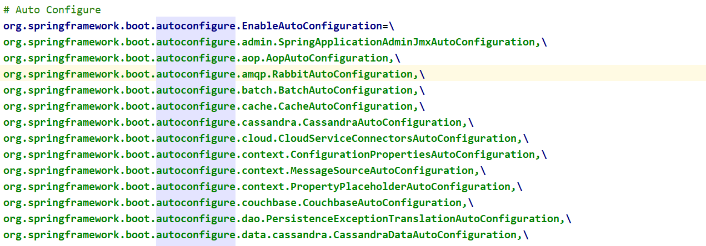

 

`AutoConfigurationEntry`方法主要做的事情就是获取符合条件的自动配置类，避免加载不必要的自动配置类从而造成内存浪费。我们下面总结下`AutoConfigurationEntry`方法主要做的事情：

【1】从`spring.factories`配置文件中加载`EnableAutoConfiguration`自动配置类）,获取的自动配置类如图所示。

【2】若`@EnableAutoConfiguration`等注解标有要`exclude`的自动配置类，那么再将这个自动配置类排除掉；

【3】排除掉要`exclude`的自动配置类后，然后再调用`filter`方法进行进一步的过滤，再次排除一些不符合条件的自动配置类；

【4】经过重重过滤后，此时再触发`AutoConfigurationImportEvent`事件，告诉`ConditionEvaluationReport`条件评估报告器对象来记录符合条件的自动配置类；

【5】 最后再将符合条件的自动配置类返回。

总结了`AutoConfigurationEntry`方法主要的逻辑后，我们再来细看一下`AutoConfigurationImportSelector`的`filter`方法：

```java
// AutoConfigurationImportSelector.java

private List<String> filter(List<String> configurations,
            AutoConfigurationMetadata autoConfigurationMetadata) {
    long startTime = System.nanoTime();
    // 将从spring.factories中获取的自动配置类转出字符串数组
    String[] candidates = StringUtils.toStringArray(configurations);
    // 定义skip数组，是否需要跳过。注意skip数组与candidates数组顺序一一对应
    boolean[] skip = new boolean[candidates.length];
    boolean skipped = false;
    // getAutoConfigurationImportFilters方法：拿到OnBeanCondition，OnClassCondition和OnWebApplicationCondition
    // 然后遍历这三个条件类去过滤从spring.factories加载的大量配置类
    for (AutoConfigurationImportFilter filter : getAutoConfigurationImportFilters()) {
        // 调用各种aware方法，将beanClassLoader,beanFactory等注入到filter对象中，
        // 这里的filter对象即OnBeanCondition，OnClassCondition或OnWebApplicationCondition
        invokeAwareMethods(filter);
        // 判断各种filter来判断每个candidate（这里实质要通过candidate(自动配置类)拿到其标注的
        // @ConditionalOnClass,@ConditionalOnBean和@ConditionalOnWebApplication里面的注解值）是否匹配，
        // 注意candidates数组与match数组一一对应
        /**********************【主线，重点关注】********************************/
        boolean[] match = filter.match(candidates, autoConfigurationMetadata);
        // 遍历match数组，注意match顺序跟candidates的自动配置类一一对应
        for (int i = 0; i < match.length; i++) {
            // 若有不匹配的话
            if (!match[i]) {
                // 不匹配的将记录在skip数组，标志skip[i]为true，也与candidates数组一一对应
                skip[i] = true;
                // 因为不匹配，将相应的自动配置类置空
                candidates[i] = null;
                // 标注skipped为true
                skipped = true; 
            }
        }
    } 
    // 这里表示若所有自动配置类经过OnBeanCondition，OnClassCondition和OnWebApplicationCondition过滤后，全部都匹配的话，则全部原样返回
    if (!skipped) {
        return configurations;
    }
    // 建立result集合来装匹配的自动配置类
    List<String> result = new ArrayList<>(candidates.length); 
    for (int i = 0; i < candidates.length; i++) {
        // 若skip[i]为false，则说明是符合条件的自动配置类，此时添加到result集合中
        if (!skip[i]) { 
            result.add(candidates[i]);
        }
    }
    // 打印日志
    if (logger.isTraceEnabled()) {
        int numberFiltered = configurations.size() - result.size();
        logger.trace("Filtered " + numberFiltered + " auto configuration class in "
                + TimeUnit.NANOSECONDS.toMillis(System.nanoTime() - startTime)
                + " ms");
    }
    // 最后返回符合条件的自动配置类
    return new ArrayList<>(result);
}
```

**`AutoConfigurationImportSelector`**的**`filter`**方法主要做的事情就是**调用`AutoConfigurationImportFilter`接口的`match`方法来判断每一个自动配置类上的条件注解（若有的话）**`@ConditionalOnClass`,`@ConditionalOnBean`或`@ConditionalOnWebApplication`是**否满足条件，若满足，则返回true，说明匹配，若不满足，则返回false说明不匹配**。

我们现在知道`AutoConfigurationImportSelector`的`filter`方法主要做了什么事情就行了，现在先不用研究的过深

 

#### 关于条件注解的讲解

@Conditional是Spring4新提供的注解，它的作用是按照一定的条件进行判断，满足条件给容器注册bean。

- @ConditionalOnBean：仅仅在当前上下文中存在某个对象时，才会实例化一个Bean。
- @ConditionalOnClass：某个class位于类路径上，才会实例化一个Bean。
- @ConditionalOnExpression：当表达式为true的时候，才会实例化一个Bean。基于SpEL表达式的条件判断。
- @ConditionalOnMissingBean：仅仅在当前上下文中不存在某个对象时，才会实例化一个Bean。
- @ConditionalOnMissingClass：某个class类路径上不存在的时候，才会实例化一个Bean。
- @ConditionalOnNotWebApplication：不是web应用，才会实例化一个Bean。
- @ConditionalOnWebApplication：当项目是一个Web项目时进行实例化。
- @ConditionalOnNotWebApplication：当项目不是一个Web项目时进行实例化。
- @ConditionalOnProperty：当指定的属性有指定的值时进行实例化。
- @ConditionalOnJava：当JVM版本为指定的版本范围时触发实例化。
- @ConditionalOnResource：当类路径下有指定的资源时触发实例化。
- @ConditionalOnJndi：在JNDI存在的条件下触发实例化。
- @ConditionalOnSingleCandidate：当指定的Bean在容器中只有一个，或者有多个但是指定了首选的Bean时触发实例化。

 

**有选择的导入自动配置类**

`this.group.selectImports`方法是如何进一步有选择的导入自动配置类的。直接看代码：

```java
// AutoConfigurationImportSelector$AutoConfigurationGroup.java

public Iterable<Entry> selectImports() {
    if (this.autoConfigurationEntries.isEmpty()) {
        return Collections.emptyList();
    } 
    // 这里得到所有要排除的自动配置类的set集合
    Set<String> allExclusions = this.autoConfigurationEntries.stream()
            .map(AutoConfigurationEntry::getExclusions)
            .flatMap(Collection::stream).collect(Collectors.toSet());
    // 这里得到经过滤后所有符合条件的自动配置类的set集合
    Set<String> processedConfigurations = this.autoConfigurationEntries.stream() 
            .map(AutoConfigurationEntry::getConfigurations)
            .flatMap(Collection::stream)
            .collect(Collectors.toCollection(LinkedHashSet::new));
    // 移除掉要排除的自动配置类
    processedConfigurations.removeAll(allExclusions); 
    // 对标注有@Order注解的自动配置类进行排序，
    return sortAutoConfigurations(processedConfigurations,
            getAutoConfigurationMetadata())
                    .stream()
                    .map((importClassName) -> new Entry(
                            this.entries.get(importClassName), importClassName))
                    .collect(Collectors.toList());
}
```

可以看到，`selectImports`方法主要是针对经过排除掉**`exclude`**的和被`AutoConfigurationImportFilter`接口过滤后的满足条件的自动配置**类再进一步排除`exclude`的自动配置类**，然后再排序

 

最后，**我们再总结下SpringBoot自动配置的原理**，主要做了以下事情：

1. **从spring.factories配置文件中加载自动配置类；**
2. **加载的自动配置类中排除掉`@EnableAutoConfiguration`注解的`exclude`属性指定的自动配置类；**
3. **然后再用`AutoConfigurationImportFilter`接口去过滤自动配置类是否符合其标注注解（若有标注的话）`@ConditionalOnClass`,`@ConditionalOnBean`和`@ConditionalOnWebApplication`的条件，若都符合的话则返回匹配结果；**
4. **然后触发`AutoConfigurationImportEvent`事件，告诉`ConditionEvaluationReport`条件评估报告器对象来分别记录符合条件和`exclude`的自动配置类。**
5. **最后spring再将最后筛选后的自动配置类导入IOC容器中**

​      

 

#### 以`HttpEncodingAutoConfiguration`（`Http`编码自动配置）为例解释自动配置原理

```java
// 表示这是一个配置类，和以前编写的配置文件一样，也可以给容器中添加组件
@Configuration

// 启动指定类的ConfigurationProperties功能；将配置文件中对应的值和HttpEncodingProperties绑定起来；
@EnableConfigurationProperties({HttpEncodingProperties.class}) 

// Spring底层@Conditional注解，根据不同的条件，如果满足指定的条件，整个配置类里面的配置就会生效。
// 判断当前应用是否是web应用，如果是，当前配置类生效。并把HttpEncodingProperties加入到 ioc 容器中
@ConditionalOnWebApplication

// 判断当前项目有没有这个CharacterEncodingFilter ： SpringMVC中进行乱码解决的过滤器
@ConditionalOnClass({CharacterEncodingFilter.class})

// 判断配置文件中是否存在某个配置 spring.http.encoding.enabled 如果不存在，判断也是成立的
// matchIfMissing = true 表示即使我们配置文件中不配置spring.http.encoding.enabled=true，也是默认生效的
@ConditionalOnProperty(
    prefix = "spring.http.encoding",
    value = {"enabled"},
    matchIfMissing = true
)
public class HttpEncodingAutoConfiguration {
    
    // 它已经和SpringBoot配置文件中的值进行映射了
    private final HttpEncodingProperties properties;
    
    // 只有一个有参构造器的情况下，参数的值就会从容器中拿
    public HttpEncodingAutoConfiguration(HttpEncodingProperties properties) {
        this.properties = properties;
    }
    
    @Bean   //给容器中添加一个组件，这个组件中的某些值需要从properties中获取
    @ConditionalOnMissingBean({CharacterEncodingFilter.class})  //判断容器中没有这个组件
    public CharacterEncodingFilter characterEncodingFilter() {
        CharacterEncodingFilter filter = new OrderedCharacterEncodingFilter();
        filter.setEncoding(this.properties.getCharset().name());
        filter.setForceRequestEncoding(this.properties.shouldForce(Type.REQUEST));
        filter.setForceResponseEncoding(this.properties.shouldForce(Type.RESPONSE));
        return filter;
    }
```

根据当前不同的条件判断，决定这个配置类是否生效。

​    一旦这个配置类生效，这个配置类就会给容器中添加各种组件；这些组件的属性是从对应的`properties`类中获取的，这些类里面的每一个属性又是和配置文件绑定的。

```properties
# 我们能配置的属性都是来源于这个功能的properties类
spring.http.encoding.enabled=true
spring.http.encoding.charset=utf-8
spring.http.encoding.force=true
```

所有在配置文件中能配置的属性都是在 `xxxProperties` 类中封装着，配置文件能配置什么就可以参照某个功能对应的这个属性类。

```java
// 从配置文件中获取指定的值和bean的属性进行绑定
@ConfigurationProperties(prefix = "spring.http.encoding")
public class HttpEncodingProperties {
    public static final Charset DEFAULT_CHARSET = Charset.forName("UTF-8");
```

#### 精髓

1. SpringBoot 启动会加载大量的自动配置类
2. 我们看我们需要实现的功能有没有`SpringBoot`默认写好的自动配置类
3. 我们再来看这个自动配置类中到底配置了哪些组件；（只要我们有我们要用的组件，我们就不需要再来配置了）
4. 给容器中自动配置类添加组件的时候，会从`properties`类中获取某些属性，我们就可以在配置文件中指定这些属性的值。

​    `xxxAutoConfiguration`：自动配置类，用于给容器中添加组件从而代替之前我们手动完成大量繁琐的配置。

​    `xxxProperties` : 封装了对应自动配置类的默认属性值，如果我们需要自定义属性值，只需要根据`xxxProperties`寻找相关属性在配置文件设值即可。

 

### @ComponentScan注解

#### @ComponentScan使用

主要是从定义的扫描路径中，找出标识了需要装配的类自动装配到spring 的bean容器中。

常用属性如下：

- basePackages、value：指定扫描路径，如果为空则以@ComponentScan注解的类所在的包为基本的扫描路径
- basePackageClasses：指定具体扫描的类
- includeFilters：指定满足Filter条件的类
- excludeFilters：指定排除Filter条件的类

includeFilters和excludeFilters 的FilterType可选：ANNOTATION=注解类型 默认、ASSIGNABLE_TYPE(指定固定类)、ASPECTJ(ASPECTJ类型)、REGEX(正则表达式)、CUSTOM(自定义类型)，自定义的Filter需要实现TypeFilter接口

@ComponentScan的配置如下：

```java
@ComponentScan(excludeFilters = { @Filter(type = FilterType.CUSTOM, classes = TypeExcludeFilter.class),
      @Filter(type = FilterType.CUSTOM, classes = AutoConfigurationExcludeFilter.class) })
```

借助excludeFilters将TypeExcludeFillter及FilterType这两个类进行排除

当前@ComponentScan注解没有标注basePackages及value，所以扫描路径默认为@ComponentScan注解的类所在的包为基本的扫描路径（也就是标注了@SpringBootApplication注解的项目启动类所在的路径）

 

抛出疑问：@EnableAutoConfiguration注解是通过@Import注解加载了自动配置固定的bean

​					@ComponentScan注解自动进行注解扫描

```
                那么真正根据包扫描，把组件类生成实例对象存到IOC容器中，又是怎么来完成的？
```

 

## 4 源码剖析-Run方法执行流程

SpringBoot项目的mian函数

```java
@SpringBootApplication //来标注一个主程序类，说明这是一个Spring Boot应用
public class MyTestMVCApplication {

    public static void main(String[] args) {
        SpringApplication.run(MyTestMVCApplication.class, args);
    }
}
```

点进run方法

```java
public static ConfigurableApplicationContext run(Class<?> primarySource, String... args) {
        // 调用重载方法
        return run(new Class<?>[] { primarySource }, args);
    }


public static ConfigurableApplicationContext run(Class<?>[] primarySources, String[] args) {
        // 两件事：1.初始化SpringApplication  2.执行run方法
        return new SpringApplication(primarySources).run(args);
    }

```

### SpringApplication() 构造方法

继续查看源码， SpringApplication 实例化过程，首先是进入带参数的构造方法，最终回来到两个参数的构造方法。

```java
    public SpringApplication(Class<?>... primarySources) {
         this(null, primarySources);
    }

    @SuppressWarnings({"unchecked", "rawtypes"})
    public SpringApplication(ResourceLoader resourceLoader, Class<?>... primarySources) {
        //设置资源加载器为null
        this.resourceLoader = resourceLoader;

        //断言加载资源类不能为null
        Assert.notNull(primarySources, "PrimarySources must not be null");

        //将primarySources数组转换为List，最后放到LinkedHashSet集合中
        this.primarySources = new LinkedHashSet<>(Arrays.asList(primarySources));

        //【1.1 推断应用类型，后面会根据类型初始化对应的环境。常用的一般都是servlet环境 】
        this.webApplicationType = WebApplicationType.deduceFromClasspath();

        //【1.2 初始化classpath下 META-INF/spring.factories中已配置的ApplicationContextInitializer 】
        setInitializers((Collection) getSpringFactoriesInstances(ApplicationContextInitializer.class));

        //【1.3 初始化classpath下所有已配置的 ApplicationListener 】
        setListeners((Collection) getSpringFactoriesInstances(ApplicationListener.class));

        //【1.4 根据调用栈，推断出 main 方法的类名 】
        this.mainApplicationClass = deduceMainApplicationClass();
    }
```

#### deduceWebApplicationType();

```java
    //常量值
    private static final String[] WEB_ENVIRONMENT_CLASSES = {"javax.servlet.Servlet",
               "org.springframework.web.context.ConfigurableWebApplicationContext"};

    private static final String REACTIVE_WEB_ENVIRONMENT_CLASS = "org.springframework."
         + "web.reactive.DispatcherHandler";

    private static final String MVC_WEB_ENVIRONMENT_CLASS = "org.springframework."
         + "web.servlet.DispatcherServlet";

    private static final String JERSEY_WEB_ENVIRONMENT_CLASS = "org.glassfish.jersey.server.ResourceConfig";

    /**
     * 判断 应用的类型
     * NONE: 应用程序不是web应用，也不应该用web服务器去启动
     * SERVLET: 应用程序应作为基于servlet的web应用程序运行，并应启动嵌入式servlet web（tomcat）服务器。
     * REACTIVE: 应用程序应作为 reactive web应用程序运行，并应启动嵌入式 reactive web服务器。
     * @return
    */
    private WebApplicationType deduceWebApplicationType() {
         //classpath下必须存在org.springframework.web.reactive.DispatcherHandler
         if (ClassUtils.isPresent(REACTIVE_WEB_ENVIRONMENT_CLASS, null)
                  && !ClassUtils.isPresent(MVC_WEB_ENVIRONMENT_CLASS, null)
                  && !ClassUtils.isPresent(JERSEY_WEB_ENVIRONMENT_CLASS, null)) {
         return WebApplicationType.REACTIVE;
      }
        for (String className : WEB_ENVIRONMENT_CLASSES) {
             if (!ClassUtils.isPresent(className, null)) {
                 return WebApplicationType.NONE;
         }
      }
    //classpath环境下存在javax.servlet.Servlet或者org.springframework.web.context.ConfigurableWebApplicationContext
          return WebApplicationType.SERVLET;
}
```

返回类型是WebApplicationType的枚举类型， WebApplicationType 有三个枚举，三个枚举的解释如其中注释

　　具体的判断逻辑如下：

- WebApplicationType.REACTIVE classpath下存在org.springframework.web.reactive.DispatcherHandler
- WebApplicationType.SERVLET classpath下存在javax.servlet.Servlet或者org.springframework.web.context.ConfigurableWebApplicationContext
- WebApplicationType.NONE 不满足以上条件。

 

#### setInitializers((Collection) getSpringFactoriesInstances(ApplicationContextInitializer.class));

　　初始化classpath下 META-INF/spring.factories中已配置的ApplicationContextInitializer

```java
private <T> Collection<T> getSpringFactoriesInstances(Class<T> type) {
    return getSpringFactoriesInstances(type, new Class<?>[]{});
}

/**
 * 通过指定的classloader 从META-INF/spring.factories获取指定的Spring的工厂实例
 * @param type
 * @param parameterTypes
 * @param args
 * @param <T>
 * @return
 */
private <T> Collection<T> getSpringFactoriesInstances(Class<T> type,
                                                      Class<?>[] parameterTypes, Object... args) {
    ClassLoader classLoader = Thread.currentThread().getContextClassLoader();
    // Use names and ensure unique to protect against duplicates
    //通过指定的classLoader从 META-INF/spring.factories 的资源文件中，
    //读取 key 为 type.getName() 的 value
    Set<String> names = new LinkedHashSet<>(SpringFactoriesLoader.loadFactoryNames(type, classLoader));
    //创建Spring工厂实例
    List<T> instances = createSpringFactoriesInstances(type, parameterTypes,
            classLoader, args, names);
    //对Spring工厂实例排序（org.springframework.core.annotation.Order注解指定的顺序）
    AnnotationAwareOrderComparator.sort(instances);
    return instances;
}
```

　　看看 getSpringFactoriesInstances 都干了什么，看源码，有一个方法很重要 loadFactoryNames() 这个方法很重要，这个方法是spring-core中提供的从META-INF/spring.factories中获取指定的类（key）的同一入口方法。

在这里，获取的是key为 org.springframework.context.ApplicationContextInitializer 的类。

　　debug看看都获取到了哪些

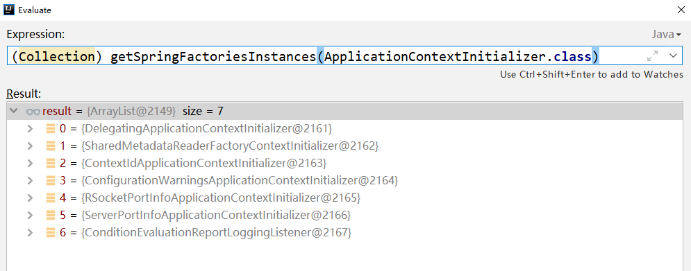

上面说了，是从classpath下 META-INF/spring.factories中获取，我们验证一下：

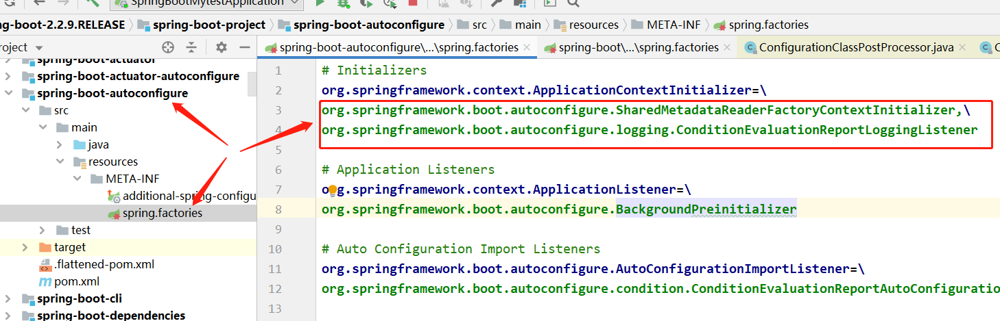

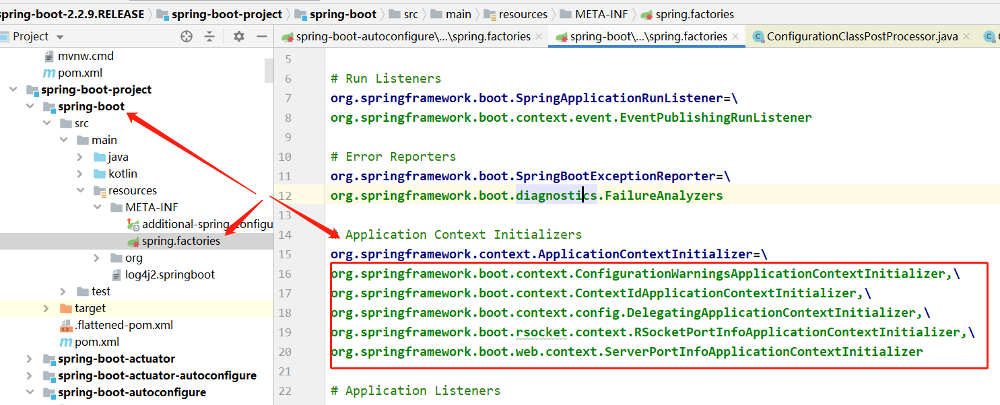

发现在上图所示的两个工程中找到了debug中看到的结果。 

  `ApplicationContextInitializer` 是Spring框架的类, 这个类的主要目的就是在  ConfigurableApplicationContext 调用refresh()方法之前，回调这个类的initialize方法。

通过 ConfigurableApplicationContext 的实例获取容器的环境Environment，从而实现对配置文件的修改完善等工作。

 

#### setListeners((Collection) getSpringFactoriesInstances(ApplicationListener.class));

初始化classpath下 META-INF/spring.factories中已配置的 ApplicationListener。

　　 ApplicationListener 的加载过程和上面的 ApplicationContextInitializer 类的加载过程是一样的。不多说了，至于 ApplicationListener 是spring的事件监听器，典型的观察者模式，通过 ApplicationEvent 类和 ApplicationListener 接口，可以实现对spring容器全生命周期的监听，当然也可以自定义监听事件

#### 总结

关于 SpringApplication 类的构造过程，到这里我们就梳理完了。纵观 SpringApplication 类的实例化过程，我们可以看到，合理的利用该类，我们能在spring容器创建之前做一些预备工作，和定制化的需求。

比如，自定义SpringBoot的Banner，比如自定义事件监听器，再比如在容器refresh之前通过自定义 ApplicationContextInitializer 修改配置一些配置或者获取指定的bean都是可以的

 

### run(args)

上一小节我们查看了SpringApplication 类的实例化过程，这一小节总结SpringBoot启动流程最重要的部分run方法。通过run方法梳理出SpringBoot启动的流程，

经过深入分析后，大家会发现SpringBoot也就是给Spring包了一层皮，事先替我们准备好Spring所需要的环境及一些基础

```java
/**
 * Run the Spring application, creating and refreshing a new
 * {@link ApplicationContext}.
 *
 * @param args the application arguments (usually passed from a Java main method)
 * @return a running {@link ApplicationContext}
 *
 * 运行spring应用，并刷新一个新的 ApplicationContext（Spring的上下文）
 * ConfigurableApplicationContext 是 ApplicationContext 接口的子接口。在 ApplicationContext
 * 基础上增加了配置上下文的工具。 ConfigurableApplicationContext是容器的高级接口
 */
public ConfigurableApplicationContext run(String... args) {
    //记录程序运行时间
    StopWatch stopWatch = new StopWatch();
    stopWatch.start();
    // ConfigurableApplicationContext Spring 的上下文
    ConfigurableApplicationContext context = null;
    Collection<SpringBootExceptionReporter> exceptionReporters = new ArrayList<>();
    configureHeadlessProperty();
    //从META-INF/spring.factories中获取监听器
    //1、获取并启动监听器
    SpringApplicationRunListeners listeners = getRunListeners(args);
    listeners.starting();
    try {
        ApplicationArguments applicationArguments = new DefaultApplicationArguments(
                args);
        //2、构造应用上下文环境
        ConfigurableEnvironment environment = prepareEnvironment(listeners, applicationArguments);
        //处理需要忽略的Bean
        configureIgnoreBeanInfo(environment);
        //打印banner
        Banner printedBanner = printBanner(environment);
        ///3、初始化应用上下文
        context = createApplicationContext();
        //实例化SpringBootExceptionReporter.class，用来支持报告关于启动的错误
        exceptionReporters = getSpringFactoriesInstances(
                SpringBootExceptionReporter.class,
                new Class[]{ConfigurableApplicationContext.class}, context);
        //4、刷新应用上下文前的准备阶段
        prepareContext(context, environment, listeners, applicationArguments, printedBanner);
        //5、刷新应用上下文
        refreshContext(context);
        //刷新应用上下文后的扩展接口
        afterRefresh(context, applicationArguments);
        //时间记录停止
        stopWatch.stop();
        if (this.logStartupInfo) {
            new StartupInfoLogger(this.mainApplicationClass)
                    .logStarted(getApplicationLog(), stopWatch);
        }
        //发布容器启动完成事件
        listeners.started(context);
        callRunners(context, applicationArguments);
    } catch (Throwable ex) {
        handleRunFailure(context, ex, exceptionReporters, listeners);
        throw new IllegalStateException(ex);
    }

    try {
        listeners.running(context);
    } catch (Throwable ex) {
        handleRunFailure(context, ex, exceptionReporters, null);
        throw new IllegalStateException(ex);
    }
    return context;
}
```

在以上的代码中，启动过程中的重要步骤共分为六步

```
第一步：获取并启动监听器
第二步：构造应用上下文环境
第三步：初始化应用上下文
第四步：刷新应用上下文前的准备阶段
第五步：刷新应用上下文
第六步：刷新应用上下文后的扩展接口
```

　　OK，下面SpringBoot的启动流程分析，我们就根据这6大步骤进行详细解读。最总要的是第四，五步。我们会着重的分析。

#### 第一步：获取并启动监听器

事件机制在Spring是很重要的一部分内容，通过事件机制我们可以监听Spring容器中正在发生的一些事件，同样也可以自定义监听事件。Spring的事件为Bean和Bean之间的消息传递提供支持。当一个对象处理完某种任务后，通知另外的对象进行某些处理，常用的场景有进行某些操作后发送通知，消息、邮件等情况。

```java
 private SpringApplicationRunListeners getRunListeners(String[] args) {
     Class<?>[] types = new Class<?>[]{SpringApplication.class, String[].class};
     return new SpringApplicationRunListeners(logger, getSpringFactoriesInstances(
             SpringApplicationRunListener.class, types, this, args));
 }
```

　　在这里面是不是看到一个熟悉的方法：getSpringFactoriesInstances()，可以看下面的注释，前面的小节我们已经详细介绍过该方法是怎么一步步的获取到META-INF/spring.factories中的指定的key的value，获取到以后怎么实例化类的。

```java
/**
 * 通过指定的classloader 从META-INF/spring.factories获取指定的Spring的工厂实例
 * @param type
 * @param parameterTypes
 * @param args
 * @param <T>
 * @return
 */
private <T> Collection<T> getSpringFactoriesInstances(Class<T> type,
                                                      Class<?>[] parameterTypes, Object... args) {
    ClassLoader classLoader = Thread.currentThread().getContextClassLoader();
    // Use names and ensure unique to protect against duplicates
    //通过指定的classLoader从 META-INF/spring.factories 的资源文件中，
    //读取 key 为 type.getName() 的 value
    Set<String> names = new LinkedHashSet<>(SpringFactoriesLoader.loadFactoryNames(type, classLoader));
    //创建Spring工厂实例
    List<T> instances = createSpringFactoriesInstances(type, parameterTypes,
            classLoader, args, names);
    //对Spring工厂实例排序（org.springframework.core.annotation.Order注解指定的顺序）
    AnnotationAwareOrderComparator.sort(instances);
    return instances;
}
```

回到run方法，debug这个代码 SpringApplicationRunListeners listeners = getRunListeners(args); 看一下获取的是哪个监听器：

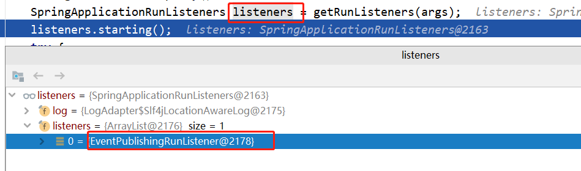

　　EventPublishingRunListener监听器是Spring容器的启动监听器。

　　 listeners.starting(); 开启了监听事件。

 

#### 第二步：构造应用上下文环境

　　应用上下文环境包括什么呢？包括计算机的环境，Java环境，Spring的运行环境，Spring项目的配置（在SpringBoot中就是那个熟悉的application.properties/yml）等等。

　　首先看一下prepareEnvironment()方法。

```java
private ConfigurableEnvironment prepareEnvironment(
        SpringApplicationRunListeners listeners,
        ApplicationArguments applicationArguments) {
    // Create and configure the environment
    //创建并配置相应的环境
    ConfigurableEnvironment environment = getOrCreateEnvironment();
    //根据用户配置，配置 environment系统环境
    configureEnvironment(environment, applicationArguments.getSourceArgs());
    // 启动相应的监听器，其中一个重要的监听器 ConfigFileApplicationListener 就是加载项目配置文件的监听器。
    listeners.environmentPrepared(environment);
    bindToSpringApplication(environment);
    if (this.webApplicationType == WebApplicationType.NONE) {
        environment = new EnvironmentConverter(getClassLoader())
                .convertToStandardEnvironmentIfNecessary(environment);
    }
    ConfigurationPropertySources.attach(environment);
    return environment;
}
```

 　看上面的注释，方法中主要完成的工作，首先是创建并按照相应的应用类型配置相应的环境，然后根据用户的配置，配置系统环境，然后启动监听器，并加载系统配置文件。

 

##### ConfigurableEnvironment environment = getOrCreateEnvironment();

看看getOrCreateEnvironment()干了些什么。

```java
private ConfigurableEnvironment getOrCreateEnvironment() {
    if (this.environment != null) {
        return this.environment;
    }
    //如果应用类型是 SERVLET 则实例化 StandardServletEnvironment
    if (this.webApplicationType == WebApplicationType.SERVLET) {
        return new StandardServletEnvironment();
    }
    return new StandardEnvironment();
}
```

通过代码可以看到根据不同的应用类型初始化不同的系统环境实例。前面咱们已经说过应用类型是怎么判断的了，这里就不在赘述了

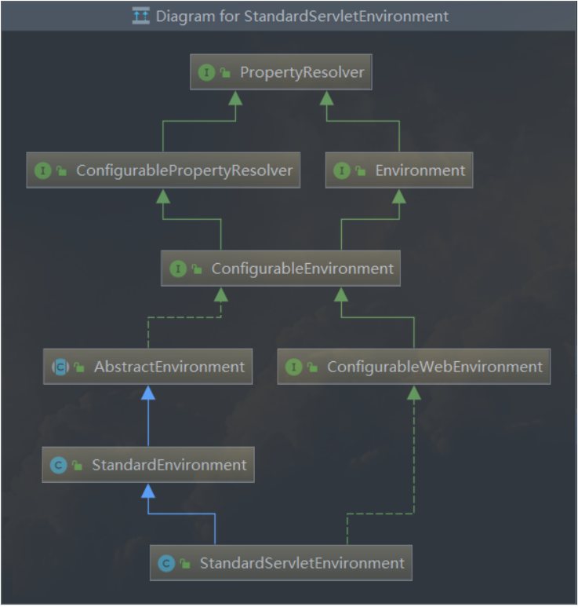

　从上面的继承关系可以看出，StandardServletEnvironment是StandardEnvironment的子类。这两个对象也没什么好讲的，当是web项目的时候，环境上会多一些关于web环境的配置。

 

##### configureEnvironment(environment, applicationArguments.getSourceArgs());

```java
protected void configureEnvironment(ConfigurableEnvironment environment,
                                    String[] args) {
    // 将main 函数的args封装成 SimpleCommandLinePropertySource 加入环境中。
    configurePropertySources(environment, args);
    // 激活相应的配置文件
    configureProfiles(environment, args);
}
```

在执行完方法中的两行代码后，debug的截图如下

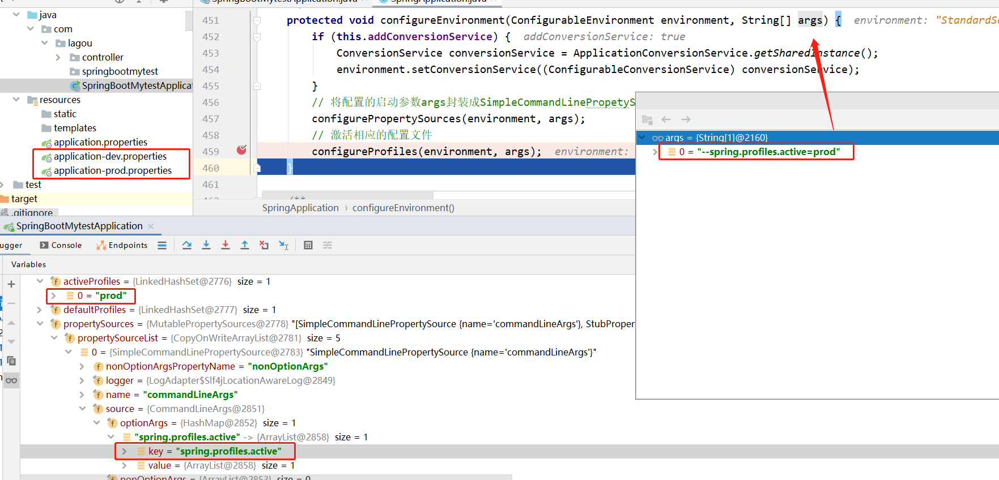

如下图所示，我在spring的启动参数中指定了参数：--spring.profiles.active=prod

（就是启动多个实例用的）

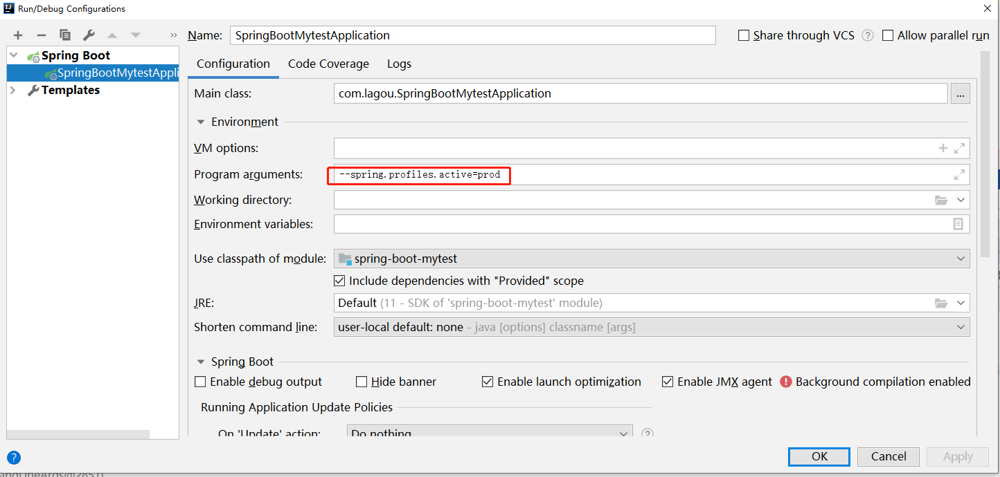

　　在configurePropertySources(environment, args);中将args封装成了SimpleCommandLinePropertySource并加入到了environment中。

　　configureProfiles(environment, args);根据启动参数激活了相应的配置文件。

 

##### listeners.environmentPrepared(environment);

进入到方法一路跟下去就到了SimpleApplicationEventMulticaster类的multicastEvent()方法。

```java
-- SimpleApplicationEventMulticaster

    public void multicastEvent(ApplicationEvent event) {
        multicastEvent(event, resolveDefaultEventType(event));
    }
```

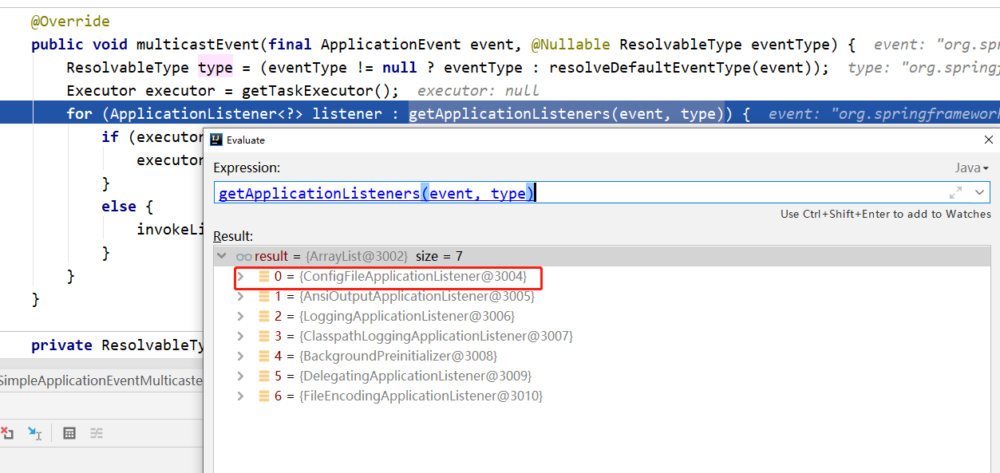

查看getApplicationListeners(event, type)执行结果，发现一个重要的监听器ConfigFileApplicationListener。

　　先看看这个类的注释

```java
 * {@link EnvironmentPostProcessor} that configures the context environment by loading
 * properties from well known file locations. By default properties will be loaded from
 * 'application.properties' and/or 'application.yml' files in the following locations:
 * <ul>
 * <li>file:./config/</li>
 * <li>file:./</li>
 * <li>classpath:config/</li>
 * <li>classpath:</li>
 * </ul>
 * The list is ordered by precedence (properties defined in locations higher in the list
 * override those defined in lower locations).
 * <p>
 * Alternative search locations and names can be specified using
 * {@link #setSearchLocations(String)} and {@link #setSearchNames(String)}.
 * <p>
 * Additional files will also be loaded based on active profiles. For example if a 'web'
 * profile is active 'application-web.properties' and 'application-web.yml' will be
 * considered.
 * <p>
 * The 'spring.config.name' property can be used to specify an alternative name to load
 * and the 'spring.config.location' property can be used to specify alternative search
 * locations or specific files.
 * <p>
 * 从默认的位置加载配置文件，将其加入上下文的environment变量中
```

这个监听器默认的从注释中，标签所示的几个位置加载配置文件，并将其加入 上下文的 environment变量中。当然也可以通过配置指定。debug跳过 listeners.environmentPrepared(environment); 这一行，查看environment属性，果真如上面所说的，配置文件的配置信息已经添加上来了。

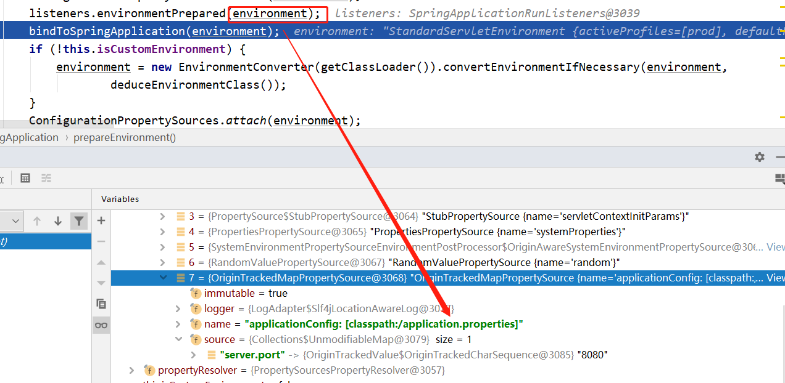

#### 第三步：初始化应用上下文

在SpringBoot工程中，应用类型分为三种，如下代码所示。

~~~java
public enum WebApplicationType {
    /**
     * 应用程序不是web应用，也不应该用web服务器去启动
     */
    NONE,
    /**
     * 应用程序应作为基于servlet的web应用程序运行，并应启动嵌入式servlet web（tomcat）服务器。
     */
    SERVLET,
    /**
     * 应用程序应作为 reactive web应用程序运行，并应启动嵌入式 reactive web服务器。
     */
    REACTIVE
}
~~~

对应三种应用类型，SpringBoot项目有三种对应的应用上下文，我们以web工程为例，即其上下文为AnnotationConfigServletWebServerApplicationContext。

~~~java
public static final String DEFAULT_WEB_CONTEXT_CLASS = "org.springframework.boot."
        + "web.servlet.context.AnnotationConfigServletWebServerApplicationContext";
public static final String DEFAULT_REACTIVE_WEB_CONTEXT_CLASS = "org.springframework."
        + "boot.web.reactive.context.AnnotationConfigReactiveWebServerApplicationContext";
public static final String DEFAULT_CONTEXT_CLASS = "org.springframework.context."
        + "annotation.AnnotationConfigApplicationContext";

protected ConfigurableApplicationContext createApplicationContext() {
    Class<?> contextClass = this.applicationContextClass;
    if (contextClass == null) {
        try {
            switch (this.webApplicationType) {
                case SERVLET:
                    contextClass = Class.forName(DEFAULT_WEB_CONTEXT_CLASS);
                    break;
                case REACTIVE:
                    contextClass = Class.forName(DEFAULT_REACTIVE_WEB_CONTEXT_CLASS);
                    break;
                default:
                    contextClass = Class.forName(DEFAULT_CONTEXT_CLASS);
            }
        } catch (ClassNotFoundException ex) {
            throw new IllegalStateException(
                    "Unable create a default ApplicationContext, "
                            + "please specify an ApplicationContextClass",
                    ex);
        }
    }
    return (ConfigurableApplicationContext) BeanUtils.instantiateClass(contextClass);
}
~~~

我们先看一下AnnotationConfigServletWebServerApplicationContext的设计

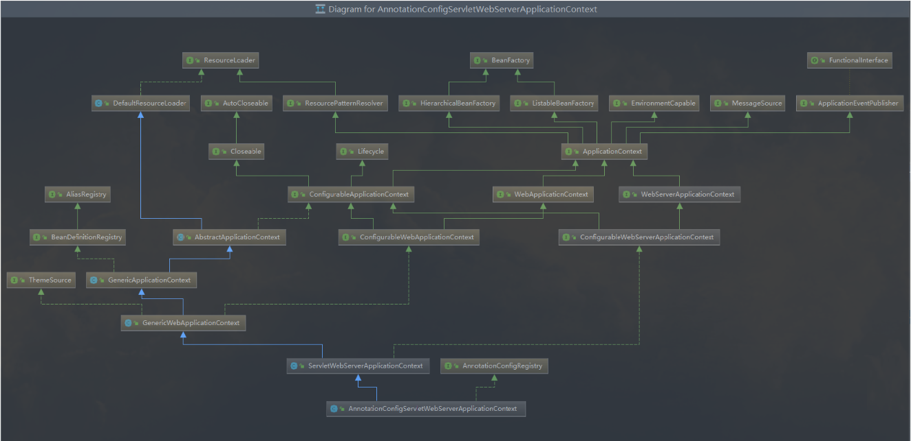

应用上下文可以理解成IoC容器的高级表现形式，应用上下文确实是在IoC容器的基础上丰富了一些高级功能。

应用上下文对IoC容器是持有的关系。他的一个属性beanFactory就是IoC容器（DefaultListableBeanFactory）。所以他们之间是持有，和扩展的关系。

接下来看GenericApplicationContext类

```java
public class GenericApplicationContext extends AbstractApplicationContext implements BeanDefinitionRegistry {
    private final DefaultListableBeanFactory beanFactory;
    ...
    public GenericApplicationContext() {
        this.beanFactory = new DefaultListableBeanFactory();
    }
    ...
}
```

beanFactory正是在AnnotationConfigServletWebServerApplicationContext实现的接口GenericApplicationContext中定义的。在上面createApplicationContext()方法中的， BeanUtils.instantiateClass(contextClass) 这个方法中，不但初始化了AnnotationConfigServletWebServerApplicationContext类，也就是我们的上下文context，同样也触发了GenericApplicationContext类的构造函数，从而beanFactory(IOC容器)也创建了。

仔细看他的构造函数，有没有发现一个很熟悉的类DefaultListableBeanFactory，没错，DefaultListableBeanFactory就是IoC容器真实面目了。在后面的refresh()方法分析中，DefaultListableBeanFactory是无处不在的存在感。

debug跳过createApplicationContext()方法。

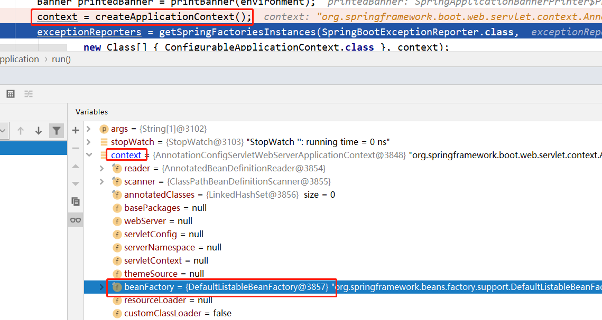

如上图所示，context就是我们熟悉的上下文（也有人称之为容器，都可以，看个人爱好和理解），beanFactory就是我们所说的IoC容器的真实面孔了。细细感受下上下文和容器的联系和区别，对于我们理解源码有很大的帮助。在我们学习过程中，我们也是将上下文和容器严格区分开来的。

#### 第四步：刷新应用上下文前的准备阶段

##### prepareContext()方法

~~~java
private void prepareContext(ConfigurableApplicationContext context,
                            ConfigurableEnvironment environment, SpringApplicationRunListeners listeners,
                            ApplicationArguments applicationArguments, Banner printedBanner) {
    //设置容器环境
    context.setEnvironment(environment);
    //执行容器后置处理
    postProcessApplicationContext(context);
    //执行容器中的 ApplicationContextInitializer 包括spring.factories和通过三种方式自定义的
    applyInitializers(context);
    //向各个监听器发送容器已经准备好的事件
    listeners.contextPrepared(context);
    if (this.logStartupInfo) {
        logStartupInfo(context.getParent() == null);
        logStartupProfileInfo(context);
    }

    // Add boot specific singleton beans
    //将main函数中的args参数封装成单例Bean，注册进容器
    context.getBeanFactory().registerSingleton("springApplicationArguments",
            applicationArguments);
    //将 printedBanner 也封装成单例，注册进容器
    if (printedBanner != null) {
        context.getBeanFactory().registerSingleton("springBootBanner", printedBanner);
    }

    // Load the sources
    Set<Object> sources = getAllSources();
    Assert.notEmpty(sources, "Sources must not be empty");
    //加载我们的启动类，将启动类注入容器
    load(context, sources.toArray(new Object[0]));
    //发布容器已加载事件
    listeners.contextLoaded(context);
}
~~~

首先看这行 Set sources = getAllSources(); 在getAllSources()中拿到了我们的启动类。 我们重点讲解这行 load(context, sources.toArray(new Object[0])); ，其他的方法请参阅注释。 跟进load()方法，看源码

```java
protected void load(ApplicationContext context, Object[] sources) {
    if (logger.isDebugEnabled()) {
        logger.debug(
                "Loading source " + StringUtils.arrayToCommaDelimitedString(sources));
    }
    //创建 BeanDefinitionLoader
    BeanDefinitionLoader loader = createBeanDefinitionLoader(
            getBeanDefinitionRegistry(context), sources);
    if (this.beanNameGenerator != null) {
        loader.setBeanNameGenerator(this.beanNameGenerator);
    }
    if (this.resourceLoader != null) {
        loader.setResourceLoader(this.resourceLoader);
    }
    if (this.environment != null) {
        loader.setEnvironment(this.environment);
    }
    loader.load();
}
```

##### getBeanDefinitionRegistry()

继续看getBeanDefinitionRegistry()方法的源码

```java
private BeanDefinitionRegistry getBeanDefinitionRegistry(ApplicationContext context) {
     if (context instanceof BeanDefinitionRegistry) {
         return (BeanDefinitionRegistry) context;
     }
     ...
 }
```

这里将我们前文创建的上下文强转为BeanDefinitionRegistry，他们之间是有继承关系的。BeanDefinitionRegistry定义了很重要的方法registerBeanDefinition()，该方法将BeanDefinition注册进DefaultListableBeanFactory容器的beanDefinitionMap中。

 

##### createBeanDefinitionLoader() 

继续看createBeanDefinitionLoader()方法，最终进入了BeanDefinitionLoader类的构造方法，如下

```java
BeanDefinitionLoader(BeanDefinitionRegistry registry, Object... sources) {
    Assert.notNull(registry, "Registry must not be null");
    Assert.notEmpty(sources, "Sources must not be empty");
    this.sources = sources;
    //注解形式的Bean定义读取器 比如：@Configuration @Bean @Component @Controller @Service等等
    this.annotatedReader = new AnnotatedBeanDefinitionReader(registry);
    //XML形式的Bean定义读取器
    this.xmlReader = new XmlBeanDefinitionReader(registry);
    if (isGroovyPresent()) {
        this.groovyReader = new GroovyBeanDefinitionReader(registry);
    }
    //类路径扫描器
    this.scanner = new ClassPathBeanDefinitionScanner(registry);
    //扫描器添加排除过滤器
    this.scanner.addExcludeFilter(new ClassExcludeFilter(sources));
}
```

先记住上面的三个属性，上面三个属性在，BeanDefinition的Resource定位，和BeanDefinition的注册中起到了很重要的作用。

 

##### loader.load();

跟进load()方法

```java
private int load(Object source) {
    Assert.notNull(source, "Source must not be null");
    // 从Class加载
    if (source instanceof Class<?>) {
        return load((Class<?>) source);
    }
    // 从Resource加载
    if (source instanceof Resource) {
        return load((Resource) source);
    }
    // 从Package加载
    if (source instanceof Package) {
        return load((Package) source);
    }
    // 从 CharSequence 加载 ？？？
    if (source instanceof CharSequence) {
        return load((CharSequence) source);
    }
    throw new IllegalArgumentException("Invalid source type " + source.getClass());
}
```

当前我们的主类会按Class加载。

　　继续跟进load()方法。

```java
private int load(Class<?> source) {
    if (isGroovyPresent()
            && GroovyBeanDefinitionSource.class.isAssignableFrom(source)) {
        // Any GroovyLoaders added in beans{} DSL can contribute beans here
        GroovyBeanDefinitionSource loader = BeanUtils.instantiateClass(source,
                GroovyBeanDefinitionSource.class);
        load(loader);
    }
    if (isComponent(source)) {
        //将 启动类的 BeanDefinition注册进 beanDefinitionMap
        this.annotatedReader.register(source);
        return 1;
    }
    return 0;
}
```

　　isComponent(source)判断主类是不是存在@Component注解，主类@SpringBootApplication是一个组合注解，包含@Component。

　　this.annotatedReader.register(source);跟进register()方法，最终进到AnnotatedBeanDefinitionReader类的doRegisterBean()方法。

```java
<T> void doRegisterBean(Class<T> annotatedClass, @Nullable Supplier<T> instanceSupplier, @Nullable String name,
        @Nullable Class<? extends Annotation>[] qualifiers, BeanDefinitionCustomizer... definitionCustomizers) {

    //将指定的类 封装为AnnotatedGenericBeanDefinition
    AnnotatedGenericBeanDefinition abd = new AnnotatedGenericBeanDefinition(annotatedClass);
    if (this.conditionEvaluator.shouldSkip(abd.getMetadata())) {
        return;
    }

    abd.setInstanceSupplier(instanceSupplier);
    // 获取该类的 scope 属性
    ScopeMetadata scopeMetadata = this.scopeMetadataResolver.resolveScopeMetadata(abd);
    abd.setScope(scopeMetadata.getScopeName());
    String beanName = (name != null ? name : this.beanNameGenerator.generateBeanName(abd, this.registry));

    AnnotationConfigUtils.processCommonDefinitionAnnotations(abd);
    if (qualifiers != null) {
        for (Class<? extends Annotation> qualifier : qualifiers) {
            if (Primary.class == qualifier) {
                abd.setPrimary(true);
            }
            else if (Lazy.class == qualifier) {
                abd.setLazyInit(true);
            }
            else {
                abd.addQualifier(new AutowireCandidateQualifier(qualifier));
            }
        }
    }
    for (BeanDefinitionCustomizer customizer : definitionCustomizers) {
        customizer.customize(abd);
    }

    BeanDefinitionHolder definitionHolder = new BeanDefinitionHolder(abd, beanName);
    definitionHolder = AnnotationConfigUtils.applyScopedProxyMode(scopeMetadata, definitionHolder, this.registry);
    // 将该BeanDefinition注册到IoC容器的beanDefinitionMap中
    BeanDefinitionReaderUtils.registerBeanDefinition(definitionHolder, this.registry);
}
```

在该方法中将主类封装成AnnotatedGenericBeanDefinition

　　BeanDefinitionReaderUtils.registerBeanDefinition(definitionHolder, this.registry);方法将BeanDefinition注册进beanDefinitionMap

```java
public static void registerBeanDefinition(
        BeanDefinitionHolder definitionHolder, BeanDefinitionRegistry registry)
        throws BeanDefinitionStoreException {
    // Register bean definition under primary name.
    // primary name 其实就是id吧
    String beanName = definitionHolder.getBeanName();
    registry.registerBeanDefinition(beanName, definitionHolder.getBeanDefinition());
    // Register aliases for bean name, if any.
    // 然后就是注册别名
    String[] aliases = definitionHolder.getAliases();
    if (aliases != null) {
        for (String alias : aliases) {
            registry.registerAlias(beanName, alias);
        }
    }
}
```

继续跟进registerBeanDefinition()方法。

```java
@Override
public void registerBeanDefinition(String beanName, BeanDefinition beanDefinition)
        throws BeanDefinitionStoreException {

    Assert.hasText(beanName, "Bean name must not be empty");
    Assert.notNull(beanDefinition, "BeanDefinition must not be null");

    if (beanDefinition instanceof AbstractBeanDefinition) {
        try {
            // 最后一次校验了
            // 对bean的Overrides进行校验，还不知道会在哪处理这些overrides
            ((AbstractBeanDefinition) beanDefinition).validate();
        } catch (BeanDefinitionValidationException ex) {
            throw new BeanDefinitionStoreException(beanDefinition.getResourceDescription(), beanName,
                    "Validation of bean definition failed", ex);
        }
    }
    // 判断是否存在重复名字的bean，之后看允不允许override
    // 以前使用synchronized实现互斥访问，现在采用ConcurrentHashMap
    BeanDefinition existingDefinition = this.beanDefinitionMap.get(beanName);
    if (existingDefinition != null) {
        //如果该类不允许 Overriding 直接抛出异常
        if (!isAllowBeanDefinitionOverriding()) {
            throw new BeanDefinitionStoreException(beanDefinition.getResourceDescription(), beanName,
                    "Cannot register bean definition [" + beanDefinition + "] for bean '" + beanName +
                            "': There is already [" + existingDefinition + "] bound.");
        } else if (existingDefinition.getRole() < beanDefinition.getRole()) {
            // e.g. was ROLE_APPLICATION, now overriding with ROLE_SUPPORT or ROLE_INFRASTRUCTURE
            if (logger.isWarnEnabled()) {
                logger.warn("Overriding user-defined bean definition for bean '" + beanName +
                        "' with a framework-generated bean definition: replacing [" +
                        existingDefinition + "] with [" + beanDefinition + "]");
            }
        } else if (!beanDefinition.equals(existingDefinition)) {
            if (logger.isInfoEnabled()) {
                logger.info("Overriding bean definition for bean '" + beanName +
                        "' with a different definition: replacing [" + existingDefinition +
                        "] with [" + beanDefinition + "]");
            }
        } else {
            if (logger.isDebugEnabled()) {
                logger.debug("Overriding bean definition for bean '" + beanName +
                        "' with an equivalent definition: replacing [" + existingDefinition +
                        "] with [" + beanDefinition + "]");
            }
        }
        //注册进beanDefinitionMap
        this.beanDefinitionMap.put(beanName, beanDefinition);
    } else {
        if (hasBeanCreationStarted()) {
            // Cannot modify startup-time collection elements anymore (for stable iteration)
            synchronized (this.beanDefinitionMap) {
                this.beanDefinitionMap.put(beanName, beanDefinition);
                List<String> updatedDefinitions = new ArrayList<>(this.beanDefinitionNames.size() + 1);
                updatedDefinitions.addAll(this.beanDefinitionNames);
                updatedDefinitions.add(beanName);
                this.beanDefinitionNames = updatedDefinitions;
                if (this.manualSingletonNames.contains(beanName)) {
                    Set<String> updatedSingletons = new LinkedHashSet<>(this.manualSingletonNames);
                    updatedSingletons.remove(beanName);
                    this.manualSingletonNames = updatedSingletons;
                }
            }
        } else {
            // Still in startup registration phase
            //如果仍处于启动注册阶段，注册进beanDefinitionMap
            this.beanDefinitionMap.put(beanName, beanDefinition);
            this.beanDefinitionNames.add(beanName);
            this.manualSingletonNames.remove(beanName);
        }
        this.frozenBeanDefinitionNames = null;
    }

    if (existingDefinition != null || containsSingleton(beanName)) {
        resetBeanDefinition(beanName);
    }
}
```

最终来到DefaultListableBeanFactory类的registerBeanDefinition()方法，DefaultListableBeanFactory类还熟悉吗？相信大家一定非常熟悉这个类了。DefaultListableBeanFactory是IoC容器的具体产品。

　　仔细看这个方法registerBeanDefinition()，首先会检查是否已经存在，如果存在并且不允许被覆盖则直接抛出异常。不存在的话就直接注册进beanDefinitionMap中。

　　debug跳过prepareContext()方法，可以看到，启动类的BeanDefinition已经注册进来了。

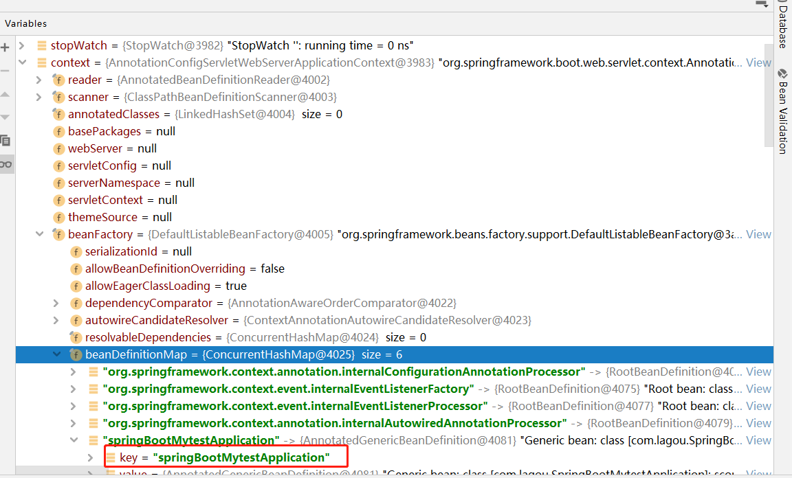

　OK，到这里启动流程的第五步就算讲完了，因为启动类BeanDefinition的注册流程和后面我们自定义的BeanDefinition的注册流程是一样的。这先介绍一遍这个流程，后面熟悉了这个流程就好理解了。后面马上就到最最最重要的refresh()方法了。

 

#### 第五步：刷新应用上下文（IOC容器的初始化过程）

首先我们要知道到IoC容器的初始化过程，主要分下面三步：

```
1 BeanDefinition的Resource定位
2 BeanDefinition的载入
3 向IoC容器注册BeanDefinition
```

在上一小节介绍了prepareContext()方法，在准备刷新阶段做了什么工作。

接下来我们主要从refresh()方法中总结IoC容器的初始化过程。 从run方法的，refreshContext()方法一路跟下去，最终来到AbstractApplicationContext类的refresh()方法。

```java
@Override
public void refresh() throws BeansException, IllegalStateException {
    synchronized (this.startupShutdownMonitor) {
        // Prepare this context for refreshing.
        //刷新上下文环境
        prepareRefresh();
        // Tell the subclass to refresh the internal bean factory.
        //这里是在子类中启动 refreshBeanFactory() 的地方
        ConfigurableListableBeanFactory beanFactory = obtainFreshBeanFactory();
        // Prepare the bean factory for use in this context.
        //准备bean工厂，以便在此上下文中使用
        prepareBeanFactory(beanFactory);
        try {
            // Allows post-processing of the bean factory in context subclasses.
            //设置 beanFactory 的后置处理
            postProcessBeanFactory(beanFactory);
            // Invoke factory processors registered as beans in the context.
            //调用 BeanFactory 的后处理器，这些处理器是在Bean 定义中向容器注册的
            invokeBeanFactoryPostProcessors(beanFactory);
            // Register bean processors that intercept bean creation.
            //注册Bean的后处理器，在Bean创建过程中调用
            registerBeanPostProcessors(beanFactory);
            // Initialize message source for this context.
            //对上下文中的消息源进行初始化
            initMessageSource();
            // Initialize event multicaster for this context.
            //初始化上下文中的事件机制
            initApplicationEventMulticaster();
            // Initialize other special beans in specific context subclasses.
            //初始化其他特殊的Bean
            onRefresh();
            // Check for listener beans and register them.
            //检查监听Bean并且将这些监听Bean向容器注册
            registerListeners();
            // Instantiate all remaining (non-lazy-init) singletons.
            //实例化所有的（non-lazy-init）单件
            finishBeanFactoryInitialization(beanFactory);
            // Last step: publish corresponding event.
            //发布容器事件，结束Refresh过程
            finishRefresh();
        } catch (BeansException ex) {
            if (logger.isWarnEnabled()) {
                logger.warn("Exception encountered during context initialization - " +
                        "cancelling refresh attempt: " + ex);
            }
            // Destroy already created singletons to avoid dangling resources.
            destroyBeans();
            // Reset 'active' flag.
            cancelRefresh(ex);
            // Propagate exception to caller.
            throw ex;
        } finally {
            // Reset common introspection caches in Spring's core, since we
            // might not ever need metadata for singleton beans anymore...
            resetCommonCaches();
        }
    }
}
```

从以上代码中我们可以看到，refresh()方法中所作的工作也挺多，我们没办法面面俱到，主要根据IoC容器的初始化步骤进行分析，所以我们主要介绍重要的方法，其他的请看注释。

 

##### obtainFreshBeanFactory();

在启动流程的第三步：初始化应用上下文。中我们创建了应用的上下文，并触发了GenericApplicationContext类的构造方法如下所示，创建了beanFactory，也就是创建了DefaultListableBeanFactory类。

```java
public GenericApplicationContext() {
     this.beanFactory = new DefaultListableBeanFactory();
 }
```

　关于obtainFreshBeanFactory()方法，其实就是拿到我们之前创建的beanFactory。

```java
protected ConfigurableListableBeanFactory obtainFreshBeanFactory() {
    //刷新BeanFactory
    refreshBeanFactory();
    //获取beanFactory
    ConfigurableListableBeanFactory beanFactory = getBeanFactory();
    if (logger.isDebugEnabled()) {
        logger.debug("Bean factory for " + getDisplayName() + ": " + beanFactory);
    }
    return beanFactory;
}
```

从上面代码可知，在该方法中主要做了三个工作，刷新beanFactory，获取beanFactory，返回beanFactory。

　　首先看一下refreshBeanFactory()方法，跟下去来到GenericApplicationContext类的refreshBeanFactory()发现也没做什么。

```java
@Override
protected final void refreshBeanFactory() throws IllegalStateException {
    if (!this.refreshed.compareAndSet(false, true)) {
        throw new IllegalStateException(
                "GenericApplicationContext does not support multiple refresh attempts: just call 'refresh' once");
    }
    this.beanFactory.setSerializationId(getId());
}
TIPS:
　　1，AbstractApplicationContext类有两个子类实现了refreshBeanFactory()，但是在前面第三步初始化上下文的时候，
实例化了GenericApplicationContext类，所以没有进入AbstractRefreshableApplicationContext中的refreshBeanFactory()方法。
　　2，this.refreshed.compareAndSet(false, true) 
　　这行代码在这里表示：GenericApplicationContext只允许刷新一次 　　
　　这行代码，很重要，不是在Spring中很重要，而是这行代码本身。首先看一下this.refreshed属性： 
private final AtomicBoolean refreshed = new AtomicBoolean(); 
　　java J.U.C并发包中很重要的一个原子类AtomicBoolean。通过该类的compareAndSet()方法可以实现一段代码绝对只实现一次的功能。
```

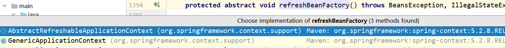

 

##### prepareBeanFactory(beanFactory);

从字面意思上可以看出准备BeanFactory。

　　看代码，具体看看做了哪些准备工作。这个方法不是重点，看注释吧。

```java
protected void prepareBeanFactory(ConfigurableListableBeanFactory beanFactory) {
    // Tell the internal bean factory to use the context's class loader etc.
    // 配置类加载器：默认使用当前上下文的类加载器
    beanFactory.setBeanClassLoader(getClassLoader());
    // 配置EL表达式：在Bean初始化完成，填充属性的时候会用到
    beanFactory.setBeanExpressionResolver(new StandardBeanExpressionResolver(beanFactory.getBeanClassLoader()));
    // 添加属性编辑器 PropertyEditor
    beanFactory.addPropertyEditorRegistrar(new ResourceEditorRegistrar(this, getEnvironment()));

    // Configure the bean factory with context callbacks.
    // 添加Bean的后置处理器
    beanFactory.addBeanPostProcessor(new ApplicationContextAwareProcessor(this));
    // 忽略装配以下指定的类
    beanFactory.ignoreDependencyInterface(EnvironmentAware.class);
    beanFactory.ignoreDependencyInterface(EmbeddedValueResolverAware.class);
    beanFactory.ignoreDependencyInterface(ResourceLoaderAware.class);
    beanFactory.ignoreDependencyInterface(ApplicationEventPublisherAware.class);
    beanFactory.ignoreDependencyInterface(MessageSourceAware.class);
    beanFactory.ignoreDependencyInterface(ApplicationContextAware.class);

    // BeanFactory interface not registered as resolvable type in a plain factory.
    // MessageSource registered (and found for autowiring) as a bean.
    // 将以下类注册到 beanFactory（DefaultListableBeanFactory） 的resolvableDependencies属性中
    beanFactory.registerResolvableDependency(BeanFactory.class, beanFactory);
    beanFactory.registerResolvableDependency(ResourceLoader.class, this);
    beanFactory.registerResolvableDependency(ApplicationEventPublisher.class, this);
    beanFactory.registerResolvableDependency(ApplicationContext.class, this);

    // Register early post-processor for detecting inner beans as ApplicationListeners.
    // 将早期后处理器注册为application监听器，用于检测内部bean
    beanFactory.addBeanPostProcessor(new ApplicationListenerDetector(this));

    // Detect a LoadTimeWeaver and prepare for weaving, if found.
    //如果当前BeanFactory包含loadTimeWeaver Bean，说明存在类加载期织入AspectJ，
    // 则把当前BeanFactory交给类加载期BeanPostProcessor实现类LoadTimeWeaverAwareProcessor来处理，
    // 从而实现类加载期织入AspectJ的目的。
    if (beanFactory.containsBean(LOAD_TIME_WEAVER_BEAN_NAME)) {
        beanFactory.addBeanPostProcessor(new LoadTimeWeaverAwareProcessor(beanFactory));
        // Set a temporary ClassLoader for type matching.
        beanFactory.setTempClassLoader(new ContextTypeMatchClassLoader(beanFactory.getBeanClassLoader()));
    }

    // Register default environment beans.
    // 将当前环境变量（environment） 注册为单例bean
    if (!beanFactory.containsLocalBean(ENVIRONMENT_BEAN_NAME)) {
        beanFactory.registerSingleton(ENVIRONMENT_BEAN_NAME, getEnvironment());
    }
    // 将当前系统配置（systemProperties） 注册为单例Bean
    if (!beanFactory.containsLocalBean(SYSTEM_PROPERTIES_BEAN_NAME)) {
        beanFactory.registerSingleton(SYSTEM_PROPERTIES_BEAN_NAME, getEnvironment().getSystemProperties());
    }
    // 将当前系统环境 （systemEnvironment） 注册为单例Bean
    if (!beanFactory.containsLocalBean(SYSTEM_ENVIRONMENT_BEAN_NAME)) {
        beanFactory.registerSingleton(SYSTEM_ENVIRONMENT_BEAN_NAME, getEnvironment().getSystemEnvironment());
    }
}
```

 

##### 四、postProcessBeanFactory(beanFactory); 

postProcessBeanFactory()方法向上下文中添加了一系列的Bean的后置处理器。

后置处理器工作的时机是在所有的beanDenifition加载完成之后，bean实例化之前执行。简单来说Bean的后置处理器可以修改BeanDefinition的属性信息。

 

##### 五、invokeBeanFactoryPostProcessors(beanFactory);（重点）

IoC容器的初始化过程包括三个步骤，在invokeBeanFactoryPostProcessors()方法中完成了IoC容器初始化过程的三个步骤。

　　**1，第一步：Resource定位**

　　在SpringBoot中，我们都知道他的包扫描是从主类所在的包开始扫描的，prepareContext()方法中，会先将主类解析成BeanDefinition，然后在refresh()方法的invokeBeanFactoryPostProcessors()方法中解析主类的BeanDefinition获取basePackage的路径。这样就完成了定位的过程。其次SpringBoot的各种starter是通过SPI扩展机制实现的自动装配，SpringBoot的自动装配同样也是在invokeBeanFactoryPostProcessors()方法中实现的。还有一种情况，在SpringBoot中有很多的@EnableXXX注解，细心点进去看的应该就知道其底层是@Import注解，在invokeBeanFactoryPostProcessors()方法中也实现了对该注解指定的配置类的定位加载。

　　常规的在SpringBoot中有三种实现定位，第一个是主类所在包的，第二个是SPI扩展机制实现的自动装配（比如各种starter），第三种就是@Import注解指定的类。（对于非常规的不说了）

　　**2，第二步：BeanDefinition的载入**

　　在第一步中说了三种Resource的定位情况，定位后紧接着就是BeanDefinition的分别载入。所谓的载入就是通过上面的定位得到的basePackage，SpringBoot会将该路径拼接成：classpath*:com/itheima/**/*.class这样的形式，然后一个叫做xPathMatchingResourcePatternResolver的类会将该路径下所有的.class文件都加载进来，然后遍历判断是不是有@Component注解，如果有的话，就是我们要装载的BeanDefinition。大致过程就是这样的了。

```java
TIPS：
    @Configuration，@Controller，@Service等注解底层都是@Component注解，只不过包装了一层罢了。
```

​	**3、第三个过程：注册BeanDefinition**

 　这个过程通过调用上文提到的BeanDefinitionRegister接口的实现来完成。这个注册过程把载入过程中解析得到的BeanDefinition向IoC容器进行注册。通过上文的分析，我们可以看到，在IoC容器中将BeanDefinition注入到一个ConcurrentHashMap中，IoC容器就是通过这个HashMap来持有这些BeanDefinition数据的。比如DefaultListableBeanFactory 中的beanDefinitionMap属性。

　　OK，总结完了，接下来我们通过代码看看具体是怎么实现的。

```java
protected void invokeBeanFactoryPostProcessors(ConfigurableListableBeanFactory beanFactory) {
    PostProcessorRegistrationDelegate.invokeBeanFactoryPostProcessors(beanFactory, getBeanFactoryPostProcessors());
    ...
}
// PostProcessorRegistrationDelegate类
public static void invokeBeanFactoryPostProcessors(
        ConfigurableListableBeanFactory beanFactory, List<BeanFactoryPostProcessor> beanFactoryPostProcessors) {
    ...
    invokeBeanDefinitionRegistryPostProcessors(currentRegistryProcessors, registry);
    ...
}
// PostProcessorRegistrationDelegate类
private static void invokeBeanDefinitionRegistryPostProcessors(
        Collection<? extends BeanDefinitionRegistryPostProcessor> postProcessors, BeanDefinitionRegistry registry) {

    for (BeanDefinitionRegistryPostProcessor postProcessor : postProcessors) {
        postProcessor.postProcessBeanDefinitionRegistry(registry);
    }
}
// ConfigurationClassPostProcessor类
@Override
public void postProcessBeanDefinitionRegistry(BeanDefinitionRegistry registry) {
    ...
    processConfigBeanDefinitions(registry);
}
// ConfigurationClassPostProcessor类
public void processConfigBeanDefinitions(BeanDefinitionRegistry registry) {
    ...
    do {
        parser.parse(candidates);
        parser.validate();
        ...
    }
    ...
}
```

一路跟踪调用栈，来到ConfigurationClassParser类的parse()方法。

```java
// ConfigurationClassParser类
public void parse(Set<BeanDefinitionHolder> configCandidates) {
    this.deferredImportSelectors = new LinkedList<>();
    for (BeanDefinitionHolder holder : configCandidates) {
        BeanDefinition bd = holder.getBeanDefinition();
        try {
            // 如果是SpringBoot项目进来的，bd其实就是前面主类封装成的 AnnotatedGenericBeanDefinition（AnnotatedBeanDefinition接口的实现类）
            if (bd instanceof AnnotatedBeanDefinition) {
                parse(((AnnotatedBeanDefinition) bd).getMetadata(), holder.getBeanName());
            } else if (bd instanceof AbstractBeanDefinition && ((AbstractBeanDefinition) bd).hasBeanClass()) {
                parse(((AbstractBeanDefinition) bd).getBeanClass(), holder.getBeanName());
            } else {
                parse(bd.getBeanClassName(), holder.getBeanName());
            }
        } catch (BeanDefinitionStoreException ex) {
            throw ex;
        } catch (Throwable ex) {
            throw new BeanDefinitionStoreException(
                    "Failed to parse configuration class [" + bd.getBeanClassName() + "]", ex);
        }
    }
    // 加载默认的配置---》（对springboot项目来说这里就是自动装配的入口了）
    processDeferredImportSelectors();
}
```

看上面的注释，在前面的prepareContext()方法中，我们详细介绍了我们的主类是如何一步步的封装成AnnotatedGenericBeanDefinition，并注册进IoC容器的beanDefinitionMap中的。

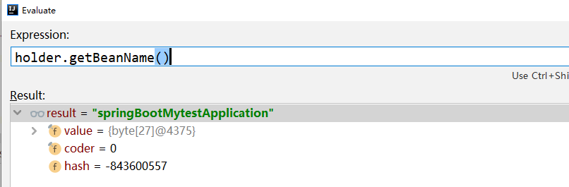

 

继续沿着parse(((AnnotatedBeanDefinition) bd).getMetadata(), holder.getBeanName());方法跟下去

看doProcessConfigurationClass()方法。（SpringBoot的包扫描的入口方法，重点）

```java
// ConfigurationClassParser类
protected final void parse(AnnotationMetadata metadata, String beanName) throws IOException {
    processConfigurationClass(new ConfigurationClass(metadata, beanName));
}
// ConfigurationClassParser类
protected void processConfigurationClass(ConfigurationClass configClass) throws IOException {
    ...
    // Recursively process the configuration class and its superclass hierarchy.
    //递归地处理配置类及其父类层次结构。
    SourceClass sourceClass = asSourceClass(configClass);
    do {
        //递归处理Bean，如果有父类，递归处理，直到顶层父类
        sourceClass = doProcessConfigurationClass(configClass, sourceClass);
    }
    while (sourceClass != null);

    this.configurationClasses.put(configClass, configClass);
}
// ConfigurationClassParser类
protected final SourceClass doProcessConfigurationClass(ConfigurationClass configClass, SourceClass sourceClass)
        throws IOException {

    // Recursively process any member (nested) classes first
    //首先递归处理内部类，（SpringBoot项目的主类一般没有内部类）
    processMemberClasses(configClass, sourceClass);

    // Process any @PropertySource annotations
    // 针对 @PropertySource 注解的属性配置处理
    for (AnnotationAttributes propertySource : AnnotationConfigUtils.attributesForRepeatable(
            sourceClass.getMetadata(), PropertySources.class,
            org.springframework.context.annotation.PropertySource.class)) {
        if (this.environment instanceof ConfigurableEnvironment) {
            processPropertySource(propertySource);
        } else {
            logger.warn("Ignoring @PropertySource annotation on [" + sourceClass.getMetadata().getClassName() +
                    "]. Reason: Environment must implement ConfigurableEnvironment");
        }
    }

    // Process any @ComponentScan annotations
    // 根据 @ComponentScan 注解，扫描项目中的Bean（SpringBoot 启动类上有该注解）
    Set<AnnotationAttributes> componentScans = AnnotationConfigUtils.attributesForRepeatable(
            sourceClass.getMetadata(), ComponentScans.class, ComponentScan.class);
    if (!componentScans.isEmpty() &&
            !this.conditionEvaluator.shouldSkip(sourceClass.getMetadata(), ConfigurationPhase.REGISTER_BEAN)) {
        for (AnnotationAttributes componentScan : componentScans) {
            // The config class is annotated with @ComponentScan -> perform the scan immediately
            // 立即执行扫描，（SpringBoot项目为什么是从主类所在的包扫描，这就是关键了）
            Set<BeanDefinitionHolder> scannedBeanDefinitions =
                    this.componentScanParser.parse(componentScan, sourceClass.getMetadata().getClassName());
            // Check the set of scanned definitions for any further config classes and parse recursively if needed
            for (BeanDefinitionHolder holder : scannedBeanDefinitions) {
                BeanDefinition bdCand = holder.getBeanDefinition().getOriginatingBeanDefinition();
                if (bdCand == null) {
                    bdCand = holder.getBeanDefinition();
                }
                // 检查是否是ConfigurationClass（是否有configuration/component两个注解），如果是，递归查找该类相关联的配置类。
                // 所谓相关的配置类，比如@Configuration中的@Bean定义的bean。或者在有@Component注解的类上继续存在@Import注解。
                if (ConfigurationClassUtils.checkConfigurationClassCandidate(bdCand, this.metadataReaderFactory)) {
                    parse(bdCand.getBeanClassName(), holder.getBeanName());
                }
            }
        }
    }

    // Process any @Import annotations
    //递归处理 @Import 注解（SpringBoot项目中经常用的各种@Enable*** 注解基本都是封装的@Import）
    processImports(configClass, sourceClass, getImports(sourceClass), true);

    // Process any @ImportResource annotations
    AnnotationAttributes importResource =
            AnnotationConfigUtils.attributesFor(sourceClass.getMetadata(), ImportResource.class);
    if (importResource != null) {
        String[] resources = importResource.getStringArray("locations");
        Class<? extends BeanDefinitionReader> readerClass = importResource.getClass("reader");
        for (String resource : resources) {
            String resolvedResource = this.environment.resolveRequiredPlaceholders(resource);
            configClass.addImportedResource(resolvedResource, readerClass);
        }
    }

    // Process individual @Bean methods
    Set<MethodMetadata> beanMethods = retrieveBeanMethodMetadata(sourceClass);
    for (MethodMetadata methodMetadata : beanMethods) {
        configClass.addBeanMethod(new BeanMethod(methodMetadata, configClass));
    }

    // Process default methods on interfaces
    processInterfaces(configClass, sourceClass);

    // Process superclass, if any
    if (sourceClass.getMetadata().hasSuperClass()) {
        String superclass = sourceClass.getMetadata().getSuperClassName();
        if (superclass != null && !superclass.startsWith("java") &&
                !this.knownSuperclasses.containsKey(superclass)) {
            this.knownSuperclasses.put(superclass, configClass);
            // Superclass found, return its annotation metadata and recurse
            return sourceClass.getSuperClass();
        }
    }

    // No superclass -> processing is complete
    return null;
}
```

 

　　我们大致说一下这个方法里面都干了什么

```
TIPS:
　　在以上代码的parse(bdCand.getBeanClassName(), holder.getBeanName());会进行递归调用，
因为当Spring扫描到需要加载的类会进一步判断每一个类是否满足是@Component/@Configuration注解的类，
如果满足会递归调用parse()方法，查找其相关的类。
　　同样的processImports(configClass, sourceClass, getImports(sourceClass), true);
通过@Import注解查找到的类同样也会递归查找其相关的类。
　　两个递归在debug的时候会很乱，用文字叙述起来更让人难以理解，所以，我们只关注对主类的解析，及其类的扫描过程。
```

　上面代码中 for (AnnotationAttributes propertySource : AnnotationConfigUtils.attributesForRepeatable(... 获取主类上的@PropertySource注解），解析该注解并将该注解指定的properties配置文件中的值存储到Spring的 Environment中，Environment接口提供方法去读取配置文件中的值，参数是properties文件中定义的key值。

　　 Set componentScans = AnnotationConfigUtils.attributesForRepeatable( sourceClass.getMetadata(), ComponentScans.class, ComponentScan.class); 解析主类上的@ComponentScan注解，后面的代码将会解析该注解并进行包扫描。

　　processImports(configClass, sourceClass, getImports(sourceClass), true); 解析主类上的@Import注解，并加载该注解指定的配置类。

```
TIPS:

　　在spring中好多注解都是一层一层封装的，比如@EnableXXX，是对@Import注解的二次封装。@SpringBootApplication注解=@ComponentScan+@EnableAutoConfiguration+@Import+@Configuration+@Component。@Controller，@Service等等是对@Component的二次封装。。。
```

 

继续向下看：

 Set scannedBeanDefinitions = this.componentScanParser.parse(componentScan, sourceClass.getMetadata().getClassName()); 

　　进入该方法

```java
// ComponentScanAnnotationParser类
public Set<BeanDefinitionHolder> parse(AnnotationAttributes componentScan, final String declaringClass) {
    ClassPathBeanDefinitionScanner scanner = new ClassPathBeanDefinitionScanner(this.registry,
            componentScan.getBoolean("useDefaultFilters"), this.environment, this.resourceLoader);
    ...
    // 根据 declaringClass （如果是SpringBoot项目，则参数为主类的全路径名）
    if (basePackages.isEmpty()) {
        basePackages.add(ClassUtils.getPackageName(declaringClass));
    }
    ...
    // 根据basePackages扫描类
    return scanner.doScan(StringUtils.toStringArray(basePackages));
}
```

　发现有两行重要的代码

　　为了验证代码中的注释，debug，看一下declaringClass，如下图所示确实是我们的主类的全路径名。

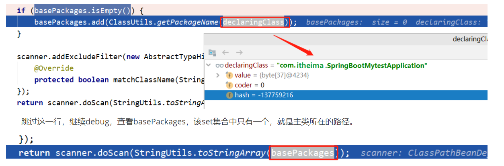

　　跳过这一行，继续debug，查看basePackages，该set集合中只有一个，就是主类所在的路径。

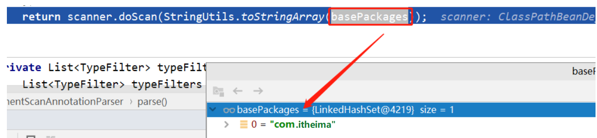

```
TIPS:
　　为什么只有一个还要用一个集合呢，因为我们也可以用@ComponentScan注解指定扫描路径。
```

到这里呢IoC容器初始化三个步骤的第一步，Resource定位就完成了，成功定位到了主类所在的包。

　　接着往下看 return scanner.doScan(StringUtils.toStringArray(basePackages)); Spring是如何进行类扫描的。进入doScan()方法。

```java
 1 // ComponentScanAnnotationParser类
 2 protected Set<BeanDefinitionHolder> doScan(String... basePackages) {
 3     Assert.notEmpty(basePackages, "At least one base package must be specified");
 4     Set<BeanDefinitionHolder> beanDefinitions = new LinkedHashSet<>();
 5     for (String basePackage : basePackages) {
 6         // 从指定的包中扫描需要装载的Bean
 7         Set<BeanDefinition> candidates = findCandidateComponents(basePackage);
 8         for (BeanDefinition candidate : candidates) {
 9             ScopeMetadata scopeMetadata = this.scopeMetadataResolver.resolveScopeMetadata(candidate);
10             candidate.setScope(scopeMetadata.getScopeName());
11             String beanName = this.beanNameGenerator.generateBeanName(candidate, this.registry);
12             if (candidate instanceof AbstractBeanDefinition) {
13                 postProcessBeanDefinition((AbstractBeanDefinition) candidate, beanName);
14             }
15             if (candidate instanceof AnnotatedBeanDefinition) {
16                 AnnotationConfigUtils.processCommonDefinitionAnnotations((AnnotatedBeanDefinition) candidate);
17             }
18             if (checkCandidate(beanName, candidate)) {
19                 BeanDefinitionHolder definitionHolder = new BeanDefinitionHolder(candidate, beanName);
20                 definitionHolder =
21                         AnnotationConfigUtils.applyScopedProxyMode(scopeMetadata, definitionHolder, this.registry);
22                 beanDefinitions.add(definitionHolder);
23                 //将该 Bean 注册进 IoC容器（beanDefinitionMap）
24                 registerBeanDefinition(definitionHolder, this.registry);
25             }
26         }
27     }
28     return beanDefinitions;
29 }
```

　　这个方法中有两个比较重要的方法，第7行 Set candidates = findCandidateComponents(basePackage); 从basePackage中扫描类并解析成BeanDefinition，拿到所有符合条件的类后在第24行 registerBeanDefinition(definitionHolder, this.registry); 将该类注册进IoC容器。也就是说在这个方法中完成了IoC容器初始化过程的第二三步，BeanDefinition的载入，和BeanDefinition的注册。

 

##### findCandidateComponents(basePackage);

跟踪调用栈

```java
 // ClassPathScanningCandidateComponentProvider类
 public Set<BeanDefinition> findCandidateComponents(String basePackage) {
     ...
     else {
         return scanCandidateComponents(basePackage);
     }
 }
 // ClassPathScanningCandidateComponentProvider类
 private Set<BeanDefinition> scanCandidateComponents(String basePackage) {
     Set<BeanDefinition> candidates = new LinkedHashSet<>();
     try {
         //拼接扫描路径，比如：classpath*:com/itheima/**/*.class
         String packageSearchPath = ResourcePatternResolver.CLASSPATH_ALL_URL_PREFIX +
                 resolveBasePackage(basePackage) + '/' + this.resourcePattern;
         //从 packageSearchPath 路径中扫描所有的类
         Resource[] resources = getResourcePatternResolver().getResources(packageSearchPath);
         boolean traceEnabled = logger.isTraceEnabled();
         boolean debugEnabled = logger.isDebugEnabled();
         for (Resource resource : resources) {
             if (traceEnabled) {
                 logger.trace("Scanning " + resource);
             }
             if (resource.isReadable()) {
                 try {
                     MetadataReader metadataReader = getMetadataReaderFactory().getMetadataReader(resource);
                     // //判断该类是不是 @Component 注解标注的类，并且不是需要排除掉的类
                     if (isCandidateComponent(metadataReader)) {
                         //将该类封装成 ScannedGenericBeanDefinition（BeanDefinition接口的实现类）类
                         ScannedGenericBeanDefinition sbd = new ScannedGenericBeanDefinition(metadataReader);
                         sbd.setResource(resource);
                         sbd.setSource(resource);
                         if (isCandidateComponent(sbd)) {
                             if (debugEnabled) {
                                 logger.debug("Identified candidate component class: " + resource);
                             }
                             candidates.add(sbd);
                         } else {
                             if (debugEnabled) {
                                 logger.debug("Ignored because not a concrete top-level class: " + resource);
                             }
                         }
                     } else {
                         if (traceEnabled) {
                             logger.trace("Ignored because not matching any filter: " + resource);
                         }
                     }
                 } catch (Throwable ex) {
                     throw new BeanDefinitionStoreException(
                             "Failed to read candidate component class: " + resource, ex);
                 }
             } else {
                 if (traceEnabled) {
                     logger.trace("Ignored because not readable: " + resource);
                 }
             }
         }
     } catch (IOException ex) {
         throw new BeanDefinitionStoreException("I/O failure during classpath scanning", ex);
     }
     return candidates;
 }
```

在第13行将basePackage拼接成classpath*:org/springframework/boot/demo/**/*.class，在第16行的getResources(packageSearchPath);方法中扫描到了该路径下的所有的类。然后遍历这些Resources，在第27行判断该类是不是 @Component 注解标注的类，并且不是需要排除掉的类。在第29行将扫描到的类，解析成ScannedGenericBeanDefinition，该类是BeanDefinition接口的实现类。OK，IoC容器的BeanDefinition载入到这里就结束了。

　　回到前面的doScan()方法，debug看一下结果（截图中所示的就是定位的需要交给Spring容器管理的类）。

 

##### registerBeanDefinition(definitionHolder, this.registry);

　　查看registerBeanDefinition()方法。是不是有点眼熟，在前面介绍prepareContext()方法时，我们详细介绍了主类的BeanDefinition是怎么一步一步的注册进DefaultListableBeanFactory的beanDefinitionMap中的。完成了BeanDefinition的注册，就完成了IoC容器的初始化过程。此时，在使用的IoC容器DefaultListableFactory中已经建立了整个Bean的配置信息，而这些BeanDefinition已经可以被容器使用了。他们都在BeanbefinitionMap里被检索和使用。容器的作用就是对这些信息进行处理和维护。这些信息是容器简历依赖反转的基础。

```java
 protected void registerBeanDefinition(BeanDefinitionHolder definitionHolder, BeanDefinitionRegistry registry) {
     BeanDefinitionReaderUtils.registerBeanDefinition(definitionHolder, registry);
 }
```

 　OK，到这里IoC容器的初始化过程的三个步骤就梳理完了。当然这只是针对SpringBoot的包扫描的定位方式的BeanDefinition的定位，加载，和注册过程。前面我们说过，还有两种方式@Import和SPI扩展实现的starter的自动装配。

 

##### @Import注解的解析过程

现在大家也应该知道了，各种@EnableXXX注解，很大一部分都是对@Import的二次封装（其实也是为了解耦，比如当@Import导入的类发生变化时，我们的业务系统也不需要改任何代码）。

　　我们又要回到上文中的ConfigurationClassParser类的doProcessConfigurationClass方法的第68行processImports(configClass, sourceClass, getImports(sourceClass), true);，跳跃性比较大。上面解释过，我们只针对主类进行分析，因为这里有递归。

　　processImports(configClass, sourceClass, getImports(sourceClass), true);中configClass和sourceClass参数都是主类相对应的。

首先看getImports(sourceClass)；

```java
 private Set<SourceClass> getImports(SourceClass sourceClass) throws IOException {
     Set<SourceClass> imports = new LinkedHashSet<>();
     Set<SourceClass> visited = new LinkedHashSet<>();
     collectImports(sourceClass, imports, visited);
     return imports;
 }
```

 　debug

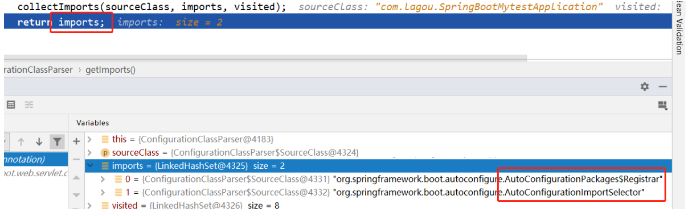

两个呢是主类上的@SpringBootApplication中的@Import注解指定的类

接下来，是不是要进行执行了

记下来再回到ConfigurationClassParser类的parse(Set configCandidates)：

```java
public void parse(Set<BeanDefinitionHolder> configCandidates) {
        for (BeanDefinitionHolder holder : configCandidates) {
            BeanDefinition bd = holder.getBeanDefinition();
            try {
                if (bd instanceof AnnotatedBeanDefinition) {
                    parse(((AnnotatedBeanDefinition) bd).getMetadata(), holder.getBeanName());
                }
                else if (bd instanceof AbstractBeanDefinition && ((AbstractBeanDefinition) bd).hasBeanClass()) {
                    parse(((AbstractBeanDefinition) bd).getBeanClass(), holder.getBeanName());
                }
                else {
                    parse(bd.getBeanClassName(), holder.getBeanName());
                }
            }
            catch (BeanDefinitionStoreException ex) {
                throw ex;
            }
            catch (Throwable ex) {
                throw new BeanDefinitionStoreException(
                        "Failed to parse configuration class [" + bd.getBeanClassName() + "]", ex);
            }
        }

        // 去执行组件类
        this.deferredImportSelectorHandler.process();
    }

```

点进process方法：

```java
    public void process() {
            List<DeferredImportSelectorHolder> deferredImports = this.deferredImportSelectors;
            this.deferredImportSelectors = null;
            try {
                if (deferredImports != null) {
                    DeferredImportSelectorGroupingHandler handler = new DeferredImportSelectorGroupingHandler();
                    deferredImports.sort(DEFERRED_IMPORT_COMPARATOR);
                    deferredImports.forEach(handler::register);
                    // 继续点击进去
                    handler.processGroupImports();
                }
            }
            finally {
                this.deferredImportSelectors = new ArrayList<>();
            }
        }
    }
```

继续点击handler.processGroupImports();

```java
public void processGroupImports() {
            for (DeferredImportSelectorGrouping grouping : this.groupings.values()) {
                Predicate<String> exclusionFilter = grouping.getCandidateFilter();
                // 查看调用的getimports
                grouping.getImports().forEach(entry -> {
                    ConfigurationClass configurationClass = this.configurationClasses.get(entry.getMetadata());
                    try {
                        processImports(configurationClass, asSourceClass(configurationClass, exclusionFilter),
                                Collections.singleton(asSourceClass(entry.getImportClassName(), exclusionFilter)),
                                exclusionFilter, false);
                    }
                    catch (BeanDefinitionStoreException ex) {
                        throw ex;
                    }
                    catch (Throwable ex) {
                        throw new BeanDefinitionStoreException(
                                "Failed to process import candidates for configuration class [" +
                                        configurationClass.getMetadata().getClassName() + "]", ex);
                    }
                });
            }
        }
// 是不是很熟悉了  
public Iterable<Group.Entry> getImports() {
            for (DeferredImportSelectorHolder deferredImport : this.deferredImports) {
                // 调用了process方法
                this.group.process(deferredImport.getConfigurationClass().getMetadata(),
                        deferredImport.getImportSelector());
            }
            return this.group.selectImports();
        }
```

和之前介绍的process完美衔接

```java
    public void process(AnnotationMetadata annotationMetadata, DeferredImportSelector deferredImportSelector) {
            Assert.state(deferredImportSelector instanceof AutoConfigurationImportSelector,
                    () -> String.format("Only %s implementations are supported, got %s",
                            AutoConfigurationImportSelector.class.getSimpleName(),
                            deferredImportSelector.getClass().getName()));

            // 【1】,调用getAutoConfigurationEntry方法得到自动配置类放入autoConfigurationEntry对象中
            AutoConfigurationEntry autoConfigurationEntry = ((AutoConfigurationImportSelector) deferredImportSelector)
                    .getAutoConfigurationEntry(getAutoConfigurationMetadata(), annotationMetadata);

            // 【2】，又将封装了自动配置类的autoConfigurationEntry对象装进autoConfigurationEntries集合
            this.autoConfigurationEntries.add(autoConfigurationEntry);
            // 【3】，遍历刚获取的自动配置类
            for (String importClassName : autoConfigurationEntry.getConfigurations()) {
                // 这里符合条件的自动配置类作为key，annotationMetadata作为值放进entries集合
                this.entries.putIfAbsent(importClassName, annotationMetadata);
            }
        }
```

#### 第六步：刷新应用上下文后的扩展接口

```java
protected void afterRefresh(ConfigurableApplicationContext context,
        ApplicationArguments args) {
}
```

扩展接口，设计模式中的模板方法，默认为空实现。如果有自定义需求，可以重写该方法。比如打印一些启动结束log，或者一些其它后置处理。

 

## 5 源码剖析-自定义Starter

#### **SpringBoot starter机制**

　SpringBoot中的starter是一种非常重要的机制，能够抛弃以前繁杂的配置，将其统一集成进starter，应用者只需要在maven中引入starter依赖，SpringBoot就能自动扫描到要加载的信息并启动相应的默认配置。starter让我们摆脱了各种依赖库的处理，需要配置各种信息的困扰。SpringBoot会自动通过classpath路径下的类发现需要的Bean，并注册进IOC容器。SpringBoot提供了针对日常企业应用研发各种场景的spring-boot-starter依赖模块。所有这些依赖模块都遵循着约定成俗的默认配置，并允许我们调整这些配置，即遵循“约定大于配置”的理念。

比如我们在springboot里面要引入redis,那么我们需要在pom中引入以下内容

```xml
<dependency>
  <groupId>org.springframework.boot</groupId>
  <artifactId>spring-boot-starter-data-redis</artifactId>
</dependency>
```

这其实就是一个starter。

简而言之，starter就是一个外部的项目，我们需要使用它的时候就可以在当前springboot项目中引入它。

 

**为什么要自定义starter**

在我们的日常开发工作中，经常会有一些独立于业务之外的配置模块，我们经常将其放到一个特定的包下，然后如果另一个工程需要复用这块功能的时候，需要将代码硬拷贝到另一个工程，重新集成一遍，麻烦至极。如果我们将这些可独立于业务代码之外的功配置模块封装成一个个starter，复用的时候只需要将其在pom中引用依赖即可，再由SpringBoot为我们完成自动装配，就非常轻松了

 

#### 自定义starter的案例

　　以下案例是开发中遇到的部分场景

　　▲ 动态数据源。

　　▲ 登录模块。

　　▲ 基于AOP技术实现日志切面。

​		.........

 

#### 自定义starter的命名规则

SpringBoot提供的starter以`spring-boot-starter-xxx`的方式命名的。

官方建议自定义的starter使用`xxx-spring-boot-starter`命名规则。以区分SpringBoot生态提供的starter

 

#### 自定义starter代码实现

整个过程分为两部分：

- 自定义starter
- 使用starter

 

##### （1）自定义starter

首先，先完成自定义starter

（1）新建maven  jar工程，工程名为zdy-spring-boot-starter，导入依赖：

```xml
<dependencies>
    <dependency>
        <groupId>org.springframework.boot</groupId>
        <artifactId>spring-boot-autoconfigure</artifactId>
        <version>2.2.9.RELEASE</version>
    </dependency>
</dependencies>
```

（2）编写javaBean

```java
@EnableConfigurationProperties(SimpleBean.class) 
@ConfigurationProperties(prefix = "simplebean") 
public class SimpleBean {

    private int id;
    private String name;

    public int getId() {
        return id;
    }

    public void setId(int id) {
        this.id = id;
    }

    public String getName() {
        return name;
    }

    public void setName(String name) {
        this.name = name;
    }

    @Override
    public String toString() {
        return "SimpleBean{" +
                "id=" + id +
                ", name='" + name + '\'' +
                '}';
    }
}
```

（3）编写配置类MyAutoConfiguration

```java
@Configuration
public class MyAutoConfiguration {


    static {
        System.out.println("MyAutoConfiguration init....");
    }


    @Bean
    public SimpleBean simpleBean(){
        return new SimpleBean();
    }

}
```

（4）resources下创建/META-INF/spring.factories

注意：META-INF是自己手动创建的目录，spring.factories也是手动创建的文件,在该文件中配置自己的自动配置类


```properties
org.springframework.boot.autoconfigure.EnableAutoConfiguration=\
com.itheima.config.MyAutoConfiguration
```

上面这句话的意思就是SpringBoot启动的时候会去加载我们的simpleBean到IOC容器中。这其实是一种变形的SPI机制

 

##### （2）使用自定义starter

（1）导入自定义starter的依赖

```xml
<dependency>
   <groupId>com.itheima</groupId>
   <artifactId>zdy-spring-boot-starter</artifactId>
   <version>1.0-SNAPSHOT</version>

</dependency>
```

（2）在全局配置文件中配置属性值

```properties
simplebean.id=1
simplebean.name=自定义starter
```

（3）编写测试方法

```java
//测试自定义starter
@Autowired
private SimpleBean simpleBean;

@Test
public void zdyStarterTest(){
   System.out.println(simpleBean);
}
```

但此处还有一个问题，如果有一天我们不想要启动工程的时候自动装配SimpleBean呢？可能有的同学会想，那简单啊，我们去pom中把依赖注释掉，的确，这是一种方案，但为免有点Low。

 

#### 热插拔技术

还记得我们经常会在启动类Application上面加@EnableXXX注解吗？

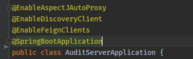

其实这个@Enablexxx注解就是一种热拔插技术，加了这个注解就可以启动对应的starter，当不需要对应的starter的时候只需要把这个注解注释掉就行，是不是很优雅呢？那么这是如何实现的呢？

 

改造zdy工程新增热插拔支持类

新增标记类ConfigMarker

```java
public class ConfigMarker {
  
}
```

新增EnableRegisterServer注解

```java
@Target({ElementType.TYPE})
@Retention(RetentionPolicy.RUNTIME)
@Import({ConfigMarker.class})
public @interface EnableRegisterServer {
}
```

改造`MyAutoConfiguration`新增条件注解`@ConditionalOnBean(ConfigMarker.class)`，`@ConditionalOnBean`这个是条件注解，前面的意思代表只有当期上下文中含有`ConfigMarker`对象，被标注的类才会被实例化。

```java
@Configuration
@ConditionalOnBean(ConfigMarker.class)
public class MyAutoConfiguration {

    static {
        System.out.println("MyAutoConfiguration init....");
    }

    @Bean
    public SimpleBean simpleBean(){
        return new SimpleBean();
    }

}
```

改造service工程

在启动类上新增@EnableImRegisterServer注解

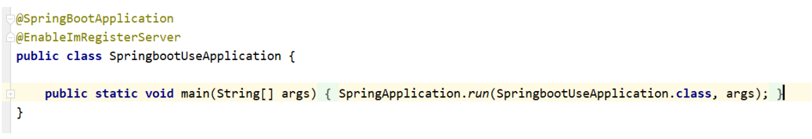

到此热插拔就实现好了，当你加了`@EnableImRegisterServer`的时候启动zdy工程就会自动装配SimpleBean，反之则不装配。 让的原理也很简单，当加了`@EnableImRegisterServer`注解的时候，由于这个注解使用了`@Import({ConfigMarker.class})`，所以会导致Spring去加载`ConfigMarker`到上下文中，而又因为条件注解`@ConditionalOnBean(ConfigMarker.class)`的存在，所以`MyAutoConfiguration`类就会被实例化。

#### 关于条件注解的讲解

- @ConditionalOnBean：仅仅在当前容器给i中存在某个对象时，才会实例化一个Bean。
- @ConditionalOnClass：某个class位于类路径上，才会实例化一个Bean。
- @ConditionalOnExpression：当表达式为true的时候，才会实例化一个Bean。基于SpEL表达式的条件判断。
- @ConditionalOnMissingBean：仅仅在当前上下文中不存在某个对象时，才会实例化一个Bean。
- @ConditionalOnMissingClass：某个class类路径上不存在的时候，才会实例化一个Bean。
- @ConditionalOnNotWebApplication：不是web应用，才会实例化一个Bean。
- @ConditionalOnWebApplication：当项目是一个Web项目时进行实例化。
- @ConditionalOnNotWebApplication：当项目不是一个Web项目时进行实例化。
- @ConditionalOnProperty：当指定的属性有指定的值时进行实例化。
- @ConditionalOnJava：当JVM版本为指定的版本范围时触发实例化。
- @ConditionalOnResource：当类路径下有指定的资源时触发实例化。
- @ConditionalOnJndi：在JNDI存在的条件下触发实例化。
- @ConditionalOnSingleCandidate：当指定的Bean在容器中只有一个，或者有多个但是指定了首选的Bean时触发实例化。

 

 

## 6 源码剖析-内嵌Tomcat

Spring Boot默认支持Tomcat，Jetty，和Undertow作为底层容器。

而Spring Boot默认使用Tomcat，一旦引入spring-boot-starter-web模块，就默认使用Tomcat容器。

```xml
<dependency>
  <groupId>org.springframework.boot</groupId>
  <artifactId>spring-boot-starter-web</artifactId>
</dependency>
```

 

### Servlet容器的使用

#### 默认servlet容器	

我们看看spring-boot-starter-web这个starter中有什么

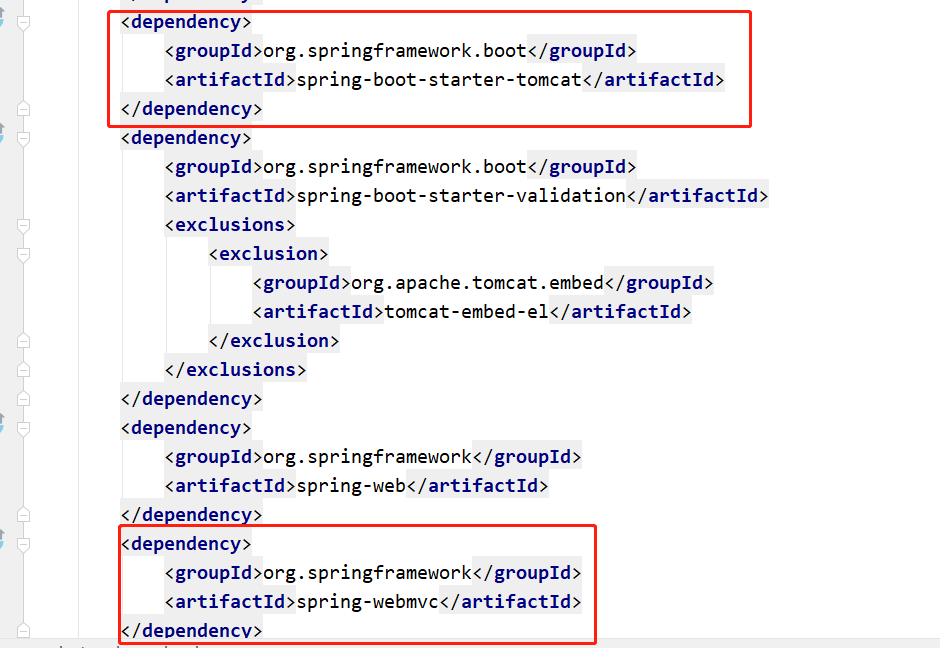

 

核心就是引入了tomcat和SpringMvc

 

### 切换servlet容器

那如果我么想切换其他Servlet容器呢，只需如下两步：

- 将tomcat依赖移除掉
- 引入其他Servlet容器依赖

引入jetty：

```xml
<dependency>
    <groupId>org.springframework.boot</groupId>
    <artifactId>spring-boot-starter-web</artifactId>
    <exclusions>
        <exclusion>
            <!--移除spring-boot-starter-web中的tomcat-->
            <artifactId>spring-boot-starter-tomcat</artifactId>
            <groupId>org.springframework.boot</groupId>
        </exclusion>
    </exclusions>
</dependency>

<dependency>
    <groupId>org.springframework.boot</groupId>
    <!--引入jetty-->
    <artifactId>spring-boot-starter-jetty</artifactId>
</dependency>
```

 

### 内嵌Tomcat自动配置原理

在启动springboot的时候可谓是相当简单，只需要执行以下代码

```java
public static void main(String[] args) {
    SpringApplication.run(SpringBootMytestApplication.class, args);
}
```

那些看似简单的事物，其实并不简单。我们之所以觉得他简单，是因为复杂性都被隐藏了。通过上述代码，大概率可以提出以下几个疑问

- SpringBoot是如何启动内置tomcat的
- SpringBoot为什么可以响应请求，他是如何配置的SpringMvc

 

#### SpringBoot启动内置tomcat流程

1、进入SpringBoot启动类，点进@SpringBootApplication源码，如下图

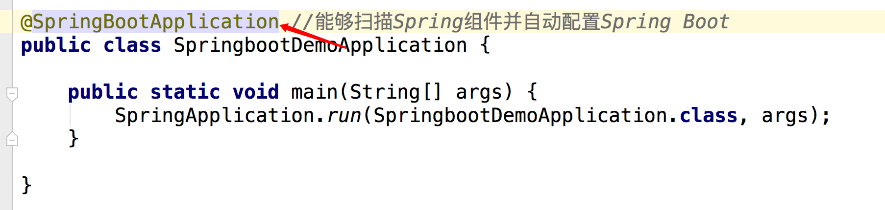

------

 

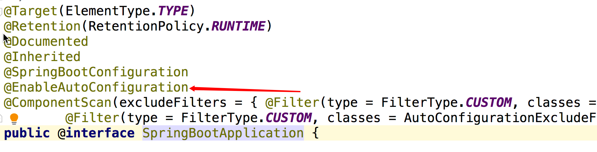

 

2、继续点进@EnableAutoConfiguration,进入该注解，如下图

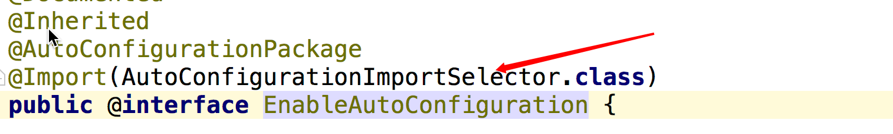

 

3、上图中使用@Import注解对AutoConfigurationImportSelector 类进行了引入，该类做了什么事情呢？进入源码，首先调用selectImport()方法，在该方法中调用了getAutoConfigurationEntry（）方法，在之中又调用了getCandidateConfigurations()方法，getCandidateConfigurations()方法就去META-INF/spring.factory配置文件中加载相关配置类

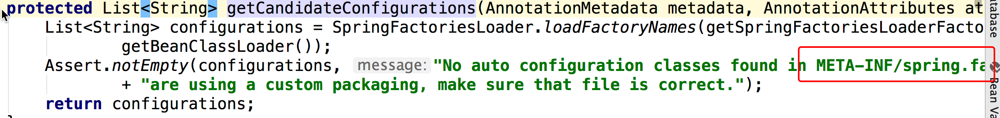

 

这个spring.factories配置文件是加载的spring-boot-autoconfigure的配置文件

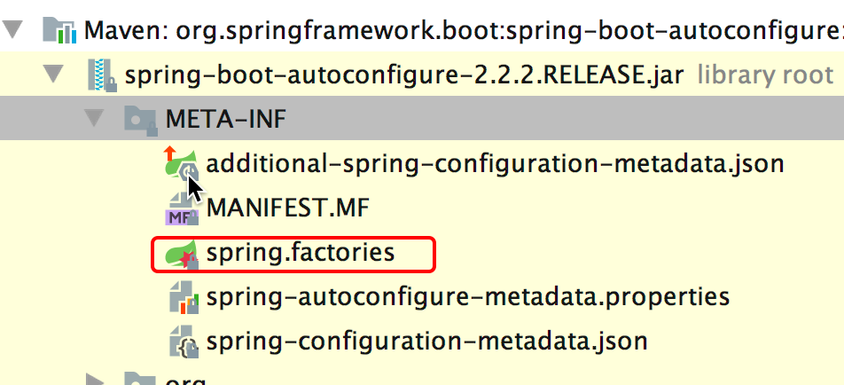

 

继续打开spring.factories配置文件，找到tomcat所在的类，tomcat加载在ServletWebServerFactoryAutoConfiguration配置类中

 


 

进入该类，里面也通过@Import注解将EmbeddedTomcat、EmbeddedJetty、EmbeddedUndertow等嵌入式容器类加载进来了，springboot默认是启动嵌入式tomcat容器，如果要改变启动jetty或者undertow容器，需在pom文件中去设置。如下图：

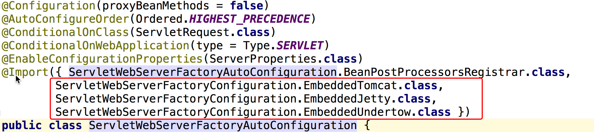

 

继续进入EmbeddedTomcat类中，见下图：

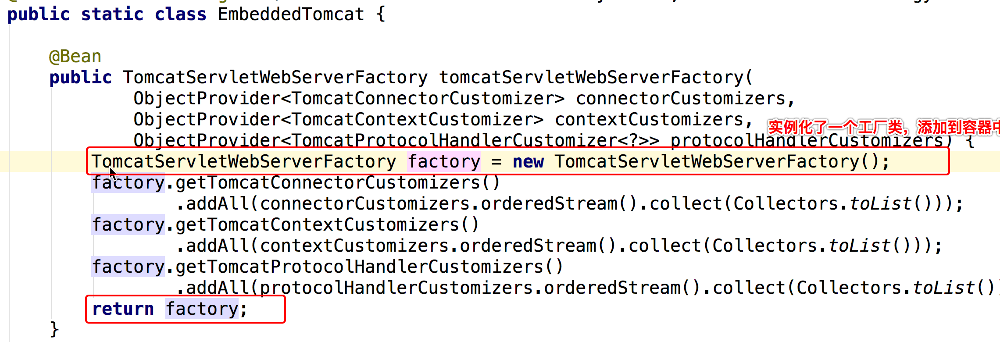

进入TomcatServletWebServerFactory类，里面的getWebServer（）是关键方法，如图：

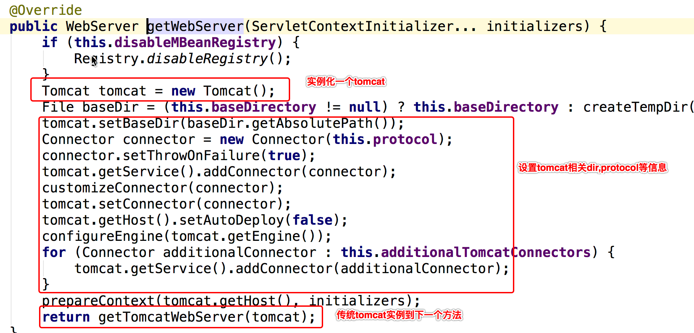

 

继续进入getTomcatWebServer()等方法，一直往下跟到tomcat初始化方法，调用tomcat.start()方法，tomcat就正式开启运行，见图

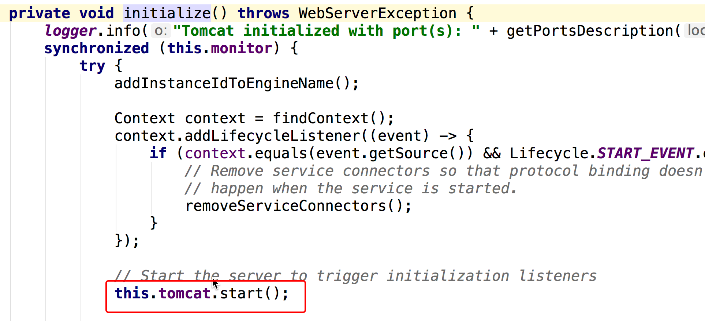

走到这里tomcat在springboot中的配置以及最终启动的流程就走完了，相信大家肯定有一个疑问，上上图中的getWebServer()方法是在哪里调用的呢？上面的代码流程并没有发现getWebServer()被调用的地方。因为getWebServer()方法的调用根本就不在上面的代码流程中，它是在另外一个流程中被调用的

 

#### getWebServer()的调用分析

首先进入SpringBoot启动类的run方法：

```java
SpringApplication.run(HppaApplication.class, args);
```

这个会最终调用到一个同名方法run(String… args)

```java
public ConfigurableApplicationContext run(String... args) {
    //StopWatch主要是用来统计每项任务执行时长，例如Spring Boot启动占用总时长。
    StopWatch stopWatch = new StopWatch();
    stopWatch.start();
    ConfigurableApplicationContext context = null;
    Collection<SpringBootExceptionReporter> exceptionReporters = new ArrayList<>();
    configureHeadlessProperty();
    //第一步：获取并启动监听器 通过加载META-INF/spring.factories 完成了SpringApplicationRunListener实例化工作
    SpringApplicationRunListeners listeners = getRunListeners(args);
    //实际上是调用了EventPublishingRunListener类的starting()方法
    listeners.starting();
    try {
        ApplicationArguments applicationArguments = new DefaultApplicationArguments(args);
        //第二步：构造容器环境，简而言之就是加载系统变量，环境变量，配置文件
        ConfigurableEnvironment environment = prepareEnvironment(listeners, applicationArguments);
        //设置需要忽略的bean
        configureIgnoreBeanInfo(environment);
        //打印banner
        Banner printedBanner = printBanner(environment);
        //第三步：创建容器
        context = createApplicationContext();
        //第四步：实例化SpringBootExceptionReporter.class，用来支持报告关于启动的错误
        exceptionReporters = getSpringFactoriesInstances(SpringBootExceptionReporter.class,
                new Class[] { ConfigurableApplicationContext.class }, context);
        //第五步：准备容器 这一步主要是在容器刷新之前的准备动作。包含一个非常关键的操作：将启动类注入容器，为后续开启自动化配置奠定基础。
        prepareContext(context, environment, listeners, applicationArguments, printedBanner);
        //第六步：刷新容器 springBoot相关的处理工作已经结束，接下的工作就交给了spring。 内部会调用spring的refresh方法，
        // refresh方法在spring整个源码体系中举足轻重，是实现 ioc 和 aop的关键。
        refreshContext(context);
        //第七步：刷新容器后的扩展接口 设计模式中的模板方法，默认为空实现。如果有自定义需求，可以重写该方法。比如打印一些启动结束log，或者一些其它后置处理。
        afterRefresh(context, applicationArguments);
        stopWatch.stop();
        if (this.logStartupInfo) {
            new StartupInfoLogger(this.mainApplicationClass).logStarted(getApplicationLog(), stopWatch);
        }
        //发布应用已经启动的事件
        listeners.started(context);
        /*
         * 遍历所有注册的ApplicationRunner和CommandLineRunner，并执行其run()方法。
         * 我们可以实现自己的ApplicationRunner或者CommandLineRunner，来对SpringBoot的启动过程进行扩展。
         */
        callRunners(context, applicationArguments);
    }
    catch (Throwable ex) {
        handleRunFailure(context, ex, exceptionReporters, listeners);
        throw new IllegalStateException(ex);
    }

    try {
        //应用已经启动完成的监听事件
        listeners.running(context);
    }
    catch (Throwable ex) {
        handleRunFailure(context, ex, exceptionReporters, null);
        throw new IllegalStateException(ex);
    }
    return context;
}
```

这个方法大概做了以下几件事

1. 获取并启动监听器 通过加载META-INF/spring.factories 完成了SpringApplicationRunListener实例化工作
2. 构造容器环境，简而言之就是加载系统变量，环境变量，配置文件
3. 创建容器
4. 实例化SpringBootExceptionReporter.class，用来支持报告关于启动的错误
5. 准备容器
6. 刷新容器
7. 刷新容器后的扩展接口

那么内置tomcat启动源码，就是隐藏在上诉第六步：refreshContext方法里面，该方法最终会调用到AbstractApplicationContext类的refresh()方法

进入refreshContext()方法，如图：

```java
public void refresh() throws BeansException, IllegalStateException {
    synchronized (this.startupShutdownMonitor) {
        // Prepare this context for refreshing.
        prepareRefresh();

        // Tell the subclass to refresh the internal bean factory.
        ConfigurableListableBeanFactory beanFactory = obtainFreshBeanFactory();

        // Prepare the bean factory for use in this context.
        prepareBeanFactory(beanFactory);

        try {
            // Allows post-processing of the bean factory in context subclasses.
            postProcessBeanFactory(beanFactory);

            // Invoke factory processors registered as beans in the context.
            invokeBeanFactoryPostProcessors(beanFactory);

            // Register bean processors that intercept bean creation.
            registerBeanPostProcessors(beanFactory);

            // Initialize message source for this context.
            initMessageSource();

            // Initialize event multicaster for this context.
            initApplicationEventMulticaster();

            // Initialize other special beans in specific context subclasses.
            onRefresh();

            // Check for listener beans and register them.
            registerListeners();

            // Instantiate all remaining (non-lazy-init) singletons.
            finishBeanFactoryInitialization(beanFactory);

            // Last step: publish corresponding event.
            finishRefresh();
        }

        catch (BeansException ex) {
            if (logger.isWarnEnabled()) {
                logger.warn("Exception encountered during context initialization - " +
                        "cancelling refresh attempt: " + ex);
            }

            // Destroy already created singletons to avoid dangling resources.
            destroyBeans();

            // Reset 'active' flag.
            cancelRefresh(ex);

            // Propagate exception to caller.
            throw ex;
        }

        finally {
            // Reset common introspection caches in Spring's core, since we
            // might not ever need metadata for singleton beans anymore...
            resetCommonCaches();
        }
    }
}
```

一直点击refresh()方法，如图：

onRefresh()会调用到ServletWebServerApplicationContext中的createWebServer()

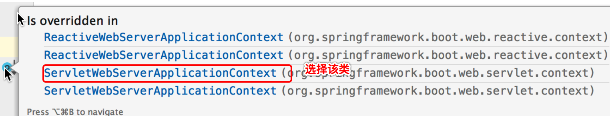

 

```java
private void createWebServer() {
    WebServer webServer = this.webServer;
    ServletContext servletContext = getServletContext();
    if (webServer == null && servletContext == null) {
        ServletWebServerFactory factory = getWebServerFactory();
        this.webServer = factory.getWebServer(getSelfInitializer());
    }
    else if (servletContext != null) {
        try {
            getSelfInitializer().onStartup(servletContext);
        }
        catch (ServletException ex) {
            throw new ApplicationContextException("Cannot initialize servlet context", ex);
        }
    }
    initPropertySources();
}
```

createWebServer()就是启动web服务，但是还没有真正启动Tomcat，既然webServer是通过ServletWebServerFactory来获取的，那就来看看这个工厂的真面目。

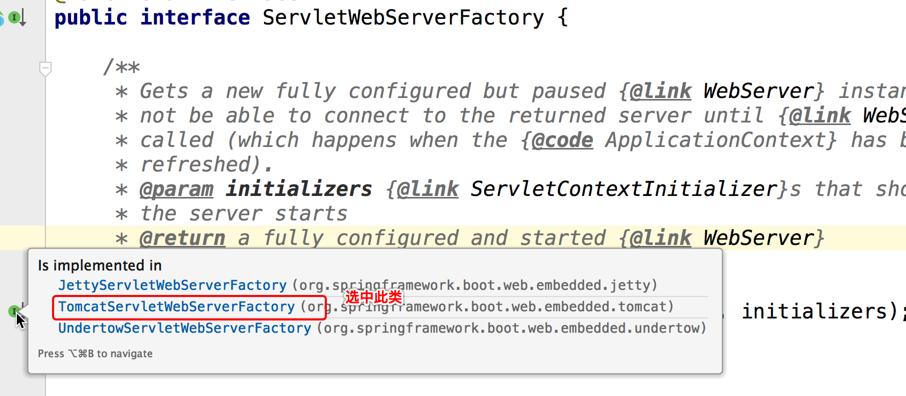

可以看到，tomcat,Jetty都实现了这个getWebServer方法，我们看TomcatServletWebServerFactory中的getWebServer(ServletContextInitializer… initializers).

 

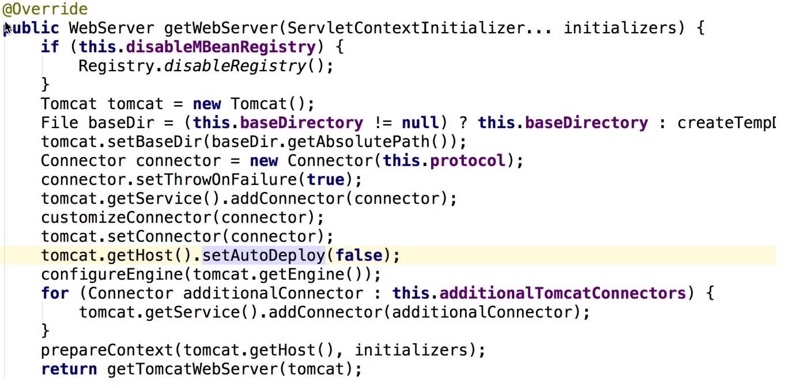

 

最终就调用了TomcatServletWebServerFactory类的getWebServer()方法。

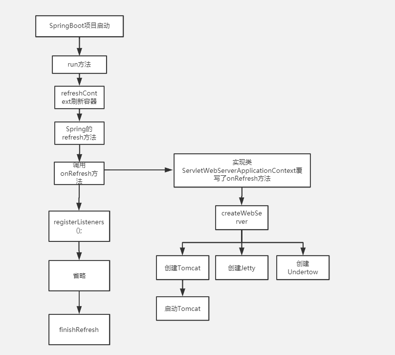

#### 小结

springboot的内部通过`new Tomcat()`的方式启动了一个内置Tomcat。但是这里还有一个问题，这里只是启动了tomcat，但是我们的springmvc是如何加载的呢？下一节我们讲接收，springboot是如何自动装配springmvc的

 

## 7 源码剖析-自动配置SpringMVC

在上一小节，我们介绍了SpringBoot是如何启动一个内置tomcat的。

但，SpringBoot又是如何装配的springMVC呢？

其实仅仅引入starter是不够的，回忆一下，在一个普通的WEB项目中如何去使用SpringMVC，我们首先就是要在web.xml中配置如下配置

```xml
<servlet>
    <description>spring mvc servlet</description>
    <servlet-name>springMvc</servlet-name>
    <servlet-class>org.springframework.web.servlet.DispatcherServlet</servlet-class>
    <load-on-startup>1</load-on-startup>
</servlet>
<servlet-mapping>
    <servlet-name>springMvc</servlet-name>
    <url-pattern>*.do</url-pattern>
</servlet-mapping>
```

但是在SpringBoot中，我们没有了web.xml文件，我们如何去配置一个`Dispatcherservlet`呢？其实Servlet3.0规范中规定，要添加一个Servlet，除了采用xml配置或注解的方式，还有一种通过代码的方式，伪代码如下

```java
servletContext.addServlet(name, this.servlet);
```

那么也就是说，如果我们能动态往web容器中添加一个我们构造好的`DispatcherServlet`对象，是不是就实现自动装配SpringMVC了

 

#### 自动配置（一）自动配置DispatcherServlet和DispatcherServletRegistry

springboot的自动配置基于SPI机制，实现自动配置的核心要点就是添加一个自动配置的类，SpringBoot MVC的自动配置自然也是相同原理。

所以，先找到springmvc对应的自动配置类。

```java
org.springframework.boot.autoconfigure.web.servlet.DispatcherServletAutoConfiguration
```

##### DispatcherServletAutoConfiguration自动配置类 

```java
@AutoConfigureOrder(Ordered.HIGHEST_PRECEDENCE)
@Configuration(proxyBeanMethods = false)
@ConditionalOnWebApplication(type = Type.SERVLET)
@ConditionalOnClass(DispatcherServlet.class)
@AutoConfigureAfter(ServletWebServerFactoryAutoConfiguration.class)
public class DispatcherServletAutoConfiguration {
    //...
}
```

1、首先注意到，@Configuration表名这是一个配置类，将会被spring给解析。

2、@ConditionalOnWebApplication意味着当时一个web项目，且是Servlet项目的时候才会被解析。

3、@ConditionalOnClass指明DispatcherServlet这个核心类必须存在才解析该类。

4、@AutoConfigureAfter指明在ServletWebServerFactoryAutoConfiguration这个类之后再解析，设定了一个顺序。

总的来说，这些注解表明了该自动配置类的会解析的前置条件需要满足。

 

其次，DispatcherServletAutoConfiguration类主要包含了两个内部类，分别是

1、DispatcherServletConfiguration

2、DispatcherServletRegistrationConfiguration

顾名思义，前者是配置DispatcherServlet，后者是配置DispatcherServlet的注册类。什么是注册类？我们知道Servlet实例是要被添加（注册）到如tomcat这样的ServletContext里的，这样才能够提供请求服务。所以，DispatcherServletRegistrationConfiguration将生成一个Bean，负责将DispatcherServlet给注册到ServletContext中。

 

##### 配置DispatcherServletConfiguration

我们先看看DispatcherServletConfiguration这个配置类

```java
@Configuration(proxyBeanMethods = false)
@Conditional(DefaultDispatcherServletCondition.class)
@ConditionalOnClass(ServletRegistration.class)
@EnableConfigurationProperties({ HttpProperties.class, WebMvcProperties.class })
protected static class DispatcherServletConfiguration {

    //...
}
```

@Conditional指明了一个前置条件判断，由DefaultDispatcherServletCondition实现。主要是判断了是否已经存在DispatcherServlet，如果没有才会触发解析。

@ConditionalOnClass指明了当ServletRegistration这个类存在的时候才会触发解析，生成的DispatcherServlet才能注册到ServletContext中。

最后，@EnableConfigrationProperties将会从application.properties这样的配置文件中读取spring.http和spring.mvc前缀的属性生成配置对象HttpProperties和WebMvcProperties。

 

再看DispatcherServletConfiguration这个内部类的内部代码

```java
@Bean(name = DEFAULT_DISPATCHER_SERVLET_BEAN_NAME)
public DispatcherServlet dispatcherServlet(HttpProperties httpProperties, WebMvcProperties webMvcProperties) {
    DispatcherServlet dispatcherServlet = new DispatcherServlet();
    dispatcherServlet.setDispatchOptionsRequest(webMvcProperties.isDispatchOptionsRequest());
    dispatcherServlet.setDispatchTraceRequest(webMvcProperties.isDispatchTraceRequest());
    dispatcherServlet.setThrowExceptionIfNoHandlerFound(webMvcProperties.isThrowExceptionIfNoHandlerFound());
    dispatcherServlet.setPublishEvents(webMvcProperties.isPublishRequestHandledEvents());
    dispatcherServlet.setEnableLoggingRequestDetails(httpProperties.isLogRequestDetails());
    return dispatcherServlet;
}

@Bean
@ConditionalOnBean(MultipartResolver.class)
@ConditionalOnMissingBean(name = DispatcherServlet.MULTIPART_RESOLVER_BEAN_NAME)
public MultipartResolver multipartResolver(MultipartResolver resolver) {
    // Detect if the user has created a MultipartResolver but named it incorrectly
    return resolver;
}
```

这个两个方法我们比较熟悉了，就是生成了Bean。

dispatcherServlet方法将生成一个DispatcherServlet的Bean对象。比较简单，就是获取一个实例，然后添加一些属性设置。

multipartResolver方法主要是把你配置的MultipartResolver的Bean给重命名一下，防止你不是用multipartResolver这个名字作为Bean的名字。

 

##### 配置DispatcherServletRegistrationConfiguration

再看注册类的Bean配置

```java
@Configuration(proxyBeanMethods = false)
@Conditional(DispatcherServletRegistrationCondition.class)
@ConditionalOnClass(ServletRegistration.class)
@EnableConfigurationProperties(WebMvcProperties.class)
@Import(DispatcherServletConfiguration.class)
protected static class DispatcherServletRegistrationConfiguration {
    //...
}
```

同样的，@Conditional有一个前置判断，DispatcherServletRegistrationCondition主要判断了该注册类的Bean是否存在。

@ConditionOnClass也判断了ServletRegistration是否存在

@EnableConfigurationProperties生成了WebMvcProperties的属性对象

@Import导入了DispatcherServletConfiguration，也就是我们上面的配置对象。

 

再看DispatcherServletRegistrationConfiguration的内部实现

```java
@Bean(name = DEFAULT_DISPATCHER_SERVLET_REGISTRATION_BEAN_NAME)
@ConditionalOnBean(value = DispatcherServlet.class, name = DEFAULT_DISPATCHER_SERVLET_BEAN_NAME)
public DispatcherServletRegistrationBean dispatcherServletRegistration(DispatcherServlet dispatcherServlet,
        WebMvcProperties webMvcProperties, ObjectProvider<MultipartConfigElement> multipartConfig) {
    DispatcherServletRegistrationBean registration = new DispatcherServletRegistrationBean(dispatcherServlet,
            webMvcProperties.getServlet().getPath());
    registration.setName(DEFAULT_DISPATCHER_SERVLET_BEAN_NAME);
    registration.setLoadOnStartup(webMvcProperties.getServlet().getLoadOnStartup());
    multipartConfig.ifAvailable(registration::setMultipartConfig);
    return registration;
}
```

内部只有一个方法，生成了DispatcherServletRegistrationBean。核心逻辑就是实例化了一个Bean，设置了一些参数，如dispatcherServlet、loadOnStartup等

##### 总结

springboot mvc的自动配置类是DispatcherServletAutoConfigration，主要做了两件事：

1）配置DispatcherServlet

2）配置DispatcherServlet的注册Bean(DispatcherServletRegistrationBean)

 

#### 自动配置（二）注册DispatcherServlet到ServletContext

在上一小节的源码翻阅中，我们看到了DispatcherServlet和DispatcherServletRegistrationBean这两个Bean的自动配置。DispatcherServlet我们很熟悉，DispatcherServletRegistrationBean负责将DispatcherServlet注册到ServletContext当中

##### DispatcherServletRegistrationBean的类图

既然该类的职责是负责注册DispatcherServlet，那么我们得知道什么时候触发注册操作。为此，我们先看看DispatcherServletRegistrationBean这个类的类图

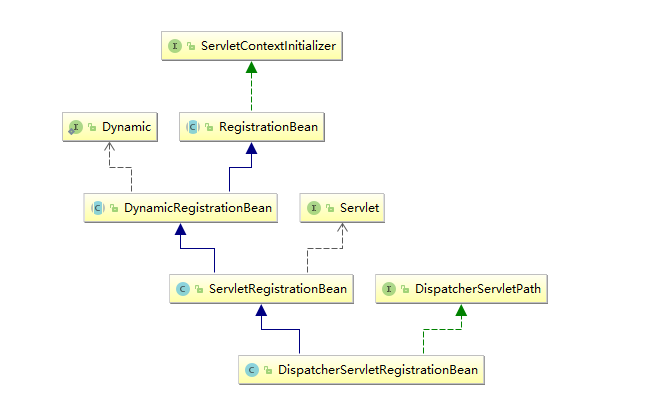

##### 注册DispatcherServlet流程

##### ServletContextInitializer

我们看到，最上面是一个ServletContextInitializer接口。我们可以知道，实现该接口意味着是用来初始化ServletContext的。我们看看该接口

```java
public interface ServletContextInitializer {
    void onStartup(ServletContext servletContext) throws ServletException;
}
```

 

##### RegistrationBean

看看RegistrationBean是怎么实现onStartup方法的

```java
@Override
public final void onStartup(ServletContext servletContext) throws ServletException {
    String description = getDescription();
    if (!isEnabled()) {
        logger.info(StringUtils.capitalize(description) + " was not registered (disabled)");
        return;
    }
    
    register(description, servletContext);
}
```

调用了内部register方法，跟进它

```java
protected abstract void register(String description, ServletContext servletContext);
```

这是一个抽象方法

##### DynamicRegistrationBean

再看DynamicRegistrationBean是怎么实现register方法的

```java
@Override
protected final void register(String description, ServletContext servletContext) {
    D registration = addRegistration(description, servletContext);
    if (registration == null) {
        logger.info(StringUtils.capitalize(description) + " was not registered (possibly already registered?)");
        return;
    }
    configure(registration);
}
```

跟进addRegistration方法

```java
protected abstract D addRegistration(String description, ServletContext servletContext);
```

一样是一个抽象方法

##### ServletRegistrationBean

再看ServletRegistrationBean是怎么实现addRegistration方法的

```java
@Override
protected ServletRegistration.Dynamic addRegistration(String description, ServletContext servletContext) {
    String name = getServletName();
    return servletContext.addServlet(name, this.servlet);
}
```

我们看到，这里直接将DispatcherServlet给add到了servletContext当中。

 

##### SpringBoot启动流程中具体体现

```java
getSelfInitializer().onStartup(servletContext);
```

这段代码其实就是去加载SpringMVC，那么他是如何做到的呢？`getSelfInitializer()`最终会去调用到`ServletWebServerApplicationContext`的`selfInitialize`方法，该方法代码如下

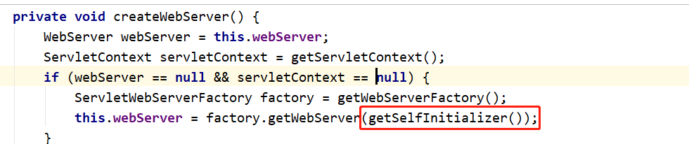

```java
private void selfInitialize(ServletContext servletContext) throws ServletException {
    prepareWebApplicationContext(servletContext);
    ConfigurableListableBeanFactory beanFactory = getBeanFactory();
    ExistingWebApplicationScopes existingScopes = new ExistingWebApplicationScopes(
            beanFactory);
    WebApplicationContextUtils.registerWebApplicationScopes(beanFactory,
            getServletContext());
    existingScopes.restore();
    WebApplicationContextUtils.registerEnvironmentBeans(beanFactory,
            getServletContext());
    for (ServletContextInitializer beans : getServletContextInitializerBeans()) {
        beans.onStartup(servletContext);
    }
}
```

我们通过调试，知道`getServletContextInitializerBeans()`返回的是一个`ServletContextInitializer`集合，集合中有以下几个对象

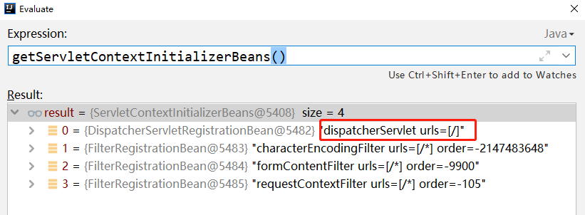

 

然后依次去调用对象的`onStartup`方法，那么对于上图标红的对象来说，就是会调用到`DispatcherServletRegistrationBean`的`onStartup`方法，这个类并没有这个方法，所以最终会调用到父类`RegistrationBean`的`onStartup`方法，该方法代码如下

```java
public final void onStartup(ServletContext servletContext) throws ServletException {
    //获取当前环境到底是一个filter 还是一个servlet 还是一个listener
    String description = getDescription();
    if (!isEnabled()) {
        logger.info(StringUtils.capitalize(description) + " was not registered (disabled)");
        return;
    }
    register(description, servletContext);
}
```

这边`register(description, servletContext);`会调用到`DynamicRegistrationBean`的`register`方法，代码如下

```java
protected final void register(String description, ServletContext servletContext) {
    D registration = addRegistration(description, servletContext);
    if (registration == null) {
        logger.info(StringUtils.capitalize(description) + " was not registered (possibly already registered?)");
        return;
    }
    configure(registration);
}
```

`addRegistration(description, servletContext)`又会调用到`ServletRegistrationBean`中的`addRegistration`方法，代码如下

```java
protected ServletRegistration.Dynamic addRegistration(String description, ServletContext servletContext) {
  String name = getServletName();
  return servletContext.addServlet(name, this.servlet);
}
```

看到了关键的`servletContext.addServlet`代码了，我们通过调试，即可知到`this.servlet`就是`dispatcherServlet`

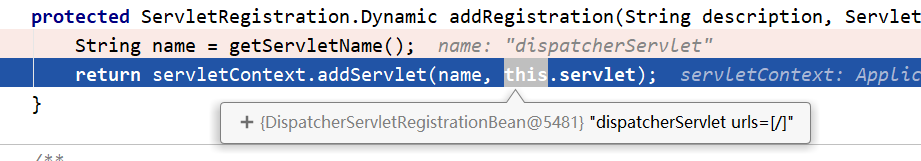

 

**总结**

SpringBoot自动装配SpringMvc其实就是往ServletContext中加入了一个`Dispatcherservlet`。 Servlet3.0规范中有这个说明，除了可以动态加Servlet,还可以动态加Listener，Filter

- addServlet
- addListener
- addFilter