# Spring

## 1. Spring架构设计

Spring框架是一个分层架构，他包含一系列的功能要素，并被分为大约20个模块

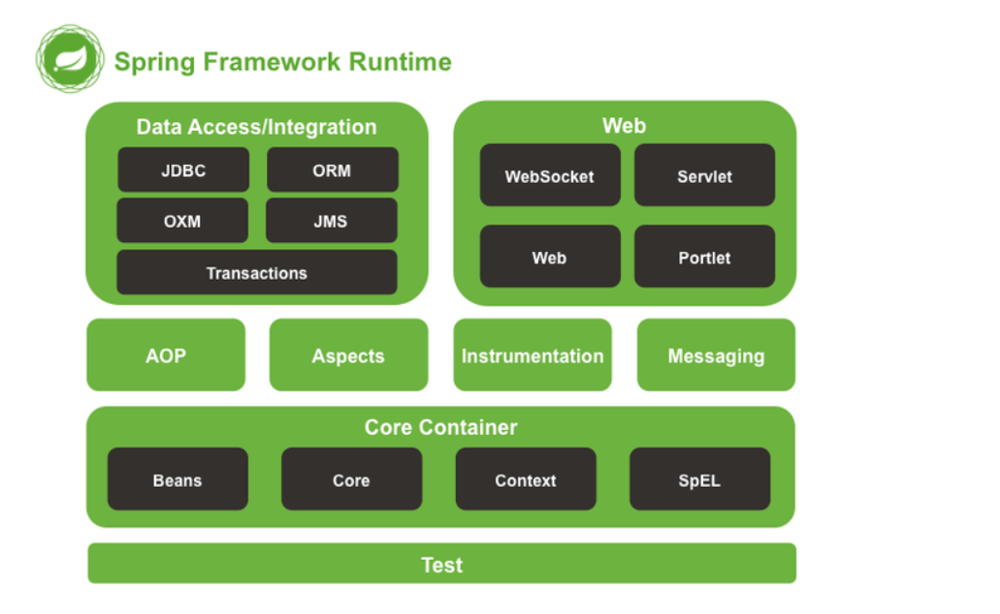

 

## 2. 设计理念

Spring是面向Bean的编程（BOP：Bean Oriented Programming），Bean在Spring中才是真正的主角。Bean在Spring中作用就像Object对OOP的意义一样，没有对象的概念就像没有面向对象编程，Spring中没有Bean也就没有Spring存在的意义。Spring提供了IoC 容器通过配置文件或者注解的方式来管理对象之间的依赖关系。

控制反转（Inversion of Control，缩写为IoC），是面向对象编程中的一种设计原则，可以用来减低代码之间的耦合度。`其中最常见的方式叫做依赖注入（Dependency Injection，简称DI），还有一种方式叫“依赖查找”（Dependency Lookup）`。通过控制反转，对象在被创建的时候，由一个调控系统内所有对象的外界实体，将其所依赖的对象的引用传递给它。

 

## 3. 核心组件介绍

### Bean组件

Bean组件定义在Spring的**org.springframework.beans**包下，解决了以下几个问题：

这个包下的所有类主要解决了三件事：

- Bean的定义
- Bean的创建
- Bean的解析

Spring Bean的创建是典型的工厂模式，它的顶级接口是BeanFactory。

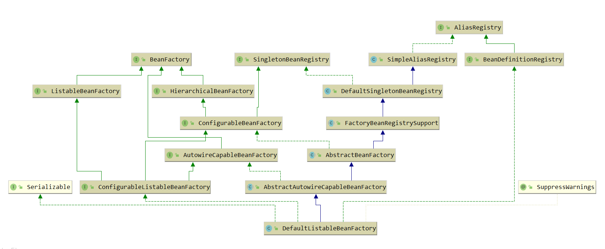

 

BeanFactory有三个子类：ListableBeanFactory、HierarchicalBeanFactory和AutowireCapableBeanFactory。目的是为了**区分Spring内部对象处理和转化的数据限制**。

但是从图中可以发现最终的默认实现类是DefaultListableBeanFactory，它实现了所有的接口

 

#### Bean定义：BeanDefinition

这里的 BeanDefinition 就是我们所说的 Spring 的 Bean，我们自己定义的各个 Bean 其实会转换成一个个 BeanDefinition 存在于 Spring 的 BeanFactory 中

```
public class DefaultListableBeanFactory extends AbstractAutowireCapableBeanFactory
        implements ConfigurableListableBeanFactory, BeanDefinitionRegistry, Serializable {

    private final Map<String, BeanDefinition> beanDefinitionMap = new ConcurrentHashMap<>(256); 
}   
```

**BeanDefinition** 中保存了我们的 Bean 信息，比如这个 Bean 指向的是哪个类、是否是单例的、是否懒加载、这个 Bean 依赖了哪些 Bean 等等。

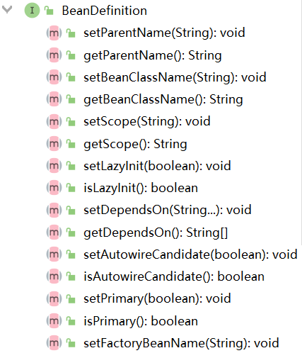

 

### Context组件

Context在Spring的org.springframework.context包下

Context模块构建于Core和Beans模块基础之上，提供了一种类似于JNDI注册器的框架式的对象访问方法.Context模块继承了Beans的特性，为Spring核心提供了大量扩展，添加了对国际化（例如资源绑定）、事件传播、资源加载和对Context的透明创建的支持

ApplicationContext是Context的顶级父类

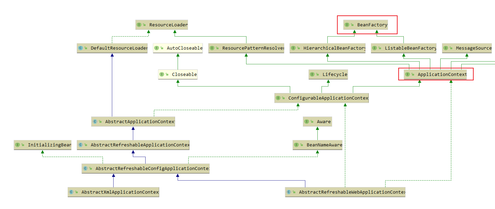

 

ApplicationContext 的子类主要包含两个方面：

1. ConfigurableApplicationContext 表示该 Context 是可修改的，也就是在构建 Context 中用户可以动态添加或修改已有的配置信息
2. WebApplicationContext 顾名思义，就是为 web 准备的 Context 他可以直接访问到 ServletContext，通常情况下，这个接口使用少

 

再往下分就是按照构建 Context 的文件类型，接着就是访问 Context 的方式。这样一级一级构成了完整的 Context 等级层次。

总体来说 ApplicationContext 必须要完成以下几件事：

- 标识一个应用环境
- 利用 BeanFactory 创建 Bean 对象
- 保存对象关系表
- 能够捕获各种事件

 

 

#### 面试题：简述Spring后置处理器

后置处理器是一种拓展机制，贯穿Spring Bean的生命周期

后置处理器分为两类：

**BeanFactory后置处理器：BeanFactoryPostProcessor**

实现该接口，可以在spring的bean创建之前，修改bean的定义属性

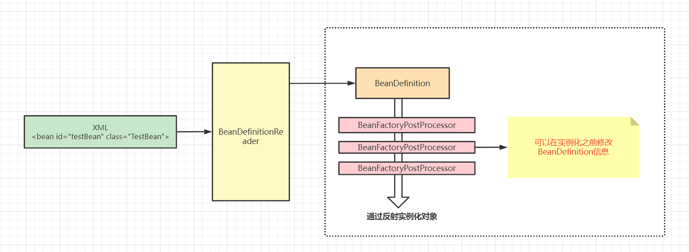

 

```
public interface BeanFactoryPostProcessor {

    /*
     *  该接口只有一个方法postProcessBeanFactory，方法参数是ConfigurableListableBeanFactory，通过该
        参数，可以获取BeanDefinition
    */
    void postProcessBeanFactory(ConfigurableListableBeanFactory beanFactory) throws BeansException;
}
```

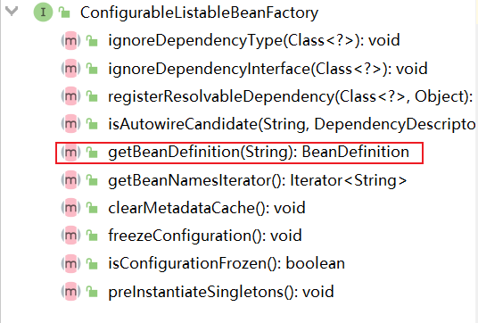

 

 

**Bean后置处理器：BeanPostProcessor**

BeanPostProcessor是Spring IOC容器给我们提供的一个扩展接口

实现该接口，可以在spring容器实例化bean之后，在执行bean的初始化方法前后，添加一些处理逻辑

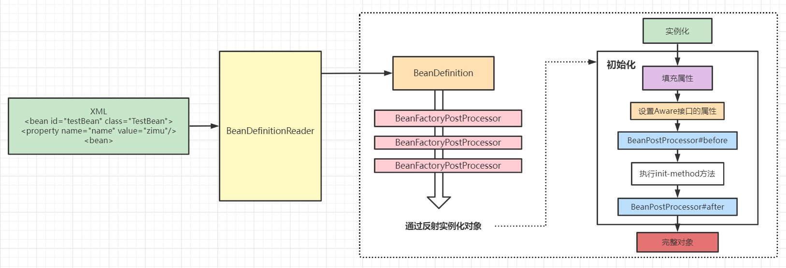

 

```
public interface BeanPostProcessor {
    //bean初始化方法调用前被调用
    Object postProcessBeforeInitialization(Object bean, String beanName) throws BeansException;
    //bean初始化方法调用后被调用
    Object postProcessAfterInitialization(Object bean, String beanName) throws BeansException;
}

```

**运行顺序**

===Spring IOC容器实例化Bean=== ===调用BeanPostProcessor的postProcessBeforeInitialization方法=== ===调用bean实例的初始化方法=== ===调用BeanPostProcessor的postProcessAfterInitialization方法===

 

 

## 4. IOC流程图

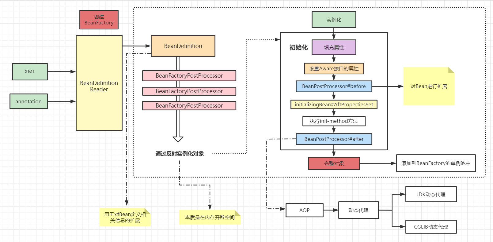

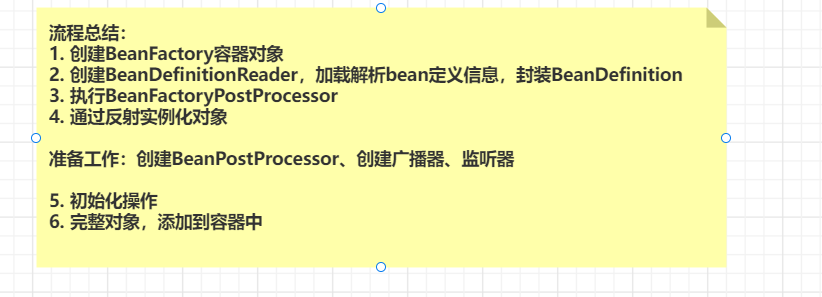

 

## 5. Bean的生命周期

​        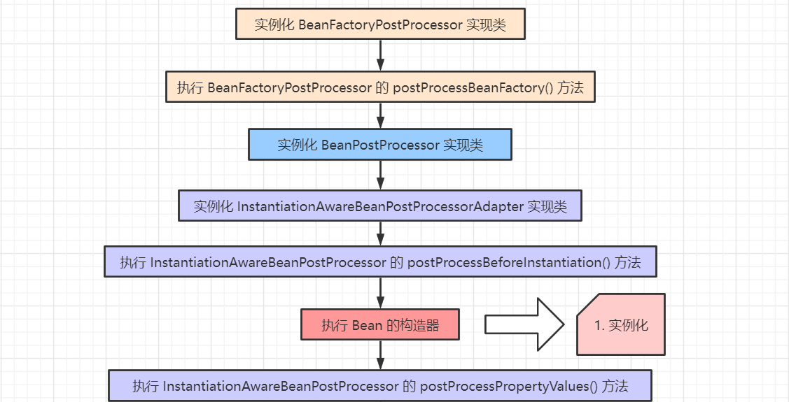

​        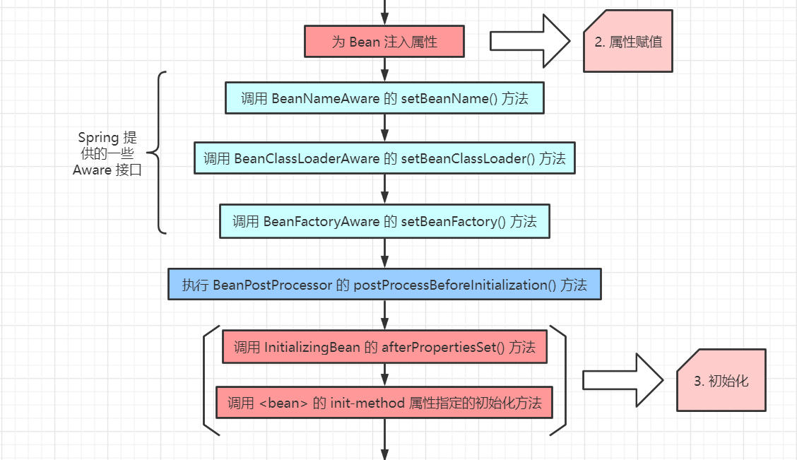

​         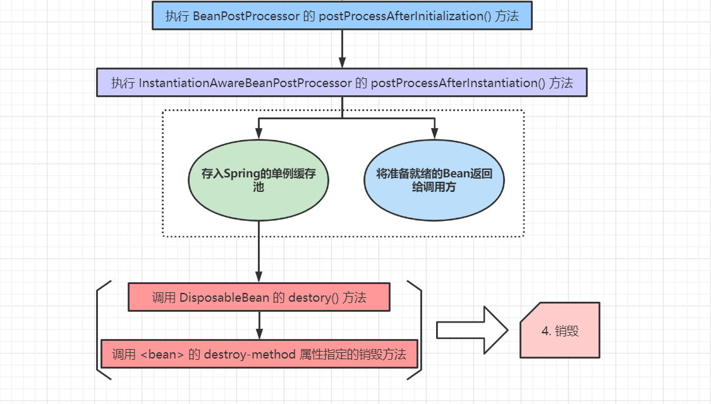

Bean 生命周期的整个执行过程描述如下。

1）根据配置情况调用 Bean 构造方法或工厂方法实例化 Bean。

2）利用依赖注入完成 Bean 中所有属性值的配置注入。

3）如果 Bean 实现了 BeanNameAware 接口，则 Spring 调用 Bean 的 setBeanName() 方法传入当前 Bean 的 id 值。

4）如果 Bean 实现了 BeanFactoryAware 接口，则 Spring 调用 setBeanFactory() 方法传入当前工厂实例的引用。

5）如果 Bean 实现了 ApplicationContextAware 接口，则 Spring 调用 setApplicationContext() 方法传入当前 ApplicationContext 实例的引用。

6）如果 BeanPostProcessor 和 Bean 关联，则 Spring 将调用该接口的预初始化方法 postProcessBeforeInitialzation() 对 Bean 进行加工操作

7）如果 Bean 实现了 InitializingBean 接口，则 Spring 将调用 afterPropertiesSet() 方法。

8）如果在配置文件中通过 init-method 属性指定了初始化方法，则调用该初始化方法。

9）如果 BeanPostProcessor 和 Bean 关联，则 Spring 将调用该接口的初始化方法 postProcessAfterInitialization()。此时，Bean 已经可以被应用系统使用了。

10）如果指定了该 Bean 的作用范围为 scope="singleton"，则将该 Bean 放入 Spring IoC 的缓存池中，将触发 Spring 对该 Bean 的生命周期管理；如果scope="prototype"，则将该 Bean 交给调用者，调用者管理该 Bean 的生命周期，Spring 不再管理该 Bean。

11）如果 Bean 实现了 DisposableBean 接口，则 Spring 会调用 destory() 方法将 Spring 中的 Bean 销毁；如果在配置文件中通过 destory-method 属性指定了 Bean 的销毁方法，则 Spring 将调用该方法。

 

 

## 6. Spring源码环境构建

### 1. 自动化构建Gradle

```
引言：
从Sping5开始，官方就开始使用gradle来构建环境了
接下来，我们所有的环境都要基于gradle
```

#### 1.1 什么是Gradle

Gradle是一个项目自动化构建工具。

是Apache的一个**基于Ant 和Maven**的软件，用于项目的依赖管理


**项目的构建经历了三个时代：**

Apache Ant（2000 年左右）

Maven（2004年）

Gradle（2012 年左右）

> Spring（5.0开始） 等优秀的开源项目都将自己的项目从 Maven 迁移到了 Gradle

 

#### 1.2 安装Gradle

- Gradle下载地址：https://gradle.org/releases/

  （注：需下载6.0以下版本，版本太高，会导致idea中编译时，部分spring组件无法下载)

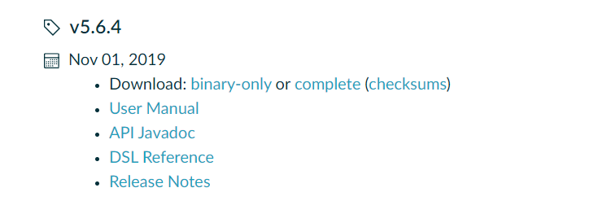

- 解压：


 

- 环境变量配置

  配置GRADLE_HOME：

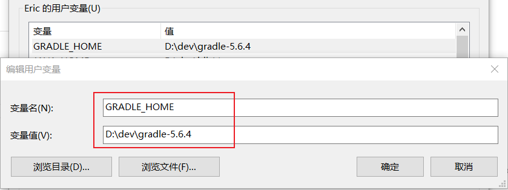

​             

​              配置Path：

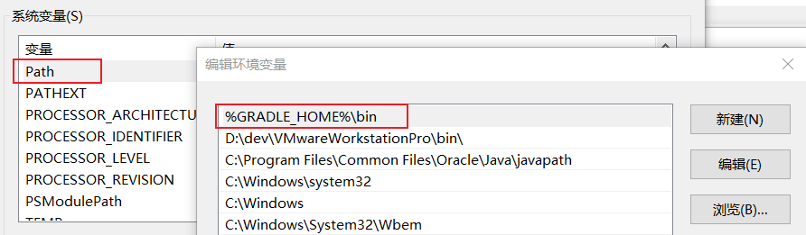

 

 

 

- 执行 gradle -v 查看安装情况

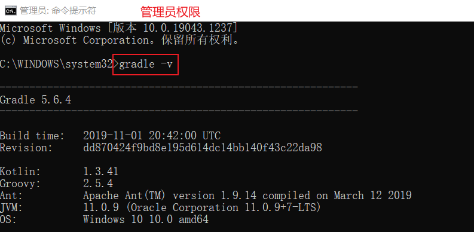

 

- 在init.d文件夹下，创建init.gradle文件，编辑内容如下：(国内阿里云加速)

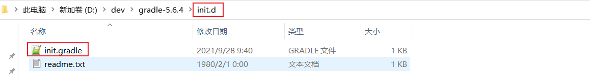

```
allprojects {
    repositories {
        //maven { url 'file:///Users/wangshouwen/.m2/repository'}
        //mavenLocal()
        maven { url 'https://maven.aliyun.com/repository/central'}
        maven { url 'https://maven.aliyun.com/repository/jcenter'}
        maven { url 'https://maven.aliyun.com/repository/public'}
        maven { url 'https://maven.aliyun.com/repository/google'}
        maven { url 'https://maven.aliyun.com/repository/gradle-plugin'}
        maven { url 'https://maven.aliyun.com/repository/grails-core'}
        maven { url 'https://maven.aliyun.com/repository/spring'}
        maven { url 'https://maven.aliyun.com/repository/spring-plugin'}
        maven { url 'https://maven.aliyun.com/repository/apache-snapshots'}
        mavenCentral()
    }
}
```

 

### 2. 下载Spring源码

#### 2.1 下载

下载地址（码云）：https://gitee.com/mirrors/Spring-Framework

​               （GitHub）: https://github.com/spring-projects/spring-framework

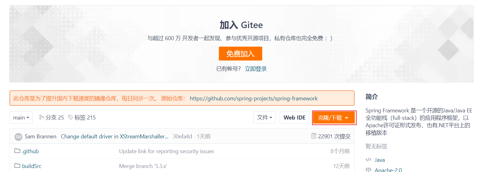

 

**注意：对于源码要进行 git clone 拉取（如果直接下载zip，会报如下错误）**

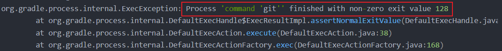

 

#### 2.2 源码环境编译

进入bin目录下，执行 gradlew.bat（建议命令行中执行）

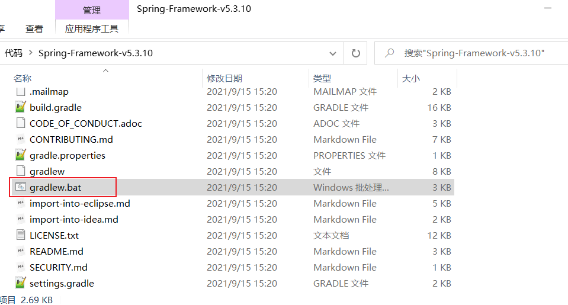

 

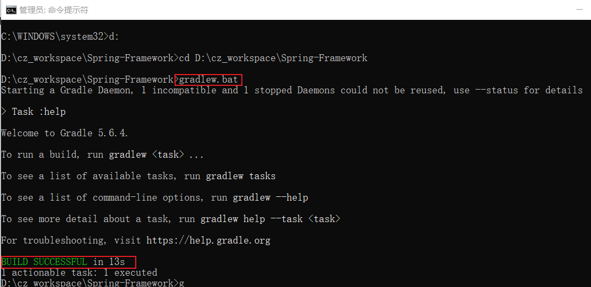

 

### 3 源码导入IDEA

​	使用import Project ( idea 2018)

​	直接open project (idea 2020)

​    漫长的等待.....

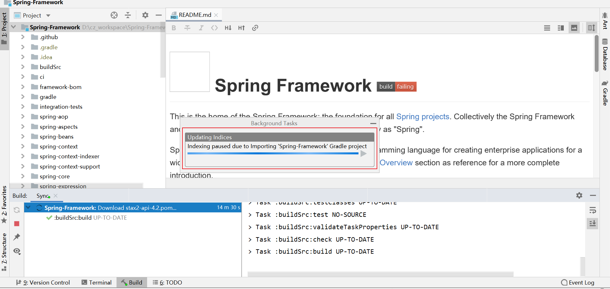

 

**（注意：手动配置JDK及gradle）**

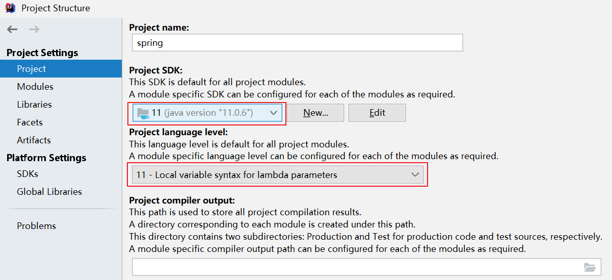

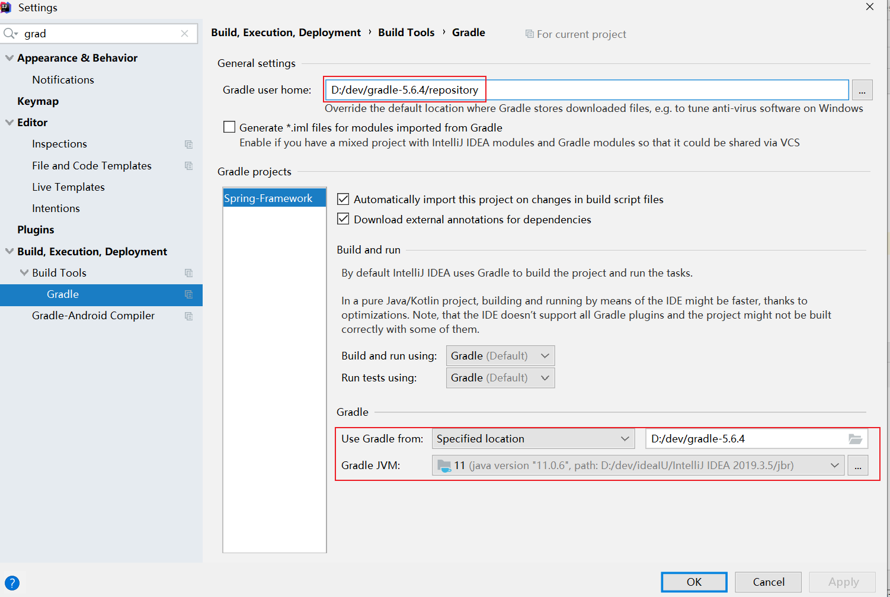

 

构建完成后，模块会出现蓝色小点

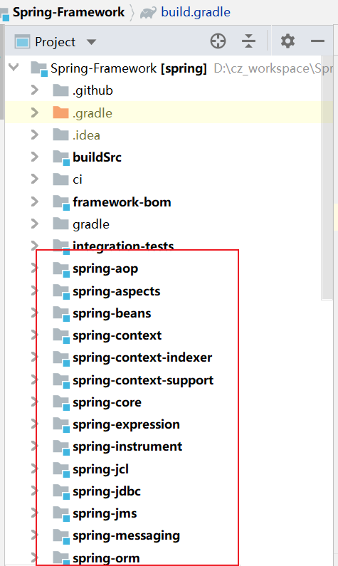

 

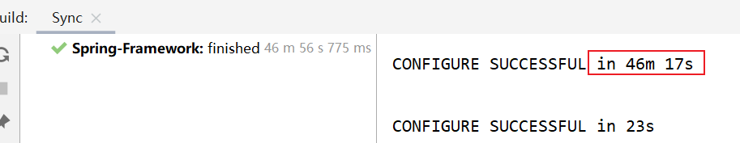

 

 

### 3. 构建源码测试模块

#### 3.1 创建新Module

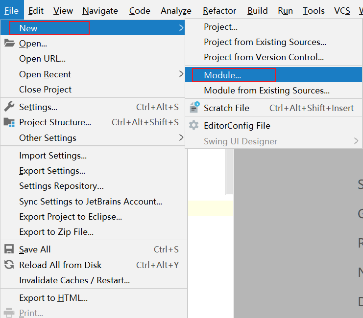

 

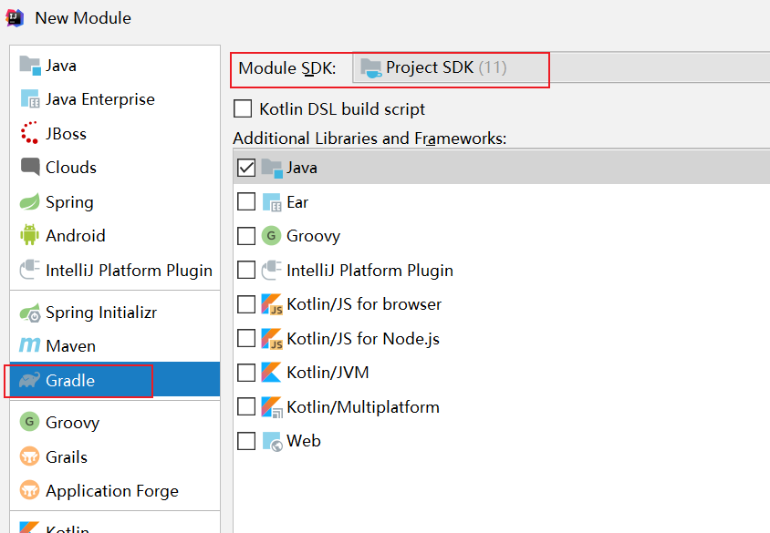

 

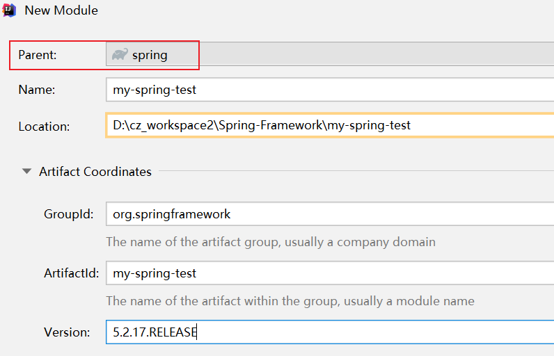

 

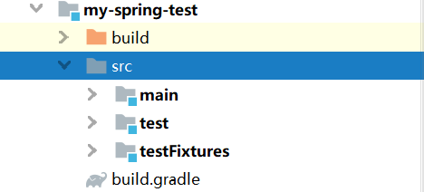

 

#### 3.2 添加依赖

打开 build.gradle

```
dependencies {
    compile(project(':spring-context')) // 添加spring-context依赖
    compile(project(':spring-aop')) // 添加spring-aop依赖
    testCompile group: 'junit', name: 'junit', version: '4.12'
}
```

 

#### 3.3 编写测试代码

1. 编写TestBean

```java
@Component
public class TestBean {

    public void print(){
        System.err.println("testBean method...");
        System.err.println("spring源码环境构建完成...");
    }
}
```

 

1. 创建applicationContext.xml，配置TestBean

```xml
<?xml version="1.0" encoding="UTF-8"?>
<beans xmlns="http://www.springframework.org/schema/beans"
      xmlns:xsi="http://www.w3.org/2001/XMLSchema-instance"
      xsi:schemaLocation="http://www.springframework.org/schema/beans http://www.springframework.org/schema/beans/spring-beans.xsd">


   <bean id="testBean" class="com.itheima.config.TestBean"/>
   
</beans>
```

 

1. 编写测试类IOCTest

```java
public class IOCTest {

    public static void main(String[] args) {
        ApplicationContext applicationContext = new       ClassPathXmlApplicationContext("classpath:applicationContext.xml");
        TestBean testBean = (TestBean) applicationContext.getBean("testBean");
        testBean.print();
    }
}
```

 


 

 

## 7. IOC 源码深度剖析

### IOC容器初始化主流程

```java
    public static void main(String[] args) {
        ApplicationContext applicationContext = new ClassPathXmlApplicationContext("classpath:applicationContext.xml");
        TestBean testBean = (TestBean) applicationContext.getBean("testBean");
        testBean.print();
    }
```

第一步，我们肯定要从 ClassPathXmlApplicationContext 的构造方法说起

```java
public class ClassPathXmlApplicationContext extends AbstractXmlApplicationContext {
  private Resource[] configResources;

  // 如果已经有 ApplicationContext 并需要配置成父子关系，那么调用这个构造方法
  public ClassPathXmlApplicationContext(ApplicationContext parent) {
    super(parent);
  }
  ...
  public ClassPathXmlApplicationContext(String[] configLocations, boolean refresh, ApplicationContext parent)
      throws BeansException {

    super(parent);
    // 根据提供的路径，处理成配置文件数组(以分号、逗号、空格、tab、换行符分割)
    setConfigLocations(configLocations);
    
      if (refresh) {
      refresh(); // 核心方法
    }
  }
    ...
}
```

核心方法：refresh();

```java
public void refresh() throws BeansException, IllegalStateException {
        
        //加锁，防止多线程重复启动。
        synchronized (this.startupShutdownMonitor) {
            // Prepare this context for refreshing.
            //准备刷新
            /*
               【1.准备刷新】
                  (1) 设置容器的启动时间
                  (2) 设置活跃状态为true
                  (3) 设置关闭状态为false
                  (4) 获取Environment对象，并加载当前系统的属性值到Environment对象中
                  (5) 准备监听器和时间的集合对象，默认为空的集合
             */
            prepareRefresh();

            // Tell the subclass to refresh the internal bean factory.
            /*
                【2.初始化 新BeanFactory】重点！
                  （1）如果存在旧 BeanFactory，则销毁
                  （2）创建新的 BeanFactory（DefaluListbaleBeanFactory）
                  （3）解析xml/加载 Bean 定义、注册 Bean定义到beanFactory(不初始化)
                  （4）返回新的 BeanFactory（DefaluListbaleBeanFactory）
             */
            ConfigurableListableBeanFactory beanFactory = obtainFreshBeanFactory();

            // Prepare the bean factory for use in this context.
            // 【3. bean工厂前置操作】为BeanFactory配置容器特性
            // 例如类加载器、表达式解析器、注册默认环境bean、后置管理器BeanPostProcessor
            prepareBeanFactory(beanFactory);

            try {
                // Allows post-processing of the bean factory in context subclasses.
                // 【4. bean工厂后置操作】此处为空方法，如果子类需要，自己去实现
                postProcessBeanFactory(beanFactory);

                // Invoke factory processors registered as beans in the context.
                //【5. 调用bean工厂后置处理器】,执行已注册的beanFactoryPostProcessor的实现类，在这里完成了类的扫描、解析和注册
                //目标：
                //调用顺序一：先bean定义 注册后置处理器
                //调用顺序二：后bean工厂后置处理器
                // 调用 BeanFactoryPostProcessor 各个实现类的 postProcessBeanFactory(factory) 回调方法
                invokeBeanFactoryPostProcessors(beanFactory);

                // Register bean processors that intercept bean creation.
                //【6.注册bean后置处理器】只是注册，但是还不会调用
                //逻辑：找出所有实现BeanPostProcessor接口的类,分类、排序、注册
                registerBeanPostProcessors(beanFactory);

                // Initialize message source for this context.
                //【7.初始化消息源】国际化问题i18n
                initMessageSource();

                // Initialize event multicaster for this context.
                //【8、初始化事件广播器】初始化自定义的事件监听多路广播器
                // 如果需要发布事件，就调它的multicastEvent方法
                // 把事件广播给listeners，其实就是起一个线程来处理，把Event扔给listener处理
                // （可以通过 SimpleApplicationEventMulticaster的代码来验证）
                initApplicationEventMulticaster();

                // Initialize other special beans in specific context subclasses.
               // 【9、刷新:拓展方法】这是个protected空方法，交给具体的子类来实现
                //  可以在这里初始化一些特殊的 Bean
                onRefresh();

                // Check for listener beans and register them.
               //【10、注册监听器】，监听器需要实现 ApplicationListener 接口
                // 也就是扫描这些实现了接口的类，给他放进广播器的列表中
                // 其实就是个观察者模式，广播器接到事件的调用时，去循环listeners列表，
                // 挨个调它们的onApplicationEvent方法，把event扔给它们。
                registerListeners();

                // Instantiate all remaining (non-lazy-init) singletons.
                ///【11、 实例化所有剩余的（非惰性初始化）单例】
                // （1）初始化所有的 singleton beans,反射生成对象/填充
                // （2）调用Bean的前置处理器和后置处理器
                finishBeanFactoryInitialization(beanFactory);

                // Last step: publish corresponding event.
                // 【12、结束refresh操作】
                // 发布事件与清除上下文环境
                finishRefresh();
            } catch (BeansException ex) {
                if (logger.isWarnEnabled()) {
                    logger.warn("Exception encountered during context initialization - " +
                            "cancelling refresh attempt: " + ex);
                }

                // Destroy already created singletons to avoid dangling resources.
                destroyBeans();

                // Reset 'active' flag.
                cancelRefresh(ex);

                // Propagate exception to caller.
                throw ex;
            } finally {
                // Reset common introspection caches in Spring's core, since we
                // might not ever need metadata for singleton beans anymore...
                //清除反射的类数据，注解数据等。
                resetCommonCaches();
            }
        }
    }
```

 

### 【1.准备刷新 】prepareRefresh();

#### 方法概述

为刷新准备新的上下文环境，设置其启动日期和活动标志以及执行一些属性的初始化。主要是一些准备工作（不是很重要的方法）

 

#### 源码剖析

prepareRefresh();

```java
protected void prepareRefresh() {
   // 记录启动时间，
   // 将 active 属性设置为 true，closed 属性设置为 false，它们都是 AtomicBoolean 类型
   this.startupDate = System.currentTimeMillis();
   this.closed.set(false);
   this.active.set(true);

   if (logger.isInfoEnabled()) {
      logger.info("Refreshing " + this);
   }

   // Initialize any placeholder property sources in the context environment
   initPropertySources();

   // 会创建StandardEnvironment对象 校验 xml 配置文件
   getEnvironment().validateRequiredProperties();

   this.earlyApplicationEvents = new LinkedHashSet<ApplicationEvent>();
}
```

 

### 【2.初始化 BeanFactory 】obtainFreshBeanFactory()； 重点！

#### 方法概述

作用：用于获得一个新的 BeanFactory

流程：该方法会解析所有 Spring 配置文件（通常我们会放在 resources 目录下），将所有 Spring 配置文件中的 bean 定义封装成 BeanDefinition，加载到 BeanFactory 中（只注册，不会进行Bean的实例化）。

常见的，如果解析到<context:component-scan base-package="com.itheima" /> 注解时，会扫描 base-package 指定的目录，将该目录下使用指定注解（@Controller、@Service、@Component、@Repository）的 bean 定义也同样封装成 BeanDefinition，加载到 BeanFactory 中。

上面提到的“加载到 BeanFactory 中”的内容主要指的是以下3个缓存（map）：（Bean并没有实例化）

- beanDefinitionNames缓存：所有被加载到 BeanFactory 中的 bean 的 beanName 集合。
- beanDefinitionMap缓存：所有被加载到 BeanFactory 中的 bean 的 beanName 和 BeanDefinition 映射。
- aliasMap缓存：所有被加载到 BeanFactory 中的 bean 的 beanName 和别名映射。

 

#### 源码剖析

##### obtainFreshBeanFactory

```java
protected ConfigurableListableBeanFactory obtainFreshBeanFactory() {
    // 1.刷新（创建） BeanFactory，由AbstractRefreshableApplicationContext实现
    refreshBeanFactory();
    // 2.拿到刷新后的 BeanFactory
    ConfigurableListableBeanFactory beanFactory = getBeanFactory();
    if (logger.isDebugEnabled()) {
        logger.debug("Bean factory for " + getDisplayName() + ": " + beanFactory);
    }
    return beanFactory;
}
 
```

1.刷新 BeanFactory，由 AbstractRefreshableApplicationContext 实现，**见代码块1详解**。

 

##### 代码块1：refreshBeanFactory 方法

```java
@Override
protected final void refreshBeanFactory() throws BeansException {
    // 1.判断是否已经存在 BeanFactory，如果存在则先销毁、关闭该 BeanFactory
    if (hasBeanFactory()) {
        destroyBeans();
        closeBeanFactory();
    }
    try {
        // 2.创建一个新的BeanFactory
        DefaultListableBeanFactory beanFactory = createBeanFactory();
        // 用于 BeanFactory 的序列化，大部分人应该都用不到
        beanFactory.setSerializationId(getId());
         // 重要：设置 BeanFactory 的两个配置属性：是否允许 Bean 覆盖、是否允许循环引用
        customizeBeanFactory(beanFactory);
        // 3.重要：加载 Bean 到 BeanFactory 中
        loadBeanDefinitions(beanFactory);
        synchronized (this.beanFactoryMonitor) {
            this.beanFactory = beanFactory;
        }
    } catch (IOException ex) {
        throw new ApplicationContextException("I/O error parsing bean definition source for " + getDisplayName(), ex);
    }
}
```

 

##### BeanDefinition 接口

> BeanDefinition 中保存了我们的 Bean 信息，比如这个 Bean 指向的是哪个类、是否是单例的、是否懒加载、这个 Bean 依赖了哪些 Bean 等等。

```java
public interface BeanDefinition extends AttributeAccessor, BeanMetadataElement {

   // 我们可以看到，默认只提供 sington 和 prototype 两种，
   // 同学们可能知道还有 request, session, globalSession, application, websocket 这几种，
   // 不过，它们属于基于 web 的扩展。
   String SCOPE_SINGLETON = ConfigurableBeanFactory.SCOPE_SINGLETON;
   String SCOPE_PROTOTYPE = ConfigurableBeanFactory.SCOPE_PROTOTYPE;

   // 比较不重要，直接跳过吧
   int ROLE_APPLICATION = 0;
   int ROLE_SUPPORT = 1;
   int ROLE_INFRASTRUCTURE = 2;

   // 设置父 Bean，这里涉及到 bean 继承，不是 java 继承。请参见附录的详细介绍
   // 一句话就是：继承父 Bean 的配置信息而已
   void setParentName(String parentName);

   // 获取父 Bean
   String getParentName();

   // 设置 Bean 的类名称，将来是要通过反射来生成实例的
   void setBeanClassName(String beanClassName);

   // 获取 Bean 的类名称
   String getBeanClassName();


   // 设置 bean 的 scope
   void setScope(String scope);

   String getScope();

   // 设置是否懒加载
   void setLazyInit(boolean lazyInit);

   boolean isLazyInit();

   // 设置该 Bean 依赖的所有的 Bean，注意，这里的依赖不是指属性依赖(如 @Autowire 标记的)，
   // 是 depends-on="" 属性设置的值。
   void setDependsOn(String... dependsOn);

   // 返回该 Bean 的所有依赖
   String[] getDependsOn();

   // 设置该 Bean 是否可以注入到其他 Bean 中，只对根据类型注入有效，
   // 如果根据名称注入，即使这边设置了 false，也是可以的
   void setAutowireCandidate(boolean autowireCandidate);

   // 该 Bean 是否可以注入到其他 Bean 中
   boolean isAutowireCandidate();

   // 主要的。同一接口的多个实现，如果不指定名字的话，Spring 会优先选择设置 primary 为 true 的 bean
   void setPrimary(boolean primary);

   // 是否是 primary 的
   boolean isPrimary();

   // 如果该 Bean 采用工厂方法生成，指定工厂名称。对工厂不熟悉的读者，请参加附录
   // 一句话就是：有些实例不是用反射生成的，而是用工厂模式生成的
   void setFactoryBeanName(String factoryBeanName);
   // 获取工厂名称
   String getFactoryBeanName();
   // 指定工厂类中的 工厂方法名称
   void setFactoryMethodName(String factoryMethodName);
   // 获取工厂类中的 工厂方法名称
   String getFactoryMethodName();

   // 构造器参数
   ConstructorArgumentValues getConstructorArgumentValues();

   // Bean 中的属性值，后面给 bean 注入属性值的时候会说到
   MutablePropertyValues getPropertyValues();

   // 是否 singleton
   boolean isSingleton();

   // 是否 prototype
   boolean isPrototype();

   // 如果这个 Bean 是被设置为 abstract，那么不能实例化，
   // 常用于作为 父bean 用于继承，其实也很少用......
   boolean isAbstract();

   int getRole();
   String getDescription();
   String getResourceDescription();
   BeanDefinition getOriginatingBeanDefinition();
}
```

 

有了 BeanDefinition 的概念以后，我们再往下看 refreshBeanFactory() 方法中的剩余部分：

##### customizeBeanFactory();

customizeBeanFactory(beanFactory) 比较简单，就是配置是否允许 BeanDefinition 覆盖、是否允许循环引用。

```java
protected void customizeBeanFactory(DefaultListableBeanFactory beanFactory) {
   if (this.allowBeanDefinitionOverriding != null) {
      // 是否允许 Bean 定义覆盖
      beanFactory.setAllowBeanDefinitionOverriding(this.allowBeanDefinitionOverriding);
   }
   if (this.allowCircularReferences != null) {
      // 是否允许 Bean 间的循环依赖
      beanFactory.setAllowCircularReferences(this.allowCircularReferences);
   }
}
```

是否允许 Bean 定义覆盖：

> allowBeanDefinitionOverriding 属性为 null，如果在同一配置文件中重复了，会抛错，但是如果不是同一配置文件中，会发生覆盖。

是否允许 Bean 间的循环依赖：

> A 依赖 B，而 B 依赖 A。或 A 依赖 B，B 依赖 C，而 C 依赖 A。
>
> 默认情况下，Spring 允许循环依赖

 

 

3.加载 bean 定义，由 XmlWebApplicationContext 实现，**见代码块2详解**。

##### 代码块2：loadBeanDefinitions

```java
/** 我们可以看到，此方法将通过一个 XmlBeanDefinitionReader 实例来加载各个 Bean。*/
@Override
protected void loadBeanDefinitions(DefaultListableBeanFactory beanFactory) throws BeansException, IOException {
   // 1.为指定BeanFactory创建XmlBeanDefinitionReader
   XmlBeanDefinitionReader beanDefinitionReader = new XmlBeanDefinitionReader(beanFactory);

   // Configure the bean definition reader with this context's
   // resource loading environment.
    
    // 2.使用此上下文的资源加载环境配置 XmlBeanDefinitionReader
   beanDefinitionReader.setEnvironment(this.getEnvironment());
     // resourceLoader赋值为XmlWebApplicationContext
   beanDefinitionReader.setResourceLoader(this);
   beanDefinitionReader.setEntityResolver(new ResourceEntityResolver(this));

   // 初始化 BeanDefinitionReader，其实这个是提供给子类覆写的，
   initBeanDefinitionReader(beanDefinitionReader);
    
    // 3.加载 bean 定义 重点
   loadBeanDefinitions(beanDefinitionReader);
}
```

3.加载 bean 定义，**见代码块3详解**。

 

##### 代码块3：loadBeanDefinitions

```java
protected void loadBeanDefinitions(XmlBeanDefinitionReader reader) throws BeansException, IOException {
    // 1.获取配置文件路径
   Resource[] configResources = getConfigResources();
   if (configResources != null) {
      // 往下看
      reader.loadBeanDefinitions(configResources);
   }
   String[] configLocations = getConfigLocations();
   if (configLocations != null) {
     // 2.根据配置文件路径加载 bean 定义
      reader.loadBeanDefinitions(configLocations);
   }
}
 
// AbstractRefreshableWebApplicationContext.java
@Override
public String[] getConfigLocations() {
    return super.getConfigLocations();
}
 
// AbstractRefreshableConfigApplicationContext.java
protected String[] getConfigLocations() {
    return (this.configLocations != null ? this.configLocations : getDefaultConfigLocations());
}
 
// XmlWebApplicationContext.java
@Override
protected String[] getDefaultConfigLocations() {
    if (getNamespace() != null) {
        return new String[]{DEFAULT_CONFIG_LOCATION_PREFIX + getNamespace() + DEFAULT_CONFIG_LOCATION_SUFFIX};
    } else {
        return new String[]{DEFAULT_CONFIG_LOCATION};
    }
}
```

1.获取配置文件路径：如果 configLocations 属性不为空，则返回 configLocations 的值；否则，调用 getDefaultConfigLocations() 方法。获取到配置文件路径（Spring 默认的配置路径：/WEB-INF/applicationContext.xml。）

2.根据配置文件路径加载 bean 定义，**见代码块4详解**。

 

##### 代码块4：loadBeanDefinitions

```java
@Override
public int loadBeanDefinitions(Resource... resources) throws BeanDefinitionStoreException {
    Assert.notNull(resources, "Resource array must not be null");
    int counter = 0;
    // 1.遍历所有的Resource
    for (Resource resource : resources) {
        // 2.根据Resource加载bean的定义，XmlBeanDefinitionReader实现
        counter += loadBeanDefinitions(resource);
    }
    return counter;
}
```

2.根据 Resource 加载 bean 定义，由 XmlBeanDefinitionReader 实现，**见代码块5详解**。

 

##### 方法块5：loadBeanDefinitions

```java
@Override
public int loadBeanDefinitions(Resource resource) throws BeanDefinitionStoreException {
    // 加载 bean 定义
    return loadBeanDefinitions(new EncodedResource(resource));
}
 
public int loadBeanDefinitions(EncodedResource encodedResource) throws BeanDefinitionStoreException {
    Assert.notNull(encodedResource, "EncodedResource must not be null");
    if (logger.isInfoEnabled()) {
        logger.info("Loading XML bean definitions from " + encodedResource.getResource());
    }
 
    // 1.当前正在加载的EncodedResource
    Set<EncodedResource> currentResources = this.resourcesCurrentlyBeingLoaded.get();
    if (currentResources == null) {
        currentResources = new HashSet<EncodedResource>(4);
        this.resourcesCurrentlyBeingLoaded.set(currentResources);
    }
    // 2.将当前encodedResource添加到currentResources
    if (!currentResources.add(encodedResource)) {
        // 如果添加失败，代表当前的encodedResource已经存在，则表示出现了循环加载
        throw new BeanDefinitionStoreException(
                "Detected cyclic loading of " + encodedResource + " - check your import definitions!");
    }
    try {
        // 3.拿到Resource的inputStream
        InputStream inputStream = encodedResource.getResource().getInputStream();
        try {
            // 4.将inputStream封装成org.xml.sax.InputSource
            InputSource inputSource = new InputSource(inputStream);
            if (encodedResource.getEncoding() != null) {
                inputSource.setEncoding(encodedResource.getEncoding());
            }
            // 5.加载 bean 定义（方法以do开头，真正处理的方法）
            return doLoadBeanDefinitions(inputSource, encodedResource.getResource());
        } finally {
            inputStream.close();
        }
    } catch (IOException ex) {
        throw new BeanDefinitionStoreException(
                "IOException parsing XML document from " + encodedResource.getResource(), ex);
    } finally {
        currentResources.remove(encodedResource);
        if (currentResources.isEmpty()) {
            this.resourcesCurrentlyBeingLoaded.remove();
        }
    }
}
```

5.加载 bean 定义，方法以 do 开头，真正处理的方法，**见代码块6详解**。

 

##### 代码块6：doLoadBeanDefinitions

```java
protected int doLoadBeanDefinitions(InputSource inputSource, Resource resource)
        throws BeanDefinitionStoreException {
    try {
        // 1.根据inputSource和resource加载XML文件，并封装成Document
        Document doc = doLoadDocument(inputSource, resource);
        // 2.根据返回的Document注册Bean信息(对配置文件的解析，核心逻辑)
        return registerBeanDefinitions(doc, resource);
    } catch (BeanDefinitionStoreException ex) {
        throw ex;
    } catch (SAXParseException ex) {
        throw new XmlBeanDefinitionStoreException(resource.getDescription(),
                "Line " + ex.getLineNumber() + " in XML document from " + resource + " is invalid", ex);
    } catch (SAXException ex) {
        throw new XmlBeanDefinitionStoreException(resource.getDescription(),
                "XML document from " + resource + " is invalid", ex);
    } catch (ParserConfigurationException ex) {
        throw new BeanDefinitionStoreException(resource.getDescription(),
                "Parser configuration exception parsing XML from " + resource, ex);
    } catch (IOException ex) {
        throw new BeanDefinitionStoreException(resource.getDescription(),
                "IOException parsing XML document from " + resource, ex);
    } catch (Throwable ex) {
        throw new BeanDefinitionStoreException(resource.getDescription(),
                "Unexpected exception parsing XML document from " + resource, ex);
    }
}
```

1.根据 inputSource 和 resource 加载 XML文件，并封装成 Document，**见代码块7详解**。

2.根据返回的 Document 注册 bean 信息，**见代码块8详解**。

 

##### 代码块7：doLoadDocument

```java
protected Document doLoadDocument(InputSource inputSource, Resource resource) throws Exception {
    // 1.getValidationModeForResource(resource): 获取XML配置文件的验证模式
    // 2.documentLoader.loadDocument: 加载XML文件，并得到对应的 Document
    return this.documentLoader.loadDocument(inputSource, getEntityResolver(), this.errorHandler,
            getValidationModeForResource(resource), isNamespaceAware());
}
 
protected int getValidationModeForResource(Resource resource) {
    int validationModeToUse = getValidationMode();
    // 1.1 如果手动指定了XML文件的验证模式则使用指定的验证模式
    if (validationModeToUse != VALIDATION_AUTO) {
        return validationModeToUse;
    }
    // 1.2 如果未指定则使用自动检测
    int detectedMode = detectValidationMode(resource);
    // 1.3 如果检测出的验证模式不为 VALIDATION_AUTO, 则返回检测出来的验证模式
    if (detectedMode != VALIDATION_AUTO) {
        return detectedMode;
    }
    // Hmm, we didn't get a clear indication... Let's assume XSD,
    // since apparently no DTD declaration has been found up until
    // detection stopped (before finding the document's root tag).
    // 1.4 如果最终没找到验证模式，则使用 XSD
    return VALIDATION_XSD;
}
 
protected int detectValidationMode(Resource resource) {
    // 1.2.1 校验resource是否为open stream
    if (resource.isOpen()) {
        throw new BeanDefinitionStoreException(
                "Passed-in Resource [" + resource + "] contains an open stream: " +
                        "cannot determine validation mode automatically. Either pass in a Resource " +
                        "that is able to create fresh streams, or explicitly specify the validationMode " +
                        "on your XmlBeanDefinitionReader instance.");
    }
 
    InputStream inputStream;
    try {
        // 1.2.2 校验resource是否可以打开InputStream
        inputStream = resource.getInputStream();
    } catch (IOException ex) {
        throw new BeanDefinitionStoreException(
                "Unable to determine validation mode for [" + resource + "]: cannot open InputStream. " +
                        "Did you attempt to load directly from a SAX InputSource without specifying the " +
                        "validationMode on your XmlBeanDefinitionReader instance?", ex);
    }
 
    try {
        // 1.2.3 根据inputStream检测验证模式
        return this.validationModeDetector.detectValidationMode(inputStream);
    } catch (IOException ex) {
        throw new BeanDefinitionStoreException("Unable to determine validation mode for [" +
                resource + "]: an error occurred whilst reading from the InputStream.", ex);
    }
}
 
public int detectValidationMode(InputStream inputStream) throws IOException {
    // Peek into the file to look for DOCTYPE.
    BufferedReader reader = new BufferedReader(new InputStreamReader(inputStream));
    try {
        boolean isDtdValidated = false;
        String content;
        // 1.2.3.1 按行遍历xml配置文件，获取xml文件的验证模式
        while ((content = reader.readLine()) != null) {
            content = consumeCommentTokens(content);
            // 如果读取的行是空或者注释则略过
            if (this.inComment || !StringUtils.hasText(content)) {
                continue;
            }
            // 内容包含"DOCTYPE"则为DTD，否则为XSD
            if (hasDoctype(content)) {
                isDtdValidated = true;
                break;
            }
            // 如果content带有 '<' 开始符号，则结束遍历。因为验证模式一定会在开始符号之前，所以到此可以认为没有验证模式
            if (hasOpeningTag(content)) {
                // End of meaningful data...
                break;
            }
        }
        // 1.2.3.2 根据遍历结果返回验证模式是 DTD 还是 XSD
        return (isDtdValidated ? VALIDATION_DTD : VALIDATION_XSD);
    } catch (CharConversionException ex) {
        // Choked on some character encoding...
        // Leave the decision up to the caller.
        return VALIDATION_AUTO;
    } finally {
        reader.close();
    }
}
 
// DefaultDocumentLoader.java
@Override
public Document loadDocument(InputSource inputSource, EntityResolver entityResolver,
        ErrorHandler errorHandler, int validationMode, boolean namespaceAware) throws Exception {
    // 2.1 创建DocumentBuilderFactory
    DocumentBuilderFactory factory = createDocumentBuilderFactory(validationMode, namespaceAware);
    if (logger.isDebugEnabled()) {
        logger.debug("Using JAXP provider [" + factory.getClass().getName() + "]");
    }
    // 2.2 通过DocumentBuilderFactory创建DocumentBuilder
    DocumentBuilder builder = createDocumentBuilder(factory, entityResolver, errorHandler);
    // 2.3 使用DocumentBuilder解析inputSource返回Document对象
    return builder.parse(inputSource);
}
```

1.获取 XML 配置文件的验证模式。XML 文件的验证模式是用来保证 XML 文件的正确性，常见的验证模式有两种：DTD 和 XSD，以下简单展示下这两种验证模式的配置。

**DTD 验证模式（已停止更新）**

要使用 DTD 验证模式的时候需要在 XML 文件的头部声明，以下是在 Spring 中使用 DTD 声明方式的代码：

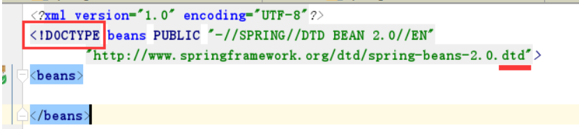

**XSD 验证模式**

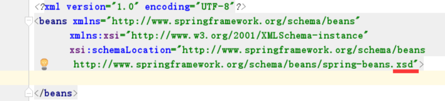

 

##### 代码块8：registerBeanDefinitions

```java
public int registerBeanDefinitions(Document doc, Resource resource) throws BeanDefinitionStoreException {
    // 1.使用DefaultBeanDefinitionDocumentReader实例化BeanDefinitionDocumentReader
    BeanDefinitionDocumentReader documentReader = createBeanDefinitionDocumentReader();
    // 2.记录统计前BeanDefinition的加载个数
    int countBefore = getRegistry().getBeanDefinitionCount();
    // 3.createReaderContext：根据resource创建一个XmlReaderContext
    // 4.registerBeanDefinitions：加载及注册Bean定义
    documentReader.registerBeanDefinitions(doc, createReaderContext(resource));
    // 5.返回本次加载的BeanDefinition个数
    return getRegistry().getBeanDefinitionCount() - countBefore;
}
```

4.加载及注册 bean 定义，由 DefaultBeanDefinitionDocumentReader 实现，**见代码块9详解**。

 

##### 代码块9：registerBeanDefinitions

```java
@Override
public void registerBeanDefinitions(Document doc, XmlReaderContext readerContext) {
    this.readerContext = readerContext;
    logger.debug("Loading bean definitions");
    // 1.拿到文档的子节点，对于Spring的配置文件来说，理论上应该都是<beans>
    Element root = doc.getDocumentElement();
    // 2.通过拿到的节点，注册 Bean 定义
    doRegisterBeanDefinitions(root);
}
```

2.通过拿到的节点，注册 bean 定义，**见代码块10详解**。

 

##### 代码块10：doRegisterBeanDefinitions

```java
protected void doRegisterBeanDefinitions(Element root) {
    // Any nested <beans> elements will cause recursion in this method. In
    // order to propagate and preserve <beans> default-* attributes correctly,
    // keep track of the current (parent) delegate, which may be null. Create
    // the new (child) delegate with a reference to the parent for fallback purposes,
    // then ultimately reset this.delegate back to its original (parent) reference.
    // this behavior emulates a stack of delegates without actually necessitating one.
    BeanDefinitionParserDelegate parent = this.delegate;
    // 构建BeanDefinitionParserDelegate
    this.delegate = createDelegate(getReaderContext(), root, parent);
 
    // 1.校验root节点的命名空间是否为默认的命名空间（默认命名空间http://www.springframework.org/schema/beans）
    if (this.delegate.isDefaultNamespace(root)) {
        // 2.处理profile属性
        String profileSpec = root.getAttribute(PROFILE_ATTRIBUTE);
        if (StringUtils.hasText(profileSpec)) {
            String[] specifiedProfiles = StringUtils.tokenizeToStringArray(
                    profileSpec, BeanDefinitionParserDelegate.MULTI_VALUE_ATTRIBUTE_DELIMITERS);
            // 校验当前节点的 profile 是否符合当前环境定义的, 如果不是则直接跳过, 不解析该节点下的内容
            if (!getReaderContext().getEnvironment().acceptsProfiles(specifiedProfiles)) {
                if (logger.isInfoEnabled()) {
                    logger.info("Skipped XML bean definition file due to specified profiles [" + profileSpec +
                            "] not matching: " + getReaderContext().getResource());
                }
                return;
            }
        }
    }
    // 3.解析前处理, 留给子类实现
    preProcessXml(root);
    // 4.解析并注册bean定义
    parseBeanDefinitions(root, this.delegate);
    // 5.解析后处理, 留给子类实现
    postProcessXml(root);
 
    this.delegate = parent;
}
```

4.解析并注册 bean 定义，**见代码块11详解**。

##### 代码块11：parseBeanDefinitions

```java
protected void parseBeanDefinitions(Element root, BeanDefinitionParserDelegate delegate) {
    // 1.默认命名空间的处理
    if (delegate.isDefaultNamespace(root)) {
        NodeList nl = root.getChildNodes();
        // 遍历root的子节点列表
        for (int i = 0; i < nl.getLength(); i++) {
            Node node = nl.item(i);
            if (node instanceof Element) {
                Element ele = (Element) node;
                if (delegate.isDefaultNamespace(ele)) {
                    // 1.1 默认命名空间节点的处理，例如： <bean id="test" class="" />
                    parseDefaultElement(ele, delegate);
                }
                else {
                    // 1.2 自定义命名空间节点的处理，例如：<context:component-scan/>、<aop:aspectj-autoproxy/>
                    delegate.parseCustomElement(ele);
                }
            }
        }
    } else {
        // 2.自定义命名空间的处理
        delegate.parseCustomElement(root);
    }
}
```

最终，我们来到了解析 bean 定义的核心部分，这边会遍历 root 节点（正常为  节点）下的所有子节点，对子节点进行解析处理。

如果节点的命名空间是 Spring 默认的命名空间，则走 parseDefaultElement(ele, delegate) 方法进行解析，例如最常见的：。

如果节点的命名空间不是 Spring 默认的命名空间，也就是自定义命名空间，则走 delegate.parseCustomElement(ele) 方法进行解析，例如常见的： [context:component-scan/](context:component-scan/)、[aop:aspectj-autoproxy/](aop:aspectj-autoproxy/)。

 

**如何判断默认命名空间还是自定义命名空间？**

默认的命名空间为：http://www.springframework.org/schema/beans，其他都是自定义命名空间，

例如下图 aop 的命名空间为：http://www.springframework.org/schema/aop

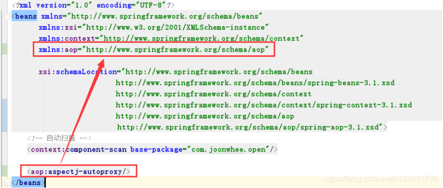

 

 

// 1.1 默认命名空间节点的处理，例如： 

##### parseDefaultElement(ele, delegate);

```java
private void parseDefaultElement(Element ele, BeanDefinitionParserDelegate delegate) {
    // 1.对import标签的处理
    if (delegate.nodeNameEquals(ele, IMPORT_ELEMENT)) {
        importBeanDefinitionResource(ele);
    }
    // 2.对alias标签的处理
    else if (delegate.nodeNameEquals(ele, ALIAS_ELEMENT)) {
        processAliasRegistration(ele);
    }
    // 3.对bean标签的处理(最复杂最重要)
    else if (delegate.nodeNameEquals(ele, BEAN_ELEMENT)) {
        processBeanDefinition(ele, delegate);
    }
    // 4.对beans标签的处理
    else if (delegate.nodeNameEquals(ele, NESTED_BEANS_ELEMENT)) {
        // recurse
        doRegisterBeanDefinitions(ele);
    }
}
```

 

可以看到默认命名空间的一级节点只有4种：import、alias、bean、beans。这4种节点中，最重要、最复杂的就是  bean节点，重点介绍  节点的处理，理解了bean节点后，其他的都不难理解。

另外， 节点只是递归调用之前的 doRegisterBeanDefinitions 方法，因此无需再介绍。

 

##### processBeanDefinition

```java
protected void processBeanDefinition(Element ele, BeanDefinitionParserDelegate delegate) {
    // 1.进行节点定义解析, 经过这个方法后，bdHolder会包含一个Bean节点的所有属性，例如name、class、id
    BeanDefinitionHolder bdHolder = delegate.parseBeanDefinitionElement(ele);
    if (bdHolder != null) {
        // 2.若存在默认标签的子节点下再有自定义属性，需要再次对自定义标签再进行解析(基本不用，不做深入解析)
        bdHolder = delegate.decorateBeanDefinitionIfRequired(ele, bdHolder);
        try {
            // Register the final decorated instance.
            // 3.解析节点定义完成后，需要对解析后的bdHolder进行注册
            BeanDefinitionReaderUtils.registerBeanDefinition(bdHolder, getReaderContext().getRegistry());
        } catch (BeanDefinitionStoreException ex) {
            getReaderContext().error("Failed to register bean definition with name '" +
                    bdHolder.getBeanName() + "'", ele, ex);
        }
        // Send registration event.
        // 4.最后发出响应事件，通知相关的监听器，这个Bean已经加载完成了
        getReaderContext().fireComponentRegistered(new BeanComponentDefinition(bdHolder));
    }
}
```

1. 进行节点定义解析，**见代码块1详解**。
2. 基本不用，不做深入解析。
3. 解析节点定义完成后，需要对解析后的 bdHolder 进行注册，**见代码块13详解**。
4. 发出响应事件，通知相关的监听器，不做深入解析。

 

##### 代码块1：parseBeanDefinitionElement

```java
public BeanDefinitionHolder parseBeanDefinitionElement(Element ele) {
    return parseBeanDefinitionElement(ele, null);
}
 
public BeanDefinitionHolder parseBeanDefinitionElement(Element ele, BeanDefinition containingBean) {
    // 1.解析name和id属性
    // 解析id属性
    String id = ele.getAttribute(ID_ATTRIBUTE);
    // 解析name属性
    String nameAttr = ele.getAttribute(NAME_ATTRIBUTE);
 
    // 分割name属性（通过逗号或分号）
    // 例如：<bean name="demoService,demoServiceAlias" class=""/>，分割后aliases为[demoService, demoServiceAlias]
    List<String> aliases = new ArrayList<String>();
    if (StringUtils.hasLength(nameAttr)) {
        String[] nameArr = StringUtils.tokenizeToStringArray(nameAttr, MULTI_VALUE_ATTRIBUTE_DELIMITERS);
        aliases.addAll(Arrays.asList(nameArr));
    }
 
    // beanName默认使用id
    String beanName = id;
    if (!StringUtils.hasText(beanName) && !aliases.isEmpty()) {
        // 如果id为空，并且aliases不为空，则取aliases的第一个元素作为beanName，其他的仍作为别名
        beanName = aliases.remove(0);
        if (logger.isDebugEnabled()) {
            logger.debug("No XML 'id' specified - using '" + beanName +
                    "' as bean name and " + aliases + " as aliases");
        }
    }
 
    if (containingBean == null) {
        // 检查beanName和aliases是否在同一个 <beans> 下已经存在
        checkNameUniqueness(beanName, aliases, ele);
    }
 
    // 2.进一步解析bean的其他所有属性并统一封装至GenericBeanDefinition类型实例中
    AbstractBeanDefinition beanDefinition = parseBeanDefinitionElement(ele, beanName, containingBean);
    if (beanDefinition != null) {
        if (!StringUtils.hasText(beanName)) {
            try {
                // 3.如果bean定义存在，但是beanName为空，则用Spring默认的生成规则为当前bean生成beanName
                if (containingBean != null) {
                    beanName = BeanDefinitionReaderUtils.generateBeanName(
                            beanDefinition, this.readerContext.getRegistry(), true);
                }
                else {
                    // Spring提供的生成规则生成beanName，例如：com.itheima.demo.service.impl.DemoServiceImpl#0
                    beanName = this.readerContext.generateBeanName(beanDefinition);
                    // Register an alias for the plain bean class name, if still possible,
                    // if the generator returned the class name plus a suffix.
                    // This is expected for Spring 1.2/2.0 backwards compatibility.
                    String beanClassName = beanDefinition.getBeanClassName();
                    if (beanClassName != null &&
                            beanName.startsWith(beanClassName) && beanName.length() > beanClassName.length() &&
                            !this.readerContext.getRegistry().isBeanNameInUse(beanClassName)) {
                        // 如果Spring默认的生成规则生成的beanName为:类名加后缀，则将类名注册为别名
                        aliases.add(beanClassName);
                    }
                }
                if (logger.isDebugEnabled()) {
                    logger.debug("Neither XML 'id' nor 'name' specified - " +
                            "using generated bean name [" + beanName + "]");
                }
            }
            catch (Exception ex) {
                error(ex.getMessage(), ele);
                return null;
            }
        }
        String[] aliasesArray = StringUtils.toStringArray(aliases);
        // 4.将bean定义、beanName、bean别名数组封装成BeanDefinitionHolder
        return new BeanDefinitionHolder(beanDefinition, beanName, aliasesArray);
    }
 
    return null;
}
```

 1.解析 name 和 id 属性，其中 name 属性可以通过分割符设置多个。如果 id 存在，则 使用 id 作为 beanName，name 属性分割后全部作为别名；如果 id 不存在，则将 name 属性分割后的第1个作为 beanName，剩下的全部作为别名。

举个例子：

```xml
<!-- 配置1 -->
<bean id="appleService" name="appleOne;appleTwo" class="com.itheima.AppleServiceImpl"/>
 
<!-- 配置2 -->
<bean name="bananaOne;bananaTwo" class="com.itheima.BananaServiceImpl"/>
```

2.进一步解析 bean 的其他所有属性并统一封装至 GenericBeanDefinition 类型实例中，**见代码块2详解**。

 

##### 代码块2：parseBeanDefinitionElement

```java
public AbstractBeanDefinition parseBeanDefinitionElement(
        Element ele, String beanName, BeanDefinition containingBean) {
 
    this.parseState.push(new BeanEntry(beanName));
 
    String className = null;
    // 1.解析class、parent属性
    // 解析class属性
    if (ele.hasAttribute(CLASS_ATTRIBUTE)) {
        className = ele.getAttribute(CLASS_ATTRIBUTE).trim();
    }
 
    try {
        String parent = null;
        // 解析parent属性
        if (ele.hasAttribute(PARENT_ATTRIBUTE)) {
            parent = ele.getAttribute(PARENT_ATTRIBUTE);
        }
        // 2.创建用于承载属性的AbstractBeanDefinition类型的GenericBeanDefinition
        AbstractBeanDefinition bd = createBeanDefinition(className, parent);
 
        // 3.解析bean的各种属性
        parseBeanDefinitionAttributes(ele, beanName, containingBean, bd);
        // 提取description
        bd.setDescription(DomUtils.getChildElementValueByTagName(ele, DESCRIPTION_ELEMENT));
 
        // 解析元数据子节点(基本不用, 不深入介绍)
        parseMetaElements(ele, bd);
        // 解析lookup-method子节点(基本不用, 不深入介绍)
        parseLookupOverrideSubElements(ele, bd.getMethodOverrides());
        // 解析replaced-method子节点(基本不用, 不深入介绍)
        parseReplacedMethodSubElements(ele, bd.getMethodOverrides());
 
        // 4.解析constructor-arg子节点
        parseConstructorArgElements(ele, bd);
        // 5.解析property子节点
        parsePropertyElements(ele, bd);
        // 解析qualifier子节点(基本不用, 不深入介绍)
        parseQualifierElements(ele, bd);
 
        bd.setResource(this.readerContext.getResource());
        bd.setSource(extractSource(ele));
 
        return bd;
    }
    catch (ClassNotFoundException ex) {
        error("Bean class [" + className + "] not found", ele, ex);
    }
    catch (NoClassDefFoundError err) {
        error("Class that bean class [" + className + "] depends on not found", ele, err);
    }
    catch (Throwable ex) {
        error("Unexpected failure during bean definition parsing", ele, ex);
    }
    finally {
        this.parseState.pop();
    }
 
    return null;
}
```

1.解析了class、parent属性，因为第2步创建 AbstractBeanDefinition 需要用到这两个属性，否则，这两个属性可以放到第3步一起解析。

2.创建用于承载属性的 AbstractBeanDefinition 类型的 GenericBeanDefinition。比较简单，直接 new 一个 GenericBeanDefinition，如果 className 和 classLoader 不为空，则通过反射构建出 BeanClass，并设置为 GenericBeanDefinition 的属性。

3.解析 bean 的剩余属性，**见代码块3详解**。

4.解析 constructor-arg 子节点

5.解析 property 子节点，**见代码块4详解**。

 

##### 代码块3：parseBeanDefinitionAttributes

```java
public AbstractBeanDefinition parseBeanDefinitionAttributes(Element ele, String beanName,
        BeanDefinition containingBean, AbstractBeanDefinition bd) {
    // 解析singleton属性
    if (ele.hasAttribute(SINGLETON_ATTRIBUTE)) {
        // singleton属性已经不支持, 如果使用了会直接抛出异常, 请使用scope属性代替
        error("Old 1.x 'singleton' attribute in use - upgrade to 'scope' declaration", ele);
    }
    // 解析scope属性
    else if (ele.hasAttribute(SCOPE_ATTRIBUTE)) {
        bd.setScope(ele.getAttribute(SCOPE_ATTRIBUTE));
    }
    else if (containingBean != null) {
        // Take default from containing bean in case of an inner bean definition.
        bd.setScope(containingBean.getScope());
    }
 
    // 解析abstract属性
    if (ele.hasAttribute(ABSTRACT_ATTRIBUTE)) {
        bd.setAbstract(TRUE_VALUE.equals(ele.getAttribute(ABSTRACT_ATTRIBUTE)));
    }
 
    // 解析lazy-init属性, 默认为false
    String lazyInit = ele.getAttribute(LAZY_INIT_ATTRIBUTE);
    if (DEFAULT_VALUE.equals(lazyInit)) {
        lazyInit = this.defaults.getLazyInit();
    }
    bd.setLazyInit(TRUE_VALUE.equals(lazyInit));
 
    // 解析autowire属性
    String autowire = ele.getAttribute(AUTOWIRE_ATTRIBUTE);
    bd.setAutowireMode(getAutowireMode(autowire));
 
    // 解析dependency-check属性
    String dependencyCheck = ele.getAttribute(DEPENDENCY_CHECK_ATTRIBUTE);
    bd.setDependencyCheck(getDependencyCheck(dependencyCheck));
 
    // 解析depends-on属性
    if (ele.hasAttribute(DEPENDS_ON_ATTRIBUTE)) {
        String dependsOn = ele.getAttribute(DEPENDS_ON_ATTRIBUTE);
        bd.setDependsOn(StringUtils.tokenizeToStringArray(dependsOn, MULTI_VALUE_ATTRIBUTE_DELIMITERS));
    }
 
    // 解析autowire-candidate属性
    String autowireCandidate = ele.getAttribute(AUTOWIRE_CANDIDATE_ATTRIBUTE);
    if ("".equals(autowireCandidate) || DEFAULT_VALUE.equals(autowireCandidate)) {
        String candidatePattern = this.defaults.getAutowireCandidates();
        if (candidatePattern != null) {
            String[] patterns = StringUtils.commaDelimitedListToStringArray(candidatePattern);
            bd.setAutowireCandidate(PatternMatchUtils.simpleMatch(patterns, beanName));
        }
    }
    else {
        bd.setAutowireCandidate(TRUE_VALUE.equals(autowireCandidate));
    }
 
    // 解析primary属性
    if (ele.hasAttribute(PRIMARY_ATTRIBUTE)) {
        bd.setPrimary(TRUE_VALUE.equals(ele.getAttribute(PRIMARY_ATTRIBUTE)));
    }
 
    // 解析init-method属性
    if (ele.hasAttribute(INIT_METHOD_ATTRIBUTE)) {
        String initMethodName = ele.getAttribute(INIT_METHOD_ATTRIBUTE);
        if (!"".equals(initMethodName)) {
            bd.setInitMethodName(initMethodName);
        }
    }
    else {
        if (this.defaults.getInitMethod() != null) {
            bd.setInitMethodName(this.defaults.getInitMethod());
            bd.setEnforceInitMethod(false);
        }
    }
 
    // 解析destroy-method属性
    if (ele.hasAttribute(DESTROY_METHOD_ATTRIBUTE)) {
        String destroyMethodName = ele.getAttribute(DESTROY_METHOD_ATTRIBUTE);
        bd.setDestroyMethodName(destroyMethodName);
    }
    else {
        if (this.defaults.getDestroyMethod() != null) {
            bd.setDestroyMethodName(this.defaults.getDestroyMethod());
            bd.setEnforceDestroyMethod(false);
        }
    }
 
    // 解析factory-method属性
    if (ele.hasAttribute(FACTORY_METHOD_ATTRIBUTE)) {
        bd.setFactoryMethodName(ele.getAttribute(FACTORY_METHOD_ATTRIBUTE));
    }
    // 解析factory-bean属性
    if (ele.hasAttribute(FACTORY_BEAN_ATTRIBUTE)) {
        bd.setFactoryBeanName(ele.getAttribute(FACTORY_BEAN_ATTRIBUTE));
    }
 
    return bd;
}
```

内容比较简单，就是从节点 ele 拿到所有的属性值，塞给 AbstractBeanDefinition 的对应属性。这些属性的使用如下图。


 

 

##### 代码块4：parsePropertyElements

```java
public void parsePropertyElements(Element beanEle, BeanDefinition bd) {
    // 拿到beanEle节点的所有子节点
    NodeList nl = beanEle.getChildNodes();
    for (int i = 0; i < nl.getLength(); i++) {
        Node node = nl.item(i);
        if (isCandidateElement(node) && nodeNameEquals(node, PROPERTY_ELEMENT)) {
            // 解析property节点
            parsePropertyElement((Element) node, bd);
        }
    }
}
```

拿到 beanEle 节点的所有子节点，遍历解析所有是 property 节点的子节点，**见代码块5详解**。

property 的使用如下图所示，property 节点类似于set方法，bean 中的属性必须要有 set 方法才可以使用，否则会报错。

 

##### 代码块5：parsePropertyElement

```java
public void parsePropertyElement(Element ele, BeanDefinition bd) {
    // 1.拿到name属性
    String propertyName = ele.getAttribute(NAME_ATTRIBUTE);
    if (!StringUtils.hasLength(propertyName)) {
        // name属性为必要属性，如果没有配置，则抛出异常
        error("Tag 'property' must have a 'name' attribute", ele);
        return;
    }
    this.parseState.push(new PropertyEntry(propertyName));
    try {
        // 2.校验在相同bean节点下，是否存在相同的name属性，如果存在则抛出异常
        if (bd.getPropertyValues().contains(propertyName)) {
            error("Multiple 'property' definitions for property '" + propertyName + "'", ele);
            return;
        }
        // 3.解析属性值
        Object val = parsePropertyValue(ele, bd, propertyName);
        // 4.将解析的属性值和属性name封装成PropertyValue
        PropertyValue pv = new PropertyValue(propertyName, val);
        // 5.解析meta节点（基本不用，不深入解析）
        parseMetaElements(ele, pv);
        pv.setSource(extractSource(ele));
        // 6.将解析出来的PropertyValue，添加到BeanDefinition的propertyValues属性中(上面的重复校验用到)
        bd.getPropertyValues().addPropertyValue(pv);
    }
    finally {
        this.parseState.pop();
    }
}
```

 

 

##### 代码块6：registerBeanDefinition

```java
public static void registerBeanDefinition(
        BeanDefinitionHolder definitionHolder, BeanDefinitionRegistry registry)
        throws BeanDefinitionStoreException {
 
    // Register bean definition under primary name.
    // 1.拿到beanName
    String beanName = definitionHolder.getBeanName();
    // 2.注册beanName、BeanDefinition到缓存中（核心逻辑）,实现类为; DefaultListableBeanFactory
    registry.registerBeanDefinition(beanName, definitionHolder.getBeanDefinition());
 
    // Register aliases for bean name, if any.
    // 注册bean名称的别名（如果有的话）
    String[] aliases = definitionHolder.getAliases();
    if (aliases != null) {
        for (String alias : aliases) {
            // 3.注册bean的beanName和对应的别名映射到缓存中（缓存：aliasMap）
            registry.registerAlias(beanName, alias);
        }
    }
}
```

 

2.注册 beanName、BeanDefinition 到缓存中，**见代码块7详解**。

3.如果有别名，则注册 bean 的 beanName 和对应的别名映射到 aliasMap 缓存中，**见代码块9详解**。

 

##### 代码块7：registerBeanDefinition

```java
@Override
public void registerBeanDefinition(String beanName, BeanDefinition beanDefinition)
        throws BeanDefinitionStoreException {
    // 1.beanName和beanDefinition为空校验
    Assert.hasText(beanName, "Bean name must not be empty");
    Assert.notNull(beanDefinition, "BeanDefinition must not be null");
 
    if (beanDefinition instanceof AbstractBeanDefinition) {
        try {
            // 注册前的最后校验
            ((AbstractBeanDefinition) beanDefinition).validate();
        } catch (BeanDefinitionValidationException ex) {
            throw new BeanDefinitionStoreException(beanDefinition.getResourceDescription(), beanName,
                    "Validation of bean definition failed", ex);
        }
    }
 
    BeanDefinition oldBeanDefinition;
 
    // 首先根据beanName从beanDefinitionMap缓存中尝试获取
    oldBeanDefinition = this.beanDefinitionMap.get(beanName);
    if (oldBeanDefinition != null) {
        // 2.beanName存在于缓存中
        if (!isAllowBeanDefinitionOverriding()) {
            // 如果不允许相同beanName重新注册，则直接抛出异常
            throw new BeanDefinitionStoreException(beanDefinition.getResourceDescription(), beanName,
                    "Cannot register bean definition [" + beanDefinition + "] for bean '" + beanName +
                            "': There is already [" + oldBeanDefinition + "] bound.");
        } else if (oldBeanDefinition.getRole() < beanDefinition.getRole()) {
            // e.g. was ROLE_APPLICATION, now overriding with ROLE_SUPPORT or ROLE_INFRASTRUCTURE
            if (this.logger.isWarnEnabled()) {
                this.logger.warn("Overriding user-defined bean definition for bean '" + beanName +
                        "' with a framework-generated bean definition: replacing [" +
                        oldBeanDefinition + "] with [" + beanDefinition + "]");
            }
        } else if (!beanDefinition.equals(oldBeanDefinition)) {
            if (this.logger.isInfoEnabled()) {
                this.logger.info("Overriding bean definition for bean '" + beanName +
                        "' with a different definition: replacing [" + oldBeanDefinition +
                        "] with [" + beanDefinition + "]");
            }
        } else {
            if (this.logger.isDebugEnabled()) {
                this.logger.debug("Overriding bean definition for bean '" + beanName +
                        "' with an equivalent definition: replacing [" + oldBeanDefinition +
                        "] with [" + beanDefinition + "]");
            }
        }
        // 将本次传进来的beanName 和 BeanDefinition映射放入beanDefinitionMap缓存（以供后续创建bean时使用）
        this.beanDefinitionMap.put(beanName, beanDefinition);
    } else {
        // 3.beanName不存在于缓存中
        if (hasBeanCreationStarted()) {
            // 3.1 bean创建阶段已经开始
            // Cannot modify startup-time collection elements anymore (for stable iteration)
            synchronized (this.beanDefinitionMap) {
                // 将本次传进来的beanName 和 BeanDefinition映射放入beanDefinitionMap缓存
                this.beanDefinitionMap.put(beanName, beanDefinition);
                // 将本次传进来的beanName 加入beanDefinitionNames缓存
                List<String> updatedDefinitions = new ArrayList<String>(this.beanDefinitionNames.size() + 1);
                updatedDefinitions.addAll(this.beanDefinitionNames);
                updatedDefinitions.add(beanName);
                this.beanDefinitionNames = updatedDefinitions;
                // 将beanName从manualSingletonNames缓存移除
                if (this.manualSingletonNames.contains(beanName)) {
                    Set<String> updatedSingletons = new LinkedHashSet<String>(this.manualSingletonNames);
                    updatedSingletons.remove(beanName);
                    this.manualSingletonNames = updatedSingletons;
                }
            }
        } else {
            // 3.2 bean创建阶段还未开始
            // Still in startup registration phase
            // 将本次传进来的beanName 和 BeanDefinition映射放入beanDefinitionMap缓存
            this.beanDefinitionMap.put(beanName, beanDefinition);
            // 将本次传进来的beanName 加入beanDefinitionNames缓存
            this.beanDefinitionNames.add(beanName);
            // 将beanName从manualSingletonNames缓存移除
            this.manualSingletonNames.remove(beanName);
        }
        this.frozenBeanDefinitionNames = null;
    }
 
    // 4.如果存在相同beanName的BeanDefinition，并且beanName已经存在单例对象，则将该beanName对应的缓存信息、单例对象清除，
    // 因为这些对象都是通过oldBeanDefinition创建出来的，需要被覆盖掉的，
    // 我们需要用新的BeanDefinition（也就是本次传进来的beanDefinition）来创建这些缓存和单例对象
    if (oldBeanDefinition != null || containsSingleton(beanName)) {
        resetBeanDefinition(beanName);
    }
}
```

 

这个方法会将 beanName 添加到 beanDefinitionNames 缓存，将 beanName 和 BeanDefinition 的映射关系添加到beanDefinitionMap 缓存。

如果 beanName不重复（一般不会重复），对于我们当前正在解析的 obtainFreshBeanFactory 方法来说，因为 bean 创建还未开始，因此会走到 3.2 进行缓存的注册。

4.如果 beanName 重复，并且该 beanName 已经存在单例对象，则会调用 resetBeanDefinition 方法，见代码块8详解。

##### 代码块8：resetBeanDefinition

```java
protected void resetBeanDefinition(String beanName) {
    // Remove the merged bean definition for the given bean, if already created.
    // 1.删除beanName的mergedBeanDefinitions缓存（如果有的话）
    clearMergedBeanDefinition(beanName);
 
    // Remove corresponding bean from singleton cache, if any. Shouldn't usually
    // be necessary, rather just meant for overriding a context's default beans
    // (e.g. the default StaticMessageSource in a StaticApplicationContext).
    // 2.从单例缓存中删除该beanName对应的bean（如果有的话）
    destroySingleton(beanName);
 
    // Reset all bean definitions that have the given bean as parent (recursively).
    // 3.重置beanName的所有子Bean定义（递归）
    for (String bdName : this.beanDefinitionNames) {
        if (!beanName.equals(bdName)) {
            BeanDefinition bd = this.beanDefinitionMap.get(bdName);
            // 当前遍历的BeanDefinition的parentName为beanName，则递归调用resetBeanDefinition进行重置
            if (beanName.equals(bd.getParentName())) {
                resetBeanDefinition(bdName);
            }
        }
    }
}
```

比较简单，将该 beanName 的 mergedBeanDefinitions 缓存信息删除、单例缓存删除。如果存在子 bean 定义，则递归重置。实际开发过程中，基本不会出现 beanName 相同的情况，因此基本不会走到该方法。

 

##### 代码块9：registerAlias

```java
@Override
public void registerAlias(String name, String alias) {
    Assert.hasText(name, "'name' must not be empty");
    Assert.hasText(alias, "'alias' must not be empty");
    // 1.如果别名和beanName相同，则不算别名，从aliasMap缓存中移除
    if (alias.equals(name)) {
        this.aliasMap.remove(alias);
    }
    else {
        String registeredName = this.aliasMap.get(alias);
        if (registeredName != null) {
            if (registeredName.equals(name)) {
                // An existing alias - no need to re-register
                // 2.如果别名已经注册过，直接返回
                return;
            }
            // 3.如果存在相同的别名，并且不允许别名覆盖，则抛出异常
            if (!allowAliasOverriding()) {
                throw new IllegalStateException("Cannot register alias '" + alias + "' for name '" +
                        name + "': It is already registered for name '" + registeredName + "'.");
            }
        }
        // 4.检查name和alias是否存在循环引用。例如A的别名为B，B的别名为A
        checkForAliasCircle(name, alias);
        // 5.将别名和beanName的映射放到aliasMap缓存中
        this.aliasMap.put(alias, name);
    }
}
```

将别名和 beanName 注册到 aliasMap 缓存。

 

#### 方法总结

到这里已经初始化了 Bean 容器，`<bean />` 配置也相应的转换为了一个个 BeanDefinition，然后注册了各个 BeanDefinition 到注册中心，并且发送了注册事件

- 首先，将 xml 中的 bean 配置信息进行了解析，并构建了 AbstractBeanDefinition（GenericBeanDefinition） 对象来存放所有解析出来的属性
- 其次，将 AbstractBeanDefinition 、beanName、aliasesArray 构建成 BeanDefinitionHolder 对象并返回
- 最后，通过 BeanDefinitionHolder 将 BeanDefinition 和 beanName 注册到 BeanFactory 中，也就是存放到缓存中。

执行完 parseDefaultElement 方法，我们得到了两个重要的缓存：

- beanDefinitionNames 缓存
- beanDefinitionMap 缓存

 

 

### 【3. bean工厂前置操作】prepareBeanFactory(beanFactory);

#### 方法概述

配置 beanFactory 的标准上下文特征，例如上下文的 ClassLoader、后置处理器等。这个方法会注册3个默认环境 bean：environment、systemProperties 和 systemEnvironment，注册 2 个 bean 后置处理器：ApplicationContextAwareProcessor 和 ApplicationListenerDetector。

#### 源码剖析

```java
protected void prepareBeanFactory(ConfigurableListableBeanFactory beanFactory) {
        // Tell the internal bean factory to use the context's class loader etc.
        // 设置 BeanFactory 的类加载器 BeanFactory 需要加载类，也就需要类加载器
        beanFactory.setBeanClassLoader(getClassLoader());
        // 设置EL表达式解析器（Bean初始化完成后填充属性时会用到）
        beanFactory.setBeanExpressionResolver(new StandardBeanExpressionResolver(beanFactory.getBeanClassLoader()));
        //设置属性注册解析器PropertyEditor
        beanFactory.addPropertyEditorRegistrar(new ResourceEditorRegistrar(this, getEnvironment()));

        // Configure the bean factory with context callbacks.
        // 添加一个 BeanPostProcessor，这个 processor 比较简单：
        // 实现了 Aware 接口的 beans 在初始化的时候，这个 processor 负责回调，
        // 这个我们很常用，如我们会为了获取 ApplicationContext 而 implement ApplicationContextAware
        // 注意：它不仅仅回调 ApplicationContextAware，还会负责回调 EnvironmentAware、ResourceLoaderAware 等
        beanFactory.addBeanPostProcessor(new ApplicationContextAwareProcessor(this));

        //忽略依赖接口
        // skip：下面几行的意思就是，如果某个 bean 依赖于以下几个接口的实现类，在自动装配的时候忽略它们，
        // Spring 会通过其他方式来处理这些依赖。
        beanFactory.ignoreDependencyInterface(EnvironmentAware.class);
        beanFactory.ignoreDependencyInterface(EmbeddedValueResolverAware.class);
        beanFactory.ignoreDependencyInterface(ResourceLoaderAware.class);
        beanFactory.ignoreDependencyInterface(ApplicationEventPublisherAware.class);
        beanFactory.ignoreDependencyInterface(MessageSourceAware.class);
        beanFactory.ignoreDependencyInterface(ApplicationContextAware.class);

        // BeanFactory interface not registered as resolvable type in a plain factory.
        // MessageSource registered (and found for autowiring) as a bean.
        /*
         * skip:下面几行就是为特殊的几个 bean 赋值，如果有 bean 依赖了以下几个接口，会注入这边相应的值，
         */
        beanFactory.registerResolvableDependency(BeanFactory.class, beanFactory);
        beanFactory.registerResolvableDependency(ResourceLoader.class, this);
        beanFactory.registerResolvableDependency(ApplicationEventPublisher.class, this);
        beanFactory.registerResolvableDependency(ApplicationContext.class, this);

        // Register early post-processor for detecting inner beans as ApplicationListeners.
        // 这个 BeanPostProcessor 也很简单，在 bean 实例化后，如果是 ApplicationListener 的子类，
        // 那么将其添加到 listener 列表中，可以理解成：注册 事件监听器
        beanFactory.addBeanPostProcessor(new ApplicationListenerDetector(this));

        // Detect a LoadTimeWeaver and prepare for weaving, if found.
        //*****************************智能注册***************************************************
        //如果当前BeanFactory包含loadTimeWeaver Bean，说明存在类加载期织入AspectJ，
        // 这里涉及到特殊的 bean，名为：loadTimeWeaver，这不是我们的重点，忽略它
        // tips: ltw 是 AspectJ 的概念，指的是在运行期进行织入，这个和 Spring AOP 不一样，
        if (beanFactory.containsBean(LOAD_TIME_WEAVER_BEAN_NAME)) {
            beanFactory.addBeanPostProcessor(new LoadTimeWeaverAwareProcessor(beanFactory));
            // Set a temporary ClassLoader for type matching.
            beanFactory.setTempClassLoader(new ContextTypeMatchClassLoader(beanFactory.getBeanClassLoader()));
        }

        // Register default environment beans.
        /**
         * 从下面几行代码我们可以知道，Spring 往往很 "智能" 就是因为它会帮我们默认注册一些有用的 bean，
         * 我们也可以选择覆盖
         */
        // 如果没有定义 "environment" 这个 bean，那么 Spring 会 "手动" 注册一个
        if (!beanFactory.containsLocalBean(ENVIRONMENT_BEAN_NAME)) {
            beanFactory.registerSingleton(ENVIRONMENT_BEAN_NAME, getEnvironment());
        }

        // 如果没有定义 "systemProperties" 这个 bean，那么 Spring 会 "手动" 注册一个
        if (!beanFactory.containsLocalBean(SYSTEM_PROPERTIES_BEAN_NAME)) {
            beanFactory.registerSingleton(SYSTEM_PROPERTIES_BEAN_NAME, getEnvironment().getSystemProperties());
        }
        // 如果没有定义 "systemEnvironment" 这个 bean，那么 Spring 会 "手动" 注册一个
        if (!beanFactory.containsLocalBean(SYSTEM_ENVIRONMENT_BEAN_NAME)) {
            beanFactory.registerSingleton(SYSTEM_ENVIRONMENT_BEAN_NAME, getEnvironment().getSystemEnvironment());
        }
    }
```

 

### 【4. bean工厂后置操作】postProcessBeanFactory(beanFactory);

此处为空方法，如果子类需要，自己去实现

```java
protected void postProcessBeanFactory(ConfigurableListableBeanFactory beanFactory) {
}
```

 

### 【5. 调用bean工厂后置处理器】invokeBeanFactoryPostProcessors(beanFactory);

#### 方法概述

- 该方法会 实例化 和 调用 所有 BeanFactoryPostProcessor（包括其子类 BeanDefinitionRegistryPostProcessor）。
- BeanFactoryPostProcessor 接口是 Spring 初始化 BeanFactory 时对外暴露的扩展点，Spring IoC 容器允许 BeanFactoryPostProcessor 在容器实例化任何 bean 之前读取 bean 的定义，并可以修改它。

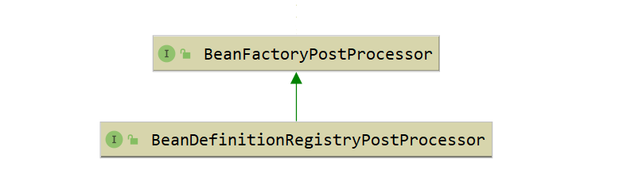

- BeanDefinitionRegistryPostProcessor 继承自 BeanFactoryPostProcessor，比 BeanFactoryPostProcessor 具有更高的优先级，主要用来在常规的 BeanFactoryPostProcessor 检测开始之前注册其他 bean 定义。特别是，你可以通过 BeanDefinitionRegistryPostProcessor 来注册一些常规的 BeanFactoryPostProcessor，因为此时所有常规的 BeanFactoryPostProcessor 都还没开始被处理。 

 

#### 实例演示

##### 1.BeanDefinitionRegistryPostProcessor 的扩展使用

使用方法比较简单，新建一个类实现 BeanDefinitionRegistryPostProcessor 接口，并将该类注册到 Spring IoC 容器中。

```java
package com.itheima.BeanFactoryPostProcessor;
 
import org.springframework.beans.BeansException;
import org.springframework.beans.factory.config.ConfigurableListableBeanFactory;
import org.springframework.beans.factory.support.BeanDefinitionRegistry;
import org.springframework.beans.factory.support.BeanDefinitionRegistryPostProcessor;
import org.springframework.core.Ordered;
import org.springframework.stereotype.Component;
 

@Component
public class MyBeanDefinitionRegistryPostProcessor implements BeanDefinitionRegistryPostProcessor, Ordered {
 
    @Override
    public void postProcessBeanDefinitionRegistry(BeanDefinitionRegistry registry) throws BeansException {
        System.out.println("MyBeanDefinitionRegistryPostProcessor#postProcessBeanDefinitionRegistry");
        // 自己的逻辑处理
    }
 
    @Override
    public void postProcessBeanFactory(ConfigurableListableBeanFactory beanFactory) throws BeansException {
        System.out.println("MyBeanDefinitionRegistryPostProcessor#postProcessBeanFactory");
        // 自己的逻辑处理
    }
 
    @Override
    public int getOrder() {
        return 0;
    }
}
```

 

##### 2.BeanFactoryPostProcessor 的扩展使用

使用方法跟 BeanDefinitionRegistryPostProcessor 类似。

```java
package com.itheima.BeanFactoryPostProcessor;
 
import org.springframework.beans.BeansException;
import org.springframework.beans.factory.config.BeanFactoryPostProcessor;
import org.springframework.beans.factory.config.ConfigurableListableBeanFactory;
import org.springframework.stereotype.Component;

@Component
public class MyBeanFactoryPostProcessor implements BeanFactoryPostProcessor {
    @Override
    public void postProcessBeanFactory(ConfigurableListableBeanFactory beanFactory) throws BeansException {
        System.out.println("MyBeanFactoryPostProcessor#postProcessBeanFactory");
        // 自己的逻辑处理
    }
}
```

 

#### 源码剖析

##### invokeBeanFactoryPostProcessors(beanFactory)；

```java
protected void invokeBeanFactoryPostProcessors(ConfigurableListableBeanFactory beanFactory) {
    // 1.getBeanFactoryPostProcessors(): 拿到当前应用上下文beanFactoryPostProcessors变量中的值
    // 2.invokeBeanFactoryPostProcessors: 实例化并调用所有已注册的BeanFactoryPostProcessor
    PostProcessorRegistrationDelegate.invokeBeanFactoryPostProcessors(beanFactory, getBeanFactoryPostProcessors());
 
    // Detect a LoadTimeWeaver and prepare for weaving, if found in the meantime
    // (e.g. through an @Bean method registered by ConfigurationClassPostProcessor)
    if (beanFactory.getTempClassLoader() == null && beanFactory.containsBean(LOAD_TIME_WEAVER_BEAN_NAME)) {
        beanFactory.addBeanPostProcessor(new LoadTimeWeaverAwareProcessor(beanFactory));
        beanFactory.setTempClassLoader(new ContextTypeMatchClassLoader(beanFactory.getBeanClassLoader()));
    }
}
```

- 1.拿到当前应用上下文 beanFactoryPostProcessors 变量中的值，**见代码块1详解**。
- 2.实例化并调用所有已注册的 BeanFactoryPostProcessor，**见代码块2详解**。

 

##### 代码块1：getBeanFactoryPostProcessors

```java
public List<BeanFactoryPostProcessor> getBeanFactoryPostProcessors() {
    return this.beanFactoryPostProcessors;
}
```

这边 getBeanFactoryPostProcessors() 会拿到当前应用上下文中已经注册的 BeanFactoryPostProcessor，在默认情况下，this.beanFactoryPostProcessors 是返回空的。

 

**如何添加自定义 BeanFactoryPostProcessor 到 this.beanFactoryPostProcessors 变量？**

在prepareBeanFactory#customizeContext 方法，该方法是 Spring 提供给开发者的一个扩展点，用于自定义应用上下文，并且在 refresh() 方法前就被调用。在这边就可以通过该方法来添加自定义的 BeanFactoryPostProcessor。

简单的实现如下：

1.新建一个 ApplicationContextInitializer 的实现类 SpringApplicationContextInitializer ，并在 initialize 方法中写我们的逻辑。

```java
package com.itheima.spring;
 
import org.springframework.context.ApplicationContextInitializer;
import org.springframework.context.ConfigurableApplicationContext;
 
public class SpringApplicationContextInitializer implements ApplicationContextInitializer<ConfigurableApplicationContext> {
 
    @Override
    public void initialize(ConfigurableApplicationContext applicationContext) {
        FirstBeanDefinitionRegistryPostProcessor firstBeanDefinitionRegistryPostProcessor = new FirstBeanDefinitionRegistryPostProcessor();
        // 将自定义的firstBeanDefinitionRegistryPostProcessor添加到应用上下文中
        applicationContext.addBeanFactoryPostProcessor(firstBeanDefinitionRegistryPostProcessor);
        // ...自定义操作
        System.out.println("SpringApplicationContextInitializer#initialize");
    }
}
```

2.将 SpringApplicationContextInitializer 作为初始化参数 contextInitializerClasses 配置到 web.xml 中。

```xml
<context-param>
    <param-name>contextInitializerClasses</param-name>
    <param-value>
        com.itheima.spring.SpringApplicationContextInitializer
    </param-value>
</context-param>
```

这样，在启动应用时，FirstBeanDefinitionRegistryPostProcessor 就会被添加到 this.beanFactoryPostProcessors 中。

 

##### 代码块2：invokeBeanFactoryPostProcessors

```java
public static void invokeBeanFactoryPostProcessors(
            ConfigurableListableBeanFactory beanFactory, List<BeanFactoryPostProcessor> beanFactoryPostProcessors) {

        // Invoke BeanDefinitionRegistryPostProcessors first, if any.
        Set<String> processedBeans = new HashSet<>();

        // 1. 判断beanFactory是否为BeanDefinitionRegistry
        // beanFactory类型为DefaultListableBeanFactory，DefaultListableBeanFactory实现了BeanDefinitionRegistry，所有为true
        if (beanFactory instanceof BeanDefinitionRegistry) {
            // 类型强转
            BeanDefinitionRegistry registry = (BeanDefinitionRegistry) beanFactory;
            // 声明集合：保存普通的BeanFactoryPostProcessor类型的后置处理器
            List<BeanFactoryPostProcessor> regularPostProcessors = new ArrayList<>();
            // 声明集合：保存BeanDefinitionRegistryPostProcessor类型的后置处理器
            List<BeanDefinitionRegistryPostProcessor> registryProcessors = new ArrayList<>();

            // 2.首先遍历处理入参中的BeanFactoryPostProcessor
            for (BeanFactoryPostProcessor postProcessor : beanFactoryPostProcessors) {
                if (postProcessor instanceof BeanDefinitionRegistryPostProcessor) {
                    // 2.1 如果是BeanDefinitionRegistryPostProcessor
                    BeanDefinitionRegistryPostProcessor registryProcessor =
                            (BeanDefinitionRegistryPostProcessor) postProcessor;
                    // 2.1.1 执行BeanDefinitionRegistryPostProcessor接口的postProcessBeanDefinitionRegistry方法
                    registryProcessor.postProcessBeanDefinitionRegistry(registry);
                    // 2.1.2 添加到registryProcessors（用于最后执行postProcessBeanFactory方法）
                    registryProcessors.add(registryProcessor);
                }
                else {
                    // 2.2 否则，只是普通的BeanFactoryPostProcessor
                    // 2.2.1 添加到regularPostProcessors集合
                    regularPostProcessors.add(postProcessor);
                }
            }

            // Do not initialize FactoryBeans here: We need to leave all regular beans
            // uninitialized to let the bean factory post-processors apply to them!
            // Separate between BeanDefinitionRegistryPostProcessors that implement
            // PriorityOrdered, Ordered, and the rest.
            // 定义集合：用于保存本次要执行的BeanDefinitionRegistryPostProcessor
            List<BeanDefinitionRegistryPostProcessor> currentRegistryProcessors = new ArrayList<>();

            // First, invoke the BeanDefinitionRegistryPostProcessors that implement PriorityOrdered.
            // 3.调用所有实现了PriorityOrdered接口的BeanDefinitionRegistryPostProcessors
            // 3.1 找出所有实现了PriorityOrdered接口的Bean的beanName
            String[] postProcessorNames =
                    beanFactory.getBeanNamesForType(BeanDefinitionRegistryPostProcessor.class, true, false);
            // 3.2 遍历postProcessorNames
            for (String ppName : postProcessorNames) {
                // 3.3 校验是否实现了PriorityOrdered接口
                if (beanFactory.isTypeMatch(ppName, PriorityOrdered.class)) {
                    // 3.4 获取ppName对应的bean实例，添加到currentRegistryProcessors
                    currentRegistryProcessors.add(beanFactory.getBean(ppName, BeanDefinitionRegistryPostProcessor.class));
                    // 3.5 将要被执行的加入processedBeans，避免后续重复执行
                    processedBeans.add(ppName);
                }
            }
            // 3.6 进行排序(根据是否实现PriorityOrdered、Ordered接口和order值来排序)
            sortPostProcessors(currentRegistryProcessors, beanFactory);
            // 3.7 添加到registryProcessors(用于最后执行postProcessBeanFactory方法)
            registryProcessors.addAll(currentRegistryProcessors);
            // 3.8 遍历currentRegistryProcessors, 执行postProcessBeanDefinitionRegistry方法
            invokeBeanDefinitionRegistryPostProcessors(currentRegistryProcessors, registry);
            // 3.9 执行完毕后, 清空currentRegistryProcessors
            currentRegistryProcessors.clear();

            // Next, invoke the BeanDefinitionRegistryPostProcessors that implement Ordered.
            // 4.调用所有实现了Ordered接口的BeanDefinitionRegistryPostProcessor实现类（过程跟上面的步骤3基本一样）
            // 4.1 找出所有实现BeanDefinitionRegistryPostProcessor接口的类, 这边重复查找是因为执行完上面的BeanDefinitionRegistryPostProcessor,
            // 可能会新增了其他的BeanDefinitionRegistryPostProcessor, 因此需要重新查找
            postProcessorNames = beanFactory.getBeanNamesForType(BeanDefinitionRegistryPostProcessor.class, true, false);
            for (String ppName : postProcessorNames) {
                // 校验是否实现了Ordered接口，并且还未执行过
                if (!processedBeans.contains(ppName) && beanFactory.isTypeMatch(ppName, Ordered.class)) {
                    currentRegistryProcessors.add(beanFactory.getBean(ppName, BeanDefinitionRegistryPostProcessor.class));
                    processedBeans.add(ppName);
                }
            }
            sortPostProcessors(currentRegistryProcessors, beanFactory);
            registryProcessors.addAll(currentRegistryProcessors);
            // 4.2 遍历currentRegistryProcessors, 执行postProcessBeanDefinitionRegistry方法
            invokeBeanDefinitionRegistryPostProcessors(currentRegistryProcessors, registry);
            currentRegistryProcessors.clear();

            // Finally, invoke all other BeanDefinitionRegistryPostProcessors until no further ones appear.
            // 5.最后, 调用所有剩下的BeanDefinitionRegistryPostProcessors
            boolean reiterate = true;
            while (reiterate) {
                reiterate = false;
                // 5.1 找出所有实现BeanDefinitionRegistryPostProcessor接口的类
                postProcessorNames = beanFactory.getBeanNamesForType(BeanDefinitionRegistryPostProcessor.class, true, false);
                for (String ppName : postProcessorNames) {
                    // 5.2 跳过已经执行过的
                    if (!processedBeans.contains(ppName)) {
                        currentRegistryProcessors.add(beanFactory.getBean(ppName, BeanDefinitionRegistryPostProcessor.class));
                        processedBeans.add(ppName);
                        // 5.3 如果有BeanDefinitionRegistryPostProcessor被执行, 则有可能会产生新的BeanDefinitionRegistryPostProcessor,
                        // 因此这边将reiterate赋值为true, 代表需要再循环查找一次
                        reiterate = true;
                    }
                }
                sortPostProcessors(currentRegistryProcessors, beanFactory);
                registryProcessors.addAll(currentRegistryProcessors);
                // 5.4 遍历currentRegistryProcessors, 执行postProcessBeanDefinitionRegistry方法
                invokeBeanDefinitionRegistryPostProcessors(currentRegistryProcessors, registry);
                currentRegistryProcessors.clear();
            }

            // Now, invoke the postProcessBeanFactory callback of all processors handled so far.
            // 6.调用所有BeanDefinitionRegistryPostProcessor的postProcessBeanFactory方法(BeanDefinitionRegistryPostProcessor继承自BeanFactoryPostProcessor)
            invokeBeanFactoryPostProcessors(registryProcessors, beanFactory);
            // 7.最后, 调用入参beanFactoryPostProcessors中的普通BeanFactoryPostProcessor的postProcessBeanFactory方法
            invokeBeanFactoryPostProcessors(regularPostProcessors, beanFactory);
        }

        else {
            // Invoke factory processors registered with the context instance.
            invokeBeanFactoryPostProcessors(beanFactoryPostProcessors, beanFactory);
        }

        // 到这里 , 入参beanFactoryPostProcessors和容器中的所有BeanDefinitionRegistryPostProcessor已经全部处理完毕,
        // 下面开始处理容器中的所有BeanFactoryPostProcessor

        // Do not initialize FactoryBeans here: We need to leave all regular beans
        // uninitialized to let the bean factory post-processors apply to them!

        // 8.找出所有实现BeanFactoryPostProcessor接口的类
        String[] postProcessorNames =
                beanFactory.getBeanNamesForType(BeanFactoryPostProcessor.class, true, false);

        // Separate between BeanFactoryPostProcessors that implement PriorityOrdered,
        // Ordered, and the rest.
        // 用于存放实现了PriorityOrdered接口的BeanFactoryPostProcessor
        List<BeanFactoryPostProcessor> priorityOrderedPostProcessors = new ArrayList<>();
        // 用于存放实现了Ordered接口的BeanFactoryPostProcessor的beanName
        List<String> orderedPostProcessorNames = new ArrayList<>();
        // 用于存放普通BeanFactoryPostProcessor的beanName
        List<String> nonOrderedPostProcessorNames = new ArrayList<>();
        // 8.1 遍历postProcessorNames, 将BeanFactoryPostProcessor按实现PriorityOrdered、实现Ordered接口、普通三种区分开
        for (String ppName : postProcessorNames) {
            // 8.2 跳过已经执行过的
            if (processedBeans.contains(ppName)) {
                // skip - already processed in first phase above
            }
            else if (beanFactory.isTypeMatch(ppName, PriorityOrdered.class)) {
                // 8.3 添加实现了PriorityOrdered接口的BeanFactoryPostProcessor
                priorityOrderedPostProcessors.add(beanFactory.getBean(ppName, BeanFactoryPostProcessor.class));
            }
            else if (beanFactory.isTypeMatch(ppName, Ordered.class)) {
                // 8.4 添加实现了Ordered接口的BeanFactoryPostProcessor的beanName
                orderedPostProcessorNames.add(ppName);
            }
            else {
                // 8.5 添加剩下的普通BeanFactoryPostProcessor的beanName
                nonOrderedPostProcessorNames.add(ppName);
            }
        }

        // First, invoke the BeanFactoryPostProcessors that implement PriorityOrdered.
        // 9.首先，调用所有实现PriorityOrdered接口的BeanFactoryPostProcessor
        // 9.1 对priorityOrderedPostProcessors排序
        sortPostProcessors(priorityOrderedPostProcessors, beanFactory);
        // 9.2 遍历priorityOrderedPostProcessors, 执行postProcessBeanFactory方法
        invokeBeanFactoryPostProcessors(priorityOrderedPostProcessors, beanFactory);

        // Next, invoke the BeanFactoryPostProcessors that implement Ordered.
        // 10.下一步，调用所有实现Ordered接口的BeanFactoryPostProcessor
        List<BeanFactoryPostProcessor> orderedPostProcessors = new ArrayList<>(orderedPostProcessorNames.size());
        for (String postProcessorName : orderedPostProcessorNames) {
            // 10.1 获取postProcessorName对应的bean实例, 添加到orderedPostProcessors, 准备执行
            orderedPostProcessors.add(beanFactory.getBean(postProcessorName, BeanFactoryPostProcessor.class));
        }
        // 10.2 对orderedPostProcessors排序
        sortPostProcessors(orderedPostProcessors, beanFactory);
        // 10.3 遍历orderedPostProcessors, 执行postProcessBeanFactory方法
        invokeBeanFactoryPostProcessors(orderedPostProcessors, beanFactory);

        // Finally, invoke all other BeanFactoryPostProcessors.
        // 11.调用所有剩下的BeanFactoryPostProcessor
        List<BeanFactoryPostProcessor> nonOrderedPostProcessors = new ArrayList<>(nonOrderedPostProcessorNames.size());
        for (String postProcessorName : nonOrderedPostProcessorNames) {
            // 11.1 获取postProcessorName对应的bean实例, 添加到nonOrderedPostProcessors, 准备执行
            nonOrderedPostProcessors.add(beanFactory.getBean(postProcessorName, BeanFactoryPostProcessor.class));
        }
        // 11.2 遍历nonOrderedPostProcessors, 执行postProcessBeanFactory方法
        invokeBeanFactoryPostProcessors(nonOrderedPostProcessors, beanFactory);

        // Clear cached merged bean definitions since the post-processors might have
        // modified the original metadata, e.g. replacing placeholders in values...
        // 12.清除元数据缓存（mergedBeanDefinitions、allBeanNamesByType、singletonBeanNamesByType），
        // 因为后处理器可能已经修改了原始元数据，例如， 替换值中的占位符...
        beanFactory.clearMetadataCache();
    }
```

 

1.判断 beanFactory 是否为 BeanDefinitionRegistry。beanFactory 是在之前的 obtainFreshBeanFactory 方法构建的，具体代码在：AbstractRefreshableApplicationContext.refreshBeanFactory() 方法，代码如下。

```java
@Override
protected final void refreshBeanFactory() throws BeansException {
    if (hasBeanFactory()) {
        destroyBeans();
        closeBeanFactory();
    }
    try {
        // 创建一个新的BeanFactory
        DefaultListableBeanFactory beanFactory = createBeanFactory();
        beanFactory.setSerializationId(getId());
        customizeBeanFactory(beanFactory);
        loadBeanDefinitions(beanFactory);
        synchronized (this.beanFactoryMonitor) {
            this.beanFactory = beanFactory;
        }
    }
    catch (IOException ex) {
        throw new ApplicationContextException("I/O error parsing bean definition source for " + getDisplayName(), ex);
    }
}
```

可以看出，我们构建的 beanFactory 是一个 DefaultListableBeanFactory ，而 DefaultListableBeanFactory 实现了BeanDefinitionRegistry 接口，因此 beanFactory instanceof BeanDefinitionRegistry 结果为 true。

3.4 获取 ppName 对应的 bean 实例，添加到 currentRegistryProcessors 中，准备执行。beanFactory.getBean 方法会触发创建 ppName 对应的 bean 实例对象，创建 bean 实例是 IoC 的另一个核心内容，之后会单独解析，目前暂不深入解析。

3.6 进行排序，该方法在下面也被调用了好几次，见代码块3详解。

 

##### 代码块3：sortPostProcessors

```java
private static void sortPostProcessors(List<?> postProcessors, ConfigurableListableBeanFactory beanFactory) {
    Comparator<Object> comparatorToUse = null;
    if (beanFactory instanceof DefaultListableBeanFactory) {
        // 1.获取设置的比较器
        comparatorToUse = ((DefaultListableBeanFactory) beanFactory).getDependencyComparator();
    }
    if (comparatorToUse == null) {
        // 2.如果没有设置比较器, 则使用默认的OrderComparator
        comparatorToUse = OrderComparator.INSTANCE;
    }
    // 3.使用比较器对postProcessors进行排序
    Collections.sort(postProcessors, comparatorToUse);
}
```

 

#### 方法总结

- 整个 invokeBeanFactoryPostProcessors 方法围绕两个接口，**BeanDefinitionRegistryPostProcessor 和 BeanFactoryPostProcessor**，其中 BeanDefinitionRegistryPostProcessor 继承了 BeanFactoryPostProcessor 。

- BeanDefinitionRegistryPostProcessor 主要用来在常规 BeanFactoryPostProcessor 检测开始之前注册其他 Bean 定义，说的简单点，就是 BeanDefinitionRegistryPostProcessor 具有更高的优先级，执行顺序在 BeanFactoryPostProcessor 之前。

  `1）优先调用BeanDefinitionRegistryPostProcessor实现类，按实现PriorityOrdered接口、Ordered接口、啥也没实现，三种情况排序执行其postProcessBeanDefinitionRegistry方法`
  `2）调用BeanFactoryPostProcessor实现类，按实现PriorityOrdered接口、Ordered接口、啥也没实现，三种情况排序执行其postProcessBeanFactory方法`

- 该方法就是完成了实例化并调用了所有的BeanFactoryPostProcessor

 

 

### 【6. 注册Bean后置处理器】registerBeanPostProcessors(beanFactory);

#### 方法描述

方法作用：会注册所有的 BeanPostProcessor，将所有实现了 BeanPostProcessor 接口的类注册到 BeanFactory 中。

- BeanPostProcessor 接口是 Spring 初始化 bean 时对外暴露的扩展点
- 在所有 bean 实例化时，执行初始化方法前会调用所有 BeanPostProcessor 的 postProcessBeforeInitialization 方法，在执行初始化方法后会调用所有 BeanPostProcessor 的 postProcessAfterInitialization 方法。

注意：在 registerBeanPostProcessors 方法只是注册到 BeanFactory 中，具体调用是在 bean 初始化的时候。

 

#### 实例演示

新建一个类实现 BeanPostProcessor 接口，并将该类注册到 Spring IoC 容器中。

```java
package com.itheima.BeanPostProcessor;
 
import com.itheima.demo.service.UserService;
import org.springframework.beans.BeansException;
import org.springframework.beans.factory.config.BeanPostProcessor;
import org.springframework.core.PriorityOrdered;
 

@Component
public class MyBeanPostProcessor implements BeanPostProcessor, PriorityOrdered {
 
    @Override
    public Object postProcessBeforeInitialization(Object bean, String beanName) throws BeansException {
        System.out.println("MyBeanPostProcessor#postProcessBeforeInitialization");
        if (bean instanceof UserService) {
            System.out.println(beanName);
        }
        // 自己的逻辑
        return bean;
    }
 
    @Override
    public Object postProcessAfterInitialization(Object bean, String beanName) throws BeansException {
        System.out.println("MyBeanPostProcessor#postProcessAfterInitialization");
        // 自己的逻辑
        return bean;
    }
 
    @Override
    public int getOrder() {
        return 0;
    }
}
```

这样，在 Spring 创建 bean 实例时，执行初始化方法前会调用 MyBeanPostProcessor 的 postProcessBeforeInitialization 方法，在执行初始化方法后会调用 MyBeanPostProcessor 的 postProcessAfterInitialization 方法。

 

#### 源码剖析

##### registerBeanPostProcessors

```java
protected void registerBeanPostProcessors(ConfigurableListableBeanFactory beanFactory) {
    // 1.注册BeanPostProcessor
    PostProcessorRegistrationDelegate.registerBeanPostProcessors(beanFactory, this);
}
```

1.注册 BeanPostProcessor，**见代码块1详解**。

 

##### 代码块1：registerBeanPostProcessors

```java
public static void registerBeanPostProcessors(
        ConfigurableListableBeanFactory beanFactory, AbstractApplicationContext applicationContext) {
 
    // 1.找出所有实现BeanPostProcessor接口的类
    String[] postProcessorNames = beanFactory.getBeanNamesForType(BeanPostProcessor.class, true, false);
 
    // Register BeanPostProcessorChecker that logs an info message when
    // a bean is created during BeanPostProcessor instantiation, i.e. when
    // a bean is not eligible for getting processed by all BeanPostProcessors.
    // BeanPostProcessor的目标计数
    int beanProcessorTargetCount = beanFactory.getBeanPostProcessorCount() + 1 + postProcessorNames.length;
    // 2.添加BeanPostProcessorChecker(主要用于记录信息)到beanFactory中
    beanFactory.addBeanPostProcessor(new BeanPostProcessorChecker(beanFactory, beanProcessorTargetCount));
 
    // Separate between BeanPostProcessors that implement PriorityOrdered,
    // Ordered, and the rest.
    // 3.定义不同的变量用于区分: 实现PriorityOrdered接口的BeanPostProcessor、实现Ordered接口的BeanPostProcessor、普通BeanPostProcessor
    // 3.1 priorityOrderedPostProcessors: 用于存放实现PriorityOrdered接口的BeanPostProcessor
    List<BeanPostProcessor> priorityOrderedPostProcessors = new ArrayList<BeanPostProcessor>();
    // 3.2 internalPostProcessors: 用于存放Spring内部的BeanPostProcessor
    List<BeanPostProcessor> internalPostProcessors = new ArrayList<BeanPostProcessor>();
    // 3.3 orderedPostProcessorNames: 用于存放实现Ordered接口的BeanPostProcessor的beanName
    List<String> orderedPostProcessorNames = new ArrayList<String>();
    // 3.4 nonOrderedPostProcessorNames: 用于存放普通BeanPostProcessor的beanName
    List<String> nonOrderedPostProcessorNames = new ArrayList<String>();
    // 4.遍历postProcessorNames, 将BeanPostProcessors按3.1 - 3.4定义的变量区分开
    for (String ppName : postProcessorNames) {
        if (beanFactory.isTypeMatch(ppName, PriorityOrdered.class)) {
            // 4.1 如果ppName对应的Bean实例实现了PriorityOrdered接口, 则拿到ppName对应的Bean实例并添加到priorityOrderedPostProcessors
            BeanPostProcessor pp = beanFactory.getBean(ppName, BeanPostProcessor.class);
            priorityOrderedPostProcessors.add(pp);
            if (pp instanceof MergedBeanDefinitionPostProcessor) {
                // 4.2 如果ppName对应的Bean实例也实现了MergedBeanDefinitionPostProcessor接口,
                // 则将ppName对应的Bean实例添加到internalPostProcessors
                internalPostProcessors.add(pp);
            }
        }
        else if (beanFactory.isTypeMatch(ppName, Ordered.class)) {
            // 4.3 如果ppName对应的Bean实例没有实现PriorityOrdered接口, 但是实现了Ordered接口, 则将ppName添加到orderedPostProcessorNames
            orderedPostProcessorNames.add(ppName);
        }
        else {
            // 4.4 否则, 将ppName添加到nonOrderedPostProcessorNames
            nonOrderedPostProcessorNames.add(ppName);
        }
    }
 
    // First, register the BeanPostProcessors that implement PriorityOrdered.
    // 5.首先, 注册实现PriorityOrdered接口的BeanPostProcessors
    // 5.1 对priorityOrderedPostProcessors进行排序
    sortPostProcessors(priorityOrderedPostProcessors, beanFactory);
    // 5.2 注册priorityOrderedPostProcessors
    registerBeanPostProcessors(beanFactory, priorityOrderedPostProcessors);
 
    // Next, register the BeanPostProcessors that implement Ordered.
    // 6.接下来, 注册实现Ordered接口的BeanPostProcessors
    List<BeanPostProcessor> orderedPostProcessors = new ArrayList<BeanPostProcessor>();
    for (String ppName : orderedPostProcessorNames) {
        // 6.1 拿到ppName对应的BeanPostProcessor实例对象
        BeanPostProcessor pp = beanFactory.getBean(ppName, BeanPostProcessor.class);
        // 6.2 将ppName对应的BeanPostProcessor实例对象添加到orderedPostProcessors, 准备执行注册
        orderedPostProcessors.add(pp);
        if (pp instanceof MergedBeanDefinitionPostProcessor) {
            // 6.3 如果ppName对应的Bean实例也实现了MergedBeanDefinitionPostProcessor接口,
            // 则将ppName对应的Bean实例添加到internalPostProcessors
            internalPostProcessors.add(pp);
        }
    }
    // 6.4 对orderedPostProcessors进行排序
    sortPostProcessors(orderedPostProcessors, beanFactory);
    // 6.5 注册orderedPostProcessors
    registerBeanPostProcessors(beanFactory, orderedPostProcessors);
 
    // Now, register all regular BeanPostProcessors.
    // 7.注册所有常规的BeanPostProcessors（过程与6类似）
    List<BeanPostProcessor> nonOrderedPostProcessors = new ArrayList<BeanPostProcessor>();
    for (String ppName : nonOrderedPostProcessorNames) {
        BeanPostProcessor pp = beanFactory.getBean(ppName, BeanPostProcessor.class);
        nonOrderedPostProcessors.add(pp);
        if (pp instanceof MergedBeanDefinitionPostProcessor) {
            internalPostProcessors.add(pp);
        }
    }
    registerBeanPostProcessors(beanFactory, nonOrderedPostProcessors);
 
    // Finally, re-register all internal BeanPostProcessors.
    // 8.最后, 重新注册所有内部BeanPostProcessors（相当于内部的BeanPostProcessor会被移到处理器链的末尾）
    // 8.1 对internalPostProcessors进行排序
    sortPostProcessors(internalPostProcessors, beanFactory);
    // 8.2注册internalPostProcessors
    registerBeanPostProcessors(beanFactory, internalPostProcessors);
 
    // Re-register post-processor for detecting inner beans as ApplicationListeners,
    // moving it to the end of the processor chain (for picking up proxies etc).
    // 9.重新注册ApplicationListenerDetector（跟8类似，主要是为了移动到处理器链的末尾）
    beanFactory.addBeanPostProcessor(new ApplicationListenerDetector(applicationContext));
}
```

5.2 注册 priorityOrderedPostProcessors，**见代码块2详解**。

 

##### 代码块2：registerBeanPostProcessors

```java
private static void registerBeanPostProcessors(
        ConfigurableListableBeanFactory beanFactory, List<BeanPostProcessor> postProcessors) {
    // 1.遍历postProcessors
    for (BeanPostProcessor postProcessor : postProcessors) {
        // 2.将PostProcessor添加到BeanFactory中的beanPostProcessors缓存
        beanFactory.addBeanPostProcessor(postProcessor);
    }
}
```

2.将 PostProcessor 添加到 BeanFactory 中的 beanPostProcessors 缓存，**见代码块3详解**。

 

##### 代码块3beanFactory.addBeanPostProcessor

```java
@Override
public void addBeanPostProcessor(BeanPostProcessor beanPostProcessor) {
    Assert.notNull(beanPostProcessor, "BeanPostProcessor must not be null");
    // 1.如果beanPostProcessor已经存在则移除（可以起到排序的效果，beanPostProcessor可能本来在前面，移除再添加，则变到最后面）
    this.beanPostProcessors.remove(beanPostProcessor);
    // 2.将beanPostProcessor添加到beanPostProcessors缓存
    this.beanPostProcessors.add(beanPostProcessor);
    if (beanPostProcessor instanceof InstantiationAwareBeanPostProcessor) {
        // 3.如果beanPostProcessor是InstantiationAwareBeanPostProcessor, 则将hasInstantiationAwareBeanPostProcessors设置为true,
        // 该变量用于指示beanFactory是否已注册过InstantiationAwareBeanPostProcessors
        this.hasInstantiationAwareBeanPostProcessors = true;
    }
    if (beanPostProcessor instanceof DestructionAwareBeanPostProcessor) {
        // 4.如果beanPostProcessor是DestructionAwareBeanPostProcessor, 则将hasInstantiationAwareBeanPostProcessors设置为true,
        // 该变量用于指示beanFactory是否已注册过DestructionAwareBeanPostProcessor
        this.hasDestructionAwareBeanPostProcessors = true;
    }
}
```

该方法作用就是将 BeanPostProcessor 添加到 beanPostProcessors 缓存，这边的先移除再添加，主要是起一个排序的作用。

而 hasInstantiationAwareBeanPostProcessors 和 hasDestructionAwareBeanPostProcessors 变量用于指示 beanFactory 是否已注册过 InstantiationAwareBeanPostProcessors 和 DestructionAwareBeanPostProcessor，在之后的 IoC 创建过程会用到这两个变量，这边先有个印象。

 

#### 方法总结

- 1.整个 registerBeanPostProcessors 方法围绕 BeanPostProcessor 接口展开， 将 BeanPostProcessor 实现类注册到 BeanFactory 的 beanPostProcessors 缓存中（注意：只注册，不调用，还未到调用时机）
- 2.BeanPostProcessor 实现类具体的 “出场时机” 在创建 bean 实例时，执行初始化方法前后。postProcessBeforeInitialization 方法在执行初始化方法前被调用，postProcessAfterInitialization 方法在执行初始化方法后被调用。
- 3.BeanPostProcessor 实现类和 BeanFactoryPostProcessor 实现类一样，也可以通过实现 PriorityOrdered、Ordered 接口来调整自己的优先级。

 

 

### 【7. 初始化消息源】initMessageSource();

#### 方法概述

initMessageSource()方法用来设置国际化资源相关的调用,将实现了MessageSource接口的bean存放在ApplicationContext的成员变量中,先看是否有此配置,如果有就实例化,否则就创建一个DelegatingMessageSource实例的bean

 

#### 源码剖析

initMessageSource();

```java
    /**
     * Initialize the MessageSource.
     * Use parent's if none defined in this context.
     * 初始化消息源,如果没有默认定义则使用父类的消息源
     */
    protected void initMessageSource() {
        ConfigurableListableBeanFactory beanFactory = getBeanFactory();
        // 如果BeanFactory含有messageSource类型的bean,则将bean消息源使用父消息源
        if (beanFactory.containsLocalBean(MESSAGE_SOURCE_BEAN_NAME)) {
            this.messageSource = beanFactory.getBean(MESSAGE_SOURCE_BEAN_NAME, MessageSource.class);
            // Make MessageSource aware of parent MessageSource.
            if (this.parent != null && this.messageSource instanceof HierarchicalMessageSource) {
                HierarchicalMessageSource hms = (HierarchicalMessageSource) this.messageSource;
                if (hms.getParentMessageSource() == null) {
                    // Only set parent context as parent MessageSource if no parent MessageSource
                    // registered already.
                    // 如果已经注册的父上下文没有消息源,则只能将父上下文设置为父消息源
                    hms.setParentMessageSource(getInternalParentMessageSource());
                }
            }
            if (logger.isTraceEnabled()) {
                logger.trace("Using MessageSource [" + this.messageSource + "]");
            }
        }
        else {
            // Use empty MessageSource to be able to accept getMessage calls.
            // 如果BeanFactory不含有messageSource类型的bean,则使用一个空的消息源来接收getMessage()方法的调用
            DelegatingMessageSource dms = new DelegatingMessageSource();
            // 其实就是获取到父容器的 messageSource 字段（否则就是 getParent() 上下文自己）
            dms.setParentMessageSource(getInternalParentMessageSource());
            // 给当前的 messageSource 赋值
            this.messageSource = dms;
            // 把 messageSource 作为一个单例的 Bean 注册进 beanFactory 工厂里
            beanFactory.registerSingleton(MESSAGE_SOURCE_BEAN_NAME, this.messageSource);
            if (logger.isTraceEnabled()) {
                logger.trace("No '" + MESSAGE_SOURCE_BEAN_NAME + "' bean, using [" + this.messageSource + "]");
            }
        }
    }
```

 

#### 方法总结

初始化MessageSource组件（做国际化功能；消息绑定，消息解析）；

- 获取BeanFactory
- 判断容器中是否有id为messageSource的，类型是MessageSource的组件； 如果有赋值给messageSource，如果没有自己创建一个DelegatingMessageSource； MessageSource：取出国际化配置文件中的某个key的值；能按照区域信息获取；
- 将创建完成的MessageSource注册在容器中，以后获取国际化配置文件的值的时候，可以自动注入MessageSource；

 

 

### 【8. 初始化事件广播器】initApplicationEventMulticaster();

#### 方法概述

初始化应用的事件广播器 ApplicationEventMulticaster。就是往factory加了个single bean。

**什么是 Spring 事件？**

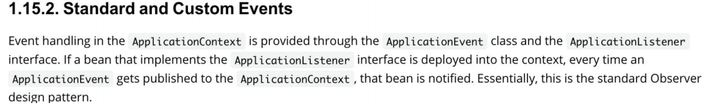

这块的介绍在官网 1.15.2. Standard and Custom Events[1] 部分有介绍。

> " Spring 通过 ApplicationEvent 类和 ApplicationListener 接口提供 ApplicationContext 中的事件处理。如果将实现 ApplicationListener 接口的 bean 部署到上下文中，则每次将 ApplicationEvent 发布到 ApplicationContext 时，都会通知该 bean。本质上，这是标准的观察者设计模式。

归纳下来主要就是三个部分: 事件、事件发布者、事件监听器。

**1.1、Spring中的事件(ApplicationEvent)**

spring中的事件有一个抽象父类ApplicationEvent，该类包含有当前ApplicationContext的引用，这样就可以确认每个事件是从哪一个Spring容器中发生的。

**1.2、Spring中的事件监听器(ApplicationListener)**

spring中的事件监听器同样有一个顶级接口ApplicationListener,只有一个onApplicationEvent(E event)方法，当该监听器所监听的事件发生时，就会执行该方法

**1.3、Spring中的事件发布者(ApplicationEventPublisher)**

spring中的事件发布者同样有一个顶级接口ApplicationEventPublisher，只有一个方法publishEvent(Object event)方法，调用该方法就可以发生spring中的事件

**1.4、Spring中的事件广播器（ApplicationEventMulticaster）**

spring中的事件核心控制器叫做事件广播器,接口为ApplicationEventMulticaster，广播器的作用主要有两个：

作用一：将事件监听器注册到广播器中，这样广播器就知道了每个事件监听器分别监听什么事件，且知道了每个事件对应哪些事件监听器在监听

作用二：将事件广播给事件监听器，当有事件发生时，需要通过广播器来广播给所有的事件监听器，因为生产者只需要关心事件的生产，而不需要关心该事件都被哪些监听器消费。

 

**使用监听器**

简单来说主要分为以下几个部分：

1. 注册事件
2. 注册监听器
3. 发布事件

在接口调用发布事件时，监听器就会做出相应的操作。

 

#### 源码剖析

```java
protected void initApplicationEventMulticaster() {
        ConfigurableListableBeanFactory beanFactory = getBeanFactory();
        //如果用户配置了自定义事件广播器，就使用用户的（名称必须是 "applicationEventMulticaster"）
        if (beanFactory.containsLocalBean(APPLICATION_EVENT_MULTICASTER_BEAN_NAME)) {
            this.applicationEventMulticaster =
                    beanFactory.getBean(APPLICATION_EVENT_MULTICASTER_BEAN_NAME, ApplicationEventMulticaster.class);
            if (logger.isTraceEnabled()) {
                logger.trace("Using ApplicationEventMulticaster [" + this.applicationEventMulticaster + "]");
            }
        }
        else {
            //否则注册一个系统默认的 SimpleApplicationEventMulticaster
            this.applicationEventMulticaster = new SimpleApplicationEventMulticaster(beanFactory);
            beanFactory.registerSingleton(APPLICATION_EVENT_MULTICASTER_BEAN_NAME, this.applicationEventMulticaster);
            if (logger.isTraceEnabled()) {
                logger.trace("No '" + APPLICATION_EVENT_MULTICASTER_BEAN_NAME + "' bean, using " +
                        "[" + this.applicationEventMulticaster.getClass().getSimpleName() + "]");
            }
        }
    }
```

 

#### 方法总结

- 如果用户配置了自定义事件广播器，就使用用户的（名称必须是 "applicationEventMulticaster"）
- 否则注册一个系统默认的 SimpleApplicationEventMulticaster

 

### 【9.刷新:拓展方法】onRefresh()；

#### 方法描述

空方法，模板设计模式;子类重写该方法并在容器刷新的时候自定义逻辑；

例：springBoot在onRefresh() 完成内置Tomcat的创建及启动

 

#### 源码剖析

```java
    protected void onRefresh() throws BeansException {
        // For subclasses: do nothing by default.
    }
```

 

### 【10.注册监听器】registerListeners();

#### 方法描述

- 通过addApplicationListener(listen)注册监听器
- 自定义实现ApplicationListen接口的bd
- 发布早期的监听器

 

#### 源码剖析

```java
    protected void registerListeners() {
        // Register statically specified listeners first.
        // 查出所有通过addApplicationListener方法添加的ApplicationListener（静态指定的），然后注册到事件广播器上
        for (ApplicationListener<?> listener : getApplicationListeners()) {
            getApplicationEventMulticaster().addApplicationListener(listener);
        }

        // Do not initialize FactoryBeans here: We need to leave all regular beans
        // uninitialized to let post-processors apply to them!
        // 查出ioc容器中的所有ApplicationListener，只把他们注册到事件分发器的ApplicationListenerBean上，
        // 待使用时再进行实例化
        String[] listenerBeanNames = getBeanNamesForType(ApplicationListener.class, true, false);
        for (String listenerBeanName : listenerBeanNames) {
            getApplicationEventMulticaster().addApplicationListenerBean(listenerBeanName);
        }

        // Publish early application events now that we finally have a multicaster...
        // 这一步需要注意：如果存在早期应用事件，这里就直接发布了(同时就把 earlyApplicationEvents 字段置为 null)
        Set<ApplicationEvent> earlyEventsToProcess = this.earlyApplicationEvents;
        this.earlyApplicationEvents = null;
        if (!CollectionUtils.isEmpty(earlyEventsToProcess)) {
            for (ApplicationEvent earlyEvent : earlyEventsToProcess) {
                getApplicationEventMulticaster().multicastEvent(earlyEvent);
            }
        }
    }
```

 

例子：

**通过addApplicationListener(listen)注册监听器**

其中`listen`为实现**ApplicationListen**接口的bd，且该bd不需要注册进容器

```java
AnnotationConfigApplicationContext context =
                new AnnotationConfigApplicationContext(Test.class);
// 注册监听器
context.addApplicationListener(listen);
// 注册配置类
context.register(Test.class);
// 刷新上下文
context.refresh();
```

 

#### 方法总结

注册监听器分为两部分:

1. 向事件分发器注册硬编码设置的applicationListener
2. 向事件分发器注册一个IOC中的事件监听器（并不实例化）

注意：只是将一些特殊的监听器注册到广播组中,那些在bean配置文件中实现了ApplicationListener接口的类还没有实例化,所以此时只是将name保存到了广播组中,将这些监听器注册到广播组中的操作时在bean的后置处理器中完成的,那时候bean的实例化已经完成了

 

### 【11.实例化所有（非惰性初始化）单例Bean】 finishBeanFactoryInitialization(beanFactory);

#### 方法概述

finishBeanFactoryInitialization 是整个 Spring IoC 核心中的核心。

该方法会实例化所有剩余的非懒加载单例 bean。

除了一些内部的 bean、实现了 BeanFactoryPostProcessor 接口的 bean、实现了 BeanPostProcessor 接口的 bean，其他的非懒加载单例 bean 都会在这个方法中被实例化，并且 BeanPostProcessor 的触发也是在这个方法中。

 

#### 源码剖析_finishBeanFactoryInitialization

```java
protected void finishBeanFactoryInitialization(ConfigurableListableBeanFactory beanFactory) {
    // Initialize conversion service for this context.
    // 1、设置此上下文的类型转换器，不是核心，往下
    if (beanFactory.containsBean(CONVERSION_SERVICE_BEAN_NAME) &&
            beanFactory.isTypeMatch(CONVERSION_SERVICE_BEAN_NAME, ConversionService.class)) {
        beanFactory.setConversionService(
                beanFactory.getBean(CONVERSION_SERVICE_BEAN_NAME, ConversionService.class));
    }
 
    // Register a default embedded value resolver if no bean post-processor
    // (such as a PropertyPlaceholderConfigurer bean) registered any before:
    // at this point, primarily for resolution in annotation attribute values.
    // 2.如果beanFactory之前没有注册嵌入值解析器，则注册默认的嵌入值解析器：主要用于注解属性值的解析
    // 不是核心，继续往下
    if (!beanFactory.hasEmbeddedValueResolver()) {
        beanFactory.addEmbeddedValueResolver(new StringValueResolver() {
            @Override
            public String resolveStringValue(String strVal) {
                return getEnvironment().resolvePlaceholders(strVal);
            }
        });
    }
 
    // Initialize LoadTimeWeaverAware beans early to allow for registering their transformers early.
    // 3.初始化LoadTimeWeaverAware Bean实例对象
    // 处理 @EnableLoadTimeWeaving 或  <context:load-time-weaver/> 标记的类 不是核心，继续往下
    String[] weaverAwareNames = beanFactory.getBeanNamesForType(LoadTimeWeaverAware.class, false, false);
    for (String weaverAwareName : weaverAwareNames) {
        getBean(weaverAwareName);
    }
 
    // Stop using the temporary ClassLoader for type matching.
    //临时类加载器设置为空
    beanFactory.setTempClassLoader(null);
 
    // Allow for caching all bean definition metadata, not expecting further changes.
    // 4.冻结所有bean定义，注册的bean定义不会被修改或进一步后处理，因为马上要创建 Bean 实例对象了
    // 【冻结配置】：设置冻结属性变量为true
    beanFactory.freezeConfiguration();
 
    // Instantiate all remaining (non-lazy-init) singletons.
    // 5.实例化所有剩余（非懒加载）单例对象
    beanFactory.preInstantiateSingletons();
}
```

5.实例化所有剩余（非懒加载）单例对象，**见代码块1详解**。

 

**MergedBeanDefinition： “合并的 bean 定义”：**

之所以称之为 “合并的”，是因为存在 “子定义” 和 “父定义” 的情况。对于一个 bean 定义来说，可能存在以下几种情况：

1. 该 BeanDefinition 存在 “父定义”：首先使用 “父定义” 的参数构建一个 RootBeanDefinition，然后再使用该 BeanDefinition 的参数来进行覆盖。
2. 该 BeanDefinition 不存在 “父定义”，并且该 BeanDefinition 的类型是 RootBeanDefinition：直接返回该 RootBeanDefinition 的一个克隆。
3. 该 BeanDefinition 不存在 “父定义”，但是该 BeanDefinition 的类型不是 RootBeanDefinition：使用该 BeanDefinition 的参数构建一个 RootBeanDefinition。

之所以区分出2和3，是因为通常 BeanDefinition 在之前加载到 BeanFactory 中的时候，通常是被封装成 GenericBeanDefinition 或 ScannedGenericBeanDefinition，但是从这边之后 bean 的后续流程处理都是针对 RootBeanDefinition，因此在这边会统一将 BeanDefinition 转换成 RootBeanDefinition。

在我们日常使用的过程中，通常会是上面的第3种情况 如果我们使用 XML 配置来注册 bean，则该 bean 定义会被封装成：GenericBeanDefinition；如果我们使用注解的方式来注册 bean，也就是<context:component-scan /> + @Compoment，则该 bean 定义会被封装成 ScannedGenericBeanDefinition。

##### 代码块1：preInstantiateSingletons

```java
@Override
public void preInstantiateSingletons() throws BeansException {
    if (this.logger.isDebugEnabled()) {
        this.logger.debug("Pre-instantiating singletons in " + this);
    }
 
    // Iterate over a copy to allow for init methods which in turn register new bean definitions.
    // While this may not be part of the regular factory bootstrap, it does otherwise work fine.
    // 1.创建beanDefinitionNames的副本beanNames用于后续的遍历，以允许init等方法注册新的bean定义
    List<String> beanNames = new ArrayList<String>(this.beanDefinitionNames);
 
    // Trigger initialization of all non-lazy singleton beans...
    // 2.遍历beanNames，触发所有非懒加载单例bean的初始化
    for (String beanName : beanNames) {
        // 3.获取beanName对应的MergedBeanDefinition
        RootBeanDefinition bd = getMergedLocalBeanDefinition(beanName);
        // 4.bd对应的Bean实例：不是抽象类 && 是单例 && 不是懒加载
        if (!bd.isAbstract() && bd.isSingleton() && !bd.isLazyInit()) {
            // 5.判断beanName对应的bean是否为FactoryBean
            if (isFactoryBean(beanName)) {
                // 5.1 通过beanName获取FactoryBean实例
                // 通过getBean(&beanName)拿到的是FactoryBean本身；通过getBean(beanName)拿到的是FactoryBean创建的Bean实例
                final FactoryBean<?> factory = (FactoryBean<?>) getBean(FACTORY_BEAN_PREFIX + beanName);
                // 5.2 判断这个FactoryBean是否希望急切的初始化
                boolean isEagerInit;
                if (System.getSecurityManager() != null && factory instanceof SmartFactoryBean) {
                    isEagerInit = AccessController.doPrivileged(new PrivilegedAction<Boolean>() {
                        @Override
                        public Boolean run() {
                            return ((SmartFactoryBean<?>) factory).isEagerInit();
                        }
                    }, getAccessControlContext());
                } else {
                    isEagerInit = (factory instanceof SmartFactoryBean &&
                            ((SmartFactoryBean<?>) factory).isEagerInit());
                }
                if (isEagerInit) {
                    // 5.3 如果希望急切的初始化，则通过beanName获取bean实例
                    getBean(beanName);
                }
            } else {
                // 6.如果beanName对应的bean不是FactoryBean，只是普通Bean，通过beanName获取bean实例
                getBean(beanName);
            }
        }
    }
 
    // Trigger post-initialization callback for all applicable beans...
    // 7.遍历beanNames，触发所有SmartInitializingSingleton的后初始化回调
    for (String beanName : beanNames) {
        // 7.1 拿到beanName对应的bean实例
        Object singletonInstance = getSingleton(beanName);
        // 7.2 判断singletonInstance是否实现了SmartInitializingSingleton接口
        if (singletonInstance instanceof SmartInitializingSingleton) {
            final SmartInitializingSingleton smartSingleton = (SmartInitializingSingleton) singletonInstance;
            // 7.3 触发SmartInitializingSingleton实现类的afterSingletonsInstantiated方法
            if (System.getSecurityManager() != null) {
                AccessController.doPrivileged(new PrivilegedAction<Object>() {
                    @Override
                    public Object run() {
                        smartSingleton.afterSingletonsInstantiated();
                        return null;
                    }
                }, getAccessControlContext());
            } else {
                smartSingleton.afterSingletonsInstantiated();
            }
        }
    }
}
```

 

- 3.获取 beanName 对应的 MergedBeanDefinition，**见代码块2详解**。
- 5.判断 beanName 对应的 bean 是否为 FactoryBean，**见代码块3详解**。
- 5.3 和 6. 通过 beanName 获取 bean 实例，finishBeanFactoryInitialization 方法的核心，单独分析！！。
- 7.遍历 beanNames，触发所有 SmartInitializingSingleton 的后初始化回调，这是 Spring 提供的一个扩展点，在所有非懒加载单例实例化结束后调用。

##### 代码块2：getMergedLocalBeanDefinition

```java
protected RootBeanDefinition getMergedLocalBeanDefinition(String beanName) throws BeansException {
    // Quick check on the concurrent map first, with minimal locking.
    // 1.检查beanName对应的MergedBeanDefinition是否存在于缓存中
    RootBeanDefinition mbd = this.mergedBeanDefinitions.get(beanName);
    if (mbd != null) {
        // 2.如果存在于缓存中则直接返回
        return mbd;
    }
    // 3.如果不存在于缓存中
    // 3.1 getBeanDefinition(beanName)： 获取beanName对应的BeanDefinition，从beanDefinitionMap缓存中获取
    // 3.2 getMergedBeanDefinition: 根据beanName和对应的BeanDefinition，获取MergedBeanDefinition
    return getMergedBeanDefinition(beanName, getBeanDefinition(beanName));
}
```

 

 

##### 代码块3：isFactoryBean

```java
@Override
public boolean isFactoryBean(String name) throws NoSuchBeanDefinitionException {
    // 1.拿到真正的beanName（去掉&前缀、解析别名）
    String beanName = transformedBeanName(name);
 
    // 2.尝试从缓存获取Bean实例对象
    Object beanInstance = getSingleton(beanName, false);
    if (beanInstance != null) {
        // 3.beanInstance存在，则直接判断类型是否为FactoryBean
        return (beanInstance instanceof FactoryBean);
    } else if (containsSingleton(beanName)) {
        // 4.如果beanInstance为null，并且beanName在单例对象缓存中，则代表beanName对应的单例对象为空对象，返回false
        // null instance registered
        return false;
    }
 
    // No singleton instance found -> check bean definition.
    if (!containsBeanDefinition(beanName) && getParentBeanFactory() instanceof ConfigurableBeanFactory) {
        // 5.如果缓存中不存在此beanName && 父beanFactory是ConfigurableBeanFactory，则调用父BeanFactory判断是否为FactoryBean
        // No bean definition found in this factory -> delegate to parent.
        return ((ConfigurableBeanFactory) getParentBeanFactory()).isFactoryBean(name);
    }
    // 6.通过MergedBeanDefinition来检查beanName对应的Bean是否为FactoryBean
    return isFactoryBean(beanName, getMergedLocalBeanDefinition(beanName));
}
```

2.尝试从缓存获取 bean 实例对象，**见代码块4详解**

 

##### 代码块4：getSingleton

```java
protected Object getSingleton(String beanName, boolean allowEarlyReference) {
    // 1.从单例对象缓存中获取beanName对应的单例对象
    Object singletonObject = this.singletonObjects.get(beanName);
    // 2.如果单例对象缓存中没有，并且该beanName对应的单例bean正在创建中
    if (singletonObject == null && isSingletonCurrentlyInCreation(beanName)) {
        // 3.加锁进行操作
        synchronized (this.singletonObjects) {
            // 4.从早期单例对象缓存中获取单例对象（之所称成为早期单例对象，是因为earlySingletonObjects里
            // 的对象的都是通过提前曝光的ObjectFactory创建出来的，还未进行属性填充等操作）
            singletonObject = this.earlySingletonObjects.get(beanName);
            // 5.如果在早期单例对象缓存中也没有，并且允许创建早期单例对象引用
            if (singletonObject == null && allowEarlyReference) {
                // 6.从单例工厂缓存中获取beanName的单例工厂
                ObjectFactory<?> singletonFactory = this.singletonFactories.get(beanName);
                if (singletonFactory != null) {
                    // 7.如果存在单例对象工厂，则通过工厂创建一个单例对象
                    singletonObject = singletonFactory.getObject();
                    // 8.将通过单例对象工厂创建的单例对象，放到早期单例对象缓存中
                    this.earlySingletonObjects.put(beanName, singletonObject);
                    // 9.移除该beanName对应的单例对象工厂，因为该单例工厂已经创建了一个实例对象，并且放到earlySingletonObjects缓存了，
                    // 因此，后续获取beanName的单例对象，可以通过earlySingletonObjects缓存拿到，不需要在用到该单例工厂
                    this.singletonFactories.remove(beanName);
                }
            }
        }
    }
    // 10.返回单例对象
    return (singletonObject != NULL_OBJECT ? singletonObject : null);
}
 
public boolean isSingletonCurrentlyInCreation(String beanName) {
    return this.singletonsCurrentlyInCreation.contains(beanName);
}
```

 

这段代码很重要，在正常情况下，该代码很普通，只是正常的检查下我们要拿的 bean 实例是否存在于缓存中，如果有就返回缓存中的 bean 实例，否则就返回 null。

这段代码之所以重要，是因为该段代码是 Spring 解决循环引用的核心代码。

解决循环引用逻辑：使用构造函数创建一个 “不完整” 的 bean 实例（之所以说不完整，是因为此时该 bean 实例还未初始化），并且提前曝光该 bean 实例的 ObjectFactory（提前曝光就是将 ObjectFactory 放到 singletonFactories 缓存），通过 ObjectFactory 我们可以拿到该 bean 实例的引用，如果出现循环引用，我们可以通过缓存中的 ObjectFactory 来拿到 bean 实例，从而避免出现循环引用导致的死循环。这边通过缓存中的 ObjectFactory 拿到的 bean 实例虽然拿到的是 “不完整” 的 bean 实例，但是由于是单例，所以后续初始化完成后，该 bean 实例的引用地址并不会变，所以最终我们看到的还是完整 bean 实例。

另外这个代码块中引进了4个重要缓存：

- singletonObjects 缓存：beanName -> 单例 bean 对象。
- earlySingletonObjects 缓存：beanName -> 单例 bean 对象，该缓存存放的是早期单例 bean 对象，可以理解成还未进行属性填充、初始化。
- singletonFactories 缓存：beanName -> ObjectFactory。

【singletonObjects、earlySingletonObjects、singletonFactories 在这边构成了一个类似于 “一、二、三级缓存” 的概念。】

- singletonsCurrentlyInCreation 缓存：当前正在创建单例 bean 对象的 beanName 集合。

 

#### 源码剖析_getBean

```java
@Override
public Object getBean(String name) throws BeansException {
    // 获取name对应的bean实例，如果不存在，则创建一个
    return doGetBean(name, null, null, false);
}
```

见 doGetBean 方法详解。

 

##### doGetBean

```java
protected <T> T doGetBean(
        final String name, final Class<T> requiredType, final Object[] args, boolean typeCheckOnly)
        throws BeansException {
    // 1.解析beanName，主要是解析别名、去掉FactoryBean的前缀“&”
    final String beanName = transformedBeanName(name);
    Object bean;
 
    // Eagerly check singleton cache for manually registered singletons.
    // 2.尝试从缓存中获取beanName对应的实例
    Object sharedInstance = getSingleton(beanName);
    if (sharedInstance != null && args == null) {
        // 3.如果beanName的实例存在于缓存中
        if (logger.isDebugEnabled()) {
            if (isSingletonCurrentlyInCreation(beanName)) {
                logger.debug("Returning eagerly cached instance of singleton bean '" + beanName +
                        "' that is not fully initialized yet - a consequence of a circular reference");
            } else {
                logger.debug("Returning cached instance of singleton bean '" + beanName + "'");
            }
        }
        // 3.1 返回beanName对应的实例对象（主要用于FactoryBean的特殊处理，普通Bean会直接返回sharedInstance本身）
        bean = getObjectForBeanInstance(sharedInstance, name, beanName, null);
    } else {
        // Fail if we're already creating this bean instance:
        // We're assumably within a circular reference.
        // 4.scope为prototype的循环依赖校验：如果beanName已经正在创建Bean实例中，而此时我们又要再一次创建beanName的实例，则代表出现了循环依赖，需要抛出异常。
        // 例子：如果存在A中有B的属性，B中有A的属性，那么当依赖注入的时候，就会产生当A还未创建完的时候因为对于B的创建再次返回创建A，造成循环依赖
        if (isPrototypeCurrentlyInCreation(beanName)) {
            throw new BeanCurrentlyInCreationException(beanName);
        }
 
        // Check if bean definition exists in this factory.
        // 5.获取parentBeanFactory
        BeanFactory parentBeanFactory = getParentBeanFactory();
        // 5.1 如果parentBeanFactory存在，并且beanName在当前BeanFactory不存在Bean定义，则尝试从parentBeanFactory中获取bean实例
        if (parentBeanFactory != null && !containsBeanDefinition(beanName)) {
            // Not found -> check parent.
            // 5.2 将别名解析成真正的beanName
            String nameToLookup = originalBeanName(name);
            // 5.3 尝试在parentBeanFactory中获取bean对象实例
            if (args != null) {
                // Delegation to parent with explicit args.
                return (T) parentBeanFactory.getBean(nameToLookup, args);
            } else {
                // No args -> delegate to standard getBean method.
                return parentBeanFactory.getBean(nameToLookup, requiredType);
            }
        }
 
        if (!typeCheckOnly) {
            // 6.如果不是仅仅做类型检测，而是创建bean实例，这里要将beanName放到alreadyCreated缓存
            markBeanAsCreated(beanName);
        }
 
        try {
            // 7.根据beanName重新获取MergedBeanDefinition（步骤6将MergedBeanDefinition删除了，这边获取一个新的）
            final RootBeanDefinition mbd = getMergedLocalBeanDefinition(beanName);
            // 7.1 检查MergedBeanDefinition
            checkMergedBeanDefinition(mbd, beanName, args);
 
            // Guarantee initialization of beans that the current bean depends on.
            // 8.拿到当前bean依赖的bean名称集合，在实例化自己之前，需要先实例化自己依赖的bean
            String[] dependsOn = mbd.getDependsOn();
            if (dependsOn != null) {
                // 8.1 遍历当前bean依赖的bean名称集合
                for (String dep : dependsOn) {
                    // 8.2 检查dep是否依赖于beanName，即检查是否存在循环依赖
                    if (isDependent(beanName, dep)) {
                        // 8.3 如果是循环依赖则抛异常
                        throw new BeanCreationException(mbd.getResourceDescription(), beanName,
                                "Circular depends-on relationship between '" + beanName + "' and '" + dep + "'");
                    }
                    // 8.4 将dep和beanName的依赖关系注册到缓存中
                    registerDependentBean(dep, beanName);
                    // 8.5 获取dep对应的bean实例，如果dep还没有创建bean实例，则创建dep的bean实例
                    getBean(dep);
                }
            }
 
            // Create bean instance.
            // 9.针对不同的scope进行bean的创建
            if (mbd.isSingleton()) {
                // 9.1 scope为singleton的bean创建（新建了一个ObjectFactory，并且重写了getObject方法）
                sharedInstance = getSingleton(beanName, new ObjectFactory<Object>() {
                    @Override
                    public Object getObject() throws BeansException {    //
                        try {
                            // 9.1.1 创建Bean实例
                            return createBean(beanName, mbd, args);
                        } catch (BeansException ex) {
                            // Explicitly remove instance from singleton cache: It might have been put there
                            // eagerly by the creation process, to allow for circular reference resolution.
                            // Also remove any beans that received a temporary reference to the bean.
                            destroySingleton(beanName);
                            throw ex;
                        }
                    }
                });
                // 9.1.2 返回beanName对应的实例对象
                bean = getObjectForBeanInstance(sharedInstance, name, beanName, mbd);
            } else if (mbd.isPrototype()) {
                // 9.2 scope为prototype的bean创建
                // It's a prototype -> create a new instance.
                Object prototypeInstance = null;
                try {
                    // 9.2.1 创建实例前的操作（将beanName保存到prototypesCurrentlyInCreation缓存中）
                    beforePrototypeCreation(beanName);
                    // 9.2.2 创建Bean实例
                    prototypeInstance = createBean(beanName, mbd, args);
                } finally {
                    // 9.2.3 创建实例后的操作（将创建完的beanName从prototypesCurrentlyInCreation缓存中移除）
                    afterPrototypeCreation(beanName);
                }
                // 9.2.4 返回beanName对应的实例对象
                bean = getObjectForBeanInstance(prototypeInstance, name, beanName, mbd);
            } else {
                // 9.3 其他scope的bean创建，可能是request之类的
                // 9.3.1 根据scopeName，从缓存拿到scope实例
                String scopeName = mbd.getScope();
                final Scope scope = this.scopes.get(scopeName);
                if (scope == null) {
                    throw new IllegalStateException("No Scope registered for scope name '" + scopeName + "'");
                }
                try {
                    // 9.3.2 其他scope的bean创建（新建了一个ObjectFactory，并且重写了getObject方法）
                    Object scopedInstance = scope.get(beanName, new ObjectFactory<Object>() {
                        @Override
                        public Object getObject() throws BeansException {
                            // 9.3.3 创建实例前的操作（将beanName保存到prototypesCurrentlyInCreation缓存中）
                            beforePrototypeCreation(beanName);
                            try {
                                // 9.3.4 创建bean实例
                                return createBean(beanName, mbd, args);
                            } finally {
                                // 9.3.5 创建实例后的操作（将创建完的beanName从prototypesCurrentlyInCreation缓存中移除）
                                afterPrototypeCreation(beanName);
                            }
                        }
                    });
                    // 9.3.6 返回beanName对应的实例对象
                    bean = getObjectForBeanInstance(scopedInstance, name, beanName, mbd);
                } catch (IllegalStateException ex) {
                    throw new BeanCreationException(beanName,
                            "Scope '" + scopeName + "' is not active for the current thread; consider " +
                                    "defining a scoped proxy for this bean if you intend to refer to it from a singleton",
                            ex);
                }
            }
        } catch (BeansException ex) {
            // 如果创建bean实例过程中出现异常，则将beanName从alreadyCreated缓存中移除
            cleanupAfterBeanCreationFailure(beanName);
            throw ex;
        }
    }
 
    // Check if required type matches the type of the actual bean instance.
    // 10.检查所需类型是否与实际的bean对象的类型匹配
    if (requiredType != null && bean != null && !requiredType.isInstance(bean)) {
        try {
            // 10.1 类型不对，则尝试转换bean类型
            return getTypeConverter().convertIfNecessary(bean, requiredType);
        } catch (TypeMismatchException ex) {
            if (logger.isDebugEnabled()) {
                logger.debug("Failed to convert bean '" + name + "' to required type '" +
                        ClassUtils.getQualifiedName(requiredType) + "'", ex);
            }
            throw new BeanNotOfRequiredTypeException(name, requiredType, bean.getClass());
        }
    }
    // 11.返回创建出来的bean实例对象
    return (T) bean;
}
```

- 1. 尝试从缓存中获取 beanName 对应的实例，**见代码块1详解**
- 3.1 返回 beanName 对应的实例对象（主要用于 FactoryBean 的特殊处理，普通 bean 会直接返回 sharedInstance 本身），**见代码块2详解。**
- 9.1 scope 为 singleton 的 bean 创建（新建了一个 ObjectFactory，并且重写了 getObject 方法），**见代码块6详解**。
- 9.1.1、9.2.2、9.3.4 创建 bean 实例，**单独解析！！**。
- 9.1.2、9.2.4、9.3.6 返回 beanName 对应的实例对象，**见代码块7详解。**
- 9.2.1 scope 为 prototype 时创建实例前的操作、9.2.3 scope 为 prototype 时 创建实例后的操作，相对应的两个方法，**见代码块5详解。**

 

##### 代码块1：getSingleton

```java
protected Object getSingleton(String beanName, boolean allowEarlyReference) {
    // 1.从单例对象缓存中获取beanName对应的单例对象
    Object singletonObject = this.singletonObjects.get(beanName);
    // 2.如果单例对象缓存中没有，并且该beanName对应的单例bean正在创建中
    if (singletonObject == null && isSingletonCurrentlyInCreation(beanName)) {
        // 3.加锁进行操作
        synchronized (this.singletonObjects) {
            // 4.从早期单例对象缓存中获取单例对象（之所称成为早期单例对象，是因为earlySingletonObjects里
            // 的对象的都是通过提前曝光的ObjectFactory创建出来的，还未进行属性填充等操作）
            singletonObject = this.earlySingletonObjects.get(beanName);
            // 5.如果在早期单例对象缓存中也没有，并且允许创建早期单例对象引用
            if (singletonObject == null && allowEarlyReference) {
                // 6.从单例工厂缓存中获取beanName的单例工厂
                ObjectFactory<?> singletonFactory = this.singletonFactories.get(beanName);
                if (singletonFactory != null) {
                    // 7.如果存在单例对象工厂，则通过工厂创建一个单例对象
                    singletonObject = singletonFactory.getObject();
                    // 8.将通过单例对象工厂创建的单例对象，放到早期单例对象缓存中
                    this.earlySingletonObjects.put(beanName, singletonObject);
                    // 9.移除该beanName对应的单例对象工厂，因为该单例工厂已经创建了一个实例对象，并且放到earlySingletonObjects缓存了，
                    // 因此，后续获取beanName的单例对象，可以通过earlySingletonObjects缓存拿到，不需要在用到该单例工厂
                    this.singletonFactories.remove(beanName);
                }
            }
        }
    }
    // 10.返回单例对象
    return (singletonObject != NULL_OBJECT ? singletonObject : null);
}
 
public boolean isSingletonCurrentlyInCreation(String beanName) {
    return this.singletonsCurrentlyInCreation.contains(beanName);
}
```

 

这段代码很重要，在正常情况下，该代码很普通，只是正常的检查下我们要拿的 bean 实例是否存在于缓存中，如果有就返回缓存中的 bean 实例，否则就返回 null。

这段代码之所以重要，是因为该段代码是 Spring 解决循环引用的核心代码。

解决循环引用逻辑：使用构造函数创建一个 “不完整” 的 bean 实例（之所以说不完整，是因为此时该 bean 实例还未初始化），并且提前曝光该 bean 实例的 ObjectFactory（提前曝光就是将 ObjectFactory 放到 singletonFactories 缓存），通过 ObjectFactory 我们可以拿到该 bean 实例的引用，如果出现循环引用，我们可以通过缓存中的 ObjectFactory 来拿到 bean 实例，从而避免出现循环引用导致的死循环。这边通过缓存中的 ObjectFactory 拿到的 bean 实例虽然拿到的是 “不完整” 的 bean 实例，但是由于是单例，所以后续初始化完成后，该 bean 实例的引用地址并不会变，所以最终我们看到的还是完整 bean 实例。

 

另外这个代码块中引进了4个重要缓存：

- singletonObjects 缓存：beanName -> 单例 bean 对象。
- earlySingletonObjects 缓存：beanName -> 单例 bean 对象，该缓存存放的是早期单例 bean 对象，可以理解成还未进行属性填充、初始化。
- singletonFactories 缓存：beanName -> ObjectFactory。

【singletonObjects、earlySingletonObjects、singletonFactories 在这边构成了一个类似于 “一、二、三级缓存” 的概念。】

- singletonsCurrentlyInCreation 缓存：当前正在创建单例 bean 对象的 beanName 集合。

 

##### 代码块2：getObjectForBeanInstance

```java
    protected Object getObjectForBeanInstance(
            Object beanInstance, String name, String beanName, @Nullable RootBeanDefinition mbd) {

        // Don't let calling code try to dereference the factory if the bean isn't a factory.


        // 1 如果name以“&”为前缀（以“&”为前缀代表想获取的是FactoryBean本身）
        if (BeanFactoryUtils.isFactoryDereference(name)) {

            if (beanInstance instanceof NullBean) {
                return beanInstance;
            }

            // 1.1.如果name以“&”为前缀，但是beanInstance不是FactoryBean，则抛异常
            if (!(beanInstance instanceof FactoryBean)) {
                throw new BeanIsNotAFactoryException(beanName, beanInstance.getClass());
            }
            if (mbd != null) {
                mbd.isFactoryBean = true;
            }
            // 1.2 如果beanInstance是FactoryBean，并且name以“&”为前缀，则直接返回beanInstance（以“&”为前缀代表想获取的是FactoryBean本身）
            return beanInstance;
        }

        // Now we have the bean instance, which may be a normal bean or a FactoryBean.
        // If it's a FactoryBean, we use it to create a bean instance, unless the
        // caller actually wants a reference to the factory.
        if (!(beanInstance instanceof FactoryBean)) {
            return beanInstance;
        }

        Object object = null;
        if (mbd != null) {
            mbd.isFactoryBean = true;
        }
        else {
            // 2.如果mbd为空，则尝试从factoryBeanObjectCache缓存中获取该FactoryBean创建的对象实例
            object = getCachedObjectForFactoryBean(beanName);
        }
        if (object == null) {
            // Return bean instance from factory.
            // 3.只有beanInstance是FactoryBean才能走到这边，因此直接强转
            FactoryBean<?> factory = (FactoryBean<?>) beanInstance;
            // Caches object obtained from FactoryBean if it is a singleton.
            if (mbd == null && containsBeanDefinition(beanName)) {
                // 4.mbd为空，但是该bean的BeanDefinition在缓存中存在，则获取该bean的MergedBeanDefinition
                mbd = getMergedLocalBeanDefinition(beanName);
            }
            // 5.mbd是否是合成的（这个字段比较复杂，mbd正常情况都不是合成的，也就是false)
            boolean synthetic = (mbd != null && mbd.isSynthetic());
            // 6.从FactoryBean获取对象实例
            object = getObjectFromFactoryBean(factory, beanName, !synthetic);
        }
        // 7.返回对象实例
        return object;
    }
```

6.从 FactoryBean 获取对象实例，**见代码块2详解**。

 

##### 代码块3：getObjectFromFactoryBean

```java
protected Object getObjectFromFactoryBean(FactoryBean<?> factory, String beanName, boolean shouldPostProcess) {
    // 1.如果是单例，并且已经存在于单例对象缓存中
    if (factory.isSingleton() && containsSingleton(beanName)) {
        synchronized (getSingletonMutex()) {
            // 2.从FactoryBean创建的单例对象的缓存中获取该bean实例
            Object object = this.factoryBeanObjectCache.get(beanName);
            if (object == null) {
                // 3.调用FactoryBean的getObject方法获取对象实例
                object = doGetObjectFromFactoryBean(factory, beanName);
                // Only post-process and store if not put there already during getObject() call above
                // (e.g. because of circular reference processing triggered by custom getBean calls)
                Object alreadyThere = this.factoryBeanObjectCache.get(beanName);
                // 4.如果该beanName已经在缓存中存在，则将object替换成缓存中的
                if (alreadyThere != null) {
                    object = alreadyThere;
                } else {
                    if (object != null && shouldPostProcess) {
                        try {
                            // 5.对bean实例进行后置处理，执行所有已注册的BeanPostProcessor的postProcessAfterInitialization方法
                            object = postProcessObjectFromFactoryBean(object, beanName);
                        } catch (Throwable ex) {
                            throw new BeanCreationException(beanName,
                                    "Post-processing of FactoryBean's singleton object failed", ex);
                        }
                    }
                    // 6.将beanName和object放到factoryBeanObjectCache缓存中
                    this.factoryBeanObjectCache.put(beanName, (object != null ? object : NULL_OBJECT));
                }
            }
            // 7.返回object对象实例
            return (object != NULL_OBJECT ? object : null);
        }
    } else {
        // 8.调用FactoryBean的getObject方法获取对象实例
        Object object = doGetObjectFromFactoryBean(factory, beanName);
        if (object != null && shouldPostProcess) {
            try {
                // 9.对bean实例进行后置处理，执行所有已注册的BeanPostProcessor的postProcessAfterInitialization方法
                object = postProcessObjectFromFactoryBean(object, beanName);
            } catch (Throwable ex) {
                throw new BeanCreationException(beanName, "Post-processing of FactoryBean's object failed", ex);
            }
        }
        // 10.返回object对象实例
        return object;
    }
}
```

3.调用 FactoryBean 的 getObject 方法获取对象实例，**见代码块3详解**。

5.对 bean 实例进行后续处理，执行所有已注册的 BeanPostProcessor 的 postProcessAfterInitialization 方法，**见代码块4详解**。

 

##### 代码块4：doGetObjectFromFactoryBean

```java
private Object doGetObjectFromFactoryBean(final FactoryBean<?> factory, final String beanName)
        throws BeanCreationException {
 
    Object object;
    try {
        // 1.调用FactoryBean的getObject方法获取bean对象实例
        if (System.getSecurityManager() != null) {
            AccessControlContext acc = getAccessControlContext();
            try {
                object = AccessController.doPrivileged(new PrivilegedExceptionAction<Object>() {
                    @Override
                    public Object run() throws Exception {
                        // 1.1 带有权限验证的
                        return factory.getObject();
                    }
                }, acc);
            } catch (PrivilegedActionException pae) {
                throw pae.getException();
            }
        } else {
            // 1.2 不带权限
            object = factory.getObject();
        }
    } catch (FactoryBeanNotInitializedException ex) {
        throw new BeanCurrentlyInCreationException(beanName, ex.toString());
    } catch (Throwable ex) {
        throw new BeanCreationException(beanName, "FactoryBean threw exception on object creation", ex);
    }
 
    // Do not accept a null value for a FactoryBean that's not fully
    // initialized yet: Many FactoryBeans just return null then.
    // 2.getObject返回的是空值，并且该FactoryBean正在初始化中，则直接抛异常，不接受一个尚未完全初始化的FactoryBean的getObject返回的空值
    if (object == null && isSingletonCurrentlyInCreation(beanName)) {
        throw new BeanCurrentlyInCreationException(
                beanName, "FactoryBean which is currently in creation returned null from getObject");
    }
    // 3.返回创建好的bean对象实例
    return object;
}
```

很简单的方法，就是直接调用 FactoryBean 的 getObject 方法来获取到对象实例。

细心的同学可以发现，该方法是以 do 开头，通常以 do 开头的方法是最终进行实际操作的方法

例如本方法就是 FactoryBean 最终实际进行创建 bean 对象实例的方法。

 

##### 代码块5：postProcessObjectFromFactoryBean

```java
@Override
protected Object postProcessObjectFromFactoryBean(Object object, String beanName) {
    return applyBeanPostProcessorsAfterInitialization(object, beanName);
}
 
@Override
public Object applyBeanPostProcessorsAfterInitialization(Object existingBean, String beanName)
        throws BeansException {
 
    Object result = existingBean;
    // 1.遍历所有注册的BeanPostProcessor实现类，调用postProcessAfterInitialization方法
    for (BeanPostProcessor beanProcessor : getBeanPostProcessors()) {
        // 2.在bean初始化后，调用postProcessAfterInitialization方法
        result = beanProcessor.postProcessAfterInitialization(result, beanName);
        if (result == null) {
            // 3.如果返回null，则不会调用后续的BeanPostProcessors
            return result;
        }
    }
    return result;
}
```

在创建完 bean 实例后，会执行 BeanPostProcessor 的 postProcessAfterInitialization 方法。

 

##### 代码块6：getSingleton

```java
public Object getSingleton(String beanName, ObjectFactory<?> singletonFactory) {
    Assert.notNull(beanName, "'beanName' must not be null");
    // 1.加锁，避免重复创建单例对象
    synchronized (this.singletonObjects) {
        // 2.首先检查beanName对应的bean实例是否在缓存中存在，如果已经存在，则直接返回
        Object singletonObject = this.singletonObjects.get(beanName);
        if (singletonObject == null) {
            // 3.beanName对应的bean实例不存在于缓存中，则进行Bean的创建
            if (this.singletonsCurrentlyInDestruction) {
                // 4.当bean工厂的单例处于destruction状态时，不允许进行单例bean创建，抛出异常
                throw new BeanCreationNotAllowedException(beanName,
                        "Singleton bean creation not allowed while singletons of this factory are in destruction " +
                                "(Do not request a bean from a BeanFactory in a destroy method implementation!)");
            }
            if (logger.isDebugEnabled()) {
                logger.debug("Creating shared instance of singleton bean '" + beanName + "'");
            }
            // 5.创建单例前的操作
            beforeSingletonCreation(beanName);
            boolean newSingleton = false;
            // suppressedExceptions用于记录异常相关信息
            boolean recordSuppressedExceptions = (this.suppressedExceptions == null);
            if (recordSuppressedExceptions) {
                this.suppressedExceptions = new LinkedHashSet<Exception>();
            }
            try {
                // 6.执行singletonFactory的getObject方法获取bean实例
                singletonObject = singletonFactory.getObject();
                // 标记为新的单例对象
                newSingleton = true;
            } catch (IllegalStateException ex) {
                // Has the singleton object implicitly appeared in the meantime ->
                // if yes, proceed with it since the exception indicates that state.
                singletonObject = this.singletonObjects.get(beanName);
                if (singletonObject == null) {
                    throw ex;
                }
            } catch (BeanCreationException ex) {
                if (recordSuppressedExceptions) {
                    for (Exception suppressedException : this.suppressedExceptions) {
                        ex.addRelatedCause(suppressedException);
                    }
                }
                throw ex;
            } finally {
                if (recordSuppressedExceptions) {
                    this.suppressedExceptions = null;
                }
                // 7.创建单例后的操作
                afterSingletonCreation(beanName);
            }
            if (newSingleton) {
                // 8.如果是新的单例对象，将beanName和对应的bean实例添加到缓存中（singletonObjects、registeredSingletons）
                addSingleton(beanName, singletonObject);
            }
        }
        // 9.返回创建出来的单例对象
        return (singletonObject != NULL_OBJECT ? singletonObject : null);
    }
}
```

5.创建单例前的操作，7.创建单例后的操作，这两个方法是对应的**，见代码块7详解。**

6.执行 singletonFactory 的 getObject 方法获取 bean 实例，该方法会走 doGetBean 方法的注释 9.1.1。

8.如果是新的单例对象，将 beanName 和对应的单例对象添加到缓存中**，见代码块8详解**

 

##### 代码块7：beforeSingletonCreation、afterSingletonCreation

```java
protected void beforeSingletonCreation(String beanName) {
    // 先校验beanName是否为要在创建检查排除掉的（inCreationCheckExclusions缓存），如果不是，
    // 则将beanName加入到正在创建bean的缓存中（Set），如果beanName已经存在于该缓存，会返回false抛出异常（这种情况出现在构造器的循环依赖）
    if (!this.inCreationCheckExclusions.contains(beanName) && !this.singletonsCurrentlyInCreation.add(beanName)) {
        throw new BeanCurrentlyInCreationException(beanName);
    }
}
 
protected void afterSingletonCreation(String beanName) {
    // 先校验beanName是否为要在创建检查排除掉的（inCreationCheckExclusions缓存），如果不是，
    // 则将beanName从正在创建bean的缓存中（Set）移除，如果beanName不存在于该缓存，会返回false抛出异常
    if (!this.inCreationCheckExclusions.contains(beanName) && !this.singletonsCurrentlyInCreation.remove(beanName)) {
        throw new IllegalStateException("Singleton '" + beanName + "' isn't currently in creation");
    }
}
```

inCreationCheckExclusions 是要在创建检查排除掉的 beanName 集合，正常为空，可以不管。这边主要是引入了 singletonsCurrentlyInCreation 缓存：当前正在创建的 bean 的 beanName 集合。在 beforeSingletonCreation 方法中，通过添加 beanName 到该缓存，可以预防出现构造器循环依赖的情况。

**为什么无法解决构造器循环依赖？**

- 在finishBeanFactoryInitialization详解中的代码块7提过，getSingleton 方法是解决循环引用的核心代码。
- 解决逻辑的第一句话：**“我们先用构造函数创建一个 “不完整” 的 bean 实例”**，从这句话可以看出，构造器循环依赖是无法解决的，因为当构造器出现循环依赖，我们连 “不完整” 的 bean 实例都构建不出来。
- Spring 能解决的循环依赖有：通过 setter 注入的循环依赖、通过属性注入的循环依赖。

 

##### 代码块8：addSingleton

```java
protected void addSingleton(String beanName, Object singletonObject) {
    synchronized (this.singletonObjects) {
        // 1.添加到单例对象缓存
        this.singletonObjects.put(beanName, (singletonObject != null ? singletonObject : NULL_OBJECT));
        // 2.将单例工厂缓存移除（已经不需要）
        this.singletonFactories.remove(beanName);
        // 3.将早期单例对象缓存移除（已经不需要）
        this.earlySingletonObjects.remove(beanName);
        // 4.添加到已经注册的单例对象缓存
        this.registeredSingletons.add(beanName);
    }
}
```

 

#### 源码剖析_createBean

##### 【实例化】createBean

```java
@Override
protected Object createBean(String beanName, RootBeanDefinition mbd, Object[] args) throws BeanCreationException {
    if (logger.isDebugEnabled()) {
        logger.debug("Creating instance of bean '" + beanName + "'");
    }
    RootBeanDefinition mbdToUse = mbd;
 
    // Make sure bean class is actually resolved at this point, and
    // clone the bean definition in case of a dynamically resolved Class
    // which cannot be stored in the shared merged bean definition.
    // 1.解析beanName对应的Bean的类型，例如：com.itheima.open.demo.service.impl.UserServiceImpl
    Class<?> resolvedClass = resolveBeanClass(mbd, beanName);
    if (resolvedClass != null && !mbd.hasBeanClass() && mbd.getBeanClassName() != null) {
        // 如果resolvedClass存在，并且mdb的beanClass类型不是Class，并且mdb的beanClass不为空（则代表beanClass存的是Class的name）,
        // 则使用mdb深拷贝一个新的RootBeanDefinition副本，并且将解析的Class赋值给拷贝的RootBeanDefinition副本的beanClass属性，
        // 该拷贝副本取代mdb用于后续的操作
        mbdToUse = new RootBeanDefinition(mbd);
        mbdToUse.setBeanClass(resolvedClass);
    }
 
    // Prepare method overrides.
    try {
        // 2.验证及准备覆盖的方法（对override属性进行标记及验证）
        mbdToUse.prepareMethodOverrides();
    } catch (BeanDefinitionValidationException ex) {
        throw new BeanDefinitionStoreException(mbdToUse.getResourceDescription(),
                beanName, "Validation of method overrides failed", ex);
    }
 
    try {
        // Give BeanPostProcessors a chance to return a proxy instead of the target bean instance.
        // 3.实例化前的处理，给InstantiationAwareBeanPostProcessor一个机会返回代理对象来替代真正的bean实例，达到“短路”效果
        Object bean = resolveBeforeInstantiation(beanName, mbdToUse);
        // 4.如果bean不为空，则会跳过Spring默认的实例化过程，直接使用返回的bean
        if (bean != null) {
            return bean;
        }
    } catch (Throwable ex) {
        throw new BeanCreationException(mbdToUse.getResourceDescription(), beanName,
                "BeanPostProcessor before instantiation of bean failed", ex);
    }
    // 5.创建Bean实例（真正创建Bean的方法）
    Object beanInstance = doCreateBean(beanName, mbdToUse, args);
    if (logger.isDebugEnabled()) {
        logger.debug("Finished creating instance of bean '" + beanName + "'");
    }
    // 6.返回创建的Bean实例
    return beanInstance;
}
```

5.创建 bean 实例，**见代码块1详解**

 

##### 代码块1：doCreateBean

```java
protected Object doCreateBean(final String beanName, final RootBeanDefinition mbd, final Object[] args)
        throws BeanCreationException {
 
    // Instantiate the bean.
    // 1.新建Bean包装类
    BeanWrapper instanceWrapper = null;
    if (mbd.isSingleton()) {
        // 2.如果是FactoryBean，则需要先移除未完成的FactoryBean实例的缓存
        instanceWrapper = this.factoryBeanInstanceCache.remove(beanName);
    }
    if (instanceWrapper == null) {
        // 3.根据beanName、mbd、args，使用对应的策略创建Bean实例，并返回包装类BeanWrapper
        instanceWrapper = createBeanInstance(beanName, mbd, args);
    }
    // 4.拿到创建好的Bean实例
    final Object bean = (instanceWrapper != null ? instanceWrapper.getWrappedInstance() : null);
    // 5.拿到Bean实例的类型
    Class<?> beanType = (instanceWrapper != null ? instanceWrapper.getWrappedClass() : null);
    mbd.resolvedTargetType = beanType;
 
    // Allow post-processors to modify the merged bean definition.
    synchronized (mbd.postProcessingLock) {
        if (!mbd.postProcessed) {
            try {
                // 6.应用后置处理器MergedBeanDefinitionPostProcessor，允许修改MergedBeanDefinition，
                // Autowired注解正是通过此方法实现注入类型的预解析
                applyMergedBeanDefinitionPostProcessors(mbd, beanType, beanName);
            } catch (Throwable ex) {
                throw new BeanCreationException(mbd.getResourceDescription(), beanName,
                        "Post-processing of merged bean definition failed", ex);
            }
            mbd.postProcessed = true;
        }
    }
 
    // Eagerly cache singletons to be able to resolve circular references
    // even when triggered by lifecycle interfaces like BeanFactoryAware.
    // 7.判断是否需要提早曝光实例：单例 && 允许循环依赖 && 当前bean正在创建中
    boolean earlySingletonExposure = (mbd.isSingleton() && this.allowCircularReferences &&
            isSingletonCurrentlyInCreation(beanName));
    if (earlySingletonExposure) {
        if (logger.isDebugEnabled()) {
            logger.debug("Eagerly caching bean '" + beanName +
                    "' to allow for resolving potential circular references");
        }
 
        // 8.提前曝光beanName的ObjectFactory，用于解决循环引用
        addSingletonFactory(beanName, new ObjectFactory<Object>() {
            @Override
            public Object getObject() throws BeansException {
                // 8.1 应用后置处理器SmartInstantiationAwareBeanPostProcessor，允许返回指定bean的早期引用，若没有则直接返回bean
                return getEarlyBeanReference(beanName, mbd, bean);
            }
        });
    }
 
    // Initialize the bean instance.  初始化bean实例。
    Object exposedObject = bean;
    try {
        // 9.对bean进行属性填充；其中，可能存在依赖于其他bean的属性，则会递归初始化依赖的bean实例
        populateBean(beanName, mbd, instanceWrapper);
        if (exposedObject != null) {
            // 10.对bean进行初始化
            exposedObject = initializeBean(beanName, exposedObject, mbd);
        }
    } catch (Throwable ex) {
        if (ex instanceof BeanCreationException && beanName.equals(((BeanCreationException) ex).getBeanName())) {
            throw (BeanCreationException) ex;
        } else {
            throw new BeanCreationException(
                    mbd.getResourceDescription(), beanName, "Initialization of bean failed", ex);
        }
    }
 
    if (earlySingletonExposure) {
        // 11.如果允许提前曝光实例，则进行循环依赖检查
        Object earlySingletonReference = getSingleton(beanName, false);
        // 11.1 earlySingletonReference只有在当前解析的bean存在循环依赖的情况下才会不为空
        if (earlySingletonReference != null) {
            if (exposedObject == bean) {
                // 11.2 如果exposedObject没有在initializeBean方法中被增强，则不影响之前的循环引用
                exposedObject = earlySingletonReference;
            } else if (!this.allowRawInjectionDespiteWrapping && hasDependentBean(beanName)) {
                // 11.3 如果exposedObject在initializeBean方法中被增强 && 不允许在循环引用的情况下使用注入原始bean实例
                // && 当前bean有被其他bean依赖
 
                // 11.4 拿到依赖当前bean的所有bean的beanName数组
                String[] dependentBeans = getDependentBeans(beanName);
                Set<String> actualDependentBeans = new LinkedHashSet<String>(dependentBeans.length);
                for (String dependentBean : dependentBeans) {
                    // 11.5 尝试移除这些bean的实例，因为这些bean依赖的bean已经被增强了，他们依赖的bean相当于脏数据
                    if (!removeSingletonIfCreatedForTypeCheckOnly(dependentBean)) {
                        // 11.6 移除失败的添加到 actualDependentBeans
                        actualDependentBeans.add(dependentBean);
                    }
                }
 
                if (!actualDependentBeans.isEmpty()) {
                    // 11.7 如果存在移除失败的，则抛出异常，因为存在bean依赖了“脏数据”
                    throw new BeanCurrentlyInCreationException(beanName,
                            "Bean with name '" + beanName + "' has been injected into other beans [" +
                                    StringUtils.collectionToCommaDelimitedString(actualDependentBeans) +
                                    "] in its raw version as part of a circular reference, but has eventually been " +
                                    "wrapped. This means that said other beans do not use the final version of the " +
                                    "bean. This is often the result of over-eager type matching - consider using " +
                                    "'getBeanNamesOfType' with the 'allowEagerInit' flag turned off, for example.");
                }
            }
        }
    }
 
    // Register bean as disposable.
    try {
        // 12.注册用于销毁的bean，执行销毁操作的有三种：自定义destroy方法、DisposableBean接口、DestructionAwareBeanPostProcessor
        registerDisposableBeanIfNecessary(beanName, bean, mbd);
    } catch (BeanDefinitionValidationException ex) {
        throw new BeanCreationException(
                mbd.getResourceDescription(), beanName, "Invalid destruction signature", ex);
    }
    // 13.完成创建并返回
    return exposedObject;
}
```

3.根据 beanName、mbd、args，使用对应的策略创建 bean 实例，并返回包装类 BeanWrapper，**见代码块2详解**。

 

##### 代码块2：createBeanInstance

```java
protected BeanWrapper createBeanInstance(String beanName, RootBeanDefinition mbd, Object[] args) {
    // Make sure bean class is actually resolved at this point.
    // 解析bean的类型信息
    Class<?> beanClass = resolveBeanClass(mbd, beanName);
 
    if (beanClass != null && !Modifier.isPublic(beanClass.getModifiers()) && !mbd.isNonPublicAccessAllowed()) {
        // beanClass不为空 && beanClass不是公开类（不是public修饰） && 该bean不允许访问非公共构造函数和方法，则抛异常
        throw new BeanCreationException(mbd.getResourceDescription(), beanName,
                "Bean class isn't public, and non-public access not allowed: " + beanClass.getName());
    }
 
    // 1.如果存在工厂方法则使用工厂方法实例化bean对象
    if (mbd.getFactoryMethodName() != null) {
        return instantiateUsingFactoryMethod(beanName, mbd, args);
    }
 
    // Shortcut when re-creating the same bean...
    // resolved: 构造函数或工厂方法是否已经解析过
    boolean resolved = false;
    // autowireNecessary: 是否需要自动注入（即是否需要解析构造函数参数）
    boolean autowireNecessary = false;
    if (args == null) {
        // 2.加锁
        synchronized (mbd.constructorArgumentLock) {
            if (mbd.resolvedConstructorOrFactoryMethod != null) {
                // 2.1 如果resolvedConstructorOrFactoryMethod缓存不为空，则将resolved标记为已解析
                resolved = true;
                // 2.2 根据constructorArgumentsResolved判断是否需要自动注入
                autowireNecessary = mbd.constructorArgumentsResolved;
            }
        }
    }
 
    if (resolved) {
        // 3.如果已经解析过，则使用resolvedConstructorOrFactoryMethod缓存里解析好的构造函数方法
        if (autowireNecessary) {
            // 3.1 需要自动注入，则执行构造函数自动注入
            return autowireConstructor(beanName, mbd, null, null);
        } else {
            // 3.2 否则使用默认的构造函数进行bean的实例化
            return instantiateBean(beanName, mbd);
        }
    }
 
    // Need to determine the constructor...
    // 4.应用后置处理器SmartInstantiationAwareBeanPostProcessor，拿到bean的候选构造函数
    Constructor<?>[] ctors = determineConstructorsFromBeanPostProcessors(beanClass, beanName);
    if (ctors != null ||
            mbd.getResolvedAutowireMode() == RootBeanDefinition.AUTOWIRE_CONSTRUCTOR ||
            mbd.hasConstructorArgumentValues() || !ObjectUtils.isEmpty(args)) {
        // 5.如果ctors不为空 || mbd的注入方式为AUTOWIRE_CONSTRUCTOR || mdb定义了构造函数的参数值 || args不为空，则执行构造函数自动注入
        return autowireConstructor(beanName, mbd, ctors, args);
    }
 
    // No special handling: simply use no-arg constructor.
    // 6.没有特殊处理，则使用默认的构造函数进行bean的实例化
    return instantiateBean(beanName, mbd);
}
```

 

##### instantiateBean(beanName, mbd);

```java
protected BeanWrapper instantiateBean(String beanName, RootBeanDefinition mbd) {
        try {
            Object beanInstance;
            if (System.getSecurityManager() != null) {
                //  是不是有java安全管理之类的设置，没有，跳过
                beanInstance = AccessController.doPrivileged(
                        (PrivilegedAction<Object>) () -> getInstantiationStrategy().instantiate(mbd, beanName, this),
                        getAccessControlContext());
            }
            else {
                // 实例化（ 进入），ctor.newInstance！
                // 对象诞生在这里！！！
                beanInstance = getInstantiationStrategy().instantiate(mbd, beanName, this);
            }
            // 包装一下，返回
            BeanWrapper bw = new BeanWrapperImpl(beanInstance);
            initBeanWrapper(bw);
            return bw;
        }
        catch (Throwable ex) {
            throw new BeanCreationException(
                    mbd.getResourceDescription(), beanName, "Instantiation of bean failed", ex);
        }
    }
```

单例对象实例化完成，回到doCreateBean()方法，对象实例化完成后要存入三级缓存（为了后面解决循环依赖）：**详见代码块3**

 

 

##### 代码块3：addSingletonFactory

```java
protected void addSingletonFactory(String beanName, ObjectFactory<?> singletonFactory) {
        Assert.notNull(singletonFactory, "Singleton factory must not be null");
        synchronized (this.singletonObjects) {
            // 1.如果beanName不存在于singletonObjects缓存
            if (!this.singletonObjects.containsKey(beanName)) {
                // 2.将beanName和singletonFactory注册到singletonFactories缓存(三级缓存)（beanName -> 该beanName的单例工厂）
                this.singletonFactories.put(beanName, singletonFactory);
                // 3.移除earlySingletonObjects缓存中的beanName（beanName -> beanName的早期单例对象）
                this.earlySingletonObjects.remove(beanName);
                // 4.将beanName注册到registeredSingletons缓存（已经注册的单例集合）
                this.registeredSingletons.add(beanName);
            }
        }
    }
```

 

##### 【属性注入】populateBean

##### populateBean

```java
protected void populateBean(String beanName, RootBeanDefinition mbd, BeanWrapper bw) {
    // 1.返回此bean的属性值
    PropertyValues pvs = mbd.getPropertyValues();
 
    // 2.bw为空时的处理
    if (bw == null) {
        if (!pvs.isEmpty()) {
            // 2.1 如果bw为空，属性不为空，抛异常，无法将属性值应用于null实例
            throw new BeanCreationException(
                    mbd.getResourceDescription(), beanName, "Cannot apply property values to null instance");
        } else {
            // Skip property population phase for null instance.
            // 2.2 如果bw为空，属性也为空，则跳过
            return;
        }
    }
 
    // Give any InstantiationAwareBeanPostProcessors the opportunity to modify the
    // state of the bean before properties are set. This can be used, for example,
    // to support styles of field injection.
    // 用于标识是否继续之后的属性填充
    boolean continueWithPropertyPopulation = true;
 
    if (!mbd.isSynthetic() && hasInstantiationAwareBeanPostProcessors()) {
        // 3.1 如果mbd不是合成的 && 存在InstantiationAwareBeanPostProcessor，则遍历处理InstantiationAwareBeanPostProcessor
        for (BeanPostProcessor bp : getBeanPostProcessors()) {
            if (bp instanceof InstantiationAwareBeanPostProcessor) {
                InstantiationAwareBeanPostProcessor ibp = (InstantiationAwareBeanPostProcessor) bp;
                // 3.2 在bean实例化后，属性填充之前被调用，允许修改bean的属性，如果返回false，则跳过之后的属性填充
                if (!ibp.postProcessAfterInstantiation(bw.getWrappedInstance(), beanName)) {
                    // 3.3 如果返回false，将continueWithPropertyPopulation赋值为false，代表要跳过之后的属性填充
                    continueWithPropertyPopulation = false;
                    break;
                }
            }
        }
    }
    // 3.4 如果continueWithPropertyPopulation为false，则跳过之后的属性填充
    if (!continueWithPropertyPopulation) {
        return;
    }
 
    // 4.解析自动装配模式为AUTOWIRE_BY_NAME和AUTOWIRE_BY_TYPE（现在几乎不用）
    if (mbd.getResolvedAutowireMode() == RootBeanDefinition.AUTOWIRE_BY_NAME ||
            mbd.getResolvedAutowireMode() == RootBeanDefinition.AUTOWIRE_BY_TYPE) {
        MutablePropertyValues newPvs = new MutablePropertyValues(pvs);
 
        if (mbd.getResolvedAutowireMode() == RootBeanDefinition.AUTOWIRE_BY_NAME) {
            // 4.1 解析autowireByName的注入
            autowireByName(beanName, mbd, bw, newPvs);
        }
 
        if (mbd.getResolvedAutowireMode() == RootBeanDefinition.AUTOWIRE_BY_TYPE) {
            // 4.2 解析autowireByType的注入
            autowireByType(beanName, mbd, bw, newPvs);
        }
        pvs = newPvs;
    }
 
    // 5.BeanFactory是否注册过InstantiationAwareBeanPostProcessors
    boolean hasInstAwareBpps = hasInstantiationAwareBeanPostProcessors();
    // 6.是否需要依赖检查
    boolean needsDepCheck = (mbd.getDependencyCheck() != RootBeanDefinition.DEPENDENCY_CHECK_NONE);
 
    // 7.注册过InstantiationAwareBeanPostProcessors 或者 需要依赖检查
    if (hasInstAwareBpps || needsDepCheck) {
        PropertyDescriptor[] filteredPds = filterPropertyDescriptorsForDependencyCheck(bw, mbd.allowCaching);
        if (hasInstAwareBpps) {
            // 7.1 应用后置处理器InstantiationAwareBeanPostProcessor
            for (BeanPostProcessor bp : getBeanPostProcessors()) {
                if (bp instanceof InstantiationAwareBeanPostProcessor) {
                    InstantiationAwareBeanPostProcessor ibp = (InstantiationAwareBeanPostProcessor) bp;
                    // 7.1.1 应用后置处理器InstantiationAwareBeanPostProcessor的方法postProcessPropertyValues，
                    // 进行属性填充前的再次处理。例子：现在最常用的@Autowire属性注入就是这边注入依赖的bean实例对象
                    pvs = ibp.postProcessPropertyValues(pvs, filteredPds, bw.getWrappedInstance(), beanName);
                    if (pvs == null) {
                        return;
                    }
                }
            }
        }
        if (needsDepCheck) {
            // 7.2 依赖检查，对应depends-on属性
            checkDependencies(beanName, mbd, filteredPds, pvs);
        }
    }
 
    // 8.将所有PropertyValues中的属性填充到bean中
    applyPropertyValues(beanName, mbd, bw, pvs);
}
```

`populateBean(...)`是根据BeanDefinition将属性赋值到刚创建的对象中，主要的逻辑在`applyPropertyValues(...)`中执行，**详见代码1** 

 

##### 代码1：applyPropertyValues

```java
    protected void applyPropertyValues(String beanName, BeanDefinition mbd, BeanWrapper bw, PropertyValues pvs) {
        // 若没有要注入的属性，直接返回
        if (pvs.isEmpty()) {
            return;
        }

        if (System.getSecurityManager() != null && bw instanceof BeanWrapperImpl) {
            ((BeanWrapperImpl) bw).setSecurityContext(getAccessControlContext());
        }

        MutablePropertyValues mpvs = null;
        List<PropertyValue> original;


        // 1.获取属性值列表
        if (pvs instanceof MutablePropertyValues) {
            mpvs = (MutablePropertyValues) pvs;
            // 1.1 如果mpvs中的值已经被转换为对应的类型，那么可以直接设置到BeanWrapper中
            if (mpvs.isConverted()) {
                // Shortcut: use the pre-converted values as-is.
                try {
                    bw.setPropertyValues(mpvs);
                    return;
                }
                catch (BeansException ex) {
                    throw new BeanCreationException(
                            mbd.getResourceDescription(), beanName, "Error setting property values", ex);
                }
            }
            original = mpvs.getPropertyValueList();
        }
        else {
            // 1.2 如果pvs并不是使用MutablePropertyValues封装的类型，那么直接使用原始的属性获取方法
            original = Arrays.asList(pvs.getPropertyValues());
        }

        // 显然，若调用者没有自定义转换器，那就使用BeanWrapper本身~~~（因为BeanWrapper实现了TypeConverter 接口~~）
        TypeConverter converter = getCustomTypeConverter();
        if (converter == null) {
            converter = bw;
        }
        // 2.1 创建属性解析器(主要完成属性值的处理，包括依赖其他bean的创建)
        BeanDefinitionValueResolver valueResolver = new BeanDefinitionValueResolver(this, beanName, mbd, converter);

        // Create a deep copy, resolving any references for values.
        // 2.2 创建深层拷贝副本，用于存放解析后的属性值
        List<PropertyValue> deepCopy = new ArrayList<>(original.size());
        boolean resolveNecessary = false;
        // 3.遍历属性，将属性转换为对应类的对应属性的类型
        for (PropertyValue pv : original) {
            if (pv.isConverted()) {
                // 3.1 如果pv已经包含转换的值，则直接添加到deepCopy
                deepCopy.add(pv);
            }
            else {
                // 3.2 否则，进行转换
                // 3.2.1 获取属性名称
                String propertyName = pv.getName();
                // 3.2.2 使用解析器解析不同类型的值
                Object originalValue = pv.getValue();
                // AutowiredPropertyMarker.INSTANCE 自动生成标记的规范实例（不进入）
                if (originalValue == AutowiredPropertyMarker.INSTANCE) {
                    Method writeMethod = bw.getPropertyDescriptor(propertyName).getWriteMethod();
                    if (writeMethod == null) {
                        throw new IllegalArgumentException("Autowire marker for property without write method: " + pv);
                    }
                    originalValue = new DependencyDescriptor(new MethodParameter(writeMethod, 0), true);
                }
                /*
                 *  【重点】使用解析器解析不同类型的值（包括循环依赖的解决）
                 */
                Object resolvedValue = valueResolver.resolveValueIfNecessary(pv, originalValue);
                // 将值包装到deepCopy的list中
                Object convertedValue = resolvedValue;
                boolean convertible = bw.isWritableProperty(propertyName) &&
                        !PropertyAccessorUtils.isNestedOrIndexedProperty(propertyName);
                // 属性类型转换器，如果有定义的类型转换，就发生在这里 convertForProperty
                if (convertible) {
                    convertedValue = convertForProperty(resolvedValue, propertyName, bw, converter);
                }
                // Possibly store converted value in merged bean definition,
                // in order to avoid re-conversion for every created bean instance.
                if (resolvedValue == originalValue) {
                    if (convertible) {
                        pv.setConvertedValue(convertedValue);
                    }
                    deepCopy.add(pv);
                }
                else if (convertible && originalValue instanceof TypedStringValue &&
                        !((TypedStringValue) originalValue).isDynamic() &&
                        !(convertedValue instanceof Collection || ObjectUtils.isArray(convertedValue))) {
                    pv.setConvertedValue(convertedValue);
                    deepCopy.add(pv);
                }
                else {
                    resolveNecessary = true;
                    deepCopy.add(new PropertyValue(pv, convertedValue));
                }
            }
        }
        if (mpvs != null && !resolveNecessary) {
            mpvs.setConverted();
        }

        // Set our (possibly massaged) deep copy.
        try {
            // 最后通过反射setXXXX()来设置属性值!!!【关键点】
            bw.setPropertyValues(new MutablePropertyValues(deepCopy));
        }
        catch (BeansException ex) {
            throw new BeanCreationException(
                    mbd.getResourceDescription(), beanName, "Error setting property values", ex);
        }
    }
```

主要逻辑是如下：

1. 创建属性解析器valueResolver， 之后循环BeanDefinition中的属性列表，使用解析器对每个property进行实际值的解析(保存创建依赖bean对象)
2. 根据属性的名称将属性值赋值到对象中

4.涉及到循环依赖的逻辑是`valueResolver.resolveValueIfNecessary(pv, originalValue)`,使用属性解析器获取property的实际内容，下面我们看下如何解析property的(只看依赖其他bean的property)：**详见代码块2**

 

##### 代码块2：resolveValueIfNecessary

```java
//org.springframework.beans.factory.support.BeanDefinitionValueResolver#resolveValueIfNecessary
@Nullable
public Object resolveValueIfNecessary(Object argName, @Nullable Object value) {
   // We must check each value to see whether it requires a runtime reference
   // to another bean to be resolved.
    //处理依赖其他bean的property
   if (value instanceof RuntimeBeanReference) {
      RuntimeBeanReference ref = (RuntimeBeanReference) value;
      return resolveReference(argName, ref);
   }
    //省略...
}

//详细处理逻辑
@Nullable
private Object resolveReference(Object argName, RuntimeBeanReference ref) {
    try {
        Object bean;
        //获取依赖bean名称
        String refName = ref.getBeanName();
        refName = String.valueOf(doEvaluate(refName));
        //依赖是否属于父容器
        if (ref.isToParent()) {
            if (this.beanFactory.getParentBeanFactory() == null) {
                throw new BeanCreationException(
                        this.beanDefinition.getResourceDescription(), this.beanName,
                        "Can't resolve reference to bean '" + refName +
                                "' in parent factory: no parent factory available");
            }
            bean = this.beanFactory.getParentBeanFactory().getBean(refName);
        }
        else {
            //嵌套调用IOC容器的getBean方法
            bean = this.beanFactory.getBean(refName);
            this.beanFactory.registerDependentBean(refName, this.beanName);
        }
        if (bean instanceof NullBean) {
            bean = null;
        }
        return bean;
    }
    catch (BeansException ex) {
        throw new BeanCreationException(
                this.beanDefinition.getResourceDescription(), this.beanName,
                "Cannot resolve reference to bean '" + ref.getBeanName() + "' while setting " + argName, ex);
    }
}
```

上述逻辑比较清晰简单，就是根据依赖的beanName嵌套调用`this.beanFactory.getBean(refName)`去创建所依赖对象，创建完成后返回该bean信息。

 

##### 【初始化】initializeBean

##### initializeBean

```java
protected Object initializeBean(final String beanName, final Object bean, RootBeanDefinition mbd) {
    // 1.激活Aware方法
    if (System.getSecurityManager() != null) {
        AccessController.doPrivileged(new PrivilegedAction<Object>() {
            @Override
            public Object run() {
                invokeAwareMethods(beanName, bean);
                return null;
            }
        }, getAccessControlContext());
    } else {
        invokeAwareMethods(beanName, bean);
    }
 
    Object wrappedBean = bean;
    if (mbd == null || !mbd.isSynthetic()) {
        // 2.在初始化前应用BeanPostProcessor的postProcessBeforeInitialization方法，允许对bean实例进行包装
        wrappedBean = applyBeanPostProcessorsBeforeInitialization(wrappedBean, beanName);
    }
 
    try {
        // 3.调用初始化方法
        invokeInitMethods(beanName, wrappedBean, mbd);
    } catch (Throwable ex) {
        throw new BeanCreationException(
                (mbd != null ? mbd.getResourceDescription() : null),
                beanName, "Invocation of init method failed", ex);
    }
 
    if (mbd == null || !mbd.isSynthetic()) {
        // 4.在初始化后应用BeanPostProcessor的postProcessAfterInitialization方法，允许对bean实例进行包装
        wrappedBean = applyBeanPostProcessorsAfterInitialization(wrappedBean, beanName);
    }
    // 5.返回wrappedBean
    return wrappedBean;
}
```

1.激活 Aware方法，见代码块1详解。

2.在初始化前应用后置处理器 BeanPostProcessor 的 postProcessBeforeInitialization 方法，允许对 bean 实例进行包装，见代码块2详解。

3.调用初始化方法，见代码块3详解。

4.在初始化后应用后置处理器 BeanPostProcessor 的 postProcessAfterInitialization 方法，允许对 bean 实例进行包装，见代码块5详解。

 

##### 代码块1：invokeAwareMethods

```java
private void invokeAwareMethods(final String beanName, final Object bean) {
    if (bean instanceof Aware) {
        // BeanNameAware: 实现此接口的类想要拿到beanName，因此我们在这边赋值给它
        if (bean instanceof BeanNameAware) {
            ((BeanNameAware) bean).setBeanName(beanName);
        }
        // BeanClassLoaderAware：实现此接口的类想要拿到beanClassLoader，因此我们在这边赋值给它
        if (bean instanceof BeanClassLoaderAware) {
            ((BeanClassLoaderAware) bean).setBeanClassLoader(getBeanClassLoader());
        }
        // BeanFactoryAware: 实现此接口的类想要拿到 BeanFactory，因此我们在这边赋值给它
        if (bean instanceof BeanFactoryAware) {
            ((BeanFactoryAware) bean).setBeanFactory(AbstractAutowireCapableBeanFactory.this);
        }
    }
}
```

如果对 Spring 比较熟悉的同学应该知道，以 Aware 为结尾的类都是一些扩展接口，用于提供给开发者获取到 BeanFactory 中的一些属性或对象。

 

##### 代码块2：applyBeanPostProcessorsBeforeInitialization

```java
@Override
public Object applyBeanPostProcessorsBeforeInitialization(Object existingBean, String beanName)
        throws BeansException {
 
    Object result = existingBean;
    // 1.遍历所有注册的BeanPostProcessor实现类，调用postProcessBeforeInitialization方法
    for (BeanPostProcessor beanProcessor : getBeanPostProcessors()) {
        // 2.在bean初始化方法执行前，调用postProcessBeforeInitialization方法
        result = beanProcessor.postProcessBeforeInitialization(result, beanName);
        if (result == null) {
            return result;
        }
    }
    return result;
}
```

在 bean 初始化前，调用所有 BeanPostProcessors 的 postProcessBeforeInitialization 方法

 

##### 代码块3：invokeInitMethods

```java
protected void invokeInitMethods(String beanName, final Object bean, RootBeanDefinition mbd)
        throws Throwable {
 
    // 1.首先检查bean是否实现了InitializingBean接口，如果是的话调用afterPropertiesSet方法
    boolean isInitializingBean = (bean instanceof InitializingBean);
    if (isInitializingBean && (mbd == null || !mbd.isExternallyManagedInitMethod("afterPropertiesSet"))) {
        if (logger.isDebugEnabled()) {
            logger.debug("Invoking afterPropertiesSet() on bean with name '" + beanName + "'");
        }
        // 2.调用afterPropertiesSet方法
        if (System.getSecurityManager() != null) {
            try {
                AccessController.doPrivileged(new PrivilegedExceptionAction<Object>() {
                    @Override
                    public Object run() throws Exception {
                        ((InitializingBean) bean).afterPropertiesSet();
                        return null;
                    }
                }, getAccessControlContext());
            } catch (PrivilegedActionException pae) {
                throw pae.getException();
            }
        } else {
            ((InitializingBean) bean).afterPropertiesSet();
        }
    }
 
    if (mbd != null) {
        String initMethodName = mbd.getInitMethodName();
        if (initMethodName != null && !(isInitializingBean && "afterPropertiesSet".equals(initMethodName)) &&
                !mbd.isExternallyManagedInitMethod(initMethodName)) {
            // 3.调用自定义初始化方法
            invokeCustomInitMethod(beanName, bean, mbd);
        }
    }
}
```

2.调用自定义初始化方法，**见代码块4详解**。

 

##### 代码块4：invokeCustomInitMethod

```java
protected void invokeCustomInitMethod(String beanName, final Object bean, RootBeanDefinition mbd)
        throws Throwable {
    // 1.拿到初始化方法的方法名
    String initMethodName = mbd.getInitMethodName();
    // 2.根据方法名拿到方法
    final Method initMethod = (mbd.isNonPublicAccessAllowed() ?
            BeanUtils.findMethod(bean.getClass(), initMethodName) :
            ClassUtils.getMethodIfAvailable(bean.getClass(), initMethodName));
    if (initMethod == null) {
        // 3.如果不存在initMethodName对应的方法，并且是强制执行初始化方法(默认为强制), 则抛出异常
        if (mbd.isEnforceInitMethod()) {
            throw new BeanDefinitionValidationException("Couldn't find an init method named '" +
                    initMethodName + "' on bean with name '" + beanName + "'");
        } else {    // 如果设置了非强制，找不到则直接返回
            if (logger.isDebugEnabled()) {
                logger.debug("No default init method named '" + initMethodName +
                        "' found on bean with name '" + beanName + "'");
            }
            // Ignore non-existent default lifecycle methods.
            return;
        }
    }
 
    if (logger.isDebugEnabled()) {
        logger.debug("Invoking init method  '" + initMethodName + "' on bean with name '" + beanName + "'");
    }
 
    // 4.调用初始化方法
    if (System.getSecurityManager() != null) {
        AccessController.doPrivileged(new PrivilegedExceptionAction<Object>() {
            @Override
            public Object run() throws Exception {
                ReflectionUtils.makeAccessible(initMethod);
                return null;
            }
        });
        try {
            AccessController.doPrivileged(new PrivilegedExceptionAction<Object>() {
                @Override
                public Object run() throws Exception {
                    initMethod.invoke(bean);
                    return null;
                }
            }, getAccessControlContext());
        } catch (PrivilegedActionException pae) {
            InvocationTargetException ex = (InvocationTargetException) pae.getException();
            throw ex.getTargetException();
        }
    } else {
        try {
            ReflectionUtils.makeAccessible(initMethod);
            initMethod.invoke(bean);
        } catch (InvocationTargetException ex) {
            throw ex.getTargetException();
        }
    }
}
```

 

##### 代码块5：applyBeanPostProcessorsAfterInitialization

```java
@Override
public Object applyBeanPostProcessorsAfterInitialization(Object existingBean, String beanName)
        throws BeansException {
 
    Object result = existingBean;
    // 1.遍历所有注册的BeanPostProcessor实现类，调用postProcessAfterInitialization方法
    for (BeanPostProcessor beanProcessor : getBeanPostProcessors()) {
        // 2.在bean初始化方法执行后，调用postProcessAfterInitialization方法
        result = beanProcessor.postProcessAfterInitialization(result, beanName);
        if (result == null) {
            return result;
        }
    }
    return result;
}
```

 

##### 【注册销毁方法】registerDisposableBeanIfNecessary

销毁方法有三种：

```java
public class DestroyMethodBean implements DisposableBean {
    
    //jdk的注解
    @PreDestroy
    public void preDestroy(){
        System.out.println("======@PreDestroy======");
    }

    @Override
    public void destroy(){
        System.out.println("======DisposableBean.destroy()======");
    }

    //基于配置
    public void destroyMethod(){
        System.out.println("======<destroy-method>======");
    }
}

```

 

##### registerDisposableBeanIfNecessary

```java
protected void registerDisposableBeanIfNecessary(String beanName, Object bean, RootBeanDefinition mbd) {
    AccessControlContext acc = (System.getSecurityManager() != null ? getAccessControlContext() : null);
    // 1.mbd的scope不是prototype && 给定的bean需要在关闭时销毁
    if (!mbd.isPrototype() && requiresDestruction(bean, mbd)) {
        if (mbd.isSingleton()) {
            // 2.单例模式下注册用于销毁的bean到disposableBeans缓存，执行给定bean的所有销毁工作：
            // DestructionAwareBeanPostProcessors，DisposableBean接口，自定义销毁方法
            // 2.1 DisposableBeanAdapter：使用DisposableBeanAdapter来封装用于销毁的bean
            registerDisposableBean(beanName,
                    new DisposableBeanAdapter(bean, beanName, mbd, getBeanPostProcessors(), acc));
        } else {
            // 3.自定义scope处理
            // A bean with a custom scope...
            Scope scope = this.scopes.get(mbd.getScope());
            if (scope == null) {
                throw new IllegalStateException("No Scope registered for scope name '" + mbd.getScope() + "'");
            }
            scope.registerDestructionCallback(beanName,
                    new DisposableBeanAdapter(bean, beanName, mbd, getBeanPostProcessors(), acc));
        }
    }
}
```

1.requiresDestruction(bean, mbd)：判断给定的 bean 是否需要在关闭时销毁，**见代码块1详解**。

2.1 使用 DisposableBeanAdapter 来封装用于销毁的 bean，**见代码块2详解**。

 

要注册销毁方法，Bean需要至少满足以下三个条件之一：

（1）Bean是DisposableBean的实现类，此时执行DisposableBean的接口方法destroy()

（2）Bean标签中有配置destroy-method属性，此时执行destroy-method配置指定的方法

（3）当前Bean对应的BeanFactory中持有DestructionAwareBeanPostProcessor接口的实现类，此时执行DestructionAwareBeanPostProcessor的接口方法postProcessBeforeDestruction

在满足上面三个条件之一的情况下，容器便会注册销毁该Bean，注册Bean的方法很简单，见registerDisposableBean方法实现：**见代码3详解**

##### 代码块1：requiresDestruction

```java
protected boolean requiresDestruction(Object bean, RootBeanDefinition mbd) {
    // 1.DisposableBeanAdapter.hasDestroyMethod(bean, mbd)：判断bean是否有destroy方法
    // 2.hasDestructionAwareBeanPostProcessors()：判断当前BeanFactory是否注册过DestructionAwareBeanPostProcessor
    // 3.DisposableBeanAdapter.hasApplicableProcessors：是否存在适用于bean的DestructionAwareBeanPostProcessor
    return (bean != null &&
            (DisposableBeanAdapter.hasDestroyMethod(bean, mbd) || (hasDestructionAwareBeanPostProcessors() &&
                    DisposableBeanAdapter.hasApplicableProcessors(bean, getBeanPostProcessors()))));
}
```

1.DisposableBeanAdapter.hasDestroyMethod(bean, mbd)：判断 bean 是否有 destroy 方法，见代码块20详解。

3.DisposableBeanAdapter.hasApplicableProcessors：是否存在适用于 bean 的 DestructionAwareBeanPostProcessor，见代码块21详解。

```java
public static boolean hasDestroyMethod(Object bean, RootBeanDefinition beanDefinition) {
    if (bean instanceof DisposableBean || closeableInterface.isInstance(bean)) {
        // 1.如果bean实现了DisposableBean接口 或者 bean是AutoCloseable实例，则返回true
        return true;
    }
    // 2.拿到bean自定义的destroy方法名
    String destroyMethodName = beanDefinition.getDestroyMethodName();
    if (AbstractBeanDefinition.INFER_METHOD.equals(destroyMethodName)) {
        // 3.如果自定义的destroy方法名为“(inferred)”（该名字代表需要我们自己去推测destroy的方法名），
        // 则检查该bean是否存在方法名为“close”或“shutdown”的方法，如果存在，则返回true
        return (ClassUtils.hasMethod(bean.getClass(), CLOSE_METHOD_NAME) ||
                ClassUtils.hasMethod(bean.getClass(), SHUTDOWN_METHOD_NAME));
    }
    // 4.如果destroyMethodName不为空，则返回true
    return StringUtils.hasLength(destroyMethodName);
}
```

1.如果 bean 实现了 DisposableBean 接口或 bean 是 AutoCloseable 实例，则返回 true，因为这两个接口都有关闭的方法。

 

##### 代码块2：DisposableBeanAdapter

```java
public DisposableBeanAdapter(Object bean, String beanName, RootBeanDefinition beanDefinition,
    List<BeanPostProcessor> postProcessors, @Nullable AccessControlContext acc) {

    Assert.notNull(bean, "Disposable bean must not be null");
    this.bean = bean;
    this.beanName = beanName;
    this.invokeDisposableBean =
            //实现了DisposableBean && 没有叫destroy的被@PreDestroy注解的方法
            (this.bean instanceof DisposableBean && !beanDefinition.isExternallyManagedDestroyMethod("destroy"));
    this.nonPublicAccessAllowed = beanDefinition.isNonPublicAccessAllowed();
    this.acc = acc;
    //<destroy-method>设置的值
    String destroyMethodName = inferDestroyMethodIfNecessary(bean, beanDefinition);
        //<destroy-method> 有值 && （没有既实现DisposableBean，<destroy-method>值又叫destroy） &&  被@PreDestroy注解的方法不叫<destroy-method>值
        //其实就是三种方法的名字互相不能相同
    if (destroyMethodName != null && !(this.invokeDisposableBean && "destroy".equals(destroyMethodName)) &&
            !beanDefinition.isExternallyManagedDestroyMethod(destroyMethodName)) {
        this.destroyMethodName = destroyMethodName;
        this.destroyMethod = determineDestroyMethod(destroyMethodName);
        if (this.destroyMethod == null) {
            if (beanDefinition.isEnforceDestroyMethod()) {
                throw new BeanDefinitionValidationException("Could not find a destroy method named '" +
                        destroyMethodName + "' on bean with name '" + beanName + "'");
            }
        }
        else {
            Class<?>[] paramTypes = this.destroyMethod.getParameterTypes();
            if (paramTypes.length > 1) {
                throw new BeanDefinitionValidationException("Method '" + destroyMethodName + "' of bean '" +
                        beanName + "' has more than one parameter - not supported as destroy method");
            }
            else if (paramTypes.length == 1 && boolean.class != paramTypes[0]) {
                throw new BeanDefinitionValidationException("Method '" + destroyMethodName + "' of bean '" +
                        beanName + "' has a non-boolean parameter - not supported as destroy method");
            }
        }
    }
    //可以过滤出InitDestroyAnnotationBeanPostProcessor
    this.beanPostProcessors = filterPostProcessors(postProcessors, bean);
}

```

 

##### 代码块3：registerDisposableBean

```java
public void registerDisposableBean(String beanName, DisposableBean bean) {
        synchronized (this.disposableBeans) {
            this.disposableBeans.put(beanName, bean);
        }
    }
```

容器销毁的时候，会遍历disposableBeans，逐一执行销毁方法。

 

**关闭容器时：会调用DisposableBeanAdapter的destroy()方法**

```java
public void destroy() {
        // 执行@PreDestroy方法
        if (!CollectionUtils.isEmpty(this.beanPostProcessors)) {
            for (DestructionAwareBeanPostProcessor processor : this.beanPostProcessors) {
                processor.postProcessBeforeDestruction(this.bean, this.beanName);
            }
        }

        // bean实现了 DisposableBean 接口而且前面通过后置处理器找到的destroyName不是 "destroy"
        if (this.invokeDisposableBean) {
            if (logger.isTraceEnabled()) {
                logger.trace("Invoking destroy() on bean with name '" + this.beanName + "'");
            }
            try {
                if (System.getSecurityManager() != null) {
                    AccessController.doPrivileged((PrivilegedExceptionAction<Object>) () -> {
                        ((DisposableBean) this.bean).destroy();
                        return null;
                    }, this.acc);
                }
                else {
                    ((DisposableBean) this.bean).destroy();
                }
            }
            catch (Throwable ex) {
                String msg = "Invocation of destroy method failed on bean with name '" + this.beanName + "'";
                if (logger.isDebugEnabled()) {
                    logger.warn(msg, ex);
                }
                else {
                    logger.warn(msg + ": " + ex);
                }
            }
        }

        //  在构造函数中 得到的  destroyName
        if (this.destroyMethod != null) {
            invokeCustomDestroyMethod(this.destroyMethod);
        }
        else if (this.destroyMethodName != null) {
            Method methodToInvoke = determineDestroyMethod(this.destroyMethodName);
            if (methodToInvoke != null) {
                invokeCustomDestroyMethod(ClassUtils.getInterfaceMethodIfPossible(methodToInvoke));
            }
        }
    }
```

 

#### 方法总结

在 finishBeanFactoryInitialization 方法中，我们主要做了以下操作：

- 将之前解析的 BeanDefinition 进一步处理，将有父 BeanDefinition 的进行合并，获得 MergedBeanDefinition
- 尝试从缓存获取 bean 实例
- 处理特殊的 bean —— FactoryBean 的创建
- 创建 bean 实例
- 循环引用的处理
- bean 实例属性填充
- bean 实例的初始化
- BeanPostProcessor 的各种扩展应用

finishBeanFactoryInitialization 方法解析的结束，也标志着 Spring IoC 整个构建过程中，重要的内容基本都已经解析完毕

 

### 【12. 结束refresh操作】finishRefresh();

#### 方法概述

完成此上下文的刷新，主要是推送上下文刷新完毕事件（ContextRefreshedEvent ）到监听器

 

#### 源码剖析

```java
    protected void finishRefresh() {
        // Clear context-level resource caches (such as ASM metadata from scanning).
        //清除resourceCaches资源缓存中的数据
        clearResourceCaches();

        // Initialize lifecycle processor for this context.
        //注释1. 为此上下文初始化生命周期处理器
        initLifecycleProcessor();

        // Propagate refresh to lifecycle processor first.
        //注释2. 首先将刷新完毕事件传播到生命周期处理器（触发isAutoStartup方法返回true的SmartLifecycle的start方法）
        getLifecycleProcessor().onRefresh();

        // Publish the final event.
        //注释3. 推送上下文刷新完毕事件到相应的监听器
        publishEvent(new ContextRefreshedEvent(this));

        // Participate in LiveBeansView MBean, if active.
        LiveBeansView.registerApplicationContext(this);
    }
```

 

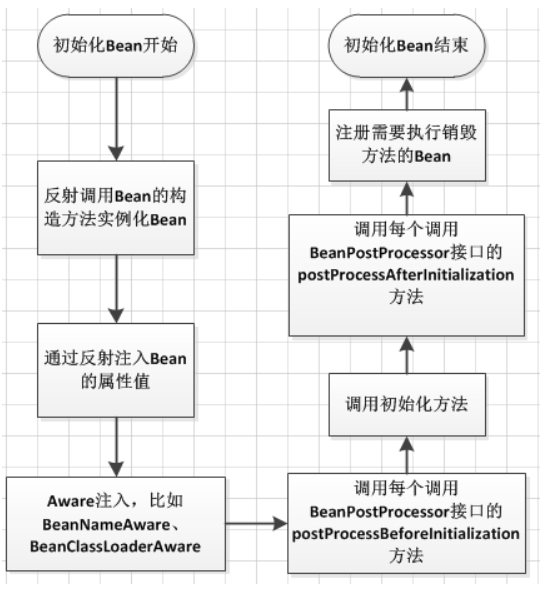

 

## 8. Bean-循环依赖

### 什么是循环依赖？

循环依赖：一个或多个对象实例之间存在直接或间接的依赖关系，这种依赖关系构成了构成一个环形调用（闭环）。

例：第一种情况：两个对象之间的直接依赖：

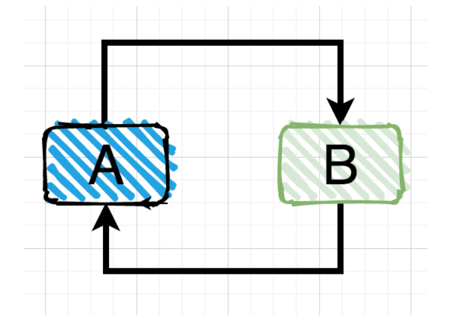

 

第二种情况：多个对象之间的间接依赖


注意，这里不是函数的循环调用，是对象的相互依赖关系。循环调用其实就是一个死循环，除非有终结条件。

 

### 怎么检测是否存在循环依赖

检测循环依赖相对比较容易，Bean在创建的时候可以给该Bean打标记，如果递归调用回来发现正在创建中的话，即说明了循环依赖了。

 

### 循环依赖_效果演示

Spring中循环依赖场景有：

- 构造器的循环依赖
- field属性的循环依赖

 

#### （1）构造器的循环依赖

构造器的循环依赖就是在构造器中有属性循环依赖，如下：

```java
public class testService1 {

    private testService2 service_2;

    public testService1(testService2 service_2) {
        this.service_2 = service_2;
    }

    public void aTest(){
        System.out.println("testService1，注入了属性" + service_2 );
    }
}
public class testService2 {

    private testService1 service_1;

    public testService2(testService1 service_1) {
        this.service_1 = service_1;
    }

    public void bTest(){
        System.out.println("testService2，注入了属性" + service_1 );
    }
    
}
```

applicationContext.xml

```java
<!--testService1通过构造方法注入testService2-->
<bean id="testService1" class="com.itheima.cyclic.testService1">
   <constructor-arg  name="service_2" ref="testService2"/>
</bean>

<!--testService2通过构造方法注入testService1-->
<bean id="testService2" class="com.itheima.cyclic.testService2">
   <constructor-arg name="service_1" ref="testService1"/>
</bean>
```

测试代码：

```java
/**
     * 循环依赖效果演示
     * @param args
     */
    public static void main(String[] args) {
        ClassPathXmlApplicationContext applicationContext =
                new ClassPathXmlApplicationContext("classpath:applicationContext-cyclic.xml");

        testService1 testService1 = (com.itheima.cyclic.testService1) applicationContext.getBean("testService1");
        testService1.aTest();
    }

```

测试结果：产生了循环依赖

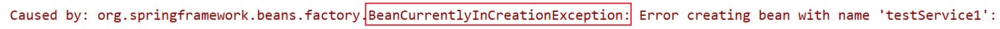

 

 

#### （2）field属性的循环依赖

```java
public class TestService1 {

    private TestService2 testService2;

    public void setTestService2(TestService2 testService2) {
        this.testService2 = testService2;
    }

    public void aTest(){
        System.out.println("testService1，注入了" + testService2 );
    }

}
public class TestService2 {

    private TestService1 testService1;

    public void setTestService1(TestService1 testService1) {
        this.testService1 = testService1;
    }

    public void aTest(){
        System.out.println("testService1，注入了属性" + testService1 );
    }
}
```

applicationContext.xml

```java
    <bean id="testService1" class="com.itheima.cyclic.TestService1">
        <property name="testService2" ref="testService2"/>
    </bean>

    <bean id="testService2" class="com.itheima.cyclic.TestService2">
        <property name="testService1" ref="testService1" />
    </bean>
```

测试结果：

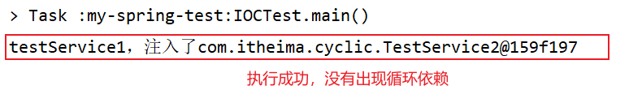

#### 结论：

构造器注入引起的循环依赖（**不能解决**）

单例Bean的Setter注入产生的循环依赖（**能解决**）

 

### Spring怎么解决循环依赖

Spring的循环依赖的理论依据其实是基于Java的引用传递，当我们获取到对象的引用时，对象的field或则属性是可以延后设置的(但是构造器必须是在获取引用之前)。

 

#### 三级缓存

Spring为了解决单例的循环依赖问题，使用了**三级缓存（三个map）**

```java
/** Cache of singleton objects: bean name --> bean instance */
private final Map<String, Object> singletonObjects = new ConcurrentHashMap<String, Object>(256);

/** Cache of early singleton objects: bean name --> bean instance */
private final Map<String, Object> earlySingletonObjects = new HashMap<String, Object>(16);

/** Cache of singleton factories: bean name --> ObjectFactory */
private final Map<String, ObjectFactory<?>> singletonFactories = new HashMap<String, ObjectFactory<?>>(16);
```

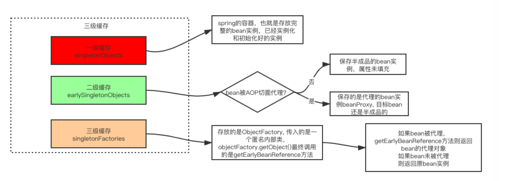

 

#### Spring解决循环依赖流程图

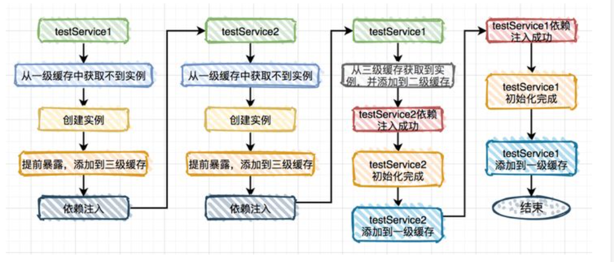

 

#### 循环依赖_源码剖析

1.使用getBean(java.lang.Class)从IOC中获取bean信息，实际上在IOC容器通过扫描包或加载XML后也会循环调用getBean(...)进行Bean的首轮实例化。

下面来详细了解下getBean(...)中对于循环依赖的处理:

```java
//org.springframework.beans.factory.support.AbstractBeanFactory#doGetBean
//doGetBean是getBean方法的实际逻辑方法,这里只贴出了相关的部分代码
protected <T> T doGetBean(final String name, @Nullable final Class<T> requiredType,
      @Nullable final Object[] args, boolean typeCheckOnly) throws BeansException {
   //处理bean名称的规范问题
   final String beanName = transformedBeanName(name);
   Object bean;

   // Eagerly check singleton cache for manually registered singletons.
   //从缓存中获取bean实例
   Object sharedInstance = getSingleton(beanName);
   if (sharedInstance != null && args == null) {
      if (logger.isTraceEnabled()) {
         if (isSingletonCurrentlyInCreation(beanName)) {
            logger.trace("Returning eagerly cached instance of singleton bean '" + beanName +
                  "' that is not fully initialized yet - a consequence of a circular reference");
         }
         else {
            logger.trace("Returning cached instance of singleton bean '" + beanName + "'");
         }
      }
      bean = getObjectForBeanInstance(sharedInstance, name, beanName, null);
   }

   else {
      //省略...

      try {
         //获取beanName对应的BeanDefinition
         final RootBeanDefinition mbd = getMergedLocalBeanDefinition(beanName);
        //省略...
          
         // Create bean instance.
         //根据bean的作用域来创建bean实例
         if (mbd.isSingleton()) {
            //创建单例模式的bean
            sharedInstance = getSingleton(beanName, () -> {
               try {
                   //单例的bean实例化方法
                  return createBean(beanName, mbd, args);
               }
               catch (BeansException ex) {
                  // Explicitly remove instance from singleton cache: It might have been put there
                  // eagerly by the creation process, to allow for circular reference resolution.
                  // Also remove any beans that received a temporary reference to the bean.
                  destroySingleton(beanName);
                  throw ex;
               }
            });
            bean = getObjectForBeanInstance(sharedInstance, name, beanName, mbd);
         }
         else if (mbd.isPrototype()) {
            //创建原型模式bean
            // It's a prototype -> create a new instance.
            Object prototypeInstance = null;
            try {
               beforePrototypeCreation(beanName);
               prototypeInstance = createBean(beanName, mbd, args);
            }
            finally {
               afterPrototypeCreation(beanName);
            }
            bean = getObjectForBeanInstance(prototypeInstance, name, beanName, mbd);
         }else {
             //创建其他模式bean
            String scopeName = mbd.getScope();
            final Scope scope = this.scopes.get(scopeName);
            if (scope == null) {
               throw new IllegalStateException("No Scope registered for scope name '" + scopeName + "'");
            }
            try {
               Object scopedInstance = scope.get(beanName, () -> {
                  beforePrototypeCreation(beanName);
                  try {
                     return createBean(beanName, mbd, args);
                  }
                  finally {
                     afterPrototypeCreation(beanName);
                  }
               });
               bean = getObjectForBeanInstance(scopedInstance, name, beanName, mbd);
            }
            catch (IllegalStateException ex) {
               throw new BeanCreationException(beanName,
                     "Scope '" + scopeName + "' is not active for the current thread; consider " +
                     "defining a scoped proxy for this bean if you intend to refer to it from a singleton",
                     ex);
            }
         }
      }
      catch (BeansException ex) {
         cleanupAfterBeanCreationFailure(beanName);
         throw ex;
      }
   }

   //省略...
   return (T) bean;
}
```

上述doGetBean大致做了几个步骤：

- 1.尝试根据beanName从缓存中获取获取bean对象

- 2.若获取到缓存对象则执行getObjectForBeanInstance(...)后返回bean信息

- 3.若没有获取到缓存对象(首次创建)，则根据bean的作用域类型来采取不同方式创建bean(这里默认为单例模式)，然后再执行getObjectForBeanInstance(...)后返回bean信息

   

其中涉及到循环依赖的处理有getSingleton(beanName)先获取缓存对象：

```java
    protected Object getSingleton(String beanName, boolean allowEarlyReference) {
        // Quick check for existing instance without full singleton lock

        // 1.从单例对象缓存（1级缓存）中获取beanName对应的单例对象
        Object singletonObject = this.singletonObjects.get(beanName);
        // 2.如果单例对象缓存（1级缓存）中没有，并且该beanName对应的单例bean正在创建中
        if (singletonObject == null && isSingletonCurrentlyInCreation(beanName)) {
            // 3.从早期单例对象缓存中（二级缓存）获取单例对象（之所称成为早期单例对象，是因为earlySingletonObjects里
            // 的对象的都是通过提前曝光的ObjectFactory创建出来的，还未进行属性填充等操作）
            singletonObject = this.earlySingletonObjects.get(beanName);

            // 4.如果在早期单例对象缓存中（二级缓存）也没有，并且允许创建早期单例对象引用
            if (singletonObject == null && allowEarlyReference) {
                synchronized (this.singletonObjects) {
                    // Consistent creation of early reference within full singleton lock
                    // 6.从单例工厂缓存中（三级缓存）获取beanName的单例工厂
                    singletonObject = this.singletonObjects.get(beanName);
                    if (singletonObject == null) {
                        // 再次从二级缓存中获取，重复校验
                        singletonObject = this.earlySingletonObjects.get(beanName);
                        // 为null
                        if (singletonObject == null) {
                            // 6.再从单例工厂缓存中（三级缓存）获取beanName的单例工厂
                            ObjectFactory<?> singletonFactory = this.singletonFactories.get(beanName);
                            if (singletonFactory != null) {
                                // 7.如果存在单例对象工厂，则通过工厂创建一个单例对象
                                singletonObject = singletonFactory.getObject();
                                // 8.将通过单例对象工厂创建的单例对象，放到早期单例对象缓存中
                                this.earlySingletonObjects.put(beanName, singletonObject);
                                // 9.移除该beanName对应的单例对象工厂，因为该单例工厂已经创建了一个实例对象，并且放到earlySingletonObjects缓存了，
                                // 因此，后续获取beanName的单例对象，可以通过earlySingletonObjects缓存拿到，不需要在用到该单例工厂
                                this.singletonFactories.remove(beanName);
                            }
                        }
                    }
                }
            }
        }
        return singletonObject;
    }
```

分别从一级缓存、二级缓存、三级缓存中进行查找

 

2.这里我们的bean按照单例模式，走首次创建路径createBean(beanName, mbd, args);，而createBean(beanName, mbd, args);中真正的逻辑方法是doCreateBean(...)，下面我们看下doCreateBean(...)的方法：

```java
protected Object doCreateBean(final String beanName, final RootBeanDefinition mbd, final @Nullable Object[] args)
      throws BeanCreationException {

   // Instantiate the bean.
   BeanWrapper instanceWrapper = null;
   if (mbd.isSingleton()) {
      //根据beanName将当前对象从未完成实例化列表缓存中移除并返回
      instanceWrapper = this.factoryBeanInstanceCache.remove(beanName);
   }
   //若未完成实例化列表缓存中没有数据则创建一个空对象
   if (instanceWrapper == null) {
      instanceWrapper = createBeanInstance(beanName, mbd, args);
   }
   final Object bean = instanceWrapper.getWrappedInstance();
   //省略...

   // Eagerly cache singletons to be able to resolve circular references
   // even when triggered by lifecycle interfaces like BeanFactoryAware.
   //将bean写入提前暴露的缓存中(此时的bean刚实例化，还没有对其属性进行赋值处理)
   boolean earlySingletonExposure = (mbd.isSingleton() && this.allowCircularReferences &&
         isSingletonCurrentlyInCreation(beanName));
   if (earlySingletonExposure) {
      if (logger.isTraceEnabled()) {
         logger.trace("Eagerly caching bean '" + beanName +
               "' to allow for resolving potential circular references");
      }
      addSingletonFactory(beanName, () -> getEarlyBeanReference(beanName, mbd, bean));
   }

   // Initialize the bean instance.
   Object exposedObject = bean;
   try {
      //将beandefinition中的属性写入对应的instanceWrapper对象实例中
      //依赖循环就是在这里处理的 
      populateBean(beanName, mbd, instanceWrapper);
      //如果exposedObject对象有实现一些aware、init接口则初始化这些接口
      exposedObject = initializeBean(beanName, exposedObject, mbd);
   }
   catch (Throwable ex) {
      if (ex instanceof BeanCreationException && beanName.equals(((BeanCreationException) ex).getBeanName())) {
         throw (BeanCreationException) ex;
      }
      else {
         throw new BeanCreationException(
               mbd.getResourceDescription(), beanName, "Initialization of bean failed", ex);
      }
   }
   //省略...

   return exposedObject;
}
```

doCreateBean(...)的主要逻辑有以下几步：

- 创建一个bean的包装对象instanceWrapper(实际为Class.forName(className).newInstance()创建,有兴趣自行可跟踪代码)
- 通过addSingletonFactory(...)将刚实例化的对象放入缓存中
- 在populateBean(...)中处理bean对象的依赖属性(在这里递归调用其他依赖的bean)
- 在initializeBean(...)中调用对象的一些初始化接口(如实现InitializingBean)，并返回结果bean

 

涉及循环依赖的处理有addSingletonFactory(...)和populateBean(...)两部分，我们先看下addSingletonFactory(...)将bean加入缓存中：

```java
//org.springframework.beans.factory.support.DefaultSingletonBeanRegistry#addSingletonFactory
protected void addSingletonFactory(String beanName, ObjectFactory<?> singletonFactory) {
   Assert.notNull(singletonFactory, "Singleton factory must not be null");
   synchronized (this.singletonObjects) {
      //没有创建过beanName的bean则加入缓存
      if (!this.singletonObjects.containsKey(beanName)) {
         //存储在singletonFactories中，在getSingleton(...)中获取调用
         this.singletonFactories.put(beanName, singletonFactory);
         this.earlySingletonObjects.remove(beanName);
         this.registeredSingletons.add(beanName);
      }
   }
}

//参数ObjectFactory<?> singletonFactory是一个函数式接口对象
//内容为() -> getEarlyBeanReference(beanName, mbd, bean)
//调用singletonFactory会执行getEarlyBeanReference(beanName, mbd, bean)，返回bean的首次创建对象
//实际上会在获取缓存对象的getSingleton(...)中调用 singletonFactory.getObject();
protected Object getEarlyBeanReference(String beanName, RootBeanDefinition mbd, Object bean) {
    Object exposedObject = bean;
    //忽略...
    return exposedObject;
}

```

3.而`populateBean(...)`是根据BeanDefinition将属性赋值到刚创建的对象中，主要的逻辑在`applyPropertyValues(...)`中执行，大致代码如下：

```java
//org.springframework.beans.factory.support.AbstractAutowireCapableBeanFactory#applyPropertyValues
protected void applyPropertyValues(String beanName, BeanDefinition mbd, BeanWrapper bw, PropertyValues pvs) {
   //省略...
    //创建属性解析器(主要完成属性值的处理，包括依赖其他bean的创建)
   BeanDefinitionValueResolver valueResolver = new BeanDefinitionValueResolver(this, beanName, mbd, converter);

   // Create a deep copy, resolving any references for values.
   List<PropertyValue> deepCopy = new ArrayList<>(original.size());
   boolean resolveNecessary = false;
   for (PropertyValue pv : original) {
      if (pv.isConverted()) {
         deepCopy.add(pv);
      }
      else {
         //获取属性名称
         String propertyName = pv.getName();
         Object originalValue = pv.getValue();
         //使用解析器解析不同类型的值
         Object resolvedValue = valueResolver.resolveValueIfNecessary(pv, originalValue);
          //将值包装到deepCopy的list中
         Object convertedValue = resolvedValue;
         boolean convertible = bw.isWritableProperty(propertyName) &&
               !PropertyAccessorUtils.isNestedOrIndexedProperty(propertyName);
         if (convertible) {
            convertedValue = convertForProperty(resolvedValue, propertyName, bw, converter);
         }
         // Possibly store converted value in merged bean definition,
         // in order to avoid re-conversion for every created bean instance.
         if (resolvedValue == originalValue) {
            if (convertible) {
               pv.setConvertedValue(convertedValue);
            }
            deepCopy.add(pv);
         }
         else if (convertible && originalValue instanceof TypedStringValue &&
               !((TypedStringValue) originalValue).isDynamic() &&
               !(convertedValue instanceof Collection || ObjectUtils.isArray(convertedValue))) {
            pv.setConvertedValue(convertedValue);
            deepCopy.add(pv);
         }
         else {
            resolveNecessary = true;
            deepCopy.add(new PropertyValue(pv, convertedValue));
         }
      }
   }
   if (mpvs != null && !resolveNecessary) {
      mpvs.setConverted();
   }

   // Set our (possibly massaged) deep copy.
   try {
       //将属性赋值到对象中
      bw.setPropertyValues(new MutablePropertyValues(deepCopy));
   }
   catch (BeansException ex) {
      throw new BeanCreationException(
            mbd.getResourceDescription(), beanName, "Error setting property values", ex);
   }
}
```

主要逻辑是如下：

- 创建属性解析器valueResolver， 之后循环BeanDefinition中的属性列表，使用解析器对每个property进行实际值的解析(保存创建依赖bean对象)
- 根据属性的名称将属性值赋值到对象中

 

4.涉及到循环依赖的逻辑是valueResolver.resolveValueIfNecessary(pv, originalValue),使用属性解析器获取property的实际内容，下面我们看下如何解析property的(只看依赖其他bean的property)：

```java
//org.springframework.beans.factory.support.BeanDefinitionValueResolver#resolveValueIfNecessary
@Nullable
public Object resolveValueIfNecessary(Object argName, @Nullable Object value) {
   // We must check each value to see whether it requires a runtime reference
   // to another bean to be resolved.
    //处理依赖其他bean的property
   if (value instanceof RuntimeBeanReference) {
      RuntimeBeanReference ref = (RuntimeBeanReference) value;
      return resolveReference(argName, ref);
   }
    //省略...
}

//详细处理逻辑
@Nullable
private Object resolveReference(Object argName, RuntimeBeanReference ref) {
    try {
        Object bean;
        //获取依赖bean名称
        String refName = ref.getBeanName();
        refName = String.valueOf(doEvaluate(refName));
        //依赖是否属于父容器
        if (ref.isToParent()) {
            if (this.beanFactory.getParentBeanFactory() == null) {
                throw new BeanCreationException(
                        this.beanDefinition.getResourceDescription(), this.beanName,
                        "Can't resolve reference to bean '" + refName +
                                "' in parent factory: no parent factory available");
            }
            bean = this.beanFactory.getParentBeanFactory().getBean(refName);
        }
        else {
            //嵌套调用IOC容器的getBean方法
            bean = this.beanFactory.getBean(refName);
            this.beanFactory.registerDependentBean(refName, this.beanName);
        }
        if (bean instanceof NullBean) {
            bean = null;
        }
        return bean;
    }
    catch (BeansException ex) {
        throw new BeanCreationException(
                this.beanDefinition.getResourceDescription(), this.beanName,
                "Cannot resolve reference to bean '" + ref.getBeanName() + "' while setting " + argName, ex);
    }
}
```

上述逻辑比较清晰简单，就是根据依赖的beanName嵌套调用`this.beanFactory.getBean(refName)`去创建所依赖对象，创建完成后返回该bean信息。

 

**总结：** 到这里我们就可以知道spring是如何处理依赖循环的了：

（1）调用getBean(...)方法创建一个bean，前先从缓存getSingleton(...)中获取对象信息

（2）若是没有缓存，则首次创建后将其对象加入到**三级缓存**中

（3）之后对创建的对象进行属性填充populateBean(...)，填充过程中创建属性解析器对bean的属性进行处理

（4）若属性类型依赖其他的bean，则会嵌套调用IOC容器的getBean方法去创建所依赖的bean对象，直到出现从缓存中获取到对象后跳出嵌套逻辑，才可以完成整个bean的属性赋值过程。

 

### 循环依赖经典面试题

#### 【Spring 为何需要三级缓存解决循环依赖，而不是二级缓存？】

答：只要两个缓存确实可以做到解决循环依赖的问题，但是有一个前提这个bean没被AOP进行切面代理，如果这个bean被AOP进行了切面代理，那么只使用两个缓存是无法解决问题

 

#### 【三级缓存中为什么要添加`ObjectFactory`对象，而不是直接保存实例对象？】

答：因为假如想对添加到三级缓存中的实例对象进行增强，直接用实例对象是行不通的。

 

#### 【构造器注入注入的循环依赖为什么无法解决？】


 

答：源码中对于解决逻辑的第一句话：**“我们先用构造函数创建一个 “不完整” 的 bean 实例”**，从这句话可以看出，构造器循环依赖是无法解决的，因为当构造器出现循环依赖，我们连 “不完整” 的 bean 实例都构建不出来。

 

## 9. AOP源码深度剖析

### 概述

1. AOP（Aspect Orient Programming）：面向切面编程；

2. 用途：用于系统中的横切关注点，比如日志管理，事务管理；

3. 实现：利用代理模式，通过代理对象对被代理的对象增加功能。

   所以，关键在于AOP框架自动创建AOP代理对象，代理模式分为静态代理和动态代理；

4. 框架： AspectJ使用静态代理，编译时增强，在编译期生成代理对象；

   SpringAOP使用动态代理，运行时增强，在运行时，动态生成代理对象；

 

### Spring AOP的前世今生

目前 Spring AOP 一共有三种配置方式，Spring 做到了很好地向下兼容，所以可以放心使用。

- Spring 1.2 **基于接口的配置**：最早的 Spring AOP 是完全基于几个接口的
- Spring 2.0 **schema-based 配置**：Spring 2.0 以后使用 XML 的方式来配置，使用 命名空间 `<aop />`
- Spring 2.0 **@AspectJ 配置**：使用注解的方式来配置，这种方式感觉是最方便的，还有，这里虽然叫做 `@AspectJ`，但是这个和 AspectJ 其实没啥关系。

 

要说明的是，这里介绍的 Spring AOP 是纯的 Spring 代码，和 AspectJ 没什么关系，但是 Spring 延用了 AspectJ 中的概念，包括使用了 AspectJ 提供的 jar 包中的注解，但是不依赖于其实现功能。

> 如 @Aspect、@Pointcut、@Before、@After 等注解都是来自于 AspectJ，但是功能的实现是纯 Spring AOP 自己实现的。

 

 

### 实现机制

Spring AOP 底层实现机制目前有两种：JDK 动态代理、CGLIB 动态字节码生成。在阅读源码前对这两种机制的使用有个认识，有利于更好的理解源码。

**JDK 动态代理**

```java
public class MyInvocationHandler implements InvocationHandler {
 
    private Object origin;
 
    public MyInvocationHandler(Object origin) {
        this.origin = origin;
    }
 
    @Override
    public Object invoke(Object proxy, Method method, Object[] args) throws Throwable {
        System.out.println("invoke start");
        Object result = method.invoke(origin, args);
        System.out.println("invoke end");
        return result;
    }
}
 
 
public class JdkProxyTest {
    public static void main(String[] args) {
        UserService proxy = (UserService) Proxy.newProxyInstance(JdkProxyTest.class.getClassLoader(),
                new Class[]{UserService.class}, new MyInvocationHandler(new UserServiceImpl()));
        proxy.doSomething();
    }
}
```

 

**CGLIB 代理**

```java
public class CglibInterceptor implements MethodInterceptor {
 
    @Override
    public Object intercept(Object obj, Method method, Object[] args, MethodProxy proxy) throws Throwable {
        System.out.println("intercept start");
        Object result = proxy.invokeSuper(obj, args);
        System.out.println("intercept end");
        return result;
    }
}
 
public class CglibProxyTest {
 
    public static void main(String[] args) {
        Enhancer enhancer = new Enhancer();
        enhancer.setSuperclass(CglibObject.class);
        enhancer.setCallback(new CglibInterceptor());
        CglibObject proxy = (CglibObject) enhancer.create();
        proxy.doSomething();
    }
}
```

 

### AOP实例

UserService接口：

```java
public interface UserService {

    public void findAll();
}
```

UserServiceImpl实现类：

```java
@Service
public class UserServiceImpl implements UserService{

    public void findAll(){
        System.out.println("findAll...");
    }

}
```

AopAspect切面类：

```java
@Component
@Aspect
public class AopAspect {

    @Pointcut("execution(* com.itheima.service..*.*(..))")
    public void pointcut() {
    }

    @Before("pointcut()")
    public void before() {
        System.out.println("before");
    }

    @After("pointcut()")
    public void after() {
        System.out.println("after advice");
    }

    @Around("pointcut()")
    public Object around(ProceedingJoinPoint proceedingJoinPoint) throws InterruptedException {
        System.out.println("around advice start");
        try {
            Object result = proceedingJoinPoint.proceed();
            System.out.println("result: " + result);
            System.out.println("around advice end");
            return result;
        } catch (Throwable throwable) {
            throwable.printStackTrace();
            return null;
        }
    }

}
```

applicationContext-aop.xml

```java
<?xml version="1.0" encoding="UTF-8"?>
<beans xmlns="http://www.springframework.org/schema/beans"
       xmlns:xsi="http://www.w3.org/2001/XMLSchema-instance"
       xmlns:context="http://www.springframework.org/schema/context"
       xmlns:aop="http://www.springframework.org/schema/aop"
       xmlns:tx="http://www.springframework.org/schema/tx"
       xsi:schemaLocation="http://www.springframework.org/schema/beans
        http://www.springframework.org/schema/beans/spring-beans.xsd
        http://www.springframework.org/schema/context
        http://www.springframework.org/schema/context/spring-context.xsd
        http://www.springframework.org/schema/aop
        http://www.springframework.org/schema/aop/spring-aop.xsd
        http://www.springframework.org/schema/tx
        http://www.springframework.org/schema/tx/spring-tx.xsd">


    <context:component-scan base-package="com.itheima"/>

    <aop:aspectj-autoproxy />


</beans>
```

 

### 源码剖析-AOP 注解的解析

当使用 <aop:aspectj-autoproxy /> 注解开启 AOP 功能时，解析aop标签会进行到parseCustomElement(root);

**parseBeanDefinitions**

```java
protected void parseBeanDefinitions(Element root, BeanDefinitionParserDelegate delegate) {
    // 1.默认命名空间的处理
    if (delegate.isDefaultNamespace(root)) {
        NodeList nl = root.getChildNodes();
        // 遍历root的子节点列表
        for (int i = 0; i < nl.getLength(); i++) {
            Node node = nl.item(i);
            if (node instanceof Element) {
                Element ele = (Element) node;
                if (delegate.isDefaultNamespace(ele)) {
                    // 1.1 默认命名空间节点的处理，例如： <bean id="test" class="" />
                    parseDefaultElement(ele, delegate);
                }
                else {
                    // 1.2 自定义命名空间节点的处理，例如：<context:component-scan/>、<aop:aspectj-autoproxy/>
                    delegate.parseCustomElement(ele);
                }
            }
        }
    } else {
        // 2.自定义命名空间的处理**** <aop:aspectj-autoproxy />进行解析
        delegate.parseCustomElement(root);
    }
}
```

 

**parseCustomElement**

```java
public BeanDefinition parseCustomElement(Element ele) {
    return parseCustomElement(ele, null);
}
 
public BeanDefinition parseCustomElement(Element ele, BeanDefinition containingBd) {
    // 1.拿到节点ele的命名空间，例如常见的:
    // <context> 节点对应命名空间: http://www.springframework.org/schema/context
    // <aop> 节点对应命名空间: http://www.springframework.org/schema/aop
    String namespaceUri = getNamespaceURI(ele);
    // 2.拿到命名空间对应的的handler, 例如：http://www.springframework.org/schema/context 对应 ContextNameSpaceHandler
    // 2.1 getNamespaceHandlerResolver: 拿到namespaceHandlerResolver
    // 2.2 resolve: 使用namespaceHandlerResolver解析namespaceUri, 拿到namespaceUri对应的NamespaceHandler
    NamespaceHandler handler = this.readerContext.getNamespaceHandlerResolver().resolve(namespaceUri);
    if (handler == null) {
        error("Unable to locate Spring NamespaceHandler for XML schema namespace [" + namespaceUri + "]", ele);
        return null;
    }
    // 3.使用拿到的handler解析节点（ParserContext用于存放解析需要的一些上下文信息）
    return handler.parse(ele, new ParserContext(this.readerContext, this, containingBd));
}
```

 

Spring会从“META-INF/spring.handlers” 配置文件中拿到该注解对应的 NamespaceHandlerSupport：AopNamespaceHandler

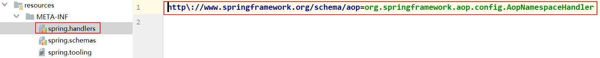

在 AopNamespaceHandler 的 init 方法会给该注解注册对应的解析器，aspectj-autoproxy 对应的解析器是：AspectJAutoProxyBeanDefinitionParser。

当解析到 <aop:aspectj-autoproxy /> 注解时，会调用 AspectJAutoProxyBeanDefinitionParser 的 parse方法。

 

#### AspectJAutoProxyBeanDefinitionParser#parse

```java
@Override
public BeanDefinition parse(Element element, ParserContext parserContext) {
    // 1.注册AspectJAnnotationAutoProxyCreator
    AopNamespaceUtils.registerAspectJAnnotationAutoProxyCreatorIfNecessary(parserContext, element);
    // 2.对于注解中子节点的处理
    extendBeanDefinition(element, parserContext);
    return null;
}
```

1.注册 AspectJAnnotationAutoProxyCreator，见代码块1。

 

#### 代码块1：AopNamespaceUtils#registerAspectJAnnotationAutoProxyCreatorIfNecessary

```java
public static void registerAspectJAnnotationAutoProxyCreatorIfNecessary(
        ParserContext parserContext, Element sourceElement) {
    // 1.注册AspectJAnnotationAutoProxyCreator
    BeanDefinition beanDefinition = AopConfigUtils.registerAspectJAnnotationAutoProxyCreatorIfNecessary(
            parserContext.getRegistry(), parserContext.extractSource(sourceElement));
    // 2.对于proxy-target-class以及expose-proxy属性的处理
    useClassProxyingIfNecessary(parserContext.getRegistry(), sourceElement);
    // 3.注册组件并通知，便于监听器做进一步处理
    registerComponentIfNecessary(beanDefinition, parserContext);
}
```

1.注册 AspectJAnnotationAutoProxyCreator，见代码块2

2.对于 proxy-target-class 以及 expose-proxy 属性的处理，见代码块3

 

#### 代码块2：AopConfigUtils#registerAspectJAnnotationAutoProxyCreatorIfNecessary

```java
public static BeanDefinition registerAspectJAnnotationAutoProxyCreatorIfNecessary(BeanDefinitionRegistry registry, Object source) {
    return registerOrEscalateApcAsRequired(AnnotationAwareAspectJAutoProxyCreator.class, registry, source);
}
 
private static BeanDefinition registerOrEscalateApcAsRequired(Class<?> cls, BeanDefinitionRegistry registry, Object source) {
    Assert.notNull(registry, "BeanDefinitionRegistry must not be null");
    // 1.如果注册表中已经存在beanName=org.springframework.aop.config.internalAutoProxyCreator的bean，则按优先级进行选择。
    // beanName=org.springframework.aop.config.internalAutoProxyCreator，可能存在的beanClass有三种，按优先级排序如下：
    // InfrastructureAdvisorAutoProxyCreator、AspectJAwareAdvisorAutoProxyCreator、AnnotationAwareAspectJAutoProxyCreator
    if (registry.containsBeanDefinition(AUTO_PROXY_CREATOR_BEAN_NAME)) {
        // 拿到已经存在的bean定义
        BeanDefinition apcDefinition = registry.getBeanDefinition(AUTO_PROXY_CREATOR_BEAN_NAME);
        // 如果已经存在的bean的className与当前要注册的bean的className不相同，则按优先级进行选择
        if (!cls.getName().equals(apcDefinition.getBeanClassName())) {
            // 拿到已经存在的bean的优先级
            int currentPriority = findPriorityForClass(apcDefinition.getBeanClassName());
            // 拿到当前要注册的bean的优先级
            int requiredPriority = findPriorityForClass(cls);
            if (currentPriority < requiredPriority) {
                // 如果当前要注册的bean的优先级大于已经存在的bean的优先级，则将bean的className替换为当前要注册的bean的className，
                apcDefinition.setBeanClassName(cls.getName());
            }
            // 如果小于，则不做处理
        }
        // 如果已经存在的bean的className与当前要注册的bean的className相同，则无需进行任何处理
        return null;
    }
    // 2.如果注册表中还不存在，则新建一个Bean定义，并添加到注册表中
    RootBeanDefinition beanDefinition = new RootBeanDefinition(cls);
    beanDefinition.setSource(source);
    // 设置了order为最高优先级
    beanDefinition.getPropertyValues().add("order", Ordered.HIGHEST_PRECEDENCE);
    beanDefinition.setRole(BeanDefinition.ROLE_INFRASTRUCTURE);
    // 注册BeanDefinition，beanName为org.springframework.aop.config.internalAutoProxyCreator
    registry.registerBeanDefinition(AUTO_PROXY_CREATOR_BEAN_NAME, beanDefinition);
    return beanDefinition;
}
```

org.springframework.aop.config.internalAutoProxyCreator 是内部管理的自动代理创建者的 bean 名称，可能对应的 beanClassName 有三种，对应的注解如下：

InfrastructureAdvisorAutoProxyCreator：<tx:annotation-driven />

AspectJAwareAdvisorAutoProxyCreator：<aop:config />

AnnotationAwareAspectJAutoProxyCreator：<aop:aspectj-autoproxy />

当同时存在多个注解时，会使用优先级最高的 beanClassName 来作为 org.springframework.aop.config.internalAutoProxyCreator 的 beanClassName。现在暂不考虑同时存在其他注解的情况，所以在这边会注册的 beanClassName 为：AnnotationAwareAspectJAutoProxyCreator。

 

#### 代码块3：useClassProxyingIfNecessary

```java
private static void useClassProxyingIfNecessary(BeanDefinitionRegistry registry, Element sourceElement) {
    if (sourceElement != null) {
        boolean proxyTargetClass = Boolean.valueOf(sourceElement.getAttribute(PROXY_TARGET_CLASS_ATTRIBUTE));
        if (proxyTargetClass) {
            // 如果节点设置了proxy-target-class=true，则给beanName为org.springframework.aop.config.internalAutoProxyCreator
            // 的BeanDefinition添加proxyTargetClass=true的属性，之后创建代理的时候将强制使用Cglib代理
            AopConfigUtils.forceAutoProxyCreatorToUseClassProxying(registry);
        }
        boolean exposeProxy = Boolean.valueOf(sourceElement.getAttribute(EXPOSE_PROXY_ATTRIBUTE));
        if (exposeProxy) {
            // 如果节点设置了expose-proxy=true，则给beanName为org.springframework.aop.config.internalAutoProxyCreator
            // 的BeanDefinition添加exposeProxy=true的属性，之后创建拦截器时会根据该属性选择是否暴露代理类
            AopConfigUtils.forceAutoProxyCreatorToExposeProxy(registry);
        }
    }
}
```

 

#### 总结

该部分最重要的内容就是注册了内部管理的自动代理创建者的 bean：AnnotationAwareAspectJAutoProxyCreator

 

### 源码剖析-创建 AOP 代理

#### AnnotationAwareAspectJAutoProxyCreator类图

AnnotationAwareAspectJAutoProxyCreator 实现了几个重要的扩展接口（可能是在父类中实现）：

1）实现了 BeanPostProcessor 接口：实现了 postProcessAfterInitialization 方法。

2）实现了 InstantiationAwareBeanPostProcessor 接口：实现了 postProcessBeforeInstantiation 方法。

3）实现了 SmartInstantiationAwareBeanPostProcessor 接口：实现了 predictBeanType 方法、getEarlyBeanReference 方法。

4）实现了 BeanFactoryAware 接口，实现了 setBeanFactory 方法。

对于 AOP 来说，postProcessAfterInitialization 是我们重点分析的内容，因为在该方法中，会对 bean 进行代理，该方法由父类 AbstractAutoProxyCreator 实现。

 

#### AbstractAutoProxyCreator#postProcessAfterInitialization

```java
@Override
public Object postProcessAfterInitialization(Object bean, String beanName) throws BeansException {
    if (bean != null) {
        Object cacheKey = getCacheKey(bean.getClass(), beanName);
        // 1.判断当前bean是否需要被代理，如果需要则进行封装
        if (!this.earlyProxyReferences.contains(cacheKey)) {
            return wrapIfNecessary(bean, beanName, cacheKey);
        }
    }
    return bean;
}
```

1.判断当前bean是否需要被代理，如果需要则进行封装，见代码块1。

 

#### 代码块1：wrapIfNecessary

```java
protected Object wrapIfNecessary(Object bean, String beanName, Object cacheKey) {
    // 1.判断当前bean是否在targetSourcedBeans缓存中存在（已经处理过），如果存在，则直接返回当前bean
    if (beanName != null && this.targetSourcedBeans.contains(beanName)) {
        return bean;
    }
    // 2.在advisedBeans缓存中存在，并且value为false，则代表无需处理
    if (Boolean.FALSE.equals(this.advisedBeans.get(cacheKey))) {
        return bean;
    }
    // 3.bean的类是aop基础设施类 || bean应该跳过，则标记为无需处理，并返回
    if (isInfrastructureClass(bean.getClass()) || shouldSkip(bean.getClass(), beanName)) {
        this.advisedBeans.put(cacheKey, Boolean.FALSE);
        return bean;
    }
 
    // Create proxy if we have advice.
    // 4.获取当前bean的Advices和Advisors
    Object[] specificInterceptors = getAdvicesAndAdvisorsForBean(bean.getClass(), beanName, null);
    // 5.如果存在增强器则创建代理
    if (specificInterceptors != DO_NOT_PROXY) {
        this.advisedBeans.put(cacheKey, Boolean.TRUE);
        // 5.1 创建代理对象：这边SingletonTargetSource的target属性存放的就是我们原来的bean实例（也就是被代理对象），
        // 用于最后增加逻辑执行完毕后，通过反射执行我们真正的方法时使用（method.invoke(bean, args)）
        Object proxy = createProxy(
                bean.getClass(), beanName, specificInterceptors, new SingletonTargetSource(bean));
        // 5.2 创建完代理后，将cacheKey -> 代理类的class放到缓存
        this.proxyTypes.put(cacheKey, proxy.getClass());
        // 返回代理对象
        return proxy;
    }
    // 6.标记为无需处理
    this.advisedBeans.put(cacheKey, Boolean.FALSE);
    return bean;
}
```

4.获取当前 bean 的 Advices 和 Advisors，见代码块2。

5.1 创建代理对象，见代码块14。

 

#### 代码块2：getAdvicesAndAdvisorsForBean

```java
@Override
protected Object[] getAdvicesAndAdvisorsForBean(Class<?> beanClass, String beanName, TargetSource targetSource) {
    // 1.找到符合条件的Advisor
    List<Advisor> advisors = findEligibleAdvisors(beanClass, beanName);
    if (advisors.isEmpty()) {
        // 2.如果没有符合条件的Advisor，则返回null
        return DO_NOT_PROXY;
    }
    return advisors.toArray();
}
```

1.找到符合条件的 Advisor，见代码块3。

 

#### 代码块3：findEligibleAdvisors

```java
protected List<Advisor> findEligibleAdvisors(Class<?> beanClass, String beanName) {
    // 1.查找所有的候选Advisor
    List<Advisor> candidateAdvisors = findCandidateAdvisors();
    // 2.从所有候选的Advisor中找出符合条件的
    List<Advisor> eligibleAdvisors = findAdvisorsThatCanApply(candidateAdvisors, beanClass, beanName);
    // 3.扩展方法，留个子类实现
    extendAdvisors(eligibleAdvisors);
    if (!eligibleAdvisors.isEmpty()) {
        // 4.对符合条件的Advisor进行排序
        eligibleAdvisors = sortAdvisors(eligibleAdvisors);
    }
    return eligibleAdvisors;
}
```

1.查找所有的候选 Advisor，见代码块4。

2.从所有候选的 Advisor 中找出符合条件的，见代码块13。

 

#### 代码块4：findAdvisorBeans

```java
@Override
protected List<Advisor> findCandidateAdvisors() {
    // 1.添加根据父类规则找到的所有advisor。
    List<Advisor> advisors = super.findCandidateAdvisors();
    // 2.为bean工厂中的所有AspectJ方面构建advisor
    advisors.addAll(this.aspectJAdvisorsBuilder.buildAspectJAdvisors());
    return advisors;
}
```

1.添加根据父类规则找到的所有 advisor，见代码块5。

2.为 bean 工厂中的所有 AspectJ 方面构建 advisor，见代码块6。

 

#### 代码块5：findCandidateAdvisors

```java
protected List<Advisor> findCandidateAdvisors() {
    return this.advisorRetrievalHelper.findAdvisorBeans();
}
 
public List<Advisor> findAdvisorBeans() {
    // 1.确认advisor的beanName列表，优先从缓存中拿
    String[] advisorNames = null;
    synchronized (this) {
        advisorNames = this.cachedAdvisorBeanNames;
        if (advisorNames == null) {
            //  1.1 如果缓存为空，则获取class类型为Advisor的所有bean名称
            advisorNames = BeanFactoryUtils.beanNamesForTypeIncludingAncestors(
                    this.beanFactory, Advisor.class, true, false);
            this.cachedAdvisorBeanNames = advisorNames;
        }
    }
    if (advisorNames.length == 0) {
        return new LinkedList<Advisor>();
    }
 
    // 2.遍历处理advisorNames
    List<Advisor> advisors = new LinkedList<Advisor>();
    for (String name : advisorNames) {
        if (isEligibleBean(name)) {
            // 2.1 跳过当前正在创建的advisor
            if (this.beanFactory.isCurrentlyInCreation(name)) {
                if (logger.isDebugEnabled()) {
                    logger.debug("Skipping currently created advisor '" + name + "'");
                }
            } else {
                try {
                    // 2.2 通过beanName获取对应的bean对象，并添加到advisors
                    advisors.add(this.beanFactory.getBean(name, Advisor.class));
                } catch (BeanCreationException ex) {
                    Throwable rootCause = ex.getMostSpecificCause();
                    if (rootCause instanceof BeanCurrentlyInCreationException) {
                        BeanCreationException bce = (BeanCreationException) rootCause;
                        if (this.beanFactory.isCurrentlyInCreation(bce.getBeanName())) {
                            if (logger.isDebugEnabled()) {
                                logger.debug("Skipping advisor '" + name +
                                        "' with dependency on currently created bean: " + ex.getMessage());
                            }
                            // Ignore: indicates a reference back to the bean we're trying to advise.
                            // We want to find advisors other than the currently created bean itself.
                            continue;
                        }
                    }
                    throw ex;
                }
            }
        }
    }
    // 3.返回符合条件的advisor列表
    return advisors;
}
```

 

#### 代码块6：buildAspectJAdvisors

```java
public List<Advisor> buildAspectJAdvisors() {
    List<String> aspectNames = this.aspectBeanNames;
    // 1.如果aspectNames为空，则进行解析
    if (aspectNames == null) {
        synchronized (this) {
            aspectNames = this.aspectBeanNames;
            if (aspectNames == null) {
                List<Advisor> advisors = new LinkedList<Advisor>();
                aspectNames = new LinkedList<String>();
                // 1.1 获取所有的beanName
                String[] beanNames = BeanFactoryUtils.beanNamesForTypeIncludingAncestors(
                        this.beanFactory, Object.class, true, false);
                // 1.2 循环遍历所有的beanName，找出对应的增强方法
                for (String beanName : beanNames) {
                    // 1.3 不合法的beanName则跳过，默认返回true，子类可以覆盖实现，AnnotationAwareAspectJAutoProxyCreator
                    // 实现了自己的逻辑，支持使用includePatterns进行筛选
                    if (!isEligibleBean(beanName)) {
                        continue;
                    }
                    // We must be careful not to instantiate beans eagerly as in this case they
                    // would be cached by the Spring container but would not have been weaved.
                    // 获取beanName对应的bean的类型
                    Class<?> beanType = this.beanFactory.getType(beanName);
                    if (beanType == null) {
                        continue;
                    }
                    // 1.4 如果beanType存在Aspect注解则进行处理
                    if (this.advisorFactory.isAspect(beanType)) {
                        // 将存在Aspect注解的beanName添加到aspectNames列表
                        aspectNames.add(beanName);
                        // 新建切面元数据
                        AspectMetadata amd = new AspectMetadata(beanType, beanName);
                        // 获取per-clause的类型是SINGLETON
                        if (amd.getAjType().getPerClause().getKind() == PerClauseKind.SINGLETON) {
                            // 使用BeanFactory和beanName创建一个BeanFactoryAspectInstanceFactory，主要用来创建切面对象实例
                            MetadataAwareAspectInstanceFactory factory =
                                    new BeanFactoryAspectInstanceFactory(this.beanFactory, beanName);
                            // 1.5 解析标记AspectJ注解中的增强方法
                            List<Advisor> classAdvisors = this.advisorFactory.getAdvisors(factory);
                            // 1.6 放到缓存中
                            if (this.beanFactory.isSingleton(beanName)) {
                                // 如果beanName是单例则直接将解析的增强方法放到缓存
                                this.advisorsCache.put(beanName, classAdvisors);
                            } else {
                                // 如果不是单例，则将factory放到缓存，之后可以通过factory来解析增强方法
                                this.aspectFactoryCache.put(beanName, factory);
                            }
                            // 1.7 将解析的增强器添加到advisors
                            advisors.addAll(classAdvisors);
                        } else {
                            // 如果per-clause的类型不是SINGLETON
                            // Per target or per this.
                            if (this.beanFactory.isSingleton(beanName)) {
                                // 名称为beanName的Bean是单例，但切面实例化模型不是单例，则抛异常
                                throw new IllegalArgumentException("Bean with name '" + beanName +
                                        "' is a singleton, but aspect instantiation model is not singleton");
                            }
                            MetadataAwareAspectInstanceFactory factory =
                                    new PrototypeAspectInstanceFactory(this.beanFactory, beanName);
                            // 将factory放到缓存，之后可以通过factory来解析增强方法
                            this.aspectFactoryCache.put(beanName, factory);
                            // 解析标记AspectJ注解中的增强方法，并添加到advisors中
                            advisors.addAll(this.advisorFactory.getAdvisors(factory));
                        }
                    }
                }
                // 1.9 将解析出来的切面beanName放到缓存aspectBeanNames
                this.aspectBeanNames = aspectNames;
                // 1.10 最后返回解析出来的增强器
                return advisors;
            }
        }
    }
    // 2.如果aspectNames不为null，则代表已经解析过了，则无需再次解析
    // 2.1 如果aspectNames是空列表，则返回一个空列表。空列表也是解析过的，只要不是null都是解析过的。
    if (aspectNames.isEmpty()) {
        return Collections.emptyList();
    }
    // 2.2 aspectNames不是空列表，则遍历处理
    List<Advisor> advisors = new LinkedList<Advisor>();
    for (String aspectName : aspectNames) {
        // 根据aspectName从缓存中获取增强器
        List<Advisor> cachedAdvisors = this.advisorsCache.get(aspectName);
        if (cachedAdvisors != null) {
            // 根据上面的解析，可以知道advisorsCache存的是已经解析好的增强器，直接添加到结果即可
            advisors.addAll(cachedAdvisors);
        } else {
            // 如果不存在于advisorsCache缓存，则代表存在于aspectFactoryCache中，
            // 从aspectFactoryCache中拿到缓存的factory，然后解析出增强器，添加到结果中
            MetadataAwareAspectInstanceFactory factory = this.aspectFactoryCache.get(aspectName);
            advisors.addAll(this.advisorFactory.getAdvisors(factory));
        }
    }
    // 返回增强器
    return advisors;
}
```

1.5 解析标记 AspectJ 注解中的增强方法，见代码块7。

 

#### 代码块7：getAdvisors

```java
@Override
public List<Advisor> getAdvisors(MetadataAwareAspectInstanceFactory aspectInstanceFactory) {
    // 1.前面我们将beanClass和beanName封装成了aspectInstanceFactory的AspectMetadata属性，
    // 这边可以通过AspectMetadata属性重新获取到当前处理的切面类
    Class<?> aspectClass = aspectInstanceFactory.getAspectMetadata().getAspectClass();
    // 2.获取当前处理的切面类的名字
    String aspectName = aspectInstanceFactory.getAspectMetadata().getAspectName();
    // 3.校验切面类
    validate(aspectClass);
 
    // We need to wrap the MetadataAwareAspectInstanceFactory with a decorator
    // so that it will only instantiate once.
    // 4.使用装饰器包装MetadataAwareAspectInstanceFactory，以便它只实例化一次。
    MetadataAwareAspectInstanceFactory lazySingletonAspectInstanceFactory =
            new LazySingletonAspectInstanceFactoryDecorator(aspectInstanceFactory);
 
    List<Advisor> advisors = new LinkedList<Advisor>();
    // 5.获取切面类中的方法（也就是我们用来进行逻辑增强的方法，被@Around、@After等注解修饰的方法，使用@Pointcut的方法不处理）
    for (Method method : getAdvisorMethods(aspectClass)) {
        // 6.处理method，获取增强器
        Advisor advisor = getAdvisor(method, lazySingletonAspectInstanceFactory, advisors.size(), aspectName);
        if (advisor != null) {
            // 7.如果增强器不为空，则添加到advisors
            advisors.add(advisor);
        }
    }
 
    // If it's a per target aspect, emit the dummy instantiating aspect.
    if (!advisors.isEmpty() && lazySingletonAspectInstanceFactory.getAspectMetadata().isLazilyInstantiated()) {
        // 8.如果寻找的增强器不为空而且又配置了增强延迟初始化，那么需要在首位加入同步实例化增强器（用以保证增强使用之前的实例化）
        Advisor instantiationAdvisor = new SyntheticInstantiationAdvisor(lazySingletonAspectInstanceFactory);
        advisors.add(0, instantiationAdvisor);
    }
 
    // Find introduction fields.
    // 9.获取DeclareParents注解
    for (Field field : aspectClass.getDeclaredFields()) {
        Advisor advisor = getDeclareParentsAdvisor(field);
        if (advisor != null) {
            advisors.add(advisor);
        }
    }
 
    return advisors;
}
```

6.处理 method，获取增强器，见代码块8。

 

#### 代码块8：getAdvisor

```java
@Override
public Advisor getAdvisor(Method candidateAdviceMethod, MetadataAwareAspectInstanceFactory aspectInstanceFactory,
                          int declarationOrderInAspect, String aspectName) {
    // 1.校验切面类
    validate(aspectInstanceFactory.getAspectMetadata().getAspectClass());
    // 2.AspectJ切点信息的获取（例如：表达式），就是指定注解的表达式信息的获取，如：@Around("execution(* com.itheima.open.aop.*.*(..))")
    AspectJExpressionPointcut expressionPointcut = getPointcut(
            candidateAdviceMethod, aspectInstanceFactory.getAspectMetadata().getAspectClass());
    // 3.如果expressionPointcut为null，则直接返回null
    if (expressionPointcut == null) {
        return null;
    }
    // 4.根据切点信息生成增强器
    return new InstantiationModelAwarePointcutAdvisorImpl(expressionPointcut, candidateAdviceMethod,
            this, aspectInstanceFactory, declarationOrderInAspect, aspectName);
}
```

 

2.AspectJ 切点信息的获取，见代码块9。

4.根据切点信息生成增强器，见代码块11。

 

#### 代码块9：getPointcut

```java
private AspectJExpressionPointcut getPointcut(Method candidateAdviceMethod, Class<?> candidateAspectClass) {
    // 1.查找并返回给定方法的第一个AspectJ注解（@Before, @Around, @After, @AfterReturning, @AfterThrowing, @Pointcut）
    // 因为我们之前把@Pointcut注解的方法跳过了，所以这边必然不会获取到@Pointcut注解
    AspectJAnnotation<?> aspectJAnnotation =
            AbstractAspectJAdvisorFactory.findAspectJAnnotationOnMethod(candidateAdviceMethod);
    // 2.如果方法没有使用AspectJ的注解，则返回null
    if (aspectJAnnotation == null) {
        return null;
    }
    // 3.使用AspectJExpressionPointcut实例封装获取的信息
    AspectJExpressionPointcut ajexp =
            new AspectJExpressionPointcut(candidateAspectClass, new String[0], new Class<?>[0]);
    // 提取得到的注解中的表达式，
    // 例如：@Around("execution(* com.itheima.open.aop.*.*(..))")，得到：execution(* com.itheima.open.aop.*.*(..))
    ajexp.setExpression(aspectJAnnotation.getPointcutExpression());
    ajexp.setBeanFactory(this.beanFactory);
    return ajexp;
}
```

1.获取方法上的AspectJ注解，见代码块10。

 

#### 代码块10：findAspectJAnnotationOnMethod

```java
protected static AspectJAnnotation<?> findAspectJAnnotationOnMethod(Method method) {
    // 设置要查找的注解类
    Class<?>[] classesToLookFor = new Class<?>[]{
            Before.class, Around.class, After.class, AfterReturning.class, AfterThrowing.class, Pointcut.class};
    for (Class<?> c : classesToLookFor) {
        // 查找方法上是否存在当前遍历的注解，如果有则返回
        AspectJAnnotation<?> foundAnnotation = findAnnotation(method, (Class<Annotation>) c);
        if (foundAnnotation != null) {
            return foundAnnotation;
        }
    }
    return null;
}
```

 

#### 代码块11：new InstantiationModelAwarePointcutAdvisorImpl

```java
public InstantiationModelAwarePointcutAdvisorImpl(AspectJExpressionPointcut declaredPointcut,
                                                  Method aspectJAdviceMethod, AspectJAdvisorFactory aspectJAdvisorFactory,
                                                  MetadataAwareAspectInstanceFactory aspectInstanceFactory, int declarationOrder, String aspectName) {
    // 1.简单的将信息封装在类的实例中
    this.declaredPointcut = declaredPointcut;
    this.declaringClass = aspectJAdviceMethod.getDeclaringClass();
    this.methodName = aspectJAdviceMethod.getName();
    this.parameterTypes = aspectJAdviceMethod.getParameterTypes();
    // aspectJAdviceMethod保存的是我们用来进行逻辑增强的方法（@Around、@After等修饰的方法）
    this.aspectJAdviceMethod = aspectJAdviceMethod;
    this.aspectJAdvisorFactory = aspectJAdvisorFactory;
    this.aspectInstanceFactory = aspectInstanceFactory;
    this.declarationOrder = declarationOrder;
    this.aspectName = aspectName;
    // 2.是否需要延迟实例化
    if (aspectInstanceFactory.getAspectMetadata().isLazilyInstantiated()) {
        // Static part of the pointcut is a lazy type.
        Pointcut preInstantiationPointcut = Pointcuts.union(
                aspectInstanceFactory.getAspectMetadata().getPerClausePointcut(), this.declaredPointcut);
 
        // Make it dynamic: must mutate from pre-instantiation to post-instantiation state.
        // If it's not a dynamic pointcut, it may be optimized out
        // by the Spring AOP infrastructure after the first evaluation.
        this.pointcut = new PerTargetInstantiationModelPointcut(
                this.declaredPointcut, preInstantiationPointcut, aspectInstanceFactory);
        this.lazy = true;
    } else {
        // A singleton aspect.
        this.pointcut = this.declaredPointcut;
        this.lazy = false;
        // 3.实例化增强器：根据注解中的信息初始化对应的增强器
        this.instantiatedAdvice = instantiateAdvice(this.declaredPointcut);
    }
}
```

3.实例化增强器：根据注解中的信息初始化对应的增强器，见代码块12。

 

#### 代码块12：instantiateAdvice

```java
private Advice instantiateAdvice(AspectJExpressionPointcut pcut) {
    return this.aspectJAdvisorFactory.getAdvice(this.aspectJAdviceMethod, pcut,
            this.aspectInstanceFactory, this.declarationOrder, this.aspectName);
}
 
// ReflectiveAspectJAdvisorFactory.java
@Override
public Advice getAdvice(Method candidateAdviceMethod, AspectJExpressionPointcut expressionPointcut,
                        MetadataAwareAspectInstanceFactory aspectInstanceFactory, int declarationOrder, String aspectName) {
    // 1.获取切面类
    Class<?> candidateAspectClass = aspectInstanceFactory.getAspectMetadata().getAspectClass();
    // 2.校验切面类（重复校验第3次...）
    validate(candidateAspectClass);
 
    // 3.查找并返回方法的第一个AspectJ注解
    AspectJAnnotation<?> aspectJAnnotation =
            AbstractAspectJAdvisorFactory.findAspectJAnnotationOnMethod(candidateAdviceMethod);
    if (aspectJAnnotation == null) {
        return null;
    }
 
    // If we get here, we know we have an AspectJ method.
    // Check that it's an AspectJ-annotated class
    // 4.如果我们到这里，我们知道我们有一个AspectJ方法。检查切面类是否使用了AspectJ注解
    if (!isAspect(candidateAspectClass)) {
        throw new AopConfigException("Advice must be declared inside an aspect type: " +
                "Offending method '" + candidateAdviceMethod + "' in class [" +
                candidateAspectClass.getName() + "]");
    }
 
    if (logger.isDebugEnabled()) {
        logger.debug("Found AspectJ method: " + candidateAdviceMethod);
    }
 
    AbstractAspectJAdvice springAdvice;
 
    // 5.根据方法使用的aspectJ注解创建对应的增强器，例如最常见的@Around注解会创建AspectJAroundAdvice
    switch (aspectJAnnotation.getAnnotationType()) {
        case AtBefore:
            springAdvice = new AspectJMethodBeforeAdvice(
                    candidateAdviceMethod, expressionPointcut, aspectInstanceFactory);
            break;
        case AtAfter:
            springAdvice = new AspectJAfterAdvice(
                    candidateAdviceMethod, expressionPointcut, aspectInstanceFactory);
            break;
        case AtAfterReturning:
            springAdvice = new AspectJAfterReturningAdvice(
                    candidateAdviceMethod, expressionPointcut, aspectInstanceFactory);
            AfterReturning afterReturningAnnotation = (AfterReturning) aspectJAnnotation.getAnnotation();
            if (StringUtils.hasText(afterReturningAnnotation.returning())) {
                springAdvice.setReturningName(afterReturningAnnotation.returning());
            }
            break;
        case AtAfterThrowing:
            springAdvice = new AspectJAfterThrowingAdvice(
                    candidateAdviceMethod, expressionPointcut, aspectInstanceFactory);
            AfterThrowing afterThrowingAnnotation = (AfterThrowing) aspectJAnnotation.getAnnotation();
            if (StringUtils.hasText(afterThrowingAnnotation.throwing())) {
                springAdvice.setThrowingName(afterThrowingAnnotation.throwing());
            }
            break;
        case AtAround:
            springAdvice = new AspectJAroundAdvice(
                    candidateAdviceMethod, expressionPointcut, aspectInstanceFactory);
            break;
        case AtPointcut:
            if (logger.isDebugEnabled()) {
                logger.debug("Processing pointcut '" + candidateAdviceMethod.getName() + "'");
            }
            return null;
        default:
            throw new UnsupportedOperationException(
                    "Unsupported advice type on method: " + candidateAdviceMethod);
    }
 
    // Now to configure the advice...
    // 6.配置增强器
    // 切面类的name，其实就是beanName
    springAdvice.setAspectName(aspectName);
    springAdvice.setDeclarationOrder(declarationOrder);
    // 获取增强方法的参数
    String[] argNames = this.parameterNameDiscoverer.getParameterNames(candidateAdviceMethod);
    if (argNames != null) {
        // 如果参数不为空，则赋值给springAdvice
        springAdvice.setArgumentNamesFromStringArray(argNames);
    }
    springAdvice.calculateArgumentBindings();
    // 最后，返回增强器
    return springAdvice;
}
```

 

#### 代码块13：findAdvisorsThatCanApply

```java
public static List<Advisor> findAdvisorsThatCanApply(List<Advisor> candidateAdvisors, Class<?> clazz) {
    if (candidateAdvisors.isEmpty()) {
        return candidateAdvisors;
    }
    List<Advisor> eligibleAdvisors = new LinkedList<Advisor>();
    // 1.首先处理引介增强（@DeclareParents）用的比较少可以忽略，有兴趣的参考：https://www.cnblogs.com/HigginCui/p/6322283.html
    for (Advisor candidate : candidateAdvisors) {
        if (candidate instanceof IntroductionAdvisor && canApply(candidate, clazz)) {
            eligibleAdvisors.add(candidate);
        }
    }
    boolean hasIntroductions = !eligibleAdvisors.isEmpty();
    // 2.遍历所有的candidateAdvisors
    for (Advisor candidate : candidateAdvisors) {
        // 2.1 引介增强已经处理，直接跳过
        if (candidate instanceof IntroductionAdvisor) {
            // already processed
            continue;
        }
        // 2.2 正常增强处理，判断当前bean是否可以应用于当前遍历的增强器（bean是否包含在增强器的execution指定的表达式中）
        if (canApply(candidate, clazz, hasIntroductions)) {
            eligibleAdvisors.add(candidate);
        }
    }
    return eligibleAdvisors;
}
```

2.2 正常增强处理，判断当前 bean 是否可以应用于当前遍历的增强器，这边表达式判断的逻辑比较复杂，可以简单的理解为：判断 bean 是否包含在增强器的 execution 指定的表达式中。

 

#### 代码块14：createProxy

```java
protected Object createProxy(
        Class<?> beanClass, String beanName, Object[] specificInterceptors, TargetSource targetSource) {
 
    if (this.beanFactory instanceof ConfigurableListableBeanFactory) {
        AutoProxyUtils.exposeTargetClass((ConfigurableListableBeanFactory) this.beanFactory, beanName, beanClass);
    }
 
    // 1.初始化ProxyFactory
    ProxyFactory proxyFactory = new ProxyFactory();
    // 从当前对象复制属性值
    proxyFactory.copyFrom(this);
 
    // 检查proxyTargetClass属性，判断对于给定的bean使用类代理还是接口代理，
    // proxyTargetClass值默认为false，可以通过proxy-target-class属性设置为true
    if (!proxyFactory.isProxyTargetClass()) {
        // 检查preserveTargetClass属性，判断beanClass是应该基于类代理还是基于接口代理
        if (shouldProxyTargetClass(beanClass, beanName)) {
            // 如果是基于类代理，则将proxyTargetClass赋值为true
            proxyFactory.setProxyTargetClass(true);
        } else {
            // 评估bean的代理接口
            evaluateProxyInterfaces(beanClass, proxyFactory);
        }
    }
    // 将拦截器封装为Advisor（advice持有者）
    Advisor[] advisors = buildAdvisors(beanName, specificInterceptors);
    // 将advisors添加到proxyFactory
    proxyFactory.addAdvisors(advisors);
    // 设置要代理的类，将targetSource赋值给proxyFactory的targetSource属性，之后可以通过该属性拿到被代理的bean的实例
    proxyFactory.setTargetSource(targetSource);
    // 自定义ProxyFactory，空方法，留给子类实现
    customizeProxyFactory(proxyFactory);
 
    // 用来控制proxyFactory被配置之后，是否还允许修改通知。默认值为false（即在代理被配置之后，不允许修改代理类的配置）
    proxyFactory.setFrozen(this.freezeProxy);
    if (advisorsPreFiltered()) {
        proxyFactory.setPreFiltered(true);
    }
 
    // 2.使用proxyFactory获取代理
    return proxyFactory.getProxy(getProxyClassLoader());
}
```

2.使用 proxyFactory 获取代理，见代码块15。

 

#### 代码块15：getProxy

```java
public Object getProxy(ClassLoader classLoader) {
    // 1.createAopProxy：创建AopProxy
    // 2.getProxy(classLoader)：获取代理对象实例
    return createAopProxy().getProxy(classLoader);
}
```

1.createAopProxy：创建AopProxy，见代码块16。 2.getProxy(classLoader)：获取代理对象实例，跟我们自己写的代理类似，JDK 动态代理见代码块18，CGLIB 代理见代码块19。

 

#### 代码块16：createAopProxy

```java
protected final synchronized AopProxy createAopProxy() {
    if (!this.active) {
        // 1.激活此代理配置
        activate();
    }
    // 2.创建AopProxy
    return getAopProxyFactory().createAopProxy(this);
}
 
@Override
public AopProxy createAopProxy(AdvisedSupport config) throws AopConfigException {
    // 1.判断使用JDK动态代理还是Cglib代理
    // optimize：用于控制通过cglib创建的代理是否使用激进的优化策略。除非完全了解AOP如何处理代理优化，
    // 否则不推荐使用这个配置，目前这个属性仅用于cglib代理，对jdk动态代理无效
    // proxyTargetClass：默认为false，设置为true时，强制使用cglib代理，设置方式：<aop:aspectj-autoproxy proxy-target-class="true" />
    // hasNoUserSuppliedProxyInterfaces：config是否存在代理接口或者只有SpringProxy一个接口
    if (config.isOptimize() || config.isProxyTargetClass() || hasNoUserSuppliedProxyInterfaces(config)) {
        // 拿到要被代理的对象的类型
        Class<?> targetClass = config.getTargetClass();
        if (targetClass == null) {
            // TargetSource无法确定目标类：代理创建需要接口或目标。
            throw new AopConfigException("TargetSource cannot determine target class: " +
                    "Either an interface or a target is required for proxy creation.");
        }
        // 要被代理的对象是接口 || targetClass是Proxy class
        // 当且仅当使用getProxyClass方法或newProxyInstance方法动态生成指定的类作为代理类时，才返回true。
        if (targetClass.isInterface() || Proxy.isProxyClass(targetClass)) {
            // JDK动态代理，这边的入参config(AdvisedSupport)实际上是ProxyFactory对象
            // 具体为：AbstractAutoProxyCreator中的proxyFactory.getProxy发起的调用，在ProxyCreatorSupport使用了this作为参数，
            // 调用了的本方法，这边的this就是发起调用的proxyFactory对象，而proxyFactory对象中包含了要执行的的拦截器
            return new JdkDynamicAopProxy(config);
        }
        // Cglib代理
        return new ObjenesisCglibAopProxy(config);
    } else {
        // JDK动态代理
        return new JdkDynamicAopProxy(config);
    }
}
```

这边创建 AopProxy 的参数 config（AdvisedSupport）实际上是代码块14中的 proxyFactory 对象。

具体为：AbstractAutoProxyCreator 中的 proxyFactory.getProxy 发起的调用，在 ProxyCreatorSupport 使用了 this 作为参数调用了本方法，这边的 this 就是发起调用的 proxyFactory对象，而 proxyFactory 对象中包含了要执行的的拦截器（Advisor）。

无论是创建 JDK 动态代理还是 CGLIB 代理，都会传入 config 参数，该参数会被保存在 advised（AdvisedSupport）变量中，见代码块17。

 

#### 代码块17：JDK 动态代理、CBLIB 代理构造函数

```java
// JdkDynamicAopProxy.java
public JdkDynamicAopProxy(AdvisedSupport config) throws AopConfigException {
    Assert.notNull(config, "AdvisedSupport must not be null");
    if (config.getAdvisors().length == 0 && config.getTargetSource() == AdvisedSupport.EMPTY_TARGET_SOURCE) {
        throw new AopConfigException("No advisors and no TargetSource specified");
    }
    // config赋值给advised
    this.advised = config;
}
 
// ObjenesisCglibAopProxy.java
public ObjenesisCglibAopProxy(AdvisedSupport config) {
    super(config);
}
 
// CglibAopProxy.java
public CglibAopProxy(AdvisedSupport config) throws AopConfigException {
    Assert.notNull(config, "AdvisedSupport must not be null");
    if (config.getAdvisors().length == 0 && config.getTargetSource() == AdvisedSupport.EMPTY_TARGET_SOURCE) {
        throw new AopConfigException("No advisors and no TargetSource specified");
    }
    this.advised = config;
    this.advisedDispatcher = new AdvisedDispatcher(this.advised);
}
```

 

#### 代码块18：JdkDynamicAopProxy#getProxy

```java
@Override
public Object getProxy(ClassLoader classLoader) {
    if (logger.isDebugEnabled()) {
        logger.debug("Creating JDK dynamic proxy: target source is " + this.advised.getTargetSource());
    }
    // 1.拿到要被代理对象的所有接口
    Class<?>[] proxiedInterfaces = AopProxyUtils.completeProxiedInterfaces(this.advised, true);
    findDefinedEqualsAndHashCodeMethods(proxiedInterfaces);
    // 2.通过classLoader、接口、InvocationHandler实现类，来获取到代理对象
    return Proxy.newProxyInstance(classLoader, proxiedInterfaces, this);
}
```

最终，通过 JDK 动态代理的类被调用时，会走到 JdkDynamicAopProxy#invoke 方法。

 

#### 代码块19：CglibAopProxy#getProxy

```java
@Override
public Object getProxy(ClassLoader classLoader) {
    if (logger.isDebugEnabled()) {
        logger.debug("Creating CGLIB proxy: target source is " + this.advised.getTargetSource());
    }
 
    try {
        // 1.拿到要代理目标类
        Class<?> rootClass = this.advised.getTargetClass();
        Assert.state(rootClass != null, "Target class must be available for creating a CGLIB proxy");
 
        // proxySuperClass默认为rootClass
        Class<?> proxySuperClass = rootClass;
        if (ClassUtils.isCglibProxyClass(rootClass)) {
            // 如果rootClass是被Cglib代理过的，获取rootClass的父类作为proxySuperClass
            proxySuperClass = rootClass.getSuperclass();
            Class<?>[] additionalInterfaces = rootClass.getInterfaces();
            for (Class<?> additionalInterface : additionalInterfaces) {
                // 将父类的接口也添加到advised的interfaces属性
                this.advised.addInterface(additionalInterface);
            }
        }
 
        // Validate the class, writing log messages as necessary.
        // 2.校验proxySuperClass，主要是校验方法是否用final修饰、跨ClassLoader的包可见方法，如果有将警告写入日志
        validateClassIfNecessary(proxySuperClass, classLoader);
 
        // Configure CGLIB Enhancer...
        // 3.创建和配置Cglib Enhancer
        Enhancer enhancer = createEnhancer();
        if (classLoader != null) {
            enhancer.setClassLoader(classLoader);
            if (classLoader instanceof SmartClassLoader &&
                    ((SmartClassLoader) classLoader).isClassReloadable(proxySuperClass)) {
                enhancer.setUseCache(false);
            }
        }
        // superclass为被代理的目标类proxySuperClass，通过名字可以看出，生成的代理类实际上是继承了被代理类
        enhancer.setSuperclass(proxySuperClass);
        enhancer.setInterfaces(AopProxyUtils.completeProxiedInterfaces(this.advised));
        enhancer.setNamingPolicy(SpringNamingPolicy.INSTANCE);
        enhancer.setStrategy(new ClassLoaderAwareUndeclaredThrowableStrategy(classLoader));
 
        // 4.获取所有要回调的拦截器
        Callback[] callbacks = getCallbacks(rootClass);
        Class<?>[] types = new Class<?>[callbacks.length];
        for (int x = 0; x < types.length; x++) {
            types[x] = callbacks[x].getClass();
        }
        // fixedInterceptorMap only populated at this point, after getCallbacks call above
        // 在上面调用getCallbacks之后，此时仅填充fixedInterceptorMap
        enhancer.setCallbackFilter(new ProxyCallbackFilter(
                this.advised.getConfigurationOnlyCopy(), this.fixedInterceptorMap, this.fixedInterceptorOffset));
        enhancer.setCallbackTypes(types);
 
        // Generate the proxy class and create a proxy instance.
        // 5.生成代理类并创建代理实例，返回代理实例
        return createProxyClassAndInstance(enhancer, callbacks);
    } catch (CodeGenerationException ex) {
        throw new AopConfigException("Could not generate CGLIB subclass of class [" +
                this.advised.getTargetClass() + "]: " +
                "Common causes of this problem include using a final class or a non-visible class",
                ex);
    } catch (IllegalArgumentException ex) {
        throw new AopConfigException("Could not generate CGLIB subclass of class [" +
                this.advised.getTargetClass() + "]: " +
                "Common causes of this problem include using a final class or a non-visible class",
                ex);
    } catch (Throwable ex) {
        // TargetSource.getTarget() failed
        throw new AopConfigException("Unexpected AOP exception", ex);
    }
}
```

4.获取所有要回调的拦截器，见代码块20。

 

#### 代码块20：getCallbacks

```java
private Callback[] getCallbacks(Class<?> rootClass) throws Exception {
    // Parameters used for optimization choices...
    // 1.用于优化选择的参数
    boolean exposeProxy = this.advised.isExposeProxy();
    boolean isFrozen = this.advised.isFrozen();
    boolean isStatic = this.advised.getTargetSource().isStatic();
 
    // Choose an "aop" interceptor (used for AOP calls).
    // 2.使用AdvisedSupport作为参数，创建一个DynamicAdvisedInterceptor（“aop”拦截器，用于AOP调用）
    // this.advised就是之前创建CglibAopProxy时传进来的ProxyFactory(ProxyCreatorSupport子类)
    Callback aopInterceptor = new DynamicAdvisedInterceptor(this.advised);
 
    // Choose a "straight to target" interceptor. (used for calls that are
    // unadvised but can return this). May be required to expose the proxy.
    Callback targetInterceptor;
    if (exposeProxy) {
        targetInterceptor = isStatic ?
                new StaticUnadvisedExposedInterceptor(this.advised.getTargetSource().getTarget()) :
                new DynamicUnadvisedExposedInterceptor(this.advised.getTargetSource());
    } else {
        targetInterceptor = isStatic ?
                new StaticUnadvisedInterceptor(this.advised.getTargetSource().getTarget()) :
                new DynamicUnadvisedInterceptor(this.advised.getTargetSource());
    }
 
    // Choose a "direct to target" dispatcher (used for
    // unadvised calls to static targets that cannot return this).
    Callback targetDispatcher = isStatic ?
            new StaticDispatcher(this.advised.getTargetSource().getTarget()) : new SerializableNoOp();
 
    // 3.将aop拦截器添加到mainCallbacks中
    Callback[] mainCallbacks = new Callback[]{
            aopInterceptor,  // for normal advice aop拦截器，因此当代理类被执行时，会走到该拦截器中
            targetInterceptor,  // invoke target without considering advice, if optimized
            new SerializableNoOp(),  // no override for methods mapped to this
            targetDispatcher, this.advisedDispatcher,
            new EqualsInterceptor(this.advised),    // 针对equals方法的拦截器
            new HashCodeInterceptor(this.advised)   // 针对hashcode方法的拦截器
    };
 
    Callback[] callbacks;
 
    // If the target is a static one and the advice chain is frozen,
    // then we can make some optimizations by sending the AOP calls
    // direct to the target using the fixed chain for that method.
    if (isStatic && isFrozen) {
        Method[] methods = rootClass.getMethods();
        Callback[] fixedCallbacks = new Callback[methods.length];
        this.fixedInterceptorMap = new HashMap<String, Integer>(methods.length);
 
        // TODO: small memory optimization here (can skip creation for methods with no advice)
        for (int x = 0; x < methods.length; x++) {
            List<Object> chain = this.advised.getInterceptorsAndDynamicInterceptionAdvice(methods[x], rootClass);
            fixedCallbacks[x] = new FixedChainStaticTargetInterceptor(
                    chain, this.advised.getTargetSource().getTarget(), this.advised.getTargetClass());
            this.fixedInterceptorMap.put(methods[x].toString(), x);
        }
 
        // Now copy both the callbacks from mainCallbacks
        // and fixedCallbacks into the callbacks array.
        callbacks = new Callback[mainCallbacks.length + fixedCallbacks.length];
        System.arraycopy(mainCallbacks, 0, callbacks, 0, mainCallbacks.length);
        System.arraycopy(fixedCallbacks, 0, callbacks, mainCallbacks.length, fixedCallbacks.length);
        this.fixedInterceptorOffset = mainCallbacks.length;
    } else {
        callbacks = mainCallbacks;
    }
    return callbacks;
}
```

最终，通过 CGLIB 代理的类被调用时，会走到 DynamicAdvisedInterceptor#intercept 方法

#### 总结

至此，创建 AOP 代理对象完成

 

### 源码剖析-一次请求调用全流程

当我们调用了被 AOP 代理的方法时，使用 JDK 动态代理会走到 JdkDynamicAopProxy#invoke 方法，使用 CBLIB 代理会走到 DynamicAdvisedInterceptor#intercept 方法，两者的内容基本一样，这里就拿更常见的 JdkDynamicAopProxy#invoke 方法来介绍。

#### JdkDynamicAopProxy#invoke

```java
@Override
public Object invoke(Object proxy, Method method, Object[] args) throws Throwable {
    MethodInvocation invocation;
    Object oldProxy = null;
    boolean setProxyContext = false;
 
    // 1.advised就是proxyFactory,而targetSource持有被代理对象的引用
    TargetSource targetSource = this.advised.targetSource;
    Class<?> targetClass = null;
    Object target = null;
 
    try {
        if (!this.equalsDefined && AopUtils.isEqualsMethod(method)) {
            // The target does not implement the equals(Object) method itself.
            // 目标不实现equals（Object）方法本身。
            return equals(args[0]);
        }
        else if (!this.hashCodeDefined && AopUtils.isHashCodeMethod(method)) {
            // The target does not implement the hashCode() method itself.
            return hashCode();
        } else if (method.getDeclaringClass() == DecoratingProxy.class) {
            // There is only getDecoratedClass() declared -> dispatch to proxy config.
            // 只有getDecoratedClass（）声明 - > dispatch到代理配置。
            return AopProxyUtils.ultimateTargetClass(this.advised);
        } else if (!this.advised.opaque && method.getDeclaringClass().isInterface() &&
                method.getDeclaringClass().isAssignableFrom(Advised.class)) {
            // Service invocations on ProxyConfig with the proxy config...
            // ProxyConfig上的服务调用与代理配置...
            return AopUtils.invokeJoinpointUsingReflection(this.advised, method, args);
        }
 
        Object retVal;
 
        // 有时候目标对象内部的自我调用将无法实施切面中的增强则需要通过此属性暴露代理
        if (this.advised.exposeProxy) {
            // Make invocation available if necessary.
            oldProxy = AopContext.setCurrentProxy(proxy);
            setProxyContext = true;
        }
        
        // 2.拿到我们被代理的对象实例
        target = targetSource.getTarget();
        if (target != null) {
            targetClass = target.getClass();
        }
 
        // Get the interception chain for this method.
        // 3.获取拦截器链：例如使用@Around注解时会找到AspectJAroundAdvice，还有ExposeInvocationInterceptor
        List<Object> chain = this.advised.getInterceptorsAndDynamicInterceptionAdvice(method, targetClass);
        
        // 4.检查我们是否有任何拦截器（advice）。 如果没有，直接反射调用目标，并避免创建MethodInvocation。
        if (chain.isEmpty()) {
            Object[] argsToUse = AopProxyUtils.adaptArgumentsIfNecessary(method, args);
            // 5.不存在拦截器链，则直接进行反射调用
            retVal = AopUtils.invokeJoinpointUsingReflection(target, method, argsToUse);
        } else {
            // We need to create a method invocation...
            // 6.如果存在拦截器，则创建一个ReflectiveMethodInvocation：代理对象、被代理对象、方法、参数、
            // 被代理对象的Class、拦截器链作为参数创建ReflectiveMethodInvocation
            invocation = new ReflectiveMethodInvocation(proxy, target, method, args, targetClass, chain);
            // Proceed to the joinpoint through the interceptor chain.
            // 7.触发ReflectiveMethodInvocation的执行方法
            retVal = invocation.proceed();
        }
 
        // Massage return value if necessary.
        // 8.必要时转换返回值
        Class<?> returnType = method.getReturnType();
        if (retVal != null && retVal == target &&
                returnType != Object.class && returnType.isInstance(proxy) &&
                !RawTargetAccess.class.isAssignableFrom(method.getDeclaringClass())) {
            // Special case: it returned "this" and the return type of the method
            // is type-compatible. Note that we can't help if the target sets
            // a reference to itself in another returned object.
            retVal = proxy;
        } else if (retVal == null && returnType != Void.TYPE && returnType.isPrimitive()) {
            throw new AopInvocationException(
                    "Null return value from advice does not match primitive return type for: " + method);
        }
        return retVal;
    } finally {
        if (target != null && !targetSource.isStatic()) {
            // Must have come from TargetSource.
            targetSource.releaseTarget(target);
        }
        if (setProxyContext) {
            // Restore old proxy.
            AopContext.setCurrentProxy(oldProxy);
        }
    }
}
```

3.获取拦截器链：使用 @Around 注解时会找到 AspectJAroundAdvice，还有 ExposeInvocationInterceptor，其中 ExposeInvocationInterceptor 在前，AspectJAroundAdvice 在后。

6.如果存在拦截器，则创建一个 ReflectiveMethodInvocation，代理对象、被代理对象、方法、参数、被代理对象的 Class、拦截器链作为参数。这边 ReflectiveMethodInvocation 已经持有了被代理对象、方法、参数，后续就可以直接使用反射来调用被代理的方法了，见代码块1。

7.触发 ReflectiveMethodInvocation 的执行方法，见代码块2。

 

#### 代码块1：ReflectiveMethodInvocation 构造函数

```java
protected ReflectiveMethodInvocation(
        Object proxy, Object target, Method method, Object[] arguments,
        Class<?> targetClass, List<Object> interceptorsAndDynamicMethodMatchers) {
 
    this.proxy = proxy;
    this.target = target;
    this.targetClass = targetClass;
    this.method = BridgeMethodResolver.findBridgedMethod(method);
    this.arguments = AopProxyUtils.adaptArgumentsIfNecessary(method, arguments);
    this.interceptorsAndDynamicMethodMatchers = interceptorsAndDynamicMethodMatchers;
}
```

 

#### 代码块2：ReflectiveMethodInvocation#proceed()

```java
@Override
public Object proceed() throws Throwable {
    //  We start with an index of -1 and increment early.
    // 1.如果所有拦截器都执行完毕（index是从-1开始，所以跟size - 1比较），则直接使用反射调用连接点（也就是我们原本的方法）
    if (this.currentInterceptorIndex == this.interceptorsAndDynamicMethodMatchers.size() - 1) {
        return invokeJoinpoint();
    }
 
    // 2.每次调用时，将索引的值递增，并通过索引拿到要执行的拦截器
    Object interceptorOrInterceptionAdvice =
            this.interceptorsAndDynamicMethodMatchers.get(++this.currentInterceptorIndex);
    // 3.判断拦截器是否为InterceptorAndDynamicMethodMatcher类型（动态方法匹配拦截器）
    if (interceptorOrInterceptionAdvice instanceof InterceptorAndDynamicMethodMatcher) {
        // Evaluate dynamic method matcher here: static part will already have
        // been evaluated and found to match.
        // 进行动态匹配。在此评估动态方法匹配器：静态部件已经过评估并且发现匹配。
        InterceptorAndDynamicMethodMatcher dm =
                (InterceptorAndDynamicMethodMatcher) interceptorOrInterceptionAdvice;
        if (dm.methodMatcher.matches(this.method, this.targetClass, this.arguments)) {
            return dm.interceptor.invoke(this);
        } else {
            // Dynamic matching failed.
            // Skip this interceptor and invoke the next in the chain.
            // 动态匹配失败。跳过此拦截器并调用链中的下一个。
            return proceed();
        }
    } else {
        // It's an interceptor, so we just invoke it: The pointcut will have
        // been evaluated statically before this object was constructed.
        // 4.只是一个普通的拦截器，则触发拦截器链责任链的调用，并且参数为ReflectiveMethodInvocation本身
        return ((MethodInterceptor) interceptorOrInterceptionAdvice).invoke(this);
    }
}
```

该方法是一个责任链的方法，会按索引执行所有的拦截器。

1.如果所有拦截器都执行完毕（index是从-1开始，所以跟size - 1比较），则直接使用反射调用连接点（也就是我们原本的方法），见代码块3。

4.只是一个普通的拦截器，则直接调用它，参数为自己本身，在本文的例子，interceptorsAndDynamicMethodMatchers 有两个拦截器：ExposeInvocationInterceptor 在前，AspectJAroundAdvice 在后，因此首先会触发 ExposeInvocationInterceptor 的 invoke 方法，见代码块4。

 

#### 代码块3：invokeJoinpoint()

```java
protected Object invokeJoinpoint() throws Throwable {
    // 反射执行连接点，也就是原方法，target为被代理的对象实例、method为执行的方法、arguments为方法参数
    return AopUtils.invokeJoinpointUsingReflection(this.target, this.method, this.arguments);
}
 
public static Object invokeJoinpointUsingReflection(Object target, Method method, Object[] args)
        throws Throwable {
 
    // Use reflection to invoke the method.
    try {
        // 使用反射调用方法
        ReflectionUtils.makeAccessible(method);
        return method.invoke(target, args);
    } catch (InvocationTargetException ex) {
        // Invoked method threw a checked exception.
        // We must rethrow it. The client won't see the interceptor.
        throw ex.getTargetException();
    } catch (IllegalArgumentException ex) {
        throw new AopInvocationException("AOP configuration seems to be invalid: tried calling method [" +
                method + "] on target [" + target + "]", ex);
    } catch (IllegalAccessException ex) {
        throw new AopInvocationException("Could not access method [" + method + "]", ex);
    }
}
```

 

#### 代码块4：ExposeInvocationInterceptor#invoke

```java
@Override
public Object invoke(MethodInvocation mi) throws Throwable {
    MethodInvocation oldInvocation = invocation.get();
    // 1.设置为当前的MethodInvocation
    invocation.set(mi);
    try {
        // 2.继续进入链中的下一个拦截器。
        return mi.proceed();
    } finally {
        // 3.执行结束设置回原来的MethodInvocation
        invocation.set(oldInvocation);
    }
}
```

2.继续进入链中的下一个拦截器，该方法会回到代码块1，从而拿到下一个拦截器，并触发其 invoke 方法，在本例中也就是：AspectJAroundAdvice#invoke，见代码块5。

 

#### 代码块5：AspectJAroundAdvice#invoke

```java
@Override
public Object invoke(MethodInvocation mi) throws Throwable {
    // 1.这边的mi就是我们的ReflectiveMethodInvocation，
    // ReflectiveMethodInvocation实现了ProxyMethodInvocation接口，所以这边肯定通过校验
    if (!(mi instanceof ProxyMethodInvocation)) {
        throw new IllegalStateException("MethodInvocation is not a Spring ProxyMethodInvocation: " + mi);
    }
    // 2.将mi直接强转成ProxyMethodInvocation，mi持有代理类实例proxy、被代理类实例target、被代理的方法method等
    ProxyMethodInvocation pmi = (ProxyMethodInvocation) mi;
    // 3.将pmi封装层MethodInvocationProceedingJoinPoint(直接持有入参mi，也就是ReflectiveMethodInvocation的引用)
    ProceedingJoinPoint pjp = lazyGetProceedingJoinPoint(pmi);
    // 4.拿到pointcut的表达式
    JoinPointMatch jpm = getJoinPointMatch(pmi);
    // 5.调用增强方法
    return invokeAdviceMethod(pjp, jpm, null, null);
}
```

5.调用增强方法，见代码块6。

 

#### 代码块6：invokeAdviceMethod

```java
protected Object invokeAdviceMethod(JoinPoint jp, JoinPointMatch jpMatch, Object returnValue, Throwable t)
        throws Throwable {
    // 1.argBinding：获取方法执行连接点处的参数
    // 2.invokeAdviceMethodWithGivenArgs：使用给定的参数调用增强方法
    return invokeAdviceMethodWithGivenArgs(argBinding(jp, jpMatch, returnValue, t));
}
```

1.获取方法执行连接点处的参数，见代码块7。

2.使用 argBinding 方法返回的参数调用增强方法，在本文给出的例子中，也就是 LogInterceptor 中被 @Around 修饰的 around(ProceedingJoinPoint pjp) 方法，见代码块8。

 

#### 代码块7：argBinding

```java
protected Object[] argBinding(JoinPoint jp, JoinPointMatch jpMatch, Object returnValue, Throwable ex) {
    calculateArgumentBindings();
 
    // AMC start
    Object[] adviceInvocationArgs = new Object[this.parameterTypes.length];
    int numBound = 0;
 
    if (this.joinPointArgumentIndex != -1) {
        // 1.如果存在连接点参数，则将jp添加到调用参数
        // 当使用@Around时就有参数；使用@Before、@After时就没有参数
        adviceInvocationArgs[this.joinPointArgumentIndex] = jp;
        numBound++;
    } else if (this.joinPointStaticPartArgumentIndex != -1) {
        adviceInvocationArgs[this.joinPointStaticPartArgumentIndex] = jp.getStaticPart();
        numBound++;
    }
 
    if (!CollectionUtils.isEmpty(this.argumentBindings)) {
        // binding from pointcut match
        // 2.使用pointcut匹配绑定
        if (jpMatch != null) {
            PointcutParameter[] parameterBindings = jpMatch.getParameterBindings();
            for (PointcutParameter parameter : parameterBindings) {
                String name = parameter.getName();
                Integer index = this.argumentBindings.get(name);
                adviceInvocationArgs[index] = parameter.getBinding();
                numBound++;
            }
        }
        // binding from returning clause
        // 3.用于绑定@AfterReturing中的returning参数
        if (this.returningName != null) {
            Integer index = this.argumentBindings.get(this.returningName);
            adviceInvocationArgs[index] = returnValue;
            numBound++;
        }
        // binding from thrown exception
        // 4.用于绑定@AfterThrowing中的throwing参数
        if (this.throwingName != null) {
            Integer index = this.argumentBindings.get(this.throwingName);
            adviceInvocationArgs[index] = ex;
            numBound++;
        }
    }
 
    if (numBound != this.parameterTypes.length) {
        throw new IllegalStateException("Required to bind " + this.parameterTypes.length +
                " arguments, but only bound " + numBound + " (JoinPointMatch " +
                (jpMatch == null ? "was NOT" : "WAS") + " bound in invocation)");
    }
 
    return adviceInvocationArgs;
}
```

1.如果存在连接点参数，则将 jp 添加到增强方法的参数数组，对于 @Around 来说，这边的 jp 就是代码块5中的入参 mi，也就是我们之前创建的 ReflectiveMethodInvocation 对象。所以，当使用 @Around 时，这边返回的增强方法的参数数组持有的是 ReflectiveMethodInvocation 对象。

 

#### 代码块8：invokeAdviceMethodWithGivenArgs

```java
protected Object invokeAdviceMethodWithGivenArgs(Object[] args) throws Throwable {
    Object[] actualArgs = args;
    // 1.如果增强方法没有参数，则将actualArgs赋值为null
    if (this.aspectJAdviceMethod.getParameterTypes().length == 0) {
        actualArgs = null;
    }
    try {
        ReflectionUtils.makeAccessible(this.aspectJAdviceMethod);
        // TODO AopUtils.invokeJoinpointUsingReflection
        // 2.反射执行增强方法
        return this.aspectJAdviceMethod.invoke(this.aspectInstanceFactory.getAspectInstance(), actualArgs);
    } catch (IllegalArgumentException ex) {
        throw new AopInvocationException("Mismatch on arguments to advice method [" +
                this.aspectJAdviceMethod + "]; pointcut expression [" +
                this.pointcut.getPointcutExpression() + "]", ex);
    } catch (InvocationTargetException ex) {
        throw ex.getTargetException();
    }
}
```

2.反射执行增强方法，对于本文给出的例子，这边会直接走到 LogInterceptor 中被 @Around 修饰的 around(ProceedingJoinPoint pjp) 方法，该方法会执行一些增强逻辑，最终执行 “Object result = pjp.proceed()”。

通过代码块6和代码块7我们知道，这边的 pjp 就是我们之前创建的 ReflectiveMethodInvocation 对象，所以这边会再次调用 ReflectiveMethodInvocation 对象的 process() 方法，也就是回到代码块2。此时我们的拦截器都已经执行完毕，因此会走到 invokeJoinpoint() 方法，通过反射执行我们被代理的方法，也就是 getName(String name) 方法。

至此，AOP 的一次调用流程就全部走通了。

 

#### 总结

AspectJ 方式的 AOP 内容到此就介绍完毕了，核心流程如下。

1）解析 AOP 的注解，并注册对应的内部管理的自动代理创建者的 bean，对于本次介绍是：AnnotationAwareAspectJAutoProxyCreator，其他的还有 InfrastructureAdvisorAutoProxyCreator 和 AspectJAwareAdvisorAutoProxyCreator。

2）当我们的 bean 初始化完毕后，会触发所有 BeanPostProcessor 的 postProcessAfterInitialization 方法，此时就会调用我们的 AnnotationAwareAspectJAutoProxyCreator 的 postProcessAfterInitialization 方法。该方法会查找我们定义的切面类（使用 @Aspect 注解），创建切面类中定义的增强器（使用 @Before、@After、@Around 等注解），并根据 @Pointcut 的 execution 表达式筛选出适用于当前遍历的 bean 的增强器， 将适用于当前遍历的 bean 的增强器作为参数之一创建对应的 AOP 代理。

3）当调用到被 AOP 代理的方法时，会走到对应的代理方法：JdkDynamicAopProxy#invoke 或  DynamicAdvisedInterceptor#intercept，该方法会创建 ReflectiveMethodInvocation，通过责任链的方式来执行所有的增强器和被代理的方法。

 

 

## 10.MVC 流程&源码剖析

```
* 问题1：Spring和SpringMVC整合使用时，会创建一个容器还是两个容器（父子容器？）
* 问题2：DispatcherServlet初始化过程中做了什么？
* 问题3：请求的执行流程是怎么样的？
```

SpringMVC是基于Servlet和Spring容器设计的Web框架

### 追根溯源之 Servlet

 Servlet 接口及其实现类结构：


```
public interface Servlet {

    public void init(ServletConfig config) throws ServletException;

    public ServletConfig getServletConfig();
    
    public void service(ServletRequest req, ServletResponse res) throws ServletException, IOException;
   
    public String getServletInfo();
    
    public void destroy();
}
```

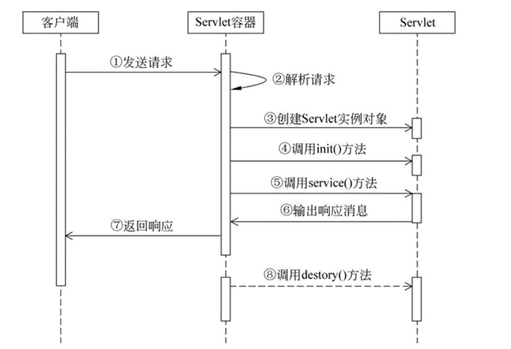

 

ServletConfig 是一个和 Servlet 配置相关的接口:

在配置 Spring MVC 的 DispatcherServlet 时，会通过 ServletConfig 将配置文件的位置告知 DispatcherServlet。

例：

```
<servlet>
    <servlet-name>dispatcher</servlet-name>
    <servlet-class>org.springframework.web.servlet.DispatcherServlet</servlet-class>
    <init-param>
        <param-name>contextConfigLocation</param-name>
        <param-value>classpath:springmvc.xml</param-value>
    </init-param>
</servlet>
```

如上，标签内的配置信息最终会被放入 ServletConfig 实现类对象中。DispatcherServlet 通过 ServletConfig 接口中的方法，就能获取到 contextConfigLocation 对应的值。

 

### DispatcherServlet 类图

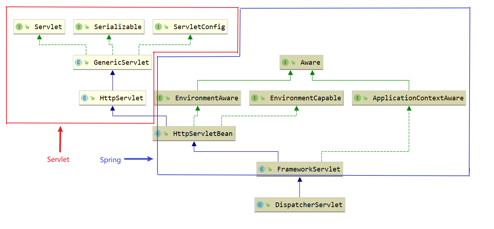

红色框是 Servlet 中的接口和类，蓝色框中则是 Spring 中的接口和类

 

 

### SpringMVC源码环境构建

基于Gradle新建Module（构建web工程，勾选Java & Web）


 

填写包信息

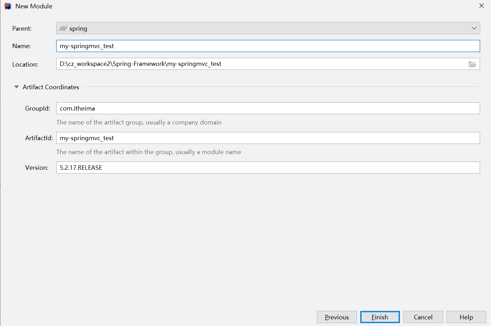

 

 

工程缺少web.xml

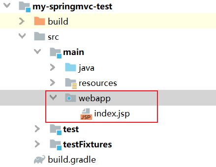

 

生成web.xml


  

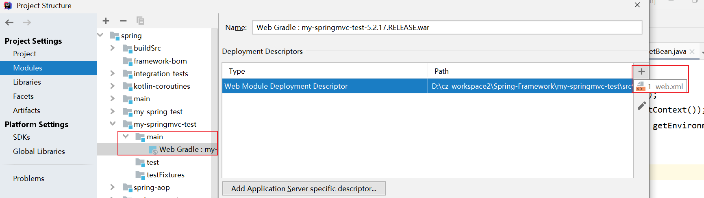

 

生成web.xml到webapp目录下

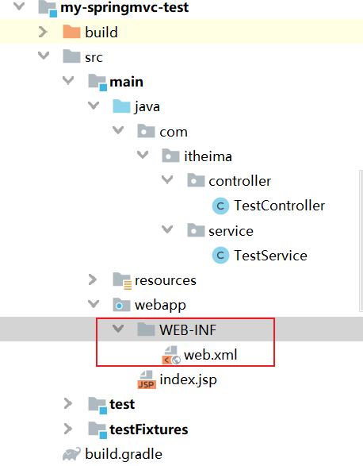

 

build.gradle

```
plugins {
    id 'java'
    id 'war'

}

group 'com.itheima'
version '5.2.17.RELEASE'

sourceCompatibility = 1.8

repositories {
    mavenCentral()
}

// tomcat: 以下配置会在第一次启动时下载插件二进制文件
//在项目根目录中执行gradle tomcatRun

// 配置阿里源
allprojects {
    repositories {
        maven{ url 'http://maven.aliyun.com/nexus/content/groups/public/'}
    }
}

dependencies {
    compile(project(':spring-context'))
    compile(project(':spring-aop'))
    compile(project(':spring-webmvc'))
    compile(project(':spring-web'))
    compile(project(':spring-test'))
    compile 'org.aspectj:aspectjweaver:1.9.2'
    testCompile group: 'junit', name: 'junit', version: '4.12'
}


// UTF-8
tasks.withType(JavaCompile) {
    options.encoding = "UTF-8"
}

```

 

创建TestService

```java
package com.itheima.service;

import org.springframework.stereotype.Service;

@Service
public class TestService {

    public void testService(){
        System.out.println("testService");
    }

}
```

 

创建TestController

```java
@Controller
@RequestMapping("/test")
public class TestController {

    @Autowired
    private TestService testService;

    @RequestMapping("/handle01")
    public String handle01(Integer id, String name, Model model){

        // 1.调用service方法
        testService.testService();
        System.out.println(id);
        System.out.println(name);

        // 2.model中存值
        model.addAttribute("name","子慕");
        return "success";
    }

}
```

 

success.jsp

```jsp
<%--
  Created by IntelliJ IDEA.
  User: Eric
  Date: 2021/10/28
  Time: 10:38
  To change this template use File | Settings | File Templates.
--%>
<%@ page contentType="text/html;charset=UTF-8" language="java" %>
<html>
  <head>
    <title>$Title$</title>
  </head>
  <body>
    SpringMVC 源码环境构建成功..
    授课老师: ${userName}
  </body>
</html>
```

 

applicationContext.xml

```xml
<beans xmlns="http://www.springframework.org/schema/beans"
       xmlns:mvc="http://www.springframework.org/schema/mvc"
       xmlns:context="http://www.springframework.org/schema/context"
       xmlns:xsi="http://www.w3.org/2001/XMLSchema-instance"
       xsi:schemaLocation="
        http://www.springframework.org/schema/beans
        http://www.springframework.org/schema/beans/spring-beans.xsd
        http://www.springframework.org/schema/mvc
        http://www.springframework.org/schema/mvc/spring-mvc.xsd
        http://www.springframework.org/schema/context
        http://www.springframework.org/schema/context/spring-context.xsd">

    <!-- 开启注解扫描 -->
    <context:component-scan base-package="com.itheima.service"/>

</beans>
```

 

spring-mvc.xml

```xml
<beans xmlns="http://www.springframework.org/schema/beans"
       xmlns:mvc="http://www.springframework.org/schema/mvc"
       xmlns:context="http://www.springframework.org/schema/context"
       xmlns:xsi="http://www.w3.org/2001/XMLSchema-instance"
       xsi:schemaLocation="
        http://www.springframework.org/schema/beans
        http://www.springframework.org/schema/beans/spring-beans.xsd
        http://www.springframework.org/schema/mvc
        http://www.springframework.org/schema/mvc/spring-mvc.xsd
        http://www.springframework.org/schema/context
        http://www.springframework.org/schema/context/spring-context.xsd">

    <!-- 开启注解扫描 -->
    <context:component-scan base-package="com.itheima.controller"/>

    <!-- 视图解析器对象 -->
    <bean id="internalResourceViewResolver" class="org.springframework.web.servlet.view.InternalResourceViewResolver">
        
        <property name = "prefix" value="/WEB-INF/pages/"></property
        <property name="suffix" value=".jsp"/>
    </bean>

    <!-- 开启SpringMVC框架注解的支持 -->
    <mvc:annotation-driven/>

    <!--静态资源(js、image等)的访问-->
    <mvc:default-servlet-handler/>

</beans>
```

 

webapp/WEB-INF/web.xml

```xml
<?xml version="1.0" encoding="UTF-8"?>
<web-app xmlns="http://xmlns.jcp.org/xml/ns/javaee"
         xmlns:xsi="http://www.w3.org/2001/XMLSchema-instance"
         xsi:schemaLocation="http://xmlns.jcp.org/xml/ns/javaee http://xmlns.jcp.org/xml/ns/javaee/web-app_4_0.xsd"
         version="4.0">

    <!--spring监听器-->
    <context-param>
        <param-name>contextConfigLocation</param-name>
        <param-value>classpath:applicationContext.xml</param-value>
    </context-param>

    <listener>
        <listener-class>org.springframework.web.context.ContextLoaderListener</listener-class>
    </listener>


    <!--springmvc前端控制器-->
    <servlet>
        <servlet-name>dispatcherServlet</servlet-name>
        <servlet-class>org.springframework.web.servlet.DispatcherServlet</servlet-class>
        <init-param>
            <param-name>contextConfigLocation</param-name>
            <param-value>classpath:spring-mvc.xml</param-value>
        </init-param>
        <!--该servelt随容器启动实例化-->
        <load-on-startup>2</load-on-startup>
    </servlet>

    <servlet-mapping>
        <servlet-name>dispatcherServlet</servlet-name>
        <url-pattern>/test/hello</url-pattern>
    </servlet-mapping>

</web-app>
```

 

部署到Tomcat，发布项目


 

访问：


 

 

### 源码剖析-根容器初始化【父容器】

#### Web应用部署初始化过程 (Web Application Deployement)

参考`Oracle`官方文档，可知Web应用部署的相关步骤如下：

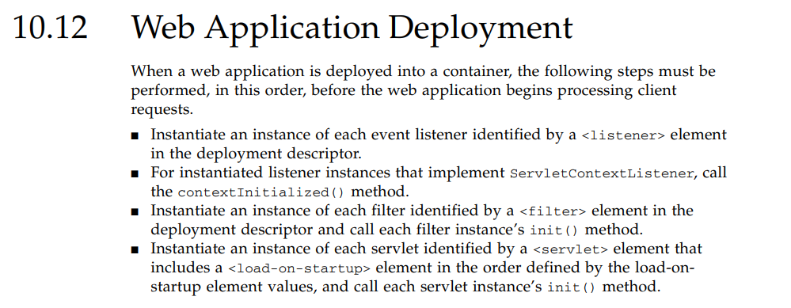

 

通过上述官方文档的描述，可绘制如下`Web应用部署初始化`流程执行图。

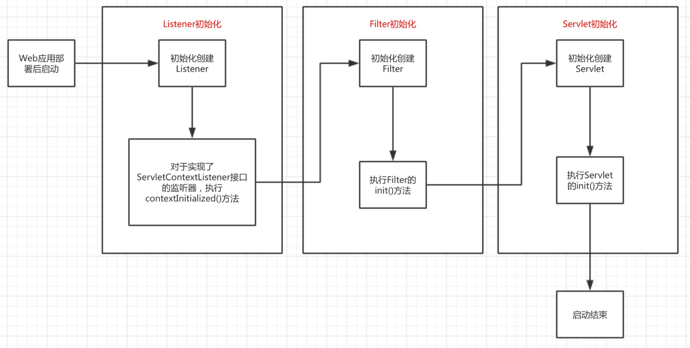

可以发现，在`tomcat`下`web应用`的初始化流程是，先初始化`listener`接着初始化`filter`最后初始化`servlet`，当我们清楚认识到`Web应用`部署到容器后的初始化过程后，就可以进一步深入探讨`SpringMVC`的启动过程。

 

`web.xml`配置进行`Spring MVC`启动过程的分析，`web.xml`配置内容如下:

```xml
<?xml version="1.0" encoding="UTF-8"?>
<web-app xmlns="http://xmlns.jcp.org/xml/ns/javaee"
         xmlns:xsi="http://www.w3.org/2001/XMLSchema-instance"
         xsi:schemaLocation="http://xmlns.jcp.org/xml/ns/javaee http://xmlns.jcp.org/xml/ns/javaee/web-app_4_0.xsd"
         version="4.0">

    <!--spring监听器-->
    <context-param>
        <param-name>contextConfigLocation</param-name>
        <param-value>classpath:applicationContext.xml</param-value>
    </context-param>

    <listener>
        <listener-class>org.springframework.web.context.ContextLoaderListener</listener-class>
    </listener>


    <!--springmvc前端控制器-->
    <servlet>
        <servlet-name>dispatcherServlet</servlet-name>
        <servlet-class>org.springframework.web.servlet.DispatcherServlet</servlet-class>
        <init-param>
            <param-name>contextConfigLocation</param-name>
            <param-value>classpath:spring-mvc.xml</param-value>
        </init-param>
        <!--该servelt随容器启动实例化-->
        <load-on-startup>2</load-on-startup>
    </servlet>

    <servlet-mapping>
        <servlet-name>dispatcherServlet</servlet-name>
        <url-pattern>/test/hello</url-pattern>
    </servlet-mapping>

</web-app>
```

 

#### ContextLoaderListener的初始化过程

首先定义了`<context-param>`标签，用于配置一个全局变量，`<context-param>`标签的内容读取后会被放进`application`中，做为Web应用的全局变量使用，接下来创建`listener`时会使用到这个全局变量，因此，Web应用在容器中部署后，进行初始化时会先读取这个全局变量，之后再进行上述讲解的初始化启动过程。

接着定义了一个`ContextLoaderListener类`的`listener`。查看`ContextLoaderListener`的类声明源码如下图:

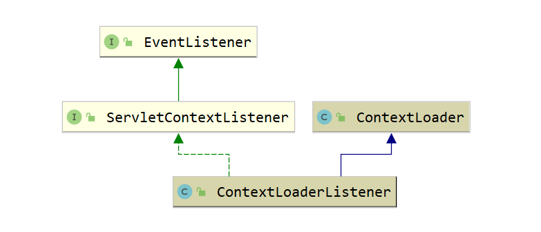

 

 

##### ServletContextListener接口源码：

```java
public interface ServletContextListener extends java.util.EventListener {
    
    void contextInitialized(javax.servlet.ServletContextEvent servletContextEvent);

    void contextDestroyed(javax.servlet.ServletContextEvent servletContextEvent);
}
```

该接口只有两个方法`contextInitialized`和`contextDestroyed`，这里采用的是观察者模式，也称为为订阅-发布模式，实现了该接口的`listener`会向发布者进行订阅，当`Web应用`初始化或销毁时会分别调用上述两个方法。

 

继续看`ContextLoaderListener`，该`listener`实现了`ServletContextListener`接口，因此在`Web应用`初始化时会调用该方法，该方法的具体实现如下：

```java
  /**
     * Initialize the root web application context.
     */
    @Override
    public void contextInitialized(ServletContextEvent event) {
        initWebApplicationContext(event.getServletContext());
    }
```

`ContextLoaderListener`的`contextInitialized()`方法直接调用了`initWebApplicationContext()`方法，这个方法是继承自`ContextLoader类`，通过函数名可以知道，该方法是用于初始化Web应用上下文，即`IoC容器`，这里使用的是代理模式，继续查看`ContextLoader类`的`initWebApplicationContext()`方法的源码如下:

##### 1. Web应用上下文环境创建简析

```java
public WebApplicationContext initWebApplicationContext(ServletContext servletContext) {
    if (servletContext.getAttribute(WebApplicationContext.ROOT_WEB_APPLICATION_CONTEXT_ATTRIBUTE) != null) {
        throw new IllegalStateException(
                "Cannot initialize context because there is already a root application context present - " +
                "check whether you have multiple ContextLoader* definitions in your web.xml!");
    }

    servletContext.log("Initializing Spring root WebApplicationContext");
    Log logger = LogFactory.getLog(ContextLoader.class);
    if (logger.isInfoEnabled()) {
        logger.info("Root WebApplicationContext: initialization started");
    }
    long startTime = System.currentTimeMillis();

    try {
        // 将上下文存储在本地实例变量中，以确保它在ServletContext关闭时可用。
        // Store context in local instance variable, to guarantee that it is available on ServletContext shutdown.
        if (this.context == null) {
            // 1.创建web应用上线文环境
            this.context = createWebApplicationContext(servletContext);
        }
        if (this.context instanceof ConfigurableWebApplicationContext) {
            ConfigurableWebApplicationContext cwac = (ConfigurableWebApplicationContext) this.context;
            // 如果当前上下文环境未激活，那么其只能提供例如设置父上下文、设置上下文id等功能
            if (!cwac.isActive()) {
                // The context has not yet been refreshed -> provide services such as
                // setting the parent context, setting the application context id, etc
                if (cwac.getParent() == null) {
                    // The context instance was injected without an explicit parent ->
                    // determine parent for root web application context, if any.
                    ApplicationContext parent = loadParentContext(servletContext);
                    cwac.setParent(parent);
                }
                // 2.配置并刷新当前上下文环境
                configureAndRefreshWebApplicationContext(cwac, servletContext);
            }
        }

        // 将当前上下文环境存储到ROOT_WEB_APPLICATION_CONTEXT_ATTRIBUTE变量中
        servletContext.setAttribute(WebApplicationContext.ROOT_WEB_APPLICATION_CONTEXT_ATTRIBUTE, this.context);

        ClassLoader ccl = Thread.currentThread().getContextClassLoader();
        if (ccl == ContextLoader.class.getClassLoader()) {
            currentContext = this.context;
        }
        else if (ccl != null) {
            currentContextPerThread.put(ccl, this.context);
        }

        if (logger.isInfoEnabled()) {
            long elapsedTime = System.currentTimeMillis() - startTime;
            logger.info("Root WebApplicationContext initialized in " + elapsedTime + " ms");
        }

        return this.context;
    }
    catch (RuntimeException | Error ex) {
        logger.error("Context initialization failed", ex);
        servletContext.setAttribute(WebApplicationContext.ROOT_WEB_APPLICATION_CONTEXT_ATTRIBUTE, ex);
        throw ex;
    }
}

```

##### 2. 创建web应用上线文环境

```java
/**
 * 为当前类加载器实例化根WebApplicationContext,可以是默认上线文加载类或者自定义上线文加载类
 */
protected WebApplicationContext createWebApplicationContext(ServletContext sc) {
    // 1.确定实例化WebApplicationContext所需的类
    Class<?> contextClass = determineContextClass(sc);
    if (!ConfigurableWebApplicationContext.class.isAssignableFrom(contextClass)) {
        throw new ApplicationContextException("Custom context class [" + contextClass.getName() +
                "] is not of type [" + ConfigurableWebApplicationContext.class.getName() + "]");
    }
    // 2.实例化得到的WebApplicationContext类
    return (ConfigurableWebApplicationContext) BeanUtils.instantiateClass(contextClass);
}
```

逻辑很简单，得到一个类，将其实例化。

那么要得到或者明确哪个类呢？ 继续看代码：

```java
/**
 * 返回WebApplicationContext（web应用上线文环境）实现类
 * 如果没有自定义默认返回XmlWebApplicationContext类
 *
 * 两种方式：
 * 1。非自定义：通过ContextLoader类的静态代码块加载ContextLoader.properties配置文件并解析，该配置文件中的默认类即XmlWebApplicationContext
 * 2。自定义： 通过在web.xml文件中，配置context-param节点，并配置param-name为contextClass的自己点，如
 *      <context-param>
 *          <param-name>contextClass</param-name>
 *          <param-value>org.springframework.web.context.support.MyWebApplicationContext</param-value>
 *      </context-param>
 *
 * Return the WebApplicationContext implementation class to use, either the
 * default XmlWebApplicationContext or a custom context class if specified.
 * @param servletContext current servlet context
 * @return the WebApplicationContext implementation class to use
 * @see #CONTEXT_CLASS_PARAM
 * @see org.springframework.web.context.support.XmlWebApplicationContext
 */
protected Class<?> determineContextClass(ServletContext servletContext) {
    String contextClassName = servletContext.getInitParameter(CONTEXT_CLASS_PARAM);
    // 1.自定义
    if (contextClassName != null) {
        try {
            return ClassUtils.forName(contextClassName, ClassUtils.getDefaultClassLoader());
        }
        catch (ClassNotFoundException ex) {
            throw new ApplicationContextException("Failed to load custom context class [" + contextClassName + "]", ex);
        }
    }
    // 2.默认
    else {
        // 根据静态代码块的加载这里 contextClassName = XmlWebApplicationContext
        contextClassName = defaultStrategies.getProperty(WebApplicationContext.class.getName());
        try {
            return ClassUtils.forName(contextClassName, ContextLoader.class.getClassLoader());
        }
        catch (ClassNotFoundException ex) {
            throw new ApplicationContextException("Failed to load default context class [" + contextClassName + "]", ex);
        }
    }
}
```

自定义方式注释里已经写的很清晰了，我们来看默认方式，这里涉及到了一个静态变量defaultStrategies，并在下面的静态代码块中对其进行了初始化操作：

```java
private static final String DEFAULT_STRATEGIES_PATH = "ContextLoader.properties";

private static final Properties defaultStrategies;

/**
 * 静态代码加载默认策略,即默认的web应用上下文
 * DEFAULT_STRATEGIES_PATH --> ContextLoader.properties
 *
 * org.springframework.web.context.WebApplicationContext=org.springframework.web.context.support.XmlWebApplicationContext
 */
static {
    // Load default strategy implementations from properties file.
    // This is currently strictly internal and not meant to be customized by application developers.
    try {
        ClassPathResource resource = new ClassPathResource(DEFAULT_STRATEGIES_PATH, ContextLoader.class);
        defaultStrategies = PropertiesLoaderUtils.loadProperties(resource);
    }
    catch (IOException ex) {
        throw new IllegalStateException("Could not load 'ContextLoader.properties': " + ex.getMessage());
    }
}
```

这段代码对ContextLoader.properties进行了解析，那么ContextLoader.properties中存储的内容是什么呢？

```properties
# Default WebApplicationContext implementation class for ContextLoader.
# Used as fallback when no explicit context implementation has been specified as context-param.
# Not meant to be customized by application developers.

org.springframework.web.context.WebApplicationContext=org.springframework.web.context.support.XmlWebApplicationContext
```

很简单，通过上面的操作，我们就可以确定contextClassName是XmlWebApplicationContext，跟我们之前分析的ApplicationContext差不多，只是在其基础上又提供了对web的支持。接下来通过BeanUtils.instantiateClass(contextClass)将其实例化即可。

`initWebApplicationContext()`方法如上注解讲述，主要目的就是创建`root WebApplicationContext对象`即`根IoC容器`，其中比较重要的就是，整个`Web应用`如果存在`根IoC容器`则有且只能有一个，`根IoC容器`作为全局变量存储在`ServletContext`即`application对象`中。将`根IoC容器`放入到`application对象`之前进行了`IoC容器`的配置和刷新操作，调用了`configureAndRefreshWebApplicationContext()`方法，该方法源码如下:

 

##### configureAndRefreshWebApplicationContext();

```java
/**
 * 配置并刷新当前web应用上下文
 */
protected void configureAndRefreshWebApplicationContext(ConfigurableWebApplicationContext wac, ServletContext sc) {
    /**
     * 1.配置应用程序上下文id
     * 如果当前应用程序上下文id仍然设置为其原始默认值,则尝试为其设置自定义上下文id，如果有的话。
     * 在web.xml中配置
     * <context-param>
     *      <param-name>contextId</param-name>
     *      <param-value>jack-2019-01-02</param-value>
     *  </context-param>
     */
    if (ObjectUtils.identityToString(wac).equals(wac.getId())) {
        String idParam = sc.getInitParameter(CONTEXT_ID_PARAM);
        if (idParam != null) {
            wac.setId(idParam);
        }
        // 无自定义id则为其生成默认id
        else {
            wac.setId(ConfigurableWebApplicationContext.APPLICATION_CONTEXT_ID_PREFIX +
                    ObjectUtils.getDisplayString(sc.getContextPath()));
        }
    }

    wac.setServletContext(sc);

    /**
     * 2.设置配置文件路径，如
     * <context-param>
     *      <param-name>contextConfigLocation</param-name>
     *      <param-value>classpath:spring-context.xml</param-value>
     *  </context-param>
     */
    String configLocationParam = sc.getInitParameter(CONFIG_LOCATION_PARAM);
    if (configLocationParam != null) {
        wac.setConfigLocation(configLocationParam);
    }

    // The wac environment's #initPropertySources will be called in any case when the context
    // is refreshed; do it eagerly here to ensure servlet property sources are in place for
    // use in any post-processing or initialization that occurs below prior to #refresh
    // 3.创建ConfigurableEnvironment并配置初始化参数
    ConfigurableEnvironment env = wac.getEnvironment();
    if (env instanceof ConfigurableWebEnvironment) {
        ((ConfigurableWebEnvironment) env).initPropertySources(sc, null);
    }

    // 4.自定义配置上下文环境
    customizeContext(sc, wac);

    // 5.刷新上下文环境
    wac.refresh();
}

```

比较重要的就是获取到了`web.xml`中的`<context-param>标签`配置的全局变量`contextConfigLocation`，并最后一行调用了`refresh()`方法，`ConfigurableWebApplicationContext`是一个接口，通过对常用实现类`ClassPathXmlApplicationContext`逐层查找后可以找到一个抽象类`AbstractApplicationContext`实现了`refresh()`方法

 

##### refresh();

```java
public void refresh() throws BeansException, IllegalStateException {
    synchronized (this.startupShutdownMonitor) {
        // 1、准备刷新上下文环境
        prepareRefresh();
        // 2、读取xml并初始化BeanFactory
        ConfigurableListableBeanFactory beanFactory = obtainFreshBeanFactory();
        // 3、填充BeanFactory功能
        prepareBeanFactory(beanFactory);
        try {
            // 4、子类覆盖方法额外处理(空方法)
            postProcessBeanFactory(beanFactory);
            // 5、调用BeanFactoryPostProcessor
            invokeBeanFactoryPostProcessors(beanFactory);
            // 6、注册BeanPostProcessors
            registerBeanPostProcessors(beanFactory);
            // 7、初始化Message资源
            initMessageSource();
            // 8、初始事件广播器
            initApplicationEventMulticaster();
            // 9、留给子类初始化其他Bean(空的模板方法)
            onRefresh();
            // 10、注册事件监听器
            registerListeners();
            // 11、初始化其他的单例Bean(非延迟加载的)
            finishBeanFactoryInitialization(beanFactory);
            // 12、完成刷新过程,通知生命周期处理器lifecycleProcessor刷新过程,同时发出ContextRefreshEvent通知
            finishRefresh();
        }
        catch (BeansException ex) {
            // 13、销毁已经创建的Bean
            destroyBeans();
            // 14、重置容器激活标签
            cancelRefresh(ex);
            throw ex;
        }
        finally {
            resetCommonCaches();
        }
    }
}

```

该方法主要用于创建并初始化`contextConfigLocation类`配置的`xml文件`中的`Bean`，因此，如果我们在配置`Bean`时出错，在`Web应用`启动时就会抛出异常，而不是等到运行时才抛出异常。

 

整个`ContextLoaderListener类`的启动过程到此就结束了，可以发现，创建`ContextLoaderListener`是比较核心的一个步骤，主要工作就是为了创建`根IoC容器`并使用特定的`key`将其放入到`application`对象中，供整个`Web应用`使用，由于在`ContextLoaderListener类`中构造的`根IoC容器`配置的`Bean`是全局共享的，因此，在`<context-param>`标识的`contextConfigLocation`的`xml配置文件`一般包括:`数据库DataSource`、`DAO层`、`Service层`、`事务`等相关`Bean`。

 

 

 

### 源码剖析-DispatcherServlet初始化【子容器&9大组件】

#### 1.DispatcherServlet类图

`Web应用`启动的最后一个步骤就是创建和初始化相关`Servlet`，我们配置了`DispatcherServlet类`前端控制器，前端控制器作为中央控制器是整个`Web应用`的核心，用于获取分发用户请求并返回响应。

其类图如下所示：

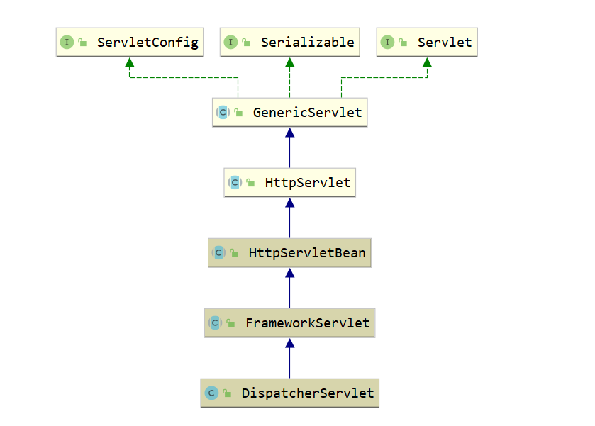

通过类图可以看出`DispatcherServlet类`的间接父类实现了`Servlet接口`，因此其本质上依旧是一个`Servlet`

 

#### 2.HttpServletBean初始化

`DispatcherServelt`类的本质是`Servlet`，所以在`Web应用`部署到容器后进行`Servlet`初始化时会调用相关的`init(ServletConfig)`方法，因此，`DispatchServlet类`的初始化过程也由该方法开始：

(注意：`DispatcherServelt` 没有init方法，会走到父类`HttpServletBean`的init方法)

```java
/**
 * DispatcherServlet 初始化入口
 * Map config parameters onto bean properties of this servlet, and
 * invoke subclass initialization.
 * @throws ServletException if bean properties are invalid (or required
 * properties are missing), or if subclass initialization fails.
 */
@Override
public final void init() throws ServletException {

    // Set bean properties from init parameters.
    /**
     * 1.加载初始化参数，如：
     * <servlet>
     *      <servlet-name>example</servlet-name>
     *      <servlet-class>org.springframework.web.servlet.DispatcherServlet</servlet-class>
     *      <init-param>
     *          <param-name>name</param-name>
     *          <param-value>jack</param-value>
     *      </init-param>
     *      <load-on-startup>1</load-on-startup>
     *  </servlet>
     *  这里会解析init-param列表。
     */
    PropertyValues pvs = new ServletConfigPropertyValues(getServletConfig(), this.requiredProperties);
    if (!pvs.isEmpty()) {
        try {
            BeanWrapper bw = PropertyAccessorFactory.forBeanPropertyAccess(this);
            ResourceLoader resourceLoader = new ServletContextResourceLoader(getServletContext());
            bw.registerCustomEditor(Resource.class, new ResourceEditor(resourceLoader, getEnvironment()));
            initBeanWrapper(bw);
            bw.setPropertyValues(pvs, true);
        }
        catch (BeansException ex) {
            if (logger.isErrorEnabled()) {
                logger.error("Failed to set bean properties on servlet '" + getServletName() + "'", ex);
            }
            throw ex;
        }
    }

    // Let subclasses do whatever initialization they like.
    // 2.留给子类覆盖的模板方法
    initServletBean();
}

```

该方法最主要的作用就是初始化init-param，如果我们没有配置任何init-param，那么该方法不会执行任何操作。从这里我们没有拿到有用的信息，但是在该方法结尾有initServletBean()，这是一个模板方法，可以由子类来实现，那么接下来我们就去看其子类FrameworkServlet中的initServletBean

 

#### 3.FrameworkServlet初始化

继续查看 initServletBean()。父类 FrameworkServlet 覆盖了 HttpServletBean 中的 initServletBean 函数，如下：

```java
protected void initServletBean() throws ServletException {
}
protected final void initServletBean() throws ServletException {
    getServletContext().log("Initializing Spring " + getClass().getSimpleName() + " '" + getServletName() + "'");
    if (logger.isInfoEnabled()) {
        logger.info("Initializing Servlet '" + getServletName() + "'");
    }
    long startTime = System.currentTimeMillis();

    try {
        // 为当前servlet初始化web应用上下文
        this.webApplicationContext = initWebApplicationContext();
        // 空的模板方法
        initFrameworkServlet();
    }
    catch (ServletException | RuntimeException ex) {
        logger.error("Context initialization failed", ex);
        throw ex;
    }

    if (logger.isDebugEnabled()) {
        String value = this.enableLoggingRequestDetails ?
                "shown which may lead to unsafe logging of potentially sensitive data" :
                "masked to prevent unsafe logging of potentially sensitive data";
        logger.debug("enableLoggingRequestDetails='" + this.enableLoggingRequestDetails +
                "': request parameters and headers will be " + value);
    }

    if (logger.isInfoEnabled()) {
        logger.info("Completed initialization in " + (System.currentTimeMillis() - startTime) + " ms");
    }
}

protected WebApplicationContext initWebApplicationContext() {
    // 获取rootContext，该Context就是通过ContextLoaderListener创建的XmlWebApplicationContext
    WebApplicationContext rootContext = WebApplicationContextUtils.getWebApplicationContext(getServletContext());
    WebApplicationContext wac = null;

    // 如果当前webApplicationContext不为null，则为其设置父容器
    if (this.webApplicationContext != null) {
        // A context instance was injected at construction time -> use it
        wac = this.webApplicationContext;
        if (wac instanceof ConfigurableWebApplicationContext) {
            ConfigurableWebApplicationContext cwac = (ConfigurableWebApplicationContext) wac;
            if (!cwac.isActive()) {
                // The context has not yet been refreshed -> provide services such as
                // setting the parent context, setting the application context id, etc
                if (cwac.getParent() == null) {
                    // The context instance was injected without an explicit parent -> set
                    // the root application context (if any; may be null) as the parent
                    cwac.setParent(rootContext);
                }
                configureAndRefreshWebApplicationContext(cwac);
            }
        }
    }
    // 未能通过构造函数注入，则尝试去ServletContext容器中查找有无WebApplicationContext
    if (wac == null) {
        // No context instance was injected at construction time -> see if one
        // has been registered in the servlet context. If one exists, it is assumed
        // that the parent context (if any) has already been set and that the
        // user has performed any initialization such as setting the context id
        wac = findWebApplicationContext();
    }
    // 以上均无WebApplicationContext，则创建一个新的WebApplicationContext
    if (wac == null) {
        // No context instance is defined for this servlet -> create a local one
        wac = createWebApplicationContext(rootContext);
    }

    // 刷新上下文容器，空的模板方法，留给子类实现
    if (!this.refreshEventReceived) {
        // Either the context is not a ConfigurableApplicationContext with refresh
        // support or the context injected at construction time had already been
        // refreshed -> trigger initial onRefresh manually here.
        onRefresh(wac);
    }

    if (this.publishContext) {
        // Publish the context as a servlet context attribute.
        String attrName = getServletContextAttributeName();
        getServletContext().setAttribute(attrName, wac);
    }

    return wac;
}
```

通过函数名不难发现，该方法的主要作用同样是创建一个WebApplicationContext对象，即Ioc容器，不过前面讲过每个Web应用最多只能存在一个根IoC容器，这里创建的则是特定Servlet拥有的子IoC容器

 

**为什么需要多个IOC容器呢？**

答：父子容器类似于类的继承关系，子类可以访问父类中的成员变量，而父类不可访问子类的成员变量，同样的，子容器可以访问父容器中定义的Bean，但父容器无法访问子容器定义的Bean。

根IoC容器做为全局共享的IoC容器放入Web应用需要共享的Bean，而子IoC容器根据需求的不同，放入不同的Bean，这样能够做到隔离，保证系统的安全性。

**DispatcherServlet**类的子IoC容器创建过程，如果当前Servlet存在一个IoC容器则为其设置根IoC容器作为其父类，并配置刷新该容器，用于构造其定义的Bean，这里的方法与前文讲述的根IoC容器类似，同样会读取用户在web.xml中配置的中的值，用于查找相关的xml配置文件用于构造定义的Bean，这里不再赘述了。如果当前Servlet不存在一个子IoC容器就去查找一个，如果仍然没有查找到则调用 createWebApplicationContext()方法去创建一个，查看该方法的源码如下图所示:

```java
protected WebApplicationContext createWebApplicationContext(@Nullable WebApplicationContext parent) {
    return createWebApplicationContext((ApplicationContext) parent);
}


protected WebApplicationContext createWebApplicationContext(@Nullable ApplicationContext parent) {
    Class<?> contextClass = getContextClass();
    if (!ConfigurableWebApplicationContext.class.isAssignableFrom(contextClass)) {
        throw new ApplicationContextException(
                "Fatal initialization error in servlet with name '" + getServletName() +
                "': custom WebApplicationContext class [" + contextClass.getName() +
                "] is not of type ConfigurableWebApplicationContext");
    }
    ConfigurableWebApplicationContext wac = (ConfigurableWebApplicationContext) BeanUtils.instantiateClass(contextClass);

    wac.setEnvironment(getEnvironment());
    wac.setParent(parent);
    String configLocation = getContextConfigLocation();
    if (configLocation != null) {
        wac.setConfigLocation(configLocation);
    }
    configureAndRefreshWebApplicationContext(wac);

    return wac;
}

```

该方法用于创建一个子IoC容器并将根IoC容器做为其父容器，接着进行配置和刷新操作用于构造相关的Bean。至此，根IoC容器以及相关Servlet的子IoC容器已经配置完成，子容器中管理的Bean一般只被该Servlet使用，因此，其中管理的Bean一般是“局部”的，如SpringMVC中需要的各种重要组件，包括Controller、Interceptor、Converter、ExceptionResolver等。相关关系如下图所示:

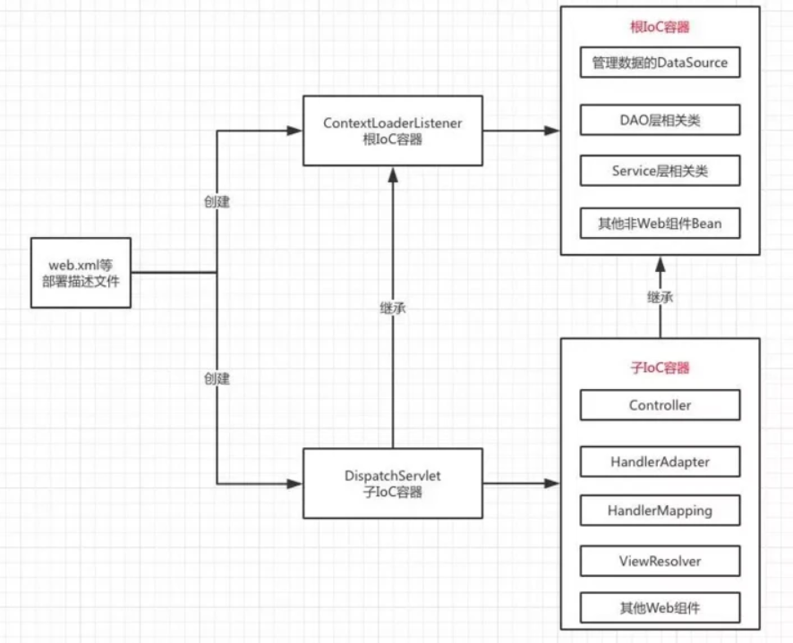

 

 

#### 4.DispatcherServlet初始化

了解DispatcherServlet之前，先回顾一下DispatcherServlet的内置组件及其作用。


 

#### DispatcherServlet#onRefresh();

当IoC子容器构造完成后调用了onRefresh()方法，该方法的调用与initServletBean()方法的调用相同，由父类调用但具体实现由子类覆盖，调用onRefresh()方法时将前文创建的IoC子容器作为参数传入，查看DispatcherServletBean类的onRefresh()方法源码如下:

```java
@Override
    protected void onRefresh(ApplicationContext context) {
        initStrategies(context);
    }

    protected void initStrategies(ApplicationContext context) {
        // 1.初始化 MultipartResolver
        initMultipartResolver(context);
        // 2.初始化 LocaleResolver
        initLocaleResolver(context);
        // 3.初始化 ThemeResolver
        initThemeResolver(context);
        // 4.初始化 HandlerMappings
        initHandlerMappings(context);
        // 5.初始化 HandlerAdapters
        initHandlerAdapters(context);
        // 6.初始化 HandlerExceptionResolver
        initHandlerExceptionResolvers(context);
        // 7.初始化 RequestToViewNameTranslator
        initRequestToViewNameTranslator(context);
        // 8.初始化 ViewResolvers
        initViewResolvers(context);
        // 9.初始化 FlashMapManager
        initFlashMapManager(context);
    }
```

`onRefresh()`方法直接调用了`initStrategies()`方法，源码如上，通过函数名可以判断，该方法用于初始化创建`multipartResovle`来支持图片等文件的上传、本地化解析器、主题解析器、`HandlerMapping`处理器映射器、`HandlerAdapter`处理器适配器、异常解析器、视图解析器、flashMap管理器等，这些组件都是`SpringMVC`开发中的重要组件，相关组件的初始化创建过程均在此完成。

 

#### 重点：initHandlerMappings

**Handler** ： 绑定了注解@RequestMapping和@Controller的类

**HandlerMethod**：就是Handler下某个绑定@RequestMapping注解的方法（GetMapping、PostMapping...等都绑定的有注解@RequestMapping，spring mvc在做注解解析处理生成代理对象等的时候，会做值的合并等处理，所以最终都是用RequestMapping的注解来计算，所以@Controller和@RestController的处理等同）

```java
    private void initHandlerMappings(ApplicationContext context) {
        // 初始化记录 HandlerMapping 对象的属性变量为null
        this.handlerMappings = null;

        // 根据属性detectAllHandlerMappings决定是检测所有的 HandlerMapping 对象，还是
        // 使用指定名称的 HandlerMapping 对象
        if (this.detectAllHandlerMappings) {
            // Find all HandlerMappings in the ApplicationContext, including ancestor contexts.
            // 从容器及其祖先容器查找所有类型为 HandlerMapping 的 HandlerMapping 对象，记录到   handlerMappings 并排序
            Map<String, HandlerMapping> matchingBeans =
                    BeanFactoryUtils.beansOfTypeIncludingAncestors(context, HandlerMapping.class, true, false);
            if (!matchingBeans.isEmpty()) {
                this.handlerMappings = new ArrayList<>(matchingBeans.values());
                // We keep HandlerMappings in sorted order.
                // We keep HandlerMappings in sorted order.
                // 排序，关于这里的排序，可以参考   WebMvcConfigurationSupport 类中对各种 HandlerMapping bean
                // 进行定义时所使用的 order 属性，顺序属性很关键，因为它涉及到 HandlerMapping 使用时的优先级
                AnnotationAwareOrderComparator.sort(this.handlerMappings);
            }
        }
        else {
            try {
                // 获取名称为  handlerMapping 的 HandlerMapping bean 并记录到 handlerMappings
                HandlerMapping hm = context.getBean(HANDLER_MAPPING_BEAN_NAME, HandlerMapping.class);
                this.handlerMappings = Collections.singletonList(hm);
            }
            catch (NoSuchBeanDefinitionException ex) {
                // Ignore, we'll add a default HandlerMapping later.
            }
        }

        // Ensure we have at least one HandlerMapping, by registering
        // a default HandlerMapping if no other mappings are found.
        if (this.handlerMappings == null) {
            // 如果上面步骤从容器获取 HandlerMapping 失败，则使用缺省策略创建 HandlerMapping 对象记录到
            // handlerMappings
            this.handlerMappings = getDefaultStrategies(context, HandlerMapping.class);
            if (logger.isTraceEnabled()) {
                logger.trace("No HandlerMappings declared for servlet '" + getServletName() +
                        "': using default strategies from DispatcherServlet.properties");
            }
        }
    }
```


##### RequestMappingHandlerMapping

这个就是我们常见的基于注解的映射方式，例如：

```java
@Controller
@RequestMapping("/testA")
public class MappingTest1 {
    @ResponseBody
    @RequestMapping("/index")
    public String index(){
        return "RequestMappingHandlerMapping test!";
    }
}
```

springboot在初始化RequestMappingHandlerMapping时，会扫描容器中的bean，判断它上面是否存在@Controller或@RequestMapping两种注解，通过上面的方法，判断该bean是否是一个handler，如果是，则会将其注册到RequestMappingHandlerMapping,用来处理和它匹配的请求

 

##### SimpleUrlHandlerMapping

这种方式直接通过简单的url匹配的方式将其映射到一个处理器。首先像容器注册一个自定义的`SimpleUrlHandlerMapping`

```java
@Configuration
public class MyConfig extends SimpleUrlHandlerMapping{

    @Bean
    public SimpleUrlHandlerMapping simpleUrlHandlerMapping(){

        SimpleUrlHandlerMapping simpleUrlHandlerMapping = new SimpleUrlHandlerMapping();
        Properties properties = new Properties();
        properties.setProperty("simpleUrl","mappingTest2");
        simpleUrlHandlerMapping.setMappings(properties);
        
        //设置该handlermapping的优先级为1，否则会被默认的覆盖，导致访问无效
        simpleUrlHandlerMapping.setOrder(1);
        
        return simpleUrlHandlerMapping;
    }
}
```

定义一个名称为`mappingTest2`的`bean`，并实现`org.springframework.web.servlet.mvc.Controller`接口

```java
@Component("mappingTest2")
public class MappingTest2 implements Controller {

    @Override
    public ModelAndView handleRequest(HttpServletRequest request, HttpServletResponse response) throws Exception {
        response.getWriter().write("SimpleUrlHandlerMapping test!");
        return null;
    }
}
```

在这个例子中，我们访问`localhost/simpleUrl`就会直接进入容器中名称为`mappingTest2`的`bean`的`handleRequest`方法。

 

##### BeanNameUrlHandlerMapping

这个最简单:直接以`bean`的名称作为访问路径，但有个硬性条件就是`bean`的名称必须以`/`开始。

```java
@Component("/mappingTest3")
public class MappingTest3 implements Controller {
    @Override
    public ModelAndView handleRequest(HttpServletRequest request, HttpServletResponse response) throws Exception {
        response.getWriter().write("BeanNameUrlHandlerMapping test!");
        return null;
    }
}
```

 

##### HandlerMapping的实现原理

###### HandlerExecutionChain

HandlerMapping在SpringMVC扮演着相当重要的角色，它可以为HTTP请求找到 对应的Controller控制器


HandlerMapping是一个接口，其中包含一个getHandler方法，能够通过该方法获得与HTTP请求对应的handlerExecutionChain，而这个handlerExecutionChain对象中持有handler和interceptorList，以及和设置拦截器相关的方法。可以判断是同通过这些配置的拦截器对handler对象提供的功能进行了一波增强。

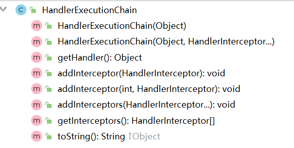

 

##### RequestMappingHandlerMapping#afterPropertiesSet

AbstractHandlerMethodMapping中当bean被注入到容器后会执行一系列的初始化过程

```java
    public void afterPropertiesSet() {
        // 创建 BuilderConfiguration
        this.config = new RequestMappingInfo.BuilderConfiguration();
        this.config.setUrlPathHelper(getUrlPathHelper());
        this.config.setPathMatcher(getPathMatcher());
        this.config.setSuffixPatternMatch(useSuffixPatternMatch());
        this.config.setTrailingSlashMatch(useTrailingSlashMatch());
        this.config.setRegisteredSuffixPatternMatch(useRegisteredSuffixPatternMatch());
        this.config.setContentNegotiationManager(getContentNegotiationManager());

        super.afterPropertiesSet();
    }
```

进行HandlerMethod的注册操作，简单来说就是从springMVC的容器中获取所有的beanName，注册url和实现方法HandlerMethod的对应关系。

```java
/**
     * Scan beans in the ApplicationContext, detect and register handler methods.
     * @see #isHandler(Class)
     * @see #getMappingForMethod(Method, Class)
     * @see #handlerMethodsInitialized(Map)
     AbstractHandlerMethodMapping
handlerMethod的注册操作
     */

    protected void initHandlerMethods() {
        if (logger.isDebugEnabled()) {
            logger.debug("Looking for request mappings in application context: " + getApplicationContext());
        }
        //从springMVC容器中获取所有的beanName
        String[] beanNames = (this.detectHandlerMethodsInAncestorContexts ?
                BeanFactoryUtils.beanNamesForTypeIncludingAncestors(getApplicationContext(), Object.class) :
                getApplicationContext().getBeanNamesForType(Object.class));
        
        //注册从容器中获取的beanName
        for (String beanName : beanNames) {
            if (!beanName.startsWith(SCOPED_TARGET_NAME_PREFIX)) {
                Class<?> beanType = null;
                try {
                    beanType = getApplicationContext().getType(beanName);
                }
                catch (Throwable ex) {
                    // An unresolvable bean type, probably from a lazy bean - let's ignore it.
                    if (logger.isDebugEnabled()) {
                        logger.debug("Could not resolve target class for bean with name '" + beanName + "'", ex);
                    }
                }
                if (beanType != null && isHandler(beanType)) {
                    detectHandlerMethods(beanName);
                }
            }
        }
        handlerMethodsInitialized(getHandlerMethods());
    }

```

根据beanName进行一系列的注册，最终实现是在registerHandlerMethod

```java
/**
     * Look for handler methods in a handler.
     * @param handler the bean name of a handler or a handler instance
     */
     AbstractHandlerMethodMapping
    protected void detectHandlerMethods(final Object handler) {
        获取bean实例
        Class<?> handlerType = (handler instanceof String ?
                getApplicationContext().getType((String) handler) : handler.getClass());
        final Class<?> userType = ClassUtils.getUserClass(handlerType);

        Map<Method, T> methods = MethodIntrospector.selectMethods(userType,
                创建RequestMappingInfo
                new MethodIntrospector.MetadataLookup<T>() {
                    @Override
                    public T inspect(Method method) {
                        try {
                            return getMappingForMethod(method, userType);
                        }
                        catch (Throwable ex) {
                            throw new IllegalStateException("Invalid mapping on handler class [" +
                                    userType.getName() + "]: " + method, ex);
                        }
                    }
                });

        if (logger.isDebugEnabled()) {
            logger.debug(methods.size() + " request handler methods found on " + userType + ": " + methods);
        }
        for (Map.Entry<Method, T> entry : methods.entrySet()) {
            Method invocableMethod = AopUtils.selectInvocableMethod(entry.getKey(), userType);
            T mapping = entry.getValue();
            registerHandlerMethod(handler, invocableMethod, mapping);
        }
    }

```

registerHandlerMethod的注册操作是将beanName，Method及创建的RequestMappingInfo之间的 关系。

```java
/**
     * Register a handler method and its unique mapping. Invoked at startup for
     * each detected handler method.
     * @param handler the bean name of the handler or the handler instance
     * @param method the method to register
     * @param mapping the mapping conditions associated with the handler method
     * @throws IllegalStateException if another method was already registered
     * under the same mapping
     */
     AbstractHandlerMethodMapping
     注册beanName和method及RequestMappingInfo之间的关系，RequestMappingInfo会保存url信息
    protected void registerHandlerMethod(Object handler, Method method, T mapping) {
        this.mappingRegistry.register(mapping, handler, method);
    }

```

getMappingForMethod方法是在子类RequestMappingHandlerMapping中实现的，具体实现就是创建一个RequestMappingInfo

```java
/**
     * Uses method and type-level @{@link RequestMapping} annotations to create
     * the RequestMappingInfo.
     * @return the created RequestMappingInfo, or {@code null} if the method
     * does not have a {@code @RequestMapping} annotation.
     * @see #getCustomMethodCondition(Method)
     * @see #getCustomTypeCondition(Class)
     */
     RequestMappingHandlerMapping
    @Override
    protected RequestMappingInfo getMappingForMethod(Method method, Class<?> handlerType) {
        RequestMappingInfo info = createRequestMappingInfo(method);
        if (info != null) {
            RequestMappingInfo typeInfo = createRequestMappingInfo(handlerType);
            if (typeInfo != null) {
                info = typeInfo.combine(info);
            }
        }
        return info;
    }
    /**
     * Delegates to {@link #createRequestMappingInfo(RequestMapping, RequestCondition)},
     * supplying the appropriate custom {@link RequestCondition} depending on whether
     * the supplied {@code annotatedElement} is a class or method.
     * @see #getCustomTypeCondition(Class)
     * @see #getCustomMethodCondition(Method)
     */
     RequestMappingHandlerMapping
    private RequestMappingInfo createRequestMappingInfo(AnnotatedElement element) {
        RequestMapping requestMapping = AnnotatedElementUtils.findMergedAnnotation(element, RequestMapping.class);
        RequestCondition<?> condition = (element instanceof Class ?
                getCustomTypeCondition((Class<?>) element) : getCustomMethodCondition((Method) element));
        return (requestMapping != null ? createRequestMappingInfo(requestMapping, condition) : null);
    }

```

这样就简单实现了将url和HandlerMethod的对应关系注册到mappingRegistry中。 MappingRegistry中的注册实现如下，并且MappingRegistry定义了几个map结构，用来存储注册信息

```java
AbstractHandlerMethodMapping
class MappingRegistry {

        private final Map<T, MappingRegistration<T>> registry = new HashMap<T, MappingRegistration<T>>();

        private final Map<T, HandlerMethod> mappingLookup = new LinkedHashMap<T, HandlerMethod>();

        private final MultiValueMap<String, T> urlLookup = new LinkedMultiValueMap<String, T>();

        private final Map<String, List<HandlerMethod>> nameLookup =
                new ConcurrentHashMap<String, List<HandlerMethod>>();

        private final Map<HandlerMethod, CorsConfiguration> corsLookup =
                new ConcurrentHashMap<HandlerMethod, CorsConfiguration>();

        private final ReentrantReadWriteLock readWriteLock = new ReentrantReadWriteLock();

```

完成beanName，HandlerMethod及RequestMappingInfo之间的对应关系注册。

```java
AbstractHandlerMethodMapping
public void register(T mapping, Object handler, Method method) {
            this.readWriteLock.writeLock().lock();
            try {
                HandlerMethod handlerMethod = createHandlerMethod(handler, method);
                assertUniqueMethodMapping(handlerMethod, mapping);

                if (logger.isInfoEnabled()) {
                    logger.info("Mapped \"" + mapping + "\" onto " + handlerMethod);
                }
                this.mappingLookup.put(mapping, handlerMethod);

                List<String> directUrls = getDirectUrls(mapping);
                for (String url : directUrls) {
                    this.urlLookup.add(url, mapping);
                }

                String name = null;
                if (getNamingStrategy() != null) {
                    name = getNamingStrategy().getName(handlerMethod, mapping);
                    addMappingName(name, handlerMethod);
                }

                CorsConfiguration corsConfig = initCorsConfiguration(handler, method, mapping);
                if (corsConfig != null) {
                    this.corsLookup.put(handlerMethod, corsConfig);
                }

                this.registry.put(mapping, new MappingRegistration<T>(mapping, handlerMethod, directUrls, name));
            }
            finally {
                this.readWriteLock.writeLock().unlock();
            }
        }

```

DispatcherServlet准备HandlerMapping的流程如下 :

从容器获取HandlerMapping对象;

当detectAllHandlerMappings为true时，从容器(以及祖先容器)获取所有类型为HandlerMapping的bean组件，记录到handlerMappings并排序; 当detectAllHandlerMappings为false时，从容器(以及祖先容器)获取名称为handlerMapping的bean组件，记录到handlerMappings，这种情况下handlerMappings中最多有一个元素; 如果上面步骤结束时handlerMappings为空则创建缺省HandlerMapping对象记录到handlerMappings;

1. HttpServletBean 主要做一些初始化的工作，将web.xml中配置的参数设置到Servlet中。比如servlet标签的子标签init-param标签中配置的参数。
2. FrameworkServlet 将Servlet与Spring容器上下文关联。其实也就是初始化FrameworkServlet的属性webApplicationContext，这个属性代表SpringMVC上下文，它有个父类上下文，既web.xml中配置的ContextLoaderListener监听器初始化的容器上下文。
3. DispatcherServlet 初始化各个功能的实现类。比如异常处理、视图处理、请求映射处理等。

 

总结：`SpringMVC启动过程`:

tomcat web容器启动时会去读取`web.xml`这样的`部署描述文件`，相关组件启动顺序为: `解析<context-param>` => `解析<listener>` => `解析<filter>` => `解析<servlet>`，具体初始化过程如下:

- 1、解析`<context-param>`里的键值对。
- 2、创建一个`application`内置对象即`ServletContext`，servlet上下文，用于全局共享。
- 3、将`<context-param>`的键值对放入`ServletContext`即`application`中，`Web应用`内全局共享。
- 4、读取`<listener>`标签创建监听器，一般会使用`ContextLoaderListener类`，如果使用了`ContextLoaderListener类`，`Spring`就会创建一个`WebApplicationContext类`的对象，`WebApplicationContext类`就是`IoC容器`，`ContextLoaderListener类`创建的`IoC容器`是`根IoC容器`为全局性的，并将其放置在`appication`中，作为应用内全局共享，键名为`WebApplicationContext.ROOT_WEB_APPLICATION_CONTEXT_ATTRIBUTE`，可以通过以下两种方法获取 WebApplicationContext applicationContext = (WebApplicationContext) application.getAttribute(WebApplicationContext.ROOT_WEB_APPLICATION_CONTEXT_ATTRIBUTE);  WebApplicationContext applicationContext1 = WebApplicationContextUtils.getWebApplicationContext(application); 

这个全局的`根IoC容器`只能获取到在该容器中创建的`Bean`不能访问到其他容器创建的`Bean`，也就是读取`web.xml`配置的`contextConfigLocation`参数的`xml文件`来创建对应的`Bean`。

- 5、`listener`创建完成后如果有`<filter>`则会去创建`filter`。
- 6、初始化创建`<servlet>`，一般使用`DispatchServlet类`。
- 7、`DispatchServlet`的父类`FrameworkServlet`会重写其父类的`initServletBean`方法，并调用`initWebApplicationContext()`以及`onRefresh()`方法。
- 8、`initWebApplicationContext()`方法会创建一个当前`servlet`的一个`IoC子容器`，如果存在上述的全局`WebApplicationContext`则将其设置为`父容器`，如果不存在上述全局的则`父容器`为null。
- 9、读取`<servlet>`标签的`<init-param>`配置的`xml文件`并加载相关`Bean`。
- 10、`onRefresh()`方法创建`Web应用`相关组件。

 

### 源码剖析-【mvc:annotation-driven标签解析】

#### 1.mvc:annotation-driven标签概述

[mvc:annotation-driven](mvc:annotation-driven)标签默认会开启SpringMVC的注解驱动模式，默认注册一个RequestMappingHandlerMapping、一个RequestMappingHandlerAdapter、一个ExceptionHandlerExceptionResolver。以支持对使用了 @RequestMapping 、 @ExceptionHandler 及其他注解的控制器方法的请求处理。

 

#### 2.mvc:annotation-driven标签解析【RequestMappingHandlerMapping生成】

关于定位自定义标签解析的过程，IOC中已经说明过，这里直接打开AnnotationDrivenBeanDefinitionParser类并定位到其parse方法

```java
/**
 * 解析 mvc:annotation-driven 标签
 */
@Override
@Nullable
public BeanDefinition parse(Element element, ParserContext parserContext) {
    Object source = parserContext.extractSource(element);
    XmlReaderContext readerContext = parserContext.getReaderContext();

    CompositeComponentDefinition compDefinition = new CompositeComponentDefinition(element.getTagName(), source);
    parserContext.pushContainingComponent(compDefinition);

    /**
     * 获取协商内容视图配置
     */
    RuntimeBeanReference contentNegotiationManager = getContentNegotiationManager(element, source, parserContext);

    /**
     * 创建RequestMappingHandlerMapping的RootBeanDefinition
     * 从这里也可以看出，开启mvc:annotation-driven标签后，
     * 将会默认注册RequestMappingHandlerMapping作为默认的HandlerMapping
     */
    RootBeanDefinition handlerMappingDef = new RootBeanDefinition(RequestMappingHandlerMapping.class);
    handlerMappingDef.setSource(source);
    handlerMappingDef.setRole(BeanDefinition.ROLE_INFRASTRUCTURE);
    handlerMappingDef.getPropertyValues().add("order", 0);
    handlerMappingDef.getPropertyValues().add("contentNegotiationManager", contentNegotiationManager);

    // 是否开启矩阵变量
    if (element.hasAttribute("enable-matrix-variables")) {
        Boolean enableMatrixVariables = Boolean.valueOf(element.getAttribute("enable-matrix-variables"));
        handlerMappingDef.getPropertyValues().add("removeSemicolonContent", !enableMatrixVariables);
    }

    // 解析path-matching路径匹配标签
    configurePathMatchingProperties(handlerMappingDef, element, parserContext);
    readerContext.getRegistry().registerBeanDefinition(HANDLER_MAPPING_BEAN_NAME , handlerMappingDef);

    // 解析cors跨域标签
    RuntimeBeanReference corsRef = MvcNamespaceUtils.registerCorsConfigurations(null, parserContext, source);
    handlerMappingDef.getPropertyValues().add("corsConfigurations", corsRef);

    // 解析conversion-service数据转换、格式化标签
    RuntimeBeanReference conversionService = getConversionService(element, source, parserContext);
    // 解析validator标签
    RuntimeBeanReference validator = getValidator(element, source, parserContext);
    // 解析message-codes-resolver标签
    RuntimeBeanReference messageCodesResolver = getMessageCodesResolver(element);

    /**
     * 创建ConfigurableWebBindingInitializer的RootBeanDefinition对象
     * 并将上一步解析的conversionService、validator、messageCodesResolver
     * 作为属性注入到该对象中
     */
    RootBeanDefinition bindingDef = new RootBeanDefinition(ConfigurableWebBindingInitializer.class);
    bindingDef.setSource(source);
    bindingDef.setRole(BeanDefinition.ROLE_INFRASTRUCTURE);
    bindingDef.getPropertyValues().add("conversionService", conversionService);
    bindingDef.getPropertyValues().add("validator", validator);
    bindingDef.getPropertyValues().add("messageCodesResolver", messageCodesResolver);

    // 解析message-converters标签
    ManagedList<?> messageConverters = getMessageConverters(element, source, parserContext);
    // 解析argument-resolvers标签
    ManagedList<?> argumentResolvers = getArgumentResolvers(element, parserContext);
    // 解析return-value-handlers标签
    ManagedList<?> returnValueHandlers = getReturnValueHandlers(element, parserContext);
    // 解析async-support标签
    String asyncTimeout = getAsyncTimeout(element);
    // 解析async-support的task-executor子标签
    RuntimeBeanReference asyncExecutor = getAsyncExecutor(element);
    // 解析async-support的callable-interceptors子标签
    ManagedList<?> callableInterceptors = getCallableInterceptors(element, source, parserContext);
    // 解析async-support的deferred-result-interceptors子标签
    ManagedList<?> deferredResultInterceptors = getDeferredResultInterceptors(element, source, parserContext);

    /**
     * 创建RequestMappingHandlerAdapter的RootBeanDefinition
     * 从这里也可以看出，开启mvc:annotation-driven标签后，
     * 将会默认注册RequestMappingHandlerAdapter作为默认的HandlerAdapter
     * 并将上面解析的内容绑定到该HandlerAdapter中
     */
    RootBeanDefinition handlerAdapterDef = new RootBeanDefinition(RequestMappingHandlerAdapter.class);
    handlerAdapterDef.setSource(source);
    handlerAdapterDef.setRole(BeanDefinition.ROLE_INFRASTRUCTURE);
    handlerAdapterDef.getPropertyValues().add("contentNegotiationManager", contentNegotiationManager);
    handlerAdapterDef.getPropertyValues().add("webBindingInitializer", bindingDef);
    handlerAdapterDef.getPropertyValues().add("messageConverters", messageConverters);
    addRequestBodyAdvice(handlerAdapterDef);
    addResponseBodyAdvice(handlerAdapterDef);

    if (element.hasAttribute("ignore-default-model-on-redirect")) {
        Boolean ignoreDefaultModel = Boolean.valueOf(element.getAttribute("ignore-default-model-on-redirect"));
        handlerAdapterDef.getPropertyValues().add("ignoreDefaultModelOnRedirect", ignoreDefaultModel);
    }
    if (argumentResolvers != null) {
        handlerAdapterDef.getPropertyValues().add("customArgumentResolvers", argumentResolvers);
    }
    if (returnValueHandlers != null) {
        handlerAdapterDef.getPropertyValues().add("customReturnValueHandlers", returnValueHandlers);
    }
    if (asyncTimeout != null) {
        handlerAdapterDef.getPropertyValues().add("asyncRequestTimeout", asyncTimeout);
    }
    if (asyncExecutor != null) {
        handlerAdapterDef.getPropertyValues().add("taskExecutor", asyncExecutor);
    }

    handlerAdapterDef.getPropertyValues().add("callableInterceptors", callableInterceptors);
    handlerAdapterDef.getPropertyValues().add("deferredResultInterceptors", deferredResultInterceptors);
    readerContext.getRegistry().registerBeanDefinition(HANDLER_ADAPTER_BEAN_NAME , handlerAdapterDef);

    /**
     * 创建CompositeUriComponentsContributorFactoryBean的RootBeanDefinition
     * CompositeUriComponentsContributorFactoryBean是一个工厂bean，
     * 可以用来获取RequestMappingHandlerAdapter中的HandlerMethodArgumentResolver配置
     */
    RootBeanDefinition uriContributorDef = new RootBeanDefinition(CompositeUriComponentsContributorFactoryBean.class);
    uriContributorDef.setSource(source);
    uriContributorDef.getPropertyValues().addPropertyValue("handlerAdapter", handlerAdapterDef);
    uriContributorDef.getPropertyValues().addPropertyValue("conversionService", conversionService);
    String uriContributorName = MvcUriComponentsBuilder.MVC_URI_COMPONENTS_CONTRIBUTOR_BEAN_NAME;
    readerContext.getRegistry().registerBeanDefinition(uriContributorName, uriContributorDef);

    /**
     * 创建ConversionServiceExposingInterceptor的RootBeanDefinition
     * 主要用来解析spring:eval标签
     */
    RootBeanDefinition csInterceptorDef = new RootBeanDefinition(ConversionServiceExposingInterceptor.class);
    csInterceptorDef.setSource(source);
    csInterceptorDef.getConstructorArgumentValues().addIndexedArgumentValue(0, conversionService);
    RootBeanDefinition mappedInterceptorDef = new RootBeanDefinition(MappedInterceptor.class);
    mappedInterceptorDef.setSource(source);
    mappedInterceptorDef.setRole(BeanDefinition.ROLE_INFRASTRUCTURE);
    mappedInterceptorDef.getConstructorArgumentValues().addIndexedArgumentValue(0, (Object) null);
    mappedInterceptorDef.getConstructorArgumentValues().addIndexedArgumentValue(1, csInterceptorDef);
    String mappedInterceptorName = readerContext.registerWithGeneratedName(mappedInterceptorDef);

    /**
     * 创建ExceptionHandlerExceptionResolver的RootBeanDefinition
     */
    RootBeanDefinition methodExceptionResolver = new RootBeanDefinition(ExceptionHandlerExceptionResolver.class);
    methodExceptionResolver.setSource(source);
    methodExceptionResolver.setRole(BeanDefinition.ROLE_INFRASTRUCTURE);
    methodExceptionResolver.getPropertyValues().add("contentNegotiationManager", contentNegotiationManager);
    methodExceptionResolver.getPropertyValues().add("messageConverters", messageConverters);
    methodExceptionResolver.getPropertyValues().add("order", 0);
    addResponseBodyAdvice(methodExceptionResolver);
    if (argumentResolvers != null) {
        methodExceptionResolver.getPropertyValues().add("customArgumentResolvers", argumentResolvers);
    }
    if (returnValueHandlers != null) {
        methodExceptionResolver.getPropertyValues().add("customReturnValueHandlers", returnValueHandlers);
    }
    String methodExResolverName = readerContext.registerWithGeneratedName(methodExceptionResolver);

    /**
     * 创建ResponseStatusExceptionResolver的RootBeanDefinition
     *
     */
    RootBeanDefinition statusExceptionResolver = new RootBeanDefinition(ResponseStatusExceptionResolver.class);
    statusExceptionResolver.setSource(source);
    statusExceptionResolver.setRole(BeanDefinition.ROLE_INFRASTRUCTURE);
    statusExceptionResolver.getPropertyValues().add("order", 1);
    String statusExResolverName = readerContext.registerWithGeneratedName(statusExceptionResolver);

    /**
     * 创建DefaultHandlerExceptionResolver的RootBeanDefinition
     * 该类是HandlerExceptionResolver的默认实现，可以解析http异常并将相应的http状态码返回
     * 例如：404
     */
    RootBeanDefinition defaultExceptionResolver = new RootBeanDefinition(DefaultHandlerExceptionResolver.class);
    defaultExceptionResolver.setSource(source);
    defaultExceptionResolver.setRole(BeanDefinition.ROLE_INFRASTRUCTURE);
    defaultExceptionResolver.getPropertyValues().add("order", 2);
    String defaultExResolverName = readerContext.registerWithGeneratedName(defaultExceptionResolver);

    /**
     * 将上面创建的RootBeanDefinition以组件形式纳入SpringIOC容器
     */
    parserContext.registerComponent(new BeanComponentDefinition(handlerMappingDef, HANDLER_MAPPING_BEAN_NAME));
    parserContext.registerComponent(new BeanComponentDefinition(handlerAdapterDef, HANDLER_ADAPTER_BEAN_NAME));
    parserContext.registerComponent(new BeanComponentDefinition(uriContributorDef, uriContributorName));
    parserContext.registerComponent(new BeanComponentDefinition(mappedInterceptorDef, mappedInterceptorName));
    parserContext.registerComponent(new BeanComponentDefinition(methodExceptionResolver, methodExResolverName));
    parserContext.registerComponent(new BeanComponentDefinition(statusExceptionResolver, statusExResolverName));
    parserContext.registerComponent(new BeanComponentDefinition(defaultExceptionResolver, defaultExResolverName));

    // Ensure BeanNameUrlHandlerMapping (SPR-8289) and default HandlerAdapters are not "turned off"
    // 注册默认组件
    MvcNamespaceUtils.registerDefaultComponents(parserContext, source);

    parserContext.popAndRegisterContainingComponent();

    return null;
}

```

那么接下来我们需要总结一下，如果[mvc:annotation-driven](mvc:annotation-driven)没有配置任何子标签的话，Spring会如何处理呢？

```java
RootBeanDefinition handlerMappingDef = new RootBeanDefinition(RequestMappingHandlerMapping.class);
RootBeanDefinition bindingDef = new RootBeanDefinition(ConfigurableWebBindingInitializer.class);
RootBeanDefinition handlerAdapterDef = new RootBeanDefinition(RequestMappingHandlerAdapter.class);
RootBeanDefinition uriContributorDef = new RootBeanDefinition(CompositeUriComponentsContributorFactoryBean.class);
RootBeanDefinition csInterceptorDef = new RootBeanDefinition(ConversionServiceExposingInterceptor.class);
RootBeanDefinition mappedInterceptorDef = new RootBeanDefinition(MappedInterceptor.class);
RootBeanDefinition methodExceptionResolver = new RootBeanDefinition(ExceptionHandlerExceptionResolver.class);
RootBeanDefinition statusExceptionResolver = new RootBeanDefinition(ResponseStatusExceptionResolver.class);
RootBeanDefinition defaultExceptionResolver = new RootBeanDefinition(DefaultHandlerExceptionResolver.class);
```

可以看到即使不做任何子标签的配置，SpringMVC默认也会创建上述9个内部bean的实例。 

 

### 源码剖析-【DispatcherServlet请求入口分析】

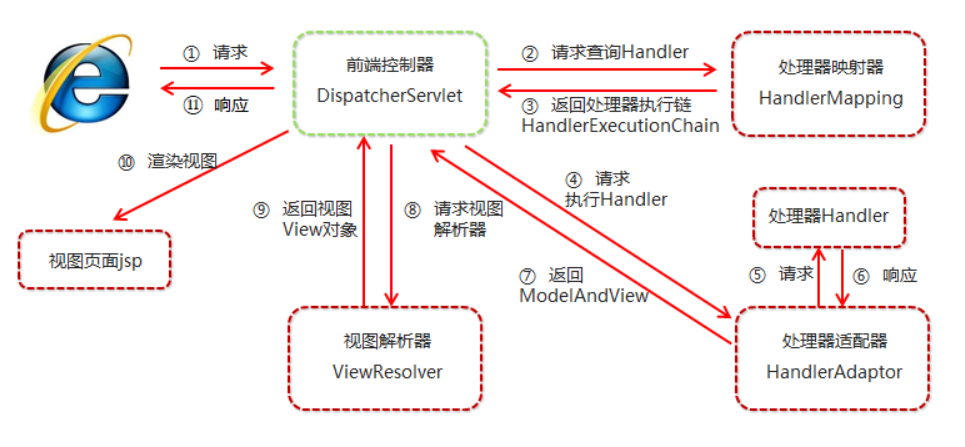

#### 1.DispatcherServlet请求入口

通过前面的分析，我们知道DispatcherServlet其本质还是Servlet，那么当客户端的请求到达时，根据Servlet生命周期，其应该会调用其或者其父类中的service方法。

在其父类FrameworkServlet中我们找到了service方法

```java
@Override
protected void service(HttpServletRequest request, HttpServletResponse response)
        throws ServletException, IOException {
    /**
     *  获取HttpMethod类型，
     *  HttpMethod为枚举类，支持的Http请求类型有GET, HEAD, POST, PUT, PATCH, DELETE, OPTIONS, TRACE
     */
    HttpMethod httpMethod = HttpMethod.resolve(request.getMethod());
    if (httpMethod == HttpMethod.PATCH || httpMethod == null) {
        processRequest(request, response);
    }
    else {
        super.service(request, response);
    }
}
```

但是在这里似乎没有看到我们最想要的东西，那么我们来看一下其doGet和doPost方法。

```java
protected final void doGet(HttpServletRequest request, HttpServletResponse response) throws ServletException, IOException {
    processRequest(request, response);
}

protected final void doPost(HttpServletRequest request, HttpServletResponse response) throws ServletException, IOException {
    processRequest(request, response);
}
```

从这里我们可以分析到，doGet、doPost等Http请求委托给了processRequest方法进行处理。

```java
protected final void processRequest(HttpServletRequest request, HttpServletResponse response)
            throws ServletException, IOException {
    // 记录开始时间
    long startTime = System.currentTimeMillis();
    Throwable failureCause = null;

    // 提取LocaleContext和RequestAttributes属性，以便在请求结束后能从当前线程中恢复
    LocaleContext previousLocaleContext = LocaleContextHolder.getLocaleContext();
    LocaleContext localeContext = buildLocaleContext(request);

    RequestAttributes previousAttributes = RequestContextHolder.getRequestAttributes();
    ServletRequestAttributes requestAttributes = buildRequestAttributes(request, response, previousAttributes);

    WebAsyncManager asyncManager = WebAsyncUtils.getAsyncManager(request);
    asyncManager.registerCallableInterceptor(FrameworkServlet.class.getName(), new RequestBindingInterceptor());

    // 初始化ContextHolder，将当前线程的LocaleContext和RequestAttributes绑定到ContextHolder
    initContextHolders(request, localeContext, requestAttributes);

    // 调用doService方法做下一步处理
    try {
        doService(request, response);
    }
    catch (ServletException | IOException ex) {
        failureCause = ex;
        throw ex;
    }
    catch (Throwable ex) {
        failureCause = ex;
        throw new NestedServletException("Request processing failed", ex);
    }

    // 请求结束，从当前线程中恢复previousLocaleContext和previousAttributes
    finally {
        resetContextHolders(request, previousLocaleContext, previousAttributes);
        if (requestAttributes != null) {
            requestAttributes.requestCompleted();
        }
        logResult(request, response, failureCause, asyncManager);
        // 发布事件通知
        publishRequestHandledEvent(request, response, startTime, failureCause);
    }
}
```

该方法只是做了一些变量提取绑定、恢复、事件发布等工作，具体工作委托给了doService方法。

```java
protected void doService(HttpServletRequest request, HttpServletResponse response) throws Exception {

    logRequest(request);

    /**
     * 如果当前请求是一个 include request（不好翻译），如：<jsp:incluede page="xxx.jsp"/>
     * 则为此请求属性建立快照，以便include request结束后能够将其恢复
     */
    // Keep a snapshot of the request attributes in case of an include,
    // to be able to restore the original attributes after the include.
    Map<String, Object> attributesSnapshot = null;
    if (WebUtils.isIncludeRequest(request)) {
        attributesSnapshot = new HashMap<>();
        Enumeration<?> attrNames = request.getAttributeNames();
        while (attrNames.hasMoreElements()) {
            String attrName = (String) attrNames.nextElement();
            if (this.cleanupAfterInclude || attrName.startsWith(DEFAULT_STRATEGIES_PREFIX)) {
                attributesSnapshot.put(attrName, request.getAttribute(attrName));
            }
        }
    }

    // Make framework objects available to handlers and view objects.
    // 将下列对象保存到request中，以便使用
    request.setAttribute(WEB_APPLICATION_CONTEXT_ATTRIBUTE, getWebApplicationContext());
    request.setAttribute(LOCALE_RESOLVER_ATTRIBUTE, this.localeResolver);
    request.setAttribute(THEME_RESOLVER_ATTRIBUTE, this.themeResolver);
    request.setAttribute(THEME_SOURCE_ATTRIBUTE, getThemeSource());
    if (this.flashMapManager != null) {
        FlashMap inputFlashMap = this.flashMapManager.retrieveAndUpdate(request, response);
        if (inputFlashMap != null) {
            request.setAttribute(INPUT_FLASH_MAP_ATTRIBUTE, Collections.unmodifiableMap(inputFlashMap));
        }
        request.setAttribute(OUTPUT_FLASH_MAP_ATTRIBUTE, new FlashMap());
        request.setAttribute(FLASH_MAP_MANAGER_ATTRIBUTE, this.flashMapManager);
    }

    try {
        // 真正开始处理http请求
        doDispatch(request, response);
    }
    finally {
        if (!WebAsyncUtils.getAsyncManager(request).isConcurrentHandlingStarted()) {
            // Restore the original attribute snapshot, in case of an include.
            // 恢复之前保存的数据快照
            if (attributesSnapshot != null) {
                restoreAttributesAfterInclude(request, attributesSnapshot);
            }
        }
    }
}
```

该方法中依然没有看到对核心流程的处理，请求处理进一步委托给了doDispatch方法。

```java
protected void doDispatch(HttpServletRequest request, HttpServletResponse response) throws Exception {
    HttpServletRequest processedRequest = request;
    HandlerExecutionChain mappedHandler = null;
    boolean multipartRequestParsed = false;

    WebAsyncManager asyncManager = WebAsyncUtils.getAsyncManager(request);

    try {
        ModelAndView mv = null;
        Exception dispatchException = null;

        try {
            // 1.尝试将当前请求转换为MultipartHttpServletRequest
            processedRequest = checkMultipart(request);
            multipartRequestParsed = (processedRequest != request);

            // Determine handler for the current request.
            // 2.查找当前请求对应的handler，包括Handler（控制器）本身和Handler拦截器
            mappedHandler = getHandler(processedRequest);
            // 未能找到对应的handler，抛出NoHandlerFoundException异常并返回404
            if (mappedHandler == null) {
                noHandlerFound(processedRequest, response);
                return;
            }

            // Determine handler adapter for the current request.
            // 3.查找当前请求对应的HandlerAdapter
            HandlerAdapter ha = getHandlerAdapter(mappedHandler.getHandler());

            // Process last-modified header, if supported by the handler.
            // 4.处理last-modified请求头，如果当前请求支持的话
            String method = request.getMethod();
            boolean isGet = "GET".equals(method);
            if (isGet || "HEAD".equals(method)) {
                long lastModified = ha.getLastModified(request, mappedHandler.getHandler());
                if (new ServletWebRequest(request, response).checkNotModified(lastModified) && isGet) {
                    return;
                }
            }

            // 5.应用前置拦截器
            // 如果有拦截器返回false，则表明该拦截器已经处理了返回结果，直接返回；
            if (!mappedHandler.applyPreHandle(processedRequest, response)) {
                return;
            }

            // Actually invoke the handler.
            // 6.调用HandlerAdapter的handler方法，真正开始处理Controller
            mv = ha.handle(processedRequest, response, mappedHandler.getHandler());

            // 7.如果当前请求是并发处理，直接返回
            if (asyncManager.isConcurrentHandlingStarted()) {
                return;
            }

            // 8.为返回值设定默认视图名，如果当前返回值中不包含视图名的话
            applyDefaultViewName(processedRequest, mv);

            // 9.应用已注册拦截器的后置方法。
            mappedHandler.applyPostHandle(processedRequest, response, mv);
        }
        catch (Exception ex) {
            dispatchException = ex;
        }
        catch (Throwable err) {
            // As of 4.3, we're processing Errors thrown from handler methods as well,
            // making them available for @ExceptionHandler methods and other scenarios.
            dispatchException = new NestedServletException("Handler dispatch failed", err);
        }
        // 10.处理分发调用结果,如视图模型解析、返回等工作
        processDispatchResult(processedRequest, response, mappedHandler, mv, dispatchException);
    }
    catch (Exception ex) {
        triggerAfterCompletion(processedRequest, response, mappedHandler, ex);
    }
    catch (Throwable err) {
        triggerAfterCompletion(processedRequest, response, mappedHandler,
                new NestedServletException("Handler processing failed", err));
    }
    finally {
        if (asyncManager.isConcurrentHandlingStarted()) {
            // Instead of postHandle and afterCompletion
            if (mappedHandler != null) {
                mappedHandler.applyAfterConcurrentHandlingStarted(processedRequest, response);
            }
        }
        else {
            // Clean up any resources used by a multipart request.
            if (multipartRequestParsed) {
                cleanupMultipart(processedRequest);
            }
        }
    }
}
```

历经service–>doGet–>processRequest–>doService–>doDispatch,终于到了核心方法。doDispatch方法看似简单，但是其背后有复杂的业务逻辑支撑

 

### 源码剖析-【获取handler及HandlerAdapter】

#### 1.getHandler方法以及HandlerExecutionChain简析

```java
/**
 * 返回当前请求的HandlerExecutionChain
 *
 * Return the HandlerExecutionChain for this request.
 * <p>Tries all handler mappings in order.
 * @param request current HTTP request
 * @return the HandlerExecutionChain, or {@code null} if no handler could be found
 */
@Nullable
protected HandlerExecutionChain getHandler(HttpServletRequest request) throws Exception {
    if (this.handlerMappings != null) {
        for (HandlerMapping mapping : this.handlerMappings) {
            HandlerExecutionChain handler = mapping.getHandler(request);
            if (handler != null) {
                return handler;
            }
        }
    }
    return null;
}
```

该方法并没有返回一个具体的Handler，而是返回了HandlerExecutionChain对象。HandlerExecutionChain是Handler执行链，包括Handler本身和HandlerInterceptor拦截器。其在HandlerExecutionChain中的定义如下：

```java
// Controller本身实例
private final Object handler;
// 拦截器数组
@Nullable
private HandlerInterceptor[] interceptors;
// 拦截器集合
@Nullable
private List<HandlerInterceptor> interceptorList;
```

其中handler即Controller本身实例，HandlerInterceptor是一个拦截器，其可以在SpringMVC的请求过过程中在不同的时机回调不同的接口。HandlerInterceptor接口的定义如下：

```java
public interface HandlerInterceptor {

    /**
     * 拦截处理程序的执行。在HandlerMapping确定适当的处理程序对象之后调用，但在HandlerAdapter调用处理程序之前调用。
     *
     * DispatcherServlet在执行链中处理一个处理程序，该处理程序由任意数量的拦截器组成，处理程序本身位于执行链的末端。
     * 使用此方法，每个拦截器可以决定中止执行链，通常是发送HTTP错误或编写自定义响应。
     *
     * 异步请求处理需要特殊考虑。 默认返回true
     *
     * 如果执行链应该继续下一个拦截器或处理程序本身，则返回@return {@code true}。
     * 否则，DispatcherServlet假设这个拦截器已经处理了响应本身。
     *
     */
    default boolean preHandle(HttpServletRequest request, HttpServletResponse response, Object handler)
            throws Exception {

        return true;
    }

    /**
     * 拦截处理程序的执行。在HandlerAdapter实际调用处理程序之后调用，但在DispatcherServlet呈现视图之前调用。
     * 可以通过给定的ModelAndView向视图公开其他模型对象。
     */
    default void postHandle(HttpServletRequest request, HttpServletResponse response, Object handler,
            @Nullable ModelAndView modelAndView) throws Exception {
    }

    /**
     * 请求处理完成后的回调，即呈现视图后的回调。将在处理程序执行的任何结果上调用，因此允许吗
     */
    default void afterCompletion(HttpServletRequest request, HttpServletResponse response, Object handler,
            @Nullable Exception ex) throws Exception {
    }

}
```

 

#### 2.getHandler方法详解

通过上面的分析，已经了解了HandlerExecutionChain的组成。接下来看具体的获取HandlerExecutionChain的过程。Spring会循环所有注册的HandlerMapping并返回第一个匹配的HandlerExecutionChain的。

下面以AbstractHandlerMapping为例来分析一下其具体的获取过程：

```java
public final HandlerExecutionChain getHandler(HttpServletRequest request) throws Exception {
    // 1.获取当前请求对应的handler
    Object handler = getHandlerInternal(request);

    // 未能获取到对应的handler，则使用默认的defaultHandler
    if (handler == null) {
        handler = getDefaultHandler();
    }

    // 两者同时未找到，则返回null
    if (handler == null) {
        return null;
    }

    // Bean name or resolved handler?
    // 2.如果获取到的handler是String类型，则以handler为beanName，从IOC容器中获取其实例
    if (handler instanceof String) {
        String handlerName = (String) handler;
        handler = obtainApplicationContext().getBean(handlerName);
    }

    // 3.根据handler和request获取对应的HandlerExecutionChain实例
    // 会将handler封装到HandlerExecutionChain对象中，
    // 并将系统和自定义的拦截器加入到HandlerExecutionChain中
    HandlerExecutionChain executionChain = getHandlerExecutionChain(handler, request);

    if (logger.isTraceEnabled()) {
        logger.trace("Mapped to " + handler);
    }
    else if (logger.isDebugEnabled() && !request.getDispatcherType().equals(DispatcherType.ASYNC)) {
        logger.debug("Mapped to " + executionChain.getHandler());
    }

    if (CorsUtils.isCorsRequest(request)) {
        CorsConfiguration globalConfig = this.globalCorsConfigSource.getCorsConfiguration(request);
        CorsConfiguration handlerConfig = getCorsConfiguration(handler, request);
        CorsConfiguration config = (globalConfig != null ? globalConfig.combine(handlerConfig) : handlerConfig);
        executionChain = getCorsHandlerExecutionChain(request, executionChain, config);
    }

    return executionChain;
}
```

来看其比较核心的方法：

##### 2.1 getHandlerInternal

```java
protected HandlerMethod getHandlerInternal(HttpServletRequest request) throws Exception {
    // 解析请求路径
    String lookupPath = getUrlPathHelper().getLookupPathForRequest(request);
    // 加只读锁
    this.mappingRegistry.acquireReadLock();
    try {
        // 根据请求路径和当前请求对象，获取最佳匹配的HandlerMethod
        HandlerMethod handlerMethod = lookupHandlerMethod(lookupPath, request);
        // 获取当前Controller的实例，并将获取到的实例封装至HandlerMethod对象中
        return (handlerMethod != null ? handlerMethod.createWithResolvedBean() : null);
    }
    finally {
        // 释放只读锁
        this.mappingRegistry.releaseReadLock();
    }
}
```

如果该方法未能获取到HandlerMethod，则使用默认的Handler。注意：defaultHandler默认为空，需要自己去配置。

 

##### 2.2 getHandlerExecutionChain

```java
protected HandlerExecutionChain getHandlerExecutionChain(Object handler, HttpServletRequest request) {
    HandlerExecutionChain chain = (handler instanceof HandlerExecutionChain ?
            (HandlerExecutionChain) handler : new HandlerExecutionChain(handler));

    String lookupPath = this.urlPathHelper.getLookupPathForRequest(request);
    for (HandlerInterceptor interceptor : this.adaptedInterceptors) {
        if (interceptor instanceof MappedInterceptor) {
            MappedInterceptor mappedInterceptor = (MappedInterceptor) interceptor;
            if (mappedInterceptor.matches(lookupPath, this.pathMatcher)) {
                chain.addInterceptor(mappedInterceptor.getInterceptor());
            }
        }
        else {
            chain.addInterceptor(interceptor);
        }
    }
    return chain;
}
```

将上一步获取到的handler转化为HandlerExecutionChain对象，并循环所有注册的HandlerInterceptor并将其加入到HandlerExecutionChain链中。

 

#### 3.getHandlerAdapter 获取HandlerAdapter

```java
protected HandlerAdapter getHandlerAdapter(Object handler) throws ServletException {
    if (this.handlerAdapters != null) {
        for (HandlerAdapter adapter : this.handlerAdapters) {
            if (adapter.supports(handler)) {
                return adapter;
            }
        }
    }
    throw new ServletException("No adapter for handler [" + handler +
            "]: The DispatcherServlet configuration needs to include a HandlerAdapter that supports this handler");
}
```

 

#### 4.applyPreHandle 应用前置拦截器

```java
/**
 * 调用注册的HandlerInterceptor拦截器中的preHandle方法
 *
 * 1.preHandle：HandlerMapping确定适当的处理程序对象之后，在HandlerAdapter调用处理程序之前调用
 * 2.preHandle默认返回true，如果返回true，则DispatcherServlet假设这个拦截器已经处理了响应本身。
 *
 * Apply preHandle methods of registered interceptors.
 * @return {@code true} if the execution chain should proceed with the
 * next interceptor or the handler itself. Else, DispatcherServlet assumes
 * that this interceptor has already dealt with the response itself.
 */
boolean applyPreHandle(HttpServletRequest request, HttpServletResponse response) throws Exception {
    HandlerInterceptor[] interceptors = getInterceptors();
    if (!ObjectUtils.isEmpty(interceptors)) {
        for (int i = 0; i < interceptors.length; i++) {
            HandlerInterceptor interceptor = interceptors[i];
            if (!interceptor.preHandle(request, response, this.handler)) {
                triggerAfterCompletion(request, response, null);
                return false;
            }
            this.interceptorIndex = i;
        }
    }
    return true;
}
```

这里要注意一下applyPreHandle的返回值，如果为true的话则表示DispatcherServlet已经完成了本次请求处理。

程序再往下执行就要真正开始开始处理Controller了

 

### 源码剖析-【HandlerAdapter handle 方法解析】

#### 1.handleInternal方法简析

前面分析了SpringMVC获取handler及HandlerAdapter的过程，接下来就要真正开始处理Controller了。

以AbstractHandlerMethodAdapter为例来来分析一下其具体的处理过程。

在此过程中会包含SpringMVC流程处理的的关键部分。例如参数获取及解析、异步处理、调用Controller中的方法、返回视图等等

```java
public final ModelAndView handle(HttpServletRequest request, HttpServletResponse response, Object handler) throws Exception {
    return handleInternal(request, response, (HandlerMethod) handler);
}
```

 

```java
protected ModelAndView handleInternal(HttpServletRequest request,
                                          HttpServletResponse response,
                                          HandlerMethod handlerMethod) throws Exception {
    ModelAndView mav;
    // 1.检测当前请求，验证请求方法合法性和session合法性
    checkRequest(request);

    // Execute invokeHandlerMethod in synchronized block if required.
    // 2.根据synchronizeOnSession值判断，当前请求是否需串行化访问。
    if (this.synchronizeOnSession) {
        HttpSession session = request.getSession(false);
        if (session != null) {
            // 获取最佳互斥锁，即同步当前回话对象；如未能获取到互斥锁，将返回HttpSession对象本身
            Object mutex = WebUtils.getSessionMutex(session);
            synchronized (mutex) {
                mav = invokeHandlerMethod(request, response, handlerMethod);
            }
        }
        else {
            // No HttpSession available -> no mutex necessary
            // 即无最佳互斥锁，也未能获取到HttpSession，则当前回话无需串行化访问
            mav = invokeHandlerMethod(request, response, handlerMethod);
        }
    }
    else {
        // No synchronization on session demanded at all...
        mav = invokeHandlerMethod(request, response, handlerMethod);
    }

    // 3.相应信息不包含Cache-Control
    if (!response.containsHeader(HEADER_CACHE_CONTROL)) {
        if (getSessionAttributesHandler(handlerMethod).hasSessionAttributes()) {
            applyCacheSeconds(response, this.cacheSecondsForSessionAttributeHandlers);
        }
        else {
            prepareResponse(response);
        }
    }

    return mav;
}
```

这里会涉及到一部分异步操作的代码。具体的处理方法委托给了invokeHandlerMethod方法。

```java
@Nullable
protected ModelAndView invokeHandlerMethod(HttpServletRequest request,
        HttpServletResponse response, HandlerMethod handlerMethod) throws Exception {

    ServletWebRequest webRequest = new ServletWebRequest(request, response);
    try {

        //WebDataBinderFactory --> 工厂类，为目标对象创建一个WebDataBinder实例
        // 1.WebDataBinder继承了DataBinder类，为web请求提供了参数绑定服务
        WebDataBinderFactory binderFactory = getDataBinderFactory(handlerMethod);

        // 获取ModelFactory：
        // 2.ModelFactory可以协助控制器在调用方法之前初始化模型，并在调用之后更新模型
        ModelFactory modelFactory = getModelFactory(handlerMethod, binderFactory);

        // 创建ServletInvocableHandlerMethod对象
        // 3.ServletInvocableHandlerMethod继承并扩展了InvocableHandlerMethod
        ServletInvocableHandlerMethod invocableMethod = createInvocableHandlerMethod(handlerMethod);

        // 4.尝试绑定参数、返回值解析器
        if (this.argumentResolvers != null) {
            invocableMethod.setHandlerMethodArgumentResolvers(this.argumentResolvers);
        }
        if (this.returnValueHandlers != null) {
            invocableMethod.setHandlerMethodReturnValueHandlers(this.returnValueHandlers);
        }
        invocableMethod.setDataBinderFactory(binderFactory);
        invocableMethod.setParameterNameDiscoverer(this.parameterNameDiscoverer);

        // 5.创建ModelAndViewContainer，并初始化Model对象
        ModelAndViewContainer mavContainer = new ModelAndViewContainer();
        mavContainer.addAllAttributes(RequestContextUtils.getInputFlashMap(request));
        modelFactory.initModel(webRequest, mavContainer, invocableMethod);
        mavContainer.setIgnoreDefaultModelOnRedirect(this.ignoreDefaultModelOnRedirect);

        // 6.异步请求相关
        AsyncWebRequest asyncWebRequest = WebAsyncUtils.createAsyncWebRequest(request, response);
        asyncWebRequest.setTimeout(this.asyncRequestTimeout);

        WebAsyncManager asyncManager = WebAsyncUtils.getAsyncManager(request);
        asyncManager.setTaskExecutor(this.taskExecutor);
        asyncManager.setAsyncWebRequest(asyncWebRequest);
        asyncManager.registerCallableInterceptors(this.callableInterceptors);
        asyncManager.registerDeferredResultInterceptors(this.deferredResultInterceptors);

        if (asyncManager.hasConcurrentResult()) {
            Object result = asyncManager.getConcurrentResult();
            mavContainer = (ModelAndViewContainer) asyncManager.getConcurrentResultContext()[0];
            asyncManager.clearConcurrentResult();
            if (logger.isDebugEnabled()) {
                logger.debug("Resume with async result ["
                        + (result instanceof CharSequence ? "\"" + result + "\"" :  result) + "]");
            }
            invocableMethod = invocableMethod.wrapConcurrentResult(result);
        }

        // 7.调用Controller中的具体方法并处理返回值
        invocableMethod.invokeAndHandle(webRequest, mavContainer);
        if (asyncManager.isConcurrentHandlingStarted()) {
            return null;
        }

        // 8.返回ModelAndView对象
        return getModelAndView(mavContainer, modelFactory, webRequest);
    }
    finally {
        // 完成请求后续处理,并将当前请求置为未激活
        webRequest.requestCompleted();
    }
}
```

invokeHandlerMethod方法还是很复杂的，下面我们对该方法进行详细的分析

 

#### 2.getModelFactory方法

```java
private ModelFactory getModelFactory(HandlerMethod handlerMethod, WebDataBinderFactory binderFactory) {
    // 1.处理@SessionAttributes注解
    SessionAttributesHandler sessionAttrHandler = getSessionAttributesHandler(handlerMethod);
    Class<?> handlerType = handlerMethod.getBeanType();
    // 2.处理@ModelAttribute注解
    Set<Method> methods = this.modelAttributeCache.get(handlerType);
    if (methods == null) {
        methods = MethodIntrospector.selectMethods(handlerType, MODEL_ATTRIBUTE_METHODS);
        this.modelAttributeCache.put(handlerType, methods);
    }
    List<InvocableHandlerMethod> attrMethods = new ArrayList<>();
    // Global methods first
    // 3.优先处理全局@ModelAttribute注解的方法，例如被@ControllerAdvice标注的类中存在被@ModelAttribute注解的方法，则优先处理
    this.modelAttributeAdviceCache.forEach((clazz, methodSet) -> {
        if (clazz.isApplicableToBeanType(handlerType)) {
            Object bean = clazz.resolveBean();
            for (Method method : methodSet) {
                attrMethods.add(createModelAttributeMethod(binderFactory, bean, method));
            }
        }
    });
    // 4.循环所有标注了@ModelAttribute注解的方法，并创建InvocableHandlerMethod对象
    // InvocableHandlerMethod:负责具体的HandlerMethod的调用、参数解析等工作
    for (Method method : methods) {
        Object bean = handlerMethod.getBean();
        attrMethods.add(createModelAttributeMethod(binderFactory, bean, method));
    }
    // 5.返回ModelFactory对象
    // ModelFactory:协助在控制器方法调用之前初始化模型，并在调用之后更新它。
    return new ModelFactory(attrMethods, binderFactory, sessionAttrHandler);
}
```

该方法主要作用是处理@ModelAttribute和@SessionAttributes两个注解

 

#### 3.ModelFactory的initModel初始化

上一步创建了ModelFactory对象实例，接下来看其initModel具体都做了什么工作：

```java
public void initModel(NativeWebRequest request, ModelAndViewContainer container, HandlerMethod handlerMethod)
        throws Exception {
    // 1.解析并合并@SessionAttributes注解
    Map<String, ?> sessionAttributes = this.sessionAttributesHandler.retrieveAttributes(request);
    container.mergeAttributes(sessionAttributes);

    // 2.调用被@ModelAttribute注解的方法
    invokeModelAttributeMethods(request, container);

    // 3.查找标注了@ModelAttribute、@SessionAttributes的方法参数，确保其解析过程中不会发生异常
    for (String name : findSessionAttributeArguments(handlerMethod)) {
        if (!container.containsAttribute(name)) {
            Object value = this.sessionAttributesHandler.retrieveAttribute(request, name);
            if (value == null) {
                throw new HttpSessionRequiredException("Expected session attribute '" + name + "'", name);
            }
            container.addAttribute(name, value);
        }
    }
}
```

注意这里会有一个`Expected session attribute xxx`的异常，如果类上标注了@SessionAttributes注解，且在方法中标注了@ModelAttribute注解，如果@ModelAttribute为空，则会抛出此异常

 

#### 4.invokeAndHandle简析

继续分析，接下来应该调用Controller中的具体方法了，但是在调用之前，还要有参数解析、InitBinder方法初始化、InitBinder方法调用等工作，接下来逐步分析。

```java
public void invokeAndHandle(
            ServletWebRequest webRequest,
            ModelAndViewContainer mavContainer,
            Object... providedArgs) throws Exception {

    // 1.调用Controller中的具体方法
    Object returnValue = invokeForRequest(webRequest, mavContainer, providedArgs);
    // 2.设置返回状态码
    setResponseStatus(webRequest);

    // 3.当前请求无返回值或者返回值中包含错误，则将请求完成标识设置为true并返回
    if (returnValue == null) {
        if (isRequestNotModified(webRequest) || getResponseStatus() != null || mavContainer.isRequestHandled()) {
            mavContainer.setRequestHandled(true);
            return;
        }
    }
    else if (StringUtils.hasText(getResponseStatusReason())) {
        mavContainer.setRequestHandled(true);
        return;
    }

    // 4.当前请求有返回值且无错误信息，则将请求完成标识设置为false，并继续处理当前请求
    mavContainer.setRequestHandled(false);
    Assert.state(this.returnValueHandlers != null, "No return value handlers");
    try {
        // 选取合适的HandlerMethodReturnValueHandler，并处理返回值
        this.returnValueHandlers.handleReturnValue(returnValue, getReturnValueType(returnValue), mavContainer, webRequest);
    }
    catch (Exception ex) {
        if (logger.isTraceEnabled()) {
            logger.trace(formatErrorForReturnValue(returnValue), ex);
        }
        throw ex;
    }
}
```

最重要的就是第一步invokeForRequest方法：

```java
public Object invokeForRequest(NativeWebRequest request,
                                @Nullable ModelAndViewContainer mavContainer,
                                Object... providedArgs) throws Exception {

    // 获取并解析请求参数
    /**
     * 注意这里不一定都是解析@RequestMapping方法的参数,
     * 也有可能会解析@InitBinder方法的参数
     *
     * 所以下面的doInvoke方法也并不一定调用具体的@RequestMapping方法,
     * 也有可能调用@InitBinder方法进行参数的解析绑定
     */
    Object[] args = getMethodArgumentValues(request, mavContainer, providedArgs);
    if (logger.isTraceEnabled()) {
        logger.trace("Arguments: " + Arrays.toString(args));
    }
    // 调用方法
    return doInvoke(args);
}
```

该方法看起来很简单，只有两个函数调用，但是其背后的逻辑还是相当复杂的。

接下来的处理分为两步，一是参数处理，二是方法调用。

 

#### 5.getMethodArgumentValues参数获取及解析

```java
private Object[] getMethodArgumentValues(NativeWebRequest request,
                                         @Nullable ModelAndViewContainer mavContainer,
                                         Object... providedArgs) throws Exception {

    // 1.获取方法参数列表,并创建与参数个数相同的Object数组,用来保存解析的参数值
    MethodParameter[] parameters = getMethodParameters();
    Object[] args = new Object[parameters.length];
    // 2.解析参数
    for (int i = 0; i < parameters.length; i++) {
        MethodParameter parameter = parameters[i];
        parameter.initParameterNameDiscovery(this.parameterNameDiscoverer);
        // 这里当解析@InitBinder参数时会指定providedArgs参数,无需纠结...
        args[i] = resolveProvidedArgument(parameter, providedArgs);
        if (args[i] != null) {
            continue;
        }
        // 参数解析器是否支持对该参数的解析
        if (this.argumentResolvers.supportsParameter(parameter)) {
            try {
                // 调用参数解析器的解析方法
                /**
                 * SpringMVC的参数解析器顶级接口为HandlerMethodArgumentResolver
                 * 该接口只提供了两个方法:supportsParameter和resolveArgument
                 *
                 * 我们也可以自定义参数解析器,只需实现这两个方法即可
                 */
                args[i] = this.argumentResolvers.resolveArgument(parameter, mavContainer, request, this.dataBinderFactory);
                continue;
            }
            catch (Exception ex) {
                // Leave stack trace for later, e.g. AbstractHandlerExceptionResolver
                if (logger.isDebugEnabled()) {
                    String message = ex.getMessage();
                    if (message != null && !message.contains(parameter.getExecutable().toGenericString())) {
                        logger.debug(formatArgumentError(parameter, message));
                    }
                }
                throw ex;
            }
        }
        // 如未能正常解析参数且未抛出异常,则说明当前参数没有合适的参数解析器,抛出 'No suitable resolver' 异常
        if (args[i] == null) {
            throw new IllegalStateException(formatArgumentError(parameter, "No suitable resolver"));
        }
    }
    return args;
}
```

从代码中可以看到，具体的参数解析工作委托给了HandlerMethodArgumentResolver，HandlerMethodArgumentResolver是一个接口，其中只有两个方法：

```java
public interface HandlerMethodArgumentResolver {

    /**
     * 此解析器是否支持给定的方法参数。
     */
    boolean supportsParameter(MethodParameter parameter);

    /**
     * 将方法参数解析为给定请求的参数值。
     */
    @Nullable
    Object resolveArgument(MethodParameter parameter, @Nullable ModelAndViewContainer mavContainer,
            NativeWebRequest webRequest, @Nullable WebDataBinderFactory binderFactory) throws Exception;

}
```

那么看到这里，大家一定也能想到，既然这个类是一个接口，那么必然有多个实现，接下来就应该查找具体的参数解析器、并调用解析器的resolveArgument方法对参数进行解析：

```java
public Object resolveArgument(
            MethodParameter parameter,
            @Nullable ModelAndViewContainer mavContainer,
            NativeWebRequest webRequest,
            @Nullable WebDataBinderFactory binderFactory) throws Exception {
    // 获取参数解析器
    HandlerMethodArgumentResolver resolver = getArgumentResolver(parameter);
    if (resolver == null) {
        throw new IllegalArgumentException("Unknown parameter type [" + parameter.getParameterType().getName() + "]");
    }
    // 解析参数,不同的参数解析器实例,有不同的解析方式
    return resolver.resolveArgument(parameter, mavContainer, webRequest, binderFactory);
}
```

上述代码就是干这些事情的，接下来以AbstractNamedValueMethodArgumentResolver为例，看一下参数的具体解析过程：

```java
public final Object resolveArgument(MethodParameter parameter, @Nullable ModelAndViewContainer mavContainer,
            NativeWebRequest webRequest, @Nullable WebDataBinderFactory binderFactory) throws Exception {

    // 1.NamedValueInfo对象包含了name,required,defaultValue三个信息
    NamedValueInfo namedValueInfo = getNamedValueInfo(parameter);
    // 获取MethodParameter对象,该对象封装了方法参数的规范
    MethodParameter nestedParameter = parameter.nestedIfOptional();

    // 2.解析参数名,包括占位符和表达式等
    Object resolvedName = resolveStringValue(namedValueInfo.name);
    if (resolvedName == null) {
        throw new IllegalArgumentException(
                "Specified name must not resolve to null: [" + namedValueInfo.name + "]");
    }

    // 3.将给定的参数类型和值名称解析为参数值。
    Object arg = resolveName(resolvedName.toString(), nestedParameter, webRequest);

    // 如果未能正常解析
    /**
     * 如
     * 方法参数 : @RequestParam(name = "name") String name
     * 请求路径参数后缀 : sayHello?1212
     *
     * 未指定参数名称,则无法正常解析,接下来要判断NamedValueInfo属性值,并作出后续处理
     */
    if (arg == null) {
        // 如果默认值不为空,则
        if (namedValueInfo.defaultValue != null) {
            arg = resolveStringValue(namedValueInfo.defaultValue);
        }
        // 指定了required属性且该参数不是为非不必须,则调动handleMissingValue方法处理缺失值,该方法一般会抛出异常
        else if (namedValueInfo.required && !nestedParameter.isOptional()) {
            handleMissingValue(namedValueInfo.name, nestedParameter, webRequest);
        }
        // 最后处理将该参数值处理为null即可
        arg = handleNullValue(namedValueInfo.name, arg, nestedParameter.getNestedParameterType());
    }
    else if ("".equals(arg) && namedValueInfo.defaultValue != null) {
        arg = resolveStringValue(namedValueInfo.defaultValue);
    }

    if (binderFactory != null) {
        // 4.创建WebDataBinder实例
        WebDataBinder binder = binderFactory.createBinder(webRequest, null, namedValueInfo.name);
        try {
            // 5.尝试转换参数
            arg = binder.convertIfNecessary(arg, parameter.getParameterType(), parameter);
        }
        catch (ConversionNotSupportedException ex) {
            throw new MethodArgumentConversionNotSupportedException(arg, ex.getRequiredType(),
                    namedValueInfo.name, parameter, ex.getCause());
        }
        catch (TypeMismatchException ex) {
            throw new MethodArgumentTypeMismatchException(arg, ex.getRequiredType(),
                    namedValueInfo.name, parameter, ex.getCause());

        }
    }

    handleResolvedValue(arg, namedValueInfo.name, parameter, mavContainer, webRequest);

    return arg;
}
```

前面对于参数的各种情况的处理，都比较简单，大家可以多写一些实例，多测试即可；接下来要看convertIfNecessary函数的调用过程。

 

1. #### convertIfNecessary方法调用

```java
public <T> T convertIfNecessary(@Nullable Object value, @Nullable Class<T> requiredType,
        @Nullable MethodParameter methodParam) throws TypeMismatchException {

    return getTypeConverter().convertIfNecessary(value, requiredType, methodParam);
}

public <T> T convertIfNecessary(@Nullable Object value, @Nullable Class<T> requiredType, @Nullable MethodParameter methodParam)
        throws TypeMismatchException {

    return doConvert(value, requiredType, methodParam, null);
}

private <T> T doConvert(@Nullable Object value,@Nullable Class<T> requiredType,
        @Nullable MethodParameter methodParam, @Nullable Field field) throws TypeMismatchException {

    Assert.state(this.typeConverterDelegate != null, "No TypeConverterDelegate");
    try {
        if (field != null) {
            return this.typeConverterDelegate.convertIfNecessary(value, requiredType, field);
        }
        else {
            return this.typeConverterDelegate.convertIfNecessary(value, requiredType, methodParam);
        }
    }
    catch (ConverterNotFoundException | IllegalStateException ex) {
        throw new ConversionNotSupportedException(value, requiredType, ex);
    }
    catch (ConversionException | IllegalArgumentException ex) {
        throw new TypeMismatchException(value, requiredType, ex);
    }
}


public <T> T convertIfNecessary(@Nullable String propertyName, @Nullable Object oldValue, @Nullable Object newValue,
            @Nullable Class<T> requiredType, @Nullable TypeDescriptor typeDescriptor) throws IllegalArgumentException {

    // Custom editor for this type?
    // 1、判断有无自定义属性编辑器
    PropertyEditor editor = this.propertyEditorRegistry.findCustomEditor(requiredType, propertyName);

    ConversionFailedException conversionAttemptEx = null;

    // No custom editor but custom ConversionService specified?
    // 2、判断有无自定义ConversionService
    ConversionService conversionService = this.propertyEditorRegistry.getConversionService();
    if (editor == null && conversionService != null && newValue != null && typeDescriptor != null) {
        TypeDescriptor sourceTypeDesc = TypeDescriptor.forObject(newValue);
        if (conversionService.canConvert(sourceTypeDesc, typeDescriptor)) {
            try {
                return (T) conversionService.convert(newValue, sourceTypeDesc, typeDescriptor);
            }
            catch (ConversionFailedException ex) {
                // fallback to default conversion logic below
                conversionAttemptEx = ex;
            }
        }
    }

    Object convertedValue = newValue;

    // Value not of required type?
    // ClassUtils.isAssignableValue(requiredType, convertedValue)-->判断requiredType和convertedValue的class,是否相同,
    // 相同返回->true;否则返回->false
    // 3、 如果有自定义属性编辑器或者通过解析出来的值类型与真实的值类型的class不同
    // 例如<property name="age" value="3"/>,我们需要将value转换成int时
    if (editor != null || (requiredType != null && !ClassUtils.isAssignableValue(requiredType, convertedValue))) {
        if (typeDescriptor != null && requiredType != null && Collection.class.isAssignableFrom(requiredType) && convertedValue instanceof String) {
            TypeDescriptor elementTypeDesc = typeDescriptor.getElementTypeDescriptor();
            if (elementTypeDesc != null) {
                Class<?> elementType = elementTypeDesc.getType();
                if (Class.class == elementType || Enum.class.isAssignableFrom(elementType)) {
                    convertedValue = StringUtils.commaDelimitedListToStringArray((String) convertedValue);
                }
            }
        }
        if (editor == null) {
            editor = findDefaultEditor(requiredType);
        }
        convertedValue = doConvertValue(oldValue, convertedValue, requiredType, editor);
    }

    boolean standardConversion = false;

    // 4、执行转换
    if (requiredType != null) {
        // Try to apply some standard type conversion rules if appropriate.
        if (convertedValue != null) {
            // Object类型
            if (Object.class == requiredType) {
                return (T) convertedValue;
            }
            // 数组类型
            else if (requiredType.isArray()) {
                // Array required -> apply appropriate conversion of elements.
                if (convertedValue instanceof String && Enum.class.isAssignableFrom(requiredType.getComponentType())) {
                    convertedValue = StringUtils.commaDelimitedListToStringArray((String) convertedValue);
                }
                return (T) convertToTypedArray(convertedValue, propertyName, requiredType.getComponentType());
            }
            // 集合类型
            else if (convertedValue instanceof Collection) {
                // Convert elements to target type, if determined.
                convertedValue = convertToTypedCollection((Collection<?>) convertedValue, propertyName, requiredType, typeDescriptor);
                standardConversion = true;
            }
            // map类型
            else if (convertedValue instanceof Map) {
                // Convert keys and values to respective target type, if determined.
                convertedValue = convertToTypedMap((Map<?, ?>) convertedValue, propertyName, requiredType, typeDescriptor);
                standardConversion = true;
            }

            // 注意:这里是新开启的if,不接上面的else if
            // 如果经过转换过的值是数组类型,且其长度只有1,那么只取其第0个作为最终转换值
            if (convertedValue.getClass().isArray() && Array.getLength(convertedValue) == 1) {
                convertedValue = Array.get(convertedValue, 0);
                standardConversion = true;
            }
            // 如果类型是String,并且是java的基本数据类型或者包装类型
            // 包括 boolean, byte, char, short, int, long, float, double
            // 和 Boolean, Byte, Character, Short, Integer, Long, Float, Double
            // 那么直接调用toString()方法返回即可,注意convertedValue是Object类型,不是基本或包装类型,所以是可以调用toString()方法的
            if (String.class == requiredType && ClassUtils.isPrimitiveOrWrapper(convertedValue.getClass())) {
                // We can stringify any primitive value...
                return (T) convertedValue.toString();
            }
            // 如果转换值是String类的实例,但是我们又不能转换为解析出来的requiredType的实例
            // 例如枚举类型值的注入
            else if (convertedValue instanceof String && !requiredType.isInstance(convertedValue)) {
                if (conversionAttemptEx == null && !requiredType.isInterface() && !requiredType.isEnum()) {
                    try {
                        Constructor<T> strCtor = requiredType.getConstructor(String.class);
                        return BeanUtils.instantiateClass(strCtor, convertedValue);
                    }
                    // 删除logger信息
                    catch (NoSuchMethodException ex) {
                        // proceed with field lookup
                        if (logger.isTraceEnabled()) {
                            logger.trace("No String constructor found on type [" + requiredType.getName() + "]", ex);
                        }
                    }
                    catch (Exception ex) {
                        if (logger.isDebugEnabled()) {
                            logger.debug("Construction via String failed for type [" + requiredType.getName() + "]", ex);
                        }
                    }
                }
                String trimmedValue = ((String) convertedValue).trim();
                if (requiredType.isEnum() && "".equals(trimmedValue)) {
                    // It's an empty enum identifier: reset the enum value to null.
                    return null;
                }
                convertedValue = attemptToConvertStringToEnum(requiredType, trimmedValue, convertedValue);
                standardConversion = true;
            }
            // 数值类型
            else if (convertedValue instanceof Number && Number.class.isAssignableFrom(requiredType)) {
                convertedValue = NumberUtils.convertNumberToTargetClass((Number) convertedValue, (Class<Number>) requiredType);
                standardConversion = true;
            }
        }
        else {
            // convertedValue == null
            if (requiredType == Optional.class) {
                convertedValue = Optional.empty();
            }
        }

        // 5、 判定requiredType是否可从convertedValue转换而来,并尝试使用conversionService转换,及处理转换异常
        if (!ClassUtils.isAssignableValue(requiredType, convertedValue)) {
            if (conversionAttemptEx != null) {
                // Original exception from former ConversionService call above...
                throw conversionAttemptEx;
            }
            else if (conversionService != null && typeDescriptor != null) {
                // ConversionService not tried before, probably custom editor found
                // but editor couldn't produce the required type...
                TypeDescriptor sourceTypeDesc = TypeDescriptor.forObject(newValue);
                if (conversionService.canConvert(sourceTypeDesc, typeDescriptor)) {
                    return (T) conversionService.convert(newValue, sourceTypeDesc, typeDescriptor);
                }
            }

            // 到此为止,可以确定类型不匹配,无法转换,抛出IllegalArgumentException/IllegalStateException
            StringBuilder msg = new StringBuilder();
            msg.append("Cannot convert value of type '").append(ClassUtils.getDescriptiveType(newValue));
            msg.append("' to required type '").append(ClassUtils.getQualifiedName(requiredType)).append("'");
            if (propertyName != null) {
                msg.append(" for property '").append(propertyName).append("'");
            }
            if (editor != null) {
                msg.append(": PropertyEditor [").append(editor.getClass().getName()).append(
                        "] returned inappropriate value of type '").append(
                        ClassUtils.getDescriptiveType(convertedValue)).append("'");
                throw new IllegalArgumentException(msg.toString());
            }
            else {
                msg.append(": no matching editors or conversion strategy found");
                throw new IllegalStateException(msg.toString());
            }
        }
    }

    if (conversionAttemptEx != null) {
        if (editor == null && !standardConversion && requiredType != null && Object.class != requiredType) {
            throw conversionAttemptEx;
        }
    }

    // 6、返回转换值
    return (T) convertedValue;
}
```

 

#### 6.doInvoke方法调用

```java
protected Object doInvoke(Object... args) throws Exception {
    ReflectionUtils.makeAccessible(getBridgedMethod());
    try {
        return getBridgedMethod().invoke(getBean(), args);
    }
    catch (IllegalArgumentException ex) {
        assertTargetBean(getBridgedMethod(), getBean(), args);
        String text = (ex.getMessage() != null ? ex.getMessage() : "Illegal argument");
        throw new IllegalStateException(formatInvokeError(text, args), ex);
    }
    catch (InvocationTargetException ex) {
        // Unwrap for HandlerExceptionResolvers ...
        Throwable targetException = ex.getTargetException();
        if (targetException instanceof RuntimeException) {
            throw (RuntimeException) targetException;
        }
        else if (targetException instanceof Error) {
            throw (Error) targetException;
        }
        else if (targetException instanceof Exception) {
            throw (Exception) targetException;
        }
        else {
            throw new IllegalStateException(formatInvokeError("Invocation failure", args), targetException);
        }
    }
}
```

继续上面的分析，接下来就应该设置状态码了：

#### 7.setResponseStatus设置相应状态码以及handleReturnValue处理返回值

```java
private void setResponseStatus(ServletWebRequest webRequest) throws IOException {
    // 获取HttpStatus
    HttpStatus status = getResponseStatus();

    // 未发现HttpStatus直接返回
    if (status == null) {
        return;
    }

    HttpServletResponse response = webRequest.getResponse();
    if (response != null) {
        String reason = getResponseStatusReason();
        if (StringUtils.hasText(reason)) {
            /**
             * 注意 注意 注意：这里是 sendError ， 不是 setError
             * 使用指定的状态码并清空缓冲，发送一个错误响应至客户端。如果响应已经被提交，这个方法会抛出IllegalStateException。
             * 服务器默认会创建一个HTML格式的服务错误页面作为响应结果，其中包含参数msg指定的文本信息，
             * 这个HTML页面的内容类型为“text/html”，保留cookies和其他未修改的响应头信息。
             *
             * 如果一个对应于传入的错误码的错误页面已经在web.xml中声明，那么这个声明的错误页面将会优先于建议的msg参数服务于客户端。
             */
            response.sendError(status.value(), reason);
        }
        else {
            /**
             * 设置响应的状态码。
             * 这个方法被用于当响应结果正常时（例如，状态码为SC_OK或SC_MOVED_TEMPORARTLY）设置响应状态码。
             * 如果发生错误，而且来访者希望调用在web应用中定义的错误页面作为显示，那么应该使用sendError方法代替之。
             * 使用setStatus方法之后，容器会清空缓冲并设置Location响应头，保留cookies和其他响应头信息。
             */
            response.setStatus(status.value());
        }
    }

    // To be picked up by RedirectView
    webRequest.getRequest().setAttribute(View.RESPONSE_STATUS_ATTRIBUTE, status);
}
```

如果@RequestMapping设置了@ResponseStatus注解，这里则要根据注解设置放回状态码。如果getResponseStatusReason方法返回了错误信息，则直接通过sendError方法返回给前端。否则将状态码信息设置到response里即可。

在后续处理根据@RequestMapping方法返回值、相应信息等判断，是否将当前请求设置为已经完成。例如当前请求无需返回视图、或者当前请求的放回状态码包含了错误信息，则无需继续后续处理。

假设当前是有视图或者返回值，接下来应该选取合适的HandlerMethodReturnValueHandler并处理返回值，先来看一下HandlerMethodReturnValueHandler的定义：

```java
public interface HandlerMethodReturnValueHandler {

    /**
     * 判断当前策略（Handler）是否支持MethodParameter（方法返回类型）
     */
    boolean supportsReturnType(MethodParameter returnType);

    /**
     * 处理返回值，为模型添加属性、视图等想关内容
     */
    void handleReturnValue(@Nullable Object returnValue,
                           MethodParameter returnType,
                           ModelAndViewContainer mavContainer,
                           NativeWebRequest webRequest) throws Exception;
}
```

对于其实现者，只需实现这两个方法即可。这里以ModelAndViewMethodReturnValueHandler为例看其具体的处理过程：

```java
public void handleReturnValue(@Nullable Object returnValue,
                              MethodParameter returnType,
                              ModelAndViewContainer mavContainer,
                              NativeWebRequest webRequest) throws Exception {
    // 选取合适的HandlerMethodReturnValueHandler，如果没有找到则抛出异常
    HandlerMethodReturnValueHandler handler = selectHandler(returnValue, returnType);
    if (handler == null) {
        throw new IllegalArgumentException("Unknown return value type: " + returnType.getParameterType().getName());
    }
    // 处理返回值
    handler.handleReturnValue(returnValue, returnType, mavContainer, webRequest);
}


public void handleReturnValue(@Nullable Object returnValue, MethodParameter returnType,
        ModelAndViewContainer mavContainer, NativeWebRequest webRequest) throws Exception {

    // 当前请求返回值为null，无需处理，并且要将当前请求标记已处理
    if (returnValue == null) {
        mavContainer.setRequestHandled(true);
        return;
    }

    // 处理引用视图
    ModelAndView mav = (ModelAndView) returnValue;
    if (mav.isReference()) {
        String viewName = mav.getViewName();
        mavContainer.setViewName(viewName);
        if (viewName != null && isRedirectViewName(viewName)) {
            mavContainer.setRedirectModelScenario(true);
        }
    }
    // 处理普通视图(即我们已经制定了具体的View视图，而无需通过视图解析器再次解析)
    else {
        View view = mav.getView();
        mavContainer.setView(view);
        if (view instanceof SmartView && ((SmartView) view).isRedirectView()) {
            mavContainer.setRedirectModelScenario(true);
        }
    }
    // 处理属性
    mavContainer.setStatus(mav.getStatus());
    mavContainer.addAllAttributes(mav.getModel());
}
```

这里又涉及到两个概念，即引用视图以及普通视图（姑且命名为普通视图）。引用视图如没有指定具体的View类型，而只是通过ModelAndView对象的setViewName设置了返回视图的名称，则该视图还需要再次被解析；普通视图正好相反。

到这里invokeAndHandle方法的调用就完成了，接下来是getModelAndViewd对返回的模型做了进一步的处理。

 

#### 8.getModelAndView方法后续处理

```java
private ModelAndView getModelAndView(ModelAndViewContainer mavContainer,
        ModelFactory modelFactory, NativeWebRequest webRequest) throws Exception {

    // 1.更新模型
    modelFactory.updateModel(webRequest, mavContainer);
    if (mavContainer.isRequestHandled()) {
        return null;
    }
    // 2.获取ModelMap并创建ModelAndView
    ModelMap model = mavContainer.getModel();
    ModelAndView mav = new ModelAndView(mavContainer.getViewName(), model, mavContainer.getStatus());

    // 3.处理引用类型视图和转发类型视图
    if (!mavContainer.isViewReference()) {
        mav.setView((View) mavContainer.getView());
    }
    if (model instanceof RedirectAttributes) {
        Map<String, ?> flashAttributes = ((RedirectAttributes) model).getFlashAttributes();
        HttpServletRequest request = webRequest.getNativeRequest(HttpServletRequest.class);
        if (request != null) {
            RequestContextUtils.getOutputFlashMap(request).putAll(flashAttributes);
        }
    }
    return mav;
}
```

 

### 源码剖析-【视图解析渲染】

#### 1. applyDefaultViewName设置默认视图名

```java
private void applyDefaultViewName(HttpServletRequest request, @Nullable ModelAndView mv) throws Exception {
    // ModelAndView不为空，但是没有View对象则尝试为其生成一个默认的视图名
    if (mv != null && !mv.hasView()) {
        String defaultViewName = getDefaultViewName(request);
        if (defaultViewName != null) {
            mv.setViewName(defaultViewName);
        }
    }
}


protected String getDefaultViewName(HttpServletRequest request) throws Exception {
    return (this.viewNameTranslator != null ? this.viewNameTranslator.getViewName(request) : null);
}

public String getViewName(HttpServletRequest request) {
    String lookupPath = this.urlPathHelper.getLookupPathForRequest(request);
    return (this.prefix + transformPath(lookupPath) + this.suffix);
}

protected String transformPath(String lookupPath) {
    String path = lookupPath;
    if (this.stripLeadingSlash && path.startsWith(SLASH)) {
        path = path.substring(1);
    }
    if (this.stripTrailingSlash && path.endsWith(SLASH)) {
        path = path.substring(0, path.length() - 1);
    }
    if (this.stripExtension) {
        path = StringUtils.stripFilenameExtension(path);
    }
    if (!SLASH.equals(this.separator)) {
        path = StringUtils.replace(path, SLASH, this.separator);
    }
    return path;
}
```

具体工作委托给了RequestToViewNameTranslator接口的实现类，该方法比较简单。

 

#### 2. applyPostHandle 应用已注册拦截器的后置方法

```java
/**
 * 应用已注册拦截器的后置方法。
 *
 * Apply postHandle methods of registered interceptors.
 */
void applyPostHandle(HttpServletRequest request, HttpServletResponse response, @Nullable ModelAndView mv) throws Exception {
    HandlerInterceptor[] interceptors = getInterceptors();
    if (!ObjectUtils.isEmpty(interceptors)) {
        for (int i = interceptors.length - 1; i >= 0; i--) {
            HandlerInterceptor interceptor = interceptors[i];
            interceptor.postHandle(request, response, this.handler, mv);
        }
    }
}
```

以上这两步都比较简单，接下来看返回视图结果的处理。

 

#### 3.processDispatchResult简析

```java
private void processDispatchResult(
        HttpServletRequest request,
        HttpServletResponse response,
        @Nullable HandlerExecutionChain mappedHandler,
        @Nullable ModelAndView mv,
        @Nullable Exception exception) throws Exception {

    boolean errorView = false;

    // 处理异常信息
    if (exception != null) {
        if (exception instanceof ModelAndViewDefiningException) {
            logger.debug("ModelAndViewDefiningException encountered", exception);
            mv = ((ModelAndViewDefiningException) exception).getModelAndView();
        }
        else {
            Object handler = (mappedHandler != null ? mappedHandler.getHandler() : null);
            mv = processHandlerException(request, response, handler, exception);
            errorView = (mv != null);
        }
    }

    // Did the handler return a view to render?
    // 尝试解析视图和模型；
    // wasCleared:判断当前模型和视图是否已经被标识为清空，且当前视图和模型是否同时为空
    if (mv != null && !mv.wasCleared()) {
        // 解析并呈现视图和模型
        render(mv, request, response);
        if (errorView) {
            WebUtils.clearErrorRequestAttributes(request);
        }
    }
    else {
        if (logger.isTraceEnabled()) {
            logger.trace("No view rendering, null ModelAndView returned.");
        }
    }

    if (WebAsyncUtils.getAsyncManager(request).isConcurrentHandlingStarted()) {
        // Concurrent handling started during a forward
        return;
    }

    // 处理注册的后置完成拦截器
    if (mappedHandler != null) {
        mappedHandler.triggerAfterCompletion(request, response, null);
    }
}
```

processDispatchResult处理程序选择和处理程序调用的结果，该结果要么是一个ModelAndView，要么是一个要解析为ModelAndView的异常。该方法的核心是render方法，用来解析并呈现视图和模型。这也是一次完整请求最后要处理的部分。

 

#### 4. render方法分析

```java
protected void render(ModelAndView mv, HttpServletRequest request, HttpServletResponse response) throws Exception {
    // Determine locale for request and apply it to the response.
    // 确定请求的区域设置并将其应用于响应。
    Locale locale = (this.localeResolver != null ? this.localeResolver.resolveLocale(request) : request.getLocale());
    response.setLocale(locale);

    View view;
    // 获取视图名
    String viewName = mv.getViewName();
    // 未能获取视图名，则解析视图名
    if (viewName != null) {
        // We need to resolve the view name.
        view = resolveViewName(viewName, mv.getModelInternal(), locale, request);
        if (view == null) {
            throw new ServletException("Could not resolve view with name '" + mv.getViewName() +
                    "' in servlet with name '" + getServletName() + "'");
        }
    }
    // 获取到视图名，再次判断当前ModelAndView对象中是否包含真正的View对象，
    // 因为接下来需要调用View对象的render方法
    else {
        // No need to lookup: the ModelAndView object contains the actual View object.
        view = mv.getView();
        if (view == null) {
            throw new ServletException("ModelAndView [" + mv + "] neither contains a view name nor a " +
                    "View object in servlet with name '" + getServletName() + "'");
        }
    }

    // Delegate to the View object for rendering.
    if (logger.isTraceEnabled()) {
        logger.trace("Rendering view [" + view + "] ");
    }
    try {
        // 设置返回状态码
        if (mv.getStatus() != null) {
            response.setStatus(mv.getStatus().value());
        }
        // 调用View对象的render方法完成视图解析
        view.render(mv.getModelInternal(), request, response);
    }
    catch (Exception ex) {
        if (logger.isDebugEnabled()) {
            logger.debug("Error rendering view [" + view + "]", ex);
        }
        throw ex;
    }
}
```

其核心处理委托给了View对象的render方法：

```java
public void render(@Nullable Map<String, ?> model, HttpServletRequest request,
        HttpServletResponse response) throws Exception {

    if (logger.isDebugEnabled()) {
        logger.debug("View " + formatViewName() +
                ", model " + (model != null ? model : Collections.emptyMap()) +
                (this.staticAttributes.isEmpty() ? "" : ", static attributes " + this.staticAttributes));
    }
    // 合并模型
    Map<String, Object> mergedModel = createMergedOutputModel(model, request, response);
    // 如果当前请求为下载的话，预先处理请求头
    prepareResponse(request, response);
    // 为客户端返回视图
    renderMergedOutputModel(mergedModel, getRequestToExpose(request), response);
}
```

这里我们以InternalResourceView为例看看一下具体的返回过程：

```java
protected void renderMergedOutputModel(
            Map<String, Object> model, HttpServletRequest request, HttpServletResponse response) throws Exception {

    // Expose the model object as request attributes.
    // 曝光模型
    exposeModelAsRequestAttributes(model, request);

    // Expose helpers as request attributes, if any.
    // 空的模板方法 //todo
    exposeHelpers(request);

    // Determine the path for the request dispatcher.
    // 获取转发路径
    String dispatcherPath = prepareForRendering(request, response);

    // Obtain a RequestDispatcher for the target resource (typically a JSP).
    // 获取可应用于 forward/include 的RequestDispatcher
    RequestDispatcher rd = getRequestDispatcher(request, dispatcherPath);
    if (rd == null) {
        throw new ServletException("Could not get RequestDispatcher for [" + getUrl() +
                "]: Check that the corresponding file exists within your web application archive!");
    }

    // 处理include
    // If already included or response already committed, perform include, else forward.
    if (useInclude(request, response)) {
        response.setContentType(getContentType());
        if (logger.isDebugEnabled()) {
            logger.debug("Including [" + getUrl() + "]");
        }
        rd.include(request, response);
    }

    // 处理转发
    else {
        // Note: The forwarded resource is supposed to determine the content type itself.
        if (logger.isDebugEnabled()) {
            logger.debug("Forwarding to [" + getUrl() + "]");
        }
        rd.forward(request, response);
    }
}
```

对于返回的普通的视图，如JSP等，最后还是调用的RequestDispatcher.forward方法进行转发而已。

#### 面试题：**BeanFactory**和**ApplicationContext**的区别？

**BeanFactory：**

BeanFactory是Spring容器的基础接口，提供了基础的容器访问能力。

BeanFactory提供懒加载方式，只有通过getBean方法调用获取Bean才会进行实例化。

常用的是加载XMLBeanFactory：

```java
public class HelloWorldApp{
   public static void main(String[] args) {
      XmlBeanFactory factory = new XmlBeanFactory (new ClassPathResource("beans.xml"));
      HelloWorld obj = (HelloWorld) factory.getBean("helloWorld");
      obj.getMessage();
   }
}
```

 

**ApplicationContext：**

ApplicationContext继承自BeanFactory接口，ApplicationContext包含了BeanFactory中所有的功能。

具有自己独特的特性：

- Bean实例化/串联
- 自动BeanPostProcessor注册
- 自动BeanFactoryPostProcessor注册
- 方便的MessageSource访问（i18n）
- ApplicationEvent发布

ApplicationContext采用的是预加载，每个Bean都在ApplicationContext启动后实例化。

```java
public class HelloWorldApp{
   public static void main(String[] args) {
      ApplicationContext context=new ClassPathXmlApplicationContext("beans.xml");
      HelloWorld obj = (HelloWorld) context.getBean("helloWorld");
      obj.getMessage();
   }
}
```

 

 

#### 面试题：BeanFactory和FactoryBean的区别？

**BeanFactory**

BeanFactory，以Factory结尾，表示它是一个工厂类(接口)， 它负责生产和管理bean的一个工厂（IOC容器），在Spring中，**所有的Bean都是由BeanFactory(也就是IOC容器)来进行管理的**

 

**FactoryBean**

FactoryBean，以Bean结尾，表示它是一个Bean，一般情况下，Spring通过反射机制利用的class属性指定实现类实例化Bean，在某些情况下，实例化Bean过程比较复杂，如果按照传统的方式，则需要在中提供大量的配置信息。配置方式的灵活性是受限的，这时采用编码的方式可能会得到一个简单的方案。

Spring为此提供了一个org.springframework.bean.factory.FactoryBean的工厂类接口，用户可以通过实现该接口定制实例化Bean的逻辑。FactoryBean接口对于Spring框架来说占用重要的地位，Spring自身就提供了70多个FactoryBean的实现

```java
// 可以让我们⾃定义Bean的创建过程（完成复杂Bean的定义）
public interface FactoryBean<T> {
    
     @Nullable
     // 返回FactoryBean创建的Bean实例，如果isSingleton返回true，则该实例会放到Spring容器的单例对象缓存池中Map
     T getObject() throws Exception;
    
    @Nullable
    // 返回FactoryBean创建的Bean类型
    Class<?> getObjectType();
    
    // 返回作⽤域是否单例
    default boolean isSingleton() {
    return true;
    }
}
```

总结：

1. BeanFactory:负责生产和管理Bean的一个工厂接口，提供一个Spring Ioc容器规范,
2. FactoryBean: 一种Bean创建的一种方式，对Bean的一种扩展。对于复杂的Bean对象初始化创建使用其可封装对象的创建细节。

 

