# 常用命令

- 基础命令

  ~~~sh
  # 创建容器
  kubectl create deployment/deploy 这次部署的名字 --image=应用的镜像
  kubectl create deploy my-nginx --port=80 --replicas=3 -- date --image=nginx
  # Create a deployment with command
  kubectl create deployment my-nginx --image=nginx -- date
  
  #也可以独立跑一个Pod
  kubectl run nginx --image=nginx
  
  ###注意！！！：kubectl run（无自愈功能）：直接启动一个pod；不会产生一次部署信息。所以删除就没。
  #kubectl create deploy（有自愈功能）： 启动一个Pod，以及记录这次部署信息。所以，这个pod即使挂了，这次部署信息有，就会强制同步到这次部署信息期望的最终结果；kubectl get deploy,pod 都有内容。
  
  ##最终在一个机器上有pod、这个pod其实本质里面就是一个容器
  k8s_nginx_my-nginx-6b74b79f57-snlr4_default_dbeac79e-1ce9-42c9-bc59-c8ca0412674b_0
  ### k8s_镜像(nginx)_pod名(my-nginx-6b74b79f57-snlr4)_容器名(default_dbeac79e-1ce9-42c9-bc59-c8ca0412674b_0)
  
  #进入容器（老版可以不带--）
  kubectl exec -it [name] -- /bin/bash
  #删除pod
  kubectl delete pod xx
  
  #======================= kubectl get 资源类型=========================
  
  #获取类型为Deployment的资源列表
  kubectl get deployments
  
  #查看所有容器
  kubectl get all
  
  #查看所有pod（类似docker ps -a）
  kubectl get pod -A
  #查看我们自己的pod
  kubectl get pods
  kubectl get pod -o wide  #详情
  kubectl get pod -n hello  #查看hello namespace下的pod
  
  #获取类型为Node的资源列表
  kubectl get nodes
  # 查看所有名称空间的 Deployment
  kubectl get deployments -A
  kubectl get deployments --all-namespaces
  # 查看 kube-system 名称空间的 Deployment
  kubectl get deployments -n kube-system
  
  #####并不是所有的对象都在名称空间中
  # 在名称空间里
  kubectl api-resources --namespaced=true
  # 不在名称空间里
  kubectl api-resources --namespaced=false
  
  #======================= kubectl describe 显示有关资源的详细信息=========================
  # kubectl describe 资源类型 资源名称
  
  #查看名称为nginx-XXXXXX的Pod的信息
  kubectl describe pod nginx-XXXXXX	
  
  #=======================kubectl logs - 查看pod中的容器的打印日志=========================
  # kubectl logs Pod名称
  kubectl logs -f nginx-pod-XXXXXXX
  
  #=======================label - 标签===================================================
  #查看labels
  kubectl get pod --show-labels 
  #为xx打标签
  kubectl label pods tomcat111 zfc=db
  #删除标签
  kubectl label pod toncat111 zfc-
  ~~~

- kubectl explain xxx：解析一个资源该怎么编写yml    (类似--help)

- yml妙用

  ~~~sh
  #################如何会写任意资源的yaml#########################
  ##  kubectl run my-nginx666 --image=nginx  #启动一个Pod
  ## 1、kubectl get pod my-nginx666 -oyaml 集群中挑一个同类资源，获取出他的yaml。
  ## 2、kubectl run my-tomcat --image=tomcat --dry-run -oyaml  干跑一遍
  
  #查看变更，下面的三个命令加上 -R  就可以递归某个文件夹下所有的yml
  kubectl diff -f configs/
  #部署
  kubectl apply -f deployment.yaml
  #移除
  kubectl delete -f deployment.yaml
  #替换对象
  kubectl replace -f nginx.yaml
  ~~~

- 弹性扩/缩容

  ~~~sh
  ## 扩容的Pod会自动加入到他之前存在的Service（负载均衡网络）
  kubectl scale --replicas=3  deployment tomcat6
  #持续观测效果（-n 1 每秒刷新）
  watch -n 1 kubectl get pods -o wide
  ~~~

- 向外暴露端口，达到多pod负载均衡

  > **此处一定要注意是否是公网ip ！！！！！**

  ~~~sh
  kubectl expose deployment tomcat6 --port=8912 --target-port=8080 --type=NodePort
   
  ## --port：集群内访问service的端口 8912
  ## --target-port： pod容器的端口 8080
  ## --type： 暴露类型,四选一
                     "ClusterIP":集群只有一个端口
  				   "ExternalName":
  				   "LoadBalancer":
  				   "NodePort":每个node都有各自port，这样可以通过node的公网访问
   
  ## 进行验证
  kubectl get svc 
  curl ip:port
   
  ## kubectl exec 进去pod修改，并测试负载均衡
  ~~~

  

# Kubernetes简介

## 部署方式的变迁


- **传统部署时代：**
  - 在物理服务器上运行应用程序
  - 无法为应用程序定义资源边界
  - 导致资源分配问题

 例如，如果在物理服务器上运行多个应用程序，则可能会出现一个应用程序占用大部分资源的情况， 结果可能导致其他应用程序的性能下降。 一种解决方案是在不同的物理服务器上运行每个应用程序，但是由于资源利用不足而无法扩展， 并且维护许多物理服务器的成本很高。

- **虚拟化部署时代：**
  - 作为解决方案，引入了虚拟化
  - 虚拟化技术允许你在单个物理服务器的 CPU 上运行多个虚拟机（VM）
  - 虚拟化允许应用程序在 VM 之间隔离，并提供一定程度的安全
  - 一个应用程序的信息 不能被另一应用程序随意访问。
  - 虚拟化技术能够更好地利用物理服务器上的资源
  - 因为可轻松地添加或更新应用程序 ，所以可以实现更好的可伸缩性，降低硬件成本等等。
  - 每个 VM 是一台完整的计算机，在虚拟化硬件之上运行所有组件，包括其自己的操作系统。

缺点：虚拟层冗余导致的资源浪费与性能下降

- **容器部署时代：**
  - 容器类似于 VM，但可以在应用程序之间共享操作系统（OS）。 
  - 容器被认为是轻量级的。
  - 容器与 VM 类似，具有自己的文件系统、CPU、内存、进程空间等。 
  - 由于它们与基础架构分离，因此可以跨云和 OS 发行版本进行移植。
  - *<u>**参照【Docker隔离原理- namespace 6项隔离（资源隔离）与 cgroups 8项资源限制（资源限制）】**</u>*


裸金属：真正的物理服务器

**容器优势：**

- **敏捷性：**敏捷应用程序的创建和部署：与使用 VM 镜像相比，提高了容器镜像创建的简便性和效率。
- **及时性：**持续开发、集成和部署：通过快速简单的回滚（由于镜像不可变性），支持可靠且频繁的 容器镜像构建和部署。
- **解耦性：**关注开发与运维的分离：在构建/发布时创建应用程序容器镜像，而不是在部署时。 从而将应用程序与基础架构分离。
- **可观测性：**可观察性不仅可以显示操作系统级别的信息和指标，还可以显示应用程序的运行状况和其他指标信号。
- **跨平台：**跨开发、测试和生产的环境一致性：在便携式计算机上与在云中相同地运行。
- **可移植：**跨云和操作系统发行版本的可移植性：可在 Ubuntu、RHEL、CoreOS、本地、 Google Kubernetes Engine 和其他任何地方运行。
- **简易性：**以应用程序为中心的管理：提高抽象级别，从在虚拟硬件上运行 OS 到使用逻辑资源在 OS 上运行应用程序。
- **大分布式：**松散耦合、分布式、弹性、解放的微服务：应用程序被分解成较小的独立部分， 并且可以动态部署和管理 - 而不是在一台大型单机上整体运行。
- **隔离性：**资源隔离：可预测的应用程序性能。
- **高效性：**资源利用：高效率和**高密度**

### 容器化问题

- 弹性的容器化应用管理
- 强大的故障转移能力
- 高性能的负载均衡访问机制
- 便捷的扩展
- 自动化的资源监测
- ......


### 为什么用 Kubernetes 

容器是打包和运行应用程序的好方式。在生产环境中，你需要管理运行应用程序的容器，并确保不会停机。 例如，如果一个容器发生故障，则需要启动另一个容器。如果系统处理此行为，会不会更容易？

这就是 Kubernetes 来解决这些问题的方法！ Kubernetes 为你提供了一个可弹性运行分布式系统的框架。linux之上的一个服务编排框架；

 Kubernetes 会满足你的扩展要求、故障转移、部署模式等。 例如，Kubernetes 可以轻松管理系统的 Canary 部署。

Kubernetes 为你提供：

- **服务发现和负载均衡**

  Kubernetes 可以使用 DNS 名称或自己的 IP 地址公开容器，如果进入容器的流量很大， Kubernetes 可以负载均衡并分配网络流量，从而使部署稳定。

- **存储编排**

  Kubernetes 允许你自动挂载你选择的存储系统，例如本地存储、公共云提供商等。

- **自动部署和回滚**

  你可以使用 Kubernetes 描述已部署容器的所需状态，它可以以受控的速率将实际状态 更改为期望状态。例如，你可以自动化 Kubernetes 来为你的部署创建新容器， 删除现有容器并将它们的所有资源用于新容器。

- **自动完成装箱计算**

  Kubernetes 允许你指定每个容器所需 CPU 和内存（RAM）。 当容器指定了资源请求时，Kubernetes 可以做出更好的决策来管理容器的资源。

- **自我修复**

  Kubernetes 重新启动失败的容器、替换容器、杀死不响应用户定义的 运行状况检查的容器，并且在准备好服务之前不将其通告给客户端。

- **密钥与配置管理**

  Kubernetes 允许你存储和管理敏感信息，例如密码、OAuth 令牌和 ssh 密钥。 你可以在不重建容器镜像的情况下部署和更新密钥和应用程序配置，也无需在堆栈配置中暴露密钥
  
- .......

**为了生产环境的容器化大规模应用编排，必须有一个自动化的框架。系统**

### Kubernetes不是什么

- Kubernetes 不是传统的、包罗万象的 PaaS（平台即服务）系统。 
- Kubernetes 在容器级别而不是在硬件级别运行
- 它提供了 PaaS 产品共有的一些普遍适用的功能， 例如部署、扩展、负载均衡、日志记录和监视。 
- 但是，Kubernetes 不是单体系统，默认解决方案都是可选和可插拔的。 Kubernetes 提供了构建开发人员平台的基础，但是在重要的地方保留了用户的选择和灵活性。

Kubernetes：

- **不限制支持的应用程序类型**。 Kubernetes 旨在支持极其多种多样的工作负载，包括无状态、有状态和数据处理工作负载。 如果应用程序可以在容器中运行，那么它应该可以在 Kubernetes 上很好地运行。
- **不部署源代码**，也不构建你的应用程序。 **持续集成(CI)、交付和部署（CI/CD）**工作流取决于组织的文化和偏好以及技术要求。
- **不提供应用程序级别的服务作为内置服务**，例如中间件（例如，消息中间件）、 数据处理框架（例如，Spark）、数据库（例如，mysql）、缓存、集群存储系统 （例如，Ceph）。这样的组件可以在 Kubernetes 上运行，并且/或者可以由运行在 Kubernetes 上的应用程序通过可移植机制（例如， [开放服务代理](https://openservicebrokerapi.org/)）来访问。

- **不要求日志记录、监视或警报解决方案**。 它提供了一些集成作为概念证明，并提供了收集和导出指标的机制。
- **不提供或不要求配置语言/系统**（例如 jsonnet），它提供了**声明性 API**， 该声明性 API 可以由任意形式的声明性规范所构成。RESTful；写yaml文件
- 不提供也不采用任何全面的机器配置、维护、管理或自我修复系统。
- 此外，Kubernetes 不仅仅是一个编排系统，实际上它消除了编排的需要。 编排的技术定义是执行已定义的工作流程：首先执行 A，然后执行 B，再执行 C。 相比之下，Kubernetes 包含一组独立的、可组合的控制过程， 这些过程连续地将当前状态驱动到所提供的所需状态。 如何从 A 到 C 的方式无关紧要，也不需要集中控制，这使得系统更易于使用 且功能更强大、系统更健壮、更为弹性和可扩展。


容器管家：

安装了很多应用。  	 -------------------------  qq电脑管家。（自动杀垃圾，自动卸载没用东西....）

机器上有很多容器。 --------------------------  kubernete容器的管家。（容器的启动停止、故障转义、负载均衡等）

# 工作原理


> master节点（Control Plane【控制面板】）：master节点控制整个集群
>
> master节点上有一些核心组件：
>
> - Controller  Manager：控制管理器
> - etcd：键值数据库（redis）【记账本，记事本】
> - scheduler：调度器
> - api server：api网关（所有的控制都需要通过api-server）
>
> node节点（worker工作节点）：
>
> - kubelet（监工）：每一个node节点上必须安装的组件。
> - kube-proxy：代理。代理网络
>
> 部署一个应用？
>
> 程序员：调用CLI告诉master，我们现在要部署一个tomcat应用
>
> - 程序员的所有调用都先去master节点的网关api-server。这是matser的唯一入口（mvc模式中的c层）
> - 收到的请求先交给master的api-server。由api-server交给controller-mannager进行控制
> - controller-mannager 进行 应用部署
> - controller-mannager 会生成一次部署信息。 tomcat --image:tomcat6 --port 8080 ,真正不部署应用
> - 部署信息被记录在etcd中
> - scheduler调度器从etcd数据库中，拿到要部署的应用，开始调度。看哪个节点合适，
> - scheduler把算出来的调度信息再放到etcd中
> - 每一个node节点的监控kubelet，随时和master保持联系的（给api-server发送请求不断获取最新数据），所有节点的kubelet就会从master
> - 假设node2的kubelet最终收到了命令，要部署。
> - kubelet就自己run一个应用在当前机器上，随时给master汇报当前应用的状态信息，分配ip
> - node和master是通过master的api-server联系的
> - 每一个机器上的kube-proxy能知道集群的所有网络。只要node访问别人或者别人访问node，node上的kube-proxy网络代理自动计算进行流量转发


下图和上图一样的，再理解一下


无论访问哪个机器，都可以访问到真正应用（Service【服务】）

## 原理分解

### 主节点（master）


> 快速介绍：
>
> - master也要装kubelet和kubeproxy
>
> - 前端访问（UI\CLI）：
> - kube-apiserver：
> - scheduler:
> - controller manager:
> - etcd
> - kubelet+kubeproxy每一个节点的必备+docker（容器运行时环境）

### 工作节点（worker）


> 快速介绍：
>
> - Pod：
>   - docker run 启动的是一个container（容器），**容器是docker的基本单位**，一个应用是一个容器
>   - kubelet run 启动的一个应用称为一个Pod；**Pod是k8s的基本单位。**
>     - Pod是容器的一个再封装
>     - atguigu(永远不变)    ==slf4j=    log4j(类)
>     - 应用 ===== ==Pod== ======= docker的容器
>     - 一个容器往往代表不了一个基本应用。博客（php+mysql合起来完成）
>     - 准备一个Pod 可以包含多个 container；一个Pod代表一个基本的应用。
>     - IPod（看电影、听音乐、玩游戏）【一个基本产品，原子】；
>     - Pod（music container、movie container）【一个基本产品，原子的】
> - Kubelet：监工，负责交互master的api-server以及当前机器的应用启停等，在master机器就是master的小助手。每一台机器真正干活的都是这个 Kubelet
> - Kube-proxy：
> - 其他：
>   - 

### 组件交互原理


> 想让k8s部署一个tomcat？
>
> 0、开机默认所有节点的kubelet、master节点的scheduler（调度器）、controller-manager（控制管理器）一直监听master的api-server发来的事件变化（for ::）
>
> 1、程序员使用命令行工具： kubectl ； kubectl create deploy tomcat --image=tomcat8（告诉master让集群使用tomcat8镜像，部署一个tomcat应用）
>
> 2、kubectl命令行内容发给api-server，api-server保存此次创建信息到etcd
>
> 3、etcd给api-server上报事件，说刚才有人给我里面保存一个信息。（部署Tomcat[deploy]）
>
> 4、controller-manager监听到api-server的事件，是 （部署Tomcat[deploy]）
>
> 5、controller-manager 处理这个 （部署Tomcat[deploy]）的事件。controller-manager会生成Pod的部署信息【pod信息】
>
> 6、controller-manager 把Pod的信息交给api-server，再保存到etcd
>
> 7、etcd上报事件【pod信息】给api-server。
>
> 8、scheduler专门监听 【pod信息】 ，拿到 【pod信息】的内容，计算，看哪个节点合适部署这个Pod【pod调度过后的信息（node: node-02）】，
>
> 9、scheduler把 【pod调度过后的信息（node: node-02）】交给api-server保存给etcd
>
> 10、etcd上报事件【pod调度过后的信息（node: node-02）】，给api-server
>
> 11、其他节点的kubelet专门监听 【pod调度过后的信息（node: node-02）】 事件，集群所有节点kubelet从api-server就拿到了 【pod调度过后的信息（node: node-02）】 事件
>
> 12、每个节点的kubelet判断是否属于自己的事情；node-02的kubelet发现是他的事情
>
> 13、node-02的kubelet启动这个pod。汇报给master当前启动好的所有信息

# 安装

## 普通安装

安装方式

- 二进制方式（建议生产环境使用）
- MiniKube.....
- kubeadm引导方式（官方推荐）
  - GA

大致流程

- 准备N台服务器，**内网互通**，
- 安装Docker容器化环境【k8s放弃dockershim】
- 安装Kubernetes
  - 三台机器安装核心组件（**kubeadm(创建集群的引导工具)**,  ***kubelet***，**kubectl（程序员用的命令行）**）
  - kubelet可以直接通过容器化的方式创建出之前的核心组件（api-server）【官方把核心组件做成镜像】
  - 由kubeadm引导创建集群

**1、准备机器**

- 开通三台机器，内网互通，配置公网ip。centos7.8/7.9，基础实验2c4g三台也可以
- 每台机器的hostname不要用localhost，可用k8s-01，k8s-02，k8s-03之类的【不包含下划线、小数点、大写字母】（这个后续步骤也可以做）

**2、安装前置环境（都执行）**

**基础环境**

```sh
#########################################################################
#关闭防火墙： 如果是云服务器，需要设置安全组策略放行端口
# https://kubernetes.io/zh/docs/setup/production-environment/tools/kubeadm/install-kubeadm/#check-required-ports
systemctl stop firewalld
systemctl disable firewalld

# 修改 hostname
hostnamectl set-hostname k8s-01
# 查看修改结果
hostnamectl status
# 设置 hostname 解析
echo "127.0.0.1   $(hostname)" >> /etc/hosts

#关闭 selinux： 
sed -i 's/enforcing/disabled/' /etc/selinux/config
setenforce 0

#关闭 swap：
swapoff -a  
sed -ri 's/.*swap.*/#&/' /etc/fstab 

#允许 iptables 检查桥接流量
#https://kubernetes.io/zh/docs/setup/production-environment/tools/kubeadm/install-kubeadm/#%E5%85%81%E8%AE%B8-iptables-%E6%A3%80%E6%9F%A5%E6%A1%A5%E6%8E%A5%E6%B5%81%E9%87%8F
## 开启br_netfilter
## sudo modprobe br_netfilter
## 确认下
## lsmod | grep br_netfilter

## 修改配置


#####这里用这个，不要用课堂上的配置。。。。。。。。。
#将桥接的 IPv4 流量传递到 iptables 的链：
# 修改 /etc/sysctl.conf
# 如果有配置，则修改
sed -i "s#^net.ipv4.ip_forward.*#net.ipv4.ip_forward=1#g"  /etc/sysctl.conf
sed -i "s#^net.bridge.bridge-nf-call-ip6tables.*#net.bridge.bridge-nf-call-ip6tables=1#g"  /etc/sysctl.conf
sed -i "s#^net.bridge.bridge-nf-call-iptables.*#net.bridge.bridge-nf-call-iptables=1#g"  /etc/sysctl.conf
sed -i "s#^net.ipv6.conf.all.disable_ipv6.*#net.ipv6.conf.all.disable_ipv6=1#g"  /etc/sysctl.conf
sed -i "s#^net.ipv6.conf.default.disable_ipv6.*#net.ipv6.conf.default.disable_ipv6=1#g"  /etc/sysctl.conf
sed -i "s#^net.ipv6.conf.lo.disable_ipv6.*#net.ipv6.conf.lo.disable_ipv6=1#g"  /etc/sysctl.conf
sed -i "s#^net.ipv6.conf.all.forwarding.*#net.ipv6.conf.all.forwarding=1#g"  /etc/sysctl.conf
# 可能没有，追加
echo "net.ipv4.ip_forward = 1" >> /etc/sysctl.conf
echo "net.bridge.bridge-nf-call-ip6tables = 1" >> /etc/sysctl.conf
echo "net.bridge.bridge-nf-call-iptables = 1" >> /etc/sysctl.conf
echo "net.ipv6.conf.all.disable_ipv6 = 1" >> /etc/sysctl.conf
echo "net.ipv6.conf.default.disable_ipv6 = 1" >> /etc/sysctl.conf
echo "net.ipv6.conf.lo.disable_ipv6 = 1" >> /etc/sysctl.conf
echo "net.ipv6.conf.all.forwarding = 1"  >> /etc/sysctl.conf
# 执行命令以应用
sysctl -p


#################################################################

```

**docker环境**

```sh
sudo yum remove docker*
sudo yum install -y yum-utils
#配置docker yum 源
sudo yum-config-manager --add-repo http://mirrors.aliyun.com/docker-ce/linux/centos/docker-ce.repo
#安装docker 19.03.9
#yum install -y docker-ce-3:19.03.9-3.el7.x86_64  docker-ce-cli-3:19.03.9-3.el7.x86_64 containerd.io

#安装docker 19.03.9   docker-ce  19.03.9
yum install -y docker-ce-19.03.9-3  docker-ce-cli-19.03.9 containerd.io

#启动服务
systemctl start docker
systemctl enable docker

#配置加速
sudo mkdir -p /etc/docker
sudo tee /etc/docker/daemon.json <<-'EOF'
{
  "registry-mirrors": ["https://82m9ar63.mirror.aliyuncs.com"]
}
EOF
sudo systemctl daemon-reload
sudo systemctl restart docker
```

**3、安装k8s核心（都执行）**

```sh
# 配置K8S的yum源
cat <<EOF > /etc/yum.repos.d/kubernetes.repo
[kubernetes]
name=Kubernetes
baseurl=http://mirrors.aliyun.com/kubernetes/yum/repos/kubernetes-el7-x86_64
enabled=1
gpgcheck=0
repo_gpgcheck=0
gpgkey=http://mirrors.aliyun.com/kubernetes/yum/doc/yum-key.gpg
       http://mirrors.aliyun.com/kubernetes/yum/doc/rpm-package-key.gpg
EOF

# 卸载旧版本
yum remove -y kubelet kubeadm kubectl

# 查看可以安装的版本
yum list kubelet --showduplicates | sort -r

# 安装kubelet、kubeadm、kubectl 指定版本
yum install -y kubelet-1.21.0 kubeadm-1.21.0 kubectl-1.21.0

# 开机启动kubelet
systemctl enable kubelet && systemctl start kubelet
```

**4、初始化master节点（master执行）**

```sh
############下载核心镜像 kubeadm config  images list：查看需要哪些镜像###########

####封装成 images.sh文件
#!/bin/bash
 images=(
  kube-apiserver:v1.21.0
  kube-proxy:v1.21.0
  kube-controller-manager:v1.21.0
  kube-scheduler:v1.21.0
  coredns:v1.8.0
  etcd:3.4.13-0
  pause:3.4.1
)
for imageName in ${ images[@]} ; do
    docker pull registry.cn-hangzhou.aliyuncs.com/lfy_k8s_ images/$imageName
done
#####封装结束

chmod +x  images.sh && ./ images.sh


# registry.cn-hangzhou.aliyuncs.com/lfy_k8s_ images/coredns:v1.8.0

##注意1.21.0版本的k8s coredns镜像比较特殊，结合阿里云需要特殊处理，重新打标签
docker tag registry.cn-hangzhou.aliyuncs.com/lfy_k8s_ images/coredns:v1.8.0 registry.cn-hangzhou.aliyuncs.com/lfy_k8s_ images/coredns/coredns:v1.8.0

########kubeadm init 一个master########################
########kubeadm join 其他worker########################
kubeadm init \
--apiserver-advertise-address=192.168.200.128 \
--image-repository registry.cn-hangzhou.aliyuncs.com/lfy_k8s_ images \
--kubernetes-version v1.21.0 \
--service-cidr=10.74.0.0/16 \
--pod-network-cidr=10.75.0.0/16
## 注意：pod-cidr与service-cidr
# cidr 无类别域间路由（Classless Inter-Domain Routing、CIDR）
# 指定一个网络可达范围  pod的子网范围+service负载均衡网络的子网范围+本机ip的子网范围不能有重复域


######按照提示继续######
## init完成后第一步：复制相关文件夹
To start using your cluster, you need to run the following as a regular user:

  mkdir -p $HOME/.kube
  sudo cp -i /etc/kubernetes/admin.conf $HOME/.kube/config
  sudo chown $(id -u):$(id -g) $HOME/.kube/config

## 导出环境变量
Alternatively, if you are the root user, you can run:

  export KUBECONFIG=/etc/kubernetes/admin.conf


### 部署一个pod网络
You should now deploy a pod network to the cluster.
Run "kubectl apply -f [podnetwork].yaml" with one of the options listed at:
  https://kubernetes.io/docs/concepts/cluster-administration/addons/
  ##############如下：安装calico#####################
kubectl apply -f https://docs.projectcalico.org/manifests/calico.yaml


### 命令检查
kubectl get pod -A  ##获取集群中所有部署好的应用Pod
kubectl get nodes  ##查看集群所有机器的状态
 

Then you can join any number of worker nodes by running the following on each as root:

kubeadm join 172.24.80.222:6443 --token nz9azl.9bl27pyr4exy2wz4 \
	--discovery-token-ca-cert-hash sha256:4bdc81a83b80f6bdd30bb56225f9013006a45ed423f131ac256ffe16bae73a20 
```

**5、初始化worker节点（worker执行）**

```sh
## 用master生成的命令即可

kubeadm join 172.24.80.222:6443 --token nz9azl.9bl27pyr4exy2wz4 \
	--discovery-token-ca-cert-hash sha256:4bdc81a83b80f6bdd30bb56225f9013006a45ed423f131ac256ffe16bae73a20 
	

##过期怎么办
kubeadm token create --print-join-command
kubeadm token create --ttl 0 --print-join-command
kubeadm join --token y1eyw5.ylg568kvohfdsfco --discovery-token-ca-cert-hash sha256: 6c35e4f73f72afd89bf1c8c303ee55677d2cdb1342d67bb23c852aba2efc7c73
```


**6、验证集群**

```sh
#获取所有节点
kubectl get nodes

#给节点打标签
## k8s中万物皆对象。node:机器  Pod：应用容器
###加标签  《h1》
kubectl label node k8s-02 node-role.kubernetes.io/worker=''
###去标签
kubectl label node k8s-02 node-role.kubernetes.io/worker-


## k8s集群，机器重启了会自动再加入集群，master重启了会自动再加入集群控制中心
```

**7、设置ipvs模式**

k8s整个集群为了访问通；默认是用iptables,性能下（kube-proxy在集群之间同步iptables的内容）

```sh
#1、查看默认kube-proxy 使用的模式
kubectl logs -n kube-system kube-proxy-28xv4
#2、需要修改 kube-proxy 的配置文件,修改mode 为ipvs。默认iptables，但是集群大了以后就很慢
kubectl edit cm kube-proxy -n kube-system
修改如下
   ipvs:
      excludeCIDRs: null
      minSyncPeriod: 0s
      scheduler: ""
      strictARP: false
      syncPeriod: 30s
    kind: KubeProxyConfiguration
    metricsBindAddress: 127.0.0.1:10249
    mode: "ipvs"
 ###修改了kube-proxy的配置，为了让重新生效，需要杀掉以前的Kube-proxy
 kubectl get pod -A|grep kube-proxy
 kubectl delete pod kube-proxy-pqgnt -n kube-system
### 修改完成后可以重启kube-proxy以生效
```

**8、让其他客户端kubelet也能操作集群**

```sh
#1、master获取管理员配置
cat /etc/kubernetes/admin.conf
#2、其他节点创建保存
vi ~/.kube/config
#3、重新测试使用
```

## 脚本安装方式

- 1、三台机器设置自己的hostname（不能是localhost）。云厂商注意三台机器一定要通。
  - 青云需要额外设置组内互信
  - 阿里云默认是通的
  - 虚拟机，关闭所有机器的防火墙

```sh
# 修改 hostname;  k8s-01要变为自己的hostname
hostnamectl set-hostname k8s-01
# 设置 hostname 解析
echo "127.0.0.1   $(hostname)" >> /etc/hosts
```

- 2、所有机器批量执行如下脚本

- ```sh
  #先在所有机器执行 vi k8s.sh
  # 进入编辑模式（输入i），把如下脚本复制
  # 所有机器给脚本权限  chmod +x k8s.sh
  #执行脚本 ./k8s.sh
  ```

```sh
#/bin/sh

#######################开始设置环境##################################### \n


printf "##################正在配置所有基础环境信息################## \n"


printf "##################关闭selinux################## \n"
sed -i 's/enforcing/disabled/' /etc/selinux/config
setenforce 0
printf "##################关闭swap################## \n"
swapoff -a  
sed -ri 's/.*swap.*/#&/' /etc/fstab 

printf "##################配置路由转发################## \n"
cat <<EOF | sudo tee /etc/modules-load.d/k8s.conf
br_netfilter
EOF
echo 'net.ipv4.ip_forward = 1' >> /etc/sysctl.d/k8s.conf

## 必须 ipv6流量桥接
echo 'net.bridge.bridge-nf-call-ip6tables = 1' >> /etc/sysctl.d/k8s.conf
## 必须 ipv4流量桥接
echo 'net.bridge.bridge-nf-call-iptables = 1' >> /etc/sysctl.d/k8s.conf
echo "net.ipv6.conf.all.disable_ipv6 = 1" >> /etc/sysctl.d/k8s.conf
echo "net.ipv6.conf.default.disable_ipv6 = 1" >> /etc/sysctl.d/k8s.conf
echo "net.ipv6.conf.lo.disable_ipv6 = 1" >> /etc/sysctl.d/k8s.conf
echo "net.ipv6.conf.all.forwarding = 1"  >> /etc/sysctl.d/k8s.conf
modprobe br_netfilter
sudo sysctl --system
	
	
printf "##################配置ipvs################## \n"
cat <<EOF | sudo tee /etc/sysconfig/modules/ipvs.modules
#!/bin/bash
modprobe -- ip_vs
modprobe -- ip_vs_rr
modprobe -- ip_vs_wrr
modprobe -- ip_vs_sh
modprobe -- nf_conntrack_ipv4
EOF

chmod 755 /etc/sysconfig/modules/ipvs.modules 
sh /etc/sysconfig/modules/ipvs.modules


printf "##################安装ipvsadm相关软件################## \n"
yum install -y ipset ipvsadm


printf "##################安装docker容器环境################## \n"
sudo yum remove docker*
sudo yum install -y yum-utils
sudo yum-config-manager --add-repo http://mirrors.aliyun.com/docker-ce/linux/centos/docker-ce.repo
yum install -y docker-ce-19.03.9  docker-ce-cli-19.03.9 containerd.io
systemctl enable docker
systemctl start docker

sudo mkdir -p /etc/docker
sudo tee /etc/docker/daemon.json <<-'EOF'
{
  "registry-mirrors": ["https://82m9ar63.mirror.aliyuncs.com"]
}
EOF
sudo systemctl daemon-reload
sudo systemctl restart docker


printf "##################安装k8s核心包 kubeadm kubelet kubectl################## \n"
cat <<EOF > /etc/yum.repos.d/kubernetes.repo
[kubernetes]
name=Kubernetes
baseurl=http://mirrors.aliyun.com/kubernetes/yum/repos/kubernetes-el7-x86_64
enabled=1
gpgcheck=0
repo_gpgcheck=0
gpgkey=http://mirrors.aliyun.com/kubernetes/yum/doc/yum-key.gpg
   http://mirrors.aliyun.com/kubernetes/yum/doc/rpm-package-key.gpg
EOF

###指定k8s安装版本
yum install -y kubelet-1.21.0 kubeadm-1.21.0 kubectl-1.21.0

###要把kubelet立即启动。
systemctl enable kubelet
systemctl start kubelet

printf "##################下载api-server等核心镜像################## \n"
sudo tee ./ images.sh <<-'EOF'
#!/bin/bash
 images=(
kube-apiserver:v1.21.0
kube-proxy:v1.21.0
kube-controller-manager:v1.21.0
kube-scheduler:v1.21.0
coredns:v1.8.0
etcd:3.4.13-0
pause:3.4.1
)
for imageName in ${ images[@]} ; do
docker pull registry.cn-hangzhou.aliyuncs.com/lfy_k8s_ images/$imageName
done
## 全部完成后重新修改coredns镜像
docker tag registry.cn-hangzhou.aliyuncs.com/lfy_k8s_ images/coredns:v1.8.0 registry.cn-hangzhou.aliyuncs.com/lfy_k8s_ images/coredns/coredns:v1.8.0
EOF
   
chmod +x ./ images.sh && ./ images.sh
   
### k8s的所有基本环境全部完成
```

- 3、使用kubeadm引导集群（参照初始化master继续做）

```sh

#### --apiserver-advertise-address 的地址一定写成自己master机器的ip地址
#### 虚拟机或者其他云厂商给你的机器ip  10.96  192.168
#### 以下的只在master节点执行
kubeadm init \
--apiserver-advertise-address=10.170.11.8 \
--image-repository registry.cn-hangzhou.aliyuncs.com/lfy_k8s_ images \
--kubernetes-version v1.21.0 \
--service-cidr=10.96.0.0/16 \
--pod-network-cidr=192.168.0.0/16


```

- 4、master结束以后，按照控制台引导继续往下

```sh
## 第一步
mkdir -p $HOME/.kube
sudo cp -i /etc/kubernetes/admin.conf $HOME/.kube/config
sudo chown $(id -u):$(id -g) $HOME/.kube/config

##第二步
export KUBECONFIG=/etc/kubernetes/admin.conf

##第三步 部署网络插件
kubectl apply -f https://docs.projectcalico.org/manifests/calico.yaml


##第四步，用控制台打印的kubeadm join 去其他node节点执行
kubeadm join 10.170.11.8:6443 --token cnb7x2.lzgz7mfzcjutn0nk \
	--discovery-token-ca-cert-hash sha256:00c9e977ee52632098aadb515c90076603daee94a167728110ef8086d0d5b37d
```

- 5、验证集群

```sh
#等一会，在master节点执行
kubectl get nodes
```


- 6、设置kube-proxy的ipvs模式

```sh
##修改kube-proxy默认的配置
kubectl edit cm kube-proxy -n kube-system
## 修改mode: "ipvs"

##改完以后重启kube-proxy
### 查到所有的kube-proxy
kubectl get pod -n kube-system |grep kube-proxy
### 删除之前的即可
kubectl delete pod 【用自己查出来的kube-proxy-dw5sf kube-proxy-hsrwp kube-proxy-vqv7n】  -n kube-system

###

```


## **安装dashboard**

https://github.com/kubernetes/dashboard

```sh
#访问测试
每次访问都需要令牌
kubectl -n kubernetes-dashboard describe secret $(kubectl -n kubernetes-dashboard get secret | grep admin-user | awk '{print $1}')
```


需要在下载来的文件中改这个


```yaml
### 运行这个给个权限

apiVersion: rbac.authorization.k8s.io/v1
kind: ClusterRoleBinding
metadata:
  name: kubernetes-dashboard
  namespace: kubernetes-dashboard
roleRef:
  apiGroup: rbac.authorization.k8s.io
  kind: ClusterRole
  name: cluster-admin
subjects:
  - kind: ServiceAccount
    name: kubernetes-dashboard
    namespace: kubernetes-dashboard
    
```

>如果跟着github文档操作，会出现以下错误，这是因为此创建token语句是新版k8s语法。（1.24+）
>
>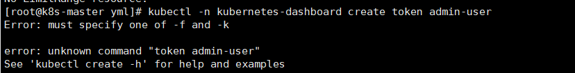

## **自动补全**

https://kubernetes.io/zh/docs/tasks/tools/included/optional-kubectl-configs-bash-linux/

```sh
# 安装
yum install bash-completion
# 自动补全
echo 'source <(kubectl completion bash)' >>~/.bashrc
kubectl completion bash >/etc/bash_completion.d/kubectl
source /usr/share/bash-completion/bash_completion
```


# Kubernetes基础入门

以下的所有都先进行基本理解，我们后来会一一详细讲解


## 0、基础知识


以上展示了一个master（主节点）和6个worker（工作节点）的k8s集群

```sh
# docker run  --name hello-pod alpine  是跑一个容器，容器的粒度有点小

kubectl run  hello-pod --image=alpine #跑一个Pod。Pod里面其实也是容器

# 
kubectl get pod  #以前的docker ps -a

## 所有kubectl在master节点运行，把命令请求发给api-server。api-server一系列处理
##  master只负责调度，而worker node才是真正部署应用的。

```


docker是每一个worker节点的运行时环境

kubelet负责控制所有容器的启动停止，保证节点工作正常，已经帮助节点交互master

master节点的关键组件：

- kubelet（监工）：所有节点必备的。控制这个节点所有pod的生命周期以及与api-server交互等工作
- kube-api-server：负责接收所有请求。集群内对集群的任何修改都是通过命令行、ui把请求发给api-server才能执行的。api-server是整个集群操作对内、对外的唯一入口。不包含我们后来部署应用暴露端口的方式
- kube-proxy：整个节点的网络流量负责
- cri：都有容器运行时环境


worker节点：

- kubelet（监工）：所有节点必备的。控制这个节点所有pod的生命周期以及与api-server交互等工作
- kube-proxy：整个节点的网络流量负责
- cri：都有容器运行时环境


## 1、部署一个应用

创建一次部署工作。(自愈机制)

- kubectl create deploy xxxxxx  ：命令行会给api-server发送要部署xxx的请求
- api-server把这个请求保存到etcd

>  **Deployment（部署）**
>
> - 在k8s中，通过发布 Deployment，可以创建应用程序 (docker image) 的实例 (docker container)，这个实例会被包含在称为 **Pod** 的概念中，**Pod** 是 k8s 中最小可管理单元。
> - 在 k8s 集群中发布 Deployment 后，Deployment 将指示 k8s 如何创建和更新应用程序的实例，master 节点将应用程序实例调度到集群中的具体的节点上。
> - 创建应用程序实例后，Kubernetes Deployment Controller 会持续监控这些实例。如果运行实例的 worker 节点关机或被删除，则 Kubernetes Deployment Controller 将在群集中资源最优的另一个 worker 节点上重新创建一个新的实例。**这提供了一种自我修复机制来解决机器故障或维护问题。**
> - 在容器编排之前的时代，各种安装脚本通常用于启动应用程序，但是不能够使应用程序从机器故障中恢复。通过创建应用程序实例并确保它们在集群节点中的运行实例个数，Kubernetes Deployment 提供了一种完全不同的方式来管理应用程序。
> - Deployment 处于 master 节点上，通过发布 Deployment，master 节点会选择合适的 worker 节点创建 Container（即图中的正方体），Container 会被包含在 Pod （即蓝色圆圈）里。


自愈：针对使用Deployment等部署的应用。

**kubectl run ：直接启动一个pod； 不会产生一次部署信息。所以删除就没**

kubectl create deploy： **启动一个Pod**，以及**记录这次部署信息**。所以，这个pod即使挂了，这次部署信息有，就会强制同步到这次部署信息期望的最终结果；kubectl get deploy,pod 都有内容


## 2、应用程序探索

- 了解Kubernetes Pods（容器组）
- 了解Kubernetes Nodes（节点）
- 排查故障

创建 Deployment 后，k8s创建了一个 **Pod（容器组）** 来放置应用程序实例（container 容器）。


### 1、了解Pod

**Pod （容器组）** 是一个k8s中一个抽象的概念，用于存放一组 container（可包含一个或多个 container 容器，即图上正方体)，以及这些 container （容器）的一些共享资源。这些资源包括：

- 共享存储，称为卷(Volumes)，即图上紫色圆柱
- 网络，每个 Pod（容器组）在集群中有个唯一的 IP，pod（容器组）中的 container（容器）共享该IP地址
- container（容器）的基本信息，例如容器的镜像版本，对外暴露的端口等


**Pod（容器组）是 k8s 集群上的最基本的单元**。当我们在 k8s 上创建 Deployment 时，会在**集群上创建包含容器的 Pod (而不是直接创建容器)**。每个Pod都与运行它的 worker 节点（Node）绑定，并保持在那里直到终止或被删除。如果节点（Node）发生故障，则会在群集中的其他可用节点（Node）上运行相同的 Pod（从同样的镜像创建 Container，使用同样的配置，IP 地址不同，Pod 名字不同）。


> TIP
>
> 重要：
>
> - Pod 是一组容器（可包含一个或多个应用程序容器），以及共享存储（卷 Volumes）、IP 地址和有关如何运行容器的信息。
> - 如果多个容器紧密耦合并且需要共享磁盘等资源，则他们应该被部署在同一个Pod（容器组）中。


### 2、了解Node

**Pod（容器组）**总是在 **Node（节点）** 上运行。Node（节点）是 kubernetes 集群中的计算机，可以是虚拟机或物理机。每个 Node（节点）都由 master 管理。一个 Node（节点）可以有多个Pod（容器组），kubernetes master 会根据每个 Node（节点）上可用资源的情况，自动调度 Pod（容器组）到最佳的 Node（节点）上。

每个 Kubernetes Node（节点）至少运行：

- Kubelet，负责 master 节点和 worker 节点之间通信的进程；管理 Pod（容器组）和 Pod（容器组）内运行的 Container（容器）。
- kube-proxy，负责进行流量转发
- 容器运行环境（如Docker）负责下载镜像、创建和运行容器等。


Kubelet启动的Pod每个都有Ip，全集群任意位置均可访问

```sh
kubeadm init \
--apiserver-advertise-address=10.170.11.8 \
--image-repository registry.cn-hangzhou.aliyuncs.com/lfy_k8s_ images \
--kubernetes-version v1.21.0 \
--service-cidr=10.96.0.0/16 \
--pod-network-cidr=192.168.0.0/16

--pod-network-cidr=192.168.0.0/16：pod 的ip范围

calico：网络组件:
【扁平化网络】

```


## 3、应用外部可见

### 1、目标

- 了解 Kubernetes 中的 Service
- 了解 标签(Label) 和 标签选择器(Label Selector) 对象如何与 Service 关联
- 在 Kubernetes 集群外用 Service 暴露应用

### 2、Kubernetes Service 总览

- Kubernetes [Pod](https://kubernetes.io/zh/docs/concepts/workloads/pods/) 是转瞬即逝的。
- Pod 实际上拥有 [生命周期](https://kubernetes.io/zh/docs/concepts/workloads/pods/pod-lifecycle/)。 当一个工作 Node 挂掉后, 在 Node 上运行的 Pod 也会消亡。
- [ReplicaSet](https://kubernetes.io/zh/docs/concepts/workloads/controllers/replicaset/) 会自动地通过创建新的 Pod 驱动集群回到目标状态，以保证应用程序正常运行。
- *Kubernetes 的 Service 是一个抽象层，它定义了一组 Pod 的逻辑集，并为这些 Pod 支持外部流量暴露、负载平衡和服务发现。*
  - Service 使从属 Pod 之间的松耦合成为可能。 和其他 Kubernetes 对象一样, Service 用 YAML [(更推荐)](https://kubernetes.io/zh/docs/concepts/configuration/overview/#general-configuration-tips) 或者 JSON 来定义. Service 下的一组 Pod 通常由 *LabelSelector* (请参阅下面的说明为什么您可能想要一个 spec 中不包含`selector`的服务)来标记。
  - 尽管每个 Pod 都有一个唯一的 IP 地址，但是如果没有 Service ，这些 IP 不会暴露在群集外部。Service 允许您的应用程序接收流量。Service 也可以用在 ServiceSpec 标记`type`的方式暴露
    - *ClusterIP* (默认) - 在集群的内部 IP 上公开 Service 。这种类型使得 Service 只能从集群内访问。
    - *NodePort* - 使用 NAT 在集群中每个选定 Node 的相同端口上公开 Service 。使用`<NodeIP>:<NodePort>` 从集群外部访问 Service。是 ClusterIP 的超集。
    - *LoadBalancer* - 在当前云中创建一个外部负载均衡器(如果支持的话)，并为 Service 分配一个固定的外部IP。是 NodePort 的超集。
    - *ExternalName* - 通过返回带有该名称的 CNAME 记录，使用任意名称(由 spec 中的`externalName`指定)公开 Service。不使用代理。这种类型需要`kube-dns`的v1.7或更高版本。


### 3、Service 和 Label


Service 通过一组 Pod 路由通信。Service 是一种抽象，它允许 Pod 死亡并在 Kubernetes 中复制，而不会影响应用程序。在依赖的 Pod (如应用程序中的前端和后端组件)之间进行发现和路由是由Kubernetes Service 处理的。

Service 匹配一组 Pod 是使用 [标签(Label)和选择器(Selector)](https://kubernetes.io/zh/docs/concepts/overview/working-with-objects/labels), 它们是允许对 Kubernetes 中的对象进行逻辑操作的一种分组原语。标签(Label)是附加在对象上的键/值对，可以以多种方式使用:

- 指定用于开发，测试和生产的对象
- 嵌入版本标签
- 使用 Label 将对象进行分类


## 滚动升级

与应用程序扩展类似，如果暴露了 Deployment，服务（Service）将在更新期间仅对可用的 pod 进行负载均衡。

滚动更新允许以下操作：

- 将应用程序从一个环境提升到另一个环境（通过容器镜像更新）
- 回滚到以前的版本
- 持续集成和持续交付应用程序，无需停机

1.通过命令滚动升级

```sh
#应用升级: tomcat:alpine、tomcat:jre8-alpine
# kubectl set image deployment/my-nginx2  nginx=nginx:1.9.1

##联合jenkins 形成持续集成，灰度发布功能
kubectl set image deployment.apps/tomcat6 tomcat=tomcat:jre8-alpine #可以携带--record参数，记录变更


##回滚升级
### 查看历史记录
kubectl rollout history deployment.apps/tomcat6
kubectl rollout history deploy tomcat6

### 回滚到指定版本
kubectl rollout undo deployment.apps/tomcat6 --to-revision=1
kubectl rollout undo deploy tomcat6 --to-revision=1
```

2.通过yml

修改一下 yml中的image

kubectl apply -f xx.yml


## 配置文件方式

### 部署一个应用

```yaml
apiVersion: apps/v1	#与k8s集群版本有关，使用 kubectl api-versions 即可查看当前集群支持的版本
kind: Deployment	#该配置的类型，我们使用的是 Deployment
metadata:	        #译名为元数据，即 Deployment 的一些基本属性和信息
  name: nginx-deployment	#Deployment 的名称
  labels:	    #标签，可以灵活定位一个或多个资源，其中key和value均可自定义，可以定义多组，目前不需要理解
    app: nginx	#为该Deployment设置key为app，value为nginx的标签
spec:	        #这是关于该Deployment的描述，可以理解为你期待该Deployment在k8s中如何使用
  replicas: 1	#使用该Deployment创建一个应用程序实例
  selector:	    #标签选择器，与上面的标签共同作用，目前不需要理解
    matchLabels: #选择包含标签app:nginx的资源
      app: nginx
  template:	    #这是选择或创建的Pod的模板
    metadata:	#Pod的元数据
      labels:	#Pod的标签，上面的selector即选择包含标签app:nginx的Pod
        app: nginx
    spec:	    #期望Pod实现的功能（即在pod中部署）
      containers:	#生成container，与docker中的container是同一种
      - name: nginx	#container的名称
        image: nginx:1.7.9	#使用镜像nginx:1.7.9创建container，该container默认80端口可访问

```

> kubectl apply -f xxx.yaml

### 暴露应用

```yaml
apiVersion: v1
kind: Service
metadata:
  name: nginx-service	#Service 的名称
  labels:     	#Service 自己的标签
    app: nginx	#为该 Service 设置 key 为 app，value 为 nginx 的标签
spec:	    #这是关于该 Service 的定义，描述了 Service 如何选择 Pod，如何被访问
  selector:	    #标签选择器
    app: nginx	#选择包含标签 app:nginx 的 Pod
  ports:
  - name: nginx-port	#端口的名字
    protocol: TCP	    #协议类型 TCP/UDP
    port: 80	        #集群内的其他容器组可通过 80 端口访问 Service
    nodePort: 32600   #通过任意节点的 32600 端口访问 Service
    targetPort: 80	#将请求转发到匹配 Pod 的 80 端口
  type: NodePort	#Serive的类型，ClusterIP/NodePort/LoaderBalancer

```

# k8s对象

 https://kubernetes.io/zh/docs/concepts/overview/working-with-objects/kubernetes-objects/ 

Kubernetes对象指的是Kubernetes系统的持久化实体，所有这些对象合起来，代表了集群的实际情况。常规的应用里，我们把应用程序的数据存储在数据库中，**Kubernetes将其数据以Kubernetes对象的形式通过 api server存储在 etcd 中**。**笼统的说，yml描述的就是对象**。具体来说，这些数据（Kubernetes对象）描述了：

- 集群中运行了哪些容器化应用程序（以及在哪个节点上运行）
- 集群中对应用程序可用的资源（网络，存储等）
- 应用程序相关的策略定义，例如，重启策略、升级策略、容错策略
- 其他Kubernetes管理应用程序所需要的信息时，scheduler先计算应该去哪个节点部署

> 对象的spec和status
>
> 每一个 Kubernetes 对象都包含了两个重要的字段：
>
> - `spec` 必须由您来提供，描述了您对该对象所期望的 **目标状态**
> - `status` 只能由 Kubernetes 系统来修改，描述了该对象在 Kubernetes 系统中的 **实际状态**
>
> Kubernetes通过对应的 **控制器**，**不断地使实际状态趋向于您期望的目标状态** 

## k8s对象yml的结构

**必填字段**

在上述的 `.yml` 文件中，如下字段是必须填写的：

- **apiVersion**：用来创建对象时所使用的Kubernetes API版本
- **kind** ：被创建对象的类型
- **metadata**： 用于唯一确定该对象的元数据：包括 `name` 和 `namespace`，如果 `namespace` 为空，则默认值为 `default`
- **spec** ：描述您对该对象的期望状态

## 对象名称

 Kubernetes REST API 中，所有的对象都是通过 `name` 和 `UID` 唯一性确定 

可以通过 `namespace` + `name` 唯一性地确定一个 RESTFUL 对象，例如：

```http
/api/v1/namespaces/{namespace}/pods/{name}
```

> **Names**

同一个名称空间下，同一个类型的对象，可以通过 `name` 唯一性确定。如果删除该对象之后，可以再重新创建一个同名对象。

依据命名规则，Kubernetes对象的名字应该：

- 最长不超过 253个字符
- 必须由小写字母、数字、减号 `-`、小数点 `.` 组成
- 某些资源类型有更具体的要求

例如，下面的配置文件定义了一个 name 为 `nginx-demo` 的 Pod，该 Pod 包含一个 name 为 `nginx` 的容器：

```yaml
apiVersion: v1
kind: Pod
metadata:
  name: nginx-demo  ##pod的名字
spec:
  containers:
  - name: nginx     ##容器的名字
    image: nginx:1.7.9
    ports:
    - containerPort: 80 UIDs
```

> **UID**

UID 是由 Kubernetes 系统生成的，唯一标识某个 Kubernetes 对象的字符串。

Kubernetes集群中，每创建一个对象，都有一个唯一的 UID。用于区分多次创建的同名对象（如前所述，按照名字删除对象后，重新再创建同名对象时，两次创建的对象 name 相同，但是 UID 不同。）

## 名称空间

```sh
kubectl get namespaces

kubectl describe namespaces <name>
```

Kubernetes 安装成功后，默认有初始化了三个名称空间：

- **default** 默认名称空间，如果 Kubernetes 对象中不定义 `metadata.namespace` 字段，该对象将放在此名称空间下
- **kube-system** Kubernetes系统创建的对象放在此名称空间下
- **kube-public** 此名称空间自动在安装集群是自动创建，并且所有用户都是可以读取的（即使是那些未登录的用户）。主要是为集群预留的，例如，某些情况下，某些Kubernetes对象应该被所有集群用户看到。


> 访问其他名称空间的东西？(名称空间资源隔离，网络不隔离)
>
> 1）、配置直接拿来用。不行
>
> 2）、网络访问，可以。


> 创建名称空间
>
> ```yaml
> apiVersion: v1
> kind: Namespace
> metadata:
> name: <名称空间的名字>
> 
> apiVersion: v1
> kind: Namespace
> metadata:
> creationTimestamp: null
> name: k8s-03
> spec: {}
> status: {}
> 
> ```
>
> ```sh
> kubectl create -f ./my-namespace.yaml
> ```
>
> ```sh
> #直接用命令
> kubectl create namespace <名称空间的名字>
> #删除
> kubectl delete namespaces <名称空间的名字>
> ```

名称空间的名字必须与 DNS 兼容：

- 不能带小数点 `.`
- 不能带下划线 `_`
- 使用数字、小写字母和减号 `-` 组成的字符串

 默认情况下，安装Kubernetes集群时，会初始化一个 `default` 名称空间，用来将承载那些未指定名称空间的 Pod、Service、Deployment等对象 


> 为请求设置命名空间
>
> ```sh
> #要为当前请求设置命名空间，请使用 --namespace 参数。
> 
> kubectl run nginx --image=nginx --namespace=<insert-namespace-name-here>
> kubectl get pods --namespace=<name>
> ```
>
> ```yaml
> #在对象yaml中使用命名空间
> apiVersion: v1
> kind: Pod
> metadata:
> name: nginx-demo  ##pod的名字
> namespace: default #不写就是default
> spec:
> containers:
>      - name: nginx     ##容器的名字
>      image: nginx:1.7.9
>      ports:
>        - containerPort: 80
> ```
>
> 当您创建一个 [Service](https://kubernetes.io/docs/user-guide/services) 时，Kubernetes 会创建一个相应的 [DNS 条目](https://kubernetes.io/docs/concepts/services-networking/dns-pod-service/)。
>
> 该条目的形式是 <service-name>.<namespace-name>.svc.cluster.local ，这意味着如果容器只使用 ``，它将被解析到本地命名空间的服务。这对于跨多个命名空间（如开发、分级和生产）使用相同的配置非常有用。如果您希望跨命名空间访问，则需要使用完全限定域名（FQDN）。

**并非所有对象都在命名空间中**

大多数 kubernetes 资源（例如 Pod、Service、副本控制器等）都位于某些命名空间中。但是命名空间资源本身并不在命名空间中。而且底层资源，例如 [nodes](https://kubernetes.io/docs/admin/node) 和持久化卷不属于任何命名空间。

查看哪些 Kubernetes 资源在命名空间中，哪些不在命名空间中：

```sh
# In a namespace
kubectl api-resources --namespaced=true
# Not in a namespace
kubectl api-resources --namespaced=false
```

## 标签和选择器

 标签（Label）是附加在Kubernetes对象上的一组名值对，其意图是按照对用户有意义的方式来标识Kubernetes对象，同时，又不对Kubernetes的核心逻辑产生影响。标签可以用来组织和选择一组Kubernetes对象。您可以在创建Kubernetes对象时为其添加标签，也可以在创建以后再为其添加标签。每个Kubernetes对象可以有多个标签，**同一个对象的标签的 Key 必须唯一**。

 使用标签（Label）可以高效地查询和监听Kubernetes对象，在Kubernetes界面工具（如 Kubenetes Dashboard 或 Kuboard）和 kubectl 中，标签的使用非常普遍。那些非标识性的信息应该记录在 **注解（annotation）**

> 为什么要使用标签

使用标签，用户可以按照自己期望的形式组织 Kubernetes 对象之间的结构，而无需对 Kubernetes 有任何修改。

应用程序的部署或者批处理程序的部署通常都是多维度的（例如，多个高可用分区、多个程序版本、多个微服务分层）。管理这些对象时，很多时候要针对某一个维度的条件做整体操作，例如，将某个版本的程序整体删除，这种情况下，如果用户能够事先规划好标签的使用，再通过标签进行选择，就会非常地便捷。

标签的例子有：

- `release: stable`、`release: canary`
- `environment: dev`、`environment: qa`、`environment: production`
- `tier: frontend`、`tier: backend`、`tier: cache`
- `partition: customerA`、`partition: customerB`
- `track: daily`、`track: weekly`

上面只是一些使用比较普遍的标签，您可以根据您自己的情况建立合适的使用标签的约定。

> 句法和字符集

标签是一组名值对（key/value pair）。标签的 key 可以有两个部分：可选的前缀和标签名，通过 `/` 分隔。

- 标签名：
  - 标签名部分是必须的
  - 不能多于 63 个字符
  - 必须由字母、数字开始和结尾
  - 可以包含字母、数字、减号`-`、下划线`_`、小数点`.`
- 标签前缀：
  - 标签前缀部分是可选的
  - 如果指定，必须是一个DNS的子域名，例如：k8s.eip.work
  - 不能多于 253 个字符
  - 使用 `/` 和标签名分隔

如果省略标签前缀，则标签的 key 将被认为是专属于用户的。Kubernetes的系统组件（例如，kube-scheduler、kube-controller-manager、kube-apiserver、kubectl 或其他第三方组件）向用户的Kubernetes对象添加标签时，必须指定一个前缀。`kubernetes.io/` 和 `k8s.io/` 这两个前缀是 Kubernetes 核心组件预留的。

标签的 value 必须：

- 不能多于 63 个字符
- 可以为空字符串
- 如果不为空，则
  - 必须由字母、数字开始和结尾
  - 可以包含字母、数字、减号`-`、下划线`_`、小数点`.`

```yaml
apiVersion: v1
kind: Pod
metadata:
  name: label-demo
  labels:
    environment: production
    app: nginx
spec:
  containers:
  - name: nginx
    image: nginx:1.7.9
    ports:
    - containerPort: 80
```


**标签选择器**

通常来讲，会有多个Kubernetes对象包含相同的标签。通过使用标签选择器（label selector），用户/客户端可以选择一组对象。标签选择器（label selector）是 Kubernetes 中最主要的分类和筛选手段。

Kubernetes api server支持两种形式的标签选择器，`equality-based 基于等式的` 和 `set-based 基于集合的`。标签选择器可以包含多个条件，并使用逗号分隔，此时只有满足所有条件的 Kubernetes 对象才会被选中

> 使用基于等式的选择方式,可以使用三种操作符 =、==、!=。前两个操作符含义是一样的，都代表相等，后一个操作符代表不相等

```shell
#找label是environment=production,tier=frontend的
kubectl get pods -l environment=production,tier=frontend
```

> 使用基于集合的选择方式
>
> ```sh
> Set-based 标签选择器可以根据标签名的一组值进行筛选。支持的操作符有三种：in、notin、exists。例如
> # 选择所有的包含 `environment` 标签且值为 `production` 或 `qa` 的对象
> environment in (production, qa)
> # 选择所有的 `tier` 标签不为 `frontend` 和 `backend`的对象，或不含 `tier` 标签的对象
> tier notin (frontend, backend)
> # 选择所有包含 `partition` 标签的对象
> partition
> # 选择所有不包含 `partition` 标签的对象
> !partition
> 
> # 选择包含 `partition` 标签（不检查标签值）且 `environment` 不是 `qa` 的对象
> partition,environment notin (qa)
> 
> 
> kubectl get pods -l 'environment in (production),tier in (frontend)'
> ```

```yaml
#Job、Deployment、ReplicaSet 和 DaemonSet 同时支持基于等式的选择方式和基于集合的选择方式。例如：
selector:
  matchLabels:
    component: redis
  matchExpressions:
    - {key: tier, operator: In, values: [cache]}
    - {key: environment, operator: NotIn, values: [dev]}

# matchLabels 是一个 {key,value} 组成的 map。map 中的一个 {key,value} 条目相当于 matchExpressions 中的一个元素，其 key 为 map 的 key，operator 为 In， values 数组则只包含 value 一个元素。matchExpression 等价于基于集合的选择方式，支持的 operator 有 In、NotIn、Exists 和 DoesNotExist。当 operator 为 In 或 NotIn 时，values 数组不能为空。所有的选择条件都以 AND 的形式合并计算，即所有的条件都满足才可以算是匹配
```

```shell
#添加或者修改标签
kubectl label --help
# Update pod 'foo' with the label 'unhealthy' and the value 'true'.
kubectl label pods foo unhealthy=true

# Update pod 'foo' with the label 'status' and the value 'unhealthy', overwriting any existing value.
kubectl label --overwrite pods foo status=unhealthy

# Update all pods in the namespace
kubectl label pods --all status=unhealthy

# Update a pod identified by the type and name in "pod.json"
kubectl label -f pod.json status=unhealthy

# Update pod 'foo' only if the resource is unchanged from version 1.
kubectl label pods foo status=unhealthy --resource-version=1

# Update pod 'foo' by removing a label named 'bar' if it exists.
# Does not require the --overwrite flag.
kubectl label pods foo bar-

```

## 注解annotation

 注解（annotation）可以用来向 Kubernetes 对象的 `metadata.annotations` 字段添加任意的信息。Kubernetes 的客户端或者自动化工具可以存取这些信息以实现其自定义的逻辑。 

```yaml
metadata:
  annotations:
    key1: value1
    key2: value2
```

## 字段选择器

*字段选择器*（*Field selectors*）允许您根据一个或多个资源字段的值[筛选 Kubernetes 资源](https://kubernetes.io/docs/concepts/overview/working-with-objects/kubernetes-objects)。 下面是一些使用字段选择器查询的例子：

- `metadata.name=my-service`
- `metadata.namespace!=default`
- `status.phase=Pending`

```sh
kubectl get pods --field-selector status.phase=Running
```

## 认识kubectl和kubelet

- kubeadm安装的集群。二进制后来就是  yum install etcd  api-server
  - 认识核心文件夹  /etc/kubernetes .   以Pod方式安装的核心组件。
    - etcd，api-server，scheduler。（安装k8s的时候，yum kubeadm **kubelet** kubectl）
  - 回顾集群安装的时候，[为什么只有master节点的kubectl可以操作集群](https://kubernetes.io/zh/docs/reference/kubectl/overview/)
  - kubelet额外参数配置  **/etc/sysconfig/kubelet**；kubelet配置位置 /var/lib/kubelet/config.yaml


# 镜像

Kubernetes中，默认的镜像抓取策略是 `IfNotPresent`，使用此策略，kubelet在发现本机有镜像的情况下，不会向镜像仓库抓取镜像。如果您期望每次启动 Pod 时，都强制从镜像仓库抓取镜像，可以尝试如下方式： 

- 设置 container 中的 `imagePullPolicy` 为 `Always`
- 省略 `imagePullPolicy` 字段，并使用 `:latest` tag 的镜像
- 省略 `imagePullPolicy` 字段和镜像的 tag
- 激活 [AlwaysPull images](https://kubernetes.io/docs/reference/access-authn-authz/admission-controllers/#alwayspull images) 管理控制器

## **下载私有仓库镜像**

```sh
#这个秘钥默认在default名称空间，不能被hello名称空间共享
kubectl create secret -n hello docker-registry my-aliyun \
  --docker-server=registry.cn-hangzhou.aliyuncs.com \
  --docker-username=forsumlove \
  --docker-password=lfy11223344
```

```yaml
apiVersion: v1
kind: Pod
metadata:
  name: foo
spec:
  containers:
    - name: foo
      image: registry.cn-zhangjiakou.aliyuncs.com/atguigudocker/atguigu-java-img:v1.0
  imagePullSecrets:
    - name: mydocker
```


## 启动命令


## 环境变量

 env指定即可

## 生命周期容器钩子

Kubernetes中为容器提供了两个 hook（钩子函数）：

- `PostStart`

  此钩子函数在容器创建后将立刻执行。但是，并不能保证该钩子函数在容器的 `ENTRYPOINT` 之前执行。该钩子函数没有输入参数。

- `PreStop`

  此钩子函数在容器被 terminate（终止）之前执行，例如：

  - 通过接口调用删除容器所在 Pod
  - 某些管理事件的发生：健康检查失败、资源紧缺等

  如果容器已经被关闭或者进入了 `completed` 状态，preStop 钩子函数的调用将失败。该函数的执行是同步的，即，kubernetes 将在该函数完成执行之后才删除容器。该钩子函数没有输入参数。

```yaml
apiVersion: v1
kind: Pod
metadata:
  name: lifecycle-demo
spec:
  containers:
  - name: lifecycle-demo-container
    image: alpine
    command: ["/bin/sh", "-c", "echo hello; "]
    volumeMounts:
       - name: mount1
       	 mountPath: /app
    lifecycle:
      postStart:
        exec:
          command: ["/bin/sh", "-c", "echo world;"]
      preStop:
        exec:
          command: ["/bin/sh","-c","echo 66666;"]
```

- Kubernetes 在容器启动后立刻发送 postStart 事件，但是并不能确保 postStart 事件处理程序在容器的 EntryPoint 之前执行。postStart 事件处理程序相对于容器中的进程来说是异步的（同时执行），然而，Kubernetes 在管理容器时，将一直等到 postStart 事件处理程序结束之后，才会将容器的状态标记为 Running。
- Kubernetes 在决定关闭容器时，立刻发送 preStop 事件，并且，将一直等到 preStop 事件处理程序结束或者 Pod 的 `--grace-period` 超时，才删除容器

## 资源限制

```yaml
pods/qos/qos-pod.yaml 

apiVersion: v1
kind: Pod
metadata:
  name: qos-demo
  namespace: qos-example
spec:
  containers:
  - name: qos-demo-ctr
    image: nginx
    resources:
    # 
      limits:  # 限制最大大小   -Xmx
        memory: "200Mi"
        cpu: "700m" 
        # 启动默认给分配的大小   -Xms
      requests:
        memory: "200Mi"
        cpu: "700m"
```


# Kubernetes 工作负载

> 什么是工作负载（Workloads）
>
> - 工作负载是运行在 Kubernetes 上的一个应用程序。
> - 一个应用很复杂，可能由单个组件或者多个组件共同完成。无论怎样我们可以用一组Pod来表示一个应用，也就是一个工作负载
> - Pod又是一组容器（Containers）
> - 所以关系又像是这样
>   - 工作负载（Workloads）控制一组Pod
>   - Pod控制一组容器（Containers）
>     - 比如Deploy（工作负载） 3个副本的nginx（3个Pod），每个nginx里面是真正的nginx容器（container）


**工作负载能让Pod能拥有自恢复能力。**

## Pod

### 什么是Pod

- *Pod*是一组（一个或多个） [容器（docker容器）](https://kubernetes.io/zh/docs/concepts/overview/what-is-kubernetes/#why-containers)的集合 （就像在豌豆荚中）；这些容器共享存储、网络、以及怎样运行这些容器的声明。
- 
- 我们一般不直接创建Pod，而是创建一些工作负载由他们来创建Pod
- Pod的形式
  - Pod对容器有自恢复能力（Pod自动重启失败的容器）
  - Pod自己不能恢复自己，Pod被删除就真的没了，还是希望k8s集群能自己在其他地方再启动这个Pod
  - 单容器Pod
  - 多容器协同Pod。我们可以把另外的容器称为**`SideCar（为应用赋能）`**
  - Pod 天生地为其成员容器提供了两种共享资源：[网络](https://kubernetes.io/zh/docs/concepts/workloads/pods/#pod-networking)和 [存储](https://kubernetes.io/zh/docs/concepts/workloads/pods/#pod-storage)。
- 一个Pod由一个**Pause容器**设置好整个Pod里面所有容器的网络、名称空间等信息
- systemctl status可以观测到。Pod和容器进程关系
  - kubelet启动一个Pod，准备两个容器，一个是Pod声明的应用容器（nginx），另外一个是Pause。Pause给当前应用容器设置好网络空间各种的。
  - 


> 编写yaml测试：多容器协同

### Pod使用

- 可以编写deploy等各种工作负载的yaml文件，最终创建出pod，也可以直接创建

- Pod的模板如下

- ```yaml
      # 这里是 Pod 模版
      apiVersion: v1
      kind: Pod
      metadata:
        name: my-pod
      spec:
        containers:
        - name: hello
          image: busybox
          command: ['sh', '-c', 'echo "Hello, Kubernetes!" && sleep 3600']
        restartPolicy: OnFailure
      # 以上为 Pod 模版
  ```


### 挂载

> 挂载分为 匿名挂载和卷挂载，和docker类似。

**卷挂载**

~~~sh
apiVersion: v1
kind: Pod
metadata:
  name: "pod-probe"
  namespace: default
  labels:
    app: "mynginx"
spec:
  volumes: #外部主机位置
  - name: nginx-vol
    hostPath:
      path: /app
  - name: nginx-html
    hostPath:
      path: /html
  containers:
  - name: pod-probe
    image: nginx
    volumeMounts:  #容器里的位置
    - name: nginx-vol
      mountPath: /app
    - name: nginx-html
      mountPath: /usr/share/nginx/html
  
~~~

**匿名挂载**

~~~sh
apiVersion: v1
kind: Pod
metadata:
  name: "pod-volume"
  namespace: default
  labels:
    app: "pod-volume"
spec:
  volumes:   #外部主机位置
  - name: nginx-vol
    emptyDir: {}  ### docker匿名挂载，外部创建一个位置  比如/abc
  containers: 
  - name: nginx-container
    image: "nginx"
    volumeMounts:  #容器里的位置
      - name: nginx-vol 
        mountPath: /usr/share/nginx/html
  - name: content-container
    image: "alpine"
    command: ["/bin/sh","-c","while true;do sleep 1; date > /app/index.html;done;"]
    volumeMounts: 
      - name: nginx-vol
        mountPath: /app
~~~


### Pod生命周期


- Pod启动，会先**依次**执行所有初始化容器，有一个失败，则Pod不能启动
- 接下来**启动所有的应用容器**（每一个应用容器都必须能一直运行起来），Pod开始正式工作，一个启动失败就会**尝试重启Pod内的这个容器**，Pod只要是NotReady，Pod就不对外提供服务了

>  编写yaml测试生命周期
>
>  - 应用容器生命周期钩子**(postStart->preStop)**
>
>  - 初始化容器（也可以有钩子）


临时容器：线上排错。

有些容器基础镜像。线上没法排错。使用临时容器进入这个Pod。临时容器共享了Pod的所有。临时容器有Debug的一些命令，排错完成以后，只要exit退出容器，临时容器自动删除


Java：dump，  jre 50mb。jdk 150mb

jre 50mb。: jdk作为临时容器


>  临时容器需要开启特性门控  --feature-gates="EphemeralContainers=true"
>
>  在所有组件，api-server、kubelet、scheduler、controller-manager都得配置

1.21.0： 生产环境  .5

使用临时容器的步骤：

1、声明一个临时容器。准备好json文件

```json
{
    "apiVersion": "v1",
    "kind": "EphemeralContainers",
    "metadata": {
            "name": "my-nginx666" //指定Pod的名字
    },
    "ephemeralContainers": [{
        "command": [
            "sh"
        ],
        "image": "busybox",  //jre的需要jdk来调试
        "imagePullPolicy": "IfNotPresent",
        "name": "debugger",
        "stdin": true,
        "tty": true,
        "terminationMessagePolicy": "File"
    }]
}
```

2、使用临时容器，应用一下即可

```shell
kubectl replace --raw /api/v1/namespaces/default/pods/my-nginx666【pod名】/ephemeralcontainers  -f ec.json
```


### 静态Pod

在  **/etc/kubernetes/manifests** 位置放的所有Pod.yaml文件，机器启动kubelet自己就把他启动起来。

静态Pod一直守护在他的这个机器上

### Probe 探针机制（健康检查机制）

- 每个容器三种探针（Probe）

  - **启动探针**（后来才加的） **一次性成功探针。**  只要启动成功了

    - kubelet 使用启动探针，来检测应用是否已经启动。如果启动就可以进行后续的探测检查。慢容器一定指定启动探针。一直在等待启动
    - **启动探针 成功以后就不用了，剩下存活探针和就绪探针持续运行**

  - **存活探针**

    - kubelet 使用存活探针，来检测容器是否正常存活。（有些容器可能产生死锁【应用程序在运行，但是无法继续执行后面的步骤】），`如果检测失败就会重新启动这个容器`
    - initialDelaySeconds：  3600（长了导致可能应用一段时间不可用）    5（短了陷入无限启动循环）

  - **就绪探针**（不会restart容器）

    - kubelet 使用就绪探针，来检测容器是否准备**好了可以接收流量**。当一个 Pod 内的所有容器都准备好了，才能把这个 Pod 看作就绪了。用途就是：Service后端负载均衡多个Pod，如果某个Pod还没就绪，就会从service负载均衡里面剔除

    


-------------

- [Probe](https://kubernetes.io/docs/reference/generated/kubernetes-api/v1.21/#probe-v1-core)配置项
  - `initialDelaySeconds`：容器启动后要等待多少秒后存活和就绪探测器才被初始化，默认是 0 秒，最小值是 0。这是针对以前没有
  - `periodSeconds`：执行探测的时间间隔（单位是秒）。默认是 10 秒。**最小值是 1**。
  - `successThreshold`：探测器在失败后，被视为成功的最小连续成功数。**默认值是 1**。 
    - 存活和启动探针的这个值必须是 1。最小值是 1。
  - `failureThreshold`：当探测失败时，Kubernetes 的重试次数。 存活探测情况下的放弃就意味着重新启动容器。 就绪探测情况下的放弃 Pod 会被打上未就绪的标签。**默认值是 3**。最小值是 1。
  - `timeoutSeconds`：探测的超时后等待多少秒。**默认值是 1 秒**。最小值是 1。 

https://kubernetes.io/zh/docs/tasks/configure-pod-container/configure-liveness-readiness-startup-probes/#configure-probes

```yaml
   exec、httpGet、tcpSocket 【哪种方式探测】
   
   
   

   failureThreshold

   

   initialDelaySeconds

   periodSeconds

   successThreshold

   

   terminationGracePeriodSeconds

   timeoutSeconds	<integer>

```


> 编写yaml测试探针机制

```yaml
apiVersion: v1
kind: Pod
metadata:
  name: "pod-probe"
  namespace: default
  labels:
    app: "mynginx"
spec:
  containers:
  - name: pod-probe
    image: nginx
    volumeMounts:
    - name: nginx-vol
      mountPath: /app
    - name: nginx-html
      mountPath: /usr/share/nginx/html
    startupProbe: #启动探针
      exec:
        command:  ["/bin/sh","-c","cat /app/abc"]  ## 返回不是0，那就是探测失败
      # initialDelaySeconds: 20 ## 指定的这个秒以后才执行探测
      periodSeconds: 5  ## 每隔几秒来运行这个
      timeoutSeconds: 5  ##探测超时，到了超时时间探测还没返回结果说明失败
      successThreshold: 1 ## 成功阈值，连续几次成才算成功
      failureThreshold: 3 ## 失败阈值，连续几次失败才算真失败
    livenessProbe:   ##存活探针，nginx容器有没有 /abc.html
      exec:
        command:  ["/bin/sh","-c","cat /usr/share/nginx/html/abc.html"]  ## 返回不是0，那就是探测失败
      # initialDelaySeconds: 20 ## 指定的这个秒以后才执行探测
      periodSeconds: 5  ## 每隔几秒来运行这个
      timeoutSeconds: 5  ##探测超时，到了超时时间探测还没返回结果说明失败
      successThreshold: 1 ## 成功阈值，连续几次成才算成功
      failureThreshold: 3 ## 失败阈值，连续几次失败才算真失败
    readinessProbe: ##就绪检测，都是http
      httpGet:  
        # host: 127.0.0.1  ###不行
        path: /abc.html  ## 给容器发请求
        port: 80
        scheme: HTTP ## 返回不是0，那就是探测失败
      initialDelaySeconds: 2 ## 指定的这个秒以后才执行探测
      periodSeconds: 5  ## 每隔几秒来运行这个
      timeoutSeconds: 5  ##探测超时，到了超时时间探测还没返回结果说明失败
      successThreshold: 3 ## 成功阈值，连续几次成才算成功
      failureThreshold: 5 ## 失败阈值，连续几次失败才算真失败
  volumes:
    - name: nginx-vol
      hostPath:
        path: /app
    - name: nginx-html
      hostPath:
        path: /html
```


微服务。   /health

K8S检查当前应用的状态；connection refuse；

SpringBoot 优雅停机：gracefulShowdown: true

pod.spec.**terminationGracePeriodSeconds** = 30s  优雅停机；给一个缓冲时间


健康检查+优雅停机 = 0宕机

start完成以后，liveness和readness并存。   liveness失败导致重启。readness失败导致不给Service负载均衡网络中加，不接受流量。  kubectl exec -it 就进不去。Kubectl describe 看看咋了。


## Deployment

### 什么是Deployment

- 一个 *Deployment* 为 [Pods](https://kubernetes.io/docs/concepts/workloads/pods/pod-overview/) 和 [ReplicaSets](https://kubernetes.io/zh/docs/concepts/workloads/controllers/replicaset/) 提供声明式的更新能力。 
- 你负责描述 Deployment 中的 *目标状态*，而 Deployment [控制器（Controller）](https://kubernetes.io/zh/docs/concepts/architecture/controller/) 以受控速率更改**实际状态**， 使其变为**期望状态**；控制循环。 for(){ xxx  controller.spec()}
- 不要管理 Deployment 所拥有的 ReplicaSet 
- 我们部署一个应用一般不直接写Pod，而是部署一个Deployment
- Deploy编写规约 https://kubernetes.io/zh/docs/concepts/workloads/controllers/deployment/#writing-a-deployment-spec

### Deployment创建

- 基本格式
  - `.metadata.name`指定deploy名字
  - `replicas` 指定副本数量
  - `selector` 指定匹配的Pod模板。
  - `template` 声明一个Pod模板

> 编写一个Deployment的yaml
>
> 赋予Pod自愈和故障转移能力。


- 在检查集群中的 Deployment 时，所显示的字段有：
  - `NAME` 列出了集群中 Deployment 的名称。
  - `READY` 显示应用程序的可用的 *副本* 数。显示的模式是“就绪个数/期望个数”。
  - `UP-TO-DATE` 显示为了达到期望状态已经更新的副本数。
  - `AVAILABLE` 显示应用可供用户使用的副本数。
  - `AGE` 显示应用程序运行的时间。

- ReplicaSet 输出中包含以下字段：
  - `NAME` 列出名字空间中 ReplicaSet 的名称；
  - `DESIRED` 显示应用的期望副本个数，即在创建 Deployment 时所定义的值。 此为期望状态；
  - `CURRENT` 显示当前运行状态中的副本个数；
  - `READY` 显示应用中有多少副本可以为用户提供服务；
  - `AGE` 显示应用已经运行的时间长度。
  - 注意：ReplicaSet 的名称始终被格式化为`[Deployment名称]-[随机字符串]`。 其中的随机字符串是使用 pod-template-hash 作为种子随机生成的。

>  一个Deploy产生三个
>
>  - Deployment资源
>  - replicaset资源
>  - Pod资源
>
>  Deployment控制RS，RS控制Pod的副本数
>
>  ReplicaSet： 只提供了副本数量的控制功能
>
>  Deployment：   每部署一个新版本就会创建一个新的副本集，利用他记录状态，回滚也是直接让指定的rs生效
>
>    ---   rs1： 4       abc    
>
>    ---    rs2:  4        def
>
>    ---    rsN:  4     eee
>
>  nginx=111   nginx:v1=2222  nginx:v2=3333


### Deployment 更新机制

- 仅当 Deployment Pod 模板（即 `.spec.template`）发生改变时，例如**模板的标签或容器镜像被更新， 才会触发 Deployment 上线**。 **其他更新（如对 Deployment 执行扩缩容的操作）不会触发上线动作。**
- **上线动作 原理： 创建新的rs，准备就绪后，替换旧的rs（此时不会删除，因为`revisionHistoryLimit` 指定了保留几个版本）**

- 常用的kubectl 命令

```sh
################更新#################################
#kubectl  set image  deployment资源名  容器名=镜像名
kubectl set image deployment.apps/nginx-deployment php-redis=tomcat:8 --record
## yaml提取可更新的关键所有字段计算的hash。
web---- /hello
postman   aservice- /hello

#或者直接修改定义也行
kubectl edit deployment.v1.apps/nginx-deployment
#查看状态
kubectl rollout status deployment.v1.apps/nginx-deployment

################查看历史并回滚####################################
#查看更新历史-看看我们设置的历史总记录数是否生效了
kubectl rollout history deployment.v1.apps/nginx-deployment
#回滚
kubectl rollout undo deployment.v1.apps/nginx-deployment --to-revision=2

###############累计更新##############
#暂停记录版本
kubectl rollout pause deployment.v1.apps/nginx-deployment
#多次更新操作。
##比如更新了资源限制
kubectl set resources deployment.v1.apps/nginx-deployment -c=nginx --limits=cpu=200m,memory=512Mi
##比如更新了镜像版本
kubectl set image deployment.apps/nginx-deployment php-redis=tomcat:8
##在继续操作多次
##看看历史版本有没有记录变化
kubectl rollout history deployment.v1.apps/nginx-deployment
#让多次累计生效
kubectl rollout resume deployment.v1.apps/nginx-deployment
```


### *比例缩放（Proportional Scaling）*

maxSurge（最大增量）：除当前数量外还要添加多少个实例。

maxUnavailable（最大不可用量）：滚动更新过程中的不可用实例数。


### *HPA（动态扩缩容）*

概念：https://kubernetes.io/zh/docs/tasks/run-application/horizontal-pod-autoscale/#scaling-policies

实战：https://kubernetes.io/zh/docs/tasks/run-application/horizontal-pod-autoscale-walkthrough/


- 需要先安装metrics-server

https://github.com/kubernetes-sigs/metrics-server

- 安装步骤

  - ```yaml
    apiVersion: v1
    kind: ServiceAccount
    metadata:
      labels:
        k8s-app: metrics-server
      name: metrics-server
      namespace: kube-system
    ---
    apiVersion: rbac.authorization.k8s.io/v1
    kind: ClusterRole
    metadata:
      labels:
        k8s-app: metrics-server
        rbac.authorization.k8s.io/aggregate-to-admin: "true"
        rbac.authorization.k8s.io/aggregate-to-edit: "true"
        rbac.authorization.k8s.io/aggregate-to-view: "true"
      name: system:aggregated-metrics-reader
    rules:
    - apiGroups:
      - metrics.k8s.io
      resources:
      - pods
      - nodes
      verbs:
      - get
      - list
      - watch
    ---
    apiVersion: rbac.authorization.k8s.io/v1
    kind: ClusterRole
    metadata:
      labels:
        k8s-app: metrics-server
      name: system:metrics-server
    rules:
    - apiGroups:
      - ""
      resources:
      - pods
      - nodes
      - nodes/stats
      - namespaces
      - configmaps
      verbs:
      - get
      - list
      - watch
    ---
    apiVersion: rbac.authorization.k8s.io/v1
    kind: RoleBinding
    metadata:
      labels:
        k8s-app: metrics-server
      name: metrics-server-auth-reader
      namespace: kube-system
    roleRef:
      apiGroup: rbac.authorization.k8s.io
      kind: Role
      name: extension-apiserver-authentication-reader
    subjects:
    - kind: ServiceAccount
      name: metrics-server
      namespace: kube-system
    ---
    apiVersion: rbac.authorization.k8s.io/v1
    kind: ClusterRoleBinding
    metadata:
      labels:
        k8s-app: metrics-server
      name: metrics-server:system:auth-delegator
    roleRef:
      apiGroup: rbac.authorization.k8s.io
      kind: ClusterRole
      name: system:auth-delegator
    subjects:
    - kind: ServiceAccount
      name: metrics-server
      namespace: kube-system
    ---
    apiVersion: rbac.authorization.k8s.io/v1
    kind: ClusterRoleBinding
    metadata:
      labels:
        k8s-app: metrics-server
      name: system:metrics-server
    roleRef:
      apiGroup: rbac.authorization.k8s.io
      kind: ClusterRole
      name: system:metrics-server
    subjects:
    - kind: ServiceAccount
      name: metrics-server
      namespace: kube-system
    ---
    apiVersion: v1
    kind: Service
    metadata:
      labels:
        k8s-app: metrics-server
      name: metrics-server
      namespace: kube-system
    spec:
      ports:
      - name: https
        port: 443
        protocol: TCP
        targetPort: https
      selector:
        k8s-app: metrics-server
    ---
    apiVersion: apps/v1
    kind: Deployment
    metadata:
      labels:
        k8s-app: metrics-server
      name: metrics-server
      namespace: kube-system
    spec:
      selector:
        matchLabels:
          k8s-app: metrics-server
      strategy:
        rollingUpdate:
          maxUnavailable: 0
      template:
        metadata:
          labels:
            k8s-app: metrics-server
        spec:
          containers:
          - args:
            - --cert-dir=/tmp
            - --kubelet-insecure-tls
            - --secure-port=4443
            - --kubelet-preferred-address-types=InternalIP,ExternalIP,Hostname
            - --kubelet-use-node-status-port
            image: registry.cn-hangzhou.aliyuncs.com/lfy_k8s_ images/metrics-server:v0.4.3
            imagePullPolicy: IfNotPresent
            livenessProbe:
              failureThreshold: 3
              httpGet:
                path: /livez
                port: https
                scheme: HTTPS
              periodSeconds: 10
            name: metrics-server
            ports:
            - containerPort: 4443
              name: https
              protocol: TCP
            readinessProbe:
              failureThreshold: 3
              httpGet:
                path: /readyz
                port: https
                scheme: HTTPS
              periodSeconds: 10
            securityContext:
              readOnlyRootFilesystem: true
              runAsNonRoot: true
              runAsUser: 1000
            volumeMounts:
            - mountPath: /tmp
              name: tmp-dir
          nodeSelector:
            kubernetes.io/os: linux
          priorityClassName: system-cluster-critical
          serviceAccountName: metrics-server
          volumes:
          - emptyDir: {}
            name: tmp-dir
    ---
    apiVersion: apiregistration.k8s.io/v1
    kind: APIService
    metadata:
      labels:
        k8s-app: metrics-server
      name: v1beta1.metrics.k8s.io
    spec:
      group: metrics.k8s.io
      groupPriorityMinimum: 100
      insecureSkipTLSVerify: true
      service:
        name: metrics-server
        namespace: kube-system
      version: v1beta1
      versionPriority: 100
    
    ```

  - kubectl apply 即可、

  - 全部runnning 用 

    - kubectl top nodes --use-protocol-buffers
    - kubectl top pods --use-protocol-buffers

- 配置hpa测试

```yaml
### 测试镜像 registry.cn-hangzhou.aliyuncs.com/lfy_k8s_ images/php-hpa:latest

##应用的yaml已经做好
apiVersion: v1
kind: Service
metadata:
  name: php-apache
spec:
  ports:
  - port: 80
    protocol: TCP
    targetPort: 80
  selector:
    run: php-apache
---
apiVersion: apps/v1
kind: Deployment
metadata:
  labels:
    run: php-apache
  name: php-apache
spec:
  replicas: 1
  selector:
    matchLabels:
      run: php-apache
  template:
    metadata:
      creationTimestamp: null
      labels:
        run: php-apache
    spec:
      containers:
      - image: registry.cn-hangzhou.aliyuncs.com/lfy_k8s_ images/php-hpa:latest
        name: php-apache
        ports:
        - containerPort: 80
        resources:
          requests:
            cpu: 200m

##hpa配置 hpa.yaml
apiVersion: autoscaling/v1
kind: HorizontalPodAutoscaler
metadata:
  name: php-apache
spec:
  maxReplicas: 10
  minReplicas: 1
  scaleTargetRef:
    apiVersion: apps/v1
    kind: Deployment
    name: php-apache
  targetCPUUtilizationPercentage: 50
  
#3、进行压力测试
kubectl run -i --tty load-generator --image=busybox /bin/sh

#回车然后敲下面的命令
 kubectl run -i --tty load-generator --rm --image=busybox --restart=Never -- /bin/sh -c "while sleep 0.01; do wget -q -O- http://php-apache; done"
```


### *Canary（金丝雀部署）*

#### 蓝绿部署VS金丝雀部署

> 蓝绿部署


> 金丝雀部署
>
> 矿场。


#### 2、金丝雀的简单测试

```yaml
#### 使用这个镜像测试registry.cn-hangzhou.aliyuncs.com/lfy_k8s_ images/nginx-test
#### 这个镜像docker run 的时候 -e msg=aaaa，访问这个nginx页面就是看到aaaa
```

步骤原理

- 准备一个Service，负载均衡Pod
- 准备版本v1的deploy，准备版本v2的deploy


滚动发布的缺点？（同时存在两个版本都能接受流量）

- 没法控制流量 ；    6   4，   8  2  ，3  7

- 滚动发布短时间就直接结束，不能直接控制新老版本的存活时间。


用两个镜像：

- registry.cn-hangzhou.aliyuncs.com/lfy_k8s_ images/nginx-test:env-msg   默认输出11111
- nginx： 默认输出  默认页；


### Deployment状态与排错

https://kubernetes.io/zh/docs/concepts/workloads/controllers/deployment/#deployment-statu

## RC、RS

https://kubernetes.io/zh/docs/concepts/workloads/controllers/replicaset/

RC： ReplicasController：副本控制器

RS：ReplicasSet：副本集；Deployment【滚动更新特性】默认控制的是他

RC是老版，**RS是新版**（可以有复杂的选择器【表达式】）。

```yaml
kubectl explain rs.spec.selector
## RS支持复杂选择器
matchExpressions:
  - key: pod-name
    value: [aaaa,bbb]
    # In, NotIn, Exists and DoesNotExist
    # In： value: [aaaa,bbb]必须存在，表示key指定的标签的值是这个集合内的
    # NotIn value: [aaaa,bbb]必须存在，表示key指定的标签的值不是这个集合内的
    # Exists # 只要有key指定的标签即可，不用管值是多少
    # DoesNotExist # 只要Pod上没有key指定的标签，不用管值是多少
    operator: DoesNotExist
```

> 虽然ReplicasSet强大，但是我们**也不直接写RS**；都是直接写Deployment的，Deployment会自动产生RS。
>
> Deployment每次的滚动更新都会产生新的RS。

## DaemonSet

https://kubernetes.io/zh/docs/concepts/workloads/controllers/daemonset/

**k8s集群的每个机器(每一个节点)都运行一个程序（默认master除外，master节点默认不会把Pod调度过去）**

**无需指定副本数量**；因为默认给每个机器都部署一个（master除外）

DaemonSet 控制器确保所有（或一部分）的节点都运行了一个指定的 Pod 副本。

- 每当向集群中添加一个节点时，指定的 Pod 副本也将添加到该节点上
- 当节点从集群中移除时，Pod 也就被垃圾回收了
- 删除一个 DaemonSet 可以清理所有由其创建的 Pod

DaemonSet 的典型使用场景有：

- 在每个节点上运行集群的存储守护进程，例如 glusterd、ceph
- 在每个节点上运行日志收集守护进程，例如 fluentd、logstash
- 在每个节点上运行监控守护进程，例如 [Prometheus Node Exporter](https://github.com/prometheus/node_exporter)、[Sysdig Agent](https://sysdigdocs.atlassian.net/wiki/spaces/Platform)、collectd、[Dynatrace OneAgent](https://www.dynatrace.com/technologies/kubernetes-monitoring/)、[APPDynamics Agent](https://docs.appdynamics.com/display/CLOUD/Container+Visibility+with+Kubernetes)、[Datadog agent](https://docs.datadoghq.com/agent/kubernetes/daemonset_setup/)、[New Relic agent](https://docs.newrelic.com/docs/integrations/kubernetes-integration/installation/kubernetes-installation-configuration)、Ganglia gmond、[Instana Agent](https://www.instana.com/supported-integrations/kubernetes-monitoring/) 等

```yaml
apiVersion: apps/v1
kind: DaemonSet
metadata:
  name: logging
  labels:
    app: logging
spec:
  selector:
    matchLabels:
      name: logging
  template:
    metadata:
      labels:
        name: logging
    spec:
      containers:
      - name: logging
        image: nginx
        resources:
          limits:
            memory: 200Mi
          requests:
            cpu: 100m
            memory: 200Mi
      tolerations:  #设置容忍master的污点
      - key: node-role.kubernetes.io/master
        effect: NoSchedule
#查看效果
kubectl get pod -l name=logging -o wide
```

## StatefulSet

https://kubernetes.io/zh/docs/concepts/workloads/controllers/statefulset/

> Deployment部署的应用我们一般称为**无状态**应用
>
> StatefulSet部署的应用我们一般称为**有状态**应用
>
> 无状态应用：网络可能会变，存储可能会变，顺序可能会变。场景就是业务代码（Deployment）
>
> 有状态应用：网络不变，存储不变，顺序不变。场景就是中间件（MySQL、Redis、MQ）

有状态副本集；Deployment等属于无状态的应用部署（stateless）

- **StatefulSet** 使用场景；对于有如下要求的应用程序，StatefulSet 非常适用：
  - **稳定、唯一的网络标识（dnsname）**
    - StatefulSet**通过与其相关的无头服务为每个pod提供DNS解析条目**。假如无头服务的DNS条目为:
      "$(service name).$(namespace).svc.cluster.local"，
      那么pod的解析条目就是"$(pod name).$(service name).$(namespace).svc.cluster.local"，每个pod name也是唯一的。
  - **稳定的、持久的存储；【每个Pod始终对应各自的存储路径（PersistantVolumeClaimTemplate）】**
  - **有序的、优雅的部署和缩放。【按顺序地增加副本、减少副本，并在减少副本时执行清理】**
  - **有序的、自动的滚动更新。【按顺序自动地执行滚动更新】**

- 限制
  - 给定 Pod 的存储必须由 [PersistentVolume 驱动](https://github.com/kubernetes/examples/tree/master/staging/persistent-volume-provisioning/README.md) 基于所请求的 `storage class` 来提供，或者由管理员预先提供。
  - 删除或者收缩 StatefulSet 并*不会*删除它关联的存储卷。 这样做是为了保证数据安全，它通常比自动清除 StatefulSet 所有相关的资源更有价值。
  - StatefulSet 当前需要[无头服务](https://kubernetes.io/zh/docs/concepts/services-networking/service/#headless-services) 来负责 Pod 的网络标识。你需要负责创建此服务。
  - 当删除 StatefulSets 时，StatefulSet 不提供任何终止 Pod 的保证。 为了实现 StatefulSet 中的 Pod 可以有序地且体面地终止，可以在删除之前将 StatefulSet 缩放为 0。
  - 在默认 [Pod 管理策略](https://kubernetes.io/zh/docs/concepts/workloads/controllers/statefulset/#pod-management-policies)(`OrderedReady`) 时使用 [滚动更新](https://kubernetes.io/zh/docs/concepts/workloads/controllers/statefulset/#rolling-updates)，可能进入需要[人工干预](https://kubernetes.io/zh/docs/concepts/workloads/controllers/statefulset/#forced-rollback) 才能修复的损坏状态。

如果一个应用程序不需要稳定的网络标识，或者不需要按顺序部署、删除、增加副本，**就应该考虑使用 Deployment 这类无状态（stateless）的控制器**

```yaml
apiVersion: v1
kind: Service   #定义一个负载均衡网络
metadata:
  name: stateful-tomcat
  labels:
    app: stateful-tomcat
spec:
  ports:
  - port: 8123
    name: web
    targetPort: 8080
  clusterIP: None   #NodePort：任意机器+NodePort都能访问，ClusterIP：集群内能用这个ip、service域名能访问，clusterIP: None；不要分配集群ip。headless；无头服务。稳定的域名
  selector:
    app: stateful-tomcat
---
apiVersion: apps/v1
kind: StatefulSet  #控制器。
metadata:
  name: stateful-tomcat
spec:
  selector:
    matchLabels:
      app: stateful-tomcat # has to match .spec.template.metadata.labels
  serviceName: "stateful-tomcat" #这里一定注意，必须提前有个service名字叫这个的
  replicas: 3 # by default is 1
  template:
    metadata:
      labels:
        app: stateful-tomcat # has to match .spec.selector.matchLabels
    spec:
      terminationGracePeriodSeconds: 10
      containers:
      - name: tomcat
        image: tomcat:7
        ports:
        - containerPort: 8080
          name: web

#观察效果。
删除一个，重启后名字，ip等都是一样的。保证了状态


#细节
kubectl explain StatefulSet.spec
podManagementPolicy：
  OrderedReady（按序）、Parallel（并发）
  
serviceName -required-
  设置服务名，就可以用域名访问pod了。
  pod-specific-string.serviceName.default.svc.cluster.local


#测试
kubectl run -i --tty --image busybox dns-test --restart=Never --rm /bin/sh
ping stateful-tomcat-0.stateful-tomcat

#我们在这里没有加存储卷。如果有的话  kubectl get pvc -l app=stateful-tomcat 我们就能看到即使Pod删了再拉起，卷还是同样的。
```


DNS解析。整个状态kubelet（DNS内容同步到Pod）和kube-proxy（整个集群网络负责）会同步

> curl nginx-svc： 负载均衡到sts部署的Pod上
>
> curl mysql-0.nginx-svc： 直接访问指定Pod

### 1、和Deployment不同的字段

#### 1、podManagementPolicy： pod管理策略

podManagementPolicy : 控制Pod创建、升级以及扩缩容逻辑

podManagementPolicy controls how pods are created during initial scale up, when replacing pods on nodes, or when scaling down. The default policy is `OrderedReady`, where pods are created in increasing order (pod-0, then pod-1, etc) and the controller will wait until each pod is ready before continuing. When scaling down, the pods are removed in the opposite order. The alternative policy is `Parallel`which will create pods in parallel to match the desired scale without waiting, and on scale down will delete all pods at once.

默认是 `OrderedReady` : 有序启动

修改为 `Parallel` ： 同时创建启动，一般不用

#### 2、updateStrategy： 更新策略

updateStrategy

updateStrategy indicates the StatefulSetUpdateStrategy that will be employed to update Pods in the StatefulSet when a revision is made to Template.

- rollingUpdate
  - RollingUpdate is used to communicate parameters when Type is RollingUpdateStatefulSetStrategyType.
  - partition ：按分区升级
- type
  - Type indicates the type of the StatefulSetUpdateStrategy. Default is RollingUpdate.

实验：

**先部署一个sts**

```yaml
apiVersion: apps/v1
kind: StatefulSet  ### 有状态副本集
metadata:
  name: stateful-nginx
  namespace: default
spec:
  selector:
    matchLabels:
      app: ss-nginx # has to match .spec.template.metadata.labels
  serviceName: "nginx"  ## 服务名，指定加到那个service里面
  replicas: 3 # 三个副本
  template: ## Pod模板
    metadata:
      labels:
        app: ss-nginx # has to match .spec.selector.matchLabels
    spec:
      containers:
      - name: nginx
        image: nginx
```


**在进行分区升级**

```yaml
apiVersion: apps/v1
kind: StatefulSet  ### 有状态副本集
metadata:
  name: stateful-nginx
  namespace: default
spec:
  podManagementPolicy: OrderedReady ## 所有pod一起创建，OrderedReady：有序创建
  updateStrategy: ## 升级策略
    rollingUpdate:
      partition: 1 ## 更新大于等于这个索引的pod
  selector:
    matchLabels:
      app: ss-nginx # has to match .spec.template.metadata.labels
  serviceName: "nginx"  ## 服务名，指定加到那个service里面
  replicas: 3 # 三个副本
  template: ## Pod模板
    metadata:
      labels:
        app: ss-nginx # has to match .spec.selector.matchLabels
    spec:
      containers:
      - name: nginx
        image: nginx:1.20.1 ## 默认第三个（最后一个）开始有序升级
```

### 2、部署有状态的mysql

```yaml
apiVersion: apps/v1
kind: StatefulSet
metadata:
  name: mysql-cluster
  namespace: default
spec:
  serviceName: mysql  # 一定指定StatefulSet的serviceName
  selector:
    matchLabels:
      app: mysql 
  replicas: 2 # by default is 1 。默认也是负载均衡
  ### 自己连进这两个mysql。才能主从同步
  template:
    metadata:
      labels:
        app: mysql # has to match .spec.selector.matchLabels
    spec:
      terminationGracePeriodSeconds: 10
      containers:
      - name: mysql
        image: mysql:8.0.25
        securityContext:  ## 指定安全上下文
          runAsUser: 1000
          runAsGroup: 1000
        ports:
        - containerPort: 3306
          name: mysql-port
        env:
        - name: MYSQL_ROOT_PASSWORD
          value: "123456"
        - name: MYSQL_DATABASE
          value: "db_test"
        volumeMounts:
        - name: mysql-cnf
          mountPath: /etc/mysql/conf.d
        - name: mysql-data
          mountPath: /var/lib/mysql
  volumeClaimTemplates:
  - metadata:
      name: mysql-cnf
    spec:
      storageClassName: "managed-nfs-storage"
      accessModes:
      - ReadWriteOnce
      resources:
        requests:
          storage: 1Gi
  - metadata:
      name: mysql-data
    spec:
      storageClassName: "managed-nfs-storage"
      accessModes:
      - ReadWriteOnce
      resources:
        requests:
          storage: 1Gi
---
apiVersion: v1
kind: Service
metadata:
  name: mysql
  namespace: default
spec:
  selector:
    app: mysql
  type: NodePort 
  # type: ClusterIP
  # clusterIP: None  ## 没有集群ip，只能通过内部的dns访问 mysql-cluster-0.mysql.default
  ports:
  - name: mysql-port
    port: 3306 ## service端口
    targetPort:  3306 ## pod端口
    protocol: TCP


# ---
# apiVersion: v1
# kind: PersistentVolumeClaim
# metadata:
#   name: hahah
#   namespace: default
#   labels:
#     app: hahah
# spec:
#   storageClassName: "managed-nfs-storage"
#   accessModes:
#   - ReadWriteOnce
#   resources:
#     requests:
#       storage: 1Gi
```

## Job、CronJob

### 1、Job

Kubernetes中的 Job 对象将创建一个或多个 Pod，并确保指定数量的 Pod 可以成功执行到进程正常结束：

- 当 Job 创建的 Pod 执行成功并正常结束时，Job 将记录成功结束的 Pod 数量
- 当成功结束的 Pod 达到指定的数量时，Job 将完成执行
- 删除 Job 对象时，将清理掉由 Job 创建的 PodE

```yaml
apiVersion: batch/v1
kind: Job
metadata:
  name: pi
spec:
  template:
    spec:
      containers:
      - name: pi
        image: perl
        command: ["perl",  "-Mbignum=bpi", "-wle", "print bpi(2000)"]
      restartPolicy: Never #Job情况下，不支持Always
  backoffLimit: 4 #任务4次都没成，认为失败
  activeDeadlineSeconds: 10
  
  
 
#默认这个任务需要成功执行一次。

#查看job情况
kubectl get job

#修改下面参数设置再试试
#千万不要用阻塞容器。nginx。job由于Pod一直running状态。下一个永远得不到执行，而且超时了，当前running的Pod还会删掉
 
 kubectl api-resources
```

```sh
#参数说明
kubectl explain job.spec
	activeDeadlineSeconds：10 总共维持10s
		#该字段限定了 Job 对象在集群中的存活时长，一旦达到 .spec.activeDeadlineSeconds 指定的时长，该 Job 创建的所有的 Pod 都将被终止。但是Job不会删除，Job需要手动删除，或者使用ttl进行清理
	backoffLimit：
		#设定 Job 最大的重试次数。该字段的默认值为 6；一旦重试次数达到了 backoffLimit 中的值，Job 将被标记为失败，且尤其创建的所有 Pod 将被终止；
	completions： #Job结束需要成功运行的Pods。默认为1
	manualSelector：
	parallelism： #并行运行的Pod个数，默认为1
	ttlSecondsAfterFinished：
		ttlSecondsAfterFinished: 0 #在job执行完时马上删除
 		ttlSecondsAfterFinished: 100 #在job执行完后，等待100s再删除
 		#除了 CronJob 之外，TTL 机制是另外一种自动清理已结束Job（Completed 或 Finished）的方式：
 		#TTL 机制由 TTL 控制器 提供，ttlSecondsAfterFinished 字段可激活该特性
 		#当 TTL 控制器清理 Job 时，TTL 控制器将删除 Job 对象，以及由该 Job 创建的所有 Pod 对象。
 		
# job超时以后 已经完成的不删，正在运行的Pod就删除
#单个Pod时，Pod成功运行，Job就结束了
#如果Job中定义了多个容器，则Job的状态将根据所有容器的执行状态来变化。
#Job任务不建议去运行nginx，tomcat，mysql等阻塞式的，否则这些任务永远完不了。
##如果Job定义的容器中存在http server、mysql等长期的容器和一些批处理容器，则Job状态不会发生变化（因为长期运行的容器不会主动结束）。此时可以通过Pod的.status.containerStatuses获取指定容器的运行状态。
```

- manualSelector：

  - job同样可以指定selector来关联pod。需要注意的是job目前可以使用两个API组来操作，batch/v1和extensions/v1beta1。当用户需要自定义selector时，使用两种API组时定义的参数有所差异。
  - 使用batch/v1时，用户需要将jod的spec.manualSelector设置为true，才可以定制selector。默认为false。
  - 使用extensions/v1beta1时，用户不需要额外的操作。因为extensions/v1beta1的spec.autoSelector默认为false，该项与batch/v1的spec.manualSelector含义正好相反。换句话说，使用extensions/v1beta1时，用户不想定制selector时，需要手动将spec.autoSelector设置为true。

  

### 2、CronJob

CronJob 按照预定的时间计划（schedule）创建 Job（注意：启动的是Job不是Deploy，rs）。一个 CronJob 对象类似于 crontab (cron table) 文件中的一行记录。该对象根据 [Cron](https://en.wikipedia.org/wiki/Cron) 格式定义的时间计划，周期性地创建 Job 对象。

> Schedule
>
> 所有 CronJob 的 `schedule` 中所定义的时间，都是基于 master 所在时区来进行计算的。

一个 CronJob 在时间计划中的每次执行时刻，都创建 **大约** 一个 Job 对象。这里用到了 **大约** ，是因为在少数情况下会创建两个 Job 对象，或者不创建 Job 对象。尽管 K8S 尽最大的可能性避免这种情况的出现，但是并不能完全杜绝此现象的发生。因此，Job 程序必须是 [幂等的](https://www.kuboard.cn/glossary/idempotent.html)。

当以下两个条件都满足时，Job 将至少运行一次：

- `startingDeadlineSeconds` 被设置为一个较大的值，或者不设置该值（默认值将被采纳）
- `concurrencyPolicy` 被设置为 `Allow`

```sh
# kubectl explain cronjob.spec

   concurrencyPolicy：并发策略
     "Allow" (允许，default): 
     "Forbid"(禁止): forbids；前个任务没执行完，要并发下一个的话，下一个会被跳过
     "Replace"(替换): 新任务，替换当前运行的任务

   failedJobsHistoryLimit：记录失败数的上限，Defaults to 1.
   successfulJobsHistoryLimit： 记录成功任务的上限。 Defaults to 3.
   #指定了 CronJob 应该保留多少个 completed 和 failed 的 Job 记录。将其设置为 0，则 CronJob 不会保留已经结束的 Job 的记录。

   jobTemplate： job怎么定义（与前面我们说的job一样定义法）

   schedule： cron 表达式；

   startingDeadlineSeconds： 表示如果Job因为某种原因无法按调度准时启动，在spec.startingDeadlineSeconds时间段之内，CronJob仍然试图重新启动Job，如果在.spec.startingDeadlineSeconds时间之内没有启动成功，则不再试图重新启动。如果spec.startingDeadlineSeconds的值没有设置，则没有按时启动的任务不会被尝试重新启动。

   

   suspend	暂停定时任务，对已经执行了的任务，不会生效； Defaults to false.
```


```yaml
apiVersion: batch/v1beta1
kind: CronJob
metadata:
  name: hello
spec:
  schedule: "*/1 * * * *"    #分、时、日、月、周
  jobTemplate:
    spec:
      template:
        spec:
          containers:
          - name: hello
            image: busybox
            args:
            - /bin/sh
            - -c
            - date; echo Hello from the Kubernetes cluster
          restartPolicy: OnFailure
```

## GC

 https://kubernetes.io/zh/docs/concepts/workloads/controllers/ttlafterfinished/ 

这是alpha版本

这个特性现在在v1.12版本是alpha阶段，而且默认关闭的，需要手动开启。

- 需要修改的组件包括apiserver、controller还要scheduler。
- apiserver、controller还要scheduler都是以pod的形式运行的，所以直接修改/etc/kubernetes/manifests下面对应的三个.yaml静态文件，加入  `- --feature-gates=TTLAfterFinished=true `  命令，然后重启对应的pod即可。

例如修改后的kube-scheduler.yaml的spec部分如下，kube-apiserver.yaml和kube-controller-manager.yaml也在spec部分加入- --feature-gates=TTLAfterFinished=true即可。


### 什么是垃圾回收

 Kubernetes garbage collector（垃圾回收器）的作用是删除那些曾经有 owner，后来又不再有 owner 的对象。描述

**垃圾收集器如何删除从属对象**

当删除某个对象时，可以指定该对象的从属对象是否同时被自动删除，这种操作叫做级联删除（cascading deletion）。级联删除有两种模式：后台（background）和前台（foreground）

如果删除对象时不删除自动删除其从属对象，此时，从属对象被认为是孤儿（或孤立的 orphaned）

 

通过参数 `--cascade`，kubectl delete 命令也可以选择不同的级联删除策略：

- --cascade=true 级联删除
- --cascade=false 不级联删除 orphan


```sh
#删除rs，但不删除级联Pod
kubectl delete replicaset my-repset --cascade=false
```


# k8s网络和负载均衡


> Kubernetes 网络解决四方面的问题
>
> - 一个 Pod 中的容器之间通过**本地回路（loopback）通信。**
> - 集群网络在不同 pod 之间提供通信。Pod和Pod之间互通
> - Service 资源允许你对外暴露 Pods 中运行的应用程序，以支持来自于集群外部的访问。Service和Pod要通
> - 可以使用 Services 来发布仅供集群内部使用的服务。

## k8s网络架构图


### 访问流程

门面。所有的零散层上再抽取一个聚合层。


## 网络连通原理

### Container To Container


```sh
ip netns add ns1  #添加网络名称空间
ls /var/run/netns #查看所有网络名词空间
ip netns 		  #查看所有网络名词空间
# Linux 将所有的进程都分配到 root network namespace，以使得进程可以访问外部网络
# Kubernetes 为每一个 Pod 都创建了一个 network namespace
```

### Pod To Pod

#### 同节点

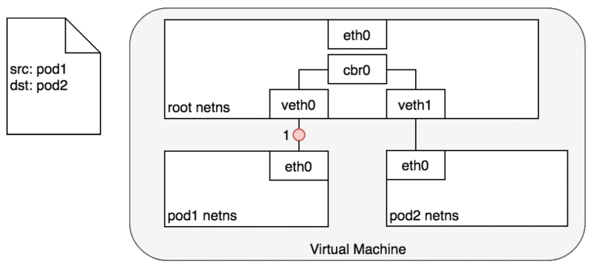


#### 跨节点


### Pod-To-Service

#### Pod To Service


#### Service-To-Pod

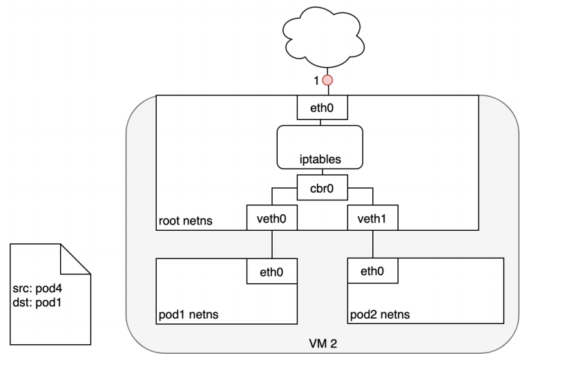


### Internet-To-Service

#### Pod-To-Internet


#### Internet-To-Pod（LoadBalancer -- Layer4）

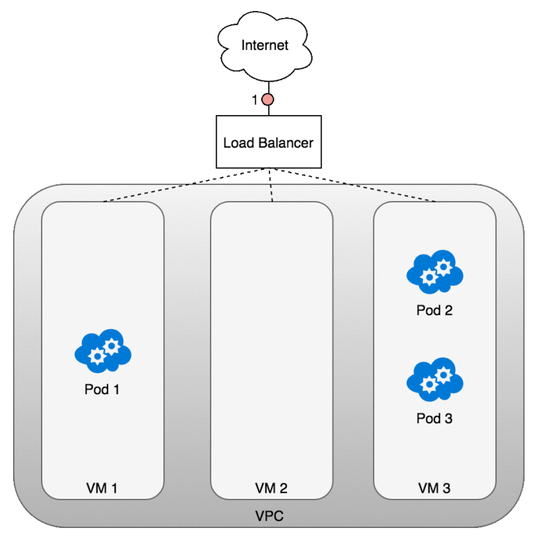


#### Internet-To-Pod（Ingress-- Layer7）

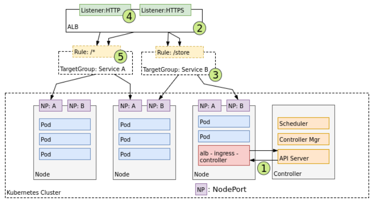


## Service

负载均衡服务。让一组Pod可以被别人进行服务发现。

Service   --- >>  选择一组Pod

别人只需要访问这个Service。Service还会基于Pod的探针机制（ReadinessProbe：就绪探针）完成Pod的自动剔除和上线工作。

- Service即使无头服务。别人（Pod）不能用ip访问，但是可以用service名当成域名访问。

- **Service的名字还能当成域名被Pod解析**


### 基础概念

将运行在一组 [Pods](https://kubernetes.io/docs/concepts/workloads/pods/pod-overview/) 上的应用程序公开为网络服务的抽象方法。

> **云原生服务发现**
>
> service中的type可选值如下，代表四种不同的服务发现类型
>
> - ExternalName
> - ClusterIP: 为当前Service分配或者不分配集群IP。负载均衡一组Pod
> - NodePort：  外界也可以使用机器ip+暴露的NodePort端口 访问。
>   - nodePort端口由kube-proxy开在机器上
>   - 机器ip+暴露的NodePort 流量先来到  kube-proxy 
> - LoadBalancer.

- **`ClusterIP`** ：通过集群的内部 IP 暴露服务，选择该值时服务只能够在集群内部访问。 这也是默认的 `ServiceType`。
- [`NodePort`](https://kubernetes.io/zh/docs/concepts/services-networking/service/#nodeport)：通过每个节点上的 IP 和静态端口（`NodePort`）暴露服务。 `NodePort` 服务会路由到自动创建的 `ClusterIP` 服务。 通过请求 `<节点 IP>:<节点端口>`，你可以从集群的外部访问一个 `NodePort` 服务。
- [`LoadBalancer`](https://kubernetes.io/zh/docs/concepts/services-networking/service/#loadbalancer)：使用云提供商的负载均衡器向外部暴露服务。 外部负载均衡器可以将流量路由到自动创建的 `NodePort` 服务和 `ClusterIP` 服务上。
- [`ExternalName`](https://kubernetes.io/zh/docs/concepts/services-networking/service/#externalname)：通过返回 `CNAME` 和对应值，可以将服务映射到 `externalName` 字段的内容（例如，`foo.bar.example.com`）。 无需创建任何类型代理。

### 创建简单Service 

```yaml
apiVersion: v1
kind: Service
metadata:
  name: my-service
spec:
  selector:
    app: MyApp   ## 使用选择器选择所有Pod
 # type: ClusterIP  ##type很重要，不写默认是ClusterIP
  ports:
    - protocol: TCP
      port: 80
      targetPort: 9376
```

- Service 创建完成后，会对应一组EndPoint。可以kubectl get ep 进行查看
- type有四种，每种对应不同服务发现机制
- Servvice可以利用Pod的就绪探针机制，只负载就绪了的Pod。自动剔除没有就绪的Pod


### 创建无Selector的Service

- 我们可以创建Service不指定Selector
- 然后手动创建EndPoint，指定一组Pod地址。
- 此场景用于我们负载均衡其他中间件场景。

```yaml
# 无selector的svc
apiVersion: v1
kind: Service
metadata:
  name: my-service-no-selector
spec:
  ports:
  - protocol: TCP
    name: http  ###一定注意，name可以不写，
    ###但是这里如果写了name，那么endpoint里面的ports必须有同名name才能绑定
    port: 80  # service 80
    targetPort: 80  #目标80
---    
apiVersion: v1
kind: Endpoints
metadata:
  name: my-service-no-selector  ### ep和svc的绑定规则是：和svc同名同名称空间，port同名或同端口
  namespace: default
subsets:
- addresses:
  - ip: 220.181.38.148
  - ip: 39.156.69.79
  - ip: 192.168.169.165
  ports:
  - port: 80
    name: http  ## svc有name这里一定要有
    protocol: TCP
```


原理：kube-proxy 在负责这个事情

https://kubernetes.io/zh/docs/concepts/services-networking/service/#virtual-ips-and-service-proxies

```yaml
## 实验
apiVersion: v1
kind: Service
metadata:
  name: cluster-service-no-selector
  namespace: default
spec:
  ## 不选中Pod而在下面手动定义可以访问的EndPoint
  type: ClusterIP 
  ports:
  - name: abc
    port: 80  ## 访问当前service 的 80
    targetPort: 80  ## 派发到Pod的 80
---
apiVersion: v1
kind: Endpoints
metadata:
  name: cluster-service-no-selector  ## 和service同名
  namespace: default
subsets:
- addresses:
  - ip: 192.168.169.184
  - ip: 192.168.169.165
  - ip: 39.156.69.79
  ports:
  - name: abc  ## ep和service要是一样的
    port: 80
    protocol: TCP
```

> ### 场景：Pod要访问 MySQL。 MySQL单独部署到很多机器，每次记ip麻烦
>
> ### 集群内创建一个Service，实时的可以剔除EP信息。反向代理集群外的东西。

### ClusterIP

```yaml
type: ClusterIP
ClusterIP: 手动指定/None/""
```

- 手动指定的ClusterIP必须在合法范围内
- None会创建出没有ClusterIP的**headless service（无头服务）**，Pod需要用服务的域名访问


### NodePort

```yaml
apiVersion: v1
kind: Service
metadata:
  name: my-service
  namespace: default
type: NodePort
ports:
  - protocol: TCP
    port: 80  # service 80
    targetPort: 80  #目标80
    nodePort: 32123  #自定义
```


- 如果将 `type` 字段设置为 `NodePort`，则 Kubernetes 将在 `--service-node-port-range` 标志指定的范围内分配端口（默认值：30000-32767）
- k8s集群的所有机器都将打开监听这个端口的数据，访问任何一个机器，都可以访问这个service对应的Pod
- 使用 nodePort 自定义端口

### ExternalName

```yaml
apiVersion: v1
kind: Service
metadata:
  name: my-service-05
  namespace: default
spec:
  type: ExternalName
  externalName: baidu.com
```

- 其他的Pod可以通过访问这个service而访问其他的域名服务
- 但是需要注意目标服务的跨域问题


### LoadBalancer

```yaml
apiVersion: v1
kind: Service
metadata:
  creationTimestamp: null
  labels:
    app.kubernetes.io/name: load-balancer-example
  name: my-service
spec:
  ports:
  - port: 80
    protocol: TCP
    targetPort: 80
  selector:
    app.kubernetes.io/name: load-balancer-example
  type: LoadBalancer
```


### 扩展 - externalIP

在 Service 的定义中， `externalIPs` 可以和任何类型的 `.spec.type` 一通使用。在下面的例子中，客户端可通过 `80.11.12.10:80` （externalIP:port） 访问`my-service`

```yaml
apiVersion: v1
kind: Service
metadata:
  name: my-service-externalip
spec:
  selector:
    app: canary-nginx
  ports:
    - name: http
      protocol: TCP
      port: 80
      targetPort: 80
  externalIPs: ### 定义只有externalIPs指定的地址才可以访问这个service
    - 10.170.0.111  ### 集群内的ip都不行？
 ####    - 其他机器的ip
```

黑名单？？？？


### 扩展 - Pod的DNS

```yaml
apiVersion: v1
kind: Service
metadata:
  name: default-subdomain
spec:
  selector:
    name: busybox
  clusterIP: None
  ports:
  - name: foo # 实际上不需要指定端口号
    port: 1234
    targetPort: 1234
---
apiVersion: v1
kind: Pod
metadata:
  name: busybox1
  labels:
    name: busybox
spec:
  hostname: busybox-1
  subdomain: default-subdomain  
  ## 指定必须和svc名称一样，才可以 podName.subdomain.名称空间.svc.cluster.local访问。否则访问不同指定Pod
  containers:
  - image: busybox:1.28
    command:
      - sleep
      - "3600"
    name: busybox
---
apiVersion: v1
kind: Pod
metadata:
  name: busybox2
  labels:
    name: busybox
spec:
  hostname: busybox-2  ### 每个Pod指定主机名 
  subdomain: default-subdomain  ## subdomain等于sevrice的名
  containers:
  - image: busybox:1.28
    command:
      - sleep
      - "3600"
    name: busybox
```

- 访问   <u>busybox-1</u>.*default-subdomain*.**default**.`svc.cluster.local`  可以访问到busybox-1。
- 访问Service
  - 同名称空间
    - ping service-name 即可
  - 不同名称空间
    - ping service-name.namespace 即可
- 访问Pod
  - 同名称空间
    - ping pod-host-name.service-name 即可
  - 不同名称空间
    - ping pod-host-name.service-name.namespace 即可


busybox-1.***default-subdomain*.default****

Pod的hostName.service的名.名称空间的名

想要使用域名访问的模式，必须加Service网络的名字


## Ingress

为什么需要Ingress？

- Service可以使用NodePort暴露集群外访问端口，但是性能低下不安全
- 缺少**Layer7**的统一访问入口，可以负载均衡、限流等
- [Ingress](https://kubernetes.io/docs/reference/generated/kubernetes-api/v1.21/#ingress-v1beta1-networking-k8s-io) 公开了从集群外部到集群内[服务](https://kubernetes.io/zh/docs/concepts/services-networking/service/)的 HTTP 和 HTTPS 路由。 流量路由由 Ingress 资源上定义的规则控制。
- 我们使用Ingress作为整个集群统一的入口，配置Ingress规则转到对应的Service


### nginx ingress

这是nginx官方做的，适配k8s的，分为**开源版**和**nginx plus版（收费）**。[文档地址](https://docs.nginx.com/nginx-ingress-controller/overview/)

https://www.nginx.com/products/nginx-ingress-controller


### ingress nginx

[https://kubernetes.io/zh/docs/concepts/services-networking/ingress/#ingress-%E6%98%AF%E4%BB%80%E4%B9%88](https://kubernetes.io/zh/docs/concepts/services-networking/ingress/#ingress-是什么)

这是k8s官方做的，适配nginx的。这个里面会及时更新一些特性，而且性能很高，也被广泛采用。[文档地址](https://kubernetes.github.io/ingress-nginx/deploy/)

```sh
## 默认安装使用这个镜像
registry.cn-hangzhou.aliyuncs.com/lfy_k8s_ images/ingress-nginx-controller:v0.46.0
```

https://kubernetes.github.io/ingress-nginx/examples/auth/basic/   文档地址

#### 安装

自建集群使用**[裸金属安装方式](https://kubernetes.github.io/ingress-nginx/deploy/#bare-metal)**

需要如下修改：

- 修改ingress-nginx-controller镜像为 `registry.cn-hangzhou.aliyuncs.com/lfy_k8s_ images/ingress-nginx-controller:v0.46.0`
- 修改Deployment为DaemonSet比较好
- 修改Container使用主机网络，直接在主机上开辟 80,443端口，无需中间解析，速度更快
- Container使用主机网络，对应的dnsPolicy策略也需要改为主机网络的
- 修改Service为ClusterIP，无需NodePort模式了
- 修改DaemonSet的nodeSelector:  `ingress-node=true` 。这样只需要给node节点打上`ingress-node=true` 标签，即可快速的加入/剔除 ingress-controller的数量


修改好的yaml如下。大家直接复制使用

```yaml
apiVersion: v1
kind: Namespace
metadata:
  name: ingress-nginx
  labels:
    app.kubernetes.io/name: ingress-nginx
    app.kubernetes.io/instance: ingress-nginx

---
# Source: ingress-nginx/templates/controller-serviceaccount.yaml
apiVersion: v1
kind: ServiceAccount
metadata:
  labels:
    helm.sh/chart: ingress-nginx-3.30.0
    app.kubernetes.io/name: ingress-nginx
    app.kubernetes.io/instance: ingress-nginx
    app.kubernetes.io/version: 0.46.0
    app.kubernetes.io/managed-by: Helm
    app.kubernetes.io/component: controller
  name: ingress-nginx
  namespace: ingress-nginx
automountServiceAccountToken: true
---
# Source: ingress-nginx/templates/controller-configmap.yaml
apiVersion: v1
kind: ConfigMap
metadata:
  labels:
    helm.sh/chart: ingress-nginx-3.30.0
    app.kubernetes.io/name: ingress-nginx
    app.kubernetes.io/instance: ingress-nginx
    app.kubernetes.io/version: 0.46.0
    app.kubernetes.io/managed-by: Helm
    app.kubernetes.io/component: controller
  name: ingress-nginx-controller
  namespace: ingress-nginx
data:
---
# Source: ingress-nginx/templates/clusterrole.yaml
apiVersion: rbac.authorization.k8s.io/v1
kind: ClusterRole
metadata:
  labels:
    helm.sh/chart: ingress-nginx-3.30.0
    app.kubernetes.io/name: ingress-nginx
    app.kubernetes.io/instance: ingress-nginx
    app.kubernetes.io/version: 0.46.0
    app.kubernetes.io/managed-by: Helm
  name: ingress-nginx
rules:
  - apiGroups:
      - ''
    resources:
      - configmaps
      - endpoints
      - nodes
      - pods
      - secrets
    verbs:
      - list
      - watch
  - apiGroups:
      - ''
    resources:
      - nodes
    verbs:
      - get
  - apiGroups:
      - ''
    resources:
      - services
    verbs:
      - get
      - list
      - watch
  - apiGroups:
      - extensions
      - networking.k8s.io   # k8s 1.14+
    resources:
      - ingresses
    verbs:
      - get
      - list
      - watch
  - apiGroups:
      - ''
    resources:
      - events
    verbs:
      - create
      - patch
  - apiGroups:
      - extensions
      - networking.k8s.io   # k8s 1.14+
    resources:
      - ingresses/status
    verbs:
      - update
  - apiGroups:
      - networking.k8s.io   # k8s 1.14+
    resources:
      - ingressclasses
    verbs:
      - get
      - list
      - watch
---
# Source: ingress-nginx/templates/clusterrolebinding.yaml
apiVersion: rbac.authorization.k8s.io/v1
kind: ClusterRoleBinding
metadata:
  labels:
    helm.sh/chart: ingress-nginx-3.30.0
    app.kubernetes.io/name: ingress-nginx
    app.kubernetes.io/instance: ingress-nginx
    app.kubernetes.io/version: 0.46.0
    app.kubernetes.io/managed-by: Helm
  name: ingress-nginx
roleRef:
  apiGroup: rbac.authorization.k8s.io
  kind: ClusterRole
  name: ingress-nginx
subjects:
  - kind: ServiceAccount
    name: ingress-nginx
    namespace: ingress-nginx
---
# Source: ingress-nginx/templates/controller-role.yaml
apiVersion: rbac.authorization.k8s.io/v1
kind: Role
metadata:
  labels:
    helm.sh/chart: ingress-nginx-3.30.0
    app.kubernetes.io/name: ingress-nginx
    app.kubernetes.io/instance: ingress-nginx
    app.kubernetes.io/version: 0.46.0
    app.kubernetes.io/managed-by: Helm
    app.kubernetes.io/component: controller
  name: ingress-nginx
  namespace: ingress-nginx
rules:
  - apiGroups:
      - ''
    resources:
      - namespaces
    verbs:
      - get
  - apiGroups:
      - ''
    resources:
      - configmaps
      - pods
      - secrets
      - endpoints
    verbs:
      - get
      - list
      - watch
  - apiGroups:
      - ''
    resources:
      - services
    verbs:
      - get
      - list
      - watch
  - apiGroups:
      - extensions
      - networking.k8s.io   # k8s 1.14+
    resources:
      - ingresses
    verbs:
      - get
      - list
      - watch
  - apiGroups:
      - extensions
      - networking.k8s.io   # k8s 1.14+
    resources:
      - ingresses/status
    verbs:
      - update
  - apiGroups:
      - networking.k8s.io   # k8s 1.14+
    resources:
      - ingressclasses
    verbs:
      - get
      - list
      - watch
  - apiGroups:
      - ''
    resources:
      - configmaps
    resourceNames:
      - ingress-controller-leader-nginx
    verbs:
      - get
      - update
  - apiGroups:
      - ''
    resources:
      - configmaps
    verbs:
      - create
  - apiGroups:
      - ''
    resources:
      - events
    verbs:
      - create
      - patch
---
# Source: ingress-nginx/templates/controller-rolebinding.yaml
apiVersion: rbac.authorization.k8s.io/v1
kind: RoleBinding
metadata:
  labels:
    helm.sh/chart: ingress-nginx-3.30.0
    app.kubernetes.io/name: ingress-nginx
    app.kubernetes.io/instance: ingress-nginx
    app.kubernetes.io/version: 0.46.0
    app.kubernetes.io/managed-by: Helm
    app.kubernetes.io/component: controller
  name: ingress-nginx
  namespace: ingress-nginx
roleRef:
  apiGroup: rbac.authorization.k8s.io
  kind: Role
  name: ingress-nginx
subjects:
  - kind: ServiceAccount
    name: ingress-nginx
    namespace: ingress-nginx
---
# Source: ingress-nginx/templates/controller-service-webhook.yaml
apiVersion: v1
kind: Service
metadata:
  labels:
    helm.sh/chart: ingress-nginx-3.30.0
    app.kubernetes.io/name: ingress-nginx
    app.kubernetes.io/instance: ingress-nginx
    app.kubernetes.io/version: 0.46.0
    app.kubernetes.io/managed-by: Helm
    app.kubernetes.io/component: controller
  name: ingress-nginx-controller-admission
  namespace: ingress-nginx
spec:
  type: ClusterIP
  ports:
    - name: https-webhook
      port: 443
      targetPort: webhook
  selector:
    app.kubernetes.io/name: ingress-nginx
    app.kubernetes.io/instance: ingress-nginx
    app.kubernetes.io/component: controller
---
# Source: ingress-nginx/templates/controller-service.yaml：不要
apiVersion: v1
kind: Service
metadata:
  annotations:
  labels:
    helm.sh/chart: ingress-nginx-3.30.0
    app.kubernetes.io/name: ingress-nginx
    app.kubernetes.io/instance: ingress-nginx
    app.kubernetes.io/version: 0.46.0
    app.kubernetes.io/managed-by: Helm
    app.kubernetes.io/component: controller
  name: ingress-nginx-controller
  namespace: ingress-nginx
spec:
  type: ClusterIP  ## 改为clusterIP
  ports:
    - name: http
      port: 80
      protocol: TCP
      targetPort: http
    - name: https
      port: 443
      protocol: TCP
      targetPort: https
  selector:
    app.kubernetes.io/name: ingress-nginx
    app.kubernetes.io/instance: ingress-nginx
    app.kubernetes.io/component: controller
---
# Source: ingress-nginx/templates/controller-deployment.yaml
apiVersion: apps/v1
kind: DaemonSet
metadata:
  labels:
    helm.sh/chart: ingress-nginx-3.30.0
    app.kubernetes.io/name: ingress-nginx
    app.kubernetes.io/instance: ingress-nginx
    app.kubernetes.io/version: 0.46.0
    app.kubernetes.io/managed-by: Helm
    app.kubernetes.io/component: controller
  name: ingress-nginx-controller
  namespace: ingress-nginx
spec:
  selector:
    matchLabels:
      app.kubernetes.io/name: ingress-nginx
      app.kubernetes.io/instance: ingress-nginx
      app.kubernetes.io/component: controller
  revisionHistoryLimit: 10
  minReadySeconds: 0
  template:
    metadata:
      labels:
        app.kubernetes.io/name: ingress-nginx
        app.kubernetes.io/instance: ingress-nginx
        app.kubernetes.io/component: controller
    spec:
      dnsPolicy: ClusterFirstWithHostNet   ## dns对应调整为主机网络
      hostNetwork: true  ## 直接让nginx占用本机80端口和443端口，所以使用主机网络
      containers:
        - name: controller
          image: registry.cn-hangzhou.aliyuncs.com/lfy_k8s_ images/ingress-nginx-controller:v0.46.0
          imagePullPolicy: IfNotPresent
          lifecycle:
            preStop:
              exec:
                command:
                  - /wait-shutdown
          args:
            - /nginx-ingress-controller
            - --election-id=ingress-controller-leader
            - --ingress-class=nginx
            - --configmap=$(POD_NAMESPACE)/ingress-nginx-controller
            - --validating-webhook=:8443
            - --validating-webhook-certificate=/usr/local/certificates/cert
            - --validating-webhook-key=/usr/local/certificates/key
          securityContext:
            capabilities:
              drop:
                - ALL
              add:
                - NET_BIND_SERVICE
            runAsUser: 101
            allowPrivilegeEscalation: true
          env:
            - name: POD_NAME
              valueFrom:
                fieldRef:
                  fieldPath: metadata.name
            - name: POD_NAMESPACE
              valueFrom:
                fieldRef:
                  fieldPath: metadata.namespace
            - name: LD_PRELOAD
              value: /usr/local/lib/libmimalloc.so
          livenessProbe:
            httpGet:
              path: /healthz
              port: 10254
              scheme: HTTP
            initialDelaySeconds: 10
            periodSeconds: 10
            timeoutSeconds: 1
            successThreshold: 1
            failureThreshold: 5
          readinessProbe:
            httpGet:
              path: /healthz
              port: 10254
              scheme: HTTP
            initialDelaySeconds: 10
            periodSeconds: 10
            timeoutSeconds: 1
            successThreshold: 1
            failureThreshold: 3
          ports:
            - name: http
              containerPort: 80
              protocol: TCP
            - name: https
              containerPort: 443
              protocol: TCP
            - name: webhook
              containerPort: 8443
              protocol: TCP
          volumeMounts:
            - name: webhook-cert
              mountPath: /usr/local/certificates/
              readOnly: true
          resources:
            requests:
              cpu: 100m
              memory: 90Mi
      nodeSelector:  ## 节点选择器
        node-role: ingress #以后只需要给某个node打上这个标签就可以部署ingress-nginx到这个节点上了
        #kubernetes.io/os: linux  ## 修改节点选择
      serviceAccountName: ingress-nginx
      terminationGracePeriodSeconds: 300
      volumes:
        - name: webhook-cert
          secret:
            secretName: ingress-nginx-admission
---
# Source: ingress-nginx/templates/admission-webhooks/validating-webhook.yaml
# before changing this value, check the required kubernetes version
# https://kubernetes.io/docs/reference/access-authn-authz/extensible-admission-controllers/#prerequisites
apiVersion: admissionregistration.k8s.io/v1
kind: ValidatingWebhookConfiguration
metadata:
  labels:
    helm.sh/chart: ingress-nginx-3.30.0
    app.kubernetes.io/name: ingress-nginx
    app.kubernetes.io/instance: ingress-nginx
    app.kubernetes.io/version: 0.46.0
    app.kubernetes.io/managed-by: Helm
    app.kubernetes.io/component: admission-webhook
  name: ingress-nginx-admission
webhooks:
  - name: validate.nginx.ingress.kubernetes.io
    matchPolicy: Equivalent
    rules:
      - apiGroups:
          - networking.k8s.io
        apiVersions:
          - v1beta1
        operations:
          - CREATE
          - UPDATE
        resources:
          - ingresses
    failurePolicy: Fail
    sideEffects: None
    admissionReviewVersions:
      - v1
      - v1beta1
    clientConfig:
      service:
        namespace: ingress-nginx
        name: ingress-nginx-controller-admission
        path: /networking/v1beta1/ingresses
---
# Source: ingress-nginx/templates/admission-webhooks/job-patch/serviceaccount.yaml
apiVersion: v1
kind: ServiceAccount
metadata:
  name: ingress-nginx-admission
  annotations:
    helm.sh/hook: pre-install,pre-upgrade,post-install,post-upgrade
    helm.sh/hook-delete-policy: before-hook-creation,hook-succeeded
  labels:
    helm.sh/chart: ingress-nginx-3.30.0
    app.kubernetes.io/name: ingress-nginx
    app.kubernetes.io/instance: ingress-nginx
    app.kubernetes.io/version: 0.46.0
    app.kubernetes.io/managed-by: Helm
    app.kubernetes.io/component: admission-webhook
  namespace: ingress-nginx
---
# Source: ingress-nginx/templates/admission-webhooks/job-patch/clusterrole.yaml
apiVersion: rbac.authorization.k8s.io/v1
kind: ClusterRole
metadata:
  name: ingress-nginx-admission
  annotations:
    helm.sh/hook: pre-install,pre-upgrade,post-install,post-upgrade
    helm.sh/hook-delete-policy: before-hook-creation,hook-succeeded
  labels:
    helm.sh/chart: ingress-nginx-3.30.0
    app.kubernetes.io/name: ingress-nginx
    app.kubernetes.io/instance: ingress-nginx
    app.kubernetes.io/version: 0.46.0
    app.kubernetes.io/managed-by: Helm
    app.kubernetes.io/component: admission-webhook
rules:
  - apiGroups:
      - admissionregistration.k8s.io
    resources:
      - validatingwebhookconfigurations
    verbs:
      - get
      - update
---
# Source: ingress-nginx/templates/admission-webhooks/job-patch/clusterrolebinding.yaml
apiVersion: rbac.authorization.k8s.io/v1
kind: ClusterRoleBinding
metadata:
  name: ingress-nginx-admission
  annotations:
    helm.sh/hook: pre-install,pre-upgrade,post-install,post-upgrade
    helm.sh/hook-delete-policy: before-hook-creation,hook-succeeded
  labels:
    helm.sh/chart: ingress-nginx-3.30.0
    app.kubernetes.io/name: ingress-nginx
    app.kubernetes.io/instance: ingress-nginx
    app.kubernetes.io/version: 0.46.0
    app.kubernetes.io/managed-by: Helm
    app.kubernetes.io/component: admission-webhook
roleRef:
  apiGroup: rbac.authorization.k8s.io
  kind: ClusterRole
  name: ingress-nginx-admission
subjects:
  - kind: ServiceAccount
    name: ingress-nginx-admission
    namespace: ingress-nginx
---
# Source: ingress-nginx/templates/admission-webhooks/job-patch/role.yaml
apiVersion: rbac.authorization.k8s.io/v1
kind: Role
metadata:
  name: ingress-nginx-admission
  annotations:
    helm.sh/hook: pre-install,pre-upgrade,post-install,post-upgrade
    helm.sh/hook-delete-policy: before-hook-creation,hook-succeeded
  labels:
    helm.sh/chart: ingress-nginx-3.30.0
    app.kubernetes.io/name: ingress-nginx
    app.kubernetes.io/instance: ingress-nginx
    app.kubernetes.io/version: 0.46.0
    app.kubernetes.io/managed-by: Helm
    app.kubernetes.io/component: admission-webhook
  namespace: ingress-nginx
rules:
  - apiGroups:
      - ''
    resources:
      - secrets
    verbs:
      - get
      - create
---
# Source: ingress-nginx/templates/admission-webhooks/job-patch/rolebinding.yaml
apiVersion: rbac.authorization.k8s.io/v1
kind: RoleBinding
metadata:
  name: ingress-nginx-admission
  annotations:
    helm.sh/hook: pre-install,pre-upgrade,post-install,post-upgrade
    helm.sh/hook-delete-policy: before-hook-creation,hook-succeeded
  labels:
    helm.sh/chart: ingress-nginx-3.30.0
    app.kubernetes.io/name: ingress-nginx
    app.kubernetes.io/instance: ingress-nginx
    app.kubernetes.io/version: 0.46.0
    app.kubernetes.io/managed-by: Helm
    app.kubernetes.io/component: admission-webhook
  namespace: ingress-nginx
roleRef:
  apiGroup: rbac.authorization.k8s.io
  kind: Role
  name: ingress-nginx-admission
subjects:
  - kind: ServiceAccount
    name: ingress-nginx-admission
    namespace: ingress-nginx
---
# Source: ingress-nginx/templates/admission-webhooks/job-patch/job-createSecret.yaml
apiVersion: batch/v1
kind: Job
metadata:
  name: ingress-nginx-admission-create
  annotations:
    helm.sh/hook: pre-install,pre-upgrade
    helm.sh/hook-delete-policy: before-hook-creation,hook-succeeded
  labels:
    helm.sh/chart: ingress-nginx-3.30.0
    app.kubernetes.io/name: ingress-nginx
    app.kubernetes.io/instance: ingress-nginx
    app.kubernetes.io/version: 0.46.0
    app.kubernetes.io/managed-by: Helm
    app.kubernetes.io/component: admission-webhook
  namespace: ingress-nginx
spec:
  template:
    metadata:
      name: ingress-nginx-admission-create
      labels:
        helm.sh/chart: ingress-nginx-3.30.0
        app.kubernetes.io/name: ingress-nginx
        app.kubernetes.io/instance: ingress-nginx
        app.kubernetes.io/version: 0.46.0
        app.kubernetes.io/managed-by: Helm
        app.kubernetes.io/component: admission-webhook
    spec:
      containers:
        - name: create
          image: docker.io/jettech/kube-webhook-certgen:v1.5.1
          imagePullPolicy: IfNotPresent
          args:
            - create
            - --host=ingress-nginx-controller-admission,ingress-nginx-controller-admission.$(POD_NAMESPACE).svc
            - --namespace=$(POD_NAMESPACE)
            - --secret-name=ingress-nginx-admission
          env:
            - name: POD_NAMESPACE
              valueFrom:
                fieldRef:
                  fieldPath: metadata.namespace
      restartPolicy: OnFailure
      serviceAccountName: ingress-nginx-admission
      securityContext:
        runAsNonRoot: true
        runAsUser: 2000
---
# Source: ingress-nginx/templates/admission-webhooks/job-patch/job-patchWebhook.yaml
apiVersion: batch/v1
kind: Job
metadata:
  name: ingress-nginx-admission-patch
  annotations:
    helm.sh/hook: post-install,post-upgrade
    helm.sh/hook-delete-policy: before-hook-creation,hook-succeeded
  labels:
    helm.sh/chart: ingress-nginx-3.30.0
    app.kubernetes.io/name: ingress-nginx
    app.kubernetes.io/instance: ingress-nginx
    app.kubernetes.io/version: 0.46.0
    app.kubernetes.io/managed-by: Helm
    app.kubernetes.io/component: admission-webhook
  namespace: ingress-nginx
spec:
  template:
    metadata:
      name: ingress-nginx-admission-patch
      labels:
        helm.sh/chart: ingress-nginx-3.30.0
        app.kubernetes.io/name: ingress-nginx
        app.kubernetes.io/instance: ingress-nginx
        app.kubernetes.io/version: 0.46.0
        app.kubernetes.io/managed-by: Helm
        app.kubernetes.io/component: admission-webhook
    spec:
      containers:
        - name: patch
          image: docker.io/jettech/kube-webhook-certgen:v1.5.1
          imagePullPolicy: IfNotPresent
          args:
            - patch
            - --webhook-name=ingress-nginx-admission
            - --namespace=$(POD_NAMESPACE)
            - --patch-mutating=false
            - --secret-name=ingress-nginx-admission
            - --patch-failure-policy=Fail
          env:
            - name: POD_NAMESPACE
              valueFrom:
                fieldRef:
                  fieldPath: metadata.namespace
      restartPolicy: OnFailure
      serviceAccountName: ingress-nginx-admission
      securityContext:
        runAsNonRoot: true
        runAsUser: 2000
```


**验证**

访问部署了ingress-nginx主机的80端口，有nginx响应即可。

**卸载**

`kubectl delete -f ingress-controller.yaml` 即可

#### 基本配置

```yaml
apiVersion: networking.k8s.io/v1
kind: Ingress
metadata:
  name: itdachang-ingress
  namespace: default
spec:
  rules:
  - host: itdachang.com
    http:
      paths:
      - path: /
        pathType: Prefix
        backend:  ## 指定需要响应的后端服务
          service:
            name: my-nginx-svc  ## kubernetes集群的svc名称
            port:
              number: 80  ## service的端口号
```

- [pathType 详细](https://kubernetes.io/zh/docs/concepts/services-networking/ingress/#path-types)：
  - `Prefix`：基于以 `/` 分隔的 URL 路径前缀匹配。匹配区分大小写，并且对路径中的元素逐个完成。 路径元素指的是由 `/` 分隔符分隔的路径中的标签列表。 如果每个 *p* 都是请求路径 *p* 的元素前缀，则请求与路径 *p* 匹配。
  - `Exact`：精确匹配 URL 路径，且区分大小写。
  - `ImplementationSpecific`：对于这种路径类型，匹配方法取决于 IngressClass。 具体实现可以将其作为单独的 `pathType` 处理或者与 `Prefix` 或 `Exact` 类型作相同处理。

ingress规则会生效到所有按照了IngressController的机器的nginx配置。


#### 默认后端

```yaml
apiVersion: networking.k8s.io/v1
kind: Ingress
metadata:
  name: itdachang-ingress
  namespace: default
spec:
  defaultBackend:  ## 指定所有未匹配的默认后端
    service:
      name: php-apache
      port: 
        number: 80
  rules:
  - host: itdachang.com
    http:
      paths:
      - path: /abc
        pathType: Prefix
        backend:
          service:
            name: my-nginx-svc
            port:
              number: 80
```

> 效果
>
> - itdachang.com 下的 非 /abc 开头的所有请求，都会到defaultBackend
> - 非itdachang.com 域名下的所有请求，也会到defaultBackend


nginx的全局配置

```sh
kubectl edit cm ingress-nginx-controller -n  ingress-nginx

编辑配置加上

data:
  配置项:  配置值  
  
  
  
  所有配置项参考  https://kubernetes.github.io/ingress-nginx/user-guide/nginx-configuration/configmap/
  
  
基于环境变量带去的
```


#### 路径重写

https://kubernetes.github.io/ingress-nginx/examples/rewrite/

> Rewrite 功能，经常被用于前后分离的场景
>
> - 前端给服务器发送 / 请求映射前端地址。
> - 后端给服务器发送 /api 请求来到对应的服务。但是后端服务没有 /api的起始路径，所以需要ingress-controller自动截串


```yaml
apiVersion: networking.k8s.io/v1
kind: Ingress
metadata:
  annotations:  ## 写好annotion
  #https://kubernetes.github.io/ingress-nginx/user-guide/nginx-configuration/annotations/
    nginx.ingress.kubernetes.io/rewrite-target: /$2  ### 只保留哪一部分
  name: rewrite-ingress-02
  namespace: default
spec:
  rules:  ## 写好规则
  - host: itzongchang.com
    http:
      paths:
      - backend:
          service: 
            name: php-apache
            port: 
              number: 80
        path: /api(/|$)(.*)
        pathType: Prefix
```


#### 配置SSL

https://kubernetes.github.io/ingress-nginx/user-guide/tls/

生成证书：（也可以去青云申请免费证书进行配置）

```sh
$ openssl req -x509 -nodes -days 365 -newkey rsa:2048 -keyout ${KEY_FILE:tls.key} -out ${CERT_FILE:tls.cert} -subj "/CN=${HOST:itdachang.com}/O=${HOST:itdachang.com}"

kubectl create secret tls ${CERT_NAME:itdachang-tls} --key ${KEY_FILE:tls.key} --cert ${CERT_FILE:tls.cert}


## 示例命令如下
openssl req -x509 -nodes -days 365 -newkey rsa:2048 -keyout tls.key -out tls.cert -subj "/CN=it666.com/O=it666.com"

kubectl create secret tls it666-tls --key tls.key --cert tls.cert
```


```yaml
apiVersion: v1
data:
  tls.crt: LS0tLS1CRUdJTiBDRVJUSUZJQ0FURS0tLS0tCk1JSURJekNDQWd1Z0F3SUJBZ0lKQVB6YXVMQ1ZjdlVKTUEwR0NTcUdTSWIzRFFFQkN3VUFNQ2d4RWpBUUJnTlYKQkFNTUNXbDBOalkyTG1OdmJURVNNQkFHQTFVRUNnd0phWFEyTmpZdVkyOXRNQjRYRFRJeE1EVXhNREV5TURZdwpNRm9YRFRJeU1EVXhNREV5TURZd01Gb3dLREVTTUJBR0ExVUVBd3dKYVhRMk5qWXVZMjl0TVJJd0VBWURWUVFLCkRBbHBkRFkyTmk1amIyMHdnZ0VpTUEwR0NTcUdTSWIzRFFFQkFRVUFBNElCRHdBd2dnRUtBb0lCQVFDbkNYa0wKNjdlYzNjYW5IU1V2VDR6YXZmMGpsOEFPWlBtUERhdUFRTElEby80LzlhV2JPSy9yZm5OelVXV3lTRFBqb3pZVApWa2xmQTZYRG1xRU5FSWRHRlhjdExTSlRNRkM5Y2pMeTlwYVFaaDVYemZId0ZoZXZCR1J3MmlJNXdVdk5iTGdWCmNzcmRlNXlKMEZYOFlMZFRhdjhibzhjTXpxN2FqZXhXMWc1dkxmTWZhczAvd2VyVk9Qc0ZmS3RwZ1dwSWMxMXEKekx6RnlmWHNjcVNhVTV2NFo5WHFqQjRtQjhZZ043U2FSa2pzU0VsSFU4SXhENEdTOUtTNGtkR2xZak45V2hOcAp6aG5MdllpSDIrZThQWE9LdU8wK2Jla1MrS3lUS2hnNnFWK21kWTN0MWJGenpCdjFONTVobTNQTldjNk9ROTh3CkYrQk9uUUNhWExKVmRRcS9BZ01CQUFHalVEQk9NQjBHQTFVZERnUVdCQlNzSUFvMHZ4RFZjVWtIZ1V1TFlwY0wKdjBFSERqQWZCZ05WSFNNRUdEQVdnQlNzSUFvMHZ4RFZjVWtIZ1V1TFlwY0x2MEVIRGpBTUJnTlZIUk1FQlRBRApBUUgvTUEwR0NTcUdTSWIzRFFFQkN3VUFBNElCQVFDSjFEdGJoQnBacTE1ODVEMGlYV1RTdmU3Q2YvQ3VnakxZCjNYb2gwSU9sNy9mVmNndFJkWXlmRFBmRDFLN0l4bElETWtUbTVEVWEyQzBXaFY5UlZLU0poSTUzMmIyeVRGcm8Kc053eGhkcUZpOC9CU1lsQTl0Tk5HeXhKT1RKZWNtSUhsaFhjRlEvUzFaK3FjVWNrTVh6UHlIcFl0VjRaU0hheQpFWVF2bUVBZTFMNmlnRk8wc2xhbUllTFBCTWhlTDNnSDZQNlV3TVpQbTRqdFR1d2FGSmZGRlRIakQydmhSQkJKCmZjTGY5QjN3U3k2cjBDaXF2VXQxQUNQVnpSdFZrcWJJV1d5VTBDdkdjVDVIUUxPLzdhTE4vQkxpNGdYV2o1MUwKVXdTQzhoY2xodVp3SmRzckNkRlltcjhTMnk0UDhsaDdBc0ZNOGorNjh1ZHJlYXovWmFNbwotLS0tLUVORCBDRVJUSUZJQ0FURS0tLS0tCg==
  tls.key: LS0tLS1CRUdJTiBQUklWQVRFIEtFWS0tLS0tCk1JSUV2QUlCQURBTkJna3Foa2lHOXcwQkFRRUZBQVNDQktZd2dnU2lBZ0VBQW9JQkFRQ25DWGtMNjdlYzNjYW4KSFNVdlQ0emF2ZjBqbDhBT1pQbVBEYXVBUUxJRG8vNC85YVdiT0svcmZuTnpVV1d5U0RQam96WVRWa2xmQTZYRAptcUVORUlkR0ZYY3RMU0pUTUZDOWNqTHk5cGFRWmg1WHpmSHdGaGV2QkdSdzJpSTV3VXZOYkxnVmNzcmRlNXlKCjBGWDhZTGRUYXY4Ym84Y016cTdhamV4VzFnNXZMZk1mYXMwL3dlclZPUHNGZkt0cGdXcEljMTFxekx6RnlmWHMKY3FTYVU1djRaOVhxakI0bUI4WWdON1NhUmtqc1NFbEhVOEl4RDRHUzlLUzRrZEdsWWpOOVdoTnB6aG5MdllpSAoyK2U4UFhPS3VPMCtiZWtTK0t5VEtoZzZxVittZFkzdDFiRnp6QnYxTjU1aG0zUE5XYzZPUTk4d0YrQk9uUUNhClhMSlZkUXEvQWdNQkFBRUNnZ0VBTDZ0Tlp6Q0MrdnB6cWRkd2VEcjhtS1JsckpXdkVxeVFaOW5mMnI4Ynpsd3IKdi9jTHB1dWJrTnBLZWx0OWFVNmZ1RlFvcDRZVmRFOG5MRlpocGNmVXd4UjNLV1piQ0dDZWVpSXdGaFIzVFloSApHb25FaE43WkxYSlVjN3hjemh5eTFGSTFpckZ5NFpoWVNTQXltYzdFSXNORFFKRVJ5ajdsdWF1TkNnOFdtWFdPCmd0OHIzZHVTazNHV2ZZeGdWclFZSHlGTVpCbUpvNDliRzVzdGcwR01JNUZRQXord3RERlIyaWk2NkVkNzBJOUwKYXJNMHpQZkM3Tk1acmhEcHVseVdVYWNXRDY1V1g1Yys5TnpIMW15MEVrbjJGOWQzNXE1czZRakdTVElMVXlhbwpJUVl5bGU0OVdKdlV4YjN2YTZ1OTVBUHAyWFFVaFEyS09GcGxabncwTVFLQmdRRFN2cDAzYlBvQVlEb3BqWGlxCndxemxKdk9IY2M4V3ZhVytoM0tvVFBLZ1dRZWpvVnNZTFEzM2lMeXdFY0FXaWtoSzE2UjVmTkt5VUFRZ2JDNm4KNTdkcUJ3L1RqYlV2UGR6K0llMnNKN1BlSlpCQktXZUNHNjBOeGgzUDVJcSsxRHVjdExpQTBKdVZyOUlaUzdqSApJOVpUMitDMTNlNkRlZkJaajFDb0ZhemJ1UUtCZ1FESzZCaVkzSk5FYVhmWVpKUzh1NFViVW9KUjRhUURBcmlpCjFGRlEzMDFPOEF0b1A2US9IcjFjbTdBNGZkQ3JoSkxPMFNqWnpldnF4NEVHSnBueG5pZGowL24yTHE3Z2x6Q2UKbVlKZFVVVFo0MkxJNGpWelBlUk1RaGhueW9CTHpmaEFYcEtZSU1NcmpTd1JUcnYyclRpQkhxSEZRbDN6YngvKwptcjdEVWtlR053S0JnRllPdEpDUGxiOVZqQ3F2dEppMmluZkE0aTFyRWcvTlBjT0IrQlkxNWRZSXhRL1NzaW83Cks3cnJRWEg4clo0R3RlS3FFR1h6ek80M3NwZXkxWktIRXVUZklWMVlQcWFkOG9Kc1JHdktncTZ5VkNmbnluYmMKNmx2M2pQRDUrSlpZZ0VkTG5SUXRHM3VTb283bDF2eXE2N2l1enlJMUVGTHNGblBjRENtM1FERXhBb0dBSDQrdQprOGhybDg2WDk2N2RlK1huTkhMSEZwbDBlNHRtME4wWnNPeXJCOFpLMy9KV1NBTXVEVU9pUzRjMmVCZHRCb0orClNqSy9xWXRTeEhRb3FlNmh6ZU5oRkN2Nnc3Q0F2WXEvUG1pdnZ2eWhsd0dvc3I1RHpxRFJUd091cFJ2cXE0aUsKWU9ObnVGU0RNRVlBOHNQSzhEcWxpeHRocGNYNVFnOHI4UkhSVWswQ2dZQlF3WFdQU3FGRElrUWQvdFg3dk1mTwp3WDdWTVFMK1NUVFA4UXNRSFo2djdpRlFOL3g3Vk1XT3BMOEp6TDdIaGdJV3JzdkxlV1pubDh5N1J3WnZIbm9zCkY3dkliUm00L1Y1YzZHeFFQZXk5RXVmWUw4ejRGMWhSeUc2ZjJnWU1jV25NSWpnaUh2dTA3cStuajFORkh4YVkKa2ZSSERia01YaUcybU42REtyL3RtQT09Ci0tLS0tRU5EIFBSSVZBVEUgS0VZLS0tLS0K
kind: Secret
metadata:
  creationTimestamp: "2021-05-10T12:06:22Z"
  name: it666-tls
  namespace: default
  resourceVersion: "2164722"
  uid: 16f8a4b6-1600-4ded-8458-b0480ce075ba
type: kubernetes.io/tls

```


配置域名使用证书；

```yaml
apiVersion: networking.k8s.io/v1
kind: Ingress
metadata:
  name: itdachang-ingress
  namespace: default
spec:
  tls:
   - hosts:
     - itdachang.com
     secretName: itdachang-tls
  rules:
  - host: itdachang.com
    http:
      paths:
      - path: /
        pathType: Prefix
        backend:
          service:
            name: my-nginx-svc
            port:
              number: 80
```

配置好证书，访问域名，就会默认跳转到https；


#### 限速

https://kubernetes.github.io/ingress-nginx/user-guide/nginx-configuration/annotations/#rate-limiting

```yaml
apiVersion: networking.k8s.io/v1
kind: Ingress
metadata:
  name: ingress-222333
  namespace: default
  annotations:  ##注解
    nginx.ingress.kubernetes.io/limit-rps: "1"   ### 限流的配置
spec:
  defaultBackend: ## 只要未指定的映射路径
    service:
      name: php-apache
      port:
        number: 80
  rules:
  - host: it666.com
    http:
      paths:
      - path: /bbbbb
        pathType: Prefix
        backend:
          service:
            name: cluster-service-222
            port:
              number: 80

```


#### 灰度发布-Canary

以前可以使用k8s的Service配合Deployment进行金丝雀部署。原理如下


缺点：

- 不能自定义灰度逻辑，比如指定用户进行灰度

------------------

**现在可以使用Ingress进行灰度。原理如下**


```yaml
## 使用如下文件部署两个service版本。v1版本返回nginx默认页，v2版本返回 11111
apiVersion: v1
kind: Service
metadata:
  name: v1-service
  namespace: default
spec:
  selector:
    app: v1-pod
  type: ClusterIP
  ports:
  - name: http
    port: 80
    targetPort: 80
    protocol: TCP
---
apiVersion: apps/v1
kind: Deployment
metadata:
  name:  v1-deploy
  namespace: default
  labels:
    app:  v1-deploy
spec:
  selector:
    matchLabels:
      app: v1-pod
  replicas: 1
  template:
    metadata:
      labels:
        app:  v1-pod
    spec:
      containers:
      - name:  nginx
        image:  nginx
---
apiVersion: v1
kind: Service
metadata:
  name: canary-v2-service
  namespace: default
spec:
  selector:
    app: canary-v2-pod
  type: ClusterIP
  ports:
  - name: http
    port: 80
    targetPort: 80
    protocol: TCP
---
apiVersion: apps/v1
kind: Deployment
metadata:
  name:  canary-v2-deploy
  namespace: default
  labels:
    app:  canary-v2-deploy
spec:
  selector:
    matchLabels:
      app: canary-v2-pod
  replicas: 1
  template:
    metadata:
      labels:
        app:  canary-v2-pod
    spec:
      containers:
      - name:  nginx
        image:  registry.cn-hangzhou.aliyuncs.com/lfy_k8s_ images/nginx-test:env-msg
```


#### 会话保持-Session亲和性

https://kubernetes.github.io/ingress-nginx/user-guide/nginx-configuration/annotations/#session-affinity

第一次访问，ingress-nginx会返回给浏览器一个Cookie，以后浏览器带着这个Cookie，保证访问总是抵达之前的Pod；

```yaml
## 部署一个三个Pod的Deployment并设置Service
apiVersion: v1
kind: Service
metadata:
  name: session-affinity
  namespace: default
spec:
  selector:
    app: session-affinity
  type: ClusterIP
  ports:
  - name: session-affinity
    port: 80
    targetPort: 80
    protocol: TCP
---
apiVersion: apps/v1
kind: Deployment
metadata:
  name:  session-affinity
  namespace: default
  labels:
    app:  session-affinity
spec:
  selector:
    matchLabels:
      app: session-affinity
  replicas: 3
  template:
    metadata:
      labels:
        app:  session-affinity
    spec:
      containers:
      - name:  session-affinity
        image:  nginx
```


> 编写具有会话亲和的ingress

```yaml
### 利用每次请求携带同样的cookie，来标识是否是同一个会话
apiVersion: networking.k8s.io/v1
kind: Ingress
metadata:
  name: session-test
  namespace: default
  annotations:
    nginx.ingress.kubernetes.io/affinity: "cookie"
    nginx.ingress.kubernetes.io/session-cookie-name: "itdachang-session"
spec:
  rules:
  - host: it666.com
    http:
      paths:
      - path: /   ### 如果以前这个域名下的这个路径相同的功能有配置过，以最后一次生效
        pathType: Prefix
        backend:
          service:
            name: session-affinity   ###
            port:
              number: 80

```


## NetworkPolicy

网络策略（网络隔离策略）

https://kubernetes.io/zh/docs/concepts/services-networking/network-policies/

指定Pod间的网络隔离策略，默认是所有互通。

Pod 之间互通，是通过如下三个标识符的组合来辩识的：

1. 其他被允许的 Pods（例外：Pod 无法阻塞对自身的访问）
2. 被允许的名称空间
3. IP 组块（例外：与 Pod 运行所在的节点的通信总是被允许的， 无论 Pod 或节点的 IP 地址）


### Pod隔离与非隔离

- 默认情况下，Pod网络都是非隔离的（non-isolated），可以接受来自任何请求方的网络请求。

- 如果一个 NetworkPolicy 的标签选择器选中了某个 Pod，则该 Pod 将变成隔离的（isolated），并将拒绝任何不被 NetworkPolicy 许可的网络连接。

### 规约

```yaml
apiVersion: networking.k8s.io/v1
kind: NetworkPolicy
metadata:
  name: test-network-policy
  namespace: default
spec:
  podSelector:  ## 选中指定Pod
    matchLabels:
      role: db
  policyTypes:  ## 定义上面Pod的入站出站规则
  - Ingress
  - Egress
  ingress:    ## 定义入站白名单
  - from:   
    - ipBlock:
        cidr: 172.17.0.0/16
        except:
        - 172.17.1.0/24
    - namespaceSelector:
        matchLabels:
          project: myproject
    - podSelector:
        matchLabels:
          role: frontend
    ports:
    - protocol: TCP
      port: 6379
  egress:  ## 定义出站白名单
  - to:
    - ipBlock:
        cidr: 10.0.0.0/24
    ports:
    - protocol: TCP
      port: 5978
```

- **基本信息：** 同其他的 Kubernetes 对象一样，`NetworkPolicy` 需要 `apiVersion`、`kind`、`metadata` 字段
- spec：`NetworkPolicy`的spec字段包含了定义网络策略的主要信息：
  - **podSelector：** 同名称空间中，符合此标签选择器 `.spec.podSelector` 的 Pod 都将应用这个 `NetworkPolicy`。上面的 Example中的 podSelector 选择了 `role=db` 的 Pod。如果该字段为空，则将对名称空间中所有的 Pod 应用这个 `NetworkPolicy`
  - **policyTypes：** `.spec.policyTypes` 是一个数组类型的字段，该数组中可以包含 `Ingress`、`Egress` 中的一个，也可能两个都包含。该字段标识了此 `NetworkPolicy` 是否应用到 入方向的网络流量、出方向的网络流量、或者两者都有。如果不指定 `policyTypes` 字段，该字段默认将始终包含 `Ingress`，当 `NetworkPolicy` 中包含出方向的规则时，`Egress` 也将被添加到默认值。
  - ingress：ingress是一个数组，代表入方向的白名单规则。每一条规则都将允许与`from`和`ports`匹配的入方向的网络流量发生。例子中的`ingress`包含了一条规则，允许的入方向网络流量必须符合如下条件：
    - Pod 的监听端口为 `6379`
    - 请求方可以是如下三种来源当中的任意一种：
      - ipBlock 为 `172.17.0.0/16` 网段，但是不包括 `172.17.1.0/24` 网段
      - namespaceSelector 标签选择器，匹配标签为 `project=myproject`
      - podSelector 标签选择器，匹配标签为 `role=frontend`
  - egress：`egress`是一个数组，代表出方向的白名单规则。每一条规则都将允许与`to`和`ports`匹配的出方向的网络流量发生。例子中的`egress`允许的出方向网络流量必须符合如下条件：
    - 目标端口为 `5978`
    - 目标 ipBlock 为 `10.0.0.0/24` 网段

因此，例子中的 `NetworkPolicy` 对网络流量做了如下限制：

1. 隔离了 `default` 名称空间中带有 `role=db` 标签的所有 Pod 的入方向网络流量和出方向网络流量
2. Ingress规则（入方向白名单规则）：
   - 当请求方是如下三种来源当中的任意一种时，允许访问`default`名称空间中所有带`role=db`标签的 Pod 的6379端口：
     - ipBlock 为 `172.17.0.0/16` 网段，但是不包括 `172.17.1.0/24` 网段
     - namespaceSelector 标签选择器，匹配标签为 `project=myproject`
     - podSelector 标签选择器，匹配标签为 `role=frontend`
3. Egress规则（出方向白名单规则）：
   - 当如下条件满足时，允许出方向的网络流量：
     - 目标端口为 `5978`
     - 目标 ipBlock 为 `10.0.0.0/24` 网段


### to和from选择器的行为

NetworkPolicy 的 `.spec.ingress.from` 和 `.spec.egress.to` 字段中，可以指定 4 种类型的标签选择器：

- **podSelector** 选择与 `NetworkPolicy` 同名称空间中的 Pod 作为入方向访问控制规则的源或者出方向访问控制规则的目标
- **namespaceSelector** 选择某个名称空间（其中所有的Pod）作为入方向访问控制规则的源或者出方向访问控制规则的目标
- **namespaceSelector** 和 **podSelector** 在一个 `to` / `from` 条目中同时包含 `namespaceSelector` 和 `podSelector` 将选中指定名称空间中的指定 Pod。此时请特别留意 YAML 的写法，如下所示：

```yaml
  ...
  ingress:
  - from:
    - namespaceSelector:
        matchLabels:
          user: alice
      podSelector:
        matchLabels:
          role: client
  ...
```

该例子中，podSelector 前面没有 `-` 减号，namespaceSelector 和 podSelector 是同一个 from 元素的两个字段，将选中带 `user=alice` 标签的名称空间中所有带 `role=client` 标签的 Pod。但是，下面的这个 NetworkPolicy 含义是不一样的：

```yaml
  ...
  ingress:
  - from:
    - namespaceSelector:
        matchLabels:
          user: alice
    - podSelector:
        matchLabels:
          role: client
  ...
```

后者，podSelector 前面带 `-` 减号，说明 namespaceSelector 和 podSelector 是 from 数组中的两个元素，他们将选中 NetworkPolicy 同名称空间中带 `role=client` 标签的对象，以及带 `user=alice` 标签的名称空间的所有 Pod。

> 前者是交集关系（且），后者是并集关系（或）

- **ipBlock** 可选择 IP CIDR 范围作为入方向访问控制规则的源或者出方向访问控制规则的目标。这里应该指定的是集群外部的 IP，因为集群内部 Pod 的 IP 地址是临时分配的，且不可预测。

集群的入方向和出方向网络机制通常需要重写网络报文的 source 或者 destination IP。kubernetes 并未定义应该在处理 `NetworkPolicy` 之前还是之后再修改 source / destination IP，因此，在不同的云供应商、使用不同的网络插件时，最终的行为都可能不一样。这意味着：

- 对于入方向的网络流量，某些情况下，你可以基于实际的源 IP 地址过滤流入的报文；在另外一些情况下，NetworkPolicy 所处理的 "source IP" 可能是 LoadBalancer 的 IP 地址，或者其他地址
- 对于出方向的网络流量，**基于 ipBlock 的策略可能有效，也可能无效**


### 场景

https://kubernetes.io/zh/docs/concepts/services-networking/network-policies/#default-policies


# K8s配置与存储

------


 Kubernetes 目前支持多达 28 种数据卷类型（其中大部分特定于具体的云环境如 GCE/AWS/Azure 等），如需查阅所有的数据卷类型，请查阅 Kubernetes 官方文档 [Volumes](https://kubernetes.io/docs/concepts/storage/volumes/) 。如：

- 非持久性存储  
  - emptyDir
  - HostPath
- 网络连接性存储
  - SAN：iSCSI、ScaleIO Volumes、FC (Fibre Channel)
  - NFS：nfs，cfs
- 分布式存储
  - Glusterfs
  - RBD (Ceph Block Device)
  - CephFS
  - Portworx Volumes
  - Quobyte Volumes
- 云端存储
  - GCEPersistentDisk
  - AWSElasticBlockStore
  - AzureFile
  - AzureDisk
  - Cinder (OpenStack block storage)
  - VsphereVolume
  - StorageOS
- 自定义存储
  - FlexVolume


## 配置

配置最佳实战: 

- 云原生 应用12要素 中，提出了配置分离。https://www.kdocs.cn/view/l/skIUQnbIc6cJ
- 在推送到集群之前，配置文件应存储在**版本控制**中。 这允许您在必要时快速回滚配置更改。 它还有助于集群重新创建和恢复。
- **使用 YAML 而不是 JSON 编写配置文件**。虽然这些格式几乎可以在所有场景中互换使用，但 YAML 往往更加用户友好。
- 建议相关对象分组到一个文件。比如 [guestbook-all-in-one.yaml](https://github.com/kubernetes/examples/tree/master/guestbook/all-in-one/guestbook-all-in-one.yaml) 
- 除非必要，否则不指定默认值：简单的最小配置会降低错误的可能性。
- 将对象描述放在注释中，以便更好地进行内省。


### Secret

- `Secret` 对象类型用来**保存敏感信息**，例如密码、OAuth 令牌和 SSH 密钥。 将这些信息放在 `secret` 中比放在 [Pod](https://kubernetes.io/docs/concepts/workloads/pods/pod-overview/) 的定义或者 [容器镜像](https://kubernetes.io/zh/docs/reference/glossary/?all=true#term-image) 中来说更加安全和灵活。
- `Secret` 是一种包含少量敏感信息例如密码、令牌或密钥的对象。用户可以创建 Secret，同时系统也创建了一些 Secret。

#### Secret种类


- 细分类型


#### Pod如何引用

要使用 Secret，Pod 需要引用 Secret。 Pod 可以用三种方式之一来使用 Secret：

- 作为挂载到一个或多个容器上的 [卷](https://kubernetes.io/zh/docs/concepts/storage/volumes/) 中的[文件](https://kubernetes.io/zh/docs/concepts/configuration/secret/#using-secrets-as-files-from-a-pod)。（volume进行挂载）
- 作为[容器的环境变量](https://kubernetes.io/zh/docs/concepts/configuration/secret/#using-secrets-as-environment-variables)（envFrom字段引用）
- 由 [kubelet 在为 Pod 拉取镜像时使用](https://kubernetes.io/zh/docs/concepts/configuration/secret/#using-imagepullsecrets)（此时Secret是docker-registry类型的）

Secret 对象的名称必须是合法的 [DNS 子域名](https://kubernetes.io/zh/docs/concepts/overview/working-with-objects/names#dns-subdomain-names)。 在为创建 Secret 编写配置文件时，你可以设置 `data` 与/或 `stringData` 字段。 `data` 和 `stringData` 字段都是可选的。`data` 字段中所有键值都必须是 base64 编码的字符串。如果不希望执行这种 base64 字符串的转换操作，你可以选择设置 `stringData` 字段，其中可以使用任何字符串作为其取值。


#### 实验

#### 1、创建Secret

##### 1、generic 类型

```yaml
## 命令行
#### 1、使用基本字符串
kubectl create secret generic dev-db-secret \
  --from-literal=username=devuser \
  --from-literal=password='S!B\*d$zDsb='
  
## 参照以下yaml
apiVersion: v1
kind: Secret
metadata:
  name: dev-db-secret  
data:
  password: UyFCXCpkJHpEc2I9  ## base64编码了一下
  username: ZGV2dXNlcg==


#### 2、使用文件内容
echo -n 'admin' > ./username.txt
echo -n '1f2d1e2e67df' > ./password.txt

kubectl create secret generic db-user-pass \
  --from-file=./username.txt \
  --from-file=./password.txt


# 默认密钥名称是文件名。 你可以选择使用 --from-file=[key=]source 来设置密钥名称。如下
kubectl create secret generic db-user-pass-02 \
  --from-file=un=./username.txt \
  --from-file=pd=./password.txt
```


```yaml
## 使用yaml
dev-db-secret yaml内容如下
```


- 获取Secret内容

```sh
kubectl get secret dev-db-secret -o jsonpath='{.data}'
```


#### 2、使用Secret

##### 1、环境变量引用

```yaml
apiVersion: v1
kind: Pod
metadata:
  name: secret-env-pod
spec:
  containers:
  - name: mycontainer
    image: redis
    env:
      - name: SECRET_USERNAME
        valueFrom:
          secretKeyRef:
            name: mysecret
            key: username
      - name: SECRET_PASSWORD
        valueFrom:
          secretKeyRef:
            name: mysecret
            key: password
  restartPolicy: Never
```


环境变量引用的方式不会被自动更新


##### 2、卷挂载

```yaml
apiVersion: v1
kind: Pod
metadata:
  name: mypod
spec:
  containers:
  - name: mypod
    image: redis
    volumeMounts:
    - name: foo
      mountPath: "/etc/foo"
      readOnly: true
  volumes:
  - name: foo
    secret:
      secretName: mysecret
```

挂载方式的secret 在secret变化的时候会自动更新**（子路径引用除外）**


### ConfigMap

- ConfigMap 来将你的配置数据和应用程序代码分开。
- ConfigMap 是一种 API 对象，用来将非机密性的数据保存到键值对中。使用时， [Pods](https://kubernetes.io/docs/concepts/workloads/pods/pod-overview/) 可以将其用作环境变量、命令行参数或者存储卷中的配置文件。

```yaml
apiVersion: v1
kind: ConfigMap
metadata:
  name: game-demo
data:
  # 类属性键；每一个键都映射到一个简单的值
  player_initial_lives: "3"
  ui_properties_file_name: "user-interface.properties"

  # 类文件键
  game.properties: |
    enemy.types=aliens,monsters
    player.maximum-lives=5    
  user-interface.properties: |
    color.good=purple
    color.bad=yellow
    allow.textmode=true
```


你可以使用四种方式来使用 ConfigMap 配置 Pod 中的容器：

1. 在容器命令和参数内
2. 容器的环境变量
3. 在只读卷里面添加一个文件，让应用来读取
4. 编写代码在 Pod 中运行，使用 Kubernetes API 来读取 ConfigMap


```yaml
apiVersion: v1
kind: Pod
metadata:
  name: configmap-demo-pod
spec:
  containers:
    - name: demo
      image: alpine
      command: ["sleep", "3600"]
      env:
        # 定义环境变量
        - name: PLAYER_INITIAL_LIVES # 请注意这里和 ConfigMap 中的键名是不一样的
          valueFrom:
            configMapKeyRef:
              name: game-demo           # 这个值来自 ConfigMap
              key: player_initial_lives # 需要取值的键
        - name: UI_PROPERTIES_FILE_NAME
          valueFrom:
            configMapKeyRef:
              name: game-demo
              key: ui_properties_file_name
      volumeMounts:
      - name: config
        mountPath: "/config"
        readOnly: true
  volumes:
    # 你可以在 Pod 级别设置卷，然后将其挂载到 Pod 内的容器中
    - name: config
      configMap:
        # 提供你想要挂载的 ConfigMap 的名字
        name: game-demo
        # 来自 ConfigMap 的一组键，将被创建为文件
        items:
        - key: "game.properties"
          path: "game.properties"
        - key: "user-interface.properties"
          path: "user-interface.properties"
```


##### 使用挂载ConfigMap

```yaml
apiVersion: v1
kind: Pod
metadata:
  name: mypod
spec:
  containers:
  - name: mypod
    image: redis
    volumeMounts:
    - name: foo
      mountPath: "/etc/foo"
      readOnly: true
  volumes:
  - name: foo
    configMap:
      name: myconfigmap
```

**ConfigMap的修改，可以触发挂载文件的自动更新**


## 临时存储

### 几种临时存储

Kubernetes 为了不同的目的，支持几种不同类型的临时卷：

- [emptyDir](https://kubernetes.io/zh/docs/concepts/storage/volumes/#emptydir)： Pod 启动时为空，存储空间来自本地的 kubelet 根目录（通常是根磁盘）或内存
- [configMap](https://kubernetes.io/zh/docs/concepts/storage/volumes/#configmap)、 [downwardAPI](https://kubernetes.io/zh/docs/concepts/storage/volumes/#downwardapi)、 [secret](https://kubernetes.io/zh/docs/concepts/storage/volumes/#secret)： 将不同类型的 Kubernetes 数据注入到 Pod 中
- [CSI 临时卷](https://kubernetes.io/zh/docs/concepts/storage/volumes/#csi-ephemeral-volumes)： 类似于前面的卷类型，但由专门[支持此特性](https://kubernetes-csi.github.io/docs/drivers.html) 的指定 [CSI 驱动程序](https://github.com/container-storage-interface/spec/blob/master/spec.md)提供
- [通用临时卷](https://kubernetes.io/zh/docs/concepts/storage/ephemeral-volumes/#generic-ephemeral-volumes)： 它可以由所有支持持久卷的存储驱动程序提供

### emptyDir

- 当 Pod 分派到某个 Node 上时，`emptyDir` 卷会被创建
- 在 Pod 在该节点上运行期间，卷一直存在。
- 卷最初是空的。 
- 尽管 Pod 中的容器挂载 `emptyDir` 卷的路径可能相同也可能不同，这些容器都可以读写 `emptyDir` 卷中相同的文件。 
- 当 Pod 因为某些原因被从节点上删除时，`emptyDir` 卷中的数据也会被永久删除。
- 存储空间来自本地的 kubelet 根目录（通常是根磁盘）或内存

```yaml
apiVersion: v1
kind: Pod
metadata:
  name: "multi-container-pod"
  namespace: default
  labels:
    app: "multi-container-pod"
spec:
  volumes:    ### 以后见到的所有名字 都应该是一个合法的域名方式
  - name: nginx-vol
    emptyDir: {}  ### docker匿名挂载，外部创建一个位置  /abc
  containers:  ## kubectl exec -it podName  -c nginx-container（容器名）-- /bin/sh
  - name: nginx-container
    image: "nginx"
    volumeMounts:  #声明卷挂载  -v
      - name: nginx-vol
        mountPath: /usr/share/nginx/html
  - name: content-container
    image: "alpine"
    command: ["/bin/sh","-c","while true;do sleep 1; date > /app/index.html;done;"]
    volumeMounts: 
      - name: nginx-vol
        mountPath: /app
```


### 扩展-hostPath

https://kubernetes.io/zh/docs/concepts/storage/volumes/#hostpath


```yaml
apiVersion: v1
kind: Pod
metadata:
  name: test-pd
spec:
  containers:
  - image: k8s.gcr.io/test-webserver
    name: test-container
    volumeMounts:
    - mountPath: /test-pd
      name: test-volume
  volumes:
  - name: test-volume
    hostPath:
      # 宿主上目录位置
      path: /data
      # 此字段为可选
      type: Directory
```


```yaml
apiVersion: v1
kind: Pod
metadata:
  name: test-webserver
spec:
  containers:
  - name: test-webserver
    image: k8s.gcr.io/test-webserver:latest
    volumeMounts:
    - mountPath: /var/local/aaa
      name: mydir
    - mountPath: /var/local/aaa/1.txt
      name: myfile
  volumes:
  - name: mydir
    hostPath:
      # 确保文件所在目录成功创建。
      path: /var/local/aaa
      type: DirectoryOrCreate
  - name: myfile
    hostPath:
      path: /var/local/aaa/1.txt
      type: FileOrCreate
```


> 典型应用
>
> 解决容器时间问题

```yaml
apiVersion: v1
kind: Pod
metadata:
  name: busy-box-test
  namespace: default
spec:
  restartPolicy: OnFailure
  containers:
  - name: busy-box-test
    image: busybox
    imagePullPolicy: IfNotPresent
    volumeMounts:
    - name: date-config
      mountPath: /etc/localtime
    command: ["sleep", "60000"]
  volumes:
  - name: date-config
    hostPath:
      path: /etc/localtime
```


##  持久化

### VOLUME

#### 基础


- Kubernetes 支持很多类型的卷。 [Pod](https://kubernetes.io/docs/concepts/workloads/pods/pod-overview/) 可以同时使用任意数目的卷类型
- 临时卷类型的生命周期与 Pod 相同，但持久卷可以比 Pod 的存活期长
- 当 Pod 不再存在时，Kubernetes 也会销毁临时卷；
- Kubernetes 不会销毁 持久卷。
- 对于给定 Pod 中**任何类型的卷**，在容器重启期间数据都不会丢失。
- 使用卷时, 在 `.spec.volumes` 字段中设置为 Pod 提供的卷，并在 `.spec.containers[*].volumeMounts` 字段中声明卷在容器中的挂载位置。


[支持的卷类型](https://kubernetes.io/zh/docs/concepts/storage/volumes/#volume-types)


#### 使用subPath

有时，在单个 Pod 中共享卷以供多方使用是很有用的。 `volumeMounts.subPath` 属性可用于指定所引用的卷内的子路径，而不是其根路径。

#### 使用NFS

**1、安装NFS**

```sh
# 在任意机器
yum install -y nfs-utils
#执行命令 vi /etc/exports，创建 exports 文件，文件内容如下：
echo "/nfs/data/ *(insecure,rw,sync,no_root_squash)" > /etc/exports
#/nfs/data  172.26.248.0/20(rw,no_root_squash)

# 执行以下命令，启动 nfs 服务;创建共享目录
mkdir -p /nfs/data
systemctl enable rpcbind
systemctl enable nfs-server
systemctl start rpcbind
systemctl start nfs-server
exportfs -r
#检查配置是否生效
exportfs
# 输出结果如下所示
/nfs/data /nfs/data
```

**2、VOLUME进行挂载测试**

```yaml
#测试Pod直接挂载NFS了
apiVersion: v1
kind: Pod
metadata:
  name: vol-nfs
  namespace: default
spec:
  containers:
  - name: myapp
    image: nginx
    volumeMounts:
    - name: html
      mountPath: /usr/share/nginx/html/
  volumes:
  - name: html
    nfs:
      path: /nfs/data   #1000G
      server: 自己的nfs服务器地址
```

**3、扩展-NFS文件同步**

```sh
#服务器端防火墙开放111、662、875、892、2049的 tcp / udp 允许，否则远端客户无法连接。
#安装客户端工具
yum install -y nfs-utils


#执行以下命令检查 nfs 服务器端是否有设置共享目录
# showmount -e $(nfs服务器的IP)
showmount -e 172.26.165.243
# 输出结果如下所示
Export list for 172.26.165.243
/nfs/data *

#执行以下命令挂载 nfs 服务器上的共享目录到本机路径 /root/nfsmount
mkdir /root/nfsmount
# mount -t nfs $(nfs服务器的IP):/root/nfs_root /root/nfsmount
#高可用备份的方式
mount -t nfs 172.26.165.243:/nfs/data /root/nfsmount
# 写入一个测试文件
echo "hello nfs server" > /root/nfsmount/test.txt

#在 nfs 服务器上执行以下命令，验证文件写入成功
cat /root/nfsmount/test.txt
```


### PV&PVC&StorageClass

#### 基础概念

- **存储的管理**是一个与**计算实例的管理**完全不同的问题。
- PersistentVolume 子系统为用户 和管理员提供了一组 API，将存储如何供应的细节从其如何被使用中抽象出来。 
- 为了实现这点，我们引入了两个新的 API 资源：PersistentVolume 和 PersistentVolumeClaim。


**持久卷（PersistentVolume ）：**

- 持久卷（PersistentVolume，PV）是集群中的一块存储，可以由管理员事先供应，或者 使用[存储类（Storage Class）](https://kubernetes.io/zh/docs/concepts/storage/storage-classes/)来动态供应。
- 持久卷是集群资源，就像节点也是集群资源一样。PV 持久卷和普通的 Volume 一样，也是使用 卷插件来实现的，只是它们拥有独立于使用他们的Pod的生命周期。
- 此 API 对象中记述了存储的实现细节，无论其背后是 NFS、iSCSI 还是特定于云平台的存储系统。


**持久卷申请（PersistentVolumeClaim，PVC）：**

- 表达的是用户对存储的请求
- 概念上与 Pod 类似。 Pod 会耗用节点资源，而 PVC 申领会耗用 PV 资源。
- Pod 可以请求特定数量的资源（CPU 和内存）；同样 PVC 申领也可以请求特定的大小和访问模式 （例如，可以要求 PV 卷能够以 ReadWriteOnce、ReadOnlyMany 或 ReadWriteMany 模式之一来挂载，参见[访问模式](https://kubernetes.io/zh/docs/concepts/storage/persistent-volumes/#access-modes)）。


**存储类（Storage Class）**:

- 尽管 PersistentVolumeClaim 允许用户消耗抽象的存储资源，常见的情况是针对不同的 问题用户需要的是具有不同属性（如，性能）的 PersistentVolume 卷。
- 集群管理员需要能够提供不同性质的 PersistentVolume，并且这些 PV 卷之间的差别不 仅限于卷大小和访问模式，同时又不能将卷是如何实现的这些细节暴露给用户。
- 为了满足这类需求，就有了 *存储类（StorageClass）* 资源。


#### 实战

https://kubernetes.io/zh/docs/tasks/configure-pod-container/configure-persistent-volume-storage/


#### 细节

#### 1、访问模式

https://kubernetes.io/zh/docs/concepts/storage/persistent-volumes/#access-modes

#### 2、回收策略

https://kubernetes.io/zh/docs/concepts/storage/persistent-volumes/#reclaim-policy

#### 3、阶段

https://kubernetes.io/zh/docs/concepts/storage/persistent-volumes/#phase


### 动态供应


静态供应：

- 集群管理员创建若干 PV 卷。这些卷对象带有真实存储的细节信息，并且对集群 用户可用（可见）。PV 卷对象存在于 Kubernetes API 中，可供用户消费（使用）


动态供应：

- 集群自动根据PVC创建出对应PV进行使用


**设置nfs动态供应**

https://github.com/kubernetes-retired/external-storage/tree/master/nfs-client

按照文档部署，并换成 registry.cn-hangzhou.aliyuncs.com/lfy_k8s_images/nfs-subdir-external-provisioner:v4.0.2 镜像即可

**测试nfs动态供应**


# Kubernetes 调度原理

## 1、ResourceQuota

https://kubernetes.io/zh/docs/concepts/policy/resource-quotas/

### 1、简介

- 当多个用户或团队共享具有固定节点数目的集群时，人们会担心**有人使用超过其基于公平原则所分配到的资源量。**
- 资源配额是帮助管理员解决这一问题的工具。
- 资源配额，通过 `ResourceQuota` 对象来定义，**对每个命名空间的资源消耗总量提供限制**。 它可以**限制**命名空间中**某种类型的对象的总数目上限**，**也可以限制命令空间中的 Pod 可以使用的计算资源的总上限**。
- 资源配额的工作方式如下：
  - 不同的团队可以在不同的命名空间下工作，目前这是非约束性的，在未来的版本中可能会通过 ACL (Access Control List 访问控制列表) 来实现强制性约束。
  - **集群管理员可以为每个命名空间创建一个或多个 ResourceQuota 对象。**
  - 当用户在命名空间下创建资源（如 Pod、Service 等）时，Kubernetes 的配额系统会 跟踪集群的资源使用情况，**以确保使用的资源用量不超过 ResourceQuota 中定义的硬性资源限额**。
  - 如果资源创建或者更新请求违反了配额约束，那么该请求会报错（HTTP 403 FORBIDDEN）， 并在消息中给出有可能违反的约束。
  - 如果命名空间下的计算资源 （如 `cpu` 和 `memory`）的**配额被启用**，则**用户必须为 这些资源设定请求值（request）和约束值（limit）**，否则配额系统将拒绝 Pod 的创建。 提示: 可使用 `LimitRanger` 准入控制器来为没有设置计算资源需求的 Pod 设置默认值。

### 2、实战测试

https://kubernetes.io/zh/docs/tasks/administer-cluster/manage-resources/quota-memory-cpu-namespace/

### 3、计算资源配额

| 资源名称           | 描述                                                         |
| ------------------ | ------------------------------------------------------------ |
| `limits.cpu`       | 所有非终止状态的 Pod，其 CPU 限额总量不能超过该值。          |
| `limits.memory`    | 所有非终止状态的 Pod，其内存限额总量不能超过该值。           |
| `requests.cpu`     | 所有非终止状态的 Pod，其 CPU 需求总量不能超过该值。          |
| `requests.memory`  | 所有非终止状态的 Pod，其内存需求总量不能超过该值。           |
| `hugepages-<size>` | 对于所有非终止状态的 Pod，针对指定尺寸的巨页请求总数不能超过此值。 |
| `cpu`              | 与 `requests.cpu` 相同。                                     |
| `memory`           | 与 `requests.memory` 相同。                                  |

### 4、存储资源配额

[https://kubernetes.io/zh/docs/concepts/policy/resource-quotas/#%E5%AD%98%E5%82%A8%E8%B5%84%E6%BA%90%E9%85%8D%E9%A2%9D(opens new window)](https://kubernetes.io/zh/docs/concepts/policy/resource-quotas/#存储资源配额)

| 资源名称                                                     | 描述                                                         |
| ------------------------------------------------------------ | ------------------------------------------------------------ |
| `requests.storage`                                           | 所有 PVC，存储资源的需求总量不能超过该值。                   |
| `persistentvolumeclaims`                                     | 在该命名空间中所允许的 [PVC (opens new window)](https://kubernetes.io/zh/docs/concepts/storage/persistent-volumes/#persistentvolumeclaims)总量。 |
| `<storage-class-name>.storageclass.storage.k8s.io/requests.storage` | 在所有与 `<storage-class-name>` 相关的持久卷申领中，存储请求的总和不能超过该值。 |
| `<storage-class-name>.storageclass.storage.k8s.io/persistentvolumeclaims` | 在与 storage-class-name 相关的所有持久卷申领中，命名空间中可以存在的[持久卷申领 (opens new window)](https://kubernetes.io/zh/docs/concepts/storage/persistent-volumes/#persistentvolumeclaims)总数。 |

例如，如果一个操作人员针对 `gold` 存储类型与 `bronze` 存储类型设置配额， 操作人员可以定义如下配额：

- `gold.storageclass.storage.k8s.io/requests.storage: 500Gi`
- `bronze.storageclass.storage.k8s.io/requests.storage: 100Gi`

### 5、对象数量配额

[https://kubernetes.io/zh/docs/concepts/policy/resource-quotas/#%E5%AF%B9%E8%B1%A1%E6%95%B0%E9%87%8F%E9%85%8D%E9%A2%9D(opens new window)](https://kubernetes.io/zh/docs/concepts/policy/resource-quotas/#对象数量配额)

你可以使用以下语法对所有标准的、命名空间域的资源类型进行配额设置：

- `count/<resource>.<group>`：用于非核心（core）组的资源
- `count/<resource>`：用于核心组的资源

这是用户可能希望利用对象计数配额来管理的一组资源示例。

- `count/persistentvolumeclaims`
- `count/services`
- `count/secrets`
- `count/configmaps`
- `count/replicationcontrollers`
- `count/deployments.apps`
- `count/replicasets.apps`
- `count/statefulsets.apps`
- `count/jobs.batch`
- `count/cronjobs.batch`

对有限的一组资源上实施一般性的对象数量配额也是可能的。 此外，还可以进一步按资源的类型设置其配额。

支持以下类型：

| 资源名称                 | 描述                                                         |
| ------------------------ | ------------------------------------------------------------ |
| `configmaps`             | 在该命名空间中允许存在的 ConfigMap 总数上限。                |
| `persistentvolumeclaims` | 在该命名空间中允许存在的 [PVC (opens new window)](https://kubernetes.io/zh/docs/concepts/storage/persistent-volumes/#persistentvolumeclaims)的总数上限。 |
| `pods`                   | 在该命名空间中允许存在的非终止状态的 Pod 总数上限。Pod 终止状态等价于 Pod 的 `.status.phase in (Failed, Succeeded)` 为真。 |
| `replicationcontrollers` | 在该命名空间中允许存在的 ReplicationController 总数上限。    |
| `resourcequotas`         | 在该命名空间中允许存在的 ResourceQuota 总数上限。            |
| `services`               | 在该命名空间中允许存在的 Service 总数上限。                  |
| `services.loadbalancers` | 在该命名空间中允许存在的 LoadBalancer 类型的 Service 总数上限。 |
| `services.nodeports`     | 在该命名空间中允许存在的 NodePort 类型的 Service 总数上限。  |
| `secrets`                | 在该命名空间中允许存在的 Secret 总数上限。                   |

### 6、优先级

```yaml
apiVersion: v1
kind: List  ### 集合   ---
items:
- apiVersion: v1
  kind: ResourceQuota
  metadata:
    name: pods-high
  spec:
    hard:
      cpu: "1000"
      memory: 200Gi
      pods: "10"
    scopeSelector:
      matchExpressions:
      - operator : In
        scopeName: PriorityClass
        values: ["high"]
- apiVersion: v1
  kind: ResourceQuota
  metadata:
    name: pods-medium
  spec:
    hard:
      cpu: "10"
      memory: 20Gi
      pods: "10"
    scopeSelector:
      matchExpressions:
      - operator : In
        scopeName: PriorityClass
        values: ["medium"]
- apiVersion: v1
  kind: ResourceQuota
  metadata:
    name: pods-low
  spec:
    hard:
      cpu: "5"
      memory: 10Gi
      pods: "10"
    scopeSelector:
      matchExpressions:
      - operator : In
        scopeName: PriorityClass
        values: ["low"]
        
---
########################
apiVersion: v1
kind: Pod
metadata:
  name: high-priority
spec:
  containers:
  - name: high-priority
    image: ubuntu
    command: ["/bin/sh"]
    args: ["-c", "while true; do echo hello; sleep 10;done"]
    resources:
      requests:
        memory: "10Gi"
        cpu: "500m"
      limits:
        memory: "10Gi"
        cpu: "500m"
  priorityClassName: high  ### priorityClass指定的是什么。就优先使用这个配额约束。
```


## 2、LimitRange

https://kubernetes.io/zh/docs/concepts/policy/limit-range/

批量删除

kubectl delete pods my-dep-5b7868d854-6cgxt quota-mem-cpu-demo quota-mem-cpu-demo2 -n hello

### 1、简介

- 默认情况下， Kubernetes 集群上的容器运行使用的[计算资源 (opens new window)](https://kubernetes.io/zh/docs/concepts/configuration/manage-resources-containers/)没有限制。
- 使用资源配额，集群管理员可以以[名字空间 (opens new window)](https://kubernetes.io/zh/docs/concepts/overview/working-with-objects/namespaces/)为单位，限制其资源的使用与创建。
- 在命名空间中，一个 Pod 或 Container 最多能够使用命名空间的资源配额所定义的 CPU 和内存用量。
- 有人担心，**一个 Pod 或 Container 会垄断所有可用的资源**。 LimitRange 是在命名空间内限制资源分配（给多个 Pod 或 Container）的策略对象。
- 超额指定。配额 1和cpu，1g内存。
  - Pod。 requests: cpu: 1,memory: 1G。这种直接一次性占完
  - 我们需要使用LimitRange限定一个合法范围
    - 限制每个Pod能写的合理区间

一个 *LimitRange（限制范围）* 对象提供的限制能够做到：

- 在一个命名空间中实施对每个 Pod 或 Container 最小和最大的资源使用量的限制。
- 在一个命名空间中实施对每个 PersistentVolumeClaim 能申请的最小和最大的存储空间大小的限制。
- 在一个命名空间中实施对一种资源的申请值和限制值的比值的控制。
- 设置一个命名空间中对计算资源的默认申请/限制值，并且自动的在运行时注入到多个 Container 中。

### 2、实战

- [如何配置每个命名空间最小和最大的 CPU 约束 (opens new window)](https://kubernetes.io/zh/docs/tasks/administer-cluster/manage-resources/cpu-constraint-namespace/)。
- [如何配置每个命名空间最小和最大的内存约束 (opens new window)](https://kubernetes.io/zh/docs/tasks/administer-cluster/manage-resources/memory-constraint-namespace/)。
- [如何配置每个命名空间默认的 CPU 申请值和限制值 (opens new window)](https://kubernetes.io/zh/docs/tasks/administer-cluster/manage-resources/cpu-default-namespace/)。
- [如何配置每个命名空间默认的内存申请值和限制值 (opens new window)](https://kubernetes.io/zh/docs/tasks/administer-cluster/manage-resources/memory-default-namespace/)。
- [如何配置每个命名空间最小和最大存储使用量 (opens new window)](https://kubernetes.io/zh/docs/tasks/administer-cluster/limit-storage-consumption/#limitrange-to-limit-requests-for-storage)。

```yaml
apiVersion: v1
kind: LimitRange
metadata:
  name: cpu-min-max-demo-lr
  namespace: hello
spec:
  limits:
  - max:
      cpu: "800m"  ## 最大不超过800m
      memory: "1Gi"  ## Pod不写limit,request，那么Limit、request就会用到默认最大值
    min: 
      cpu: "200m"  ### 起步申请200
      memory: "20m"
    type: Container
```


```yaml
apiVersion: v1
kind: Pod
metadata:
  name: quota-mem-cpu-demo2
  namespace: hello
spec:
  containers:
  - name: quota-mem-cpu-demo-ctr
    image: nginx
    resources:
      limits:
        memory: "20Mi"   
        cpu: "900m"   ## 违背了 max.cpu: "800m"
      requests:
        memory: "10Mi"
        cpu: "20m"   ## 20m违背了 min.cpu: "200m"
```

- ResourceQuota：CPU内存都限制了

- LimitRange：只给了CPU的合法区别。

  - 以后Pod只需要写内存的合法区间
  - **LimitRange**都指定范围。Pod可以不用指定，如下，用到默认最大值
  - 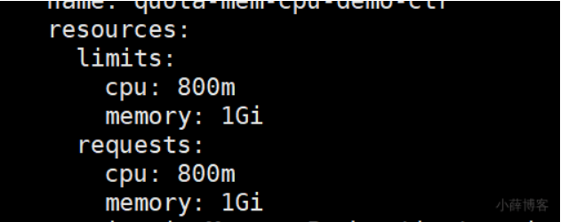

  default <map[string]string>: 给limits默认值

  defaultRequest <map[string]string>: 给requests默认值的

  max <map[string]string>: 最大使用量

  maxLimitRequestRatio <map[string]string>: 3 limit / request <= ratio; 800/200 = 4 > 3 ## 被拒绝

  min <map[string]string>: 最小使用量

  type -required-: Container、Pod

  ```text
  - ```yaml
  apiVersion: v1
  kind: LimitRange
  metadata:
    name: limit-memory-ratio-pod
  spec:
    limits:
    - maxLimitRequestRatio:
        memory: 2
        cpu: 3
      type: Pod
    - type: Container
      max: 
      min: 
  ```

## 3、调度原理

Pod。scheduler要计算他应该去哪个Node合适。（调度）

nodeSelector ： 指定去哪些Node

### 1、nodeSelector

`nodeSelector` 是节点选择约束的最简单推荐形式。`nodeSelector` 是 PodSpec 的一个字段。 它包含键值对的映射。为了使 pod 可以在某个节点上运行，该节点的标签中 必须包含这里的每个键值对（它也可以具有其他标签）。 最常见的用法的是一对键值对。

```yaml
apiVersion: v1
kind: Pod
metadata:
  name: nginx
  labels:
    env: test
spec:
  containers:
  - name: nginx
    image: nginx
    imagePullPolicy: IfNotPresent
  nodeSelector:
    disktype: ssd  ## 标签名。每个Node节点可以打标签
```


```sh
ingress-nginx：参照
```

> 除了你[添加 (opens new window)](https://kubernetes.io/zh/docs/concepts/scheduling-eviction/assign-pod-node/#attach-labels-to-node)的标签外，节点还预先填充了一组标准标签。 这些标签有：
>
> - [`kubernetes.io/hostname`(opens new window)](https://kubernetes.io/zh/docs/reference/kubernetes-api/labels-annotations-taints/#kubernetes-io-hostname)
> - [`failure-domain.beta.kubernetes.io/zone`(opens new window)](https://kubernetes.io/zh/docs/reference/kubernetes-api/labels-annotations-taints/#failure-domainbetakubernetesiozone)
> - [`failure-domain.beta.kubernetes.io/region`(opens new window)](https://kubernetes.io/zh/docs/reference/kubernetes-api/labels-annotations-taints/#failure-domainbetakubernetesioregion)
> - [`topology.kubernetes.io/zone`(opens new window)](https://kubernetes.io/zh/docs/reference/kubernetes-api/labels-annotations-taints/#topologykubernetesiozone)
> - [`topology.kubernetes.io/region`(opens new window)](https://kubernetes.io/zh/docs/reference/kubernetes-api/labels-annotations-taints/#topologykubernetesiozone)
> - [`beta.kubernetes.io/instance-type`(opens new window)](https://kubernetes.io/zh/docs/reference/kubernetes-api/labels-annotations-taints/#beta-kubernetes-io-instance-type)
> - [`node.kubernetes.io/instance-type`(opens new window)](https://kubernetes.io/zh/docs/reference/kubernetes-api/labels-annotations-taints/#nodekubernetesioinstance-type)
> - [`kubernetes.io/os`(opens new window)](https://kubernetes.io/zh/docs/reference/kubernetes-api/labels-annotations-taints/#kubernetes-io-os)
> - [`kubernetes.io/arch`(opens new window)](https://kubernetes.io/zh/docs/reference/kubernetes-api/labels-annotations-taints/#kubernetes-io-arch)
>
> > **说明：**
> >
> > 这些标签的值是特定于云供应商的，因此不能保证可靠。 例如，`kubernetes.io/hostname` 的值在某些环境中可能与节点名称相同， 但在其他环境中可能是一个不同的值。

#### 1、直接不用调度

```yaml
apiVersion: v1
kind: Pod
metadata:
  name: nginx-nodename
  labels:
    env: test
spec:
  nodeName: k8s-node1  ## master默认除外  ## scheduler无需工作
  containers:
  - name: nginx
    image: nginx
    imagePullPolicy: IfNotPresent
```

### 2、Affinity(亲和) and anti-affinity(反亲和)

Pod：到底去哪些机器。

- scheduler 进行自己计算调度
- 某些机器对这些Pod有吸引力。Pod希望scheduler 把他调度到他喜欢的**哪些机器**。

**亲和性**能设置如下

```sh
kubectl explain pod.spec.affinity
```

```yaml
KIND:     Pod
VERSION:  v1

RESOURCE: affinity <Object>

DESCRIPTION:
     If specified, the pod's scheduling constraints

     Affinity is a group of affinity scheduling rules.

FIELDS:
   nodeAffinity	<Object>: 指定亲和的节点（机器）。

   podAffinity	<Object>: 指定亲和的Pod。这个Pod部署到哪里看他亲和的Pod在哪里
     Describes pod affinity scheduling rules (e.g. co-locate this pod in the
     same node, zone, etc. as some other pod(s)).

   podAntiAffinity	<Object>： Pod的反亲和。
     Describes pod anti-affinity scheduling rules (e.g. avoid putting this pod
     in the same node, zone, etc. as some other pod(s)).
```

#### 1、Node Affinity （节点亲和）

**nodeSelector 的升级版**。节点亲和概念上类似于 `nodeSelector`，它使你可以根据节点上的标签来约束 pod 可以调度到哪些节点。

与nodeSelector差异

- 引入运算符：In，NotIn（labelSelector语法）

- 支持枚举label的可能的取值。如 zone in [az1,az2,az2]

- 支持

  硬性过滤

  和

  软性评分

  - 硬过滤规则支持指定 **多条件之间的逻辑或运算**
  - 软性评分规则支持 **设置条件权重**
  - 
  - 

```yaml
apiVersion: v1
kind: Pod
metadata:
  name: with-node-affinity
spec:
  affinity:
    nodeAffinity:
      requiredDuringSchedulingIgnoredDuringExecution: #硬性过滤：排除不具备指定label的node
        nodeSelectorTerms: 
          - matchExpressions:  #所有matchExpressions满足条件才行
              - key: disktype
                operator: In
                values:
                  - ssd
                  - hdd
 ##    matchExpressions	<[]Object> \matchFields <[]Object>
 ## DuringScheduling（调度期间有效）IgnoredDuringExecution（执行期间忽略）、亲和策略与反亲策略只在Pod调度期间有效，执行期间（Pod运行期间）会被忽略。
 ## required指定硬标准、preferred指定软标准
      preferredDuringSchedulingIgnoredDuringExecution:  #软性评分：不具备指定label的node打低分，降低node被选中的几率
        - weight: 1
          preference:
            matchExpressions: 
              - key: disktype
                operator: In
                values:
                  - ssd
  containers:
    - name: with-node-affinity
      image: nginx
      
##注意：如果你修改或删除了 pod 所调度到的节点的标签，pod 不会被删除。换句话说，亲和选择只在 pod 调度期间有效。
```

#### 2、podAffinity/podAntiAffinity

Pod之间的亲和性与反亲和性（inter-pod affinity and anti-affinity）**可以基于已经运行在节点上的 Pod 的标签**（而不是节点的标签）来限定 Pod 可以被调度到哪个节点上。此类规则的表现形式是：

- 当 X 已经运行了一个或者多个满足规则 Y 的 Pod 时，待调度的 Pod 应该（或者不应该 - 反亲和性）在 X 上运行

  - 规则 Y 以 LabelSelector 的形式表述，附带一个可选的名称空间列表

    > 与节点不一样，Pod 是在名称空间中的（因此，Pod的标签是在名称空间中的），针对 Pod 的 LabelSelector 必须同时指定对应的名称空间

  - X 是一个拓扑域的概念，例如节点、机柜、云供应商可用区、云供应商地域，等。X 以 `topologyKey` 的形式表达，该 Key代表了节点上代表拓扑域（topology domain）的一个标签。

Pod 亲和性与反亲和性结合高级别控制器（例如 ReplicaSet、StatefulSet、Deployment 等）一起使用时，可以非常实用。此时可以很容易的将一组工作复杂调度到同一个 topology，例如，同一个节点。

示例：在一个三节点的集群中，部署一个使用 redis 的 web 应用程序，并期望 web-server 尽可能与 redis 在同一个节点上。

```yaml
#下面是 redis deployment 的 yaml 片段，包含三个副本以及 `app=store` 标签选择器。Deployment 中配置了 `PodAntiAffinity`，确保调度器不会将三个副本调度到一个节点上：
apiVersion: apps/v1
kind: Deployment
metadata:
  name: redis-cache
spec:
  selector:
    matchLabels:
      app: store
  replicas: 2
  template:
    metadata:
      labels:
        app: store
    spec:
      affinity:
        podAntiAffinity:
          requiredDuringSchedulingIgnoredDuringExecution:
          - labelSelector:  #选Pod的Label
              matchExpressions:
              - key: app
                operator: In
                values:
                - store
            topologyKey: "kubernetes.io/hostname"
      containers:
      - name: redis-server
        image: redis:3.2-alpine
```


```yaml
apiVersion: apps/v1
kind: Deployment
metadata:
  name: web-server
spec:
  selector:
    matchLabels:
      app: web-store
  replicas: 2
  template:
    metadata:
      labels:
        app: web-store
    spec:
      affinity:
        podAntiAffinity:
          requiredDuringSchedulingIgnoredDuringExecution:
          - labelSelector:
              matchExpressions:
              - key: app
                operator: In
                values:
                - web-store
            topologyKey: "kubernetes.io/hostname" #不能再同一个拓扑网络
        podAffinity:
          requiredDuringSchedulingIgnoredDuringExecution:
          - labelSelector:
              matchExpressions:
              - key: app
                operator: In
                values:
                - store
            topologyKey: "kubernetes.io/hostname" # 需要在同一个拓扑网络
      containers:
      - name: web-app
        image: nginx:1.12-alpine
```


| k8s-001      | k8s-002     | k8s-003     |
| ------------ | ----------- | ----------- |
| web-server-1 | webserver-2 | webserver-3 |
| cache-1      | cache-2     | cache-3     |

### 3、污点与容忍

https://kubernetes.io/zh/docs/concepts/scheduling-eviction/taint-and-toleration/

#### 1、概述

Pod 中存在属性 Node selector / Node affinity，用于将 Pod 指定到合适的节点。

相对的，节点中存在属性 `污点 taints`，使得节点可以排斥某些 Pod。

污点和容忍（taints and tolerations）成对工作，以确保 Pod 不会被调度到不合适的节点上。

- 可以为节点增加污点（taints，一个节点可以有 0-N 个污点）
- 可以为 Pod 增加容忍（toleration，一个 Pod 可以有 0-N 个容忍）
- 如果节点上存在污点，则该节点不会接受任何不能容忍（tolerate）该污点的 Pod。

#### 2、向节点添加污点

```yaml
kubectl taint nodes node1 key=value:NoSchedule
#该命令为节点 node1 添加了一个污点。污点是一个键值对，在本例中，污点的键为 key，值为 value，污点效果为 NoSchedule。此污点意味着 Kubernetes 不会向该节点调度任何 Pod，除非该 Pod 有一个匹配的容忍（toleration）

kubectl taint nodes 节点名  污点key=污点的值:污点的效果
# 比如matser的污点：有这个污点不能调度
node-role.kubernetes.io/master:NoSchedule

#执行如下命令可以将本例中的污点移除：
kubectl taint nodes node1 key:NoSchedule-
```


污点写法； **k=v:effect**

haha=hehe:NoExecute ： 节点上的所有。Pod全部被驱逐。

停机维护：

- node1： Pod
- 给node1打个污点。haha=hehe:NoExecute；Pod被赶走。。。。在其他机器拉起

支持的效果 `effect` 有：

- **`NoSchedule`**：不调度。不给给我这里调度Pod
- **`PreferNoSchedule`** 比 `NoSchedule` 更宽容一些，Kubernetes 将尽量避免将没有匹配容忍的 Pod 调度到该节点上，但是并不是不可以
- **`NoExecute`** 不能在节点上运行（如果已经运行，将被驱逐）

master节点默认是由一个污点的

```sh
kubectl describe node k8s-master01 | grep Taints
```

#### 3、向 Pod 添加容忍

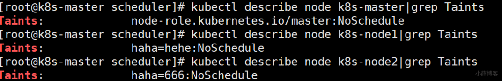

PodSpec 中有一个 `tolerations` 字段，可用于向 Pod 添加容忍。下面的两个例子中定义的容忍都可以匹配上例中的污点，包含这些容忍的 Pod 也都可以被调度到 `node1` 节点上：

```yaml
#容忍1
tolerations:
- key: "key"
  operator: "Equal"
  value: "value"
  effect: "NoSchedule"
  

#容忍2
tolerations:
- key: "key"
  operator: "Exists"
  effect: "NoSchedule"


#使用容忍
apiVersion: v1
kind: Pod
metadata:
  name: nginx-tolerations
  labels:
    env: test
spec:
  containers:
  - name: nginx
    image: nginx
    imagePullPolicy: IfNotPresent
  tolerations:
  - key: "example-key"
    operator: "Exists"
    effect: "NoSchedule"
```


#### 4、污点与容忍的匹配

当满足如下条件时，Kubernetes 认为容忍和污点匹配：

- 键（key）相同
- 效果（effect）相同
- 污点的operator为：
  - `Exists` （此时污点中不应该指定 `value`）
  - 或者 `Equal` （此时容忍的 `value` 应与污点的 `value` 相同）

如果不指定 `operator`，则其默认为 `Equal`

> 特殊情况
>
> 存在如下两种特殊情况：
>
> - 容忍中未定义 `key` 但是定义了 operator 为 `Exists`，Kubernetes 认为此容忍匹配所有的污点，如下所示：
>
> ```yaml
> tolerations:
>  - operator: "Exists"  ### 啥都能忍
> #最终，所有有污点的机器我们都能容忍，都可以调度
> ```
>
> - 容忍中未定义 `effect` 但是定义了 `key`，Kubernetes 认为此容忍匹配所有 `effect`，如下所示：
>
> ```yaml
> tolerations:
>  - key: "key"
>    operator: "Exists"  ## 无论无论效果是什么都能忍
> 
> 
> #最终，有这个污点的机器我们可以容忍，pod可以调度和运行
> tolerations:
>  - key: "key"
>    operator: "Exists"  
>    effect: "NoExecute"  ## 默认节点有不能执行的污点。节点Pod都会被赶走。Pod只要忍不执行，节点有不执行的污点，Pod也不会被驱逐。可以指定 tolerationSeconds：来说明Pod最多在Node上呆多久
> 
> 
> 
>    ## k8s底层发现网络有问题会给这个机器打上
>    	## key：“node.kubernetes.io/unreachable”  effect: "NoExecute"。 Pod立马驱动？？
> ```

**一个节点上可以有多个污点，同时一个 Pod 上可以有多个容忍。**Kubernetes 使用一种类似于过滤器的方法来处理多个节点和容忍：

- 对于节点的所有污点，检查 Pod 上是否有匹配的容忍，如果存在匹配的容忍，则忽略该污点；
- 剩下的不可忽略的污点将对该 Pod 起作用

例如：

- 如果存在至少一个不可忽略的污点带有效果 `NoSchedule`，则 Kubernetes 不会将 Pod 调度到该节点上
- 如果没有不可忽略的污点带有效果 `NoSchedule`，但是至少存在一个不可忽略的污点带有效果 `PreferNoSchedule`，则 Kubernetes 将尽量避免将该 Pod 调度到此节点
- 如果存在至少一个忽略的污点带有效果NoExecute，则：
  - 假设 Pod 已经在该节点上运行，Kubernetes 将从该节点上驱逐（evict）该 Pod
  - 假设 Pod 尚未在该节点上运行，Kubernetes 将不会把 Pod 调度到该节点

案例分析

```yaml
#假设您给一个节点添加了三个污点：
kubectl taint nodes node1 key1=value1:NoSchedule
kubectl taint nodes node1 key1=value1:NoExecute
kubectl taint nodes node1 key2=value2:NoSchedule


#同时，有一个 Pod 带有两个容忍
tolerations:
- key: "key1"
  operator: "Equal"
  value: "value1"
  effect: "NoSchedule"
- key: "key1"
  operator: "Equal"
  value: "value1"
  effect: "NoExecute"
```

在这个案例中，Pod 上有两个容忍，匹配了节点的前两个污点，只有节点的第三个污点对该 Pod 来说不可忽略，该污点的效果为 `NoSchedule`：

- Kubernetes 不会将此 Pod 调度到该节点上
- 如果 Kubernetes 先将 Pod 调度到了该节点，后向该节点添加了第三个污点，则 Pod 将继续在该节点上运行而不会被驱逐（节点上带有 `NoExecute` 效果的污点已被 Pod 上的第二个容忍匹配，因此被忽略）

通常，在带有效果 `NoExecute` 的污点被添加到节点时，节点上任何不容忍该污点的 Pod 将被立刻驱逐，而容忍该污点的 Pod 则不会被驱逐。

此外，带有效果 `NoExecute` 的污点还可以指定一个可选字段 `tolerationSeconds`，该字段指定了 Pod 在多长时间后被驱逐，例如：

```yaml
tolerations:
- key: "key1"
  operator: "Equal"
  value: "value1"
  effect: "NoExecute"
  tolerationSeconds: 3600
#如果 Pod 已经运行在节点上，再向节点增加此污点时，Pod 将在该节点上继续运行 3600 秒，然后才被驱逐。如果污点在此之间被移除，则 Pod 将不会被驱逐。
```

#### 5、基于污点的驱逐（TaintBasedEviction）

NoExecute 的污点效果，对已经运行在节点上的 Pod 施加如下影响：

- 不容忍该污点的 Pod 将立刻被驱逐
- 容忍该污点的 Pod 在未指定 `tolerationSeconds` 的情况下，将继续在该节点上运行
- 容忍该污点的 Pod 在指定了 `tolerationSeconds` 的情况下，将在指定时间超过时从节点上驱逐

> `tolerationSeconds` 字段可以理解为 Pod 容忍该污点的 `耐心`：
>
> - 超过指定的时间，则达到 Pod 忍耐的极限，Pod 离开所在节点
> - 不指定 `tolerationSeconds`，则认为 Pod 对该污点的容忍是无期限的

自 kubernetes 1.6 以来，kubernetes 的节点控制器在碰到某些特定的条件时，将自动为节点添加污点。这类污点有：

- `node.kubernetes.io/not-ready`： 节点未就绪。对应着 NodeCondition `Ready` 为 `False` 的情况
- `node.kubernetes.io/unreachable`： 节点不可触达。对应着 NodeCondition `Ready` 为 `Unknown` 的情况
- `node.kubernetes.io/out-of-disk`：节点磁盘空间已满
- `node.kubernetes.io/memory-pressure`：节点内存吃紧: NoSchedule
- `node.kubernetes.io/disk-pressure`：节点磁盘吃紧: NoSchedule
- `node.kubernetes.io/network-unavailable`：节点网络不可用: NoExecute
- `node.kubernetes.io/unschedulable`：节点不可调度:
- `node.cloudprovider.kubernetes.io/uninitialized`：如果 kubelet 是由 "外部" 云服务商启动的，该污点用来标识某个节点当前为不可用的状态。在“云控制器”（cloud-controller-manager）初始化这个节点以后，kubelet将此污点移除

自 kubernetes 1.13 开始，上述特性被默认启用。

例如，某一个包含了大量本地状态的应用，在网络断开时，可能仍然想要在节点上停留比较长的时间，以等待网络能够恢复，而避免从节点上驱逐。此时，该 Pod 的容忍可能如下所示：

```yaml
tolerations:
- key: "node.kubernetes.io/unreachable"
  operator: "Exists"
  effect: "NoExecute"
  tolerationSeconds: 6000 #只在NoExecute这种下有用。污点。
```


如果 Pod 没有 `node.kubernetes.io/not-ready` 容忍， Kubernetes 将自动为 Pod 添加一个 `tolerationSeconds=300` 的 `node.kubernetes.io/not-ready` 容忍。同样的，如果 Pod 没有 `node.kubernetes.io/unreachable` 容忍，Kubernetes 将自动为 Pod 添加一个 `tolerationSeconds=300` 的 `node.kubernetes.io/unreachable` 容忍

这类自动添加的容忍确保了 Pod 在节点发生 `not-ready` 和 `unreachable` 问题时，仍然在节点上保留 5 分钟。

**DaemonSet Pod 相对特殊一些**，他们在创建时就添加了不带 `tolerationSeconds` 的 `NoExecute` 效果的容忍，适用的污点有：

- `node.kubernetes.io/unreachable`
- `node.kubernetes.io/not-ready`

这将确保 DaemonSet Pod 始终不会被驱逐。

自 Kubernetes 1.8 开始，DaemonSet Controller 自动为所有的 DaemonSet Pod 添加如下 `NoSchedule` 效果的容忍，以防止 DaemonSet 不能正常工作：

- `node.kubernetes.io/memory-pressure`
- `node.kubernetes.io/disk-pressure`
- `node.kubernetes.io/out-of-disk`（只对关键 Pod 生效）
- `node.kubernetes.io/unschedulable`（不低于 Kubernetes 1.10）
- `node.kubernetes.io/network-unavailable`（只对 host network 生效）

## 4、其他

### 1、拓扑分区约束

https://kubernetes.io/zh/docs/concepts/workloads/pods/pod-topology-spread-constraints/

[深入理解拓扑最大倾斜(opens new window)](https://kubernetes.io/blog/2020/05/introducing-podtopologyspread/)

画出自己的机器拓扑分区图。 1000node

更详细的指定拓扑网络的策略；

用来规划和平衡整个集群的资源；maxSkew；


### 2、资源调度

containers：resources来做资源限定。

- limits：代表运行时的限制量，超了这个就会有OOM，kubelet就会尝试重启
- requests：代表调度时，衡量某个节点是否还有这么多剩余量。request的资源不够，不能调度

问题1：

> Pod： c1 = request: 200m c2 = request: 300m c3 = request: 100m
>
> containers: ## 所有的资源申请量之和。
>
>  - name: taint-haha #request-cpu: 200m
>
>  image: "busybox"
>
>  command: ["sleep","3600"]
>
>  - name: haha-02 # request-cpu: 300m
>
>  image: "busybox"
>
>  command: ["sleep","3600"]
>
>  - name: haha-03 # request-cpu: 100m
>
>  image: "busybox""
>
>  command: ["sleep","3600"]

> Node:
>
> - node1: 300m - cpu
> - node2: 500m - cpu
> - node3: 700m - cpu ## scheduler会把Pod调度到node3
>
> Pod可调度到哪个节点？

问题2：

> Pod： c1 = request: 200m **init-c2**->request: **300m** init-c3->request:100m
>
> Node:
>
> - node1: 300m
> - node2: 500m
> - node3: 700m
>
> Pod可以调度到哪个节点

```yaml
      initContainers: ## 初始化会结束。前面的执行完执行后面
      - name:  init-01 #request-cpu: 300m
        image:  "busybox"
        command: ["sleep","3600"] 
      - name:  init-02 #request-cpu: 100m
        image:  "busybox"
        command: ["sleep","3600"] 
      containers:  ## Pod启动以后所有容器都是运行的。（总量）
      - name:  taint-haha  #request-cpu: 200m
        image:  "busybox"
        command: ["sleep","3600"] 
node1,2,3都可以执行这个Pod
```

### 2、命令行

```yaml
Basic Commands (Beginner):
  create        Create a resource from a file or from stdin.
  expose        Take a replication controller, service, deployment or pod and expose xx
  run           Run a particular image on the cluster
  set           Set specific features on objects

Basic Commands (Intermediate):
  explain       Documentation of resources
  get           Display one or many resources
  edit          Edit a resource on the server
  delete        Delete resources by filenames, stdin, resources and names, or by resources

Deploy Commands:
  rollout       Manage the rollout of a resource
  scale         Set a new size for a Deployment, ReplicaSet or Replication Controller
  autoscale     Auto-scale a Deployment, ReplicaSet, StatefulSet, or ReplicationController

Cluster Management Commands:
  certificate   Modify certificate resources.
  cluster-info  Display cluster info
  top           Display Resource (CPU/Memory) usage.
  cordon        Mark node as unschedulable
  #  打上默认污点 node.kubernetes.io/unschedulable:NoSchedule
  # 不可调度只是指，新的Pod不能给当前节点调度，但是不影响其他工作
  uncordon      Mark node as schedulable
  # 徐晓默认污点 node.kubernetes.io/unschedulable:NoSchedule-
  drain         Drain node in preparation for maintenance
  ## 排空：驱逐节点上的所有Pod资源。（打NoExecute污点和drain都行）
  taint         Update the taints on one or more nodes

Troubleshooting and Debugging Commands:
  describe      Show details of a specific resource or group of resources
  logs          Print the logs for a container in a pod
  attach        Attach to a running container
  exec          Execute a command in a container
  port-forward  Forward one or more local ports to a pod
  proxy         Run a proxy to the Kubernetes API server
  cp            Copy files and directories to and from containers.
  auth          Inspect authorization
  debug         Create debugging sessions for troubleshooting workloads and nodes

Advanced Commands:
  diff          Diff live version against would-be applied version
  apply         Apply a configuration to a resource by filename or stdin
  patch         Update field(s) of a resource
  replace       Replace a resource by filename or stdin
  wait          Experimental: Wait for a specific condition on one or many resources.
  kustomize     Build a kustomization target from a directory or URL.

Settings Commands:
  label         Update the labels on a resource
  annotate      Update the annotations on a resource
  completion    Output shell completion code for the specified shell (bash or zsh)

Other Commands:
  api-resources Print the supported API resources on the server
  api-versions  Print the supported API versions on the server, in the form of "group/version"
  config        Modify kubeconfig files
  plugin        Provides utilities for interacting with plugins.
  version       Print the client and server version information
```


# Kubernetes 安全性

https://kubernetes.io/zh/docs/concepts/security/controlling-access/

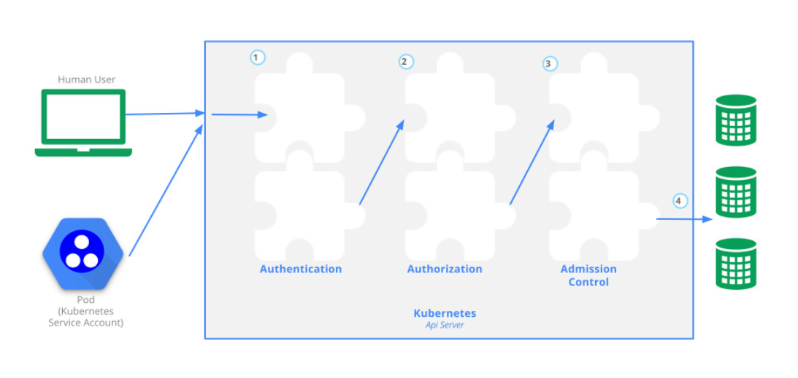

NFS的动态供应； Pod；pvc---自动创建pv

k8s会认为每个Pod也可以是操作集群的一个用户。给这个用户会给一个ServiceAccount（服务账号）

权限控制流程：

- 用户携带令牌或者证书给k8s的api-server发送请求要求修改集群资源
- k8s开始认证。认证通过
- k8s查询用户的授权（有哪些权限）
- 用户执行操作。过程中的一些操作（cpu、内存、硬盘、网络等....），利用准入控制来判断是否可以允许这样操作

## 1、RBAC

什么是RBAC？（基于角色的访问控制）

RBAC API 声明了四种 Kubernetes 对象：`Role、ClusterRole、RoleBinding 和 ClusterRoleBinding`

Role：基于名称空间的角色。可以操作名称空间下的资源

 RoleBinding： 来把一个Role。绑定给一个用户

ClusterRole：基于集群的角色。可以操作集群资源

 ClusterRoleBinding： 来把一个ClusterRole，绑定给一个用户

## 2、ClusterRole与Role

- RBAC 的 *Role* 或 *ClusterRole* 中包含一组代表相关权限的规则。 这些权限是纯粹累加的（不存在拒绝某操作的规则）。
- Role 总是用来在某个[名称空间 (opens new window)](https://kubernetes.io/zh/docs/concepts/overview/working-with-objects/namespaces/)内设置访问权限；在你创建 Role 时，你必须指定该 Role 所属的名字空间
- ClusterRole 则是一个集群作用域的资源。这两种资源的名字不同（Role 和 ClusterRole）是因为 Kubernetes 对象要么是名字空间作用域的，要么是集群作用域的， **不可两者兼具。**

> 我们kubeadm部署的apiserver是容器化部署的。默认没有同步机器时间。

### 1、Role

```yaml
apiVersion: rbac.authorization.k8s.io/v1
kind: Role
metadata:
  namespace: default
  name: pod-reader
rules:
- apiGroups: [""] # "" 标明 core API 组
  resources: ["pods"]
  verbs: ["get", "watch", "list"]
```

注意：资源写复数形式

### 2、ClusterRole

```yaml
apiVersion: rbac.authorization.k8s.io/v1
kind: ClusterRole
metadata:
  # "namespace" 被忽略，因为 ClusterRoles 不受名字空间限制
  name: secret-reader
rules:
- apiGroups: [""]
  # 在 HTTP 层面，用来访问 Secret 对象的资源的名称为 "secrets"
  resources: ["secrets"]
  verbs: ["get", "watch", "list"]
```

### 3、常见示例

https://kubernetes.io/zh/docs/reference/access-authn-authz/rbac/#role-examples

## 3、RoleBinding、ClusterRoleBinding

## 4、ServiceAccount

### 1、创建ServiceAccount

- 每个名称空间都会有自己默认的服务账号
  - 空的服务账号。
  - 每个Pod都会挂载这个默认服务账号。
  - 每个Pod可以自己声明 serviceAccountName： lfy
  - 特殊Pod（比如动态供应等）需要自己创建SA，并绑定相关的集群Role。给Pod挂载。才能操作

集群几个可用的角色

```yaml
cluster-admin:  整个集群全部全部权限  *.* ** *
admin: 很多资源的crud，不包括 直接给api-server发送http请求。/api
edit: 所有资源的编辑修改创建等权限
view: 集群的查看权限
```

### 2、测试基于ServiceAccount的rbac

```yaml
apiVersion: v1
kind: ServiceAccount
metadata:
  name: lfy
  namespace: default
# ---
# ## 写Role
---
apiVersion: rbac.authorization.k8s.io/v1
kind: ClusterRole
metadata:
  # namespace: default  ## 所属的名称空间
  name: ns-reader 
rules: ## 当前角色的规则
- apiGroups: [""] # "" 标明 core API 组
  resources: ["namespaces"] ## 获取集群的所有名称空间
  verbs: ["get", "watch", "list"] # 动词。
---
## 编写角色和账号的绑定关系
apiVersion: rbac.authorization.k8s.io/v1
kind: ClusterRoleBinding
metadata:
  name: read-ns-global
subjects:  ## 主体
- kind: ServiceAccount
  name: lfy # 'name' 是不区分大小写的
  namespace: default
  apiGroup: ""
roleRef:
  kind: ClusterRole
  name: ns-reader 
  apiGroup: rbac.authorization.k8s.io
```

### 3、使用命令行

```sh
## role
kubectl create role pod-reader --verb=get --verb=list --verb=watch --resource=pods
kubectl create role pod-reader --verb=get --resource=pods --resource-name=readablepod --resource-name=anotherpod
kubectl create role foo --verb=get,list,watch --resource=replicasets.apps
kubectl create role foo --verb=get,list,watch --resource=pods,pods/status
kubectl create role my-component-lease-holder --verb=get,list,watch,update --resource=lease --resource-name=my-component
```


```sh
#kubectl create clusterrole
kubectl create clusterrole pod-reader --verb=get,list,watch --resource=pods
kubectl create clusterrole pod-reader --verb=get --resource=pods --resource-name=readablepod --resource-name=anotherpod
kubectl create clusterrole foo --verb=get,list,watch --resource=replicasets.apps
kubectl create clusterrole foo --verb=get,list,watch --resource=pods,pods/status
kubectl create clusterrole "foo" --verb=get --non-resource-url=/logs/*
kubectl create clusterrole monitoring --aggregation-rule="rbac.example.com/aggregate-to-monitoring=true"
```


```sh
#kubectl create rolebinding
kubectl create rolebinding bob-admin-binding --clusterrole=admin --user=bob --namespace=acme
kubectl create rolebinding myapp-view-binding --clusterrole=view --serviceaccount=acme:myapp --namespace=acme
kubectl create rolebinding myappnamespace-myapp-view-binding --clusterrole=view --serviceaccount=myappnamespace:myapp --namespace=acme
```


```sh
###kubectl create clusterrolebinding
kubectl create clusterrolebinding myapp-view-binding --clusterrole=view --serviceaccount=acme:myapp
```

### 4、扩展-RestAPI访问k8s集群

步骤：

- 1、创建ServiceAccount、关联相关权限
- 2、使用ServiceAccount对应的Secret中的token作为http访问令牌
- 3、可以参照k8s集群restapi进行操作

请求头 Authorization: Bearer 自己的token即可

java也可以这样

```xml
<dependency>
    <groupId>io.kubernetes</groupId>
    <artifactId>client-java</artifactId>
    <version>10.0.0</version>
</dependency>
```


# 应用商店-Helm

## 一、简介

自己写yaml

一个应用：（博客程序，wordpress+mysql）

- Deployment.yaml
- Service.yaml
- PVC.yaml
- Ingress.yaml
- xxxx

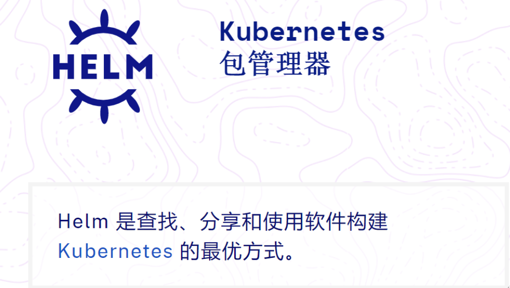

charts：图表 发布charts；docker发布镜像

## 二、安装

### 1、用二进制版本安装

每个Helm [版本 (opens new window)](https://github.com/helm/helm/releases)都提供了各种操作系统的二进制版本，这些版本可以手动下载和安装。

1. 下载 [需要的版本(opens new window)](https://github.com/helm/helm/releases)
2. 解压(`tar -zxvf helm-v3.0.0-linux-amd64.tar.gz`)
3. 在解压目中找到`helm`程序，移动到需要的目录中(`mv linux-amd64/helm /usr/local/bin/helm`)

```sh
vi helm.sh

chmod 777 helm.sh

./helm.sh
```


```sh
# helm.sh 内容
#!/usr/bin/env bash

# Copyright The Helm Authors.
#
# Licensed under the Apache License, Version 2.0 (the "License");
# you may not use this file except in compliance with the License.
# You may obtain a copy of the License at
#
#     http://www.apache.org/licenses/LICENSE-2.0
#
# Unless required by applicable law or agreed to in writing, software
# distributed under the License is distributed on an "AS IS" BASIS,
# WITHOUT WARRANTIES OR CONDITIONS OF ANY KIND, either express or implied.
# See the License for the specific language governing permissions and
# limitations under the License.

# The install script is based off of the MIT-licensed script from glide,
# the package manager for Go: https://github.com/Masterminds/glide.sh/blob/master/get

: ${BINARY_NAME:="helm"}
: ${USE_SUDO:="true"}
: ${DEBUG:="false"}
: ${VERIFY_CHECKSUM:="true"}
: ${VERIFY_SIGNATURES:="false"}
: ${HELM_INSTALL_DIR:="/usr/local/bin"}
: ${GPG_PUBRING:="pubring.kbx"}

HAS_CURL="$(type "curl" &> /dev/null && echo true || echo false)"
HAS_WGET="$(type "wget" &> /dev/null && echo true || echo false)"
HAS_OPENSSL="$(type "openssl" &> /dev/null && echo true || echo false)"
HAS_GPG="$(type "gpg" &> /dev/null && echo true || echo false)"

# initArch discovers the architecture for this system.
initArch() {
  ARCH=$(uname -m)
  case $ARCH in
    armv5*) ARCH="armv5";;
    armv6*) ARCH="armv6";;
    armv7*) ARCH="arm";;
    aarch64) ARCH="arm64";;
    x86) ARCH="386";;
    x86_64) ARCH="amd64";;
    i686) ARCH="386";;
    i386) ARCH="386";;
  esac
}

# initOS discovers the operating system for this system.
initOS() {
  OS=$(echo `uname`|tr '[:upper:]' '[:lower:]')

  case "$OS" in
    # Minimalist GNU for Windows
    mingw*) OS='windows';;
  esac
}

# runs the given command as root (detects if we are root already)
runAsRoot() {
  if [ $EUID -ne 0 -a "$USE_SUDO" = "true" ]; then
    sudo "${@}"
  else
    "${@}"
  fi
}

# verifySupported checks that the os/arch combination is supported for
# binary builds, as well whether or not necessary tools are present.
verifySupported() {
  local supported="darwin-amd64\ndarwin-arm64\nlinux-386\nlinux-amd64\nlinux-arm\nlinux-arm64\nlinux-ppc64le\nlinux-s390x\nwindows-amd64"
  if ! echo "${supported}" | grep -q "${OS}-${ARCH}"; then
    echo "No prebuilt binary for ${OS}-${ARCH}."
    echo "To build from source, go to https://github.com/helm/helm"
    exit 1
  fi

  if [ "${HAS_CURL}" != "true" ] && [ "${HAS_WGET}" != "true" ]; then
    echo "Either curl or wget is required"
    exit 1
  fi

  if [ "${VERIFY_CHECKSUM}" == "true" ] && [ "${HAS_OPENSSL}" != "true" ]; then
    echo "In order to verify checksum, openssl must first be installed."
    echo "Please install openssl or set VERIFY_CHECKSUM=false in your environment."
    exit 1
  fi

  if [ "${VERIFY_SIGNATURES}" == "true" ]; then
    if [ "${HAS_GPG}" != "true" ]; then
      echo "In order to verify signatures, gpg must first be installed."
      echo "Please install gpg or set VERIFY_SIGNATURES=false in your environment."
      exit 1
    fi
    if [ "${OS}" != "linux" ]; then
      echo "Signature verification is currently only supported on Linux."
      echo "Please set VERIFY_SIGNATURES=false or verify the signatures manually."
      exit 1
    fi
  fi
}

# checkDesiredVersion checks if the desired version is available.
checkDesiredVersion() {
  if [ "x$DESIRED_VERSION" == "x" ]; then
    # Get tag from release URL
    local latest_release_url="https://github.com/helm/helm/releases"
    if [ "${HAS_CURL}" == "true" ]; then
      TAG=$(curl -Ls $latest_release_url | grep 'href="/helm/helm/releases/tag/v3.[0-9]*.[0-9]*\"' | grep -v no-underline | head -n 1 | cut -d '"' -f 2 | awk '{n=split($NF,a,"/");print a[n]}' | awk 'a !~ $0{print}; {a=$0}')
    elif [ "${HAS_WGET}" == "true" ]; then
      TAG=$(wget $latest_release_url -O - 2>&1 | grep 'href="/helm/helm/releases/tag/v3.[0-9]*.[0-9]*\"' | grep -v no-underline | head -n 1 | cut -d '"' -f 2 | awk '{n=split($NF,a,"/");print a[n]}' | awk 'a !~ $0{print}; {a=$0}')
    fi
  else
    TAG=$DESIRED_VERSION
  fi
}

# checkHelmInstalledVersion checks which version of helm is installed and
# if it needs to be changed.
checkHelmInstalledVersion() {
  if [[ -f "${HELM_INSTALL_DIR}/${BINARY_NAME}" ]]; then
    local version=$("${HELM_INSTALL_DIR}/${BINARY_NAME}" version --template="{{ .Version }}")
    if [[ "$version" == "$TAG" ]]; then
      echo "Helm ${version} is already ${DESIRED_VERSION:-latest}"
      return 0
    else
      echo "Helm ${TAG} is available. Changing from version ${version}."
      return 1
    fi
  else
    return 1
  fi
}

# downloadFile downloads the latest binary package and also the checksum
# for that binary.
downloadFile() {
  HELM_DIST="helm-$TAG-$OS-$ARCH.tar.gz"
  DOWNLOAD_URL="https://get.helm.sh/$HELM_DIST"
  CHECKSUM_URL="$DOWNLOAD_URL.sha256"
  HELM_TMP_ROOT="$(mktemp -dt helm-installer-XXXXXX)"
  HELM_TMP_FILE="$HELM_TMP_ROOT/$HELM_DIST"
  HELM_SUM_FILE="$HELM_TMP_ROOT/$HELM_DIST.sha256"
  echo "Downloading $DOWNLOAD_URL"
  if [ "${HAS_CURL}" == "true" ]; then
    curl -SsL "$CHECKSUM_URL" -o "$HELM_SUM_FILE"
    curl -SsL "$DOWNLOAD_URL" -o "$HELM_TMP_FILE"
  elif [ "${HAS_WGET}" == "true" ]; then
    wget -q -O "$HELM_SUM_FILE" "$CHECKSUM_URL"
    wget -q -O "$HELM_TMP_FILE" "$DOWNLOAD_URL"
  fi
}

# verifyFile verifies the SHA256 checksum of the binary package
# and the GPG signatures for both the package and checksum file
# (depending on settings in environment).
verifyFile() {
  if [ "${VERIFY_CHECKSUM}" == "true" ]; then
    verifyChecksum
  fi
  if [ "${VERIFY_SIGNATURES}" == "true" ]; then
    verifySignatures
  fi
}

# installFile installs the Helm binary.
installFile() {
  HELM_TMP="$HELM_TMP_ROOT/$BINARY_NAME"
  mkdir -p "$HELM_TMP"
  tar xf "$HELM_TMP_FILE" -C "$HELM_TMP"
  HELM_TMP_BIN="$HELM_TMP/$OS-$ARCH/helm"
  echo "Preparing to install $BINARY_NAME into ${HELM_INSTALL_DIR}"
  runAsRoot cp "$HELM_TMP_BIN" "$HELM_INSTALL_DIR/$BINARY_NAME"
  echo "$BINARY_NAME installed into $HELM_INSTALL_DIR/$BINARY_NAME"
}

# verifyChecksum verifies the SHA256 checksum of the binary package.
verifyChecksum() {
  printf "Verifying checksum... "
  local sum=$(openssl sha1 -sha256 ${HELM_TMP_FILE} | awk '{print $2}')
  local expected_sum=$(cat ${HELM_SUM_FILE})
  if [ "$sum" != "$expected_sum" ]; then
    echo "SHA sum of ${HELM_TMP_FILE} does not match. Aborting."
    exit 1
  fi
  echo "Done."
}

# verifySignatures obtains the latest KEYS file from GitHub main branch
# as well as the signature .asc files from the specific GitHub release,
# then verifies that the release artifacts were signed by a maintainer's key.
verifySignatures() {
  printf "Verifying signatures... "
  local keys_filename="KEYS"
  local github_keys_url="https://raw.githubusercontent.com/helm/helm/main/${keys_filename}"
  if [ "${HAS_CURL}" == "true" ]; then
    curl -SsL "${github_keys_url}" -o "${HELM_TMP_ROOT}/${keys_filename}"
  elif [ "${HAS_WGET}" == "true" ]; then
    wget -q -O "${HELM_TMP_ROOT}/${keys_filename}" "${github_keys_url}"
  fi
  local gpg_keyring="${HELM_TMP_ROOT}/keyring.gpg"
  local gpg_homedir="${HELM_TMP_ROOT}/gnupg"
  mkdir -p -m 0700 "${gpg_homedir}"
  local gpg_stderr_device="/dev/null"
  if [ "${DEBUG}" == "true" ]; then
    gpg_stderr_device="/dev/stderr"
  fi
  gpg --batch --quiet --homedir="${gpg_homedir}" --import "${HELM_TMP_ROOT}/${keys_filename}" 2> "${gpg_stderr_device}"
  gpg --batch --no-default-keyring --keyring "${gpg_homedir}/${GPG_PUBRING}" --export > "${gpg_keyring}"
  local github_release_url="https://github.com/helm/helm/releases/download/${TAG}"
  if [ "${HAS_CURL}" == "true" ]; then
    curl -SsL "${github_release_url}/helm-${TAG}-${OS}-${ARCH}.tar.gz.sha256.asc" -o "${HELM_TMP_ROOT}/helm-${TAG}-${OS}-${ARCH}.tar.gz.sha256.asc"
    curl -SsL "${github_release_url}/helm-${TAG}-${OS}-${ARCH}.tar.gz.asc" -o "${HELM_TMP_ROOT}/helm-${TAG}-${OS}-${ARCH}.tar.gz.asc"
  elif [ "${HAS_WGET}" == "true" ]; then
    wget -q -O "${HELM_TMP_ROOT}/helm-${TAG}-${OS}-${ARCH}.tar.gz.sha256.asc" "${github_release_url}/helm-${TAG}-${OS}-${ARCH}.tar.gz.sha256.asc"
    wget -q -O "${HELM_TMP_ROOT}/helm-${TAG}-${OS}-${ARCH}.tar.gz.asc" "${github_release_url}/helm-${TAG}-${OS}-${ARCH}.tar.gz.asc"
  fi
  local error_text="If you think this might be a potential security issue,"
  error_text="${error_text}\nplease see here: https://github.com/helm/community/blob/master/SECURITY.md"
  local num_goodlines_sha=$(gpg --verify --keyring="${gpg_keyring}" --status-fd=1 "${HELM_TMP_ROOT}/helm-${TAG}-${OS}-${ARCH}.tar.gz.sha256.asc" 2> "${gpg_stderr_device}" | grep -c -E '^\[GNUPG:\] (GOODSIG|VALIDSIG)')
  if [[ ${num_goodlines_sha} -lt 2 ]]; then
    echo "Unable to verify the signature of helm-${TAG}-${OS}-${ARCH}.tar.gz.sha256!"
    echo -e "${error_text}"
    exit 1
  fi
  local num_goodlines_tar=$(gpg --verify --keyring="${gpg_keyring}" --status-fd=1 "${HELM_TMP_ROOT}/helm-${TAG}-${OS}-${ARCH}.tar.gz.asc" 2> "${gpg_stderr_device}" | grep -c -E '^\[GNUPG:\] (GOODSIG|VALIDSIG)')
  if [[ ${num_goodlines_tar} -lt 2 ]]; then
    echo "Unable to verify the signature of helm-${TAG}-${OS}-${ARCH}.tar.gz!"
    echo -e "${error_text}"
    exit 1
  fi
  echo "Done."
}

# fail_trap is executed if an error occurs.
fail_trap() {
  result=$?
  if [ "$result" != "0" ]; then
    if [[ -n "$INPUT_ARGUMENTS" ]]; then
      echo "Failed to install $BINARY_NAME with the arguments provided: $INPUT_ARGUMENTS"
      help
    else
      echo "Failed to install $BINARY_NAME"
    fi
    echo -e "\tFor support, go to https://github.com/helm/helm."
  fi
  cleanup
  exit $result
}

# testVersion tests the installed client to make sure it is working.
testVersion() {
  set +e
  HELM="$(command -v $BINARY_NAME)"
  if [ "$?" = "1" ]; then
    echo "$BINARY_NAME not found. Is $HELM_INSTALL_DIR on your "'$PATH?'
    exit 1
  fi
  set -e
}

# help provides possible cli installation arguments
help () {
  echo "Accepted cli arguments are:"
  echo -e "\t[--help|-h ] ->> prints this help"
  echo -e "\t[--version|-v <desired_version>] . When not defined it fetches the latest release from GitHub"
  echo -e "\te.g. --version v3.0.0 or -v canary"
  echo -e "\t[--no-sudo]  ->> install without sudo"
}

# cleanup temporary files to avoid https://github.com/helm/helm/issues/2977
cleanup() {
  if [[ -d "${HELM_TMP_ROOT:-}" ]]; then
    rm -rf "$HELM_TMP_ROOT"
  fi
}

# Execution

#Stop execution on any error
trap "fail_trap" EXIT
set -e

# Set debug if desired
if [ "${DEBUG}" == "true" ]; then
  set -x
fi

# Parsing input arguments (if any)
export INPUT_ARGUMENTS="${@}"
set -u
while [[ $# -gt 0 ]]; do
  case $1 in
    '--version'|-v)
       shift
       if [[ $# -ne 0 ]]; then
           export DESIRED_VERSION="${1}"
       else
           echo -e "Please provide the desired version. e.g. --version v3.0.0 or -v canary"
           exit 0
       fi
       ;;
    '--no-sudo')
       USE_SUDO="false"
       ;;
    '--help'|-h)
       help
       exit 0
       ;;
    *) exit 1
       ;;
  esac
  shift
done
set +u

initArch
initOS
verifySupported
checkDesiredVersion
if ! checkHelmInstalledVersion; then
  downloadFile
  verifyFile
  installFile
fi
testVersion
cleanup
```

## 三、入门使用

### 1、三大概念

- *Chart* 代表着 Helm 包。它包含在 Kubernetes 集群内部运行应用程序，工具或服务所需的所有资源定义。你可以把它看作是 Homebrew formula，Apt dpkg，或 Yum RPM 在Kubernetes 中的等价物。
- *Repository（仓库）* 是用来存放和共享 charts 的地方。它就像 Perl 的 [CPAN 档案库网络 (opens new window)](https://www.cpan.org/)或是 Fedora 的 [软件包仓库 (opens new window)](https://fedorahosted.org/pkgdb2/)，只不过它是供 Kubernetes 包所使用的。
- *Release* 是运行在 Kubernetes 集群中的 chart 的实例。一个 chart 通常可以在同一个集群中安装多次。每一次安装都会创建一个新的 *release*。以 MySQL chart为例，如果你想在你的集群中运行两个数据库，你可以安装该chart两次。每一个数据库都会拥有它自己的 *release* 和 *release name*。

在了解了上述这些概念以后，我们就可以这样来解释 Helm：

> Helm 安装 *charts* 到 Kubernetes 集群中，每次安装都会创建一个新的 *release*。你可以在 Helm 的 chart *repositories* 中寻找新的 chart。

```bash
helm pull bitnami/mysql
helm install -f values.yaml mysqlhaha ./
```

### 2、charts 结构


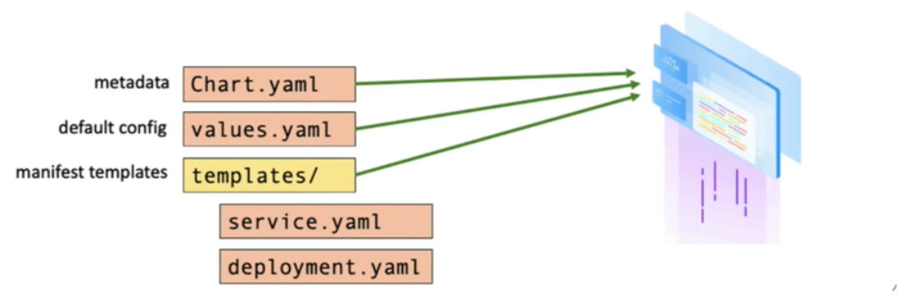

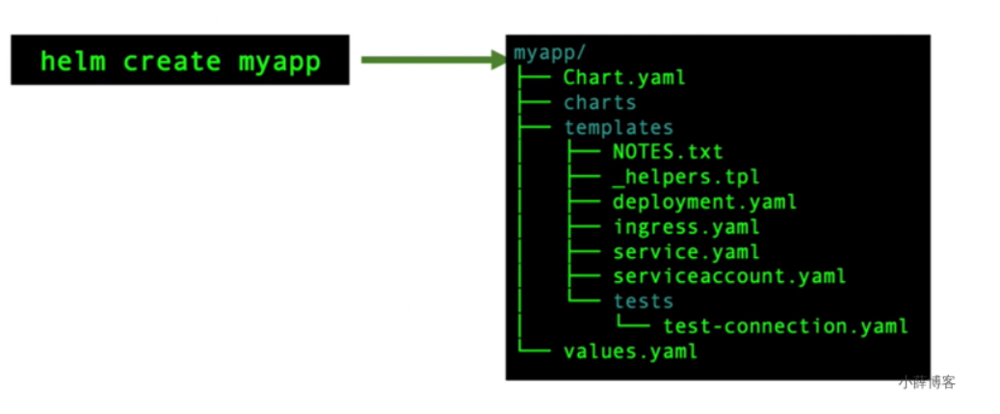

### 3、应用安装


### 4、自定义变量值

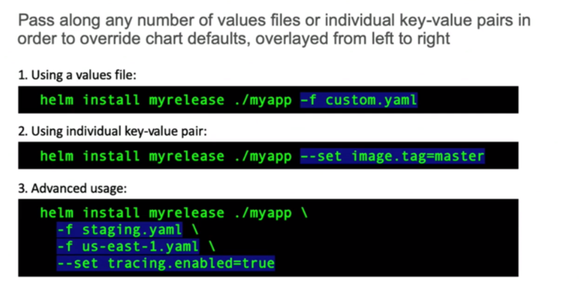

### 5、命令

```sh
helm install xx
helm list
helm status xx
helm rollback xxx
```

### 6、推送helm chart

```sh
helm registry login --insecure 192.168.86.5
helm chart save /root/mariadb 192.168.86.5/chart/mariadb:test
helm chart push 192.168.86.5/chart/mariadb:test
helm registry logout 192.168.86.5
```


# 其他

## 1、查看Kubernetes适配的docker版本

https://github.com/kubernetes/kubernetes/releases   查看他的changelog，搜索适配的docker版本即可。


## 2、弃用dockershim的问题

https://kubernetes.io/zh/blog/2020/12/02/dockershim-faq/

- 使用containerd： https://kubernetes.io/zh/docs/setup/production-environment/container-runtimes/#containerd
- 配置docker：https://kubernetes.io/zh/docs/setup/production-environment/container-runtimes/#docker

## kubectl的所有命令参考：

命令参考：https://kubernetes.io/docs/reference/generated/kubectl/kubectl-commands

pdf命令实战：https://github.com/dennyzhang/cheatsheet-kubernetes-A4/blob/master/cheatsheet-kubernetes-A4.pdf

```sh
Basic Commands (Beginner): 初学者掌握的命令
  create        Create a resource from a file or from stdin.
  expose        Take a replication controller, service, deployment or pod and expose it as a new
Kubernetes Service
  run           Run a particular image on the cluster
  set           Set specific features on objects

Basic Commands (Intermediate): 基础命令
  explain       Documentation of resources
  get           Display one or many resources
  edit          Edit a resource on the server
  delete        Delete resources by filenames, stdin, resources and names, or by resources and label
selector

Deploy Commands:   #部署用的命令
  rollout       Manage the rollout of a resource
  scale         Set a new size for a Deployment, ReplicaSet or Replication Controller
  autoscale     Auto-scale a Deployment, ReplicaSet, StatefulSet, or ReplicationController

Cluster Management Commands:  #集群管理的命令
  certificate   Modify certificate resources.
  cluster-info  Display cluster info
  top           Display Resource (CPU/Memory) usage.
  cordon        Mark node as unschedulable
  uncordon      Mark node as schedulable
  drain         Drain node in preparation for maintenance
  taint         Update the taints on one or more nodes

Troubleshooting and Debugging Commands:  # debug的命令
  describe      Show details of a specific resource or group of resources
  logs          Print the logs for a container in a pod
  attach        Attach to a running container
  exec          Execute a command in a container
  port-forward  Forward one or more local ports to a pod
  proxy         Run a proxy to the Kubernetes API server
  cp            Copy files and directories to and from containers.
  auth          Inspect authorization
  debug         Create debugging sessions for troubleshooting workloads and nodes

Advanced Commands:  # 高阶命令
  diff          Diff live version against would-be applied version
  apply         Apply a configuration to a resource by filename or stdin
  patch         Update field(s) of a resource
  replace       Replace a resource by filename or stdin
  wait          Experimental: Wait for a specific condition on one or many resources.
  kustomize     Build a kustomization target from a directory or URL.

Settings Commands:  # 设置
  label         Update the labels on a resource
  annotate      Update the annotations on a resource
  completion    Output shell completion code for the specified shell (bash or zsh) #

Other Commands:  #其他
  api-resources Print the supported API resources on the server
  api-versions  Print the supported API versions on the server, in the form of "group/version"
  config        Modify kubeconfig files
  plugin        Provides utilities for interacting with plugins.
  version       Print the client and server version information

```


# 坑

- [ ] 为什么pod钩子函数，exec执行命令，logs中无显示？http正常访问。

