# 安装（集群）

**环境介绍**

| 名称                             | 版本       |
| -------------------------------- | ---------- |
| linux                            | centos7    |
| kafka                            | 2.12-3.0.0 |
| jdk                              | 8          |
| zookeeper（新版kafka，可不装zk） | 3.8        |
| rsync                            | 3.1.2      |

**0.环境准备(可选)**

~~~sh
#配置主机名
$ vim /etc/hosts

192.168.200.128 node01
192.168.200.129 node02
192.168.200.130 node03

$ vim /etc/hostname
node01


#配置 ssh
$ vim /etc/ssh/sshd_config

# 允许登录 root 用户
PermitRootLogin yes
# 允许密码登录
PasswordAuthentication yes


#重启 ssh 服务
$ service ssh restart

~~~

~~~sh
#安装rsync(依赖gcc，make需要下perl，若没有则需要安装)
cd rsync-2.6.9
./configure --prefix=/usr/local/rsync
make && make install 
~~~

- 克隆虚拟机（移除网络适配器重新添加，避免mac冲突）

- 免密登录(所有机子间都必须配置免密登录)

生成公私钥

```shell
# 默认位置在 ~/.ssh
$ ssh-keygen

#id_rsa 是私钥，id_rsa.pub 是公钥
#把生成的公钥复制给要登录的机子上 ~/.ssh/authorized_keys
#配置多个只要另起一行就行

#！！！！！！！！！！！一定要通过这种方式添加公钥到authorized_keys！！！！！！！！！！！！！！！！！
$ ssh-copy-id -i /root/.ssh/id_rsa.pub root@IP
```

- 分发脚本

~~~sh
#分发脚本
$ vim /bin/xsync

#!/bin/bash
#1 获取输入参数个数，如果没有参数，直接退出
pcount=$#
if((pcount==0)); then
echo no args;
exit;
fi

#2 获取文件名称
p1=$1
fname=`basename $p1`
echo fname=$fname

#3 获取上级目录到绝对路径
pdir=`cd -P $(dirname $p1); pwd`
echo pdir=$pdir

#4 获取当前用户名称
user=`whoami`

#5 循环，分发到 node01 ~ node03
for((i=1; i<=3; i++)); do
echo ------------------- node0$i --------------
        rsync -rvl $pdir/$fname $user@node0$i:$pdir
done
~~~

~~~sh
$ chmod 777 /bin/xsync
~~~

将分发脚本分发下去

~~~sh
$ xsync /bin/xsync
~~~


**1.安装jdk**

~~~sh
$ vim /etc/profile
# 拷贝以下内容
export JAVA_HOME=/opt/jdk1.8.0_202
export JRE_HOME=$JAVA_HOME/jre
export PATH=$PATH:$JAVA_HOME/bin
export CLASSPATH=.:$JAVA_HOME/lib/dt.jar:$JAVA_HOME/lib/tools.jar

# 刷新配置
$ source /etc/profile

$ java -version # 出现以下结果，表示配置成功
java version "1.8.0_202"
Java(TM) SE Runtime Environment (build 1.8.0_202-b08)
Java HotSpot(TM) 64-Bit Server VM (build 25.202-b08, mixed mode)

# 配置成功后分发（为了同步其他node）
$ xsync /opt/jdk1.8.0_202
$ xsync /etc/profile
~~~

**2.安装zookeeper集群**

~~~sh
$ vim /etc/profile
# 拷贝以下内容
export ZK_HOME=/opt/zookeeper-3.8.0
export PATH=$PATH:$JAVA_HOME/bin:$ZK_HOME/bin

$ xsync /opt/zookeeper-3.8.0
$ xsync /etc/profile
~~~

修改 zoo.cfg

~~~sh
$ cd /opt/zookeeper-3.8.0
$ mkdir zkData
$ cd conf
$ mv zoo_sample.cfg zoo.cfg
$ vim zoo.cfg

dataDir=/opt/zookeeper-3.8.0/zkData
server.1=node01:2888:3888
server.2=node02:2888:3888
server.3=node03:2888:3888

$ xsync /opt/zookeeper-3.8.0/conf/zoo.cfg
~~~

配置 myid：填写上面 `server.x` 中对应的数字 `x`，如：1、2、3。每个机子都不一样

~~~sh
$ vim /opt/zookeeper-3.8.0/zkData/myid
~~~

**3.安装kafka集群**

~~~sh
$ vim /etc/profile
# 尾部添加以下内容
export KAFKA_HOME=/opt/kafka-3.2.0
export PATH=$PATH:$KAFKA_HOME/bin

$ xsync $KAFKA_HOME
$ xsync /etc/profile
~~~

修改解压文件中的 service.properties(broker、主机、log目录)

````shell
$ vim $KAFKA_HOME/config/server.properties

# broker 全局唯一编号，每个node不能重复
broker.id=0

log.dirs=/opt/module/kafka/datas

zookeeper.connect=kafka01:2181,kafka02:2181,kafka03:2181/kafka
````

**4.启动**

~~~sh
#集群启动脚本
$ vim /bin/xcall


#!/bin/bash
pcount=$#
if((pcount==0));
then
        echo "command can not be null !"
        exit
fi

user=`whoami`

for ((i = 1; i <= 3; i++))
do
        echo ---------------- node0$i ----------------
        ssh $user@node0$i 'source /etc/profile;'$@
done

echo --------------- complete ---------------
~~~

~~~sh
$ chmod 777 /bin/xcall
$ xsync /bin/xcall
~~~


- ZK 集群启动

~~~sh
$ xcall zkServer.sh start


$ xcall zkServer.sh status
---------------- node01 ----------------
ZooKeeper JMX enabled by default
Using config: /opt/module/zookeeper-3.8.0/bin/../conf/zoo.cfg
Client port found: 2181. Client address: localhost. Client SSL: false.
Mode: follower
---------------- node02 ----------------
ZooKeeper JMX enabled by default
Using config: /opt/module/zookeeper-3.8.0/bin/../conf/zoo.cfg
Client port found: 2181. Client address: localhost. Client SSL: false.
Mode: leader
---------------- node03 ----------------
ZooKeeper JMX enabled by default
Using config: /opt/module/zookeeper-3.8.0/bin/../conf/zoo.cfg
Client port found: 2181. Client address: localhost. Client SSL: false.
Mode: follower
--------------- complete ---------------
~~~

- kafka集群启动

~~~sh
# 启动
$ xcall kafka-server-start.sh -daemon $KAFKA_HOME/config/server.properties
# 关闭
$ xcall kafka-server-stop.sh


#或者写个脚本
$ vi /bin/kafka

#!/bin/bash
case $1 in
"start"){
	for i in node01 node02 node03
	do 
		echo "------启动 $i kafka-----"
		ssh $i "source /etc/profile;$KAFKA_HOME/bin/kafka-server-start.sh -daemon $KAFKA_HOME/config/server.properties"
	done
}
;;
"stop"){
	for i in node01 node02 node03
	do 
		echo "------停止 $i kafka-----"
		ssh $i "$KAFKA_HOME/bin/kafka-server-stop.sh"
	done
}
;;
esac
~~~

**注意：停止 Kafka 集群时，一定要等 Kafka 所有节点进程全部停止后再停止 Zookeeper 集群。因为 Zookeeper 集群当中记录着 Kafka 集群相关信息，Zookeeper 集群一旦先停止，Kafka 集群就没有办法再获取停止进程的信息，只能手动杀死 Kafka 进程了。**


检验是否ok

~~~sh
# 创建 topic
$ kafka-topics.sh --bootstrap-server node01:9092,node02:9092,node03:9092 --create --partitions 3 --replication-factor 3 --topic hello
# 创建生产者
$ kafka-console-producer.sh --bootstrap-server node01:9092,node02:9092,node03:9092 --topic hello
# 创建消费者
$ kafka-console-consumer.sh --bootstrap-server node01:9092,node02:9092,node03:9092 --topic hello
~~~

可能出现的问题

- 内网环境，缺各种tar包，如gcc、perl等

- 配置完静态ip，ifconfig看不到ip，重启网络失败:Job for network.service failed

~~~sh
#解决：
#关闭 NetworkManger
service NetworkManager stop
#并且禁止开机启动 
chkconfig NetworkManager off
#之后重启就好了
~~~

- 配置了ssh免密登录，但还要输入密码

~~~sh
文件权限、目录是否 ~/.ssh/authorized_keys 、是否是~/.ssh/id_rsa.pub中的公钥、删除known_hosts

#踩大坑：
如果还不行，删除.ssh文件，重新创建，并把权限设置700
#一定要通过这种方式添加公钥到authorized_keys
ssh-copy-id -i /root/.ssh/id_rsa.pub root@IP
~~~

- 启动zookeeper和kafka时，看日志。Connection refused

~~~sh
#防火墙关了，或者开启对应的端口
~~~


# 介绍

1. **消息系统**： kafka 和传统的消息系统（也称作消息中间件〉都具备系统解稿、冗余存储、流量削峰、缓冲、异步通信、扩展性、 可恢复性等功能。与此同时， Kafka提供了大多数消息系统难以实现的消息顺序性保障及回溯消费的功能。
2. **存储系统**： Kafka 把消息持久化到磁盘，相比于其他基于内存存储的系统而言，有效地降低了数据丢失的风险，也正是得益于 Kafka 的消息持久化功能和多副本机制，我们可以把 Kafka 作为长期的数据存储系统来使用，只需要把对应的数据保留策略设置为“永久”或启用主题的日志压缩功能即可。
3. **流式处理平台**： Kafka 不仅为每个流行的流式处理框架提供了可靠的数据来源，还提供了一个完整的流式处理类库，比如窗口、连接、变换和聚合等各类操作。

# kafka架构

## 一些概念

- Broker:一台 Kafka 服务器就是一个 Broker, 一个集群由多个 Broker 组成， 一个 Broker可以容纳多个 Topic, Broker 和 Broker 之间没有 Master 和 Standby 的概念， 它们之间的地位基本是平等的。
- Topic: 每条发送到 Kafka 集群的消息都属千某个主题， 这个主题就称为 Topic。 物理上不同 Topic 的消息分开存储， 逻辑上一个 Topic 的消息虽然保存在一个或多个Broker 上， 但是用户只需指定消息的主题 Topic 即可生产或消费数据而不需要去关 心数据存放在何处。
- Partition: 为了实现可扩展性， 一个非常大的 Topic 可以被分为多个 Partition, 从而分布到多台 Broker 上。 Partition 中的每条消息都会被分配一个自增 Id (Offset) 。 Kafka只保证按一个 Partition 中的顺序将消息发送给消费者， 但是不保证单个 Topic 中的多个Partition之间的顺序。
- Offset: 消息在 Topic 的 Partition 中的位置， 同一个 Partition 中的消息随着消息的写 入， 其对应的 Offset 也自增。
- Replica: 副本。 Topic 的 Partition 含有N 个 Replica, N 为副本因子。 其中一个 Replica为Leader,其他都为Follower,Leader处理Partition的所有读写请求，与此同时Follower会定期地去同步Leader上的数据。
- Message ：消息， 是通信的基本单位。 每个 Producer 可以向一个 Topic （主题）发布一些消息。
- Producer: 消息生产者， 即将消息发布到指定的 Topic 中， 同时 Producer 也能决定此消息所属的 Partition : 比如基千 Round-Robin （轮询）方式或者 Hash （哈希）方式等一些算法。
- Consumer: 消息消费者， 即向指定的 Topic 获取消息， 根据指定 Topic 的分区索引及其对应分区上的消息偏移量来获取消息。
- Consumer Group :消费者组， 每个 Consumer 属于 个 Consumer Group ;反过来， 每一个 Consumer Group 中可以包含多个 Consumer。 如果所有的 Consumer 都具有相 同的 Consumer Group, 那么消息将会在 Consumer 之间进行负载均衡。 也就是说一个 Partition 中的消息只会被相同Consumer Group 中的某个 Consumer 消费。每 个 Consumer Group 消息消费是相互独立的。 如果所有的 Consumer 都具有不同的 Consumer Group, 则消息将会被广播给所有的 Consumer。
- Zookeeper: 存放 Kafka 集群相关元数据的组件。 在 Zookeeper 集群中会保存 Topic的状态信息， 例如分区的个数、 分区的组成、 分区的分布情况等；保存 Broker 的状 态信息；保存消费者的消费信息等。 通过这些信息， Kafka 很好地将消息生产、 消息 存储、 消息消费的过程结合起来。


## kafka内部通信协议

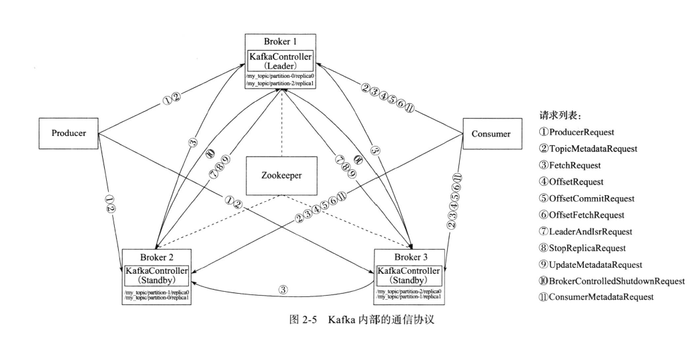

### 介绍

- **ProducerRequest** :生产者发送消息的请求，生产者将消息发送至Kafka集群中的某个Broker,Broker接收到此请求后持久化此消息并更新相关元数据信息。
- **TopicMetadataRequest** :获取Topic元数据信息的请求，无论是生产者还是消费者都需要通过此请求来获取感兴趣的Topic的元数据。
- **FetchRequest**:消费者获取感兴趣Topic的某个分区的消息的请求，除此之外，分区状态为Follower的副本也需要利用此请求去同步分区状态为Leader的对应副本数据。
- **OffsetRequest** :消费者发送至Kafka集群来获取感兴趣Topic的分区偏移量的请求， 通过此请求可以获知当前Topic所有分区在不同时间段的偏移量详情。
- **OffsetCommitRequest**: 消费者提交 Topic 被消费的分区偏移量信息至 Broker, Broker接收到此请求后持久化相关偏移量信息。
- **OffsetFetchRequest** :消费者发送获取提交至Kafka集群的相关Topic被消费的详细 信息，和OffsetCommi tRequest相互对应。
- **LeaderAndlsrRequest** :当Topic的某个分区状态发生变化时，处于Leader状态的 KafkaController发送此请求至相关的Broker,通知其做出相应的处理。
- **StopReplicaRequest** :当Topic的某个分区被删除或者下线的时候，处于Leader状态 的KafkaController发送此请求至相关的Broker,通知其做出相应的处理。
- **UpdateMetadataRequest** :当Topic的元数据信息发生变化时，处千Leader状态的KafkaController发送此请求至相关的Broker,通知其做出相应的处理。
- **BrokerControlledShutdownRequest**: 当 Broker 正常下线时， 发生此请求至处于 Leader状态的 KafkaController
- **ConsumerMetadataRequest**:获取保存特定ConsumerGroup消费详情的分区信息。

### 通信协议交互

- **Producer 和 Kafka 集群**： Producer 需要利用 ProducerRequest 和 TopicMetadataRequest来完成 Topic 元数据的查询、 消息的发送。
- **Consumer 和 Kafka 集群**： Consumer 需要利用 TopicMetadataRequest 请求、 FetchRequest 请求、 OffsetRequest 请求、 OffsetCommitRequest 请求、 OffsetFetchRequest 请求和 ConsumerMetadataRequest 请求来完成 Topic 元数据的查询、消息的订阅、 历史偏移量 的查询、 偏移量的提交、 当前偏移量的查询。
- **KafkaController 状态为 Leader 的 Broker 和 KafkaController 状态为 Standby 的 Broker**: KafkaController 状态为 Leader 的 Broker 需要利用 LeaderAndlsrRequest 请求、 Stop­ReplicaRequest 请求、 UpdateMetadataRequest 请求来完成对Topic 的管理； Kafka­Controller 状态为Standby 的 Broker 需要利BrokerControlledShutdownRequest 请求来通知 KafkaController 状态为 Leader 的 Broker 自己的下线动作。
- **Broker 和 Broker 之间**： Broker 相互之间需要利用 FetchRequest 请求来同步 Topic 分 区的副本数据， 这样才能使 Topic 分区各副本数据实时保持一致。

## Leader选举流程


## Leader故障处理细节


## Follower故障处理细节


## 文件清理策略

> Kafka 中默认的日志保存时间为 7 天，可以通过调整如下参数修改保存时间。
>
> - log.retention.hours，最低优先级小时，默认 7 天。 
>
> - log.retention.minutes，分钟。 
>
> - log.retention.ms，最高优先级毫秒。 
>
> - log.retention.check.interval.ms，负责设置检查周期，默认 5 分钟。
>
> 
>
> **那么日志一旦超过了设置的时间，怎么处理呢？**
>
> Kafka 中提供的日志清理策略有 delete 和 compact 两种。 
>
> 1）delete 日志删除：将过期数据删除
>
> - log.cleanup.policy = delete 所有数据启用删除策略
>
> （1）基于时间：默认打开。以 segment 中所有记录中的最大时间戳作为该文件时间戳。
>
> （2）基于大小：默认关闭。超过设置的所有日志总大小，删除最早的 segment。
>
> log.retention.bytes，默认等于-1，表示无穷大。
>
> 2）compact 日志压缩：对于相同key的不同value值，只保留最后一个版本。(**用得少**)
>
> - log.cleanup.policy = compact 所有数据启用压缩策略
>
> 
>
> ​	压缩后的offset可能是不连续的，比如上图中没有6，当从这些offset消费消息时，将会拿到比这个offset大 
>
> 的offset对应的消息，实际上会拿到offset为7的消息，并从这个位置开始消费。
>
> ​	这种策略只适合特殊场景，比如消息的key是用户ID，value是用户的资料，通过这种压缩策略，整个消息
>
> 集里就保存了所有用户最新的资料。 

## **高效读写数据**

**1**）**Kafka** **本身是分布式集群，可以采用分区技术，并行度高**

**2**）**读数据采用稀疏索引，可以快速定位要消费的数据**

**3**）**顺序写磁盘**

Kafka 的 producer 生产数据，要写入到 log 文件中，写的过程是一直追加到文件末端，

为顺序写。**官网有数据表明**，同样的磁盘，顺序写能到 600M/s，而随机写只有 100K/s。这

与磁盘的机械机构有关，顺序写之所以快，是因为其省去了大量磁头寻址的时间。


**4）页缓存** **+** **零拷贝技术**


| 参数                        | 描述                                                         |
| :-------------------------- | ------------------------------------------------------------ |
| log.flush.interval.messages | 强制页缓存刷写到磁盘的条数，默认是 long 的最大值，一般不建议修改。 |
| log.flush.interval.ms       | 每隔多久，刷数据到磁盘，默认是 null。一般不建议修改。        |


## 生产者（是线程安全的）

### 核心参数

> - **acks**:ACK应答级别
>
>   1. acks=0：生产者发送的数据不需要等数据落盘应答（类似异步）
>   2. acks=1：leader收到数据后应答
>   3. acks=-1(all)：leader和ISR队列中所有节点收齐数据后应答。并不意味着消息就一定可靠，因ISR 中可能只有 leader 副本，就退化成了acks=1，要获得更高的消息可靠性需要配合 min.insync.replicas 等参数的联动。
>
>   **合理情况：ACK级别为-1 + 分区副本>=2 + ISR里应答的最小副本数>=2**
>
>   > 生产环境中，acks=0很少使用；acks=1一般用于传输普通日志，允许丢个别数据；acks=-1一般用于传输和钱相关的信息，保证高可靠性。
>   >
>   > **注意！！！ acks=-1会导致重复数据，leader挂了选举新的leader后，由于还未ack，收到重复消息**
>
> - **max.request.size**：生产者能发送的消息的最大数,默认1MB。并不建议盲目地增大这个参数的配置值，尤其是在对 Kafka 整体脉络没有足够把控的时候。因为这个参数还涉及一些其参数的联动，比如 broker 端的 message.max.bytes 参数，如果配置错误可能会引起一些不必要的异常 比如将 broker 端的 message.max.bytes 参数配置为 10 ，而 max.request.size参数配置为20，那么当发送一条大小为 15B 的消息时，生产者客户端报异常。
>
> - **max.in.flight.requests.per.connection**：限制客户端与Node间连接最多缓存的请求数，默认5。
>
> - **retries和retry.backoff.ms**：retries 参数用来配置生产者重试的次数，默认值为0，即在发生异常的时候不重试。重试还和另一个参数 retry.backoff.ms 有关，这个参数的默认值为 100。它用来设定两次重试之间的时间间隔，避免无效的频繁重试。在配置 retries和retry.backoff.ms之前，最好先估算一下可能的异常恢复时间，这样可以设定总的重试时间大于这个异常恢复时间，以此来避免生产者过早地放弃重试。
>
>   ​	如果将 acks 参数配置为非零值，并且 max.in.flight.requests.per.connection 参数配置为大于1的值，那么就会出现错序的现象。如果第一批消息写入失败，而第二批次消息写入成功，那么生产者会重试发送第一批次的消息， 此时如果第一次的消息写入成功，那么这两个批次的消息就出现了错序，一般而言，在需要保证消息顺序的场合建议把参数max.in.flight.requests.per.connection 配置为 1，而不是把 acks 配置为0，不过这样也会影响整体的吞吐。
>
> -  **linger.ms**：等待时间。这个参数用来指定生产者发送 ProducerBatch 之前等待更多消息（ ProducerRecord ）加入Producer Batch 时间，默认值为0。生产者客户端会在 ProducerBatch 填满或等待时间超过linger.ms 值时发送出去。增大这个参数的值会增加消息的延迟，但是同时能提升一定的吞吐量。 这个linger.ms 参数与 TCP 协议中的 Nagle 算法有异曲同工之妙。建议设置为5-100ms。
>
> -  **transactional. id**：事务id，全局唯一，默认null。
>
> - **max.block.ms** ：send和parititonsFor方法的阻塞时间，默认60s。当生产者的发送缓冲区满了，或者没有可用的元数据时，这些方法就会阻塞。
>
> - **receive.buffer.bytes**：Socket接收消息缓冲区大小，默认32KB。如果设置为-1，则使用操作系统的默认值。如果 Producer和Kafka处于不同的机房，则可以适当调大这个参数值。
>
> - **send.buffer.bytes：Socket** 发送消息缓冲区大小，默认128KB。如果设置为-1，则使用操作系统的默认值。
>
> - **request.timeout.ms**：默认30s。注意这个参数需要比broker端的replica.lag.time.max.ms值要大，这样可以减少因客户端重试而引起的消息重复的概率。
>
> - **batch.size**:批次大小，用于指定 ProducerBatch 可以复用内存区域的大小，默认16k
>
> - **compression.type**:消息压缩类型，默认none
>
> - **connections.max.idle.ms**：多久后关闭连接，默认9分钟
>
> - **RecordAccumulator**:缓冲区大小，修改为64m
>
> - **metadata.max.age.ms**：如果在这个时间内元数据没有更新的话会被强制更新，默认5分钟。

### 架构


> - 整个生产者客户端由两个线程协调运行，这两个线程分别为**主线程**和 **Sender** 线程。
>
> - 在主线程中由KafkaProducer创建消息，然后通过可能的拦截器，序列化器，分区器的作用后缓存到消息累加器（RecordAccumulator，也称消息收集器）中。Sender线程负责从RecordAccumulator中获取消息并将其发送到kafka。
>
> - **RecordAccumulator 主要用来缓存消息，Sender 线程可以批量发送，大小由buffer.memory参数决定，默认32MB。**如果生产者发送消息的速度超过发送到服务器的速度，则会导致生产者空间不足，这个时候 KafkaProducer的send方法调用要么被阻塞，要么抛出异常，这个取决于参数 max.block.ms 的配置，此参数的默认值为60000（60秒）。
>
> - 主线程中发送过来的消息都会被迫加到 RecordAccumulator 的某个双端队列（ Deque<ProducerBatch＞）中。消息在网络上都是以Byte的形式传输的，在发送之前需要创建一块内存区域来保存对应的消息 。在 Kafka 生产者客户端中，通过 java.io.ByteBuffer 实现消息内存的创建和释放。不过频繁的创建和释放是比较耗费资源的，在 RecordAccumulator 的内部还有一个 BufferPool,它主要用来实现 ByteBuffer 的复用，以实现缓存的高效利用 。不过BufferPool 只针对特定大小的ByteBuffer 进行管理，而其他大小的 ByteBuffer 不会缓存进 BufferPool 中，这个特定的大小batch.size 参数来指定，默认值为 16384B ，即 16KB。我们可以适当地调大 batch.size参数以便多缓存一些消息。
>
>   ​	ProducerBatch 大小和 batch.size 参数也有着密切的关系。当一条消息（ProducerRecord ) 流入 RecordAccumulator 时，会先找与消息分区所对应的双端队列（如果没有则新建），再从这个双端队列的尾部获取一个 ProducerBatch （如果没有则新建），查看 ProducerBatch 中是否还可以写入这个 ProducerRecord ，如果可以则写入，如果不可以则需要创建一个新ProducerBatch 。在新建 ProducerBatch时评估这条消息的大小是否超过 batch.size 参数大小，如果不超过，那么就以 batch.size 参数的大小来创建 ProducerBatch ，这样在使用完这段内存区域之后，可以通过 BufferPool 的管理来进行复用；如果超过，那就以评估的大小来创建ProducerBatch ，这段内存区域不会被复用。
>
>   ​	Sender从RecordAccumulator 获取缓存的消息之后，会进一步将原本<分区, Deque<ProducerBatch>的保存形式转变成＜Node,List< ProducerBatch>>的形式，其中 Node 表示 Kafka集群 broker 节点 。对于网络连接来说，生产者客户端是与具体 broker 节点建立的连接，也就是向具体的 broker 节点发送消息，而并不关心消息属于哪一个分区；而对于 KafkaProducer的应用逻辑而言，我们只关注向哪个分区中发送哪些消息，所以在这里需要做一个应用逻辑层面到网络IO层面的转换。
>
>   ​	在转换成＜Node, List<ProducerBatch>>的形式之后， Sender会进一步封装成＜Node,Request> 的形式，这样就可以将Request请求发往各个Node了， 这里Request是指Kafka的各种协议请求，对于消息发送而言就是指具体的 ProduceRequest。
>
>   ​	请求在从Sender 线程发往Kafka之前还会保存到 InFlightRequests 中， InFlightRequests保存对象的具体形式为 Map<Nodeld, Deque<Request＞>，它的**主要作用是缓存了已经发出去但还没有收到响应的请求**。与此同时，InFlightRequests 还提供了许多管理类的方法，并且通过配置参数还可以限制每个连接（也就是客户端与 Node 之间的连接）最多缓存的请求数。**这个配置参数为 max.in.flight.requests.per.connection ，默认值为5，即每个连接最多只能缓存5个未响应的请求**，超过该数值之后就不能再向这个连接发送更多的请求了，除非有缓存的请求收到了响应（ Response ）。通过比Deque<Request> 的size 与这个参数的大小来判断对应的 Node 中是否己经堆积了很多未响应的消息，如果真是如此，那么说明这个 Node 节点负载较大或网络连接有问题，再继续向其发送请求会增大请求超时的可能。
>

### 元数据更新


​	InFlightRequests 还可以获得 leastLoadedNode ，即所有 Node 中负载最小的那一个。这里的负载最小是通过每个 Node在InFlightRequests 中还未确认的请求决定的，未确认的请求越多则认为负载越大。对于图 2-2 中的 InFlightRequests 来说，图中展示了三个节点Node0 Node1 Node2，很明显 Node1 负载最小。也就是说， Node1为当前的 leastLoadedNode。选择leastLoadedNode 发送请求可以使它能够尽快发出，避免因网络拥塞等异常而影响整体的进度。 leastLoadedNode 的概念可以用于多个应用场合，比如元数据请求、消费者组播协议的交互。

​	当客户端中没有需要使用的元数据信息时，比如没有指定的主题信息，或者超metadata.max.age.ms 时间没有更新元数据都会引起元数据的更新操作。客户端参数metadata.max.age.ms 的默认值为 300000 ，即5分钟。元数据的更新操作是在客户端内部进行的，对客户端的外部使用者不可见。当需要更新元数据时，会先挑选出 leastLoadedNode, 然后向这个Node 发送 MetadataRequest 请求来获取具体的元数据信息。这个更新操作是由 Sender线程发起的，建完MetadataRequest 之后同样会存入InF!ightRequests ，之后的步骤就和发送消息时的类似。元数据虽然由 Sender 线程负责更新，但是主线程也需要读取这些信息，这里的数据同步通过 synchronized final关键字来保障。

### 发送过程


### 生产者分区策略

kafka具体会按以下几种情况选择分区分配策略：

1. 如果发送消息时指定分区，就按指定的分区投递消息
2. 没有指定分区，但有key，则hash(key)%分区数
3. 既没有指定分区，也没有key，采用轮询方式选择一个分区

### 数据重复

> 问题出现：acks=-1会导致重复数据，leader挂了选举新的leader后，由于还未ack，收到重复消息

重复数据的判断依据：具有<PID,Partition,SeqNumber>相同主键的消息提交时，Broker只会持久化一次。其中PID在Kafka每次重启都会更新，SeqNumber单调递增。

解决：

1. 幂等性：参数enable.idempotence=true（默认开启）,由于重启后PID变了，所以幂等性无法真正过滤重复数据。
2. 事务


### 数据有序性

单分区下的：


多分区下的：

​	收到所有分区的数据进行排序（人为干预）


### zookeeper中的kafka信息


## 消费者

### 消费者组

> 拥有同一个groupid的消费者即是一组
>
> - 消费者组内每个消费者负责消费不同分区的数据，**一个分区只能由组内的一个消费者消费**
> - 消费者组之间互不影响

### 一些概念

> - 点对点、发布订阅模式都支持。如果所有的消费者都隶属于同1个消费组，那么所有的消息都会被均衡地投递给每个消费者，即每条消息只会被一个消费者处理，这就相当于点对点模式的应用如果所有的消费者都隶属于不同的消费组，那么所有的消息都会被广播给所有的消费者，即每条消息会被所有的消费者处理，这就相当于发布订阅模式的应用。
> - subscribe和assign都能订阅topic，但subscribe方法具有消费者自动再均衡功能（更强大）。

### 核心参数

> - auto.offset.reset ：默认latest。参数值为字符串类型，有效值为“earliest ”、＂latest“、”none ”，配置为其余值会报异常
>
> - enable.auto.commit：是否开启自动提交消费位移，默认true。当然不是每消费1条消息就提交，而是定期提交，频率由auto.commit.interval.ms控制
>
> - auto.commit.interval.ms：表示开启自动提交消费位移时的时间间隔，默认5000ms
>
> - partition.assignment.strategy ：消费者的分区分配策略，默认org.apache.kafka.clients.consumer.RangeAssignor 
>
> - reconnect.backoff.ms：试重新连接指定主机之前的等待时间（也称为退避时间，避免频繁地连接主机，默认值为 50 ms ）。这种机制适用于消费者向 broker 发送的所有请求。
>
> - retry.backoff.ms：这个参数用来配置尝试重新发送失败的请求到指定的主题分区之前的等待（退避〉时间，避免在某些故障情况下频繁地重复发送，默认值为 100 (ms ）。
>
> - isolation.level：这个参数用来配置消费者的事务隔离级别。字符串类型，有效值为“read uncommitted ，和“ read committed ＂，表示消费者所消费到的位置，如果设置为“read committed ”，那么消费者就会忽略事务未提交的消息，即只能消费到 LSO ( LastStableOffset ）的位置，默认情况下为“ read_ uncommitted ”，即可以消费到 HW (High Watermark ）处的位置。
>
> - max.poll.interval.ms：默认5分钟，当通过消费组管理消费者时，该配置指定拉取消息线程最长空闲时间，若超过这个时间间隔还没有发起 poll 操作，则消费组认为该消费者己离开了消费组，将进行再均衡操作
>
> - fetch.min.bytes：消费者在一次拉取请求中能拉取的最小数据量，默认1B
>
> - fetch.max.bytes：消费者在一次拉取请求中能拉取的最大数据量，默认50MB。该参数设定的不是绝对的最大值，如果在第一个非空分区中拉取的第一条消息大于该值，那么该消息将仍然返回，以确保消费者继续工作 也就是说，上面问题的答案是可以正常消费。与此相关的，kafka 中所能接收的最大消息 大小通过服务端参数 message max bytes （对应于主题端参数 max.message bytes ）来设置。
>
> - fetch.max.wait.ms：这个参数也和 fetch.min bytes 参数有关，如果 Kafka 仅仅参考 fetch.min.byte参数的要求，那么有可能会 直阻塞等待而无法发送响应 Consumer 显然这是不合理的fetch.max.wait.ms 参数用于指定 Kafka 的等待时间，默认值为 500 ）。如果 Kafka没有足够多的消息而满足不了 fetch min bytes 参数的要求，那么最终会等待 500m 这个参数 设定和 Consumer Kafka 间的延迟也有关系，如果业务应用对延迟敏感，那么可以适当调小这个参数
>
> - max.partition.fetch.bytes：这个参数用来配置从每个分区里返回给 Co sum町的最大数据 ，默认值为 1MB 。这个参数与 fetch.max.bytes 参数相似，只不过前者用来限制一次拉取中每个分区的消息大小，而后者用来限制一次拉取中整体消息的大小。同样，如果这个参数设定的值比消息的大小要小，那么也不会造成无法消费， Kafka 为了保持消费逻辑的正常运转不会对此做强硬的限制。
>
> - max.poll.records：消费者在一次拉取请求中拉取的最大消息数，默认500条。
>
> - connections.max.idle.ms：多久之后关闭限制的连接，默认值是 540000 (ms ），即9分钟。
>
> - exclude.internal.topics：内部主题是否向消费者公开，默认 true。Kafka 中有两个内部的主题： __ consumer_offsets和  __transaction_state
>
>   如果设置 true ，那么只能使用 subscribe( Collection）的方式而不能使用 subscribe(Pattern）的方式来订阅内部主题，设置为false 则没有这个限制。
>
> - receive.buffer.bytes：socket接收消息缓冲区的大小，默认64KB，如果设置为-1则使用操作系统默认值。如果 Consumer与 Kafka 处于不同的机房，则可以适当调大这个参数值。
>
> - send.buffer.bytes：socket发送消息缓冲区的大小，默认64KB，如果设置为-1则使用操作系统默认值。
>
> - request.timeout.ms：消费者等待请求响应时间，默认30s。
>
> - metadata.max.age.ms：这个参数用来配置元数据的过期时间，默认值为 300000 ms ），即 5分钟。如果元数据在此参数所限定的时间范围内没有进行更新，则会被强制更新，即使没有任何分区变化或有新的broker 加入。

### 消费过程


### 消费者分区策略

- RangeAssignor 分配策略（**默认**）：基于topic，提前分配好方案，尽可能均匀分配，不够分给前面的消费者多分一个**分区**。

  > 假设同一消费者组中2个消费者订阅2个主题，每个有3个分区。分配如下：
  >
  > 消费者1: t0p0、t0p1、t1p0、t1p1
  >
  > 消费者2: t0p2、t1p2 

- RoundRobinAssignor 分配策略：一个个轮询分

  >如果同一个消费组内所有的消费者的订阅信息都是相同的，那么分区分配会是均匀的。
  >
  >假设同一消费者组中2个消费者订阅2个主题，每个有3个分区。分配如下：
  >
  >消费者1: t0p0、t0p2、t1p1
  >
  >消费者2: t0p1、t1p0、t1p2
  >
  > 
  >
  >分配不均的情况：假设同一消费者组中3个消费者，3个主题，分区数分别是1、2、3。消费者1订阅t0，消费者2订阅t0、t1，消费者3订阅t0、t1、t2，分配如下：
  >
  >消费者1: t0p0
  >
  >消费者2: t1p0
  >
  >消费者3: t1p1、t2p0、t2p1、t2p2

- StickyAssignor 分配策略：优先保留原有分配，在此基础上轮询分配

  >假设同一消费者组中3个消费者，4个主题，每个有2个分区。分配如下：
  >
  >消费者1: t0p0、t1p1、t3p0
  >
  >消费者2: t0p1、t2p0、t3p1
  >
  >消费者3: t1p0、t2p1
  >
  > 
  >
  >此时消费者2挂了，分配如下：
  >
  >消费者1: t0p0、t1p1、t3p0、t2p0
  >
  >消费者3: t1p0、t2p1、t0p1、t3p1

### offset提交

> 同步提交和异步提交，对应于 KafkaConsumer 中的 commitSync（）和 commitAsync（）两种类型的方法

对于采用 commitSync（）的无参方法 ，它提交消费位移的频率和拉取批次消息、处理批次消息的频率是一样的，如果想寻求**更细粒度的、更精准的提交**，那么就需要使用 commitSync(final Map< TopicPartition，OffsetAndMetadata > offsets) 

~~~java
/*
  每消费一条消息就提交一次位移
*/
while (true){
    ConsumerRecords<String, Company> res = kafkaConsumer.poll(Duration.ofSeconds(1));
    for (ConsumerRecord<String, Company> record : res) {
        kafkaConsumer.commitSync(Collections.singletonMap(
            new TopicPartition(record.topic(),record.partition()),
            new OffsetAndMetadata(record.offset()+1)));
    }
}

/*
  按照分区的粒度划分提交位移的界限
*/
for (TopicPartition partition : res.partitions()) {
    List<ConsumerRecord<String, Company>> records = res.records(partition);
    for (ConsumerRecord<String, Company> record : records) {
        System.out.println("分区："+partition+",消息："+record);
    }
    
    long lastConsumedOffset=records.get(records.size()-1).offset();
    kafkaConsumer.commitSync(Collections.singletonMap(
        partition,
        new OffsetAndMetadata(lastConsumedOffset+1)));
}
~~~

对于异步提交也是同理。会产生重复消费的问题，我们可以设置一个递增的序号来维护异步提交的顺序，每次位移提交之后就增加序号相对应的值。在遇到位移提交失败需要重试的时候，可以检查所提交的位移和序号的值的大小，如果前者小于后者，则说明有更大的位移己经提交了，不需要再进行本次重试：如果两者相同，则说明可以进行重试提交。除非程序编码错误，否则不会出现前者大于后者的情况。如果位移提交失败的情况经常发生，那么说明系统肯定出现了故障，在－般情况下，位移提交失败的情况很少发生，不重试也没有关系，后面的提交也会有成功的 。重试会增加代码逻辑的复杂度，不重试会增加重复消费的概率。如果 费者异常退出，那么这个重复消费的问题就很难避免，因为这种情况下无法及时提交消费位移；如果消费者正常退出或发生再均衡况，那么可以在退出或再均衡执行之前使用同步提交的方式做最后的把关。

### 指定offset消费

>每当消费者**查找不到所记录的消费位移**或**位移越界**时，就会根据消费者客户端参数auto.offset.reset来决定从何处开始进行消费，参数默认值为latest。
>
>
>
>如果配置为none，那么此时会报OffsetForPartitionException 异常
>
>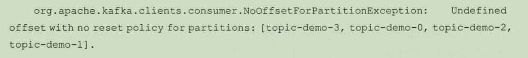

#### poll()与seek()

> poll() 相当于黑盒，无法精确地掌控其消费的起始位置，提供auto.offset.reset参数也只能在找不到消费位移或位移越界的情况下粗粒度地从开头或末尾开始消费。
>
> seek(TopicPartition partition，long offset) 是一种更细粒度的掌控，可以让我们从**特定的位移处开始拉取消息**，**追前消费**或**回溯消费**。seek()方法只能重置消费者分配到的分区的消费位置，而分区的分配是在 poll ()方法的调用过程中实现的，也就是说，**在执行 seek()方法之前需要先执行一次 poll ()方法**，等到分配到分区之后才可以重置消费位置。
>
> 此外，offset是保存在 __ consumer_offset__ 中的，而使用seek()可以将offset保存在任意存储介质中（mysql、redis等）

~~~java
kafkaConsumer.subscribe(topics);
Set<TopicPartition> assignment =new HashSet<>();
while (assignment.size()==0){   //不等于0，说明已经成功分配到了分区
    kafkaConsumer.poll(Duration.ofSeconds(1));
    assignment = kafkaConsumer.assignment();
}
for (TopicPartition topicPartition : assignment) {
    kafkaConsumer.seek(topicPartition,10);
}
//后面同以往一样正常消费
while (true){
    ConsumerRecords<String, Company> res = kafkaConsumer.poll(Duration.ofSeconds(1));
    //直接拿数据
    for (ConsumerRecord<String, Company> record : res) {
        System.out.println(record);
        //每消费一条消息就提交一次位移
        kafkaConsumer.commitSync(Collections.singletonMap(
            new TopicPartition(record.topic(),record.partition()),
            new OffsetAndMetadata(record.offset()+1)));
    }
    //按分区拿数据
    for (String topic : topics) {
        for (ConsumerRecord<String, Company> record : res.records(topic)) {
            System.out.println("分区："+topic+",消息："+record);
        }
    }
    kafkaConsumer.commitAsync();
}
~~~


### 再均衡（TODO原理）

>再均衡是指分区的所属权从一个消费者转移到另一消费者的行为，**它为消费组具备高可用性和伸缩性提供保障**，使我们可以**既方便又安全地删除和添加消费组内的消费者**。**不过在再均衡发生期间，消费组内的消费者是无法读取消息的**。另外，当 个分区被重新分配给另一个消费时， **消费者当前的状态也会丢失**。比如消费者消费完某个分区中的一部分消息时还没有来得及提交消费位移就发生了再均衡操作 之后这个分区又被分配给了消费组 的另一个消费者，原来被消费完的那部分消息又被重新消费一遍，也就是发生了重复消费。一般情况下，**应尽量避免不必要的再均衡的发生**。
>
>subscribe(Collection< String>  topics, ConsumerRebalanceListener listener）。ConsumerRebalanceListener 一个接口 ，包含2个方法：
>
>( 1) void onPartitionsRevoked(Collection< TopicPartition> partitions) 
>
>这个方法会在**再均衡开始之前和消费者停止读取消息之后被调用**。可以通过这个回调方法来处理消费位移的提交，以此来**避免**一些不必要的**重复消费**现象的发生。参数partitions表示**再均衡前**所分配到的分区。
>
>( 2) void onPartitionsAssigned(Collection< TopicPartition> partitions) 
>
>这个方法会在**重新分配分区之后和消费者开始读取消费之前被调用** 。参数 partitions**再均衡后**所分配到的分区。

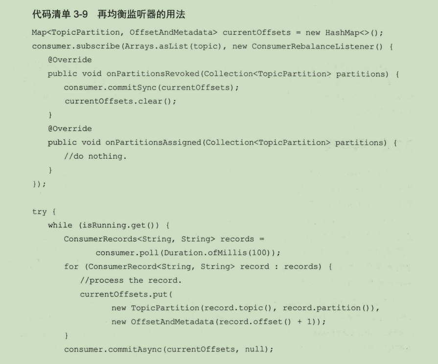

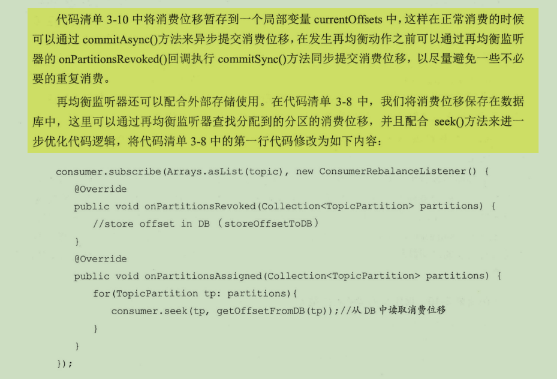

# 分区优化

## 优先副本的选举

在创建主题的时候，该主题的分区及副本会**尽可能均匀地**分布到 Kafka 集群的各个 broker节点上，对 leader 本的分配也比较均匀。 比如我们使用 kafka-topics.sh 建一个分区数为 3、副本因子为3 的主题 topic partitions 创建之后的分布信息如下：

~~~sh
[root@nodel kafka 2.11-2.0.0]# bin/kafka-topics.sh --zookeeper localhost:2181/kafka --describe --topic topic-partitions 

Topic :topic-partitions 
PartitionCount : 3 ReplicationFactor : 3 Configs : 
Topic: topic-partitions Partition: 0 Leader: 1 Replicas: 1 , 2 , 0 Isr: 1 , 2 , 0 
Topic: topic-partitions Partition: 1 Leader: 2 Replicas: 2 , 0 , 1 Isr: 2 , 0 , 1 
Topic: topic-partitions Partition: 2 Leader: 0 Replicas: 0 , 1 , 2 Isr: 0 , 1,  2 
~~~

如果brokerId =2的节点重启，那么主题 topic-partitions 分布信息如下：

~~~sh
[root@nodel kafka 2 . 11 - 2 . 0 . 0 ]# bin/kafka- topics. sh --zookeeper localhost : 2181/ 
kafka --describe --topic topic - partitions 

Topic :topic-partitions 
PartitionCount : 3 ReplicationFactor : 3 Configs : 
Topic: topic-partitions Partition: 0 Leader: 1 Replicas: 1 , 2 , 0 Isr: 1 , 0 , 2 
Topic: topic-partitions Partition: 1 Leader: 0 Replicas: 2 , 0 , 1 Isr: 0 , 1 , 2 
Topic: topic-partitions Partition: 2 Leader: 0 Replicas: 0 , 1 , 2 Isr: 0 , 1,  2 
~~~

可以看到，现在的分区已经不平衡了！

为了能够有效治理负载失衡，Kafka 引入了**优先副本**（ preferred replica )的概念。优先副本是指在 AR 集合列表中的第一个副本，如上面主题 topic-partitions 分区AR 集合表（ Replicas ）为[1,2,0]，那么分区0的优先副本即为1。**理想情况下，优先副本就是该分区的 leader 副本**，所 以也可以称之为 preferred leader。kafka 要确保所有主题的优先副本在 Kafka 集群中均匀分布，这样就保证了所有分区 leader 均衡分布， 如果 leader分布过于集中，就会造成集群负载不均衡。

> 此外，auto.leader.rebalance.enable=true，可以实现自平衡，但在线上环境中**不建议使用**！

kafka-perferred-replica-election.sh 脚本提供了对分区 leader 副本（全部分区）进行重新平衡的功能。优先副本的选举过程是一个安全的过程， Kafka 客户端可以自动感知分区 leader 副本的变更。下面的示例演示了脚本的具体用法：

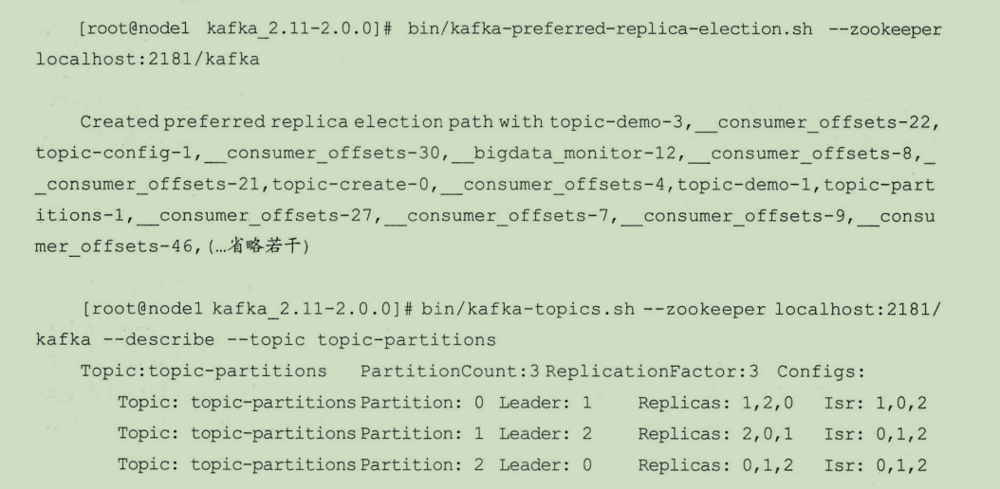

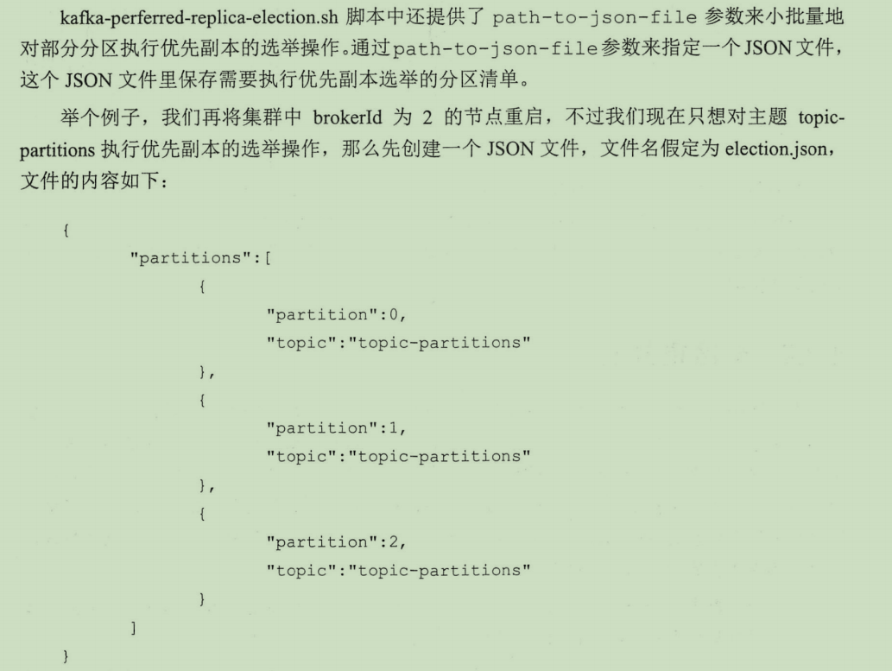

## 分区重分配

> 新增broker节点时，旧的分区、副本无法知晓新的broker，这时需要将其重分配到新broker。

**kafka-reassign-partitions.sh** 脚本的使用分为3个步骤：

1. 首先创建需要 1个包含主题清单的JSON 文件

   ~~~json
   {
   	"topics":[
   			{
   					"topic":"topic-reassign"
   			}
   		],
   		"version":1
   }
   ~~~

   

2. 其次根据主题清单和 broker节点清单生成一份重分配方案

   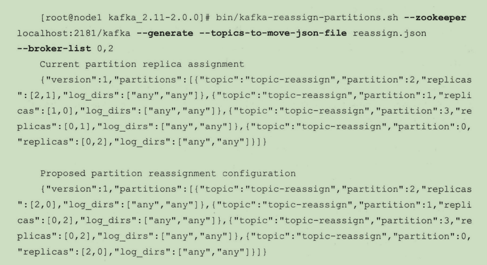

   上面示例中打印出了两个 JSON 格式的内容。第1个“ Current partition replica assignment" 所对应的 JSON 内容为当前的分区副本分配情况，在执行分区重分配的时候最好将这个内容保存起来，以备后续的回滚操作。第2个“Proposed partition reassignment configuration ，，所对应的JSON 容为重分配的候选方案，注意这里只是生成一份可行性的方案，并没有真正执行重分配的动作 。生成的可行性方案的具体算法和创建主题时的 样，这里也包含了机架信息。

3. 最后根据这份方案执行具体的重分配动作。

   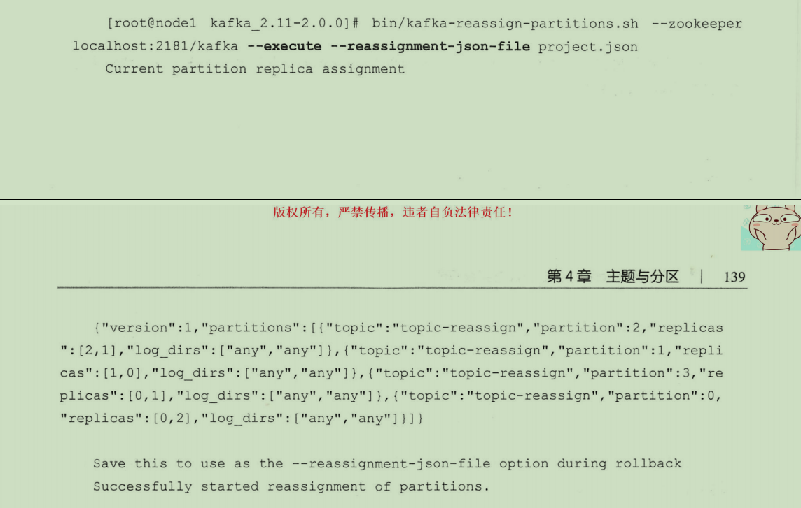

   对于分区重分配而言，这里还有可选的第四步操作，即验证查看分区分配的进度，只需将上面的 execute 替换为 verify 即可， 具体示例如下：

   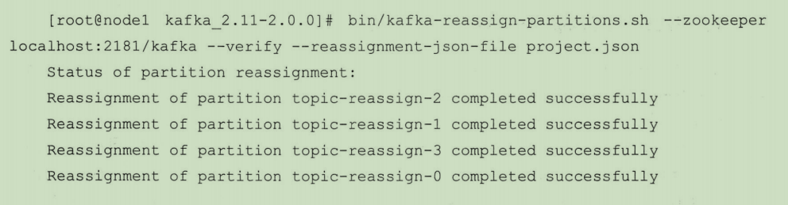

## 复制限流（TODO）

> 

# 消息丢失解决

1. 使用producer.send(msg,callback)。
2. 设置acks = all。acks是Producer的参数，代表了所有副本Broker都要接收到消息，该消息才算是“已提交”。
3. 设置retries为一个较大的值。是Producer的参数，对应Producer自动重试。如果出现网络抖动，那么可以自动重试消息发送，避免消息丢失。
4. unclean.leader.election.enable = false。控制有哪些Broker有资格竞选分区的Leader。表示不允许落后太多的Broker竞选Leader。
5. 设置replication.factor>=3。Broker参数，冗余Broker。
6. 设置min.insync.replicas>1。Broker参数。控制消息至少要被写入到多少个副本才算是“已提交”。
7. 确保replication.factor>min.insync.replicas。如果两个相等，那么只要有一个副本挂机，整个分区就无法正常工作了。推荐设置成replication.factor=min.insync.replicas+1.
8. 确保消息消费完成在提交。Consumer端参数enbale.auto.commit，设置成false，手动提交位移。

解释第二条和第六条：
如果ISR中只有1个副本了，acks=all也就相当于acks=1了，引入min.insync.replicas的目的就是为了做一个下限的限制：不能只满足于ISR全部写入，还要保证ISR中的写入个数不少于min.insync.replicas。

# 幂等性

在0.11.0.0版本引入了创建幂等性Producer的功能。仅需要设置props.put(“enable.idempotence”，true)，或props.put(ProducerConfig.ENABLE_IDEMPOTENCE_CONFIG,true)。

enable.idempotence设置成true后，Producer自动升级成幂等性Producer。Kafka会自动去重。Broker会多保存一些字段。当Producer发送了相同字段值的消息后，Broker能够自动知晓这些消息已经重复了。

作用范围：

1. 只能保证单分区上的幂等性，即一个幂等性Producer能够保证某个主题的一个分区上不出现重复消息。
2. 只能实现单会话上的幂等性，这里的会话指的是Producer进程的一次运行。当重启了Producer进程之后，幂等性不保证。

# 事务

Kafka在0.11版本开始提供对事务的支持，提供是read committed隔离级别的事务。保证多条消息原子性地写入到目标分区，同时也能保证Consumer只能看到事务成功提交的消息。

## Producer

保证多条消息原子性地写入到多个分区中。这批消息要么全部成功，要不全部失败。事务性Producer也不惧进程重启。

Producer端的设置：

1. 开启`enable.idempotence = true`
2. 设置Producer端参数 `transactional.id`

除此之外，还要加上调用事务API，如initTransaction、beginTransaction、commitTransaction和abortTransaction，分别应对事务的初始化、事务开始、事务提交以及事务终止。
如下：

```java
Copyproducer.initTransactions();
try {
            producer.beginTransaction();
            producer.send(record1);
            producer.send(record2);
            producer.commitTransaction();
} catch (KafkaException e) {
            producer.abortTransaction();
}
```

这段代码能保证record1和record2被当做一个事务同一提交到Kafka，要么全部成功，要么全部写入失败。

## Consumer

Consumer端的设置：
设置isolation.level参数，目前有两个取值：

1. read_uncommitted:默认值表明Consumer端无论事务型Producer提交事务还是终止事务，其写入的消息都可以读取。
2. read_committed:表明Consumer只会读取事务型Producer成功提交事务写入的消息。注意，非事务型Producer写入的所有消息都能看到。

# 常用命令

~~~shell
#创建主题、分区、副本
kafka-topics.sh --create --bootstrap-server node01:9092 --topic zfc --partitions 3 --replication-factor 2
#创建生产者
kafka-console-producer.sh --bootstrap-server node01:9092 --topic first
#创建消费者
kafka-console-consumer.sh --bootstrap-server node01:9092 --topic first --from-beginning
#创建消费者（带认证）
kafka-console-consumer.sh --bootstrap-server node01:9092 --topic first --from-beginning --consumer.config ../config/client_ssl.properties
#查看分区、副本、isr信息
kafka-topics.sh --bootstrap-server node01:9092 --describe --topic wujie
#查看所有分区
kafka-topics.sh --zookeeper node01:2181 --list
#查看某个消费者组的消费情况
kafka-consumer-groups.sh --bootstrap-server node01:9092 --describe --group wujiea
#修改offset
#移动偏移至最新
kafka-consumer-groups.sh --bootstrap-server node01:9092 --group wujiea --reset-offsets --topic wujie -to-latest --execute
#移动偏移至最早
kafka-consumer-groups.sh --bootstrap-server node01:9092 --group wujiea --reset-offsets --topic wujie -to-earliest --execute
#移动到指定时间偏移
kafka-consumer-groups.sh --bootstrap-server node01:9092 --group wujiea --reset-offsets --topic wujie --to-datetime 2020-11-07T00:00:00.000 --execute
#移动到指定时间偏移（待认证）
kafka-consumer-groups.sh --bootstrap-server node01:9092 --group wujiea --reset-offsets --topic wujie --to-datetime 2020-11-07T00:00:00.000 --execute --command-config ../config/client_ssl.properties
~~~

# 日志存储（TODO）


# Java API

## 生产者

### 三种方法发送msg

~~~java
	/**
     * 第一种直接发送，不管结果 有些异常捕捉不到  异步发送
     */
    private static void sendMessageForgetResult(){
        ProducerRecord<String,String> record = new ProducerRecord<String,String>(
                "kafka-study","name","Forget_result"
        );
        producer.send(record);
        producer.close();
    }
 
    /**
     * 第二种同步发送，等待执行结果 同步发送
     * @return
     * @throws Exception
     */
    private static RecordMetadata sendMessageSync() throws Exception{
        ProducerRecord<String,String> record = new ProducerRecord<String,String>(
                "kafka-study","name","sync"
        );
        RecordMetadata result = producer.send(record).get();
        System.out.println(result.topic());
        System.out.println(result.partition());
        System.out.println(result.offset());
        return result;
    }
 
    /**
     * 第三种执行回调函数  异步发送
     */
    private static void sendMessageCallback(){
        ProducerRecord<String,String> record = new ProducerRecord<String,String>(
                "kafka-study","name","callback"
        );
        producer.send(record,new MyProducerCallback());
    }
~~~

### 乞丐版

~~~java
private final String KAFKA_SERVER="192.168.200.128:9092";

    @GetMapping("/produce")
    public String product(){
        Properties properties = new Properties();
        properties.put(ProducerConfig.BOOTSTRAP_SERVERS_CONFIG,KAFKA_SERVER);
        properties.put(ProducerConfig.KEY_SERIALIZER_CLASS_CONFIG, StringSerializer.class.getName());
        properties.put(ProducerConfig.VALUE_SERIALIZER_CLASS_CONFIG,StringSerializer.class.getName());
        KafkaProducer<String, String> kafkaProducer = new KafkaProducer<>(properties);
        List<PersonVO> list=new ArrayList<>();
        for(int i=1;i<=2;i++){
            PersonVO personVO = new PersonVO();
            personVO.setId(i);
            personVO.setName("zfc"+i);
            list.add(personVO);
        }
        // 通过kafka发送出去
        String res = JSON.toJSONString(list);
        ProducerRecord<String, String> record = new ProducerRecord<>("wujie", res);
        try {
            kafkaProducer.send(record);
        }catch (Exception e){
            e.printStackTrace();
        }finally {
            kafkaProducer.close();
        }
        return "success";
    }
~~~

### 自定义拦截器

~~~java
/**
 * 自定义拦截器（对topic、key、partition等元数据进行修改）
 *
 * 支持多个拦截器，根据调用顺序，后一个拦截器依赖前一个拦截器的数据
 * prefix2-prefix1-xx
 */
public class MyInterceptor implements ProducerInterceptor<String,Company> {
    private volatile long success=0,fail=0;
    @Override
        public ProducerRecord<String, Company> onSend(ProducerRecord<String, Company> producerRecord) {
        //msg加前缀
        Company company = producerRecord.value();
        String newVal="地球-"+company.getAddress();
        company.setAddress(newVal);
        return new ProducerRecord<>(producerRecord.topic(),producerRecord.partition(),
                producerRecord.timestamp(),producerRecord.key(),company,producerRecord.headers());
    }

    /**
     * ack前或消息发送失败时进入该方法，优先于用户的callback
     * @param recordMetadata
     * @param e
     */
    @Override
    public void onAcknowledgement(RecordMetadata recordMetadata, Exception e) {
        //统计发送成功率
        if(e!=null){
            fail++;
        }else {
            success++;
        }
    }

    @Override
    public void close() {
        //显示发送成功率
        double successRatio=success/(success+fail);
        System.out.println("消息发送成功率："+(successRatio*100)+"%");
    }

    @Override
    public void configure(Map<String, ?> map) {

    }
}
~~~

### 自定义序列化器

~~~java
/**
 * 自定义序列化器
 */
public class CompanySerializer implements Serializer<Company> {

    @Override
    public void configure(Map<String, ?> map, boolean b) {

    }

    @Override
    public byte[] serialize(String topic, Company company) {
        if(company==null) return null;
        byte[] name=new byte[0];
        byte[] address=new byte[0];
        if(company.getName()!=null){
            name = company.getName().getBytes(StandardCharsets.UTF_8);
        }
        if(company.getAddress()!=null){
            address = company.getAddress().getBytes(StandardCharsets.UTF_8);
        }
        ByteBuffer byteBuffer = ByteBuffer.allocate(4 + 4 + name.length + address.length);
        byteBuffer.putInt(name.length);
        byteBuffer.put(name);
        byteBuffer.putInt(address.length);
        byteBuffer.put(address);
        return byteBuffer.array();
    }

    @Override
    public void close() {

    }
}

~~~


### 自定义分区器

~~~java
/**
 * 自定义分区器(变更分区规则)
 */
public class MyPartitioner implements Partitioner {

    private final AtomicInteger count=new AtomicInteger(0);

    @Override
    public int partition(String topic, Object key, byte[] keyBytes, Object value, byte[] valueBytes, Cluster cluster) {
        /**
         * kafka规定：key=null,只会存到可用分区
         * 下面我们通过自定义分区器打破这一规则
         */
        List<PartitionInfo> partitionInfos = cluster.partitionsForTopic(topic);
        if(keyBytes==null){
            return count.getAndIncrement()%partitionInfos.size();
        }else {
            return Utils.toPositive(Utils.murmur2(keyBytes)%partitionInfos.size());
        }
    }

    @Override
    public void close() {

    }

    @Override
    public void configure(Map<String, ?> map) {

    }
}

~~~


## 消费者

### 乞丐版

~~~java
@GetMapping("/consume")
    public void consume(){
        Properties properties = new Properties();
        properties.put(ConsumerConfig.BOOTSTRAP_SERVERS_CONFIG,KAFKA_SERVER);
        properties.put(ConsumerConfig.KEY_DESERIALIZER_CLASS_CONFIG, StringDeserializer.class);
        properties.put(ConsumerConfig.VALUE_DESERIALIZER_CLASS_CONFIG,StringDeserializer.class);
        properties.put(ConsumerConfig.GROUP_ID_CONFIG,"wujiea");  //消费者组
        KafkaConsumer<String, String> kafkaConsumer = new KafkaConsumer<String, String>(properties);
        ArrayList<String> topics = new ArrayList<>();
        topics.add("wujie");
        kafkaConsumer.subscribe(topics);
        while (true){
            ConsumerRecords<String, String> res = kafkaConsumer.poll(Duration.ofSeconds(1));
            //直接拿数据
            for (ConsumerRecord<String, String> record : res) {
                System.out.println(record);
            }
            //按分区拿数据
            for (String topic : topics) {
                for (ConsumerRecord<String, Company> record : res.records(topic)) {
                    System.out.println("分区："+topic+",消息："+record);
                }
            }
            kafkaConsumer.commitAsync();
        }
    }
~~~

### 自定义反序列化器

~~~java
/**
 * 自定义反序列化器
 */
public class CompanyDeserializer implements Deserializer<Company> {

    @Override
    public void configure(Map<String, ?> map, boolean b) {

    }

    @Override
    public Company deserialize(String topic, byte[] bytes) {
        if(bytes==null) return null;
        if(bytes.length<8){
            throw new SerializationException("最小长度不应该小于8!");
        }
        ByteBuffer byteBuffer = ByteBuffer.wrap(bytes);
        int nameLen=byteBuffer.getInt();
        byte[] nameBytes= new byte[nameLen];
        byteBuffer.get(nameBytes);
        int addressLen=byteBuffer.getInt();
        byte[] addressBytes= new byte[addressLen];
        byteBuffer.get(addressBytes);
        String name=new String(nameBytes,StandardCharsets.UTF_8);
        String address=new String(addressBytes,StandardCharsets.UTF_8);
        return new Company(name,address);
    }

    @Override
    public void close() {

    }
}
~~~


## KafkaAdminClient

> 通过javaAPI对topic进行增删改查

~~~java

/**
 * KafkaAdminClient内部使用Kafka一套自定义二进制协议来实现诸如创建主题管理功能。
 * 它主要的实现步骤如下
 * (1)客户端根据方法的调用创建相应的协议请求，比如创建主题的createTopics方法，其内部就是发送CreateTopicRequest请求
 * (2)客户端将请求发送至服务端
 * (3)服务端处理相应的请求并返回响应，比如这个与createTopicRequest请求对应的就是CreateTopicResponse
 * 客户端接收相应的响应井进行解析处理。和协议相关请求和相应类基本都在org.apache.kafka.common.requests包下，
 * abstractRequest AbstractResponse 是这些请求和响应的两个基本父类。
 */
@RestController
@RequestMapping("/kafkaAdminClient")
public class KafkaAdminClientDemo {

    private final String KAFKA_SERVER="192.168.200.128:9092";
    private AdminClient adminClient;

    public KafkaAdminClientDemo(){
        //init
        Properties properties = new Properties();
        properties.put(AdminClientConfig.BOOTSTRAP_SERVERS_CONFIG,KAFKA_SERVER);
        properties.put(AdminClientConfig.REQUEST_TIMEOUT_MS_CONFIG,30000);
//        properties.put("create.topic.policy.class.name", MyPolicy.class.getName());  //无效！！！ why？不知道
        adminClient = KafkaAdminClient.create(properties);
    }

    @RequestMapping("/createTopic")
    public String  createTopic(){
        NewTopic topic;
        String newTopicName="zfc";
        //创建前先审查是否存在该topic
        try {
            Set<String> allTopicNames = adminClient.listTopics().names().get();
            if(allTopicNames.contains(newTopicName)){
                return "该topic已经存在!";
            }
        } catch (InterruptedException e) {
            e.printStackTrace();
        } catch (ExecutionException e) {
            e.printStackTrace();
        }

        //1.通过分区数+副本数创建topic
//        topic = new NewTopic("zfc", 2, (short) 2);
        //2.通过分区副本分配方案来创建topic
        Map<Integer, List<Integer>> replicasAssignments=new HashMap<>();
        replicasAssignments.put(0,Arrays.asList(0,1));
//        replicasAssignments.put(1,Arrays.asList(1,0));
        topic=new NewTopic(newTopicName,replicasAssignments);
        //指定配置
        Map<String, String> configs=new HashMap<>();
        configs.put("cleanup.policy","compact");
        //创建分区合法性校验
        topic.configs(configs);
        CreateTopicsResult res = adminClient.createTopics(Collections.singleton(topic));
        try {
            res.all().get();
            return "已成功创建topic";
        } catch (InterruptedException e) {
            e.printStackTrace();
        } catch (ExecutionException e) {
            e.printStackTrace();
        }
        return "系统异常";
    }

    /**
     * 查看topic详细信息
     */
    @RequestMapping("/describeTopic")
    public Object describe(){
        DescribeTopicsResult res = adminClient.describeTopics(Collections.singleton("wujie"));
        try {
            return res.all().get();
        } catch (InterruptedException e) {
            e.printStackTrace();
        } catch (ExecutionException e) {
            e.printStackTrace();
        }
        return "null";
    }

    /**
     * 增加分区
     */
    @RequestMapping("/incrPartition")
    public String incrPartition(){
        Map<String, NewPartitions> newPartitions=new HashMap<>();
        newPartitions.put("zfc",NewPartitions.increaseTo(5));
        //先审查是否存在该topic
        try {
            Set<String> allTopicNames = adminClient.listTopics().names().get();
            if(!allTopicNames.contains("zfc")){
                return "该topic不存在!";
            }
        } catch (InterruptedException e) {
            e.printStackTrace();
        } catch (ExecutionException e) {
            e.printStackTrace();
        }
        CreatePartitionsResult res = adminClient.createPartitions(newPartitions);
        try {
            res.all().get();
        } catch (InterruptedException e) {
            e.printStackTrace();
        } catch (ExecutionException e) {
            e.printStackTrace();
        }
        return "增加成功";
    }

    /**
     * 删除主题
     */
    @RequestMapping("/delTopic/{topic}")
    public String delTopic(@PathVariable String topic){
        try {
            adminClient.deleteTopics(Collections.singleton(topic)).all().get();
            return "删除成功";
        } catch (InterruptedException e) {
            e.printStackTrace();
        } catch (ExecutionException e) {
            e.printStackTrace();
        }
        return "系统异常";
    }
}
~~~

### 创建topic合法性验证

> 创建自定义合法性验证类，搭配 create.topic.policy.class.name=

~~~java
/**
 * 创建topic合法性校验
 */
public class MyPolicy implements CreateTopicPolicy {

    public MyPolicy(){
        System.out.println("创建topic合法性校验");
    }
    @Override
    public void validate(RequestMetadata requestMetadata) throws PolicyViolationException {
        if (requestMetadata.numPartitions()==null||requestMetadata.numPartitions()<2) {
            throw new PolicyViolationException("分区数<2,不符合线上环境要求!");
        }
        if (requestMetadata.replicationFactor()==null||requestMetadata.replicationFactor()<2) {
            throw new PolicyViolationException("副本数<2,不符合线上环境要求!");
        }
    }

    @Override
    public void close() throws Exception {

    }

    @Override
    public void configure(Map<String, ?> map) {

    }
}
~~~


# 监控指标采集

> 目前的 Kafka 监控产品有很多，比如 KafkaManager、Kafka Eagle、Kafka Monitor、KafkaOffsetMonitor、Kafka Web Console、Burrow等

## **获取监控指标**

Kafka可以配置使用JMX进行运行状态的监控，既可以通过JDK自带Jconsole来观察结果，也可以通过Java API的方式来.

 

- 需要kafka服务开启JMX端口  在kafka安装目录下bin文件夹下 kafka-server-start.sh串配置JMX端口

~~~sh
if [ "x$KAFKA_HEAP_OPTS" = "x" ]; 
then

  export KAFKA_HEAP_OPTS="-Xmx1G -Xms1G"

  export JMX_PORT="9999"   #配置JMX端口

fi
~~~

- 通过jconsole远程测试连接jconsole工具在jdk安装目录下bin文件夹中，连接方式 ip地址:JMX端口号

- 通过JavaAPI来访问

例：

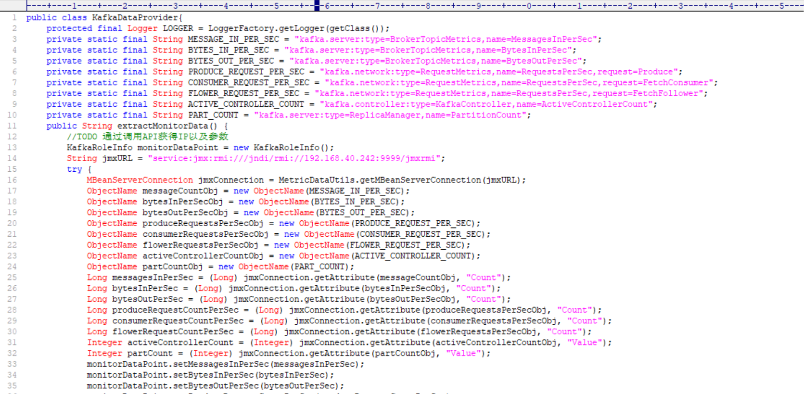


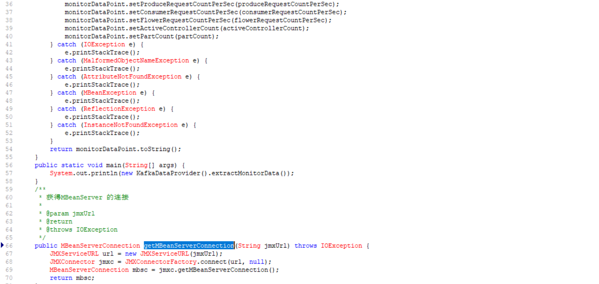

~~~java
/**
 * 通过JMX获取kafka监控指标
 */
@RestController
@RequestMapping("/jmx")
public class JMXDemo {

    private MBeanServerConnection conn;

    private final String JMX_URL="service:jmx:rmi:///jndi/rmi://";

    private final String ipAndPort="192.168.200.128:9999";

    public JMXDemo(){
        //init
        try {
            JMXServiceURL serviceURL = new JMXServiceURL(JMX_URL+ipAndPort+"/jmxrmi");
            JMXConnector connect = JMXConnectorFactory.connect(serviceURL);
            conn=connect.getMBeanServerConnection();
        } catch (MalformedURLException e) {
            e.printStackTrace();
        } catch (IOException e) {
            e.printStackTrace();
        }
    }

    @RequestMapping("/info")
    public Object getInfoByJMX(){
        Map<String,Object> map=new HashMap<>();
        //获取MsgIn指标
        String oneMinuteRateObjName="kafka.server:type=BrokerTopicMetrics,name=MessagesInPerSec";
        String oneMinuteRateObjAttr="OneMinuteRate";
        map.put(oneMinuteRateObjAttr,getAttr(oneMinuteRateObjName, oneMinuteRateObjAttr));
        return map;
    }

    private Object getAttr(String objName,String objAttr){
        if(conn!=null){
            try {
                ObjectName objectName = new ObjectName(objName);
                return conn.getAttribute(objectName,objAttr);
            } catch (MalformedObjectNameException | MBeanException | AttributeNotFoundException | InstanceNotFoundException | ReflectionException | IOException e) {
                e.printStackTrace();
            }
        }
        return null;
    }
}
~~~


## **重点指标项：**

### **Kafka本身的指标：**

| **名称**                          | **MBean的名字**                                              | **描述**                                            | **指标类型**           |
| --------------------------------- | ------------------------------------------------------------ | --------------------------------------------------- | ---------------------- |
| UnderReplicatedPartitions         | kafka.server:type=ReplicaManager, name=UnderReplicatedPartitions | 未复制分区数                                        | Resource: Availability |
| IsrShrinksPerSec IsrExpandsPerSec | kafka.server:type=ReplicaManager, name=IsrShrinksPerSec kafka.server:type=ReplicaManager,name=IsrExpandsPerSec | 同步副本(isr)池收缩/扩展的速率                      | Resource: Availability |
| ActiveControllerCount             | kafka.controller:type=KafkaController, name=ActiveControllerCount | 集群中活动控制器的个数                              | Resource: Error        |
| OfflinePartitionsCount            | kafka.controller:type=KafkaController, name=OfflinePartitionsCount | 脱机分区数                                          | Resource: Availability |
| LeaderElectionRateAndTimeMs       | kafka.controller:type=ControllerStats, name=LeaderElectionRateAndTimeMs | 领袖选举率和延迟                                    | Other                  |
| UncleanLeaderElectionsPerSec      | kafka.controller:type=ControllerStats, name=UncleanLeaderElectionsPerSec | 每秒“不洁”选举的次数                                | Resource: Error        |
| TotalTimeMs                       | kafka.network:type=RequestMetrics,name=TotalTimeMs,request={Produce-FetchConsumer-FetchFollower} | 服务于指定请求的总时间(以毫秒为单位)(产生/获取)     | Work: Performance      |
| PurgatorySize                     | kafka.server:type=ProducerRequestPurgatory,name=PurgatorySize kafka.server:type=FetchRequestPurgatory,name=PurgatorySize | 在生产者炼狱中等待的请求数;在获取炼狱中等待的请求数 | Other                  |
| BytesInPerSec BytesOutPerSec      | kafka.server:type=BrokerTopicMetrics,name=BytesInPerSec kafka.server:type=BrokerTopicMetrics,name=BytesOutPerSec | 汇总输入/输出字节速率                               | Work: Throughput       |

**UnderReplicatedPartitions**: 在一个运行健康的集群中，处于同步状态的副本数（ISR）应该与总副本数（简称AR:Assigned Repllicas）完全相等，如果分区的副本远远落后于leader，那这个follower将被ISR池删除，随之而来的是IsrShrinksPerSec(可理解为isr的缩水情况，后面会讲)的增加。由于kafka的高可用性必须通过副本来满足，所有有必要重点关注这个指标，让它长期处于大于0的状态。

**IsrShrinksPerSec/IsrExpandsPerSec**: 任意一个分区的处于同步状态的副本数（ISR）应该保持稳定，只有一种例外，就是当你扩展broker节点或者删除某个partition的时候。为了保证高可用性，健康的kafka集群必须要保证最小ISR数，以防在某个partiton的leader挂掉时它的follower可以接管。一个副本从ISR池中移走有以下一些原因：follower的offset远远落后于leader（改变replica.lag.max.messages 配置项），或者某个follower已经与leader失去联系了某一段时间（改变replica.socket.timeout.ms 配置项），不管是什么原因，如果IsrShrinksPerSec（ISR缩水） 增加了，但并没有随之而来的IsrExpandsPerSec（ISR扩展）的增加，就将引起重视并人工介入，[kafka官方文档](http://10.10.88.21/wiki/#brokerconfigs)提供了大量关于broker的用户可配置参数。

**ActiveControllerCount**: kafka集群中第一个启动的节点自动成为了controller，有且只能有一个这样的节点。controller的职责是维护partitio leader的列表，和协调leader的变更（当遇到某个partiton leader不可用时）。如果有必要更换controller，一个新的controller将会被zookeeper从broker池中随机的选取出来，通常来说，这个值（ActiveControllerCount）不可能大于1，但是当遇到这个值等于0且持续了一小段时间（<1秒）的时候，必须发出明确的告警。

**OfflinePartitionsCount** (只有controller有): 这个指标报告了没有活跃leader的partition数，由于所有的读写操作都只在partition leader上进行，因此非0的这个值需要被告警出来，从而防止服务中断。任何没有活跃leader的partition都会彻底不可用，且该parition上的消费者和生产者都将被阻塞，直到leader变成可用。

**LeaderElectionRateAndTimeMs**: 当parition leader挂了以后，新leader的选举就被触发。当partition leader与zookeeper失去连接以后，它就被人为是“死了”，不像zookeeper zab，kafka没有专门对leader选举采用majority-consensus算法。是kafka的broker集群所有的机器列表，是由每一个parition的ISR所包含的机器这个子集，加起来的并集组成的，怎么说，假设一共有3个parition，第一个parition的ISR包含broker1、2、3，第二个parition包含broker2、3、4，第三个parition包含broker3、4、5，那么这三个parition的ISR所在broker节点加起来的并集就是整个kafka集群的所有broker全集1、2、3、4、5。当副本可以被leader捕获到的时候，我们就人为它处于同步状态（in-sync），这意味着任何在ISR池中的节点，都有可能被选举为leader。

**LeaderElectionRateAndTimeMs** 报告了两点：leader选举的频率（每秒钟多少次）和集群中无leader状态的时长（以毫秒为单位），尽管不像UncleanLeaderElectionsPerSec这个指标那么严重，但你也需要时长关注它，就像上文提到的，leader选举是在与当前leader通信失败时才会触发的，所以这种情况可以理解为存在一个挂掉的broker。

**UncleanLeaderElectionsPerSec**: 这个指标如果存在的话很糟糕，这说明kafka集群在寻找partition leader节点上出现了故障，通常，如果某个作为partition leader的broker挂了以后，一个新的leader会被从ISR集合中选举出来，不干净的leader选举（Unclean leader elections ）是一种特殊的情况，这种情况是副本池中没有存活的副本。基于每个topic必须拥有一个leader，而如果首领是从处于不同步状态的副本中选举出来的话，意味着那些与之前的leader没有被同步的消息，将会永久性丢失。事实上，不干净的leader选举将牺牲持久性（consistency）来保证可用性（availability）。所以，我们必须明确地得到这个指标的告警，从而告知数据的丢失。

**TotalTimeMs**: The TotalTimeMs metric family measures the total time taken to service a request (be it a produce, fetch-consumer, or fetch-follower request):

这个指标族（很多地方都涉及到它）衡量了各种服务请求的时间（包括produce，fetch-consumer，fetch-follower）

1. produce:从producer发起请求发送数据
2. fetch-consumer: 从consumer发起请求获取数据
3. fetch-follower:follower节点向leader节点发起请求，同步数据

TotalTimeMs 这个指标是由4个其他指标的总和构成的：

1. queue:处于请求队列中的等待时间
2. local:leader节点处理的时间
3. remote:等待follower节点响应的时间（只有当requests.required.acks=-1时）
4. response:发送响应的时间

通常情况下，这个指标值是比较稳定的，只有很小的波动。当你看到不规则的数据波动，你必须检查每一个queue,local,remote和response的值，从而定位处造成延迟的原因到底处于哪个segment。

**PurgatorySize**: 请求炼狱（request purgatory）作为一个临时存放的区域，使得生产(produce)和消费(fetch)的请求在那里等待直到被需要的时候。每个类型的请求都有各自的参数配置，从而决定是否（将消息）添加到炼狱中：

1. fetch：当fetch.wait.max.ms定义的时间已到，还没有足够的数据来填充（congsumer的fetch.min.bytes）请求的时候，获取消息的请求就会被扔到炼狱中。
2. produce：当request.required.acks=-1，所有的生产请求都会被暂时放到炼狱中，直到partition leader收到follower的确认消息。

关注炼狱的大小有助于判断导致延迟的原因是什么，比如说，导致fetch时间的增加，很显然可以认为是由于炼狱中fetch的请求增加了。

**BytesInPerSec/BytesOutPerSec**: 通常，磁盘的吞吐量往往是决定kafka性能的瓶颈，但也不是说网络就不会成为瓶颈。根据你实际的使用场景，硬件和配置，网络将很快会成为消息传输过程中最慢的一个环节，尤其是当你的消息跨数据中心传输的时候。跟踪节点之间的网络吞吐量，可以帮助你找到潜在的瓶颈在哪里，而且可以帮助决策是否需要把端到端的消息做压缩处理。

 

### 主机层面的broker性能指标

**Page cache read ratio**: kafka在设计最初的时候，通过内核中的页缓存，来达到沟通可靠性（基于磁盘）和高效性（基于内存）之间的桥梁。page cache read ratio（可理解为页缓存读取率），和数据库中的cache-hit ratio(缓存命中率)比较相似，如果这个值比较大，则等价于更快的读取速度，从而有更好的性能。如果发现页缓存读取率<80%，则说明需要增加broker了。

**Disk usage**: 由于kafka将所有数据持久化到磁盘上，很有必要监控一下kafka的剩余磁盘空间。当磁盘占满时，kafka会失败，所以，随着时间的推移，跟踪磁盘的增长率是很有必要的。一旦你了解了磁盘的增长速率，你就可以在磁盘将要占满之前选择一个合适的时间通知管理员。

**CPU usage**: 尽管kafka主要的瓶颈通常是内存，但并不妨碍观察一下cpu的使用率。虽然即便在使用gzip压缩的场景下，cpu都不太可能对性能产生影响，但是，如果发现cpu使用率突然增高，那肯定要引起重视了。

**Network bytes sent/received**: 如果你只是在监控kafka的网络in/out指标，那你只会了解到跟kafka相关的信息。如果要全面了解主机的网络使用情况，你必须监控主机层面的网络吞吐量，尤其是当你的kafka主机还承载了其他与网络有关的服务。高网络使用率是性能下降的一种表现，此时需要联系TCP重传和丢包错误，来决定性能的问题是否是网络相关的。

 

### JVM垃圾回收指标

| **名称**                  | **MBean的名字**                                          | **描述**                           | **指标类型** |
| ------------------------- | -------------------------------------------------------- | ---------------------------------- | ------------ |
| ParNew count              | java.lang:type=GarbageCollector,name=ParNew              | 年轻代集合的数量                   | Other        |
| ParNew time               | java.lang:type=GarbageCollector,name=ParNew              | 年轻代收集经过的时间，以毫秒为单位 | Other        |
| ConcurrentMarkSweep count | java.lang:type=GarbageCollector,name=ConcurrentMarkSweep | 老年代集合的数量                   | Other        |
| ConcurrentMarkSweep time  | java.lang:type=GarbageCollector,name=ConcurrentMarkSweep | 老年代收集的运行时间，以毫秒为单位 | Other        |

 

**ParNew**:可以理解成年轻代，这部分的垃圾回收会相当频繁，ParNew是一个stop-the-world的垃圾回收，意味着所有应用线程都将被暂停，知道垃圾回收完成，所以ParNew延迟的任何增加都会对kafka的性能造成严重影响。

**ConcurrentMarkSweep (CMS)** ：这种垃圾回收清理了堆上的老年代不用的内存，CMS是一个短暂暂停的垃圾回收算法，尽管会造成应用线程的短暂停顿，但这只是间歇性的，如果CMS需要几秒钟才能完成，或者发生的频次增加，那么集群就没有足够的内存来满足基本功能。

 

### kafka生产者指标

| **名称**            | **v0.9.0.x MBean 的名字**                               | **描述**                                    | **指标类型**     |
| ------------------- | ------------------------------------------------------- | ------------------------------------------- | ---------------- |
| Response rate       | kafka.producer:type=producer-metrics,client-id=([-.w]+) | 每秒接收到的平均响应数                      | Work: Throughput |
| Request rate        | kafka.producer:type=producer-metrics,client-id=([-.w]+) | 每秒发送的平均请求数                        | Work: Throughput |
| Request latency avg | kafka.producer:type=producer-metrics,client-id=([-.w]+) | 平均请求延迟(毫秒)                          | Work: Throughput |
| Outgoing byte rate  | kafka.producer:type=producer-metrics,client-id=([-.w]+) | 每秒传出/传入的平均字节数                   | Work: Throughput |
| IO wait time ns avg | kafka.producer:type=producer-metrics,client-id=([-.w]+) | I/O线程等待套接字的平均时间长度(以ns为单位) | Work: Throughput |

**Request rate**:请求的速率是指数据从producer发送到broker的速率，很显然，请求的速率变化是否健康，也是由使用的场景所决定的。关注速率走势的上和下，对于保证服务的可用性非常关键，如果不开启速率限制（rate-limiting）（0.9+版本才有），那么当流量高峰来临时，broker就将变得很慢，因为他要忙于处理大量涌入的数据。

**Request** **latency** **average**: 平均请求延迟，这是用来衡量从producer调用KafkaProducer.send()方法到接收到broker响应的时长。“接收到”包含很多层意思，可参考response rate那一块。

有多种途径可以减少延迟，主要的途径是producer的linger.ms 配置项，这个配置项告诉producer，在累积够一个消息批次之前，需要等待多久才能发送。默认地，producer只要接收到上一次发送的确认消息后，就立即发送新的消息，但并非所有场景都适用，为了累积消息而等待一点时间会提高吞吐量。

由于延迟和吞吐量有着必然的联系，就很有必要关注batch.size这个producer配置项，从而达到更完美的吞吐量。并不是只要配置一个合适的值就可以一劳永逸了，要视情况决定如何选择一个更优的批大小。要记住，你所配置的批大小是一个上限值，意思是说，如果数据满了，就立即发送，但如果没满的话，最多只等linger.ms 毫秒，小的批量将会导致更多次数的网络通信，然后降低吞吐量，反之亦然。

**Outgoing byte rate**: 在kafka的broker中，肯定需要监控producer的网络吞吐量，随着时间的变化观察网络上的数据传输量是很有必要的，从而决定是否有必要调整网络设备。另外，也很有必要知道producer是否以一个恒定的速率发送数据，从而让consumer获取到。监控producer的网络传输情况，除了可以决定是否需要调整网络设备，也可以了解producer的生产效率，以及定位传输延迟的原因。

**IO wait time**: Producer通常做了这么一些事：等待数据和发送数据。当producer产生了超越他发送能力的数据量，那结果就是只能等待网络资源。当如果producer没有发送速度限制，或者尽可能增加带宽，就很难说这（网络延迟）是个瓶颈了。因为磁盘的读写速率往往是最耗时的一个环节，所以对producer而言，最好检查一下I/O等待的时间。请记住，I/O等待表示当CPU停下来等待I/O的时间，如果你发现了过分的等待时间，这说明producer无法足够快地获取他需要的数据，如果你还在使用传统的机械磁盘作为存储，那请考虑采用SSD。

 

### Kafka消费者指标

**ConsumerLag/MaxLag**:这是所有人都很中意的kafka指标，ConsumerLag是指consumer当前的日志偏移量相对生产者的日志偏移量，MaxLag和ConsumerLag的关系很紧密，相当于是观察到的ConsumerLag的最大值，这两个度量指标的重要性在于，可以决定你的消费者在做什么。如果采用一个消费者组在存储设备上存储大量老的消息，你就需要重点关注消费者的延迟。当然，如果你的消费者处理的是实时消息，如果lag值一直居高不下，那就说明消费者有些过载（overloaded）了，遇到这种情况，就需要采用更多的消费者，和把topic切分成多个parition，从而可以提高吞吐量和降低延迟。

注意：ConsumerLag 是kafka之中过载的表现，正如上面的定义中所描述的额一样，但它也可被用来表示partition leader和follower之间的offset差异。

**BytesPerSec**:正如前文提到的生产者和broker的关系，也需要监控消费者的网络吞吐量。比如，MessagesPerSec的突然下降可能会导致消费失败，但如果BytesPerSec还保持不变，那如果消费少批次大体量的消息问题还不大。不断观察网络的流量，就像其他度量指标中提到的一样，诊断不正常的网络使用情况是很重要的。

**MessagesPerSec**: 消息的消费速度并不完全等同于比特的消费速度，因为消息本身可能有不同大小。依赖生产者和工作负载量，在典型的部署环境中，往往希望这个值是相当稳定的。通过随着时间的推移监控这个指标，可以观察出消费数据的趋势，然后定出一个基线，从而确定告警的阈值。这个曲线的走势取决于你的使用场景，但不管怎样，在很多情况下，定出一条基线然后对于异常情况做出告警是很有必要的。

**ZooKeeperCommitsPerSec**:只有0.8x版本有，如果把zookeeper作为offset的存储（在0.8x版本中是默认的，0.9+版本必须显式地在配置中定义offsets.storage=zookeeper），那你肯定需要监控这个值。注意到如果想要在0.9+版本中明确使用zookeeper作为offset存储，这个指标并没有被开放。当zookeeper处于高写负载的时候，将会遇到成为性能瓶颈，从而导致从kafka管道抓取数据变得缓慢。随着时间推移跟踪这个指标，可以帮助定位到zookeeper的性能问题，如果发现有大量发往zookeeper的commit请求，你需要考虑的是，要不对zookeeper集群进行扩展，要不直接把offset的存储变为kafka（offsets.storage=kafka）。记住，这个指标只对高阶消费者有用，简单消费者自行管理offset。

**MinFetchRate**: 消费者拉取的速率很好反映了消费者的整体健康状况，如果最小拉取速率接近0的话，就可能说明消费者出现问题了，对一个健康的消费者来说，最小拉取速率通常都是非0的，所以如果发现这个值在下降，往往就是消费者失败的标志。

 

Kafka主要性能指标的解释，可以参考：https://www.cnblogs.com/xinxiucan/p/12666967.html

 

 

**Kafka监控工具监控页面**

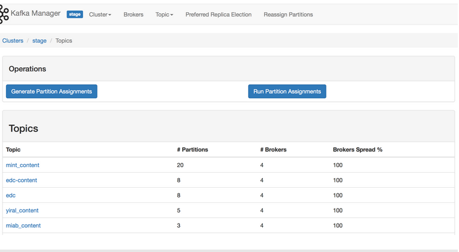

Kafka Manager

管理几个不同的集群；

监控集群的状态(topics，brokers，副本分布，分区分布)；

产生分区分配(Generate partition assignments)基于集群的当前状态；

重新分配分区

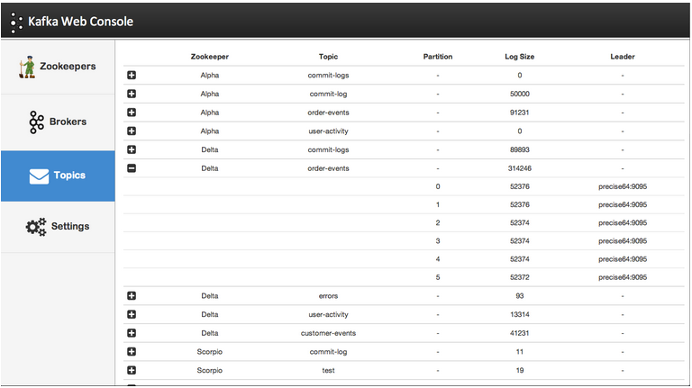

Kafka Web Manager

可以监控：

Brokers列表；

Kafka集群中Topic列表，及对应的Partition、LogSize等信息；

点击Topic、可以浏览对应的Consumer Groups、Offset、Lag等信息；

生产和消费流量图、消息预览......

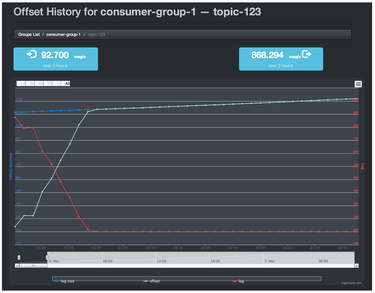

Kafka Offset Moinitor

可以实时监控：

Kafka集群状态；

Topic、Consumer Group 列表；

图形化展示topic和consumer之间的关系；

图形化展示consumer的Offset、Lag等信息


# 面试题

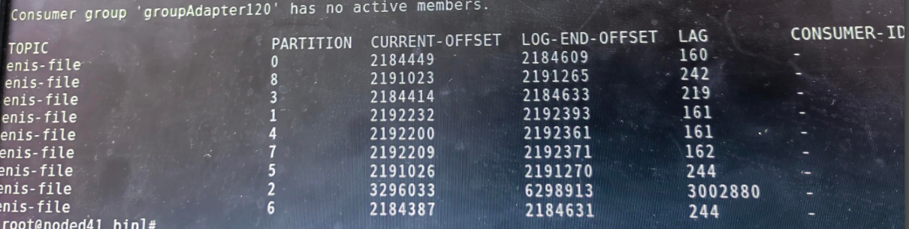

## 为什么partition2数据分的多？

- 主要原因是生产消息时，该分区消息就比其他的多（看log-end-offset）。

>1.  是否存在代码层面的自定义分区？（看代码）
>2. 生产者分区策略（指定分区？分区按hash(key)%n进行，看key指定的是否均匀？）
>3. 此外，Kafka规定，当key为null时，默认只会分配到可用分区中，其他分区是不是都已不可用了？

- 发现LAG过高，大量消息积压。

> 消费者应付不过来，对比其他的分区就可看出

## 如何确定partition2在那个服务器上？

~~~sh
kafka-topics.sh --bootstrap-server 192.168.200.130:9092 --describe --topic enis-file
~~~

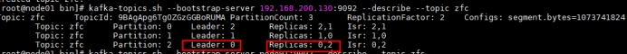

自己画的图，箭头是leader指向follower

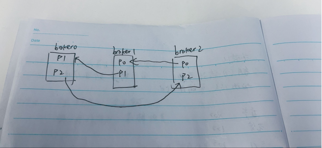

## 如何提高kafka读写效率？

1. producer

   - 设置acks=1，表示leader写入即认为写入成功，但如果要保证消息写入可靠性的话，这个配置要慎重

   - compression.type=lz4，设置消息压缩格式，降低网络传输

   - buffer.memory:33554432 (32m)，在Producer端用来存放尚未发送出去的Message的缓冲区大小。缓冲区满了之后可以选择阻塞发送或抛出异常，由block.on.buffer.full的配置来决定。

   - linger.ms:0，Producer默认会把两次发送时间间隔内收集到的所有Requests进行一次聚合然后再发送，以此提高吞吐量，而linger.ms则更进一步，这个参数为每次发送增加一些delay，以此来聚合更多的Message。

   - batch.size:16384，Producer会尝试去把发往同一个Topic、Partition的多个Requests进行合并，batch.size指明了一次Batch合并后Requests总大小的上限。如果这个值设置的太小，可能会导致所有的Request都不进行Batch

2. broker

   - log.dirs配置多个磁盘存储不同分区，不要把配置一个磁盘多个目录作为多个分区的存储路径

   - num.network.threads=3 ， broker处理消息的最大线程数 ，一般不改num.io.threads=3, broker处理磁盘IO的线程数 ，建议配置线程数量为cpu核数2倍，最大不超过3倍

   - log.retention.hours=72 ，设置消息保留时间，如保留三天，也可以更短

   - log.segment.bytes=1073741824 ，段文件配置1GB，有利于快速回收磁盘空间，重启kafka加载也会加快(如果文件过小，则文件数量比较多，kafka启动时是单线程扫描目录(log.dir)下所有数据文件

   - replica.lag.time.max.ms:10000，replica.lag.max.messages:4000，用来控制副本在什么条件下从ISR队列移除

   - num.replica.fetchers:1，在Replica上会启动若干Fetch线程把对应的数据同步到本地，而num.replica.fetchers这个参数是用来控制Fetch线程的数量。每个Partition启动的多个Fetcher，通过共享offset既保证了同一时间内Consumer和Partition之间的一对一关系，又允许我们通过增多Fetch线程来提高效率。

   - default.replication.factor:1，这个参数指新创建一个topic时，默认的Replica数量，Replica过少会影响数据的可用性，太多则会白白浪费存储资源，一般建议在3为宜

3. consumer

   - num.consumer.fetchers:1，启动Consumer拉取数据的线程个数，适当增加可以提高并发度，新版规定只能是1，即单线程。

   - fetch.min.bytes:1，每次Fetch Request至少要拿到多少字节的数据才可以返回， 在Fetch Request获取的数据至少达到fetch.min.bytes之前，允许等待的最大时长。对应上面说到的Purgatory中请求的超时时间： fetch.wait.max.ms:100

## kafka数据丢了怎么办，可以恢复吗？

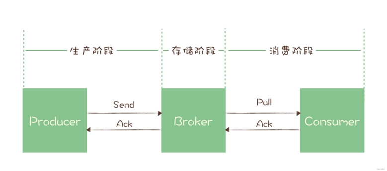

**1.生产端数据丢失**

1）如果是同步模式

ack机制能够保证数据的不丢失，如果ack设置为0，风险很大，一般不建议设置为0

producer.type=sync 

request.required.acks=1

2）如果是异步模式

通过buffer来进行控制数据的发送，有两个值来进行控制，时间阈值与消息的数量阈值，如果buffer满了数据还没有发送出去，如果设置的是立即清理模式，风险很大，一定要设置为阻塞模式

producer.type=async 

request.required.acks=1 

queue.buffering.max.ms=5000 

queue.buffering.max.messages=10000 

queue.enqueue.timeout.ms = -1 

batch.num.messages=200

3)重试

retries:MAX_VALUE

reconnect.backoff.ms:20000

retry.backoff.ms:20000

**2.存储端消息丢失**

多副本机制

设置 min.insync.replicas > 1。这控制的是消息至少要被写入到多少个副本才算是“已提交”。设置成大于 1 可以提升消息持久性。在实际环境中千万不要使用默认值 1。

确保 replication.factor > min.insync.replicas。如果两者相等，那么只要有一个副本挂机，整个分区就无法正常工作了。推荐设置成 replication.factor = min.insync.replicas + 1。

**3.消费端数据丢失**

设置auto.commit.enable=false,消费端手动提交，确保消息真的被消费并处理完成。

**如何恢复?**：kafka依赖zk，在zk中配置文件的dataDir参数路径下记录着kafka的数据。**没落盘的就没了。**


## 如何重跑kafka数据？

1. 指定新的group(会重跑all data)

   ~~~sh
   bin/kafka-console-consumer.sh --bootstrap-server node01:9092 --topic wujie --group zfcdb --from-beginning
   ~~~

2. 修改offset（灵活）

- Api层面就用seek()

- 命令层面

  ~~~sh
  #修改offset
  #移动偏移至最新
  kafka-consumer-groups.sh --bootstrap-server node01:9092 --group wujiea --reset-offsets --topic wujie -to-latest --execute
  #移动偏移至最早
  kafka-consumer-groups.sh --bootstrap-server node01:9092 --group wujiea --reset-offsets --topic wujie -to-earliest --execute
  #移动到指定时间偏移
  kafka-consumer-groups.sh --bootstrap-server node01:9092 --group wujiea --reset-offsets --topic wujie --to-datetime 2020-11-07T00:00:00.000 --execute
  ~~~


## 为什么kafka吞吐那么高？（慢慢啃，慢慢研究）

主要依赖于以下5点:

1. **Zero Copy(零拷贝)技术**

   - 传统I/O

     > 在Linux系统中，传统I/O主要是通过read()和write()两个系统调用来实现的，通过read()函数读取文件到缓存区中，然后通过write()函数将缓存中的数据输出到网络端口。

     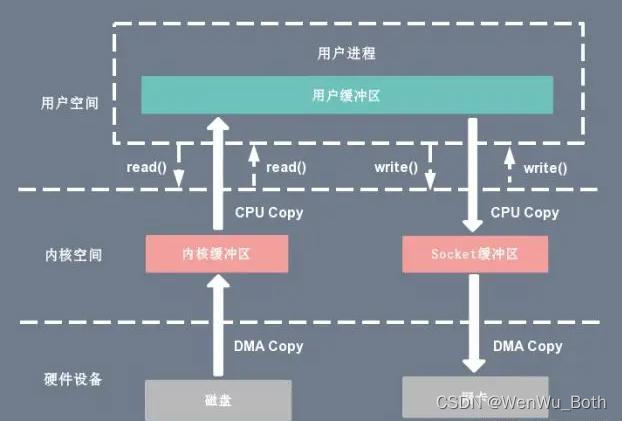

     **整个过程涉及2次CPU拷贝、2次DMA拷贝总共4次拷贝，以及4次上下文切换。**

     > 上下文切换：当用户程序向内核发起系统调用时，CPU将用户进程从用户态切换到内核态；当系统调用返回时，CPU将用户进程从内核态切换回用户态。
     > CPU拷贝：由CPU直接处理数据的传送，数据拷贝时会一直占用CPU的资源。
     > DMA拷贝：由CPU向DMA磁盘控制器下达指令，让DMA控制器来处理数据的传送，数据传送完毕再把信息反馈给CPU，从而减轻了CPU资源的占有率。

   - **sendfile**

     > sendfile系统调用在Linux内核版本2.1中被引入，目的是简化通过网络在两个通道之间进行的数据传输过程。sendfile系统调用的引入，不仅减少了CPU拷贝的次数，还减少了上下文切换的次数。

     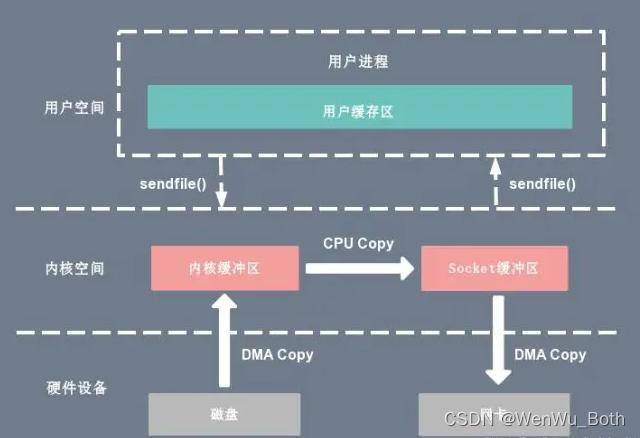

     > 通过sendfile系统调用，数据可以直接在内核空间内部进行I/O传输，从而省去了数据在用户空间和内核空间之间的来回拷贝。基于sendfile系统调用的零拷贝方式，整个拷贝过程会发生2次上下文切换，1次CPU拷贝和2次DMA拷贝。
     >
     > **sendfile存在的问题是用户程序不能对数据进行修改，而只是单纯地完成了一次数据传输过程。**

   - **sendfile + DMA gather copy**

     > Linux 2.4版本的内核对sendfile系统调用进行修改，为DMA拷贝引入了gather 操作。它将内核空间（kernel space）的读缓冲区（read buffer）中对应的数据描述信息（内存地址、地址偏移量）记录到相应的网络缓冲区（ socket buffer）中，由DMA根据内存地址、地址偏移量将数据批量地从读缓冲区（read buffer）拷贝到网卡设备中，这样就省去了内核空间中仅剩的1次CPU拷贝操作。

     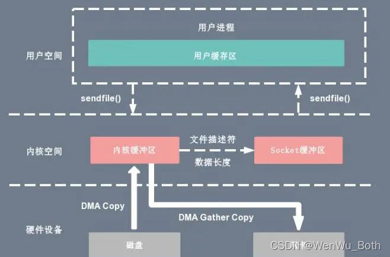

     > 在硬件的支持下，sendfile拷贝方式不再从内核缓冲区的数据拷贝到socket缓冲区，取而代之的仅仅是缓冲区文件描述符和数据长度的拷贝，这样DMA引擎直接利用gather操作将页缓存中数据打包发送到网络中即可。
     >
     > 基于sendfile + DMA gather copy 系统调用的零拷贝方式，整个拷贝过程会发生2次上下文切换、0次CPU拷贝以及2次DMA拷贝。
     >
     > sendfile + DMA gather copy 拷贝方式同样存在用户程序不能对数据进行修改的问题，而且本身需要硬件的支持，它只适用于将数据从文件拷贝到socket套接字上的传输过程。

   - **mmap + write**

     > 一种零拷贝方式是使用mmap + write 代替原来的 read + write 方式，减少了1次CPU拷贝操作。mmap是Linux提供的一种内存映射文件方法，即将一个进程的地址空间中的一段虚拟地址映射到磁盘文件地址。

     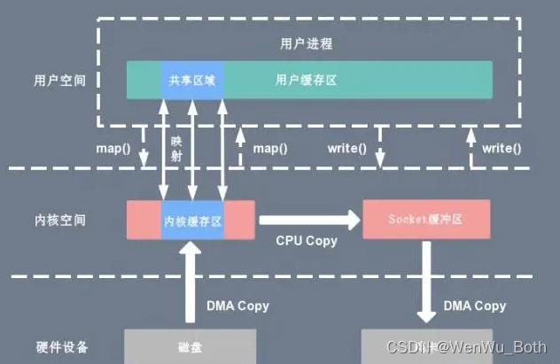

     > 使用mmap的目的是将内核中读缓冲区（read buffer）的地址与用户空间的缓冲区（user buffer）进行映射，从而实现内核缓冲区与应用程序内存的共享，省去了将数据从内核读缓冲区（read buffer）拷贝到用户缓冲区（user buffer）的过程，然而内核读缓冲区（read buffer）仍需将数据到内核写缓冲区（socket buffer）。
     >
     > **基于mmap + write 系统调用的零拷贝方式，整个拷贝过程会发生4次上下文切换，1次CPU 拷贝和2次DMA拷贝。**
     >
     > mmap主要的用处是提高I/O性能，特别是针对大文件。对于小文件，内存映射文件反而会导致碎片空间的浪费，因为内存映射总是要对齐页边界，最小单位是4 KB，一个5 KB的文件将会映射占用8 KB内存，也就会浪费3 KB内存。
     >
     > mmap的拷贝虽然减少了1次拷贝，提升了效率，但也存在一些隐藏的问题。当mmap一个文件时，如果这个文件被另一个进程所截获，那么write系统调用会因为访问非法地址被SIGBUS信号终止，SIGBUS默认会杀死进程并产生一个coredump，服务器可能因此被终止。

   - **splice**

     > sendfile只适用于将数据从文件拷贝到socket套接字上，同时需要硬件的支持，这也限定了它的使用范围。Linux在2.6.17版本引入splice系统调用，不仅不需要硬件支持，还实现了两个文件描述符之间的数据零拷贝。

     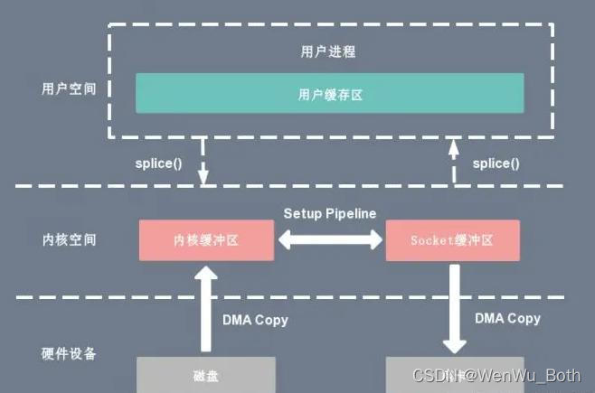

     > splice系统调用可以在内核空间的读缓冲区（read buffer）和网络缓冲区（socket buffer）之间建立管道（pipeline），从而避免了两者之间的CPU拷贝操作。
     >
     > **基于splice系统调用的零拷贝方式，整个拷贝过程会发生2次上下文切换，0次CPU拷贝以及2次DMA拷贝。**
     >
     > splice拷贝方式也同样存在用户程序不能对数据进行修改的问题。除此之外，它使用了Linux的管道缓冲机制，可以用于任意两个文件描述符中传输数据，但是它的两个文件描述符参数中有一个必须是管道设备。

     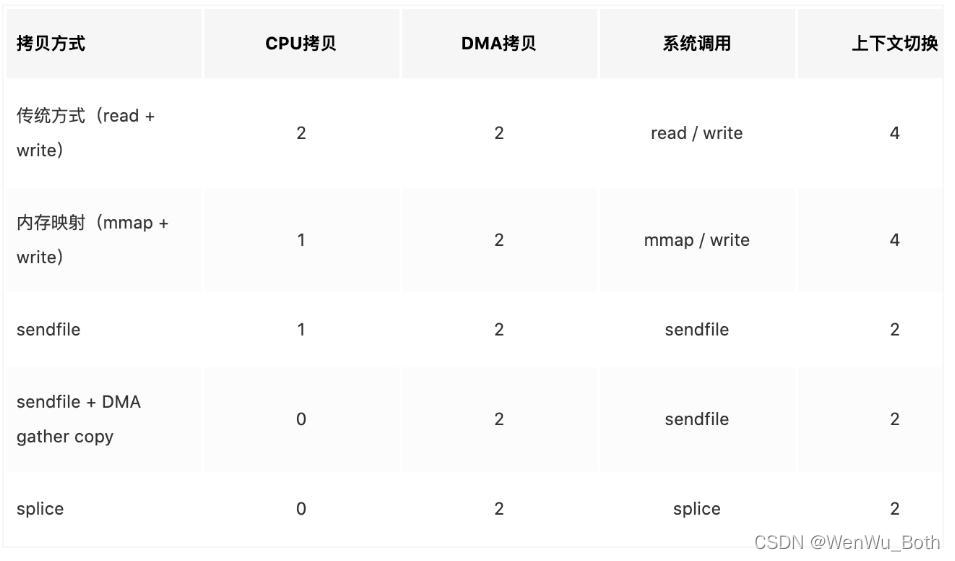

     > 在Kafka中消息存储模式中，数据存储在底层文件系统中。当有Consumer订阅了相应的Topic消息，数据需要从磁盘中读取然后将数据写回到套接字中（Socket）。此动作看似只需较少的CPU活动，但它的效率非常低：首先内核读出全盘数据，然后将数据跨越内核用户推到应用程序，然后应用程序再次跨越内核用户将数据推回，写出到套接字。
     >
     > Kafka Consumer执行上述过程中，使用了Java类库java.nio.channels.FileChannel中的transferTo()方法来实现零拷贝，transferTo()方法将数据从文件通道传输到了给定的可写字节通道。在内部，它依赖底层操作系统对零拷贝的支持；在UNIX 和各种Linux系统中，此调用被传递到sendfile()系统调用中。
     >
     > 所以，如果底层网络接口卡支持收集操作的话，Kafka Consumer实现零拷贝的方式为sendfile + DMA gather copy，否则为sendfile。

2. **Page Cache(页缓存)+磁盘顺序写**

   操作系统本身有一层缓存，叫做page cache，是在内存里的缓存，我们也可以称之为os cache，意思就是操作系统自己管理的缓存。

   你在写入磁盘文件的时候，可以直接写入这个os cache里，也就是仅仅写入内存中，接下来由操作系统自己决定什么时候把os cache里的数据真的刷入磁盘文件中。

   仅仅这一个步骤，就可以将磁盘文件写性能提升很多了，因为其实这里相当于是在写内存，不是在写磁盘。
   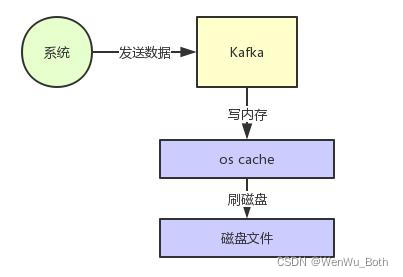

   同时，Page Cache将数据flush到磁盘的时候，Kafka是以磁盘顺序写的方式来写的。也就是说，仅仅将数据追加到文件的末尾，不是在文件的随机位置来修改数据，避免了磁盘随机写性能差的问题。

   另外，Kafka读取数据的时候，也会先检查下Page Cache里是否存在待检索数据，若有则直接返回，否则再走零拷贝I/O流程。所以，如果Kafka的生产者和消费者的数据速率差不多时，会发现大量的数据都是直接写入os cache中，然后读数据的时候也是从os cache中读。相当于是Kafka完全基于内存提供数据的写和读，Page Cache实现了数据的“空中接力”。

   Kafka利用了操作系统本身的Page Cache，而没有使用JVM的空间内存。主要是：

   避免Object消耗：如果是使用Java堆，Java对象的内存消耗比较大，通常是所存储数据的两倍甚至更多。
   避免GC问题：随着JVM中数据不断增多，垃圾回收将会变得复杂与缓慢，使用系统缓存就不会存在GC问题。
   同时，相比于使用JVM或in-memory cache等数据结构，利用操作系统的Page Cache更加简单可靠。首先，操作系统层面的缓存利用率会更高，因为存储的都是紧凑的字节结构而不是独立的对象。其次，操作系统本身也对于Page Cache做了大量优化，提供了write-behind、read-ahead以及flush等多种机制。再者，即使服务进程重启，系统缓存依然不会消失，避免了in-process cache重建缓存的过程。

3. **分区分段+索引**

   Kafka的message是按topic分类存储的，topic中的数据又是按照一个一个的partition即分区存储到不同broker节点。每个partition对应了操作系统上的一个文件夹，partition实际上又是按照segment分段存储的。这也非常符合分布式系统分区分桶的设计思想。

   通过这种分区分段的设计，Kafka的message消息实际上是分布式存储在一个一个小的segment中的，每次文件操作也是直接操作的segment。为了进一步的查询优化，Kafka又默认为分段后的数据文件建立了稀疏索引文件，就是文件系统上的.index文件。这种分区分段+索引的设计，不仅提升了数据读取的效率，同时也提高了数据操作的并行度。

4. **批量读写**

   Kafka数据读写也是批量的而不是单条的。

   除了利用底层的技术外，Kafka还在应用程序层面提供了一些手段来提升性能。最明显的就是使用批次。在向Kafka写入数据时，可以启用批次写入，这样可以避免在网络上频繁传输单个消息带来的延迟和带宽开销。假设网络带宽为10MB/S，一次性传输10MB的消息比传输1KB的消息10000万次显然要快得多。

5. **批量压缩**

   Kafka使用了批量压缩，多个消息一起压缩。降低网络带宽。Kafka允许使用递归的消息集合，批量的消息可以通过压缩的形式传输并且在日志中也可以保持压缩格式，直到被消费者解压缩。

   当然，消息的压缩和解压缩需要消耗一定的CPU资源，用户需要均衡好CPU和带宽的关系。

## Kafka的用途有哪些？使用场景如何？

- 消息系统： Kafka 和传统的消息系统（也称作消息中间件）都具备系统解耦、冗余存储、流量削峰、缓冲、异步通信、扩展性、可恢复性等功能。与此同时，Kafka 还提供了大多数消息系统难以实现的消息顺序性保障及回溯消费的功能。
- 存储系统： Kafka 把消息持久化到磁盘，相比于其他基于内存存储的系统而言，有效地降低了数据丢失的风险。也正是得益于 Kafka 的消息持久化功能和多副本机制，我们可以把 Kafka 作为长期的数据存储系统来使用，只需要把对应的数据保留策略设置为“永久”或启用主题的日志压缩功能即可。
- 流式处理平台： Kafka 不仅为每个流行的流式处理框架提供了可靠的数据来源，还提供了一个完整的流式处理类库，比如窗口、连接、变换和聚合等各类操作。

## Kafka中的ISR、AR又代表什么？ISR的伸缩又指什么[#](https://www.cnblogs.com/luozhiyun/p/11811835.html#1792160991)

分区中的所有副本统称为 AR（Assigned Replicas）。所有与 leader 副本保持一定程度同步的副本（包括 leader 副本在内）组成ISR（In-Sync Replicas），ISR 集合是 AR 集合中的一个子集。

ISR的伸缩：
leader 副本负责维护和跟踪 ISR 集合中所有 follower 副本的滞后状态，当 follower 副本落后太多或失效时，leader 副本会把它从 ISR 集合中剔除。如果 OSR 集合中有 follower 副本“追上”了 leader 副本，那么 leader 副本会把它从 OSR 集合转移至 ISR 集合。默认情况下，当 leader 副本发生故障时，只有在 ISR 集合中的副本才有资格被选举为新的 leader，而在 OSR 集合中的副本则没有任何机会（不过这个原则也可以通过修改相应的参数配置来改变）。

replica.lag.time.max.ms ： 这个参数的含义是 Follower 副本能够落后 Leader 副本的最长时间间隔，当前默认值是 10 秒。

unclean.leader.election.enable：是否允许 Unclean 领导者选举。开启 Unclean 领导者选举可能会造成数据丢失，但好处是，它使得分区 Leader 副本一直存在，不至于停止对外提供服务，因此提升了高可用性。

## Kafka中的HW、LEO、LSO、LW等分别代表什么？[#](https://www.cnblogs.com/luozhiyun/p/11811835.html#2175983375)

HW 是 High Watermark 的缩写，俗称高水位，它标识了一个特定的消息偏移量（offset），消费者只能拉取到这个 offset 之前的消息。

LSO是LogStartOffset，一般情况下，日志文件的起始偏移量 logStartOffset 等于第一个日志分段的 baseOffset，但这并不是绝对的，logStartOffset 的值可以通过 DeleteRecordsRequest 请求(比如使用 KafkaAdminClient 的 deleteRecords()方法、使用 kafka-delete-records.sh 脚本、日志的清理和截断等操作进行修改。
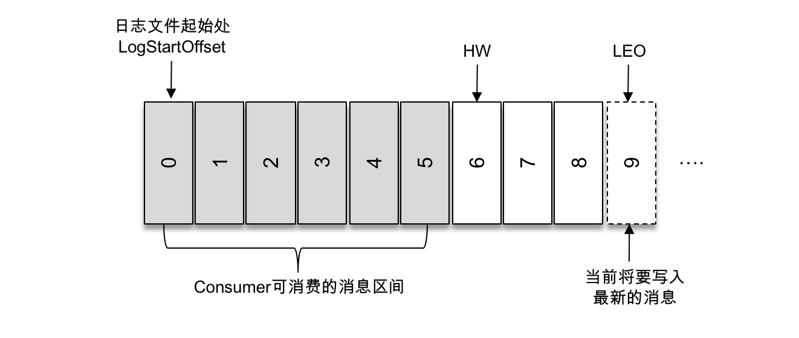

如上图所示，它代表一个日志文件，这个日志文件中有9条消息，第一条消息的 offset（LogStartOffset）为0，最后一条消息的 offset 为8，offset 为9的消息用虚线框表示，代表下一条待写入的消息。日志文件的 HW 为6，表示消费者只能拉取到 offset 在0至5之间的消息，而 offset 为6的消息对消费者而言是不可见的。

LEO 是 Log End Offset 的缩写，它标识当前日志文件中下一条待写入消息的 offset，上图中 offset 为9的位置即为当前日志文件的 LEO，LEO 的大小相当于当前日志分区中最后一条消息的 offset 值加1。分区 ISR 集合中的每个副本都会维护自身的 LEO，而 ISR 集合中最小的 LEO 即为分区的 HW，对消费者而言只能消费 HW 之前的消息。

LW 是 Low Watermark 的缩写，俗称“低水位”，代表 AR 集合中最小的 logStartOffset 值。副本的拉取请求(FetchRequest，它有可能触发新建日志分段而旧的被清理，进而导致 logStartOffset 的增加)和删除消息请求(DeleteRecordRequest)都有可能促使 LW 的增长。

## Kafka中是怎么体现消息顺序性的？[#](https://www.cnblogs.com/luozhiyun/p/11811835.html#1623796200)

可以通过分区策略体现消息顺序性。
分区策略有轮询策略、随机策略、按消息键保序策略。

按消息键保序策略：一旦消息被定义了 Key，那么你就可以保证同一个 Key 的所有消息都进入到相同的分区里面，由于每个分区下的消息处理都是有顺序的，故这个策略被称为按消息键保序策略

```java
CopyList<PartitionInfo> partitions = cluster.partitionsForTopic(topic);
return Math.abs(key.hashCode()) % partitions.size();
```

## Kafka中的分区器、序列化器、拦截器是否了解？它们之间的处理顺序是什么？[#](https://www.cnblogs.com/luozhiyun/p/11811835.html#146655695)

- 序列化器：生产者需要用序列化器（Serializer）把对象转换成字节数组才能通过网络发送给 Kafka。而在对侧，消费者需要用反序列化器（Deserializer）把从 Kafka 中收到的字节数组转换成相应的对象。
- 分区器：分区器的作用就是为消息分配分区。如果消息 ProducerRecord 中没有指定 partition 字段，那么就需要依赖分区器，根据 key 这个字段来计算 partition 的值。
- Kafka 一共有两种拦截器：生产者拦截器和消费者拦截器。
  - 生产者拦截器既可以用来在消息发送前做一些准备工作，比如按照某个规则过滤不符合要求的消息、修改消息的内容等，也可以用来在发送回调逻辑前做一些定制化的需求，比如统计类工作。
  - 消费者拦截器主要在消费到消息或在提交消费位移时进行一些定制化的操作。

消息在通过 send() 方法发往 broker 的过程中，有可能需要经过拦截器（Interceptor）、序列化器（Serializer）和分区器（Partitioner）的一系列作用之后才能被真正地发往 broker。拦截器（下一章会详细介绍）一般不是必需的，而序列化器是必需的。消息经过序列化之后就需要确定它发往的分区，如果消息 ProducerRecord 中指定了 partition 字段，那么就不需要分区器的作用，因为 partition 代表的就是所要发往的分区号。

处理顺序 ：拦截器->序列化器->分区器

KafkaProducer 在将消息序列化和计算分区之前会调用生产者拦截器的 onSend() 方法来对消息进行相应的定制化操作。
然后生产者需要用序列化器（Serializer）把对象转换成字节数组才能通过网络发送给 Kafka。
最后可能会被发往分区器为消息分配分区。

## Kafka生产者客户端的整体结构是什么样子的？[#](https://www.cnblogs.com/luozhiyun/p/11811835.html#4049266806)


整个生产者客户端由两个线程协调运行，这两个线程分别为主线程和 Sender 线程（发送线程）。
在主线程中由 KafkaProducer 创建消息，然后通过可能的拦截器、序列化器和分区器的作用之后缓存到消息累加器（RecordAccumulator，也称为消息收集器）中。
Sender 线程负责从 RecordAccumulator 中获取消息并将其发送到 Kafka 中。
RecordAccumulator 主要用来缓存消息以便 Sender 线程可以批量发送，进而减少网络传输的资源消耗以提升性能。

## Kafka生产者客户端中使用了几个线程来处理？分别是什么？[#](https://www.cnblogs.com/luozhiyun/p/11811835.html#3445411116)

整个生产者客户端由两个线程协调运行，这两个线程分别为主线程和 Sender 线程（发送线程）。在主线程中由 KafkaProducer 创建消息，然后通过可能的拦截器、序列化器和分区器的作用之后缓存到消息累加器（RecordAccumulator，也称为消息收集器）中。Sender 线程负责从 RecordAccumulator 中获取消息并将其发送到 Kafka 中。

## Kafka的旧版Scala的消费者客户端的设计有什么缺陷？[#](https://www.cnblogs.com/luozhiyun/p/11811835.html#1518491390)

老版本的 Consumer Group 把位移保存在 ZooKeeper 中。Apache ZooKeeper 是一个分布式的协调服务框架，Kafka 重度依赖它实现各种各样的协调管理。将位移保存在 ZooKeeper 外部系统的做法，最显而易见的好处就是减少了 Kafka Broker 端的状态保存开销。

ZooKeeper 这类元框架其实并不适合进行频繁的写更新，而 Consumer Group 的位移更新却是一个非常频繁的操作。这种大吞吐量的写操作会极大地拖慢 ZooKeeper 集群的性能

## “消费组中的消费者个数如果超过topic的分区，那么就会有消费者消费不到数据”这句话是否正确？如果正确，那么有没有什么hack的手段？[#](https://www.cnblogs.com/luozhiyun/p/11811835.html#807714931)

一般来说如果消费者过多，出现了消费者的个数大于分区个数的情况，就会有消费者分配不到任何分区。

开发者可以继承AbstractPartitionAssignor实现自定义消费策略，从而实现同一消费组内的任意消费者都可以消费订阅主题的所有分区：

```java
Copypublic class BroadcastAssignor extends AbstractPartitionAssignor{
    @Override
    public String name() {
        return "broadcast";
    }

    private Map<String, List<String>> consumersPerTopic(
            Map<String, Subscription> consumerMetadata) {
        （具体实现请参考RandomAssignor中的consumersPerTopic()方法）
    }

    @Override
    public Map<String, List<TopicPartition>> assign(
            Map<String, Integer> partitionsPerTopic,
            Map<String, Subscription> subscriptions) {
        Map<String, List<String>> consumersPerTopic =
                consumersPerTopic(subscriptions);
        Map<String, List<TopicPartition>> assignment = new HashMap<>();
		   //Java8
        subscriptions.keySet().forEach(memberId ->
                assignment.put(memberId, new ArrayList<>()));
		   //针对每一个主题，为每一个订阅的消费者分配所有的分区
        consumersPerTopic.entrySet().forEach(topicEntry->{
            String topic = topicEntry.getKey();
            List<String> members = topicEntry.getValue();

            Integer numPartitionsForTopic = partitionsPerTopic.get(topic);
            if (numPartitionsForTopic == null || members.isEmpty())
                return;
            List<TopicPartition> partitions = AbstractPartitionAssignor
                    .partitions(topic, numPartitionsForTopic);
            if (!partitions.isEmpty()) {
                members.forEach(memberId ->
                        assignment.get(memberId).addAll(partitions));
            }
        });
        return assignment;
    }
}
```

注意组内广播的这种实现方式会有一个严重的问题—默认的消费位移的提交会失效。

## 消费者提交消费位移时提交的是当前消费到的最新消息的offset还是offset+1?[#](https://www.cnblogs.com/luozhiyun/p/11811835.html#2830714219)

在旧消费者客户端中，消费位移是存储在 ZooKeeper 中的。而在新消费者客户端中，消费位移存储在 Kafka 内部的主题__consumer_offsets 中。
当前消费者需要提交的消费位移是offset+1

## 有哪些情形会造成重复消费？[#](https://www.cnblogs.com/luozhiyun/p/11811835.html#2741570832)

1. Rebalance
   一个consumer正在消费一个分区的一条消息，还没有消费完，发生了rebalance(加入了一个consumer)，从而导致这条消息没有消费成功，rebalance后，另一个consumer又把这条消息消费一遍。
2. 消费者端手动提交
   如果先消费消息，再更新offset位置，导致消息重复消费。
3. 消费者端自动提交
   设置offset为自动提交，关闭kafka时，如果在close之前，调用 consumer.unsubscribe() 则有可能部分offset没提交，下次重启会重复消费。
4. 生产者端
   生产者因为业务问题导致的宕机，在重启之后可能数据会重发

## 那些情景下会造成消息漏消费？[#](https://www.cnblogs.com/luozhiyun/p/11811835.html#1017721958)

1. 自动提交
   设置offset为自动定时提交，当offset被自动定时提交时，数据还在内存中未处理，此时刚好把线程kill掉，那么offset已经提交，但是数据未处理，导致这部分内存中的数据丢失。
2. 生产者发送消息
   发送消息设置的是fire-and-forget（发后即忘），它只管往 Kafka 中发送消息而并不关心消息是否正确到达。不过在某些时候（比如发生不可重试异常时）会造成消息的丢失。这种发送方式的性能最高，可靠性也最差。
3. 消费者端
   先提交位移，但是消息还没消费完就宕机了，造成了消息没有被消费。自动位移提交同理
4. acks没有设置为all
   如果在broker还没把消息同步到其他broker的时候宕机了，那么消息将会丢失

## KafkaConsumer是非线程安全的，那么怎么样实现多线程消费？[#](https://www.cnblogs.com/luozhiyun/p/11811835.html#2638568150)

1. 线程封闭，即为每个线程实例化一个 KafkaConsumer 对象


一个线程对应一个 KafkaConsumer 实例，我们可以称之为消费线程。一个消费线程可以消费一个或多个分区中的消息，所有的消费线程都隶属于同一个消费组。

1. 消费者程序使用单或多线程获取消息，同时创建多个消费线程执行消息处理逻辑。
   获取消息的线程可以是一个，也可以是多个，每个线程维护专属的 KafkaConsumer 实例，处理消息则交由特定的线程池来做，从而实现消息获取与消息处理的真正解耦。具体架构如下图所示：
   

两个方案对比：


## 简述消费者与消费组之间的关系[#](https://www.cnblogs.com/luozhiyun/p/11811835.html#4117516705)

1. Consumer Group 下可以有一个或多个 Consumer 实例。这里的实例可以是一个单独的进程，也可以是同一进程下的线程。在实际场景中，使用进程更为常见一些。
2. Group ID 是一个字符串，在一个 Kafka 集群中，它标识唯一的一个 Consumer Group。
3. Consumer Group 下所有实例订阅的主题的单个分区，只能分配给组内的某个 Consumer 实例消费。这个分区当然也可以被其他的 Group 消费。

## 当你使用kafka-topics.sh创建（删除）了一个topic之后，Kafka背后会执行什么逻辑？[#](https://www.cnblogs.com/luozhiyun/p/11811835.html#4185532755)

在执行完脚本之后，Kafka 会在 log.dir 或 log.dirs 参数所配置的目录下创建相应的主题分区，默认情况下这个目录为/tmp/kafka-logs/。

在 ZooKeeper 的/brokers/topics/目录下创建一个同名的实节点，该节点中记录了该主题的分区副本分配方案。示例如下：

```java
Copy[zk: localhost:2181/kafka(CONNECTED) 2] get /brokers/topics/topic-create
{"version":1,"partitions":{"2":[1,2],"1":[0,1],"3":[2,1],"0":[2,0]}}
```

## topic的分区数可不可以增加？如果可以怎么增加？如果不可以，那又是为什么？[#](https://www.cnblogs.com/luozhiyun/p/11811835.html#984447812)

可以增加，使用 kafka-topics 脚本，结合 --alter 参数来增加某个主题的分区数，命令如下：

```shell
Copybin/kafka-topics.sh --bootstrap-server broker_host:port --alter --topic <topic_name> --partitions <新分区数>
```

当分区数增加时，就会触发订阅该主题的所有 Group 开启 Rebalance。
首先，Rebalance 过程对 Consumer Group 消费过程有极大的影响。在 Rebalance 过程中，所有 Consumer 实例都会停止消费，等待 Rebalance 完成。这是 Rebalance 为人诟病的一个方面。
其次，目前 Rebalance 的设计是所有 Consumer 实例共同参与，全部重新分配所有分区。其实更高效的做法是尽量减少分配方案的变动。
最后，Rebalance 实在是太慢了。

## topic的分区数可不可以减少？如果可以怎么减少？如果不可以，那又是为什么？[#](https://www.cnblogs.com/luozhiyun/p/11811835.html#2292958616)

不支持，因为删除的分区中的消息不好处理。如果直接存储到现有分区的尾部，消息的时间戳就不会递增，如此对于 Spark、Flink 这类需要消息时间戳（事件时间）的组件将会受到影响；如果分散插入现有的分区，那么在消息量很大的时候，内部的数据复制会占用很大的资源，而且在复制期间，此主题的可用性又如何得到保障？与此同时，顺序性问题、事务性问题，以及分区和副本的状态机切换问题都是不得不面对的。

## 创建topic时如何选择合适的分区数？[#](https://www.cnblogs.com/luozhiyun/p/11811835.html#1913032081)

在 Kafka 中，性能与分区数有着必然的关系，在设定分区数时一般也需要考虑性能的因素。对不同的硬件而言，其对应的性能也会不太一样。
可以使用Kafka 本身提供的用于生产者性能测试的 kafka-producer- perf-test.sh 和用于消费者性能测试的 kafka-consumer-perf-test.sh来进行测试。
增加合适的分区数可以在一定程度上提升整体吞吐量，但超过对应的阈值之后吞吐量不升反降。如果应用对吞吐量有一定程度上的要求，则建议在投入生产环境之前对同款硬件资源做一个完备的吞吐量相关的测试，以找到合适的分区数阈值区间。
分区数的多少还会影响系统的可用性。如果分区数非常多，如果集群中的某个 broker 节点宕机，那么就会有大量的分区需要同时进行 leader 角色切换，这个切换的过程会耗费一笔可观的时间，并且在这个时间窗口内这些分区也会变得不可用。
分区数越多也会让 Kafka 的正常启动和关闭的耗时变得越长，与此同时，主题的分区数越多不仅会增加日志清理的耗时，而且在被删除时也会耗费更多的时间。

## Kafka目前有哪些内部topic，它们都有什么特征？各自的作用又是什么？[#](https://www.cnblogs.com/luozhiyun/p/11909315.html#682180448)

__consumer_offsets：作用是保存 Kafka 消费者的位移信息
__transaction_state：用来存储事务日志消息

## 优先副本是什么？它有什么特殊的作用？[#](https://www.cnblogs.com/luozhiyun/p/11909315.html#2196046983)

所谓的优先副本是指在AR集合列表中的第一个副本。
理想情况下，优先副本就是该分区的leader 副本，所以也可以称之为 preferred leader。Kafka 要确保所有主题的优先副本在 Kafka 集群中均匀分布，这样就保证了所有分区的 leader 均衡分布。以此来促进集群的负载均衡，这一行为也可以称为“分区平衡”。

## Kafka有哪几处地方有分区分配的概念？简述大致的过程及原理[#](https://www.cnblogs.com/luozhiyun/p/11909315.html#2298947628)

1. 生产者的分区分配是指为每条消息指定其所要发往的分区。可以编写一个具体的类实现org.apache.kafka.clients.producer.Partitioner接口。
2. 消费者中的分区分配是指为消费者指定其可以消费消息的分区。Kafka 提供了消费者客户端参数 partition.assignment.strategy 来设置消费者与订阅主题之间的分区分配策略。
3. 分区副本的分配是指为集群制定创建主题时的分区副本分配方案，即在哪个 broker 中创建哪些分区的副本。kafka-topics.sh 脚本中提供了一个 replica-assignment 参数来手动指定分区副本的分配方案。

## 简述Kafka的日志目录结构[#](https://www.cnblogs.com/luozhiyun/p/11909315.html#3890764566)


Kafka 中的消息是以主题为基本单位进行归类的，各个主题在逻辑上相互独立。每个主题又可以分为一个或多个分区。不考虑多副本的情况，一个分区对应一个日志（Log）。为了防止 Log 过大，Kafka 又引入了日志分段（LogSegment）的概念，将 Log 切分为多个 LogSegment，相当于一个巨型文件被平均分配为多个相对较小的文件。

Log 和 LogSegment 也不是纯粹物理意义上的概念，Log 在物理上只以文件夹的形式存储，而每个 LogSegment 对应于磁盘上的一个日志文件和两个索引文件，以及可能的其他文件（比如以“.txnindex”为后缀的事务索引文件）

## Kafka中有那些索引文件？[#](https://www.cnblogs.com/luozhiyun/p/11909315.html#3777276156)

每个日志分段文件对应了两个索引文件，主要用来提高查找消息的效率。
偏移量索引文件用来建立消息偏移量（offset）到物理地址之间的映射关系，方便快速定位消息所在的物理文件位置
时间戳索引文件则根据指定的时间戳（timestamp）来查找对应的偏移量信息。

## 如果我指定了一个offset，Kafka怎么查找到对应的消息？[#](https://www.cnblogs.com/luozhiyun/p/11909315.html#2063188847)

Kafka是通过seek() 方法来指定消费的，在执行seek() 方法之前要去执行一次poll()方法，等到分配到分区之后会去对应的分区的指定位置开始消费，如果指定的位置发生了越界，那么会根据auto.offset.reset 参数设置的情况进行消费。

## 如果我指定了一个timestamp，Kafka怎么查找到对应的消息？[#](https://www.cnblogs.com/luozhiyun/p/11909315.html#172234989)

Kafka提供了一个 offsetsForTimes() 方法，通过 timestamp 来查询与此对应的分区位置。offsetsForTimes() 方法的参数 timestampsToSearch 是一个 Map 类型，key 为待查询的分区，而 value 为待查询的时间戳，该方法会返回时间戳大于等于待查询时间的第一条消息对应的位置和时间戳，对应于 OffsetAndTimestamp 中的 offset 和 timestamp 字段。

## 聊一聊你对Kafka的Log Retention的理解[#](https://www.cnblogs.com/luozhiyun/p/11909315.html#4252735515)

日志删除（Log Retention）：按照一定的保留策略直接删除不符合条件的日志分段。
我们可以通过 broker 端参数 log.cleanup.policy 来设置日志清理策略，此参数的默认值为“delete”，即采用日志删除的清理策略。

1. 基于时间
   日志删除任务会检查当前日志文件中是否有保留时间超过设定的阈值（retentionMs）来寻找可删除的日志分段文件集合（deletableSegments）retentionMs 可以通过 broker 端参数 log.retention.hours、log.retention.minutes 和 log.retention.ms 来配置，其中 log.retention.ms 的优先级最高，log.retention.minutes 次之，log.retention.hours 最低。默认情况下只配置了 log.retention.hours 参数，其值为168，故默认情况下日志分段文件的保留时间为7天。
   删除日志分段时，首先会从 Log 对象中所维护日志分段的跳跃表中移除待删除的日志分段，以保证没有线程对这些日志分段进行读取操作。然后将日志分段所对应的所有文件添加上“.deleted”的后缀（当然也包括对应的索引文件）。最后交由一个以“delete-file”命名的延迟任务来删除这些以“.deleted”为后缀的文件，这个任务的延迟执行时间可以通过 file.delete.delay.ms 参数来调配，此参数的默认值为60000，即1分钟。
2. 基于日志大小
   日志删除任务会检查当前日志的大小是否超过设定的阈值（retentionSize）来寻找可删除的日志分段的文件集合（deletableSegments）。
   retentionSize 可以通过 broker 端参数 log.retention.bytes 来配置，默认值为-1，表示无穷大。注意 log.retention.bytes 配置的是 Log 中所有日志文件的总大小，而不是单个日志分段（确切地说应该为 .log 日志文件）的大小。单个日志分段的大小由 broker 端参数 log.segment.bytes 来限制，默认值为1073741824，即 1GB。
   这个删除操作和基于时间的保留策略的删除操作相同。
3. 基于日志起始偏移量
   基于日志起始偏移量的保留策略的判断依据是某日志分段的下一个日志分段的起始偏移量 baseOffset 是否小于等于 logStartOffset，若是，则可以删除此日志分段。
   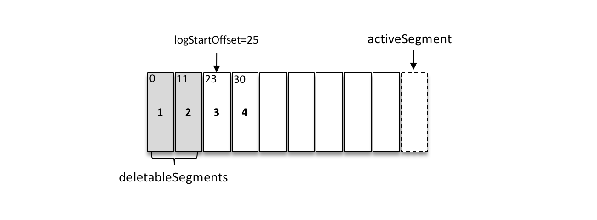

如上图所示，假设 logStartOffset 等于25，日志分段1的起始偏移量为0，日志分段2的起始偏移量为11，日志分段3的起始偏移量为23，通过如下动作收集可删除的日志分段的文件集合 deletableSegments：

从头开始遍历每个日志分段，日志分段1的下一个日志分段的起始偏移量为11，小于 logStartOffset 的大小，将日志分段1加入 deletableSegments。
日志分段2的下一个日志偏移量的起始偏移量为23，也小于 logStartOffset 的大小，将日志分段2加入 deletableSegments。
日志分段3的下一个日志偏移量在 logStartOffset 的右侧，故从日志分段3开始的所有日志分段都不会加入 deletableSegments。
收集完可删除的日志分段的文件集合之后的删除操作同基于日志大小的保留策略和基于时间的保留策略相同

聊一聊你对Kafka的Log Compaction的理解[#](https://www.cnblogs.com/luozhiyun/p/11909315.html#2916507999)

日志压缩（Log Compaction）：针对每个消息的 key 进行整合，对于有相同 key 的不同 value 值，只保留最后一个版本。
如果要采用日志压缩的清理策略，就需要将 log.cleanup.policy 设置为“compact”，并且还需要将 log.cleaner.enable （默认值为 true）设定为 true。
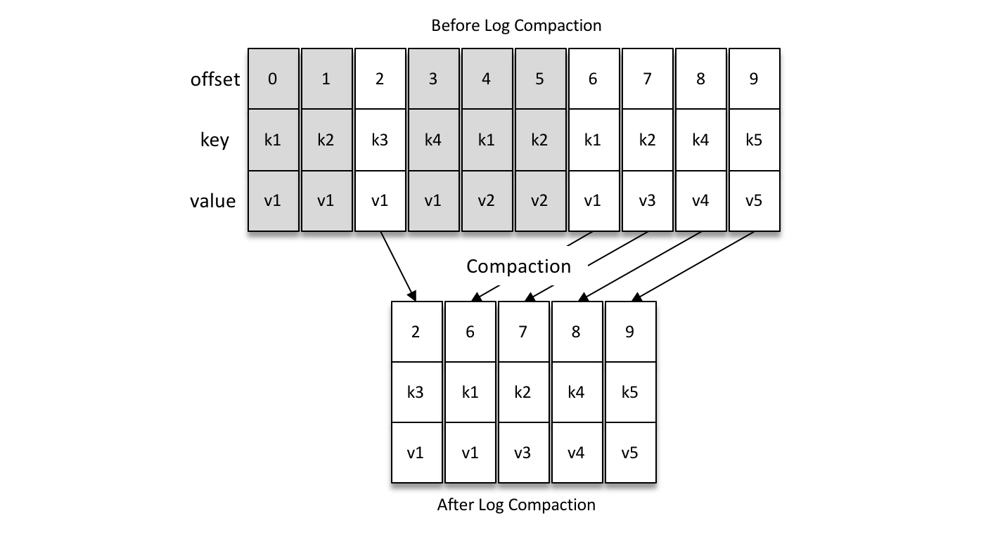

如下图所示，Log Compaction 对于有相同 key 的不同 value 值，只保留最后一个版本。如果应用只关心 key 对应的最新 value 值，则可以开启 Kafka 的日志清理功能，Kafka 会定期将相同 key 的消息进行合并，只保留最新的 value 值。

## 聊一聊你对Kafka底层存储的理解[#](https://www.cnblogs.com/luozhiyun/p/11909315.html#2320422184)

### 页缓存[#](https://www.cnblogs.com/luozhiyun/p/11909315.html#3046285717)

页缓存是操作系统实现的一种主要的磁盘缓存，以此用来减少对磁盘 I/O 的操作。具体来说，就是把磁盘中的数据缓存到内存中，把对磁盘的访问变为对内存的访问。

当一个进程准备读取磁盘上的文件内容时，操作系统会先查看待读取的数据所在的页（page）是否在页缓存（pagecache）中，如果存在（命中）则直接返回数据，从而避免了对物理磁盘的 I/O 操作；如果没有命中，则操作系统会向磁盘发起读取请求并将读取的数据页存入页缓存，之后再将数据返回给进程。

同样，如果一个进程需要将数据写入磁盘，那么操作系统也会检测数据对应的页是否在页缓存中，如果不存在，则会先在页缓存中添加相应的页，最后将数据写入对应的页。被修改过后的页也就变成了脏页，操作系统会在合适的时间把脏页中的数据写入磁盘，以保持数据的一致性。

用过 Java 的人一般都知道两点事实：对象的内存开销非常大，通常会是真实数据大小的几倍甚至更多，空间使用率低下；Java 的垃圾回收会随着堆内数据的增多而变得越来越慢。基于这些因素，使用文件系统并依赖于页缓存的做法明显要优于维护一个进程内缓存或其他结构，至少我们可以省去了一份进程内部的缓存消耗，同时还可以通过结构紧凑的字节码来替代使用对象的方式以节省更多的空间。

此外，即使 Kafka 服务重启，页缓存还是会保持有效，然而进程内的缓存却需要重建。这样也极大地简化了代码逻辑，因为维护页缓存和文件之间的一致性交由操作系统来负责，这样会比进程内维护更加安全有效。

### 零拷贝[#](https://www.cnblogs.com/luozhiyun/p/11909315.html#963245286)

除了消息顺序追加、页缓存等技术，Kafka 还使用零拷贝（Zero-Copy）技术来进一步提升性能。所谓的零拷贝是指将数据直接从磁盘文件复制到网卡设备中，而不需要经由应用程序之手。零拷贝大大提高了应用程序的性能，减少了内核和用户模式之间的上下文切换。对 Linux 操作系统而言，零拷贝技术依赖于底层的 sendfile() 方法实现。对应于 Java 语言，FileChannal.transferTo() 方法的底层实现就是 sendfile() 方法。

## 聊一聊Kafka的延时操作的原理[#](https://www.cnblogs.com/luozhiyun/p/11909315.html#2611412128)

Kafka 中有多种延时操作，比如延时生产，还有延时拉取（DelayedFetch）、延时数据删除（DelayedDeleteRecords）等。
延时操作创建之后会被加入延时操作管理器（DelayedOperationPurgatory）来做专门的处理。延时操作有可能会超时，每个延时操作管理器都会配备一个定时器（SystemTimer）来做超时管理，定时器的底层就是采用时间轮（TimingWheel）实现的。

## 聊一聊Kafka控制器的作用[#](https://www.cnblogs.com/luozhiyun/p/11909315.html#1303335556)

在 Kafka 集群中会有一个或多个 broker，其中有一个 broker 会被选举为控制器（Kafka Controller），它负责管理整个集群中所有分区和副本的状态。当某个分区的 leader 副本出现故障时，由控制器负责为该分区选举新的 leader 副本。当检测到某个分区的 ISR 集合发生变化时，由控制器负责通知所有broker更新其元数据信息。当使用 kafka-topics.sh 脚本为某个 topic 增加分区数量时，同样还是由控制器负责分区的重新分配。

## Kafka的旧版Scala的消费者客户端的设计有什么缺陷？[#](https://www.cnblogs.com/luozhiyun/p/11909315.html#702192419)

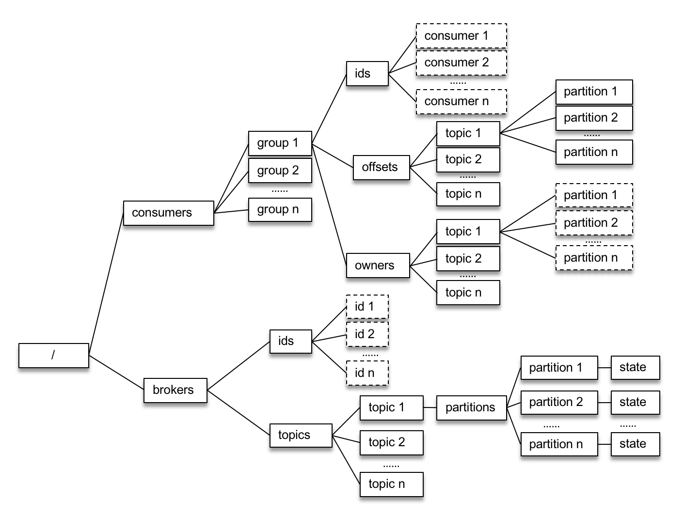

如上图，旧版消费者客户端每个消费组（）在 ZooKeeper 中都维护了一个 /consumers//ids 路径，在此路径下使用临时节点记录隶属于此消费组的消费者的唯一标识（consumerIdString），/consumers//owner 路径下记录了分区和消费者的对应关系，/consumers//offsets 路径下记录了此消费组在分区中对应的消费位移。

每个消费者在启动时都会在 /consumers//ids 和 /brokers/ids 路径上注册一个监听器。当 /consumers//ids 路径下的子节点发生变化时，表示消费组中的消费者发生了变化；当 /brokers/ids 路径下的子节点发生变化时，表示 broker 出现了增减。这样通过 ZooKeeper 所提供的 Watcher，每个消费者就可以监听消费组和 Kafka 集群的状态了。

这种方式下每个消费者对 ZooKeeper 的相关路径分别进行监听，当触发再均衡操作时，一个消费组下的所有消费者会同时进行再均衡操作，而消费者之间并不知道彼此操作的结果，这样可能导致 Kafka 工作在一个不正确的状态。与此同时，这种严重依赖于 ZooKeeper 集群的做法还有两个比较严重的问题。

1. 羊群效应（Herd Effect）：所谓的羊群效应是指ZooKeeper 中一个被监听的节点变化，大量的 Watcher 通知被发送到客户端，导致在通知期间的其他操作延迟，也有可能发生类似死锁的情况。
2. 脑裂问题（Split Brain）：消费者进行再均衡操作时每个消费者都与 ZooKeeper 进行通信以判断消费者或broker变化的情况，由于 ZooKeeper 本身的特性，可能导致在同一时刻各个消费者获取的状态不一致，这样会导致异常问题发生。

## 消费再均衡的原理是什么？（提示：消费者协调器和消费组协调器）[#](https://www.cnblogs.com/luozhiyun/p/11909315.html#3948620181)

就目前而言，一共有如下几种情形会触发再均衡的操作：

- 有新的消费者加入消费组。
- 有消费者宕机下线。消费者并不一定需要真正下线，例如遇到长时间的GC、网络延迟导致消费者长时间未向 GroupCoordinator 发送心跳等情况时，GroupCoordinator 会认为消费者已经下线。
- 有消费者主动退出消费组（发送 LeaveGroupRequest 请求）。比如客户端调用了 unsubscrible() 方法取消对某些主题的订阅。
- 消费组所对应的 GroupCoorinator 节点发生了变更。
- 消费组内所订阅的任一主题或者主题的分区数量发生变化。

GroupCoordinator 是 Kafka 服务端中用于管理消费组的组件。而消费者客户端中的 ConsumerCoordinator 组件负责与 GroupCoordinator 进行交互。

### 第一阶段（FIND_COORDINATOR）[#](https://www.cnblogs.com/luozhiyun/p/11909315.html#2499047214)

消费者需要确定它所属的消费组对应的 GroupCoordinator 所在的 broker，并创建与该 broker 相互通信的网络连接。如果消费者已经保存了与消费组对应的 GroupCoordinator 节点的信息，并且与它之间的网络连接是正常的，那么就可以进入第二阶段。否则，就需要向集群中的某个节点发送 FindCoordinatorRequest 请求来查找对应的 GroupCoordinator，这里的“某个节点”并非是集群中的任意节点，而是负载最小的节点。

### 第二阶段（JOIN_GROUP）[#](https://www.cnblogs.com/luozhiyun/p/11909315.html#404999153)

在成功找到消费组所对应的 GroupCoordinator 之后就进入加入消费组的阶段，在此阶段的消费者会向 GroupCoordinator 发送 JoinGroupRequest 请求，并处理响应。

选举消费组的leader
如果消费组内还没有 leader，那么第一个加入消费组的消费者即为消费组的 leader。如果某一时刻 leader 消费者由于某些原因退出了消费组，那么会重新选举一个新的 leader

选举分区分配策略

1. 收集各个消费者支持的所有分配策略，组成候选集 candidates。
2. 每个消费者从候选集 candidates 中找出第一个自身支持的策略，为这个策略投上一票。
3. 计算候选集中各个策略的选票数，选票数最多的策略即为当前消费组的分配策略。

### 第三阶段（SYNC_GROUP）[#](https://www.cnblogs.com/luozhiyun/p/11909315.html#3674692823)

leader 消费者根据在第二阶段中选举出来的分区分配策略来实施具体的分区分配，在此之后需要将分配的方案同步给各个消费者，通过 GroupCoordinator 这个“中间人”来负责转发同步分配方案的。
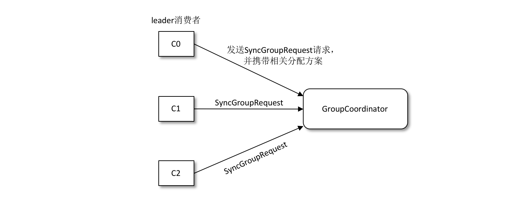

### 第四阶段（HEARTBEAT）[#](https://www.cnblogs.com/luozhiyun/p/11909315.html#77479739)

进入这个阶段之后，消费组中的所有消费者就会处于正常工作状态。在正式消费之前，消费者还需要确定拉取消息的起始位置。假设之前已经将最后的消费位移提交到了 GroupCoordinator，并且 GroupCoordinator 将其保存到了 Kafka 内部的 __consumer_offsets 主题中，此时消费者可以通过 OffsetFetchRequest 请求获取上次提交的消费位移并从此处继续消费。

消费者通过向 GroupCoordinator 发送心跳来维持它们与消费组的从属关系，以及它们对分区的所有权关系。只要消费者以正常的时间间隔发送心跳，就被认为是活跃的，说明它还在读取分区中的消息。心跳线程是一个独立的线程，可以在轮询消息的空档发送心跳。如果消费者停止发送心跳的时间足够长，则整个会话就被判定为过期，GroupCoordinator 也会认为这个消费者已经死亡，就会触发一次再均衡行为。

## Kafka中的幂等是怎么实现的？[#](https://www.cnblogs.com/luozhiyun/p/11909315.html#2207786995)

为了实现生产者的幂等性，Kafka 为此引入了 producer id（以下简称 PID）和序列号（sequence number）这两个概念。

每个新的生产者实例在初始化的时候都会被分配一个 PID，这个 PID 对用户而言是完全透明的。对于每个 PID，消息发送到的每一个分区都有对应的序列号，这些序列号从0开始单调递增。生产者每发送一条消息就会将 <PID，分区> 对应的序列号的值加1。

broker 端会在内存中为每一对 <PID，分区> 维护一个序列号。对于收到的每一条消息，只有当它的序列号的值（SN_new）比 broker 端中维护的对应的序列号的值（SN_old）大1（即 SN_new = SN_old + 1）时，broker 才会接收它。如果 SN_new< SN_old + 1，那么说明消息被重复写入，broker 可以直接将其丢弃。如果 SN_new> SN_old + 1，那么说明中间有数据尚未写入，出现了乱序，暗示可能有消息丢失，对应的生产者会抛出 OutOfOrderSequenceException，这个异常是一个严重的异常，后续的诸如 send()、beginTransaction()、commitTransaction() 等方法的调用都会抛出 IllegalStateException 的异常。

## Kafka中的事务是怎么实现的？[#](https://www.cnblogs.com/luozhiyun/p/12079527.html#3056403840)

Kafka中的事务可以使应用程序将消费消息、生产消息、提交消费位移当作原子操作来处理，同时成功或失败，即使该生产或消费会跨多个分区。

生产者必须提供唯一的transactionalId，启动后请求事务协调器获取一个PID，transactionalId与PID一一对应。

每次发送数据给<Topic, Partition>前，需要先向事务协调器发送AddPartitionsToTxnRequest，事务协调器会将该<Transaction, Topic, Partition>存于__transaction_state内，并将其状态置为BEGIN。

在处理完 AddOffsetsToTxnRequest 之后，生产者还会发送 TxnOffsetCommitRequest 请求给 GroupCoordinator，从而将本次事务中包含的消费位移信息 offsets 存储到主题 __consumer_offsets 中

一旦上述数据写入操作完成，应用程序必须调用KafkaProducer的commitTransaction方法或者abortTransaction方法以结束当前事务。无论调用 commitTransaction() 方法还是 abortTransaction() 方法，生产者都会向 TransactionCoordinator 发送 EndTxnRequest 请求。
TransactionCoordinator 在收到 EndTxnRequest 请求后会执行如下操作：

1. 将 PREPARE_COMMIT 或 PREPARE_ABORT 消息写入主题 __transaction_state
2. 通过 WriteTxnMarkersRequest 请求将 COMMIT 或 ABORT 信息写入用户所使用的普通主题和 __consumer_offsets
3. 将 COMPLETE_COMMIT 或 COMPLETE_ABORT 信息写入内部主题 __transaction_state标明该事务结束

在消费端有一个参数isolation.level，设置为“read_committed”，表示消费端应用不可以看到尚未提交的事务内的消息。如果生产者开启事务并向某个分区值发送3条消息 msg1、msg2 和 msg3，在执行 commitTransaction() 或 abortTransaction() 方法前，设置为“read_committed”的消费端应用是消费不到这些消息的，不过在 KafkaConsumer 内部会缓存这些消息，直到生产者执行 commitTransaction() 方法之后它才能将这些消息推送给消费端应用。反之，如果生产者执行了 abortTransaction() 方法，那么 KafkaConsumer 会将这些缓存的消息丢弃而不推送给消费端应用。

## 失效副本是指什么？有那些应对措施？[#](https://www.cnblogs.com/luozhiyun/p/12079527.html#674921465)

正常情况下，分区的所有副本都处于 ISR 集合中，但是难免会有异常情况发生，从而某些副本被剥离出 ISR 集合中。在 ISR 集合之外，也就是处于同步失效或功能失效（比如副本处于非存活状态）的副本统称为失效副本，失效副本对应的分区也就称为同步失效分区，即 under-replicated 分区。

Kafka 从 0.9.x 版本开始就通过唯一的 broker 端参数 replica.lag.time.max.ms 来抉择，当 ISR 集合中的一个 follower 副本滞后 leader 副本的时间超过此参数指定的值时则判定为同步失败，需要将此 follower 副本剔除出 ISR 集合。replica.lag.time.max.ms 参数的默认值为10000。

在 0.9.x 版本之前，Kafka 中还有另一个参数 replica.lag.max.messages（默认值为4000），它也是用来判定失效副本的，当一个 follower 副本滞后 leader 副本的消息数超过 replica.lag.max.messages 的大小时，则判定它处于同步失效的状态。它与 replica.lag.time.max.ms 参数判定出的失效副本取并集组成一个失效副本的集合，从而进一步剥离出分区的 ISR 集合。

Kafka 源码注释中说明了一般有这几种情况会导致副本失效：

- follower 副本进程卡住，在一段时间内根本没有向 leader 副本发起同步请求，比如频繁的 Full GC。
- follower 副本进程同步过慢，在一段时间内都无法追赶上 leader 副本，比如 I/O 开销过大。
- 如果通过工具增加了副本因子，那么新增加的副本在赶上 leader 副本之前也都是处于失效状态的。
- 如果一个 follower 副本由于某些原因（比如宕机）而下线，之后又上线，在追赶上 leader 副本之前也处于失效状态。

### 应对措施[#](https://www.cnblogs.com/luozhiyun/p/12079527.html#4080390860)

我们用UnderReplicatedPartitions代表leader副本在当前Broker上且具有失效副本的分区的个数。

如果集群中有多个Broker的UnderReplicatedPartitions保持一个大于0的稳定值时，一般暗示着集群中有Broker已经处于下线状态。这种情况下，这个Broker中的分区个数与集群中的所有UnderReplicatedPartitions（处于下线的Broker是不会上报任何指标值的）之和是相等的。通常这类问题是由于机器硬件原因引起的，但也有可能是由于操作系统或者JVM引起的 。

如果集群中存在Broker的UnderReplicatedPartitions频繁变动，或者处于一个稳定的大于0的值（这里特指没有Broker下线的情况）时，一般暗示着集群出现了性能问题，通常这类问题很难诊断，不过我们可以一步一步的将问题的范围缩小，比如先尝试确定这个性能问题是否只存在于集群的某个Broker中，还是整个集群之上。如果确定集群中所有的under-replicated分区都是在单个Broker上，那么可以看出这个Broker出现了问题，进而可以针对这单一的Broker做专项调查，比如：操作系统、GC、网络状态或者磁盘状态（比如：iowait、ioutil等指标）。

## 多副本下，各个副本中的HW和LEO的演变过程[#](https://www.cnblogs.com/luozhiyun/p/12079527.html#1106292578)

某个分区有3个副本分别位于 broker0、broker1 和 broker2 节点中，假设 broker0 上的副本1为当前分区的 leader 副本，那么副本2和副本3就是 follower 副本，整个消息追加的过程可以概括如下：

1. 生产者客户端发送消息至 leader 副本（副本1）中。
2. 消息被追加到 leader 副本的本地日志，并且会更新日志的偏移量。
3. follower 副本（副本2和副本3）向 leader 副本请求同步数据。
4. leader 副本所在的服务器读取本地日志，并更新对应拉取的 follower 副本的信息。
5. leader 副本所在的服务器将拉取结果返回给 follower 副本。
6. follower 副本收到 leader 副本返回的拉取结果，将消息追加到本地日志中，并更新日志的偏移量信息。

某一时刻，leader 副本的 LEO 增加至5，并且所有副本的 HW 还都为0。
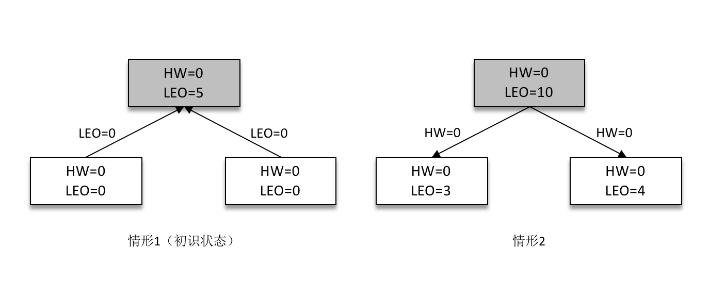

之后 follower 副本（不带阴影的方框）向 leader 副本拉取消息，在拉取的请求中会带有自身的 LEO 信息，这个 LEO 信息对应的是 FetchRequest 请求中的 fetch_offset。leader 副本返回给 follower 副本相应的消息，并且还带有自身的 HW 信息，如上图（右）所示，这个 HW 信息对应的是 FetchResponse 中的 high_watermark。

此时两个 follower 副本各自拉取到了消息，并更新各自的 LEO 为3和4。与此同时，follower 副本还会更新自己的 HW，更新 HW 的算法是比较当前 LEO 和 leader 副本中传送过来的HW的值，取较小值作为自己的 HW 值。当前两个 follower 副本的 HW 都等于0（min(0,0) = 0）。

接下来 follower 副本再次请求拉取 leader 副本中的消息，如下图（左）所示。
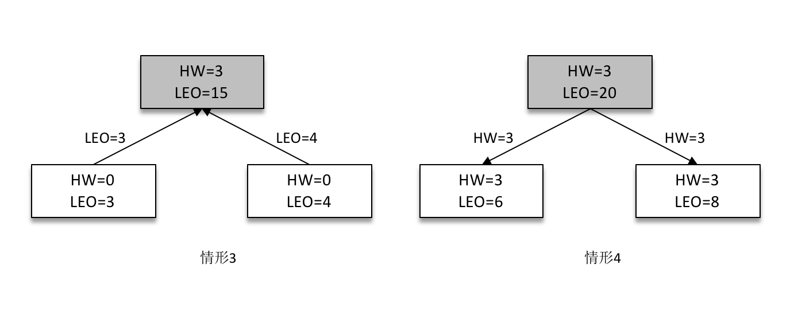
此时 leader 副本收到来自 follower 副本的 FetchRequest 请求，其中带有 LEO 的相关信息，选取其中的最小值作为新的 HW，即 min(15,3,4)=3。然后连同消息和 HW 一起返回 FetchResponse 给 follower 副本，如上图（右）所示。注意 leader 副本的 HW 是一个很重要的东西，因为它直接影响了分区数据对消费者的可见性。

两个 follower 副本在收到新的消息之后更新 LEO 并且更新自己的 HW 为3（min(LEO,3)=3）。

## Kafka在可靠性方面做了哪些改进？（HW, LeaderEpoch）[#](https://www.cnblogs.com/luozhiyun/p/12079527.html#4269081939)

### HW[#](https://www.cnblogs.com/luozhiyun/p/12079527.html#51386862)

HW 是 High Watermark 的缩写，俗称高水位，它标识了一个特定的消息偏移量（offset），消费者只能拉取到这个 offset 之前的消息。

分区 ISR 集合中的每个副本都会维护自身的 LEO，而 ISR 集合中最小的 LEO 即为分区的 HW，对消费者而言只能消费 HW 之前的消息。

### leader epoch[#](https://www.cnblogs.com/luozhiyun/p/12079527.html#2438617132)

leader epoch 代表 leader 的纪元信息（epoch），初始值为0。每当 leader 变更一次，leader epoch 的值就会加1，相当于为 leader 增设了一个版本号。
每个副本中还会增设一个矢量 <LeaderEpoch => StartOffset>，其中 StartOffset 表示当前 LeaderEpoch 下写入的第一条消息的偏移量。

假设有两个节点A和B，B是leader节点，里面的数据如图：
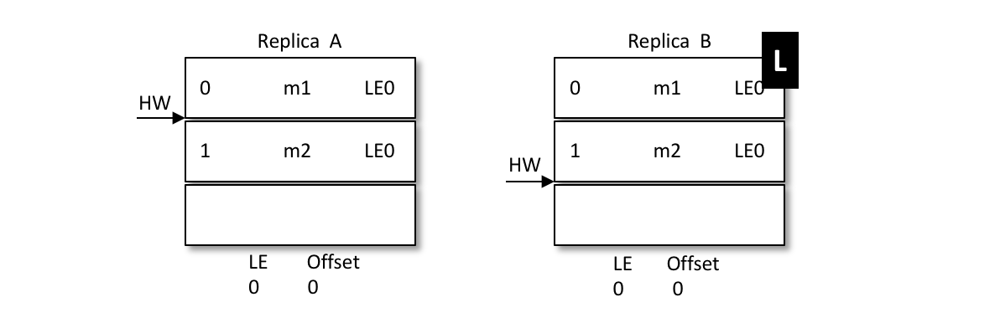

A发生重启，之后A不是先忙着截断日志而是先发送OffsetsForLeaderEpochRequest请求给B，B作为目前的leader，在收到请求之后会返回当前的LEO（LogEndOffset，注意图中LE0和LEO的不同），与请求对应的响应为OffsetsForLeaderEpochResponse。如果 A 中的 LeaderEpoch（假设为 LE_A）和 B 中的不相同，那么 B 此时会查找 LeaderEpoch 为 LE_A+1 对应的 StartOffset 并返回给 A
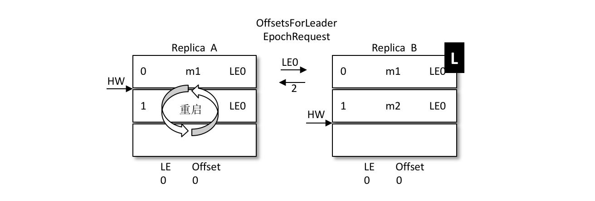

如上图所示，A 在收到2之后发现和目前的 LEO 相同，也就不需要截断日志了，以此来保护数据的完整性。

再如，之后 B 发生了宕机，A 成为新的 leader，那么对应的 LE=0 也变成了 LE=1，对应的消息 m2 此时就得到了保留。后续的消息都可以以 LE1 为 LeaderEpoch 陆续追加到 A 中。这个时候A就会有两个LE，第二个LE所记录的Offset从2开始。如果B恢复了，那么就会从A中获取到LE+1的Offset为2的值返回给B。
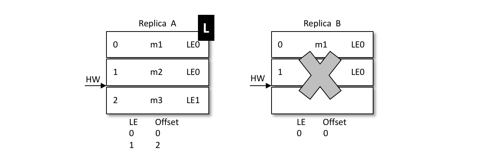

再来看看LE如何解决数据不一致的问题：
当前 A 为 leader，B 为 follower，A 中有2条消息 m1 和 m2，而 B 中有1条消息 m1。假设 A 和 B 同时“挂掉”，然后 B 第一个恢复过来并成为新的 leader。
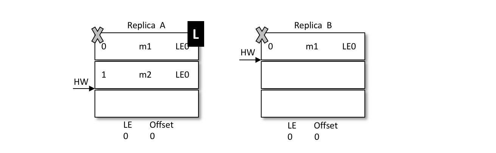

之后 B 写入消息 m3，并将 LEO 和 HW 更新至2，如下图所示。注意此时的 LeaderEpoch 已经从 LE0 增至 LE1 了。
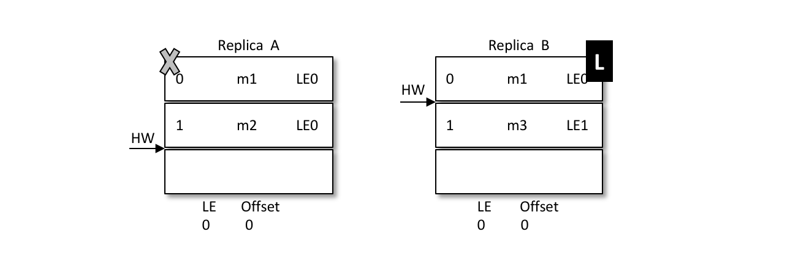

紧接着 A 也恢复过来成为 follower 并向 B 发送 OffsetsForLeaderEpochRequest 请求，此时 A 的 LeaderEpoch 为 LE0。B 根据 LE0 查询到对应的 offset 为1并返回给 A，A 就截断日志并删除了消息 m2，如下图所示。之后 A 发送 FetchRequest 至 B 请求来同步数据，最终A和B中都有两条消息 m1 和 m3，HW 和 LEO都为2，并且 LeaderEpoch 都为 LE1，如此便解决了数据不一致的问题。
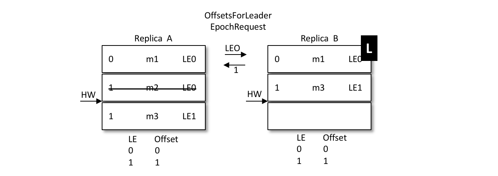

## 为什么Kafka不支持读写分离？[#](https://www.cnblogs.com/luozhiyun/p/12079527.html#3401254661)

因为这样有两个明显的缺点：

1. 数据一致性问题。数据从主节点转到从节点必然会有一个延时的时间窗口，这个时间窗口会导致主从节点之间的数据不一致。
2. 延时问题。数据从写入主节点到同步至从节点中的过程需要经历网络→主节点内存→主节点磁盘→网络→从节点内存→从节点磁盘这几个阶段。对延时敏感的应用而言，主写从读的功能并不太适用。

对于Kafka来说，必要性不是很高，因为在Kafka集群中，如果存在多个副本，经过合理的配置，可以让leader副本均匀的分布在各个broker上面，使每个 broker 上的读写负载都是一样的。

## Kafka中的延迟队列怎么实现[#](https://www.cnblogs.com/luozhiyun/p/12079527.html#2959133211)

在发送延时消息的时候并不是先投递到要发送的真实主题（real_topic）中，而是先投递到一些 Kafka 内部的主题（delay_topic）中，这些内部主题对用户不可见，然后通过一个自定义的服务拉取这些内部主题中的消息，并将满足条件的消息再投递到要发送的真实的主题中，消费者所订阅的还是真实的主题。

如果采用这种方案，那么一般是按照不同的延时等级来划分的，比如设定5s、10s、30s、1min、2min、5min、10min、20min、30min、45min、1hour、2hour这些按延时时间递增的延时等级，延时的消息按照延时时间投递到不同等级的主题中，投递到同一主题中的消息的延时时间会被强转为与此主题延时等级一致的延时时间，这样延时误差控制在两个延时等级的时间差范围之内（比如延时时间为17s的消息投递到30s的延时主题中，之后按照延时时间为30s进行计算，延时误差为13s）。虽然有一定的延时误差，但是误差可控，并且这样只需增加少许的主题就能实现延时队列的功能。
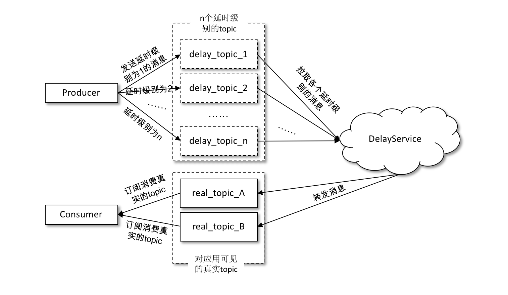

发送到内部主题（delay_topic_*）中的消息会被一个独立的 DelayService 进程消费，这个 DelayService 进程和 Kafka broker 进程以一对一的配比进行同机部署（参考下图），以保证服务的可用性。
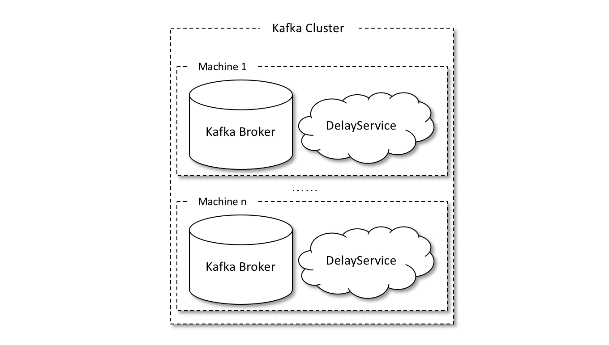

针对不同延时级别的主题，在 DelayService 的内部都会有单独的线程来进行消息的拉取，以及单独的 DelayQueue（这里用的是 JUC 中 DelayQueue）进行消息的暂存。与此同时，在 DelayService 内部还会有专门的消息发送线程来获取 DelayQueue 的消息并转发到真实的主题中。从消费、暂存再到转发，线程之间都是一一对应的关系。如下图所示，DelayService 的设计应当尽量保持简单，避免锁机制产生的隐患。
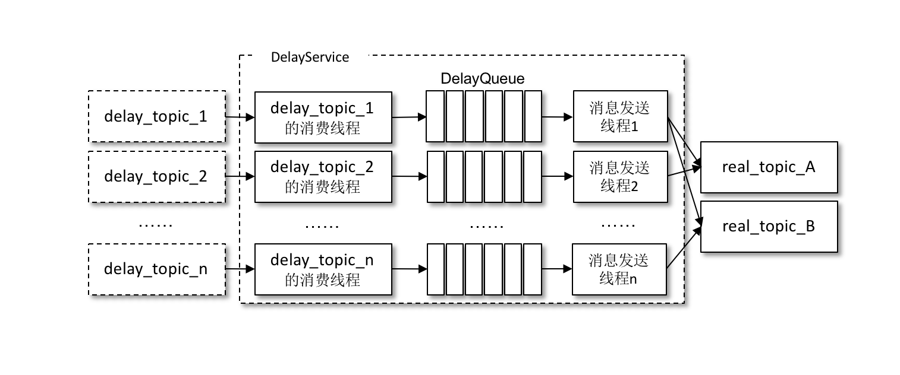

为了保障内部 DelayQueue 不会因为未处理的消息过多而导致内存的占用过大，DelayService 会对主题中的每个分区进行计数，当达到一定的阈值之后，就会暂停拉取该分区中的消息。

因为一个主题中一般不止一个分区，分区之间的消息并不会按照投递时间进行排序，DelayQueue的作用是将消息按照再次投递时间进行有序排序，这样下游的消息发送线程就能够按照先后顺序获取最先满足投递条件的消息。

## Kafka中怎么实现死信队列和重试队列？[#](https://www.cnblogs.com/luozhiyun/p/12079527.html#3110596989)

死信可以看作消费者不能处理收到的消息，也可以看作消费者不想处理收到的消息，还可以看作不符合处理要求的消息。比如消息内包含的消息内容无法被消费者解析，为了确保消息的可靠性而不被随意丢弃，故将其投递到死信队列中，这里的死信就可以看作消费者不能处理的消息。再比如超过既定的重试次数之后将消息投入死信队列，这里就可以将死信看作不符合处理要求的消息。

重试队列其实可以看作一种回退队列，具体指消费端消费消息失败时，为了防止消息无故丢失而重新将消息回滚到 broker 中。与回退队列不同的是，重试队列一般分成多个重试等级，每个重试等级一般也会设置重新投递延时，重试次数越多投递延时就越大。

理解了他们的概念之后我们就可以为每个主题设置重试队列，消息第一次消费失败入重试队列 Q1，Q1 的重新投递延时为5s，5s过后重新投递该消息；如果消息再次消费失败则入重试队列 Q2，Q2 的重新投递延时为10s，10s过后再次投递该消息。

然后再设置一个主题作为死信队列，重试越多次重新投递的时间就越久，并且需要设置一个上限，超过投递次数就进入死信队列。重试队列与延时队列有相同的地方，都需要设置延时级别。

## Kafka中怎么做消息审计？[#](https://www.cnblogs.com/luozhiyun/p/12079527.html#3322750066)

消息审计是指在消息生产、存储和消费的整个过程之间对消息个数及延迟的审计，以此来检测是否有数据丢失、是否有数据重复、端到端的延迟又是多少等内容。

目前与消息审计有关的产品也有多个，比如 Chaperone（Uber）、Confluent Control Center、Kafka Monitor（LinkedIn），它们主要通过在消息体（value 字段）或在消息头（headers 字段）中内嵌消息对应的时间戳 timestamp 或全局的唯一标识 ID（或者是两者兼备）来实现消息的审计功能。

内嵌 timestamp 的方式主要是设置一个审计的时间间隔 time_bucket_interval（可以自定义设置几秒或几分钟），根据这个 time_bucket_interval 和消息所属的 timestamp 来计算相应的时间桶（time_bucket）。

内嵌 ID 的方式就更加容易理解了，对于每一条消息都会被分配一个全局唯一标识 ID。如果主题和相应的分区固定，则可以为每个分区设置一个全局的 ID。当有消息发送时，首先获取对应的 ID，然后内嵌到消息中，最后才将它发送到 broker 中。消费者进行消费审计时，可以判断出哪条消息丢失、哪条消息重复。

## Kafka中怎么做消息轨迹？[#](https://www.cnblogs.com/luozhiyun/p/12079527.html#2002243929)

消息轨迹指的是一条消息从生产者发出，经由 broker 存储，再到消费者消费的整个过程中，各个相关节点的状态、时间、地点等数据汇聚而成的完整链路信息。生产者、broker、消费者这3个角色在处理消息的过程中都会在链路中增加相应的信息，将这些信息汇聚、处理之后就可以查询任意消息的状态，进而为生产环境中的故障排除提供强有力的数据支持。

对消息轨迹而言，最常见的实现方式是封装客户端，在保证正常生产消费的同时添加相应的轨迹信息埋点逻辑。无论生产，还是消费，在执行之后都会有相应的轨迹信息，我们需要将这些信息保存起来。

我们同样可以将轨迹信息保存到 Kafka 的某个主题中，比如下图中的主题 trace_topic。


生产者在将消息正常发送到用户主题 real_topic 之后（或者消费者在拉取到消息消费之后）会将轨迹信息发送到主题 trace_topic 中。

## 怎么计算Lag？(注意read_uncommitted和read_committed状态下的不同)[#](https://www.cnblogs.com/luozhiyun/p/12079527.html#3224537680)

如果消费者客户端的 isolation.level 参数配置为“read_uncommitted”（默认）,它对应的 Lag 等于HW – ConsumerOffset 的值，其中 ConsumerOffset 表示当前的消费位移。

如果这个参数配置为“read_committed”，那么就要引入 LSO 来进行计算了。LSO 是 LastStableOffset 的缩写,它对应的 Lag 等于 LSO – ConsumerOffset 的值。

- 首先通过 DescribeGroupsRequest 请求获取当前消费组的元数据信息，当然在这之前还会通过 FindCoordinatorRequest 请求查找消费组对应的 GroupCoordinator。
- 接着通过 OffsetFetchRequest 请求获取消费位移 ConsumerOffset。
- 然后通过 KafkaConsumer 的 endOffsets(Collection partitions)方法（对应于 ListOffsetRequest 请求）获取 HW（LSO）的值。
- 最后通过 HW 与 ConsumerOffset 相减得到分区的 Lag，要获得主题的总体 Lag 只需对旗下的各个分区累加即可。

## Kafka有哪些指标需要着重关注？[#](https://www.cnblogs.com/luozhiyun/p/12079527.html#892683615)

比较重要的 Broker 端 JMX 指标：

- BytesIn/BytesOut：即 Broker 端每秒入站和出站字节数。你要确保这组值不要接近你的网络带宽，否则这通常都表示网卡已被“打满”，很容易出现网络丢包的情形。
- NetworkProcessorAvgIdlePercent：即网络线程池线程平均的空闲比例。通常来说，你应该确保这个 JMX 值长期大于 30%。如果小于这个值，就表明你的网络线程池非常繁忙，你需要通过增加网络线程数或将负载转移给其他服务器的方式，来给该 Broker 减负。
- RequestHandlerAvgIdlePercent：即 I/O 线程池线程平均的空闲比例。同样地，如果该值长期小于 30%，你需要调整 I/O 线程池的数量，或者减少 Broker 端的负载。
- UnderReplicatedPartitions：即未充分备份的分区数。所谓未充分备份，是指并非所有的 Follower 副本都和 Leader 副本保持同步。一旦出现了这种情况，通常都表明该分区有可能会出现数据丢失。因此，这是一个非常重要的 JMX 指标。
- ISRShrink/ISRExpand：即 ISR 收缩和扩容的频次指标。如果你的环境中出现 ISR 中副本频繁进出的情形，那么这组值一定是很高的。这时，你要诊断下副本频繁进出 ISR 的原因，并采取适当的措施。
- ActiveControllerCount：即当前处于激活状态的控制器的数量。正常情况下，Controller 所在 Broker 上的这个 JMX 指标值应该是 1，其他 Broker 上的这个值是 0。如果你发现存在多台 Broker 上该值都是 1 的情况，一定要赶快处理，处理方式主要是查看网络连通性。这种情况通常表明集群出现了脑裂。脑裂问题是非常严重的分布式故障，Kafka 目前依托 ZooKeeper 来防止脑裂。但一旦出现脑裂，Kafka 是无法保证正常工作的。

## Kafka的那些设计让它有如此高的性能？[#](https://www.cnblogs.com/luozhiyun/p/12079527.html#1921095329)

1.分区
kafka是个分布式集群的系统，整个系统可以包含多个broker，也就是多个服务器实例。每个主题topic会有多个分区，kafka将分区均匀地分配到整个集群中，当生产者向对应主题传递消息，消息通过负载均衡机制传递到不同的分区以减轻单个服务器实例的压力。

一个Consumer Group中可以有多个consumer，多个consumer可以同时消费不同分区的消息，大大的提高了消费者的并行消费能力。但是一个分区中的消息只能被一个Consumer Group中的一个consumer消费。

2.网络传输上减少开销
批量发送：
在发送消息的时候，kafka不会直接将少量数据发送出去，否则每次发送少量的数据会增加网络传输频率，降低网络传输效率。kafka会先将消息缓存在内存中，当超过一个的大小或者超过一定的时间，那么会将这些消息进行批量发送。
端到端压缩：
当然网络传输时数据量小也可以减小网络负载，kafaka会将这些批量的数据进行压缩，将一批消息打包后进行压缩，发送broker服务器后，最终这些数据还是提供给消费者用，所以数据在服务器上还是保持压缩状态，不会进行解压，而且频繁的压缩和解压也会降低性能，最终还是以压缩的方式传递到消费者的手上。

3.顺序读写
kafka将消息追加到日志文件中，利用了磁盘的顺序读写，来提高读写效率。

4.零拷贝技术

零拷贝将文件内容从磁盘通过DMA引擎复制到内核缓冲区，而且没有把数据复制到socket缓冲区，只是将数据位置和长度信息的描述符复制到了socket缓存区，然后直接将数据传输到网络接口，最后发送。这样大大减小了拷贝的次数，提高了效率。kafka正是调用linux系统给出的sendfile系统调用来使用零拷贝。Java中的系统调用给出的是FileChannel.transferTo接口。

5.优秀的文件存储机制
如果分区规则设置得合理，那么所有的消息可以均匀地分布到不同的分区中，这样就可以实现水平扩展。不考虑多副本的情况，一个分区对应一个日志（Log）。为了防止 Log 过大，Kafka 又引入了日志分段（LogSegment）的概念，将 Log 切分为多个 LogSegment，相当于一个巨型文件被平均分配为多个相对较小的文件，这样也便于消息的维护和清理。


Kafka 中的索引文件以稀疏索引（sparse index）的方式构造消息的索引，它并不保证每个消息在索引文件中都有对应的索引项。每当写入一定量（由 broker 端参数 log.index.interval.bytes 指定，默认值为4096，即 4KB）的消息时，偏移量索引文件和时间戳索引文件分别增加一个偏移量索引项和时间戳索引项，增大或减小 log.index.interval.bytes 的值，对应地可以增加或缩小索引项的密度。

# 实战

## 发送大消息

> kafka默认只能发送最大1MB的信息，想发送大消息就需要修改配置。（1048576=1MB）
>
> 1. 修改producer.properties
>
>    max.request.size=10485760
>
>    此处虽然源码读的这里的配置，但是实际发现nifi使用publishKafka，只需要修改Max Request Size，这里不打开配置也不影响，TODO 研究一下，如果springboot整合kafka会不会要修改producer.properties。
>
> 2. 修改server.properties
>
>    message.max.bytes=10485760
>
>    replica.fetch.max.bytes=10485760
>
> 3. 修改topic配置（`topic事先存在时，需要做这步`）
>
>    高版本：
>
>    - 【修改配置】
>
>      ./bin/kafka-configs.sh --bootstrap-server localhost:9092 --topic aa --alter --add-config max.message.bytes=10485760
>
>    - 【查看是否生效】
>
>      ./bin/kafka-topics.sh --bootstrap-server localhost:9092 --topic aa --describe
>
>    低版本：
>
>    - 【修改配置】
>
>      ./bin/kafka-configs.sh --zookeeper localhost:2181 --entity-name aa --entity-type topics --alter --add-config max.message.bytes=10485760
>
>    - 【查看是否生效】
>
>      ./bin/kafka-topics.sh --zookeeper localhost:2181 --entity-name aa --entity-type topics --describe
>
> 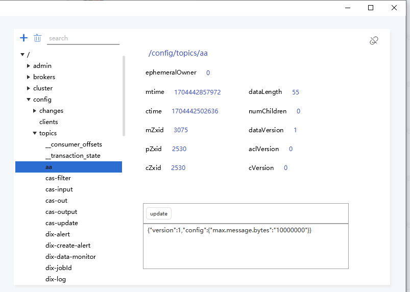

