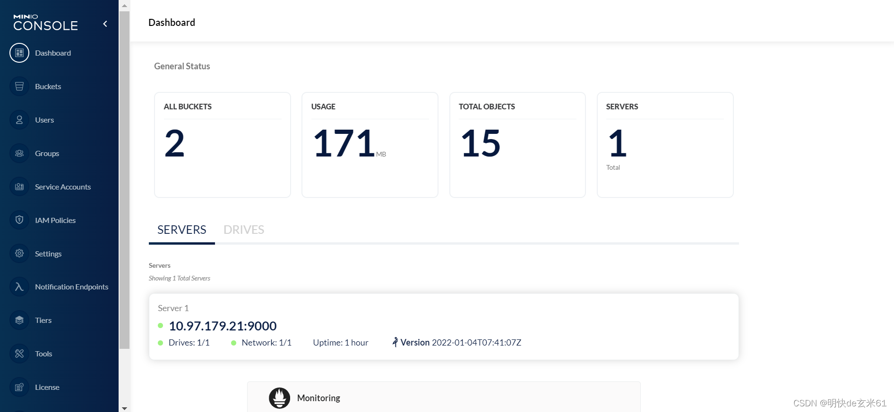

# Minio

## 安装

### k8s安装单机版

（1）创建minio名称空间

```bash
kubectl create ns minio
```

我们下面的yaml文件用到了`minio`名称空间，所以需要先把该名称空间创建出来

（2）minio单机版安装yaml

在安装minio之前，以下几点需要先说明一下

yaml文件内容修改说明：大家只用把写注释的地方改成自己的，其他地方都不用变

安装命令：大家可以把下面yaml文件内容复制到`minio.yaml`中，然后上传到linux中，之后通过`kubectl apply -f minio.yaml`命令来安装`minio`

端口解释：对于端口部分解释一下，`5000`端口是供浏览器访问UI页面的，而`9000`端口是供客户端连接的

访问链接：安装完成之后，可以通过`http://ip:port`来访问minio，其中ip就是虚拟机ip，而端口就是`5000`端口对应的nodePort端口，比如下面yaml文件中的就是`30427`

登录信息：登录用户名和密码需要看yaml文件中的`MINIO_ROOT_USER`和`MINIO_ROOT_PASSWORD`的value值，比如我的就是`admin`和`admin123456`

```bash
apiVersion: apps/v1
kind: StatefulSet
metadata:
  name: minio
  # 名称空间
  namespace: minio
spec:
  # 副本数量，建议1个，集群版可能存在问题
  replicas: 1
  selector:
    matchLabels:
      app: minio
  serviceName: minio
  template:
    metadata:
      labels:
        app: minio
    spec:
      containers:
        - command:
            - /bin/sh
            - -c
            - minio server /data --console-address ":5000"
          env:
            - name: MINIO_ROOT_USER
              # 登录用户名，按照自己的来设置
              value: "admin"
            - name: MINIO_ROOT_PASSWORD
              # 登录密码，按照自己的来设置
              value: "admin123456"
          image: minio/minio:RELEASE.2022-03-22T02-05-10Z
          name: minio
          ports:
            - containerPort: 9000
              name: data
              protocol: TCP
            - containerPort: 5000
              name: console
              protocol: TCP
          volumeMounts:
            - mountPath: /data
              name: data
  volumeClaimTemplates:
    - apiVersion: v1
      kind: PersistentVolumeClaim
      metadata:
        name: data
      spec:
        accessModes:
          - ReadWriteMany
        resources:
          requests:
            # MioIO存储空间大小
            storage: 5Gi
        # nfs动态挂载存储类名称
        storageClassName: "managed-nfs-storage-bakckup"

---
apiVersion: v1
kind: Service
metadata:
  labels:
    app: minio
  name: minio
  namespace: minio
spec:
  ports:
    - name: data
      port: 9000
      protocol: TCP
      targetPort: 9000
      # 暴露端口
      nodePort: 30024
    - name: console
      port: 5000
      protocol: TCP
      targetPort: 5000
      # 暴露端口
      nodePort: 30427
  selector:
    app: minio
  type: NodePort
12345678910111213141516171819202122232425262728293031323334353637383940414243444546474849505152535455565758596061626364656667686970717273747576777879808182
```

登录之后效果如下图：



