# Java

#### 什么是反射？

在运行状态中，对于任意一个类，都能够知道这个类的所有属性和方法，对于任意一个对象，都能够调用它的任意一个方法和属性，这种动态获取的信息以及动态调用对象的方法的功能称为java语言的反射机制。

~~~java
package cn.javaguide;

import java.lang.reflect.Field;
import java.lang.reflect.InvocationTargetException;
import java.lang.reflect.Method;

public class Main {
    public static void main(String[] args) throws ClassNotFoundException, NoSuchMethodException, IllegalAccessException, InstantiationException, InvocationTargetException, NoSuchFieldException {
        /**
         * 获取 TargetObject 类的 Class 对象并且创建 TargetObject 类实例
         */
        Class<?> tagetClass = Class.forName("cn.javaguide.TargetObject");
        TargetObject targetObject = (TargetObject) tagetClass.newInstance();
        /**
         * 获取 TargetObject 类中定义的所有方法
         */
        Method[] methods = targetClass.getDeclaredMethods();
        for (Method method : methods) {
            System.out.println(method.getName());
        }

        /**
         * 获取指定方法并调用
         */
        Method publicMethod = targetClass.getDeclaredMethod("publicMethod",
                String.class);

        publicMethod.invoke(targetObject, "JavaGuide");

        /**
         * 获取指定参数并对参数进行修改
         */
        Field field = targetClass.getDeclaredField("value");
        //为了对类中的参数进行修改我们取消安全检查
        field.setAccessible(true);
        field.set(targetObject, "JavaGuide");

        /**
         * 调用 private 方法
         */
        Method privateMethod = targetClass.getDeclaredMethod("privateMethod");
        //为了调用private方法我们取消安全检查
        privateMethod.setAccessible(true);
        privateMethod.invoke(targetObject);
    }
}
~~~


#### 1.3 说一说你对Java访问权限的了解

**参考答案**

Java语言为我们提供了三种访问修饰符，即private、protected、public，在使用这些修饰符修饰目标时，一共可以形成四种访问权限，即private、defalut、protected、public，注意在不加任何修饰符时为default访问权限。

在修饰成员变量/成员方法时，该成员的四种访问权限的含义如下：

- private：该成员可以被该类内部成员访问；
- defalut：该成员可以被该类内部成员访问，也可以被同一包下其他的类访问；
- protected：该成员可以被该类内部成员访问，也可以被同一包下其他的类访问，还可以被它的子类访问；
- public：该成员可以被任意包下，任意类的成员进行访问。

在修饰类时，该类只有两种访问权限，对应的访问权限的含义如下：

- defalut：该类可以被同一包下其他的类访问；
- public：该类可以被任意包下，任意的类所访问。

#### 1.10 如何对Integer和Double类型判断相等？

**参考答案**

Integer、Double不能直接进行比较，这包括：

- 不能用==进行直接比较，因为它们是不同的数据类型；
- 不能转为字符串进行比较，因为转为字符串后，浮点值带小数点，整数值不带，这样它们永远都不相等；
- 不能使用compareTo方法进行比较，虽然它们都有compareTo方法，但该方法只能对相同类型进行比较。

整数、浮点类型的包装类，都继承于Number类型，而Number类型分别定义了将数字转换为byte、short、int、long、float、double的方法。所以，可以将Integer、Double先转为转换为相同的基本数据类型（如double），然后使用==进行比较。

**示例代码**

```
Integer i = ``100``;``Double d = ``100.00``;``System.out.println(i.doubleValue() == d.doubleValue());
```

#### 1.16 Java中的多态是怎么实现的？

**参考答案**

多态的实现离不开继承，在设计程序时，我们可以将参数的类型定义为父类型。在调用程序时，则可以根据实际情况，传入该父类型的某个子类型的实例，这样就实现了多态。对于父类型，可以有三种形式，即普通的类、抽象类、接口。对于子类型，则要根据它自身的特征，重写父类的某些方法，或实现抽象类/接口的某些抽象方法。

#### 1.17 Java为什么是单继承，为什么不能多继承？

**参考答案**

首先，Java是单继承的，指的是Java中一个类只能有一个直接的父类。Java不能多继承，则是说Java中一个类不能直接继承多个父类。

其次，Java在设计时借鉴了C++的语法，而C++是支持多继承的。Java语言之所以摒弃了多继承的这项特征，是因为多继承容易产生混淆。比如，两个父类中包含相同的方法时，子类在调用该方法或重写该方法时就会迷惑。

准确来说，Java是可以实现"多继承"的。因为尽管一个类只能有一个直接父类，但是却可以有任意多个间接的父类。这样的设计方式，避免了多继承时所产生的混淆。

#### 接口和抽象类的区别是什么？

首先，抽象类是类，所有它有构造方法和普通的变量和方法（private、protected、public），而接口没有构造方法，接口只能有public的变量和public static方法。但是他两都不能实例化。

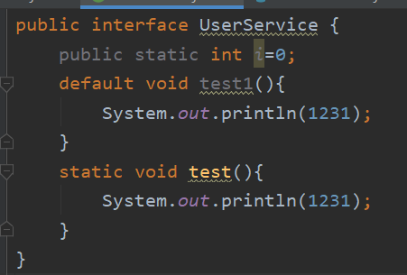


#### Java中的内部类

静态内部类：调用静态内部类通过“外部类.静态内部类”

局部内部类：方法中的类。

匿名内部类：没有class名字，直接new 实现里面的方法，比如sort()

成员内部类:和public class平齐

#### 1.29 说一说你对字符串拼接的理解

**参考答案**

拼接字符串有很多种方式，其中最常用的有4种，下面列举了这4种方式各自适合的场景。

1. `+` 运算符：如果拼接的都是字符串直接量，则适合使用 `+` 运算符实现拼接；
2. StringBuilder：如果拼接的字符串中包含变量，并不要求线程安全，则适合使用StringBuilder；
3. StringBuffer：如果拼接的字符串中包含变量，并且要求线程安全，则适合使用StringBuffer；
4. String类的concat方法：如果只是对两个字符串进行拼接，并且包含变量，则适合使用concat方法；

**扩展阅读**

采用 `+` 运算符拼接字符串时：

- 如果拼接的都是字符串直接量，则在编译时编译器会将其直接优化为一个完整的字符串，和你直接写一个完整的字符串是一样的，所以效率非常的高。
- 如果拼接的字符串中包含变量，则在编译时编译器采用StringBuilder对其进行优化，即自动创建StringBuilder实例并调用其append()方法，将这些字符串拼接在一起，效率也很高。但如果这个拼接操作是在循环中进行的，那么每次循环编译器都会创建一个StringBuilder实例，再去拼接字符串，相当于执行了 `new StringBuilder().append(str)`，所以此时效率很低。

采用StringBuilder/StringBuffer拼接字符串时：

- StringBuilder/StringBuffer都有字符串缓冲区，缓冲区的容量在创建对象时确定，并且默认为16。当拼接的字符串超过缓冲区的容量时，会触发缓冲区的扩容机制，即缓冲区加倍。
- 缓冲区频繁的扩容会降低拼接的性能，所以如果能提前预估最终字符串的长度，则建议在创建可变字符串对象时，放弃使用默认的容量，可以指定缓冲区的容量为预估的字符串的长度。

采用String类的concat方法拼接字符串时：

- concat方法的拼接逻辑是，先创建一个足以容纳待拼接的两个字符串的字节数组，然后先后将两个字符串拼到这个数组里，最后将此数组转换为字符串。
- 在拼接大量字符串的时候，concat方法的效率低于StringBuilder。但是只拼接2个字符串时，concat方法的效率要优于StringBuilder。并且这种拼接方式代码简洁，所以只拼2个字符串时建议优先选择concat方法。

#### 1.36 遇到过异常吗，如何处理？

**参考答案**

在Java中，可以按照如下三个步骤处理异常：

1. 捕获异常

   将业务代码包裹在try块内部，当业务代码中发生任何异常时，系统都会为此异常创建一个异常对象。创建异常对象之后，JVM会在try块之后寻找可以处理它的catch块，并将异常对象交给这个catch块处理。

2. 处理异常

   在catch块中处理异常时，应该先记录日志，便于以后追溯这个异常。然后根据异常的类型、结合当前的业务情况，进行相应的处理。比如，给变量赋予一个默认值、直接返回空值、向外抛出一个新的业务异常交给调用者处理，等等。

3. 回收资源

   如果业务代码打开了某个资源，比如数据库连接、网络连接、磁盘文件等，则需要在这段业务代码执行完毕后关闭这项资源。并且，无论是否发生异常，都要尝试关闭这项资源。将关闭资源的代码写在finally块内，可以满足这种需求，即无论是否发生异常，finally块内的代码总会被执行。

#### 1.37 说一说Java的异常机制

**参考答案**

关于异常处理：

在Java中，处理异常的语句由try、catch、finally三部分组成。其中，try块用于包裹业务代码，catch块用于捕获并处理某个类型的异常，finally块则用于回收资源。当业务代码发生异常时，系统会创建一个异常对象，然后由JVM寻找可以处理这个异常的catch块，并将异常对象交给这个catch块处理。若业务代码打开了某项资源，则可以在finally块中关闭这项资源，因为无论是否发生异常，finally块一定会执行。

关于抛出异常：

当程序出现错误时，系统会自动抛出异常。除此以外，Java也允许程序主动抛出异常。当业务代码中，判断某项错误的条件成立时，可以使用throw关键字向外抛出异常。在这种情况下，如果当前方法不知道该如何处理这个异常，可以在方法签名上通过throws关键字声明抛出异常，则该异常将交给JVM处理。

关于异常跟踪栈：

程序运行时，经常会发生一系列方法调用，从而形成方法调用栈。异常机制会导致异常在这些方法之间传播，而异常传播的顺序与方法的调用相反。异常从发生异常的方法向外传播，首先传给该方法的调用者，再传给上层调用者，以此类推。最终会传到main方法，若依然没有得到处理，则JVM会终止程序，并打印异常跟踪栈的信息

#### 1.41 说一说你对static关键字的理解

**参考答案**

在Java类里只能包含成员变量、方法、构造器、初始化块、内部类（包括接口、枚举）5种成员，而static可以修饰成员变量、方法、初始化块、内部类（包括接口、枚举），以static修饰的成员就是类成员。类成员属于整个类，而不属于单个对象。

对static关键字而言，有一条非常重要的规则：类成员（包括成员变量、方法、初始化块、内部类和内部枚举）不能访问实例成员（包括成员变量、方法、初始化块、内部类和内部枚举）。因为类成员是属于类的，类成员的作用域比实例成员的作用域更大，完全可能出现类成员已经初始化完成，但实例成员还不曾初始化的情况，如果允许类成员访问实例成员将会引起大量错误。

#### 1.42 static修饰的类能不能被继承？

**参考答案**

static修饰的类可以被继承。

**扩展阅读**

如果使用static来修饰一个内部类，则这个内部类就属于外部类本身，而不属于外部类的某个对象。因此使用static修饰的内部类被称为类内部类，有的地方也称为静态内部类。

static关键字的作用是把类的成员变成类相关，而不是实例相关，即static修饰的成员属于整个类，而不属于单个对象。外部类的上一级程序单元是包，所以不可使用static修饰；而内部类的上一级程序单元是外部类，使用static修饰可以将内部类变成外部类相关，而不是外部类实例相关。因此static关键字不可修饰外部类，但可修饰内部类。

静态内部类需满足如下规则：

1. 静态内部类可以包含静态成员，也可以包含非静态成员；

2. 静态内部类不能访问外部类的实例成员，只能访问它的静态成员；

3. 外部类的所有方法、初始化块都能访问其内部定义的静态内部类；

4. 在外部类的外部，也可以实例化静态内部类，语法如下：

   `外部类.内部类 变量名 = ``new` `外部类.内部类构造方法();`

#### 1.46 List<? super T>和List<? extends T>有什么区别？

**参考答案**

- ? 是类型通配符，`List<?>` 可以表示各种泛型List的父类，意思是元素类型未知的List；
- `List<? super T>` 用于设定类型通配符的下限，此处 ? 代表一个未知的类型，但它必须是T的父类型；
- `List<? extends T>` 用于设定类型通配符的上限，此处 ? 代表一个未知的类型，但它必须是T的子类型。

**扩展阅读**

在Java的早期设计中，允许把Integer[]数组赋值给Number[]变量，此时如果试图把一个Double对象保存到该Number[]数组中，编译可以通过，但在运行时抛出ArrayStoreException异常。这显然是一种不安全的设计，因此Java在泛型设计时进行了改进，它不再允许把 `List<Integer>` 对象赋值给 `List<Number>` 变量。

数组和泛型有所不同，假设Foo是Bar的一个子类型（子类或者子接口），那么Foo[]依然是Bar[]的子类型，但`G<Foo>` 不是 `G<Bar>` 的子类型。Foo[]自动向上转型为Bar[]的方式被称为型变，也就是说，Java的数组支持型变，但Java集合并不支持型变。Java泛型的设计原则是，只要代码在编译时没有出现警告，就不会遇到运行时ClassCastException异常。

#### 1.47 说一说你对Java反射机制的理解

**参考答案**

Java程序中的对象在运行时可以表现为两种类型，即编译时类型和运行时类型。例如 `Person p = new Student();` ，这行代码将会生成一个p变量，该变量的编译时类型为Person，运行时类型为Student。

有时，程序在运行时接收到外部传入的一个对象，该对象的编译时类型是Object，但程序又需要调用该对象的运行时类型的方法。这就要求程序需要在运行时发现对象和类的真实信息，而解决这个问题有以下两种做法：

- 第一种做法是假设在编译时和运行时都完全知道类型的具体信息，在这种情况下，可以先使用instanceof运算符进行判断，再利用强制类型转换将其转换成其运行时类型的变量即可。
- 第二种做法是编译时根本无法预知该对象和类可能属于哪些类，程序只依靠运行时信息来发现该对象和类的真实信息，这就必须使用反射。

具体来说，通过反射机制，我们可以实现如下的操作：

- 程序运行时，可以通过反射获得任意一个类的Class对象，并通过这个对象查看这个类的信息；
- 程序运行时，可以通过反射创建任意一个类的实例，并访问该实例的成员；
- 程序运行时，可以通过反射机制生成一个类的动态代理类或动态代理对象。

#### 1.48 Java反射在实际项目中有哪些应用场景？

**参考答案**

Java的反射机制在实际项目中应用广泛，常见的应用场景有：

- 使用JDBC时，如果要创建数据库的连接，则需要先通过反射机制加载数据库的驱动程序；
- 多数框架都支持注解/XML配置，从配置中解析出来的类是字符串，需要利用反射机制实例化；
- 面向切面编程（AOP）的实现方案，是在程序运行时创建目标对象的代理类，这必须由反射机制来实现。


**虚引用**：虚引用完全类似于没有引用。虚引用对对象本身没有太大影响，对象甚至感觉不到虚引用的存在。如果一个对象只有一个虚引用时，那么它和没有引用的效果大致相同。虚引用主要用于跟踪对象被垃圾回收的状态，虚引用不能单独使用，虚引用必须和引用队列联合使用。

#### 2.18 ConcurrentHashMap是怎么分段分组的？

**参考答案**

get操作：

Segment的get操作实现非常简单和高效，先经过一次再散列，然后使用这个散列值通过散列运算定位到 Segment，再通过散列算法定位到元素。get操作的高效之处在于整个get过程都不需要加锁，除非读到空的值才会加锁重读。原因就是将使用的共享变量定义成 `volatile` 类型。

put操作：

当执行put操作时，会经历两个步骤：

1. 判断是否需要扩容；
2. 定位到添加元素的位置，将其放入 HashEntry 数组中。

插入过程会进行第一次 key 的 hash 来定位 Segment 的位置，如果该 Segment 还没有初始化，即通过 CAS 操作进行赋值，然后进行第二次 hash 操作，找到相应的 HashEntry 的位置，这里会利用继承过来的锁的特性，在将数据插入指定的 HashEntry 位置时（尾插法），会通过继承 ReentrantLock 的 `tryLock()` 方法尝试去获取锁，如果获取成功就直接插入相应的位置，如果已经有线程获取该Segment的锁，那当前线程会以自旋的方式去继续的调用 `tryLock()` 方法去获取锁，超过指定次数就挂起，等待唤醒。

#### 2.27 谈谈CopyOnWriteArrayList的原理

**参考答案**

CopyOnWriteArrayList是Java并发包里提供的并发类，简单来说它就是一个线程安全且读操作无锁的ArrayList。正如其名字一样，在写操作时会复制一份新的List，在新的List上完成写操作，然后再将原引用指向新的List。这样就保证了写操作的线程安全。

CopyOnWriteArrayList允许线程并发访问读操作，这个时候是没有加锁限制的，性能较高。而写操作的时候，则首先将容器复制一份，然后在新的副本上执行写操作，这个时候写操作是上锁的。结束之后再将原容器的引用指向新容器。注意，在上锁执行写操作的过程中，如果有需要读操作，会作用在原容器上。因此上锁的写操作不会影响到并发访问的读操作。

- 优点：读操作性能很高，因为无需任何同步措施，比较适用于读多写少的并发场景。在遍历传统的List时，若中途有别的线程对其进行修改，则会抛出ConcurrentModificationException异常。而CopyOnWriteArrayList由于其"读写分离"的思想，遍历和修改操作分别作用在不同的List容器，所以在使用迭代器进行遍历时候，也就不会抛出ConcurrentModificationException异常了。
- 缺点：一是内存占用问题，毕竟每次执行写操作都要将原容器拷贝一份，数据量大时，对内存压力较大，可能会引起频繁GC。二是无法保证实时性，Vector对于读写操作均加锁同步，可以保证读和写的强一致性。而CopyOnWriteArrayList由于其实现策略的原因，写和读分别作用在新老不同容器上，在写操作执行过程中，读不会阻塞但读取到的却是老容器的数据。

#### 2.28 说一说TreeSet和HashSet的区别

**参考答案**

HashSet、TreeSet中的元素都是不能重复的，并且它们都是线程不安全的，二者的区别是：

1. HashSet中的元素可以是null，但TreeSet中的元素不能是null；
2. HashSet不能保证元素的排列顺序，而TreeSet支持自然排序、定制排序两种排序的方式；
3. HashSet底层是采用哈希表实现的，而TreeSet底层是采用红黑树实现的。

#### 4.7 说一说Java多线程之间的通信方式

**参考答案**

在Java中线程通信主要有以下三种方式：

1. wait()、notify()、notifyAll()

   如果线程之间采用synchronized来保证线程安全，则可以利用wait()、notify()、notifyAll()来实现线程通信。这三个方法都不是Thread类中所声明的方法，而是Object类中声明的方法。原因是每个对象都拥有锁，所以让当前线程等待某个对象的锁，当然应该通过这个对象来操作。并且因为当前线程可能会等待多个线程的锁，如果通过线程来操作，就非常复杂了。另外，这三个方法都是本地方法，并且被final修饰，无法被重写。

   每个锁对象都有两个队列，一个是就绪队列，一个是阻塞队列。当一个阻塞线程被唤醒后，才会进入就绪队列，进而等待CPU的调度。反之，当一个线程被wait后，就会进入阻塞队列，等待被唤醒。

2. await()、signal()、signalAll()

   相比使用wait+notify，使用Condition的await+signal这种方式能够更加安全和高效地实现线程间协作。

3. BlockingQueue

   程序的两个线程通过交替向BlockingQueue中放入元素、取出元素，即可很好地控制线程的通信。线程之间需要通信，最经典的场景就是生产者与消费者模型，而BlockingQueue就是针对该模型提供的解决方案。

#### 4.6 如何实现线程同步？

**参考答案**

1. 同步方法

2. 同步代码块

3. ReentrantLock

   Java 5新增了一个java.util.concurrent包来支持同步，其中ReentrantLock类是可重入、互斥、实现了Lock接口的锁，它与使用synchronized方法和快具有相同的基本行为和语义，并且扩展了其能力。需要注意的是，ReentrantLock还有一个可以创建公平锁的构造方法，但由于能大幅度降低程序运行效率，因此不推荐使用。

4. volatile

5. 原子变量

#### 4.13 说一说synchronized与Lock的区别

**参考答案**

1. synchronized是Java关键字，在JVM层面实现加锁和解锁；Lock是一个接口，在代码层面实现加锁和解锁。
2. synchronized可以用在代码块上、方法上；Lock只能写在代码里。
3. synchronized在代码执行完或出现异常时自动释放锁；Lock不会自动释放锁，需要在finally中显示释放锁。
4. synchronized会导致线程拿不到锁一直等待；Lock可以设置获取锁失败的超时时间。
5. synchronized无法得知是否获取锁成功；Lock则可以通过tryLock得知加锁是否成功。
6. synchronized锁可重入、不可中断、非公平；Lock锁可重入、可中断、可公平/不公平，并可以细分读写锁以提高效率。

- **等待可中断** : `ReentrantLock`提供了一种能够中断等待锁的线程的机制，通过 `lock.lockInterruptibly()` 来实现这个机制。也就是说正在等待的线程可以选择放弃等待，改为处理其他事情。
- **可实现公平锁** : `ReentrantLock`可以指定是公平锁还是非公平锁。而`synchronized`只能是非公平锁。所谓的公平锁就是先等待的线程先获得锁。`ReentrantLock`默认情况是非公平的，可以通过 `ReentrantLock`类的`ReentrantLock(boolean fair)`构造方法来制定是否是公平的。
- **可实现选择性通知（锁可以绑定多个条件）**: `synchronized`关键字与`wait()`和`notify()`/`notifyAll()`方法相结合可以实现等待/通知机制。`ReentrantLock`类当然也可以实现，但是需要借助于`Condition`接口与`newCondition()`方法。

> `Condition`是 JDK1.5 之后才有的，它具有很好的灵活性，比如可以实现多路通知功能也就是在一个`Lock`对象中可以创建多个`Condition`实例（即对象监视器），**线程对象可以注册在指定的`Condition`中，从而可以有选择性的进行线程通知，在调度线程上更加灵活。 在使用`notify()/notifyAll()`方法进行通知时，被通知的线程是由 JVM 选择的，用`ReentrantLock`类结合`Condition`实例可以实现“选择性通知”** ，这个功能非常重要，而且是 Condition 接口默认提供的。而`synchronized`关键字就相当于整个 Lock 对象中只有一个`Condition`实例，所有的线程都注册在它一个身上。如果执行`notifyAll()`方法的话就会通知所有处于等待状态的线程这样会造成很大的效率问题，而`Condition`实例的`signalAll()`方法 只会唤醒注册在该`Condition`实例中的所有等待线程。

#### 4.14 说一说synchronized的底层实现原理

**参考答案**

一、以下列代码为例，说明同步代码块的底层实现原理：

```
public` `class` `SynchronizedDemo {``  ``public` `void` `method() {``    ``synchronized` `(``this``) {``      ``System.out.println(``"Method 1 start"``);``    ``}``  ``}``}
```

查看反编译后结果，如下图：


可见，synchronized作用在代码块时，它的底层是通过monitorenter、monitorexit指令来实现的。

- monitorenter：

  每个对象都是一个监视器锁（monitor），当monitor被占用时就会处于锁定状态，线程执行monitorenter指令时尝试获取monitor的所有权，过程如下：

  如果monitor的进入数为0，则该线程进入monitor，然后将进入数设置为1，该线程即为monitor的所有者。如果线程已经占有该monitor，只是重新进入，则进入monitor的进入数加1。如果其他线程已经占用了monitor，则该线程进入阻塞状态，直到monitor的进入数为0，再重新尝试获取monitor的所有权。

- monitorexit：

  执行monitorexit的线程必须是objectref所对应的monitor持有者。指令执行时，monitor的进入数减1，如果减1后进入数为0，那线程退出monitor，不再是这个monitor的所有者。其他被这个monitor阻塞的线程可以尝试去获取这个monitor的所有权。

  monitorexit指令出现了两次，第1次为同步正常退出释放锁，第2次为发生异步退出释放锁。

二、以下列代码为例，说明同步方法的底层实现原理：

```
public` `class` `SynchronizedMethod {``  ``public` `synchronized` `void` `method() {``    ``System.out.println(``"Hello World!"``);``  ``}``}
```

查看反编译后结果，如下图：


从反编译的结果来看，方法的同步并没有通过 monitorenter 和 monitorexit 指令来完成，不过相对于普通方法，其常量池中多了 ACC_SYNCHRONIZED 标示符。JVM就是根据该标示符来实现方法的同步的：

当方法调用时，调用指令将会检查方法的 ACC_SYNCHRONIZED 访问标志是否被设置，如果设置了，执行线程将先获取monitor，获取成功之后才能执行方法体，方法执行完后再释放monitor。在方法执行期间，其他任何线程都无法再获得同一个monitor对象。

三、总结

两种同步方式本质上没有区别，只是方法的同步是一种隐式的方式来实现，无需通过字节码来完成。两个指令的执行是JVM通过调用操作系统的互斥原语mutex来实现，被阻塞的线程会被挂起、等待重新调度，会导致“用户态和内核态”两个态之间来回切换，对性能有较大影响。

#### 4.20 了解Java中的锁升级吗？

**参考答案**

JDK 1.6之前，synchronized 还是一个重量级锁，是一个效率比较低下的锁。但是在JDK 1.6后，JVM为了提高锁的获取与释放效率对synchronized 进行了优化，引入了偏向锁和轻量级锁 ，从此以后锁的状态就有了四种：无锁、偏向锁、轻量级锁、重量级锁。并且四种状态会随着竞争的情况逐渐升级，而且是不可逆的过程，即不可降级，这四种锁的级别由低到高依次是：无锁、偏向锁，轻量级锁，重量级锁。如下图所示：

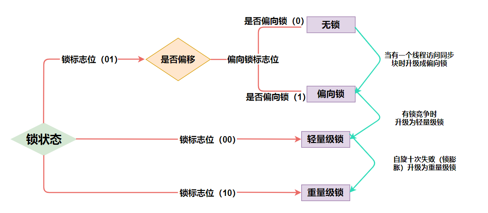

1. 无锁

   无锁是指没有对资源进行锁定，所有的线程都能访问并修改同一个资源，但同时只有一个线程能修改成功。无锁的特点是修改操作会在循环内进行，线程会不断的尝试修改共享资源。如果没有冲突就修改成功并退出，否则就会继续循环尝试。如果有多个线程修改同一个值，必定会有一个线程能修改成功，而其他修改失败的线程会不断重试直到修改成功。

2. 偏向锁

   初次执行到synchronized代码块的时候，锁对象变成偏向锁（通过CAS修改对象头里的锁标志位），字面意思是“偏向于第一个获得它的线程”的锁。执行完同步代码块后，线程并不会主动释放偏向锁。当第二次到达同步代码块时，线程会判断此时持有锁的线程是否就是自己（持有锁的线程ID也在对象头里），如果是则正常往下执行。由于之前没有释放锁，这里也就不需要重新加锁。如果自始至终使用锁的线程只有一个，很明显偏向锁几乎没有额外开销，性能极高。

   偏向锁是指当一段同步代码一直被同一个线程所访问时，即不存在多个线程的竞争时，那么该线程在后续访问时便会自动获得锁，从而降低获取锁带来的消耗，即提高性能。

   当一个线程访问同步代码块并获取锁时，会在 Mark Word 里存储锁偏向的线程 ID。在线程进入和退出同步块时不再通过 CAS 操作来加锁和解锁，而是检测 Mark Word 里是否存储着指向当前线程的偏向锁。轻量级锁的获取及释放依赖多次 CAS 原子指令，而偏向锁只需要在置换 ThreadID 的时候依赖一次 CAS 原子指令即可。

   偏向锁只有遇到其他线程尝试竞争偏向锁时，持有偏向锁的线程才会释放锁，线程是不会主动释放偏向锁的。关于偏向锁的撤销，需要等待全局安全点，即在某个时间点上没有字节码正在执行时，它会先暂停拥有偏向锁的线程，然后判断锁对象是否处于被锁定状态。如果线程不处于活动状态，则将对象头设置成无锁状态，并撤销偏向锁，恢复到无锁（标志位为01）或轻量级锁（标志位为00）的状态。

3. 轻量级锁

   轻量级锁是指当锁是偏向锁的时候，却被另外的线程所访问，此时偏向锁就会升级为轻量级锁，其他线程会通过自旋的形式尝试获取锁，线程不会阻塞，从而提高性能。

   轻量级锁的获取主要由两种情况：

   1. 当关闭偏向锁功能时；
   2. 由于多个线程竞争偏向锁导致偏向锁升级为轻量级锁。

   一旦有第二个线程加入锁竞争，偏向锁就升级为轻量级锁（自旋锁）。这里要明确一下什么是锁竞争：如果多个线程轮流获取一个锁，但是每次获取锁的时候都很顺利，没有发生阻塞，那么就不存在锁竞争。只有当某线程尝试获取锁的时候，发现该锁已经被占用，只能等待其释放，这才发生了锁竞争。

   在轻量级锁状态下继续锁竞争，没有抢到锁的线程将自旋，即不停地循环判断锁是否能够被成功获取。获取锁的操作，其实就是通过CAS修改对象头里的锁标志位。先比较当前锁标志位是否为“释放”，如果是则将其设置为“锁定”，比较并设置是原子性发生的。这就算抢到锁了，然后线程将当前锁的持有者信息修改为自己。

   长时间的自旋操作是非常消耗资源的，一个线程持有锁，其他线程就只能在原地空耗CPU，执行不了任何有效的任务，这种现象叫做忙等（busy-waiting）。如果多个线程用一个锁，但是没有发生锁竞争，或者发生了很轻微的锁竞争，那么synchronized就用轻量级锁，允许短时间的忙等现象。这是一种折衷的想法，短时间的忙等，换取线程在用户态和内核态之间切换的开销。

4. 重量级锁

   重量级锁显然，此忙等是有限度的（有个计数器记录自旋次数，默认允许循环10次，可以通过虚拟机参数更改）。如果锁竞争情况严重，某个达到最大自旋次数的线程，会将轻量级锁升级为重量级锁（依然是CAS修改锁标志位，但不修改持有锁的线程ID）。当后续线程尝试获取锁时，发现被占用的锁是重量级锁，则直接将自己挂起（而不是忙等），等待将来被唤醒。

   重量级锁是指当有一个线程获取锁之后，其余所有等待获取该锁的线程都会处于阻塞状态。简言之，就是所有的控制权都交给了操作系统，由操作系统来负责线程间的调度和线程的状态变更。而这样会出现频繁地对线程运行状态的切换，线程的挂起和唤醒，从而消耗大量的系统资。

**扩展阅读**

synchronized 用的锁是存在Java对象头里的，那么什么是对象头呢？我们以 Hotspot 虚拟机为例进行说明，Hopspot 对象头主要包括两部分数据：Mark Word（标记字段） 和 Klass Pointer（类型指针）。

- Mark Word：默认存储对象的HashCode，分代年龄和锁标志位信息。这些信息都是与对象自身定义无关的数据，所以Mark Word被设计成一个非固定的数据结构以便在极小的空间内存存储尽量多的数据。它会根据对象的状态复用自己的存储空间，也就是在运行期间Mark Word里存储的数据会随着锁标志位的变化而变化。
- Klass Point：对象指向它的类元数据的指针，虚拟机通过这个指针来确定这个对象是哪个类的实例。

那么，synchronized 具体是存在对象头哪里呢？答案是：存在锁对象的对象头的Mark Word中，那么MarkWord在对象头中到底长什么样，它到底存储了什么呢？

在64位的虚拟机中：


在32位的虚拟机中：


下面我们以 32位虚拟机为例，来看一下其 Mark Word 的字节具体是如何分配的：

- 无锁 ：对象头开辟 25bit 的空间用来存储对象的 hashcode ，4bit 用于存放对象分代年龄，1bit 用来存放是否偏向锁的标识位，2bit 用来存放锁标识位为01。
- 偏向锁： 在偏向锁中划分更细，还是开辟 25bit 的空间，其中23bit 用来存放线程ID，2bit 用来存放 Epoch，4bit 存放对象分代年龄，1bit 存放是否偏向锁标识， 0表示无锁，1表示偏向锁，锁的标识位还是01。
- 轻量级锁：在轻量级锁中直接开辟 30bit 的空间存放指向栈中锁记录的指针，2bit 存放锁的标志位，其标志位为00。
- 重量级锁： 在重量级锁中和轻量级锁一样，30bit 的空间用来存放指向重量级锁的指针，2bit 存放锁的标识位，为11。
- GC标记： 开辟30bit 的内存空间却没有占用，2bit 空间存放锁标志位为11。

其中无锁和偏向锁的锁标志位都是01，只是在前面的1bit区分了这是无锁状态还是偏向锁状态。关于内存的分配，我们可以在git中openJDK中 markOop.hpp 可以看出：

```
public``:`` ``// Constants`` ``enum` `{ age_bits     = ``4``,``     ``lock_bits     = ``2``,``     ``biased_lock_bits = ``1``,``     ``max_hash_bits   = BitsPerWord - age_bits - lock_bits - biased_lock_bits,``     ``hash_bits     = max_hash_bits > ``31` `? ``31` `: max_hash_bits,``     ``cms_bits     = LP64_ONLY(``1``) NOT_LP64(``0``),``     ``epoch_bits    = ``2`` ``};
```

- age_bits： 就是我们说的分代回收的标识，占用4字节。
- lock_bits： 是锁的标志位，占用2个字节。
- biased_lock_bits： 是是否偏向锁的标识，占用1个字节。
- max_hash_bits： 是针对无锁计算的hashcode 占用字节数量，如果是32位虚拟机，就是 32 - 4 - 2 -1 = 25 byte，如果是64 位虚拟机，64 - 4 - 2 - 1 = 57 byte，但是会有 25 字节未使用，所以64位的 hashcode 占用 31 byte。
- hash_bits： 是针对 64 位虚拟机来说，如果最大字节数大于 31，则取31，否则取真实的字节数。
- cms_bits： 不是64位虚拟机就占用 0 byte，是64位就占用 1byte。
- epoch_bits： 就是 epoch 所占用的字节大小，2字节。

#### 4.23 说说你对读写锁的了解

**参考答案**

与传统锁不同的是读写锁的规则是可以共享读，但只能一个写，总结起来为：读读不互斥、读写互斥、写写互斥，而一般的独占锁是：读读互斥、读写互斥、写写互斥，而场景中往往读远远大于写，读写锁就是为了这种优化而创建出来的一种机制。
注意是读远远大于写，一般情况下独占锁的效率低来源于高并发下对临界区的激烈竞争导致线程上下文切换。因此当并发不是很高的情况下，读写锁由于需要额外维护读锁的状态，可能还不如独占锁的效率高。因此需要根据实际情况选择使用。

在Java中`ReadWriteLock`的主要实现为`ReentrantReadWriteLock`，其提供了以下特性：

1. 公平性选择：支持公平与非公平（默认）的锁获取方式，吞吐量非公平优先于公平。
2. 可重入：读线程获取读锁之后可以再次获取读锁，写线程获取写锁之后可以再次获取写锁。
3. 可降级：写线程获取写锁之后，其还可以再次获取读锁，然后释放掉写锁，那么此时该线程是读锁状态，也就是降级操作。

#### 4.24 volatile关键字有什么用？

**参考答案**

当一个变量被定义成volatile之后，它将具备两项特性：

1. 保证可见性

   当写一个volatile变量时，JMM会把该线程本地内存中的变量强制刷新到主内存中去，这个写会操作会导致其他线程中的volatile变量缓存无效。

2. 禁止指令重排

   使用volatile关键字修饰共享变量可以禁止指令重排序，volatile禁止指令重排序有一些规则：

   - 当程序执行到volatile变量的读操作或者写操作时，在其前面的操作的更改肯定全部已经进行，且结果已经对后面的操作可见，在其后面的操作肯定还没有进行；
   - 在进行指令优化时，不能将对volatile变量访问的语句放在其后面执行，也不能把volatile变量后面的语句放到其前面执行。

   即执行到volatile变量时，其前面的所有语句都执行完，后面所有语句都未执行。且前面语句的结果对volatile变量及其后面语句可见。

注意，虽然volatile能够保证可见性，但它不能保证原子性。volatile变量在各个线程的工作内存中是不存在一致性问题的，但是Java里面的运算操作符并非原子操作，这导致volatile变量的运算在并发下一样是不安全的。

#### 4.25 谈谈volatile的实现原理

**参考答案**

volatile可以保证线程可见性且提供了一定的有序性，但是无法保证原子性。在JVM底层volatile是采用“内存屏障”来实现的。观察加入volatile关键字和没有加入volatile关键字时所生成的汇编代码发现，加入volatile关键字时，会多出一个lock前缀指令，lock前缀指令实际上相当于一个内存屏障，内存屏障会提供3个功能：

1. 它确保指令重排序时不会把其后面的指令排到内存屏障之前的位置，也不会把前面的指令排到内存屏障的后面；即在执行到内存屏障这句指令时，在它前面的操作已经全部完成；
2. 它会强制将对缓存的修改操作立即写入主存；
3. 如果是写操作，它会导致其他CPU中对应的缓存行无效。

#### 4.29 介绍下ThreadLocal和它的应用场景

**参考答案**

ThreadLocal顾名思义是线程私有的局部变量存储容器，其实它只是一个外壳，内部真正存取是一个Map。每个线程可以通过`set()`和`get()`存取变量。

ThreadLocal经典的使用场景是为每个线程分配一个 JDBC 连接 Connection，这样就可以保证每个线程的都在各自的 Connection 上进行数据库的操作，不会出现 A 线程关了 B线程正在使用的 Connection。 另外ThreadLocal还经常用于管理Session会话，将Session保存在ThreadLocal中，使线程处理多次处理会话时始终是同一个Session。

#### 4.30 请介绍ThreadLocal的实现原理，它是怎么处理hash冲突的？

**参考答案**

Thread类中有个变量threadLocals，它的类型为ThreadLocal中的一个内部类ThreadLocalMap，这个类没有实现map接口，就是一个普通的Java类，但是实现的类似map的功能。每个线程都有自己的一个map，map是一个数组的数据结构存储数据，每个元素是一个Entry，entry的key是ThreadLocal的引用，也就是当前变量的副本，value就是set的值。代码如下所示：

```java
public class Thread implements Runnable {
    /* ThreadLocal values pertaining to this thread. This map is maintained
     * by the ThreadLocal class. */
    ThreadLocal.ThreadLocalMap threadLocals = null;    
}
```

ThreadLocalMap是ThreadLocal的内部类，每个数据用Entry保存，其中的Entry继承与WeakReference，用一个键值对存储，键为ThreadLocal的引用。为什么是WeakReference呢？如果是强引用，即使把ThreadLocal设置为null，GC也不会回收，因为ThreadLocalMap对它有强引用。代码如下所示：

```java
static class Entry extends WeakReference<ThreadLocal<?>> {
    /** The value associated with this ThreadLocal. */
    Object value;

    Entry(ThreadLocal<?> k, Object v) {
        super(k);
        value = v;
    }
}
```

ThreadLocal中的set方法的实现逻辑，先获取当前线程，取出当前线程的ThreadLocalMap，如果不存在就会创建一个ThreadLocalMap，如果存在就会把当前的threadlocal的引用作为键，传入的参数作为值存入map中。代码如下所示：

```java
public void set(T value) {
    Thread t = Thread.currentThread();
    ThreadLocalMap map = getMap(t);
    if (map != null) {
        map.set(this, value);
    } else {
        createMap(t, value);
    }
}
```

ThreadLocal中get方法的实现逻辑，获取当前线程，取出当前线程的ThreadLocalMap，用当前的threadlocak作为key在ThreadLocalMap查找，如果存在不为空的Entry，就返回Entry中的value，否则就会执行初始化并返回默认的值。代码如下所示：

```java
public T get() {
    Thread t = Thread.currentThread();
    ThreadLocalMap map = getMap(t);
    if (map != null) {
        ThreadLocalMap.Entry e = map.getEntry(this);
        if (e != null) {
            @SuppressWarnings("unchecked")
            T result = (T)e.value;
            return result;
        }
    }
    return setInitialValue();
}
```

ThreadLocal中remove方法的实现逻辑，还是先获取当前线程的ThreadLocalMap变量，如果存在就调用ThreadLocalMap的remove方法。ThreadLocalMap的存储就是数组的实现，因此需要确定元素的位置，找到Entry，把entry的键值对都设为null，最后也Entry也设置为null。其实这其中会有哈希冲突，具体见下文。代码如下所示：

```java
public void remove() {
    ThreadLocalMap m = getMap(Thread.currentThread());
    if (m != null) {
        m.remove(this);
    }
}
```

ThreadLocal中的hash code非常简单，就是调用AtomicInteger的getAndAdd方法，参数是个固定值`0x61c88647`。上面说过ThreadLocalMap的结构非常简单只用一个数组存储，并没有链表结构，当出现Hash冲突时采用线性查找的方式，所谓线性查找，就是根据初始key的hashcode值确定元素在table数组中的位置，如果发现这个位置上已经有其他key值的元素被占用，则利用固定的算法寻找一定步长的下个位置，依次判断，直至找到能够存放的位置。如果产生多次hash冲突，处理起来就没有HashMap的效率高，为了避免哈希冲突，使用尽量少的threadlocal变量。

#### 4.33 线程池都有哪些状态？

**参考答案**

线程池一共有五种状态, 分别是：

1. RUNNING ：能接受新提交的任务，并且也能处理阻塞队列中的任务。
2. SHUTDOWN：关闭状态，不再接受新提交的任务，但却可以继续处理阻塞队列中已保存的任务。在线程池处于 RUNNING 状态时，调用 shutdown()方法会使线程池进入到该状态。
3. STOP：不能接受新任务，也不处理队列中的任务，会中断正在处理任务的线程。在线程池处于 RUNNING 或 SHUTDOWN 状态时，调用 shutdownNow() 方法会使线程池进入到该状态。
4. TIDYING：如果所有的任务都已终止了，workerCount (有效线程数) 为0，线程池进入该状态后会调用 terminated() 方法进入TERMINATED 状态。
5. TERMINATED：在terminated() 方法执行完后进入该状态，默认terminated()方法中什么也没有做。进入TERMINATED的条件如下：
   - 线程池不是RUNNING状态；
   - 线程池状态不是TIDYING状态或TERMINATED状态；
   - 如果线程池状态是SHUTDOWN并且workerQueue为空；
   - workerCount为0；
   - 设置TIDYING状态成功。

下图为线程池的状态转换过程：

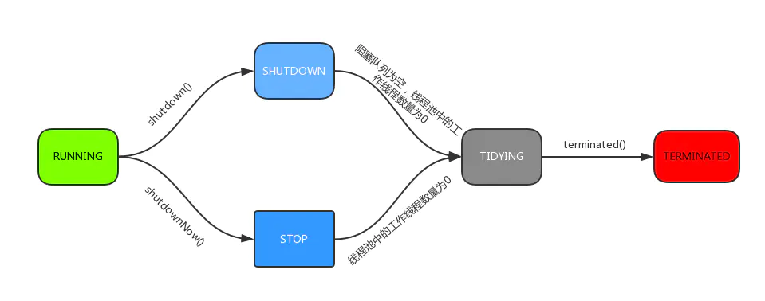

#### 4.35 线程池的队列大小你通常怎么设置？

**参考答案**

1. CPU密集型任务

   尽量使用较小的线程池，一般为CPU核心数+1。 因为CPU密集型任务使得CPU使用率很高，若开过多的线程数，会造成CPU过度切换。

2. IO密集型任务

   可以使用稍大的线程池，一般为2*CPU核心数。 IO密集型任务CPU使用率并不高，因此可以让CPU在等待IO的时候有其他线程去处理别的任务，充分利用CPU时间。

3. 混合型任务

   可以将任务分成IO密集型和CPU密集型任务，然后分别用不同的线程池去处理。 只要分完之后两个任务的执行时间相差不大，那么就会比串行执行来的高效。因为如果划分之后两个任务执行时间有数据级的差距，那么拆分没有意义。因为先执行完的任务就要等后执行完的任务，最终的时间仍然取决于后执行完的任务，而且还要加上任务拆分与合并的开销，得不偿失。

**美团对线程池进行了动态参数配置（在分布式配置中心中配置coreSize、MaxSize、BlockQueue）**

https://tech.meituan.com/2020/04/02/java-pooling-pratice-in-meituan.html

#### 线程池的几种实现:

1.FixedThreadPool

~~~   java
  public static ExecutorService newFixedThreadPool(int nThreads, ThreadFactory threadFactory) {
        return new ThreadPoolExecutor(nThreads, nThreads,
                                      0L, TimeUnit.MILLISECONDS,
                                      new LinkedBlockingQueue<Runnable>(),
                                      threadFactory);
    }
~~~

缺点:无界阻塞队列、最大存活时间也没，容易造成OOM

2.SingleThreadExecutor

~~~java
   /**
     *返回只有一个线程的线程池
     */
    public static ExecutorService newSingleThreadExecutor(ThreadFactory threadFactory) {
        return new FinalizableDelegatedExecutorService
            (new ThreadPoolExecutor(1, 1,
                                    0L, TimeUnit.MILLISECONDS,
                                    new LinkedBlockingQueue<Runnable>(),
                                    threadFactory));
    }
~~~

缺点和FixedThreadPool一样。

3.CachedThreadPool 

```java
/**
 * 创建一个线程池，根据需要创建新线程，但会在先前构建的线程可用时重用它。
 */
public static ExecutorService newCachedThreadPool(ThreadFactory threadFactory) {
    return new ThreadPoolExecutor(0, Integer.MAX_VALUE,
                                  60L, TimeUnit.SECONDS,
                                  new SynchronousQueue<Runnable>(),
                                  threadFactory);
}
```

缺点和FixedThreadPool一样。

#### 线程池中的阻塞队列


### 2.4. 说说 synchronized 关键字和 volatile 关键字的区别

`synchronized` 关键字和 `volatile` 关键字是两个互补的存在，而不是对立的存在！

- **`volatile` 关键字**是线程同步的**轻量级实现**，所以 **`volatile`性能肯定比`synchronized`关键字要好** 。但是 **`volatile` 关键字只能用于变量而 `synchronized` 关键字可以修饰方法以及代码块** 。
- **`volatile` 关键字能保证数据的可见性，但不能保证数据的原子性。`synchronized` 关键字两者都能保证。**
- **`volatile`关键字主要用于解决变量在多个线程之间的可见性，而 `synchronized` 关键字解决的是多个线程之间访问资源的同步性。**

###  4.3. 执行 execute()方法和 submit()方法的区别是什么呢？

1. **`execute()`方法用于提交不需要返回值的任务，所以无法判断任务是否被线程池执行成功与否；**
2. **`submit()`方法用于提交需要返回值的任务。线程池会返回一个 `Future` 类型的对象，通过这个 `Future` 对象可以判断任务是否执行成功**，并且可以通过 `Future` 的 `get()`方法来获取返回值，`get()`方法会阻塞当前线程直到任务完成，而使用 `get(long timeout，TimeUnit unit)`方法则会阻塞当前线程一段时间后立即返回，这时候有可能任务没有执行完

### 谈谈AQS

首先，AQS是抽象的队列同步器，核心思想就是利用一个status记录锁状态，0表示空闲，>0表示非空闲，再结合一套阻塞和唤醒机制，这个机制就是采用双端队列（CLH）实现。

>protected boolean tryAcquire(int)//独占方式。尝试获取资源，成功则返回true，失败则返回false。 protected boolean tryRelease(int)//独占方式。尝试释放资源，成功则返回true，失败则返回false。 protected int tryAcquireShared(int)//共享方式。尝试获取资源。负数表示失败；0表示成功，但没有剩余可用资源；正数表示成功，且有剩余资源。 
>
>protected boolean tryReleaseShared(int)//共享方式。尝试释放资源，成功则返回true，失败则返回false。 protected boolean isHeldExclusively()//该线程是否正在独占资源。只有用到condition才需要去实现它。

具体来说：

### Semaphore

Semaphore（信号量）用来限制能同时访问共享资源的线程上限，非重入锁

过程（看源码总结）：

**获取许可时**，如果state为0，再有一次获取机会，获取失败阻塞（加入阻塞队列，设置前驱节点状态为-1，表示是需要唤醒后继节点的）。

**释放许可时**，state++，唤醒阻塞线程（会一个接一个唤醒，只要前驱有义务唤醒后继节点，当然，重试一次后又被阻塞）

### CountDownLatch 

允许 `n` 个线程阻塞在一个地方，直至所有线程的任务都执行完毕，`await()` 方法之后的语句得到执行(n--)

缺点：用一次，因此有了CyclicBarrier

应用场景：电商项目的首页数据加载（其实就是java8多线程新特性）

### CyclicBarrier

当`n`个线程都到达屏障，`await()` 方法之后的语句得到执行(0++)


### 红黑树

自平衡的二叉查找树

特征：

- 根节点是黑色
- 叶子结点是黑色（叶子结点是NIL）
- 如果某个节点是红色，那么其子节点必须是黑色
- 对每个节点，从该节点到其后代叶子节点的简单路径上，均包含相同数量的黑节点

### TreeMap

> 根据key顺序加入
>
> 实现：红黑树

### 什么是元数据?

> 描述代码之间关系的数据，说白了就是注解。


# JVM

#### 5.1 JVM包含哪几部分？

**参考答案**

JVM 主要由四大部分组成：ClassLoader（类加载器），Runtime Data Area（运行时数据区，内存分区），Execution Engine（执行引擎），Native Interface（本地库接口），下图可以大致描述 JVM 的结构。

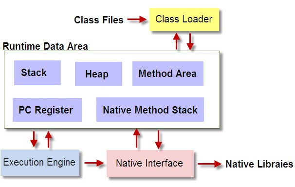

JVM 是执行 Java 程序的虚拟计算机系统，那我们来看看执行过程：首先需要准备好编译好的 Java 字节码文件（即class文件），计算机要运行程序需要先通过一定方式（类加载器）将 class 文件加载到内存中（运行时数据区），但是字节码文件是JVM定义的一套指令集规范，并不能直接交给底层操作系统去执行，因此需要特定的命令解释器（执行引擎）将字节码翻译成特定的操作系统指令集交给 CPU 去执行，这个过程中会需要调用到一些不同语言为 Java 提供的接口（例如驱动、地图制作等），这就用到了本地 Native 接口（本地库接口）。

- ClassLoader：负责加载字节码文件即 class 文件，class 文件在文件开头有特定的文件标示，并且 ClassLoader 只负责class 文件的加载，至于它是否可以运行，则由 Execution Engine 决定。
- Runtime Data Area：是存放数据的，分为五部分：Stack（虚拟机栈），Heap（堆），Method Area（方法区），PC Register（程序计数器），Native Method Stack（本地方法栈）。几乎所有的关于 Java 内存方面的问题，都是集中在这块。
- Execution Engine：执行引擎，也叫 Interpreter。Class 文件被加载后，会把指令和数据信息放入内存中，Execution Engine 则负责把这些命令解释给操作系统，即将 JVM 指令集翻译为操作系统指令集。
- Native Interface：负责调用本地接口的。他的作用是调用不同语言的接口给 JAVA 用，他会在 Native Method Stack 中记录对应的本地方法，然后调用该方法时就通过 Execution Engine 加载对应的本地 lib。原本多用于一些专业领域，如JAVA驱动，地图制作引擎等，现在关于这种本地方法接口的调用已经被类似于Socket通信，WebService等方式取代。

#### 5.7 类存放在哪里？

**参考答案**

方法区（Method Area）与Java堆一样，是各个线程共享的内存区域，它用于存储已被虚拟机加载的**类型信息**、常量、静态变量、即时编译器编译后的代码缓存等数据。虽然《Java虚拟机规范》中把方法区描述为堆的一个逻辑部分，但是它却有一个别名叫作“非堆”（Non-Heap），目的是与Java堆区分开来。

#### 5.9 介绍一下Java代码的编译过程

**参考答案**

从Javac代码的总体结构来看，编译过程大致可以分为1个准备过程和3个处理过程，它们分别如下所示。

1. 准备过程：初始化插入式注解处理器。

2. 解析与填充符号表过程，包括：

   - 词法、语法分析，将源代码的字符流转变为标记集合，构造出抽象语法树。
   - 填充符号表，产生符号地址和符号信息。

3. 插入式注解处理器的注解处理过程：

   在Javac源码中，插入式注解处理器的初始化过程是在initPorcessAnnotations()方法中完成的，而它的执行过程则是在processAnnotations()方法中完成。这个方法会判断是否还有新的注解处理器需要执行，如果有的话，通过JavacProcessing-Environment类的doProcessing()方法来生成一个新的JavaCompiler对象，对编译的后续步骤进行处理。

4. 分析与字节码生成过程，包括：

   - 标注检查，对语法的静态信息进行检查。
   - 数据流及控制流分析，对程序动态运行过程进行检查。
   - 解语法糖，将简化代码编写的语法糖还原为原有的形式。
   - 字节码生成，将前面各个步骤所生成的信息转化成字节码。

上述3个处理过程里，执行插入式注解时又可能会产生新的符号，如果有新的符号产生，就必须转回到之前的解析、填充符号表的过程中重新处理这些新符号，从总体来看，三者之间的关系与交互顺序如图所示。

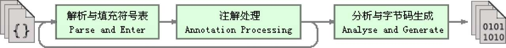

#### 对象的创建

Step1:类加载检查

虚拟机遇到一条 new 指令时，首先将去检查这个指令的参数是否能在常量池中定位到这个类的符号引用，并且检查这个符号引用代表的类是否已被加载过、解析和初始化过。如果没有，那必须先执行相应的类加载过程。

[#](#step2-分配内存) Step2:分配内存

在**类加载检查**通过后，接下来虚拟机将为新生对象**分配内存**。对象所需的内存大小在类加载完成后便可确定，为对象分配空间的任务等同于把一块确定大小的内存从 Java 堆中划分出来。

**分配方式**有 **“指针碰撞”** 和 **“空闲列表”** 两种，**选择哪种分配方式由 Java 堆是否规整决定，而 Java 堆是否规整又由所采用的垃圾收集器是否带有压缩整理功能决定**。

**内存分配的两种方式：（补充内容，需要掌握）**


**内存分配并发问题（补充内容，需要掌握）**

在创建对象的时候有一个很重要的问题，就是线程安全，因为在实际开发过程中，创建对象是很频繁的事情，作为虚拟机来说，必须要保证线程是安全的，通常来讲，虚拟机采用两种方式来保证线程安全：

- **CAS+失败重试：** CAS 是乐观锁的一种实现方式。所谓乐观锁就是，每次不加锁而是假设没有冲突而去完成某项操作，如果因为冲突失败就重试，直到成功为止。**虚拟机采用 CAS 配上失败重试的方式保证更新操作的原子性。**
- **TLAB：** 为每一个线程预先在 Eden 区分配一块儿内存，JVM 在给线程中的对象分配内存时，首先在 TLAB 分配，当对象大于 TLAB 中的剩余内存或 TLAB 的内存已用尽时，再采用上述的 CAS 进行内存分配

[#](#step3-初始化零值) Step3:初始化零值

内存分配完成后，虚拟机需要将分配到的内存空间都初始化为零值（不包括对象头），这一步操作保证了对象的实例字段在 Java 代码中可以不赋初始值就直接使用，程序能访问到这些字段的数据类型所对应的零值。

[#](#step4-设置对象头) Step4:设置对象头

初始化零值完成之后，**虚拟机要对对象进行必要的设置**，例如这个对象是哪个类的实例、如何才能找到类元信息、对象的哈希码、对象的 GC 分代年龄等信息。 **这些信息存放在对象头中。** 另外，根据虚拟机当前运行状态的不同，如是否启用偏向锁等，对象头会有不同的设置方式。

[#](#step5-执行-init-方法) Step5:执行 init 方法

在上面工作都完成之后，从虚拟机的视角来看，一个新的对象已经产生了，但从 Java 程序的视角来看，对象创建才刚开始，`<init>` 方法还没有执行，所有的字段都还为零。所以一般来说，执行 new 指令之后会接着执行 `<init>` 方法，把对象按照程序员的意愿进行初始化，这样一个真正可用的对象才算完全产生出来。


#### 对象的内存布局

**对象头**、**实例数据**和**对齐填充**


#### Java运行时数据区域

堆：存放对象实例

方法区：用来存储已经被虚拟机加载的类型信息、常量、静态变量、即时编译器编译后的代码缓存等数据。

虚拟机栈：（生命周期与线程相同）Java中每个方法执行的时候，Java虚拟机都会同步创建一个栈帧，用于存储局部变量表、操作数栈、动态链接、方法出口等信息。

程序计数器：保存下一条需要执行的字节码指令，是程序控制流的指示器，分支、循环、跳转、异常处理、线程恢复等基础功能都是依赖程序计数器。

本地方法栈：与虚拟机栈类似

#### 哪些区域会造成OOM

> 除了程序计数器之外

#### 5.10 介绍一下类加载的过程

**参考答案**

一个类型从被加载到虚拟机内存中开始，到卸载出内存为止，它的整个生命周期将会经历加载（Loading）、验证（Verification）、准备（Preparation）、解析（Resolution）、初始化（Initialization）、使用（Using）和卸载（Unloading）七个阶段，其中验证、准备、解析三个部分统称为连接（Linking）。这七个阶段的发生顺序如下图所示。


在上述七个阶段中，包括了类加载的全过程，即加载、验证、准备、解析和初始化这五个阶段。

一、加载

“加载”（Loading）阶段是整个“类加载”（Class Loading）过程中的一个阶段，在加载阶段，Java虚拟机需要完成以下三件事情：

1. 通过一个类的全限定名来获取定义此类的二进制字节流。
2. 将这个字节流所代表的静态存储结构转化为方法区的运行时数据结构。
3. 在内存中生成一个代表这个类的java.lang.Class对象，作为方法区这个类的各种数据的访问入口。

加载阶段结束后，Java虚拟机外部的二进制字节流就按照虚拟机所设定的格式存储在方法区之中了，方法区中的数据存储格式完全由虚拟机实现自行定义，《Java虚拟机规范》未规定此区域的具体数据结构。类型数据妥善安置在方法区之后，会在Java堆内存中实例化一个java.lang.Class类的对象，这个对象将作为程序访问方法区中的类型数据的外部接口。

二、验证

验证是连接阶段的第一步，这一阶段的目的是确保Class文件的字节流中包含的信息符合《Java虚拟机规范》的全部约束要求，保证这些信息被当作代码运行后不会危害虚拟机自身的安全。验证阶段大致上会完成下面四个阶段的检验动作：文件格式验证、元数据验证、字节码验证和符号引用验证。

1. 文件格式验证：

   第一阶段要验证字节流是否符合Class文件格式的规范，并且能被当前版本的虚拟机处理。

2. 元数据验证：

   第二阶段是对字节码描述的信息进行语义分析，以保证其描述的信息符合《Java语言规范》的要求。

3. 字节码验证：

   第三阶段是通过数据流分析和控制流分析，确定程序语义是合法的、符合逻辑的。

4. 符号引用验证：

   符号引用验证可以看作是对类自身以外（常量池中的各种符号引用）的各类信息进行匹配性校验，通俗来说就是，该类是否缺少或者被禁止访问它依赖的某些外部类、方法、字段等资源。

三、准备

准备阶段是正式为类中定义的变量（即静态变量，被static修饰的变量）分配内存并设置类变量初始值的阶段。从概念上讲，这些变量所使用的内存都应当在方法区中进行分配，但必须注意到方法区本身是一个逻辑上的区域，在JDK7及之前，HotSpot使用永久代来实现方法区时，实现是完全符合这种逻辑概念的。而在JDK 8及之后，类变量则会随着Class对象一起存放在Java堆中，这时候“类变量在方法区”就完全是一种对逻辑概念的表述了。

四、解析

解析阶段是Java虚拟机将常量池内的符号引用替换为直接引用的过程，符号引用在Class文件中以CONSTANT_Class_info、CONSTANT_Fieldref_info、CONSTANT_Methodref_info等类型的常量出现，那解析阶段中所说的直接引用与符号引用又有什么关联呢？

符号引用（Symbolic References）：符号引用以一组符号来描述所引用的目标，符号可以是任何形式的字面量，只要使用时能无歧义地定位到目标即可。符号引用与虚拟机实现的内存布局无关，引用的目标并不一定是已经加载到虚拟机内存当中的内容。各种虚拟机实现的内存布局可以各不相同，但是它们能接受的符号引用必须都是一致的，因为符号引用的字面量形式明确定义在《Java虚拟机规范》的Class文件格式中。

直接引用（Direct References）：直接引用是可以直接指向目标的指针、相对偏移量或者是一个能间接定位到目标的句柄。直接引用是和虚拟机实现的内存布局直接相关的，同一个符号引用在不同虚拟机实例上翻译出来的直接引用一般不会相同。如果有了直接引用，那引用的目标必定已经在虚拟机的内存中存在。

五、初始化

类的初始化阶段是类加载过程的最后一个步骤，之前介绍的几个类加载的动作里，除了在加载阶段用户应用程序可以通过自定义类加载器的方式局部参与外，其余动作都完全由Java虚拟机来主导控制。直到初始化阶段，Java虚拟机才真正开始执行类中编写的Java程序代码，将主导权移交给应用程序。

进行准备阶段时，变量已经赋过一次系统要求的初始零值，而在初始化阶段，则会根据程序员通过程序编码制定的主观计划去初始化类变量和其他资源。我们也可以从另外一种更直接的形式来表达：初始化阶段就是执行类构造器`<clinit>()`方法的过程。`<clinit>()`并不是程序员在Java代码中直接编写的方法，它是Javac编译器的自动生成物。

> 总结：
>
> 加载：读取Class文件，并根据Class文件描述创建对象。
>
> |
>
> 连接：验证(语法、class格式)->准备（类变量初始化，final static直接赋值）->解析（常量池内的符号引用转为直接引用，例如import java.util.ArrayList转化成地址）
>
> |
>
> 初始化（类构造器<clinit>()，类变量赋值和静态代码块）

#### 5.11 介绍一下对象的实例化过程

**参考答案**

对象实例化过程，就是执行类构造函数对应在字节码文件中的`<init>()`方法(实例构造器)，`<init>()`方法由非静态变量、非静态代码块以及对应的构造器组成。

- `<init>()`方法可以重载多个，类有几个构造器就有几个`<init>()`方法；
- `<init>()`方法中的代码执行顺序为：父类变量初始化、父类代码块、父类构造器、子类变量初始化、子类代码块、子类构造器。

静态变量、静态代码块、普通变量、普通代码块、构造器的执行顺序如下图：

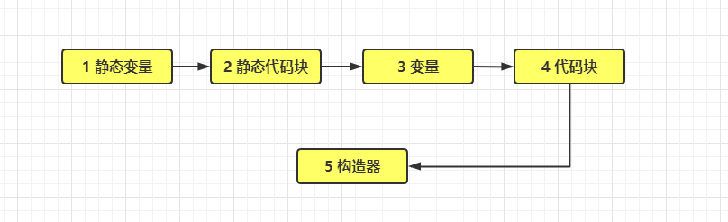

具有父类的子类的实例化顺序如下：

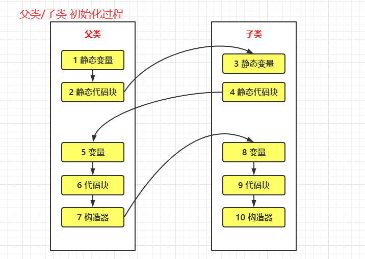

**扩展阅读**

Java是一门面向对象的编程语言，Java程序运行过程中无时无刻都有对象被创建出来。在语言层面上，创建对象通常（例外：复制、反序列化）仅仅是一个new关键字而已，而在虚拟机中，对象（文中讨论的对象限于普通Java对象，不包括数组和Class对象等）的创建又是怎样一个过程呢？

当Java虚拟机遇到一条字节码new指令时，首先将去检查这个指令的参数是否能在常量池中定位到一个类的符号引用，并且检查这个符号引用代表的类是否已被加载、解析和初始化过。如果没有，那必须先执行相应的类加载过程。

在类加载检查通过后，接下来虚拟机将为新生对象分配内存。对象所需内存的大小在类加载完成后便可完全确定，为对象分配空间的任务实际上便等同于把一块确定大小的内存块从Java堆中划分出来。假设Java堆中内存是绝对规整的，所有被使用过的内存都被放在一边，空闲的内存被放在另一边，中间放着一个指针作为分界点的指示器，那所分配内存就仅仅是把那个指针向空闲空间方向挪动一段与对象大小相等的距离，这种分配方式称为“指针碰撞”（Bump The Pointer）。但如果Java堆中的内存并不是规整的，已被使用的内存和空闲的内存相互交错在一起，那就没有办法简单地进行指针碰撞了，虚拟机就必须维护一个列表，记录上哪些内存块是可用的，在分配的时候从列表中找到一块足够大的空间划分给对象实例，并更新列表上的记录，这种分配方式称为“空闲列表”（Free List）。选择哪种分配方式由Java堆是否规整决定，而Java堆是否规整又由所采用的垃圾收集器是否带有空间压缩整理（Compact）的能力决定。因此，当使用Serial、ParNew等带压缩整理过程的收集器时，系统采用的分配算法是指针碰撞，既简单又高效；而当使用CMS这种基于清除（Sweep）算法的收集器时，理论上就只能采用较为复杂的空闲列表来分配内存。

除如何划分可用空间之外，还有另外一个需要考虑的问题：对象创建在虚拟机中是非常频繁的行为，即使仅仅修改一个指针所指向的位置，在并发情况下也并不是线程安全的，可能出现正在给对象A分配内存，指针还没来得及修改，对象B又同时使用了原来的指针来分配内存的情况。解决这个问题有两种可选方案：一种是对分配内存空间的动作进行同步处理——实际上虚拟机是采用CAS配上失败重试的方式保证更新操作的原子性；另外一种是把内存分配的动作按照线程划分在不同的空间之中进行，即每个线程在Java堆中预先分配一小块内存，称为本地线程分配缓冲（Thread Local Allocation Buffer，TLAB），哪个线程要分配内存，就在哪个线程的本地缓冲区中分配，只有本地缓冲区用完了，分配新的缓存区时才需要同步锁定。虚拟机是否使用TLAB，可以通过-XX：+/-UseTLAB参数来设定。

内存分配完成之后，虚拟机必须将分配到的内存空间（但不包括对象头）都初始化为零值，如果使用了TLAB的话，这一项工作也可以提前至TLAB分配时顺便进行。这步操作保证了对象的实例字段在Java代码中可以不赋初始值就直接使用，使程序能访问到这些字段的数据类型所对应的零值。

接下来，Java虚拟机还要对对象进行必要的设置，例如这个对象是哪个类的实例、如何才能找到类的元数据信息、对象的哈希码（实际上对象的哈希码会延后到真正调用Object::hashCode()方法时才计算）、对象的GC分代年龄等信息。这些信息存放在对象的对象头（Object Header）之中。根据虚拟机当前运行状态的不同，如是否启用偏向锁等，对象头会有不同的设置方式。

在上面工作都完成之后，从虚拟机的视角来看，一个新的对象已经产生了。但是从Java程序的视角看来，对象创建才刚刚开始——构造函数，即Class文件中的`<init>()`方法还没有执行，所有的字段都为默认的零值，对象需要的其他资源和状态信息也还没有按照预定的意图构造好。一般来说（由字节码流中new指令后面是否跟随invokespecial指令所决定，Java编译器会在遇到new关键字的地方同时生成这两条字节码指令，但如果直接通过其他方式产生的则不一定如此），new指令之后会接着执行`<init>()`方法，按照程序员的意愿对对象进行初始化，这样一个真正可用的对象才算完全被构造出来。

#### 5.12 元空间在栈内还是栈外？

**参考答案**

在栈外，元空间占用的是本地内存。

**扩展阅读**

许多Java程序员都习惯在HotSpot虚拟机上开发、部署程序，很多人都更愿意把方法区称呼为“永久代“，或将两者混为一谈。本质上这两者并不是等价的，因为仅仅是当时的HotSpot虚拟机设计团队选择把收集器的分代设计扩展至方法区，或者说使用永久代来实现方法区而已，这样使得HotSpot的垃圾收集器能够像管理Java堆一样管理这部分内存，省去专门为方法区编写内存管理代码的工作。但是对于其他虚拟机实现，譬如BEAJRockit、IBM J9等来说，是不存在永久代的概念的。原则上如何实现方法区属于虚拟机实现细节，不受《Java虚拟机规范》管束，并不要求统一。

现在回头来看，当年使用永久代来实现方法区的决定并不是一个好主意，这种设计导致了Java应用更容易遇到内存溢出的问题（永久代有-XX：MaxPermSize的上限，即使不设置也有默认大小，而J9和JRockit只要没有触碰到进程可用内存的上限，例如32位系统中的4GB限制，就不会出问题），而且有极少数方法（例如String::intern()）会因永久代的原因而导致不同虚拟机下有不同的表现。

当Oracle收购BEA获得了JRockit的所有权后，准备把JRockit中的优秀功能，譬如Java Mission Control管理工具，移植到HotSpot虚拟机时，但因为两者对方法区实现的差异而面临诸多困难。考虑到HotSpot未来的发展，在JDK 6的时候HotSpot开发团队就有放弃永久代，逐步改为采用本地内存（Native Memory）来实现方法区的计划了，到了JDK 7的HotSpot，已经把原本放在永久代的字符串常量池、静态变量等移出，而到了JDK 8，终于完全废弃了永久代的概念，改用与JRockit、J9一样在本地内存中实现的元空间（Meta-space）来代替，把JDK 7中永久代还剩余的内容（主要是类型信息）全部移到元空间中。

#### 5.13 谈谈JVM的类加载器，以及双亲委派模型

**参考答案**

一、类加载器

Java虚拟机设计团队有意把类加载阶段中的“通过一个类的全限定名来获取描述该类的二进制字节流”这个动作放到Java虚拟机外部去实现，以便让应用程序自己决定如何去获取所需的类。实现这个动作的代码被称为“类加载器”（Class Loader）。

类加载器虽然只用于实现类的加载动作，但它在Java程序中起到的作用却远超类加载阶段。对于任意一个类，都必须由加载它的类加载器和这个类本身一起共同确立其在Java虚拟机中的唯一性，每一个类加载器，都拥有一个独立的类名称空间。这句话可以表达得更通俗一些：比较两个类是否“相等”，只有在这两个类是由同一个类加载器加载的前提下才有意义，否则，即使这两个类来源于同一个Class文件，被同一个Java虚拟机加载，只要加载它们的类加载器不同，那这两个类就必定不相等。

二、双亲委派模型

- 启动类加载器（Bootstrap Class Loader）：这个类加载器负责加载存放在\lib目录，或者被-Xbootclasspath参数所指定的路径中存放的，而且是Java虚拟机能够识别的（按照文件名识别，如rt.jar、tools.jar，名字不符合的类库即使放在lib目录中也不会被加载）类库加载到虚拟机的内存中。
- 扩展类加载器（Extension Class Loader）：它负责加载\lib\ext目录中，或者被java.ext.dirs系统变量所指定的路径中所有的类库。
- 应用程序类加载器（Application Class Loader）：负责加载用户类路径（ClassPath）上所有的类库。


双亲委派模型的工作过程是：如果一个类加载器收到了类加载的请求，它首先不会自己去尝试加载这个类，而是把这个请求委派给父类加载器去完成，每一个层次的类加载器都是如此，因此所有的加载请求最终都应该传送到最顶层的启动类加载器中，只有当父加载器反馈自己无法完成这个加载请求（它的搜索范围中没有找到所需的类）时，子加载器才会尝试自己去完成加载。

使用双亲委派模型来组织类加载器之间的关系，一个显而易见的好处就是Java中的类随着它的类加载器一起具备了一种带有优先级的层次关系。例如类java.lang.Object，它存放在rt.jar之中，无论哪一个类加载器要加载这个类，最终都是委派给处于模型最顶端的启动类加载器进行加载，因此Object类在程序的各种类加载器环境中都能够保证是同一个类。反之，如果没有使用双亲委派模型，都由各个类加载器自行去加载的话，如果用户自己也编写了一个名为java.lang.Object的类，并放在程序的ClassPath中，那系统中就会出现多个不同的Object类，Java类型体系中最基础的行为也就无从保证，应用程序将会变得一片混乱。

**扩展阅读**

双亲委派模型对于保证Java程序的稳定运作极为重要，但它的实现却异常简单，用以实现双亲委派的代码只有短短十余行，全部集中在java.lang.ClassLoader的loadClass()方法之中。

```java
protected Class<?> loadClass(String name, boolean resolve)
    throws ClassNotFoundException {
    synchronized (getClassLoadingLock(name)) {
        // First, check if the class has already been loaded
        Class<?> c = findLoadedClass(name);
        if (c == null) {
            long t0 = System.nanoTime();
            try {
                if (parent != null) {
                    c = parent.loadClass(name, false);
                } else {
                    c = findBootstrapClassOrNull(name);
                }
            } catch (ClassNotFoundException e) {
                // ClassNotFoundException thrown if class not found
                // from the non-null parent class loader
            }

            if (c == null) {
                // If still not found, then invoke findClass in order
                // to find the class.
                long t1 = System.nanoTime();
                c = findClass(name);

                // this is the defining class loader; record the stats
                PerfCounter.getParentDelegationTime().addTime(t1 - t0);
                PerfCounter.getFindClassTime().addElapsedTimeFrom(t1);
                PerfCounter.getFindClasses().increment();
            }
        }
        if (resolve) {
            resolveClass(c);
        }
        return c;
    }
}
```

这段代码的逻辑清晰易懂：先检查请求加载的类型是否已经被加载过，若没有则调用父加载器的loadClass()方法，若父加载器为空则默认使用启动类加载器作为父加载器。假如父类加载器加载失败，抛出ClassNotFoundException异常的话，才调用自己的findClass()方法尝试进行加载。

#### 5.14 双亲委派机制会被破坏吗？

**参考答案**

双亲委派模型并不是一个具有强制性约束的模型，而是Java设计者推荐给开发者们的类加载器实现方式。在Java的世界中大部分的类加载器都遵循这个模型，但也有例外的情况，直到Java模块化出现为止，双亲委派模型主要出现过3次较大规模“被破坏”的情况。

双亲委派模型的第一次“被破坏”其实发生在双亲委派模型出现之前——即JDK 1.2面世以前的“远古”时代。由于双亲委派模型在JDK 1.2之后才被引入，但是类加载器的概念和抽象类java.lang.ClassLoader则在Java的第一个版本中就已经存在，面对已经存在的用户自定义类加载器的代码，Java设计者们引入双亲委派模型时不得不做出一些妥协，为了兼容这些已有代码，无法再以技术手段避免loadClass()被子类覆盖的可能性，只能在JDK 1.2之后的java.lang.ClassLoader中添加一个新的protected方法findClass()，并引导用户编写的类加载逻辑时尽可能去重写这个方法，而不是在loadClass()中编写代码。双亲委派的具体逻辑就实现在这里面，按照loadClass()方法的逻辑，如果父类加载失败，会自动调用自己的findClass()方法来完成加载，这样既不影响用户按照自己的意愿去加载类，又可以保证新写出来的类加载器是符合双亲委派规则的。

双亲委派模型的第二次“被破坏”是由这个模型自身的缺陷导致的，双亲委派很好地解决了各个类加载器协作时基础类型的一致性问题（越基础的类由越上层的加载器进行加载），基础类型之所以被称为“基础”，是因为它们总是作为被用户代码继承、调用的API存在，但程序设计往往没有绝对不变的完美规则，如果有基础类型又要调用回用户的代码，那该怎么办呢？

这并非是不可能出现的事情，一个典型的例子便是JNDI服务，JNDI现在已经是Java的标准服务，它的代码由启动类加载器来完成加载（在JDK 1.3时加入到rt.jar的），肯定属于Java中很基础的类型了。但JNDI存在的目的就是对资源进行查找和集中管理，它需要调用由其他厂商实现并部署在应用程序的ClassPath下的JNDI服务提供者接口（Service Provider Interface，SPI）的代码，现在问题来了，启动类加载器是绝不可能认识、加载这些代码的，那该怎么办？

为了解决这个困境，Java的设计团队只好引入了一个不太优雅的设计：线程上下文类加载器（Thread Context ClassLoader）。这个类加载器可以通过java.lang.Thread类的setContext-ClassLoader()方法进行设置，如果创建线程时还未设置，它将会从父线程中继承一个，如果在应用程序的全局范围内都没有设置过的话，那这个类加载器默认就是应用程序类加载器。

有了线程上下文类加载器，程序就可以做一些“舞弊”的事情了。JNDI服务使用这个线程上下文类加载器去加载所需的SPI服务代码，这是一种父类加载器去请求子类加载器完成类加载的行为，这种行为实际上是打通了双亲委派模型的层次结构来逆向使用类加载器，已经违背了双亲委派模型的一般性原则，但也是无可奈何的事情。Java中涉及SPI的加载基本上都采用这种方式来完成，例如JNDI、JDBC、JCE、JAXB和JBI等。不过，当SPI的服务提供者多于一个的时候，代码就只能根据具体提供者的类型来硬编码判断，为了消除这种极不优雅的实现方式，在JDK 6时，JDK提供了java.util.ServiceLoader类，以META-INF/services中的配置信息，辅以责任链模式，这才算是给SPI的加载提供了一种相对合理的解决方案。

双亲委派模型的第三次“被破坏”是由于用户对程序动态性的追求而导致的，这里所说的“动态性”指的是一些非常“热”门的名词：代码热替换（HotSwap）、模块热部署（Hot Deployment）等。说白了就是希望Java应用程序能像我们的电脑外设那样，接上鼠标、U盘，不用重启机器就能立即使用，鼠标有问题或要升级就换个鼠标，不用关机也不用重启。对于个人电脑来说，重启一次其实没有什么大不了的，但对于一些生产系统来说，关机重启一次可能就要被列为生产事故，这种情况下热部署就对软件开发者，尤其是大型系统或企业级软件开发者具有很大的吸引力。

早在2008年，在Java社区关于模块化规范的第一场战役里，由Sun/Oracle公司所提出的JSR-294、JSR-277规范提案就曾败给以IBM公司主导的JSR-291（即OSGi R4.2）提案。尽管Sun/Oracle并不甘心就此失去Java模块化的主导权，随即又再拿出Jigsaw项目迎战，但此时OSGi已经站稳脚跟，成为业界“事实上”的Java模块化标准。曾经在很长一段时间内，IBM凭借着OSGi广泛应用基础让Jigsaw吃尽苦头，其影响一直持续到Jigsaw随JDK 9面世才算告一段落。而且即使Jigsaw现在已经是Java的标准功能了，它仍需小心翼翼地避开OSGi运行期动态热部署上的优势，仅局限于静态地解决模块间封装隔离和访问控制的问题，现在我们先来简单看一看OSGi是如何通过类加载器实现热部署的。

OSGi实现模块化热部署的关键是它自定义的类加载器机制的实现，每一个程序模块（OSGi中称为Bundle）都有一个自己的类加载器，当需要更换一个Bundle时，就把Bundle连同类加载器一起换掉以实现代码的热替换。在OSGi环境下，类加载器不再双亲委派模型推荐的树状结构，而是进一步发展为更加复杂的网状结构，当收到类加载请求时，OSGi将按照下面的顺序进行类搜索：

1. 将以java.*开头的类，委派给父类加载器加载。
2. 否则，将委派列表名单内的类，委派给父类加载器加载。
3. 否则，将Import列表中的类，委派给Export这个类的Bundle的类加载器加载。
4. 否则，查找当前Bundle的ClassPath，使用自己的类加载器加载。
5. 否则，查找类是否在自己的Fragment Bundle中，如果在，则委派给Fragment Bundle的类加载器加载。
6. 否则，查找Dynamic Import列表的Bundle，委派给对应Bundle的类加载器加载。
7. 否则，类查找失败。

上面的查找顺序中只有开头两点仍然符合双亲委派模型的原则，其余的类查找都是在平级的类加载器中进行的。

#### 固定可作为GC Roots的对象

- 在虚拟机栈（栈帧中的本地变量表）中引用的对象，譬如各个线程被调用的方法堆栈中使用到的参数、局部变量、临时变量等。
- 本地方法栈引用的对象。
- 在方法区中类静态属性引用的对象，譬如Java类的引用类型静态变量。
- 在方法区中常量引用的对象，譬如字符串常量池（String Table）里的引用。
- Java虚拟机内部的引用，如基本数据类型对应的Class对象，一些常驻的异常对象（比如NullPointExcepiton、OutOfMemoryError）等，还有系统类加载器。
- 所有被同步锁（synchronized关键字）持有的对象。

**不再被使用的类**需要同时满足下面三个条件：

- 该类所有的**实例**都已经被回收，也就是Java堆中不存在该类及其任何派生子类的实例。
- 加载该类的**类加载器**已经被回收，这个条件除非是经过精心设计的可替换类加载器的场景，如OSGi、JSP的重加载等，否则通常是很难达成的。
- 该类对应的java.lang.**Class对象**没有在任何地方被引用，无法在任何地方通过反射访问该类的方法。

#### 5.16 请介绍一下分代回收机制

**参考答案**

当前商业虚拟机的垃圾收集器，大多数都遵循了“分代收集”（GenerationalCollection）[插图]的理论进行设计，分代收集名为理论，实质是一套符合大多数程序运行实际情况的经验法则，它建立在两个分代假说之上：

1. 弱分代假说（Weak Generational Hypothesis）：绝大多数对象都是朝生夕灭的。
2. 强分代假说（Strong Generational Hypothesis）：熬过越多次垃圾收集过程的对象就越难以消亡。

这两个分代假说共同奠定了多款常用的垃圾收集器的一致的设计原则：收集器应该将Java堆划分出不同的区域，然后将回收对象依据其年龄（年龄即对象熬过垃圾收集过程的次数）分配到不同的区域之中存储。把分代收集理论具体放到现在的商用Java虚拟机里，设计者一般至少会把Java堆划分为新生代（Young Generation）和老年代（Old Generation）两个区域。顾名思义，在新生代中，每次垃圾收集时都发现有大批对象死去，而每次回收后存活的少量对象，将会逐步晋升到老年代中存放。

分代收集并非只是简单划分一下内存区域那么容易，它至少存在一个明显的困难：对象不是孤立的，对象之间会存在跨代引用。假如要现在进行一次只局限于新生代区域内的收集，但新生代中的对象是完全有可能被老年代所引用的，为了找出该区域中的存活对象，不得不在固定的GC Roots之外，再额外遍历整个老年代中所有对象来确保可达性分析结果的正确性，反过来也是一样。遍历整个老年代所有对象的方案虽然理论上可行，但无疑会为内存回收带来很大的性能负担。为了解决这个问题，就需要对分代收集理论添加第三条经验法则：

1. 跨代引用假说（Intergenerational Reference Hypothesis）：跨代引用相对于同代引用来说仅占极少数。

依据这条假说，我们就不应再为了少量的跨代引用去扫描整个老年代，也不必浪费空间专门记录每一个对象是否存在及存在哪些跨代引用，只需在新生代上建立一个全局的数据结构（称为“记忆集”，RememberedSet），这个结构把老年代划分成若干小块，标识出老年代的哪一块内存会存在跨代引用。此后当发生Minor GC时，只有包含了跨代引用的小块内存里的对象才会被加入到GC Roots进行扫描。虽然这种方法需要在对象改变引用关系（如将自己或者某个属性赋值）时维护记录数据的正确性，会增加一些运行时的开销，但比起收集时扫描整个老年代来说仍然是划算的。

#### 5.17 JVM中一次完整的GC流程是怎样的？

**参考答案**

新创建的对象一般会被分配在新生代中，常用的新生代的垃圾回收器是 ParNew 垃圾回收器，它按照 8:1:1 将新生代分成 Eden 区，以及两个 Survivor 区。某一时刻，我们创建的对象将 Eden 区全部挤满，这个对象就是挤满新生代的最后一个对象。此时，Minor GC 就触发了。

在正式 Minor GC 前，JVM 会先检查新生代中对象，是比老年代中剩余空间大还是小。为什么要做这样的检查呢？原因很简单，假如 Minor GC 之后 Survivor 区放不下剩余对象，这些对象就要进入到老年代，所以要提前检查老年代是不是够用。这样就有两种情况：

1. 老年代剩余空间大于新生代中的对象大小，那就直接Minor GC，GC完survivor不够放，老年代也绝对够放；

2. 老年代剩余空间小于新生代中的对象大小，这个时候就要查看是否启用了“老年代空间分配担保规则”，具体来说就是看 `-XX:-HandlePromotionFailure` 参数是否设置了。

   老年代空间分配担保规则是这样的，如果老年代中剩余空间大小，大于历次 Minor GC 之后剩余对象的大小，那就允许进行 Minor GC。因为从概率上来说，以前的放的下，这次的也应该放的下。那就有两种情况：

   老年代中剩余空间大小，大于历次Minor GC之后剩余对象的大小，进行 Minor GC；

   老年代中剩余空间大小，小于历次Minor GC之后剩余对象的大小，进行Full GC，把老年代空出来再检查。

开启老年代空间分配担保规则只能说是大概率上来说，Minor GC 剩余后的对象够放到老年代，所以当然也会有万一，Minor GC 后会有这样三种情况：

1. Minor GC 之后的对象足够放到 Survivor 区，皆大欢喜，GC 结束；
2. Minor GC 之后的对象不够放到 Survivor 区，接着进入到老年代，老年代能放下，那也可以，GC 结束；
3. Minor GC 之后的对象不够放到 Survivor 区，老年代也放不下，那就只能 Full GC。

前面都是成功 GC 的例子，还有 3 中情况，会导致 GC 失败，报 OOM：

1. 紧接上一节 Full GC 之后，老年代任然放不下剩余对象，就只能 OOM；
2. 未开启老年代分配担保机制，且一次 Full GC 后，老年代任然放不下剩余对象，也只能 OOM；
3. 开启老年代分配担保机制，但是担保不通过，一次 Full GC 后，老年代任然放不下剩余对象，也是能 OOM。

GC完整流程，参考下图：

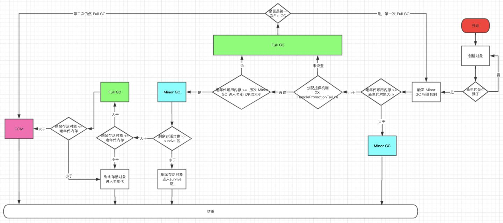

#### 5.18 Full GC会导致什么？

**参考答案**

Full GC会“Stop The World”，即在GC期间全程暂停用户的应用程序。

#### 5.19 JVM什么时候触发GC，如何减少FullGC的次数？

**参考答案**

当 Eden 区的空间耗尽时 Java 虚拟机便会触发一次 Minor GC 来收集新生代的垃圾，存活下来的对象，则会被送到 Survivor 区，简单说就是当新生代的Eden区满的时候触发 Minor GC。

serial GC 中，老年代内存剩余已经小于之前年轻代晋升老年代的平均大小，则进行 Full GC。而在 CMS 等并发收集器中则是每隔一段时间检查一下老年代内存的使用量，超过一定比例时进行 Full GC 回收。

可以采用以下措施来减少Full GC的次数：

1. 增加方法区的空间；
2. 增加老年代的空间；
3. 减少新生代的空间；
4. 禁止使用System.gc()方法；
5. 使用标记-整理算法，尽量保持较大的连续内存空间；
6. 排查代码中无用的大对象。

#### 5.27 请介绍G1垃圾收集器

**参考答案**

虽然G1也仍是遵循分代收集理论设计的，但其堆内存的布局与其他收集器有非常明显的差异：G1不再坚持固定大小以及固定数量的分代区域划分，而是把连续的Java堆划分为多个大小相等的独立区域（Region），每一个Region都可以根据需要，扮演新生代的Eden空间、Survivor空间，或者老年代空间。收集器能够对扮演不同角色的Region采用不同的策略去处理，这样无论是新创建的对象还是已经存活了一段时间、熬过多次收集的旧对象都能获取很好的收集效果。

Region中还有一类特殊的Humongous区域，专门用来存储大对象。G1认为只要大小超过了一个Region容量一半的对象即可判定为大对象。每个Region的大小可以通过参数 `-XX：G1HeapRegionSize` 设定，取值范围为1MB～32MB，且应为2的N次幂。而对于那些超过了整个Region容量的超级大对象，将会被存放在N个连续的`Humongous Region` 之中，G1的大多数行为都把 `Humongous Region` 作为老年代的一部分来进行看待，如下图所示。

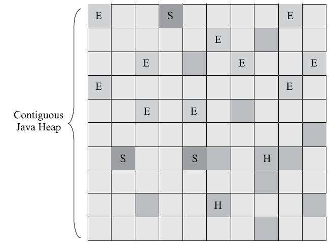

虽然G1仍然保留新生代和老年代的概念，但新生代和老年代不再是固定的了，它们都是一系列区域（不需要连续）的动态集合。G1之所以能建立可预测的停顿时间模型，是因为它将Region作为单次回收的最小单元，即每次收集到的内存空间都是Region大小的整数倍，这样可以有计划地避免在整个Java堆中进行全区域的垃圾收集。更具体的处理思路是让G1收集器去跟踪各个Region里面的垃圾堆积的“价值”大小，价值即回收所获得的空间大小以及回收所需时间的经验值，然后在后台维护一个优先级列表，每次根据用户设定允许的收集停顿时间（使用参数-XX：MaxGCPauseMillis指定，默认值是200毫秒），优先处理回收价值收益最大的那些Region，这也就是“Garbage First”名字的由来。这种使用Region划分内存空间，以及具有优先级的区域回收方式，保证了G1收集效率。

#### 5.28 请介绍CMS垃圾收集器

**参考答案**

CMS（Concurrent Mark Sweep）收集器是一种以获取最短回收停顿时间为目标的收集器。从名字上就可以看出CMS收集器是基于标记-清除算法实现的，它的运作过程分为四个步骤，包括：

1. 初始标记（CMS initial mark）；
2. 并发标记（CMS concurrent mark）；
3. 重新标记（CMS remark）；
4. 并发清除（CMS concurrent sweep）。

其中初始标记、重新标记这两个步骤仍然需要“Stop The World”。初始标记仅仅只是标记一下GC Roots能直接关联到的对象，速度很快；并发标记阶段就是从GC Roots的直接关联对象开始遍历整个对象图的过程，这个过程耗时较长但是不需要停顿用户线程，可以与垃圾收集线程一起并发运行；而重新标记阶段则是为了修正并发标记期间，因用户程序继续运作而导致标记产生变动的那一部分对象的标记记录，这个阶段的停顿时间通常会比初始标记阶段稍长一些，但也远比并发标记阶段的时间短；最后是并发清除阶段，清理删除掉标记阶段判断的已经死亡的对象，由于不需要移动存活对象，所以这个阶段也是可以与用户线程同时并发的。

由于在整个过程中耗时最长的并发标记和并发清除阶段中，垃圾收集器线程都可以与用户线程一起工作，所以从总体上来说，CMS收集器的内存回收过程是与用户线程一起并发执行的。通过下图可以比较清楚地看到CMS收集器的运作步骤中并发和需要停顿的阶段。


CMS收集器还远达不到完美的程度，它至少有以下三个明显的缺点：

首先，CMS收集器对处理器资源非常敏感。在并发阶段，它虽然不会导致用户线程停顿，但却会因为占用了一部分线程（或者说处理器的计算能力）而导致应用程序变慢，降低总吞吐量。

然后，由于CMS收集器无法处理“**浮动垃圾**”（Floating Garbage），有可能出现“Con-current Mode Failure”失败进而导致另一次完全“Stop TheWorld”的Full GC的产生。

还有最后一个缺点，CMS是一款基于“标记-清除”算法实现的收集器，这意味着收集结束时会有大量空间碎片产生。**空间碎片**过多时，将会给大对象分配带来很大麻烦，往往会出现老年代还有很多剩余空间，但就是无法找到足够大的连续空间来分配当前对象，而不得不提前触发一次Full GC的情况。

#### 内存溢出与内存泄漏的区别？

> 内存泄漏：本该被GC，但却没被GC

#### 避免内存泄漏的几点建议：

1. 尽早释放无用对象的引用。
2. 避免在循环中创建对象。
3. 使用字符串处理时避免使用String，应使用StringBuffer。
4. 尽量少使用静态变量，因为静态变量存放在永久代，基本不参与垃圾回收。

#### 5.31 什么是内存溢出，怎么解决？

**参考答案**

内存溢出（out of memory）：简单地说内存溢出就是指程序运行过程中申请的内存大于系统能够提供的内存，导致无法申请到足够的内存，于是就发生了内存溢出。

引起内存溢出的原因有很多种，常见的有以下几种：

1. 内存中加载的数据量过于庞大，如一次从数据库取出过多数据；
2. 集合类中有对对象的引用，使用完后未清空，使得JVM不能回收；
3. 代码中存在死循环或循环产生过多重复的对象实体；
4. 使用的第三方软件中的BUG；
5. 启动参数内存值设定的过小。

内存溢出的解决方案：

- 第一步，修改JVM启动参数，直接增加内存。
- 第二步，检查错误日志，查看“OutOfMemory”错误前是否有其它异常或错误。
- 第三步，对代码进行走查和分析，找出可能发生内存溢出的位置。
- 第四步，使用内存查看工具动态查看内存使用情况。


#### volatile 

* **volatile 变量写**加的屏障是阻止上方其它写操作越过屏障排到 **volatile 变量写**之下
* **volatile 变量读**加的屏障是阻止下方其它读操作越过屏障排到 **volatile 变量读**之上
* volatile 读写加入的屏障只能防止同一线程内的指令重排

### JVM对象存储过程

首先在 Eden 区域分配，在一次新生代垃圾回收后，如果对象还存活，则会进入 S0 或者 S1，并且对象的年龄还会加 1(Eden 区->Survivor 区后对象的初始年龄变为 1)，当它的年龄增加到一定程度（默认为 15 岁），就会被晋升到老年代中。对象晋升到老年代的年龄阈值，可以通过参数 `-XX:MaxTenuringThreshold` 来设置。

年龄从小到大对其所占用的大小进行累积，当累积的某个年龄大小超过了 survivor 区的一半时，取这个年龄和 MaxTenuringThreshold 中更小的一个值，作为新的晋升年龄阈值

### 方法区（元空间）

存储已被虚拟机加载的类信息、常量、静态变量、即时编译器编译后的代码等数据

### 运行时常量池

运行时常量池是方法区的一部分。Class 文件中除了有类的版本、字段、方法、接口等描述信息外，还有常量池表（用于存放编译期生成的各种字面量和符号引用）

**字符串常量池还在堆**

> **JDK1.7 之前运行时常量池逻辑包含字符串常量池存放在方法区, 此时 hotspot 虚拟机对方法区的实现为永久代**
>
> **JDK1.7 字符串常量池被从方法区拿到了堆中, 这里没有提到运行时常量池,也就是说字符串常量池被单独拿到堆,运行时常量池剩下的东西还在方法区, 也就是 hotspot 中的永久代** 。
>
> **JDK1.8 hotspot 移除了永久代用元空间(Metaspace)取而代之, 这时候字符串常量池还在堆, 运行时常量池还在方法区, 只不过方法区的实现从永久代变成了元空间(Metaspace)**

### 对象的访问定位

1. **句柄：** 如果使用句柄的话，那么 Java 堆中将会划分出一块内存来作为句柄池，reference 中存储的就是对象的句柄地址，而句柄中包含了对象实例数据与类型数据各自的具体地址信息；

   

2. **直接指针：** 如果使用直接指针访问，那么 Java 堆对象的布局中就必须考虑如何放置访问类型数据的相关信息，而 reference 中存储的直接就是对象的地址。


**这两种对象访问方式各有优势。使用句柄来访问的最大好处是 reference 中存储的是稳定的句柄地址，在对象被移动时只会改变句柄中的实例数据指针，而 reference 本身不需要修改。使用直接指针访问方式最大的好处就是速度快，它节省了一次指针定位的时间开销。**


### intern方法1.7和1.8

当常量池中没有此字符串时，1.7会先在常量池中创建，然后返回该字符串的引用，1.8在堆中创建对象后，将引用放在字符串常量池中。


### 对象创建与回收过程

> 首先，新对象一般都在Eden区创建（栈上分配、TLAB、大对象直接放Old区），当Eden满时放到survivor区，age+1，当年龄达到15放入old。
>
> **特例**：
>
> - 动态对象年龄判定：某个年龄的对象和超过了survivor区的一半时，取这个年龄作为新的晋升年龄阈值
>
> - 空间分配担保：空间分配担保是为了确保在 Minor GC 之前老年代本身还有容纳新生代所有对象的剩余空间。
>
>   JDK 6 Update 24 之前，在发生 Minor GC 之前，虚拟机必须先检查老年代最大可用的连续空间是否大于新生代所有对象总空间，如果这个条件成立，那这一次 Minor GC 可以确保是安全的。如果不成立，则虚拟机会先查看 `-XX:HandlePromotionFailure` 参数的设置值是否允许担保失败(Handle Promotion Failure);如果允许，那会继续检查老年代最大可用的连续空间是否大于历次晋升到老年代对象的平均大小，如果大于，将尝试进行一次 Minor GC，尽管这次 Minor GC 是有风险的;如果小于，或者 `-XX: HandlePromotionFailure` 设置不允许冒险，那这时就要改为进行一次 Full GC。
>
>   JDK 6 Update 24 之后的规则变为只要老年代的连续空间大于新生代对象总大小或者历次晋升的平均大小，就会进行 Minor GC，否则将进行 Full GC。

### Young、Old、FullGC

> 当Eden满时，触发yongGC
>
> 当Old区满时，触发OldGC
>
> 在youngGC前，如果old区剩余**小于**YoungGC历史平均晋升大小/Young区总对象，直接触发FullGC

### jvm调优了解过吗？常用的命令和工具有哪些？

Linux中有top、vmstat、pidstat，jdk中的jstat、jstack、jps、jmap等。（建议详细去看看这些命令的区别和作用，都可能会被问到）

#### 追问1：内存持续上升，如何排查？

 回答： CPU100%那么一定有线程在占用系统资源， 找出哪个进程cpu高（top），该进程中的哪个线程cpu高（top -Hp） ， 导出该线程的堆栈 (jstack) ， 查找哪个方法（栈帧）消耗时间 (jstack) 工作线程占比高 | 垃圾回收线程占比高 。【详细可以到网络搜索，最好是自己清楚这个排查思路！】

（1）通过top找到占用率高的进程

（2）通过top -Hp pid找到占用CPU高的线程ID

（3）把线程ID转化为16进制，得到线程IDxx

（4）通过命令jstack 找到有问题的代码

##### 追问2：jstack和jsp的区别是什么？

 jstack：（Stack Trace for Java）命令用于生成虚拟机当前时刻的线程快照。

> 线程快照就是当前虚拟机内每一条线程正在执行的方法堆栈的集合，生成线程快照的主要目的是定位线程出现长时间停顿的原因，如线程间死锁、死循环、请求外部资源导致的长时间等待等都是导致线程长时间停顿的常见原因。
>
> 在代码中可以用java.lang.Thread类的getAllStackTraces（）方法用于获取虚拟机中所有线程的StackTraceElement对象。使用这个方法可以通过简单的几行代码就完成jstack的大部分功能，在实际项目中不妨调用这个方法做个管理员页面，可以随时使用浏览器来查看线程堆栈。

 jps ： 列出当前机器上正在运行的虚拟机进程

> -p :仅仅显示VM 标示，不显示jar,class, main参数等信息.
>
> -m:输出主函数传入的参数. 下的hello 就是在执行程序时从命令行输入的参数
>
> -l: 输出应用程序主类完整package名称或jar完整名称.
>
> -v: 列出jvm参数, -Xms20m -Xmx50m是启动程序指定的jvm参数

# Mysql

#### B+树与B树的区别？

> 1. B树的节点既存放key也存放data，B+树只有叶子节点存放key+data，其他节点只存放key。
> 2. B+树的叶子节点相连，适合范围查找。
> 3. B树的搜索复杂度不定，而B+树由于只有叶子节点存放data，所以搜索复杂度稳定（高度）。
> 4. B树n叉有n-1个key，而B+树有n个key


#### 为什么MySQL数据库使用B+树不使用B树？

> B+树节约空间（只有叶子节点存放data）

#### 最左匹配原则？

>**使用组合索引查询时，mysql会一直向右匹配直至遇到范围查询(>、<、between、like)就停止匹配。**

#### 1.6 SQL中怎么将行转成列？

**参考答案**

首先，假设我们有一张分数表（tb_score），表中的数据如下图：

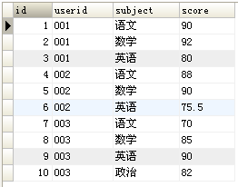

然后，我们再来看一下转换之后需要得到的结果，如下图：

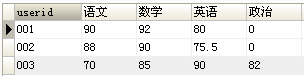

可以看出，这里行转列是将原来的subject字段的多行内容选出来，作为结果集中的不同列，并根据userid进行分组显示对应的score。通常，我们有两种方式来实现这种转换。

1. 使用 `CASE...WHEN...THEN` 语句实现行转列，参考如下代码：

   `SELECT` `userid,``SUM``(``CASE` ``subject` ``WHEN` `'语文'` `THEN` `score ``ELSE` `0 ``END``) ``as` `'语文'``,``SUM``(``CASE` ``subject` ``WHEN` `'数学'` `THEN` `score ``ELSE` `0 ``END``) ``as` `'数学'``,``SUM``(``CASE` ``subject` ``WHEN` `'英语'` `THEN` `score ``ELSE` `0 ``END``) ``as` `'英语'``,``SUM``(``CASE` ``subject` ``WHEN` `'政治'` `THEN` `score ``ELSE` `0 ``END``) ``as` `'政治'``FROM` `tb_score``GROUP` `BY` `userid`

   注意，SUM() 是为了能够使用GROUP BY根据userid进行分组，因为每一个userid对应的subject="语文"的记录只有一条，所以SUM() 的值就等于对应那一条记录的score的值。假如userid ='001' and subject='语文' 的记录有两条，则此时SUM() 的值将会是这两条记录的和，同理，使用Max()的值将会是这两条记录里面值最大的一个。但是正常情况下，一个user对应一个subject只有一个分数，因此可以使用SUM()、MAX()、MIN()、AVG()等聚合函数都可以达到行转列的效果。

2. 使用 `IF()` 函数实现行转列，参考如下代码：

   `SELECT` `userid,``SUM``(IF(`subject`=``'语文'``,score,0)) ``as` `'语文'``,``SUM``(IF(`subject`=``'数学'``,score,0)) ``as` `'数学'``,``SUM``(IF(`subject`=``'英语'``,score,0)) ``as` `'英语'``,``SUM``(IF(`subject`=``'政治'``,score,0)) ``as` `'政治'``FROM` `tb_score``GROUP` `BY` `userid`

   注意，`IF(subject='语文',score,0)` 作为条件，即对所有subject='语文'的记录的score字段进行SUM()、MAX()、MIN()、AVG()操作，如果score没有值则默认为0。

MySQL Client把SQL语句的模板（变量采用占位符进行占位）发送给MySQL服务器，MySQL服务器对SQL语句的模板进行编译，编译之后根据语句的优化分析对相应的索引进行优化，在最终绑定参数时把相应的参数传送给MySQL服务器，直接进行执行，节省了SQL查询时间，以及MySQL服务器的资源，达到一次编译、多次执行的目的，除此之外，还可以防止SQL注入。

具体是怎样防止SQL注入的呢？实际上当将绑定的参数传到MySQL服务器，MySQL服务器对参数进行编译，即填充到相应的占位符的过程中，做了转义操作。我们常用的JDBC就有预编译功能，不仅提升性能，而且防止SQL注入。

#### 1.9 WHERE和HAVING有什么区别？

**参考答案**

WHERE是一个约束声明，使用WHERE约束来自数据库的数据，WHERE是在结果返回之前起作用的，WHERE中不能使用聚合函数。

HAVING是一个过滤声明，是在查询返回结果集以后对查询结果进行的过滤操作，在HAVING中可以使用聚合函数。另一方面，HAVING子句中不能使用除了分组字段和聚合函数之外的其他字段。

从性能的角度来说，HAVING子句中如果使用了分组字段作为过滤条件，应该替换成WHERE子句。因为WHERE可以在执行分组操作和计算聚合函数之前过滤掉不需要的数据，性能会更好。

#### 2.2 索引有哪几种？

**参考答案**

MySQL的索引可以分为以下几类：

1. 普通索引和唯一索引

   普通索引是MySQL中的基本索引类型，允许在定义索引的列中插入重复值和空值。

   唯一索引要求索引列的值必须唯一，但允许有空值。如果是组合索引，则列值的组合必须唯一。

   主键索引是一种特殊的唯一索引，不允许有空值。

2. 单列索引和组合索引

   单列索引即一个索引只包含单个列，一个表可以有多个单列索引。

   组合索引是指在表的多个字段组合上创建的索引，只有在查询条件中使用了这些字段的左边字段时，索引才会被使用。使用组合索引时遵循最左前缀集合。

3. 全文索引

   全文索引类型为FULLTEXT，在定义索引的列上支持值的全文查找，允许在这些索引列中插入重复值和空值。全文索引可以在CHAR、VARCHAR或者TEXT类型的列上创建。MySQL中只有MyISAM存储引擎支持全文索引。

4. 空间索引

   空间索引是对空间数据类型的字段建立的索引，MySQL中的空间数据类型有4种，分别是GEOMETRY、POINT、LINESTRING和POLYGON。MySQL使用SPATIAL关键字进行扩展，使得能够用创建正规索引类似的语法创建空间索引。创建空间索引的列，必须将其声明为NOT NULL，空间索引只能在存储引擎为MyISAM的表中创建。

#### 2.12 介绍一下数据库索引的重构过程

**参考答案**

什么时候需要重建索引呢？

1. 表上频繁发生update,delete操作；
2. 表上发生了alter table ..move操作（move操作导致了rowid变化）。

怎么判断索引是否应该重建？

1. 一般看索引是否倾斜的严重，是否浪费了空间，对索引进行结构分析：

   ```sql
   analyze index index_name validate structure;
   ```

2. 在相同的session中查询index_stats表：

   ```sql
   select height,DEL_LF_ROWS/LF_ROWS from index_stats;
   ```

   当查询的height>=4（索引的深度，即从根到叶节点的高度）或DEL_LF_ROWS/LF_ROWS>0.2的情况下，就应该考虑重建该索引。

如何重建索引？

- drop原索引，然后再创建索引：

  ```sql
  drop index index_name;
  create index index_name on table_name (index_column);
  ```

  这种方式相当耗时，一般不建议使用。

- 直接重建索引：

  ```sql
  alter index indexname rebuild;
  alter index indexname rebuild online;
  ```

  此方法较快，建议使用。

rebuild是快速重建索引的一种有效的办法，因为它是一种使用现有索引项来重建新索引的方法。如果重建索引时有其他用户在对这个表操作，尽量使用带online参数来最大限度的减少索引重建时将会出现的任何加锁问题。由于新旧索引在建立时同时存在，因此，使用这种重建方法需要有额外的磁盘空间可供临时使用，当索引建完后把老索引删除，如果没有成功，也不会影响原来的索引。利用这种办法可以用来将一个索引移到新的表空间。

rebuild重建索引的过程：

1. Rebuild以index fast full scan或table full scan方式（采用那种方式取决于cost）读取原索引中的数据来构建一个新的索引，重建过程中有排序操作，rebuild online执行表扫描获取数据，重建过程中有排序的操作；
2. Rebuild会阻塞DML操作，rebuild online不会阻塞DML操作；
3. rebuild online时系统会产生一个SYS_JOURNAL_xxx的IOT类型的系统临时日志表，所有rebuild online时索引的变化都记录在这个表中，当新的索引创建完成后，把这个表的记录维护到新的索引中去，然后drop掉旧的索引，rebuild online就完成了。

重建索引过程中的注意事项：

1. 执行rebuild操作时，需要检查表空间是否足够；
2. 虽然说rebuild online操作允许DML操作，但还是建议在业务不繁忙时间段进行；
3. Rebuild操作会产生大量Redo Log；

#### 聚簇索引、非聚簇索引、主键的区别？

> 聚簇索引是指b+树中叶子节点存储的是数据，而非聚簇索引叶子节点存储的是索引的值

聚簇索引的顺序，就是数据在硬盘上的物理顺序。一般情况下主键就是默认的聚簇索引。

一张表只允许存在一个聚簇索引，因为真实数据的物理顺序只能有一种。如果一张表上还没有聚簇索引，为它新创建聚簇索引时，就需要对已有数据重新进行[排序]()，所以对表进行修改速度较慢是聚簇索引的缺点，对于经常更新的列不宜建立聚簇索引。

聚簇索引性能最好，因为一旦具有第一个索引值的记录被找到，具有连续索引值的记录也一定物理地紧跟其后。一张表只能有一个聚簇索引，所以非常珍贵，必须慎重设置，一般要根据这个表最常用的SQL查询方式选择某个（或多个）字段作为聚簇索引（或复合聚簇索引）。

聚簇索引默认是主键，如果表中没有定义主键，InnoDB[1]会选择一个唯一的非空索引代替（“唯一的非空索引”是指列不能出现null值的唯一索引，跟主键性质一样）。如果没有这样的索引，InnoDB会隐式地定义一个主键来作为聚簇索引。

**聚簇索引 与 唯一索引**
严格来说，聚簇索引不一定是唯一索引，聚簇索引的索引值并不要求是唯一的，唯一聚簇索引才是！在一个有聚簇索引的列上是可以插入两个或多个相同值的，这些相同值在硬盘上的物理[排序]()与聚簇索引的[排序]()相同，仅此而已。

#### InnoDB存储引擎有哪些常见的索引？

B+树索引、全文索引和哈希索引。


#### 2.19 模糊查询语句中如何使用索引？

**参考答案**

在MySQL中模糊查询 `mobile like ‘%8765’`，这种情况是不能使用 mobile 上的索引的，那么如果需要根据手机号码后四位进行模糊查询，可以用一下方法进行改造。

我们可以加入冗余列（MySQL5.7之后加入了虚拟列，使用虚拟列更合适，思路相同），比如 mobile_reverse，内部存储为 mobile 的倒叙文本，如 mobile为17312345678，那么 mobile_reverse 存储 87654321371，为 mobile_reverse 列建立索引，查询中使用语句 mobile_reverse like reverse(’%5678’) 即可。

reverse 是 MySQL 中的反转函数，这条语句相当于 mobile_reverse like ‘8765%’ ，这种语句是可以使用索引的。

#### 3.2 事务有哪几种类型，它们之间有什么区别？

- 扁平事务：是事务类型中最简单的一种，而在实际生产环境中，这可能是使用最为频繁的事务。在扁平事务中，所有操作都处于同一层次，其由BEGIN WORK开始，由COMMIT WORK或ROLLBACK WORK结束。处于之间的操作是原子的，要么都执行，要么都回滚。
- 带有保存点的扁平事务：除了支持扁平事务支持的操作外，允许在事务执行过程中回滚到同一事务中较早的一个状态，这是因为可能某些事务在执行过程中出现的错误并不会对所有的操作都无效，放弃整个事务不合乎要求，开销也太大。保存点（savepoint）用来通知系统应该记住事务当前的状态，以便以后发生错误时，事务能回到该状态。
- 链事务：可视为保存点模式的一个变种。链事务的思想是：在提交一个事务时，释放不需要的数据对象，将必要的处理上下文隐式地传给下一个要开始的事务。注意，提交事务操作和开始下一个事务操作将合并为一个原子操作。这意味着下一个事务将看到上一个事务的结果，就好像在一个事务中进行的。
- 嵌套事务：是一个层次结构框架。有一个顶层事务（top-level transaction）控制着各个层次的事务。顶层事务之下嵌套的事务被称为子事务（subtransaction），其控制每一个局部的变换。
- 分布式事务：通常是一个在分布式环境下运行的扁平事务，因此需要根据数据所在位置访问网络中的不同节点。对于分布式事务，同样需要满足ACID特性，要么都发生，要么都失效。

对于MySQL的InnoDB存储引擎来说，它支持扁平事务、带有保存点的扁平事务、链事务、分布式事务。对于嵌套事务，MySQL数据库并不是原生的，因此对于有并行事务需求的用户来说MySQL就无能为力了，但是用户可以通过带有保存点的事务来模拟串行的嵌套事务。

#### 3.3 MySQL的ACID特性分别是怎么实现的？

**参考答案**

原子性实现原理：

实现原子性的关键，是当事务回滚时能够撤销所有已经成功执行的sql语句。InnoDB实现回滚靠的是undo log，当事务对数据库进行修改时，InnoDB会生成对应的undo log。如果事务执行失败或调用了rollback，导致事务需要回滚，便可以利用undo log中的信息将数据回滚到修改之前的样子。

undo log属于逻辑日志，它记录的是sql执行相关的信息。当发生回滚时，InnoDB会根据undo log的内容做与之前相反的工作。对于insert，回滚时会执行delete。对于delete，回滚时会执行insert。对于update，回滚时则会执行相反的update，把数据改回去。

持久性实现原理：

InnoDB作为MySQL的存储引擎，数据是存放在磁盘中的，但如果每次读写数据都需要磁盘IO，效率会很低。为此，InnoDB提供了缓存(Buffer Pool)，Buffer Pool中包含了磁盘中部分数据页的映射，作为访问数据库的缓冲。当从数据库读取数据时，会首先从Buffer Pool中读取，如果Buffer Pool中没有，则从磁盘读取后放入Buffer Pool。当向数据库写入数据时，会首先写入Buffer Pool，Buffer Pool中修改的数据会定期刷新到磁盘中（这一过程称为刷脏）。

Buffer Pool的使用大大提高了读写数据的效率，但是也带了新的问题：如果MySQL宕机，而此时Buffer Pool中修改的数据还没有刷新到磁盘，就会导致数据的丢失，事务的持久性无法保证。

于是，redo log被引入来解决这个问题。当数据修改时，除了修改Buffer Pool中的数据，还会在redo log记录这次操作。当事务提交时，会调用fsync接口对redo log进行刷盘。如果MySQL宕机，重启时可以读取redo log中的数据，对数据库进行恢复。redo log采用的是WAL（Write-ahead logging，预写式日志），所有修改**先写入日志，再更新到Buffer Pool**，保证了数据不会因MySQL宕机而丢失，从而满足了持久性要求。

既然redo log也需要在事务提交时将日志写入磁盘，为什么它比直接将Buffer Pool中修改的数据写入磁盘(即刷脏)要快呢？主要有以下两方面的原因：

- 刷脏是随机IO，因为每次修改的数据位置随机，但写redo log是追加操作，属于顺序IO。
- 刷脏是以数据页（Page）为单位的，MySQL默认页大小是16KB，一个Page上一个小修改都要整页写入。而redo log中只包含真正需要写入的部分，无效IO大大减少。

隔离性实现原理：

隔离性追求的是并发情形下事务之间互不干扰。简单起见，我们主要考虑最简单的读操作和写操作(加锁读等特殊读操作会特殊说明)，那么隔离性的探讨，主要可以分为两个方面。

第一方面，(一个事务)写操作对(另一个事务)写操作的影响：锁机制保证隔离性。

隔离性要求同一时刻只能有一个事务对数据进行写操作，InnoDB通过锁机制来保证这一点。锁机制的基本原理可以概括为：事务在修改数据之前，需要先获得相应的锁。获得锁之后，事务便可以修改数据。该事务操作期间，这部分数据是锁定的，其他事务如果需要修改数据，需要等待当前事务提交或回滚后释放锁。

第二方面，(一个事务)写操作对(另一个事务)读操作的影响：MVCC保证隔离性。

它最大的优点是读不加锁，因此读写不冲突，并发性能好。InnoDB实现MVCC，多个版本的数据可以共存，主要基于以下技术及数据结构：

1. 隐藏列：InnoDB中每行数据都有隐藏列，隐藏列中包含了本行数据的事务id、指向undo log的指针等。
2. 基于undo log的版本链：每行数据的隐藏列中包含了指向undo log的指针，而每条undo log也会指向更早版本的undo log，从而形成一条版本链。
3. ReadView：通过隐藏列和版本链，MySQL可以将数据恢复到指定版本。但是具体要恢复到哪个版本，则需要根据ReadView来确定。所谓ReadView，是指事务（记做事务A）在某一时刻给整个事务系统（trx_sys）打快照，之后再进行读操作时，会将读取到的数据中的事务id与trx_sys快照比较，从而判断数据对该ReadView是否可见，即对事务A是否可见。

一致性实现原理：

可以说，一致性是事务追求的最终目标。前面提到的原子性、持久性和隔离性，都是为了保证数据库状态的一致性。此外，除了数据库层面的保障，一致性的实现也需要应用层面进行保障。实现一致性的措施包括：

- 保证原子性、持久性和隔离性，如果这些特性无法保证，事务的一致性也无法保证。
- 数据库本身提供保障，例如不允许向整形列插入字符串值、字符串长度不能超过列的限制等。
- 应用层面进行保障，例如如果转账操作只扣除转账者的余额，而没有增加接收者的余额，无论数据库实现的多么完美，也无法保证状态的一致。

#### 3.7 如何实现可重复读？

**参考答案**

为了实现可重复读，MySQL 采用了 MVVC (多版本并发控制) 的方式。

我们在数据库表中看到的一行记录可能实际上有多个版本，每个版本的记录除了有数据本身外，还要有一个表示版本的字段，记为 row trx_id，而这个字段就是使其产生的事务的 id，事务 ID 记为 transaction id，它在事务开始的时候向事务系统申请，按时间先后顺序递增。

如下图，一行记录现在有 3 个版本，每一个版本都记录这使其产生的事务 ID，比如事务A的transaction id 是100，那么版本1的row trx_id 就是 100，同理版本2和版本3。

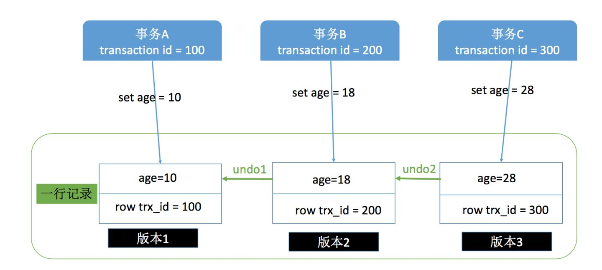

可重复读是在事务开始的时候生成一个当前事务全局性的快照。对于一个快照来说，它能够读到那些版本数据，要遵循以下规则：

1. 当前事务内的更新，可以读到；
2. 版本未提交，不能读到；
3. 版本已提交，但是却在快照创建后提交的，不能读到；
4. 版本已提交，且是在快照创建前提交的，可以读到。

#### 3.8 如何解决幻读问题？

**参考答案**

MySQL 已经在可重复读隔离级别下解决了幻读的问题，用的是间隙锁。MySQL 把行锁和间隙锁合并在一起，解决了并发写和幻读的问题，这个锁叫做 Next-Key锁。

假设现在表中有两条记录，并且 age 字段已经添加了索引，两条记录 age 的值分别为 10 和 30。此时，在数据库中会为索引维护一套B+树，用来快速定位行记录。B+索引树是有序的，所以会把这张表的索引分割成几个区间。

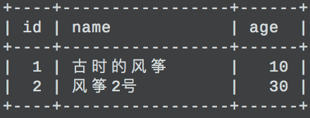

此时，在数据库中会为索引维护一套B+树，用来快速定位行记录。B+索引树是有序的，所以会把这张表的索引分割成几个区间。如图所示，分成了3 个区间，在这3个区间是可以加间隙锁的。

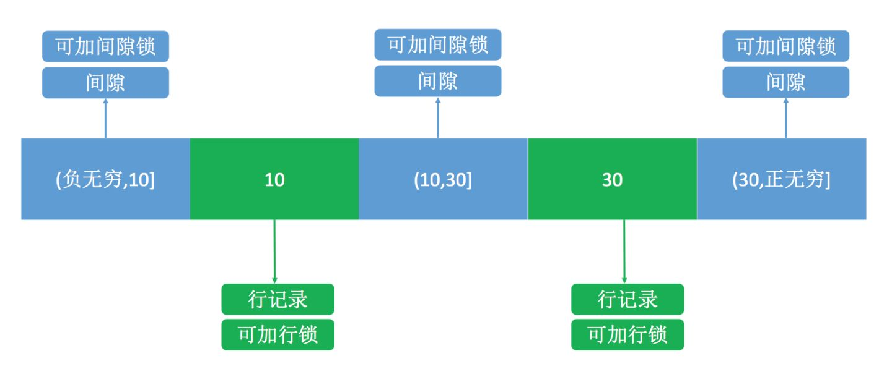

之后，我用下面的两个事务演示一下加锁过程。

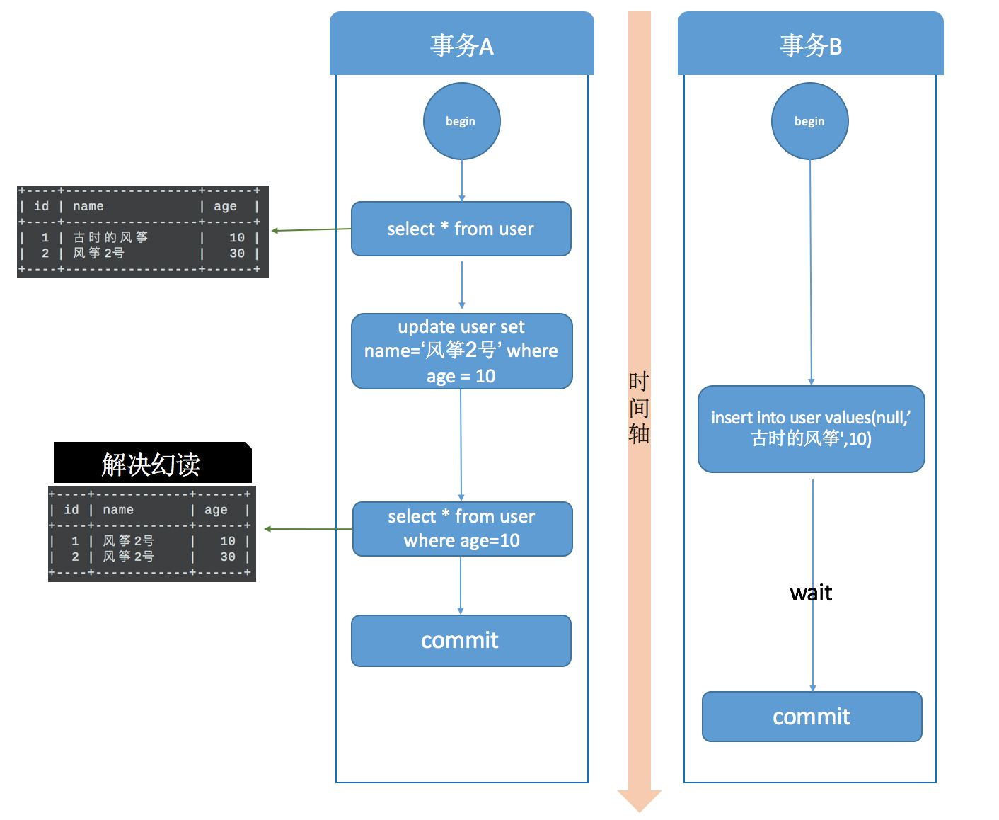

在事务A提交之前，事务B的插入操作只能等待，这就是间隙锁起得作用。当事务A执行`update user set name='风筝2号’ where age = 10;` 的时候，由于条件 where age = 10 ，数据库不仅在 age =10 的行上添加了行锁，而且在这条记录的两边，也就是(负无穷,10]、(10,30]这两个区间加了间隙锁，从而导致事务B插入操作无法完成，只能等待事务A提交。不仅插入 age = 10 的记录需要等待事务A提交，age<10、10<age<30 的记录页无法完成，而大于等于30的记录则不受影响，这足以解决幻读问题了。

这是有索引的情况，如果 age 不是索引列，那么数据库会为整个表加上间隙锁。所以，如果是没有索引的话，不管 age 是否大于等于30，都要等待事务A提交才可以成功插入。

#### 4种隔离级别?

**未提交读**（Read Uncommitted）：在事务 A 读取数据时，事务 B 读取和修改数据加了共享锁。这种隔离级别，会导致脏读、不可重复读以及幻读。

**已提交读**（Read Committed）：在事务 A 读取数据时增加了共享锁，一旦读取，立即释放锁，事务 B 读取修改数据时增加了行级排他锁，直到事务结束才释放锁。也就是说，事务 A 在读取数据时，事务 B 只能读取数据，不能修改。当事务 A 读取到数据后，事务 B才能修改。这种隔离级别，可以避免脏读，但依然存在不可重复读以及幻读的问题。

**可重复读**（Repeatable Read）：在事务 A 读取数据时增加了共享锁，事务结束，才释放锁，事务 B 读取修改数据时增加了行级排他锁，直到事务结束才释放锁。也就是说，事务A 在没有结束事务时，事务 B 只能读取数据，不能修改。当事务 A 结束事务，事务 B 才能修改。这种隔离级别，可以避免脏读、不可重复读，但依然存在幻读的问题。

**可序列化**（Serializable）：在事务 A 读取数据时增加了共享锁，事务结束，才释放锁，事务 B 读取修改数据时增加了表级排他锁，直到事务结束才释放锁。可序列化解决了脏读、不可重复读、幻读等问题，但隔离级别越来越高的同时，并发性会越来越低。

#### 4.1 了解数据库的锁吗？

**参考答案**

锁是数据库系统区别于文件系统的一个关键特性，锁机制用于管理对共享资源的并发访问。下面我们以MySQL数据库的InnoDB引擎为例，来说明锁的一些特点。

锁的类型：

InnoDB存储引擎实现了如下两种标准的行级锁：

- 共享锁（S Lock），允许事务读一行数据。
- 排他锁（X Lock），允许事务删除或更新一行数据。

如果一个事务T1已经获得了行r的共享锁，那么另外的事务T2可以立即获得行r的共享锁，因为读取并没有改变行r的数据，称这种情况为锁兼容。但若有其他的事务T3想获得行r的排他锁，则其必须等待事务T1、T2释放行r上的共享锁，这种情况称为锁不兼容。下图显示了共享锁和排他锁的兼容性，可以发现X锁与任何的锁都不兼容，而S锁仅和S锁兼容。需要特别注意的是，S和X锁都是行锁，兼容是指对同一记录（row）锁的兼容性情况。


锁的粒度：

InnoDB存储引擎支持多粒度锁定，这种锁定允许事务在行级上的锁和表级上的锁同时存在。为了支持在不同粒度上进行加锁操作，InnoDB存储引擎支持一种额外的锁方式，称之为意向锁。意向锁是将锁定的对象分为多个层次，意向锁意味着事务希望在更细粒度上进行加锁。

InnoDB存储引擎支持意向锁设计比较简练，其意向锁即为表级别的锁。设计目的主要是为了在一个事务中揭示下一行将被请求的锁类型。其支持两种意向锁：

- 意向共享锁（IS Lock），事务想要获得一张表中某几行的共享锁。
- 意向排他锁（IX Lock），事务想要获得一张表中某几行的排他锁。

由于InnoDB存储引擎支持的是行级别的锁，因此意向锁其实不会阻塞除全表扫以外的任何请求。故表级意向锁与行级锁的兼容性如下图所示。

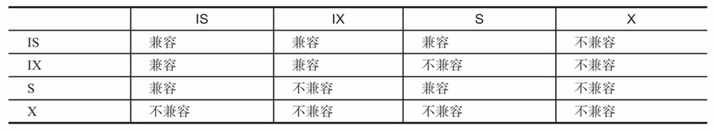

锁的算法：

InnoDB存储引擎有3种行锁的算法，其分别是：

- Record Lock：单个行记录上的锁。
- Gap Lock：间隙锁，锁定一个范围，但不包含记录本身。
- Next-Key Lock∶Gap Lock+Record Lock，锁定一个范围，并且锁定记录本身。

Record Lock总是会去锁住索引记录，如果InnoDB存储引擎表在建立的时候没有设置任何一个索引，那么这时InnoDB存储引擎会使用隐式的主键来进行锁定。Next-Key Lock是结合了Gap Lock和Record Lock的一种锁定算法，在Next-Key Lock算法下，InnoDB对于行的查询都是采用这种锁定算法。采用Next-Key Lock的锁定技术称为Next-Key Locking，其设计的目的是为了解决Phantom Problem（幻读）。而利用这种锁定技术，锁定的不是单个值，而是一个范围，是谓词锁（predict lock）的一种改进。

关于死锁：

死锁是指两个或两个以上的事务在执行过程中，因争夺锁资源而造成的一种互相等待的现象。若无外力作用，事务都将无法推进下去。

解决死锁问题最简单的一种方法是超时，即当两个事务互相等待时，当一个等待时间超过设置的某一阈值时，其中一个事务进行回滚，另一个等待的事务就能继续进行。

除了超时机制，当前数据库还都普遍采用wait-for graph（等待图）的方式来进行死锁检测。较之超时的解决方案，这是一种更为主动的死锁检测方式。InnoDB存储引擎也采用的这种方式。wait-for graph要求数据库保存以下两种信息：

- 锁的信息链表；
- 事务等待链表；

通过上述链表可以构造出一张图，而在这个图中若存在回路，就代表存在死锁，因此资源间相互发生等待。这是一种较为主动的死锁检测机制，在每个事务请求锁并发生等待时都会判断是否存在回路，若存在则有死锁，通常来说InnoDB存储引擎选择回滚undo量最小的事务。

锁的升级：

锁升级（Lock Escalation）是指将当前锁的粒度降低。举例来说，数据库可以把一个表的1000个行锁升级为一个页锁，或者将页锁升级为表锁。

InnoDB存储引擎不存在锁升级的问题。因为其不是根据每个记录来产生行锁的，相反，其根据每个事务访问的每个页对锁进行管理的，采用的是位图的方式。因此不管一个事务锁住页中一个记录还是多个记录，其开销通常都是一致的。

#### 4.2 介绍一下间隙锁

**参考答案**

InnoDB存储引擎有3种行锁的算法，间隙锁（Gap Lock）是其中之一。间隙锁用于锁定一个范围，但不包含记录本身。它的作用是为了阻止多个事务将记录插入到同一范围内，而这会导致幻读问题的产生。

#### 4.3 InnoDB中行级锁是怎么实现的？

**参考答案**

InnoDB行级锁是通过给索引上的索引项加锁来实现的。只有通过索引条件检索数据，InnoDB才使用行级锁，否则，InnoDB将使用表锁。

当表中锁定其中的某几行时，不同的事务可以使用不同的索引锁定不同的行。另外，不论使用主键索引、唯一索引还是普通索引，InnoDB都会使用行锁来对数据加锁。

#### 4.4 数据库在什么情况下会发生死锁？

**参考答案**

死锁是指两个或两个以上的事务在执行过程中，因争夺锁资源而造成的一种互相等待的现象。若无外力作用，事务都将无法推进下去。下图演示了死锁的一种经典的情况，即A等待B、B等待A，这种死锁问题被称为AB-BA死锁。

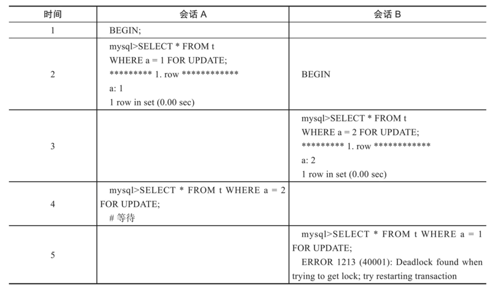

#### 4.5 说说数据库死锁的解决办法

**参考答案**

解决死锁问题最简单的一种方法是超时，即当两个事务互相等待时，当一个等待时间超过设置的某一阈值时，其中一个事务进行回滚，另一个等待的事务就能继续进行。

除了超时机制，当前数据库还都普遍采用wait-for graph（等待图）的方式来进行死锁检测。较之超时的解决方案，这是一种更为主动的死锁检测方式。InnoDB存储引擎也采用的这种方式。wait-for graph要求数据库保存以下两种信息：

- 锁的信息链表；
- 事务等待链表；

通过上述链表可以构造出一张图，而在这个图中若存在回路，就代表存在死锁，因此资源间相互发生等待。这是一种较为主动的死锁检测机制，在每个事务请求锁并发生等待时都会判断是否存在回路，若存在则有死锁，通常来说InnoDB存储引擎选择回滚undo量最小的事务。

#### 5.6 说一说你对explain的了解

**参考答案**

MySQL中提供了EXPLAIN语句和DESCRIBE语句，用来分析查询语句，EXPLAIN语句的基本语法如下：

```mysql
EXPLAIN [EXTENDED] SELECT select_options
```

使用EXTENED关键字，EXPLAIN语句将产生附加信息。执行该语句，可以分析EXPLAIN后面SELECT语句的执行情况，并且能够分析出所查询表的一些特征。下面对查询结果进行解释：

- id：SELECT识别符。这是SELECT的查询序列号。
- select_type：表示SELECT语句的类型。
- table：表示查询的表。
- type：表示表的连接类型。
- possible_keys：给出了MySQL在搜索数据记录时可选用的各个索引。
- key：是MySQL实际选用的索引。
- key_len：给出索引按字节计算的长度，key_len数值越小，表示越快。
- ref：给出了关联关系中另一个数据表里的数据列名。
- rows：是MySQL在执行这个查询时预计会从这个数据表里读出的数据行的个数。
- Extra：提供了与关联操作有关的信息。

**扩展阅读**

DESCRIBE语句的使用方法与EXPLAIN语句是一样的，分析结果也是一样的，并且可以缩写成DESC。。DESCRIBE语句的语法形式如下：

```mysql
DESCRIBE SELECT select_options
```

#### 5.7 explain关注什么？

**参考答案**

重点要关注如下几列：

|  列名   |                             备注                             |
| :-----: | :----------------------------------------------------------: |
|  type   |    本次查询表联接类型，从这里可以看到本次查询大概的效率。    |
|   key   |   最终选择的索引，如果没有索引的话，本次查询效率通常很差。   |
| key_len |             本次查询用于结果过滤的索引实际长度。             |
|  rows   |     预计需要扫描的记录数，预计需要扫描的记录数越小越好。     |
|  Extra  | 额外附加信息，主要确认是否出现 Using filesort、Using temporary 这两种情况。 |

其中，type包含以下几种结果，从上之下依次是最差到最好：

|      类型       |                             备注                             |
| :-------------: | :----------------------------------------------------------: |
|       ALL       |          执行full table scan，这是最差的一种方式。           |
|      index      | 执行full index scan，并且可以通过索引完成结果扫描并且直接从索引中取的想要的结果数据，也就是可以避免回表，比ALL略好，因为索引文件通常比全部数据要来的小。 |
|      range      |             利用索引进行范围查询，比index略好。              |
| index_subquery  |                    子查询中可以用到索引。                    |
| unique_subquery |   子查询中可以用到唯一索引，效率比 index_subquery 更高些。   |
|   index_merge   |     可以利用index merge特性用到多个索引，提高查询效率。      |
|   ref_or_null   |    表连接类型是ref，但进行扫描的索引列中可能包含NULL值。     |
|    fulltext     |                          全文检索。                          |
|       ref       |            基于索引的等值查询，或者表间等值连接。            |
|     eq_ref      |   表连接时基于主键或非NULL的唯一索引完成扫描，比ref略好。    |
|      const      | 基于主键或唯一索引唯一值查询，最多返回一条结果，比eq_ref略好。 |
|     system      |           查询对象表只有一行数据，这是最好的情况。           |

另外，Extra列需要注意以下的几种情况：

|            关键字            |                             备注                             |
| :--------------------------: | :----------------------------------------------------------: |
|        Using filesort        | 将用外部排序而不是按照索引顺序排列结果，数据较少时从内存排序，否则需要在磁盘完成排序，代价非常高，需要添加合适的索引。 |
|       Using temporary        | 需要创建一个临时表来存储结果，这通常发生在对没有索引的列进行GROUP BY时，或者ORDER BY里的列不都在索引里，需要添加合适的索引。 |
|         Using index          | 表示MySQL使用覆盖索引避免全表扫描，不需要再到表中进行二次查找数据，这是比较好的结果之一。注意不要和type中的index类型混淆。 |
|         Using where          | 通常是进行了全表/全索引扫描后再用WHERE子句完成结果过滤，需要添加合适的索引。 |
|       Impossible WHERE       | 对Where子句判断的结果总是false而不能选择任何数据，例如where 1=0，无需过多关注。 |
| Select tables optimized away | 使用某些聚合函数来访问存在索引的某个字段时，优化器会通过索引直接一次定位到所需要的数据行完成整个查询，例如MIN()\MAX()，这种也是比较好的结果之一。 |

#### 6.3 说一说你对redo log、undo log、binlog的了解

**参考答案**

binlog（Binary Log）：

二进制日志文件就是常说的binlog。二进制日志记录了MySQL所有修改数据库的操作，然后以二进制的形式记录在日志文件中，其中还包括每条语句所执行的时间和所消耗的资源，以及相关的事务信息。

默认情况下，二进制日志功能是开启的，启动时可以重新配置`--log-bin[=file_name]`选项，修改二进制日志存放的目录和文件名称。

redo log：

重做日志用来实现事务的持久性，记录的是**物理级别上的页修改操作**。它由两部分组成：一是内存中的重做日志缓冲（redo log buffer），其是易失的；二是重做日志文件（redo log file），它是持久的。

InnoDB是事务的存储引擎，它通过Force Log at Commit机制实现事务的持久性，即当事务提交（COMMIT）时，必须先将该事务的所有日志写入到重做日志文件进行持久化，待事务的COMMIT操作完成才算完成。这里的日志是指重做日志，在InnoDB存储引擎中，由两部分组成，即redo log和undo log。

undo log：

事务进行回滚操作，记录的是逻辑操作日志，比如某一行进行了insert操作，那么undo记录delete操作。

redo存放在重做日志文件中，与redo不同，undo存放在数据库内部的一个特殊段（segment）中，这个段称为undo段（undo segment），undo段位于共享表空间内。

redo和undo区别？

>**redo log用来保证事务的持久性，undo log用来帮助事务回滚及MVCC的功能。redo log基本上都是顺序写的，在数据库运行时不需要对redo log的文件进行读取操作。而undo log是需要进行随机读写的。**

#### 6.4 谈谈你对MVCC的了解

**参考答案**

InnoDB默认的隔离级别是RR（REPEATABLE READ），RR解决脏读、不可重复读、幻读等问题，使用的是MVCC。MVCC全称Multi-Version Concurrency Control，即多版本的并发控制协议。它最大的优点是读不加锁，因此读写不冲突，并发性能好。InnoDB实现MVCC，多个版本的数据可以共存，主要基于以下技术及数据结构：

1. 隐藏列：InnoDB中每行数据都有隐藏列，隐藏列中包含了本行数据的事务id、指向undo log的指针等。
2. 基于undo log的版本链：每行数据的隐藏列中包含了指向undo log的指针，而每条undo log也会指向更早版本的undo log，从而形成一条版本链。
3. ReadView：通过隐藏列和版本链，MySQL可以将数据恢复到指定版本。但是具体要恢复到哪个版本，则需要根据ReadView来确定。所谓ReadView，是指事务（记做事务A）在某一时刻给整个事务系统（trx_sys）打快照，之后再进行读操作时，会将读取到的数据中的事务id与trx_sys快照比较，从而判断数据对该ReadView是否可见，即对事务A是否可见。

#### 6.2 说一说你对MySQL引擎的了解

**参考答案**

MySQL提供了多个不同的存储引擎，包括处理事务安全表的引擎和处理非事务安全表的引擎。在MySQL中，不需要在整个服务器中使用同一种存储引擎，针对具体的要求，可以对每一个表使用不同的存储引擎。MySQL 8.0支持的存储引擎有InnoDB、MyISAM、Memory、Merge、Archive、Federated、CSV、BLACKHOLE等。其中，最常用的引擎是InnoDB和MyISAM。

InnoDB存储引擎：

InnoDB是事务型数据库的首选引擎，支持事务安全表（ACID），支持行锁定和外键。MySQL 5.5.5之后，InnoDB作为默认存储引擎，主要特性如下：

1. InnoDB给MySQL提供了具有提交、回滚和崩溃恢复能力的事务安全（ACID兼容）存储引擎。InnoDB锁定在行级并且也在SELECT语句中提供一个类似Oracle的非锁定读。这些功能增加了多用户部署和性能。在SQL查询中，可以自由地将InnoDB类型的表与其他MySQL表的类型混合起来，甚至在同一个查询中也可以混合。
2. InnoDB是为处理巨大数据量的最大性能设计。它的CPU效率可能是任何其他基于磁盘的关系数据库引擎所不能匹敌的。
3. InnoDB存储引擎完全与MySQL服务器整合，为在主内存中缓存数据和索引而维持它自己的缓冲池。InnoDB将它的表和索引存在一个逻辑表空间中，表空间可以包含数个文件（或原始磁盘分区）。这与MyISAM表不同，比如在MyISAM表中每个表被存在分离的文件中。InnoDB表可以是任何尺寸，即使在文件尺寸被限制为2GB的操作系统上。
4. InnoDB支持外键完整性约束（FOREIGN KEY）。存储表中的数据时，每张表的存储都按主键顺序存放，如果没有显示在表定义时指定主键，InnoDB会为每一行生成一个6B的ROWID，并以此作为主键。
5. InnoDB被用在众多需要高性能的大型数据库站点上。InnoDB不创建目录，使用InnoDB时，MySQL将在数据目录下创建一个名为ibdata1的10MB大小的自动扩展数据文件，以及两个名为ib_logfile0和ib_logfile1的5MB大小的日志文件。

MyISAM存储引擎：

MyISAM基于ISAM存储引擎，并对其进行扩展。它是在Web、数据仓储和其他应用环境下最常使用的存储引擎之一。MyISAM拥有较高的插入、查询速度，但不支持事务。MyISAM的主要特性如下：

1. 在支持大文件（达63位文件长度）的文件系统和操作系统上被支持。
2. 当把删除和更新及插入操作混合使用的时候，动态尺寸的行产生更少碎片。这要通过合并相邻被删除的块以及若下一个块被删除则扩展到下一块来自动完成。
3. 每个MyISAM表最大的索引数是64，这可以通过重新编译来改变。每个索引最大的列数是16个。
4. 最大的键长度是1000B，这也可以通过编译来改变。对于键长度超过250B的情况，一个超过1024B的键将被用上。
5. BLOB和TEXT列可以被索引。
6. NULL值被允许在索引的列中，这个值占每个键的0~1个字节。
7. 所有数字键值以高字节优先被存储，以允许一个更高的索引压缩。
8. 每个表一个AUTO_INCREMENT列的内部处理。MyISAM为INSERT和UPDATE操作自动更新这一列，这使得AUTO_INCREMENT列更快（至少10%）。在序列顶的值被删除之后就不能再利用。
9. 可以把数据文件和索引文件放在不同目录。
10. 每个字符列可以有不同的字符集。
11. 有VARCHAR的表可以固定或动态记录长度。
12. VARCHAR和CHAR列可以多达64KB。

#### 6.5 MySQL主从同步是如何实现的？

**参考答案**

复制（replication）是MySQL数据库提供的一种高可用高性能的解决方案，一般用来建立大型的应用。总体来说，replication的工作原理分为以下3个步骤：

1. 主服务器（master）把数据更改记录到二进制日志（binlog）中。
2. 从服务器（slave）把主服务器的二进制日志复制到自己的中继日志（relay log）中。
3. 从服务器重做中继日志中的日志，把更改应用到自己的数据库上，以达到数据的最终一致性。

复制的工作原理并不复杂，其实就是一个完全备份加上二进制日志备份的还原。不同的是这个二进制日志的还原操作基本上实时在进行中。这里特别需要注意的是，复制不是完全实时地进行同步，而是异步实时。这中间存在主从服务器之间的执行延时，如果主服务器的压力很大，则可能导致主从服务器延时较大。复制的工作原理如下图所示，其中从服务器有2个线程，一个是I/O线程，负责读取主服务器的二进制日志，并将其保存为中继日志；另一个是SQL线程，复制执行中继日志。

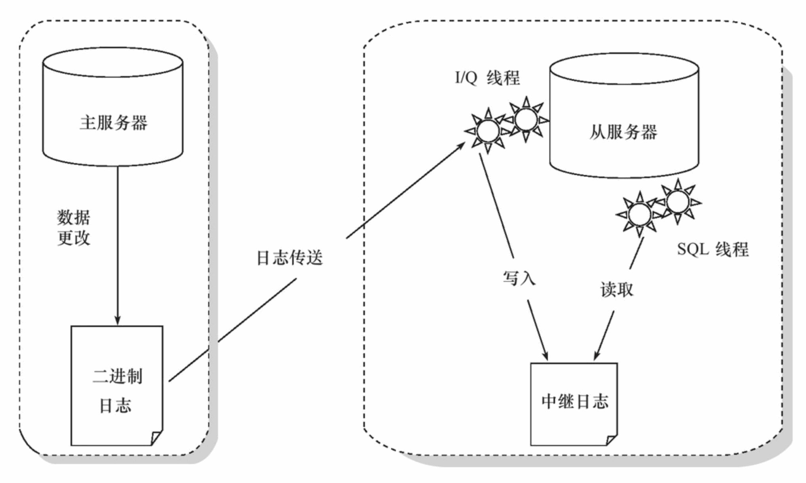

#### 删除数据库

- truncate：删除表后重建，不知道删除了多少条数据；保留表结构；重置自增值；保留分区；

- delete：逐条删除，知道删除了多少条数据；保留表结构；不重置自增值；

#### 2.事务的特性有哪些？分别是怎么保证的？

回答：事务的四大特性分别是原子性、一致性、隔离性和持久性。

下面这段话摘自《MySQL技术内幕-InnoDB存储引擎》

原子性、一致性和持久性是通过数据库的redo log和undo log来完成。redo log称为重做日志，用来保证事务的原子性和持久性。undo log用来保证事务的一致性。而隔离性是通过锁实现的。【具体大家看书吧，书上比较详细。】

**面试官可能会问三种日志的区别和作用。**

redo log：恢复提交事务修改的页操作；通常是物理日志，记录的是页的物理修改操作。

uodo log：回滚记录到某个特定版本；通常是逻辑日志，根据每行记录进行记录。

bin log：用来进行Point-In-Time(PIT)的恢复及主从复制环境的建立。

**这里面试官可能会接着问binlog和redolog的区别？**

回答：

（1）重做日志是在InnoDB存储引擎层产生的，而二进制日志是在MySQL数据库上层产生的，二进制日志不仅仅针对InnoDB存储引擎，任何存储引擎都会产生二进制日志。

（2）两种日志的记录内容形式不同。二进制日志是一种逻辑日志，记录的是SQL语句；而InnoDB存储引擎层面的重做日志是物理格式日志，记录的是对于每个页的修改。

（3）写入磁盘的时间不同，二进制日志只在事务提交完成后进行一次写入，而redo log在事务进行中不断的写入。

#### 哪些情况会导致索引失效？

> 1. 不满足最左前缀原则
> 2. 字符串不加单引号
> 3. 范围查找和运算
> 4. or关联的字段不是索引，会导致整个索引失效
> 5. like ‘%xx’
> 6. 索引取值辨识度不高时（gender），优化器可能会选择全表扫描而非选择索引（解决：force index）
> 7. is null 和 is not null **有时**优化器可能会选择全表扫描而非选择索引（和6类似，也是辨识度）
> 8. not in


## 1.什么是锁，锁的作用是什么？

回答：锁是数据库系统区别文件系统的一个关键特性，锁机制用于管理对共享资源的并发访问，保持数据的完整性和一致性。【摘自：MySQL技术内幕InnoDB存储引擎】

## 2.数据库有哪些锁？lock和latch的区别

回答：数据库中有表锁和行锁等

lock锁：锁的对象是事务，用于锁定数据库中的对象，如表、页、行等，并且lock锁一般在commit或rollback后释放，有死锁机制。

latch锁：一般称为轻量级锁，要求锁定的时间必须非常短，在InnoDB中又可以分为mutex(互斥量)和rwlock(读写锁)。目的是用来保证并发线程操作临界资源的正确性，并且通常没有死锁检测的机制。

## 3.InnoDB存储引擎中的锁都有哪些类型？

回答：可以分为共享锁、排他锁、意向锁、一致性非锁定读和一致性锁定读。

其中**共享锁**和**排他锁**均属于**行级锁**。

共享锁(S Lock)：运行事务读一行数据。

排他锁(X Lock)：允许事务删除或更新一行数据。

> 行锁的三种[算法]()：
>
> Record Lock：单个行记录上的锁
>
> Gap Lock：间隙锁，锁定一个范围，但不包含记录本身。
>
> Next-Key Lock：Gap+Record Lock锁定一个范围，并且锁定记录本身。

**意向锁**属于**表级别**的锁，又可以分为意向共享锁(IS Lock)和意向排他锁(IX Lock)。

意向共享锁(IS Lock)：事务想要获得一张表中某几行的共享锁。

意向排他锁(IX Lock)：事务想要获得一张表中某几行的排他锁。

**一致性非锁定读**：指InnoDB存储引擎通过**多版本控制**的方式来读取当前执行时间数据库中行的数据。如果读取的行正在执行DELETE或UPDATE操作，这时读取操作不会因此等待行上锁的释放，相反的，InnoDB存储引擎会读取一个快照数据。

一致性锁定读：InnoDB存储引擎对于SELECT语句支持两种一致性锁定读的操作：

select ... for update和select ... lock in share mode。

## 4.什么是一致性非锁定读(MVCC)？

### 什么是MVCC？

MVCC实现原理【MVCC多版本并发控制，指的是一种提高并发的技术。】
Multi-Version Concurrency Control。
最早的数据库系统，只有读读之间可以并发，读写，写读，写写都要阻塞。引入多版本之后，只有写写之间相互阻塞，其他三种操作都可以并行，这样大幅度提高了InnoDB的并发度。

### MVCC能解决什么问题，好处是？

数据库并发场景有三种，分别为：
读-读：不存在任何问题，也不需要并发控制
读-写：有线程安全问题，可能会造成事务隔离性问题，可能遇到脏读，幻读，不可重复读
写-写：有线程安全问题，可能会存在更新丢失问题，比如第一类更新丢失，第二类更新丢失

### MVCC带来的好处是？

MVCC可以为数据库解决以下问题

在并发读写数据库时，可以做到在读操作时不用阻塞写操作，写操作也不用阻塞读操作，提高了数据库并发读写的性能
同时还可以解决脏读，幻读，不可重复读等事务隔离问题，但不能解决更新丢失问题
MVCC只在读取已提交和可重复 读两种隔离级别下有作用

MVCC常见的实现方式乐观锁和悲观锁

MVCC是行级锁的变种，很多情况下避免了加锁操作。

应对高并发事务, MVCC比单纯的加锁更高效;

InnoDB存储引擎在数据库每行数据的后面添加了三个字段, 不是两个!!

### 核心概念【很重要！！！】

1.Read view一致性视图【 主要是用来做可见性判断的, 比较普遍的解释便是"本事务不可见的当前其他活跃事务", 】

2.read view快照的生成时机, 也非常关键, 正是因为生成时机的不同, 造成了RC,RR两种隔离级别的不同可见性;

在innodb中(默认repeatable read级别), 事务在begin/start
transaction之后的第一条select读操作后, 会创建一个快照(read view), 将当前系统中活跃的其他事务记录记录起来;
在innodb中(默认repeatable committed级别), 事务中每条select语句都会创建一个快照(read view);
3.undo-log 【回滚日志，通过undo读取之前的版本信息，以此实现非锁定读取！】 是MVCC的重要组成部分！

当我们对记录做了变更操作时就会产生undo记录，Undo记录默认被记录到系统表空间(ibdata)中，但从5.6开始，也可以使用独立的Undo 表空间。

Undo记录中存储的是老版本数据，当一个旧的事务需要读取数据时，为了能读取到老版本的数据，需要顺着undo链找到满足其可见性的记录。

另外, 在回滚段中的undo logs分为: insert undo log 和 update undo log insert undo
insert undo log : 事务对insert新记录时产生的undolog, 只在事务回滚时需要, 并且在事务提交后就可以立即丢弃。 update undo
update undo log : 事务对记录进行delete和update操作时产生的undo log, 不仅在事务回滚时需要,
一致性读也需要，所以不能随便删除，只有当数据库所使用的快照中不涉及该日志记录，对应的回滚日志才会被purge线程删除。

4.InnoDB存储引擎在数据库每行数据的后面添加了三个字段
分别是事务ID、回滚指针和

6字节的DB_ROW_ID字段: 包含一个随着新行插入而单调递增的行ID, 当由innodb自动产生聚集索引时，聚集索引会包括这个行ID的值，否则这个行ID不会出现在任何索引中。

5.可见性比较[算法]()（这里每个比较[算法]()后面的描述是建立在rr级别下，rc级别也是使用该比较[算法](),此处未做描述）

设要读取的行的最后提交事务id(即当前数据行的稳定事务id)为 trx_id_current

当前新开事务id为 new_id

当前新开事务创建的快照read view 中最早的事务id为up_limit_id, 最迟的事务id为low_limit_id(注意这个low_limit_id=未开启的事务id=当前最大事务id+1)

比较:

1. trx_id_current < up_limit_id, 这种情况比较好理解, 表示, 新事务在读取该行记录时, 该行记录的稳定事务ID是小于, 系统当前所有活跃的事务, 所以当前行稳定数据对新事务可见, 跳到步骤5. 
2. trx_id_current >= trx_id_last, 这种情况也比较好理解, 表示, 该行记录的稳定事务id是在本次新事务创建之后才开启的,但是却在本次新事务执行第二个select前就commit了，所以该行记录的当前值不可见, 跳到步骤4 
3. trx_id_current <= trx_id_current <= trx_id_last, 表示: 该行记录所在事务在本次新事务创建的时候处于活动状态，从up_limit_id到low_limit_id进行遍历，如果trx_id_current等于他们之中的某个事务id的话，那么不可见,调到步骤4,否则表示可见。 
4. 从该行记录的 DB_ROLL_PTR 指针所指向的回滚段中取出最新的undo-log的版本号, 将它赋值该 trx_id_current，然后跳到步骤1重新开始判断。 
5. 将该可见行的值返回。 

## 5.锁可能会带来什么问题？

回答：通过锁机制实现了事务的隔离性，使得事务可以并发的工作，但同时也会有一些潜在的问题。锁会带来如下问题：脏读、不可重复度、丢失修改和幻读。

- **脏读（Dirty read）:** 当一个事务正在访问数据并且对数据进行了修改，而这种修改还没有提交到数据库中，这时另外一个事务也访问了这个数据，然后使用了这个数据。因为这个数据是还没有提交的数据，那么另外一个事务读到的这个数据是“脏数据”，依据“脏数据”所做的操作可能是不正确的。 
- **丢失修改（Lost to modify）:** 指在一个事务读取一个数据时，另外一个事务也访问了该数据，那么在第一个事务中修改了这个数据后，第二个事务也修改了这个数据。这样第一个事务内的修改结果就被丢失，因此称为丢失修改。 例如：事务1读取某表中的数据A=20，事务2也读取A=20，事务1修改A=A-1，事务2也修改A=A-1，最终结果A=19，事务1的修改被丢失。 
- **不可重复读（Unrepeatableread）:** 指在一个事务内多次读同一数据。在这个事务还没有结束时，另一个事务也访问该数据。那么，在第一个事务中的两次读数据之间，由于第二个事务的修改导致第一个事务两次读取的数据可能不太一样。这就发生了在一个事务内两次读到的数据是不一样的情况，因此称为不可重复读。 
- **幻读（Phantom read）:** 幻读与不可重复读类似。它发生在一个事务（T1）读取了几行数据，接着另一个并发事务（T2）插入了一些数据时。在随后的查询中，第一个事务（T1）就会发现多了一些原本不存在的记录，就好像发生了幻觉一样，所以称为幻读。 

**不可重复读和幻读区别：**

不可重复读的重点是修改比如多次读取一条记录发现其中某些列的值被修改，幻读的重点在于新增或者删除比如多次读取一条记录发现记录增多或减少了。【摘自MySQL技术内幕：InnoDB存储引擎可以使用Next-Key Locking机制来避免Phantom Problem问题】

## 6.数据库中的死锁概念你知道吗？

回答：死锁是指两个或两个以上的事务在执行过程中，因争夺资源而造成的一种互相等待的现象。

解决死锁的办法：一种是超时回滚，一种是采用死锁检测机制（wait-for graph等待图）

如果面试官让你举例子，可以举例下面的例子：

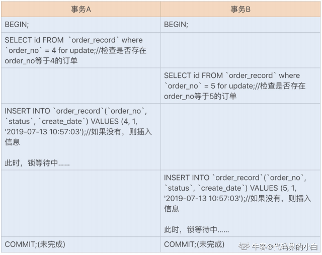

在 MySQL 中，gap lock 默认是开启的，即innodb_locks_unsafe_for_binlog 参数值是disable 的，且 MySQL 中默认的是 RR 事务隔离级别。

当我们执行以下查询 SQL 时，由于 order_no 列为非唯一索引，此时又是 RR 事务隔离级别，所以 SELECT 的加锁类型为 gap lock，这里的 gap 范围是 (4,+∞）。


执行查询 SQL 语句获取的 gap lock 并不会导致阻塞，而当我们执行以下插入 SQL 时，会在插入间隙上再次获取插入意向锁。插入意向锁其实也是一种 gap 锁，它与 gap lock 是冲突的，所以当其它事务持有该间隙的 gap lock 时，需要等待其它事务释放 gap lock 之后，才能获取到插入意向锁。

以上事务 A 和事务 B 都持有间隙 (4,+∞）的 gap 锁，而接下来的插入操作为了获取到插入意向锁，都在等待对方事务的 gap 锁释放，于是就造成了循环等待，导致死锁。

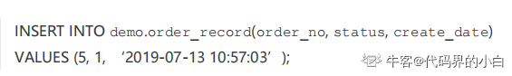

最后送上锁之间的兼容性表格：

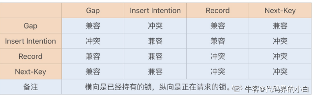

# SpringBoot

#### 1.3 介绍Spring Boot的启动流程

**参考答案**

首先，Spring Boot项目创建完成会默认生成一个名为 `*Application` 的入口类，我们是通过该类的main方法启动Spring Boot项目的。在main方法中，通过SpringApplication的静态方法，即run方法进行SpringApplication类的实例化操作，然后再针对实例化对象调用另外一个run方法来完成整个项目的初始化和启动。

SpringApplication调用的run方法的大致流程，如下图：

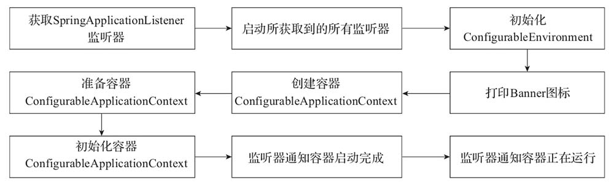

其中，SpringApplication在run方法中重点做了以下操作：

- 获取监听器和参数配置；
- 打印Banner信息；
- 创建并初始化容器；
- 监听器发送通知。

当然，除了上述核心操作，run方法运行过程中还涉及启动时长统计、异常报告、启动日志、异常处理等辅助操作。比较完整的流程，可以参考如下源代码：

```java
public ConfigurableApplicationContext run(String... args) {
    // 创建StopWatch对象，用于统计run方法启动时长。
    StopWatch stopWatch = new StopWatch();
    // 启动统计
    stopWatch.start();
    ConfigurableApplicationContext context = null;
    Collection<SpringBootExceptionReporter> exceptionReporters = new ArrayList<>();
    // 配置Headless属性
    configureHeadlessProperty();
    // 获得SpringApplicationRunListener数组，
    // 该数组封装于SpringApplicationRunListeners对象的listeners中。
    SpringApplicationRunListeners listeners = getRunListeners(args);
    // 启动监听，遍历SpringApplicationRunListener数组每个元素，并执行。
    listeners.starting();
    try {
        // 创建ApplicationArguments对象
        ApplicationArguments applicationArguments = 
            new DefaultApplicationArguments(args);
        // 加载属性配置，包括所有的配置属性。
        ConfigurableEnvironment environment = 
            prepareEnvironment(listeners, applicationArguments);
        configureIgnoreBeanInfo(environment);
        // 打印Banner
        Banner printedBanner = printBanner(environment);
        // 创建容器
        context = createApplicationContext();
        // 异常报告器
        exceptionReporters = getSpringFactoriesInstances(
            SpringBootExceptionReporter.class,
            new Class[] { ConfigurableApplicationContext.class }, context);
        // 准备容器，组件对象之间进行关联。
        prepareContext(context, environment, 
                       listeners, applicationArguments, printedBanner);
        // 初始化容器
        refreshContext(context);
        // 初始化操作之后执行，默认实现为空。
        afterRefresh(context, applicationArguments);
        // 停止时长统计
        stopWatch.stop();
        // 打印启动日志
        if (this.logStartupInfo) {
            new StartupInfoLogger(this.mainApplicationClass)
                .logStarted(getApplicationLog(), stopWatch);
        }
        // 通知监听器：容器完成启动。
        listeners.started(context);
        // 调用ApplicationRunner和CommandLineRunner的运行方法。
        callRunners(context, applicationArguments);
    } catch (Throwable ex) {
        // 异常处理
        handleRunFailure(context, ex, exceptionReporters, listeners);
        throw new IllegalStateException(ex);
    }

    try {
        // 通知监听器：容器正在运行。
        listeners.running(context);
    } catch (Throwable ex) {
        // 异常处理
        handleRunFailure(context, ex, exceptionReporters, null);
        throw new IllegalStateException(ex);
    }
    return context;
}
```

#### 1.4 Spring Boot项目是如何导入包的？

**参考答案**

通过Spring Boot Starter导入包。

Spring Boot通过提供众多起步依赖（Starter）降低项目依赖的复杂度。起步依赖本质上是一个Maven项目对象模型（Project Object Model, POM），定义了对其他库的传递依赖，这些东西加在一起即支持某项功能。很多起步依赖的命名都暗示了它们提供的某种或某类功能。

举例来说，你打算把这个阅读列表应用程序做成一个Web应用程序。与其向项目的构建文件里添加一堆单独的库依赖，还不如声明这是一个Web应用程序来得简单。你只要添加Spring Boot的Web起步依赖就好了。

#### 1.5 请描述Spring Boot自动装配的过程

**参考答案**

使用Spring Boot时，我们只需引入对应的Starters，Spring Boot启动时便会自动加载相关依赖，配置相应的初始化参数，以最快捷、简单的形式对第三方软件进行集成，这便是Spring Boot的自动配置功能。Spring Boot实现该运作机制锁涉及的核心部分如下图所示：

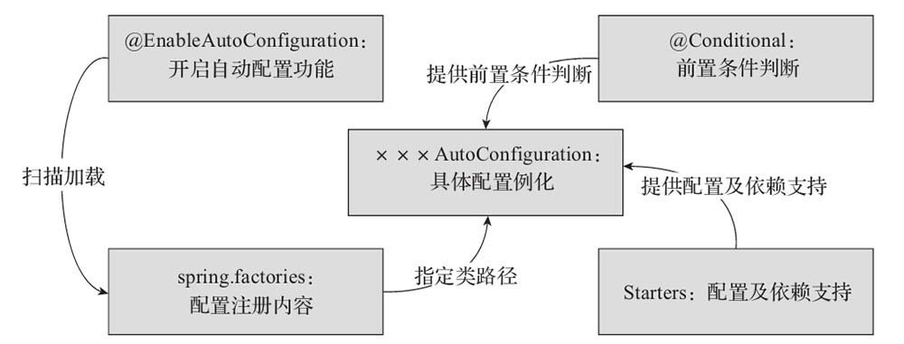

整个自动装配的过程是：Spring Boot通过@EnableAutoConfiguration注解开启自动配置，加载spring.factories中注册的各种AutoConfiguration类，当某个AutoConfiguration类满足其注解@Conditional指定的生效条件（Starters提供的依赖、配置或Spring容器中是否存在某个Bean等）时，实例化该AutoConfiguration类中定义的Bean（组件等），并注入Spring容器，就可以完成依赖框架的自动配置。

#### 1.6 说说你对Spring Boot注解的了解

**参考答案**

@SpringBootApplication注解：

在Spring Boot入口类中，唯一的一个注解就是@SpringBootApplication。它是Spring Boot项目的核心注解，用于开启自动配置，准确说是通过该注解内组合的@EnableAutoConfiguration开启了自动配置。

@EnableAutoConfiguration注解：

@EnableAutoConfiguration的主要功能是启动Spring应用程序上下文时进行自动配置，它会尝试猜测并配置项目可能需要的Bean。自动配置通常是基于项目classpath中引入的类和已定义的Bean来实现的。在此过程中，被自动配置的组件来自项目自身和项目依赖的jar包中。

@Import注解：

@EnableAutoConfiguration的关键功能是通过@Import注解导入的ImportSelector来完成的。从源代码得知@Import(AutoConfigurationImportSelector.class)是@EnableAutoConfiguration注解的组成部分，也是自动配置功能的核心实现者。

@Conditional注解：

@Conditional注解是由Spring 4.0版本引入的新特性，可根据是否满足指定的条件来决定是否进行Bean的实例化及装配，比如，设定当类路径下包含某个jar包的时候才会对注解的类进行实例化操作。总之，就是根据一些特定条件来控制Bean实例化的行为。

@Conditional衍生注解：

在Spring Boot的autoconfigure项目中提供了各类基于@Conditional注解的衍生注解，它们适用不同的场景并提供了不同的功能。通过阅读这些注解的源码，你会发现它们其实都组合了@Conditional注解，不同之处是它们在注解中指定的条件（Condition）不同。

- @ConditionalOnBean：在容器中有指定Bean的条件下。
- @ConditionalOnClass：在classpath类路径下有指定类的条件下。
- @ConditionalOnCloudPlatform：当指定的云平台处于active状态时。
- @ConditionalOnExpression：基于SpEL表达式的条件判断。
- @ConditionalOnJava：基于JVM版本作为判断条件。
- @ConditionalOnJndi：在JNDI存在的条件下查找指定的位置。
- @ConditionalOnMissingBean：当容器里没有指定Bean的条件时。
- @ConditionalOnMissingClass：当类路径下没有指定类的条件时。
- @ConditionalOnNotWebApplication：在项目不是一个Web项目的条件下。
- @ConditionalOnProperty：在指定的属性有指定值的条件下。
- @ConditionalOnResource：类路径是否有指定的值。
- @ConditionalOnSingleCandidate：当指定的Bean在容器中只有一个或者有多个但是指定了首选的Bean时。
- @ConditionalOnWebApplication：在项目是一个Web项目的条件下。

# Spring

#### 2.1 请你说说Spring的核心是什么

**参考答案**

Spring框架包含众多模块，如Core、Testing、Data Access、Web Servlet等，其中Core是整个Spring框架的核心模块。Core模块提供了IoC容器、AOP功能、数据绑定、类型转换等一系列的基础功能，而这些功能以及其他模块的功能都是建立在IoC和AOP之上的，所以IoC和AOP是Spring框架的核心。

IoC（Inversion of Control）是控制反转的意思，这是一种面向对象编程的设计思想。在不采用这种思想的情况下，我们需要自己维护对象与对象之间的依赖关系，很容易造成对象之间的耦合度过高，在一个大型的项目中这十分的不利于代码的维护。IoC则可以解决这种问题，它可以帮我们维护对象与对象之间的依赖关系，降低对象之间的耦合度。

说到IoC就不得不说DI（Dependency Injection），DI是依赖注入的意思，它是IoC实现的实现方式，就是说IoC是通过DI来实现的。由于IoC这个词汇比较抽象而DI却更直观，所以很多时候我们就用DI来代替它，在很多时候我们简单地将IoC和DI划等号，这是一种习惯。而实现依赖注入的关键是IoC容器，它的本质就是一个工厂。

AOP（Aspect Oriented Programing）是面向切面编程思想，这种思想是对OOP的补充，它可以在OOP的基础上进一步提高编程的效率。简单来说，它可以统一解决一批组件的共性需求（如权限检查、记录日志、事务管理等）。在AOP思想下，我们可以将解决共性需求的代码独立出来，然后通过配置的方式，声明这些代码在什么地方、什么时机调用。当满足调用条件时，AOP会将该业务代码织入到我们指定的位置，从而统一解决了问题，又不需要修改这一批组件的代码。

#### 2.2 说一说你对Spring容器的了解

**参考答案**

Spring主要提供了两种类型的容器：BeanFactory和ApplicationContext。

- BeanFactory：是基础类型的IoC容器，提供完整的IoC服务支持。如果没有特殊指定，默认采用延
  迟初始化策略。只有当客户端对象需要访问容器中的某个受管对象的时候，才对该受管对象进行初始化以及依赖注入操作。所以，相对来说，容器启动初期速度较快，所需要的资源有限。对于资源有限，并且功能要求不是很严格的场景，BeanFactory是比较合适的IoC容器选择。
- ApplicationContext：它是在BeanFactory的基础上构建的，是相对比较高级的容器实现，除了拥有BeanFactory的所有支持，ApplicationContext还提供了其他高级特性，比如事件发布、国际化信息支持等。ApplicationContext所管理的对象，在该类型容器启动之后，默认全部初始化并绑定完成。所以，相对于BeanFactory来说，ApplicationContext要求更多的系统资源，同时，因为在启动时就完成所有初始化，容
  器启动时间较之BeanFactory也会长一些。在那些系统资源充足，并且要求更多功能的场景中，ApplicationContext类型的容器是比较合适的选择。

#### 2.3 说一说你对BeanFactory的了解

**参考答案**

BeanFactory是一个类工厂，与传统类工厂不同的是，BeanFactory是类的通用工厂，它可以创建并管理各种类的对象。这些可被创建和管理的对象本身没有什么特别之处，仅是一个POJO，Spring称这些被创建和管理的Java对象为Bean。并且，Spring中所说的Bean比JavaBean更为宽泛一些，所有可以被Spring容器实例化并管理的Java类都可以成为Bean。

BeanFactory是Spring容器的顶层接口，Spring为BeanFactory提供了多种实现，最常用的是XmlBeanFactory。但它在Spring 3.2中已被废弃，建议使用XmlBeanDefinitionReader、DefaultListableBeanFactory替代。BeanFactory最主要的方法就是 `getBean(String beanName)`，该方法从容器中返回特定名称的Bean。

#### 2.4 说一说你对Spring IOC的理解

**参考答案**

IoC（Inversion of Control）是控制反转的意思，这是一种面向对象编程的设计思想。在不采用这种思想的情况下，我们需要自己维护对象与对象之间的依赖关系，很容易造成对象之间的耦合度过高，在一个大型的项目中这十分的不利于代码的维护。IoC则可以解决这种问题，它可以帮我们维护对象与对象之间的依赖关系，降低对象之间的耦合度。

说到IoC就不得不说DI（Dependency Injection），DI是依赖注入的意思，它是IoC实现的实现方式，就是说IoC是通过DI来实现的。由于IoC这个词汇比较抽象而DI却更直观，所以很多时候我们就用DI来代替它，在很多时候我们简单地将IoC和DI划等号，这是一种习惯。而实现依赖注入的关键是IoC容器，它的本质就是一个工厂。

在具体的实现中，主要由三种注入方式：

1. 构造方法注入

   就是被注入对象可以在它的构造方法中声明依赖对象的参数列表，让外部知道它需要哪些依赖对象。然后，IoC Service Provider会检查被注入的对象的构造方法，取得它所需要的依赖对象列表，进而为其注入相应的对象。构造方法注入方式比较直观，对象被构造完成后，即进入就绪状态，可以马上使用。

2. setter方法注入

   通过setter方法，可以更改相应的对象属性。所以，当前对象只要为其依赖对象所对应的属性添加setter方法，就可以通过setter方法将相应的依赖对象设置到被注入对象中。setter方法注入虽不像构造方法注入那样，让对象构造完成后即可使用，但相对来说更宽松一些，
   可以在对象构造完成后再注入。

3. 接口注入

   相对于前两种注入方式来说，接口注入没有那么简单明了。被注入对象如果想要IoC Service Provider为其注入依赖对象，就必须实现某个接口。这个接口提供一个方法，用来为其注入依赖对象。IoC Service Provider最终通过这些接口来了解应该为被注入对象注入什么依赖对象。相对于前两种依赖注入方式，接口注入比较死板和烦琐。

总体来说，构造方法注入和setter方法注入因为其侵入性较弱，且易于理解和使用，所以是现在使用最多的注入方式。而接口注入因为侵入性较强，近年来已经不流行了。

#### 2.5 Spring是如何管理Bean的？

**参考答案**

Spring通过IoC容器来管理Bean，我们可以通过XML配置或者注解配置，来指导IoC容器对Bean的管理。因为注解配置比XML配置方便很多，所以现在大多时候会使用注解配置的方式。

以下是管理Bean时常用的一些注解：

1. @ComponentScan用于声明扫描策略，通过它的声明，容器就知道要扫描哪些包下带有声明的类，也可以知道哪些特定的类是被排除在外的。
2. @Component、@Repository、@Service、@Controller用于声明Bean，它们的作用一样，但是语义不同。@Component用于声明通用的Bean，@Repository用于声明DAO层的Bean，@Service用于声明业务层的Bean，@Controller用于声明视图层的控制器Bean，被这些注解声明的类就可以被容器扫描并创建。
3. @Autowired、@Qualifier用于注入Bean，即告诉容器应该为当前属性注入哪个Bean。其中，@Autowired是按照Bean的类型进行匹配的，如果这个属性的类型具有多个Bean，就可以通过@Qualifier指定Bean的名称，以消除歧义。
4. @Scope用于声明Bean的作用域，默认情况下Bean是单例的，即在整个容器中这个类型只有一个实例。可以通过@Scope注解指定prototype值将其声明为多例的，也可以将Bean声明为session级作用域、request级作用域等等，但最常用的还是默认的单例模式。
5. @PostConstruct、@PreDestroy用于声明Bean的生命周期。其中，被@PostConstruct修饰的方法将在Bean实例化后被调用，@PreDestroy修饰的方法将在容器销毁前被调用。

#### 2.6 介绍Bean的作用域

**参考答案**

默认情况下，Bean在Spring容器中是单例的，我们可以通过@Scope注解修改Bean的作用域。该注解有如下5个取值，它们代表了Bean的5种不同类型的作用域：

|     类型      |                             说明                             |
| :-----------: | :----------------------------------------------------------: |
|   singleton   |    在Spring容器中仅存在一个实例，即Bean以单例的形式存在。    |
|   prototype   |   每次调用getBean()时，都会执行new操作，返回一个新的实例。   |
|    request    |              每次HTTP请求都会创建一个新的Bean。              |
|    session    | 同一个HTTP Session共享一个Bean，不同的HTTP Session使用不同的Bean。 |
| globalSession |    同一个全局的Session共享一个Bean，一般用于Portlet环境。    |

#### 2.7 说一说Bean的生命周期

**参考答案**

Spring容器管理Bean，涉及对Bean的创建、初始化、调用、销毁等一系列的流程，这个流程就是Bean的生命周期。整个流程参考下图：

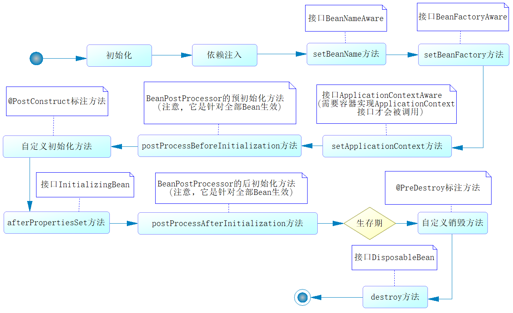

这个过程是由Spring容器自动管理的，其中有两个环节我们可以进行干预。

1. 我们可以自定义初始化方法，并在该方法前增加@PostConstruct注解，届时Spring容器将在调用SetBeanFactory方法之后调用该方法。
2. 我们可以自定义销毁方法，并在该方法前增加@PreDestroy注解，届时Spring容器将在自身销毁前，调用这个方法。

#### 2.8 Spring是怎么解决循环依赖的？

**参考答案**

首先，需要明确的是spring对循环依赖的处理有三种情况：

1. 构造器的循环依赖：这种依赖spring是处理不了的，直接抛出BeanCurrentlylnCreationException异常。
2. 单例模式下的setter循环依赖：通过“三级缓存”处理循环依赖。
3. 非单例循环依赖：无法处理。

接下来，我们具体看看spring是如何处理第二种循环依赖的。

Spring单例对象的初始化大略分为三步：

1. createBeanInstance：实例化，其实也就是调用对象的构造方法实例化对象；
2. populateBean：填充属性，这一步主要是多bean的依赖属性进行填充；
3. initializeBean：调用spring xml中的init 方法。

从上面讲述的单例bean初始化步骤我们可以知道，循环依赖主要发生在第一步、第二步。也就是构造器循环依赖和field循环依赖。 Spring为了解决单例的循环依赖问题，使用了三级缓存。

```java
/** Cache of singleton objects: bean name –> bean instance */
private final Map singletonObjects = new ConcurrentHashMap(256);
/** Cache of singleton factories: bean name –> ObjectFactory */
private final Map> singletonFactories = new HashMap>(16);
/** Cache of early singleton objects: bean name –> bean instance */
private final Map earlySingletonObjects = new HashMap(16);
```

这三级缓存的作用分别是：

- singletonFactories ： 进入实例化阶段的单例对象工厂的cache （三级缓存）；
- earlySingletonObjects ：完成实例化但是尚未初始化的，提前暴光的单例对象的Cache （二级缓存）；
- singletonObjects：完成初始化的单例对象的cache（一级缓存）。

我们在创建bean的时候，会首先从cache中获取这个bean，这个缓存就是sigletonObjects。主要的调用方法是：

```java
protected Object getSingleton(String beanName, boolean allowEarlyReference) {
    Object singletonObject = this.singletonObjects.get(beanName);
    //isSingletonCurrentlyInCreation()判断当前单例bean是否正在创建中
    if (singletonObject == null && isSingletonCurrentlyInCreation(beanName)) {
        synchronized (this.singletonObjects) {
            singletonObject = this.earlySingletonObjects.get(beanName);
            //allowEarlyReference 是否允许从singletonFactories中通过getObject拿到对象
            if (singletonObject == null && allowEarlyReference) {
                ObjectFactory<?> singletonFactory = this.singletonFactories.get(beanName);
                if (singletonFactory != null) {
                    singletonObject = singletonFactory.getObject();
                    //从singletonFactories中移除，并放入earlySingletonObjects中。
                    //其实也就是从三级缓存移动到了二级缓存
                    this.earlySingletonObjects.put(beanName, singletonObject);
                    this.singletonFactories.remove(beanName);
                }
            }
        }
    }
    return (singletonObject != NULL_OBJECT ? singletonObject : null);
}
```

从上面三级缓存的分析，我们可以知道，Spring解决循环依赖的诀窍就在于singletonFactories这个三级cache。这个cache的类型是ObjectFactory，定义如下：

```java
public interface ObjectFactory<T> {
    T getObject() throws BeansException;
}
```

这个接口在AbstractBeanFactory里实现，并在核心方法doCreateBean（）引用下面的方法：

```java
protected void addSingletonFactory(String beanName, ObjectFactory<?> singletonFactory) {
    Assert.notNull(singletonFactory, "Singleton factory must not be null");
    synchronized (this.singletonObjects) {
        if (!this.singletonObjects.containsKey(beanName)) {
            this.singletonFactories.put(beanName, singletonFactory);
            this.earlySingletonObjects.remove(beanName);
            this.registeredSingletons.add(beanName);
        }
    }
}
```

这段代码发生在createBeanInstance之后，populateBean（）之前，也就是说单例对象此时已经被创建出来(调用了构造器)。这个对象已经被生产出来了，此时将这个对象提前曝光出来，让大家使用。

这样做有什么好处呢？让我们来分析一下“A的某个field或者setter依赖了B的实例对象，同时B的某个field或者setter依赖了A的实例对象”这种循环依赖的情况。A首先完成了初始化的第一步，并且将自己提前曝光到singletonFactories中，此时进行初始化的第二步，发现自己依赖对象B，此时就尝试去get(B)，发现B还没有被create，所以走create流程，B在初始化第一步的时候发现自己依赖了对象A，于是尝试get(A)，尝试一级缓存singletonObjects(肯定没有，因为A还没初始化完全)，尝试二级缓存earlySingletonObjects（也没有），尝试三级缓存singletonFactories，由于A通过ObjectFactory将自己提前曝光了，所以B能够通过ObjectFactory.getObject拿到A对象(虽然A还没有初始化完全，但是总比没有好呀)，B拿到A对象后顺利完成了初始化阶段1、2、3，完全初始化之后将自己放入到一级缓存singletonObjects中。此时返回A中，A此时能拿到B的对象顺利完成自己的初始化阶段2、3，最终A也完成了初始化，进去了一级缓存singletonObjects中，而且更加幸运的是，由于B拿到了A的对象引用，所以B现在hold住的A对象完成了初始化。

#### 2.9 @Autowired和@Resource注解有什么区别？

**参考答案**

1. @Autowired是Spring提供的注解，@Resource是JDK提供的注解。
2. @Autowired是只能按类型注入，@Resource默认按名称注入，也支持按类型注入。
3. @Autowired按类型装配依赖对象，默认情况下它要求依赖对象必须存在，如果允许null值，可以设置它required属性为false，如果我们想使用按名称装配，可以结合@Qualifier注解一起使用。@Resource有两个中重要的属性：name和type。name属性指定byName，如果没有指定name属性，当注解标注在字段上，即默认取字段的名称作为bean名称寻找依赖对象，当注解标注在属性的setter方法上，即默认取属性名作为bean名称寻找依赖对象。需要注意的是，@Resource如果没有指定name属性，并且按照默认的名称仍然找不到依赖对象时， @Resource注解会回退到按类型装配。但一旦指定了name属性，就只能按名称装配了。

#### 2.11 说一说你对Spring AOP的理解

**参考答案**

AOP（Aspect Oriented Programming）是面向切面编程，它是一种编程思想，是面向对象编程（OOP）的一种补充。面向对象编程将程序抽象成各个层次的对象，而面向切面编程是将程序抽象成各个切面。如下图，可以很形象地看出，所谓切面，相当于应用对象间的横切点，我们可以将其单独抽象为单独的模块。

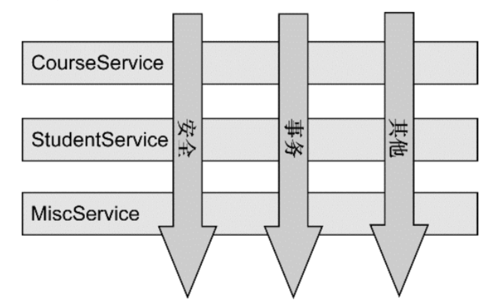

AOP的术语：

- 连接点（join point）：对应的是具体被拦截的对象，因为Spring只能支持方法，所以被拦截的对象往往就是指特定的方法，AOP将通过动态代理技术把它织入对应的流程中。
- 切点（point cut）：有时候，我们的切面不单单应用于单个方法，也可能是多个类的不同方法，这时，可以通过正则式和指示器的规则去定义，从而适配连接点。切点就是提供这样一个功能的概念。
- 通知（advice）：就是按照约定的流程下的方法，分为前置通知、后置通知、环绕通知、事后返回通知和异常通知，它会根据约定织入流程中。
- 目标对象（target）：即被代理对象。
- 引入（introduction）：是指引入新的类和其方法，增强现有Bean的功能。
- 织入（weaving）：它是一个通过动态代理技术，为原有服务对象生成代理对象，然后将与切点定义匹配的连接点拦截，并按约定将各类通知织入约定流程的过程。
- 切面（aspect）：是一个可以定义切点、各类通知和引入的内容，SpringAOP将通过它的信息来增强Bean的功能或者将对应的方法织入流程。

Spring AOP：

AOP可以有多种实现方式，而Spring AOP支持如下两种实现方式。

- JDK动态代理：这是Java提供的动态代理技术，可以在运行时创建接口的代理实例。Spring AOP默认采用这种方式，在接口的代理实例中织入代码。
- CGLib动态代理：采用底层的字节码技术，在运行时创建子类代理的实例。当目标对象不存在接口时，Spring AOP就会采用这种方式，在子类实例中织入代码。

#### 2.13 Spring AOP不能对哪些类进行增强？

**参考答案**

1. Spring AOP只能对IoC容器中的Bean进行增强，对于不受容器管理的对象不能增强。
2. 由于CGLib采用动态创建子类的方式生成代理对象，所以不能对final修饰的类进行代理。

#### 2.14 JDK动态代理和CGLIB有什么区别？

**参考答案**

JDK动态代理

这是Java提供的动态代理技术，可以在运行时创建接口的代理实例。Spring AOP默认采用这种方式，在接口的代理实例中织入代码。

CGLib动态代理

采用底层的字节码技术，在运行时创建子类代理的实例。当目标对象不存在接口时，Spring AOP就会采用这种方式，在子类实例中织入代码。

#### 2.15 既然有没有接口都可以用CGLIB，为什么Spring还要使用JDK动态代理？

**参考答案**

在性能方面，CGLib创建的代理对象比JDK动态代理创建的代理对象高很多。但是，CGLib在创建代理对象时所花费的时间比JDK动态代理多很多。所以，对于单例的对象因为无需频繁创建代理对象，采用CGLib动态代理比较合适。反之，对于多例的对象因为需要频繁的创建代理对象，则JDK动态代理更合适。

#### 2.17 Spring的事务传播方式有哪些？

**参考答案**

当我们调用一个业务方法时，它的内部可能会调用其他的业务方法，以完成一个完整的业务操作。这种业务方法嵌套调用的时候，如果这两个方法都是要保证事务的，那么就要通过Spring的事务传播机制控制当前事务如何传播到被嵌套调用的业务方法中。

Spring在TransactionDefinition接口中规定了7种类型的事务传播行为，它们规定了事务方法和事务方法发生嵌套调用时如何进行传播，如下表：

|       事务传播类型        |                             说明                             |
| :-----------------------: | :----------------------------------------------------------: |
|   PROPAGATION_REQUIRED    | 如果当前没有事务，则新建一个事务；如果已存在一个事务，则加入到这个事务中。这是最常见的选择。 |
|   PROPAGATION_SUPPORTS    |     支持当前事务，如果当前没有事务，则以非事务方式执行。     |
|   PROPAGATION_MANDATORY   |        使用当前的事务，如果当前没有事务，则抛出异常。        |
| PROPAGATION_REQUIRES_NEW  |        新建事务，如果当前存在事务，则把当前事务挂起。        |
| PROPAGATION_NOT_SUPPORTED |  以非事务方式执行操作，如果当前存在事务，则把当前事务挂起。  |
|     PROPAGATION_NEVER     |     以非事务方式执行操作，如果当前存在事务，则抛出异常。     |
|    PROPAGATION_NESTED     | 如果当前存在事务，则在嵌套事务内执行；如果当前没有事务，则执行与PROPAGATION_REQUIRED类似的操作。 |

# SpringMVC

#### 3.3 介绍一下Spring MVC的执行流程

**参考答案**

1. 整个过程开始于客户端发出的一个HTTP请求，Web应用服务器接收到这个请求。如果匹配DispatcherServlet的请求映射路径，则Web容器将该请求转交给DispatcherServlet处理。
2. DispatcherServlet接收到这个请求后，将根据请求的信息（包括URL、HTTP方法、请求报文头、请求参数、Cookie等）及HandlerMapping的配置找到处理请求的处理器（Handler）。可将HandlerMapping看做路由控制器，将Handler看做目标主机。值得注意的是，在Spring MVC中并没有定义一个Handler接口，实际上任何一个Object都可以成为请求处理器。
3. 当DispatcherServlet根据HandlerMapping得到对应当前请求的Handler后，通过HandlerAdapter对Handler进行封装，再以统一的适配器接口调用Handler。HandlerAdapter是Spring MVC框架级接口，顾名思义，HandlerAdapter是一个适配器，它用统一的接口对各种Handler方法进行调用。
4. 处理器完成业务逻 辑的处理后，将返回一个ModelAndView给DispatcherServlet，ModelAndView包含了视图逻辑名和模型数据信息。
5. ModelAndView中包含的是“逻辑视图名”而非真正的视图对象，DispatcherServlet借由ViewResolver完成逻辑视图名到真实视图对象的解析工作。
6. 当得到真实的视图对象View后，DispatcherServlet就使用这个View对象对ModelAndView中的模型数据进行视图渲染。
7. 最终客户端得到的响应消息可能是一个普通的HTML页面，也可能是一个XML或JSON串，甚至是一张图片或一个PDF文档等不同的媒体形式。

#### 3.4 说一说你知道的Spring MVC注解

**参考答案**

@RequestMapping：

作用：该注解的作用就是用来处理请求地址映射的，也就是说将其中的处理器方法映射到url路径上。

属性：

- method：是让你指定请求的method的类型，比如常用的有get和post。
- value：是指请求的实际地址，如果是多个地址就用{}来指定就可以啦。
- produces：指定返回的内容类型，当request请求头中的Accept类型中包含指定的类型才可以返回的。
- consumes：指定处理请求的提交内容类型，比如一些json、html、text等的类型。
- headers：指定request中必须包含那些的headed值时，它才会用该方法处理请求的。
- params：指定request中一定要有的参数值，它才会使用该方法处理请求。

@RequestParam：

作用：是将请求参数绑定到你的控制器的方法参数上，是Spring MVC中的接收普通参数的注解。

属性：

- value是请求参数中的名称。
- required是请求参数是否必须提供参数，它的默认是true，意思是表示必须提供。

@RequestBody：

作用：如果作用在方法上，就表示该方法的返回结果是直接按写入的Http responsebody中（一般在异步获取数据时使用的注解）。

属性：required，是否必须有请求体。它的默认值是true，在使用该注解时，值得注意的当为true时get的请求方式是报错的，如果你取值为false的话，get的请求是null。

@PathVaribale：

作用：该注解是用于绑定url中的占位符，但是注意，spring3.0以后，url才开始支持占位符的，它是Spring MVC支持的rest风格url的一个重要的标志。

#### 3.5 介绍一下Spring MVC的拦截器

**参考答案**

拦截器会对处理器进行拦截，这样通过拦截器就可以增强处理器的功能。Spring MVC中，所有的拦截器都需要实现HandlerInterceptor接口，该接口包含如下三个方法：preHandle()、postHandle()、afterCompletion()。

这些方法的执行流程如下图：


通过上图可以看出，Spring MVC拦截器的执行流程如下：

- 执行preHandle方法，它会返回一个布尔值。如果为false，则结束所有流程，如果为true，则执行下一步。
- 执行处理器逻辑，它包含控制器的功能。
- 执行postHandle方法。
- 执行视图解析和视图渲染。
- 执行afterCompletion方法。

Spring MVC拦截器的开发步骤如下：

1. 开发拦截器：

   实现handlerInterceptor接口，从三个方法中选择合适的方法，实现拦截时要执行的具体业务逻辑。

2. 注册拦截器：

   定义配置类，并让它实现WebMvcConfigurer接口，在接口的addInterceptors方法中，注册拦截器，并定义该拦截器匹配哪些请求路径。

#### 3.6 怎么去做请求拦截？

**参考答案**

如果是对Controller记性拦截，则可以使用Spring MVC的拦截器。

如果是对所有的请求（如访问静态资源的请求）进行拦截，则可以使用Filter。

如果是对除了Controller之外的其他Bean的请求进行拦截，则可以使用Spring AOP。

# MyBatis

#### 4.1 谈谈MyBatis和JPA的区别

**参考答案**

ORM映射不同：

MyBatis是半自动的ORM框架，提供数据库与结果集的映射；

JPA（默认采用Hibernate实现）是全自动的ORM框架，提供对象与数据库的映射。

可移植性不同：

JPA通过它强大的映射结构和HQL语言，大大降低了对象与数据库的耦合性；

MyBatis由于需要写SQL，因此与数据库的耦合性直接取决于SQL的写法，如果SQL不具备通用性而用了很多数据库的特性SQL的话，移植性就会降低很多，移植时成本很高。

日志系统的完整性不同：

JPA日志系统非常健全、涉及广泛，包括：SQL记录、关系异常、优化警告、缓存提示、脏数据警告等；

MyBatis除了基本的记录功能外，日志功能薄弱很多。

SQL优化上的区别：

由于Mybatis的SQL都是写在XML里，因此优化SQL比Hibernate方便很多。

而Hibernate的SQL很多都是自动生成的，无法直接维护SQL。虽有HQL，但功能还是不及SQL强大，见到报表等复杂需求时HQL就无能为力，也就是说HQL是有局限的Hhibernate虽然也支持原生SQL，但开发模式上却与ORM不同，需要转换思维，因此使用上不是非常方便。总之写SQL的灵活度上Hibernate不及Mybatis。

#### 4.5 ${}不安全，什么时候会用到它？

**参考答案**

它可以解决一些特殊情况下的问题。例如，在一些动态表格（根据不同的条件产生不同的动态列）中，我们要传递SQL的列名，根据某些列进行排序，或者传递列名给SQL都是比较常见的场景，这就无法使用预编译的方式了。

SELECT * **FROM** #{tableName}

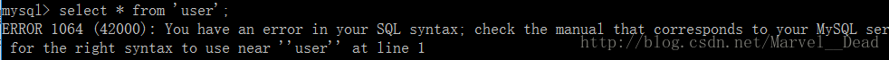

这时只能用${tableName}

#### 4.7 MyBatis分页和自己写的分页哪个效率高？

**参考答案**

自己写的分页效率高。

在MyBatis中，我们可以通过分页插件实现分页，也可以通过分页SQL自己实现分页。其中，分页插件的原理是，拦截查询SQL，在这个SQL基础上自动为其添加limit分页条件。它会大大的提高开发的效率，但是无法对分页语句做出有针对性的优化，比如分页偏移量很大的情况，而这些在自己写的分页SQL里却是可以灵活实现的。

#### 4.8 了解MyBatis缓存机制吗？

**参考答案**

MyBatis的缓存分为一级缓存和二级缓存。

一级缓存：

一级缓存也叫本地缓存，它默认会启用，并且不能关闭。一级缓存存在于SqlSession的生命周期中，即它是SqlSession级别的缓存。在同一个 SqlSession 中查询时，MyBatis 会把执行的方法和参数通过算法生成缓存的键值，将键值和查询结果存入一个Map对象中。如果同一个SqlSession 中执行的方法和参数完全一致，那么通过算法会生成相同的键值，当Map 缓存对象中己经存在该键值时，则会返回缓存中的对象。

二级缓存：

二级缓存存在于SqlSessionFactory 的生命周期中，即它是SqlSessionFactory级别的缓存。若想使用二级缓存，需要在如下两处进行配置。

在MyBatis 的全局配置settings 中有一个参数cacheEnabled，这个参数是二级缓存的全局开关，默认值是true ，初始状态为启用状态。

MyBatis 的二级缓存是和命名空间绑定的，即二级缓存需要配置在Mapper.xml 映射文件中。在保证二级缓存的全局配置开启的情况下，给Mapper.xml 开启二级缓存只需要在Mapper. xml 中添加如下代码：

```xml
<cache />
```

二级缓存具有如下效果：

- 映射语句文件中的所有SELECT 语句将会被缓存。
- 映射语句文件中的所有时INSERT 、UPDATE 、DELETE 语句会刷新缓存。
- 缓存会使用Least Rece ntly U sed ( LRU ，最近最少使用的）算法来收回。
- 根据时间表（如no Flush Int erv al ，没有刷新间隔），缓存不会以任何时间顺序来刷新。
- 缓存会存储集合或对象（无论查询方法返回什么类型的值）的1024 个引用。
- 缓存会被视为read/write（可读／可写）的，意味着对象检索不是共享的，而且可以安全地被调用者修改，而不干扰其他调用者或线程所做的潜在修改。

# Web

#### 5.1 cookie和session的区别是什么？

**参考答案**

1. 存储位置不同：cookie存放于客户端；session存放于服务端。
2. 存储容量不同：单个cookie保存的数据<=4KB，一个站点最多保存20个cookie；而session并没有上限。
3. 存储方式不同：cookie只能保存ASCII字符串，并需要通过编码当时存储为Unicode字符或者二进制数据；session中能够存储任何类型的数据，例如字符串、整数、集合等。
4. 隐私策略不同：cookie对客户端是可见的，别有用心的人可以分析存放在本地的cookie并进行cookie欺骗，所以它是不安全的；session存储在服务器上，对客户端是透明的，不存在敏感信息泄露的风险。
5. 生命周期不同：可以通过设置cookie的属性，达到cookie长期有效的效果；session依赖于名为JSESSIONID的cookie，而该cookie的默认过期时间为-1，只需关闭窗口该session就会失效，因此session不能长期有效。
6. 服务器压力不同：cookie保存在客户端，不占用服务器资源；session保管在服务器上，每个用户都会产生一个session，如果并发量大的话，则会消耗大量的服务器内存。
7. 浏览器支持不同：cookie是需要浏览器支持的，如果客户端禁用了cookie，则会话跟踪就会失效；运用session就需要使用URL重写的方式，所有用到session的URL都要进行重写，否则session会话跟踪也会失效。
8. 跨域支持不同：cookie支持跨域访问，session不支持跨域访问。

#### 5.4 get请求与post请求有什么区别？

**参考答案**

- GET在浏览器回退时是无害的，而POST会再次提交请求。
- GET产生的URL地址可以被Bookmark，而POST不可以。
- GET请求会被浏览器主动cache，而POST不会，除非手动设置。
- GET请求只能进行url编码，而POST支持多种编码方式。
- GET请求参数会被完整保留在浏览器历史记录里，而POST中的参数不会被保留。
- GET请求在URL中传送的参数是有长度限制的，而POST没有。
- 对参数的数据类型，GET只接受ASCII字符，而POST没有限制。
- GET比POST更不安全，因为参数直接暴露在URL上，所以不能用来传递敏感信息。
- GET参数通过URL传递，POST放在Request body中。

#### 5.5 get请求的参数能放到body里面吗？

**参考答案**

GET请求是可以将参数放到BODY里面的，官方并没有明确禁止，但给出的建议是这样不符合规范，无法保证所有的实现都支持。这就意味着，如果你试图这样做，可能出现各种未知的问题，所以应该当避免。

#### 5.8 请求数据出现乱码该怎么处理？

**参考答案**

服务端出现请求乱码的原因是，客户端编码与服务器解码方案不一致，可以有如下几种解决办法：

1. 将获得的数据按照客户端编码转成BYTE，再将BYTE按服务端编码转成字符串，这种方案对各种请求方式均有效，但是十分的麻烦。
2. 在接受请求数据之前，显示声明实体内容的编码与服务器一致，这种方式只对POST请求有效。
3. 修改服务器的配置文件，显示声明请求路径的编码与服务器一致，这种方式只对GET请求有效。

# Redis

#### .4 Redis是单线程的，为什么还能这么快？

**参考答案**

1. 对服务端程序来说，线程切换和锁通常是性能杀手，而单线程避免了线程切换和竞争所产生的消耗；
2. Redis的大部分操作是在内存上完成的，这是它实现高性能的一个重要原因；
3. Redis采用了IO多路复用机制，使其在网络IO操作中能并发处理大量的客户端请求，实现高吞吐率。

关于Redis的单线程架构实现，如下图：

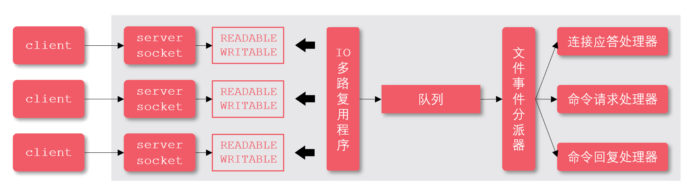

#### 1.5 Redis在持久化时fork出一个子进程，这时已经有两个进程了，怎么能说是单线程呢？

**参考答案**

Redis是单线程的，主要是指Redis的网络IO和键值对读写是由一个线程来完成的。而Redis的其他功能，如持久化、异步删除、集群数据同步等，则是依赖其他线程来执行的。所以，说Redis是单线程的只是一种习惯的说法，事实上它的底层不是单线程的。

#### 1.6 set和zset有什么区别？

**参考答案**

set：

- 集合中的元素是无序、不可重复的，一个集合最多能存储232-1个元素；
- 集合除了支持对元素的增删改查之外，还支持对多个集合取交集、并集、差集。

zset：

- 有序集合保留了集合元素不能重复的特点；
- 有序集合会给每个元素设置一个分数，并以此作为排序的依据；
- 有序集合不能包含相同的元素，但是不同元素的分数可以相同。

#### 1.7 说一下Redis中的watch命令

**参考答案**

很多时候，要确保事务中的数据没有被其他客户端修改才执行该事务。Redis提供了watch命令来解决这类问题，这是一种乐观锁的机制。客户端通过watch命令，要求服务器对一个或多个key进行监视，如果在客户端执行事务之前，这些key发生了变化，则服务器将拒绝执行客户端提交的事务，并向它返回一个空值。

#### 1.8 说说Redis中List结构的相关操作

**参考答案**

列表是线性有序的数据结构，它内部的元素是可以重复的，并且一个列表最多能存储2^32-1个元素。列表包含如下的常用命令：

- lpush/rpush：从列表的左侧/右侧添加数据；
- lrange：指定索引范围，并返回这个范围内的数据；
- lindex：返回指定索引处的数据；
- lpop/rpop：从列表的左侧/右侧弹出一个数据；
- blpop/brpop：从列表的左侧/右侧弹出一个数据，若列表为空则进入阻塞状态。

#### 1.9 你要如何设计Redis的过期时间？

**参考答案**

1. 热点数据不设置过期时间，使其达到“物理”上的永不过期，可以避免缓存击穿问题；
2. 在设置过期时间时，可以附加一个随机数，避免大量的key同时过期，导致缓存雪崩。

#### 1.10 Redis中，sexnx命令的返回值是什么，如何使用该命令实现分布式锁？

**参考答案**

setnx命令返回整数值，当返回1时表示设置值成果，当返回0时表示设置值失败（key已存在）。

一般我们不建议直接使用setnx命令来实现分布式锁，因为为了避免出现死锁，我们要给锁设置一个自动过期时间。而setnx命令和设置过期时间的命令不是原子的，可能加锁成果而设置过期时间失败，依然存在死锁的隐患。对于这种情况，Redis改进了set命令，给它增加了nx选项，启用该选项时set命令的效果就会setnx一样了。

采用Redis实现分布式锁，就是在Redis里存一份代表锁的数据，通常用字符串即可。采用改进后的setnx命令（即`set...nx...`命令）实现分布式锁的思路，以及优化的过程如下：

加锁：

第一版，这种方式的缺点是容易产生死锁，因为客户端有可能忘记解锁，或者解锁失败。

```
setnx key value
```

第二版，给锁增加了过期时间，避免出现死锁。但这两个命令不是原子的，第二步可能会失败，依然无法避免死锁问题。

```
setnx key value``expire key seconds
```

第三版，通过“set...nx...”命令，将加锁、过期命令编排到一起，它们是原子操作了，可以避免死锁。

```
set key value nx ex seconds
```

解锁：

解锁就是删除代表锁的那份数据。

```
del key
```

问题：

看起来已经很完美了，但实际上还有隐患，如下图。进程A在任务没有执行完毕时，锁已经到期被释放了。等进程A的任务执行结束后，它依然会尝试释放锁，因为它的代码逻辑就是任务结束后释放锁。但是，它的锁早已自动释放过了，它此时释放的可能是其他线程的锁。

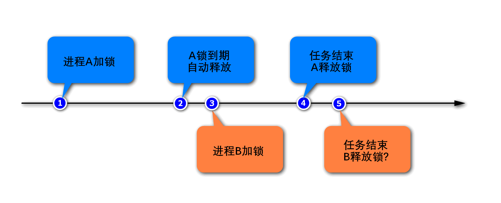

想要解决这个问题，我们需要解决两件事情：

1. 在加锁时就要给锁设置一个标识，进程要记住这个标识。当进程解锁的时候，要进行判断，是自己持有的锁才能释放，否则不能释放。可以为key赋一个随机值，来充当进程的标识。
2. 解锁时要先判断、再释放，这两步需要保证原子性，否则第二步失败的话，就会出现死锁。而获取和删除命令不是原子的，这就需要采用Lua脚本，通过Lua脚本将两个命令编排在一起，而整个Lua脚本的执行是原子的。

按照以上思路，优化后的命令如下：

```sh
# 加锁
set key random-value nx ex seconds 

# 解锁
if redis.call("get",KEYS[1]) == ARGV[1] then
    return redis.call("del",KEYS[1])
else
    return 0
end
```

#### 1.11 说一说Redis的持久化策略

**参考答案**

Redis支持RDB持久化、AOF持久化、RDB-AOF混合持久化这三种持久化方式。

RDB：

RDB(Redis Database)是Redis默认采用的持久化方式，它以快照的形式将进程数据持久化到硬盘中。RDB会创建一个经过压缩的二进制文件，文件以“.rdb”结尾，内部存储了各个数据库的键值对数据等信息。RDB持久化的触发方式有两种：

- 手动触发：通过SAVE或BGSAVE命令触发RDB持久化操作，创建“.rdb”文件；
- 自动触发：通过配置选项，让服务器在满足指定条件时自动执行BGSAVE命令。

其中，SAVE命令执行期间，Redis服务器将阻塞，直到“.rdb”文件创建完毕为止。而BGSAVE命令是异步版本的SAVE命令，它会使用Redis服务器进程的子进程，创建“.rdb”文件。BGSAVE命令在创建子进程时会存在短暂的阻塞，之后服务器便可以继续处理其他客户端的请求。总之，BGSAVE命令是针对SAVE阻塞问题做的优化，Redis内部所有涉及RDB的操作都采用BGSAVE的方式，而SAVE命令已经废弃！

BGSAVE命令的执行流程，如下图：

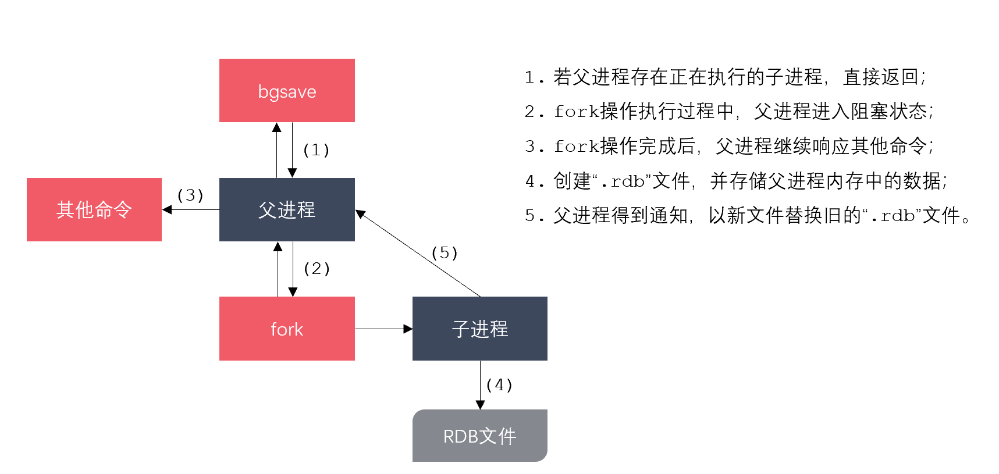

BGSAVE命令的原理，如下图：

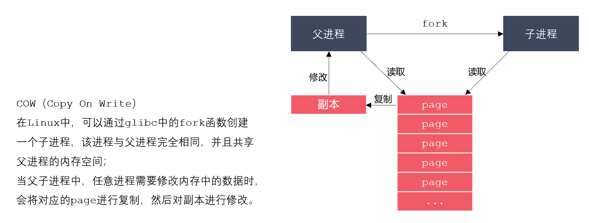

RDB持久化的优缺点如下：

- 优点：RDB生成紧凑压缩的二进制文件，体积小，使用该文件恢复数据的速度非常快；

- 缺点：BGSAVE每次运行都要执行fork操作创建子进程，属于重量级操作，不宜频繁执行，

  所以RDB持久化没办法做到实时的持久化。

AOF：

AOF（Append Only File），解决了数据持久化的实时性，是目前Redis持久化的主流方式。AOF以独立日志的方式，记录了每次写入命令，重启时再重新执行AOF文件中的命令来恢复数据。AOF的工作流程包括：命令写入（append）、文件同步（sync）、文件重写（rewrite）、重启加载（load），如下图：

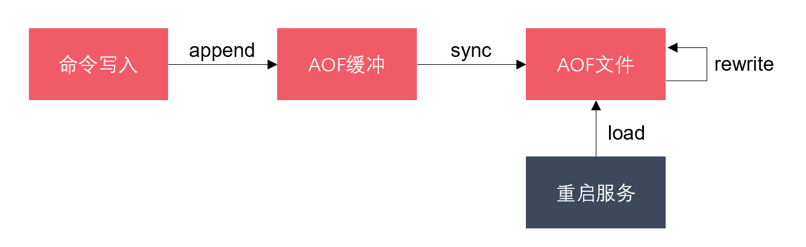

AOF以文本协议格式写入命令，如：

```
*``3``\r\n$``3``\r\nset\r\n$``5``\r\nhello\r\n$``5``\r\nworld\r\n
```

文本协议格式具有如下的优点：

1. 文本协议具有很好的兼容性；
2. 直接采用文本协议格式，可以避免二次处理的开销；
3. 文本协议具有可读性，方便直接修改和处理。

AOF持久化的文件同步机制：

为了提高程序的写入性能，现代操作系统会把针对硬盘的多次写操作优化为一次写操作。

1. 当程序调用write对文件写入时，系统不会直接把书记写入硬盘，而是先将数据写入内存的缓冲区中；
2. 当达到特定的时间周期或缓冲区写满时，系统才会执行flush操作，将缓冲区中的数据冲洗至硬盘中；

这种优化机制虽然提高了性能，但也给程序的写入操作带来了不确定性。

1. 对于AOF这样的持久化功能来说，冲洗机制将直接影响AOF持久化的安全性；
2. 为了消除上述机制的不确定性，Redis向用户提供了appendfsync选项，来控制系统冲洗AOF的频率；
3. Linux的glibc提供了fsync函数，可以将指定文件强制从缓冲区刷到硬盘，上述选项正是基于此函数。

appendfsync选项的取值和含义如下：

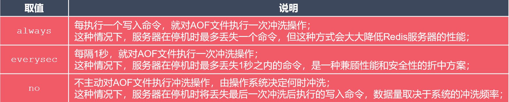

AOF持久化的优缺点如下：

- 优点：与RDB持久化可能丢失大量的数据相比，AOF持久化的安全性要高很多。通过使用everysec选项，用户可以将数据丢失的时间窗口限制在1秒之内。
- 缺点：AOF文件存储的是协议文本，它的体积要比二进制格式的”.rdb”文件大很多。AOF需要通过执行AOF文件中的命令来恢复数据库，其恢复速度比RDB慢很多。AOF在进行重写时也需要创建子进程，在数据库体积较大时将占用大量资源，会导致服务器的短暂阻塞。

RDB-AOF混合持久化：

Redis从4.0开始引入RDB-AOF混合持久化模式，这种模式是基于AOF持久化构建而来的。用户可以通过配置文件中的“aof-use-rdb-preamble yes”配置项开启AOF混合持久化。Redis服务器在执行AOF重写操作时，会按照如下原则处理数据：

- 像执行BGSAVE命令一样，根据数据库当前的状态生成相应的RDB数据，并将其写入AOF文件中；
- 对于重写之后执行的Redis命令，则以协议文本的方式追加到AOF文件的末尾，即RDB数据之后。

通过使用RDB-AOF混合持久化，用户可以同时获得RDB持久化和AOF持久化的优点，服务器既可以通过AOF文件包含的RDB数据来实现快速的数据恢复操作，又可以通过AOF文件包含的AOF数据来将丢失数据的时间窗口限制在1s之内。

#### 1.12 如何实现Redis的高可用？

**参考答案**

实现Redis的高可用，主要有哨兵和集群两种方式。

哨兵：

Redis Sentinel（哨兵）是一个分布式架构，它包含若干个哨兵节点和数据节点。每个哨兵节点会对数据节点和其余的哨兵节点进行监控，当发现节点不可达时，会对节点做下线标识。如果被标识的是主节点，它就会与其他的哨兵节点进行协商，当多数哨兵节点都认为主节点不可达时，它们便会选举出一个哨兵节点来完成自动故障转移的工作，同时还会将这个变化实时地通知给应用方。整个过程是自动的，不需要人工介入，有效地解决了Redis的高可用问题！

一组哨兵可以监控一个主节点，也可以同时监控多个主节点，两种情况的拓扑结构如下图：

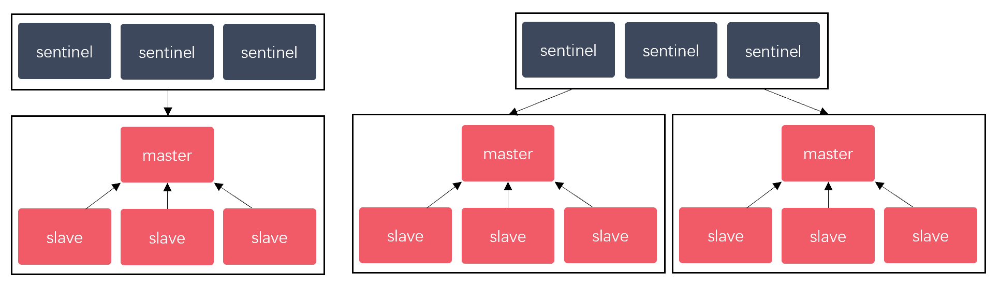

哨兵节点包含如下的特征：

1. 哨兵节点会定期监控数据节点，其他哨兵节点是否可达；
2. 哨兵节点会将故障转移的结果通知给应用方；
3. 哨兵节点可以将从节点晋升为主节点，并维护后续正确的主从关系；
4. 哨兵模式下，客户端连接的是哨兵节点集合，从中获取主节点信息；
5. 节点的故障判断是由多个哨兵节点共同完成的，可有效地防止误判；
6. 哨兵节点集合是由多个哨兵节点组成的，即使个别哨兵节点不可用，整个集合依然是健壮的；
7. 哨兵节点也是独立的Redis节点，是特殊的Redis节点，它们不存储数据，只支持部分命令。

集群：

Redis集群采用虚拟槽分区来实现数据分片，它把所有的键根据哈希函数映射到`0-16383`整数槽内，计算公式为`slot=CRC16(key)&16383`，每一个节点负责维护一部分槽以及槽所映射的键值数据。虚拟槽分区具有如下特点：

1. 解耦数据和节点之间的关系，简化了节点扩容和收缩的难度；
2. 节点自身维护槽的映射关系，不需要客户端或者代理服务维护槽分区元数据；
3. 支持节点、槽、键之间的映射查询，用于数据路由，在线伸缩等场景。

Redis集群中数据的分片逻辑如下图：

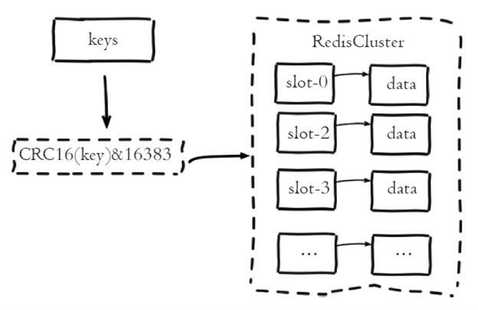

#### 1.13 Redis的主从同步是如何实现的？

**参考答案**

从2.8版本开始，Redis使用psync命令完成主从数据同步，同步过程分为全量复制和部分复制。全量复制一般用于初次复制的场景，部分复制则用于处理因网络中断等原因造成数据丢失的场景。psync命令需要以下参数的支持：

1. 复制偏移量：主节点处理写命令后，会把命令长度做累加记录，从节点在接收到写命令后，也会做累加记录；从节点会每秒钟上报一次自身的复制偏移量给主节点，而主节点则会保存从节点的复制偏移量。
2. 积压缓冲区：保存在主节点上的一个固定长度的队列，默认大小为1M，当主节点有连接的从节点时被创建；主节点处理写命令时，不但会把命令发送给从节点，还会写入积压缓冲区；缓冲区是先进先出的队列，可以保存最近已复制的数据，用于部分复制和命令丢失的数据补救。
3. 主节点运行ID：每个Redis节点启动后，都会动态分配一个40位的十六进制字符串作为运行ID；如果使用IP和端口的方式标识主节点，那么主节点重启变更了数据集（RDB/AOF），从节点再基于复制偏移量复制数据将是不安全的，因此当主节点的运行ID变化后，从节点将做全量复制。

psync命令的执行过程以及返回结果，如下图：

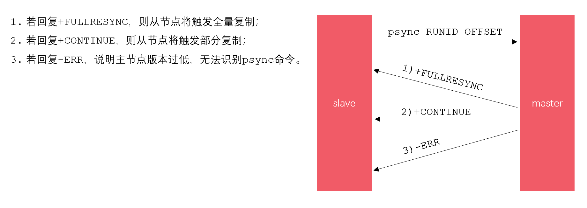

全量复制的过程，如下图：

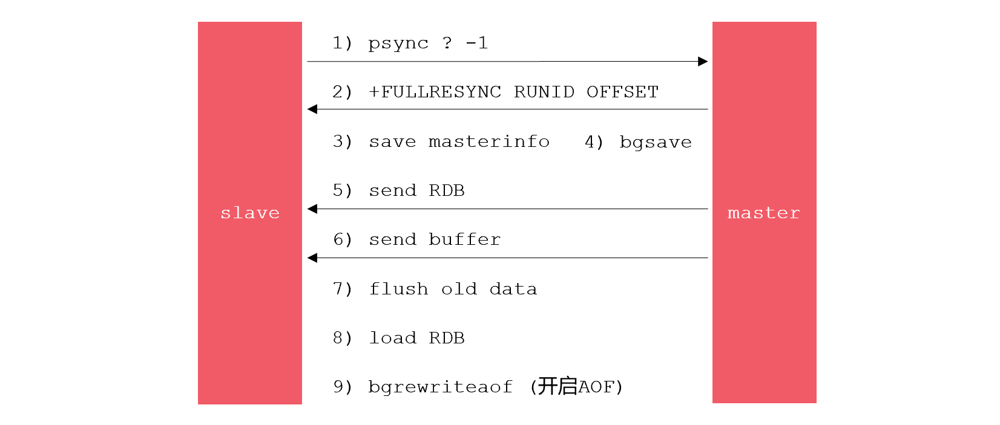

部分复制的过程，如下图：

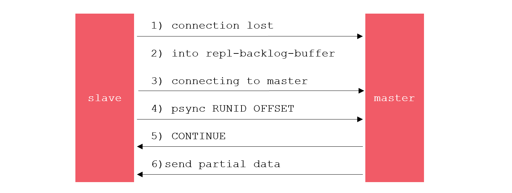

#### 1.15 说一说Redis的缓存淘汰策略

**参考答案**

当写入数据将导致超出maxmemory限制时，Redis会采用maxmemory-policy所指定的策略进行数据淘汰，该策略一共包含如下8种选项：

|    **策略**     |                         **描述**                         | **版本** |
| :-------------: | :------------------------------------------------------: | :------: |
|   noeviction    |                      直接返回错误；                      |          |
|  volatile-ttl   | 从设置了过期时间的键中，选择过期时间最小的键，进行淘汰； |          |
| volatile-random |      从设置了过期时间的键中，随机选择键，进行淘汰；      |          |
|  volatile-lru   |  从设置了过期时间的键中，使用LRU算法选择键，进行淘汰；   |          |
|  volatile-lfu   |  从设置了过期时间的键中，使用LFU算法选择键，进行淘汰；   |   4.0    |
| allleys-random  |           从所有的键中，随机选择键，进行淘汰；           |          |
|   allkeys-lru   |       从所有的键中，使用LRU算法选择键，进行淘汰；        |          |
|   allkeys-lfu   |       从所有的键中，使用LFU算法选择键，进行淘汰；        |   4.0    |

#### 1.16 请介绍一下Redis的过期策略

**参考答案**

Redis支持如下两种过期策略：

惰性删除：客户端访问一个key的时候，Redis会先检查它的过期时间，如果发现过期就立刻删除这个key。

定期删除：Redis会将设置了过期时间的key放到一个独立的字典中，并对该字典进行每秒10次的过期扫描，

过期扫描不会遍历字典中所有的key，而是采用了一种简单的贪心策略。该策略的删除逻辑如下：

1. 从过期字典中随机选择20个key；
2. 删除这20个key中已过期的key；
3. 如果已过期key的比例超过25%，则重复步骤1。

#### 1.17 缓存穿透、缓存击穿、缓存雪崩有什么区别，该如何解决？

**参考答案**

缓存穿透：

问题描述：

客户端查询根本不存在的数据，使得请求直达存储层，导致其负载过大，甚至宕机。出现这种情况的原因，可能是业务层误将缓存和库中的数据删除了，也可能是有人恶意攻击，专门访问库中不存在的数据。

解决方案：

1. 缓存空对象：存储层未命中后，仍然将空值存入缓存层，客户端再次访问数据时，缓存层会直接返回空值。
2. 布隆过滤器：将数据存入布隆过滤器，访问缓存之前以过滤器拦截，若请求的数据不存在则直接返回空值。

缓存击穿：

问题描述：

一份热点数据，它的访问量非常大。在其缓存失效的瞬间，大量请求直达存储层，导致服务崩溃。

解决方案：

1. 永不过期：热点数据不设置过期时间，所以不会出现上述问题，这是“物理”上的永不过期。或者为每个数据设置逻辑过期时间，当发现该数据逻辑过期时，使用单独的线程重建缓存。
2. 加互斥锁：对数据的访问加互斥锁，当一个线程访问该数据时，其他线程只能等待。这个线程访问过后，缓存中的数据将被重建，届时其他线程就可以直接从缓存中取值。

缓存雪崩：

问题描述：

在某一时刻，缓存层无法继续提供服务，导致所有的请求直达存储层，造成数据库宕机。可能是缓存中有大量数据同时过期，也可能是Redis节点发生故障，导致大量请求无法得到处理。

解决方案：

1. 避免数据同时过期：设置过期时间时，附加一个随机数，避免大量的key同时过期。
2. 启用降级和熔断措施：在发生雪崩时，若应用访问的不是核心数据，则直接返回预定义信息/空值/错误信息。或者在发生雪崩时，对于访问缓存接口的请求，客户端并不会把请求发给Redis，而是直接返回。
3. 构建高可用的Redis服务：采用哨兵或集群模式，部署多个Redis实例，个别节点宕机，依然可以保持服务的整体可用。

#### 1.18 如何保证缓存与数据库的双写一致性？

**参考答案**

四种同步策略：

想要保证缓存与数据库的双写一致，一共有4种方式，即4种同步策略：

1. 先更新缓存，再更新数据库；
2. 先更新数据库，再更新缓存；
3. 先删除缓存，再更新数据库；
4. 先更新数据库，再删除缓存。

从这4种同步策略中，我们需要作出比较的是：

1. 更新缓存与删除缓存哪种方式更合适？
2. 应该先操作数据库还是先操作缓存？

更新缓存还是删除缓存：

下面，我们来分析一下，应该采用更新缓存还是删除缓存的方式。

- 更新缓存

  优点：每次数据变化都及时更新缓存，所以查询时不容易出现未命中的情况。

  缺点：更新缓存的消耗比较大。如果数据需要经过复杂的计算再写入缓存，那么频繁的更新缓存，就会影响服务器的性能。如果是写入数据频繁的业务场景，那么可能频繁的更新缓存时，却没有业务读取该数据。

- 删除缓存

  优点：操作简单，无论更新操作是否复杂，都是将缓存中的数据直接删除。

  缺点：删除缓存后，下一次查询缓存会出现未命中，这时需要重新读取一次数据库。

从上面的比较来看，一般情况下，删除缓存是更优的方案。

先操作数据库还是缓存：

下面，我们再来分析一下，应该先操作数据库还是先操作缓存。

首先，我们将先删除缓存与先更新数据库，在出现失败时进行一个对比：

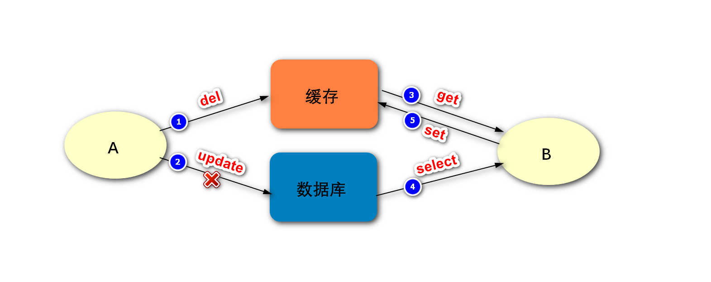

如上图，是先删除缓存再更新数据库，在出现失败时可能出现的问题：

1. 进程A删除缓存成功；
2. 进程A更新数据库失败；
3. 进程B从缓存中读取数据；
4. 由于缓存被删，进程B无法从缓存中得到数据，进而从数据库读取数据；
5. 进程B从数据库成功获取数据，然后将数据更新到了缓存。

最终，缓存和数据库的数据是一致的，但仍然是旧的数据。而我们的期望是二者数据一致，并且是新的数据。

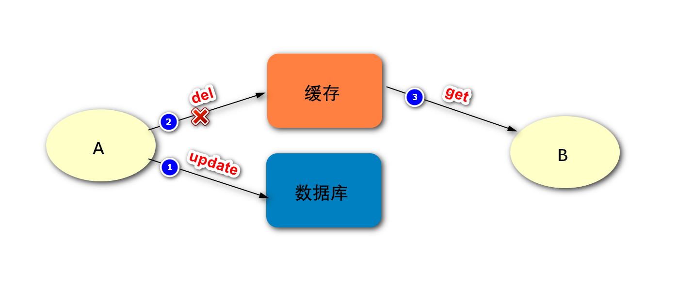

如上图，是先更新数据库再删除缓存，在出现失败时可能出现的问题：

1. 进程A更新数据库成功；
2. 进程A删除缓存失败；
3. 进程B读取缓存成功，由于缓存删除失败，所以进程B读取到的是旧的数据。

最终，缓存和数据库的数据是不一致的。

经过上面的比较，我们发现在出现失败的时候，是无法明确分辨出先删缓存和先更新数据库哪个方式更好，以为它们都存在问题。后面我们会进一步对这两种方式进行比较，但是在这里我们先探讨一下，上述场景出现的问题，应该如何解决呢？

实际上，无论上面我们采用哪种方式去同步缓存与数据库，在第二步出现失败的时候，都建议采用重试机制解决，因为最终我们是要解决掉这个错误的。而为了避免重试机制影响主要业务的执行，一般建议重试机制采用异步的方式执行，如下图：

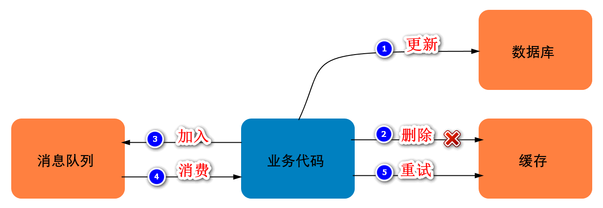

这里我们按照先更新数据库，再删除缓存的方式，来说明重试机制的主要步骤：

1. 更新数据库成功；
2. 删除缓存失败；
3. 将此数据加入消息队列；
4. 业务代码消费这条消息；
5. 业务代码根据这条消息的内容，发起重试机制，即从缓存中删除这条记录。

好了，下面我们再将先删缓存与先更新数据库，在没有出现失败时进行对比：

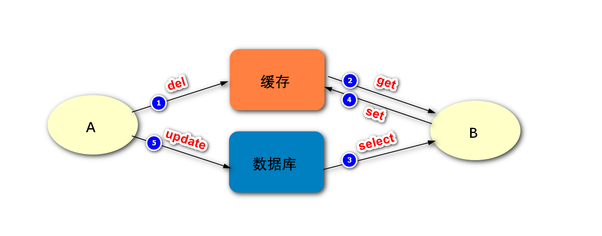

如上图，是先删除缓存再更新数据库，在没有出现失败时可能出现的问题：

1. 进程A删除缓存成功；
2. 进程B读取缓存失败；
3. 进程B读取数据库成功，得到旧的数据；
4. 进程B将旧的数据成功地更新到了缓存；
5. 进程A将新的数据成功地更新到数据库。

可见，进程A的两步操作均成功，但由于存在并发，在这两步之间，进程B访问了缓存。最终结果是，缓存中存储了旧的数据，而数据库中存储了新的数据，二者数据不一致。

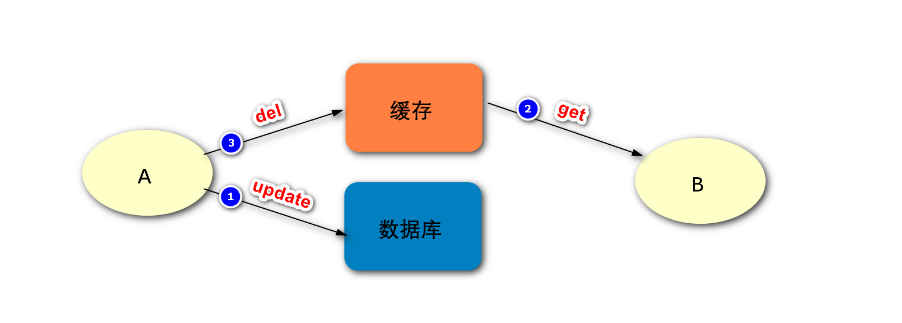

如上图，是先更新数据库再删除缓存，再没有出现失败时可能出现的问题：

1. 进程A更新数据库成功；
2. 进程B读取缓存成功；
3. 进程A更新数据库成功。

可见，最终缓存与数据库的数据是一致的，并且都是最新的数据。但进程B在这个过程里读到了旧的数据，可能还有其他进程也像进程B一样，在这两步之间读到了缓存中旧的数据，但因为这两步的执行速度会比较快，所以影响不大。对于这两步之后，其他进程再读取缓存数据的时候，就不会出现类似于进程B的问题了。

最终结论：

经过对比你会发现，先更新数据库、再删除缓存是影响更小的方案。如果第二步出现失败的情况，则可以采用重试机制解决问题。

**扩展阅读**

延时双删

上面我们提到，如果是先删缓存、再更新数据库，在没有出现失败时可能会导致数据的不一致。如果在实际的应用中，出于某些考虑我们需要选择这种方式，那有办法解决这个问题吗？答案是有的，那就是采用延时双删的策略，延时双删的基本思路如下：

1. 删除缓存；
2. 更新数据库；
3. sleep N毫秒；
4. 再次删除缓存。

阻塞一段时间之后，再次删除缓存，就可以把这个过程中缓存中不一致的数据删除掉。而具体的时间，要评估你这项业务的大致时间，按照这个时间来设定即可。

采用读写分离的架构怎么办？

如果数据库采用的是读写分离的架构，那么又会出现新的问题，如下图：

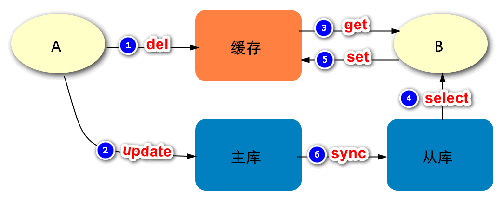

进程A先删除缓存，再更新主数据库，然后主库将数据同步到从库。而在主从数据库同步之前，可能会有进程B访问了缓存，发现数据不存在，进而它去访问从库获取到旧的数据，然后同步到缓存。这样，最终也会导致缓存与数据库的数据不一致。这个问题的解决方案，依然是采用延时双删的策略，但是在评估延长时间的时候，要考虑到主从数据库同步的时间。

第二次删除失败了怎么办？

如果第二次删除依然失败，则可以增加重试的次数，但是这个次数要有限制，当超出一定的次数时，要采取报错、记日志、发邮件提醒等措施。

#### 1.19 请介绍Redis集群的实现方案

**参考答案**

Redis集群的分区方案：

Redis集群采用虚拟槽分区来实现数据分片，它把所有的键根据哈希函数映射到`0-16383`整数槽内，计算公式为`slot=CRC16(key)&16383`，每一个节点负责维护一部分槽以及槽所映射的键值数据。虚拟槽分区具有如下特点：

1. 解耦数据和节点之间的关系，简化了节点扩容和收缩的难度；
2. 节点自身维护槽的映射关系，不需要客户端或者代理服务维护槽分区元数据；
3. 支持节点、槽、键之间的映射查询，用于数据路由，在线伸缩等场景。

Redis集群中数据的分片逻辑如下图：


Redis集群的功能限制：

Redis集群方案在扩展了Redis处理能力的同时，也带来了一些使用上的限制：

1. key批量操作支持有限。如mset、mget，目前只支持具有相同slot值的key执行批量操作。对于映射为不同slot值的key由于执行mset、mget等操作可能存在于多个节点上所以不被支持。
2. key事务操作支持有限。同理只支持多key在同一节点上的事务操作，当多个key分布在不同的节点上时无法使用事务功能。
3. key作为数据分区的最小粒度，因此不能将一个大的键值对象（如hash、list等）映射到不同的节点。
4. 不支持多数据库空间。单机下的Redis可以支持16个数据库，集群模式下只能使用一个数据库空间，即DB0。
5. 复制结构只支持一层，从节点只能复制主节点，不支持嵌套树状复制结构。

Redis集群的通信方案：

在分布式存储中需要提供维护节点元数据信息的机制，所谓元数据是指：节点负责哪些数据，是否出现故障等状态信息。常见的元数据维护方式分为：集中式和P2P方式。

Redis集群采用P2P的Gossip（流言）协议，Gossip协议的工作原理就是节点彼此不断通信交换信息，一段时间后所有的节点都会知道集群完整的信息，这种方式类似流言传播。通信的大致过程如下：

1. 集群中每个节点都会单独开辟一个TCP通道，用于节点之间彼此通信，通信端口号在基础端口号上加10000；
2. 每个节点再固定周期内通过特定规则选择几个节点发送ping消息；
3. 接收ping消息的节点用pong消息作为响应。

其中，Gossip协议的主要职责就是信息交换，而信息交换的载体就是节点彼此发送的Gossip消息，Gossip消息分为：meet消息、ping消息、pong消息、fail消息等。

- meet消息：用于通知新节点加入，消息发送者通知接受者加入到当前集群。meet消息通信正常完成后，接收节点会加入到集群中并进行周期性的ping、pong消息交换。
- ping消息：集群内交换最频繁的消息，集群内每个节点每秒向多个其他节点发送ping消息，用于检测节点是否在线和交换彼此状态信息。ping消息封装了自身节点和一部分其他节点的状态数据。
- pong消息：当接收到meet、ping消息时，作为响应消息回复给发送方确认消息正常通信。pong消息内封装了自身状态数据，节点也可以向集群内广播自身的pong消息来通知整个集群对自身状态进行更新。
- fail消息：当节点判定集群内另一个节点下线时，会向集群内广播一个fail消息，其他节点接收到fail消息之后把对应节点更新为下线状态。

虽然Gossip协议的信息交换机制具有天然的分布式特性，但它是有成本的。因为Redis集群内部需要频繁地进行节点信息交换，而ping/pong消息会携带当前节点和部分其他节点的状态数据，势必会加重带宽和计算的负担。所以，Redis集群的Gossip协议需要兼顾信息交换的实时性和成本的开销。

- 集群里的每个节点默认每隔一秒钟就会从已知节点列表中随机选出五个节点，然后对这五个节点中最长时间没有发送过PING消息的节点发送PING消息，以此来检测被选中的节点是否在线。
- 如果节点A最后一次收到节点B发送的PONG消息的时间，距离当前时间已经超过了节点A的超时选项设置时长的一半（cluster-node-timeout/2），那么节点A也会向节点B发送PING消息，这可以防止节点A因为长时间没有随机选中节点B作为PING消息的发送对象而导致对节点B的信息更新滞后。
- 每个消息主要的数据占用：slots槽数组（2KB）和整个集群1/10的状态数据（10个节点状态数据约1KB）。

#### 1.20 说一说Redis集群的分片机制

**参考答案**

Redis集群采用虚拟槽分区来实现数据分片，它把所有的键根据哈希函数映射到`0-16383`整数槽内，计算公式为`slot=CRC16(key)&16383`，每一个节点负责维护一部分槽以及槽所映射的键值数据。虚拟槽分区具有如下特点：

1. 解耦数据和节点之间的关系，简化了节点扩容和收缩的难度；
2. 节点自身维护槽的映射关系，不需要客户端或者代理服务维护槽分区元数据；
3. 支持节点、槽、键之间的映射查询，用于数据路由，在线伸缩等场景。

Redis集群中数据的分片逻辑如下图：


#### 1.21 说一说Redis集群的应用和优劣势

**参考答案**

优势：

Redis Cluster是Redis的分布式解决方案，在3.0版本正式推出，有效地解决了Redis分布式方面的需求。当遇到单机内存、并发、流量等瓶颈时，可以采用Cluster架构方案达到负载均衡的目的。

劣势：

Redis集群方案在扩展了Redis处理能力的同时，也带来了一些使用上的限制：

1. key批量操作支持有限。如mset、mget，目前只支持具有相同slot值的key执行批量操作。对于映射为不同slot值的key由于执行mset、mget等操作可能存在于多个节点上所以不被支持。
2. key事务操作支持有限。同理只支持多key在同一节点上的事务操作，当多个key分布在不同的节点上时无法使用事务功能。
3. key作为数据分区的最小粒度，因此不能将一个大的键值对象（如hash、list等）映射到不同的节点。
4. 不支持多数据库空间。单机下的Redis可以支持16个数据库，集群模式下只能使用一个数据库空间，即DB0。
5. 复制结构只支持一层，从节点只能复制主节点，不支持嵌套树状复制结构。

#### 1.22 说一说hash类型底层的数据结构

**参考答案**

哈希对象有两种编码方案，当同时满足以下条件时，哈希对象采用ziplist编码，否则采用hashtable编码：

- 哈希对象保存的键值对数量小于512个；
- 哈希对象保存的所有键值对中的键和值，其字符串长度都小于64字节。

其中，ziplist编码采用压缩列表作为底层实现，而hashtable编码采用字典作为底层实现。

压缩列表：

压缩列表（ziplist），是Redis为了节约内存而设计的一种线性数据结构，它是由一系列具有特殊编码的连续内存块构成的。一个压缩列表可以包含任意多个节点，每个节点可以保存一个字节数组或一个整数值。

压缩列表的结构如下图所示：


该结构当中的字段含义如下表所示：

| **属性** | **类型** | **长度** |                           **说明**                           |
| :------: | :------: | :------: | :----------------------------------------------------------: |
| zlbytes  | uint32_t |  4字节   |                  压缩列表占用的内存字节数；                  |
|  zltail  | uint32_t |  4字节   |    压缩列表表尾节点距离列表起始地址的偏移量（单位字节）；    |
|  zllen   | uint16_t |  2字节   | 压缩列表包含的节点数量，等于UINT16_MAX时，需遍历列表计算真实数量； |
|  entryX  | 列表节点 |  不固定  |    压缩列表包含的节点，节点的长度由节点所保存的内容决定；    |
|  zlend   | uint8_t  |  1字节   |            压缩列表的结尾标识，是一个固定值0xFF；            |

其中，压缩列表的节点由以下字段构成：


previous_entry_length（pel）属性以字节为单位，记录当前节点的前一节点的长度，其自身占据1字节或5字节：

1. 如果前一节点的长度小于254字节，则“pel”属性的长度为1字节，前一节点的长度就保存在这一个字节内；
2. 如果前一节点的长度达到254字节，则“pel”属性的长度为5字节，其中第一个字节被设置为0xFE，之后的四个字节用来保存前一节点的长度；

基于“pel”属性，程序便可以通过指针运算，根据当前节点的起始地址计算出前一节点的起始地址，从而实现从表尾向表头的遍历操作。

content属性负责保存节点的值（字节数组或整数），其类型和长度则由encoding属性决定，它们的关系如下：

|          **encoding**          | **长度** |                   **content**                   |
| :----------------------------: | :------: | :---------------------------------------------: |
|           00 xxxxxx            |  1字节   |           最大长度为26 -1的字节数组；           |
|       01 xxxxxx bbbbbbbb       |  2字节   |           最大长度为214-1的字节数组；           |
| 10 **__** bbbbbbbb ... ... ... |  5字节   |           最大长度为232-1的字节数组；           |
|           11 000000            |  1字节   |               int16_t类型的整数；               |
|           11 010000            |  1字节   |               int32_t类型的整数；               |
|           11 100000            |  1字节   |               int64_t类型的整数；               |
|           11 110000            |  1字节   |                24位有符号整数；                 |
|           11 111110            |  1字节   |                 8位有符号整数；                 |
|           11 11xxxx            |  1字节   | 没有content属性，xxxx直接存[0,12]范围的整数值； |

字典：

字典（dict）又称为散列表，是一种用来存储键值对的数据结构。C语言没有内置这种数据结构，所以Redis构建了自己的字典实现。

Redis字典的实现主要涉及三个结构体：字典、哈希表、哈希表节点。其中，每个哈希表节点保存一个键值对，每个哈希表由多个哈希表节点构成，而字典则是对哈希表的进一步封装。这三个结构体的关系如下图所示：

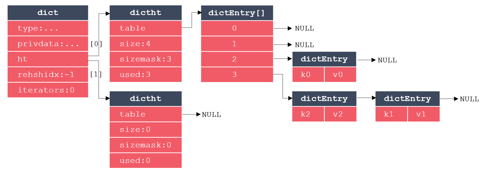

其中，dict代表字典，dictht代表哈希表，dictEntry代表哈希表节点。可以看出，dictEntry是一个数组，这很好理解，因为一个哈希表里要包含多个哈希表节点。而dict里包含2个dictht，多出的哈希表用于REHASH。当哈希表保存的键值对数量过多或过少时，需要对哈希表的大小进行扩展或收缩操作，在Redis中，扩展和收缩哈希表是通过REHASH实现的，执行REHASH的大致步骤如下：

1. 为字典的ht[1]哈希表分配内存空间

   如果执行的是扩展操作，则ht[1]的大小为第1个大于等于ht[0].used*2的2n。如果执行的是收缩操作，则ht[1]的大小为第1个大于等于ht[0].used的2n。

2. 将存储在ht[0]中的数据迁移到ht[1]上

   重新计算键的哈希值和索引值，然后将键值对放置到ht[1]哈希表的指定位置上。

3. 将字典的ht[1]哈希表晋升为默认哈希表

   迁移完成后，清空ht[0]，再交换ht[0]和ht[1]的值，为下一次REHASH做准备。

当满足以下任何一个条件时，程序会自动开始对哈希表执行扩展操作：

1. 服务器目前没有执行bgsave或bgrewriteof命令，并且哈希表的负载因子大于等于1；
2. 服务器目前正在执行bgsave或bgrewriteof命令，并且哈希表的负载因子大于等于5。

为了避免REHASH对服务器性能造成影响，REHASH操作不是一次性地完成的，而是分多次、渐进式地完成的。渐进式REHASH的详细过程如下：

1. 为ht[1]分配空间，让字典同时持有ht[0]和ht[1]两个哈希表；
2. 在字典中的索引计数器rehashidx设置为0，表示REHASH操作正式开始；
3. 在REHASH期间，每次对字典执行添加、删除、修改、查找操作时，程序除了执行指定的操作外，还会顺带将ht[0]中位于rehashidx上的所有键值对迁移到ht[1]中，再将rehashidx的值加1；
4. 随着字典不断被访问，最终在某个时刻，ht[0]上的所有键值对都被迁移到ht[1]上，此时程序将rehashidx属性值设置为-1，标识REHASH操作完成。

REHSH期间，字典同时持有两个哈希表，此时的访问将按照如下原则处理：

1. 新添加的键值对，一律被保存到ht[1]中；
2. 删除、修改、查找等其他操作，会在两个哈希表上进行，即程序先尝试去ht[0]中访问要操作的数据，若不存在则到ht[1]中访问，再对访问到的数据做相应的处理。