# 设计模式

## 7大原则

### 开闭原则

> 定义：软件实体应当对扩展开放，对修改关闭
>
> 大白话：**扩展新类而非修改旧类**

### 里式替换原则

> 定义：继承必须确保超类所拥有的性质在子类中仍然成立
>
> 大白话：**继承父类而非改变父类**，《设计模式之禅》：有父类的地方子类就可以使用

以下是反例（不遵守里式替换原则）：

~~~java
public class Father {
    public Collection doSomething(Map map){
        System.out.println("父类被执行...");
        return map.values();
    }
}
~~~

~~~java
public class Son extends Father {
    //缩小输入参数范围
    //注意！！！！此处不是重写而是重载~！！
    public Collection doSomething(HashMap map){
        System.out.println("子类被执行...");
        return map.values();
    }
}
~~~

~~~java
public class Client {
    public static void invoker(){
        //有父类的地方就有子类
        Father f= new Father();
        HashMap map = new HashMap();
        f.doSomething(map);
    }
    public static void main(String[] args) {
    	invoker();
    }
}
//返回结果：父类被执行...
~~~

使用里式替换原则：

~~~java
public class Client {
    public static void invoker(){
        //有父类的地方就有子类
        Son f =new Son();
        HashMap map = new HashMap();
        f.doSomething(map);
    }
    public static void main(String[] args) {
    	invoker();
    }
}
//返回结果：子类被执行...
~~~

子类在没有覆写父类的方法的前提下，子类方法被执行了，这会引起业务逻辑混乱。所以子类中方法的前置条件必须与超类中被覆写的方法的前置条件相同或者更宽松。

重写或实现父类的方法时输出结果可以被缩小。

### 依赖倒置原则

> 定义：高层模块不应该依赖底层模块，两者都应该依赖其抽象；抽象不应该依赖细节，细节应该依赖抽象。
>
> 大白话：**面向接口编程而非面向实现类**

### 单一职责原则

> 定义：一个类应该有且仅有一个引起它变化的原因，否则类应该被拆分
>
> 大白话：**每个类只负责自己的事情，而非万能**

单一职责原则提出了一个编写程序的标准，用“职责”或“变化原因”来衡量接口或类设计得是否优良，但是“职责”和“变化原因”都是不可度量的，因项目而异，因环境而异。

### 接口隔离原则

> 定义：一个类对另一个类的依赖应该建立在最小的接口上
>
> 大白话：**各个类建立自己的专用接口，而非建立万能接口**

### 迪米特法则

> 定义：也称最少知识原则
>
> 大白话：**无需直接交互的两个类，如果需要交互，使用中间者**
>
> 注意：过度使用迪米特法则会使系统产生大量的中间类，增加系统复杂度，使模块间通信效率变低

### 合成复用原则

> 定义：软件复用时，要尽量使用组合或者聚合等关联关系来实现，其次才考虑继承
>
> 大白话：**优先组合，其次继承**

## 创建型模式（5个）

### 单例模式

### 原型模式

> 依赖已有的对象（克隆），每次创建新的对象

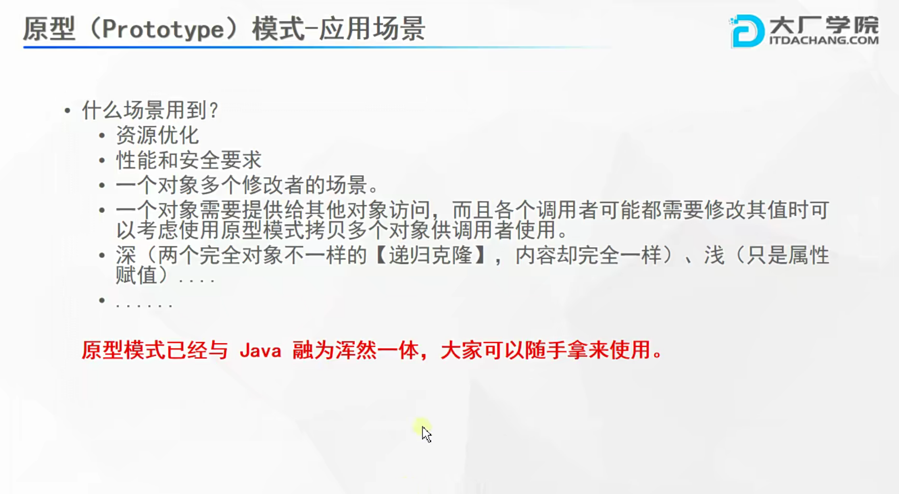

### 工厂模式（3个）

#### 简单工厂模式

> new对象交给一个factory，factory通过type来new对象
>
> 缺点：新增一个产品需要修改factory代码，**不符合开闭原则**

#### 工厂方法模式

> 将简单工厂中的factory抽象成多个子factory，每个子factory负责自己type的对象创建
>
> 缺点：需要不断扩充factory，而且无法满足多种产品族

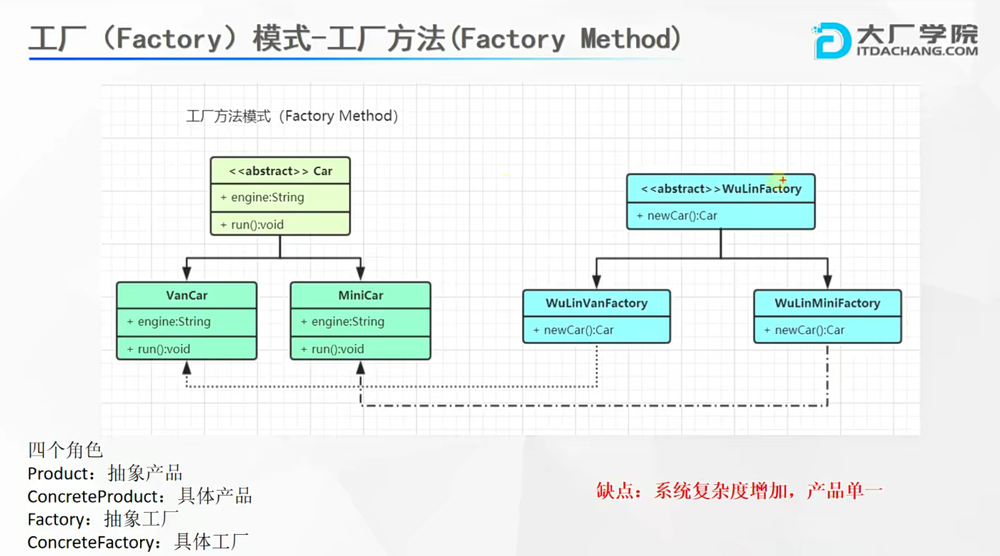

#### 抽象工厂模式

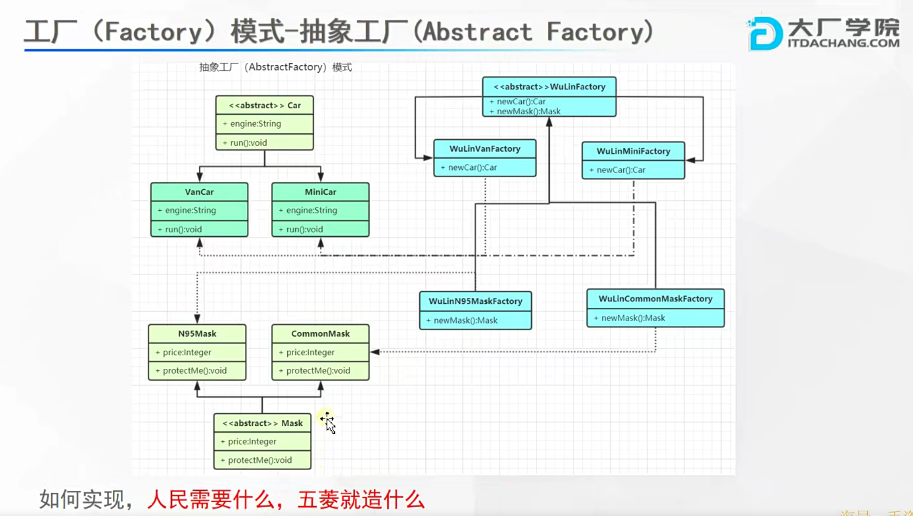

> 将所有产品族放在一个抽象factory中，每种产品族拥有自己的子factory，实现自己产品族的method即可

工厂模式应用场景：

- NumberFormat、SimpleDateFormat
- LoggerFactory
- SqlSessionFactory
- BeanFactory

### 建造者模式

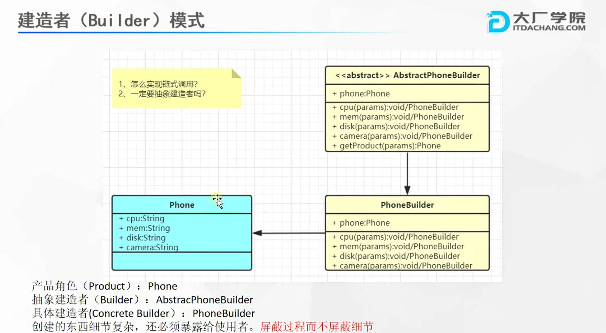

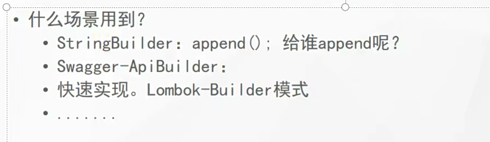

## 结构型模式

### 适配器模式

> 两个不兼容的接口之间适配的桥梁（增强一个类）

将一个接口转换成用户希望的另一个接口，适配器模式使接口不兼容的那些类可以一起工作（继承或组合）

适配器模式包含以下主要角色：

- 目标接口：可以是抽象类或接口，用户希望用到的接口
- 适配者类：隐藏的转换接口
- 适配器类：是个转换器，通过继承或引用适配者的对象，把适配者接口转换成目标接口

应用场景

### 桥接模式

> 相同功能抽象化与实现化解耦，抽象与实现可以独立升级

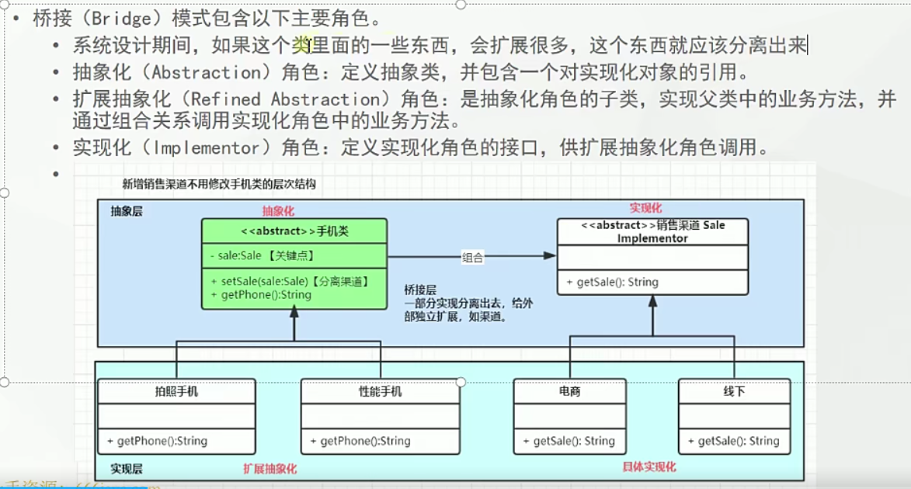

### 过滤器模式

> 使用不同标准来过滤一组对象

### 组合模式

> 相似对象进行组合，形成树形结构（类属性引用）

### 装饰器模式（注意与适配器区别）

> 向一个现有的对象添加新功能，同时不改变结构。（增强一个类的功能）

**与适配器区别**：

装饰器增强的方法在装饰类中定义，而适配器增加的方法需要外部类引用。

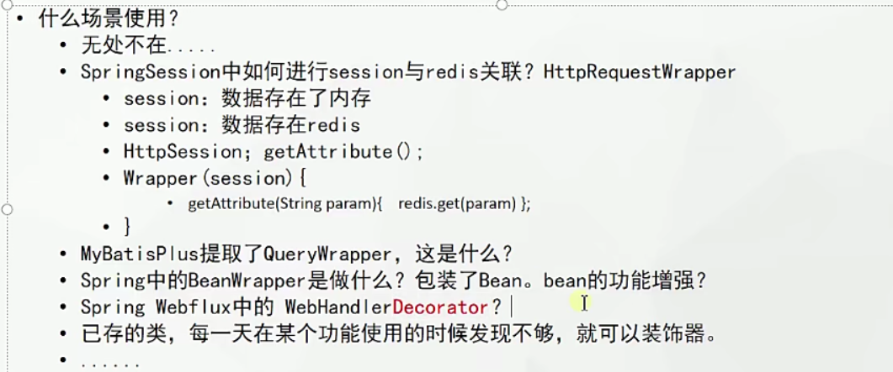

### 外观模式（门面模式）

> 向现有系统添加一个接口，客户端访问此接口来隐藏系统的复杂性（类似网关）

### 享元模式（池化思想）

> 尝试重用现有的同类对象，如果未找到匹配对象，则创建新的（池化思想）
>
> 与原型模式区别：原型模式返回的是克隆体，而享元模式返回的是本体。

### 代理模式

> 一个类代表另一个类的功能

#### 静态代理（等同于装饰器）

> 不同的代理对象可能要创建多个Proxy

#### 动态代理

> 一个Proxy就能代理不同的对象

jdk动态代理只能代理实现接口的类，可以利用多态代理所有接口中的方法。**Proxy只能转成接口**。

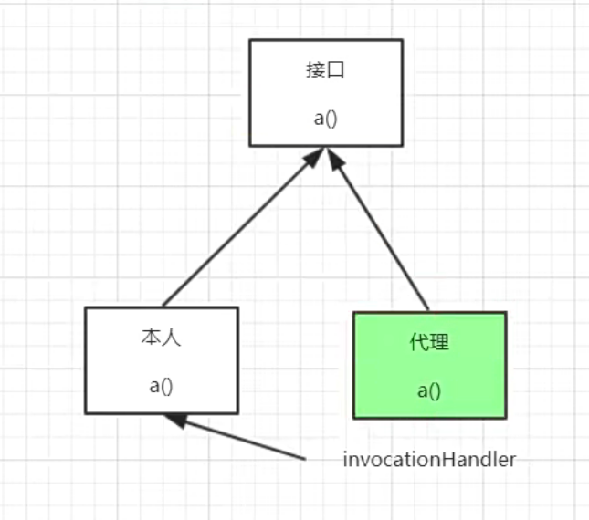

cglib不需要类实现接口，底层通过extends类，自然得到父类中所有的方法。

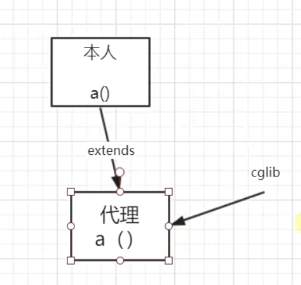

## 行为型模式

### 模板模式

> 父类定义算法骨架，某些实现放在子类

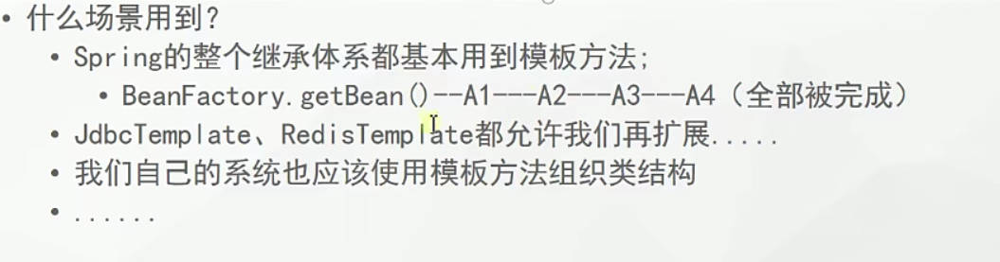

### 策略模式

> 每种算法独立封装，根据不同情况使用不同算法

### 状态模式

> 每种状态独立封装，不同状态内部封装了不同行为。**必须有状态切换**。

### 命令模式

> 将一个请求封装为一个对象，使发出请求的责任和执行请求的责任分隔开

### 责任链模式

>所有处理者封装为链式结构，依次调用（递归调用）

### 备忘录模式

> 把核心信息抽取出来，可以进行保存（快照）

### 解释器模式（不必掌握）

> 定义语法解析规则

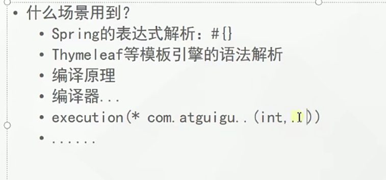

### 观察者模式

> 维护多个观察者依赖，状态变化通知所有观察者。（发布订阅）

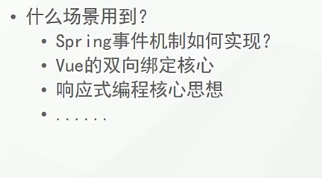

### 中介者模式

> 取消类/对象的直接调用关系，使用中介者维护

### 迭代器模式

> 定义集合数据的遍历规则

### 访问者模式

> 分离对象结构，与元素的执行算法