# 个人相关

## 项目相关

### token+jwt怎么实现?

> **JWT 本质上就一段签名的 JSON 格式的数据。由于它是带有签名的，因此接收者便可以验证它的真实性。**
>
> JWT 由 3 部分构成:
>
> 1. **Header** : 描述 JWT 的元数据，定义了生成签名的算法以及 `Token` 的类型。
> 2. **Payload** : 用来存放实际需要传递的数据
> 3. **Signature（签名）** ：服务器通过`Payload`、`Header`和一个密钥(`secret`)使用 `Header` 里面指定的签名算法（默认是 HMAC SHA256）生成。

好处：相比于session更安全，防止CSRF，也适合移动端不支持cookie的情况。

缺点：

1. 注销登录token仍有效，token一经发放，就无法撤回了（可以存redis，让其过期）
2. 续签问题

**类似于 Session 认证中的做法**：这种方案满足于大部分场景。假设服务端给的 token 有效期设置为30分钟，服务端每次进行校验时，如果发现 token 的有效期马上快过期了，服务端就重新生成 token 给客户端。客户端每次请求都检查新旧token，如果不一致，则更新本地的token。这种做法的问题是仅仅在快过期的时候请求才会更新 token ,对客户端不是很友好。

**每次请求都返回新 token** :这种方案的的思路很简单，但是，很明显，开销会比较大。

**token 有效期设置到半夜** ：这种方案是一种折衷的方案，保证了大部分用户白天可以正常登录，适用于对安全性要求不高的系统。

**用户登录返回两个 token** ：第一个是 accessToken ，它的过期时间 token 本身的过期时间比如半个小时，另外一个是 refreshToken 它的过期时间更长一点比如为1天。客户端登录后，将 accessToken和refreshToken 保存在本地，每次访问将 accessToken 传给服务端。服务端校验 accessToken 的有效性，如果过期的话，就将 refreshToken 传给服务端。如果有效，服务端就生成新的 accessToken 给客户端。否则，客户端就重新登录即可。该方案的不足是：1) 需要客户端来配合；2) 用户注销的时候需要同时保证两个 token 都无效；3) 重新请求获取 token 的过程中会有短暂 token 不可用的情况（可以通过在客户端设置定时器，当accessToken 快过期的时候，提前去通过 refreshToken 获取新的accessToken）。


# Java

## 排序

1.冒泡排序（稳定，O(N^2)，对有序数组友好）

> 描述：依次比较数组中相邻的num，若a[j]>a[j+1]，则交换。（将max排到最后）

```java
public static void bubble_v1(int[] arr){
    for(int i=0;i<arr.length-1;i++){
        boolean swapped=false;
        for (int j=0;j<arr.length-1-i;j++){
            if(arr[j]>arr[j+1]){
                swap(arr,j,j+1);
                swapped=true;
            }
        }
        System.out.println(Arrays.toString(arr));
        if(!swapped){
            break;
        }
    }
}
private static void swap(int[] arr, int i, int j) {
    int temp=arr[i];
    arr[i]=arr[j];
    arr[j]=temp;
}
```

> 优化：减少冒泡次数，记录最后一次交换的index，index就是冒泡的次数。

```java
public static void bubble_v2(int[] arr){
        int n=arr.length-1;  
        while (true){
            int last=0; //最后一次交换的index
            for (int j=0;j<n;j++){
                if(arr[j]>arr[j+1]){
                    swap(arr,j,j+1);
                    last=j;
                }
            }
            n=last;
            System.out.println(Arrays.toString(arr));
            if(n==0){
                break;
            }
        }
    }
private static void swap(int[] arr, int i, int j) {
    int temp=arr[i];
    arr[i]=arr[j];
    arr[j]=temp;
}
```

2.选择排序（不稳定，O(N^2)）

> 描述：每轮选出min，放到前面

```java
public static void selectSort(int[] arr){
    for(int i=0;i<arr.length-1;i++){
        int minIndex=i;
        for (int j=i+1;j<arr.length;j++){
            if(arr[minIndex]>arr[j]){
                minIndex=j;
            }
        }
        if(arr[i]!=arr[minIndex]){
            swap(arr,i,minIndex);
        }
        System.out.println(Arrays.toString(arr));
    }
}

private static void swap(int[] arr, int i, int j) {
    int temp=arr[i];
    arr[i]=arr[j];
    arr[j]=temp;
}
```

3.插入排序（稳定，O(N^2)，对有序数组友好）

> 描述：将数组分为排序和未排序区域，每轮从未排序区中选择一个num，插入到排序区域，确保排序区域的顺序性。（不断扩大排序区域）

```java
public static void insertSort(int[] arr){
    for(int i=1;i<arr.length;i++){ //i代表插入元素的index
        int insert=arr[i]; //待插入的num
        int j=i-1; //j代表已排序区域的index
        while(j>=0){
            if(arr[j]>insert){
                arr[j+1]=arr[j];
            }else{
                break;
            }
            j--;
        }
        arr[j+1]=insert;
        System.out.println(Arrays.toString(arr));
    }
}
```

4.快排

>描述：每轮排序选择一个基准点进行分区，直到子分区个数等于1。（分治思想）

- 单边循环快排（lomuto洛穆托分区方案）

  1. 选择最右元素作为基准点元素
  2. j指针负责找到比基准点小的元素，一旦找到则与i交换
  3. i指针维护小于基准点元素的边界，也是每次交换 的目标索引
  4. 最后基准点和i交换，i即为分区位置


```java
public static void quick(int[] nums, int l, int h) {
    if(l>=h){
        return;
    }
    int p=partition(nums, l,h);
    quick(nums, l, p-1);
    quick(nums, p+1, h);
}

public static int partition(int[] nums, int l, int h) {
    int pv = nums[h]; //基准点
    int i = l; //i指针维护小于基准点元素的边界，也是每次交换 的目标索引
    for (int j = l; j <= h; j++) {  //j指针负责找到比基准点小的元素，一旦找到则与i交换
        if (nums[j] < pv) {
            swap(nums, i, j);
            i++;
        }
    }
    swap(nums, i, h);
    System.out.println(Arrays.toString(nums)+" i:"+i);
    return i;
}
```

- 双边循环快排（并不完全等价于hoare霍尔分区方案）

  1. 选择最左元素作为基准点元素
  2. j指针负责从右向左找比基准点小的元素，i指针负责从左向右找比基准点大的元素，一旦找到两者交换，直至i和j相交
  3. 最后基准点与i交换（此时i=j），i即为分区位置

  **双边循环注意要点**：

  1. 基准点在左边，并且要`先j后i`
  2. while(**`i<j`**&&a[j]>pv) j--
  3. while(**`i<j`**&&a[i]**`<=`**pv) i++

```java
public static int partition2(int[] nums, int l, int h) {
    int pv = nums[l]; //基准点
    int i = l,j=h;
    while(i<j){
        //j右往左找小的
        while(i<j&&nums[j]>pv){
            j--;
        }
        //i左往右找大的
        while(i<j&&nums[i]<=pv){
            i++;
        }
        swap(nums, i, j);
    }
    swap(nums, l, i);
    System.out.println(Arrays.toString(nums));
    return i;
}
```

​	**快排特点**：


## BigDecimal原理

> 小数放大成整数，然后记录原来整数位数和小数位数，利用bigint进行运算。

## ArrayList

**扩容规则**

1. ArrayList() 会使用长度为零的数组

2. ArrayList(int initialCapacity) 会使用指定容量的数组

3. public ArrayList(Collection<? extends E> c) 会使用 c 的大小作为数组容量

4. add(Object o) 首次扩容为 10，再次扩容为上次容量的 1.5 倍

5. addAll(Collection c) 没有元素时，扩容为 Math.max(10, 实际元素个数)，有元素时为 Math.max(原容量 1.5 倍, 实际元素个数)

##  Iterator

### Fail-Fast 与 Fail-Safe

* ArrayList 是 fail-fast 的典型代表，遍历的同时不能修改，尽快失败

* CopyOnWriteArrayList 是 fail-safe 的典型代表，遍历的同时可以修改，原理是读写分离

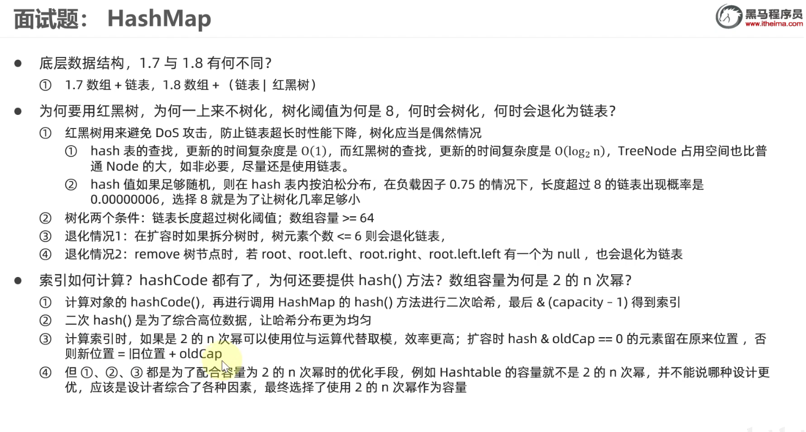

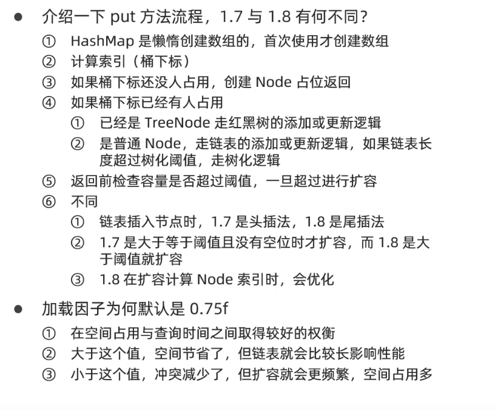

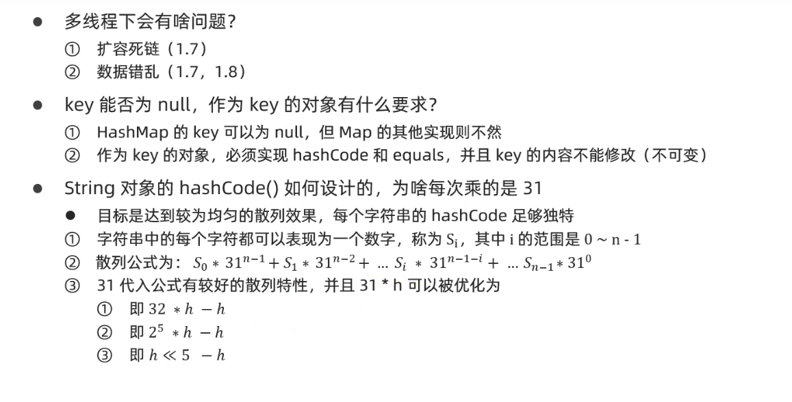

## 单例模式

**饿汉式**

```java
public class Singleton1 implements Serializable {
    private Singleton1() {
        if (INSTANCE != null) {
            throw new RuntimeException("单例对象不能重复创建");
        }
        System.out.println("private Singleton1()");
    }

    private static final Singleton1 INSTANCE = new Singleton1();

    public static Singleton1 getInstance() {
        return INSTANCE;
    }

    public static void otherMethod() {
        System.out.println("otherMethod()");
    }

    public Object readResolve() {
        return INSTANCE;
    }
}
```

* 构造方法抛出异常是防止**反射**破坏单例
* `readResolve()` 是防止**反序列化**破坏单例


**枚举饿汉式**

```java
public enum Singleton2 {
    INSTANCE;

    private Singleton2() {
        System.out.println("private Singleton2()");
    }

    @Override
    public String toString() {
        return getClass().getName() + "@" + Integer.toHexString(hashCode());
    }

    public static Singleton2 getInstance() {
        return INSTANCE;
    }

    public static void otherMethod() {
        System.out.println("otherMethod()");
    }
}
```

* 枚举饿汉式能天然防止反射、反序列化破坏单例


**懒汉式**

```java
public class Singleton3 implements Serializable {
    private Singleton3() {
        System.out.println("private Singleton3()");
    }

    private static Singleton3 INSTANCE = null;

    // Singleton3.class
    public static synchronized Singleton3 getInstance() {
        if (INSTANCE == null) {
            INSTANCE = new Singleton3();
        }
        return INSTANCE;
    }

    public static void otherMethod() {
        System.out.println("otherMethod()");
    }

}
```

* 其实只有首次创建单例对象时才需要同步，但该代码实际上每次调用都会同步
* 因此有了下面的双检锁改进


**双检锁懒汉式**

```java
public class Singleton4 implements Serializable {
    private Singleton4() {
        System.out.println("private Singleton4()");
    }

    private static volatile Singleton4 INSTANCE = null; // 可见性，有序性

    public static Singleton4 getInstance() {
        if (INSTANCE == null) {
            synchronized (Singleton4.class) {
                if (INSTANCE == null) {
                    INSTANCE = new Singleton4();
                }
            }
        }
        return INSTANCE;
    }

    public static void otherMethod() {
        System.out.println("otherMethod()");
    }
}
```

为何必须加 volatile：

* `INSTANCE = new Singleton4()` 不是原子的，分成 3 步：创建对象、调用构造、给静态变量赋值，其中后两步可能被指令重排序优化，变成先赋值、再调用构造
* 如果线程1 先执行了赋值，线程2 执行到第一个 `INSTANCE == null` 时发现 INSTANCE 已经不为 null，此时就会返回一个未完全构造的对象


**内部类懒汉式**

```java
public class Singleton5 implements Serializable {
    private Singleton5() {
        System.out.println("private Singleton5()");
    }

    private static class Holder {
        static Singleton5 INSTANCE = new Singleton5();
    }

    public static Singleton5 getInstance() {
        return Holder.INSTANCE;
    }

    public static void otherMethod() {
        System.out.println("otherMethod()");
    }
}
```

* 避免了双检锁的缺点

**破坏单例**

- 反射->非空判断预防
- 反序列化->重写readResolve()
- UnSafe类->貌似无解

**JDK 中单例的体现**

* Runtime 体现了饿汉式单例
* Console 体现了双检锁懒汉式单例
* Collections 中的 EmptyNavigableSet 内部类懒汉式单例
* ReverseComparator.REVERSE_ORDER 内部类懒汉式单例
* Comparators.NaturalOrderComparator.INSTANCE 枚举饿汉式单例


## wait vs sleep

**一个共同点，三个不同点**

共同点

* wait() ，wait(long) 和 sleep(long) 的效果都是让当前线程暂时放弃 CPU 的使用权，进入阻塞状态

不同点

* 方法归属不同
  * sleep(long) 是 Thread 的静态方法
  * 而 wait()，wait(long) 都是 Object 的成员方法，每个对象都有

* 醒来时机不同
  * 执行 sleep(long) 和 wait(long) 的线程都会在等待相应毫秒后醒来
  * wait(long) 和 wait() 还可以被 notify 唤醒，wait() 如果不唤醒就一直等下去
  * 它们都可以被打断唤醒

* 锁特性不同（重点）
  * wait 方法的调用必须先获取 wait 对象的锁，而 sleep 则无此限制
  * wait 方法执行后会释放对象锁，允许其它线程获得该对象锁（我放弃 cpu，但你们还可以用）
  * 而 sleep 如果在 synchronized 代码块中执行，并不会释放对象锁（我放弃 cpu，你们也用不了）


## lock vs synchronized

不同点

* 语法层面
  * synchronized 是关键字，源码在 jvm 中，用 c++ 语言实现
  * Lock 是接口，源码由 jdk 提供，用 java 语言实现
  * 使用 synchronized 时，退出同步代码块锁会自动释放，而使用 Lock 时，需要手动调用 unlock 方法释放锁
* 功能层面
  * 二者均属于悲观锁、都具备基本的互斥、同步、锁重入功能
  * Lock 提供了许多 synchronized 不具备的功能，例如获取等待状态、公平锁、可打断、可超时、多条件变量
  * Lock 有适合不同场景的实现，如 ReentrantLock， ReentrantReadWriteLock
* 性能层面
  * 在没有竞争时，synchronized 做了很多优化，如偏向锁、轻量级锁，性能不赖
  * 在竞争激烈时，Lock 的实现通常会提供更好的性能

**公平锁**

* 公平锁的公平体现
  * **已经处在阻塞队列**中的线程（不考虑超时）始终都是公平的，先进先出
  * 公平锁是指**未处于阻塞队列**中的线程来争抢锁，如果队列不为空，则老实到队尾等待
  * 非公平锁是指**未处于阻塞队列**中的线程来争抢锁，与队列头唤醒的线程去竞争，谁抢到算谁的
* 公平锁会降低吞吐量，一般不用

**条件变量**

* ReentrantLock 中的条件变量功能类似于普通 synchronized 的 wait，notify，用在当线程获得锁后，发现条件不满足时，临时等待的链表结构
* 与 synchronized 的等待集合不同之处在于，ReentrantLock 中的条件变量可以有多个，可以实现更精细的等待、唤醒控制

## volatile

**原子性**

* 起因：多线程下，不同线程的**指令发生了交错**导致的共享变量的读写混乱
* 解决：用悲观锁或乐观锁解决，volatile 并不能解决原子性

**可见性**

* 起因：由于**编译器优化、或缓存优化、或 CPU 指令重排序优化**导致的对共享变量所做的修改另外的线程看不到
* 解决：用 volatile 修饰共享变量，能够防止编译器等优化发生，让一个线程对共享变量的修改对另一个线程可见

**有序性**

* 起因：由于**编译器优化、或缓存优化、或 CPU 指令重排序优化**导致指令的实际执行顺序与编写顺序不一致
* 解决：用 volatile 修饰共享变量会在读、写共享变量时加入不同的屏障，阻止其他读写操作越过屏障，从而达到阻止重排序的效果
* 注意：
  * **volatile 变量写**加的屏障是阻止上方其它写操作越过屏障排到 **volatile 变量写**之下
  * **volatile 变量读**加的屏障是阻止下方其它读操作越过屏障排到 **volatile 变量读**之上
  * volatile 读写加入的屏障只能防止同一线程内的指令重排

## Hashtable vs ConcurrentHashMap

**Hashtable 对比 ConcurrentHashMap**

* Hashtable 与 ConcurrentHashMap 都是线程安全的 Map 集合
* Hashtable 并发度低，整个 Hashtable 对应一把锁，同一时刻，只能有一个线程操作它
* ConcurrentHashMap 并发度高，整个 ConcurrentHashMap 对应多把锁，只要线程访问的是不同锁，那么不会冲突

**ConcurrentHashMap 1.7**

* 数据结构：`Segment(大数组) + HashEntry(小数组) + 链表`，每个 Segment 对应一把锁，如果多个线程访问不同的 Segment，则不会冲突
* 并发度：Segment 数组大小即并发度，决定了同一时刻最多能有多少个线程并发访问。Segment 数组不能扩容，意味着并发度在 ConcurrentHashMap 创建时就固定了
* 索引计算
  * 假设大数组长度是 $2^m$，key 在大数组内的索引是 key 的二次 hash 值的高 m 位
  * 假设小数组长度是 $2^n$，key 在小数组内的索引是 key 的二次 hash 值的低 n 位
* 扩容：每个小数组的扩容相对独立，小数组在超过扩容因子时会触发扩容，每次扩容翻倍
* Segment[0] 原型：首次创建其它小数组时，会以此原型为依据，数组长度，扩容因子都会以原型为准

**ConcurrentHashMap 1.8**

* 数据结构：`Node 数组 + 链表或红黑树`，数组的每个头节点作为锁，如果多个线程访问的头节点不同，则不会冲突。首次生成头节点时如果发生竞争，利用 cas 而非 syncronized，进一步提升性能
* 并发度：Node 数组有多大，并发度就有多大，与 1.7 不同，Node 数组可以扩容
* 扩容条件：Node 数组满 3/4 时就会扩容
* 扩容单位：以链表为单位从后向前迁移链表，迁移完成的将旧数组头节点替换为 ForwardingNode
* 扩容时并发 get
  * 根据是否为 ForwardingNode 来决定是在新数组查找还是在旧数组查找，不会阻塞
  * 如果链表长度超过 1，则需要对节点进行复制（创建新节点），怕的是节点迁移后 next 指针改变
  * 如果链表最后几个元素扩容后索引不变，则节点无需复制
* 扩容时并发 put
  * 如果 put 的线程与扩容线程操作的链表是同一个，put 线程会阻塞
  * 如果 put 的线程操作的链表还未迁移完成，即头节点不是 ForwardingNode，则可以并发执行
  * 如果 put 的线程操作的链表已经迁移完成，即头结点是 ForwardingNode，则可以协助扩容
* 与 1.7 相比是懒惰初始化
* capacity 代表预估的元素个数，capacity / factory 来计算出初始数组大小，需要贴近 $2^n$ 
* loadFactor 只在计算初始数组大小时被使用，之后扩容固定为 3/4
* 超过树化阈值时的扩容问题，如果容量已经是 64，直接树化，否则在原来容量基础上做 3 轮扩容


## ThreadLocal

**要求**

* 掌握 ThreadLocal 的作用与原理
* 掌握 ThreadLocal 的内存释放时机

**作用**

* ThreadLocal 可以实现【资源对象】的线程隔离，让每个线程各用各的【资源对象】，避免争用引发的线程安全问题
* ThreadLocal 同时实现了线程内的资源共享

**原理**

每个线程内有一个 ThreadLocalMap 类型的成员变量，用来存储资源对象

* 调用 set 方法，就是以 ThreadLocal 自己作为 key，资源对象作为 value，放入当前线程的 ThreadLocalMap 集合中
* 调用 get 方法，就是以 ThreadLocal 自己作为 key，到当前线程中查找关联的资源值
* 调用 remove 方法，就是以 ThreadLocal 自己作为 key，移除当前线程关联的资源值

ThreadLocalMap 的一些特点

* key 的 hash 值统一分配
* 初始容量 16，扩容因子 2/3，扩容容量翻倍
* key 索引冲突后用**开放寻址法**解决冲突

**弱引用 key**

ThreadLocalMap 中的 key 被设计为弱引用，原因如下

* Thread 可能需要长时间运行（如线程池中的线程），如果 key 不再使用，需要在内存不足（GC）时释放其占用的内存

**内存释放时机**

* 被动 GC 释放 key
  * 仅是让 key 的内存释放，关联 value 的内存并不会释放
* 懒惰被动释放 value
  * get key 时，发现是 null key，则释放其 value 内存
  * set key 时，会使用启发式扫描，清除临近的 null key 的 value 内存，启发次数与元素个数，是否发现 null key 有关
* 主动 remove 释放 key，value
  * 会同时释放 key，value 的内存，也会清除临近的 null key 的 value 内存
  * 推荐使用它，因为一般使用 ThreadLocal 时都把它作为静态变量（即强引用），因此无法被动依靠 GC 回收

## 为什么HashMap要自己实现writeObject和readObject方法

> HashMap中，由于Entry的存放位置是根据Key的[Hash](https://so.csdn.net/so/search?q=Hash&spm=1001.2101.3001.7020)值来计算，不同的JVM实现中计算得出的Hash值可能是不同的。

HashMap采用了下面的方式来解决：

- 将可能会造成数据不一致的元素使用`transient`关键字修饰，从而避免JDK中默认序列化方法对该对象的序列化操作。不序列化的包括：`Entry[] table`,`size`,`modCount`。
- 自己实现writeObject方法，从而保证序列化和反序列化结果的一致性。

### 那么，HashMap又是通过什么手段来保证序列化和反序列化数据的一致性的呢？

1. 首先，HashMap序列化的时候不会将保存数据的数组序列化，而是将元素个数以及每个元素的Key和Value都进行序列化。
2. 在反序列化的时候，重新计算Key和Value的位置，重新填充一个数组。

# 数据结构与算法

## 前中后序（非递归）

~~~java
private List<Integer> preOrder(TreeNode root){
        stack=new Stack<>();
        List<Integer> res=new ArrayList<>();
        while(root!=null||!stack.isEmpty()){
            while(root!=null){
                res.add(root.val);
                stack.push(root);
                root=root.left;
            }
            if(!stack.isEmpty()){
                root=stack.pop();
                root=root.right;
            }
        }
        return res;
    }
    private List<Integer> inOrder(TreeNode root){
        stack=new Stack<>();
        List<Integer> res=new ArrayList<>();
        while(root!=null||!stack.isEmpty()){
            while(root!=null){
                stack.push(root);
                root=root.left;
            }
            if(!stack.isEmpty()){
                root=stack.pop();
                res.add(root.val);
                root=root.right;
            }
        }
        return res;
    }
    private List<Integer> postOrder(TreeNode root){
        stack=new Stack<>();
        List<Integer> res=new ArrayList<>();
        TreeNode visited=new TreeNode(-1);
        pushLeftBranch(root);
        while(!stack.isEmpty()){
            TreeNode node=stack.peek();
            if((node.left==null||node.left==visited)&&node.right!=visited){
                pushLeftBranch(node.right);
            }
            if(node.right==null||node.right==visited){
                res.add(node.val);
                visited=stack.pop();
            }
        }
        return res;
    }
    private void pushLeftBranch(TreeNode root){
        while(root!=null){
            stack.push(root);
            root=root.left;
        }
    }
~~~


# JUC

## 进程

### 概述

进程：程序是静止的，进程实体的运行过程就是进程，是系统进行**资源分配的基本单位**

进程的特征：并发性、异步性、动态性、独立性、结构性

**线程**：线程是属于进程的，是一个基本的 CPU 执行单元，是程序执行流的最小单元。线程是进程中的一个实体，是系统**独立调度的基本单位**，线程本身不拥有系统资源，只拥有一点在运行中必不可少的资源，但它可与同属一个进程的其他线程共享进程所拥有的全部资源

关系：一个进程可以包含多个线程，这就是多线程，比如看视频是进程，图画、声音、广告等就是多个线程

线程的作用：使多道程序更好的并发执行，提高资源利用率和系统吞吐量，增强操作系统的并发性能

并发并行：

* 并行：在同一时刻，有多个指令在多个 CPU 上同时执行
* 并发：在同一时刻，有多个指令在单个 CPU 上交替执行

同步异步：

* 需要等待结果返回，才能继续运行就是同步
* 不需要等待结果返回，就能继续运行就是异步


参考视频：https://www.bilibili.com/video/BV16J411h7Rd

笔记的整体结构依据视频编写，并随着学习的深入补充了很多知识


***


### 对比

线程进程对比：

* 进程基本上相互独立的，而线程存在于进程内，是进程的一个子集

* 进程拥有共享的资源，如内存空间等，供其**内部的线程共享**

* 进程间通信较为复杂

  同一台计算机的进程通信称为 IPC（Inter-process communication）

  * 信号量：信号量是一个计数器，用于多进程对共享数据的访问，解决同步相关的问题并避免竞争条件
  * 共享存储：多个进程可以访问同一块内存空间，需要使用信号量用来同步对共享存储的访问
  * 管道通信：管道是用于连接一个读进程和一个写进程以实现它们之间通信的一个共享文件，pipe 文件
    * 匿名管道（Pipes）：用于具有亲缘关系的父子进程间或者兄弟进程之间的通信，只支持**半双工通信**
    * 命名管道（Names Pipes）：以磁盘文件的方式存在，可以实现本机任意两个进程通信，遵循 FIFO
  * 消息队列：内核中存储消息的链表，由消息队列标识符标识，能在不同进程之间提供**全双工通信**，对比管道：
    * 匿名管道存在于内存中的文件；命名管道存在于实际的磁盘介质或者文件系统；消息队列存放在内核中，只有在内核重启（操作系统重启）或者显示地删除一个消息队列时，该消息队列才被真正删除
    * 读进程可以根据消息类型有选择地接收消息，而不像 FIFO 那样只能默认地接收

  不同计算机之间的**进程通信**，需要通过网络，并遵守共同的协议，例如 HTTP

  * 套接字：与其它通信机制不同的是，它可用于不同机器间的互相通信

* 线程通信相对简单，因为它们共享进程内的内存，一个例子是多个线程可以访问同一个共享变量

  **Java 中的通信机制**：volatile、等待/通知机制、join 方式、InheritableThreadLocal、MappedByteBuffer

* 线程更轻量，线程上下文切换成本一般上要比进程上下文切换低


***


## 死锁

#### 四个条件

互斥条件：该资源任意一个时刻只由一个线程占用。

请求与保持条件：一个进程因请求资源而阻塞时，对已获得的资源保持不放。

不剥夺条件:线程已获得的资源在未使用完之前不能被其他线程强行剥夺，只有自己使用完毕后才释放资源。

循环等待条件:若干进程之间形成一种头尾相接的循环等待资源关系。

#### **如何预防死锁**

**破坏请求与保持条件** ：一次性申请所有的资源。

**破坏不剥夺条件** ：占用部分资源的线程进一步申请其他资源时，如果申请不到，可以主动释放它占有的资源。

**破坏循环等待条件** ：靠按序申请资源来预防。按某一顺序申请资源，释放资源则反序释放。破坏循环等待条件。

## 线程

### 创建线程

#### Thread

Thread 创建线程方式：创建线程类，匿名内部类方式

* **start() 方法底层其实是给 CPU 注册当前线程，并且触发 run() 方法执行**

Thread 构造器：

* `public Thread()`
* `public Thread(String name)`

```java
public class ThreadDemo{
    public static void main(String[] args) {
        Thread t = new MyThread();
        t.start();
       	for(int i = 0 ; i < 100 ; i++ ){
            System.out.println("main线程" + i)
        }
        // main线程输出放在上面 就变成有先后顺序了，因为是 main 线程驱动的子线程运行
    }
}
class MyThread extends Thread{
    @Override
    public void run() {
        for(int i = 0 ; i < 100 ; i++ ){
            System.out.println("子线程输出："+i)
        }
    }
}
```

继承 Thread 类的优缺点：

* 优点：编码简单
* 缺点：线程类已经继承了 Thread 类无法继承其他类了，功能不能通过继承拓展（单继承的局限性）


***


#### Runnable

Runnable 创建线程方式：创建线程类，匿名内部类方式

Thread 的构造器：

* `public Thread(Runnable target)`
* `public Thread(Runnable target, String name)`

```java
public class ThreadDemo {
    public static void main(String[] args) {
        Runnable target = new MyRunnable();
        Thread t1 = new Thread(target,"1号线程");
		t1.start();
        Thread t2 = new Thread(target);//Thread-0
    }
}

public class MyRunnable implements Runnable{
    @Override
    public void run() {
        for(int i = 0 ; i < 10 ; i++ ){
            System.out.println(Thread.currentThread().getName() + "->" + i);
        }
    }
}
```

**Thread 类本身也是实现了 Runnable 接口**，Thread 类中持有 Runnable 的属性，执行线程 run 方法底层是调用 Runnable#run：

```java
public class Thread implements Runnable {
    private Runnable target;
    
    public void run() {
        if (target != null) {
          	// 底层调用的是 Runnable 的 run 方法
            target.run();
        }
    }
}
```

Runnable 方式的优缺点：

* 缺点：代码复杂一点。

* 优点：

  1. 线程任务类只是实现了 Runnable 接口，可以继续继承其他类，避免了单继承的局限性

  2. 同一个线程任务对象可以被包装成多个线程对象

  3. 适合多个多个线程去共享同一个资源

  4. 实现解耦操作，线程任务代码可以被多个线程共享，线程任务代码和线程独立

  5. 线程池可以放入实现 Runnable 或 Callable 线程任务对象

​     

****


#### Callable

实现 Callable 接口：

1. 定义一个线程任务类实现 Callable 接口，声明线程执行的结果类型
2. 重写线程任务类的 call 方法，这个方法可以直接返回执行的结果
3. 创建一个 Callable 的线程任务对象
4. 把 Callable 的线程任务对象**包装成一个未来任务对象**
5. 把未来任务对象包装成线程对象
6. 调用线程的 start() 方法启动线程

`public FutureTask(Callable<V> callable)`：未来任务对象，在线程执行完后得到线程的执行结果

* FutureTask 就是 Runnable 对象，因为 **Thread 类只能执行 Runnable 实例的任务对象**，所以把 Callable 包装成未来任务对象
* 线程池部分详解了 FutureTask 的源码

`public V get()`：同步等待 task 执行完毕的结果，如果在线程中获取另一个线程执行结果，会阻塞等待，用于线程同步

* get() 线程会阻塞等待任务执行完成
* run() 执行完后会把结果设置到 FutureTask  的一个成员变量，get() 线程可以获取到该变量的值

优缺点：

* 优点：同 Runnable，并且能得到线程执行的结果
* 缺点：编码复杂

```java
public class ThreadDemo {
    public static void main(String[] args) {
        Callable call = new MyCallable();
        FutureTask<String> task = new FutureTask<>(call);
        Thread t = new Thread(task);
        t.start();
        try {
            String s = task.get(); // 获取call方法返回的结果（正常/异常结果）
            System.out.println(s);
        }  catch (Exception e) {
            e.printStackTrace();
        }
    }

public class MyCallable implements Callable<String> {
    @Override//重写线程任务类方法
    public String call() throws Exception {
        return Thread.currentThread().getName() + "->" + "Hello World";
    }
}
```


***


### 运行原理

JVM 中由堆、栈、方法区所组成

Java Virtual Machine Stacks（Java 虚拟机栈）：每个线程启动后，虚拟机就会为其分配一块栈内存

* 每个栈由多个栈帧（Frame）组成，对应着每次方法调用时所占用的内存
* 每个线程只能有一个活动栈帧，对应着当前正在执行的那个方法

线程上下文切换（Thread Context Switch）：一些原因导致 CPU 不再执行当前线程，转而执行另一个线程

* 线程的 CPU 时间片用完
* 垃圾回收
* 有更高优先级的线程需要运行
* 线程自己调用了 sleep、yield、wait、join、park 等方法

程序计数器（Program Counter Register）：记住下一条 JVM 指令的执行地址，是线程私有的

当 Context Switch 发生时，需要由操作系统保存当前线程的状态，并恢复另一个线程的状态，包括程序计数器、虚拟机栈中每个栈帧的信息，如局部变量、操作数栈、返回地址等

Java 创建的线程是内核级线程，**线程的调度是在内核态运行的，而线程中的代码是在用户态运行**，所以线程切换（状态改变）会导致用户与内核态转换，这是非常消耗性能

Java 中 main 方法启动的是一个进程也是一个主线程，main 方法里面的其他线程均为子线程，main 线程是这些线程的父线程


***


### 线程方法

#### API

Thread 类 API：

| 方法                                        | 说明                                                         |
| ------------------------------------------- | ------------------------------------------------------------ |
| public void start()                         | 启动一个新线程；Java虚拟机调用此线程的run方法                |
| public void run()                           | 线程启动后调用该方法                                         |
| public void setName(String name)            | 给当前线程取名字                                             |
| public void getName()                       | 获取当前线程的名字<br />线程存在默认名称：子线程是Thread-索引，主线程是main |
| public static Thread currentThread()        | 获取当前线程对象，代码在哪个线程中执行                       |
| public static void sleep(long time)         | 让当前线程休眠多少毫秒再继续执行<br />**Thread.sleep(0)** : 让操作系统立刻重新进行一次cpu竞争 |
| public static native void yield()           | 提示线程调度器让出当前线程对CPU的使用                        |
| public final int getPriority()              | 返回此线程的优先级                                           |
| public final void setPriority(int priority) | 更改此线程的优先级，常用1 5 10                               |
| public void interrupt()                     | 中断这个线程，异常处理机制                                   |
| public static boolean interrupted()         | 判断当前线程是否被打断，清除打断标记                         |
| public boolean isInterrupted()              | 判断当前线程是否被打断，不清除打断标记                       |
| public final void join()                    | 等待这个线程结束                                             |
| public final void join(long millis)         | 等待这个线程死亡millis毫秒，0意味着永远等待                  |
| public final native boolean isAlive()       | 线程是否存活（还没有运行完毕）                               |
| public final void setDaemon(boolean on)     | 将此线程标记为守护线程或用户线程                             |


***


#### run start

run：称为线程体，包含了要执行的这个线程的内容，方法运行结束，此线程随即终止。直接调用 run 是在主线程中执行了 run，没有启动新的线程，需要顺序执行

start：使用 start 是启动新的线程，此线程处于就绪（可运行）状态，通过新的线程间接执行 run 中的代码

说明：**线程控制资源类**

**面试问题**：run() 方法中的异常不能抛出，只能 try/catch

* 因为父类中没有抛出任何异常，子类不能比父类抛出更多的异常
* **异常不能跨线程传播回 main() 中**，因此必须在本地进行处理


***


#### sleep yield

sleep：

* 调用 sleep 会让当前线程从 `Running` 进入 `Timed Waiting` 状态（阻塞）
* sleep() 方法的过程中，线程不会释放对象锁
* 其它线程可以使用 interrupt 方法打断正在睡眠的线程，这时 sleep 方法会抛出 InterruptedException
* 睡眠结束后的线程未必会立刻得到执行，需要抢占 CPU
* 建议用 TimeUnit 的 sleep 代替 Thread 的 sleep 来获得更好的可读性

yield：

* 调用 yield 会让提示线程调度器让出当前线程对 CPU 的使用
* 具体的实现依赖于操作系统的任务调度器
* **会放弃 CPU 资源，锁资源不会释放**


***


#### priority

线程优先级会提示（hint）调度器优先调度该线程，但这仅仅是一个提示，调度器可以忽略它

如果 CPU 比较忙，那么优先级高的线程会获得更多的时间片，但 CPU 闲时，优先级几乎没作用


***


#### join

public final void join()：等待这个线程结束

原理：调用者轮询检查线程 alive 状态，t1.join() 等价于：

```java
public final synchronized void join(long millis) throws InterruptedException {
    // 调用者线程进入 thread 的 waitSet 等待, 直到当前线程运行结束
    while (isAlive()) {
        wait(0);
    }
}
```

* join 方法是被 synchronized 修饰的，本质上是一个对象锁，其内部的 wait 方法调用也是释放锁的，但是**释放的是当前的线程对象锁，而不是外面的锁**

* 当调用某个线程（t1）的 join 方法后，该线程（t1）抢占到 CPU 资源，就不再释放，直到线程执行完毕

线程同步：

* join 实现线程同步，因为会阻塞等待另一个线程的结束，才能继续向下运行
  * 需要外部共享变量，不符合面向对象封装的思想
  * 必须等待线程结束，不能配合线程池使用
* Future 实现（同步）：get() 方法阻塞等待执行结果
  * main 线程接收结果
  * get 方法是让调用线程同步等待

```java
public class Test {
    static int r = 0;
    public static void main(String[] args) throws InterruptedException {
        test1();
    }
    private static void test1() throws InterruptedException {
        Thread t1 = new Thread(() -> {
            try {
                Thread.sleep(1000);
            } catch (InterruptedException e) {
                e.printStackTrace();
            }
            r = 10;
        });
        t1.start();
        t1.join();//不等待线程执行结束，输出的10
        System.out.println(r);
    }
}
```


***


#### interrupt

##### 打断线程

`public void interrupt()`：打断这个线程，异常处理机制

`public static boolean interrupted()`：判断当前线程是否被打断，打断返回 true，清除打断标记，连续调用两次一定返回 false

`public boolean isInterrupted()`：判断当前线程是否被打断，不清除打断标记

打断的线程会发生上下文切换，操作系统会保存线程信息，抢占到 CPU 后会从中断的地方接着运行（打断不是停止）

* sleep、wait、join 方法都会让线程进入阻塞状态，打断进程**会清空打断状态**（false）

  ```java
  public static void main(String[] args) throws InterruptedException {
      Thread t1 = new Thread(()->{
          try {
              Thread.sleep(1000);
          } catch (InterruptedException e) {
              e.printStackTrace();
          }
      }, "t1");
      t1.start();
      Thread.sleep(500);
      t1.interrupt();
      System.out.println(" 打断状态: {}" + t1.isInterrupted());// 打断状态: {}false
  }
  ```

* 打断正常运行的线程：不会清空打断状态（true）

  ```java
  public static void main(String[] args) throws Exception {
      Thread t2 = new Thread(()->{
          while(true) {
              Thread current = Thread.currentThread();
              boolean interrupted = current.isInterrupted();
              if(interrupted) {
                  System.out.println(" 打断状态: {}" + interrupted);//打断状态: {}true
                  break;
              }
          }
      }, "t2");
      t2.start();
      Thread.sleep(500);
      t2.interrupt();
  }
  ```


***


##### 打断park

park 作用类似 sleep，打断 park 线程，不会清空打断状态（true）

```java
public static void main(String[] args) throws Exception {
    Thread t1 = new Thread(() -> {
        System.out.println("park...");
        LockSupport.park();
        System.out.println("unpark...");
        System.out.println("打断状态：" + Thread.currentThread().isInterrupted());//打断状态：true
    }, "t1");
    t1.start();
    Thread.sleep(2000);
    t1.interrupt();
}
```

如果打断标记已经是 true, 则 park 会失效

```java
LockSupport.park();
System.out.println("unpark...");
LockSupport.park();//失效，不会阻塞
System.out.println("unpark...");//和上一个unpark同时执行
```

可以修改获取打断状态方法，使用 `Thread.interrupted()`，清除打断标记

LockSupport 类在 同步 → park-un 详解


***


##### 终止模式

终止模式之两阶段终止模式：Two Phase Termination

目标：在一个线程 T1 中如何优雅终止线程 T2？优雅指的是给 T2 一个后置处理器

错误思想：

* 使用线程对象的 stop() 方法停止线程：stop 方法会真正杀死线程，如果这时线程锁住了共享资源，当它被杀死后就再也没有机会释放锁，其它线程将永远无法获取锁
* 使用 System.exit(int) 方法停止线程：目的仅是停止一个线程，但这种做法会让整个程序都停止

两阶段终止模式图示：


打断线程可能在任何时间，所以需要考虑在任何时刻被打断的处理方法：

```java
public class Test {
    public static void main(String[] args) throws InterruptedException {
        TwoPhaseTermination tpt = new TwoPhaseTermination();
        tpt.start();
        Thread.sleep(3500);
        tpt.stop();
    }
}
class TwoPhaseTermination {
    private Thread monitor;
    // 启动监控线程
    public void start() {
        monitor = new Thread(new Runnable() {
            @Override
            public void run() {
                while (true) {
                    Thread thread = Thread.currentThread();
                    if (thread.isInterrupted()) {
                        System.out.println("后置处理");
                        break;
                    }
                    try {
                        Thread.sleep(1000);					// 睡眠
                        System.out.println("执行监控记录");	// 在此被打断不会异常
                    } catch (InterruptedException e) {		// 在睡眠期间被打断，进入异常处理的逻辑
                        e.printStackTrace();
                        // 重新设置打断标记
                        thread.interrupt();
                    }
                }
            }
        });
        monitor.start();
    }
    // 停止监控线程
    public void stop() {
        monitor.interrupt();
    }
}
```


***


#### daemon

`public final void setDaemon(boolean on)`：如果是 true ，将此线程标记为守护线程 

线程**启动前**调用此方法：

```java
Thread t = new Thread() {
    @Override
    public void run() {
        System.out.println("running");
    }
};
// 设置该线程为守护线程
t.setDaemon(true);
t.start();
```

用户线程：平常创建的普通线程

守护线程：服务于用户线程，只要其它非守护线程运行结束了，即使守护线程代码没有执行完，也会强制结束。守护进程是**脱离于终端并且在后台运行的进程**，脱离终端是为了避免在执行的过程中的信息在终端上显示

说明：当运行的线程都是守护线程，Java 虚拟机将退出，因为普通线程执行完后，JVM 是守护线程，不会继续运行下去

常见的守护线程：

* 垃圾回收器线程就是一种守护线程
* Tomcat 中的 Acceptor 和 Poller 线程都是守护线程，所以 Tomcat 接收到 shutdown 命令后，不会等待它们处理完当前请求


***


#### 不推荐

不推荐使用的方法，这些方法已过时，容易破坏同步代码块，造成线程死锁：

| 方法                        | 功能                     |
| --------------------------- | ------------------------ |
| public final void stop()    | 停止线程运行             |
| public final void suspend() | **挂起（暂停）线程运行** |
| public final void resume()  | 恢复线程运行             |


***


### 线程状态

进程的状态参考操作系统：创建态、就绪态、运行态、阻塞态、终止态

线程由生到死的完整过程（生命周期）：当线程被创建并启动以后，既不是一启动就进入了执行状态，也不是一直处于执行状态，在 API 中 `java.lang.Thread.State` 这个枚举中给出了六种线程状态：

| 线程状态                   | 导致状态发生条件                                             |
| -------------------------- | ------------------------------------------------------------ |
| NEW（新建）                | 线程刚被创建，但是并未启动，还没调用 start 方法，只有线程对象，没有线程特征 |
| Runnable（可运行）         | 线程可以在 Java 虚拟机中运行的状态，可能正在运行自己代码，也可能没有，这取决于操作系统处理器，调用了 t.start() 方法：就绪（经典叫法） |
| Blocked（锁阻塞）          | 当一个线程试图获取一个对象锁，而该对象锁被其他的线程持有，则该线程进入 Blocked 状态；当该线程持有锁时，该线程将变成 Runnable 状态 |
| Waiting（无限等待）        | 一个线程在等待另一个线程执行一个（唤醒）动作时，该线程进入 Waiting 状态，进入这个状态后不能自动唤醒，必须等待另一个线程调用 notify 或者 notifyAll 方法才能唤醒 |
| Timed Waiting （计时等待） | 有几个方法有超时参数，调用将进入 Timed Waiting 状态，这一状态将一直保持到超时期满或者接收到唤醒通知。带有超时参数的常用方法有 Thread.sleep 、Object.wait |
| Teminated（被终止）        | run 方法正常退出而死亡，或者因为没有捕获的异常终止了 run 方法而死亡 |


* NEW → RUNNABLE：当调用 t.start() 方法时，由 NEW → RUNNABLE

* RUNNABLE <--> WAITING：

  * 调用 obj.wait() 方法时

    调用 obj.notify()、obj.notifyAll()、t.interrupt()：

    * 竞争锁成功，t 线程从 WAITING → RUNNABLE
    * 竞争锁失败，t 线程从 WAITING → BLOCKED

  * 当前线程调用 t.join() 方法，注意是当前线程在 t 线程对象的监视器上等待

  * 当前线程调用 LockSupport.park() 方法

* RUNNABLE <--> TIMED_WAITING：调用 obj.wait(long n) 方法、当前线程调用 t.join(long n) 方法、当前线程调用 Thread.sleep(long n)

* RUNNABLE <--> BLOCKED：t 线程用 synchronized(obj) 获取了对象锁时竞争失败

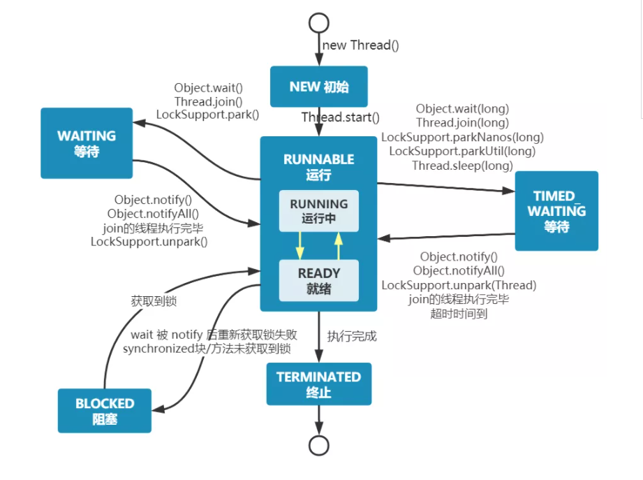

***


### 查看线程

windows：

* 任务管理器可以查看进程和线程数，也可以用来杀死进程
* tasklist 查看进程
* taskkill 杀死进程

linux：

* ps -ef 查看所有进程
* ps -fT -p <PID> 查看某个进程（PID）的所有线程
* kill 杀死进程
* top 按大写 H 切换是否显示线程
* top -H -p <PID> 查看某个进程（PID）的所有线程

Java：

* jps 命令查看所有 Java 进程
* jstack <PID> 查看某个 Java 进程（PID）的所有线程状态
* jconsole 来查看某个 Java 进程中线程的运行情况（图形界面）


***


## 同步

### 临界区

临界资源：一次仅允许一个进程使用的资源成为临界资源

临界区：访问临界资源的代码块

竞态条件：多个线程在临界区内执行，由于代码的执行序列不同而导致结果无法预测，称之为发生了竞态条件

一个程序运行多个线程本身是没有问题的，多个线程访问共享资源会出现问题。多个线程读共享资源也没有问题，在多个线程对共享资源读写操作时发生指令交错，就会出现问题

为了避免临界区的竞态条件发生（解决线程安全问题）：

* 阻塞式的解决方案：synchronized，lock
* 非阻塞式的解决方案：原子变量

管程（monitor）：由局部于自己的若干公共变量和所有访问这些公共变量的过程所组成的软件模块，保证同一时刻只有一个进程在管程内活动，即管程内定义的操作在同一时刻只被一个进程调用（由编译器实现）

互斥和同步都可以采用 synchronized 关键字来完成，区别：

* 互斥是保证临界区的竞态条件发生，同一时刻只能有一个线程执行临界区代码
* 同步是由于线程执行的先后、顺序不同、需要一个线程等待其它线程运行到某个点


***


### synchronized

#### 使用锁

##### 同步代码块

格式：

```java
synchronized(锁对象){
	// 访问共享资源的核心代码
}
```

实例：

```java
public class demo {
    static int counter = 0;
    //static修饰，则元素是属于类本身的，不属于对象  ，与类一起加载一次，只有一个
    static final Object room = new Object();
    public static void main(String[] args) throws InterruptedException {
        Thread t1 = new Thread(() -> {
            for (int i = 0; i < 5000; i++) {
                synchronized (room) {
                    counter++;
                }
            }
        }, "t1");
        Thread t2 = new Thread(() -> {
            for (int i = 0; i < 5000; i++) {
                synchronized (room) {
                    counter--;
                }
            }
        }, "t2");
        t1.start();
        t2.start();
        t1.join();
        t2.join();
        System.out.println(counter);
    }
}
```


***


synchronized 修饰的方法的不具备继承性，所以子类是线程不安全的，如果子类的方法也被 synchronized 修饰，两个锁对象其实是一把锁，而且是**子类对象作为锁**


***


##### 线程八锁

线程八锁就是考察 synchronized 锁住的是哪个对象，直接百度搜索相关的实例

说明：主要关注锁住的对象是不是同一个

* 锁住类对象，所有类的实例的方法都是安全的，类的所有实例都相当于同一把锁
* 锁住 this 对象，只有在当前实例对象的线程内是安全的，如果有多个实例就不安全


***


#### 锁原理

##### Monitor

Monitor 被翻译为监视器或管程

每个 Java 对象都可以关联一个 Monitor 对象，Monitor 也是 class，其**实例存储在堆中**，如果使用 synchronized 给对象上锁（重量级）之后，该对象头的 Mark Word 中就被设置指向 Monitor 对象的指针，这就是重量级锁

* Mark Word 结构：

  

* 64位虚拟机 Mark Word：

  

工作流程：

* 开始时 Monitor 中 Owner 为 null
* 当 Thread-2 执行 synchronized(obj) 就会将 Monitor 的所有者 Owner 置为 Thread-2，Monitor 中只能有一个 Owner，**obj 对象的 Mark Word 指向 Monitor**，把对象原有的 MarkWord 存入栈中的锁记录中（轻量级锁部分详解）
  
* 在 Thread-2 上锁的过程，Thread-3、Thread-4、Thread-5 也执行 synchronized(obj)，就会进入 EntryList BLOCKED（双向链表）
* Thread-2 执行完同步代码块的内容，根据 obj 对象头中 Monitor 地址寻找，设置 Owner 为空，把线程栈的锁记录中的对象头的值设置到 MarkWord
* 唤醒 EntryList 中等待的线程来竞争锁，竞争是**非公平的**，如果这时有新的线程想要获取锁，可能直接就抢占到了，阻塞队列的线程就会继续阻塞
* WaitSet 中的 Thread-0，是以前获得过锁，但条件不满足进入 WAITING 状态的线程（wait-notify 机制）


注意：

* synchronized 必须是进入同一个对象的 Monitor 才有上述的效果
* 不加 synchronized 的对象不会关联监视器，不遵从以上规则


***


#### 锁升级

##### 升级过程

**synchronized 是可重入、不公平的重量级锁**，所以可以对其进行优化

```java
无锁 -> 偏向锁 -> 轻量级锁 -> 重量级锁	// 随着竞争的增加，只能锁升级，不能降级
```


***


##### 偏向锁

偏向锁的思想是偏向于让第一个获取锁对象的线程，这个线程之后重新获取该锁不再需要同步操作：

* 当锁对象第一次被线程获得的时候进入偏向状态，标记为 101，同时使用 CAS 操作将线程 ID 记录到 Mark Word。如果 CAS 操作成功，这个线程以后进入这个锁相关的同步块，查看这个线程 ID 是自己的就表示没有竞争，就不需要再进行任何同步操作

* 当有另外一个线程去尝试获取这个锁对象时，偏向状态就宣告结束，此时撤销偏向（Revoke Bias）后恢复到未锁定或轻量级锁状态


一个对象创建时：

* 如果开启了偏向锁（默认开启），那么对象创建后，markword 值为 0x05 即最后 3 位为 101，thread、epoch、age 都为 0

* 偏向锁是默认是延迟的，不会在程序启动时立即生效，如果想避免延迟，可以加 VM 参数 `-XX:BiasedLockingStartupDelay=0` 来禁用延迟

  JDK 8 延迟 4s 开启偏向锁原因：在刚开始执行代码时，会有好多线程来抢锁，如果开偏向锁效率反而降低

* 如果禁用了偏向锁，那么对象创建后，markword 值为 0x01 即最后 3 位为 001，这时它的 hashcode、age 都为 0，**第一次用到 hashcode 时才会赋值**，添加 VM 参数 `-XX:-UseBiasedLocking` 禁用偏向锁

撤销偏向锁的状态：

* 调用对象的 hashCode：偏向锁的对象 MarkWord 中存储的是线程 id，调用 hashCode 导致偏向锁被撤销
  * 轻量级锁会在锁记录中记录 hashCode
  * 重量级锁会在 Monitor 中记录 hashCode
* 当有其它线程使用偏向锁对象时，会将偏向锁升级为轻量级锁
* 调用 wait/notify，需要申请 Monitor，进入 WaitSet

**批量撤销**：如果对象被多个线程访问，但没有竞争，这时偏向了线程 T1 的对象仍有机会重新偏向 T2，重偏向会重置对象的 Thread ID

* 批量重偏向：当撤销偏向锁阈值超过 20 次后，JVM 会觉得是不是偏向错了，于是在给这些对象加锁时重新偏向至加锁线程

* 批量撤销：当撤销偏向锁阈值超过 40 次后，JVM 会觉得自己确实偏向错了，根本就不该偏向，于是整个类的所有对象都会变为不可偏向的，新建的对象也是不可偏向的


***


##### 轻量级锁

一个对象有多个线程要加锁，但加锁的时间是错开的（没有竞争），可以使用轻量级锁来优化，轻量级锁对使用者是透明的（不可见）

可重入锁：线程可以进入任何一个它已经拥有的锁所同步着的代码块，可重入锁最大的作用是**避免死锁**

轻量级锁在没有竞争时（锁重入时），每次重入仍然需要执行 CAS 操作，Java 6 才引入的偏向锁来优化

锁重入实例：

```java
static final Object obj = new Object();
public static void method1() {
    synchronized( obj ) {
        // 同步块 A
        method2();
    }
}
public static void method2() {
    synchronized( obj ) {
    	// 同步块 B
    }
}
```

* 创建锁记录（Lock Record）对象，每个线程的**栈帧**都会包含一个锁记录的结构，存储锁定对象的 Mark Word

  

* 让锁记录中 Object reference 指向锁住的对象，并尝试用 CAS 替换 Object 的 Mark Word，将 Mark Word 的值存入锁记录

* 如果 CAS 替换成功，对象头中存储了锁记录地址和状态 00（轻量级锁） ，表示由该线程给对象加锁
  

* 如果 CAS 失败，有两种情况：

  * 如果是其它线程已经持有了该 Object 的轻量级锁，这时表明有竞争，进入锁膨胀过程
  * 如果是线程自己执行了 synchronized 锁重入，就添加一条 Lock Record 作为重入的计数

  

* 当退出 synchronized 代码块（解锁时）

  * 如果有取值为 null 的锁记录，表示有重入，这时重置锁记录，表示重入计数减 1
  * 如果锁记录的值不为 null，这时使用 CAS 将 Mark Word 的值恢复给对象头
    * 成功，则解锁成功
    * 失败，说明轻量级锁进行了锁膨胀或已经升级为重量级锁，进入重量级锁解锁流程


***


##### 锁膨胀

在尝试加轻量级锁的过程中，CAS 操作无法成功，可能是其它线程为此对象加上了轻量级锁（有竞争），这时需要进行锁膨胀，将轻量级锁变为**重量级锁**

* 当 Thread-1 进行轻量级加锁时，Thread-0 已经对该对象加了轻量级锁

  

* Thread-1 加轻量级锁失败，进入锁膨胀流程：为 Object 对象申请 Monitor 锁，让Object 对象头指向重量级锁地址，Monitor 的 Owner 置为 Thread-0，然后自己进入 Monitor 的 EntryList BLOCKED

  

* 当 Thread-0 退出同步块解锁时，使用 CAS 将 Mark Word 的值恢复给对象头失败，这时进入重量级解锁流程，即按照 Monitor 地址找到 Monitor 对象，设置 Owner 为 null，唤醒 EntryList 中 BLOCKED 线程


> 总结 锁升级：
>
> 首先锁是从 无锁->偏向锁->轻量级锁->重量级锁，偏向锁是假设并发时，不存在竞争，每次只有某一个线程获得锁，原理是对象头中的markword中偏向锁设置为1，锁记录设置成01，threadid设置为自己。然后第二个线程获得锁时会先比较threadid是否是自己，如果是，那就直接进入代码块（可重入的逻辑），如果不是，就判断占有的线程是否存活，存活就暂停占有的线程，升级为轻量级锁，然后继续运行，不存活就撤销偏向锁，重新偏向自己（00->01->101）。当处于轻量级锁状态时，会在栈帧中创建锁记录，将锁记录地址和markword（hash、gc年龄等）进行交换（CAS），如果失败，首先比较是否是当前线程占有的（可重入逻辑），如果是，就添加一个markword是null的锁记录，如果不是，升级为重量级锁。这时，markword中记录monitor地址，monitor中的owner指向当前线程，当其他线程竞争，自旋到一定程度就会放入EntryList（阻塞队列），调用wait就放入waitSet（等待队列）。

***


#### 锁优化

##### 自旋锁

重量级锁竞争时，尝试获取锁的线程不会立即阻塞，可以使用**自旋**（默认 10 次）来进行优化，采用循环的方式去尝试获取锁

注意：

* 自旋占用 CPU 时间，单核 CPU 自旋就是浪费时间，因为同一时刻只能运行一个线程，多核 CPU 自旋才能发挥优势
* 自旋失败的线程会进入阻塞状态

优点：不会进入阻塞状态，**减少线程上下文切换的消耗**

缺点：当自旋的线程越来越多时，会不断的消耗 CPU 资源

自旋锁情况：

* 自旋成功的情况：
      

* 自旋失败的情况：

  

自旋锁说明：

* 在 Java 6 之后自旋锁是自适应的，比如对象刚刚的一次自旋操作成功过，那么认为这次自旋成功的可能性会高，就多自旋几次；反之，就少自旋甚至不自旋，比较智能
* Java 7 之后不能控制是否开启自旋功能，由 JVM 控制

```java
//手写自旋锁
public class SpinLock {
    // 泛型装的是Thread，原子引用线程
    AtomicReference<Thread> atomicReference = new AtomicReference<>();

    public void lock() {
        Thread thread = Thread.currentThread();
        System.out.println(thread.getName() + " come in");

        //开始自旋，期望值为null，更新值是当前线程
        while (!atomicReference.compareAndSet(null, thread)) {
            Thread.sleep(1000);
            System.out.println(thread.getName() + " 正在自旋");
        }
        System.out.println(thread.getName() + " 自旋成功");
    }

    public void unlock() {
        Thread thread = Thread.currentThread();

        //线程使用完锁把引用变为null
		atomicReference.compareAndSet(thread, null);
        System.out.println(thread.getName() + " invoke unlock");
    }

    public static void main(String[] args) throws InterruptedException {
        SpinLock lock = new SpinLock();
        new Thread(() -> {
            //占有锁
            lock.lock();
            Thread.sleep(10000); 

            //释放锁
            lock.unlock();
        },"t1").start();

        // 让main线程暂停1秒，使得t1线程，先执行
        Thread.sleep(1000);

        new Thread(() -> {
            lock.lock();
            lock.unlock();
        },"t2").start();
    }
}
```


***


##### 锁消除

锁消除是指对于被检测出不可能存在竞争的共享数据的锁进行消除，这是 JVM **即时编译器的优化**

锁消除主要是通过**逃逸分析**来支持，如果堆上的共享数据不可能逃逸出去被其它线程访问到，那么就可以把它们当成私有数据对待，也就可以将它们的锁进行消除（同步消除：JVM 内存分配）


***


##### 锁粗化

对相同对象多次加锁，导致线程发生多次重入，频繁的加锁操作就会导致性能损耗，可以使用锁粗化方式优化

如果虚拟机探测到一串的操作都对同一个对象加锁，将会把加锁的范围扩展（粗化）到整个操作序列的外部

* 一些看起来没有加锁的代码，其实隐式的加了很多锁：

  ```java
  public static String concatString(String s1, String s2, String s3) {
      return s1 + s2 + s3;
  }
  ```

* String 是一个不可变的类，编译器会对 String 的拼接自动优化。在 JDK 1.5 之前，转化为StringBuffer对象的连续 append() 操作，每个append() 方法中都有一个同步块

  ```java
  public static String concatString(String s1, String s2, String s3) {
      StringBuffer sb = new StringBuffer();
      sb.append(s1);
      sb.append(s2);
      sb.append(s3);
      return sb.toString();
  }
  ```

扩展到第一个 append() 操作之前直至最后一个 append() 操作之后，只需要加锁一次就可以


****


#### 多把锁

多把不相干的锁：一间大屋子有两个功能：睡觉、学习，互不相干。现在一人要学习，一人要睡觉，如果只用一间屋子（一个对象锁）的话，那么并发度很低

将锁的粒度细分：

* 好处，是可以增强并发度
* 坏处，如果一个线程需要同时获得多把锁，就容易发生死锁 

解决方法：准备多个对象锁

```java
public static void main(String[] args) {
    BigRoom bigRoom = new BigRoom();
    new Thread(() -> { bigRoom.study(); }).start();
    new Thread(() -> { bigRoom.sleep(); }).start();
}
class BigRoom {
    private final Object studyRoom = new Object();
    private final Object sleepRoom = new Object();

    public void sleep() throws InterruptedException {
        synchronized (sleepRoom) {
            System.out.println("sleeping 2 小时");
            Thread.sleep(2000);
        }
    }

    public void study() throws InterruptedException {
        synchronized (studyRoom) {
            System.out.println("study 1 小时");
            Thread.sleep(1000);
        }
    }
}
```


***


#### 活跃性

##### 死锁

###### 形成

死锁：多个线程同时被阻塞，它们中的一个或者全部都在等待某个资源被释放，由于线程被无限期地阻塞，因此程序不可能正常终止

java 死锁产生的四个必要条件：

1. 互斥条件，即当资源被一个线程使用（占有）时，别的线程不能使用
2. 不可剥夺条件，资源请求者不能强制从资源占有者手中夺取资源，资源只能由资源占有者主动释放
3. 请求和保持条件，即当资源请求者在请求其他的资源的同时保持对原有资源的占有
4. 循环等待条件，即存在一个等待循环队列：p1 要 p2 的资源，p2 要 p1 的资源，形成了一个等待环路

四个条件都成立的时候，便形成死锁。死锁情况下打破上述任何一个条件，便可让死锁消失

```java
public class Dead {
    public static Object resources1 = new Object();
    public static Object resources2 = new Object();
    public static void main(String[] args) {
        new Thread(() -> {
            // 线程1：占用资源1 ，请求资源2
            synchronized(resources1){
                System.out.println("线程1已经占用了资源1，开始请求资源2");
                Thread.sleep(2000);//休息两秒，防止线程1直接运行完成。
                //2秒内线程2肯定可以锁住资源2
                synchronized (resources2){
                    System.out.println("线程1已经占用了资源2");
                }
        }).start();
        new Thread(() -> {
            // 线程2：占用资源2 ，请求资源1
            synchronized(resources2){
                System.out.println("线程2已经占用了资源2，开始请求资源1");
                Thread.sleep(2000);
                synchronized (resources1){
                    System.out.println("线程2已经占用了资源1");
                }
            }}
        }).start();
    }
}
```

面向对象写法：

```java
public class DeadLock {
    static String lockA = "lockA";
    static String lockB = "lockB";
    public static void main(String[] args) {
        new Thread(new HoldLockThread(lockA, lockB)).start();
        new Thread(new HoldLockThread(lockB, lockA)).start();
    }
}
class HoldLockThread implements Runnable {
    private String lockA;
    private String lockB;

    public HoldLockThread(String lockA, String lockB) {
        this.lockA = lockA;
        this.lockB = lockB;
    }

    @Override
    public void run() {
        synchronized (lockA) {
            System.out.println(Thread.currentThread().getName() + " 持有" + lockA + "，尝试获得" + lockB);
            try {
                Thread.sleep(2000);
            } catch (InterruptedException e) {
                e.printStackTrace();
            }
            synchronized (lockB) {
                System.out.println(Thread.currentThread().getName() + " 持有" + lockB + "，尝试获得" + lockA);
            }
        }
    }
}
```


***


###### 定位

定位死锁的方法：

* 使用 jps 定位进程 id，再用 `jstack id` 定位死锁，找到死锁的线程去查看源码，解决优化

  ```sh
  "Thread-1" #12 prio=5 os_prio=0 tid=0x000000001eb69000 nid=0xd40 waiting formonitor entry [0x000000001f54f000]
  	java.lang.Thread.State: BLOCKED (on object monitor)
  #省略    
  "Thread-1" #12 prio=5 os_prio=0 tid=0x000000001eb69000 nid=0xd40 waiting for monitor entry [0x000000001f54f000]
  	java.lang.Thread.State: BLOCKED (on object monitor)
  #省略
  
  Found one Java-level deadlock:
  ===================================================
  "Thread-1":
      waiting to lock monitor 0x000000000361d378 (object 0x000000076b5bf1c0, a java.lang.Object),
      which is held by "Thread-0"
  "Thread-0":
      waiting to lock monitor 0x000000000361e768 (object 0x000000076b5bf1d0, a java.lang.Object),
      which is held by "Thread-1"
      
  Java stack information for the threads listed above:
  ===================================================
  "Thread-1":
      at thread.TestDeadLock.lambda$main$1(TestDeadLock.java:28)
      - waiting to lock <0x000000076b5bf1c0> (a java.lang.Object)
      - locked <0x000000076b5bf1d0> (a java.lang.Object)
      at thread.TestDeadLock$$Lambda$2/883049899.run(Unknown Source)
      at java.lang.Thread.run(Thread.java:745)
  "Thread-0":
      at thread.TestDeadLock.lambda$main$0(TestDeadLock.java:15)
      - waiting to lock <0x000000076b5bf1d0> (a java.lang.Object)
      - locked <0x000000076b5bf1c0> (a java.lang.Object)
      at thread.TestDeadLock$$Lambda$1/495053715
  ```

* linux 下可以通过 top 先定位到 CPU 占用高的 Java 进程，再利用 `top -Hp 进程id` 来定位是哪个线程，最后再用 jstack <pid>的输出来看各个线程栈

* 避免死锁：避免死锁要注意加锁顺序

* 可以使用 jconsole 工具，在 `jdk\bin` 目录下


***


##### 活锁

活锁：指的是任务或者执行者没有被阻塞，由于某些条件没有满足，导致一直重复尝试—失败—尝试—失败的过程

两个线程互相改变对方的结束条件，最后谁也无法结束：

```java
class TestLiveLock {
    static volatile int count = 10;
    static final Object lock = new Object();
    public static void main(String[] args) {
        new Thread(() -> {
            // 期望减到 0 退出循环
            while (count > 0) {
                Thread.sleep(200);
                count--;
                System.out.println("线程一count:" + count);
            }
        }, "t1").start();
        new Thread(() -> {
            // 期望超过 20 退出循环
            while (count < 20) {
                Thread.sleep(200);
                count++;
                System.out.println("线程二count:"+ count);
            }
        }, "t2").start();
    }
}
```


***


##### 饥饿

饥饿：一个线程由于优先级太低，始终得不到 CPU 调度执行，也不能够结束


***


### wait-notify

#### 基本使用

需要获取对象锁后才可以调用 `锁对象.wait()`，notify 随机唤醒一个线程，notifyAll 唤醒所有线程去竞争 CPU

对比 sleep()：

* 原理不同：sleep() 方法是属于 Thread 类，是线程用来控制自身流程的，使此线程暂停执行一段时间而把执行机会让给其他线程；wait() 方法属于 Object 类，用于线程间通信
* 对锁的处理机制不同：调用 sleep() 方法的过程中，线程不会释放对象锁，当调用 wait() 方法的时候，线程会放弃对象锁，进入等待此对象的等待锁定池（不释放锁其他线程怎么抢占到锁执行唤醒操作），但是都会释放 CPU
* 使用区域不同：wait() 方法必须放在**同步控制方法和同步代码块（先获取锁）**中使用，sleep() 方法则可以放在任何地方使用

底层原理：

* Owner 线程发现条件不满足，调用 wait 方法，即可进入 WaitSet 变为 WAITING 状态
* BLOCKED 和 WAITING 的线程都处于阻塞状态，不占用 CPU 时间片
* BLOCKED 线程会在 Owner 线程释放锁时唤醒
* WAITING 线程会在 Owner 线程调用 notify 或 notifyAll 时唤醒，唤醒后并不意味者立刻获得锁，**需要进入 EntryList 重新竞争**


***


#### 代码优化

虚假唤醒：notify 只能随机唤醒一个 WaitSet 中的线程，这时如果有其它线程也在等待，那么就可能唤醒不了正确的线程

解决方法：采用 notifyAll

notifyAll 仅解决某个线程的唤醒问题，使用 if + wait 判断仅有一次机会，一旦条件不成立，无法重新判断

解决方法：用 while + wait，当条件不成立，再次 wait

```java
@Slf4j(topic = "c.demo")
public class demo {
    static final Object room = new Object();
    static boolean hasCigarette = false;    //有没有烟
    static boolean hasTakeout = false;

    public static void main(String[] args) throws InterruptedException {
        new Thread(() -> {
            synchronized (room) {
                log.debug("有烟没？[{}]", hasCigarette);
                while (!hasCigarette) {//while防止虚假唤醒
                    log.debug("没烟，先歇会！");
                    try {
                        room.wait();
                    } catch (InterruptedException e) {
                        e.printStackTrace();
                    }
                }
                log.debug("有烟没？[{}]", hasCigarette);
                if (hasCigarette) {
                    log.debug("可以开始干活了");
                } else {
                    log.debug("没干成活...");
                }
            }
        }, "小南").start();

        new Thread(() -> {
            synchronized (room) {
                Thread thread = Thread.currentThread();
                log.debug("外卖送到没？[{}]", hasTakeout);
                if (!hasTakeout) {
                    log.debug("没外卖，先歇会！");
                    try {
                        room.wait();
                    } catch (InterruptedException e) {
                        e.printStackTrace();
                    }
                }
                log.debug("外卖送到没？[{}]", hasTakeout);
                if (hasTakeout) {
                    log.debug("可以开始干活了");
                } else {
                    log.debug("没干成活...");
                }
            }
        }, "小女").start();


        Thread.sleep(1000);
        new Thread(() -> {
        // 这里能不能加 synchronized (room)？
            synchronized (room) {
                hasTakeout = true;
				//log.debug("烟到了噢！");
                log.debug("外卖到了噢！");
                room.notifyAll();
            }
        }, "送外卖的").start();
    }
}
```


****


### park-unpark

LockSupport 是用来创建锁和其他同步类的**线程原语**

LockSupport 类方法：

* `LockSupport.park()`：暂停当前线程，挂起原语
* `LockSupport.unpark(暂停的线程对象)`：恢复某个线程的运行

```java
public static void main(String[] args) {
    Thread t1 = new Thread(() -> {
        System.out.println("start...");	//1
		Thread.sleep(1000);// Thread.sleep(3000)
        // 先 park 再 unpark 和先 unpark 再 park 效果一样，都会直接恢复线程的运行
        System.out.println("park...");	//2
        LockSupport.park();
        System.out.println("resume...");//4
    },"t1");
    t1.start();
   	Thread.sleep(2000);
    System.out.println("unpark...");	//3
    LockSupport.unpark(t1);
}
```

LockSupport 出现就是为了增强 wait & notify 的功能：

* wait，notify 和 notifyAll 必须配合 Object Monitor 一起使用，而 park、unpark 不需要
* park & unpark **以线程为单位**来阻塞和唤醒线程，而 notify 只能随机唤醒一个等待线程，notifyAll 是唤醒所有等待线程
* park & unpark 可以先 unpark，而 wait & notify 不能先 notify。类比生产消费，先消费发现有产品就消费，没有就等待；先生产就直接产生商品，然后线程直接消费
* wait 会释放锁资源进入等待队列，**park 不会释放锁资源**，只负责阻塞当前线程，会释放 CPU

原理：类似生产者消费者

* 先 park：
  1. 当前线程调用 Unsafe.park() 方法
  2. 检查 _counter ，本情况为 0，这时获得 _mutex 互斥锁
  3. 线程进入 _cond 条件变量挂起
  4. 调用 Unsafe.unpark(Thread_0) 方法，设置 _counter 为 1
  5. 唤醒 _cond 条件变量中的 Thread_0，Thread_0 恢复运行，设置 _counter 为 0


* 先 unpark：

  1. 调用 Unsafe.unpark(Thread_0) 方法，设置 _counter 为 1
  2. 当前线程调用 Unsafe.park() 方法
  3. 检查 _counter ，本情况为 1，这时线程无需挂起，继续运行，设置 _counter 为 0

  


***


### 安全分析

成员变量和静态变量：

* 如果它们没有共享，则线程安全
* 如果它们被共享了，根据它们的状态是否能够改变，分两种情况：
  * 如果只有读操作，则线程安全
  * 如果有读写操作，则这段代码是临界区，需要考虑线程安全问题

局部变量：

* 局部变量是线程安全的
* 局部变量引用的对象不一定线程安全（逃逸分析）：
  * 如果该对象没有逃离方法的作用访问，它是线程安全的（每一个方法有一个栈帧）
  * 如果该对象逃离方法的作用范围，需要考虑线程安全问题（暴露引用）

常见线程安全类：String、Integer、StringBuffer、Random、Vector、Hashtable、java.util.concurrent 包

* 线程安全的是指，多个线程调用它们同一个实例的某个方法时，是线程安全的

* **每个方法是原子的，但多个方法的组合不是原子的**，只能保证调用的方法内部安全：

  ```java
  Hashtable table = new Hashtable();
  // 线程1，线程2
  if( table.get("key") == null) {
  	table.put("key", value);
  }
  ```

无状态类线程安全，就是没有成员变量的类

不可变类线程安全：String、Integer 等都是不可变类，**内部的状态不可以改变**，所以方法是线程安全

* replace 等方法底层是新建一个对象，复制过去

  ```java
  Map<String,Object> map = new HashMap<>();	// 线程不安全
  String S1 = "...";							// 线程安全
  final String S2 = "...";					// 线程安全
  Date D1 = new Date();						// 线程不安全
  final Date D2 = new Date();					// 线程不安全，final让D2引用的对象不能变，但对象的内容可以变
  ```

抽象方法如果有参数，被重写后行为不确定可能造成线程不安全，被称之为外星方法：`public abstract foo(Student s);`


***


### 同步模式

#### 保护性暂停

##### 单任务版

Guarded Suspension，用在一个线程等待另一个线程的执行结果

* 有一个结果需要从一个线程传递到另一个线程，让它们关联同一个 GuardedObject
* 如果有结果不断从一个线程到另一个线程那么可以使用消息队列（见生产者/消费者）
* JDK 中，join 的实现、Future 的实现，采用的就是此模式


```java
public static void main(String[] args) {
    GuardedObject object = new GuardedObjectV2();
    new Thread(() -> {
        sleep(1);
        object.complete(Arrays.asList("a", "b", "c"));
    }).start();
    
    Object response = object.get(2500);
    if (response != null) {
        log.debug("get response: [{}] lines", ((List<String>) response).size());
    } else {
        log.debug("can't get response");
    }
}

class GuardedObject {
    private Object response;
    private final Object lock = new Object();

    //获取结果
    //timeout :最大等待时间
    public Object get(long millis) {
        synchronized (lock) {
            // 1) 记录最初时间
            long begin = System.currentTimeMillis();
            // 2) 已经经历的时间
            long timePassed = 0;
            while (response == null) {
                // 4) 假设 millis 是 1000，结果在 400 时唤醒了，那么还有 600 要等
                long waitTime = millis - timePassed;
                log.debug("waitTime: {}", waitTime);
                //经历时间超过最大等待时间退出循环
                if (waitTime <= 0) {
                    log.debug("break...");
                    break;
                }
                try {
                    lock.wait(waitTime);
                } catch (InterruptedException e) {
                    e.printStackTrace();
                }
                // 3) 如果提前被唤醒，这时已经经历的时间假设为 400
                timePassed = System.currentTimeMillis() - begin;
                log.debug("timePassed: {}, object is null {}",
                        timePassed, response == null);
            }
            return response;
        }
    }

    //产生结果
    public void complete(Object response) {
        synchronized (lock) {
            // 条件满足，通知等待线程
            this.response = response;
            log.debug("notify...");
            lock.notifyAll();
        }
    }
}
```


##### 多任务版

多任务版保护性暂停：


```java
public static void main(String[] args) throws InterruptedException {
    for (int i = 0; i < 3; i++) {
        new People().start();
    }
    Thread.sleep(1000);
    for (Integer id : Mailboxes.getIds()) {
        new Postman(id, id + "号快递到了").start();
    }
}

@Slf4j(topic = "c.People")
class People extends Thread{
    @Override
    public void run() {
        // 收信
        GuardedObject guardedObject = Mailboxes.createGuardedObject();
        log.debug("开始收信i d:{}", guardedObject.getId());
        Object mail = guardedObject.get(5000);
        log.debug("收到信id:{}，内容:{}", guardedObject.getId(),mail);
    }
}

class Postman extends Thread{
    private int id;
    private String mail;
    //构造方法
    @Override
    public void run() {
        GuardedObject guardedObject = Mailboxes.getGuardedObject(id);
        log.debug("开始送信i d:{}，内容:{}", guardedObject.getId(),mail);
        guardedObject.complete(mail);
    }
}

class  Mailboxes {
    private static Map<Integer, GuardedObject> boxes = new Hashtable<>();
    private static int id = 1;

    //产生唯一的id
    private static synchronized int generateId() {
        return id++;
    }

    public static GuardedObject getGuardedObject(int id) {
        return boxes.remove(id);
    }

    public static GuardedObject createGuardedObject() {
        GuardedObject go = new GuardedObject(generateId());
        boxes.put(go.getId(), go);
        return go;
    }

    public static Set<Integer> getIds() {
        return boxes.keySet();
    }
}
class GuardedObject {
    //标识，Guarded Object
    private int id;//添加get set方法
}
```


****


#### 顺序输出

顺序输出 2  1 

```java
public static void main(String[] args) throws InterruptedException {
    Thread t1 = new Thread(() -> {
        while (true) {
            //try { Thread.sleep(1000); } catch (InterruptedException e) { }
            // 当没有许可时，当前线程暂停运行；有许可时，用掉这个许可，当前线程恢复运行
            LockSupport.park();
            System.out.println("1");
        }
    });
    Thread t2 = new Thread(() -> {
        while (true) {
            System.out.println("2");
            // 给线程 t1 发放『许可』（多次连续调用 unpark 只会发放一个『许可』）
            LockSupport.unpark(t1);
            try { Thread.sleep(500); } catch (InterruptedException e) { }
        }
    });
    t1.start();
    t2.start();
}
```


***


#### 交替输出

连续输出 5 次 abc

```java
public class day2_14 {
    public static void main(String[] args) throws InterruptedException {
        AwaitSignal awaitSignal = new AwaitSignal(5);
        Condition a = awaitSignal.newCondition();
        Condition b = awaitSignal.newCondition();
        Condition c = awaitSignal.newCondition();
        new Thread(() -> {
            awaitSignal.print("a", a, b);
        }).start();
        new Thread(() -> {
            awaitSignal.print("b", b, c);
        }).start();
        new Thread(() -> {
            awaitSignal.print("c", c, a);
        }).start();

        Thread.sleep(1000);
        awaitSignal.lock();
        try {
            a.signal();
        } finally {
            awaitSignal.unlock();
        }
    }
}

class AwaitSignal extends ReentrantLock {
    private int loopNumber;

    public AwaitSignal(int loopNumber) {
        this.loopNumber = loopNumber;
    }
    //参数1：打印内容  参数二：条件变量  参数二：唤醒下一个
    public void print(String str, Condition condition, Condition next) {
        for (int i = 0; i < loopNumber; i++) {
            lock();
            try {
                condition.await();
                System.out.print(str);
                next.signal();
            } catch (InterruptedException e) {
                e.printStackTrace();
            } finally {
                unlock();
            }
        }
    }
}
```


***


### 异步模式

#### 传统版

异步模式之生产者/消费者：

```java
class ShareData {
    private int number = 0;
    private Lock lock = new ReentrantLock();
    private Condition condition = lock.newCondition();

    public void increment() throws Exception{
        // 同步代码块，加锁
        lock.lock();
        try {
            // 判断  防止虚假唤醒
            while(number != 0) {
                // 等待不能生产
                condition.await();
            }
            // 干活
            number++;
            System.out.println(Thread.currentThread().getName() + "\t " + number);
            // 通知 唤醒
            condition.signalAll();
        } catch (Exception e) {
            e.printStackTrace();
        } finally {
            lock.unlock();
        }
    }

    public void decrement() throws Exception{
        // 同步代码块，加锁
        lock.lock();
        try {
            // 判断 防止虚假唤醒
            while(number == 0) {
                // 等待不能消费
                condition.await();
            }
            // 干活
            number--;
            System.out.println(Thread.currentThread().getName() + "\t " + number);
            // 通知 唤醒
            condition.signalAll();
        } catch (Exception e) {
            e.printStackTrace();
        } finally {
            lock.unlock();
        }
    }
}

public class TraditionalProducerConsumer {
	public static void main(String[] args) {
        ShareData shareData = new ShareData();
        // t1线程，生产
        new Thread(() -> {
            for (int i = 0; i < 5; i++) {
            	shareData.increment();
            }
        }, "t1").start();

        // t2线程，消费
        new Thread(() -> {
            for (int i = 0; i < 5; i++) {
				shareData.decrement();
            }
        }, "t2").start(); 
    }
}
```


#### 改进版

异步模式之生产者/消费者：

* 消费队列可以用来平衡生产和消费的线程资源，不需要产生结果和消费结果的线程一一对应
* 生产者仅负责产生结果数据，不关心数据该如何处理，而消费者专心处理结果数据
* 消息队列是有容量限制的，满时不会再加入数据，空时不会再消耗数据
* JDK 中各种阻塞队列，采用的就是这种模式


```java
public class demo {
    public static void main(String[] args) {
        MessageQueue queue = new MessageQueue(2);
        for (int i = 0; i < 3; i++) {
            int id = i;
            new Thread(() -> {
                queue.put(new Message(id,"值"+id));
            }, "生产者" + i).start();
        }
        
        new Thread(() -> {
            while (true) {
                try {
                    Thread.sleep(1000);
                    Message message = queue.take();
                } catch (InterruptedException e) {
                    e.printStackTrace();
                }
            }
        },"消费者").start();
    }
}

//消息队列类，Java间线程之间通信
class MessageQueue {
    private LinkedList<Message> list = new LinkedList<>();//消息的队列集合
    private int capacity;//队列容量
    public MessageQueue(int capacity) {
        this.capacity = capacity;
    }

    //获取消息
    public Message take() {
        //检查队列是否为空
        synchronized (list) {
            while (list.isEmpty()) {
                try {
                    sout(Thread.currentThread().getName() + ":队列为空，消费者线程等待");
                    list.wait();
                } catch (InterruptedException e) {
                    e.printStackTrace();
                }
            }
            //从队列的头部获取消息返回
            Message message = list.removeFirst();
            sout(Thread.currentThread().getName() + "：已消费消息--" + message);
            list.notifyAll();
            return message;
        }
    }

    //存入消息
    public void put(Message message) {
        synchronized (list) {
            //检查队列是否满
            while (list.size() == capacity) {
                try {
                    sout(Thread.currentThread().getName()+":队列为已满，生产者线程等待");
                    list.wait();
                } catch (InterruptedException e) {
                    e.printStackTrace();
                }
            }
            //将消息加入队列尾部
            list.addLast(message);
            sout(Thread.currentThread().getName() + ":已生产消息--" + message);
            list.notifyAll();
        }
    }
}

final class Message {
    private int id;
    private Object value;
	//get set
}
```


***


#### 阻塞队列

```java
public static void main(String[] args) {
    ExecutorService consumer = Executors.newFixedThreadPool(1);
    ExecutorService producer = Executors.newFixedThreadPool(1);
    BlockingQueue<Integer> queue = new SynchronousQueue<>();
    producer.submit(() -> {
        try {
            System.out.println("生产...");
            Thread.sleep(1000);
            queue.put(10);
        } catch (InterruptedException e) {
            e.printStackTrace();
        }
    });
    consumer.submit(() -> {
        try {
            System.out.println("等待消费...");
            Integer result = queue.take();
            System.out.println("结果为:" + result);
        } catch (InterruptedException e) {
            e.printStackTrace();
        }
    });
}
```


****


## 内存

### JMM

#### 内存模型

Java 内存模型是 Java Memory Model（JMM），本身是一种**抽象的概念**，实际上并不存在，描述的是一组规则或规范，通过这组规范定义了程序中各个变量（包括实例字段，静态字段和构成数组对象的元素）的访问方式

JMM 作用：

* 屏蔽各种硬件和操作系统的内存访问差异，实现让 Java 程序在各种平台下都能达到一致的内存访问效果
* 规定了线程和内存之间的一些关系

根据 JMM 的设计，系统存在一个主内存（Main Memory），Java 中所有变量都存储在主存中，对于所有线程都是共享的；每条线程都有自己的工作内存（Working Memory），工作内存中保存的是主存中某些**变量的拷贝**，线程对所有变量的操作都是先对变量进行拷贝，然后在工作内存中进行，不能直接操作主内存中的变量；线程之间无法相互直接访问，线程间的通信（传递）必须通过主内存来完成


主内存和工作内存：

* 主内存：计算机的内存，也就是经常提到的 8G 内存，16G 内存，存储所有共享变量的值
* 工作内存：存储该线程使用到的共享变量在主内存的的值的副本拷贝

**JVM 和 JMM 之间的关系**：JMM 中的主内存、工作内存与 JVM 中的 Java 堆、栈、方法区等并不是同一个层次的内存划分，这两者基本上是没有关系的，如果两者一定要勉强对应起来：

* 主内存主要对应于 Java 堆中的对象实例数据部分，而工作内存则对应于虚拟机栈中的部分区域
* 从更低层次上说，主内存直接对应于物理硬件的内存，工作内存对应寄存器和高速缓存


***


#### 内存交互

Java 内存模型定义了 8 个操作来完成主内存和工作内存的交互操作：


* lock：将一个变量标识为被一个线程**独占状态**
* unclock：将一个变量从独占状态释放出来，释放后的变量才可以被其他线程锁定
* read：把一个变量的值从主内存传输到工作内存中
* load：在 read 之后执行，把 read 得到的值放入工作内存的变量副本中
* use：把工作内存中一个变量的值传递给执行引擎，每当遇到一个使用到变量的操作时都要使用该指令
* assign：把从执行引擎接收到的一个值赋给工作内存的变量，每当虚拟机遇到一个给变量赋值的操作时，都要使用该指令
* store：把工作内存的一个变量的值传送到主内存中
* write：在 store 之后执行，把 store 得到的值放入主内存的变量中


参考文章：https://github.com/CyC2018/CS-Notes/blob/master/notes/Java%20%E5%B9%B6%E5%8F%91.md


***


#### 三大特性

##### 可见性

可见性：是指当多个线程访问同一个变量时，一个线程修改了这个变量的值，其他线程能够立即看得到修改的值

存在不可见问题的根本原因是由于缓存的存在，线程持有的是共享变量的副本，无法感知其他线程对于共享变量的更改，导致读取的值不是最新的

main 线程对 run 变量的修改对于 t 线程不可见，导致了 t 线程无法停止：

```java
static boolean run = true;	//添加volatile
public static void main(String[] args) throws InterruptedException {
    Thread t = new Thread(()->{
        while(run){
        // ....
        }
	});
    t.start();
    sleep(1);
    run = false; // 线程t不会如预想的停下来
}
```

原因：

* 初始状态， t 线程刚开始从主内存读取了 run 的值到工作内存
* 因为 t 线程要频繁从主内存中读取 run 的值，JIT 编译器会将 run 的值缓存至自己工作内存中的高速缓存中，减少对主存中 run 的访问，提高效率
* 1 秒之后，main 线程修改了 run 的值，并同步至主存，而 t 是从自己工作内存中的高速缓存中读取这个变量的值，结果永远是旧值


***


##### 原子性

原子性：不可分割，完整性，也就是说某个线程正在做某个具体业务时，中间不可以被分割，需要具体完成，要么同时成功，要么同时失败，保证指令不会受到线程上下文切换的影响 

定义原子操作的使用规则：

1. 不允许一个线程无原因地（没有发生过任何 assign 操作）把数据从工作内存同步会主内存中
2. 一个新的变量只能在主内存中诞生，不允许在工作内存中直接使用一个未被初始化（assign 或者 load）的变量，即对一个变量实施 use 和 store 操作之前，必须先自行 assign 和 load 操作
3. 一个变量在同一时刻只允许一条线程对其进行 lock 操作，但 lock 操作可以被同一线程重复执行多次，多次执行 lock 后，只有**执行相同次数的 unlock** 操作，变量才会被解锁，**lock 和 unlock 必须成对出现**
4. 如果对一个变量执行 lock 操作，将会清空工作内存中此变量的值，在执行引擎使用这个变量之前需要重新执行 load 或 assign 操作初始化变量的值
5. 如果一个变量事先没有被 lock 操作锁定，则不允许对它执行 unlock 操作，也不允许去 unlock 一个被其他线程锁定的变量
6. 对一个变量执行 unlock 操作之前，必须先把此变量同步到主内存中（执行 store 和 write 操作）


***


##### 有序性

有序性：在本线程内观察，所有操作都是有序的；在一个线程观察另一个线程，所有操作都是无序的，无序是因为发生了指令重排序

CPU 的基本工作是执行存储的指令序列，即程序，程序的执行过程实际上是不断地取出指令、分析指令、执行指令的过程，为了提高性能，编译器和处理器会对指令重排，一般分为以下三种：

```java
源代码 -> 编译器优化的重排 -> 指令并行的重排 -> 内存系统的重排 -> 最终执行指令
```

现代 CPU 支持多级指令流水线，几乎所有的冯•诺伊曼型计算机的 CPU，其工作都可以分为 5 个阶段：取指令、指令译码、执行指令、访存取数和结果写回，可以称之为**五级指令流水线**。CPU 可以在一个时钟周期内，同时运行五条指令的**不同阶段**（每个线程不同的阶段），本质上流水线技术并不能缩短单条指令的执行时间，但变相地提高了指令地吞吐率

处理器在进行重排序时，必须要考虑**指令之间的数据依赖性**

* 单线程环境也存在指令重排，由于存在依赖性，最终执行结果和代码顺序的结果一致
* 多线程环境中线程交替执行，由于编译器优化重排，会获取其他线程处在不同阶段的指令同时执行


***


### cache

#### 缓存机制

##### 缓存结构

在计算机系统中，CPU 高速缓存（CPU Cache，简称缓存）是用于减少处理器访问内存所需平均时间的部件；在存储体系中位于自顶向下的第二层，仅次于 CPU 寄存器；其容量远小于内存，但速度却可以接近处理器的频率

CPU 处理器速度远远大于在主内存中的，为了解决速度差异，在它们之间架设了多级缓存，如 L1、L2、L3 级别的缓存，这些缓存离CPU越近就越快，将频繁操作的数据缓存到这里，加快访问速度


| 从 cpu 到 | 大约需要的时钟周期                |
| --------- | --------------------------------- |
| 寄存器    | 1 cycle (4GHz 的 CPU 约为 0.25ns) |
| L1        | 3~4 cycle                         |
| L2        | 10~20 cycle                       |
| L3        | 40~45 cycle                       |
| 内存      | 120~240 cycle                     |


##### 缓存使用

当处理器发出内存访问请求时，会先查看缓存内是否有请求数据，如果存在（命中），则不用访问内存直接返回该数据；如果不存在（失效），则要先把内存中的相应数据载入缓存，再将其返回处理器

缓存之所以有效，主要因为程序运行时对内存的访问呈现局部性（Locality）特征。既包括空间局部性（Spatial Locality），也包括时间局部性（Temporal Locality），有效利用这种局部性，缓存可以达到极高的命中率。


***


#### 伪共享

**缓存以缓存行 cache line 为单位**，每个缓存行对应着一块内存，一般是 64 byte（8 个 long），在 CPU 从主存获取数据时，以 cache line 为单位加载，于是相邻的数据会一并加载到缓存中

缓存会造成数据副本的产生，即同一份数据会缓存在不同核心的缓存行中，CPU 要保证数据的一致性，需要做到某个 CPU 核心更改了数据，其它 CPU 核心对应的**整个缓存行必须失效**，这就是伪共享

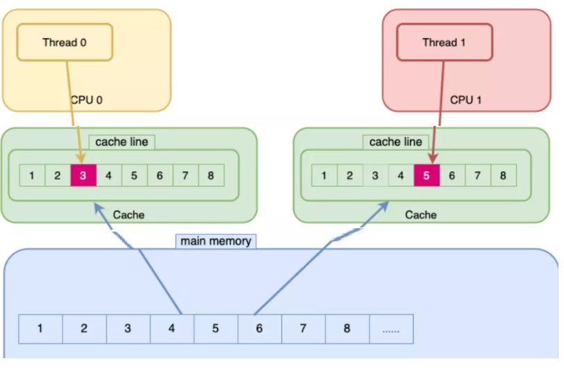

解决方法：

* padding：通过填充，让数据落在不同的 cache line 中

* @Contended：原理参考 无锁 → Adder → 优化机制 → 伪共享

Linux 查看 CPU 缓存行：

* 命令：`cat /sys/devices/system/cpu/cpu0/cache/index0/coherency_line_size64`
* 内存地址格式：[高位组标记] [低位索引] [偏移量]


***


#### 缓存一致

缓存一致性：当多个处理器运算任务都涉及到同一块主内存区域的时候，将可能导致各自的缓存数据不一样

MESI（Modified Exclusive Shared Or Invalid）是一种广泛使用的**支持写回策略的缓存一致性协议**，CPU 中每个缓存行（caceh line）使用 4 种状态进行标记（使用额外的两位 bit 表示)：

* M：被修改（Modified）

  该缓存行只被缓存在该 CPU 的缓存中，并且是被修改过的，与主存中的数据不一致 (dirty)，该缓存行中的内存需要在未来的某个时间点（其它 CPU 读取主存中相应数据之前）写回 (write back) 主存

  当被写回主存之后，该缓存行的状态会变成独享 (exclusive) 状态。

* E：独享的（Exclusive）

  该缓存行只被缓存在该 CPU 的缓存中，是未被修改过的 (clear)，与主存中数据一致，该状态可以在任何时刻有其它 CPU 读取该内存时变成共享状态 (shared)

  当 CPU 修改该缓存行中内容时，该状态可以变成 Modified 状态

* S：共享的（Shared）

  该状态意味着该缓存行可能被多个 CPU 缓存，并且各个缓存中的数据与主存数据一致，当有一个 CPU 修改该缓存行中，其它 CPU 中该缓存行变成无效状态 (Invalid)

* I：无效的（Invalid）

  该缓存是无效的，可能有其它 CPU 修改了该缓存行

解决方法：各个处理器访问缓存时都遵循一些协议，在读写时要根据协议进行操作，协议主要有 MSI、MESI 等


****


#### 处理机制

单核 CPU 处理器会自动保证基本内存操作的原子性

多核 CPU 处理器，每个 CPU 处理器内维护了一块内存，每个内核内部维护着一块缓存，当多线程并发读写时，就会出现缓存数据不一致的情况。处理器提供：

* 总线锁定：当处理器要操作共享变量时，在 BUS 总线上发出一个 LOCK 信号，其他处理器就无法操作这个共享变量，该操作会导致大量阻塞，从而增加系统的性能开销（**平台级别的加锁**）
* 缓存锁定：当处理器对缓存中的共享变量进行了操作，其他处理器有嗅探机制，将该共享变量的缓存失效，其他线程读取时会重新从主内存中读取最新的数据，基于 MESI 缓存一致性协议来实现

有如下两种情况处理器不会使用缓存锁定：

* 当操作的数据跨多个缓存行，或没被缓存在处理器内部，则处理器会使用总线锁定

* 有些处理器不支持缓存锁定，比如：Intel 486 和 Pentium 处理器也会调用总线锁定

总线机制：

* 总线嗅探：每个处理器通过嗅探在总线上传播的数据来检查自己缓存值是否过期了，当处理器发现自己的缓存对应的内存地址的数据被修改，就**将当前处理器的缓存行设置为无效状态**，当处理器对这个数据进行操作时，会重新从内存中把数据读取到处理器缓存中

* 总线风暴：由于 volatile 的 MESI 缓存一致性协议，需要不断的从主内存嗅探和 CAS 循环，无效的交互会导致总线带宽达到峰值；因此不要大量使用 volatile 关键字，使用 volatile、syschonized 都需要根据实际场景


***


### volatile

#### 基本特性

volatile 是 Java 虚拟机提供的**轻量级**的同步机制（三大特性）

- 保证可见性
- 不保证原子性
- 保证有序性（禁止指令重排）

性能：volatile 修饰的变量进行读操作与普通变量几乎没什么差别，但是写操作相对慢一些，因为需要在本地代码中插入很多内存屏障来保证指令不会发生乱序执行，但是开销比锁要小


***


#### 解决重排

**volatile 修饰的变量，可以禁用指令重排**

**synchronized 无法禁止指令重排和处理器优化**，为什么可以保证有序性可见性

* 加了锁之后，只能有一个线程获得到了锁，获得不到锁的线程就要阻塞，所以同一时间只有一个线程执行，相当于单线程，由于数据依赖性的存在，单线程的指令重排是没有问题的
* 线程解锁前，必须把共享变量的最新值刷新到主内存中。线程加锁前，将清空工作内存中共享变量的值，使用共享变量时需要从主内存中重新读取最新的值

指令重排实例：

* example 1：

  ```java
  public void mySort() {
  	int x = 11;	//语句1
  	int y = 12;	//语句2  谁先执行效果一样
  	x = x + 5;	//语句3
  	y = x * x;	//语句4
  }
  ```

  执行顺序是：1 2 3 4、2 1 3 4、1 3 2 4

  指令重排也有限制不会出现：4321，语句 4 需要依赖于 y 以及 x 的申明，因为存在数据依赖，无法首先执行

* example 2：

  ```java
  int num = 0;
  boolean ready = false;
  // 线程1 执行此方法
  public void actor1(I_Result r) {
      if(ready) {
      	r.r1 = num + num;
      } else {
      	r.r1 = 1;
      }
  }
  // 线程2 执行此方法
  public void actor2(I_Result r) {
  	num = 2;
  	ready = true;
  }
  ```

  情况一：线程1 先执行，ready = false，结果为 r.r1 = 1

  情况二：线程2 先执行 num = 2，但还没执行 ready = true，线程1 执行，结果为 r.r1 = 1

  情况三：线程2 先执行 ready = true，线程1 执行，进入 if 分支结果为 r.r1 = 4

  情况四：线程2 执行 ready = true，切换到线程1，进入 if 分支为 r.r1 = 0，再切回线程2 执行 num = 2，发生指令重排


****


#### 底层原理

使用 volatile 修饰的共享变量，总线会开启 **CPU 总线嗅探机制**来解决 JMM 缓存一致性问题，也就是共享变量在多线程中可见性的问题，实现 MESI 缓存一致性协议

底层是通过汇编 lock 前缀指令，共享变量加了 lock 前缀指令，在线程修改完共享变量后，会马上执行 store 和 write 操作。在执行 store 操作前，会先执行**缓存锁定**的操作然后写回主存，其他的 CPU 上运行的线程根据 CPU 总线嗅探机制会修改其共享变量为失效状态，读取时会重新从主内存中读取最新的数据

lock 前缀指令就相当于内存屏障，Memory Barrier（Memory Fence）

* 对 volatile 变量的写指令后会加入写屏障
* 对 volatile 变量的读指令前会加入读屏障

内存屏障有三个作用：

- 确保对内存的读-改-写操作原子执行
- 阻止屏障两侧的指令重排序
- 强制把缓存中的脏数据写回主内存，让缓存行中相应的数据失效

**保证可见性**：

* 写屏障（sfence，Store Barrier）保证在该屏障之前的，对共享变量的改动，都同步到主存当中

  ```java
  public void actor2(I_Result r) {
      num = 2;
      ready = true; // ready 是 volatile 赋值带写屏障
      // 写屏障
  }
  ```

* 读屏障（lfence，Load Barrier）保证在该屏障之后的，对共享变量的读取，加载的是主存中最新数据

  ```java
  public void actor1(I_Result r) {
      // 读屏障
      // ready 是 volatile 读取值带读屏障
      if(ready) {
      	r.r1 = num + num;
      } else {
      	r.r1 = 1;
      }
  }
  ```

  

* 全能屏障：mfence（modify/mix Barrier），兼具 sfence 和 lfence 的功能

**保证有序性**：

* 写屏障会确保指令重排序时，不会将写屏障之前的代码排在写屏障之后
* 读屏障会确保指令重排序时，不会将读屏障之后的代码排在读屏障之前

不能解决指令交错：

* 写屏障仅仅是保证之后的读能够读到最新的结果，但不能保证其他的读跑到写屏障之前

* 有序性的保证也只是保证了本线程内相关代码不被重排序

  ```java
  volatile i = 0;
  new Thread(() -> {i++});
  new Thread(() -> {i--});
  ```

  i++ 反编译后的指令：

  ```java
  0: iconst_1			// 当int取值 -1~5 时，JVM采用iconst指令将常量压入栈中
  1: istore_1			// 将操作数栈顶数据弹出，存入局部变量表的 slot 1
  2: iinc		1, 1	
  ```

  


***


#### 双端检锁

##### 检锁机制

Double-Checked Locking：双端检锁机制

DCL（双端检锁）机制不一定是线程安全的，原因是有指令重排的存在，加入 volatile 可以禁止指令重排

```java
public final class Singleton {
    private Singleton() { }
    private static Singleton INSTANCE = null;
    
    public static Singleton getInstance() {
        if(INSTANCE == null) { // t2，这里的判断不是线程安全的
            // 首次访问会同步，而之后的使用没有 synchronized
            synchronized(Singleton.class) {
                // 这里是线程安全的判断，防止其他线程在当前线程等待锁的期间完成了初始化
                if (INSTANCE == null) { 
                    INSTANCE = new Singleton();
                }
            }
        }
        return INSTANCE;
    }
}
```

不锁 INSTANCE 的原因：

* INSTANCE 要重新赋值
* INSTANCE 是 null，线程加锁之前需要获取对象的引用，设置对象头，null 没有引用

实现特点： 

* 懒惰初始化
* 首次使用 getInstance() 才使用 synchronized 加锁，后续使用时无需加锁
* 第一个 if 使用了 INSTANCE 变量，是在同步块之外，但在多线程环境下会产生问题


***


##### DCL问题

getInstance 方法对应的字节码为：

```java
0: 	getstatic 		#2 		// Field INSTANCE:Ltest/Singleton;
3: 	ifnonnull 		37
6: 	ldc 			#3 		// class test/Singleton
8: 	dup
9: 	astore_0
10: monitorenter
11: getstatic 		#2 		// Field INSTANCE:Ltest/Singleton;
14: ifnonnull 27
17: new 			#3 		// class test/Singleton
20: dup
21: invokespecial 	#4 		// Method "<init>":()V
24: putstatic 		#2 		// Field INSTANCE:Ltest/Singleton;
27: aload_0
28: monitorexit
29: goto 37
32: astore_1
33: aload_0
34: monitorexit
35: aload_1
36: athrow
37: getstatic 		#2 		// Field INSTANCE:Ltest/Singleton;
40: areturn
```

* 17 表示创建对象，将对象引用入栈 
* 20 表示复制一份对象引用，引用地址
* 21 表示利用一个对象引用，调用构造方法初始化对象
* 24 表示利用一个对象引用，赋值给 static INSTANCE

**步骤 21 和 24 之间不存在数据依赖关系**，而且无论重排前后，程序的执行结果在单线程中并没有改变，因此这种重排优化是允许的

* 关键在于 0:getstatic 这行代码在 monitor 控制之外，可以越过 monitor 读取 INSTANCE 变量的值
* 当其他线程访问 instance 不为 null 时，由于 instance 实例未必已初始化，那么 t2 拿到的是将是一个未初始化完毕的单例返回，这就造成了线程安全的问题


***


##### 解决方法

指令重排只会保证串行语义的执行一致性（单线程），但并不会关系多线程间的语义一致性

引入 volatile，来保证出现指令重排的问题，从而保证单例模式的线程安全性：

```java
private static volatile SingletonDemo INSTANCE = null;
```


***


### ha-be

happens-before 先行发生

Java 内存模型具备一些先天的“有序性”，即不需要通过任何同步手段（volatile、synchronized 等）就能够得到保证的安全，这个通常也称为 happens-before 原则，它是可见性与有序性的一套规则总结

不符合 happens-before 规则，JMM 并不能保证一个线程的可见性和有序性

1. 程序次序规则 (Program Order Rule)：一个线程内，逻辑上书写在前面的操作先行发生于书写在后面的操作 ，因为多个操作之间有先后依赖关系，则不允许对这些操作进行重排序

2. 锁定规则 (Monitor Lock Rule)：一个 unlock 操作先行发生于后面（时间的先后）对同一个锁的 lock 操作，所以线程解锁 m 之前对变量的写（解锁前会刷新到主内存中），对于接下来对 m 加锁的其它线程对该变量的读可见

3. **volatile 变量规则**  (Volatile Variable Rule)：对 volatile 变量的写操作先行发生于后面对这个变量的读

4. 传递规则 (Transitivity)：具有传递性，如果操作 A 先行发生于操作 B，而操作 B 又先行发生于操作 C，则可以得出操作 A 先行发生于操作 C

5. 线程启动规则 (Thread Start Rule)：Thread 对象的 start()方 法先行发生于此线程中的每一个操作

   ```java
   static int x = 10;//线程 start 前对变量的写，对该线程开始后对该变量的读可见
   new Thread(()->{	System.out.println(x);	},"t1").start();
   ```

6. 线程中断规则 (Thread Interruption Rule)：对线程 interrupt() 方法的调用先行发生于被中断线程的代码检测到中断事件的发生

7. 线程终止规则 (Thread Termination Rule)：线程中所有的操作都先行发生于线程的终止检测，可以通过 Thread.join() 方法结束、Thread.isAlive() 的返回值手段检测到线程已经终止执行

8. 对象终结规则（Finaizer Rule）：一个对象的初始化完成（构造函数执行结束）先行发生于它的 finalize() 方法的开始


***


### 设计模式

#### 终止模式

终止模式之两阶段终止模式：停止标记用 volatile 是为了保证该变量在多个线程之间的可见性

```java
class TwoPhaseTermination {
    // 监控线程
    private Thread monitor;
    // 停止标记
    private volatile boolean stop = false;;

    // 启动监控线程
    public void start() {
        monitor = new Thread(() -> {
            while (true) {
                Thread thread = Thread.currentThread();
                if (stop) {
                    System.out.println("后置处理");
                    break;
                }
                try {
                    Thread.sleep(1000);// 睡眠
                    System.out.println(thread.getName() + "执行监控记录");
                } catch (InterruptedException e) {
                   	System.out.println("被打断，退出睡眠");
                }
            }
        });
        monitor.start();
    }

    // 停止监控线程
    public void stop() {
        stop = true;
        monitor.interrupt();// 让线程尽快退出Timed Waiting
    }
}
// 测试
public static void main(String[] args) throws InterruptedException {
    TwoPhaseTermination tpt = new TwoPhaseTermination();
    tpt.start();
    Thread.sleep(3500);
    System.out.println("停止监控");
    tpt.stop();
}
```


****


#### Balking

Balking （犹豫）模式用在一个线程发现另一个线程或本线程已经做了某一件相同的事，那么本线程就无需再做了，直接结束返回

```java
public class MonitorService {
    // 用来表示是否已经有线程已经在执行启动了
    private volatile boolean starting = false;
    public void start() {
        System.out.println("尝试启动监控线程...");
        synchronized (this) {
            if (starting) {
            	return;
            }
            starting = true;
        }
        // 真正启动监控线程...
    }
}
```

对比保护性暂停模式：保护性暂停模式用在一个线程等待另一个线程的执行结果，当条件不满足时线程等待

例子：希望 doInit() 方法仅被调用一次，下面的实现出现的问题：

* 当 t1 线程进入 init() 准备 doInit()，t2 线程进来，initialized 还为f alse，则 t2 就又初始化一次
* volatile 适合一个线程写，其他线程读的情况，这个代码需要加锁

```java
public class TestVolatile {
    volatile boolean initialized = false;
    
    void init() {
        if (initialized) {
            return;
        }
    	doInit();
    	initialized = true;
    }
    private void doInit() {
    }
}
```


****


## 无锁

### CAS

#### 原理

无锁编程：Lock Free

CAS 的全称是 Compare-And-Swap，是 **CPU 并发原语**

* CAS 并发原语体现在 Java 语言中就是 sun.misc.Unsafe 类的各个方法，调用 UnSafe 类中的 CAS 方法，JVM 会实现出 CAS 汇编指令，这是一种完全依赖于硬件的功能，实现了原子操作
* CAS 是一种系统原语，原语属于操作系统范畴，是由若干条指令组成 ，用于完成某个功能的一个过程，并且原语的执行必须是连续的，执行过程中不允许被中断，所以 CAS 是一条 CPU 的原子指令，不会造成数据不一致的问题，是线程安全的

底层原理：CAS 的底层是 `lock cmpxchg` 指令（X86 架构），在单核和多核 CPU 下都能够保证比较交换的原子性

* 程序是在单核处理器上运行，会省略 lock 前缀，单处理器自身会维护处理器内的顺序一致性，不需要 lock 前缀的内存屏障效果

* 程序是在多核处理器上运行，会为 cmpxchg 指令加上 lock 前缀。当某个核执行到带 lock 的指令时，CPU 会执行**总线锁定或缓存锁定**，将修改的变量写入到主存，这个过程不会被线程的调度机制所打断，保证了多个线程对内存操作的原子性

作用：比较当前工作内存中的值和主物理内存中的值，如果相同则执行规定操作，否者继续比较直到主内存和工作内存的值一致为止

CAS 特点：

* CAS 体现的是**无锁并发、无阻塞并发**，线程不会陷入阻塞，线程不需要频繁切换状态（上下文切换，系统调用）
* CAS 是基于乐观锁的思想

CAS 缺点：

- 循环时间长，开销大，因为执行的是循环操作，如果比较不成功一直在循环，最差的情况某个线程一直取到的值和预期值都不一样，就会无限循环导致饥饿，**使用 CAS 线程数不要超过 CPU的 核心数**
- 只能保证一个共享变量的原子操作
  - 对于一个共享变量执行操作时，可以通过循环 CAS 的方式来保证原子操作
  - 对于多个共享变量操作时，循环 CAS 就无法保证操作的原子性，这个时候**只能用锁来保证原子性**
- 引出来 ABA 问题


***


#### 乐观锁

CAS 与 synchronized 总结：

* synchronized 是从悲观的角度出发：总是假设最坏的情况，每次去拿数据的时候都认为别人会修改，所以每次在拿数据的时候都会上锁，这样别人想拿这个数据就会阻塞（**共享资源每次只给一个线程使用，其它线程阻塞，用完后再把资源转让给其它线程**），因此 synchronized 也称之为悲观锁，ReentrantLock 也是一种悲观锁，**性能较差**
* CAS 是从乐观的角度出发：总是假设最好的情况，每次去拿数据的时候都认为别人不会修改，所以不会上锁，但是在更新的时候会判断一下在此期间别人有没有去更新这个数据。**如果别人修改过，则获取现在最新的值，如果别人没修改过，直接修改共享数据的值**，CAS 这种机制也称之为乐观锁，**综合性能较好**


***


### Atomic

#### 常用API

常见原子类：AtomicInteger、AtomicBoolean、AtomicLong

构造方法：

* `public AtomicInteger()`：初始化一个默认值为 0 的原子型 Integer
* `public AtomicInteger(int initialValue)`：初始化一个指定值的原子型 Integer

常用API：

| 方法                                  | 作用                                                         |
| ------------------------------------- | ------------------------------------------------------------ |
| public final int get()                | 获取 AtomicInteger 的值                                      |
| public final int getAndIncrement()    | 以原子方式将当前值加 1，返回的是自增前的值                   |
| public final int incrementAndGet()    | 以原子方式将当前值加 1，返回的是自增后的值                   |
| public final int getAndSet(int value) | 以原子方式设置为 newValue 的值，返回旧值                     |
| public final int addAndGet(int data)  | 以原子方式将输入的数值与实例中的值相加并返回<br />实例：AtomicInteger 里的 value |


***


#### 原理分析

**AtomicInteger 原理**：自旋锁  + CAS 算法

CAS 算法：有 3 个操作数（内存值 V， 旧的预期值 A，要修改的值 B）

* 当旧的预期值 A == 内存值 V   此时可以修改，将 V 改为 B
* 当旧的预期值 A !=  内存值 V   此时不能修改，并重新获取现在的最新值，重新获取的动作就是自旋 

分析 getAndSet 方法：

* AtomicInteger：

  ```java
  public final int getAndSet(int newValue) {
      /**
      * this: 		当前对象
      * valueOffset:	内存偏移量，内存地址
      */
      return unsafe.getAndSetInt(this, valueOffset, newValue);
  }
  ```

  valueOffset：偏移量表示该变量值相对于当前对象地址的偏移，Unsafe 就是根据内存偏移地址获取数据

  ```java
  valueOffset = unsafe.objectFieldOffset
                  (AtomicInteger.class.getDeclaredField("value"));
  //调用本地方法   -->
  public native long objectFieldOffset(Field var1);
  ```

* unsafe类：

  ```java
  // val1: AtomicInteger对象本身，var2: 该对象值得引用地址，var4: 需要变动的数
  public final int getAndSetInt(Object var1, long var2, int var4) {
      int var5;
      do {
          // var5: 用 var1 和 var2 找到的内存中的真实值
          var5 = this.getIntVolatile(var1, var2);
      } while(!this.compareAndSwapInt(var1, var2, var5, var4));
  
      return var5;
  }
  ```

  var5：从主内存中拷贝到工作内存中的值（每次都要从主内存拿到最新的值到本地内存），然后执行 `compareAndSwapInt()` 再和主内存的值进行比较，假设方法返回 false，那么就一直执行 while 方法，直到期望的值和真实值一样，修改数据

* 变量 value 用 volatile 修饰，保证了多线程之间的内存可见性，避免线程从工作缓存中获取失效的变量

  ```java
  private volatile int value
  ```

  CAS 必须借助 volatile 才能读取到共享变量的最新值来实现**比较并交换**的效果

分析 getAndUpdate 方法：

* getAndUpdate：

  ```java
  public final int getAndUpdate(IntUnaryOperator updateFunction) {
      int prev, next;
      do {
          prev = get();	//当前值，cas的期望值
          next = updateFunction.applyAsInt(prev);//期望值更新到该值
      } while (!compareAndSet(prev, next));//自旋
      return prev;
  }
  ```

  函数式接口：可以自定义操作逻辑

  ```java
  AtomicInteger a = new AtomicInteger();
  a.getAndUpdate(i -> i + 10);
  ```

* compareAndSet：

  ```java
  public final boolean compareAndSet(int expect, int update) {
      /**
      * this: 		当前对象
      * valueOffset:	内存偏移量，内存地址
      * expect:		期望的值
      * update: 		更新的值
      */
      return unsafe.compareAndSwapInt(this, valueOffset, expect, update);
  }
  ```


***


#### 原子引用

原子引用：对 Object 进行原子操作，提供一种读和写都是原子性的对象引用变量

原子引用类：AtomicReference、AtomicStampedReference、AtomicMarkableReference

AtomicReference 类：

* 构造方法：`AtomicReference<T> atomicReference = new AtomicReference<T>()`

* 常用 API：
  * `public final boolean compareAndSet(V expectedValue, V newValue)`：CAS 操作
  * `public final void set(V newValue)`：将值设置为 newValue 
  * `public final V get()`：返回当前值

```java
public class AtomicReferenceDemo {
    public static void main(String[] args) {
        Student s1 = new Student(33, "z3");
        
        // 创建原子引用包装类
        AtomicReference<Student> atomicReference = new AtomicReference<>();
        // 设置主内存共享变量为s1
        atomicReference.set(s1);

        // 比较并交换，如果现在主物理内存的值为 z3，那么交换成 l4
        while (true) {
            Student s2 = new Student(44, "l4");
            if (atomicReference.compareAndSet(s1, s2)) {
                break;
            }
        }
        System.out.println(atomicReference.get());
    }
}

class Student {
    private int id;
    private String name;
    //。。。。
}
```


***


#### 原子数组

原子数组类：AtomicIntegerArray、AtomicLongArray、AtomicReferenceArray

AtomicIntegerArray 类方法：

```java
/**
*   i		the index
* expect 	the expected value
* update 	the new value
*/
public final boolean compareAndSet(int i, int expect, int update) {
    return compareAndSetRaw(checkedByteOffset(i), expect, update);
}
```


***


#### 原子更新器

原子更新器类：AtomicReferenceFieldUpdater、AtomicIntegerFieldUpdater、AtomicLongFieldUpdater

利用字段更新器，可以针对对象的某个域（Field）进行原子操作，只能配合 volatile 修饰的字段使用，否则会出现异常 `IllegalArgumentException: Must be volatile type`

常用 API：

* `static <U> AtomicIntegerFieldUpdater<U> newUpdater(Class<U> c, String fieldName)`：构造方法
* `abstract boolean compareAndSet(T obj, int expect, int update)`：CAS

```java
public class UpdateDemo {
    private volatile int field;
    
    public static void main(String[] args) {
        AtomicIntegerFieldUpdater fieldUpdater = AtomicIntegerFieldUpdater
            		.newUpdater(UpdateDemo.class, "field");
        UpdateDemo updateDemo = new UpdateDemo();
        fieldUpdater.compareAndSet(updateDemo, 0, 10);
        System.out.println(updateDemo.field);//10
    }
}
```


***


#### 原子累加器

原子累加器类：LongAdder、DoubleAdder、LongAccumulator、DoubleAccumulator 

LongAdder 和 LongAccumulator 区别：

相同点：

* LongAddr 与 LongAccumulator 类都是使用非阻塞算法 CAS 实现的，
* LongAddr 类是 LongAccumulator 类的一个特例，只是 LongAccumulator 提供了更强大的功能，可以自定义累加规则，当accumulatorFunction 为 null 时就等价于 LongAddr

不同点：

* 调用 casBase 时，LongAccumulator 使用 function.applyAsLong(b = base, x) 来计算，LongAddr 使用 casBase(b = base, b + x) 
* LongAccumulator 类功能更加强大，构造方法参数中

  * accumulatorFunction 是一个双目运算器接口，可以指定累加规则，比如累加或者相乘，其根据输入的两个参数返回一个计算值，LongAdder 内置累加规则
  * identity 则是 LongAccumulator 累加器的初始值，LongAccumulator 可以为累加器提供非0的初始值，而 LongAdder 只能提供默认的 0


***


### Adder

#### 优化机制

LongAdder 是 Java8 提供的类，跟 AtomicLong 有相同的效果，但对 CAS 机制进行了优化，尝试使用分段 CAS 以及自动分段迁移的方式来大幅度提升多线程高并发执行 CAS 操作的性能

CAS 底层实现是在一个循环中不断地尝试修改目标值，直到修改成功。如果竞争不激烈修改成功率很高，否则失败率很高，失败后这些重复的原子性操作会耗费性能（导致大量线程**空循环，自旋转**）

优化核心思想：数据分离，将 AtomicLong 的**单点的更新压力分担到各个节点，空间换时间**，在低并发的时候直接更新，可以保障和 AtomicLong 的性能基本一致，而在高并发的时候通过分散减少竞争，提高了性能

**分段 CAS 机制**：

* 在发生竞争时，创建 Cell 数组用于将不同线程的操作离散（通过 hash 等算法映射）到不同的节点上
* 设置多个累加单元（会根据需要扩容，最大为 CPU 核数），Therad-0 累加 Cell[0]，而 Thread-1 累加 Cell[1] 等，最后将结果汇总
* 在累加时操作的不同的 Cell 变量，因此减少了 CAS 重试失败，从而提高性能

**自动分段迁移机制**：某个 Cell 的 value 执行 CAS 失败，就会自动寻找另一个 Cell 分段内的 value 值进行 CAS 操作


***


#### 伪共享

Cell 为累加单元：数组访问索引是通过 Thread 里的 threadLocalRandomProbe 域取模实现的，这个域是 ThreadLocalRandom 更新的

```java
// Striped64.Cell
@sun.misc.Contended static final class Cell {
    volatile long value;
    Cell(long x) { value = x; }
    // 用 cas 方式进行累加, prev 表示旧值, next 表示新值
    final boolean cas(long prev, long next) {
    	return UNSAFE.compareAndSwapLong(this, valueOffset, prev, next);
    }
    // 省略不重要代码
}
```

Cell 是数组形式，**在内存中是连续存储的**，64 位系统中，一个 Cell 为 24 字节（16 字节的对象头和 8 字节的 value），每一个 cache line 为 64 字节，因此缓存行可以存下 2 个的 Cell 对象，当 Core-0 要修改 Cell[0]、Core-1 要修改 Cell[1]，无论谁修改成功都会导致当前缓存行失效，从而导致对方的数据失效，需要重新去主存获取，影响效率


@sun.misc.Contended：防止缓存行伪共享，在使用此注解的对象或字段的前后各增加 128 字节大小的 padding，使用 2 倍于大多数硬件缓存行让 CPU 将对象预读至缓存时占用不同的缓存行，这样就不会造成对方缓存行的失效


***


#### 源码解析

Striped64 类成员属性：

```java
// 表示当前计算机CPU数量
static final int NCPU = Runtime.getRuntime().availableProcessors()
// 累加单元数组, 懒惰初始化
transient volatile Cell[] cells;
// 基础值, 如果没有竞争, 则用 cas 累加这个域，当 cells 扩容时，也会将数据写到 base 中
transient volatile long base;
// 在 cells 初始化或扩容时只能有一个线程执行, 通过 CAS 更新 cellsBusy 置为 1 来实现一个锁
transient volatile int cellsBusy;
```

工作流程：

* cells 占用内存是相对比较大的，是惰性加载的，在无竞争或者其他线程正在初始化 cells 数组的情况下，直接更新 base 域

* 在第一次发生竞争时（casBase 失败）会创建一个大小为 2 的 cells 数组，将当前累加的值包装为 Cell 对象，放入映射的槽位上
* 分段累加的过程中，如果当前线程对应的 cells 槽位为空，就会新建 Cell 填充，如果出现竞争，就会重新计算线程对应的槽位，继续自旋尝试修改
* 分段迁移后还出现竞争就会扩容 cells 数组长度为原来的两倍，然后 rehash，**数组长度总是 2 的 n 次幂**，默认最大为 CPU 核数，但是可以超过，如果核数是 6 核，数组最长是 8 

方法分析：

* LongAdder#add：累加方法

  ```java
  public void add(long x) {
      // as 为累加单元数组的引用，b 为基础值，v 表示期望值
      // m 表示 cells 数组的长度 - 1，a 表示当前线程命中的 cell 单元格
      Cell[] as; long b, v; int m; Cell a;
      
      // cells 不为空说明 cells 已经被初始化，线程发生了竞争，去更新对应的 cell 槽位
      // 进入 || 后的逻辑去更新 base 域，更新失败表示发生竞争进入条件
      if ((as = cells) != null || !casBase(b = base, b + x)) {
          // uncontended 为 true 表示 cell 没有竞争
          boolean uncontended = true;
          
          // 条件一: true 说明 cells 未初始化，多线程写 base 发生竞争需要进行初始化 cells 数组
          //		  fasle 说明 cells 已经初始化，进行下一个条件寻找自己的 cell 去累加
          // 条件二: getProbe() 获取 hash 值，& m 的逻辑和 HashMap 的逻辑相同，保证散列的均匀性
          // 		  true 说明当前线程对应下标的 cell 为空，需要创建 cell
          //        false 说明当前线程对应的 cell 不为空，进行下一个条件【将 x 值累加到对应的 cell 中】
          // 条件三: 有取反符号，false 说明 cas 成功，直接返回，true 说明失败，当前线程对应的 cell 有竞争
          if (as == null || (m = as.length - 1) < 0 ||
              (a = as[getProbe() & m]) == null ||
              !(uncontended = a.cas(v = a.value, v + x)))
              longAccumulate(x, null, uncontended);
          	// 【uncontended 在对应的 cell 上累加失败的时候才为 false，其余情况均为 true】
      }
  }
  ```

* Striped64#longAccumulate：cell 数组创建

  ```java
  							// x  			null 			false | true
  final void longAccumulate(long x, LongBinaryOperator fn, boolean wasUncontended) {
      int h;
      // 当前线程还没有对应的 cell, 需要随机生成一个 hash 值用来将当前线程绑定到 cell
      if ((h = getProbe()) == 0) {
          // 初始化 probe，获取 hash 值
          ThreadLocalRandom.current(); 
          h = getProbe();	
          // 默认情况下 当前线程肯定是写入到了 cells[0] 位置，不把它当做一次真正的竞争
          wasUncontended = true;
      }
      // 表示【扩容意向】，false 一定不会扩容，true 可能会扩容
      boolean collide = false; 
      //自旋
      for (;;) {
          // as 表示cells引用，a 表示当前线程命中的 cell，n 表示 cells 数组长度，v 表示 期望值
          Cell[] as; Cell a; int n; long v;
          // 【CASE1】: 表示 cells 已经初始化了，当前线程应该将数据写入到对应的 cell 中
          if ((as = cells) != null && (n = as.length) > 0) {
              // CASE1.1: true 表示当前线程对应的索引下标的 Cell 为 null，需要创建 new Cell
              if ((a = as[(n - 1) & h]) == null) {
                  // 判断 cellsBusy 是否被锁
                  if (cellsBusy == 0) {   
                      // 创建 cell, 初始累加值为 x
                      Cell r = new Cell(x);  
                      // 加锁
                      if (cellsBusy == 0 && casCellsBusy()) {
                          // 创建成功标记，进入【创建 cell 逻辑】
                          boolean created = false;	
                          try {
                              Cell[] rs; int m, j;
                              // 把当前 cells 数组赋值给 rs，并且不为 null
                              if ((rs = cells) != null &&
                                  (m = rs.length) > 0 &&
                                  // 再次判断防止其它线程初始化过该位置，当前线程再次初始化该位置会造成数据丢失
                                  // 因为这里是线程安全的判断，进行的逻辑不会被其他线程影响
                                  rs[j = (m - 1) & h] == null) {
                                  // 把新创建的 cell 填充至当前位置
                                  rs[j] = r;
                                  created = true;	// 表示创建完成
                              }
                          } finally {
                              cellsBusy = 0;		// 解锁
                          }
                          if (created)			// true 表示创建完成，可以推出循环了
                              break;
                          continue;
                      }
                  }
                  collide = false;
              }
              // CASE1.2: 条件成立说明线程对应的 cell 有竞争, 改变线程对应的 cell 来重试 cas
              else if (!wasUncontended)
                  wasUncontended = true;
              // CASE 1.3: 当前线程 rehash 过，如果新命中的 cell 不为空，就尝试累加，false 说明新命中也有竞争
              else if (a.cas(v = a.value, ((fn == null) ? v + x : fn.applyAsLong(v, x))))
                  break;
              // CASE 1.4: cells 长度已经超过了最大长度 CPU 内核的数量或者已经扩容
              else if (n >= NCPU || cells != as)
                  collide = false; 		// 扩容意向改为false，【表示不能扩容了】
              // CASE 1.5: 更改扩容意向，如果 n >= NCPU，这里就永远不会执行到，case1.4 永远先于 1.5 执行
              else if (!collide)
                  collide = true;
              // CASE 1.6: 【扩容逻辑】，进行加锁
              else if (cellsBusy == 0 && casCellsBusy()) {
                  try {
                      // 线程安全的检查，防止期间被其他线程扩容了
                      if (cells == as) {     
                          // 扩容为以前的 2 倍
                          Cell[] rs = new Cell[n << 1];
                          // 遍历移动值
                          for (int i = 0; i < n; ++i)
                              rs[i] = as[i];
                          // 把扩容后的引用给 cells
                          cells = rs;
                      }
                  } finally {
                      cellsBusy = 0;	// 解锁
                  }
                  collide = false;	// 扩容意向改为 false，表示不扩容了
                  continue;
              }
              // 重置当前线程 Hash 值，这就是【分段迁移机制】
              h = advanceProbe(h);
          }
  
          // 【CASE2】: 运行到这说明 cells 还未初始化，as 为null
          // 判断是否没有加锁，没有加锁就用 CAS 加锁
          // 条件二判断是否其它线程在当前线程给 as 赋值之后修改了 cells，这里不是线程安全的判断
          else if (cellsBusy == 0 && cells == as && casCellsBusy()) {
              // 初始化标志，开始 【初始化 cells 数组】
              boolean init = false;
              try { 
                 	// 再次判断 cells == as 防止其它线程已经提前初始化了，当前线程再次初始化导致丢失数据
                  // 因为这里是【线程安全的，重新检查，经典 DCL】
                  if (cells == as) {
                      Cell[] rs = new Cell[2];	// 初始化数组大小为2
                      rs[h & 1] = new Cell(x);	// 填充线程对应的cell
                      cells = rs;
                      init = true;				// 初始化成功，标记置为 true
                  }
              } finally {
                  cellsBusy = 0;					// 解锁啊
              }
              if (init)
                  break;							// 初始化成功直接跳出自旋
          }
          // 【CASE3】: 运行到这说明其他线程在初始化 cells，当前线程将值累加到 base，累加成功直接结束自旋
          else if (casBase(v = base, ((fn == null) ? v + x :
                                      fn.applyAsLong(v, x))))
              break; 
      }
  }
  ```

* sum：获取最终结果通过 sum 整合，**保证最终一致性，不保证强一致性**

  ```java
  public long sum() {
      Cell[] as = cells; Cell a;
      long sum = base;
      if (as != null) {
          // 遍历 累加
          for (int i = 0; i < as.length; ++i) {
              if ((a = as[i]) != null)
                  sum += a.value;
          }
      }
      return sum;
  }
  ```

  


***


### ABA

ABA 问题：当进行获取主内存值时，该内存值在写入主内存时已经被修改了 N 次，但是最终又改成原来的值

其他线程先把 A 改成 B 又改回 A，主线程**仅能判断出共享变量的值与最初值 A 是否相同**，不能感知到这种从 A 改为 B 又 改回 A 的情况，这时 CAS 虽然成功，但是过程存在问题

* 构造方法：
  * `public AtomicStampedReference(V initialRef, int initialStamp)`：初始值和初始版本号

* 常用API：
  * ` public boolean compareAndSet(V expectedReference, V newReference, int expectedStamp, int newStamp)`：期望引用和期望版本号都一致才进行 CAS 修改数据
  * `public void set(V newReference, int newStamp)`：设置值和版本号
  * `public V getReference()`：返回引用的值
  * `public int getStamp()`：返回当前版本号

```java
public static void main(String[] args) {
    AtomicStampedReference<Integer> atomicReference = new AtomicStampedReference<>(100,1);
    int startStamp = atomicReference.getStamp();
    new Thread(() ->{
        int stamp = atomicReference.getStamp();
        atomicReference.compareAndSet(100, 101, stamp, stamp + 1);
        stamp = atomicReference.getStamp();
        atomicReference.compareAndSet(101, 100, stamp, stamp + 1);
    },"t1").start();

    new Thread(() ->{
        try {
            Thread.sleep(1000);
        } catch (InterruptedException e) {
            e.printStackTrace();
        }
        if (!atomicReference.compareAndSet(100, 200, startStamp, startStamp + 1)) {
            System.out.println(atomicReference.getReference());//100
            System.out.println(Thread.currentThread().getName() + "线程修改失败");
        }
    },"t2").start();
}
```


***


### Unsafe

Unsafe 是 CAS 的核心类，由于 Java 无法直接访问底层系统，需要通过本地（Native）方法来访问

Unsafe 类存在 sun.misc 包，其中所有方法都是 native 修饰的，都是直接调用**操作系统底层资源**执行相应的任务，基于该类可以直接操作特定的内存数据，其内部方法操作类似 C 的指针

模拟实现原子整数：

```java
public static void main(String[] args) {
    MyAtomicInteger atomicInteger = new MyAtomicInteger(10);
    if (atomicInteger.compareAndSwap(20)) {
        System.out.println(atomicInteger.getValue());
    }
}

class MyAtomicInteger {
    private static final Unsafe UNSAFE;
    private static final long VALUE_OFFSET;
    private volatile int value;

    static {
        try {
            //Unsafe unsafe = Unsafe.getUnsafe()这样会报错，需要反射获取
            Field theUnsafe = Unsafe.class.getDeclaredField("theUnsafe");
            theUnsafe.setAccessible(true);
            UNSAFE = (Unsafe) theUnsafe.get(null);
            // 获取 value 属性的内存地址，value 属性指向该地址，直接设置该地址的值可以修改 value 的值
            VALUE_OFFSET = UNSAFE.objectFieldOffset(
                		   MyAtomicInteger.class.getDeclaredField("value"));
        } catch (NoSuchFieldException | IllegalAccessException e) {
            e.printStackTrace();
            throw new RuntimeException();
        }
    }

    public MyAtomicInteger(int value) {
        this.value = value;
    }
    public int getValue() {
        return value;
    }

    public boolean compareAndSwap(int update) {
        while (true) {
            int prev = this.value;
            int next = update;
            //							当前对象  内存偏移量    期望值 更新值
            if (UNSAFE.compareAndSwapInt(this, VALUE_OFFSET, prev, update)) {
                System.out.println("CAS成功");
                return true;
            }
        }
    }
}
```


***


### final

#### 原理

```java
public class TestFinal {
	final int a = 20;
}
```

字节码：

```java
0: aload_0
1: invokespecial #1 // Method java/lang/Object."<init>":()V
4: aload_0
5: bipush 20		// 将值直接放入栈中
7: putfield #2 		// Field a:I
<-- 写屏障
10: return
```

final 变量的赋值通过 putfield 指令来完成，在这条指令之后也会加入写屏障，保证在其它线程读到它的值时不会出现为 0 的情况

其他线程访问 final 修饰的变量**会复制一份放入栈中**，效率更高


***


#### 不可变

不可变：如果一个对象不能够修改其内部状态（属性），那么就是不可变对象

不可变对象线程安全的，因为不存在并发修改，是另一种避免竞争的方式

String 类也是不可变的，该类和类中所有属性都是 final 的

* 类用 final 修饰保证了该类中的方法不能被覆盖，防止子类无意间破坏不可变性

* 无写入方法（set）确保外部不能对内部属性进行修改

* 属性用 final 修饰保证了该属性是只读的，不能修改

  ```java
  public final class String
      implements java.io.Serializable, Comparable<String>, CharSequence {
      /** The value is used for character storage. */
      private final char value[];
      //....
  }
  ```

* 更改 String 类数据时，会构造新字符串对象，生成新的 char[] value，通过**创建副本对象来避免共享的方式称之为保护性拷贝**

  


***


### State

无状态：成员变量保存的数据也可以称为状态信息，无状态就是没有成员变量

Servlet 为了保证其线程安全，一般不为 Servlet 设置成员变量，这种没有任何成员变量的类是线程安全的


***


### Local

#### 基本介绍

ThreadLocal 类用来提供线程内部的局部变量，这种变量在多线程环境下访问（通过 get 和 set 方法访问）时能保证各个线程的变量相对独立于其他线程内的变量，分配在堆内的 TLAB 中

ThreadLocal 实例通常来说都是 `private static` 类型的，属于一个线程的本地变量，用于关联线程和线程上下文。每个线程都会在 ThreadLocal 中保存一份该线程独有的数据，所以是线程安全的

ThreadLocal 作用：

* 线程并发：应用在多线程并发的场景下

* 传递数据：通过 ThreadLocal 实现在同一线程不同函数或组件中传递公共变量，减少传递复杂度

* 线程隔离：每个线程的变量都是独立的，不会互相影响

对比 synchronized：

|        | synchronized                                                 | ThreadLocal                                                  |
| ------ | ------------------------------------------------------------ | ------------------------------------------------------------ |
| 原理   | 同步机制采用**以时间换空间**的方式，只提供了一份变量，让不同的线程排队访问 | ThreadLocal 采用**以空间换时间**的方式，为每个线程都提供了一份变量的副本，从而实现同时访问而相不干扰 |
| 侧重点 | 多个线程之间访问资源的同步                                   | 多线程中让每个线程之间的数据相互隔离                         |


***


#### 基本使用

##### 常用方法

| 方法                       | 描述                         |
| -------------------------- | ---------------------------- |
| ThreadLocal<>()            | 创建 ThreadLocal 对象        |
| protected T initialValue() | 返回当前线程局部变量的初始值 |
| public void set( T value)  | 设置当前线程绑定的局部变量   |
| public T get()             | 获取当前线程绑定的局部变量   |
| public void remove()       | 移除当前线程绑定的局部变量   |

```java
public class MyDemo {

    private static ThreadLocal<String> tl = new ThreadLocal<>();

    private String content;

    private String getContent() {
        // 获取当前线程绑定的变量
        return tl.get();
    }

    private void setContent(String content) {
        // 变量content绑定到当前线程
        tl.set(content);
    }

    public static void main(String[] args) {
        MyDemo demo = new MyDemo();
        for (int i = 0; i < 5; i++) {
            Thread thread = new Thread(new Runnable() {
                @Override
                public void run() {
                    // 设置数据
                    demo.setContent(Thread.currentThread().getName() + "的数据");
                    System.out.println("-----------------------");
                    System.out.println(Thread.currentThread().getName() + "--->" + demo.getContent());
                }
            });
            thread.setName("线程" + i);
            thread.start();
        }
    }
}
```


***


##### 应用场景

ThreadLocal 适用于下面两种场景：

- 每个线程需要有自己单独的实例
- 实例需要在多个方法中共享，但不希望被多线程共享

ThreadLocal 方案有两个突出的优势： 

1. 传递数据：保存每个线程绑定的数据，在需要的地方可以直接获取，避免参数直接传递带来的代码耦合问题
2. 线程隔离：各线程之间的数据相互隔离却又具备并发性，避免同步方式带来的性能损失

ThreadLocal 用于数据连接的事务管理：

```java
public class JdbcUtils {
    // ThreadLocal对象，将connection绑定在当前线程中
    private static final ThreadLocal<Connection> tl = new ThreadLocal();
    // c3p0 数据库连接池对象属性
    private static final ComboPooledDataSource ds = new ComboPooledDataSource();
    // 获取连接
    public static Connection getConnection() throws SQLException {
        //取出当前线程绑定的connection对象
        Connection conn = tl.get();
        if (conn == null) {
            //如果没有，则从连接池中取出
            conn = ds.getConnection();
            //再将connection对象绑定到当前线程中，非常重要的操作
            tl.set(conn);
        }
        return conn;
    }
	// ...
}
```

用 ThreadLocal 使 SimpleDateFormat 从独享变量变成单个线程变量：

```java
public class ThreadLocalDateUtil {
    private static ThreadLocal<DateFormat> threadLocal = new ThreadLocal<DateFormat>() {
        @Override
        protected DateFormat initialValue() {
            return new SimpleDateFormat("yyyy-MM-dd HH:mm:ss");
        }
    };

    public static Date parse(String dateStr) throws ParseException {
        return threadLocal.get().parse(dateStr);
    }

    public static String format(Date date) {
        return threadLocal.get().format(date);
    }
}
```


****


#### 实现原理

##### 底层结构

JDK8 以前：每个 ThreadLocal 都创建一个 Map，然后用线程作为 Map 的 key，要存储的局部变量作为 Map 的 value，达到各个线程的局部变量隔离的效果。这种结构会造成 Map 结构过大和内存泄露，因为 Thread 停止后无法通过 key 删除对应的数据


JDK8 以后：每个 Thread 维护一个 ThreadLocalMap，这个 Map 的 key 是 ThreadLocal 实例本身，value 是真正要存储的值

* **每个 Thread 线程内部都有一个 Map (ThreadLocalMap)**
* Map 里面存储 ThreadLocal 对象（key）和线程的私有变量（value）
* Thread 内部的 Map 是由 ThreadLocal 维护的，由 ThreadLocal 负责向 map 获取和设置线程的变量值
* 对于不同的线程，每次获取副本值时，别的线程并不能获取到当前线程的副本值，形成副本的隔离，互不干扰


JDK8 前后对比：

* 每个 Map 存储的 Entry 数量会变少，因为之前的存储数量由 Thread 的数量决定，现在由 ThreadLocal 的数量决定，在实际编程当中，往往 ThreadLocal 的数量要少于 Thread 的数量
* 当 Thread 销毁之后，对应的 ThreadLocalMap 也会随之销毁，能减少内存的使用，**防止内存泄露**


***


##### 成员变量

* Thread 类的相关属性：**每一个线程持有一个 ThreadLocalMap 对象**，存放由 ThreadLocal 和数据组成的 Entry 键值对

  ```java
  ThreadLocal.ThreadLocalMap threadLocals = null
  ```

* 计算 ThreadLocal 对象的哈希值：

  ```java
  private final int threadLocalHashCode = nextHashCode()
  ```

  使用 `threadLocalHashCode & (table.length - 1)` 计算当前 entry 需要存放的位置

* 每创建一个 ThreadLocal 对象就会使用 nextHashCode 分配一个 hash 值给这个对象：

  ```java
  private static AtomicInteger nextHashCode = new AtomicInteger()
  ```

* 斐波那契数也叫黄金分割数，hash 的**增量**就是这个数字，带来的好处是 hash 分布非常均匀：

  ```java
  private static final int HASH_INCREMENT = 0x61c88647
  ```


***


##### 成员方法

方法都是线程安全的，因为 ThreadLocal 属于一个线程的，ThreadLocal 中的方法，逻辑都是获取当前线程维护的 ThreadLocalMap 对象，然后进行数据的增删改查，没有指定初始值的 threadlcoal 对象默认赋值为 null

* initialValue()：返回该线程局部变量的初始值

  * 延迟调用的方法，在执行 get 方法时才执行
  * 该方法缺省（默认）实现直接返回一个 null
  * 如果想要一个初始值，可以重写此方法， 该方法是一个 `protected` 的方法，为了让子类覆盖而设计的

  ```java
  protected T initialValue() {
      return null;
  }
  ```

* nextHashCode()：计算哈希值，ThreadLocal 的散列方式称之为**斐波那契散列**，每次获取哈希值都会加上 HASH_INCREMENT，这样做可以尽量避免 hash 冲突，让哈希值能均匀的分布在 2 的 n 次方的数组中

  ```java
  private static int nextHashCode() {
      // 哈希值自增一个 HASH_INCREMENT 数值
      return nextHashCode.getAndAdd(HASH_INCREMENT);
  }
  ```

* set()：修改当前线程与当前 threadlocal 对象相关联的线程局部变量

  ```java
  public void set(T value) {
      // 获取当前线程对象
      Thread t = Thread.currentThread();
      // 获取此线程对象中维护的 ThreadLocalMap 对象
      ThreadLocalMap map = getMap(t);
      // 判断 map 是否存在
      if (map != null)
          // 调用 threadLocalMap.set 方法进行重写或者添加
          map.set(this, value);
      else
          // map 为空，调用 createMap 进行 ThreadLocalMap 对象的初始化。参数1是当前线程，参数2是局部变量
          createMap(t, value);
  }
  ```

  ```java
  // 获取当前线程 Thread 对应维护的 ThreadLocalMap 
  ThreadLocalMap getMap(Thread t) {
      return t.threadLocals;
  }
  // 创建当前线程Thread对应维护的ThreadLocalMap 
  void createMap(Thread t, T firstValue) {
      // 【这里的 this 是调用此方法的 threadLocal】，创建一个新的 Map 并设置第一个数据
      t.threadLocals = new ThreadLocalMap(this, firstValue);
  }
  ```

* get()：获取当前线程与当前 ThreadLocal 对象相关联的线程局部变量

  ```java
  public T get() {
      Thread t = Thread.currentThread();
      ThreadLocalMap map = getMap(t);
      // 如果此map存在
      if (map != null) {
          // 以当前的 ThreadLocal 为 key，调用 getEntry 获取对应的存储实体 e
          ThreadLocalMap.Entry e = map.getEntry(this);
          // 对 e 进行判空 
          if (e != null) {
              // 获取存储实体 e 对应的 value值
              T result = (T)e.value;
              return result;
          }
      }
      /*有两种情况有执行当前代码
        第一种情况: map 不存在，表示此线程没有维护的 ThreadLocalMap 对象
        第二种情况: map 存在, 但是【没有与当前 ThreadLocal 关联的 entry】，就会设置为默认值 */
      // 初始化当前线程与当前 threadLocal 对象相关联的 value
      return setInitialValue();
  }
  ```

  ```java
  private T setInitialValue() {
      // 调用initialValue获取初始化的值，此方法可以被子类重写, 如果不重写默认返回 null
      T value = initialValue();
      Thread t = Thread.currentThread();
      ThreadLocalMap map = getMap(t);
      // 判断 map 是否初始化过
      if (map != null)
          // 存在则调用 map.set 设置此实体 entry，value 是默认的值
          map.set(this, value);
      else
          // 调用 createMap 进行 ThreadLocalMap 对象的初始化中
          createMap(t, value);
      // 返回线程与当前 threadLocal 关联的局部变量
      return value;
  }
  ```

* remove()：移除当前线程与当前 threadLocal 对象相关联的线程局部变量

  ```java
  public void remove() {
      // 获取当前线程对象中维护的 ThreadLocalMap 对象
      ThreadLocalMap m = getMap(Thread.currentThread());
      if (m != null)
          // map 存在则调用 map.remove，this时当前ThreadLocal，以this为key删除对应的实体
          m.remove(this);
  }
  ```


***


#### LocalMap

##### 成员属性

ThreadLocalMap 是 ThreadLocal 的内部类，没有实现 Map 接口，用独立的方式实现了 Map 的功能，其内部 Entry 也是独立实现

```java
// 初始化当前 map 内部散列表数组的初始长度 16
private static final int INITIAL_CAPACITY = 16;

// 存放数据的table，数组长度必须是2的整次幂。
private Entry[] table;

// 数组里面 entrys 的个数，可以用于判断 table 当前使用量是否超过阈值
private int size = 0;

// 进行扩容的阈值，表使用量大于它的时候进行扩容。
private int threshold;
```

存储结构 Entry：

* Entry 继承 WeakReference，key 是弱引用，目的是将 ThreadLocal 对象的生命周期和线程生命周期解绑
* Entry 限制只能用 ThreadLocal 作为 key，key 为 null (entry.get() == null) 意味着 key 不再被引用，entry 也可以从 table 中清除

```java
static class Entry extends WeakReference<ThreadLocal<?>> {
    Object value;
    Entry(ThreadLocal<?> k, Object v) {
        // this.referent = referent = key;
        super(k);
        value = v;
    }
}
```

构造方法：延迟初始化的，线程第一次存储 threadLocal - value 时才会创建 threadLocalMap 对象

```java
ThreadLocalMap(ThreadLocal<?> firstKey, Object firstValue) {
    // 初始化table，创建一个长度为16的Entry数组
    table = new Entry[INITIAL_CAPACITY];
    // 【寻址算法】计算索引
    int i = firstKey.threadLocalHashCode & (INITIAL_CAPACITY - 1);
    // 创建 entry 对象，存放到指定位置的 slot 中
    table[i] = new Entry(firstKey, firstValue);
    // 数据总量是 1
    size = 1;
    // 将阈值设置为 （当前数组长度 * 2）/ 3。
    setThreshold(INITIAL_CAPACITY);
}
```


***


##### 成员方法

* set()：添加数据，ThreadLocalMap 使用**线性探测法来解决哈希冲突**

  * 该方法会一直探测下一个地址，直到有空的地址后插入，若插入后 Map 数量超过阈值，数组会扩容为原来的 2 倍

    假设当前 table 长度为16，计算出来 key 的 hash 值为 14，如果 table[14] 上已经有值，并且其 key 与当前 key 不一致，那么就发生了 hash 冲突，这个时候将 14 加 1 得到 15，取 table[15] 进行判断，如果还是冲突会回到 0，取 table[0]，以此类推，直到可以插入，可以把 Entry[]  table 看成一个**环形数组**

  * 线性探测法会出现**堆积问题**，可以采取平方探测法解决

  * 在探测过程中 ThreadLocal 会复用 key 为 null 的脏 Entry 对象，并进行垃圾清理，防止出现内存泄漏

  ```java
  private void set(ThreadLocal<?> key, Object value) {
      // 获取散列表
      ThreadLocal.ThreadLocalMap.Entry[] tab = table;
      int len = tab.length;
      // 哈希寻址
      int i = key.threadLocalHashCode & (len-1);
      // 使用线性探测法向后查找元素，碰到 entry 为空时停止探测
      for (ThreadLocal.ThreadLocalMap.Entry e = tab[i]; e != null; e = tab[i = nextIndex(i, len)]) {
          // 获取当前元素 key
          ThreadLocal<?> k = e.get();
          // ThreadLocal 对应的 key 存在，【直接覆盖之前的值】
          if (k == key) {
              e.value = value;
              return;
          }
          // 【这两个条件谁先成立不一定，所以 replaceStaleEntry 中还需要判断 k == key 的情况】
          
          // key 为 null，但是值不为 null，说明之前的 ThreadLocal 对象已经被回收了，当前是【过期数据】
          if (k == null) {
              // 【碰到一个过期的 slot，当前数据复用该槽位，替换过期数据】
              // 这个方法还进行了垃圾清理动作，防止内存泄漏
              replaceStaleEntry(key, value, i);
              return;
          }
      }
  	// 逻辑到这说明碰到 slot == null 的位置，则在空元素的位置创建一个新的 Entry
      tab[i] = new Entry(key, value);
      // 数量 + 1
      int sz = ++size;
      
      // 【做一次启发式清理】，如果没有清除任何 entry 并且【当前使用量达到了负载因子所定义，那么进行 rehash
      if (!cleanSomeSlots(i, sz) && sz >= threshold)
          // 扩容
          rehash();
  }
  ```

  ```java
  // 获取【环形数组】的下一个索引
  private static int nextIndex(int i, int len) {
      // 索引越界后从 0 开始继续获取
      return ((i + 1 < len) ? i + 1 : 0);
  }
  ```

  ```java
  // 在指定位置插入指定的数据
  private void replaceStaleEntry(ThreadLocal<?> key, Object value, int staleSlot) {
      // 获取散列表
      Entry[] tab = table;
      int len = tab.length;
      Entry e;
  	// 探测式清理的开始下标，默认从当前 staleSlot 开始
      int slotToExpunge = staleSlot;
      // 以当前 staleSlot 开始【向前迭代查找】，找到索引靠前过期数据，找到以后替换 slotToExpunge 值
      // 【保证在一个区间段内，从最前面的过期数据开始清理】
      for (int i = prevIndex(staleSlot, len); (e = tab[i]) != null; i = prevIndex(i, len))
          if (e.get() == null)
              slotToExpunge = i;
  
  	// 以 staleSlot 【向后去查找】，直到碰到 null 为止，还是线性探测
      for (int i = nextIndex(staleSlot, len); (e = tab[i]) != null; i = nextIndex(i, len)) {
          // 获取当前节点的 key
          ThreadLocal<?> k = e.get();
  		// 条件成立说明是【替换逻辑】
          if (k == key) {
              e.value = value;
              // 因为本来要在 staleSlot 索引处插入该数据，现在找到了i索引处的key与数据一致
              // 但是 i 位置距离正确的位置更远，因为是向后查找，所以还是要在 staleSlot 位置插入当前 entry
              // 然后将 table[staleSlot] 这个过期数据放到当前循环到的 table[i] 这个位置，
              tab[i] = tab[staleSlot];
              tab[staleSlot] = e;
  			
              // 条件成立说明向前查找过期数据并未找到过期的 entry，但 staleSlot 位置已经不是过期数据了，i 位置才是
              if (slotToExpunge == staleSlot)
                  slotToExpunge = i;
              
              // 【清理过期数据，expungeStaleEntry 探测式清理，cleanSomeSlots 启发式清理】
              cleanSomeSlots(expungeStaleEntry(slotToExpunge), len);
              return;
          }
  		// 条件成立说明当前遍历的 entry 是一个过期数据，并且该位置前面也没有过期数据
          if (k == null && slotToExpunge == staleSlot)
              // 探测式清理过期数据的开始下标修改为当前循环的 index，因为 staleSlot 会放入要添加的数据
              slotToExpunge = i;
      }
  	// 向后查找过程中并未发现 k == key 的 entry，说明当前是一个【取代过期数据逻辑】
      // 删除原有的数据引用，防止内存泄露
      tab[staleSlot].value = null;
      // staleSlot 位置添加数据，【上面的所有逻辑都不会更改 staleSlot 的值】
      tab[staleSlot] = new Entry(key, value);
  
      // 条件成立说明除了 staleSlot 以外，还发现其它的过期 slot，所以要【开启清理数据的逻辑】
      if (slotToExpunge != staleSlot)
          cleanSomeSlots(expungeStaleEntry(slotToExpunge), len);
  }
  ```

  

  ```java
  private static int prevIndex(int i, int len) {
      // 形成一个环绕式的访问，头索引越界后置为尾索引
      return ((i - 1 >= 0) ? i - 1 : len - 1);
  }
  ```

* getEntry()：ThreadLocal 的 get 方法以当前的 ThreadLocal 为 key，调用 getEntry 获取对应的存储实体 e

  ```java
  private Entry getEntry(ThreadLocal<?> key) {
      // 哈希寻址
      int i = key.threadLocalHashCode & (table.length - 1);
      // 访问散列表中指定指定位置的 slot 
      Entry e = table[i];
      // 条件成立，说明 slot 有值并且 key 就是要寻找的 key，直接返回
      if (e != null && e.get() == key)
          return e;
      else
          // 进行线性探测
          return getEntryAfterMiss(key, i, e);
  }
  // 线性探测寻址
  private Entry getEntryAfterMiss(ThreadLocal<?> key, int i, Entry e) {
      // 获取散列表
      Entry[] tab = table;
      int len = tab.length;
  
      // 开始遍历，碰到 slot == null 的情况，搜索结束
      while (e != null) {
  		// 获取当前 slot 中 entry 对象的 key
          ThreadLocal<?> k = e.get();
          // 条件成立说明找到了，直接返回
          if (k == key)
              return e;
          if (k == null)
               // 过期数据，【探测式过期数据回收】
              expungeStaleEntry(i);
          else
              // 更新 index 继续向后走
              i = nextIndex(i, len);
          // 获取下一个槽位中的 entry
          e = tab[i];
      }
      // 说明当前区段没有找到相应数据
      // 【因为存放数据是线性的向后寻找槽位，都是紧挨着的，不可能越过一个 空槽位 在后面放】，可以减少遍历的次数
      return null;
  }
  ```

* rehash()：触发一次全量清理，如果数组长度大于等于长度的 `2/3 * 3/4 = 1/2`，则进行 resize

  ```java
  private void rehash() {
      // 清楚当前散列表内的【所有】过期的数据
      expungeStaleEntries();
      
      // threshold = len * 2 / 3，就是 2/3 * (1 - 1/4)
      if (size >= threshold - threshold / 4)
          resize();
  }
  ```

  ```java
  private void expungeStaleEntries() {
      Entry[] tab = table;
      int len = tab.length;
      // 【遍历所有的槽位，清理过期数据】
      for (int j = 0; j < len; j++) {
          Entry e = tab[j];
          if (e != null && e.get() == null)
              expungeStaleEntry(j);
      }
  }
  ```

  Entry **数组为扩容为原来的 2 倍** ，重新计算 key 的散列值，如果遇到 key 为 null 的情况，会将其 value 也置为 null，帮助 GC

  ```java
  private void resize() {
      Entry[] oldTab = table;
      int oldLen = oldTab.length;
      // 新数组的长度是老数组的二倍
      int newLen = oldLen * 2;
      Entry[] newTab = new Entry[newLen];
      // 统计新table中的entry数量
      int count = 0;
  	// 遍历老表，进行【数据迁移】
      for (int j = 0; j < oldLen; ++j) {
          // 访问老表的指定位置的 entry
          Entry e = oldTab[j];
          // 条件成立说明老表中该位置有数据，可能是过期数据也可能不是
          if (e != null) {
              ThreadLocal<?> k = e.get();
              // 过期数据
              if (k == null) {
                  e.value = null; // Help the GC
              } else {
                  // 非过期数据，在新表中进行哈希寻址
                  int h = k.threadLocalHashCode & (newLen - 1);
                  // 【线程探测】
                  while (newTab[h] != null)
                      h = nextIndex(h, newLen);
                  // 将数据存放到新表合适的 slot 中
                  newTab[h] = e;
                  count++;
              }
          }
      }
  	// 设置下一次触发扩容的指标：threshold = len * 2 / 3;
      setThreshold(newLen);
      size = count;
      // 将扩容后的新表赋值给 threadLocalMap 内部散列表数组引用
      table = newTab;
  }
  ```

* remove()：删除 Entry

  ```java
  private void remove(ThreadLocal<?> key) {
      Entry[] tab = table;
      int len = tab.length;
      // 哈希寻址
      int i = key.threadLocalHashCode & (len-1);
      for (Entry e = tab[i]; e != null; e = tab[i = nextIndex(i, len)]) {
          // 找到了对应的 key
          if (e.get() == key) {
              // 设置 key 为 null
              e.clear();
              // 探测式清理
              expungeStaleEntry(i);
              return;
          }
      }
  }
  ```


***


##### 清理方法

* 探测式清理：沿着开始位置向后探测清理过期数据，沿途中碰到未过期数据则将此数据 rehash 在 table 数组中的定位，重定位后的元素理论上更接近 `i = entry.key & (table.length - 1)`，让**数据的排列更紧凑**，会优化整个散列表查询性能

  ```java
  // table[staleSlot] 是一个过期数据，以这个位置开始继续向后查找过期数据
  private int expungeStaleEntry(int staleSlot) {
      // 获取散列表和数组长度
      Entry[] tab = table;
      int len = tab.length;
  
      // help gc，先把当前过期的 entry 置空，在取消对 entry 的引用
      tab[staleSlot].value = null;
      tab[staleSlot] = null;
      // 数量-1
      size--;
  
      Entry e;
      int i;
      // 从 staleSlot 开始向后遍历，直到碰到 slot == null 结束，【区间内清理过期数据】
      for (i = nextIndex(staleSlot, len); (e = tab[i]) != null; i = nextIndex(i, len)) {
          ThreadLocal<?> k = e.get();
          // 当前 entry 是过期数据
          if (k == null) {
              // help gc
              e.value = null;
              tab[i] = null;
              size--;
          } else {
              // 当前 entry 不是过期数据的逻辑
              // 重新计算当前 entry 对应的 index
              int h = k.threadLocalHashCode & (len - 1);
              // 条件成立说明当前 entry 存储时发生过 hash 冲突，向后偏移过了
              if (h != i) {
                  // 当前位置置空
                  tab[i] = null;
                  // 以正确位置 h 开始，向后查找第一个可以存放 entry 的位置
                  while (tab[h] != null)
                      h = nextIndex(h, len);
                  // 将当前元素放入到【距离正确位置更近的位置，有可能就是正确位置】
                  tab[h] = e;
              }
          }
      }
      // 返回 slot = null 的槽位索引，图例是 7，这个索引代表【索引前面的区间已经清理完成垃圾了】
      return i;
  }
  ```

  

  

* 启发式清理：向后循环扫描过期数据，发现过期数据调用探测式清理方法，如果连续几次的循环都没有发现过期数据，就停止扫描

  ```java
  //  i 表示启发式清理工作开始位置，一般是空 slot，n 一般传递的是 table.length 
  private boolean cleanSomeSlots(int i, int n) {
      // 表示启发式清理工作是否清除了过期数据
      boolean removed = false;
      // 获取当前 map 的散列表引用
      Entry[] tab = table;
      int len = tab.length;
      do {
          // 获取下一个索引，因为探测式返回的 slot 为 null
          i = nextIndex(i, len);
          Entry e = tab[i];
          // 条件成立说明是过期的数据，key 被 gc 了
          if (e != null && e.get() == null) {
              // 【发现过期数据重置 n 为数组的长度】
              n = len;
              // 表示清理过过期数据
              removed = true;
              // 以当前过期的 slot 为开始节点 做一次探测式清理工作
              i = expungeStaleEntry(i);
          }
          // 假设 table 长度为 16
          // 16 >>> 1 ==> 8，8 >>> 1 ==> 4，4 >>> 1 ==> 2，2 >>> 1 ==> 1，1 >>> 1 ==> 0
          // 连续经过这么多次循环【没有扫描到过期数据】，就停止循环，扫描到空 slot 不算，因为不是过期数据
      } while ((n >>>= 1) != 0);
      
      // 返回清除标记
      return removed;
  }
  ```

  


参考视频：https://space.bilibili.com/457326371/


***


#### 内存泄漏

Memory leak：内存泄漏是指程序中动态分配的堆内存由于某种原因未释放或无法释放，造成系统内存的浪费，导致程序运行速度减慢甚至系统崩溃等严重后果，内存泄漏的堆积终将导致内存溢出

* 如果 key 使用强引用：使用完 ThreadLocal ，threadLocal Ref 被回收，但是 threadLocalMap 的 Entry 强引用了 threadLocal，造成 threadLocal 无法被回收，无法完全避免内存泄漏

  

* 如果 key 使用弱引用：使用完 ThreadLocal ，threadLocal Ref 被回收，ThreadLocalMap 只持有 ThreadLocal 的弱引用，所以threadlocal 也可以被回收，此时 Entry 中的 key = null。但没有手动删除这个 Entry 或者 CurrentThread 依然运行，依然存在强引用链，value 不会被回收，而这块 value 永远不会被访问到，也会导致 value 内存泄漏

  

* 两个主要原因：

  * 没有手动删除这个 Entry
  * CurrentThread 依然运行

根本原因：ThreadLocalMap 是 Thread的一个属性，生命周期跟 Thread 一样长，如果没有手动删除对应 Entry 就会导致内存泄漏

解决方法：使用完 ThreadLocal 中存储的内容后将它 remove 掉就可以

ThreadLocal 内部解决方法：在 ThreadLocalMap 中的 set/getEntry 方法中，通过线性探测法对 key 进行判断，如果 key 为 null（ThreadLocal 为 null）会对 Entry 进行垃圾回收。所以**使用弱引用比强引用多一层保障**，就算不调用 remove，也有机会进行 GC


***


#### 变量传递

##### 基本使用

父子线程：**创建子线程的线程是父线程**，比如实例中的 main 线程就是父线程

ThreadLocal 中存储的是线程的局部变量，如果想实现线程间局部变量传递可以使用 InheritableThreadLocal 类

```java
public static void main(String[] args) {
    ThreadLocal<String> threadLocal = new InheritableThreadLocal<>();
    threadLocal.set("父线程设置的值");

    new Thread(() -> System.out.println("子线程输出：" + threadLocal.get())).start();
}
// 子线程输出：父线程设置的值
```


***


##### 实现原理

InheritableThreadLocal 源码：

```java
public class InheritableThreadLocal<T> extends ThreadLocal<T> {
    protected T childValue(T parentValue) {
        return parentValue;
    }
    ThreadLocalMap getMap(Thread t) {
       return t.inheritableThreadLocals;
    }
    void createMap(Thread t, T firstValue) {
        t.inheritableThreadLocals = new ThreadLocalMap(this, firstValue);
    }
}
```

实现父子线程间的局部变量共享需要追溯到 Thread 对象的构造方法：

```java
private void init(ThreadGroup g, Runnable target, String name, long stackSize, AccessControlContext acc,
                  // 该参数默认是 true
                  boolean inheritThreadLocals) {
  	// ...
    Thread parent = currentThread();

    // 判断父线程（创建子线程的线程）的 inheritableThreadLocals 属性不为 null
    if (inheritThreadLocals && parent.inheritableThreadLocals != null) {
        // 复制父线程的 inheritableThreadLocals 属性，实现父子线程局部变量共享
        this.inheritableThreadLocals = ThreadLocal.createInheritedMap(parent.inheritableThreadLocals); 
    }
    // ..
}
// 【本质上还是创建 ThreadLocalMap，只是把父类中的可继承数据设置进去了】
static ThreadLocalMap createInheritedMap(ThreadLocalMap parentMap) {
    return new ThreadLocalMap(parentMap);
}
```

```java
private ThreadLocalMap(ThreadLocalMap parentMap) {
    // 获取父线程的哈希表
    Entry[] parentTable = parentMap.table;
    int len = parentTable.length;
    setThreshold(len);
    table = new Entry[len];
	// 【逐个复制父线程 ThreadLocalMap 中的数据】
    for (int j = 0; j < len; j++) {
        Entry e = parentTable[j];
        if (e != null) {
            ThreadLocal<Object> key = (ThreadLocal<Object>) e.get();
            if (key != null) {
                // 调用的是 InheritableThreadLocal#childValue(T parentValue)
                Object value = key.childValue(e.value);
                Entry c = new Entry(key, value);
                int h = key.threadLocalHashCode & (len - 1);
                // 线性探测
                while (table[h] != null)
                    h = nextIndex(h, len);
                table[h] = c;
                size++;
            }
        }
    }
}
```


参考文章：https://blog.csdn.net/feichitianxia/article/details/110495764


***


## 线程池

### 阻塞队列

#### 基本介绍

有界队列和无界队列：

* 有界队列：有固定大小的队列，比如设定了固定大小的 LinkedBlockingQueue，又或者大小为 0

* 无界队列：没有设置固定大小的队列，这些队列可以直接入队，直到溢出（超过 Integer.MAX_VALUE），所以相当于无界

java.util.concurrent.BlockingQueue 接口有以下阻塞队列的实现：**FIFO 队列** 

- ArrayBlockQueue：由数组结构组成的有界阻塞队列
- LinkedBlockingQueue：由链表结构组成的无界（默认大小 Integer.MAX_VALUE）的阻塞队列
- PriorityBlockQueue：支持优先级排序的无界阻塞队列
- DelayedWorkQueue：使用优先级队列实现的延迟无界阻塞队列
- SynchronousQueue：不存储元素的阻塞队列，每一个生产线程会阻塞到有一个 put 的线程放入元素为止
- LinkedTransferQueue：由链表结构组成的无界阻塞队列
- LinkedBlockingDeque：由链表结构组成的**双向**阻塞队列

与普通队列（LinkedList、ArrayList等）的不同点在于阻塞队列中阻塞添加和阻塞删除方法，以及线程安全：

* 阻塞添加 take()：当阻塞队列元素已满时，添加队列元素的线程会被阻塞，直到队列元素不满时才重新唤醒线程执行
* 阻塞删除 put()：在队列元素为空时，删除队列元素的线程将被阻塞，直到队列不为空再执行删除操作(一般都会返回被删除的元素)


***


#### 核心方法

| 方法类型         | 抛出异常  | 特殊值   | 阻塞   | 超时               |
| ---------------- | --------- | -------- | ------ | ------------------ |
| 插入（尾）       | add(e)    | offer(e) | put(e) | offer(e,time,unit) |
| 移除（头）       | remove()  | poll()   | take() | poll(time,unit)    |
| 检查（队首元素） | element() | peek()   | 不可用 | 不可用             |

* 抛出异常组：
  * 当阻塞队列满时：在往队列中 add 插入元素会抛出 IIIegalStateException: Queue full
  * 当阻塞队列空时：再往队列中 remove 移除元素，会抛出 NoSuchException
* 特殊值组：
  * 插入方法：成功 true，失败 false
  * 移除方法：成功返回出队列元素，队列没有就返回 null
* 阻塞组：
  * 当阻塞队列满时，生产者继续往队列里 put 元素，队列会一直阻塞生产线程直到 put 数据或响应中断退出
  * 当阻塞队列空时，消费者线程试图从队列里 take 元素，队列会一直阻塞消费者线程直到队列中有可用元素
* 超时退出：当阻塞队列满时，队里会阻塞生产者线程一定时间，超过限时后生产者线程会退出


***


#### 链表队列

##### 入队出队

LinkedBlockingQueue源码：

```java
public class LinkedBlockingQueue<E> extends AbstractQueue<E>
			implements BlockingQueue<E>, java.io.Serializable {
	static class Node<E> {
        E item;
        /**
        * 下列三种情况之一
        * - 真正的后继节点
        * - 自己, 发生在出队时
        * - null, 表示是没有后继节点, 是尾节点了
        */
        Node<E> next;

        Node(E x) { item = x; }
    }
}
```

入队：**尾插法**

* 初始化链表 `last = head = new Node<E>(null)`，**Dummy 节点用来占位**，item 为 null

  ```java
  public LinkedBlockingQueue(int capacity) {
      // 默认是 Integer.MAX_VALUE
      if (capacity <= 0) throw new IllegalArgumentException();
      this.capacity = capacity;
      last = head = new Node<E>(null);
  }
  ```

* 当一个节点入队：

  ```java
  private void enqueue(Node<E> node) {
      // 从右向左计算
      last = last.next = node;
  }
  ```

  

* 再来一个节点入队 `last = last.next = node`

出队：**出队头节点**，FIFO

* 出队源码：

  ```java
  private E dequeue() {
      Node<E> h = head;
      // 获取临头节点
      Node<E> first = h.next;
      // 自己指向自己，help GC
      h.next = h;
      head = first;
      // 出队的元素
      E x = first.item;
      // 【当前节点置为 Dummy 节点】
      first.item = null;
      return x;
  }
  ```

* `h = head` → `first = h.next` 

  

* `h.next = h` → `head = first`

  

  

  


***


##### 加锁分析

用了两把锁和 dummy 节点：

* 用一把锁，同一时刻，最多只允许有一个线程（生产者或消费者，二选一）执行
* 用两把锁，同一时刻，可以允许两个线程同时（一个生产者与一个消费者）执行
  * 消费者与消费者线程仍然串行
  * 生产者与生产者线程仍然串行

线程安全分析：

* 当节点总数大于 2 时（包括 dummy 节点），**putLock 保证的是 last 节点的线程安全，takeLock 保证的是 head 节点的线程安全**，两把锁保证了入队和出队没有竞争

* 当节点总数等于 2 时（即一个 dummy 节点，一个正常节点）这时候，仍然是两把锁锁两个对象，不会竞争

* 当节点总数等于 1 时（就一个 dummy 节点）这时 take 线程会被 notEmpty 条件阻塞，有竞争，会阻塞

  ```java
  // 用于 put(阻塞) offer(非阻塞)
  private final ReentrantLock putLock = new ReentrantLock();
  private final Condition notFull = putLock.newCondition();	// 阻塞等待不满，说明已经满了
  
  // 用于 take(阻塞) poll(非阻塞)
  private final ReentrantLock takeLock = new ReentrantLock();
  private final Condition notEmpty = takeLock.newCondition();	// 阻塞等待不空，说明已经是空的
  ```

入队出队：

* put 操作：

  ```java
  public void put(E e) throws InterruptedException {
      // 空指针异常
      if (e == null) throw new NullPointerException();
      int c = -1;
      // 把待添加的元素封装为 node 节点
      Node<E> node = new Node<E>(e);
      // 获取全局生产锁
      final ReentrantLock putLock = this.putLock;
      // count 用来维护元素计数
      final AtomicInteger count = this.count;
      // 获取可打断锁，会抛出异常
      putLock.lockInterruptibly();
      try {
      	// 队列满了等待
          while (count.get() == capacity) {
              // 【等待队列不满时，就可以生产数据】，线程处于 Waiting
              notFull.await();
          }
          // 有空位, 入队且计数加一，尾插法
          enqueue(node);
          // 返回自增前的数字
          c = count.getAndIncrement();
          // put 完队列还有空位, 唤醒其他生产 put 线程，唤醒一个减少竞争
          if (c + 1 < capacity)
              notFull.signal();
      } finally {
          // 解锁
          putLock.unlock();
      }
      // c自增前是0，说明生产了一个元素，唤醒一个 take 线程
      if (c == 0)
          signalNotEmpty();
  }
  ```

  ```java
  private void signalNotEmpty() {
      final ReentrantLock takeLock = this.takeLock;
      takeLock.lock();
      try {
          // 调用 notEmpty.signal()，而不是 notEmpty.signalAll() 是为了减少竞争，因为只剩下一个元素
          notEmpty.signal();
      } finally {
          takeLock.unlock();
      }
  }
  ```

* take 操作：

  ```java
  public E take() throws InterruptedException {
      E x;
      int c = -1;
      // 元素个数
      final AtomicInteger count = this.count;
      // 获取全局消费锁
      final ReentrantLock takeLock = this.takeLock;
      // 可打断锁
      takeLock.lockInterruptibly();
      try {
          // 没有元素可以出队
          while (count.get() == 0) {
              // 【阻塞等待队列不空，就可以消费数据】，线程处于 Waiting
              notEmpty.await();
          }
          // 出队，计数减一，FIFO，出队头节点
          x = dequeue();
          // 返回自减前的数字
          c = count.getAndDecrement();
          // 队列还有元素
          if (c > 1)
              // 唤醒一个消费take线程
              notEmpty.signal();
      } finally {
          takeLock.unlock();
      }
      // c 是消费前的数据，消费前满了，消费一个后还剩一个空位，唤醒生产线程
      if (c == capacity)
          // 调用的是 notFull.signal() 而不是 notFull.signalAll() 是为了减少竞争
          signalNotFull();
      return x;
  }
  ```


***


##### 性能比较

主要列举 LinkedBlockingQueue 与 ArrayBlockingQueue 的性能比较：

* Linked 支持有界，Array 强制有界
* Linked 实现是链表，Array 实现是数组
* Linked 是懒惰的，而 Array 需要提前初始化 Node 数组
* Linked 每次入队会生成新 Node，而 Array 的 Node 是提前创建好的
* Linked 两把锁，Array 一把锁


***


#### 同步队列

##### 成员属性

SynchronousQueue 是一个不存储元素的 BlockingQueue，**每一个生产者必须阻塞匹配到一个消费者**

成员变量：

* 运行当前程序的平台拥有 CPU 的数量：

  ```java
  static final int NCPUS = Runtime.getRuntime().availableProcessors()
  ```

* 指定超时时间后，当前线程最大自旋次数：

  ```java
  // 只有一个 CPU 时自旋次数为 0，所有程序都是串行执行，多核 CPU 时自旋 32 次是一个经验值
  static final int maxTimedSpins = (NCPUS < 2) ? 0 : 32;
  ```

  自旋的原因：线程挂起唤醒需要进行上下文切换，涉及到用户态和内核态的转变，是非常消耗资源的。自旋期间线程会一直检查自己的状态是否被匹配到，如果自旋期间被匹配到，那么直接就返回了，如果自旋次数达到某个指标后，还是会将当前线程挂起

* 未指定超时时间，当前线程最大自旋次数：

  ```java
  static final int maxUntimedSpins = maxTimedSpins * 16;	// maxTimedSpins 的 16 倍
  ```

* 指定超时限制的阈值，小于该值的线程不会被挂起：

  ```java
  static final long spinForTimeoutThreshold = 1000L;	// 纳秒
  ```

  超时时间设置的小于该值，就会被禁止挂起，阻塞在唤醒的成本太高，不如选择自旋空转

* 转换器：

  ```java
  private transient volatile Transferer<E> transferer;
  abstract static class Transferer<E> {
      /**
      * 参数一：可以为 null，null 时表示这个请求是一个 REQUEST 类型的请求，反之是一个 DATA 类型的请求
      * 参数二：如果为 true 表示指定了超时时间，如果为 false 表示不支持超时，会一直阻塞到匹配或者被打断
      * 参数三：超时时间限制，单位是纳秒
      
      * 返回值：返回值如果不为 null 表示匹配成功，DATA 类型的请求返回当前线程 put 的数据
      * 	     如果返回 null，表示请求超时或被中断
      */
      abstract E transfer(E e, boolean timed, long nanos);
  }
  ```

* 构造方法：

  ```java
  public SynchronousQueue(boolean fair) {
      // fair 默认 false
      // 非公平模式实现的数据结构是栈，公平模式的数据结构是队列
      transferer = fair ? new TransferQueue<E>() : new TransferStack<E>();
  }
  ```

* 成员方法：

  ```java
  public boolean offer(E e) {
      if (e == null) throw new NullPointerException();
      return transferer.transfer(e, true, 0) != null;
  }
  public E poll() {
      return transferer.transfer(null, true, 0);
  }
  ```

  

****


##### 非公实现

TransferStack 是非公平的同步队列，因为所有的请求都被压入栈中，栈顶的元素会最先得到匹配，造成栈底的等待线程饥饿

TransferStack 类成员变量：

* 请求类型：

  ```java
  // 表示 Node 类型为请求类型
  static final int REQUEST    = 0;
  // 表示 Node类 型为数据类型
  static final int DATA       = 1;
  // 表示 Node 类型为匹配中类型
  // 假设栈顶元素为 REQUEST-NODE，当前请求类型为 DATA，入栈会修改类型为 FULFILLING 【栈顶 & 栈顶之下的一个node】
  // 假设栈顶元素为 DATA-NODE，当前请求类型为 REQUEST，入栈会修改类型为 FULFILLING 【栈顶 & 栈顶之下的一个node】
  static final int FULFILLING = 2;
  ```

* 栈顶元素：

  ```java
  volatile SNode head;
  ```

内部类 SNode：

* 成员变量：

  ```java
  static final class SNode {
      // 指向下一个栈帧
      volatile SNode next; 
      // 与当前 node 匹配的节点
      volatile SNode match;
      // 假设当前node对应的线程自旋期间未被匹配成功，那么node对应的线程需要挂起，
      // 挂起前 waiter 保存对应的线程引用，方便匹配成功后，被唤醒。
      volatile Thread waiter;
      
      // 数据域，不为空表示当前 Node 对应的请求类型为 DATA 类型，反之则表示 Node 为 REQUEST 类型
      Object item; 
      // 表示当前Node的模式 【DATA/REQUEST/FULFILLING】
      int mode;
  }
  ```

* 构造方法：

  ```java
  SNode(Object item) {
      this.item = item;
  }
  ```

* 设置方法：设置 Node 对象的 next 字段，此处**对 CAS 进行了优化**，提升了 CAS 的效率

  ```java
  boolean casNext(SNode cmp, SNode val) {
      //【优化：cmp == next】，可以提升一部分性能。 cmp == next 不相等，就没必要走 cas指令。
      return cmp == next && UNSAFE.compareAndSwapObject(this, nextOffset, cmp, val);
  }
  ```

* 匹配方法：

  ```java
  boolean tryMatch(SNode s) {
      // 当前 node 尚未与任何节点发生过匹配，CAS 设置 match 字段为 s 节点，表示当前 node 已经被匹配
      if (match == null && UNSAFE.compareAndSwapObject(this, matchOffset, null, s)) {
          // 当前 node 如果自旋结束，会 park 阻塞，阻塞前将 node 对应的 Thread 保留到 waiter 字段
          // 获取当前 node 对应的阻塞线程
          Thread w = waiter;
          // 条件成立说明 node 对应的 Thread 正在阻塞
          if (w != null) {
              waiter = null;
              // 使用 unpark 方式唤醒线程
              LockSupport.unpark(w);
          }
          return true;
      }
      // 匹配成功返回 true
      return match == s;
  }
  ```

* 取消方法：

  ```java
  // 取消节点的方法
  void tryCancel() {
      // match 字段指向自己，表示这个 node 是取消状态，取消状态的 node，最终会被强制移除出栈
      UNSAFE.compareAndSwapObject(this, matchOffset, null, this);
  }
  
  boolean isCancelled() {
      return match == this;
  }
  ```

TransferStack 类成员方法：

* snode()：填充节点方法

  ```java
  static SNode snode(SNode s, Object e, SNode next, int mode) {
      // 引用指向空时，snode 方法会创建一个 SNode 对象 
      if (s == null) s = new SNode(e);
      // 填充数据
      s.mode = mode;
      s.next = next;
      return s;
  }
  ```

* transfer()：核心方法，请求匹配出栈，不匹配阻塞

  ```java
  E transfer(E e, boolean timed, long nanos) {
  	// 包装当前线程的 node
      SNode s = null;
      // 根据元素判断当前的请求类型
      int mode = (e == null) ? REQUEST : DATA;
  	// 自旋
      for (;;) {
          // 获取栈顶指针
          SNode h = head;
         // 【CASE1】：当前栈为空或者栈顶 node 模式与当前请求模式一致无法匹配，做入栈操作
          if (h == null || h.mode == mode) {
              // 当前请求是支持超时的，但是 nanos <= 0 说明这个请求不支持 “阻塞等待”
              if (timed && nanos <= 0) { 
                  // 栈顶元素是取消状态
                  if (h != null && h.isCancelled())
                      // 栈顶出栈，设置新的栈顶
                      casHead(h, h.next);
                  else
                      // 表示【匹配失败】
                      return null;
              // 入栈
              } else if (casHead(h, s = snode(s, e, h, mode))) {
                  // 等待被匹配的逻辑，正常情况返回匹配的节点；取消情况返回当前节点，就是 s
                  SNode m = awaitFulfill(s, timed, nanos);
                  // 说明当前 node 是【取消状态】
                  if (m == s) { 
                      // 将取消节点出栈
                      clean(s);
                      return null;
                  }
                  // 执行到这说明【匹配成功】了
                  // 栈顶有节点并且 匹配节点还未出栈，需要协助出栈
                  if ((h = head) != null && h.next == s)
                      casHead(h, s.next);
                  // 当前 node 模式为 REQUEST 类型，返回匹配节点的 m.item 数据域
                  // 当前 node 模式为 DATA 类型：返回 node.item 数据域，当前请求提交的数据 e
                  return (E) ((mode == REQUEST) ? m.item : s.item);
              }
          // 【CASE2】：逻辑到这说明请求模式不一致，如果栈顶不是 FULFILLING 说明没被其他节点匹配，【当前可以匹配】
          } else if (!isFulfilling(h.mode)) {
              // 头节点是取消节点，match 指向自己，协助出栈
              if (h.isCancelled())
                  casHead(h, h.next);
              // 入栈当前请求的节点
              else if (casHead(h, s=snode(s, e, h, FULFILLING|mode))) {
                  for (;;) { 
                      // m 是 s 的匹配的节点
                      SNode m = s.next;
                      // m 节点在 awaitFulfill 方法中被中断，clean 了自己
                      if (m == null) {
                          // 清空栈
                          casHead(s, null);
                          s = null;
                          // 返回到外层自旋中
                          break;
                      }
                      // 获取匹配节点的下一个节点
                      SNode mn = m.next;
                      // 尝试匹配，【匹配成功】，则将 fulfilling 和 m 一起出栈，并且唤醒被匹配的节点的线程
                      if (m.tryMatch(s)) {
                          casHead(s, mn);
                          return (E) ((mode == REQUEST) ? m.item : s.item);
                      } else
                          // 匹配失败，出栈 m
                          s.casNext(m, mn);
                  }
              }
          // 【CASE3】：栈顶模式为 FULFILLING 模式，表示【栈顶和栈顶下面的节点正在发生匹配】，当前请求需要做协助工作
          } else {
              // h 表示的是 fulfilling 节点，m 表示 fulfilling 匹配的节点
              SNode m = h.next;
              if (m == null)
                  // 清空栈
                  casHead(h, null);
              else {
                  SNode mn = m.next;
                  // m 和 h 匹配，唤醒 m 中的线程
                  if (m.tryMatch(h))
                      casHead(h, mn);
                  else
                      h.casNext(m, mn);
              }
          }
      }
  }
  ```

* awaitFulfill()：阻塞当前线程等待被匹配，返回匹配的节点，或者被取消的节点

  ```java
  SNode awaitFulfill(SNode s, boolean timed, long nanos) {
      // 等待的截止时间
      final long deadline = timed ? System.nanoTime() + nanos : 0L;
      // 当前线程
      Thread w = Thread.currentThread();
      // 表示当前请求线程在下面的 for(;;) 自旋检查的次数
      int spins = (shouldSpin(s) ? (timed ? maxTimedSpins : maxUntimedSpins) : 0);
      // 自旋检查逻辑：是否匹配、是否超时、是否被中断
      for (;;) {
          // 当前线程收到中断信号，需要设置 node 状态为取消状态
          if (w.isInterrupted())
              s.tryCancel();
          // 获取与当前 s 匹配的节点
          SNode m = s.match;
          if (m != null)
              // 可能是正常的匹配的，也可能是取消的
              return m;
          // 执行了超时限制就判断是否超时
          if (timed) {
              nanos = deadline - System.nanoTime();
              // 【超时了，取消节点】
              if (nanos <= 0L) {
                  s.tryCancel();
                  continue;
              }
          }
          // 说明当前线程还可以进行自旋检查
          if (spins > 0)
              // 自旋一次 递减 1
              spins = shouldSpin(s) ? (spins - 1) : 0;
          // 说明没有自旋次数了
          else if (s.waiter == null)
              //【把当前 node 对应的 Thread 保存到 node.waiter 字段中，要阻塞了】
              s.waiter = w;
          // 没有超时限制直接阻塞
          else if (!timed)
              LockSupport.park(this);
          // nanos > 1000 纳秒的情况下，才允许挂起当前线程
          else if (nanos > spinForTimeoutThreshold)
              LockSupport.parkNanos(this, nanos);
      }
  }
  ```

  ```java
  boolean shouldSpin(SNode s) {
      // 获取栈顶
      SNode h = head;
      // 条件一成立说明当前 s 就是栈顶，允许自旋检查
      // 条件二成立说明当前 s 节点自旋检查期间，又来了一个与当前 s 节点匹配的请求，双双出栈后条件会成立
      // 条件三成立前提当前 s 不是栈顶元素，并且当前栈顶正在匹配中，这种状态栈顶下面的元素，都允许自旋检查
      return (h == s || h == null || isFulfilling(h.mode));
  }
  ```

* clear()：指定节点出栈

  ```java
  void clean(SNode s) {
      // 清空数据域和关联线程
      s.item = null;
      s.waiter = null;
      
  	// 获取取消节点的下一个节点
      SNode past = s.next;
      // 判断后继节点是不是取消节点，是就更新 past
      if (past != null && past.isCancelled())
          past = past.next;
  
      SNode p;
      // 从栈顶开始向下检查，【将栈顶开始向下的 取消状态 的节点全部清理出去】，直到碰到 past 或者不是取消状态为止
      while ((p = head) != null && p != past && p.isCancelled())
          // 修改的是内存地址对应的值，p 指向该内存地址所以数据一直在变化
          casHead(p, p.next);
  	// 说明中间遇到了不是取消状态的节点，继续迭代下去
      while (p != null && p != past) {
          SNode n = p.next;
          if (n != null && n.isCancelled())
              p.casNext(n, n.next);
          else
              p = n;
      }
  }
  ```


***


##### 公平实现

TransferQueue 是公平的同步队列，采用 FIFO 的队列实现

TransferQueue 类成员变量：

* 指向队列的 dummy 节点：

  ```java
  transient volatile QNode head;
  ```

* 指向队列的尾节点：

  ```java
  transient volatile QNode tail;
  ```

* 被清理节点的前驱节点：

  ```java
  transient volatile QNode cleanMe;
  ```

  入队操作是两步完成的，第一步是 t.next = newNode，第二步是 tail = newNode，所以队尾节点出队，是一种非常特殊的情况

TransferQueue 内部类：

* QNode：

  ```java
  static final class QNode {
      // 指向当前节点的下一个节点
      volatile QNode next;
      // 数据域，Node 代表的是 DATA 类型 item 表示数据，否则 Node 代表的 REQUEST 类型，item == null
      volatile Object item;
      // 假设当前 node 对应的线程自旋期间未被匹配成功，那么 node 对应的线程需要挂起，
      // 挂起前 waiter 保存对应的线程引用，方便匹配成功后被唤醒。
      volatile Thread waiter;
      // true 当前 Node 是一个 DATA 类型，false 表示当前 Node 是一个 REQUEST 类型
      final boolean isData;
  
  	// 构建方法
      QNode(Object item, boolean isData) {
          this.item = item;
          this.isData = isData;
      }
  
      // 尝试取消当前 node，取消状态的 node 的 item 域指向自己
      void tryCancel(Object cmp) {
          UNSAFE.compareAndSwapObject(this, itemOffset, cmp, this);
      }
  
      // 判断当前 node 是否为取消状态
      boolean isCancelled() {
          return item == this;
      }
  
      // 判断当前节点是否 “不在” 队列内，当 next 指向自己时，说明节点已经出队。
      boolean isOffList() {
          return next == this;
      }
  }
  ```

TransferQueue 类成员方法：

* 设置头尾节点：

  ```java
  void advanceHead(QNode h, QNode nh) {
      // 设置头指针指向新的节点，
      if (h == head && UNSAFE.compareAndSwapObject(this, headOffset, h, nh))
          // 老的头节点出队
          h.next = h;
  }
  void advanceTail(QNode t, QNode nt) {
      if (tail == t)
          // 更新队尾节点为新的队尾
          UNSAFE.compareAndSwapObject(this, tailOffset, t, nt);
  }
  ```

* transfer()：核心方法

  ```java
  E transfer(E e, boolean timed, long nanos) {
      // s 指向当前请求对应的 node
      QNode s = null;
      // 是否是 DATA 类型的请求
      boolean isData = (e != null);
  	// 自旋
      for (;;) {
          QNode t = tail;
          QNode h = head;
          if (t == null || h == null)
              continue;
  		// head 和 tail 同时指向 dummy 节点，说明是空队列
          // 队尾节点与当前请求类型是一致的情况，说明阻塞队列中都无法匹配，
          if (h == t || t.isData == isData) {
              // 获取队尾 t 的 next 节点
              QNode tn = t.next;
              // 多线程环境中其他线程可能修改尾节点
              if (t != tail)
                  continue;
              // 已经有线程入队了，更新 tail
              if (tn != null) {
                  advanceTail(t, tn);
                  continue;
              }
              // 允许超时，超时时间小于 0，这种方法不支持阻塞等待
              if (timed && nanos <= 0)
                  return null;
              // 创建 node 的逻辑
              if (s == null)
                  s = new QNode(e, isData);
              // 将 node 添加到队尾
              if (!t.casNext(null, s))
                  continue;
  			// 更新队尾指针
              advanceTail(t, s);
              
              // 当前节点 等待匹配....
              Object x = awaitFulfill(s, e, timed, nanos);
              
              // 说明【当前 node 状态为 取消状态】，需要做出队逻辑
              if (x == s) {
                  clean(t, s);
                  return null;
              }
  			// 说明当前 node 仍然在队列内，匹配成功，需要做出队逻辑
              if (!s.isOffList()) {
                  // t 是当前 s 节点的前驱节点，判断 t 是不是头节点，是就更新 dummy 节点为 s 节点
                  advanceHead(t, s);
                  // s 节点已经出队，所以需要把它的 item 域设置为它自己，表示它是个取消状态
                  if (x != null)
                      s.item = s;
                  s.waiter = null;
              }
              return (x != null) ? (E)x : e;
  		// 队尾节点与当前请求节点【互补匹配】
          } else {
              // h.next 节点，请求节点与队尾模式不同，需要与队头发生匹配，TransferQueue 是一个【公平模式】
              QNode m = h.next;
              // 并发导致其他线程修改了队尾节点，或者已经把 head.next 匹配走了
              if (t != tail || m == null || h != head)
                  continue;
  			// 获取匹配节点的数据域保存到 x
              Object x = m.item;
              // 判断是否匹配成功
              if (isData == (x != null) ||
                  x == m ||
                  !m.casItem(x, e)) {
                  advanceHead(h, m);
                  continue;
              }
  			// 【匹配完成】，将头节点出队，让这个新的头结点成为 dummy 节点
              advanceHead(h, m);
              // 唤醒该匹配节点的线程
              LockSupport.unpark(m.waiter);
              return (x != null) ? (E)x : e;
          }
      }
  }
  ```

* awaitFulfill()：阻塞当前线程等待被匹配

  ```java
  Object awaitFulfill(QNode s, E e, boolean timed, long nanos) {
      // 表示等待截止时间
      final long deadline = timed ? System.nanoTime() + nanos : 0L;
      Thread w = Thread.currentThread();
      // 自选检查的次数
      int spins = ((head.next == s) ? (timed ? maxTimedSpins : maxUntimedSpins) : 0);
      for (;;) {
          // 被打断就取消节点
          if (w.isInterrupted())
              s.tryCancel(e);
          // 获取当前 Node 数据域
          Object x = s.item;
          
          // 当前请求为 DATA 模式时：e 请求带来的数据
          // s.item 修改为 this，说明当前 QNode 对应的线程 取消状态
          // s.item 修改为 null 表示已经有匹配节点了，并且匹配节点拿走了 item 数据
  
          // 当前请求为 REQUEST 模式时：e == null
          // s.item 修改为 this，说明当前 QNode 对应的线程 取消状态
          // s.item != null 且 item != this  表示当前 REQUEST 类型的 Node 已经匹配到 DATA 了 
          if (x != e)
              return x;
          // 超时检查
          if (timed) {
              nanos = deadline - System.nanoTime();
              if (nanos <= 0L) {
                  s.tryCancel(e);
                  continue;
              }
          }
          // 自旋次数减一
          if (spins > 0)
              --spins;
          // 没有自旋次数了，把当前线程封装进去 waiter
          else if (s.waiter == null)
              s.waiter = w;
          // 阻塞
          else if (!timed)
              LockSupport.park(this);
          else if (nanos > spinForTimeoutThreshold)
              LockSupport.parkNanos(this, nanos);
      }
  }
  ```


***


### 操作Pool

#### 创建方式

##### Executor

存放线程的容器：

```java
private final HashSet<Worker> workers = new HashSet<Worker>();
```

构造方法：

```java
public ThreadPoolExecutor(int corePoolSize,
                          int maximumPoolSize,
                          long keepAliveTime,
                          TimeUnit unit,
                          BlockingQueue<Runnable> workQueue,
                          ThreadFactory threadFactory,
                          RejectedExecutionHandler handler)
```

参数介绍：

* corePoolSize：核心线程数，定义了最小可以同时运行的线程数量

* maximumPoolSize：最大线程数，当队列中存放的任务达到队列容量时，当前可以同时运行的数量变为最大线程数，创建线程并立即执行最新的任务，与核心线程数之间的差值又叫救急线程数

* keepAliveTime：救急线程最大存活时间，当线程池中的线程数量大于 `corePoolSize` 的时候，如果这时没有新的任务提交，核心线程外的线程不会立即销毁，而是会等到 `keepAliveTime` 时间超过销毁

* unit：`keepAliveTime` 参数的时间单位

* workQueue：阻塞队列，存放被提交但尚未被执行的任务

* threadFactory：线程工厂，创建新线程时用到，可以为线程创建时起名字

* handler：拒绝策略，线程到达最大线程数仍有新任务时会执行拒绝策略

  RejectedExecutionHandler 下有 4 个实现类：

  * AbortPolicy：让调用者抛出 RejectedExecutionException 异常，**默认策略**
  * CallerRunsPolicy：让调用者运行的调节机制，将某些任务回退到调用者，从而降低新任务的流量
  * DiscardPolicy：直接丢弃任务，不予任何处理也不抛出异常
  * DiscardOldestPolicy：放弃队列中最早的任务，把当前任务加入队列中尝试再次提交当前任务

  补充：其他框架拒绝策略

  * Dubbo：在抛出 RejectedExecutionException 异常前记录日志，并 dump 线程栈信息，方便定位问题
  * Netty：创建一个新线程来执行任务
  * ActiveMQ：带超时等待（60s）尝试放入队列
  * PinPoint：它使用了一个拒绝策略链，会逐一尝试策略链中每种拒绝策略

工作原理：


1. 创建线程池，这时没有创建线程（**懒惰**），等待提交过来的任务请求，调用 execute 方法才会创建线程

2. 当调用 execute() 方法添加一个请求任务时，线程池会做如下判断：
   * 如果正在运行的线程数量小于 corePoolSize，那么马上创建线程运行这个任务
   * 如果正在运行的线程数量大于或等于 corePoolSize，那么将这个任务放入队列
   * 如果这时队列满了且正在运行的线程数量还小于 maximumPoolSize，那么会创建非核心线程**立刻运行这个任务**，对于阻塞队列中的任务不公平。这是因为创建每个 Worker （线程）对象会绑定一个初始任务，启动 Worker 时会优先执行
   * 如果队列满了且正在运行的线程数量大于或等于 maximumPoolSize，那么线程池会启动饱和**拒绝策略**来执行
3. 当一个线程完成任务时，会从队列中取下一个任务来执行

4. 当一个线程空闲超过一定的时间（keepAliveTime）时，线程池会判断：如果当前运行的线程数大于 corePoolSize，那么这个线程就被停掉，所以线程池的所有任务完成后最终会收缩到 corePoolSize 大小


图片来源：https://space.bilibili.com/457326371/


***


##### Executors

Executors 提供了四种线程池的创建：newCachedThreadPool、newFixedThreadPool、newSingleThreadExecutor、newScheduledThreadPool

* newFixedThreadPool：创建一个拥有 n 个线程的线程池

  ```java
  public static ExecutorService newFixedThreadPool(int nThreads) {
      return new ThreadPoolExecutor(nThreads, nThreads, 0L, TimeUnit.MILLISECONDS,
                                    new LinkedBlockingQueue<Runnable>());
  }
  ```

  * 核心线程数 == 最大线程数（没有救急线程被创建），因此也无需超时时间
  * LinkedBlockingQueue 是一个单向链表实现的阻塞队列，默认大小为 `Integer.MAX_VALUE`，也就是无界队列，可以放任意数量的任务，在任务比较多的时候会导致 OOM（内存溢出）
  * 适用于任务量已知，相对耗时的长期任务

* newCachedThreadPool：创建一个可扩容的线程池

  ```java
  public static ExecutorService newCachedThreadPool() {
      return new ThreadPoolExecutor(0, Integer.MAX_VALUE, 60L, TimeUnit.SECONDS,
                                    new SynchronousQueue<Runnable>());
  }
  ```

  * 核心线程数是 0， 最大线程数是 29 个 1，全部都是救急线程（60s 后可以回收），可能会创建大量线程，从而导致 **OOM**
  * SynchronousQueue 作为阻塞队列，没有容量，对于每一个 take 的线程会阻塞直到有一个 put 的线程放入元素为止（类似一手交钱、一手交货）

  * 适合任务数比较密集，但每个任务执行时间较短的情况

* newSingleThreadExecutor：创建一个只有 1 个线程的单线程池

  ```java
  public static ExecutorService newSingleThreadExecutor() {
      return new FinalizableDelegatedExecutorService
          (new ThreadPoolExecutor(1, 1,0L, TimeUnit.MILLISECONDS,
                                  new LinkedBlockingQueue<Runnable>()));
  }
  ```

  * 保证所有任务按照**指定顺序执行**，线程数固定为 1，任务数多于 1 时会放入无界队列排队，任务执行完毕，这唯一的线程也不会被释放

  对比：

  * 创建一个单线程串行执行任务，如果任务执行失败而终止那么没有任何补救措施，线程池会新建一个线程，保证池的正常工作

* Executors.newSingleThreadExecutor() 线程个数始终为1，不能修改。FinalizableDelegatedExecutorService 应用的是装饰器模式，只对外暴露了 ExecutorService 接口，因此不能调用 ThreadPoolExecutor 中特有的方法

  原因：父类不能直接调用子类中的方法，需要反射或者创建对象的方式，可以调用子类静态方法

* Executors.newFixedThreadPool(1) 初始时为1，可以修改。对外暴露的是 ThreadPoolExecutor 对象，可以强转后调用 setCorePoolSize 等方法进行修改


***


##### 开发要求

阿里巴巴 Java 开发手册要求：

- **线程资源必须通过线程池提供，不允许在应用中自行显式创建线程**

  - 使用线程池的好处是减少在创建和销毁线程上所消耗的时间以及系统资源的开销，解决资源不足的问题
  - 如果不使用线程池，有可能造成系统创建大量同类线程而导致消耗完内存或者过度切换的问题

- 线程池不允许使用 Executors 去创建，而是通过 ThreadPoolExecutor 的方式，这样的处理方式更加明确线程池的运行规则，规避资源耗尽的风险

  Executors 返回的线程池对象弊端如下：

  - FixedThreadPool 和 SingleThreadPool：请求队列长度为 Integer.MAX_VALUE，可能会堆积大量的请求，从而导致 OOM
  - CacheThreadPool 和 ScheduledThreadPool：允许创建线程数量为 Integer.MAX_VALUE，可能会创建大量的线程，导致 OOM

创建多大容量的线程池合适？

* 一般来说池中**总线程数是核心池线程数量两倍**，确保当核心池有线程停止时，核心池外有线程进入核心池

* 过小会导致程序不能充分地利用系统资源、容易导致饥饿

* 过大会导致更多的线程上下文切换，占用更多内存

  上下文切换：当前任务在执行完 CPU 时间片切换到另一个任务之前会先保存自己的状态，以便下次再切换回这个任务时，可以再加载这个任务的状态，任务从保存到再加载的过程就是一次上下文切换

核心线程数常用公式：

- **CPU 密集型任务(N+1)：** 这种任务消耗的是 CPU 资源，可以将核心线程数设置为 N (CPU 核心数) + 1，比 CPU 核心数多出来的一个线程是为了防止线程发生缺页中断，或者其它原因导致的任务暂停而带来的影响。一旦任务暂停，CPU 某个核心就会处于空闲状态，而在这种情况下多出来的一个线程就可以充分利用 CPU 的空闲时间

  CPU 密集型简单理解就是利用 CPU 计算能力的任务比如在内存中对大量数据进行分析

- **I/O 密集型任务：** 这种系统 CPU 处于阻塞状态，用大部分的时间来处理 I/O 交互，而线程在处理 I/O 的时间段内不会占用 CPU 来处理，这时就可以将 CPU 交出给其它线程使用，因此在 I/O 密集型任务的应用中，我们可以多配置一些线程，具体的计算方法是 2N 或 CPU 核数/ (1-阻塞系数)，阻塞系数在 0.8~0.9 之间

  IO 密集型就是涉及到网络读取，文件读取此类任务 ，特点是 CPU 计算耗费时间相比于等待 IO 操作完成的时间来说很少，大部分时间都花在了等待 IO 操作完成上


***


#### 提交方法

ExecutorService 类 API：

| 方法                                                         | 说明                                                         |
| ------------------------------------------------------------ | ------------------------------------------------------------ |
| void execute(Runnable command)                               | 执行任务（Executor 类 API）                                  |
| Future<?> submit(Runnable task)                              | 提交任务 task()                                              |
| Future submit(Callable<T> task)                              | 提交任务 task，用返回值 Future 获得任务执行结果              |
| List<Future<T>> invokeAll(Collection<? extends Callable<T>> tasks) | 提交 tasks 中所有任务                                        |
| List<Future<T>> invokeAll(Collection<? extends Callable<T>> tasks, long timeout, TimeUnit unit) | 提交 tasks 中所有任务，超时时间针对所有task，超时会取消没有执行完的任务，并抛出超时异常 |
| T invokeAny(Collection<? extends Callable<T>> tasks)         | 提交 tasks 中所有任务，哪个任务先成功执行完毕，返回此任务执行结果，其它任务取消 |

execute 和 submit 都属于线程池的方法，对比：

* execute 只能执行 Runnable 类型的任务，没有返回值； submit 既能提交 Runnable 类型任务也能提交 Callable 类型任务，底层是封装成 FutureTask，然后调用 execute 执行

* execute 会直接抛出任务执行时的异常，submit 会吞掉异常，可通过 Future 的 get 方法将任务执行时的异常重新抛出


***


#### 关闭方法

ExecutorService 类 API：

| 方法                                                  | 说明                                                         |
| ----------------------------------------------------- | ------------------------------------------------------------ |
| void shutdown()                                       | 线程池状态变为 SHUTDOWN，等待任务执行完后关闭线程池，不会接收新任务，但已提交任务会执行完，而且也可以添加线程 |
| List<Runnable> shutdownNow()                          | 线程池状态变为 STOP，用 interrupt 中断正在执行的任务，直接关闭线程池，不会接收新任务，会将队列中的任务返回 |
| boolean isShutdown()                                  | 不在 RUNNING 状态的线程池，此执行者已被关闭，方法返回 true   |
| boolean isTerminated()                                | 线程池状态是否是 TERMINATED，如果所有任务在关闭后完成，返回 true |
| boolean awaitTermination(long timeout, TimeUnit unit) | 调用 shutdown 后，由于调用线程不会等待所有任务运行结束，如果它想在线程池 TERMINATED 后做些事情，可以利用此方法等待 |


***


#### 处理异常

execute 会直接抛出任务执行时的异常，submit 会吞掉异常，有两种处理方法

方法 1：主动捉异常

```java
ExecutorService executorService = Executors.newFixedThreadPool(1);
pool.submit(() -> {
    try {
        System.out.println("task1");
        int i = 1 / 0;
    } catch (Exception e) {
        e.printStackTrace();
    }
});
```

方法 2：使用 Future 对象

```java
ExecutorService executorService = Executors.newFixedThreadPool(1);
Future<?> future = pool.submit(() -> {
    System.out.println("task1");
    int i = 1 / 0;
    return true;
});
System.out.println(future.get());
```


***


### 工作原理

#### 状态信息

ThreadPoolExecutor 使用 int 的**高 3 位来表示线程池状态，低 29 位表示线程数量**。这些信息存储在一个原子变量 ctl 中，目的是将线程池状态与线程个数合二为一，这样就可以用一次 CAS 原子操作进行赋值

* 状态表示：

  ```java
  // 高3位：表示当前线程池运行状态，除去高3位之后的低位：表示当前线程池中所拥有的线程数量
  private final AtomicInteger ctl = new AtomicInteger(ctlOf(RUNNING, 0));
  // 表示在 ctl 中，低 COUNT_BITS 位，是用于存放当前线程数量的位
  private static final int COUNT_BITS = Integer.SIZE - 3;
  // 低 COUNT_BITS 位所能表达的最大数值，000 11111111111111111111 => 5亿多
  private static final int CAPACITY   = (1 << COUNT_BITS) - 1;
  ```

  

* 四种状态：

  ```java
  // 111 000000000000000000，转换成整数后其实就是一个【负数】
  private static final int RUNNING    = -1 << COUNT_BITS;
  // 000 000000000000000000
  private static final int SHUTDOWN   =  0 << COUNT_BITS;
  // 001 000000000000000000
  private static final int STOP       =  1 << COUNT_BITS;
  // 010 000000000000000000
  private static final int TIDYING    =  2 << COUNT_BITS;
  // 011 000000000000000000
  private static final int TERMINATED =  3 << COUNT_BITS;
  ```

  | 状态       | 高3位 | 接收新任务 | 处理阻塞任务队列 | 说明                                      |
  | ---------- | ----- | ---------- | ---------------- | ----------------------------------------- |
  | RUNNING    | 111   | Y          | Y                |                                           |
  | SHUTDOWN   | 000   | N          | Y                | 不接收新任务，但处理阻塞队列剩余任务      |
  | STOP       | 001   | N          | N                | 中断正在执行的任务，并抛弃阻塞队列任务    |
  | TIDYING    | 010   | -          | -                | 任务全执行完毕，活动线程为 0 即将进入终结 |
  | TERMINATED | 011   | -          | -                | 终止状态                                  |

* 获取当前线程池运行状态：

  ```java
  // ~CAPACITY = ~000 11111111111111111111 = 111 000000000000000000000（取反）
  // c == ctl = 111 000000000000000000111
  // 111 000000000000000000111
  // 111 000000000000000000000
  // 111 000000000000000000000	获取到了运行状态
  private static int runStateOf(int c)     { return c & ~CAPACITY; }
  ```

* 获取当前线程池线程数量：

  ```java
  //        c = 111 000000000000000000111
  // CAPACITY = 000 111111111111111111111
  //            000 000000000000000000111 => 7
  private static int workerCountOf(int c)  { return c & CAPACITY; }
  ```

* 重置当前线程池状态 ctl：

  ```java
  // rs 表示线程池状态，wc 表示当前线程池中 worker（线程）数量，相与以后就是合并后的状态
  private static int ctlOf(int rs, int wc) { return rs | wc; }
  ```

* 比较当前线程池 ctl 所表示的状态：

  ```java
  // 比较当前线程池 ctl 所表示的状态，是否小于某个状态 s
  // 状态对比：RUNNING < SHUTDOWN < STOP < TIDYING < TERMINATED
  private static boolean runStateLessThan(int c, int s) { return c < s; }
  // 比较当前线程池 ctl 所表示的状态，是否大于等于某个状态s
  private static boolean runStateAtLeast(int c, int s) { return c >= s; }
  // 小于 SHUTDOWN 的一定是 RUNNING，SHUTDOWN == 0
  private static boolean isRunning(int c) { return c < SHUTDOWN; }
  ```

* 设置线程池 ctl：

  ```java
  // 使用 CAS 方式 让 ctl 值 +1 ，成功返回 true, 失败返回 false
  private boolean compareAndIncrementWorkerCount(int expect) {
      return ctl.compareAndSet(expect, expect + 1);
  }
  // 使用 CAS 方式 让 ctl 值 -1 ，成功返回 true, 失败返回 false
  private boolean compareAndDecrementWorkerCount(int expect) {
      return ctl.compareAndSet(expect, expect - 1);
  }
  // 将 ctl 值减一，do while 循环会一直重试，直到成功为止
  private void decrementWorkerCount() {
      do {} while (!compareAndDecrementWorkerCount(ctl.get()));
  }
  ```


****


#### 成员属性

成员变量

* 线程池中存放 Worker 的容器：线程池没有初始化，直接往池中加线程即可

  ```java
  private final HashSet<Worker> workers = new HashSet<Worker>();
  ```

* 线程全局锁：

  ```java
  // 增加减少 worker 或者时修改线程池运行状态需要持有 mainLock
  private final ReentrantLock mainLock = new ReentrantLock();
  ```

* 可重入锁的条件变量：

  ```java
  // 当外部线程调用 awaitTermination() 方法时，会等待当前线程池状态为 Termination 为止
  private final Condition termination = mainLock.newCondition()
  ```

* 线程池相关参数：

  ```java
  private volatile int corePoolSize;				// 核心线程数量
  private volatile int maximumPoolSize;			// 线程池最大线程数量
  private volatile long keepAliveTime;			// 空闲线程存活时间
  private volatile ThreadFactory threadFactory;	// 创建线程时使用的线程工厂，默认是 DefaultThreadFactory
  private final BlockingQueue<Runnable> workQueue;// 【超过核心线程提交任务就放入 阻塞队列】
  ```

  ```java
  private volatile RejectedExecutionHandler handler;	// 拒绝策略，juc包提供了4中方式
  private static final RejectedExecutionHandler defaultHandler = new AbortPolicy();// 默认策略
  ```

* 记录线程池相关属性的数值：

  ```java
  private int largestPoolSize;		// 记录线程池生命周期内线程数最大值
  private long completedTaskCount;	// 记录线程池所完成任务总数，当某个 worker 退出时将完成的任务累加到该属性
  ```

* 控制核心线程数量内的线程是否可以被回收：

  ```java
  // false（默认）代表不可以，为 true 时核心线程空闲超过 keepAliveTime 也会被回收
  // allowCoreThreadTimeOut(boolean value) 方法可以设置该值
  private volatile boolean allowCoreThreadTimeOut;
  ```

内部类：

* Worker 类：**每个 Worker 对象会绑定一个初始任务**，启动 Worker 时优先执行，这也是造成线程池不公平的原因。Worker 继承自 AQS，本身具有锁的特性，采用独占锁模式，state = 0 表示未被占用，> 0 表示被占用，< 0 表示初始状态不能被抢锁

  ```java
  private final class Worker extends AbstractQueuedSynchronizer implements Runnable {
  	final Thread thread;			// worker 内部封装的工作线程
      Runnable firstTask;				// worker 第一个执行的任务，普通的 Runnable 实现类或者是 FutureTask
      volatile long completedTasks;	// 记录当前 worker 所完成任务数量
      
      // 构造方法
      Worker(Runnable firstTask) {
          // 设置AQS独占模式为初始化中状态，这个状态不能被抢占锁
         	setState(-1);
          // firstTask不为空时，当worker启动后，内部线程会优先执行firstTask，执行完后会到queue中去获取下个任务
          this.firstTask = firstTask;
          // 使用线程工厂创建一个线程，并且【将当前worker指定为Runnable】，所以thread启动时会调用 worker.run()
          this.thread = getThreadFactory().newThread(this);
      }
  }
  ```

  ```java
  public Thread newThread(Runnable r) {
      // 将当前 worker 指定为 thread 的执行方法，线程调用 start 会调用 r.run()
      Thread t = new Thread(group, r, namePrefix + threadNumber.getAndIncrement(), 0);
      if (t.isDaemon())
          t.setDaemon(false);
      if (t.getPriority() != Thread.NORM_PRIORITY)
          t.setPriority(Thread.NORM_PRIORITY);
      return t;
  }
  ```

* 拒绝策略相关的内部类


***


#### 成员方法

##### 提交方法

* AbstractExecutorService#submit()：提交任务，**把 Runnable 或 Callable 任务封装成 FutureTask 执行**，可以通过方法返回的任务对象调用 get 阻塞获取任务执行的结果或者异常，源码分析在笔记的 Future 部分

  ```java
  public Future<?> submit(Runnable task) {
      // 空指针异常
      if (task == null) throw new NullPointerException();
      // 把 Runnable 封装成未来任务对象，执行结果就是 null，也可以通过参数指定 FutureTask#get 返回数据
      RunnableFuture<Void> ftask = newTaskFor(task, null);
      // 执行方法
      execute(ftask);
      return ftask;
  }
  public <T> Future<T> submit(Callable<T> task) {
      if (task == null) throw new NullPointerException();
      // 把 Callable 封装成未来任务对象
      RunnableFuture<T> ftask = newTaskFor(task);
      // 执行方法
      execute(ftask);	
      // 返回未来任务对象，用来获取返回值
      return ftask;
  }
  ```

  ```java
  protected <T> RunnableFuture<T> newTaskFor(Runnable runnable, T value) {
      // Runnable 封装成 FutureTask，【指定返回值】
      return new FutureTask<T>(runnable, value);
  }
  protected <T> RunnableFuture<T> newTaskFor(Callable<T> callable) {
      // Callable 直接封装成 FutureTask
      return new FutureTask<T>(callable);
  }
  ```

* execute()：执行任务，**但是没有返回值，没办法获取任务执行结果**，出现异常会直接抛出任务执行时的异常。根据线程池中的线程数，选择添加任务时的处理方式

  ```java
  // command 可以是普通的 Runnable 实现类，也可以是 FutureTask，不能是 Callable
  public void execute(Runnable command) {
      // 非空判断
      if (command == null)
          throw new NullPointerException();
    	// 获取 ctl 最新值赋值给 c，ctl 高 3 位表示线程池状态，低位表示当前线程池线程数量。
      int c = ctl.get();
      // 【1】当前线程数量小于核心线程数，此次提交任务直接创建一个新的 worker，线程池中多了一个新的线程
      if (workerCountOf(c) < corePoolSize) {
          // addWorker 为创建线程的过程，会创建 worker 对象并且将 command 作为 firstTask，优先执行
          if (addWorker(command, true))
              return;
          
          // 执行到这条语句，说明 addWorker 一定是失败的，存在并发现象或者线程池状态被改变，重新获取状态
          // SHUTDOWN 状态下也有可能创建成功，前提 firstTask == null 而且当前 queue 不为空（特殊情况）
          c = ctl.get();
      }
      // 【2】执行到这说明当前线程数量已经达到核心线程数量 或者 addWorker 失败
      // 	判断当前线程池是否处于running状态，成立就尝试将 task 放入到 workQueue 中
      if (isRunning(c) && workQueue.offer(command)) {
          int recheck = ctl.get();
          // 条件一成立说明线程池状态被外部线程给修改了，可能是执行了 shutdown() 方法，该状态不能接收新提交的任务
          // 所以要把刚提交的任务删除，删除成功说明提交之后线程池中的线程还未消费（处理）该任务
          if (!isRunning(recheck) && remove(command))
              // 任务出队成功，走拒绝策略
              reject(command);
          // 执行到这说明线程池是 running 状态，获取线程池中的线程数量，判断是否是 0
          // 【担保机制】，保证线程池在 running 状态下，最起码得有一个线程在工作
          else if (workerCountOf(recheck) == 0)
              addWorker(null, false);
      }
      // 【3】offer失败说明queue满了
      // 如果线程数量尚未达到 maximumPoolSize，会创建非核心 worker 线程直接执行 command，【这也是不公平的原因】
      // 如果当前线程数量达到 maximumPoolSiz，这里 addWorker 也会失败，走拒绝策略
      else if (!addWorker(command, false))
          reject(command);
  }
  ```


***


##### 添加线程

* addWorker()：**添加线程到线程池**，返回 true 表示创建 Worker 成功，且线程启动。首先判断线程池是否允许添加线程，允许就让线程数量 + 1，然后去创建 Worker 加入线程池

  注意：SHUTDOWN 状态也能添加线程，但是要求新加的 Woker 没有 firstTask

  ```java
  // core == true 表示采用核心线程数量限制，false 表示采用 maximumPoolSize
  private boolean addWorker(Runnable firstTask, boolean core) {
      // 自旋【判断当前线程池状态是否允许创建线程】，允许就设置线程数量 + 1
      retry:
      for (;;) {
          // 获取 ctl 的值
          int c = ctl.get();
          // 获取当前线程池运行状态
          int rs = runStateOf(c);	
          
          // 判断当前线程池状态【是否允许添加线程】
          
          // 当前线程池是 SHUTDOWN 状态，但是队列里面还有任务尚未处理完，需要处理完 queue 中的任务
          // 【不允许再提交新的 task，所以 firstTask 为空，但是可以继续添加 worker】
          if (rs >= SHUTDOWN && !(rs == SHUTDOWN && firstTask == null && !workQueue.isEmpty()))
              return false;
          for (;;) {
              // 获取线程池中线程数量
              int wc = workerCountOf(c);
              // 条件一一般不成立，CAPACITY是5亿多，根据 core 判断使用哪个大小限制线程数量，超过了返回 false
              if (wc >= CAPACITY || wc >= (core ? corePoolSize : maximumPoolSize))
                  return false;
              // 记录线程数量已经加 1，类比于申请到了一块令牌，条件失败说明其他线程修改了数量
              if (compareAndIncrementWorkerCount(c))
                  // 申请成功，跳出了 retry 这个 for 自旋
                  break retry;
              // CAS 失败，没有成功的申请到令牌
              c = ctl.get();
              // 判断当前线程池状态是否发生过变化，被其他线程修改了，可能其他线程调用了 shutdown() 方法
              if (runStateOf(c) != rs)
                  // 返回外层循环检查是否能创建线程，在 if 语句中返回 false
                  continue retry;
             
          }
      }
      
      //【令牌申请成功，开始创建线程】
      
  	// 运行标记，表示创建的 worker 是否已经启动，false未启动  true启动
      boolean workerStarted = false;
      // 添加标记，表示创建的 worker 是否添加到池子中了，默认false未添加，true是添加。
      boolean workerAdded = false;
      Worker w = null;
      try {
          // 【创建 Worker，底层通过线程工厂 newThread 方法创建执行线程，指定了首先执行的任务】
          w = new Worker(firstTask);
          // 将新创建的 worker 节点中的线程赋值给 t
          final Thread t = w.thread;
          // 这里的判断为了防止 程序员自定义的 ThreadFactory 实现类有 bug，创造不出线程
          if (t != null) {
              final ReentrantLock mainLock = this.mainLock;
              // 加互斥锁，要添加 worker 了
              mainLock.lock();
              try {
                  // 获取最新线程池运行状态保存到 rs
                  int rs = runStateOf(ctl.get());
  				// 判断线程池是否为RUNNING状态，不是再【判断当前是否为SHUTDOWN状态且firstTask为空，特殊情况】
                  if (rs < SHUTDOWN || (rs == SHUTDOWN && firstTask == null)) {
                      // 当线程start后，线程isAlive会返回true，这里还没开始启动线程，如果被启动了就需要报错
                      if (t.isAlive())
                          throw new IllegalThreadStateException();
                      
                      //【将新建的 Worker 添加到线程池中】
                      workers.add(w);
                      int s = workers.size();
  					// 当前池中的线程数量是一个新高，更新 largestPoolSize
                      if (s > largestPoolSize)
                          largestPoolSize = s;
                      // 添加标记置为 true
                      workerAdded = true;
                  }
              } finally {
                  // 解锁啊
                  mainLock.unlock();
              }
              // 添加成功就【启动线程执行任务】
              if (workerAdded) {
                  // Thread 类中持有 Runnable 任务对象，调用的是 Runnable 的 run ，也就是 FutureTask
                  t.start();
                  // 运行标记置为 true
                  workerStarted = true;
              }
          }
      } finally {
          // 如果启动线程失败，做清理工作
          if (! workerStarted)
              addWorkerFailed(w);
      }
      // 返回新创建的线程是否启动
      return workerStarted;
  }
  ```

* addWorkerFailed()：清理任务

  ```java
  private void addWorkerFailed(Worker w) {
      final ReentrantLock mainLock = this.mainLock;
      // 持有线程池全局锁，因为操作的是线程池相关的东西
      mainLock.lock();
      try {
          //条件成立需要将 worker 在 workers 中清理出去。
          if (w != null)
              workers.remove(w);
          // 将线程池计数 -1，相当于归还令牌。
          decrementWorkerCount();
          // 尝试停止线程池
          tryTerminate();
      } finally {
          //释放线程池全局锁。
          mainLock.unlock();
      }
  }
  ```


****


##### 运行方法

* Worker#run：Worker 实现了 Runnable 接口，当线程启动时，会调用 Worker 的 run() 方法

  ```java
  public void run() {
      // ThreadPoolExecutor#runWorker()
      runWorker(this);
  }
  ```

* runWorker()：**执行任务**，线程会一直 while 循环获取任务执行任务

  ```java
  final void runWorker(Worker w) {
      Thread wt = Thread.currentThread();	
      // 获取 worker 的 firstTask
      Runnable task = w.firstTask;
      // 引用置空，【防止复用该线程时重复执行该任务】
      w.firstTask = null;
      // 初始化 worker 时设置 state = -1，表示不允许抢占锁
      // 这里需要设置 state = 0 和 exclusiveOwnerThread = null，开始独占模式抢锁
      w.unlock();
      // true 表示发生异常退出，false 表示正常退出。
      boolean completedAbruptly = true;
      try {
          // firstTask 不是 null 就直接运行，否则去 queue 中获取任务
          // 【getTask 如果是阻塞获取任务，会一直阻塞在take方法，直到获取任务，不会走返回null的逻辑】
          while (task != null || (task = getTask()) != null) {
              // worker 加锁，shutdown 时会判断当前 worker 状态，【根据独占锁状态判断是否空闲】
              w.lock();
              
  			// 说明线程池状态大于 STOP，目前处于 STOP/TIDYING/TERMINATION，此时给线程一个中断信号
              if ((runStateAtLeast(ctl.get(), STOP) ||
                   // 说明线程处于 RUNNING 或者 SHUTDOWN 状态，清除打断标记
                   (Thread.interrupted() && runStateAtLeast(ctl.get(), STOP))) && !wt.isInterrupted())
                  // 中断线程，设置线程的中断标志位为 true
                  wt.interrupt();
              try {
                  // 钩子方法，【任务执行的前置处理】
                  beforeExecute(wt, task);
                  Throwable thrown = null;
                  try {
                      // 【执行任务】
                      task.run();
                  } catch (Exception x) {
                   	//.....
                  } finally {
                      // 钩子方法，【任务执行的后置处理】
                      afterExecute(task, thrown);
                  }
              } finally {
                  task = null;		// 将局部变量task置为null，代表任务执行完成
                  w.completedTasks++;	// 更新worker完成任务数量
                  w.unlock();			// 解锁
              }
          }
          // getTask()方法返回null时会走到这里，表示queue为空并且线程空闲超过保活时间，【当前线程执行退出逻辑】
          completedAbruptly = false;	
      } finally {
          // 正常退出 completedAbruptly = false
         	// 异常退出 completedAbruptly = true，【从 task.run() 内部抛出异常】时，跳到这一行
          processWorkerExit(w, completedAbruptly);
      }
  }
  ```

* unlock()：重置锁

  ```java
  public void unlock() { release(1); }
  // 外部不会直接调用这个方法 这个方法是 AQS 内调用的，外部调用 unlock 时触发此方法
  protected boolean tryRelease(int unused) {
      setExclusiveOwnerThread(null);		// 设置持有者为 null
      setState(0);						// 设置 state = 0
      return true;
  }
  ```

* getTask()：获取任务，线程空闲时间超过 keepAliveTime 就会被回收，判断的依据是**当前线程阻塞获取任务超过保活时间**，方法返回 null 就代表当前线程要被回收了，返回到 runWorker 执行线程退出逻辑。线程池具有担保机制，对于 RUNNING 状态下的超时回收，要保证线程池中最少有一个线程运行，或者任务阻塞队列已经是空

  ```java
  private Runnable getTask() {
      // 超时标记，表示当前线程获取任务是否超时，true 表示已超时
      boolean timedOut = false; 
      for (;;) {
          int c = ctl.get();
          // 获取线程池当前运行状态
          int rs = runStateOf(c);
  		
          // 【tryTerminate】打断线程后执行到这，此时线程池状态为STOP或者线程池状态为SHUTDOWN并且队列已经是空
          // 所以下面的 if 条件一定是成立的，可以直接返回 null，线程就应该退出了
          if (rs >= SHUTDOWN && (rs >= STOP || workQueue.isEmpty())) {
              // 使用 CAS 自旋的方式让 ctl 值 -1
              decrementWorkerCount();
              return null;
          }
          
  		// 获取线程池中的线程数量
          int wc = workerCountOf(c);
  
          // 线程没有明确的区分谁是核心或者非核心线程，是根据当前池中的线程数量判断
          
          // timed = false 表示当前这个线程 获取task时不支持超时机制的，当前线程会使用 queue.take() 阻塞获取
          // timed = true 表示当前这个线程 获取task时支持超时机制，使用 queue.poll(xxx,xxx) 超时获取
          // 条件一代表允许回收核心线程，那就无所谓了，全部线程都执行超时回收
          // 条件二成立说明线程数量大于核心线程数，当前线程认为是非核心线程，有保活时间，去超时获取任务
          boolean timed = allowCoreThreadTimeOut || wc > corePoolSize;
          
  		// 如果线程数量是否超过最大线程数，直接回收
          // 如果当前线程【允许超时回收并且已经超时了】，就应该被回收了，由于【担保机制】还要做判断：
          // 	  wc > 1 说明线程池还用其他线程，当前线程可以直接回收
          //    workQueue.isEmpty() 前置条件是 wc = 1，【如果当前任务队列也是空了，最后一个线程就可以退出】
          if ((wc > maximumPoolSize || (timed && timedOut)) && (wc > 1 || workQueue.isEmpty())) {
              // 使用 CAS 机制将 ctl 值 -1 ,减 1 成功的线程，返回 null，代表可以退出
              if (compareAndDecrementWorkerCount(c))
                  return null;
              continue;
          }
  
          try {
              // 根据当前线程是否需要超时回收，【选择从队列获取任务的方法】是超时获取或者阻塞获取
              Runnable r = timed ?
                  workQueue.poll(keepAliveTime, TimeUnit.NANOSECONDS) : workQueue.take();
              // 获取到任务返回任务，【阻塞获取会阻塞到获取任务为止】，不会返回 null
              if (r != null)
                  return r;
              // 获取任务为 null 说明超时了，将超时标记设置为 true，下次自旋时返 null
              timedOut = true;
          } catch (InterruptedException retry) {
              // 阻塞线程被打断后超时标记置为 false，【说明被打断不算超时】，要继续获取，直到超时或者获取到任务
              // 如果线程池 SHUTDOWN 状态下的打断，会在循环获取任务前判断，返回 null
              timedOut = false;
          }
      }
  }
  ```

* processWorkerExit()：**线程退出线程池**，也有担保机制，保证队列中的任务被执行

  ```java
  // 正常退出 completedAbruptly = false，异常退出为 true
  private void processWorkerExit(Worker w, boolean completedAbruptly) {
      // 条件成立代表当前 worker 是发生异常退出的，task 任务执行过程中向上抛出异常了
      if (completedAbruptly) 
          // 从异常时到这里 ctl 一直没有 -1，需要在这里 -1
          decrementWorkerCount();
  
      final ReentrantLock mainLock = this.mainLock;
      // 加锁
      mainLock.lock();
      try {
          // 将当前 worker 完成的 task 数量，汇总到线程池的 completedTaskCount
          completedTaskCount += w.completedTasks;
  		// 将 worker 从线程池中移除
          workers.remove(w);
      } finally {
          mainLock.unlock();	// 解锁
      }
  	// 尝试停止线程池，唤醒下一个线程
      tryTerminate();
  
      int c = ctl.get();
      // 线程池不是停止状态就应该有线程运行【担保机制】
      if (runStateLessThan(c, STOP)) {
          // 正常退出的逻辑，是对空闲线程回收，不是执行出错
          if (!completedAbruptly) {
              // 根据是否回收核心线程确定【线程池中的线程数量最小值】
              int min = allowCoreThreadTimeOut ? 0 : corePoolSize;
              // 最小值为 0，但是线程队列不为空，需要一个线程来完成任务担保机制
              if (min == 0 && !workQueue.isEmpty())
                  min = 1;
              // 线程池中的线程数量大于最小值可以直接返回
              if (workerCountOf(c) >= min)
                  return;
          }
          // 执行 task 时发生异常，有个线程因为异常终止了，需要添加
          // 或者线程池中的数量小于最小值，这里要创建一个新 worker 加进线程池
          addWorker(null, false);
      }
  }
  ```

  

****


##### 停止方法

* shutdown()：停止线程池

  ```java
  public void shutdown() {
      final ReentrantLock mainLock = this.mainLock;
      // 获取线程池全局锁
      mainLock.lock();
      try {
          checkShutdownAccess();
          // 设置线程池状态为 SHUTDOWN，如果线程池状态大于 SHUTDOWN，就不会设置直接返回
          advanceRunState(SHUTDOWN);
          // 中断空闲线程
          interruptIdleWorkers();
          // 空方法，子类可以扩展
          onShutdown(); 
      } finally {
          // 释放线程池全局锁
          mainLock.unlock();
      }
      tryTerminate();
  }
  ```

* interruptIdleWorkers()：shutdown 方法会**中断所有空闲线程**，根据是否可以获取 AQS 独占锁判断是否处于工作状态。线程之所以空闲是因为阻塞队列没有任务，不会中断正在运行的线程，所以 shutdown 方法会让所有的任务执行完毕。

  ```java
  // onlyOne == true 说明只中断一个线程 ，false 则中断所有线程
  private void interruptIdleWorkers(boolean onlyOne) {
      final ReentrantLock mainLock = this.mainLock;
      / /持有全局锁
      mainLock.lock();
      try {
          // 遍历所有 worker
          for (Worker w : workers) {
              // 获取当前 worker 的线程
              Thread t = w.thread;
              // 条件一成立：说明当前迭代的这个线程尚未中断
              // 条件二成立：说明当前worker处于空闲状态，阻塞在poll或者take，因为worker执行task时是要加锁的
              //           每个worker有一个独占锁，w.tryLock()尝试加锁，加锁成功返回 true
              if (!t.isInterrupted() && w.tryLock()) {
                  try {
                      // 中断线程，处于 queue 阻塞的线程会被唤醒，进入下一次自旋，返回 null，执行退出相逻辑
                      t.interrupt();
                  } catch (SecurityException ignore) {
                  } finally {
                      // 释放worker的独占锁
                      w.unlock();
                  }
              }
              // false，代表中断所有的线程
              if (onlyOne)
                  break;
          }
  
      } finally {
          // 释放全局锁
          mainLock.unlock();
      }
  }
  ```

* shutdownNow()：直接关闭线程池，不会等待任务执行完成

  ```java
  public List<Runnable> shutdownNow() {
      // 返回值引用
      List<Runnable> tasks;
      final ReentrantLock mainLock = this.mainLock;
      // 获取线程池全局锁
      mainLock.lock();
      try {
          checkShutdownAccess();
          // 设置线程池状态为STOP
          advanceRunState(STOP);
          // 中断线程池中【所有线程】
          interruptWorkers();
          // 从阻塞队列中导出未处理的task
          tasks = drainQueue();
      } finally {
          mainLock.unlock();
      }
  
      tryTerminate();
      // 返回当前任务队列中 未处理的任务。
      return tasks;
  }
  ```

* tryTerminate()：设置为 TERMINATED 状态 if either (SHUTDOWN and pool and queue empty) or (STOP and pool empty)

  ```java
  final void tryTerminate() {
      for (;;) {
          // 获取 ctl 的值
          int c = ctl.get();
          // 线程池正常，或者有其他线程执行了状态转换的方法，当前线程直接返回
          if (isRunning(c) || runStateAtLeast(c, TIDYING) ||
              // 线程池是 SHUTDOWN 并且任务队列不是空，需要去处理队列中的任务
              (runStateOf(c) == SHUTDOWN && ! workQueue.isEmpty()))
              return;
          
          // 执行到这里说明线程池状态为 STOP 或者线程池状态为 SHUTDOWN 并且队列已经是空
          // 判断线程池中线程的数量
          if (workerCountOf(c) != 0) {
              // 【中断一个空闲线程】，在 queue.take() | queue.poll() 阻塞空闲
              // 唤醒后的线程会在getTask()方法返回null，
              // 执行 processWorkerExit 退出逻辑时会再次调用 tryTerminate() 唤醒下一个空闲线程
              interruptIdleWorkers(ONLY_ONE);
              return;
          }
  		// 池中的线程数量为 0 来到这里
          final ReentrantLock mainLock = this.mainLock;
          // 加全局锁
          mainLock.lock();
          try {
              // 设置线程池状态为 TIDYING 状态，线程数量为 0
              if (ctl.compareAndSet(c, ctlOf(TIDYING, 0))) {
                  try {
                      // 结束线程池
                      terminated();
                  } finally {
                      // 设置线程池状态为TERMINATED状态。
                      ctl.set(ctlOf(TERMINATED, 0));
                      // 【唤醒所有调用 awaitTermination() 方法的线程】
                      termination.signalAll();
                  }
                  return;
              }
          } finally {
  			// 释放线程池全局锁
              mainLock.unlock();
          }
      }
  }
  ```


****


#### Future

##### 线程使用

FutureTask 未来任务对象，继承 Runnable、Future 接口，用于包装 Callable 对象，实现任务的提交

```java
public static void main(String[] args) throws ExecutionException, InterruptedException {
    FutureTask<String> task = new FutureTask<>(new Callable<String>() {
        @Override
        public String call() throws Exception {
            return "Hello World";
        }
    });
    new Thread(task).start();	//启动线程
    String msg = task.get();	//获取返回任务数据
    System.out.println(msg);
}
```

构造方法：

```java
public FutureTask(Callable<V> callable){
	this.callable = callable;	// 属性注入
    this.state = NEW; 			// 任务状态设置为 new
}
```

```java
public FutureTask(Runnable runnable, V result) {
    // 适配器模式
    this.callable = Executors.callable(runnable, result);
    this.state = NEW;       
}
public static <T> Callable<T> callable(Runnable task, T result) {
    if (task == null) throw new NullPointerException();
    // 使用装饰者模式将 runnable 转换成 callable 接口，外部线程通过 get 获取
    // 当前任务执行结果时，结果可能为 null 也可能为【传进来】的值，传进来什么返回什么
    return new RunnableAdapter<T>(task, result);
}
static final class RunnableAdapter<T> implements Callable<T> {
    final Runnable task;
    final T result;
    // 构造方法
    RunnableAdapter(Runnable task, T result) {
        this.task = task;
        this.result = result;
    }
    public T call() {
        // 实则调用 Runnable#run 方法
        task.run();
        // 返回值为构造 FutureTask 对象时传入的返回值或者是 null
        return result;
    }
}
```


***


##### 成员属性

FutureTask 类的成员属性：

* 任务状态：

  ```java
  // 表示当前task状态
  private volatile int state;
  // 当前任务尚未执行
  private static final int NEW          = 0;
  // 当前任务正在结束，尚未完全结束，一种临界状态
  private static final int COMPLETING   = 1;
  // 当前任务正常结束
  private static final int NORMAL       = 2;
  // 当前任务执行过程中发生了异常，内部封装的 callable.run() 向上抛出异常了
  private static final int EXCEPTIONAL  = 3;
  // 当前任务被取消
  private static final int CANCELLED    = 4;
  // 当前任务中断中
  private static final int INTERRUPTING = 5;
  // 当前任务已中断
  private static final int INTERRUPTED  = 6;
  ```

* 任务对象：

  ```java
  private Callable<V> callable;	// Runnable 使用装饰者模式伪装成 Callable
  ```

* **存储任务执行的结果**，这是 run 方法返回值是 void 也可以获取到执行结果的原因：

  ```java
  // 正常情况下：任务正常执行结束，outcome 保存执行结果，callable 返回值
  // 非正常情况：callable 向上抛出异常，outcome 保存异常
  private Object outcome; 
  ```

* 执行当前任务的线程对象：

  ```java
  private volatile Thread runner;	// 当前任务被线程执行期间，保存当前执行任务的线程对象引用
  ```

* 线程阻塞队列的头节点：

  ```java
  // 会有很多线程去 get 当前任务的结果，这里使用了一种数据结构头插头取（类似栈）的一个队列来保存所有的 get 线程
  private volatile WaitNode waiters;
  ```

* 内部类：

  ```java
  static final class WaitNode {
      // 单向链表
      volatile Thread thread;
      volatile WaitNode next;
      WaitNode() { thread = Thread.currentThread(); }
  }
  ```

  


***


##### 成员方法

FutureTask 类的成员方法：

* **FutureTask#run**：任务执行入口

  ```java
  public void run() {
      //条件一：成立说明当前 task 已经被执行过了或者被 cancel 了，非 NEW 状态的任务，线程就不需要处理了
      //条件二：线程是 NEW 状态，尝试设置当前任务对象的线程是当前线程，设置失败说明其他线程抢占了该任务，直接返回
      if (state != NEW ||
          !UNSAFE.compareAndSwapObject(this, runnerOffset, null, Thread.currentThread()))
          return;
      try {
          // 执行到这里，当前 task 一定是 NEW 状态，而且【当前线程也抢占 task 成功】
          Callable<V> c = callable;
          // 判断任务是否为空，防止空指针异常；判断 state 状态，防止外部线程在此期间 cancel 掉当前任务
          // 【因为 task 的执行者已经设置为当前线程，所以这里是线程安全的】
          if (c != null && state == NEW) {
              V result;
              // true 表示 callable.run 代码块执行成功 未抛出异常
              // false 表示 callable.run 代码块执行失败 抛出异常
              boolean ran;
              try {
  				// 【调用自定义的方法，执行结果赋值给 result】
                  result = c.call();
                  // 没有出现异常
                  ran = true;
              } catch (Throwable ex) {
                  // 出现异常，返回值置空，ran 置为 false
                  result = null;
                  ran = false;
                  // 设置返回的异常
                  setException(ex);
              }
              // 代码块执行正常
              if (ran)
                  // 设置返回的结果
                  set(result);
          }
      } finally {
          // 任务执行完成，取消线程的引用，help GC
          runner = null;
          int s = state;
          // 判断任务是不是被中断
          if (s >= INTERRUPTING)
              // 执行中断处理方法
              handlePossibleCancellationInterrupt(s);
      }
  }
  ```

  FutureTask#set：设置正常返回值，首先将任务状态设置为 COMPLETING 状态代表完成中，逻辑执行完设置为 NORMAL 状态代表任务正常执行完成，最后唤醒 get() 阻塞线程

  ```java
  protected void set(V v) {
      // CAS 方式设置当前任务状态为完成中，设置失败说明其他线程取消了该任务
      if (UNSAFE.compareAndSwapInt(this, stateOffset, NEW, COMPLETING)) {
          // 【将结果赋值给 outcome】
          outcome = v;
          // 将当前任务状态修改为 NORMAL 正常结束状态。
          UNSAFE.putOrderedInt(this, stateOffset, NORMAL);
          finishCompletion();
      }
  }
  ```

  FutureTask#setException：设置异常返回值

  ```java
  protected void setException(Throwable t) {
      if (UNSAFE.compareAndSwapInt(this, stateOffset, NEW, COMPLETING)) {
          // 赋值给返回结果，用来向上层抛出来的异常
          outcome = t;
          // 将当前任务的状态 修改为 EXCEPTIONAL
          UNSAFE.putOrderedInt(this, stateOffset, EXCEPTIONAL);
          finishCompletion();
      }
  }
  ```

  FutureTask#finishCompletion：**唤醒 get() 阻塞线程**

  ```java
  private void finishCompletion() {
      // 遍历所有的等待的节点，q 指向头节点
      for (WaitNode q; (q = waiters) != null;) {
          // 使用cas设置 waiters 为 null，防止外部线程使用cancel取消当前任务，触发finishCompletion方法重复执行
          if (UNSAFE.compareAndSwapObject(this, waitersOffset, q, null)) {
              // 自旋
              for (;;) {
                  // 获取当前 WaitNode 节点封装的 thread
                  Thread t = q.thread;
                  // 当前线程不为 null，唤醒当前 get() 等待获取数据的线程
                  if (t != null) {
                      q.thread = null;
                      LockSupport.unpark(t);
                  }
                  // 获取当前节点的下一个节点
                  WaitNode next = q.next;
                  // 当前节点是最后一个节点了
                  if (next == null)
                      break;
                  // 断开链表
                  q.next = null; // help gc
                  q = next;
              }
              break;
          }
      }
      done();
      callable = null;	// help GC
  }
  ```

  FutureTask#handlePossibleCancellationInterrupt：任务中断处理

  ```java
  private void handlePossibleCancellationInterrupt(int s) {
      if (s == INTERRUPTING)
          // 中断状态中
          while (state == INTERRUPTING)
              // 等待中断完成
              Thread.yield();
  }
  ```

* **FutureTask#get**：获取任务执行的返回值，执行 run 和 get 的不是同一个线程，一般有多个线程 get，只有一个线程 run

  ```java
  public V get() throws InterruptedException, ExecutionException {
      // 获取当前任务状态
      int s = state;
      // 条件成立说明任务还没执行完成
      if (s <= COMPLETING)
          // 返回 task 当前状态，可能当前线程在里面已经睡了一会
          s = awaitDone(false, 0L);
      return report(s);
  }
  ```

  FutureTask#awaitDone：**get 线程封装成 WaitNode 对象进入阻塞队列阻塞等待**

  ```java
  private int awaitDone(boolean timed, long nanos) throws InterruptedException {
      // 0 不带超时
      final long deadline = timed ? System.nanoTime() + nanos : 0L;
      // 引用当前线程，封装成 WaitNode 对象
      WaitNode q = null;
      // 表示当前线程 waitNode 对象，是否进入阻塞队列
      boolean queued = false;
      // 【三次自旋开始休眠】
      for (;;) {
          // 判断当前 get() 线程是否被打断，打断返回 true，清除打断标记
          if (Thread.interrupted()) {
              // 当前线程对应的等待 node 出队，
              removeWaiter(q);
              throw new InterruptedException();
          }
  		// 获取任务状态
          int s = state;
          // 条件成立说明当前任务执行完成已经有结果了
          if (s > COMPLETING) {
              // 条件成立说明已经为当前线程创建了 WaitNode，置空 help GC
              if (q != null)
                  q.thread = null;
              // 返回当前的状态
              return s;
          }
          // 条件成立说明当前任务接近完成状态，这里让当前线程释放一下 cpu ，等待进行下一次抢占 cpu
          else if (s == COMPLETING) 
              Thread.yield();
          // 【第一次自旋】，当前线程还未创建 WaitNode 对象，此时为当前线程创建 WaitNode对象
          else if (q == null)
              q = new WaitNode();
          // 【第二次自旋】，当前线程已经创建 WaitNode 对象了，但是node对象还未入队
          else if (!queued)
              // waiters 指向队首，让当前 WaitNode 成为新的队首，【头插法】，失败说明其他线程修改了新的队首
              queued = UNSAFE.compareAndSwapObject(this, waitersOffset, q.next = waiters, q);
          // 【第三次自旋】，会到这里，或者 else 内
          else if (timed) {
              nanos = deadline - System.nanoTime();
              if (nanos <= 0L) {
                  removeWaiter(q);
                  return state;
              }
              // 阻塞指定的时间
              LockSupport.parkNanos(this, nanos);
          }
          // 条件成立：说明需要阻塞
          else
              // 【当前 get 操作的线程被 park 阻塞】，除非有其它线程将唤醒或者将当前线程中断
              LockSupport.park(this);
      }
  }
  ```

  FutureTask#report：封装运行结果，可以获取 run() 方法中设置的成员变量 outcome，**这是 run 方法的返回值是 void 也可以获取到任务执行的结果的原因**

  ```java
  private V report(int s) throws ExecutionException {
      // 获取执行结果，是在一个 futuretask 对象中的属性，可以直接获取
      Object x = outcome;
      // 当前任务状态正常结束
      if (s == NORMAL)
          return (V)x;	// 直接返回 callable 的逻辑结果
      // 当前任务被取消或者中断
      if (s >= CANCELLED)
          throw new CancellationException();		// 抛出异常
      // 执行到这里说明自定义的 callable 中的方法有异常，使用 outcome 上层抛出异常
      throw new ExecutionException((Throwable)x);	
  }
  ```

* FutureTask#cancel：任务取消，打断正在执行该任务的线程

  ```java
  public boolean cancel(boolean mayInterruptIfRunning) {
      // 条件一：表示当前任务处于运行中或者处于线程池任务队列中
      // 条件二：表示修改状态，成功可以去执行下面逻辑，否则返回 false 表示 cancel 失败
      if (!(state == NEW &&
            UNSAFE.compareAndSwapInt(this, stateOffset, NEW,
                                     mayInterruptIfRunning ? INTERRUPTING : CANCELLED)))
          return false;
      try {
          // 如果任务已经被执行，是否允许打断
          if (mayInterruptIfRunning) {
              try {
                  // 获取执行当前 FutureTask 的线程
                  Thread t = runner;
                  if (t != null)
                      // 打断执行的线程
                      t.interrupt();
              } finally {
                  // 设置任务状态为【中断完成】
                  UNSAFE.putOrderedInt(this, stateOffset, INTERRUPTED);
              }
          }
      } finally {
          // 唤醒所有 get() 阻塞的线程
          finishCompletion();
      }
      return true;
  }
  ```


****


### 任务调度

#### Timer

Timer 实现定时功能，Timer 的优点在于简单易用，但由于所有任务都是由同一个线程来调度，因此所有任务都是串行执行的，同一时间只能有一个任务在执行，前一个任务的延迟或异常都将会影响到之后的任务

```java
private static void method1() {
    Timer timer = new Timer();
    TimerTask task1 = new TimerTask() {
        @Override
        public void run() {
            System.out.println("task 1");
            //int i = 1 / 0;//任务一的出错会导致任务二无法执行
            Thread.sleep(2000);
        }
    };
    TimerTask task2 = new TimerTask() {
        @Override
        public void run() {
            System.out.println("task 2");
        }
    };
    // 使用 timer 添加两个任务，希望它们都在 1s 后执行
	// 但由于 timer 内只有一个线程来顺序执行队列中的任务，因此任务1的延时，影响了任务2的执行
    timer.schedule(task1,1000);//17:45:56 c.ThreadPool [Timer-0] - task 1
    timer.schedule(task2,1000);//17:45:58 c.ThreadPool [Timer-0] - task 2
}
```


***


#### Scheduled

任务调度线程池 ScheduledThreadPoolExecutor 继承 ThreadPoolExecutor：

* 使用内部类 ScheduledFutureTask 封装任务
* 使用内部类 DelayedWorkQueue 作为线程池队列
* 重写 onShutdown 方法去处理 shutdown 后的任务
* 提供 decorateTask 方法作为 ScheduledFutureTask 的修饰方法，以便开发者进行扩展

构造方法：`Executors.newScheduledThreadPool(int corePoolSize)`

```java
public ScheduledThreadPoolExecutor(int corePoolSize) {
    // 最大线程数固定为 Integer.MAX_VALUE，保活时间 keepAliveTime 固定为 0
    super(corePoolSize, Integer.MAX_VALUE, 0, NANOSECONDS,
          // 阻塞队列是 DelayedWorkQueue
          new DelayedWorkQueue());
}
```

常用 API：

* `ScheduledFuture<?> schedule(Runnable/Callable<V>, long delay, TimeUnit u)`：延迟执行任务
* `ScheduledFuture<?> scheduleAtFixedRate(Runnable/Callable<V>, long initialDelay, long period, TimeUnit unit)`：定时执行周期任务，不考虑执行的耗时，参数为初始延迟时间、间隔时间、单位
* `ScheduledFuture<?> scheduleWithFixedDelay(Runnable/Callable<V>, long initialDelay, long delay, TimeUnit unit)`：定时执行周期任务，考虑执行的耗时，参数为初始延迟时间、间隔时间、单位

基本使用：

* 延迟任务，但是出现异常并不会在控制台打印，也不会影响其他线程的执行

  ```java
  public static void main(String[] args){
      // 线程池大小为1时也是串行执行
      ScheduledExecutorService executor = Executors.newScheduledThreadPool(2);
      // 添加两个任务，都在 1s 后同时执行
      executor.schedule(() -> {
      	System.out.println("任务1，执行时间：" + new Date());
          //int i = 1 / 0;
      	try { Thread.sleep(2000); } catch (InterruptedException e) { }
      }, 1000, TimeUnit.MILLISECONDS);
      
      executor.schedule(() -> {
      	System.out.println("任务2，执行时间：" + new Date());
      }, 1000, TimeUnit.MILLISECONDS);
  }
  ```

* 定时任务 scheduleAtFixedRate：**一次任务的启动到下一次任务的启动**之间只要大于等于间隔时间，抢占到 CPU 就会立即执行

  ```java
  public static void main(String[] args) {
      ScheduledExecutorService pool = Executors.newScheduledThreadPool(1);
      System.out.println("start..." + new Date());
      
      pool.scheduleAtFixedRate(() -> {
          System.out.println("running..." + new Date());
          Thread.sleep(2000);
      }, 1, 1, TimeUnit.SECONDS);
  }
  
  /*start...Sat Apr 24 18:08:12 CST 2021
  running...Sat Apr 24 18:08:13 CST 2021
  running...Sat Apr 24 18:08:15 CST 2021
  running...Sat Apr 24 18:08:17 CST 2021
  ```

* 定时任务 scheduleWithFixedDelay：**一次任务的结束到下一次任务的启动之间**等于间隔时间，抢占到 CPU 就会立即执行，这个方法才是真正的设置两个任务之间的间隔

  ```java
  public static void main(String[] args){
      ScheduledExecutorService pool = Executors.newScheduledThreadPool(3);
      System.out.println("start..." + new Date());
      
      pool.scheduleWithFixedDelay(() -> {
          System.out.println("running..." + new Date());
          Thread.sleep(2000);
      }, 1, 1, TimeUnit.SECONDS);
  }
  /*start...Sat Apr 24 18:11:41 CST 2021
  running...Sat Apr 24 18:11:42 CST 2021
  running...Sat Apr 24 18:11:45 CST 2021
  running...Sat Apr 24 18:11:48 CST 2021
  ```


***


#### 成员属性

##### 成员变量

* shutdown 后是否继续执行周期任务：

  ```java
  private volatile boolean continueExistingPeriodicTasksAfterShutdown;
  ```

* shutdown 后是否继续执行延迟任务：

  ```java
  private volatile boolean executeExistingDelayedTasksAfterShutdown = true;
  ```

* 取消方法是否将该任务从队列中移除：

  ```java
  // 默认 false，不移除，等到线程拿到任务之后抛弃
  private volatile boolean removeOnCancel = false;
  ```

* 任务的序列号，可以用来比较优先级：

  ```java
  private static final AtomicLong sequencer = new AtomicLong();
  ```

  

***


##### 延迟任务

ScheduledFutureTask 继承 FutureTask，实现 RunnableScheduledFuture 接口，具有延迟执行的特点，覆盖 FutureTask 的 run 方法来实现对**延时执行、周期执行**的支持。对于延时任务调用 FutureTask#run，而对于周期性任务则调用 FutureTask#runAndReset 并且在成功之后根据 fixed-delay/fixed-rate 模式来设置下次执行时间并重新将任务塞到工作队列

在调度线程池中无论是 runnable 还是 callable，无论是否需要延迟和定时，所有的任务都会被封装成 ScheduledFutureTask

成员变量：

* 任务序列号：

  ```java
  private final long sequenceNumber;
  ```

* 执行时间：

  ```java
  private long time;			// 任务可以被执行的时间，交付时间，以纳秒表示
  private final long period;	// 0 表示非周期任务，正数表示 fixed-rate 模式的周期，负数表示 fixed-delay 模式
  ```

  fixed-rate：两次开始启动的间隔，fixed-delay：一次执行结束到下一次开始启动

* 实际的任务对象：

  ```java
  RunnableScheduledFuture<V> outerTask = this;
  ```

* 任务在队列数组中的索引下标：

  ```java
  // DelayedWorkQueue 底层使用的数据结构是最小堆，记录当前任务在堆中的索引，-1 代表删除
  int heapIndex;
  ```

成员方法：

* 构造方法：

  ```java
  ScheduledFutureTask(Runnable r, V result, long ns, long period) {
      super(r, result);
      // 任务的触发时间
      this.time = ns;
      // 任务的周期，多长时间执行一次
      this.period = period;
      // 任务的序号
      this.sequenceNumber = sequencer.getAndIncrement();
  }
  ```

* compareTo()：ScheduledFutureTask 根据执行时间 time 正序排列，如果执行时间相同，在按照序列号 sequenceNumber 正序排列，任务需要放入 DelayedWorkQueue，延迟队列中使用该方法按照从小到大进行排序

  ```java
  public int compareTo(Delayed other) {
      if (other == this) // compare zero if same object
          return 0;
      if (other instanceof ScheduledFutureTask) {
          // 类型强转
          ScheduledFutureTask<?> x = (ScheduledFutureTask<?>)other;
          // 比较者 - 被比较者的执行时间
          long diff = time - x.time;
          // 比较者先执行
          if (diff < 0)
              return -1;
          // 被比较者先执行
          else if (diff > 0)
              return 1;
          // 比较者的序列号小
          else if (sequenceNumber < x.sequenceNumber)
              return -1;
          else
              return 1;
      }
      // 不是 ScheduledFutureTask 类型时，根据延迟时间排序
      long diff = getDelay(NANOSECONDS) - other.getDelay(NANOSECONDS);
      return (diff < 0) ? -1 : (diff > 0) ? 1 : 0;
  }
  ```

* run()：执行任务，非周期任务直接完成直接结束，**周期任务执行完后会设置下一次的执行时间，重新放入线程池的阻塞队列**，如果线程池中的线程数量少于核心线程，就会添加 Worker 开启新线程

  ```java
  public void run() {
      // 是否周期性，就是判断 period 是否为 0
      boolean periodic = isPeriodic();
      // 根据是否是周期任务检查当前状态能否执行任务，不能执行就取消任务
      if (!canRunInCurrentRunState(periodic))
          cancel(false);
      // 非周期任务，直接调用 FutureTask#run 执行
      else if (!periodic)
          ScheduledFutureTask.super.run();
      // 周期任务的执行，返回 true 表示执行成功
      else if (ScheduledFutureTask.super.runAndReset()) {
          // 设置周期任务的下一次执行时间
          setNextRunTime();
          // 任务的下一次执行安排，如果当前线程池状态可以执行周期任务，加入队列，并开启新线程
          reExecutePeriodic(outerTask);
      }
  }
  ```

  周期任务正常完成后**任务的状态不会变化**，依旧是 NEW，不会设置 outcome 属性。但是如果本次任务执行出现异常，会进入 setException 方法将任务状态置为异常，把异常保存在 outcome 中，方法返回 false，后续的该任务将不会再周期的执行

  ```java
  protected boolean runAndReset() {
      // 任务不是新建的状态了，或者被别的线程执行了，直接返回 false
      if (state != NEW ||
          !UNSAFE.compareAndSwapObject(this, runnerOffset, null, Thread.currentThread()))
          return false;
      boolean ran = false;
      int s = state;
      try {
          Callable<V> c = callable;
          if (c != null && s == NEW) {
              try {
                  // 执行方法，没有返回值
                  c.call();
                  ran = true;
              } catch (Throwable ex) {
                  // 出现异常，把任务设置为异常状态，唤醒所有的 get 阻塞线程
                  setException(ex);
              }
          }
      } finally {
  		// 执行完成把执行线程引用置为 null
          runner = null;
          s = state;
          // 如果线程被中断进行中断处理
          if (s >= INTERRUPTING)
              handlePossibleCancellationInterrupt(s);
      }
      // 如果正常执行，返回 true，并且任务状态没有被取消
      return ran && s == NEW;
  }
  ```

  ```java
  // 任务下一次的触发时间
  private void setNextRunTime() {
      long p = period;
      if (p > 0)
          // fixed-rate 模式，【时间设置为上一次执行任务的时间 + p】，两次任务执行的时间差
          time += p;
      else
          // fixed-delay 模式，下一次执行时间是【当前这次任务结束的时间（就是现在） + delay 值】
          time = triggerTime(-p);
  }
  ```

* reExecutePeriodic()**：准备任务的下一次执行，重新放入阻塞任务队列**

  ```java
  // ScheduledThreadPoolExecutor#reExecutePeriodic
  void reExecutePeriodic(RunnableScheduledFuture<?> task) {
      if (canRunInCurrentRunState(true)) {
          // 【放入任务队列】
          super.getQueue().add(task);
          // 如果提交完任务之后，线程池状态变为了 shutdown 状态，需要再次检查是否可以执行，
          // 如果不能执行且任务还在队列中未被取走，则取消任务
          if (!canRunInCurrentRunState(true) && remove(task))
              task.cancel(false);
          else
              // 当前线程池状态可以执行周期任务，加入队列，并【根据线程数量是否大于核心线程数确定是否开启新线程】
              ensurePrestart();
      }
  }
  ```

* cancel()：取消任务

  ```java
  public boolean cancel(boolean mayInterruptIfRunning) {
      // 调用父类 FutureTask#cancel 来取消任务
      boolean cancelled = super.cancel(mayInterruptIfRunning);
      // removeOnCancel 用于控制任务取消后是否应该从阻塞队列中移除
      if (cancelled && removeOnCancel && heapIndex >= 0)
          // 从等待队列中删除该任务，并调用 tryTerminate() 判断是否需要停止线程池
          remove(this);
      return cancelled;
  }
  ```

  


***


##### 延迟队列

DelayedWorkQueue 是支持延时获取元素的阻塞队列，内部采用优先队列 PriorityQueue（小根堆、满二叉树）存储元素

其他阻塞队列存储节点的数据结构大都是链表，**延迟队列是数组**，所以延迟队列出队头元素后需要**让其他元素（尾）替换到头节点**，防止空指针异常

成员变量：

* 容量：

  ```java
  private static final int INITIAL_CAPACITY = 16;			// 初始容量
  private int size = 0;									// 节点数量
  private RunnableScheduledFuture<?>[] queue = 
      new RunnableScheduledFuture<?>[INITIAL_CAPACITY];	// 存放节点
  ```

* 锁：

  ```java
  private final ReentrantLock lock = new ReentrantLock();	// 控制并发
  private final Condition available = lock.newCondition();// 条件队列
  ```

* 阻塞等待头节点的线程：

  ```java
  // 线程池内的某个线程去 take() 获取任务时，如果延迟队列顶层节点不为null（队列内有任务），但是节点任务还不到触发时间，线程就去检查【队列的 leader】字段是否被占用
  // * 如果未被占用，则当前线程占用该字段，然后当前线程到 available 条件队列指定超时时间（堆顶任务.time - now()）挂起
  // * 如果被占用，当前线程直接到 available 条件队列“不指定”超时时间的挂起
  // leader 在 available 条件队列内是首元素，它超时之后会醒过来，然后再次将堆顶元素获取走，获取走之后，take()结束之前，会调用是 available.signal() 唤醒下一个条件队列内的等待者，然后释放 lock，下一个等待者被唤醒后去到 AQS 队列，做 acquireQueue(node) 逻辑
  private Thread leader = null;
  ```

成员方法

* offer()：插入节点

  ```java
  public boolean offer(Runnable x) {
      // 判空
      if (x == null)
          throw new NullPointerException();
      RunnableScheduledFuture<?> e = (RunnableScheduledFuture<?>)x;
      // 队列锁，增加删除数据时都要加锁
      final ReentrantLock lock = this.lock;
      lock.lock();
      try {
          int i = size;
          // 队列数量大于存放节点的数组长度，需要扩容
          if (i >= queue.length)
              // 扩容为原来长度的 1.5 倍
              grow();
          size = i + 1;
          // 当前是第一个要插入的节点
          if (i == 0) {
              queue[0] = e;
              // 修改 ScheduledFutureTask 的 heapIndex 属性，表示该对象在队列里的下标
              setIndex(e, 0);
          } else {
              // 向上调整元素的位置，并更新 heapIndex 
              siftUp(i, e);
          }
          // 情况1：当前任务是第一个加入到 queue 内的任务，所以在当前任务加入到 queue 之前，take() 线程会直接
          //		到 available 队列不设置超时的挂起，并不会去占用 leader 字段，这时需会唤醒一个线程 让它去消费
         	// 情况2：当前任务优先级最高，原堆顶任务可能还未到触发时间，leader 线程设置超时的在 available 挂起
          //		原先的 leader 等待的是原先的头节点，所以 leader 已经无效，需要将 leader 线程唤醒，
          //		唤醒之后它会检查堆顶，如果堆顶任务可以被消费，则直接获取走，否则继续成为 leader 等待新堆顶任务
          if (queue[0] == e) {
              // 将 leader 设置为 null
              leader = null;
              // 直接随便唤醒等待头结点的阻塞线程
              available.signal();
          }
      } finally {
          lock.unlock();
      }
      return true;
  }
  ```

  ```java
  // 插入新节点后对堆进行调整，进行节点上移，保持其特性【节点的值小于子节点的值】，小顶堆
  private void siftUp(int k, RunnableScheduledFuture<?> key) {
      while (k > 0) {
          // 父节点，就是堆排序
          int parent = (k - 1) >>> 1;
          RunnableScheduledFuture<?> e = queue[parent];
          // key 和父节点比，如果大于父节点可以直接返回，否则就继续上浮
          if (key.compareTo(e) >= 0)
              break;
          queue[k] = e;
          setIndex(e, k);
          k = parent;
      }
      queue[k] = key;
      setIndex(key, k);
  }
  ```

* poll()：非阻塞获取头结点，**获取执行时间最近并且可以执行的**

  ```java
  // 非阻塞获取
  public RunnableScheduledFuture<?> poll() {
      final ReentrantLock lock = this.lock;
      lock.lock();
      try {
          // 获取队头节点，因为是小顶堆
          RunnableScheduledFuture<?> first = queue[0];
          // 头结点为空或者的延迟时间没到返回 null
          if (first == null || first.getDelay(NANOSECONDS) > 0)
              return null;
          else
              // 头结点达到延迟时间，【尾节点成为替代节点下移调整堆结构】，返回头结点
              return finishPoll(first);
      } finally {
          lock.unlock();
      }
  }
  ```

  ```java
  private RunnableScheduledFuture<?> finishPoll(RunnableScheduledFuture<?> f) {
      // 获取尾索引
      int s = --size;
      // 获取尾节点
      RunnableScheduledFuture<?> x = queue[s];
      // 将堆结构最后一个节点占用的 slot 设置为 null，因为该节点要尝试升级成堆顶，会根据特性下调
      queue[s] = null;
      // s == 0 说明 当前堆结构只有堆顶一个节点，此时不需要做任何的事情
      if (s != 0)
          // 从索引处 0 开始向下调整
          siftDown(0, x);
      // 出队的元素索引设置为 -1
      setIndex(f, -1);
      return f;
  }
  ```

* take()：阻塞获取头节点，读取当前堆中最小的也就是触发时间最近的任务

  ```java
  public RunnableScheduledFuture<?> take() throws InterruptedException {
      final ReentrantLock lock = this.lock;
      // 保证线程安全
      lock.lockInterruptibly();
      try {
          for (;;) {
              // 头节点
              RunnableScheduledFuture<?> first = queue[0];
              if (first == null)
                  // 等待队列不空，直至有任务通过 offer 入队并唤醒
                  available.await();
              else {
                  // 获取头节点的延迟时间是否到时
                  long delay = first.getDelay(NANOSECONDS);
                  if (delay <= 0)
                      // 到达触发时间，获取头节点并调整堆，重新选择延迟时间最小的节点放入头部
                      return finishPoll(first);
                  
                  // 逻辑到这说明头节点的延迟时间还没到
                  first = null;
                  // 说明有 leader 线程在等待获取头节点，当前线程直接去阻塞等待
                  if (leader != null)
                      available.await();
                  else {
                      // 没有 leader 线程，【当前线程作为leader线程，并设置头结点的延迟时间作为阻塞时间】
                      Thread thisThread = Thread.currentThread();
                      leader = thisThread;
                      try {
                          // 在条件队列 available 使用带超时的挂起（堆顶任务.time - now() 纳秒值..）
                          available.awaitNanos(delay);
                          // 到达阻塞时间时，当前线程会从来
                      } finally {
                          // t堆顶更新，leader 置为 null，offer 方法释放锁后，
                          //   有其它线程通过 take/poll 拿到锁,读到 leader == null，然后将自身更新为leader。
                          if (leader == thisThread)
                              // leader 置为 null 用以接下来判断是否需要唤醒后继线程
                              leader = null;
                      }
                  }
              }
          }
      } finally {
          // 没有 leader 线程没有，头结点不为 null，唤醒阻塞获取头节点的线程
          if (leader == null && queue[0] != null)
              available.signal();
          lock.unlock();
      }
  }
  ```

* remove()：删除节点，堆移除一个元素的时间复杂度是 O(log n)，**延迟任务维护了 heapIndex**，直接访问的时间复杂度是 O(1)，从而可以更快的移除元素，任务在队列中被取消后会进入该逻辑

  ```java
  public boolean remove(Object x) {
      final ReentrantLock lock = this.lock;
      lock.lock();
      try {
          // 查找对象在队列数组中的下标
          int i = indexOf(x);
          // 节点不存在，返回 false
          if (i < 0)
              return false;
  		// 修改元素的 heapIndex，-1 代表删除
          setIndex(queue[i], -1);
          // 尾索引是长度-1
          int s = --size;
          // 尾节点作为替代节点
          RunnableScheduledFuture<?> replacement = queue[s];
          queue[s] = null;
          // s == i 说明头节点就是尾节点，队列空了
          if (s != i) {
              // 向下调整
              siftDown(i, replacement);
              // 说明没发生调整
              if (queue[i] == replacement)
                  // 上移和下移不可能同时发生，替代节点大于子节点时下移，否则上移
                  siftUp(i, replacement);
          }
          return true;
      } finally {
          lock.unlock();
      }
  }
  ```

  

****


#### 成员方法

##### 提交任务

* schedule()：延迟执行方法，并指定执行的时间，默认是当前时间

  ```java
  public void execute(Runnable command) {
      // 以零延时任务的形式实现
      schedule(command, 0, NANOSECONDS);
  }
  ```

  ```java
  public ScheduledFuture<?> schedule(Runnable command, long delay, TimeUnit unit) {
      // 判空
      if (command == null || unit == null) throw new NullPointerException();
      // 没有做任何操作，直接将 task 返回，该方法主要目的是用于子类扩展，并且【根据延迟时间设置任务触发的时间点】
      RunnableScheduledFuture<?> t = decorateTask(command, new ScheduledFutureTask<Void>(
          											command, null, triggerTime(delay, unit)));
      // 延迟执行
      delayedExecute(t);
      return t;
  }
  ```

  ```java
  // 返回【当前时间 + 延迟时间】，就是触发当前任务执行的时间
  private long triggerTime(long delay, TimeUnit unit) {
      // 设置触发的时间
      return triggerTime(unit.toNanos((delay < 0) ? 0 : delay));
  }
  long triggerTime(long delay) {
      // 如果 delay < Long.Max_VALUE/2，则下次执行时间为当前时间 +delay
      // 否则为了避免队列中出现由于溢出导致的排序紊乱,需要调用overflowFree来修正一下delay
      return now() + ((delay < (Long.MAX_VALUE >> 1)) ? delay : overflowFree(delay));
  }
  ```

  overflowFree 的原因：如果某个任务的 delay 为负数，说明当前可以执行（其实早该执行了）。阻塞队列中维护任务顺序是基于 compareTo 比较的，比较两个任务的顺序会用 time 相减。那么可能出现一个 delay 为正数减去另一个为负数的 delay，结果上溢为负数，则会导致 compareTo 产生错误的结果

  ```java
  private long overflowFree(long delay) {
      Delayed head = (Delayed) super.getQueue().peek();
      if (head != null) {
          long headDelay = head.getDelay(NANOSECONDS);
          // 判断一下队首的delay是不是负数，如果是正数就不用管，怎么减都不会溢出
          // 否则拿当前 delay 减去队首的 delay 来比较看，如果不出现上溢，排序不会乱
  		// 不然就把当前 delay 值给调整为 Long.MAX_VALUE + 队首 delay
          if (headDelay < 0 && (delay - headDelay < 0))
              delay = Long.MAX_VALUE + headDelay;
      }
      return delay;
  }
  ```

* scheduleAtFixedRate()：定时执行，一次任务的启动到下一次任务的启动的间隔

  ```java
  public ScheduledFuture<?> scheduleAtFixedRate(Runnable command, long initialDelay, long period,
                                                TimeUnit unit) {
      if (command == null || unit == null)
          throw new NullPointerException();
      if (period <= 0)
          throw new IllegalArgumentException();
      // 任务封装，【指定初始的延迟时间和周期时间】
      ScheduledFutureTask<Void> sft =new ScheduledFutureTask<Void>(command, null,
                                        triggerTime(initialDelay, unit), unit.toNanos(period));
      // 默认返回本身
      RunnableScheduledFuture<Void> t = decorateTask(command, sft);
      sft.outerTask = t;
      // 开始执行这个任务
      delayedExecute(t);
      return t;
  }
  ```

* scheduleWithFixedDelay()：定时执行，一次任务的结束到下一次任务的启动的间隔

  ```java
  public ScheduledFuture<?> scheduleWithFixedDelay(Runnable command, long initialDelay, long delay,
                                                   TimeUnit unit) {
      if (command == null || unit == null) 
          throw new NullPointerException();
      if (delay <= 0)
          throw new IllegalArgumentException();
      // 任务封装，【指定初始的延迟时间和周期时间】，周期时间为 - 表示是 fixed-delay 模式
      ScheduledFutureTask<Void> sft = new ScheduledFutureTask<Void>(command, null,
                                        triggerTime(initialDelay, unit), unit.toNanos(-delay));
      RunnableScheduledFuture<Void> t = decorateTask(command, sft);
      sft.outerTask = t;
      delayedExecute(t);
      return t;
  }
  ```


***


##### 运行任务

* delayedExecute()：**校验线程池状态**，延迟或周期性任务的主要执行方法

  ```java
  private void delayedExecute(RunnableScheduledFuture<?> task) {
      // 线程池是 SHUTDOWN 状态，需要执行拒绝策略
      if (isShutdown())
          reject(task);
      else {
          // 把当前任务放入阻塞队列，因为需要【获取执行时间最近的】，当前任务需要比较
          super.getQueue().add(task);
          // 线程池状态为 SHUTDOWN 并且不允许执行任务了，就从队列删除该任务，并设置任务的状态为取消状态
          if (isShutdown() && !canRunInCurrentRunState(task.isPeriodic()) && remove(task))
              task.cancel(false);
          else
              // 可以执行
              ensurePrestart();
      }
  }
  ```

* ensurePrestart()：**开启线程执行任务**

  ```java
  // ThreadPoolExecutor#ensurePrestart
  void ensurePrestart() {
      int wc = workerCountOf(ctl.get());
      // worker数目小于corePoolSize，则添加一个worker。
      if (wc < corePoolSize)
          // 第二个参数 true 表示采用核心线程数量限制，false 表示采用 maximumPoolSize
          addWorker(null, true);
      // corePoolSize = 0的情况，至少开启一个线程，【担保机制】
      else if (wc == 0)
          addWorker(null, false);
  }
  ```

* canRunInCurrentRunState()：任务运行时都会被调用以校验当前状态是否可以运行任务

  ```java
  boolean canRunInCurrentRunState(boolean periodic) {
      // 根据是否是周期任务判断，在线程池 shutdown 后是否继续执行该任务，默认非周期任务是继续执行的
      return isRunningOrShutdown(periodic ? continueExistingPeriodicTasksAfterShutdown :
                                 executeExistingDelayedTasksAfterShutdown);
  }
  ```

* onShutdown()：删除并取消工作队列中的不需要再执行的任务

  ```java
  void onShutdown() {
      BlockingQueue<Runnable> q = super.getQueue();
      // shutdown 后是否仍然执行延时任务
      boolean keepDelayed = getExecuteExistingDelayedTasksAfterShutdownPolicy();
      // shutdown 后是否仍然执行周期任务
      boolean keepPeriodic = getContinueExistingPeriodicTasksAfterShutdownPolicy();
      // 如果两者皆不可，则对队列中【所有任务】调用 cancel 取消并清空队列
      if (!keepDelayed && !keepPeriodic) {
          for (Object e : q.toArray())
              if (e instanceof RunnableScheduledFuture<?>)
                  ((RunnableScheduledFuture<?>) e).cancel(false);
          q.clear();
      }
      else {
          for (Object e : q.toArray()) {
              if (e instanceof RunnableScheduledFuture) {
                  RunnableScheduledFuture<?> t = (RunnableScheduledFuture<?>)e;
                  // 不需要执行的任务删除并取消，已经取消的任务也需要从队列中删除
                  if ((t.isPeriodic() ? !keepPeriodic : !keepDelayed) ||
                      t.isCancelled()) {
                      if (q.remove(t))
                          t.cancel(false);
                  }
              }
          }
      }
      // 因为任务被从队列中清理掉，所以需要调用 tryTerminate 尝试【改变线程池的状态】
      tryTerminate();
  }
  ```


****


### ForkJoin

Fork/Join：线程池的实现，体现是分治思想，适用于能够进行任务拆分的 CPU 密集型运算，用于**并行计算**

任务拆分：将一个大任务拆分为算法上相同的小任务，直至不能拆分可以直接求解。跟递归相关的一些计算，如归并排序、斐波那契数列都可以用分治思想进行求解

* Fork/Join 在**分治的基础上加入了多线程**，把每个任务的分解和合并交给不同的线程来完成，提升了运算效率

* ForkJoin 使用 ForkJoinPool 来启动，是一个特殊的线程池，默认会创建与 CPU 核心数大小相同的线程池
* 任务有返回值继承 RecursiveTask，没有返回值继承 RecursiveAction

```java
public static void main(String[] args) {
    ForkJoinPool pool = new ForkJoinPool(4);
    System.out.println(pool.invoke(new MyTask(5)));
    //拆分  5 + MyTask(4) --> 4 + MyTask(3) -->
}

// 1~ n 之间整数的和
class MyTask extends RecursiveTask<Integer> {
    private int n;

    public MyTask(int n) {
        this.n = n;
    }

    @Override
    public String toString() {
        return "MyTask{" + "n=" + n + '}';
    }

    @Override
    protected Integer compute() {
        // 如果 n 已经为 1，可以求得结果了
        if (n == 1) {
            return n;
        }
        // 将任务进行拆分(fork)
        MyTask t1 = new MyTask(n - 1);
        t1.fork();
        // 合并(join)结果
        int result = n + t1.join();
        return result;
    }
}
```

继续拆分优化：

```java
class AddTask extends RecursiveTask<Integer> {
    int begin;
    int end;
    public AddTask(int begin, int end) {
        this.begin = begin;
        this.end = end;
    }
    
    @Override
    public String toString() {
        return "{" + begin + "," + end + '}';
    }
    
    @Override
    protected Integer compute() {
        // 5, 5
        if (begin == end) {
            return begin;
        }
        // 4, 5  防止多余的拆分  提高效率
        if (end - begin == 1) {
            return end + begin;
        }
        // 1 5
        int mid = (end + begin) / 2; // 3
        AddTask t1 = new AddTask(begin, mid); // 1,3
        t1.fork();
        AddTask t2 = new AddTask(mid + 1, end); // 4,5
        t2.fork();
        int result = t1.join() + t2.join();
        return result;
    }
}
```

ForkJoinPool 实现了**工作窃取算法**来提高 CPU 的利用率：

* 每个线程都维护了一个**双端队列**，用来存储需要执行的任务
* 工作窃取算法允许空闲的线程从其它线程的双端队列中窃取一个任务来执行
* 窃取的必须是**最晚的任务**，避免和队列所属线程发生竞争，但是队列中只有一个任务时还是会发生竞争


***


### 享元模式

享元模式 (Flyweight pattern)： 用于减少创建对象的数量，以减少内存占用和提高性能，这种类型的设计模式属于结构型模式，它提供了减少对象数量从而改善应用所需的对象结构的方式

异步模式：让有限的工作线程（Worker Thread）来轮流异步处理无限多的任务，也可将其归类为分工模式，典型实现就是线程池

工作机制：享元模式尝试重用现有的同类对象，如果未找到匹配的对象，则创建新对象

自定义连接池：

```java
public static void main(String[] args) {
    Pool pool = new Pool(2);
    for (int i = 0; i < 5; i++) {
        new Thread(() -> {
            Connection con = pool.borrow();
            try {
                Thread.sleep(new Random().nextInt(1000));
            } catch (InterruptedException e) {
                e.printStackTrace();
            }
            pool.free(con);
        }).start();
    }
}
class Pool {
    //连接池的大小
    private final int poolSize;
    //连接对象的数组
    private Connection[] connections;
    //连接状态数组 0表示空闲  1表示繁忙
    private AtomicIntegerArray states;  //int[] -> AtomicIntegerArray

    //构造方法
    public Pool(int poolSize) {
        this.poolSize = poolSize;
        this.connections = new Connection[poolSize];
        this.states = new AtomicIntegerArray(new int[poolSize]);
        for (int i = 0; i < poolSize; i++) {
            connections[i] = new MockConnection("连接" + (i + 1));
        }
    }

    //使用连接
    public Connection borrow() {
        while (true) {
            for (int i = 0; i < poolSize; i++) {
                if (states.get(i) == 0) {
                    if (states.compareAndSet(i, 0, 1)) {
                        System.out.println(Thread.currentThread().getName() + " borrow " +  connections[i]);
                        return connections[i];
                    }
                }
            }
            //如果没有空闲连接，当前线程等待
            synchronized (this) {
                try {
                    System.out.println(Thread.currentThread().getName() + " wait...");
                    this.wait();
                } catch (InterruptedException e) {
                    e.printStackTrace();
                }
            }
        }
    }

    //归还连接
    public void free(Connection con) {
        for (int i = 0; i < poolSize; i++) {
            if (connections[i] == con) {//判断是否是同一个对象
                states.set(i, 0);//不用cas的原因是只会有一个线程使用该连接
                synchronized (this) {
                    System.out.println(Thread.currentThread().getName() + " free " + con);
                    this.notifyAll();
                }
                break;
            }
        }
    }

}

class MockConnection implements Connection {
    private String name;
    //.....
}
```


****


## 同步器

### AQS

#### 核心思想

AQS：AbstractQueuedSynchronizer，是阻塞式锁和相关的同步器工具的框架，许多同步类实现都依赖于该同步器

AQS 用状态属性来表示资源的状态（分**独占模式和共享模式**），子类需要定义如何维护这个状态，控制如何获取锁和释放锁

* 独占模式是只有一个线程能够访问资源，如 ReentrantLock
* 共享模式允许多个线程访问资源，如 Semaphore，ReentrantReadWriteLock 是组合式

AQS 核心思想：

* 如果被请求的共享资源空闲，则将当前请求资源的线程设置为有效的工作线程，并将共享资源设置锁定状态

* 请求的共享资源被占用，AQS 用 CLH 队列实现线程阻塞等待以及被唤醒时锁分配的机制，将暂时获取不到锁的线程加入到队列中

  CLH 是一种基于单向链表的**高性能、公平的自旋锁**，AQS 是将每条请求共享资源的线程封装成一个 CLH 锁队列的一个结点（Node）来实现锁的分配

  


***


#### 设计原理

设计原理：

* 获取锁：

  ```java
  while(state 状态不允许获取) {	// tryAcquire(arg)
      if(队列中还没有此线程) {
          入队并阻塞 park
      }
  }
  当前线程出队
  ```

* 释放锁：

  ```java
  if(state 状态允许了) {	// tryRelease(arg)
  	恢复阻塞的线程(s) unpark
  }
  ```

AbstractQueuedSynchronizer 中 state 设计：

* state 使用了 32bit int 来维护同步状态，独占模式 0 表示未加锁状态，大于 0 表示已经加锁状态

  ```java
  private volatile int state;
  ```

* state **使用 volatile 修饰配合 cas** 保证其修改时的原子性

* state 表示**线程重入的次数（独占模式）或者剩余许可数（共享模式）**

* state API：

  * `protected final int getState()`：获取 state 状态
  * `protected final void setState(int newState)`：设置 state 状态
  * `protected final boolean compareAndSetState(int expect,int update)`：**CAS** 安全设置 state

封装线程的 Node 节点中 waitstate 设计：

* 使用 **volatile 修饰配合 CAS** 保证其修改时的原子性

* 表示 Node 节点的状态，有以下几种状态：

  ```java
  // 默认为 0
  volatile int waitStatus;
  // 由于超时或中断，此节点被取消，不会再改变状态
  static final int CANCELLED =  1;
  // 此节点后面的节点已（或即将）被阻止（通过park），【当前节点在释放或取消时必须唤醒后面的节点】
  static final int SIGNAL    = -1;
  // 此节点当前在条件队列中
  static final int CONDITION = -2;
  // 将releaseShared传播到其他节点
  static final int PROPAGATE = -3;
  ```

阻塞恢复设计：

* 使用 park & unpark 来实现线程的暂停和恢复，因为命令的先后顺序不影响结果
* park & unpark 是针对线程的，而不是针对同步器的，因此控制粒度更为精细
* park 线程可以通过 interrupt 打断

队列设计：

* 使用了 FIFO 先入先出队列，并不支持优先级队列，**同步队列是双向链表，便于出队入队**

  ```java
  // 头结点，指向哑元节点
  private transient volatile Node head;
  // 阻塞队列的尾节点，阻塞队列不包含头结点，从 head.next → tail 认为是阻塞队列
  private transient volatile Node tail;
  
  static final class Node {
      // 枚举：共享模式
      static final Node SHARED = new Node();
      // 枚举：独占模式
      static final Node EXCLUSIVE = null;
      // node 需要构建成 FIFO 队列，prev 指向前继节点
      volatile Node prev;
      // next 指向后继节点
      volatile Node next;
      // 当前 node 封装的线程
      volatile Thread thread;
      // 条件队列是单向链表，只有后继指针
      Node nextWaiter;
  }
  ```

  

* 条件变量来实现等待、唤醒机制，支持多个条件变量，类似于 Monitor 的 WaitSet，**条件队列是单向链表**

  ````java
   public class ConditionObject implements Condition, java.io.Serializable {
       // 指向条件队列的第一个 node 节点
       private transient Node firstWaiter;
       // 指向条件队列的最后一个 node 节点
       private transient Node lastWaiter;
   }
  ````

  


***


#### 模板对象

同步器的设计是基于模板方法模式，该模式是基于继承的，主要是为了在不改变模板结构的前提下在子类中重新定义模板中的内容以实现复用代码

* 使用者继承 `AbstractQueuedSynchronizer` 并重写指定的方法
* 将 AQS 组合在自定义同步组件的实现中，并调用其模板方法，这些模板方法会调用使用者重写的方法

AQS 使用了模板方法模式，自定义同步器时需要重写下面几个 AQS 提供的模板方法：

```java
isHeldExclusively()		//该线程是否正在独占资源。只有用到condition才需要去实现它
tryAcquire(int)			//独占方式。尝试获取资源，成功则返回true，失败则返回false
tryRelease(int)			//独占方式。尝试释放资源，成功则返回true，失败则返回false
tryAcquireShared(int)	//共享方式。尝试获取资源。负数表示失败；0表示成功但没有剩余可用资源；正数表示成功且有剩余资源
tryReleaseShared(int)	//共享方式。尝试释放资源，成功则返回true，失败则返回false
```

* 默认情况下，每个方法都抛出 `UnsupportedOperationException`
* 这些方法的实现必须是内部线程安全的
* AQS 类中的其他方法都是 final ，所以无法被其他类使用，只有这几个方法可以被其他类使用


***


#### 自定义

自定义一个不可重入锁：

```java
class MyLock implements Lock {
    //独占锁 不可重入
    class MySync extends AbstractQueuedSynchronizer {
        @Override
        protected boolean tryAcquire(int arg) {
            if (compareAndSetState(0, 1)) {
                // 加上锁 设置 owner 为当前线程
                setExclusiveOwnerThread(Thread.currentThread());
                return true;
            }
            return false;
        }
        @Override   //解锁
        protected boolean tryRelease(int arg) {
            setExclusiveOwnerThread(null);
            setState(0);//volatile 修饰的变量放在后面，防止指令重排
            return true;
        }
        @Override   //是否持有独占锁
        protected boolean isHeldExclusively() {
            return getState() == 1;
        }
        public Condition newCondition() {
            return new ConditionObject();
        }
    }

    private MySync sync = new MySync();

    @Override   //加锁（不成功进入等待队列等待）
    public void lock() {
        sync.acquire(1);
    }

    @Override   //加锁 可打断
    public void lockInterruptibly() throws InterruptedException {
        sync.acquireInterruptibly(1);
    }

    @Override   //尝试加锁，尝试一次
    public boolean tryLock() {
        return sync.tryAcquire(1);
    }

    @Override   //尝试加锁，带超时
    public boolean tryLock(long time, TimeUnit unit) throws InterruptedException {
        return sync.tryAcquireNanos(1, unit.toNanos(time));
    }
    
    @Override   //解锁
    public void unlock() {
        sync.release(1);
    }
    
    @Override   //条件变量
    public Condition newCondition() {
        return sync.newCondition();
    }
}
```


***


### ReentrantLock

#### 锁对比

ReentrantLock 相对于 synchronized 具备如下特点：

1. 锁的实现：synchronized 是 JVM 实现的，而 ReentrantLock 是 JDK 实现的
2. 性能：新版本 Java 对 synchronized 进行了很多优化，synchronized 与 ReentrantLock 大致相同
3. 使用：ReentrantLock 需要手动解锁，synchronized 执行完代码块自动解锁
4. 可中断：ReentrantLock 可中断，而 synchronized 不行
5. **公平锁**：公平锁是指多个线程在等待同一个锁时，必须按照申请锁的时间顺序来依次获得锁
   * ReentrantLock 可以设置公平锁，synchronized 中的锁是非公平的
   * 不公平锁的含义是阻塞队列内公平，队列外非公平
6. 锁超时：尝试获取锁，超时获取不到直接放弃，不进入阻塞队列
   * ReentrantLock 可以设置超时时间，synchronized 会一直等待
7. 锁绑定多个条件：一个 ReentrantLock 可以同时绑定多个 Condition 对象 
8. 两者都是可重入锁


***


#### 使用锁

构造方法：`ReentrantLock lock = new ReentrantLock();`

ReentrantLock 类 API：

* `public void lock()`：获得锁
  * 如果锁没有被另一个线程占用，则将锁定计数设置为 1

  * 如果当前线程已经保持锁定，则保持计数增加 1 

  * 如果锁被另一个线程保持，则当前线程被禁用线程调度，并且在锁定已被获取之前处于休眠状态

* `public void unlock()`：尝试释放锁
  * 如果当前线程是该锁的持有者，则保持计数递减
  * 如果保持计数现在为零，则锁定被释放
  * 如果当前线程不是该锁的持有者，则抛出异常

基本语法：

```java
// 获取锁
reentrantLock.lock();
try {
    // 临界区
} finally {
	// 释放锁
	reentrantLock.unlock();
}
```


***


#### 公平锁

##### 基本使用

构造方法：`ReentrantLock lock = new ReentrantLock(true)`

```java
public ReentrantLock(boolean fair) {
    sync = fair ? new FairSync() : new NonfairSync();
}
```

ReentrantLock 默认是不公平的：

```java
public ReentrantLock() {
    sync = new NonfairSync();
}
```

说明：公平锁一般没有必要，会降低并发度


***


##### 非公原理

###### 加锁

NonfairSync 继承自 AQS

```java
public void lock() {
    sync.lock();
}

```

* 没有竞争：ExclusiveOwnerThread 属于 Thread-0，state 设置为 1

  ```java
  // ReentrantLock.NonfairSync#lock
  final void lock() {
      // 用 cas 尝试（仅尝试一次）将 state 从 0 改为 1, 如果成功表示【获得了独占锁】
      if (compareAndSetState(0, 1))
          // 设置当前线程为独占线程
          setExclusiveOwnerThread(Thread.currentThread());
      else
          acquire(1);//失败进入
  }
  ```

* 第一个竞争出现：Thread-1 执行，CAS 尝试将 state 由 0 改为 1，结果失败（第一次），进入 acquire 逻辑

  ```java
  // AbstractQueuedSynchronizer#acquire
  public final void acquire(int arg) {
      // tryAcquire 尝试获取锁失败时, 会调用 addWaiter 将当前线程封装成node入队，acquireQueued 阻塞当前线程，
      // acquireQueued 返回 true 表示挂起过程中线程被中断唤醒过，false 表示未被中断过
      if (!tryAcquire(arg) && acquireQueued(addWaiter(Node.EXCLUSIVE), arg))
          // 如果线程被中断了逻辑来到这，完成一次真正的打断效果
          selfInterrupt();
  }
  ```


* 进入 tryAcquire 尝试获取锁逻辑，这时 state 已经是1，结果仍然失败（第二次），加锁成功有两种情况：

  * 当前 AQS 处于无锁状态
  * 加锁线程就是当前线程，说明发生了锁重入

  ```java
  // ReentrantLock.NonfairSync#tryAcquire
  protected final boolean tryAcquire(int acquires) {
      return nonfairTryAcquire(acquires);
  }
  // 抢占成功返回 true，抢占失败返回 false
  final boolean nonfairTryAcquire(int acquires) {
      final Thread current = Thread.currentThread();
      // state 值
      int c = getState();
      // 条件成立说明当前处于【无锁状态】
      if (c == 0) {
          //如果还没有获得锁，尝试用cas获得，这里体现非公平性: 不去检查 AQS 队列是否有阻塞线程直接获取锁        
      	if (compareAndSetState(0, acquires)) {
              // 获取锁成功设置当前线程为独占锁线程。
              setExclusiveOwnerThread(current);
              return true;
           }    
  	}    
     	// 如果已经有线程获得了锁, 独占锁线程还是当前线程, 表示【发生了锁重入】
  	else if (current == getExclusiveOwnerThread()) {
          // 更新锁重入的值
          int nextc = c + acquires;
          // 越界判断，当重入的深度很深时，会导致 nextc < 0，int值达到最大之后再 + 1 变负数
          if (nextc < 0) // overflow
              throw new Error("Maximum lock count exceeded");
          // 更新 state 的值，这里不使用 cas 是因为当前线程正在持有锁，所以这里的操作相当于在一个管程内
          setState(nextc);
          return true;
      }
      // 获取失败
      return false;
  }
  ```

* 接下来进入 addWaiter 逻辑，构造 Node 队列，前置条件是当前线程获取锁失败，说明有线程占用了锁

  * 图中黄色三角表示该 Node 的 waitStatus 状态，其中 0 为默认**正常状态**
  * Node 的创建是懒惰的，其中第一个 Node 称为 **Dummy（哑元）或哨兵**，用来占位，并不关联线程

  ```java
  // AbstractQueuedSynchronizer#addWaiter，返回当前线程的 node 节点
  private Node addWaiter(Node mode) {
      // 将当前线程关联到一个 Node 对象上, 模式为独占模式   
      Node node = new Node(Thread.currentThread(), mode);
      Node pred = tail;
      // 快速入队，如果 tail 不为 null，说明存在阻塞队列
      if (pred != null) {
          // 将当前节点的前驱节点指向 尾节点
          node.prev = pred;
          // 通过 cas 将 Node 对象加入 AQS 队列，成为尾节点，【尾插法】
          if (compareAndSetTail(pred, node)) {
              pred.next = node;// 双向链表
              return node;
          }
      }
      // 初始时没有队列为空，或者 CAS 失败进入这里
      enq(node);
      return node;
  }
  ```

  ```java
  // AbstractQueuedSynchronizer#enq
  private Node enq(final Node node) {
      // 自旋入队，必须入队成功才结束循环
      for (;;) {
          Node t = tail;
          // 说明当前锁被占用，且当前线程可能是【第一个获取锁失败】的线程，【还没有建立队列】
          if (t == null) {
              // 设置一个【哑元节点】，头尾指针都指向该节点
              if (compareAndSetHead(new Node()))
                  tail = head;
          } else {
              // 自旋到这，普通入队方式，【尾插法】
              node.prev = t;
              if (compareAndSetTail(t, node)) {
                  t.next = node;
                  return t;	// 返回当前 node 的前驱节点
              }
          }
      }
  }
  ```

  

* 线程节点加入阻塞队列成功，进入 AbstractQueuedSynchronizer#acquireQueued 逻辑阻塞线程

  * acquireQueued 会在一个自旋中不断尝试获得锁，失败后进入 park 阻塞

  * 如果当前线程是在 head 节点后，会再次 tryAcquire 尝试获取锁，state 仍为 1 则失败（第三次）

  ```java
  final boolean acquireQueued(final Node node, int arg) {
      // true 表示当前线程抢占锁失败，false 表示成功
      boolean failed = true;
      try {
          // 中断标记，表示当前线程是否被中断
          boolean interrupted = false;
          for (;;) {
              // 获得当前线程节点的前驱节点
              final Node p = node.predecessor();
              // 前驱节点是 head, FIFO 队列的特性表示轮到当前线程可以去获取锁
              if (p == head && tryAcquire(arg)) {
                  // 获取成功, 设置当前线程自己的 node 为 head
                  setHead(node);
                  p.next = null; // help GC
                  // 表示抢占锁成功
                  failed = false;
                  // 返回当前线程是否被中断
                  return interrupted;
              }
              // 判断是否应当 park，返回 false 后需要新一轮的循环，返回 true 进入条件二阻塞线程
              if (shouldParkAfterFailedAcquire(p, node) && parkAndCheckInterrupt())
                  // 条件二返回结果是当前线程是否被打断，没有被打断返回 false 不进入这里的逻辑
                  interrupted = true;
          }
      } finally {
          // 【可打断模式下才会进入该逻辑】
          if (failed)
              cancelAcquire(node);
      }
  }
  ```

  * 进入 shouldParkAfterFailedAcquire 逻辑，**将前驱 node 的 waitStatus 改为 -1**，返回 false；waitStatus 为 -1 的节点用来唤醒下一个节点

  ```java
  private static boolean shouldParkAfterFailedAcquire(Node pred, Node node) {
      int ws = pred.waitStatus;
      // 表示前置节点是个可以唤醒当前节点的节点，返回 true
      if (ws == Node.SIGNAL)
          return true;
      // 前置节点的状态处于取消状态，需要【删除前面所有取消的节点】, 返回到外层循环重试
      if (ws > 0) {
          do {
              node.prev = pred = pred.prev;
          } while (pred.waitStatus > 0);
          // 获取到非取消的节点，连接上当前节点
          pred.next = node;
      // 默认情况下 node 的 waitStatus 是 0，进入这里的逻辑
      } else {
          // 【设置上一个节点状态为 Node.SIGNAL】，返回外层循环重试
          compareAndSetWaitStatus(pred, ws, Node.SIGNAL);
      }
      // 返回不应该 park，再次尝试一次
      return false;
  }
  ```

  * shouldParkAfterFailedAcquire 执行完毕回到 acquireQueued ，再次 tryAcquire 尝试获取锁，这时 state 仍为 1 获取失败（第四次）
  * 当再次进入 shouldParkAfterFailedAcquire 时，这时其前驱 node 的 waitStatus 已经是 -1 了，返回 true
  * 进入 parkAndCheckInterrupt， Thread-1 park（灰色表示）

  ```java
  private final boolean parkAndCheckInterrupt() {
      // 阻塞当前线程，如果打断标记已经是 true, 则 park 会失效
      LockSupport.park(this);
      // 判断当前线程是否被打断，清除打断标记
      return Thread.interrupted();
  }
  ```

* 再有多个线程经历竞争失败后：

  


***


###### 解锁

ReentrantLock#unlock：释放锁

```java
public void unlock() {
    sync.release(1);
}
```

Thread-0 释放锁，进入 release 流程

* 进入 tryRelease，设置 exclusiveOwnerThread 为 null，state = 0

* 当前队列不为 null，并且 head 的 waitStatus = -1，进入 unparkSuccessor

  ```java
  // AbstractQueuedSynchronizer#release
  public final boolean release(int arg) {
      // 尝试释放锁，tryRelease 返回 true 表示当前线程已经【完全释放锁，重入的释放了】
      if (tryRelease(arg)) {
          // 队列头节点
          Node h = head;
          // 头节点什么时候是空？没有发生锁竞争，没有竞争线程创建哑元节点
          // 条件成立说明阻塞队列有等待线程，需要唤醒 head 节点后面的线程
          if (h != null && h.waitStatus != 0)
              unparkSuccessor(h);
          return true;
      }    
      return false;
  }
  ```

  ```java
  // ReentrantLock.Sync#tryRelease
  protected final boolean tryRelease(int releases) {
      // 减去释放的值，可能重入
      int c = getState() - releases;
      // 如果当前线程不是持有锁的线程直接报错
      if (Thread.currentThread() != getExclusiveOwnerThread())
          throw new IllegalMonitorStateException();
      // 是否已经完全释放锁
      boolean free = false;
      // 支持锁重入, 只有 state 减为 0, 才完全释放锁成功
      if (c == 0) {
          free = true;
          setExclusiveOwnerThread(null);
      }
      // 当前线程就是持有锁线程，所以可以直接更新锁，不需要使用 CAS
      setState(c);
      return free;
  }
  ```

* 进入 AbstractQueuedSynchronizer#unparkSuccessor 方法，唤醒当前节点的后继节点

  * 找到队列中距离 head 最近的一个没取消的 Node，unpark 恢复其运行，本例中即为 Thread-1
  * 回到 Thread-1 的 acquireQueued 流程

  ```java
  private void unparkSuccessor(Node node) {
      // 当前节点的状态
      int ws = node.waitStatus;    
      if (ws < 0)        
          // 【尝试重置状态为 0】，因为当前节点要完成对后续节点的唤醒任务了，不需要 -1 了
          compareAndSetWaitStatus(node, ws, 0);    
      // 找到需要 unpark 的节点，当前节点的下一个    
      Node s = node.next;    
      // 已取消的节点不能唤醒，需要找到距离头节点最近的非取消的节点
      if (s == null || s.waitStatus > 0) {
          s = null;
          // AQS 队列【从后至前】找需要 unpark 的节点，直到 t == 当前的 node 为止，找不到就不唤醒了
          for (Node t = tail; t != null && t != node; t = t.prev)
              // 说明当前线程状态需要被唤醒
              if (t.waitStatus <= 0)
                  // 置换引用
                  s = t;
      }
      // 【找到合适的可以被唤醒的 node，则唤醒线程】
      if (s != null)
          LockSupport.unpark(s.thread);
  }
  ```

* 唤醒的线程会从 park 位置开始执行，如果加锁成功（没有竞争），会设置

  * exclusiveOwnerThread 为 Thread-1，state = 1
  * head 指向刚刚 Thread-1 所在的 Node，该 Node 会清空 Thread
  * 原本的 head 因为从链表断开，而可被垃圾回收（图中有错误，原来的头节点的 waitStatus 被改为 0 了）

  

* 如果这时有其它线程来竞争**（非公平）**，例如这时有 Thread-4 来了并抢占了锁

  * Thread-4 被设置为 exclusiveOwnerThread，state = 1
  * Thread-1 再次进入 acquireQueued 流程，获取锁失败，重新进入 park 阻塞

  


***


##### 公平原理

与非公平锁主要区别在于 tryAcquire 方法：先检查 AQS 队列中是否有前驱节点，没有才去 CAS 竞争

```java
static final class FairSync extends Sync {
    private static final long serialVersionUID = -3000897897090466540L;
    final void lock() {
        acquire(1);
    }

    protected final boolean tryAcquire(int acquires) {
        final Thread current = Thread.currentThread();
        int c = getState();
        if (c == 0) {
            // 先检查 AQS 队列中是否有前驱节点, 没有(false)才去竞争
            if (!hasQueuedPredecessors() &&
                compareAndSetState(0, acquires)) {
                setExclusiveOwnerThread(current);
                return true;
            }
        }
        // 锁重入
        return false;
    }
}
```

```java
public final boolean hasQueuedPredecessors() {    
    Node t = tail;
    Node h = head;
    Node s;    
    // 头尾指向一个节点，链表为空，返回false
    return h != t &&
        // 头尾之间有节点，判断头节点的下一个是不是空
        // 不是空进入最后的判断，第二个节点的线程是否是本线程，不是返回 true，表示当前节点有前驱节点，洛矶歪
        ((s = h.next) == null || s.thread != Thread.currentThread());
}
```


***


#### 可重入

可重入是指同一个线程如果首次获得了这把锁，那么它是这把锁的拥有者，因此有权利再次获取这把锁，如果不可重入锁，那么第二次获得锁时，自己也会被锁挡住，直接造成死锁

源码解析参考：`nonfairTryAcquire(int acquires)) ` 和 `tryRelease(int releases)`

```java
static ReentrantLock lock = new ReentrantLock();
public static void main(String[] args) {
    method1();
}
public static void method1() {
    lock.lock();
    try {
        System.out.println(Thread.currentThread().getName() + " execute method1");
        method2();
    } finally {
        lock.unlock();
    }
}
public static void method2() {
    lock.lock();
    try {
        System.out.println(Thread.currentThread().getName() + " execute method2");
    } finally {
        lock.unlock();
    }
}
```

面试题：在 Lock 方法加两把锁会是什么情况呢？

* 加锁两次解锁两次：正常执行
* 加锁两次解锁一次：程序直接卡死，线程不能出来，也就说明**申请几把锁，最后需要解除几把锁**
* 加锁一次解锁两次：运行程序会直接报错

```java
public void getLock() {
    lock.lock();
    lock.lock();
    try {
        System.out.println(Thread.currentThread().getName() + "\t get Lock");
    } finally {
        lock.unlock();
        //lock.unlock();
    }
}
```


****


#### 可打断

##### 基本使用

`public void lockInterruptibly()`：获得可打断的锁

* 如果没有竞争此方法就会获取 lock 对象锁
* 如果有竞争就进入阻塞队列，可以被其他线程用 interrupt 打断

注意：如果是不可中断模式，那么即使使用了 interrupt 也不会让等待状态中的线程中断

```java
public static void main(String[] args) throws InterruptedException {    
    ReentrantLock lock = new ReentrantLock();    
    Thread t1 = new Thread(() -> {        
        try {            
            System.out.println("尝试获取锁");            
            lock.lockInterruptibly();        
        } catch (InterruptedException e) {            
            System.out.println("没有获取到锁，被打断，直接返回");            
            return;        
        }        
        try {            
            System.out.println("获取到锁");        
        } finally {            
            lock.unlock();        
        }    
    }, "t1");    
    lock.lock();    
    t1.start();    
    Thread.sleep(2000);    
    System.out.println("主线程进行打断锁");    
    t1.interrupt();
}
```


***


##### 实现原理

* 不可打断模式：即使它被打断，仍会驻留在 AQS 阻塞队列中，一直要**等到获得锁后才能得知自己被打断**了

  ```java
  public final void acquire(int arg) {    
      if (!tryAcquire(arg) && acquireQueued(addWaiter(Node.EXCLUSIVE), arg))//阻塞等待        
          // 如果acquireQueued返回true，打断状态 interrupted = true        
          selfInterrupt();
  }
  static void selfInterrupt() {
      // 知道自己被打断了，需要重新产生一次中断完成中断效果
      Thread.currentThread().interrupt();
  }
  ```

  ```java
  final boolean acquireQueued(final Node node, int arg) {    
      try {        
          boolean interrupted = false;        
          for (;;) {            
              final Node p = node.predecessor();            
              if (p == head && tryAcquire(arg)) {                
                  setHead(node);                
                  p.next = null; // help GC                
                  failed = false;                
                  // 还是需要获得锁后, 才能返回打断状态
                  return interrupted;            
              }            
              if (shouldParkAfterFailedAcquire(p, node) && parkAndCheckInterrupt()){
                  // 条件二中判断当前线程是否被打断，被打断返回true，设置中断标记为 true，获取锁后返回
                  interrupted = true;  
              }                  
          } 
      } finally {
          if (failed)
              cancelAcquire(node);
      }
  }
   private final boolean parkAndCheckInterrupt() {    
       // 阻塞当前线程，如果打断标记已经是 true, 则 park 会失效
       LockSupport.park(this);    
       // 判断当前线程是否被打断，清除打断标记，被打断返回true
       return Thread.interrupted();
   }
  ```

* 可打断模式：AbstractQueuedSynchronizer#acquireInterruptibly，**被打断后会直接抛出异常**

  ```java
  public void lockInterruptibly() throws InterruptedException {    
      sync.acquireInterruptibly(1);
  }
  public final void acquireInterruptibly(int arg) {
      // 被其他线程打断了直接返回 false
      if (Thread.interrupted())
  		throw new InterruptedException();
      if (!tryAcquire(arg))
          // 没获取到锁，进入这里
          doAcquireInterruptibly(arg);
  }
  ```

  ```java
  private void doAcquireInterruptibly(int arg) throws InterruptedException {
      // 返回封装当前线程的节点
      final Node node = addWaiter(Node.EXCLUSIVE);
      boolean failed = true;
      try {
          for (;;) {
              //...
              if (shouldParkAfterFailedAcquire(p, node) && parkAndCheckInterrupt())
                  // 【在 park 过程中如果被 interrupt 会抛出异常】, 而不会再次进入循环获取锁后才完成打断效果
                  throw new InterruptedException();
          }    
      } finally {
          // 抛出异常前会进入这里
          if (failed)
              // 取消当前线程的节点
              cancelAcquire(node);
      }
  }
  ```

  ```java
  // 取消节点出队的逻辑
  private void cancelAcquire(Node node) {
      // 判空
      if (node == null)
          return;
  	// 把当前节点封装的 Thread 置为空
      node.thread = null;
  	// 获取当前取消的 node 的前驱节点
      Node pred = node.prev;
      // 前驱节点也被取消了，循环找到前面最近的没被取消的节点
      while (pred.waitStatus > 0)
          node.prev = pred = pred.prev;
      
  	// 获取前驱节点的后继节点，可能是当前 node，也可能是 waitStatus > 0 的节点
      Node predNext = pred.next;
      
  	// 把当前节点的状态设置为 【取消状态 1】
      node.waitStatus = Node.CANCELLED;
      
  	// 条件成立说明当前节点是尾节点，把当前节点的前驱节点设置为尾节点
      if (node == tail && compareAndSetTail(node, pred)) {
          // 把前驱节点的后继节点置空，这里直接把所有的取消节点出队
          compareAndSetNext(pred, predNext, null);
      } else {
          // 说明当前节点不是 tail 节点
          int ws;
          // 条件一成立说明当前节点不是 head.next 节点
          if (pred != head &&
              // 判断前驱节点的状态是不是 -1，不成立说明前驱状态可能是 0 或者刚被其他线程取消排队了
              ((ws = pred.waitStatus) == Node.SIGNAL ||
               // 如果状态不是 -1，设置前驱节点的状态为 -1
               (ws <= 0 && compareAndSetWaitStatus(pred, ws, Node.SIGNAL))) &&
              // 前驱节点的线程不为null
              pred.thread != null) {
              
              Node next = node.next;
              // 当前节点的后继节点是正常节点
              if (next != null && next.waitStatus <= 0)
                  // 把 前驱节点的后继节点 设置为 当前节点的后继节点，【从队列中删除了当前节点】
                  compareAndSetNext(pred, predNext, next);
          } else {
              // 当前节点是 head.next 节点，唤醒当前节点的后继节点
              unparkSuccessor(node);
          }
          node.next = node; // help GC
      }
  }
  ```

  


***


#### 锁超时

##### 基本使用

`public boolean tryLock()`：尝试获取锁，获取到返回 true，获取不到直接放弃，不进入阻塞队列

`public boolean tryLock(long timeout, TimeUnit unit)`：在给定时间内获取锁，获取不到就退出

注意：tryLock 期间也可以被打断

```java
public static void main(String[] args) {
    ReentrantLock lock = new ReentrantLock();
    Thread t1 = new Thread(() -> {
        try {
            if (!lock.tryLock(2, TimeUnit.SECONDS)) {
                System.out.println("获取不到锁");
                return;
            }
        } catch (InterruptedException e) {
            System.out.println("被打断，获取不到锁");
            return;
        }
        try {
            log.debug("获取到锁");
        } finally {
            lock.unlock();
        }
    }, "t1");
    lock.lock();
    System.out.println("主线程获取到锁");
    t1.start();
    
    Thread.sleep(1000);
    try {
        System.out.println("主线程释放了锁");
    } finally {
        lock.unlock();
    }
}
```


***


##### 实现原理

* 成员变量：指定超时限制的阈值，小于该值的线程不会被挂起

  ```java
  static final long spinForTimeoutThreshold = 1000L;
  ```

  超时时间设置的小于该值，就会被禁止挂起，因为阻塞在唤醒的成本太高，不如选择自旋空转

* tryLock()

  ```java
  public boolean tryLock() {   
      // 只尝试一次
      return sync.nonfairTryAcquire(1);
  }
  ```

* tryLock(long timeout, TimeUnit unit)

  ```java
  public final boolean tryAcquireNanos(int arg, long nanosTimeout) {
      if (Thread.interrupted())        
          throw new InterruptedException();    
      // tryAcquire 尝试一次
      return tryAcquire(arg) || doAcquireNanos(arg, nanosTimeout);
  }
  protected final boolean tryAcquire(int acquires) {    
      return nonfairTryAcquire(acquires);
  }
  ```

  ```java
  private boolean doAcquireNanos(int arg, long nanosTimeout) {    
      if (nanosTimeout <= 0L)
          return false;
      // 获取最后期限的时间戳
      final long deadline = System.nanoTime() + nanosTimeout;
      //...
      try {
          for (;;) {
              //...
              // 计算还需等待的时间
              nanosTimeout = deadline - System.nanoTime();
              if (nanosTimeout <= 0L)	//时间已到     
                  return false;
              if (shouldParkAfterFailedAcquire(p, node) &&
                  // 如果 nanosTimeout 大于该值，才有阻塞的意义，否则直接自旋会好点
                  nanosTimeout > spinForTimeoutThreshold)
                  LockSupport.parkNanos(this, nanosTimeout);
              // 【被打断会报异常】
              if (Thread.interrupted())
                  throw new InterruptedException();
          }    
      }
  }
  ```


***


##### 哲学家就餐

```java
public static void main(String[] args) {
    Chopstick c1 = new Chopstick("1");//...
    Chopstick c5 = new Chopstick("5");
    new Philosopher("苏格拉底", c1, c2).start();
    new Philosopher("柏拉图", c2, c3).start();
    new Philosopher("亚里士多德", c3, c4).start();
    new Philosopher("赫拉克利特", c4, c5).start();    
    new Philosopher("阿基米德", c5, c1).start();
}
class Philosopher extends Thread {
    Chopstick left;
    Chopstick right;
    public void run() {
        while (true) {
            // 尝试获得左手筷子
            if (left.tryLock()) {
                try {
                    // 尝试获得右手筷子
                    if (right.tryLock()) {
                        try {
                            System.out.println("eating...");
                            Thread.sleep(1000);
                        } finally {
                            right.unlock();
                        }
                    }
                } finally {
                    left.unlock();
                }
            }
        }
    }
}
class Chopstick extends ReentrantLock {
    String name;
    public Chopstick(String name) {
        this.name = name;
    }
    @Override
    public String toString() {
        return "筷子{" + name + '}';
    }
}
```


***


#### 条件变量

##### 基本使用

synchronized 的条件变量，是当条件不满足时进入 WaitSet 等待；ReentrantLock 的条件变量比 synchronized 强大之处在于，它支持多个条件变量

ReentrantLock 类获取 Condition 对象：`public Condition newCondition()`

Condition 类 API：

* `void await()`：当前线程从运行状态进入等待状态，释放锁
* `void signal()`：唤醒一个等待在 Condition 上的线程，但是必须获得与该 Condition 相关的锁

使用流程：

* **await / signal 前需要获得锁**
* await 执行后，会释放锁进入 ConditionObject 等待
* await 的线程被唤醒去重新竞争 lock 锁

* **线程在条件队列被打断会抛出中断异常**

* 竞争 lock 锁成功后，从 await 后继续执行

```java
public static void main(String[] args) throws InterruptedException {    
    ReentrantLock lock = new ReentrantLock();
    //创建一个新的条件变量
    Condition condition1 = lock.newCondition();
    Condition condition2 = lock.newCondition();
    new Thread(() -> {
        try {
            lock.lock();
            System.out.println("进入等待");
            //进入休息室等待
            condition1.await();
            System.out.println("被唤醒了");
        } catch (InterruptedException e) {
            e.printStackTrace();
        } finally {
            lock.unlock();
        }    
    }).start();
    Thread.sleep(1000);
    //叫醒
    new Thread(() -> {
        try {            
            lock.lock();
            //唤醒
            condition2.signal();
        } finally {
            lock.unlock();
        }
    }).start();
}
```


****


##### 实现原理

###### await

总体流程是将 await 线程包装成 node 节点放入 ConditionObject 的条件队列，如果被唤醒就将 node 转移到 AQS 的执行阻塞队列，等待获取锁

* 开始 Thread-0 持有锁，调用 await，线程进入 ConditionObject 等待，直到被唤醒或打断，调用 await 方法的线程都是持锁状态的，所以说逻辑里**不存在并发**

  ```java
  public final void await() throws InterruptedException {
       // 判断当前线程是否是中断状态，是就直接给个中断异常
      if (Thread.interrupted())
          throw new InterruptedException();
      // 将调用 await 的线程包装成 Node，添加到条件队列并返回
      Node node = addConditionWaiter();
      // 完全释放节点持有的锁，因为其他线程唤醒当前线程的前提是【持有锁】
      int savedState = fullyRelease(node);
      
      // 设置打断模式为没有被打断，状态码为 0
      int interruptMode = 0;
      
      // 如果该节点还没有转移至 AQS 阻塞队列, park 阻塞
      while (!isOnSyncQueue(node)) {
          LockSupport.park(this);
          // 如果被打断，退出等待队列，对应的 node 【也会被迁移到阻塞队列】
          if ((interruptMode = checkInterruptWhileWaiting(node)) != 0)
              break;
      }
      // 逻辑到这说明当前线程退出等待队列，进入【阻塞队列】
      
      // 释放了多少锁就【重新获取多少锁】，获取锁成功判断打断模式
      if (acquireQueued(node, savedState) && interruptMode != THROW_IE)
          interruptMode = REINTERRUPT;
      
      // node 在条件队列时 如果被外部线程中断唤醒，会加入到阻塞队列，但是并未设 nextWaiter = null
      if (node.nextWaiter != null)
          // 清理条件队列内所有已取消的 Node
          unlinkCancelledWaiters();
      // 条件成立说明挂起期间发生过中断
      if (interruptMode != 0)
          // 应用打断模式
          reportInterruptAfterWait(interruptMode);
  }
  ```

  ```java
  // 打断模式 - 在退出等待时重新设置打断状态
  private static final int REINTERRUPT = 1;
  // 打断模式 - 在退出等待时抛出异常
  private static final int THROW_IE = -1;
  ```

  

* **创建新的 Node 状态为 -2（Node.CONDITION）**，关联 Thread-0，加入等待队列尾部

  ```java
  private Node addConditionWaiter() {
      // 获取当前条件队列的尾节点的引用，保存到局部变量 t 中
      Node t = lastWaiter;
      // 当前队列中不是空，并且节点的状态不是 CONDITION（-2），说明当前节点发生了中断
      if (t != null && t.waitStatus != Node.CONDITION) {
          // 清理条件队列内所有已取消的 Node
          unlinkCancelledWaiters();
          // 清理完成重新获取 尾节点 的引用
          t = lastWaiter;
      }
      // 创建一个关联当前线程的新 node, 设置状态为 CONDITION(-2)，添加至队列尾部
      Node node = new Node(Thread.currentThread(), Node.CONDITION);
      if (t == null)
          firstWaiter = node;		// 空队列直接放在队首【不用CAS因为执行线程是持锁线程，并发安全】
      else
          t.nextWaiter = node;	// 非空队列队尾追加
      lastWaiter = node;			// 更新队尾的引用
      return node;
  }
  ```

  ```java
  // 清理条件队列内所有已取消（不是CONDITION）的 node，【链表删除的逻辑】
  private void unlinkCancelledWaiters() {
      // 从头节点开始遍历【FIFO】
      Node t = firstWaiter;
      // 指向正常的 CONDITION 节点
      Node trail = null;
      // 等待队列不空
      while (t != null) {
          // 获取当前节点的后继节点
          Node next = t.nextWaiter;
          // 判断 t 节点是不是 CONDITION 节点
          if (t.waitStatus != Node.CONDITION) { 
              // 不是正常节点，需要 t 与下一个节点断开
              t.nextWaiter = null;
              // 条件成立说明遍历到的节点还未碰到过正常节点
              if (trail == null)
                  // 更新 firstWaiter 指针为下个节点
                  firstWaiter = next;
              else
                  // 让上一个正常节点指向 当前取消节点的 下一个节点，【删除非正常的节点】
                  trail.nextWaiter = next;
              // t 是尾节点了，更新 lastWaiter 指向最后一个正常节点
              if (next == null)
                  lastWaiter = trail;
          } else {
              // trail 指向的是正常节点 
              trail = t;
          }
          // 把 t.next 赋值给 t，循环遍历
          t = next; 
      }
  }
  ```

* 接下来进入 AQS 的 fullyRelease 流程，释放同步器上的锁

  ```java
  // 线程可能重入，需要将 state 全部释放
  final int fullyRelease(Node node) {
      // 完全释放锁是否成功，false 代表成功
      boolean failed = true;
      try {
          // 获取当前线程所持有的 state 值总数
          int savedState = getState();
          // release -> tryRelease 解锁重入锁
          if (release(savedState)) {
              // 释放成功
              failed = false;
              // 返回解锁的深度
              return savedState;
          } else {
              // 解锁失败抛出异常
              throw new IllegalMonitorStateException();
          }
      } finally {
          // 没有释放成功，将当前 node 设置为取消状态
          if (failed)
              node.waitStatus = Node.CANCELLED;
      }
  }
  ```

* fullyRelease 中会 unpark AQS 队列中的下一个节点竞争锁，假设 Thread-1 竞争成功

  

* 进入 isOnSyncQueue 逻辑判断节点**是否移动到阻塞队列**，没有就 park 阻塞 Thread-0

  ```java
  final boolean isOnSyncQueue(Node node) {
      // node 的状态是 CONDITION，signal 方法是先修改状态再迁移，所以前驱节点为空证明还【没有完成迁移】
      if (node.waitStatus == Node.CONDITION || node.prev == null)
          return false;
      // 说明当前节点已经成功入队到阻塞队列，且当前节点后面已经有其它 node，因为条件队列的 next 指针为 null
      if (node.next != null)
          return true;
  	// 说明【可能在阻塞队列，但是是尾节点】
      // 从阻塞队列的尾节点开始向前遍历查找 node，如果查找到返回 true，查找不到返回 false
      return findNodeFromTail(node);
  }
  ```

* await 线程 park 后如果被 unpark 或者被打断，都会进入 checkInterruptWhileWaiting 判断线程是否被打断：

  ```java
  private int checkInterruptWhileWaiting(Node node) {
      // Thread.interrupted() 返回当前线程中断标记位，并且重置当前标记位 为 false
      // 如果被中断了，根据是否在条件队列被中断的，设置中断状态码
      return Thread.interrupted() ?(transferAfterCancelledWait(node) ? THROW_IE : REINTERRUPT) : 0;
  }
  ```

  ```java
  // 这个方法只有在线程是被打断唤醒时才会调用
  final boolean transferAfterCancelledWait(Node node) {
      // 条件成立说明当前node一定是在条件队列内，因为 signal 迁移节点到阻塞队列时，会将节点的状态修改为 0
      if (compareAndSetWaitStatus(node, Node.CONDITION, 0)) {
          // 把【中断唤醒的 node 加入到阻塞队列中】
          enq(node);
          // 表示是在条件队列内被中断了，设置为 THROW_IE 为 -1
          return true;
      }
  
      //执行到这里的情况：
      //1.当前node已经被外部线程调用 signal 方法将其迁移到 阻塞队列 内了
      //2.当前node正在被外部线程调用 signal 方法将其迁移至 阻塞队列 进行中状态
      
      // 如果当前线程还没到阻塞队列，一直释放 CPU
      while (!isOnSyncQueue(node))
          Thread.yield();
  
      // 表示当前节点被中断唤醒时不在条件队列了，设置为 REINTERRUPT 为 1
      return false;
  }
  ```

* 最后开始处理中断状态：

  ```java
  private void reportInterruptAfterWait(int interruptMode) throws InterruptedException {
      // 条件成立说明【在条件队列内发生过中断，此时 await 方法抛出中断异常】
      if (interruptMode == THROW_IE)
          throw new InterruptedException();
  
      // 条件成立说明【在条件队列外发生的中断，此时设置当前线程的中断标记位为 true】
      else if (interruptMode == REINTERRUPT)
          // 进行一次自己打断，产生中断的效果
          selfInterrupt();
  }
  ```

  


***


###### signal

* 假设 Thread-1 要来唤醒 Thread-0，进入 ConditionObject 的 doSignal 流程，**取得等待队列中第一个 Node**，即 Thread-0 所在 Node，必须持有锁才能唤醒, 因此 doSignal 内线程安全

  ```java
  public final void signal() {
      // 判断调用 signal 方法的线程是否是独占锁持有线程
      if (!isHeldExclusively())
          throw new IllegalMonitorStateException();
      // 获取条件队列中第一个 Node
      Node first = firstWaiter;
      // 不为空就将第该节点【迁移到阻塞队列】
      if (first != null)
          doSignal(first);
  }
  ```

  ```java
  // 唤醒 - 【将没取消的第一个节点转移至 AQS 队列尾部】
  private void doSignal(Node first) {
      do {
          // 成立说明当前节点的下一个节点是 null，当前节点是尾节点了，队列中只有当前一个节点了
          if ((firstWaiter = first.nextWaiter) == null)
              lastWaiter = null;
          first.nextWaiter = null;
      // 将等待队列中的 Node 转移至 AQS 队列，不成功且还有节点则继续循环
      } while (!transferForSignal(first) && (first = firstWaiter) != null);
  }
  
  // signalAll() 会调用这个函数，唤醒所有的节点
  private void doSignalAll(Node first) {
      lastWaiter = firstWaiter = null;
      do {
          Node next = first.nextWaiter;
          first.nextWaiter = null;
          transferForSignal(first);
          first = next;
      // 唤醒所有的节点，都放到阻塞队列中
      } while (first != null);
  }
  ```

* 执行 transferForSignal，**先将节点的 waitStatus 改为 0，然后加入 AQS 阻塞队列尾部**，将 Thread-3 的 waitStatus 改为 -1

  ```java
  // 如果节点状态是取消, 返回 false 表示转移失败, 否则转移成功
  final boolean transferForSignal(Node node) {
      // CAS 修改当前节点的状态，修改为 0，因为当前节点马上要迁移到阻塞队列了
      // 如果状态已经不是 CONDITION, 说明线程被取消（await 释放全部锁失败）或者被中断（可打断 cancelAcquire）
      if (!compareAndSetWaitStatus(node, Node.CONDITION, 0))
          // 返回函数调用处继续寻找下一个节点
          return false;
      
      // 【先改状态，再进行迁移】
      // 将当前 node 入阻塞队列，p 是当前节点在阻塞队列的【前驱节点】
      Node p = enq(node);
      int ws = p.waitStatus;
      
      // 如果前驱节点被取消或者不能设置状态为 Node.SIGNAL，就 unpark 取消当前节点线程的阻塞状态, 
      // 让 thread-0 线程竞争锁，重新同步状态
      if (ws > 0 || !compareAndSetWaitStatus(p, ws, Node.SIGNAL))
          LockSupport.unpark(node.thread);
      return true;
  }
  ```

  

* Thread-1 释放锁，进入 unlock 流程


***


### ReadWrite

#### 读写锁

独占锁：指该锁一次只能被一个线程所持有，对 ReentrantLock 和 Synchronized 而言都是独占锁

共享锁：指该锁可以被多个线程锁持有

ReentrantReadWriteLock 其**读锁是共享锁，写锁是独占锁**

作用：多个线程同时读一个资源类没有任何问题，为了满足并发量，读取共享资源应该同时进行，但是如果一个线程想去写共享资源，就不应该再有其它线程可以对该资源进行读或写

使用规则：

* 加锁解锁格式：

  ```java
  r.lock();
  try {
      // 临界区
  } finally {
  	r.unlock();
  }
  ```

* 读-读能共存、读-写不能共存、写-写不能共存

* 读锁不支持条件变量

* **重入时升级不支持**：持有读锁的情况下去获取写锁会导致获取写锁永久等待，需要先释放读，再去获得写

* **重入时降级支持**：持有写锁的情况下去获取读锁，造成只有当前线程会持有读锁，因为写锁会互斥其他的锁

  ```java
  w.lock();
  try {
      r.lock();// 降级为读锁, 释放写锁, 这样能够让其它线程读取缓存
      try {
          // ...
      } finally{
      	w.unlock();// 要在写锁释放之前获取读锁
      }
  } finally{
  	r.unlock();
  }
  ```

构造方法：

* `public ReentrantReadWriteLock()`：默认构造方法，非公平锁
* `public ReentrantReadWriteLock(boolean fair)`：true 为公平锁

常用API：

* `public ReentrantReadWriteLock.ReadLock readLock()`：返回读锁
* `public ReentrantReadWriteLock.WriteLock writeLock()`：返回写锁
* `public void lock()`：加锁
* `public void unlock()`：解锁
* `public boolean tryLock()`：尝试获取锁

读读并发：

```java
public static void main(String[] args) {
    ReentrantReadWriteLock rw = new ReentrantReadWriteLock();
    ReentrantReadWriteLock.ReadLock r = rw.readLock();
    ReentrantReadWriteLock.WriteLock w = rw.writeLock();

    new Thread(() -> {
        r.lock();
        try {
            Thread.sleep(2000);
            System.out.println("Thread 1 running " + new Date());
        } finally {
            r.unlock();
        }
    },"t1").start();
    new Thread(() -> {
        r.lock();
        try {
            Thread.sleep(2000);
            System.out.println("Thread 2 running " + new Date());
        } finally {
            r.unlock();
        }
    },"t2").start();
}
```


***


#### 缓存应用

缓存更新时，是先清缓存还是先更新数据库

* 先清缓存：可能造成刚清理缓存还没有更新数据库，线程直接查询了数据库更新过期数据到缓存

* 先更新据库：可能造成刚更新数据库，还没清空缓存就有线程从缓存拿到了旧数据

* 补充情况：查询线程 A 查询数据时恰好缓存数据由于时间到期失效，或是第一次查询

  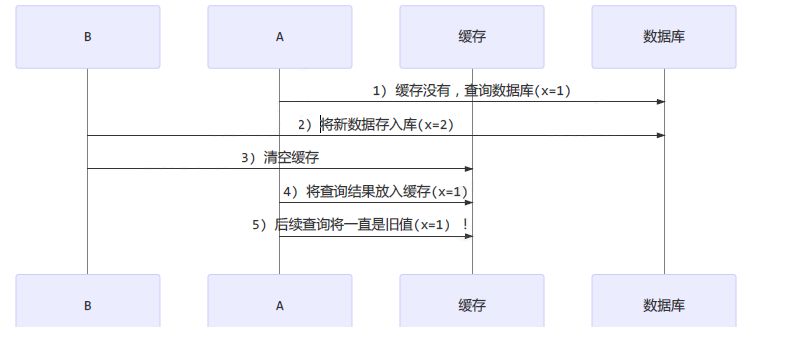

可以使用读写锁进行操作


***


#### 实现原理

##### 成员属性

读写锁用的是同一个 Sycn 同步器，因此等待队列、state 等也是同一个，原理与 ReentrantLock 加锁相比没有特殊之处，不同是**写锁状态占了 state 的低 16 位，而读锁使用的是 state 的高 16 位**

* 读写锁：

  ```java
  private final ReentrantReadWriteLock.ReadLock readerLock;		
  private final ReentrantReadWriteLock.WriteLock writerLock;
  ```

* 构造方法：默认是非公平锁，可以指定参数创建公平锁

  ```java
  public ReentrantReadWriteLock(boolean fair) {
      // true 为公平锁
      sync = fair ? new FairSync() : new NonfairSync();
      // 这两个 lock 共享同一个 sync 实例，都是由 ReentrantReadWriteLock 的 sync 提供同步实现
      readerLock = new ReadLock(this);
      writerLock = new WriteLock(this);
  }
  ```

Sync 类的属性：

* 统计变量：

  ```java
  // 用来移位
  static final int SHARED_SHIFT   = 16;
  // 高16位的1
  static final int SHARED_UNIT    = (1 << SHARED_SHIFT);
  // 65535，16个1，代表写锁的最大重入次数
  static final int MAX_COUNT      = (1 << SHARED_SHIFT) - 1;
  // 低16位掩码：0b 1111 1111 1111 1111，用来获取写锁重入的次数
  static final int EXCLUSIVE_MASK = (1 << SHARED_SHIFT) - 1;
  ```

* 获取读写锁的次数：

  ```java
  // 获取读写锁的读锁分配的总次数
  static int sharedCount(int c)    { return c >>> SHARED_SHIFT; }
  // 写锁（独占）锁的重入次数
  static int exclusiveCount(int c) { return c & EXCLUSIVE_MASK; }
  ```

* 内部类：

  ```java
  // 记录读锁线程自己的持有读锁的数量（重入次数），因为 state 高16位记录的是全局范围内所有的读线程获取读锁的总量
  static final class HoldCounter {
      int count = 0;
      // Use id, not reference, to avoid garbage retention
      final long tid = getThreadId(Thread.currentThread());
  }
  // 线程安全的存放线程各自的 HoldCounter 对象
  static final class ThreadLocalHoldCounter extends ThreadLocal<HoldCounter> {
      public HoldCounter initialValue() {
          return new HoldCounter();
      }
  }
  ```

* 内部类实例：

  ```java
  // 当前线程持有的可重入读锁的数量，计数为 0 时删除
  private transient ThreadLocalHoldCounter readHolds;
  // 记录最后一个获取【读锁】线程的 HoldCounter 对象
  private transient HoldCounter cachedHoldCounter;
  ```

* 首次获取锁：

  ```java
  // 第一个获取读锁的线程
  private transient Thread firstReader = null;
  // 记录该线程持有的读锁次数（读锁重入次数）
  private transient int firstReaderHoldCount;
  ```

* Sync 构造方法：

  ```java
  Sync() {
      readHolds = new ThreadLocalHoldCounter();
      // 确保其他线程的数据可见性，state 是 volatile 修饰的变量，重写该值会将线程本地缓存数据【同步至主存】
      setState(getState()); 
  }
  ```


***


##### 加锁原理

* t1 线程：w.lock（**写锁**），成功上锁 state = 0_1

  ```java
  // lock()  -> sync.acquire(1);
  public void lock() {
      sync.acquire(1);
  }
  public final void acquire(int arg) {
      // 尝试获得写锁，获得写锁失败，将当前线程关联到一个 Node 对象上, 模式为独占模式 
      if (!tryAcquire(arg) && acquireQueued(addWaiter(Node.EXCLUSIVE), arg))
          selfInterrupt();
  }
  ```

  ```java
  protected final boolean tryAcquire(int acquires) {
      Thread current = Thread.currentThread();
      int c = getState();
      // 获得低 16 位, 代表写锁的 state 计数
      int w = exclusiveCount(c);
      // 说明有读锁或者写锁
      if (c != 0) {
          // c != 0 and w == 0 表示有读锁，【读锁不能升级】，直接返回 false
          // w != 0 说明有写锁，写锁的拥有者不是自己，获取失败
          if (w == 0 || current != getExclusiveOwnerThread())
              return false;
          
          // 执行到这里只有一种情况：【写锁重入】，所以下面几行代码不存在并发
          if (w + exclusiveCount(acquires) > MAX_COUNT)
              throw new Error("Maximum lock count exceeded");
          // 写锁重入, 获得锁成功，没有并发，所以不使用 CAS
          setState(c + acquires);
          return true;
      }
      
      // c == 0，说明没有任何锁，判断写锁是否该阻塞，是 false 就尝试获取锁，失败返回 false
      if (writerShouldBlock() || !compareAndSetState(c, c + acquires))
          return false;
      // 获得锁成功，设置锁的持有线程为当前线程
      setExclusiveOwnerThread(current);
      return true;
  }
  // 非公平锁 writerShouldBlock 总是返回 false, 无需阻塞
  final boolean writerShouldBlock() {
      return false; 
  }
  // 公平锁会检查 AQS 队列中是否有前驱节点, 没有(false)才去竞争
  final boolean writerShouldBlock() {
      return hasQueuedPredecessors();
  }
  ```

* t2 r.lock（**读锁**），进入 tryAcquireShared 流程：

  * 返回 -1 表示失败
  * 如果返回 0 表示成功
  * 返回正数表示还有多少后继节点支持共享模式，读写锁返回 1

  ```java
  public void lock() {
      sync.acquireShared(1);
  }
  public final void acquireShared(int arg) {
      // tryAcquireShared 返回负数, 表示获取读锁失败
      if (tryAcquireShared(arg) < 0)
          doAcquireShared(arg);
  }
  ```

  ```java
  // 尝试以共享模式获取
  protected final int tryAcquireShared(int unused) {
      Thread current = Thread.currentThread();
      int c = getState();
      // exclusiveCount(c) 代表低 16 位, 写锁的 state，成立说明有线程持有写锁
      // 写锁的持有者不是当前线程，则获取读锁失败，【写锁允许降级】
      if (exclusiveCount(c) != 0 && getExclusiveOwnerThread() != current)
          return -1;
      
      // 高 16 位，代表读锁的 state，共享锁分配出去的总次数
      int r = sharedCount(c);
      // 读锁是否应该阻塞
      if (!readerShouldBlock() &&	r < MAX_COUNT &&
          compareAndSetState(c, c + SHARED_UNIT)) {	// 尝试增加读锁计数
          // 加锁成功
          // 加锁之前读锁为 0，说明当前线程是第一个读锁线程
          if (r == 0) {
              firstReader = current;
              firstReaderHoldCount = 1;
          // 第一个读锁线程是自己就发生了读锁重入
          } else if (firstReader == current) {
              firstReaderHoldCount++;
          } else {
              // cachedHoldCounter 设置为当前线程的 holdCounter 对象，即最后一个获取读锁的线程
              HoldCounter rh = cachedHoldCounter;
              // 说明还没设置 rh
              if (rh == null || rh.tid != getThreadId(current))
                  // 获取当前线程的锁重入的对象，赋值给 cachedHoldCounter
                  cachedHoldCounter = rh = readHolds.get();
              // 还没重入
              else if (rh.count == 0)
                  readHolds.set(rh);
              // 重入 + 1
              rh.count++;
          }
          // 读锁加锁成功
          return 1;
      }
      // 逻辑到这 应该阻塞，或者 cas 加锁失败
      // 会不断尝试 for (;;) 获取读锁, 执行过程中无阻塞
      return fullTryAcquireShared(current);
  }
  // 非公平锁 readerShouldBlock 偏向写锁一些，看 AQS 阻塞队列中第一个节点是否是写锁，是则阻塞，反之不阻塞
  // 防止一直有读锁线程，导致写锁线程饥饿
  // true 则该阻塞, false 则不阻塞
  final boolean readerShouldBlock() {
      return apparentlyFirstQueuedIsExclusive();
  }
  final boolean readerShouldBlock() {
      return hasQueuedPredecessors();
  }
  ```

  ```java
  final int fullTryAcquireShared(Thread current) {
      // 当前读锁线程持有的读锁次数对象
      HoldCounter rh = null;
      for (;;) {
          int c = getState();
          // 说明有线程持有写锁
          if (exclusiveCount(c) != 0) {
              // 写锁不是自己则获取锁失败
              if (getExclusiveOwnerThread() != current)
                  return -1;
          } else if (readerShouldBlock()) {
              // 条件成立说明当前线程是 firstReader，当前锁是读忙碌状态，而且当前线程也是读锁重入
              if (firstReader == current) {
                  // assert firstReaderHoldCount > 0;
              } else {
                  if (rh == null) {
                      // 最后一个读锁的 HoldCounter
                      rh = cachedHoldCounter;
                      // 说明当前线程也不是最后一个读锁
                      if (rh == null || rh.tid != getThreadId(current)) {
                          // 获取当前线程的 HoldCounter
                          rh = readHolds.get();
                          // 条件成立说明 HoldCounter 对象是上一步代码新建的
                          // 当前线程不是锁重入，在 readerShouldBlock() 返回 true 时需要去排队
                          if (rh.count == 0)
                              // 防止内存泄漏
                              readHolds.remove();
                      }
                  }
                  if (rh.count == 0)
                      return -1;
              }
          }
          // 越界判断
          if (sharedCount(c) == MAX_COUNT)
              throw new Error("Maximum lock count exceeded");
          // 读锁加锁，条件内的逻辑与 tryAcquireShared 相同
          if (compareAndSetState(c, c + SHARED_UNIT)) {
              if (sharedCount(c) == 0) {
                  firstReader = current;
                  firstReaderHoldCount = 1;
              } else if (firstReader == current) {
                  firstReaderHoldCount++;
              } else {
                  if (rh == null)
                      rh = cachedHoldCounter;
                  if (rh == null || rh.tid != getThreadId(current))
                      rh = readHolds.get();
                  else if (rh.count == 0)
                      readHolds.set(rh);
                  rh.count++;
                  cachedHoldCounter = rh; // cache for release
              }
              return 1;
          }
      }
  }
  ```

* 获取读锁失败，进入 sync.doAcquireShared(1) 流程开始阻塞，首先也是调用 addWaiter 添加节点，不同之处在于节点被设置为 Node.SHARED 模式而非 Node.EXCLUSIVE 模式，注意此时 t2 仍处于活跃状态

  ```java
  private void doAcquireShared(int arg) {
      // 将当前线程关联到一个 Node 对象上, 模式为共享模式
      final Node node = addWaiter(Node.SHARED);
      boolean failed = true;
      try {
          boolean interrupted = false;
          for (;;) {
              // 获取前驱节点
              final Node p = node.predecessor();
              // 如果前驱节点就头节点就去尝试获取锁
              if (p == head) {
                  // 再一次尝试获取读锁
                  int r = tryAcquireShared(arg);
                  // r >= 0 表示获取成功
                  if (r >= 0) {
                      //【这里会设置自己为头节点，唤醒相连的后序的共享节点】
                      setHeadAndPropagate(node, r);
                      p.next = null; // help GC
                      if (interrupted)
                          selfInterrupt();
                      failed = false;
                      return;
                  }
              }
              // 是否在获取读锁失败时阻塞      					 park 当前线程
              if (shouldParkAfterFailedAcquire(p, node) && parkAndCheckInterrupt())
                  interrupted = true;
          }
      } finally {
          if (failed)
              cancelAcquire(node);
      }
  }
  ```

  如果没有成功，在 doAcquireShared 内 for (;;) 循环一次，shouldParkAfterFailedAcquire 内把前驱节点的 waitStatus 改为 -1，再 for (;;) 循环一次尝试 tryAcquireShared，不成功在 parkAndCheckInterrupt() 处 park

  

* 这种状态下，假设又有 t3 r.lock，t4 w.lock，这期间 t1 仍然持有锁，就变成了下面的样子

  


***


##### 解锁原理

* t1 w.unlock， 写锁解锁

  ```java
  public void unlock() {
      // 释放锁
      sync.release(1);
  }
  public final boolean release(int arg) {
      // 尝试释放锁
      if (tryRelease(arg)) {
          Node h = head;
          // 头节点不为空并且不是等待状态不是 0，唤醒后继的非取消节点
          if (h != null && h.waitStatus != 0)
              unparkSuccessor(h);
          return true;
      }
      return false;
  }
  protected final boolean tryRelease(int releases) {
      if (!isHeldExclusively())
          throw new IllegalMonitorStateException();
      int nextc = getState() - releases;
      // 因为可重入的原因, 写锁计数为 0, 才算释放成功
      boolean free = exclusiveCount(nextc) == 0;
      if (free)
          setExclusiveOwnerThread(null);
      setState(nextc);
      return free;
  }
  ```

* 唤醒流程 sync.unparkSuccessor，这时 t2 在 doAcquireShared 的 parkAndCheckInterrupt() 处恢复运行，继续循环，执行 tryAcquireShared 成功则让读锁计数加一

* 接下来 t2 调用 setHeadAndPropagate(node, 1)，它原本所在节点被置为头节点；还会检查下一个节点是否是 shared，如果是则调用 doReleaseShared() 将 head 的状态从 -1 改为 0 并唤醒下一个节点，这时 t3 在 doAcquireShared 内 parkAndCheckInterrupt() 处恢复运行，**唤醒连续的所有的共享节点**

  ```java
  private void setHeadAndPropagate(Node node, int propagate) {
      Node h = head; 
      // 设置自己为 head 节点
      setHead(node);
      // propagate 表示有共享资源（例如共享读锁或信号量），为 0 就没有资源
      if (propagate > 0 || h == null || h.waitStatus < 0 ||
          (h = head) == null || h.waitStatus < 0) {
          // 获取下一个节点
          Node s = node.next;
          // 如果当前是最后一个节点，或者下一个节点是【等待共享读锁的节点】
          if (s == null || s.isShared())
              // 唤醒后继节点
              doReleaseShared();
      }
  }
  ```

  ```java
  private void doReleaseShared() {
      // 如果 head.waitStatus == Node.SIGNAL ==> 0 成功, 下一个节点 unpark
  	// 如果 head.waitStatus == 0 ==> Node.PROPAGATE
      for (;;) {
          Node h = head;
          if (h != null && h != tail) {
              int ws = h.waitStatus;
              // SIGNAL 唤醒后继
              if (ws == Node.SIGNAL) {
                  // 因为读锁共享，如果其它线程也在释放读锁，那么需要将 waitStatus 先改为 0
              	// 防止 unparkSuccessor 被多次执行
                  if (!compareAndSetWaitStatus(h, Node.SIGNAL, 0))
                      continue;  
                  // 唤醒后继节点
                  unparkSuccessor(h);
              }
              // 如果已经是 0 了，改为 -3，用来解决传播性
              else if (ws == 0 && !compareAndSetWaitStatus(h, 0, Node.PROPAGATE))
                  continue;                
          }
          // 条件不成立说明被唤醒的节点非常积极，直接将自己设置为了新的 head，
          // 此时唤醒它的节点（前驱）执行 h == head 不成立，所以不会跳出循环，会继续唤醒新的 head 节点的后继节点
          if (h == head)                   
              break;
      }
  }
  ```

  

* 下一个节点不是 shared 了，因此不会继续唤醒 t4 所在节点

* t2 读锁解锁，进入 sync.releaseShared(1) 中，调用 tryReleaseShared(1) 让计数减一，但计数还不为零，t3 同样让计数减一，计数为零，进入doReleaseShared() 将头节点从 -1 改为 0 并唤醒下一个节点

  ```java
  public void unlock() {
      sync.releaseShared(1);
  }
  public final boolean releaseShared(int arg) {
      if (tryReleaseShared(arg)) {
          doReleaseShared();
          return true;
      }
      return false;
  }
  ```

  ```java
  protected final boolean tryReleaseShared(int unused) {
  
      for (;;) {
          int c = getState();
          int nextc = c - SHARED_UNIT;
          // 读锁的计数不会影响其它获取读锁线程, 但会影响其它获取写锁线程，计数为 0 才是真正释放
          if (compareAndSetState(c, nextc))
              // 返回是否已经完全释放了 
              return nextc == 0;
      }
  }
  ```

* t4 在 acquireQueued 中 parkAndCheckInterrupt 处恢复运行，再次 for (;;) 这次自己是头节点的临节点，并且没有其他节点竞争，tryAcquire(1) 成功，修改头结点，流程结束

  


***


#### Stamped

StampedLock：读写锁，该类自 JDK 8 加入，是为了进一步优化读性能

特点：

* 在使用读锁、写锁时都必须配合戳使用

* StampedLock 不支持条件变量
* StampedLock **不支持可重入**

基本用法

* 加解读锁：

  ```java
  long stamp = lock.readLock();
  lock.unlockRead(stamp);			// 类似于 unpark，解指定的锁
  ```

* 加解写锁：

  ```java
  long stamp = lock.writeLock();
  lock.unlockWrite(stamp);
  ```

* 乐观读，StampedLock 支持 `tryOptimisticRead()` 方法，读取完毕后做一次**戳校验**，如果校验通过，表示这期间没有其他线程的写操作，数据可以安全使用，如果校验没通过，需要重新获取读锁，保证数据一致性

  ```java
  long stamp = lock.tryOptimisticRead();
  // 验戳
  if(!lock.validate(stamp)){
  	// 锁升级
  }
  ```

提供一个数据容器类内部分别使用读锁保护数据的 read() 方法，写锁保护数据的 write() 方法：

* 读-读可以优化
* 读-写优化读，补加读锁

```java
public static void main(String[] args) throws InterruptedException {
    DataContainerStamped dataContainer = new DataContainerStamped(1);
    new Thread(() -> {
    	dataContainer.read(1000);
    },"t1").start();
    Thread.sleep(500);
    
    new Thread(() -> {
        dataContainer.write(1000);
    },"t2").start();
}

class DataContainerStamped {
    private int data;
    private final StampedLock lock = new StampedLock();

    public int read(int readTime) throws InterruptedException {
        long stamp = lock.tryOptimisticRead();
        System.out.println(new Date() + " optimistic read locking" + stamp);
        Thread.sleep(readTime);
        // 戳有效，直接返回数据
        if (lock.validate(stamp)) {
            Sout(new Date() + " optimistic read finish..." + stamp);
            return data;
        }

        // 说明其他线程更改了戳，需要锁升级了，从乐观读升级到读锁
        System.out.println(new Date() + " updating to read lock" + stamp);
        try {
            stamp = lock.readLock();
            System.out.println(new Date() + " read lock" + stamp);
            Thread.sleep(readTime);
            System.out.println(new Date() + " read finish..." + stamp);
            return data;
        } finally {
            System.out.println(new Date() + " read unlock " +  stamp);
            lock.unlockRead(stamp);
        }
    }

    public void write(int newData) {
        long stamp = lock.writeLock();
        System.out.println(new Date() + " write lock " + stamp);
        try {
            Thread.sleep(2000);
            this.data = newData;
        } catch (InterruptedException e) {
            e.printStackTrace();
        } finally {
            System.out.println(new Date() + " write unlock " + stamp);
            lock.unlockWrite(stamp);
        }
    }
}
```


***


### CountDown

#### 基本使用

CountDownLatch：计数器，用来进行线程同步协作，**等待所有线程完成**

构造器：

* `public CountDownLatch(int count)`：初始化唤醒需要的 down 几步

常用API：

* `public void await() `：让当前线程等待，必须 down 完初始化的数字才可以被唤醒，否则进入无限等待
* `public void countDown()`：计数器进行减1（down 1）

应用：同步等待多个 Rest 远程调用结束

```java
// LOL 10人进入游戏倒计时
public static void main(String[] args) throws InterruptedException {
    CountDownLatch latch = new CountDownLatch(10);
    ExecutorService service = Executors.newFixedThreadPool(10);
    String[] all = new String[10];
    Random random = new Random();

    for (int j = 0; j < 10; j++) {
        int finalJ = j;//常量
        service.submit(() -> {
            for (int i = 0; i <= 100; i++) {
                Thread.sleep(random.nextInt(100));	//随机休眠
                all[finalJ] = i + "%";
                System.out.print("\r" + Arrays.toString(all));	// \r代表覆盖
            }
            latch.countDown();
        });
    }
    latch.await();
    System.out.println("\n游戏开始");
    service.shutdown();
}
/*
[100%, 100%, 100%, 100%, 100%, 100%, 100%, 100%, 100%, 100%]
游戏开始
```


***


#### 实现原理

阻塞等待：

* 线程调用 await() 等待其他线程完成任务：支持打断

  ```java
  public void await() throws InterruptedException {
      sync.acquireSharedInterruptibly(1);
  }
  // AbstractQueuedSynchronizer#acquireSharedInterruptibly
  public final void acquireSharedInterruptibly(int arg) throws InterruptedException {
      // 判断线程是否被打断，抛出打断异常
      if (Thread.interrupted())
          throw new InterruptedException();
      // 尝试获取共享锁，条件成立说明 state > 0，此时线程入队阻塞等待，等待其他线程获取共享资源
      // 条件不成立说明 state = 0，此时不需要阻塞线程，直接结束函数调用
      if (tryAcquireShared(arg) < 0)
          doAcquireSharedInterruptibly(arg);
  }
  // CountDownLatch.Sync#tryAcquireShared
  protected int tryAcquireShared(int acquires) {
      return (getState() == 0) ? 1 : -1;
  }
  ```

* 线程进入 AbstractQueuedSynchronizer#doAcquireSharedInterruptibly 函数阻塞挂起，等待 latch 变为 0：

  ```java
  private void doAcquireSharedInterruptibly(int arg) throws InterruptedException {
      // 将调用latch.await()方法的线程 包装成 SHARED 类型的 node 加入到 AQS 的阻塞队列中
      final Node node = addWaiter(Node.SHARED);
      boolean failed = true;
      try {
          for (;;) {
              // 获取当前节点的前驱节点
              final Node p = node.predecessor();
              // 前驱节点时头节点就可以尝试获取锁
              if (p == head) {
                  // 再次尝试获取锁，获取成功返回 1
                  int r = tryAcquireShared(arg);
                  if (r >= 0) {
                      // 获取锁成功，设置当前节点为 head 节点，并且向后传播
                      setHeadAndPropagate(node, r);
                      p.next = null; // help GC
                      failed = false;
                      return;
                  }
              }
              // 阻塞在这里
              if (shouldParkAfterFailedAcquire(p, node) && parkAndCheckInterrupt())
                  throw new InterruptedException();
          }
      } finally {
          // 阻塞线程被中断后抛出异常，进入取消节点的逻辑
          if (failed)
              cancelAcquire(node);
      }
  }
  ```

* 获取共享锁成功，进入唤醒阻塞队列中与头节点相连的 SHARED 模式的节点：

  ```java
  private void setHeadAndPropagate(Node node, int propagate) {
      Node h = head;
      // 将当前节点设置为新的 head 节点，前驱节点和持有线程置为 null
      setHead(node);
  	// propagate = 1，条件一成立
      if (propagate > 0 || h == null || h.waitStatus < 0 || (h = head) == null || h.waitStatus < 0) {
          // 获取当前节点的后继节点
          Node s = node.next;
          // 当前节点是尾节点时 next 为 null，或者后继节点是 SHARED 共享模式
          if (s == null || s.isShared())
              // 唤醒所有的等待共享锁的节点
              doReleaseShared();
      }
  }
  ```

  

计数减一：

* 线程进入 countDown() 完成计数器减一（释放锁）的操作

  ```java
  public void countDown() {
      sync.releaseShared(1);
  }
  public final boolean releaseShared(int arg) {
      // 尝试释放共享锁
      if (tryReleaseShared(arg)) {
          // 释放锁成功开始唤醒阻塞节点
          doReleaseShared();
          return true;
      }
      return false;
  }
  ```

* 更新 state 值，每调用一次，state 值减一，当 state -1 正好为 0 时，返回 true

  ```java
  protected boolean tryReleaseShared(int releases) {
      for (;;) {
          int c = getState();
          // 条件成立说明前面【已经有线程触发唤醒操作】了，这里返回 false
          if (c == 0)
              return false;
          // 计数器减一
          int nextc = c-1;
          if (compareAndSetState(c, nextc))
              // 计数器为 0 时返回 true
              return nextc == 0;
      }
  }
  ```

* state = 0 时，当前线程需要执行**唤醒阻塞节点的任务**

  ```java
  private void doReleaseShared() {
      for (;;) {
          Node h = head;
          // 判断队列是否是空队列
          if (h != null && h != tail) {
              int ws = h.waitStatus;
              // 头节点的状态为 signal，说明后继节点没有被唤醒过
              if (ws == Node.SIGNAL) {
                  // cas 设置头节点的状态为 0，设置失败继续自旋
                  if (!compareAndSetWaitStatus(h, Node.SIGNAL, 0))
                      continue;
                  // 唤醒后继节点
                  unparkSuccessor(h);
              }
              // 如果有其他线程已经设置了头节点的状态，重新设置为 PROPAGATE 传播属性
              else if (ws == 0 && !compareAndSetWaitStatus(h, 0, Node.PROPAGATE))
                  continue;
          }
          // 条件不成立说明被唤醒的节点非常积极，直接将自己设置为了新的head，
          // 此时唤醒它的节点（前驱）执行 h == head 不成立，所以不会跳出循环，会继续唤醒新的 head 节点的后继节点
          if (h == head)
              break;
      }
  }
  ```

  


***


### CyclicBarrier

#### 基本使用

CyclicBarrier：循环屏障，用来进行线程协作，等待线程满足某个计数，才能触发自己执行

常用方法：

* `public CyclicBarrier(int parties, Runnable barrierAction)`：用于在线程到达屏障 parties 时，执行 barrierAction
  * parties：代表多少个线程到达屏障开始触发线程任务
  * barrierAction：线程任务
* `public int await()`：线程调用 await 方法通知 CyclicBarrier 本线程已经到达屏障

与 CountDownLatch 的区别：CyclicBarrier 是可以重用的

应用：可以实现多线程中，某个任务在等待其他线程执行完毕以后触发

```java
public static void main(String[] args) {
    ExecutorService service = Executors.newFixedThreadPool(2);
    CyclicBarrier barrier = new CyclicBarrier(2, () -> {
        System.out.println("task1 task2 finish...");
    });

    for (int i = 0; i < 3; i++) { // 循环重用
        service.submit(() -> {
            System.out.println("task1 begin...");
            try {
                Thread.sleep(1000);
                barrier.await();    // 2 - 1 = 1
            } catch (InterruptedException | BrokenBarrierException e) {
                e.printStackTrace();
            }
        });

        service.submit(() -> {
            System.out.println("task2 begin...");
            try {
                Thread.sleep(2000);
                barrier.await();    // 1 - 1 = 0
            } catch (InterruptedException | BrokenBarrierException e) {
                e.printStackTrace();
            }
        });
    }
    service.shutdown();
}
```


***


#### 实现原理

##### 成员属性

* 全局锁：利用可重入锁实现的工具类

  ```java
  // barrier 实现是依赖于Condition条件队列，condition 条件队列必须依赖lock才能使用
  private final ReentrantLock lock = new ReentrantLock();
  // 线程挂起实现使用的 condition 队列，当前代所有线程到位，这个条件队列内的线程才会被唤醒
  private final Condition trip = lock.newCondition();
  ```

* 线程数量：

  ```java
  private final int parties;	// 代表多少个线程到达屏障开始触发线程任务
  private int count;			// 表示当前“代”还有多少个线程未到位，初始值为 parties
  ```

* 当前代中最后一个线程到位后要执行的事件：

  ```java
  private final Runnable barrierCommand;
  ```

* 代：

  ```java
  // 表示 barrier 对象当前 代
  private Generation generation = new Generation();
  private static class Generation {
      // 表示当前“代”是否被打破，如果被打破再来到这一代的线程 就会直接抛出 BrokenException 异常
      // 且在这一代挂起的线程都会被唤醒，然后抛出 BrokerException 异常。
      boolean broken = false;
  }
  ```

* 构造方法：

  ```java
  public CyclicBarrie(int parties, Runnable barrierAction) {
      // 因为小于等于 0 的 barrier 没有任何意义
      if (parties <= 0) throw new IllegalArgumentException();
  
      this.parties = parties;
      this.count = parties;
      // 可以为 null
      this.barrierCommand = barrierAction;
  }
  ```


***


##### 成员方法

* await()：阻塞等待所有线程到位

  ```java
  public int await() throws InterruptedException, BrokenBarrierException {
      try {
          return dowait(false, 0L);
      } catch (TimeoutException toe) {
          throw new Error(toe); // cannot happen
      }
  }
  ```

  ```java
  // timed：表示当前调用await方法的线程是否指定了超时时长，如果 true 表示线程是响应超时的
  // nanos：线程等待超时时长，单位是纳秒
  private int dowait(boolean timed, long nanos) {
      final ReentrantLock lock = this.lock;
      // 加锁
      lock.lock();
      try {
          // 获取当前代
          final Generation g = generation;
  
          // 【如果当前代是已经被打破状态，则当前调用await方法的线程，直接抛出Broken异常】
          if (g.broken)
              throw new BrokenBarrierException();
  		// 如果当前线程被中断了，则打破当前代，然后当前线程抛出中断异常
          if (Thread.interrupted()) {
              // 设置当前代的状态为 broken 状态，唤醒在 trip 条件队列内的线程
              breakBarrier();
              throw new InterruptedException();
          }
  
          // 逻辑到这说明，当前线程中断状态是 false， 当前代的 broken 为 false（未打破状态）
          
          // 假设 parties 给的是 5，那么index对应的值为 4,3,2,1,0
          int index = --count;
          // 条件成立说明当前线程是最后一个到达 barrier 的线程，【需要开启新代，唤醒阻塞线程】
          if (index == 0) {
              // 栅栏任务启动标记
              boolean ranAction = false;
              try {
                  final Runnable command = barrierCommand;
                  if (command != null)
                      // 启动触发的任务
                      command.run();
                  // run()未抛出异常的话，启动标记设置为 true
                  ranAction = true;
                  // 开启新的一代，这里会【唤醒所有的阻塞队列】
                  nextGeneration();
                  // 返回 0 因为当前线程是此代最后一个到达的线程，index == 0
                  return 0;
              } finally {
                  // 如果 command.run() 执行抛出异常的话，会进入到这里
                  if (!ranAction)
                      breakBarrier();
              }
          }
  
          // 自旋，一直到条件满足、当前代被打破、线程被中断，等待超时
          for (;;) {
              try {
                  // 根据是否需要超时等待选择阻塞方法
                  if (!timed)
                      // 当前线程释放掉 lock，进入到 trip 条件队列的尾部挂起自己，等待被唤醒
                      trip.await();
                  else if (nanos > 0L)
                      nanos = trip.awaitNanos(nanos);
              } catch (InterruptedException ie) {
                  // 被中断后来到这里的逻辑
                  
                  // 当前代没有变化并且没有被打破
                  if (g == generation && !g.broken) {
                      // 打破屏障
                      breakBarrier();
                      // node 节点在【条件队列】内收到中断信号时 会抛出中断异常
                      throw ie;
                  } else {
                      // 等待过程中代变化了，完成一次自我打断
                      Thread.currentThread().interrupt();
                  }
              }
  			// 唤醒后的线程，【判断当前代已经被打破，线程唤醒后依次抛出 BrokenBarrier 异常】
              if (g.broken)
                  throw new BrokenBarrierException();
  
              // 当前线程挂起期间，最后一个线程到位了，然后触发了开启新的一代的逻辑
              if (g != generation)
                  return index;
  			// 当前线程 trip 中等待超时，然后主动转移到阻塞队列
              if (timed && nanos <= 0L) {
                  breakBarrier();
                  // 抛出超时异常
                  throw new TimeoutException();
              }
          }
      } finally {
          // 解锁
          lock.unlock();
      }
  }
  ```

* breakBarrier()：打破 Barrier 屏障

  ```java
  private void breakBarrier() {
      // 将代中的 broken 设置为 true，表示这一代是被打破了，再来到这一代的线程，直接抛出异常
      generation.broken = true;
      // 重置 count 为 parties
      count = parties;
      // 将在trip条件队列内挂起的线程全部唤醒，唤醒后的线程会检查当前是否是打破的，然后抛出异常
      trip.signalAll();
  }
  ```

* nextGeneration()：开启新的下一代 

  ```java
  private void nextGeneration() {
      // 将在 trip 条件队列内挂起的线程全部唤醒
      trip.signalAll();
      // 重置 count 为 parties
      count = parties;
  
      // 开启新的一代，使用一个新的generation对象，表示新的一代，新的一代和上一代【没有任何关系】
      generation = new Generation();
  }
  ```

  

参考视频：https://space.bilibili.com/457326371/


****


### Semaphore

#### 基本使用

synchronized 可以起到锁的作用，但某个时间段内，只能有一个线程允许执行

Semaphore（信号量）用来限制能同时访问共享资源的线程上限，非重入锁

构造方法：

* `public Semaphore(int permits)`：permits 表示许可线程的数量（state）
* `public Semaphore(int permits, boolean fair)`：fair 表示公平性，如果这个设为 true 的话，下次执行的线程会是等待最久的线程

常用API：

* `public void acquire()`：表示获取许可
* `public void release()`：表示释放许可，acquire() 和 release() 方法之间的代码为同步代码

```java
public static void main(String[] args) {
    // 1.创建Semaphore对象
    Semaphore semaphore = new Semaphore(3);

    // 2. 10个线程同时运行
    for (int i = 0; i < 10; i++) {
        new Thread(() -> {
            try {
                // 3. 获取许可
                semaphore.acquire();
                sout(Thread.currentThread().getName() + " running...");
                Thread.sleep(1000);
                sout(Thread.currentThread().getName() + " end...");
            } catch (InterruptedException e) {
                e.printStackTrace();
            } finally {
                // 4. 释放许可
                semaphore.release();
            }
        }).start();
    }
}
```


***


#### 实现原理

加锁流程：

* Semaphore 的 permits（state）为 3，这时 5 个线程来获取资源

  ```java
  Sync(int permits) {
      setState(permits);
  }
  ```

  假设其中 Thread-1，Thread-2，Thread-4 CAS 竞争成功，permits 变为 0，而 Thread-0 和 Thread-3 竞争失败，进入 AQS 队列park 阻塞

  ```java
  // acquire() -> sync.acquireSharedInterruptibly(1)，可中断
  public final void acquireSharedInterruptibly(int arg) {
      if (Thread.interrupted())
          throw new InterruptedException();
      // 尝试获取通行证，获取成功返回 >= 0的值
      if (tryAcquireShared(arg) < 0)
          // 获取许可证失败，进入阻塞
          doAcquireSharedInterruptibly(arg);
  }
  
  // tryAcquireShared() -> nonfairTryAcquireShared()
  // 非公平，公平锁会在循环内 hasQueuedPredecessors()方法判断阻塞队列是否有临头节点(第二个节点)
  final int nonfairTryAcquireShared(int acquires) {
      for (;;) {
          // 获取 state ，state 这里【表示通行证】
          int available = getState();
          // 计算当前线程获取通行证完成之后，通行证还剩余数量
          int remaining = available - acquires;
          // 如果许可已经用完, 返回负数, 表示获取失败,
          if (remaining < 0 ||
              // 许可证足够分配的，如果 cas 重试成功, 返回正数, 表示获取成功
              compareAndSetState(available, remaining))
              return remaining;
      }
  }
  ```

  ```java
  private void doAcquireSharedInterruptibly(int arg) {
      // 将调用 Semaphore.aquire 方法的线程，包装成 node 加入到 AQS 的阻塞队列中
      final Node node = addWaiter(Node.SHARED);
      // 获取标记
      boolean failed = true;
      try {
          for (;;) {
              final Node p = node.predecessor();
              // 前驱节点是头节点可以再次获取许可
              if (p == head) {
                  // 再次尝试获取许可，【返回剩余的许可证数量】
                  int r = tryAcquireShared(arg);
                  if (r >= 0) {
                      // 成功后本线程出队（AQS）, 所在 Node设置为 head
                      // r 表示【可用资源数】, 为 0 则不会继续传播
                      setHeadAndPropagate(node, r); 
                      p.next = null; // help GC
                      failed = false;
                      return;
                  }
              }
              // 不成功, 设置上一个节点 waitStatus = Node.SIGNAL, 下轮进入 park 阻塞
              if (shouldParkAfterFailedAcquire(p, node) && parkAndCheckInterrupt())
                  throw new InterruptedException();
          }
      } finally {
          // 被打断后进入该逻辑
          if (failed)
              cancelAcquire(node);
      }
  }
  ```

  ```java
  private void setHeadAndPropagate(Node node, int propagate) {    
      Node h = head;
      // 设置自己为 head 节点
      setHead(node);
      // propagate 表示有【共享资源】（例如共享读锁或信号量）
      // head waitStatus == Node.SIGNAL 或 Node.PROPAGATE，doReleaseShared 函数中设置的
      if (propagate > 0 || h == null || h.waitStatus < 0 ||
          (h = head) == null || h.waitStatus < 0) {
          Node s = node.next;
          // 如果是最后一个节点或者是等待共享读锁的节点，做一次唤醒
          if (s == null || s.isShared())
              doReleaseShared();
      }
  }
  ```

  

* 这时 Thread-4 释放了 permits，状态如下

  ```java
  // release() -> releaseShared()
  public final boolean releaseShared(int arg) {
      // 尝试释放锁
      if (tryReleaseShared(arg)) {
          doReleaseShared();
          return true;
      }    
      return false;
  }
  protected final boolean tryReleaseShared(int releases) {    
      for (;;) {
          // 获取当前锁资源的可用许可证数量
          int current = getState();
          int next = current + releases;
          // 索引越界判断
          if (next < current)            
              throw new Error("Maximum permit count exceeded");        
          // 释放锁
          if (compareAndSetState(current, next))            
              return true;    
      }
  }
  private void doReleaseShared() {    
      // PROPAGATE 详解    
      // 如果 head.waitStatus == Node.SIGNAL ==> 0 成功, 下一个节点 unpark	
      // 如果 head.waitStatus == 0 ==> Node.PROPAGATE
  }
  ```

  

* 接下来 Thread-0 竞争成功，permits 再次设置为 0，设置自己为 head 节点，并且 unpark 接下来的共享状态的 Thread-3 节点，但由于 permits 是 0，因此 Thread-3 在尝试不成功后再次进入 park 状态


****


#### PROPAGATE

假设存在某次循环中队列里排队的结点情况为 `head(-1) → t1(-1) → t2(0)`，存在将要释放信号量的 T3 和 T4，释放顺序为先 T3 后 T4

```java
// 老版本代码
private void setHeadAndPropagate(Node node, int propagate) {    
    setHead(node);    
    // 有空闲资源    
    if (propagate > 0 && node.waitStatus != 0) {    	
        Node s = node.next;        
        // 下一个        
        if (s == null || s.isShared())            
            unparkSuccessor(node);        
    }
}
```

正常流程：

* T3 调用 releaseShared(1)，直接调用了 unparkSuccessor(head)，head.waitStatus 从 -1 变为 0
* T1 由于 T3 释放信号量被唤醒，然后 T4 释放，唤醒 T2

BUG 流程：

* T3 调用 releaseShared(1)，直接调用了 unparkSuccessor(head)，head.waitStatus 从 -1 变为 0
* T1 由于 T3 释放信号量被唤醒，调用 tryAcquireShared，返回值为 0（获取锁成功，但没有剩余资源量）
* T1 还没调用 setHeadAndPropagate 方法，T4 调用 releaseShared(1)，此时 head.waitStatus 为 0（此时读到的 head 和 1 中为同一个 head），不满足条件，因此不调用 unparkSuccessor(head)
* T1 获取信号量成功，调用 setHeadAndPropagate(t1.node, 0) 时，因为不满足 propagate > 0（剩余资源量 == 0），从而不会唤醒后继结点， **T2 线程得不到唤醒**


更新后流程：

* T3 调用 releaseShared(1)，直接调用了 unparkSuccessor(head)，head.waitStatus 从 -1 变为 0
* T1 由于 T3 释放信号量被唤醒，调用 tryAcquireShared，返回值为 0（获取锁成功，但没有剩余资源量）

* T1 还没调用 setHeadAndPropagate 方法，T4 调用 releaseShared()，此时 head.waitStatus 为 0（此时读到的 head 和 1 中为同一个 head），调用 doReleaseShared() 将等待状态置为 **PROPAGATE（-3）**
* T1 获取信号量成功，调用 setHeadAndPropagate 时，读到 h.waitStatus < 0，从而调用 doReleaseShared() 唤醒 T2

```java
private void setHeadAndPropagate(Node node, int propagate) {    
    Node h = head;
    // 设置自己为 head 节点
    setHead(node);
    // propagate 表示有共享资源（例如共享读锁或信号量）
    // head waitStatus == Node.SIGNAL 或 Node.PROPAGATE
    if (propagate > 0 || h == null || h.waitStatus < 0 ||
        (h = head) == null || h.waitStatus < 0) {
        Node s = node.next;
        // 如果是最后一个节点或者是等待共享读锁的节点，做一次唤醒
        if (s == null || s.isShared())
            doReleaseShared();
    }
}
```

```java
// 唤醒
private void doReleaseShared() {
    // 如果 head.waitStatus == Node.SIGNAL ==> 0 成功, 下一个节点 unpark	
    // 如果 head.waitStatus == 0 ==> Node.PROPAGATE    
    for (;;) {
        Node h = head;
        if (h != null && h != tail) {
            int ws = h.waitStatus;
            if (ws == Node.SIGNAL) {
                // 防止 unparkSuccessor 被多次执行
                if (!compareAndSetWaitStatus(h, Node.SIGNAL, 0))
                    continue;
                // 唤醒后继节点
                unparkSuccessor(h);
            }
            // 如果已经是 0 了，改为 -3，用来解决传播性
            else if (ws == 0 && !compareAndSetWaitStatus(h, 0, Node.PROPAGATE))
                continue;
        }
        if (h == head)
            break;
    }
}
```


***


### Exchanger

Exchanger：交换器，是一个用于线程间协作的工具类，用于进行线程间的数据交换

工作流程：两个线程通过 exchange 方法交换数据，如果第一个线程先执行 exchange() 方法，它会一直等待第二个线程也执行 exchange 方法，当两个线程都到达同步点时，这两个线程就可以交换数据

常用方法：

* `public Exchanger()`：创建一个新的交换器
* `public V exchange(V x)`：等待另一个线程到达此交换点
* `public V exchange(V x, long timeout, TimeUnit unit)`：等待一定的时间

```java
public class ExchangerDemo {
    public static void main(String[] args) {
        // 创建交换对象（信使）
        Exchanger<String> exchanger = new Exchanger<>();
        new ThreadA(exchanger).start();
        new ThreadA(exchanger).start();
    } 
}
class ThreadA extends Thread{
    private Exchanger<String> exchanger();
    
    public ThreadA(Exchanger<String> exchanger){
        this.exchanger = exchanger;
    }
    
    @Override
    public void run() {
        try{
            sout("线程A，做好了礼物A，等待线程B送来的礼物B");
            //如果等待了5s还没有交换就死亡（抛出异常）！
            String s = exchanger.exchange("礼物A",5,TimeUnit.SECONDS);
            sout("线程A收到线程B的礼物：" + s);
        } catch (Exception e) {
            System.out.println("线程A等待了5s，没有收到礼物,最终就执行结束了!");
        }
    }
}
class ThreadB extends Thread{
    private Exchanger<String> exchanger;
    
    public ThreadB(Exchanger<String> exchanger) {
        this.exchanger = exchanger;
    }
    
    @Override
    public void run() {
        try {
            sout("线程B,做好了礼物B,等待线程A送来的礼物A.....");
            // 开始交换礼物。参数是送给其他线程的礼物!
            sout("线程B收到线程A的礼物：" + exchanger.exchange("礼物B"));
        } catch (Exception e) {
            e.printStackTrace();
        }
    }
}
```


***


## 并发包

### ConHashMap

#### 并发集合

##### 集合对比

三种集合：

* HashMap 是线程不安全的，性能好
* Hashtable 线程安全基于 synchronized，综合性能差，已经被淘汰
* ConcurrentHashMap 保证了线程安全，综合性能较好，不止线程安全，而且效率高，性能好

集合对比：

1. Hashtable 继承 Dictionary 类，HashMap、ConcurrentHashMap 继承 AbstractMap，均实现 Map 接口
2. Hashtable 底层是数组 + 链表，JDK8 以后 HashMap 和 ConcurrentHashMap 底层是数组 + 链表 + 红黑树
3. HashMap 线程非安全，Hashtable 线程安全，Hashtable 的方法都加了 synchronized 关来确保线程同步
4. ConcurrentHashMap、Hashtable **不允许 null 值**，HashMap 允许 null 值
5. ConcurrentHashMap、HashMap 的初始容量为 16，Hashtable 初始容量为11，填充因子默认都是 0.75，两种 Map 扩容是当前容量翻倍：capacity * 2，Hashtable 扩容时是容量翻倍 + 1：capacity*2 + 1


工作步骤：

1. 初始化，使用 cas 来保证并发安全，懒惰初始化 table
2. 树化，当 table.length < 64 时，先尝试扩容，超过 64 时，并且 bin.length > 8 时，会将**链表树化**，树化过程会用 synchronized 锁住链表头
3. put，如果该 bin 尚未创建，只需要使用 cas 创建 bin；如果已经有了，锁住链表头进行后续 put 操作，元素添加至 bin 的尾部
4. get，无锁操作仅需要保证可见性，扩容过程中 get 操作拿到的是 ForwardingNode 会让 get 操作在新 table 进行搜索
5. 扩容，扩容时以 bin 为单位进行，需要对 bin 进行 synchronized，但这时其它竞争线程也不是无事可做，它们会帮助把其它 bin 进行扩容
6. size，元素个数保存在 baseCount 中，并发时的个数变动保存在 CounterCell[] 当中，最后统计数量时累加

```java
//需求：多个线程同时往HashMap容器中存入数据会出现安全问题
public class ConcurrentHashMapDemo{
    public static Map<String,String> map = new ConcurrentHashMap();
    
    public static void main(String[] args){
        new AddMapDataThread().start();
        new AddMapDataThread().start();
        
        Thread.sleep(1000 * 5);//休息5秒，确保两个线程执行完毕
        System.out.println("Map大小：" + map.size());//20万
    }
}

public class AddMapDataThread extends Thread{
    @Override
    public void run() {
        for(int i = 0 ; i < 1000000 ; i++ ){
            ConcurrentHashMapDemo.map.put("键："+i , "值"+i);
        }
    }
}
```


****


##### 并发死链

JDK1.7 的 HashMap 采用的头插法（拉链法）进行节点的添加，HashMap 的扩容长度为原来的 2 倍

resize() 中节点（Entry）转移的源代码：

```java
void transfer(Entry[] newTable, boolean rehash) {
    int newCapacity = newTable.length;//得到新数组的长度   
    // 遍历整个数组对应下标下的链表，e代表一个节点
    for (Entry<K,V> e : table) {   
        // 当e == null时，则该链表遍历完了，继续遍历下一数组下标的链表 
        while(null != e) { 
            // 先把e节点的下一节点存起来
            Entry<K,V> next = e.next; 
            if (rehash) {              //得到新的hash值
                e.hash = null == e.key ? 0 : hash(e.key);  
            }
            // 在新数组下得到新的数组下标
            int i = indexFor(e.hash, newCapacity);  
             // 将e的next指针指向新数组下标的位置
            e.next = newTable[i];   
            // 将该数组下标的节点变为e节点
            newTable[i] = e; 
            // 遍历链表的下一节点
            e = next;                                   
        }
    }
}
```

JDK 8 虽然将扩容算法做了调整，改用了尾插法，但仍不意味着能够在多线程环境下能够安全扩容，还会出现其它问题（如扩容丢数据）


B站视频解析：https://www.bilibili.com/video/BV1n541177Ea


***


#### 成员属性

##### 变量

* 存储数组：

  ```java
  transient volatile Node<K,V>[] table;
  ```

* 散列表的长度：

  ```java
  private static final int MAXIMUM_CAPACITY = 1 << 30;	// 最大长度
  private static final int DEFAULT_CAPACITY = 16;			// 默认长度
  ```

* 并发级别，JDK7 遗留下来，1.8 中不代表并发级别：

  ```java
  private static final int DEFAULT_CONCURRENCY_LEVEL = 16;
  ```

* 负载因子，JDK1.8 的 ConcurrentHashMap 中是固定值：

  ```java
  private static final float LOAD_FACTOR = 0.75f;
  ```

* 阈值：

  ```java
  static final int TREEIFY_THRESHOLD = 8;		// 链表树化的阈值
  static final int UNTREEIFY_THRESHOLD = 6;	// 红黑树转化为链表的阈值
  static final int MIN_TREEIFY_CAPACITY = 64;	// 当数组长度达到64且某个桶位中的链表长度超过8，才会真正树化
  ```

* 扩容相关：

  ```java
  private static final int MIN_TRANSFER_STRIDE = 16;	// 线程迁移数据【最小步长】，控制线程迁移任务的最小区间
  private static int RESIZE_STAMP_BITS = 16;			// 用来计算扩容时生成的【标识戳】
  private static final int MAX_RESIZERS = (1 << (32 - RESIZE_STAMP_BITS)) - 1;// 65535-1并发扩容最多线程数
  private static final int RESIZE_STAMP_SHIFT = 32 - RESIZE_STAMP_BITS;		// 扩容时使用
  ```

* 节点哈希值：

  ```java
  static final int MOVED     = -1; 			// 表示当前节点是 FWD 节点
  static final int TREEBIN   = -2; 			// 表示当前节点已经树化，且当前节点为 TreeBin 对象
  static final int RESERVED  = -3; 			// 表示节点时临时节点
  static final int HASH_BITS = 0x7fffffff; 	// 正常节点的哈希值的可用的位数
  ```

* 扩容过程：

  ```java
  // 扩容过程中，会将扩容中的新 table 赋值给 nextTable 保持引用，扩容结束之后，这里会被设置为 null
  private transient volatile Node<K,V>[] nextTable;
  // 记录扩容进度，所有线程都要从 0 - transferIndex 中分配区间任务，简单说就是老表转移到哪了，索引从高到低转移
  private transient volatile int transferIndex;
  ```

* 累加统计：

  ```java
  // LongAdder 中的 baseCount 未发生竞争时或者当前LongAdder处于加锁状态时，增量累到到 baseCount 中
  private transient volatile long baseCount;
  // LongAdder 中的 cellsBuzy，0 表示当前 LongAdder 对象无锁状态，1 表示当前 LongAdder 对象加锁状态
  private transient volatile int cellsBusy;
  // LongAdder 中的 cells 数组，
  private transient volatile CounterCell[] counterCells;
  ```

* 控制变量：

  **sizeCtl** < 0：

  * -1 表示当前 table 正在初始化（有线程在创建 table 数组），当前线程需要自旋等待

  * 其他负数表示当前 map 的 table 数组正在进行扩容，高 16 位表示扩容的标识戳；低 16 位表示 (1 + nThread) 当前参与并发扩容的线程数量 + 1

  sizeCtl = 0，表示创建 table 数组时使用 DEFAULT_CAPACITY 为数组大小

  sizeCtl > 0：

  * 如果 table 未初始化，表示初始化大小
  * 如果 table 已经初始化，表示下次扩容时的触发条件（阈值，元素个数，不是数组的长度）

  ```java
  private transient volatile int sizeCtl;		// volatile 保持可见性
  ```


***


##### 内部类

* Node 节点：

  ```java
  static class Node<K,V> implements Entry<K,V> {
      // 节点哈希值
      final int hash;
      final K key;
      volatile V val;
      // 单向链表
      volatile Node<K,V> next;
  }
  ```

* TreeBin 节点：

  ```java
   static final class TreeBin<K,V> extends Node<K,V> {
       // 红黑树根节点
       TreeNode<K,V> root;
       // 链表的头节点
       volatile TreeNode<K,V> first;
       // 等待者线程
       volatile Thread waiter;
  
       volatile int lockState;
       // 写锁状态 写锁是独占状态，以散列表来看，真正进入到 TreeBin 中的写线程同一时刻只有一个线程
       static final int WRITER = 1;
       // 等待者状态（写线程在等待），当 TreeBin 中有读线程目前正在读取数据时，写线程无法修改数据
       static final int WAITER = 2;
       // 读锁状态是共享，同一时刻可以有多个线程 同时进入到 TreeBi 对象中获取数据，每一个线程都给 lockState + 4
       static final int READER = 4;
   }
  ```

* TreeNode 节点：

  ```java
  static final class TreeNode<K,V> extends Node<K,V> {
      TreeNode<K,V> parent;  // red-black tree links
      TreeNode<K,V> left;
      TreeNode<K,V> right;
      TreeNode<K,V> prev;   //双向链表
      boolean red;
  }
  ```

* ForwardingNode 节点：转移节点

  ```java
   static final class ForwardingNode<K,V> extends Node<K,V> {
       // 持有扩容后新的哈希表的引用
       final Node<K,V>[] nextTable;
       ForwardingNode(Node<K,V>[] tab) {
           // ForwardingNode 节点的 hash 值设为 -1
           super(MOVED, null, null, null);
           this.nextTable = tab;
       }
   }
  ```


***


##### 代码块

* 变量：

  ```java
  // 表示sizeCtl属性在 ConcurrentHashMap 中内存偏移地址
  private static final long SIZECTL;
  // 表示transferIndex属性在 ConcurrentHashMap 中内存偏移地址
  private static final long TRANSFERINDEX;
  // 表示baseCount属性在 ConcurrentHashMap 中内存偏移地址
  private static final long BASECOUNT;
  // 表示cellsBusy属性在 ConcurrentHashMap 中内存偏移地址
  private static final long CELLSBUSY;
  // 表示cellValue属性在 CounterCell 中内存偏移地址
  private static final long CELLVALUE;
  // 表示数组第一个元素的偏移地址
  private static final long ABASE;
  // 用位移运算替代乘法
  private static final int ASHIFT;
  ```

* 赋值方法：

  ```java
  // 表示数组单元所占用空间大小，scale 表示 Node[] 数组中每一个单元所占用空间大小，int 是 4 字节
  int scale = U.arrayIndexScale(ak);
  // 判断一个数是不是 2 的 n 次幂，比如 8：1000 & 0111 = 0000
  if ((scale & (scale - 1)) != 0)
      throw new Error("data type scale not a power of two");
  
  // numberOfLeadingZeros(n)：返回当前数值转换为二进制后，从高位到低位开始统计，看有多少个0连续在一起
  // 8 → 1000 numberOfLeadingZeros(8) = 28
  // 4 → 100 numberOfLeadingZeros(4) = 29   int 值就是占4个字节
  ASHIFT = 31 - Integer.numberOfLeadingZeros(scale);
  
  // ASHIFT = 31 - 29 = 2 ，int 的大小就是 2 的 2 次方
  // ABASE + （5 << ASHIFT） 用位移运算替代了乘法，获取 arr[5] 的值
  ```


***


#### 构造方法

* 无参构造， 散列表结构延迟初始化，默认的数组大小是 16：

  ```java
  public ConcurrentHashMap() {
  }
  ```

* 有参构造：

  ```java
  public ConcurrentHashMap(int initialCapacity) {
      // 指定容量初始化
      if (initialCapacity < 0) throw new IllegalArgumentException();
      int cap = ((initialCapacity >= (MAXIMUM_CAPACITY >>> 1)) ?
                 MAXIMUM_CAPACITY :
                 // 假如传入的参数是 16，16 + 8 + 1 ，最后得到 32
                 // 传入 12， 12 + 6 + 1 = 19，最后得到 32，尽可能的大，与 HashMap不一样
                 tableSizeFor(initialCapacity + (initialCapacity >>> 1) + 1));
      // sizeCtl > 0，当目前 table 未初始化时，sizeCtl 表示初始化容量
      this.sizeCtl = cap;
  }
  ```

  ```java
  private static final int tableSizeFor(int c) {
      int n = c - 1;
      n |= n >>> 1;
      n |= n >>> 2;
      n |= n >>> 4;
      n |= n >>> 8;
      n |= n >>> 16;
      return (n < 0) ? 1 : (n >= MAXIMUM_CAPACITY) ? MAXIMUM_CAPACITY : n + 1;
  }
  ```

  HashMap 部分详解了该函数，核心思想就是**把最高位是 1 的位以及右边的位全部置 1**，结果加 1 后就是 2 的 n 次幂

* 多个参数构造方法：

  ```java
  public ConcurrentHashMap(int initialCapacity, float loadFactor, int concurrencyLevel) {
      if (!(loadFactor > 0.0f) || initialCapacity < 0 || concurrencyLevel <= 0)
          throw new IllegalArgumentException();
      // 初始容量小于并发级别
      if (initialCapacity < concurrencyLevel)  
          // 把并发级别赋值给初始容量
          initialCapacity = concurrencyLevel; 
  	// loadFactor 默认是 0.75
      long size = (long)(1.0 + (long)initialCapacity / loadFactor);
      int cap = (size >= (long)MAXIMUM_CAPACITY) ?
          MAXIMUM_CAPACITY : tableSizeFor((int)size);
      // sizeCtl > 0，当目前 table 未初始化时，sizeCtl 表示初始化容量
      this.sizeCtl = cap;
  }
  ```

* 集合构造方法：

  ```java
  public ConcurrentHashMap(Map<? extends K, ? extends V> m) {
      this.sizeCtl = DEFAULT_CAPACITY;	// 默认16
      putAll(m);
  }
  public void putAll(Map<? extends K, ? extends V> m) {
      // 尝试触发扩容
      tryPresize(m.size());
      for (Entry<? extends K, ? extends V> e : m.entrySet())
          putVal(e.getKey(), e.getValue(), false);
  }
  ```

  ```java
  private final void tryPresize(int size) {
      // 扩容为大于 2 倍的最小的 2 的 n 次幂
      int c = (size >= (MAXIMUM_CAPACITY >>> 1)) ? MAXIMUM_CAPACITY :
      	tableSizeFor(size + (size >>> 1) + 1);
      int sc;
      while ((sc = sizeCtl) >= 0) {
          Node<K,V>[] tab = table; int n;
          // 数组还未初始化，【一般是调用集合构造方法才会成立，put 后调用该方法都是不成立的】
          if (tab == null || (n = tab.length) == 0) {
              n = (sc > c) ? sc : c;
              if (U.compareAndSwapInt(this, SIZECTL, sc, -1)) {
                  try {
                      if (table == tab) {
                          Node<K,V>[] nt = (Node<K,V>[])new Node<?,?>[n];
                          table = nt;
                          sc = n - (n >>> 2);// 扩容阈值：n - 1/4 n
                      }
                  } finally {
                      sizeCtl = sc;	// 扩容阈值赋值给sizeCtl
                  }
              }
          }
          // 未达到扩容阈值或者数组长度已经大于最大长度
          else if (c <= sc || n >= MAXIMUM_CAPACITY)
              break;
          // 与 addCount 逻辑相同
          else if (tab == table) {
              int rs = resizeStamp(n);
              if (sc < 0) {
                  Node<K,V>[] nt;
                  if ((sc >>> RESIZE_STAMP_SHIFT) != rs || sc == rs + 1 ||
                      sc == rs + MAX_RESIZERS || (nt = nextTable) == null ||
                      transferIndex <= 0)
                      break;
                  if (U.compareAndSwapInt(this, SIZECTL, sc, sc + 1))
                      transfer(tab, nt);
              }
              else if (U.compareAndSwapInt(this, SIZECTL, sc,
                                           (rs << RESIZE_STAMP_SHIFT) + 2))
                  transfer(tab, null);
          }
      }
  }
  ```

  


***


#### 成员方法

##### 数据访存

* tabAt()：获取数组某个槽位的头节点，类似于数组中的直接寻址 arr[i]

  ```java
  // i 是数组索引
  static final <K,V> Node<K,V> tabAt(Node<K,V>[] tab, int i) {
      // (i << ASHIFT) + ABASE == ABASE + i * 4 （一个 int 占 4 个字节），这就相当于寻址，替代了乘法
      return (Node<K,V>)U.getObjectVolatile(tab, ((long)i << ASHIFT) + ABASE);
  }
  ```

* casTabAt()：指定数组索引位置修改原值为指定的值

  ```java
  static final <K,V> boolean casTabAt(Node<K,V>[] tab, int i, Node<K,V> c, Node<K,V> v) {
      return U.compareAndSwapObject(tab, ((long)i << ASHIFT) + ABASE, c, v);
  }
  ```

* setTabAt()：指定数组索引位置设置值

  ```java
  static final <K,V> void setTabAt(Node<K,V>[] tab, int i, Node<K,V> v) {
      U.putObjectVolatile(tab, ((long)i << ASHIFT) + ABASE, v);
  }
  ```

  


***


##### 添加方法

```java
public V put(K key, V value) {
    // 第三个参数 onlyIfAbsent 为 false 表示哈希表中存在相同的 key 时【用当前数据覆盖旧数据】
    return putVal(key, value, false);
}
```

* putVal()

  ```java
  final V putVal(K key, V value, boolean onlyIfAbsent) {
      // 【ConcurrentHashMap 不能存放 null 值】
      if (key == null || value == null) throw new NullPointerException();
      // 扰动运算，高低位都参与寻址运算
      int hash = spread(key.hashCode());
      // 表示当前 k-v 封装成 node 后插入到指定桶位后，在桶位中的所属链表的下标位置
      int binCount = 0;
      // tab 引用当前 map 的数组 table，开始自旋
      for (Node<K,V>[] tab = table;;) {
          // f 表示桶位的头节点，n 表示哈希表数组的长度
          // i 表示 key 通过寻址计算后得到的桶位下标，fh 表示桶位头结点的 hash 值
          Node<K,V> f; int n, i, fh;
          
          // 【CASE1】：表示当前 map 中的 table 尚未初始化
          if (tab == null || (n = tab.length) == 0)
              //【延迟初始化】
              tab = initTable();
          
          // 【CASE2】：i 表示 key 使用【寻址算法】得到 key 对应数组的下标位置，tabAt 获取指定桶位的头结点f
          else if ((f = tabAt(tab, i = (n - 1) & hash)) == null) {
              // 对应的数组为 null 说明没有哈希冲突，直接新建节点添加到表中
              if (casTabAt(tab, i, null,
                           new Node<K,V>(hash, key, value, null)))
                  break;
          }
          // 【CASE3】：逻辑说明数组已经被初始化，并且当前 key 对应的位置不为 null
          // 条件成立表示当前桶位的头结点为 FWD 结点，表示目前 map 正处于扩容过程中
          else if ((fh = f.hash) == MOVED)
              // 当前线程【需要去帮助哈希表完成扩容】
              tab = helpTransfer(tab, f);
          
          // 【CASE4】：哈希表没有在扩容，当前桶位可能是链表也可能是红黑树
          else {
              // 当插入 key 存在时，会将旧值赋值给 oldVal 返回
              V oldVal = null;
              // 【锁住当前 key 寻址的桶位的头节点】
              synchronized (f) {
                  // 这里重新获取一下桶的头节点有没有被修改，因为可能被其他线程修改过，这里是线程安全的获取
                  if (tabAt(tab, i) == f) {
                      // 头节点的哈希值大于 0 说明当前桶位是普通的链表节点
                      if (fh >= 0) {
                          // 当前的插入操作没出现重复的 key，追加到链表的末尾，binCount表示链表长度 -1
                          // 插入的key与链表中的某个元素的 key 一致，变成替换操作，binCount 表示第几个节点冲突
                          binCount = 1;
                          // 迭代循环当前桶位的链表，e 是每次循环处理节点，e 初始是头节点
                          for (Node<K,V> e = f;; ++binCount) {
                              // 当前循环节点 key
                              K ek;
                              // key 的哈希值与当前节点的哈希一致，并且 key 的值也相同
                              if (e.hash == hash &&
                                  ((ek = e.key) == key ||
                                   (ek != null && key.equals(ek)))) {
                                  // 把当前节点的 value 赋值给 oldVal
                                  oldVal = e.val;
                                  // 允许覆盖
                                  if (!onlyIfAbsent)
                                      // 新数据覆盖旧数据
                                      e.val = value;
                                  // 跳出循环
                                  break;
                              }
                              Node<K,V> pred = e;
                              // 如果下一个节点为空，把数据封装成节点插入链表尾部，【binCount 代表长度 - 1】
                              if ((e = e.next) == null) {
                                  pred.next = new Node<K,V>(hash, key,
                                                            value, null);
                                  break;
                              }
                          }
                      }
                      // 当前桶位头节点是红黑树
                      else if (f instanceof TreeBin) {
                          Node<K,V> p;
                          binCount = 2;
                          if ((p = ((TreeBin<K,V>)f).putTreeVal(hash, key,
                                                                value)) != null) {
                              oldVal = p.val;
                              if (!onlyIfAbsent)
                                  p.val = value;
                          }
                      }
                  }
              }
              
              // 条件成立说明当前是链表或者红黑树
              if (binCount != 0) {
                  // 如果 binCount >= 8 表示处理的桶位一定是链表，说明长度是 9
                  if (binCount >= TREEIFY_THRESHOLD)
                      // 树化
                      treeifyBin(tab, i);
                  if (oldVal != null)
                      return oldVal;
                  break;
              }
          }
      }
      // 统计当前 table 一共有多少数据，判断是否达到扩容阈值标准，触发扩容
      // binCount = 0 表示当前桶位为 null，node 可以直接放入，2 表示当前桶位已经是红黑树
      addCount(1L, binCount);
      return null;
  }
  ```

* spread()：扰动函数

  将 hashCode 无符号右移 16 位，高 16bit 和低 16bit 做异或，最后与 HASH_BITS 相与变成正数，**与树化节点和转移节点区分**，把高低位都利用起来减少哈希冲突，保证散列的均匀性

  ```java
  static final int spread(int h) {
      return (h ^ (h >>> 16)) & HASH_BITS; // 0111 1111 1111 1111 1111 1111 1111 1111
  }
  ```

* initTable()：初始化数组，延迟初始化

  ```java
  private final Node<K,V>[] initTable() {
      // tab 引用 map.table，sc 引用 sizeCtl
      Node<K,V>[] tab; int sc;
      // table 尚未初始化，开始自旋
      while ((tab = table) == null || tab.length == 0) {
          // sc < 0 说明 table 正在初始化或者正在扩容，当前线程可以释放 CPU 资源
          if ((sc = sizeCtl) < 0)
              Thread.yield();
          // sizeCtl 设置为 -1，相当于加锁，【设置的是 SIZECTL 位置的数据】，
          // 因为是 sizeCtl 是基本类型，不是引用类型，所以 sc 保存的是数据的副本
          else if (U.compareAndSwapInt(this, SIZECTL, sc, -1)) {
              try {
                  // 线程安全的逻辑，再进行一次判断
                  if ((tab = table) == null || tab.length == 0) {
                      // sc > 0 创建 table 时使用 sc 为指定大小，否则使用 16 默认值
                      int n = (sc > 0) ? sc : DEFAULT_CAPACITY;
                      // 创建哈希表数组
                      Node<K,V>[] nt = (Node<K,V>[])new Node<?,?>[n];
                      table = tab = nt;
                      // 扩容阈值，n >>> 2  => 等于 1/4 n ，n - (1/4)n = 3/4 n => 0.75 * n
                      sc = n - (n >>> 2);
                  }
              } finally {
                  // 解锁，把下一次扩容的阈值赋值给 sizeCtl
                  sizeCtl = sc;
              }
              break;
          }
      }
      return tab;
  }
  ```

* treeifyBin()：树化方法

  ```java
  private final void treeifyBin(Node<K,V>[] tab, int index) {
      Node<K,V> b; int n, sc;
      if (tab != null) {
          // 条件成立：【说明当前 table 数组长度未达到 64，此时不进行树化操作，进行扩容操作】
          if ((n = tab.length) < MIN_TREEIFY_CAPACITY)
              // 当前容量的 2 倍
              tryPresize(n << 1);
  
          // 条件成立：说明当前桶位有数据，且是普通 node 数据。
          else if ((b = tabAt(tab, index)) != null && b.hash >= 0) {
              // 【树化加锁】
              synchronized (b) {
                  // 条件成立：表示加锁没问题。
                  if (tabAt(tab, index) == b) {
                      TreeNode<K,V> hd = null, tl = null;
                      for (Node<K,V> e = b; e != null; e = e.next) {
                          TreeNode<K,V> p = new TreeNode<K,V>(e.hash, e.key, e.val,null, null);
                          if ((p.prev = tl) == null)
                              hd = p;
                          else
                              tl.next = p;
                          tl = p;
                      }
                      setTabAt(tab, index, new TreeBin<K,V>(hd));
                  }
              }
          }
      }
  }
  ```

* addCount()：添加计数，**代表哈希表中的数据总量**

  ```java
  private final void addCount(long x, int check) {
      // 【上面这部分的逻辑就是 LongAdder 的累加逻辑】
      CounterCell[] as; long b, s;
      // 判断累加数组 cells 是否初始化，没有就去累加 base 域，累加失败进入条件内逻辑
      if ((as = counterCells) != null ||
          !U.compareAndSwapLong(this, BASECOUNT, b = baseCount, s = b + x)) {
          CounterCell a; long v; int m;
          // true 未竞争，false 发生竞争
          boolean uncontended = true;
          // 判断 cells 是否被其他线程初始化
          if (as == null || (m = as.length - 1) < 0 ||
              // 前面的条件为 fasle 说明 cells 被其他线程初始化，通过 hash 寻址对应的槽位
              (a = as[ThreadLocalRandom.getProbe() & m]) == null ||
              // 尝试去对应的槽位累加，累加失败进入 fullAddCount 进行重试或者扩容
              !(uncontended = U.compareAndSwapLong(a, CELLVALUE, v = a.value, v + x))) {
              // 与 Striped64#longAccumulate 方法相同
              fullAddCount(x, uncontended);
              return;
          }
          // 表示当前桶位是 null，或者一个链表节点
          if (check <= 1)	
              return;
      	// 【获取当前散列表元素个数】，这是一个期望值
          s = sumCount();
      }
      
      // 表示一定 【是一个 put 操作调用的 addCount】
      if (check >= 0) {
          Node<K,V>[] tab, nt; int n, sc;
          
          // 条件一：true 说明当前 sizeCtl 可能为一个负数表示正在扩容中，或者 sizeCtl 是一个正数，表示扩容阈值
          //        false 表示哈希表的数据的数量没达到扩容条件
          // 然后判断当前 table 数组是否初始化了，当前 table 长度是否小于最大值限制，就可以进行扩容
          while (s >= (long)(sc = sizeCtl) && (tab = table) != null &&
                 (n = tab.length) < MAXIMUM_CAPACITY) {
              // 16 -> 32 扩容 标识为：1000 0000 0001 1011，【负数，扩容批次唯一标识戳】
              int rs = resizeStamp(n);
              
              // 表示当前 table，【正在扩容】，sc 高 16 位是扩容标识戳，低 16 位是线程数 + 1
              if (sc < 0) {
                  // 条件一：判断扩容标识戳是否一样，fasle 代表一样
                  // 勘误两个条件：
                  // 条件二是：sc == (rs << 16 ) + 1，true 代表扩容完成，因为低16位是1代表没有线程扩容了
                  // 条件三是：sc == (rs << 16) + MAX_RESIZERS，判断是否已经超过最大允许的并发扩容线程数
                  // 条件四：判断新表的引用是否是 null，代表扩容完成
                  // 条件五：【扩容是从高位到低位转移】，transferIndex < 0 说明没有区间需要扩容了
                  if ((sc >>> RESIZE_STAMP_SHIFT) != rs || sc == rs + 1 ||
                      sc == rs + MAX_RESIZERS || (nt = nextTable) == null ||
                      transferIndex <= 0)
                      break;
                  
                  // 设置当前线程参与到扩容任务中，将 sc 低 16 位值加 1，表示多一个线程参与扩容
                  // 条设置失败其他线程或者 transfer 内部修改了 sizeCtl 值
                  if (U.compareAndSwapInt(this, SIZECTL, sc, sc + 1))
                      //【协助扩容线程】，持有nextTable参数
                      transfer(tab, nt);
              }
              // 逻辑到这说明当前线程是触发扩容的第一个线程，线程数量 + 2
              // 1000 0000 0001 1011 0000 0000 0000 0000 +2 => 1000 0000 0001 1011 0000 0000 0000 0010
              else if (U.compareAndSwapInt(this, SIZECTL, sc,(rs << RESIZE_STAMP_SHIFT) + 2))
                  //【触发扩容条件的线程】，不持有 nextTable，初始线程会新建 nextTable
                  transfer(tab, null);
              s = sumCount();
          }
      }
  }
  ```

* resizeStamp()：扩容标识符，**每次扩容都会产生一个，不是每个线程都产生**，16 扩容到 32 产生一个，32 扩容到 64 产生一个

  ```java
  /**
   * 扩容的标识符
   * 16 -> 32 从16扩容到32
   * numberOfLeadingZeros(16) => 1 0000 => 32 - 5 = 27 => 0000 0000 0001 1011
   * (1 << (RESIZE_STAMP_BITS - 1)) => 1000 0000 0000 0000 => 32768
   * ---------------------------------------------------------------
   * 0000 0000 0001 1011
   * 1000 0000 0000 0000
   * 1000 0000 0001 1011
   * 永远是负数
   */
  static final int resizeStamp(int n) {
      // 或运算
      return Integer.numberOfLeadingZeros(n) | (1 << (RESIZE_STAMP_BITS - 1)); // (16 -1 = 15)
  }
  ```


***


##### 扩容方法

扩容机制：

* 当链表中元素个数超过 8 个，数组的大小还未超过 64 时，此时进行数组的扩容，如果超过则将链表转化成红黑树
* put 数据后调用 addCount() 方法，判断当前哈希表的容量超过阈值 sizeCtl，超过进行扩容
* 增删改线程发现其他线程正在扩容，帮其扩容

常见方法：

* transfer()：数据转移到新表中，完成扩容

  ```java
  private final void transfer(Node<K,V>[] tab, Node<K,V>[] nextTab) {
      // n 表示扩容之前 table 数组的长度
      int n = tab.length, stride;
      // stride 表示分配给线程任务的步长，默认就是 16 
      if ((stride = (NCPU > 1) ? (n >>> 3) / NCPU : n) < MIN_TRANSFER_STRIDE)
          stride = MIN_TRANSFER_STRIDE;
      // 如果当前线程为触发本次扩容的线程，需要做一些扩容准备工作，【协助线程不做这一步】
      if (nextTab == null) {
          try {
              // 创建一个容量是之前【二倍的 table 数组】
              Node<K,V>[] nt = (Node<K,V>[])new Node<?,?>[n << 1];
              nextTab = nt;
          } catch (Throwable ex) {
              sizeCtl = Integer.MAX_VALUE;
              return;
          }
          // 把新表赋值给对象属性 nextTable，方便其他线程获取新表
          nextTable = nextTab;
          // 记录迁移数据整体位置的一个标记，transferIndex 计数从1开始不是 0，所以这里是长度，不是长度-1
          transferIndex = n;
      }
      // 新数组的长度
      int nextn = nextTab.length;
      // 当某个桶位数据处理完毕后，将此桶位设置为 fwd 节点，其它写线程或读线程看到后，可以从中获取到新表
      ForwardingNode<K,V> fwd = new ForwardingNode<K,V>(nextTab);
      // 推进标记
      boolean advance = true;
      // 完成标记
      boolean finishing = false;
      
      // i 表示分配给当前线程任务，执行到的桶位
      // bound 表示分配给当前线程任务的下界限制，因为是倒序迁移，16 迁移完 迁移 15，15完成去迁移14
      for (int i = 0, bound = 0;;) {
          Node<K,V> f; int fh;
          
          // 给当前线程【分配任务区间】
          while (advance) {
              // 分配任务的开始下标，分配任务的结束下标
              int nextIndex, nextBound;
           
              // --i 让当前线程处理下一个索引，true说明当前的迁移任务尚未完成，false说明线程已经完成或者还未分配
              if (--i >= bound || finishing)
                  advance = false;
              // 迁移的开始下标，小于0说明没有区间需要迁移了，设置当前线程的 i 变量为 -1 跳出循环
              else if ((nextIndex = transferIndex) <= 0) {
                  i = -1;
                  advance = false;
              }
              // 逻辑到这说明还有区间需要分配，然后给当前线程分配任务，
              else if (U.compareAndSwapInt(this, TRANSFERINDEX, nextIndex,
                        // 判断区间是否还够一个步长，不够就全部分配
                        nextBound = (nextIndex > stride ? nextIndex - stride : 0))) {
                  // 当前线程的结束下标
                  bound = nextBound;
                  // 当前线程的开始下标，上一个线程结束的下标的下一个索引就是这个线程开始的下标
                  i = nextIndex - 1;
                  // 任务分配结束，跳出循环执行迁移操作
                  advance = false;
              }
          }
          
          // 【分配完成，开始数据迁移操作】
          // 【CASE1】：i < 0 成立表示当前线程未分配到任务，或者任务执行完了
          if (i < 0 || i >= n || i + n >= nextn) {
              int sc;
              // 如果迁移完成
              if (finishing) {
                  nextTable = null;	// help GC
                  table = nextTab;	// 新表赋值给当前对象
                  sizeCtl = (n << 1) - (n >>> 1);// 扩容阈值为 2n - n/2 = 3n/2 = 0.75*(2n)
                  return;
              }
              // 当前线程完成了分配的任务区间，可以退出，先把 sizeCtl 赋值给 sc 保留
              if (U.compareAndSwapInt(this, SIZECTL, sc = sizeCtl, sc - 1)) {
                  // 判断当前线程是不是最后一个线程，不是的话直接 return，
                  if ((sc - 2) != resizeStamp(n) << RESIZE_STAMP_SHIFT)
                      return;
                  // 所以最后一个线程退出的时候，sizeCtl 的低 16 位为 1
                  finishing = advance = true;
                  // 【这里表示最后一个线程需要重新检查一遍是否有漏掉的区间】
                  i = n;
              }
          }
          
          // 【CASE2】：当前桶位未存放数据，只需要将此处设置为 fwd 节点即可。
          else if ((f = tabAt(tab, i)) == null)
              advance = casTabAt(tab, i, null, fwd);
          // 【CASE3】：说明当前桶位已经迁移过了，当前线程不用再处理了，直接处理下一个桶位即可
          else if ((fh = f.hash) == MOVED)
              advance = true; 
          // 【CASE4】：当前桶位有数据，而且 node 节点不是 fwd 节点，说明这些数据需要迁移
          else {
              // 【锁住头节点】
              synchronized (f) {
                  // 二次检查，防止头节点已经被修改了，因为这里才是线程安全的访问
                  if (tabAt(tab, i) == f) {
                      // 【迁移数据的逻辑，和 HashMap 相似】
                          
                      // ln 表示低位链表引用
                      // hn 表示高位链表引用
                      Node<K,V> ln, hn;
                      // 哈希 > 0 表示当前桶位是链表桶位
                      if (fh >= 0) {
                          // 和 HashMap 的处理方式一致，与老数组长度相与，16 是 10000
                          // 判断对应的 1 的位置上是 0 或 1 分成高低位链表
                          int runBit = fh & n;
                          Node<K,V> lastRun = f;
                          // 遍历链表，寻找逆序看最长的对应位相同的链表，看下面的图更好的理解
                          for (Node<K,V> p = f.next; p != null; p = p.next) {
                              // 将当前节点的哈希 与 n
                              int b = p.hash & n;
                              // 如果当前值与前面节点的值 对应位 不同，则修改 runBit，把 lastRun 指向当前节点
                              if (b != runBit) {
                                  runBit = b;
                                  lastRun = p;
                              }
                          }
                          // 判断筛选出的链表是低位的还是高位的
                          if (runBit == 0) {
                              ln = lastRun;	// ln 指向该链表
                              hn = null;		// hn 为 null
                          }
                          // 说明 lastRun 引用的链表为高位链表，就让 hn 指向高位链表头节点
                          else {
                              hn = lastRun;
                              ln = null;
                          }
                          // 从头开始遍历所有的链表节点，迭代到 p == lastRun 节点跳出循环
                          for (Node<K,V> p = f; p != lastRun; p = p.next) {
                              int ph = p.hash; K pk = p.key; V pv = p.val;
                              if ((ph & n) == 0)
                                  // 【头插法】，从右往左看，首先 ln 指向的是上一个节点，
                                  // 所以这次新建的节点的 next 指向上一个节点，然后更新 ln 的引用
                                  ln = new Node<K,V>(ph, pk, pv, ln);
                              else
                                  hn = new Node<K,V>(ph, pk, pv, hn);
                          }
                          // 高低位链设置到新表中的指定位置
                          setTabAt(nextTab, i, ln);
                          setTabAt(nextTab, i + n, hn);
                          // 老表中的该桶位设置为 fwd 节点
                          setTabAt(tab, i, fwd);
                          advance = true;
                      }
                      // 条件成立：表示当前桶位是 红黑树结点
                      else if (f instanceof TreeBin) {
                          TreeBin<K,V> t = (TreeBin<K,V>)f;
                          TreeNode<K,V> lo = null, loTail = null;
                          TreeNode<K,V> hi = null, hiTail = null;
                          int lc = 0, hc = 0;
                          // 迭代 TreeBin 中的双向链表，从头结点至尾节点
                          for (Node<K,V> e = t.first; e != null; e = e.next) {
                              // 迭代的当前元素的 hash
                              int h = e.hash;
                              TreeNode<K,V> p = new TreeNode<K,V>
                                  (h, e.key, e.val, null, null);
                              // 条件成立表示当前循环节点属于低位链节点
                              if ((h & n) == 0) {
                                  if ((p.prev = loTail) == null)
                                      lo = p;
                                  else
                                      //【尾插法】
                                      loTail.next = p;
                                  // loTail 指向尾节点
                                  loTail = p;
                                  ++lc;
                              }
                              else {
                                  if ((p.prev = hiTail) == null)
                                      hi = p;
                                  else
                                      hiTail.next = p;
                                  hiTail = p;
                                  ++hc;
                              }
                          }
                          // 拆成的高位低位两个链，【判断是否需要需要转化为链表】，反之保持树化
                          ln = (lc <= UNTREEIFY_THRESHOLD) ? untreeify(lo) :
                          (hc != 0) ? new TreeBin<K,V>(lo) : t;
                          hn = (hc <= UNTREEIFY_THRESHOLD) ? untreeify(hi) :
                          (lc != 0) ? new TreeBin<K,V>(hi) : t;
                          setTabAt(nextTab, i, ln);
                          setTabAt(nextTab, i + n, hn);
                          setTabAt(tab, i, fwd);
                          advance = true;
                      }
                  }
              }
          }
      }
  }
  ```

  链表处理的 LastRun 机制，**可以减少节点的创建**

  

* helpTransfer()：帮助扩容机制

  ```java
  final Node<K,V>[] helpTransfer(Node<K,V>[] tab, Node<K,V> f) {
      Node<K,V>[] nextTab; int sc;
      // 数组不为空，节点是转发节点，获取转发节点指向的新表开始协助主线程扩容
      if (tab != null && (f instanceof ForwardingNode) &&
          (nextTab = ((ForwardingNode<K,V>)f).nextTable) != null) {
          // 扩容标识戳
          int rs = resizeStamp(tab.length);
          // 判断数据迁移是否完成，迁移完成会把 新表赋值给 nextTable 属性
          while (nextTab == nextTable && table == tab && (sc = sizeCtl) < 0) {
              if ((sc >>> RESIZE_STAMP_SHIFT) != rs || sc == rs + 1 ||
                  sc == rs + MAX_RESIZERS || transferIndex <= 0)
                  break;
              // 设置扩容线程数量 + 1
              if (U.compareAndSwapInt(this, SIZECTL, sc, sc + 1)) {
                  // 协助扩容
                  transfer(tab, nextTab);
                  break;
              }
          }
          return nextTab;
      }
      return table;
  }
  ```

  


***


##### 获取方法

ConcurrentHashMap 使用 get()  方法获取指定 key 的数据

* get()：获取指定数据的方法

  ```java
  public V get(Object key) {
      Node<K,V>[] tab; Node<K,V> e, p; int n, eh; K ek;
      // 扰动运算，获取 key 的哈希值
      int h = spread(key.hashCode());
      // 判断当前哈希表的数组是否初始化
      if ((tab = table) != null && (n = tab.length) > 0 &&
          // 如果 table 已经初始化，进行【哈希寻址】，映射到数组对应索引处，获取该索引处的头节点
          (e = tabAt(tab, (n - 1) & h)) != null) {
          // 对比头结点 hash 与查询 key 的 hash 是否一致
          if ((eh = e.hash) == h) {
              // 进行值的判断，如果成功就说明当前节点就是要查询的节点，直接返回
              if ((ek = e.key) == key || (ek != null && key.equals(ek)))
                  return e.val;
          }
          // 当前槽位的【哈希值小于0】说明是红黑树节点或者是正在扩容的 fwd 节点
          else if (eh < 0)
              return (p = e.find(h, key)) != null ? p.val : null;
          // 当前桶位是【链表】，循环遍历查找
          while ((e = e.next) != null) {
              if (e.hash == h &&
                  ((ek = e.key) == key || (ek != null && key.equals(ek))))
                  return e.val;
          }
      }
      return null;
  }
  ```

* ForwardingNode#find：转移节点的查找方法

  ```java
  Node<K,V> find(int h, Object k) {
      // 获取新表的引用
      outer: for (Node<K,V>[] tab = nextTable;;)  {
          // e 表示在扩容而创建新表使用寻址算法得到的桶位头结点，n 表示为扩容而创建的新表的长度
          Node<K,V> e; int n;
   
          if (k == null || tab == null || (n = tab.length) == 0 ||
              // 在新表中重新定位 hash 对应的头结点，表示在 oldTable 中对应的桶位在迁移之前就是 null
              (e = tabAt(tab, (n - 1) & h)) == null)
              return null;
  
          for (;;) {
              int eh; K ek;
              // 【哈希相同值也相同】，表示新表当前命中桶位中的数据，即为查询想要数据
              if ((eh = e.hash) == h && ((ek = e.key) == k || (ek != null && k.equals(ek))))
                  return e;
  
              // eh < 0 说明当前新表中该索引的头节点是 TreeBin 类型，或者是 FWD 类型
              if (eh < 0) {
                  // 在并发很大的情况下新扩容的表还没完成可能【再次扩容】，在此方法处再次拿到 FWD 类型
                  if (e instanceof ForwardingNode) {
                      // 继续获取新的 fwd 指向的新数组的地址，递归了
                      tab = ((ForwardingNode<K,V>)e).nextTable;
                      continue outer;
                  }
                  else
                      // 说明此桶位为 TreeBin 节点，使用TreeBin.find 查找红黑树中相应节点。
                      return e.find(h, k);
              }
  
              // 逻辑到这说明当前桶位是链表，将当前元素指向链表的下一个元素，判断当前元素的下一个位置是否为空
              if ((e = e.next) == null)
                  // 条件成立说明迭代到链表末尾，【未找到对应的数据，返回 null】
                  return null;
          }
      }
  }
  ```

  


****


##### 删除方法

* remove()：删除指定元素

  ```java
  public V remove(Object key) {
      return replaceNode(key, null, null);
  }
  ```

* replaceNode()：替代指定的元素，会协助扩容，**增删改（写）都会协助扩容，只有查询（读）操作不会**

  ```java
  final V replaceNode(Object key, V value, Object cv) {
      // 计算 key 扰动运算后的 hash
      int hash = spread(key.hashCode());
      // 开始自旋
      for (Node<K,V>[] tab = table;;) {
          Node<K,V> f; int n, i, fh;
          
          // 【CASE1】：table 还未初始化或者哈希寻址的数组索引处为 null，直接结束自旋，返回 null
          if (tab == null || (n = tab.length) == 0 || (f = tabAt(tab, i = (n - 1) & hash)) == null)
              break;
          // 【CASE2】：条件成立说明当前 table 正在扩容，【当前是个写操作，所以当前线程需要协助 table 完成扩容】
          else if ((fh = f.hash) == MOVED)
              tab = helpTransfer(tab, f);
          // 【CASE3】：当前桶位可能是 链表 也可能是 红黑树 
          else {
              // 保留替换之前数据引用
              V oldVal = null;
              // 校验标记
              boolean validated = false;
              // 【加锁当前桶位头结点】，加锁成功之后会进入代码块
              synchronized (f) {
                  // 双重检查
                  if (tabAt(tab, i) == f) {
                      // 说明当前节点是链表节点
                      if (fh >= 0) {
                          validated = true;
                          //遍历所有的节点
                          for (Node<K,V> e = f, pred = null;;) {
                              K ek;
                              // hash 和值都相同，定位到了具体的节点
                              if (e.hash == hash &&
                                  ((ek = e.key) == key ||
                                   (ek != null && key.equals(ek)))) {
                                  // 当前节点的value
                                  V ev = e.val;
                                  if (cv == null || cv == ev ||
                                      (ev != null && cv.equals(ev))) {
                                      // 将当前节点的值 赋值给 oldVal 后续返回会用到
                                      oldVal = ev;
                                      if (value != null)		// 条件成立说明是替换操作
                                          e.val = value;	
                                      else if (pred != null)	// 非头节点删除操作，断开链表
                                          pred.next = e.next;	
                                      else
                                          // 说明当前节点即为头结点，将桶位头节点设置为以前头节点的下一个节点
                                          setTabAt(tab, i, e.next);
                                  }
                                  break;
                              }
                              pred = e;
                              if ((e = e.next) == null)
                                  break;
                          }
                      }
                      // 说明是红黑树节点
                      else if (f instanceof TreeBin) {
                          validated = true;
                          TreeBin<K,V> t = (TreeBin<K,V>)f;
                          TreeNode<K,V> r, p;
                          if ((r = t.root) != null &&
                              (p = r.findTreeNode(hash, key, null)) != null) {
                              V pv = p.val;
                              if (cv == null || cv == pv ||
                                  (pv != null && cv.equals(pv))) {
                                  oldVal = pv;
                                  // 条件成立说明替换操作
                                  if (value != null)
                                      p.val = value;
                                  // 删除操作
                                  else if (t.removeTreeNode(p))
                                      setTabAt(tab, i, untreeify(t.first));
                              }
                          }
                      }
                  }
              }
              // 其他线程修改过桶位头结点时，当前线程 sync 头结点锁错对象，validated 为 false，会进入下次 for 自旋
              if (validated) {
                  if (oldVal != null) {
                      // 替换的值为 null，【说明当前是一次删除操作，更新当前元素个数计数器】
                      if (value == null)
                          addCount(-1L, -1);
                      return oldVal;
                  }
                  break;
              }
          }
      }
      return null;
  }
  ```

  

参考视频：https://space.bilibili.com/457326371/


***


#### JDK7原理

ConcurrentHashMap 对锁粒度进行了优化，**分段锁技术**，将整张表分成了多个数组（Segment），每个数组又是一个类似 HashMap 数组的结构。允许多个修改操作并发进行，Segment 是一种可重入锁，继承 ReentrantLock，并发时锁住的是每个 Segment，其他 Segment 还是可以操作的，这样不同 Segment 之间就可以实现并发，大大提高效率。

底层结构： **Segment 数组 + HashEntry 数组 + 链表**（数组 + 链表是 HashMap 的结构）

* 优点：如果多个线程访问不同的 segment，实际是没有冲突的，这与 JDK8 中是类似的

* 缺点：Segments 数组默认大小为16，这个容量初始化指定后就不能改变了，并且不是懒惰初始化

  


***


### CopyOnWriteList

#### 原理分析

CopyOnWriteArrayList 采用了**写入时拷贝**的思想，增删改操作会将底层数组拷贝一份，在新数组上执行操作，不影响其它线程的**并发读，读写分离**

CopyOnWriteArraySet 底层对 CopyOnWriteArrayList 进行了包装，装饰器模式

```java
public CopyOnWriteArraySet() {
    al = new CopyOnWriteArrayList<E>();
}
```

* 存储结构：

  ```java
  private transient volatile Object[] array;	// 保证了读写线程之间的可见性
  ```

* 全局锁：保证线程的执行安全

  ```java
  final transient ReentrantLock lock = new ReentrantLock();
  ```

* 新增数据：需要加锁，**创建新的数组操作**

  ```java
  public boolean add(E e) {
      final ReentrantLock lock = this.lock;
      // 加锁，保证线程安全
      lock.lock();
      try {
          // 获取旧的数组
          Object[] elements = getArray();
          int len = elements.length;
          // 【拷贝新的数组（这里是比较耗时的操作，但不影响其它读线程）】
          Object[] newElements = Arrays.copyOf(elements, len + 1);
          // 添加新元素
          newElements[len] = e;
          // 替换旧的数组，【这个操作以后，其他线程获取数组就是获取的新数组了】
          setArray(newElements);
          return true;
      } finally {
          lock.unlock();
      }
  }
  ```

* 读操作：不加锁，**在原数组上操作**

  ```java
  public E get(int index) {
      return get(getArray(), index);
  }
  private E get(Object[] a, int index) {
      return (E) a[index];
  }
  ```

  适合读多写少的应用场景

* 迭代器：CopyOnWriteArrayList 在返回迭代器时，**创建一个该内部数组当前的快照（引用）**，即使其他线程替换了原始数组，迭代器遍历的快照依然引用的是创建快照时的数组，所以这种实现方式也存在一定的数据延迟性，对其他线程并行添加的数据不可见

  ```java
  public Iterator<E> iterator() {
      // 获取到数组引用，整个遍历的过程该数组都不会变，一直引用的都是老数组，
      return new COWIterator<E>(getArray(), 0);
  }
  
  // 迭代器会创建一个底层array的快照，故主类的修改不影响该快照
  static final class COWIterator<E> implements ListIterator<E> {
      // 内部数组快照
      private final Object[] snapshot;
  
      private COWIterator(Object[] elements, int initialCursor) {
          cursor = initialCursor;
          // 数组的引用在迭代过程不会改变
          snapshot = elements;
      }
      // 【不支持写操作】，因为是在快照上操作，无法同步回去
      public void remove() {
          throw new UnsupportedOperationException();
      } 
  }
  ```

  

***


#### 弱一致性

数据一致性就是读到最新更新的数据：

* 强一致性：当更新操作完成之后，任何多个后续进程或者线程的访问都会返回最新的更新过的值

* 弱一致性：系统并不保证进程或者线程的访问都会返回最新的更新过的值，也不会承诺多久之后可以读到


| 时间点 | 操作                         |
| ------ | ---------------------------- |
| 1      | Thread-0 getArray()          |
| 2      | Thread-1 getArray()          |
| 3      | Thread-1 setArray(arrayCopy) |
| 4      | Thread-0 array[index]        |

Thread-0 读到了脏数据

不一定弱一致性就不好

* 数据库的**事务隔离级别**就是弱一致性的表现
* 并发高和一致性是矛盾的，需要权衡


***


#### 安全失败

在 java.util 包的集合类就都是快速失败的，而 java.util.concurrent 包下的类都是安全失败

* 快速失败：在 A 线程使用**迭代器**对集合进行遍历的过程中，此时 B 线程对集合进行修改（增删改），或者 A 线程在遍历过程中对集合进行修改，都会导致 A 线程抛出 ConcurrentModificationException 异常

  * AbstractList 类中的成员变量 modCount，用来记录 List 结构发生变化的次数，**结构发生变化**是指添加或者删除至少一个元素的操作，或者是调整内部数组的大小，仅仅设置元素的值不算结构发生变化
  * 在进行序列化或者迭代等操作时，需要比较操作前后 modCount 是否改变，如果改变了抛出 CME 异常

* 安全失败：采用安全失败机制的集合容器，在**迭代器**遍历时直接在原集合数组内容上访问，但其他线程的增删改都会新建数组进行修改，就算修改了集合底层的数组容器，迭代器依然引用着以前的数组（快照思想），所以不会出现异常

  ConcurrentHashMap 不会出现并发时的迭代异常，因为在迭代过程中 CHM 的迭代器并没有判断结构的变化，迭代器还可以根据迭代的节点状态去寻找并发扩容时的新表进行迭代

  ```java
  ConcurrentHashMap map = new ConcurrentHashMap();
  // KeyIterator
  Iterator iterator = map.keySet().iterator();
  ```

  ```java
   Traverser(Node<K,V>[] tab, int size, int index, int limit) {
       // 引用还是原来集合的 Node 数组，所以其他线程对数据的修改是可见的
       this.tab = tab;
       this.baseSize = size;
       this.baseIndex = this.index = index;
       this.baseLimit = limit;
       this.next = null;
   }
  ```

  ```java
  public final boolean hasNext() { return next != null; }
  public final K next() {
      Node<K,V> p;
      if ((p = next) == null)
          throw new NoSuchElementException();
      K k = p.key;
      lastReturned = p;
      // 在方法中进行下一个节点的获取，会进行槽位头节点的状态判断
      advance();
      return k;
  }
  ```

  


***


### Collections

Collections类是用来操作集合的工具类，提供了集合转换成线程安全的方法：

```java
 public static <T> Collection<T> synchronizedCollection(Collection<T> c) {
     return new SynchronizedCollection<>(c);
 }
public static <K,V> Map<K,V> synchronizedMap(Map<K,V> m) {
    return new SynchronizedMap<>(m);
}
```

源码：底层也是对方法进行加锁

```java
public boolean add(E e) {
    synchronized (mutex) {return c.add(e);}
}
```


***


### SkipListMap

#### 底层结构

跳表 SkipList 是一个**有序的链表**，默认升序，底层是链表加多级索引的结构。跳表可以对元素进行快速查询，类似于平衡树，是一种利用空间换时间的算法

对于单链表，即使链表是有序的，如果查找数据也只能从头到尾遍历链表，所以采用链表上建索引的方式提高效率，跳表的查询时间复杂度是 **O(logn)**，空间复杂度 O(n)

ConcurrentSkipListMap 提供了一种线程安全的并发访问的排序映射表，内部是跳表结构实现，通过 CAS + volatile 保证线程安全

平衡树和跳表的区别：

* 对平衡树的插入和删除往往很可能导致平衡树进行一次全局的调整；而对跳表的插入和删除，**只需要对整个结构的局部进行操作**
* 在高并发的情况下，保证整个平衡树的线程安全需要一个全局锁；对于跳表则只需要部分锁，拥有更好的性能


BaseHeader 存储数据，headIndex 存储索引，纵向上**所有索引都指向链表最下面的节点**


***


#### 成员变量

* 标识索引头节点位置

  ```java
  private static final Object BASE_HEADER = new Object();
  ```

* 跳表的顶层索引

  ```java
  private transient volatile HeadIndex<K,V> head;
  ```

* 比较器，为 null 则使用自然排序

  ```java
  final Comparator<? super K> comparator;
  ```

* Node 节点

  ```java
  static final class Node<K, V>{
      final K key;  				// key 是 final 的, 说明节点一旦定下来, 除了删除, 一般不会改动 key
      volatile Object value; 		// 对应的 value
      volatile Node<K, V> next; 	// 下一个节点，单向链表
  }
  ```

* 索引节点 Index，只有向下和向右的指针

  ```java
  static class Index<K, V>{
      final Node<K, V> node; 		// 索引指向的节点，每个都会指向数据节点
      final Index<K, V> down; 	// 下边level层的Index，分层索引
      volatile Index<K, V> right; // 右边的Index
  
      // 在 index 本身和 succ 之间插入一个新的节点 newSucc
      final boolean link(Index<K, V> succ, Index<K, V> newSucc){
          Node<K, V> n = node;
          newSucc.right = succ;
          // 把当前节点的右指针从 succ 改为 newSucc
          return n.value != null && casRight(succ, newSucc);
      }
  
      // 断开当前节点和 succ 节点，将当前的节点 index 设置其的 right 为 succ.right，就是把 succ 删除
      final boolean unlink(Index<K, V> succ){
          return node.value != null && casRight(succ, succ.right);
      }
  }
  ```

* 头索引节点 HeadIndex

  ```java
  static final class HeadIndex<K,V> extends Index<K,V> {
      final int level;	// 表示索引层级，所有的 HeadIndex 都指向同一个 Base_header 节点
      HeadIndex(Node<K,V> node, Index<K,V> down, Index<K,V> right, int level) {
          super(node, down, right);
          this.level = level;
      }
  }
  ```


***


#### 成员方法

##### 其他方法

* 构造方法：

  ```java
  public ConcurrentSkipListMap() {
      this.comparator = null;	// comparator 为 null，使用 key 的自然序，如字典序
      initialize();
  }
  ```

  ```java
  private void initialize() {
      keySet = null;
      entrySet = null;
      values = null;
      descendingMap = null;
      // 初始化索引头节点，Node 的 key 为 null，value 为 BASE_HEADER 对象，下一个节点为 null
      // head 的分层索引 down 为 null，链表的后续索引 right 为 null，层级 level 为第 1 层
      head = new HeadIndex<K,V>(new Node<K,V>(null, BASE_HEADER, null), null, null, 1);
  }
  ```

* cpr：排序

  ```java
  //　x 是比较者，y 是被比较者，比较者大于被比较者 返回正数，小于返回负数，相等返回 0
  static final int cpr(Comparator c, Object x, Object y) {
      return (c != null) ? c.compare(x, y) : ((Comparable)x).compareTo(y);
  }
  ```


***


##### 添加方法

* findPredecessor()：寻找前置节点

  从最上层的头索引开始向右查找（链表的后续索引），如果后续索引的节点的 key 大于要查找的 key，则头索引移到下层链表，在下层链表查找，以此反复，一直查找到没有下层的分层索引为止，返回该索引的节点。如果后续索引的节点的 key 小于要查找的 key，则在该层链表中向后查找。由于查找的 key 可能永远大于索引节点的 key，所以只能找到目标的前置索引节点。如果遇到空值索引的存在，通过 CAS 来断开索引

  ```java
  private Node<K,V> findPredecessor(Object key, Comparator<? super K> cmp) {
      if (key == null)
          throw new NullPointerException(); // don't postpone errors
      for (;;) {
          // 1.初始数据 q 是 head，r 是最顶层 h 的右 Index 节点
          for (Index<K,V> q = head, r = q.right, d;;) {
              // 2.右索引节点不为空，则进行向下查找
              if (r != null) {
                  Node<K,V> n = r.node;
                  K k = n.key;
                  // 3.n.value 为 null 说明节点 n 正在删除的过程中，此时【当前线程帮其删除索引】
                  if (n.value == null) {
                      // 在 index 层直接删除 r 索引节点
                      if (!q.unlink(r))
                          // 删除失败重新从 head 节点开始查找，break 一个 for 到步骤 1，又从初始值开始
                          break;
                      
                      // 删除节点 r 成功，获取新的 r 节点,
                      r = q.right;
                      // 回到步骤 2，还是从这层索引开始向右遍历
                      continue;
                  }
                  // 4.若参数 key > r.node.key，则继续向右遍历, continue 到步骤 2 处获取右节点
                  //   若参数 key < r.node.key，说明需要进入下层索引，到步骤 5
                  if (cpr(cmp, key, k) > 0) {
                      q = r;
                      r = r.right;
                      continue;
                  }
              }
              // 5.先让 d 指向 q 的下一层，判断是否是 null，是则说明已经到了数据层，也就是第一层
              if ((d = q.down) == null) 
                  return q.node;
              // 6.未到数据层, 进行重新赋值向下扫描
              q = d;		// q 指向 d
              r = d.right;// r 指向 q 的后续索引节点，此时(q.key < key < r.key)
          }
      }
  }
  ```

  

* put()：添加数据

  ```java
  public V put(K key, V value) {
      // 非空判断，value不能为空
      if (value == null)
          throw new NullPointerException();
      return doPut(key, value, false);
  }
  ```

  ```java
  private V doPut(K key, V value, boolean onlyIfAbsent) {
      Node<K,V> z;
      // 非空判断，key 不能为空
      if (key == null)
          throw new NullPointerException();
      Comparator<? super K> cmp = comparator;
      // outer 循环，【把待插入数据插入到数据层的合适的位置，并在扫描过程中处理已删除(value = null)的数据】
      outer: for (;;) {
          //0.for (;;)
          //1.将 key 对应的前继节点找到, b 为前继节点，是数据层的, n 是前继节点的 next, 
  		//  若没发生条件竞争，最终 key 在 b 与 n 之间 (找到的 b 在 base_level 上)
          for (Node<K,V> b = findPredecessor(key, cmp), n = b.next;;) {
              // 2.n 不为 null 说明 b 不是链表的最后一个节点
              if (n != null) {
                  Object v; int c;
                  // 3.获取 n 的右节点
                  Node<K,V> f = n.next;
                  // 4.条件竞争，并发下其他线程在 b 之后插入节点或直接删除节点 n, break 到步骤 0
                  if (n != b.next)              
                      break;
                  //  若节点 n 已经删除, 则调用 helpDelete 进行【帮助删除节点】
                  if ((v = n.value) == null) {
                      n.helpDelete(b, f);
                      break;
                  }
                  // 5.节点 b 被删除中，则 break 到步骤 0,
  				//  【调用findPredecessor帮助删除index层的数据, node层的数据会通过helpDelete方法进行删除】
                  if (b.value == null || v == n) 
                      break;
                  // 6.若 key > n.key，则进行向后扫描
                  //   若 key < n.key，则证明 key 应该存储在 b 和 n 之间
                  if ((c = cpr(cmp, key, n.key)) > 0) {
                      b = n;
                      n = f;
                      continue;
                  }
                  // 7.key 的值和 n.key 相等，则可以直接覆盖赋值
                  if (c == 0) {
                      // onlyIfAbsent 默认 false，
                      if (onlyIfAbsent || n.casValue(v, value)) {
                          @SuppressWarnings("unchecked") V vv = (V)v;
                          // 返回被覆盖的值
                          return vv;
                      }
                      // cas失败，break 一层循环，返回 0 重试
                      break;
                  }
                  // else c < 0; fall through
              }
              // 8.此时的情况 n.key > key > b.key，对应流程图1中的7，创建z节点指向n
              z = new Node<K,V>(key, value, n);
              // 9.尝试把 b.next 从 n 设置成 z
              if (!b.casNext(n, z))
                  // cas失败，返回到步骤0，重试
                  break;
              // 10.break outer 后, 上面的 for 循环不会再执行, 而后执行下面的代码
              break outer;
          }
      }
  	// 【以上插入节点已经完成，剩下的任务要根据随机数的值来表示是否向上增加层数与上层索引】
      
      // 随机数
      int rnd = ThreadLocalRandom.nextSecondarySeed();
      
      // 如果随机数的二进制与 10000000000000000000000000000001 进行与运算为 0
      // 即随机数的二进制最高位与最末尾必须为 0，其他位无所谓，就进入该循环
      // 如果随机数的二进制最高位与最末位不为 0，不增加新节点的层数
      
      // 11.判断是否需要添加 level，32 位
      if ((rnd & 0x80000001) == 0) {
          // 索引层 level，从 1 开始，就是最底层
          int level = 1, max;
          // 12.判断最低位前面有几个 1，有几个leve就加几：0..0 0001 1110，这是4个，则1+4=5
          //    【最大有30个就是 1 + 30 = 31
          while (((rnd >>>= 1) & 1) != 0)
              ++level;
          // 最终会指向 z 节点，就是添加的节点 
          Index<K,V> idx = null;
          // 指向头索引节点
          HeadIndex<K,V> h = head;
          
          // 13.判断level是否比当前最高索引小，图中 max 为 3
          if (level <= (max = h.level)) {
              for (int i = 1; i <= level; ++i)
                  // 根据层数level不断创建新增节点的上层索引，索引的后继索引留空
                  // 第一次idx为null，也就是下层索引为空，第二次把上次的索引作为下层索引，【类似头插法】
                  idx = new Index<K,V>(z, idx, null);
              // 循环以后的索引结构
              // index-3	← idx
              //   ↓
              // index-2
              //   ↓
              // index-1
              //   ↓
              //  z-node
          }
          // 14.若 level > max，则【只增加一层 index 索引层】，3 + 1 = 5
          else { 
              level = max + 1;
              //创建一个 index 数组，长度是 level+1，假设 level 是 4，创建的数组长度为 5
              Index<K,V>[] idxs = (Index<K,V>[])new Index<?,?>[level+1];
              // index[0]的数组 slot 并没有使用，只使用 [1,level] 这些数组的 slot
              for (int i = 1; i <= level; ++i)
                  idxs[i] = idx = new Index<K,V>(z, idx, null);
                		// index-4   ← idx
                      //   ↓
                    	// ......
                      //   ↓
                      // index-1
                      //   ↓
                      //  z-node
              
              for (;;) {
                  h = head;
                  // 获取头索引的层数
                  int oldLevel = h.level;
                  // 如果 level <= oldLevel，说明其他线程进行了 index 层增加操作，退出循环
                  if (level <= oldLevel)
                      break;
                  // 定义一个新的头索引节点
                  HeadIndex<K,V> newh = h;
                  // 获取头索引的节点，就是 BASE_HEADER
                  Node<K,V> oldbase = h.node;
                  // 升级 baseHeader 索引，升高一级，并发下可能升高多级
                  for (int j = oldLevel + 1; j <= level; ++j)
                      newh = new HeadIndex<K,V>(oldbase, newh, idxs[j], j);
                  // 执行完for循环之后，baseHeader 索引长这个样子，这里只升高一级
                  // index-4             →             index-4	← idx
                  //   ↓                                  ↓
                  // index-3                           index-3     
                  //   ↓                                  ↓
                  // index-2                           index-2
                  //   ↓                                  ↓
                  // index-1                           index-1
                  //   ↓                                  ↓
                  // baseHeader    →    ....      →     z-node
                  
                  // cas 成功后，map.head 字段指向最新的 headIndex，baseHeader 的 index-4
                  if (casHead(h, newh)) {
                      // h 指向最新的 index-4 节点
                      h = newh;
                      // 让 idx 指向 z-node 的 index-3 节点，
  					// 因为从 index-3 - index-1 的这些 z-node 索引节点 都没有插入到索引链表
                      idx = idxs[level = oldLevel];
                      break;
                  }
              }
          }
          // 15.【把新加的索引插入索引链表中】，有上述两种情况，一种索引高度不变，另一种是高度加 1
          // 要插入的是第几层的索引
          splice: for (int insertionLevel = level;;) {
              // 获取头索引的层数，情况 1 是 3，情况 2 是 4
              int j = h.level;
              // 【遍历 insertionLevel 层的索引，找到合适的插入位置】
              for (Index<K,V> q = h, r = q.right, t = idx;;) {
                  // 如果头索引为 null 或者新增节点索引为 null，退出插入索引的总循环
                  if (q == null || t == null)
                      // 此处表示有其他线程删除了头索引或者新增节点的索引
                      break splice;
                  // 头索引的链表后续索引存在，如果是新层则为新节点索引，如果是老层则为原索引
                  if (r != null) {
                      // 获取r的节点
                      Node<K,V> n = r.node;
                      // 插入的key和n.key的比较值
                      int c = cpr(cmp, key, n.key);
                      // 【删除空值索引】
                      if (n.value == null) {
                          if (!q.unlink(r))
                              break;
                          r = q.right;
                          continue;
                      }
                      // key > r.node.key，向右扫描
                      if (c > 0) {
                          q = r;
                          r = r.right;
                          continue;
                      }
                  }
                  // 执行到这里，说明 key < r.node.key，判断是否是第 j 层插入新增节点的前置索引
                  if (j == insertionLevel) {
                      // 【将新索引节点 t 插入 q r 之间】
                      if (!q.link(r, t))
                          break; 
                      // 如果新增节点的值为 null，表示该节点已经被其他线程删除
                      if (t.node.value == null) {
                          // 找到该节点
                          findNode(key);
                          break splice;
                      }
                      // 插入层逐层自减，当为最底层时退出循环
                      if (--insertionLevel == 0)
                          break splice;
                  }
  				// 其他节点随着插入节点的层数下移而下移
                  if (--j >= insertionLevel && j < level)
                      t = t.down;
                  q = q.down;
                  r = q.right;
              }
          }
      }
      return null;
  }
  ```

* findNode()

  ```java
  private Node<K,V> findNode(Object key) {
      // 原理与doGet相同，无非是 findNode 返回节点，doGet 返回 value
      if ((c = cpr(cmp, key, n.key)) == 0)
          return n;
  }
  ```


***


##### 获取方法

* get(key)：获取对应的数据

  ```java
  public V get(Object key) {
      return doGet(key);
  }
  ```

* doGet()：扫描过程会对已 value = null 的元素进行删除处理

  ```java
  private V doGet(Object key) {
      if (key == null)
          throw new NullPointerException();
      Comparator<? super K> cmp = comparator;
      outer: for (;;) {
          // 1.找到最底层节点的前置节点
          for (Node<K,V> b = findPredecessor(key, cmp), n = b.next;;) {
              Object v; int c;
              // 2.【如果该前置节点的链表后续节点为 null，说明不存在该节点】
              if (n == null)
                  break outer;
              // b → n → f
              Node<K,V> f = n.next;
              // 3.如果n不为前置节点的后续节点，表示已经有其他线程删除了该节点
              if (n != b.next) 
                  break;
              // 4.如果后续节点的值为null，【需要帮助删除该节点】
              if ((v = n.value) == null) {
                  n.helpDelete(b, f);
                  break;
              }
              // 5.如果前置节点已被其他线程删除，重新循环
              if (b.value == null || v == n)
                  break;
               // 6.如果要获取的key与后续节点的key相等，返回节点的value
              if ((c = cpr(cmp, key, n.key)) == 0) {
                  @SuppressWarnings("unchecked") V vv = (V)v;
                  return vv;
              }
              // 7.key < n.key，因位 key > b.key，b 和 n 相连，说明不存在该节点或者被其他线程删除了
              if (c < 0)
                  break outer;
              b = n;
              n = f;
          }
      }
      return null;
  }
  ```

  

****


##### 删除方法

* remove()

  ```java
  public V remove(Object key) {
      return doRemove(key, null);
  }
  final V doRemove(Object key, Object value) {
      if (key == null)
          throw new NullPointerException();
      Comparator<? super K> cmp = comparator;
      outer: for (;;) {
          // 1.找到最底层目标节点的前置节点，b.key < key
          for (Node<K,V> b = findPredecessor(key, cmp), n = b.next;;) {
              Object v; int c;
              // 2.如果该前置节点的链表后续节点为 null，退出循环，说明不存在这个元素
              if (n == null)
                  break outer;
              // b → n → f
              Node<K,V> f = n.next;
              if (n != b.next)                    // inconsistent read
                  break;
              if ((v = n.value) == null) {        // n is deleted
                  n.helpDelete(b, f);
                  break;
              }
              if (b.value == null || v == n)      // b is deleted
                  break;
              //3.key < n.key，说明被其他线程删除了，或者不存在该节点
              if ((c = cpr(cmp, key, n.key)) < 0)
                  break outer;
              //4.key > n.key，继续向后扫描
              if (c > 0) {
                  b = n;
                  n = f;
                  continue;
              }
              //5.到这里是 key = n.key，value 不为空的情况下判断 value 和 n.value 是否相等
              if (value != null && !value.equals(v))
                  break outer;
              //6.【把 n 节点的 value 置空】
              if (!n.casValue(v, null))
                  break;
              //7.【给 n 添加一个删除标志 mark】，mark.next = f，然后把 b.next 设置为 f，成功后n出队
              if (!n.appendMarker(f) || !b.casNext(n, f))
                  // 对 key 对应的 index 进行删除，调用了 findPredecessor 方法
                  findNode(key);
              else {
                  // 进行操作失败后通过 findPredecessor 中进行 index 的删除
                  findPredecessor(key, cmp);
                  if (head.right == null)
                      // 进行headIndex 对应的index 层的删除
                      tryReduceLevel();
              }
              @SuppressWarnings("unchecked") V vv = (V)v;
              return vv;
          }
      }
      return null;
  }
  ```

  经过 findPredecessor() 中的 unlink() 后索引已经被删除

  

* appendMarker()

  ```java
  // 添加删除标记节点
  boolean appendMarker(Node<K,V> f) {
      // 通过 CAS 让 n.next 指向一个 key 为 null，value 为 this，next 为 f 的标记节点
      return casNext(f, new Node<K,V>(f));
  }
  ```

* helpDelete()

  ```java
  // 将添加了删除标记的节点清除，参数是该节点的前驱和后继节点
  void helpDelete(Node<K,V> b, Node<K,V> f) {
      // this 节点的后续节点为 f，且本身为 b 的后续节点，一般都是正确的，除非被别的线程删除
      // b 
      if (f == next && this == b.next) {
          // 如果 n 还还没有被标记
          if (f == null || f.value != f) 
              casNext(f, new Node<K,V>(f));
          else
              // 通过 CAS，将 b 的下一个节点 n 变成 f.next，即成为图中的样式
              b.casNext(this, f.next);
      }
  }
  ```

* tryReduceLevel()

  ```java
  private void tryReduceLevel() {
      HeadIndex<K,V> h = head;
      HeadIndex<K,V> d;
      HeadIndex<K,V> e;
      if (h.level > 3 &&
          (d = (HeadIndex<K,V>)h.down) != null &&
          (e = (HeadIndex<K,V>)d.down) != null &&
          e.right == null &&
          d.right == null &&
          h.right == null &&
          //设置头索引
          casHead(h, d) && 
          // 重新检查
          h.right != null) 
          // 重新检查返回true，说明其他线程增加了索引层级，把索引头节点设置回来
          casHead(d, h);   
  }
  ```


参考文章：https://my.oschina.net/u/3768341/blog/3135659

参考视频：https://www.bilibili.com/video/BV1Er4y1P7k1


***


### NoBlocking

#### 非阻塞队列

并发编程中，需要用到安全的队列，实现安全队列可以使用 2 种方式：

* 加锁，这种实现方式是阻塞队列
* 使用循环 CAS 算法实现，这种方式是非阻塞队列

ConcurrentLinkedQueue 是一个基于链接节点的无界线程安全队列，采用先进先出的规则对节点进行排序，当添加一个元素时，会添加到队列的尾部，当获取一个元素时，会返回队列头部的元素

补充：ConcurrentLinkedDeque 是双向链表结构的无界并发队列

ConcurrentLinkedQueue 使用约定：

1. 不允许 null 入列
2. 队列中所有未删除的节点的 item 都不能为 null 且都能从 head 节点遍历到
3. 删除节点是将 item 设置为 null，队列迭代时跳过 item 为 null 节点
4. head 节点跟 tail 不一定指向头节点或尾节点，可能**存在滞后性**

ConcurrentLinkedQueue 由 head 节点和 tail 节点组成，每个节点由节点元素和指向下一个节点的引用组成，组成一张链表结构的队列

```java
private transient volatile Node<E> head;
private transient volatile Node<E> tail;

private static class Node<E> {
    volatile E item;
    volatile Node<E> next;
    //.....
}
```


***


#### 构造方法

* 无参构造方法：

  ```java
  public ConcurrentLinkedQueue() {
      // 默认情况下 head 节点存储的元素为空，dummy 节点，tail 节点等于 head 节点
      head = tail = new Node<E>(null);
  }
  ```

* 有参构造方法

  ```java
  public ConcurrentLinkedQueue(Collection<? extends E> c) {
      Node<E> h = null, t = null;
      // 遍历节点
      for (E e : c) {
          checkNotNull(e);
          Node<E> newNode = new Node<E>(e);
          if (h == null)
              h = t = newNode;
          else {
              // 单向链表
              t.lazySetNext(newNode);
              t = newNode;
          }
      }
      if (h == null)
          h = t = new Node<E>(null);
      head = h;
      tail = t;
  }
  ```


***


#### 入队方法

与传统的链表不同，单线程入队的工作流程：

* 将入队节点设置成当前队列尾节点的下一个节点
* 更新 tail 节点，如果 tail 节点的 next 节点不为空，则将入队节点设置成 tail 节点；如果 tail 节点的 next 节点为空，则将入队节点设置成 tail 的 next 节点，所以 tail 节点不总是尾节点，**存在滞后性**

```java
public boolean offer(E e) {
    checkNotNull(e);
    // 创建入队节点
    final Node<E> newNode = new Node<E>(e);
	
    // 循环 CAS 直到入队成功
    for (Node<E> t = tail, p = t;;) {
        // p 用来表示队列的尾节点，初始情况下等于 tail 节点，q 是 p 的 next 节点
        Node<E> q = p.next;
        // 条件成立说明 p 是尾节点
        if (q == null) {
            // p 是尾节点，设置 p 节点的下一个节点为新节点
            // 设置成功则 casNext 返回 true，否则返回 false，说明有其他线程更新过尾节点，继续寻找尾节点，继续 CAS
            if (p.casNext(null, newNode)) {
                // 首次添加时，p 等于 t，不进行尾节点更新，所以尾节点存在滞后性
                if (p != t)
                    // 将 tail 设置成新入队的节点，设置失败表示其他线程更新了 tail 节点
                    casTail(t, newNode); 
                return true;
            }
        }
        else if (p == q)
            // 当 tail 不指向最后节点时，如果执行出列操作，可能将 tail 也移除，tail 不在链表中 
        	// 此时需要对 tail 节点进行复位，复位到 head 节点
            p = (t != (t = tail)) ? t : head;
        else
            // 推动 tail 尾节点往队尾移动
            p = (p != t && t != (t = tail)) ? t : q;
    }
}
```

图解入队：


当 tail 节点和尾节点的距离**大于等于 1** 时（每入队两次）更新 tail，可以减少 CAS 更新 tail 节点的次数，提高入队效率

线程安全问题：

* 线程 1 线程 2 同时入队，无论从哪个位置开始并发入队，都可以循环 CAS，直到入队成功，线程安全
* 线程 1 遍历，线程 2 入队，所以造成 ConcurrentLinkedQueue 的 size 是变化，需要加锁保证安全
* 线程 1 线程 2 同时出列，线程也是安全的


***


#### 出队方法

出队列的就是从队列里返回一个节点元素，并清空该节点对元素的引用，并不是每次出队都更新 head 节点

* 当 head 节点里有元素时，直接弹出 head 节点里的元素，而不会更新 head 节点
* 当 head 节点里没有元素时，出队操作才会更新 head 节点

**批处理方式**可以减少使用 CAS 更新 head 节点的消耗，从而提高出队效率

```java
public E poll() {
    restartFromHead:
    for (;;) {
        // p 节点表示首节点，即需要出队的节点，FIFO
        for (Node<E> h = head, p = h, q;;) {
            E item = p.item;
			// 如果 p 节点的元素不为 null，则通过 CAS 来设置 p 节点引用元素为 null，成功返回 item
            if (item != null && p.casItem(item, null)) {
                if (p != h)	
                   	// 对 head 进行移动
                    updateHead(h, ((q = p.next) != null) ? q : p);
                return item;
            }
           	// 逻辑到这说明头节点的元素为空或头节点发生了变化，头节点被另外一个线程修改了
            // 那么获取 p 节点的下一个节点，如果 p 节点的下一节点也为 null，则表明队列已经空了
            else if ((q = p.next) == null) {
                updateHead(h, p);
                return null;
            }
      		// 第一轮操作失败，下一轮继续，调回到循环前
            else if (p == q)
                continue restartFromHead;
            // 如果下一个元素不为空，则将头节点的下一个节点设置成头节点
            else
                p = q;
        }
    }
}
final void updateHead(Node<E> h, Node<E> p) {
    if (h != p && casHead(h, p))
        // 将旧结点 h 的 next 域指向为 h，help gc
        h.lazySetNext(h);
}
```

在更新完 head 之后，会将旧的头结点 h 的 next 域指向为 h，图中所示的虚线也就表示这个节点的自引用，被移动的节点（item 为 null 的节点）会被 GC 回收


如果这时，有一个线程来添加元素，通过 tail 获取的 next 节点则仍然是它本身，这就出现了p == q 的情况，出现该种情况之后，则会触发执行 head 的更新，将 p 节点重新指向为 head


参考文章：https://www.jianshu.com/p/231caf90f30b


***


#### 成员方法

* peek()：会改变 head 指向，执行 peek() 方法后 head 会指向第一个具有非空元素的节点

  ```java
  // 获取链表的首部元素，只读取而不移除
  public E peek() {
      restartFromHead:
      for (;;) {
          for (Node<E> h = head, p = h, q;;) {
              E item = p.item;
              if (item != null || (q = p.next) == null) {
                  // 更改h的位置为非空元素节点
                  updateHead(h, p);
                  return item;
              }
              else if (p == q)
                  continue restartFromHead;
              else
                  p = q;
          }
      }
  }
  ```

* size()：用来获取当前队列的元素个数，因为整个过程都没有加锁，在并发环境中从调用 size 方法到返回结果期间有可能增删元素，导致统计的元素个数不精确

  ```java
  public int size() {
      int count = 0;
      // first() 获取第一个具有非空元素的节点，若不存在，返回 null
      // succ(p) 方法获取 p 的后继节点，若 p == p.next，则返回 head
      // 类似遍历链表
      for (Node<E> p = first(); p != null; p = succ(p))
          if (p.item != null)
              // 最大返回Integer.MAX_VALUE
              if (++count == Integer.MAX_VALUE)
                  break;
      return count;
  }
  ```

* remove()：移除元素

  ```java
  public boolean remove(Object o) {
      // 删除的元素不能为null
      if (o != null) {
          Node<E> next, pred = null;
          for (Node<E> p = first(); p != null; pred = p, p = next) {
              boolean removed = false;
              E item = p.item;
              // 节点元素不为null
              if (item != null) {
                  // 若不匹配，则获取next节点继续匹配
                  if (!o.equals(item)) {
                      next = succ(p);
                      continue;
                  }
                  // 若匹配，则通过 CAS 操作将对应节点元素置为 null
                  removed = p.casItem(item, null);
              }
              // 获取删除节点的后继节点
              next = succ(p);
              // 将被删除的节点移除队列
              if (pred != null && next != null) // unlink
                  pred.casNext(p, next);
              if (removed)
                  return true;
          }
      }
      return false;
  }
  ```


****


# Mysql

## limit 分页优化方法

- 子查询法

~~~sql
select * from Member where MemberID >= (select MemberID from Member limit 100000,1) limit 100;
~~~

- 倒排表优化法：

​	倒排表法类似建立索引，用一张表来维护页数，然后通过高效的连接得到数据
   缺点：只适合数据数固定的情况，数据不能删除，维护页表困难

- 反向查找优化法：

当偏移超过一半记录数的时候，先用排序，这样偏移就反转了
缺点：order by优化比较麻烦，要增加索引，索引影响数据的修改效率，并且要知道总记录数，偏移大于数据的一半

- limit限制优化法：

把limit偏移量限制低于某个数。。超过这个数等于没数据

## 存储过程

> 存储过程是sql集合（begin end）

1.定义存储过程

~~~sql
create procedure pro_test1()
begin
   select 'hello';
end$
~~~

**注意**：默认分号作为结束符，要改成其他的（$）。

~~~sql
delimiter $
~~~

2.调用

~~~sql
call pro_test1()$
~~~

3.查询存储过程

~~~sql
-- 查询db_name数据库中的所有存储过程
select name from mysql.proc where db='db_name'

-- 查询存储过程的状态信息
show procedure status

-- 查询某个存储过程的定义
show create procedure test.pro_test1 \G
~~~

4.删除存储过程

~~~sql
drop procedure pro_test1
~~~

...后面暂时搁置

## sql调优

### 1. Mysql的体系结构概览

 

整个MySQL Server由以下组成

- Connection Pool : 连接池组件
- Management Services & Utilities : 管理服务和工具组件
- SQL Interface : SQL接口组件
- Parser : 查询分析器组件
- Optimizer : 优化器组件
- Caches & Buffers : 缓冲池组件
- Pluggable Storage Engines : 存储引擎
- File System : 文件系统


1） 连接层

最上层是一些客户端和链接服务，包含本地sock 通信和大多数基于客户端/服务端工具实现的类似于 TCP/IP的通信。主要完成一些类似于连接处理、授权认证、及相关的安全方案。在该层上引入了线程池的概念，为通过认证安全接入的客户端提供线程。同样在该层上可以实现基于SSL的安全链接。服务器也会为安全接入的每个客户端验证它所具有的操作权限。

2） 服务层

第二层架构主要完成大多数的核心服务功能，如SQL接口，并完成缓存的查询，SQL的分析和优化，部分内置函数的执行。所有跨存储引擎的功能也在这一层实现，如 过程、函数等。在该层，服务器会解析查询并创建相应的内部解析树，并对其完成相应的优化如确定表的查询的顺序，是否利用索引等， 最后生成相应的执行操作。如果是select语句，服务器还会查询内部的缓存，如果缓存空间足够大，这样在解决大量读操作的环境中能够很好的提升系统的性能。

3） 引擎层

存储引擎层， 存储引擎真正的负责了MySQL中数据的存储和提取，服务器通过API和存储引擎进行通信。不同的存储引擎具有不同的功能，这样我们可以根据自己的需要，来选取合适的存储引擎。

4）存储层

数据存储层， 主要是将数据存储在文件系统之上，并完成与存储引擎的交互。


和其他数据库相比，MySQL有点与众不同，它的架构可以在多种不同场景中应用并发挥良好作用。主要体现在存储引擎上，插件式的存储引擎架构，将查询处理和其他的系统任务以及数据的存储提取分离。这种架构可以根据业务的需求和实际需要选择合适的存储引擎。


### 2. 存储引擎

#### 2.1 存储引擎概述

​	和大多数的数据库不同, MySQL中有一个存储引擎的概念, 针对不同的存储需求可以选择最优的存储引擎。

​	存储引擎就是存储数据，建立索引，更新查询数据等等技术的实现方式 。存储引擎是基于表的，而不是基于库的。所以存储引擎也可被称为表类型。

​	Oracle，SqlServer等数据库只有一种存储引擎。MySQL提供了插件式的存储引擎架构。所以MySQL存在多种存储引擎，可以根据需要使用相应引擎，或者编写存储引擎。

​	MySQL5.0支持的存储引擎包含 ： InnoDB 、MyISAM 、BDB、MEMORY、MERGE、EXAMPLE、NDB Cluster、ARCHIVE、CSV、BLACKHOLE、FEDERATED等，其中InnoDB和BDB提供事务安全表，其他存储引擎是非事务安全表。

可以通过指定 show engines ， 来查询当前数据库支持的存储引擎 ： 

 

创建新表时如果不指定存储引擎，那么系统就会使用默认的存储引擎，MySQL5.5之前的默认存储引擎是MyISAM，5.5之后就改为了InnoDB。

查看Mysql数据库默认的存储引擎 ， 指令 ：

```
 show variables like '%storage_engine%' ； 
```

  	 


#### 2.2 各种存储引擎特性

下面重点介绍几种常用的存储引擎， 并对比各个存储引擎之间的区别， 如下表所示 ： 

| 特点         | InnoDB               | MyISAM   | MEMORY | MERGE | NDB  |
| ------------ | -------------------- | -------- | ------ | ----- | ---- |
| 存储限制     | 64TB                 | 有       | 有     | 没有  | 有   |
| 事务安全     | ==支持==             |          |        |       |      |
| 锁机制       | ==行锁(适合高并发)== | ==表锁== | 表锁   | 表锁  | 行锁 |
| B树索引      | 支持                 | 支持     | 支持   | 支持  | 支持 |
| 哈希索引     |                      |          | 支持   |       |      |
| 全文索引     | 支持(5.6版本之后)    | 支持     |        |       |      |
| 集群索引     | 支持                 |          |        |       |      |
| 数据索引     | 支持                 |          | 支持   |       | 支持 |
| 索引缓存     | 支持                 | 支持     | 支持   | 支持  | 支持 |
| 数据可压缩   |                      | 支持     |        |       |      |
| 空间使用     | 高                   | 低       | N/A    | 低    | 低   |
| 内存使用     | 高                   | 低       | 中等   | 低    | 高   |
| 批量插入速度 | 低                   | 高       | 高     | 高    | 高   |
| 支持外键     | ==支持==             |          |        |       |      |

下面我们将重点介绍最长使用的两种存储引擎： InnoDB、MyISAM ， 另外两种 MEMORY、MERGE ， 了解即可。


##### 2.2.1 InnoDB

​	InnoDB存储引擎是Mysql的默认存储引擎。InnoDB存储引擎提供了具有提交、回滚、崩溃恢复能力的事务安全。但是对比MyISAM的存储引擎，InnoDB写的处理效率差一些，并且会占用更多的磁盘空间以保留数据和索引。

InnoDB存储引擎不同于其他存储引擎的特点 ： 

**事务控制**

```
create table goods_innodb(
	id int NOT NULL AUTO_INCREMENT,
	name varchar(20) NOT NULL,
    primary key(id)
)ENGINE=innodb DEFAULT CHARSET=utf8;
```

```
start transaction;

insert into goods_innodb(id,name)values(null,'Meta20');

commit;
```

 

测试，发现在InnoDB中是存在事务的 ；


**外键约束**

​	MySQL支持外键的存储引擎只有InnoDB ， 在创建外键的时候， 要求父表必须有对应的索引 ， 子表在创建外键的时候， 也会自动的创建对应的索引。

​	下面两张表中 ， country_innodb是父表 ， country_id为主键索引，city_innodb表是子表，country_id字段为外键，对应于country_innodb表的主键country_id 。

```sql
create table country_innodb(
	country_id int NOT NULL AUTO_INCREMENT,
    country_name varchar(100) NOT NULL,
    primary key(country_id)
)ENGINE=InnoDB DEFAULT CHARSET=utf8;


create table city_innodb(
	city_id int NOT NULL AUTO_INCREMENT,
    city_name varchar(50) NOT NULL,
    country_id int NOT NULL,
    primary key(city_id),
    key idx_fk_country_id(country_id),
    CONSTRAINT `fk_city_country` FOREIGN KEY(country_id) REFERENCES country_innodb(country_id) ON DELETE RESTRICT ON UPDATE CASCADE
)ENGINE=InnoDB DEFAULT CHARSET=utf8;


insert into country_innodb values(null,'China'),(null,'America'),(null,'Japan');
insert into city_innodb values(null,'Xian',1),(null,'NewYork',2),(null,'BeiJing',1);

```

在创建索引时， 可以指定在删除、更新父表时，对子表进行的相应操作，包括 RESTRICT、CASCADE、SET NULL 和 NO ACTION。

RESTRICT和NO ACTION相同， 是指限制在子表有关联记录的情况下， 父表不能更新；

CASCADE表示父表在更新或者删除时，更新或者删除子表对应的记录；

SET NULL 则表示父表在更新或者删除的时候，子表的对应字段被SET NULL 。

针对上面创建的两个表， 子表的外键指定是ON DELETE RESTRICT ON UPDATE CASCADE 方式的， 那么在主表删除记录的时候， 如果子表有对应记录， 则不允许删除， 主表在更新记录的时候， 如果子表有对应记录， 则子表对应更新 。

表中数据如下图所示 ： 

 


外键信息可以使用如下两种方式查看 ： 

```
show create table city_innodb ;
```

 	


删除country_id为1 的country数据： 

```
 delete from country_innodb where country_id = 1;
```

 

更新主表country表的字段 country_id : 

```
update country_innodb set country_id = 100 where country_id = 1;
```

  

更新后， 子表的数据信息为 ： 

  


**存储方式**	

InnoDB 存储表和索引有以下两种方式 ： 

①. 使用共享表空间存储， 这种方式创建的表的表结构保存在.frm文件中， 数据和索引保存在 innodb_data_home_dir 和 innodb_data_file_path定义的表空间中，可以是多个文件。

②. 使用多表空间存储， 这种方式创建的表的表结构仍然存在 .frm 文件中，但是每个表的数据和索引单独保存在 .ibd 中。

 


##### 2.2.2 MyISAM

​	MyISAM 不支持事务、也不支持外键，其优势是访问的速度快，对事务的完整性没有要求或者以SELECT、INSERT为主的应用基本上都可以使用这个引擎来创建表 。有以下两个比较重要的特点： 

**不支持事务**

```sql
create table goods_myisam(
	id int NOT NULL AUTO_INCREMENT,
	name varchar(20) NOT NULL,
    primary key(id)
)ENGINE=myisam DEFAULT CHARSET=utf8;
```

 

通过测试，我们发现，在MyISAM存储引擎中，是没有事务控制的 ；


**文件存储方式**

每个MyISAM在磁盘上存储成3个文件，其文件名都和表名相同，但拓展名分别是 ： 

.frm (存储表定义)；

.MYD(MYData , 存储数据)；

.MYI(MYIndex , 存储索引)；

 


##### 2.2.3 MEMORY

​	Memory存储引擎将表的数据存放在内存中。每个MEMORY表实际对应一个磁盘文件，格式是.frm ，该文件中只存储表的结构，而其数据文件，都是存储在内存中，这样有利于数据的快速处理，提高整个表的效率。MEMORY 类型的表访问非常地快，因为他的数据是存放在内存中的，并且默认使用HASH索引 ， 但是服务一旦关闭，表中的数据就会丢失。


##### 2.2.4 MERGE

​	MERGE存储引擎是一组MyISAM表的组合，这些MyISAM表必须结构完全相同，MERGE表本身并没有存储数据，对MERGE类型的表可以进行查询、更新、删除操作，这些操作实际上是对内部的MyISAM表进行的。

​	对于MERGE类型表的插入操作，是通过INSERT_METHOD子句定义插入的表，可以有3个不同的值，使用FIRST 或 LAST 值使得插入操作被相应地作用在第一或者最后一个表上，不定义这个子句或者定义为NO，表示不能对这个MERGE表执行插入操作。

​	可以对MERGE表进行DROP操作，但是这个操作只是删除MERGE表的定义，对内部的表是没有任何影响的。

 

下面是一个创建和使用MERGE表的示例 ： 

1）. 创建3个测试表 order_1990, order_1991, order_all , 其中order_all是前两个表的MERGE表 ： 

```sql
create table order_1990(
	order_id int ,
	order_money double(10,2),
	order_address varchar(50),
	primary key (order_id)
)engine = myisam default charset=utf8;


create table order_1991(
	order_id int ,
	order_money double(10,2),
	order_address varchar(50),
	primary key (order_id)
)engine = myisam default charset=utf8;


create table order_all(
	order_id int ,
	order_money double(10,2),
	order_address varchar(50),
	primary key (order_id)
)engine = merge union = (order_1990,order_1991) INSERT_METHOD=LAST default charset=utf8;


```

2）. 分别向两张表中插入记录 

```sql
insert into order_1990 values(1,100.0,'北京');
insert into order_1990 values(2,100.0,'上海');

insert into order_1991 values(10,200.0,'北京');
insert into order_1991 values(11,200.0,'上海');
```

3）. 查询3张表中的数据。

order_1990中的数据 ： 

 

order_1991中的数据 ： 

  

order_all中的数据 ：

 

​	 

4）. 往order_all中插入一条记录 ，由于在MERGE表定义时，INSERT_METHOD 选择的是LAST，那么插入的数据会想最后一张表中插入。

```sql
insert into order_all values(100,10000.0,'西安')；
```

 	 	


#### 2.3 存储引擎的选择

​	在选择存储引擎时，应该根据应用系统的特点选择合适的存储引擎。对于复杂的应用系统，还可以根据实际情况选择多种存储引擎进行组合。以下是几种常用的存储引擎的使用环境。

- InnoDB : 是Mysql的默认存储引擎，用于事务处理应用程序，支持外键。如果应用对事务的完整性有比较高的要求，在并发条件下要求数据的一致性，数据操作除了插入和查询意外，还包含很多的更新、删除操作，那么InnoDB存储引擎是比较合适的选择。InnoDB存储引擎除了有效的降低由于删除和更新导致的锁定， 还可以确保事务的完整提交和回滚，对于类似于计费系统或者财务系统等对数据准确性要求比较高的系统，InnoDB是最合适的选择。
- MyISAM ： 如果应用是以读操作和插入操作为主，只有很少的更新和删除操作，并且对事务的完整性、并发性要求不是很高，那么选择这个存储引擎是非常合适的。
- MEMORY：将所有数据保存在RAM中，在需要快速定位记录和其他类似数据环境下，可以提供几块的访问。MEMORY的缺陷就是对表的大小有限制，太大的表无法缓存在内存中，其次是要确保表的数据可以恢复，数据库异常终止后表中的数据是可以恢复的。MEMORY表通常用于更新不太频繁的小表，用以快速得到访问结果。
- MERGE：用于将一系列等同的MyISAM表以逻辑方式组合在一起，并作为一个对象引用他们。MERGE表的优点在于可以突破对单个MyISAM表的大小限制，并且通过将不同的表分布在多个磁盘上，可以有效的改善MERGE表的访问效率。这对于存储诸如数据仓储等VLDB环境十分合适。


### 3. 优化SQL步骤

在应用的的开发过程中，由于初期数据量小，开发人员写 SQL 语句时更重视功能上的实现，但是当应用系统正式上线后，随着生产数据量的急剧增长，很多 SQL 语句开始逐渐显露出性能问题，对生产的影响也越来越大，此时这些有问题的 SQL 语句就成为整个系统性能的瓶颈，因此我们必须要对它们进行优化，本章将详细介绍在 MySQL 中优化 SQL 语句的方法。

当面对一个有 SQL 性能问题的数据库时，我们应该从何处入手来进行系统的分析，使得能够尽快定位问题 SQL 并尽快解决问题。

#### 3.1 查看SQL执行频率

MySQL 客户端连接成功后，通过 show [session|global] status 命令可以提供服务器状态信息。show [session|global] status 可以根据需要加上参数“session”或者“global”来显示 session 级（当前连接）的计结果和 global 级（自数据库上次启动至今）的统计结果。如果不写，默认使用参数是“session”。

下面的命令显示了当前 session 中所有统计参数的值：

```
show status like 'Com_______';
```

  

```
show status like 'Innodb_rows_%';
```


Com_xxx 表示每个 xxx 语句执行的次数，我们通常比较关心的是以下几个统计参数。

| 参数                 | 含义                                                         |
| :------------------- | ------------------------------------------------------------ |
| Com_select           | 执行 select 操作的次数，一次查询只累加 1。                   |
| Com_insert           | 执行 INSERT 操作的次数，对于批量插入的 INSERT 操作，只累加一次。 |
| Com_update           | 执行 UPDATE 操作的次数。                                     |
| Com_delete           | 执行 DELETE 操作的次数。                                     |
| Innodb_rows_read     | select 查询返回的行数。                                      |
| Innodb_rows_inserted | 执行 INSERT 操作插入的行数。                                 |
| Innodb_rows_updated  | 执行 UPDATE 操作更新的行数。                                 |
| Innodb_rows_deleted  | 执行 DELETE 操作删除的行数。                                 |
| Connections          | 试图连接 MySQL 服务器的次数。                                |
| Uptime               | 服务器工作时间。                                             |
| Slow_queries         | 慢查询的次数。                                               |

Com_***      :  这些参数对于所有存储引擎的表操作都会进行累计。

Innodb_*** :  这几个参数只是针对InnoDB 存储引擎的，累加的算法也略有不同。


#### 3.2 定位低效率执行SQL

可以通过以下两种方式定位执行效率较低的 SQL 语句。

- 慢查询日志 : 通过慢查询日志定位那些执行效率较低的 SQL 语句，用--log-slow-queries[=file_name]选项启动时，mysqld 写一个包含所有执行时间超过 long_query_time 秒的 SQL 语句的日志文件。具体可以查看本书第 26 章中日志管理的相关部分。
- show processlist  : 慢查询日志在查询结束以后才纪录，所以在应用反映执行效率出现问题的时候查询慢查询日志并不能定位问题，可以使用show processlist命令查看当前MySQL在进行的线程，包括线程的状态、是否锁表等，可以实时地查看 SQL 的执行情况，同时对一些锁表操作进行优化。

 

```
1） id列，用户登录mysql时，系统分配的"connection_id"，可以使用函数connection_id()查看

2） user列，显示当前用户。如果不是root，这个命令就只显示用户权限范围的sql语句

3） host列，显示这个语句是从哪个ip的哪个端口上发的，可以用来跟踪出现问题语句的用户

4） db列，显示这个进程目前连接的是哪个数据库

5） command列，显示当前连接的执行的命令，一般取值为休眠（sleep），查询（query），连接（connect）等

6） time列，显示这个状态持续的时间，单位是秒

7） state列，显示使用当前连接的sql语句的状态，很重要的列。state描述的是语句执行中的某一个状态。一个sql语句，以查询为例，可能需要经过copying to tmp table、sorting result、sending data等状态才可以完成

8） info列，显示这个sql语句，是判断问题语句的一个重要依据
```


#### 3.3 explain分析执行计划

通过以上步骤查询到效率低的 SQL 语句后，可以通过 EXPLAIN或者 DESC命令获取 MySQL如何执行 SELECT 语句的信息，包括在 SELECT 语句执行过程中表如何连接和连接的顺序。

查询SQL语句的执行计划 ： 

```sql
explain  select * from tb_item where id = 1;
```


```sql
explain  select * from tb_item where title = '阿尔卡特 (OT-979) 冰川白 联通3G手机3';
```

  

| 字段          | 含义                                                         |
| ------------- | ------------------------------------------------------------ |
| id            | select查询的序列号，是一组数字，表示的是查询中执行select子句或者是操作表的顺序。 |
| select_type   | 表示 SELECT 的类型，常见的取值有 SIMPLE（简单表，即不使用表连接或者子查询）、PRIMARY（主查询，即外层的查询）、UNION（UNION 中的第二个或者后面的查询语句）、SUBQUERY（子查询中的第一个 SELECT）等 |
| table         | 输出结果集的表                                               |
| type          | 表示表的连接类型，性能由好到差的连接类型为( system  --->  const  ----->  eq_ref  ------>  ref  ------->  ref_or_null---->  index_merge  --->  index_subquery  ----->  range  ----->  index  ------> all ) |
| possible_keys | 表示查询时，可能使用的索引                                   |
| key           | 表示实际使用的索引                                           |
| key_len       | 索引字段的长度                                               |
| rows          | 扫描行的数量                                                 |
| extra         | 执行情况的说明和描述                                         |


##### 3.3.1 环境准备

 

```sql
CREATE TABLE `t_role` (
  `id` varchar(32) NOT NULL,
  `role_name` varchar(255) DEFAULT NULL,
  `role_code` varchar(255) DEFAULT NULL,
  `description` varchar(255) DEFAULT NULL,
  PRIMARY KEY (`id`),
  UNIQUE KEY `unique_role_name` (`role_name`)
) ENGINE=InnoDB DEFAULT CHARSET=utf8;


CREATE TABLE `t_user` (
  `id` varchar(32) NOT NULL,
  `username` varchar(45) NOT NULL,
  `password` varchar(96) NOT NULL,
  `name` varchar(45) NOT NULL,
  PRIMARY KEY (`id`),
  UNIQUE KEY `unique_user_username` (`username`)
) ENGINE=InnoDB DEFAULT CHARSET=utf8;


CREATE TABLE `user_role` (
  `id` int(11) NOT NULL auto_increment ,
  `user_id` varchar(32) DEFAULT NULL,
  `role_id` varchar(32) DEFAULT NULL,
  PRIMARY KEY (`id`),
  KEY `fk_ur_user_id` (`user_id`),
  KEY `fk_ur_role_id` (`role_id`),
  CONSTRAINT `fk_ur_role_id` FOREIGN KEY (`role_id`) REFERENCES `t_role` (`id`) ON DELETE NO ACTION ON UPDATE NO ACTION,
  CONSTRAINT `fk_ur_user_id` FOREIGN KEY (`user_id`) REFERENCES `t_user` (`id`) ON DELETE NO ACTION ON UPDATE NO ACTION
) ENGINE=InnoDB DEFAULT CHARSET=utf8;


insert into `t_user` (`id`, `username`, `password`, `name`) values('1','super','$2a$10$TJ4TmCdK.X4wv/tCqHW14.w70U3CC33CeVncD3SLmyMXMknstqKRe','超级管理员');
insert into `t_user` (`id`, `username`, `password`, `name`) values('2','admin','$2a$10$TJ4TmCdK.X4wv/tCqHW14.w70U3CC33CeVncD3SLmyMXMknstqKRe','系统管理员');
insert into `t_user` (`id`, `username`, `password`, `name`) values('3','itcast','$2a$10$8qmaHgUFUAmPR5pOuWhYWOr291WJYjHelUlYn07k5ELF8ZCrW0Cui','test02');
insert into `t_user` (`id`, `username`, `password`, `name`) values('4','stu1','$2a$10$pLtt2KDAFpwTWLjNsmTEi.oU1yOZyIn9XkziK/y/spH5rftCpUMZa','学生1');
insert into `t_user` (`id`, `username`, `password`, `name`) values('5','stu2','$2a$10$nxPKkYSez7uz2YQYUnwhR.z57km3yqKn3Hr/p1FR6ZKgc18u.Tvqm','学生2');
insert into `t_user` (`id`, `username`, `password`, `name`) values('6','t1','$2a$10$TJ4TmCdK.X4wv/tCqHW14.w70U3CC33CeVncD3SLmyMXMknstqKRe','老师1');


INSERT INTO `t_role` (`id`, `role_name`, `role_code`, `description`) VALUES('5','学生','student','学生');
INSERT INTO `t_role` (`id`, `role_name`, `role_code`, `description`) VALUES('7','老师','teacher','老师');
INSERT INTO `t_role` (`id`, `role_name`, `role_code`, `description`) VALUES('8','教学管理员','teachmanager','教学管理员');
INSERT INTO `t_role` (`id`, `role_name`, `role_code`, `description`) VALUES('9','管理员','admin','管理员');
INSERT INTO `t_role` (`id`, `role_name`, `role_code`, `description`) VALUES('10','超级管理员','super','超级管理员');


INSERT INTO user_role(id,user_id,role_id) VALUES(NULL, '1', '5'),(NULL, '1', '7'),(NULL, '2', '8'),(NULL, '3', '9'),(NULL, '4', '8'),(NULL, '5', '10') ;


```


##### 3.3.2 explain 之 id

id 字段是 select查询的序列号，是一组数字，表示的是查询中执行select子句或者是操作表的顺序。id 情况有三种 ： 

1） id 相同表示加载表的顺序是从上到下。

```
explain select * from t_role r, t_user u, user_role ur where r.id = ur.role_id and u.id = ur.user_id ;
```


2） id 不同id值越大，优先级越高，越先被执行。 

``` SQL
EXPLAIN SELECT * FROM t_role WHERE id = (SELECT role_id FROM user_role WHERE user_id = (SELECT id FROM t_user WHERE username = 'stu1'))
```

 


3） id 有相同，也有不同，同时存在。id相同的可以认为是一组，从上往下顺序执行；在所有的组中，id的值越大，优先级越高，越先执行。

```sql 
EXPLAIN SELECT * FROM t_role r , (SELECT * FROM user_role ur WHERE ur.`user_id` = '2') a WHERE r.id = a.role_id ; 
```

 


##### 3.3.3 explain 之 select_type

 表示 SELECT 的类型，常见的取值，如下表所示：

| select_type  | 含义                                                         |
| ------------ | ------------------------------------------------------------ |
| SIMPLE       | 简单的select查询，查询中不包含子查询或者UNION                |
| PRIMARY      | 查询中若包含任何复杂的子查询，最外层查询标记为该标识         |
| SUBQUERY     | 在SELECT 或 WHERE 列表中包含了子查询                         |
| DERIVED      | 在FROM 列表中包含的子查询，被标记为 DERIVED（衍生） MYSQL会递归执行这些子查询，把结果放在临时表中 |
| UNION        | 若第二个SELECT出现在UNION之后，则标记为UNION ； 若UNION包含在FROM子句的子查询中，外层SELECT将被标记为 ： DERIVED |
| UNION RESULT | 从UNION表获取结果的SELECT                                    |


##### 3.3.4 explain 之 table

展示这一行的数据是关于哪一张表的 


##### 3.3.5 explain 之 type

type 显示的是访问类型，是较为重要的一个指标，可取值为： 

| type   | 含义                                                         |
| ------ | ------------------------------------------------------------ |
| NULL   | MySQL不访问任何表，索引，直接返回结果                        |
| system | 表只有一行记录(等于系统表)，这是const类型的特例，一般不会出现 |
| const  | 表示通过索引一次就找到了，const 用于比较primary key 或者 unique 索引。因为只匹配一行数据，所以很快。如将主键置于where列表中，MySQL 就能将该查询转换为一个常亮。const于将 "主键" 或 "唯一" 索引的所有部分与常量值进行比较 |
| eq_ref | 类似ref，区别在于使用的是唯一索引，使用主键的关联查询，关联查询出的记录只有一条。常见于主键或唯一索引扫描 |
| ref    | 非唯一性索引扫描，返回匹配某个单独值的所有行。本质上也是一种索引访问，返回所有匹配某个单独值的所有行（多个） |
| range  | 只检索给定返回的行，使用一个索引来选择行。 where 之后出现 between ， < , > , in 等操作。 |
| index  | index 与 ALL的区别为  index 类型只是遍历了索引树， 通常比ALL 快， ALL 是遍历数据文件。 |
| all    | 将遍历全表以找到匹配的行                                     |

结果值从最好到最坏以此是：

```
NULL > system > const > eq_ref > ref > fulltext > ref_or_null > index_merge > unique_subquery > index_subquery > range > index > ALL


system > const > eq_ref > ref > range > index > ALL
```

==一般来说， 我们需要保证查询至少达到 range 级别， 最好达到ref 。==


##### 3.3.6 explain 之  key

```
possible_keys : 显示可能应用在这张表的索引， 一个或多个。 

key ： 实际使用的索引， 如果为NULL， 则没有使用索引。

key_len : 表示索引中使用的字节数， 该值为索引字段最大可能长度，并非实际使用长度，在不损失精确性的前提下， 长度越短越好 。
```


##### 3.3.7 explain 之 rows

扫描行的数量。


##### 3.3.8 explain 之 extra

其他的额外的执行计划信息，在该列展示 。

| extra            | 含义                                                         |
| ---------------- | ------------------------------------------------------------ |
| using  filesort  | 说明mysql会对数据使用一个外部的索引排序，而不是按照表内的索引顺序进行读取， 称为 “文件排序”, 效率低。 |
| using  temporary | 使用了临时表保存中间结果，MySQL在对查询结果排序时使用临时表。常见于 order by 和 group by； 效率低 |
| using  index     | 表示相应的select操作使用了覆盖索引， 避免访问表的数据行， 效率不错。 |


#### 3.4 show profile分析SQL

Mysql从5.0.37版本开始增加了对 show profiles 和 show profile 语句的支持。show profiles 能够在做SQL优化时帮助我们了解时间都耗费到哪里去了。

通过 have_profiling 参数，能够看到当前MySQL是否支持profile：

 

默认profiling是关闭的，可以通过set语句在Session级别开启profiling：

 

```sql
set profiling=1; //开启profiling 开关；
```

通过profile，我们能够更清楚地了解SQL执行的过程。

首先，我们可以执行一系列的操作，如下图所示：

```sql
show databases;

use db01;

show tables;

select * from tb_item where id < 5;

select count(*) from tb_item;
```

执行完上述命令之后，再执行show profiles 指令， 来查看SQL语句执行的耗时：

  

通过show  profile for  query  query_id 语句可以查看到该SQL执行过程中每个线程的状态和消耗的时间：

 

```tex
TIP ：
	Sending data 状态表示MySQL线程开始访问数据行并把结果返回给客户端，而不仅仅是返回个客户端。由于在Sending data状态下，MySQL线程往往需要做大量的磁盘读取操作，所以经常是整各查询中耗时最长的状态。
```


在获取到最消耗时间的线程状态后，MySQL支持进一步选择all、cpu、block io 、context switch、page faults等明细类型类查看MySQL在使用什么资源上耗费了过高的时间。例如，选择查看CPU的耗费时间  ：

 

| 字段       | 含义                           |
| ---------- | ------------------------------ |
| Status     | sql 语句执行的状态             |
| Duration   | sql 执行过程中每一个步骤的耗时 |
| CPU_user   | 当前用户占有的cpu              |
| CPU_system | 系统占有的cpu                  |


#### 3.5 trace分析优化器执行计划

MySQL5.6提供了对SQL的跟踪trace, 通过trace文件能够进一步了解为什么优化器选择A计划, 而不是选择B计划。

打开trace ， 设置格式为 JSON，并设置trace最大能够使用的内存大小，避免解析过程中因为默认内存过小而不能够完整展示。

```sql
SET optimizer_trace="enabled=on",end_markers_in_json=on;
set optimizer_trace_max_mem_size=1000000;
```

执行SQL语句 ：

```sql
select * from tb_item where id < 4;
```

最后， 检查information_schema.optimizer_trace就可以知道MySQL是如何执行SQL的 ：

```sql
select * from information_schema.optimizer_trace\G;
```

```json
*************************** 1. row ***************************
QUERY: select * from tb_item where id < 4
TRACE: {
  "steps": [
    {
      "join_preparation": {
        "select#": 1,
        "steps": [
          {
            "expanded_query": "/* select#1 */ select `tb_item`.`id` AS `id`,`tb_item`.`title` AS `title`,`tb_item`.`price` AS `price`,`tb_item`.`num` AS `num`,`tb_item`.`categoryid` AS `categoryid`,`tb_item`.`status` AS `status`,`tb_item`.`sellerid` AS `sellerid`,`tb_item`.`createtime` AS `createtime`,`tb_item`.`updatetime` AS `updatetime` from `tb_item` where (`tb_item`.`id` < 4)"
          }
        ] /* steps */
      } /* join_preparation */
    },
    {
      "join_optimization": {
        "select#": 1,
        "steps": [
          {
            "condition_processing": {
              "condition": "WHERE",
              "original_condition": "(`tb_item`.`id` < 4)",
              "steps": [
                {
                  "transformation": "equality_propagation",
                  "resulting_condition": "(`tb_item`.`id` < 4)"
                },
                {
                  "transformation": "constant_propagation",
                  "resulting_condition": "(`tb_item`.`id` < 4)"
                },
                {
                  "transformation": "trivial_condition_removal",
                  "resulting_condition": "(`tb_item`.`id` < 4)"
                }
              ] /* steps */
            } /* condition_processing */
          },
          {
            "table_dependencies": [
              {
                "table": "`tb_item`",
                "row_may_be_null": false,
                "map_bit": 0,
                "depends_on_map_bits": [
                ] /* depends_on_map_bits */
              }
            ] /* table_dependencies */
          },
          {
            "ref_optimizer_key_uses": [
            ] /* ref_optimizer_key_uses */
          },
          {
            "rows_estimation": [
              {
                "table": "`tb_item`",
                "range_analysis": {
                  "table_scan": {
                    "rows": 9816098,
                    "cost": 2.04e6
                  } /* table_scan */,
                  "potential_range_indices": [
                    {
                      "index": "PRIMARY",
                      "usable": true,
                      "key_parts": [
                        "id"
                      ] /* key_parts */
                    }
                  ] /* potential_range_indices */,
                  "setup_range_conditions": [
                  ] /* setup_range_conditions */,
                  "group_index_range": {
                    "chosen": false,
                    "cause": "not_group_by_or_distinct"
                  } /* group_index_range */,
                  "analyzing_range_alternatives": {
                    "range_scan_alternatives": [
                      {
                        "index": "PRIMARY",
                        "ranges": [
                          "id < 4"
                        ] /* ranges */,
                        "index_dives_for_eq_ranges": true,
                        "rowid_ordered": true,
                        "using_mrr": false,
                        "index_only": false,
                        "rows": 3,
                        "cost": 1.6154,
                        "chosen": true
                      }
                    ] /* range_scan_alternatives */,
                    "analyzing_roworder_intersect": {
                      "usable": false,
                      "cause": "too_few_roworder_scans"
                    } /* analyzing_roworder_intersect */
                  } /* analyzing_range_alternatives */,
                  "chosen_range_access_summary": {
                    "range_access_plan": {
                      "type": "range_scan",
                      "index": "PRIMARY",
                      "rows": 3,
                      "ranges": [
                        "id < 4"
                      ] /* ranges */
                    } /* range_access_plan */,
                    "rows_for_plan": 3,
                    "cost_for_plan": 1.6154,
                    "chosen": true
                  } /* chosen_range_access_summary */
                } /* range_analysis */
              }
            ] /* rows_estimation */
          },
          {
            "considered_execution_plans": [
              {
                "plan_prefix": [
                ] /* plan_prefix */,
                "table": "`tb_item`",
                "best_access_path": {
                  "considered_access_paths": [
                    {
                      "access_type": "range",
                      "rows": 3,
                      "cost": 2.2154,
                      "chosen": true
                    }
                  ] /* considered_access_paths */
                } /* best_access_path */,
                "cost_for_plan": 2.2154,
                "rows_for_plan": 3,
                "chosen": true
              }
            ] /* considered_execution_plans */
          },
          {
            "attaching_conditions_to_tables": {
              "original_condition": "(`tb_item`.`id` < 4)",
              "attached_conditions_computation": [
              ] /* attached_conditions_computation */,
              "attached_conditions_summary": [
                {
                  "table": "`tb_item`",
                  "attached": "(`tb_item`.`id` < 4)"
                }
              ] /* attached_conditions_summary */
            } /* attaching_conditions_to_tables */
          },
          {
            "refine_plan": [
              {
                "table": "`tb_item`",
                "access_type": "range"
              }
            ] /* refine_plan */
          }
        ] /* steps */
      } /* join_optimization */
    },
    {
      "join_execution": {
        "select#": 1,
        "steps": [
        ] /* steps */
      } /* join_execution */
    }
  ] /* steps */
}
```


### 4. 索引的使用

索引是数据库优化最常用也是最重要的手段之一, 通过索引通常可以帮助用户解决大多数的MySQL的性能优化问题。

#### 4.2 索引的使用

##### 4.2.2 避免索引失效

1).  全值匹配 ，对索引中所有列都指定具体值。

改情况下，索引生效，执行效率高。

```sql
explain select * from tb_seller where name='小米科技' and status='1' and address='北京市'\G;
```

 


2). 最左前缀法则

如果索引了多列，要遵守最左前缀法则。指的是查询从索引的最左前列开始，并且不跳过索引中的列。


匹配最左前缀法则，走索引：

  


违法最左前缀法则 ， 索引失效：

 


如果符合最左法则，但是出现跳跃某一列，只有最左列索引生效：

 


3). 范围查询右边的列，不能使用索引 。

 

根据前面的两个字段name ， status 查询是走索引的， 但是最后一个条件address 没有用到索引。


4). 不要在索引列上进行运算操作， 索引将失效。

 


5). 字符串不加单引号，造成索引失效。

 

由于，在查询是，没有对字符串加单引号，MySQL的查询优化器，会自动的进行类型转换，造成索引失效。


6). 尽量使用覆盖索引，避免select *

尽量使用覆盖索引（只访问索引的查询（索引列完全包含查询列）），减少select * 。

 

如果查询列，超出索引列，也会降低性能。

 

```
TIP : 
	
    using index ：使用覆盖索引的时候就会出现

    using where：在查找使用索引的情况下，需要回表去查询所需的数据

    using index condition：查找使用了索引，但是需要回表查询数据

    using index ; using where：查找使用了索引，但是需要的数据都在索引列中能找到，所以不需要回表查询数据
```


7). 用or分割开的条件， 如果or前的条件中的列有索引，而后面的列中没有索引，那么涉及的索引都不会被用到。

示例，name字段是索引列 ， 而createtime不是索引列，中间是or进行连接是不走索引的 ： 

```sql
explain select * from tb_seller where name='黑马程序员' or createtime = '2088-01-01 12:00:00'\G;	
```

 


8).  以%开头的Like模糊查询，索引失效。

如果仅仅是尾部模糊匹配，索引不会失效。如果是头部模糊匹配，索引失效。

 

解决方案 ： 

通过覆盖索引来解决 

 


9). 如果MySQL评估使用索引比全表更慢，则不使用索引。

 


10). is  NULL ， is NOT NULL  <font color='red'>有时</font>索引失效。

  


11). in 走索引， not in 索引失效。

  


12). 单列索引和复合索引。

尽量使用复合索引，而少使用单列索引 。

创建复合索引 

```
create index idx_name_sta_address on tb_seller(name, status, address);

就相当于创建了三个索引 ： 
	name
	name + status
	name + status + address

```


创建单列索引 

```
create index idx_seller_name on tb_seller(name);
create index idx_seller_status on tb_seller(status);
create index idx_seller_address on tb_seller(address);
```

数据库会选择一个最优的索引（辨识度最高索引）来使用，并不会使用全部索引 。


#### 4.3 查看索引使用情况

```sql
show status like 'Handler_read%';	

show global status like 'Handler_read%';	
```

 

```
Handler_read_first：索引中第一条被读的次数。如果较高，表示服务器正执行大量全索引扫描（这个值越低越好）。

Handler_read_key：如果索引正在工作，这个值代表一个行被索引值读的次数，如果值越低，表示索引得到的性能改善不高，因为索引不经常使用（这个值越高越好）。

Handler_read_next ：按照键顺序读下一行的请求数。如果你用范围约束或如果执行索引扫描来查询索引列，该值增加。

Handler_read_prev：按照键顺序读前一行的请求数。该读方法主要用于优化ORDER BY ... DESC。

Handler_read_rnd ：根据固定位置读一行的请求数。如果你正执行大量查询并需要对结果进行排序该值较高。你可能使用了大量需要MySQL扫描整个表的查询或你的连接没有正确使用键。这个值较高，意味着运行效率低，应该建立索引来补救。

Handler_read_rnd_next：在数据文件中读下一行的请求数。如果你正进行大量的表扫描，该值较高。通常说明你的表索引不正确或写入的查询没有利用索引。
```


### 5. SQL优化

#### 5.1 大批量插入数据

环境准备 ： 

```sql
CREATE TABLE `tb_user_2` (
  `id` int(11) NOT NULL AUTO_INCREMENT,
  `username` varchar(45) NOT NULL,
  `password` varchar(96) NOT NULL,
  `name` varchar(45) NOT NULL,
  `birthday` datetime DEFAULT NULL,
  `sex` char(1) DEFAULT NULL,
  `email` varchar(45) DEFAULT NULL,
  `phone` varchar(45) DEFAULT NULL,
  `qq` varchar(32) DEFAULT NULL,
  `status` varchar(32) NOT NULL COMMENT '用户状态',
  `create_time` datetime NOT NULL,
  `update_time` datetime DEFAULT NULL,
  PRIMARY KEY (`id`),
  UNIQUE KEY `unique_user_username` (`username`)
) ENGINE=InnoDB DEFAULT CHARSET=utf8 ;
```


当使用load 命令导入数据的时候，适当的设置可以提高导入的效率。

 

对于 InnoDB 类型的表，有以下几种方式可以提高导入的效率：

1） 主键顺序插入

因为InnoDB类型的表是按照主键的顺序保存的，所以将导入的数据按照主键的顺序排列，可以有效的提高导入数据的效率。如果InnoDB表没有主键，那么系统会自动默认创建一个内部列作为主键，所以如果可以给表创建一个主键，将可以利用这点，来提高导入数据的效率。

```
脚本文件介绍 :
	sql1.log  ----> 主键有序
	sql2.log  ----> 主键无序
```

插入ID顺序排列数据：


插入ID无序排列数据：

 


2） 关闭唯一性校验

在导入数据前执行 SET UNIQUE_CHECKS=0，关闭唯一性校验，在导入结束后执行SET UNIQUE_CHECKS=1，恢复唯一性校验，可以提高导入的效率。

 


3） 手动提交事务

如果应用使用自动提交的方式，建议在导入前执行 SET AUTOCOMMIT=0，关闭自动提交，导入结束后再执行 SET AUTOCOMMIT=1，打开自动提交，也可以提高导入的效率。


#### 5.2 优化insert语句

当进行数据的insert操作的时候，可以考虑采用以下几种优化方案。

- 如果需要同时对一张表插入很多行数据时，应该尽量使用多个值表的insert语句，这种方式将大大的缩减客户端与数据库之间的连接、关闭等消耗。使得效率比分开执行的单个insert语句快。

  示例， 原始方式为：

  ```sql
  insert into tb_test values(1,'Tom');
  insert into tb_test values(2,'Cat');
  insert into tb_test values(3,'Jerry');
  ```

  优化后的方案为 ： 

  ```sql
  insert into tb_test values(1,'Tom'),(2,'Cat')，(3,'Jerry');
  ```

- 在事务中进行数据插入。

  ```sql
  start transaction;
  insert into tb_test values(1,'Tom');
  insert into tb_test values(2,'Cat');
  insert into tb_test values(3,'Jerry');
  commit;
  ```

- 数据有序插入

  ```sql
  insert into tb_test values(4,'Tim');
  insert into tb_test values(1,'Tom');
  insert into tb_test values(3,'Jerry');
  insert into tb_test values(5,'Rose');
  insert into tb_test values(2,'Cat');
  ```

  优化后

  ```sql
  insert into tb_test values(1,'Tom');
  insert into tb_test values(2,'Cat');
  insert into tb_test values(3,'Jerry');
  insert into tb_test values(4,'Tim');
  insert into tb_test values(5,'Rose');
  ```


#### 5.3 优化order by语句

##### 5.3.1 环境准备

```SQL
CREATE TABLE `emp` (
  `id` int(11) NOT NULL AUTO_INCREMENT,
  `name` varchar(100) NOT NULL,
  `age` int(3) NOT NULL,
  `salary` int(11) DEFAULT NULL,
  PRIMARY KEY (`id`)
) ENGINE=InnoDB  DEFAULT CHARSET=utf8mb4;

insert into `emp` (`id`, `name`, `age`, `salary`) values('1','Tom','25','2300');
insert into `emp` (`id`, `name`, `age`, `salary`) values('2','Jerry','30','3500');
insert into `emp` (`id`, `name`, `age`, `salary`) values('3','Luci','25','2800');
insert into `emp` (`id`, `name`, `age`, `salary`) values('4','Jay','36','3500');
insert into `emp` (`id`, `name`, `age`, `salary`) values('5','Tom2','21','2200');
insert into `emp` (`id`, `name`, `age`, `salary`) values('6','Jerry2','31','3300');
insert into `emp` (`id`, `name`, `age`, `salary`) values('7','Luci2','26','2700');
insert into `emp` (`id`, `name`, `age`, `salary`) values('8','Jay2','33','3500');
insert into `emp` (`id`, `name`, `age`, `salary`) values('9','Tom3','23','2400');
insert into `emp` (`id`, `name`, `age`, `salary`) values('10','Jerry3','32','3100');
insert into `emp` (`id`, `name`, `age`, `salary`) values('11','Luci3','26','2900');
insert into `emp` (`id`, `name`, `age`, `salary`) values('12','Jay3','37','4500');

create index idx_emp_age_salary on emp(age,salary);
```

##### 5.3.2 两种排序方式

1). 第一种是通过对返回数据进行排序，也就是通常说的 filesort 排序，所有不是通过索引直接返回排序结果的排序都叫 FileSort 排序。

 

2). 第二种通过有序索引顺序扫描直接返回有序数据，这种情况即为 using index，不需要额外排序，操作效率高。

 

多字段排序

 


了解了MySQL的排序方式，优化目标就清晰了：尽量减少额外的排序，通过索引直接返回有序数据。where 条件和Order by 使用相同的索引，并且Order By 的顺序和索引顺序相同， 并且Order  by 的字段都是升序，或者都是降序。否则肯定需要额外的操作，这样就会出现FileSort。


##### 5.3.3 Filesort 的优化

通过创建合适的索引，能够减少 Filesort 的出现，但是在某些情况下，条件限制不能让Filesort消失，那就需要加快 Filesort的排序操作。对于Filesort ， MySQL 有两种排序算法：

1） 两次扫描算法 ：MySQL4.1 之前，使用该方式排序。首先根据条件取出排序字段和行指针信息，然后在排序区 sort buffer 中排序，如果sort buffer不够，则在临时表 temporary table 中存储排序结果。完成排序之后，再根据行指针回表读取记录，该操作可能会导致大量随机I/O操作。

2）一次扫描算法：一次性取出满足条件的所有字段，然后在排序区 sort  buffer 中排序后直接输出结果集。排序时内存开销较大，但是排序效率比两次扫描算法要高。


MySQL 通过比较系统变量 max_length_for_sort_data 的大小和Query语句取出的字段总大小， 来判定是否那种排序算法，如果max_length_for_sort_data 更大，那么使用第二种优化之后的算法；否则使用第一种。

可以适当提高 sort_buffer_size  和 max_length_for_sort_data  系统变量，来增大排序区的大小，提高排序的效率。

 


#### 5.4 优化group by 语句

由于GROUP BY 实际上也同样会进行排序操作，而且与ORDER BY 相比，GROUP BY 主要只是多了排序之后的分组操作。当然，如果在分组的时候还使用了其他的一些聚合函数，那么还需要一些聚合函数的计算。所以，在GROUP BY 的实现过程中，与 ORDER BY 一样也可以利用到索引。

如果查询包含 group by 但是用户想要避免排序结果的消耗， 则可以执行order by null 禁止排序。如下 ：

```SQL
drop index idx_emp_age_salary on emp;

explain select age,count(*) from emp group by age;
```

  

优化后

```sql
explain select age,count(*) from emp group by age order by null;
```

  

从上面的例子可以看出，第一个SQL语句需要进行"filesort"，而第二个SQL由于order  by  null 不需要进行 "filesort"， 而上文提过Filesort往往非常耗费时间。


创建索引 ：

```SQL
create index idx_emp_age_salary on emp(age,salary)；
```

 


#### 5.5 优化嵌套查询

Mysql4.1版本之后，开始支持SQL的子查询。这个技术可以使用SELECT语句来创建一个单列的查询结果，然后把这个结果作为过滤条件用在另一个查询中。使用子查询可以一次性的完成很多逻辑上需要多个步骤才能完成的SQL操作，同时也可以避免事务或者表锁死，并且写起来也很容易。但是，有些情况下，子查询是可以被更高效的连接（JOIN）替代。

示例 ，查找有角色的所有的用户信息 : 

```SQL
 explain select * from t_user where id in (select user_id from user_role );
```

执行计划为 : 

   


优化后 :

```SQL
explain select * from t_user u , user_role ur where u.id = ur.user_id;
```

   


连接(Join)查询之所以更有效率一些 ，是因为MySQL不需要在内存中创建临时表来完成这个逻辑上需要两个步骤的查询工作。


#### 5.6 优化OR条件

对于包含OR的查询子句，如果要利用索引，则OR之间的每个条件列都必须用到索引 ， 而且不能使用到复合索引； 如果没有索引，则应该考虑增加索引。

获取 emp 表中的所有的索引 ： 

  

示例 ： 

```SQL
explain select * from emp where id = 1 or age = 30;
```


  

建议使用 union 替换 or ： 

 

我们来比较下重要指标，发现主要差别是 type 和 ref 这两项

type 显示的是访问类型，是较为重要的一个指标，结果值从好到坏依次是：

```
system > const > eq_ref > ref > fulltext > ref_or_null  > index_merge > unique_subquery > index_subquery > range > index > ALL
```

UNION 语句的 type 值为 ref，OR 语句的 type 值为 range，可以看到这是一个很明显的差距

UNION 语句的 ref 值为 const，OR 语句的 type 值为 null，const 表示是常量值引用，非常快

这两项的差距就说明了 UNION 要优于 OR 。


#### 5.7 优化分页查询

一般分页查询时，通过创建覆盖索引能够比较好地提高性能。一个常见又非常头疼的问题就是 limit 2000000,10  ，此时需要MySQL排序前2000010 记录，仅仅返回2000000 - 2000010 的记录，其他记录丢弃，查询排序的代价非常大 。

 

##### 5.7.1 优化思路一

在索引上完成排序分页操作，最后根据主键关联回原表查询所需要的其他列内容。

 


##### 5.7.2 优化思路二

该方案适用于主键自增的表，可以把Limit 查询转换成某个位置的查询 。

 


#### 5.8 使用SQL提示

SQL提示，是优化数据库的一个重要手段，简单来说，就是在SQL语句中加入一些人为的提示来达到优化操作的目的。

##### 5.8.1 USE INDEX

在查询语句中表名的后面，添加 use index 来提供希望MySQL去参考的索引列表，就可以让MySQL不再考虑其他可用的索引。

```
create index idx_seller_name on tb_seller(name);
```

 

##### 5.8.2 IGNORE INDEX

如果用户只是单纯的想让MySQL忽略一个或者多个索引，则可以使用 ignore index 作为 hint 。

```
 explain select * from tb_seller ignore index(idx_seller_name) where name = '小米科技';
```

 

##### 5.8.3 FORCE INDEX

为强制MySQL使用一个特定的索引，可在查询中使用 force index 作为hint 。 

``` SQL
create index idx_seller_address on tb_seller(address);
```

 


# Redis

## 基本数据类型

### string（SDS，动态字符串）

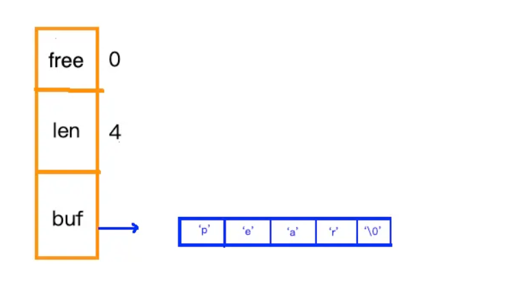

1. free:还剩多少空间 len:字符串长度 buf:存放的字符数组。
2. 空间预分配：SDS 被修改后，程序不仅会为 SDS 分配所需要的必须空间，还会分配额外的未使用空间。
3. 惰性空间释放：当对 SDS 进行缩短操作时，程序并不会回收多余的内存空间，而是使用 free 字段将这些字节数量记录下来不释放，后面如果需要 append 操作，则直接使用 free 中未使用的空间，减少了内存的分配。

### ziplist

压缩列表是 List 、hash、 sorted Set 三种数据类型底层实现之一。

当一个列表只有少量数据的时候，并且每个列表项要么就是小整数值，要么就是长度比较短的字符串，那么 Redis 就会使用压缩列表来做列表键的底层实现。


### quicklist

**quicklist 是 ziplist 和 linkedlist 的混合体，它将 linkedlist 按段切分，每一段使用 ziplist 来紧凑存储，多个 ziplist 之间使用双向指针串接起来。**

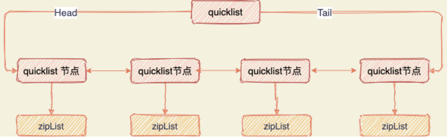

### skipList 

sorted set 类型的排序功能便是通过「跳跃列表」数据结构来实现。

跳跃表（skiplist）是一种有序数据结构，它通过在每个节点中维持多个指向其他节点的指针，从而达到快速访问节点的目的。

跳表在链表的基础上，增加了多层级索引，通过索引位置的几个跳转，实现数据的快速定位，如下图所示：

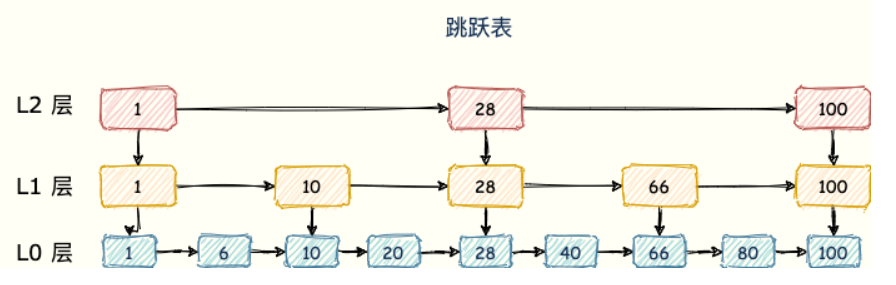

## redis多线程配置

> Redis将所有数据放在内存中，内存响应时长约为100ns，对于小数据包Redis服务器可以处理8-10w的QPS,这也是Redis的极限了，对于大部分公司来说，单线程的Redis已经足够了。


## 缓存击穿

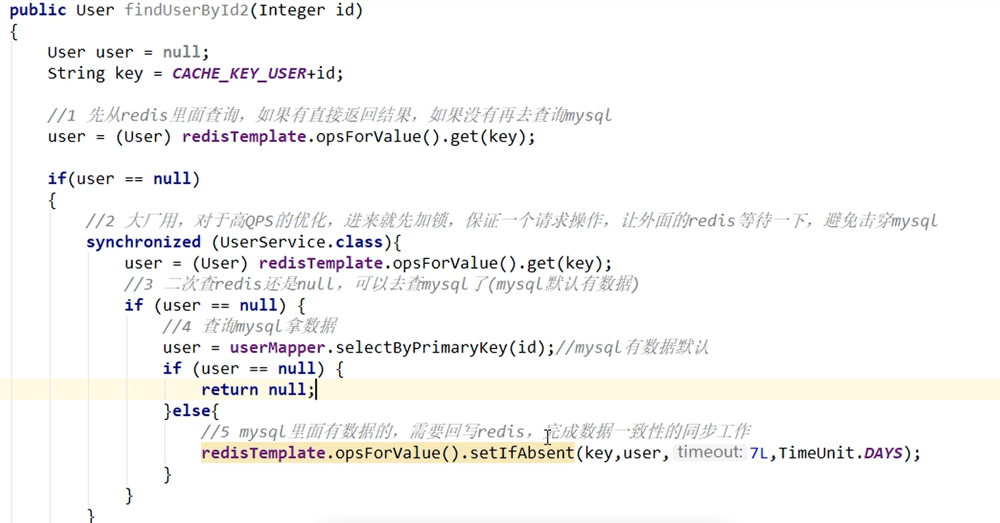

## list应用场景

1. 微信公众号订阅消息
2. 评论列表（评论按时间倒序）

## I/O 多路复用模型

Redis 采用 I/O 多路复用技术，并发处理连接。采用了 epoll + 自己实现的简单的事件框架。epoll 中的读、写、关闭、连接都转化成了事件，然后利用 epoll 的多路复用特性，绝不在 IO 上浪费一点时间。

Redis 线程不会阻塞在某一个特定的监听或已连接套接字上，也就是说，不会阻塞在某一个特定的客户端请求处理上。正因为此，Redis 可以同时和多个客户端连接并处理请求，从而提升并发性。


## Hash 冲突怎么办？(拉链法+渐进式rehash)

Redis 通过**链式哈希**解决冲突：**也就是同一个 桶里面的元素使用链表保存**。但是当链表过长就会导致查找性能变差可能，所以 Redis 为了追求快，使用了两个全局哈希表。用于 rehash 操作，增加现有的哈希桶数量，减少哈希冲突。

开始默认使用 「hash 表 1 」保存键值对数据，「hash 表 2」 此刻没有分配空间。当数据越来越多触发 rehash 操作，则执行以下操作：

1. 给 「hash 表 2 」分配更大的空间；
2. 将 「hash 表 1 」的数据重新映射拷贝到 「hash 表 2」 中；
3. 释放 「hash 表 1」 的空间。

**值得注意的是，将 hash 表 1 的数据重新映射到 hash 表 2 的过程中并不是一次性的，这样会造成 Redis 阻塞，无法提供服务。**

而是采用了**渐进式 rehash**，每次处理客户端请求的时候，先从「 hash 表 1」 中第一个索引开始，将这个位置的 所有数据拷贝到 「hash 表 2」 中，就这样将 rehash 分散到多次请求过程中，避免耗时阻塞。

## RDB、AOF

### RDB

在 Redis 执行「写」指令过程中，内存数据会一直变化。所谓的内存快照，指的就是 Redis 内存中的数据在某一刻的状态数据。

Redis 跟这个类似，就是把某一刻的数据以文件的形式拍下来，写到磁盘上。这个快照文件叫做 **RDB 文件，RDB 就是 Redis DataBase 的缩写。**在做数据恢复时，直接将 RDB 文件读入内存完成恢复。

**有两个严重性能开销**：

1. 频繁生成 RDB 文件写入磁盘，磁盘压力过大。会出现上一个 RDB 还未执行完，下一个又开始生成，陷入死循环。
2. fork 出 bgsave 子进程会阻塞主线程，主线程的内存越大，阻塞时间越长。

#### 在生成 RDB 期间，Redis 可以同时处理写请求么？

可以的，Redis 使用操作系统的多进程**写时复制技术 COW(Copy On Write)** 来实现快照持久化，保证数据一致性。

Redis 在持久化时会调用 glibc 的函数`fork`产生一个子进程，快照持久化完全交给子进程来处理，父进程继续处理客户端请求。

当主线程执行写指令修改数据的时候，这个数据就会复制一份副本， `bgsave` 子进程读取这个副本数据写到 RDB 文件。

这既保证了快照的完整性，也允许主线程同时对数据进行修改，避免了对正常业务的影响。

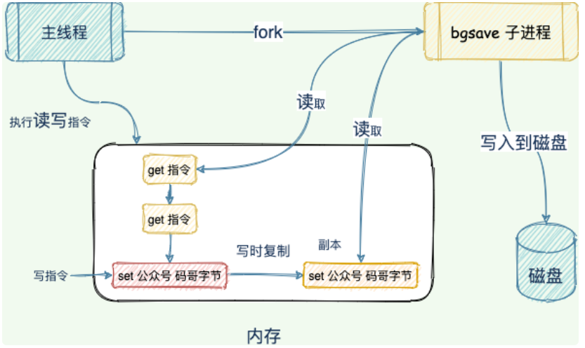

### AOF

AOF 日志记录了自 Redis 实例创建以来所有的**修改**性指令序列。

Redis 提供的 AOF 配置项`appendfsync`写回策略直接决定 AOF 持久化功能的效率和安全性。

- **always**：同步写回，写指令执行完毕立马将 `aof_buf`缓冲区中的内容刷写到 AOF 文件。
- **everysec**：每秒写回，写指令执行完，日志只会写到 AOF 文件缓冲区，每隔一秒就把缓冲区内容同步到磁盘。
- **no：** 操作系统控制，写执行执行完毕，把日志写到 AOF 文件内存缓冲区，由操作系统决定何时刷写到磁盘。

#### 重写机制

AOF 记录的是每个「写」指令操作。不会像 RDB 全量快照导致性能损耗，但是执行速度没有 RDB 快，同时日志文件过大也会造成性能问题。

所以，Redis 设计了一个杀手锏「AOF 重写机制」，Redis 提供了 `bgrewriteaof`指令用于对 AOF 日志进行瘦身。

其原理就是开辟一个子进程对内存进行遍历转换成一系列 Redis 的操作指令，序列化到一个新的 AOF 日志文件中。序列化完毕后再将操作期间发生的增量 AOF 日志追加到这个新的 AOF 日志文件中，追加完毕后就立即替代旧的 AOF 日志文件，瘦身工作就完成了。


### 如何实现数据尽可能少丢失又能兼顾性能呢？

**混合持久化**。将 rdb 文件的内容和增量的 AOF 日志文件存在一起。这里的 AOF 日志不再是全量的日志，而是**自持久化开始到持久化结束的这段时间发生的增量 AOF 日志**，通常这部分 AOF 日志很小。

于是**在 Redis 重启的时候，可以先加载 rdb 的内容，然后再重放增量 AOF 日志就可以完全替代之前的 AOF 全量文件重放，重启效率因此大幅得到提升**。


## 数据过期清理策略

### 过期键清理策略

- 定时删除，为每个过期键建立一个timer，缺点占用CPU

- 惰性删除，键获取的时候判断过期再清除，对内存不友好。

- Redis使用惰性删除和定期删除结合的方式配合使用。

- 定期删除，即根据设定执行时长和操作频率清理，缺点难以确定。

  > Redis 底层会通过限制删除操作执行的时长和频率来减少删除操作对CPU时间的影响，默认100ms就随机抽一些设置了过期时间的key，不会扫描全部的过期键，因为开销过大。

redis在内存空间不足的时候，为了保证命中率，就会选择一定的数据淘汰策略——**内存淘汰机制（过期键的补充措施）**

### 内存淘汰机制

内存淘汰机制：八种大体上可以分为4中，lru（最近最少使用）、lfu（最少使用频率）、random（随机）、ttl（根据生存时间，快过期）。

1. volatile-lru：从已设置过期时间的数据集中挑选最近最少使用的数据淘汰。
2. volatile-ttl：从已设置过期时间的数据集中挑选将要过期的数据淘汰。
3. volatile-random：从已设置过期时间的数据集中任意选择数据淘汰。
4. volatile-lfu：从已设置过期时间的数据集挑选使用频率最低的数据淘汰。
5. allkeys-lru：从数据集中挑选最近最少使用的数据淘汰
6. allkeys-lfu：从数据集中挑选使用频率最低的数据淘汰。
7. allkeys-random：从数据集（server.db[i].dict）中任意选择数据淘汰
8. no-enviction（驱逐）：禁止驱逐数据，这也是默认策略。意思是当内存不足以容纳新入数据时，新写入操作就会报错，请求可以继续进行，线上任务也不能持续进行，采用no-enviction策略可以保证数据不被丢失。


# 分布式

## CAP理论

### 一致性（Consistency）

指强一致性，在写操作完成后开始的任何读操作都必须返回该值，或者后续写操作的结果。

> 也就是说，在一致性系统中，一旦客户端将值写入任何一台服务器并获得响应，那么之后client从其他任何服务器读取的都是刚写入的数据
>
> 一致性保证了不管向哪台服务器写入数据，其他的服务器能实时同步数据

### 可用性（Availability）

可用性（高可用）是指：每次向未崩溃的节点发送请求，总能保证收到响应数据（允许不是最新数据）

### 分区容忍性（Partition tolerance）

分布式系统在遇到任何网络分区故障的时候，仍然能够对外提供满足一致性和可用性的服务，也就是说，服务器**A**和**B**发送给对方的任何消息都是可以放弃的，也就是说A和B可能因为各种意外情况，导致无法成功进行同步，分布式系统要能容忍这种情况。除非整个网络环境都发生了故障。

### 为什么只能在A和C之间做出取舍？

在分布式系统中，网络无法100%可靠，分区其实是一个必然现象，如果我们选择了CA而放弃了P，那么当发生分区现象时，为了保证一致性，这个时候必须拒绝请求，但是A又不允许，所以分布式系统理论上不可能选择CA架构，只能选择CP或者AP架构。

### 一致性有几种分类？

- 强一致性

- 弱一致性

- 最终一致性

**总结**

弱一致性即使过了不一致时间窗口，后续的读取也不一定能保证一致，而最终一致过了不一致窗口后，后续的读取一定一致。

## Base理论

### BA(Basic Available)基本可用

整个系统在某些不可抗力的情况下，仍然能够保证“可用性”，即一定时间内仍然能够返回一个明确的结果。这里是属于基本可用。

基本可用和高可用的区别：

- “一定时间”可以适当延长 当举行大促（比如秒杀）时，响应时间可以适当延长
- 给部分用户返回一个降级页面 给部分用户直接返回一个**降级页面**，从而缓解服务器压力。但要注意，返回降级页面仍然是返回明确结果。

### S(Soft State)柔性状态

称为柔性状态，是指允许系统中的数据存在中间状态，并认为该中间状态的存在不会影响系统的整体可用性，即允许系统不同节点的数据副本之间进行数据同步的过程存在延时。

### E(Eventual Consisstency)最终一致性

同一数据的不同副本的状态，可以不需要实时一致，但一定要保证经过一定时间后仍然是一致的。

## 分布式事务

https://mp.weixin.qq.com/s/4uI4620ARPi4qh2pcp2pSA


### 2阶段提交（2PC）

二阶段提交的**事务正常提交**的完整流程如下图：

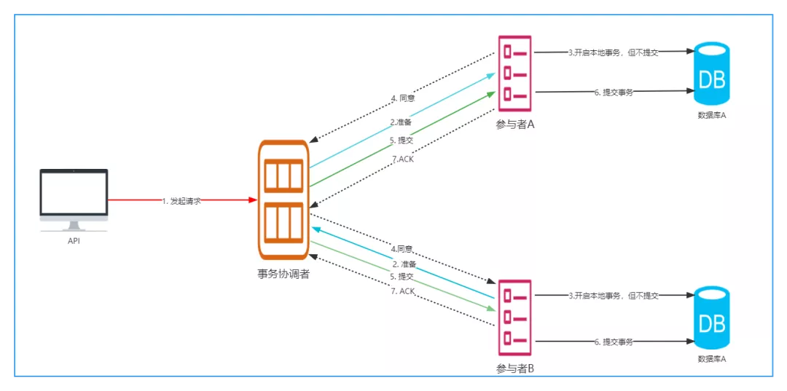

二阶段提交事务**回滚**的完整流程如下图：

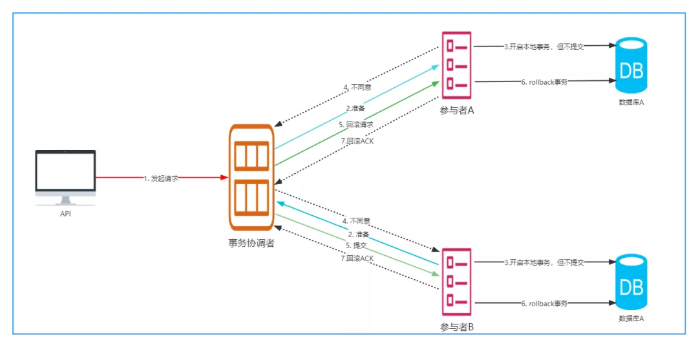

#### 2PC的缺点

二阶段提交看起来确实能够提供原子性的操作，但是不幸的是，二阶段提交还是有几个缺点的：

- **性能问题**：执行过程中，所有参与节点都是事务阻塞型的。当参与者占有公共资源时，其他第三方节点访问公共资源不得不处于阻塞状态。
- **可靠性问题**：参与者发生故障。协调者需要给每个参与者额外指定超时机制，超时后整个事务失败。协调者发生故障。参与者会一直阻塞下去。需要额外的备机进行容错。
- **数据一致性问题**：二阶段无法解决的问题：协调者在发出`commit`消息之后宕机，而唯一接收到这条消息的参与者同时也宕机了。那么即使协调者通过选举协议产生了新的协调者，这条事务的状态也是不确定的，没人知道事务是否被已经提交。
- **实现复杂**：牺牲了可用性，对性能影响较大，不适合高并发高性能场景。

#### 2PC的优点

- 尽量保证了数据的强一致，适合对数据强一致要求很高的关键领域。（其实也不能100%保证强一致）


### 3阶段提交（3PC）

三阶段提交协议，是二阶段提交协议的改进版本，三阶段提交有两个改动点。

- 在协调者和参与者中都引入超时机制
- 在第一阶段和第二阶段中插入一个准备阶段。保证了在最后提交阶段之前各参与节点的状态是一致的。

也就是说，除了引入超时机制之外，3PC把2PC的准备阶段再次一分为二，这样三阶段提交就有`CanCommit`、`PreCommit`、`DoCommit`三个阶段。处理流程如下：

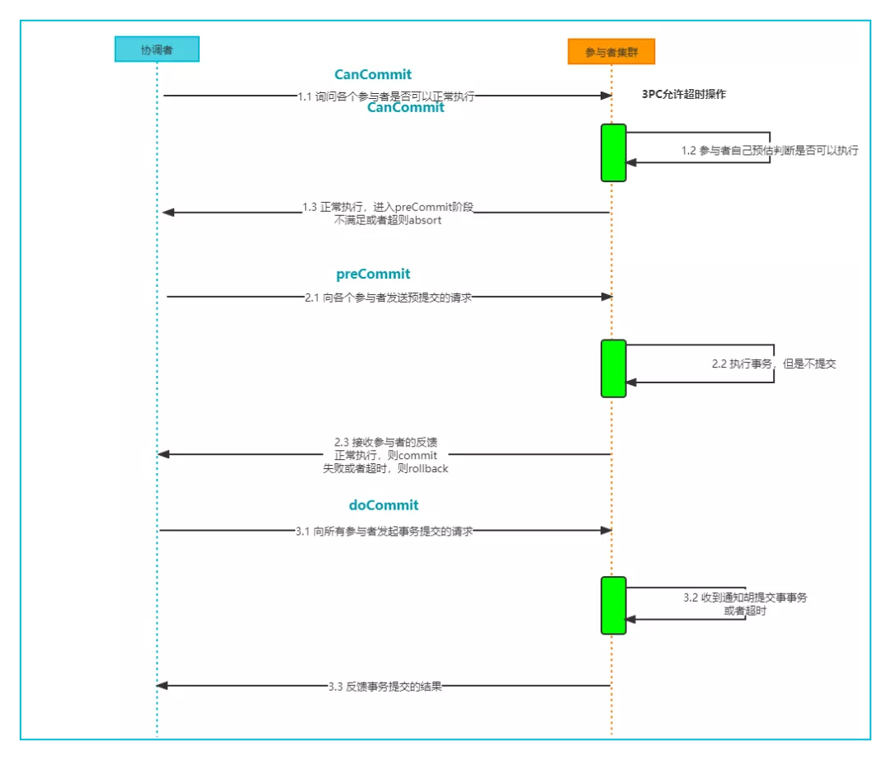

>进入阶段 3 后，无论协调者出现问题，或者协调者与参与者网络出现问题，都会导致参与者无法接收到协调者发出的 do Commit 请求或 abort 请求。此时，参与者都会在等待超时之后，继续执行事务提交。

#### 优点

相比二阶段提交，三阶段提交降低了阻塞范围，在等待超时后协调者或参与者会中断事务。避免了协调者单点问题，阶段 3 中协调者出现问题时，参与者会继续提交事务。

#### 缺点

数据不一致问题依然存在，当在参与者收到 `preCommit` 请求后等待 `doCommit` 指令时，此时如果协调者请求中断事务，而协调者无法与参与者正常通信，会导致参与者继续提交事务，造成数据不一致。


### TCC(事务补偿)

TCC（Try Confirm Cancel）方案是一种应用层面侵入业务的两阶段提交。是目前最火的一种柔性事务方案，其核心思想是：**针对每个操作，都要注册一个与其对应的确认和补偿（撤销）操作**。

TCC分为两个阶段，分别如下：

- 第一阶段：Try（尝试），主要是对业务系统做检测及资源预留 **(加锁，锁住资源)**

- 第二阶段：本阶段根据第一阶段的结果，决定是执行confirm还是cancel

- 1. Confirm（确认）：执行真正的业务（执行业务，释放锁）
  2. Cancle（取消）：是预留资源的取消（出问题，释放锁）

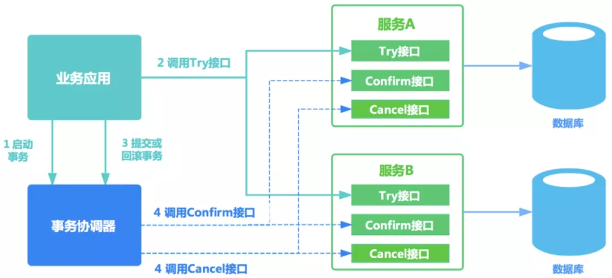

为了方便理解，下面以电商下单为例进行方案解析，这里把整个过程简单分为扣减库存，订单创建 2 个步骤，库存服务和订单服务分别在不同的服务器节点上。

假设商品库存为 100，购买数量为 2，这里检查和更新库存的同时，冻结用户购买数量的库存，同时创建订单，订单状态为待确认。

#### ①Try 阶段

TCC 机制中的 Try 仅是一个初步操作，它和后续的确认一起才能真正构成一个完整的业务逻辑，这个阶段主要完成：

- 完成所有业务检查( 一致性 ) 。
- 预留必须业务资源( 准隔离性 ) 。
- Try 尝试执行业务。

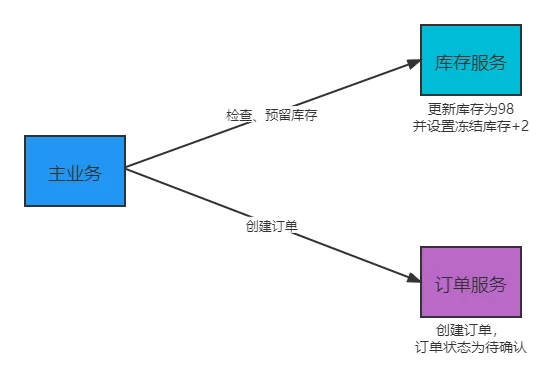Try阶段

#### ②Confirm / Cancel 阶段

根据 **Try** 阶段服务是否全部正常执行，继续执行确认操作（Confirm）或取消操作（Cancel）。

Confirm 和 Cancel 操作满足幂等性，如果 Confirm 或 Cancel 操作执行失败，将会不断重试直到执行完成。

Confirm：当 Try 阶段服务全部正常执行， 执行确认业务逻辑操作，业务如下图：

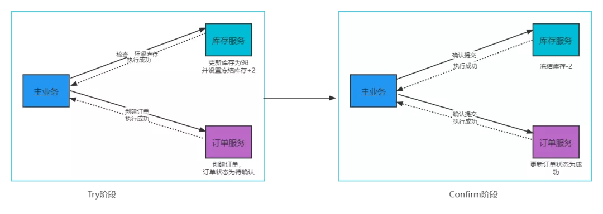Try->Confirm

这里使用的资源一定是 Try 阶段预留的业务资源。在 TCC 事务机制中认为，如果在 Try 阶段能正常的预留资源，那 Confirm 一定能完整正确的提交。

Confirm 阶段也可以看成是对 Try 阶段的一个补充，Try+Confirm 一起组成了一个完整的业务逻辑。

Cancel：当 Try 阶段存在服务执行失败， 进入 Cancel 阶段，业务如下图：

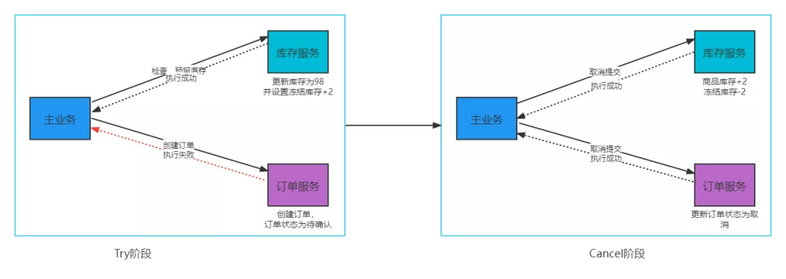Try-Cancel

Cancel 取消执行，释放 Try 阶段预留的业务资源，上面的例子中，Cancel 操作会把冻结的库存释放，并更新订单状态为取消。

#### 最终一致性保证

- TCC 事务机制以初步操作（Try）为中心的，确认操作（Confirm）和取消操作（Cancel）都是围绕初步操作（Try）而展开。因此，Try 阶段中的操作，其保障性是最好的，即使失败，仍然有取消操作（Cancel）可以将其执行结果撤销。
- Try阶段执行成功并开始执行 `Confirm`阶段时，默认 `Confirm`阶段是不会出错的。也就是说只要`Try`成功，`Confirm`一定成功（TCC设计之初的定义） 。
- Confirm与Cancel如果失败，由TCC框架进行==重试==补偿
- 存在极低概率在CC环节彻底失败，则需要定时任务或人工介入

#### 方案总结

TCC 事务机制相对于传统事务机制（X/Open XA），TCC 事务机制相比于上面介绍的 XA 事务机制，有以下优点：

- 性能提升：具体业务来实现控制资源锁的粒度变小，不会锁定整个资源。
- 数据最终一致性：基于 Confirm 和 Cancel 的幂等性，保证事务最终完成确认或者取消，保证数据的一致性。
- 可靠性：解决了 XA 协议的协调者单点故障问题，由主业务方发起并控制整个业务活动，业务活动管理器也变成多点，引入集群。

缺点：

- TCC 的 Try、Confirm 和 Cancel 操作功能要按具体业务来实现，业务耦合度较高，提高了开发成本。

### 本地消息表

本地消息表的方案最初是由 eBay 提出，核心思路是将分布式事务拆分成本地事务进行处理。

角色：

- 事务主动方
- 事务被动方

通过在事务主动发起方额外新建事务消息表，事务发起方处理业务和记录事务消息在本地事务中完成，轮询事务消息表的数据发送事务消息，事务被动方基于消息中间件消费事务消息表中的事务。

这样可以避免以下两种情况导致的数据不一致性：

- 业务处理成功、事务消息发送失败
- 业务处理失败、事务消息发送成功

整体的流程如下图：

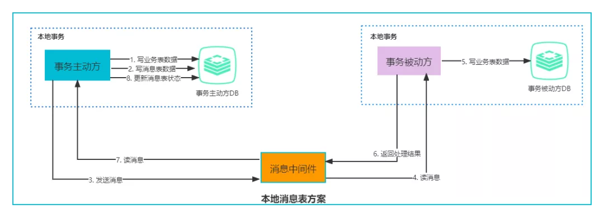本地消息表

上图中整体的处理步骤如下：

- ①：事务主动方在同一个本地事务中处理业务和写消息表操作
- ②：事务主动方通过消息中间件，通知事务被动方处理事务通知事务待消息。消息中间件可以基于 Kafka、RocketMQ 消息队列，事务主动方主动写消息到消息队列，事务消费方消费并处理消息队列中的消息。
- ③：事务被动方通过消息中间件，通知事务主动方事务已处理的消息。
- ④：事务主动方接收中间件的消息，更新消息表的状态为已处理。

一些必要的容错处理如下：

- 当①处理出错，由于还在事务主动方的本地事务中，直接回滚即可
- 当②、③处理出错，由于事务主动方本地保存了消息，只需要轮询消息重新通过消息中间件发送，事务被动方重新读取消息处理业务即可。
- 如果是业务上处理失败，事务被动方可以发消息给事务主动方回滚事务
- 如果事务被动方已经消费了消息，事务主动方需要回滚事务的话，需要发消息通知事务主动方进行回滚事务。

#### 优点

- 从应用设计开发的角度实现了消息数据的可靠性，消息数据的可靠性不依赖于消息中间件，弱化了对 MQ 中间件特性的依赖。
- 方案轻量，容易实现。

#### 缺点

- 与具体的业务场景绑定，耦合性强，不可公用。
- 消息数据与业务数据同库，占用业务系统资源。
- 业务系统在使用关系型数据库的情况下，消息服务性能会受到关系型数据库并发性能的局限。


# 计网

## 五层架构

应用层(应用软件做支撑) -> 传输层（TCP/UDP,将数据分块）-> 网络层（真正负责数据的传输） -> 数据链数层 (标识网络设备，在一个链路传输) -> 物理层（数据包转换成二进制，屏蔽物理设备差异）

## http 常⻅字段有哪些？

- Host ：主机域名
- Content-Length：返回数据length 
- Content-Encoding：返回数据压缩算法
- Content-Type：返回数据type 
- Connection：一般为Keep-Alive
- Accept：客户端请求时，接收哪些数据格式
- Accept-Encoding：客户端请求时，接收哪些压缩算法

## HTTP 与 HTTPS 有哪些区别？

1. HTTP 是超⽂本传输协议，信息是明⽂传输，存在安全⻛险的问题。HTTPS 则解决 HTTP 不安全的缺陷，在

TCP 和 HTTP ⽹络层之间加⼊了 SSL/TLS 安全协议，使得报⽂能够加密传输。

2. HTTP 连接建⽴相对简单， TCP 三次握⼿之后便可进⾏ HTTP 的报⽂传输。⽽ HTTPS 在 TCP 三次握⼿之

后，还需进⾏ SSL/TLS 的握⼿过程，才可进⼊加密报⽂传输。

3. HTTP 的端⼝号是 80，HTTPS 的端⼝号是 443。

4. HTTPS 协议需要向 CA（证书权威机构）申请数字证书，来保证服务器的身份是可信的。

## HTTP 常⻅的状态码，有哪些？

**1xx**：表示目前是协议处理的中间状态，等待后续操作

**2xx**：成功

- 200 OK
- 204 No Content：没有body

**3xx**：重定向

- 301 Moved Permanently：永久重定向，请求的资源已经不存在了，需改⽤新的 URL 再次访问。
- 302 Found：临时重定向，请求的资源还在，但暂时需要⽤另⼀个 URL 来访问。
- 304 Not Modified ：不具有跳转含义，表示资源未修改，重定向已存在的缓冲⽂件，也称缓存重定向，⽤于缓存控制。

**4xx**：客户端错误

- 400 :笼统的客户端报错
- 403 Forbidden：禁止访问资源（没权限）

**5xx**：服务端错误

- 500 笼统的服务端报错
- 501 Not Implemented：客户端请求的功能还不⽀持，类似“即将开业，敬请期待”的意思
- 502 Bad Gateway：服务器作为⽹关或代理时返回的错误码，服务器⾃身⼯作正常
- 503 ：服务器繁忙

## Http的优缺点

**优点**：

- 简单
- 灵活易扩展，程序员可以指定参数
- 使用广泛，跨平台

**缺点**：

- 无状态
- 安全性不行
  - 明文传输 -> Https混合加密解决
  - 不验证通信方身份（伪装） -> Https 数字证书解决
  - 无法保证报文的完整性（篡改）-> Https 摘要算法解决

## Https如何解决Http的问题的？

1. 混合加密

   HTTPS 采⽤的是**对称加密**和**⾮对称加密**结合的「混合加密」⽅式：

   - 在通信建⽴前采⽤**⾮对称加密**的⽅式交换「会话秘钥」，后续就不再使⽤⾮对称加密。

   - 在通信过程中全部使⽤**对称加密**的「会话秘钥」的⽅式加密明⽂数据。

   采⽤「混合加密」的⽅式的原因：

   - **对称加密**只使⽤⼀个密钥，运算速度快，密钥必须保密，⽆法做到安全的密钥交换。

   - **非对称加密**使⽤两个密钥：公钥和私钥，公钥可以任意分发⽽私钥保密，解决了密钥交换问题但速度慢。

2. 数字认证

   客户端先向服务器端索要公钥，然后⽤公钥加密信息，服务器收到密⽂后，⽤⾃⼰的私钥解密。

   这就存在些问题，如何保证公钥不被篡改和信任度？

   所以这⾥就需要借助第三⽅权威机构 CA （数字证书认证机构），将**服务器公钥放在数字证书**（由数字证书认证机构颁发）中，只要证书是可信的，公钥就是可信的。

3. 摘要算法

   **摘要算法**⽤来实现**完整性**，能够为数据⽣成独⼀⽆⼆的「指纹」，⽤于校验数据的完整性，解决了篡改的⻛险。

   客户端在发送明⽂之前会通过摘要算法算出明⽂的「指纹」，发送的时候把「指纹 + 明⽂」⼀同加密成密⽂后，发送给服务器，服务器解密后，⽤相同的摘要算法算出发送过来的明⽂，通过⽐较客户端携带的「指纹」和当前算出的「指纹」做⽐较，若「指纹」相同，说明数据是完整的。

## Http1.1、2、3比较

### Http1.1

HTTP/1.1 相⽐ HTTP/1.0 性能上的改进：

- 长连接
- 管道传输：长连接使得管道传输成为可能，即可在同⼀个 TCP 连接⾥⾯，客户端可以发起多个请求，只要第⼀个请求发出去了，不必等其回来，就可以发第⼆个请求出去，可以**减少整体的响应时间。**

HTTP/1.1 还是有性能瓶颈：

- 请求 / 响应头部（Header）未经压缩就发送，⾸部信息越多延迟越⼤。只能压缩 Body 的部分；

- 发送冗⻓的⾸部。每次互相发送相同的⾸部造成的浪费较多；

- 服务器是按请求的顺序响应的，如果服务器响应慢，会招致客户端⼀直请求不到数据，也就是队头阻塞；

- 没有请求优先级控制；

- 请求只能从客户端开始，服务器只能被动响应。

### **Http2**

HTTP/2 协议是基于 HTTPS 的，所以 HTTP/2 的安全性也是有保障的。

HTTP/2 相⽐ HTTP/1.1 性能上的改进：

*1.* 头部压缩

HTTP/2 会**压缩头**（Header）如果你同时发出多个请求，他们的头是⼀样的或是相似的，那么，协议会帮你**消除重复的部分**。

这就是所谓的 HPACK 算法：在客户端和服务器同时维护⼀张头信息表，所有字段都会存⼊这个表，⽣成⼀个索引号，以后就不发送同样字段了，只发送索引号，这样就**提高速度**了。

*2.* ⼆进制格式

HTTP/2 不再像 HTTP/1.1 ⾥的纯⽂本形式的报⽂，⽽是全⾯采⽤了**⼆进制格式**，头信息和数据体都是⼆进制，并且统称为帧（frame）：**头信息帧和数据帧**。

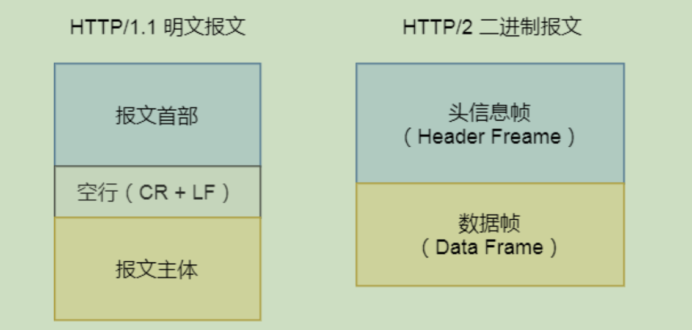

*3.* 数据流

HTTP/2 的数据包不是按顺序发送的，同⼀个连接⾥⾯连续的数据包，可能属于不同的回应。因此，必须要对数据包做标记，指出它属于哪个回应。

每个请求或回应的所有数据包，称为⼀个数据流（ Stream ）。每个数据流都标记着⼀个独⼀⽆⼆的编号，其中规定客户端发出的数据流编号为奇数， 服务器发出的数据流编号为偶数。

客户端还可以**指定数据流的优先级**。优先级⾼的请求，服务器就先响应该请求。

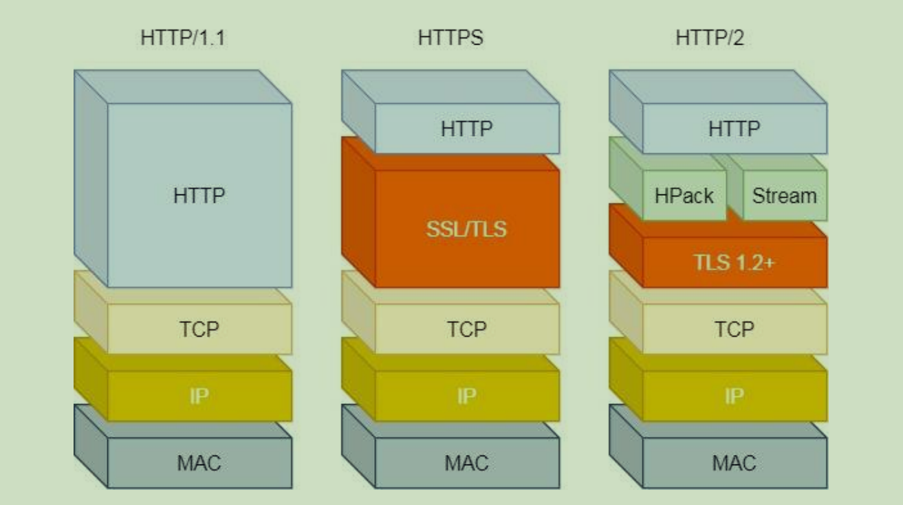

*4.* 多路复⽤

HTTP/2 是可以在**⼀个连接中并发多个请求或回应，⽽不用按照顺序⼀⼀对应**。

移除了 HTTP/1.1 中的串⾏请求，不需要排队等待，也就不会再出现「队头阻塞」问题，**降低了延迟，大幅度提高了连接的利⽤率**。

举例来说，在⼀个 TCP 连接⾥，服务器收到了客户端 A 和 B 的两个请求，如果发现 A 处理过程⾮常耗时，于是就回应 A 请求已经处理好的部分，接着回应 B 请求，完成后，再回应 A 请求剩下的部分。

*5.* 服务器推送

HTTP/2 还在⼀定程度上改善了传统的「请求 - 应答」⼯作模式，服务不再是被动地响应，也可以**主动**向客户端发送消息。

举例来说，在浏览器刚请求 HTML 的时候，就提前把可能会⽤到的 JS、CSS ⽂件等静态资源主动发给客户端，**减少延时的等待**，也就是服务器推送（Server Push，也叫 Cache Push）。

### Http3

HTTP/2 主要的问题在于，多个 HTTP 请求在复⽤⼀个 TCP 连接，下层的 TCP 协议是不知道有多少个 HTTP 请求的。所以⼀旦发⽣了丢包现象，就会触发 TCP 的重传机制，这样在⼀个 TCP 连接中的**所有的** **HTTP** **请求都必须等待这个丢了的包被重传回来**。

HTTP/1.1 中的管道（ pipeline）传输中如果有⼀个请求阻塞了，那么队列后请求也统统被阻塞住了HTTP/2 多个请求复⽤⼀个TCP连接，⼀旦发⽣丢包，就会阻塞住所有的 HTTP 请求。

这都是基于 TCP 传输层的问题，所以 **HTTP/3** **把** **HTTP** **下层的** **TCP** **协议改成了** **UDP****！**


UDP 发⽣是不管顺序，也不管丢包的，所以不会出现 HTTP/1.1 的队头阻塞 和 HTTP/2 的⼀个丢包全部重传问题。

⼤家都知道 UDP 是不可靠传输的，但基于 UDP 的 **QUIC** **协议** 可以实现类似 TCP 的可靠性传输。

QUIC 有⾃⼰的⼀套机制可以保证传输的可靠性的。当某个流发⽣丢包时，只会阻塞这个流，**其他流不会受到影响**。

TLS3 升级成了最新的 1.3 版本，头部压缩算法也升级成了 QPack 。

HTTPS 要建⽴⼀个连接，要花费 6 次交互，先是建⽴三次握⼿，然后是 TLS/1.3 的三次握⼿。QUIC 直接把以往的 TCP 和 TLS/1.3 的 6 次交互**合并成了** **3** **次，减少了交互次数**。

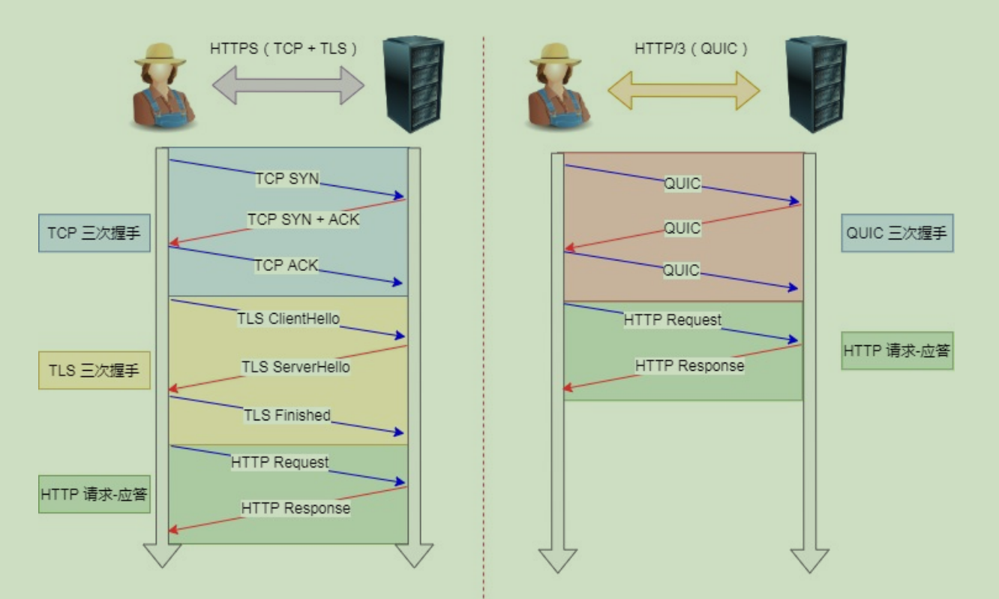

所以， QUIC 是⼀个在 UDP 之上的**伪** TCP + TLS + HTTP/2 的多路复⽤的协议。

QUIC 是新协议，对于很多⽹络设备，根本不知道什么是 QUIC，只会当做 UDP，这样会出现新的问题。所以HTTP/3 现在普及的进度⾮常的缓慢，不知道未来 UDP 是否能够逆袭 TCP。

## Https如何建立连接？其间交互了什么？

SSL/TLS 协议基本流程：

- 客户端向服务器索要并验证服务器的公钥。

- 双⽅协商⽣产「会话秘钥」。

- 双⽅采⽤「会话秘钥」进⾏加密通信。

前两步也就是 SSL/TLS 的建⽴过程，也就是握⼿阶段。

SSL/TLS 协议建⽴的详细流程：

*1. ClientHello*

⾸先，由客户端向服务器发起加密通信请求，也就是 ClientHello 请求。

在这⼀步，客户端主要向服务器发送以下信息：

（1）客户端⽀持的 SSL/TLS 协议版本，如 TLS 1.2 版本。

（2）客户端⽣产的随机数（ Client Random ），后⾯⽤于⽣产「会话秘钥」。

（3）客户端⽀持的密码套件列表，如 RSA 加密算法。

*2. SeverHello*

服务器收到客户端请求后，向客户端发出响应，也就是 SeverHello 。服务器回应的内容有如下内容：

（1）确认 SSL/ TLS 协议版本，如果浏览器不⽀持，则关闭加密通信。

（2）服务器⽣产的随机数（ Server Random ），后⾯⽤于⽣产「会话秘钥」。

（3）确认的密码套件列表，如 RSA 加密算法。

（4）服务器的数字证书。

*3.*客户端回应

客户端收到服务器的回应之后，⾸先通过浏览器或者操作系统中的 CA 公钥，确认服务器的数字证书的真实性。

如果证书没有问题，客户端会从数字证书中取出服务器的公钥，然后使⽤它加密报⽂，向服务器发送如下信息：

（1）⼀个随机数（ pre-master key ）。该随机数会被服务器公钥加密。

（2）加密通信算法改变通知，表示随后的信息都将⽤「会话秘钥」加密通信。

（3）客户端握⼿结束通知，表示客户端的握⼿阶段已经结束。这⼀项同时把之前所有内容的发⽣的数据做个摘要，⽤来供服务端校验。上⾯第⼀项的随机数是整个握⼿阶段的第三个随机数，这样服务器和客户端就同时有三个随机数，接着就⽤双⽅协商的加密算法，**各⾃⽣成**本次通信的「会话秘钥」。

**客户端如何确认证书的真实性？**

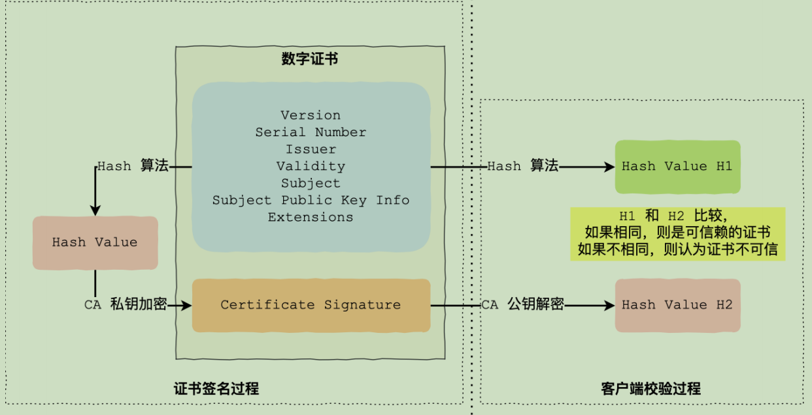

CA 签发证书的过程，如上图左边部分：

- ⾸先 CA 会把持有者的公钥、⽤途、颁发者、有效时间等信息打成⼀个包，然后对这些信息进⾏ Hash 计算，得到⼀个 Hash 值；

- 然后 CA 会使⽤⾃⼰的私钥将该 Hash 值加密，⽣成 Certificate Signature，也就是 CA 对证书做了签名；

- 最后将 Certificate Signature 添加在⽂件证书上，形成数字证书；

客户端校验服务端的数字证书的过程，如上图右边部分：

- ⾸先客户端会使⽤同样的 Hash 算法获取该证书的 Hash 值 H1；

- 通常浏览器和操作系统中集成了 CA 的公钥信息，浏览器收到证书后可以使⽤ CA 的公钥解密 Certificate Signature 内容，得到⼀个 Hash 值 H2 ；

- 最后⽐较 H1 和 H2，如果值相同，则为可信赖的证书，否则则认为证书不可信。

  

*4.* 服务器的最后回应

服务器收到客户端的第三个随机数（ pre-master key ）之后，通过协商的加密算法，计算出本次通信的「会话秘钥」。然后，向客户端发⽣最后的信息：

（1）加密通信算法改变通知，表示随后的信息都将⽤「会话秘钥」加密通信。

（2）服务器握⼿结束通知，表示服务器的握⼿阶段已经结束。这⼀项同时把之前所有内容的发⽣的数据做个摘要，⽤来供客户端校验。

⾄此，整个 SSL/TLS 的握⼿阶段全部结束。接下来，客户端与服务器进⼊加密通信，就完全是使⽤普通的 HTTP协议，只不过⽤「会话秘钥」加密内容。

## 如何优化Http1.1？

长连接：KeepAlive

- 尽量避免发送Http请求（缓存）

  客户端把第一次请求和响应数据保存在磁盘，第二次请求时，会先在本地查找缓存，服务器在发送 HTTP 响应时，会估算⼀个过期的时间，并把这个信息放到响应头部中。

  如果客户端发现该响应过期了，客户端重新新发送请求，在请求的 Etag 头部带上第⼀次请求的响应头部中的摘要，当服务器收到请求后，会将本地资源的摘要与请求中的摘要做个比较。若一致，则缓存中的数据还有效，则返回一个没有body的response（304 Not Modified）。

- 在需要发送 HTTP 请求时，考虑如何减少请求次数

  - 合并发送

  - 减少重定向请求次数

    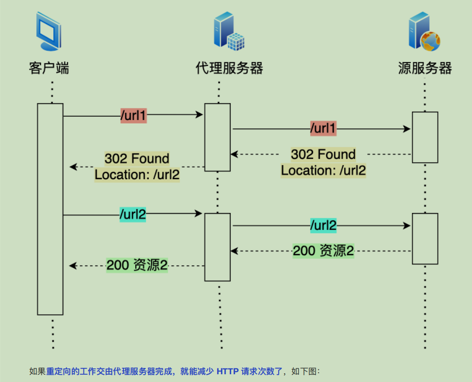

    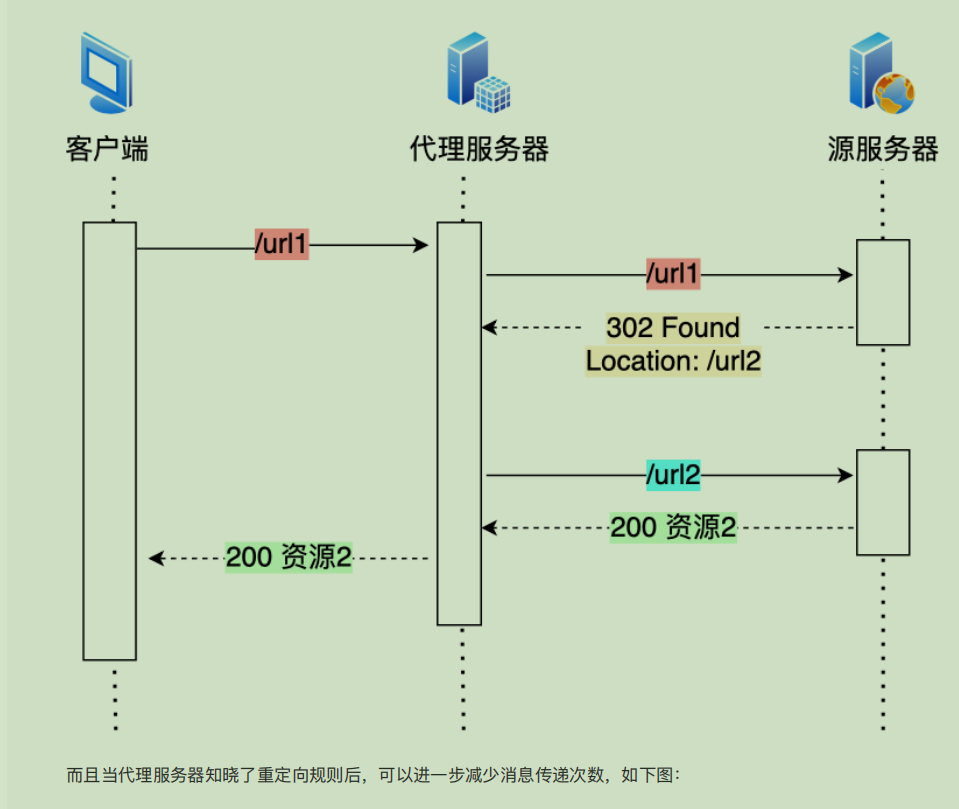

  - 懒发送（前端懒加载）

- 减少服务器的 HTTP响应的数据大小（压缩）

## RSA算法的缺陷

**使用RSA** **密钥协商算法的最大问题是不支持前向保密**。因为客户端传递随机数（⽤于⽣成对称加密密钥的条件之⼀）给服务端时使⽤的是公钥加密的，服务端收到到后，会⽤私钥解密得到随机数。所以⼀旦服务端的私钥泄漏了，过去被第三⽅截获的所有 TLS 通讯密⽂都会被破解。

为了解决这⼀问题，于是就有了 DH 密钥协商算法，这⾥简单介绍它的⼯作流程。

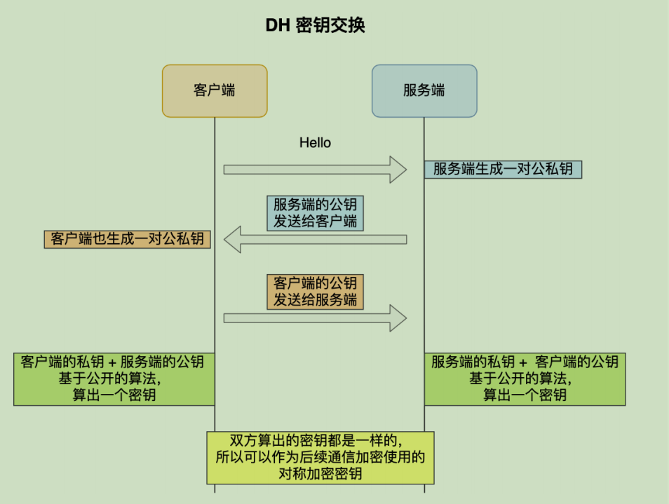

客户端和服务端各⾃会⽣成随机数，并以此作为私钥，然后根据公开的 DH 计算公示算出各⾃的公钥，通过 TLS

握⼿双⽅交换各⾃的公钥，这样双⽅都有⾃⼰的私钥和对⽅的公钥，然后双⽅根据各⾃持有的材料算出⼀个随机

数，这个随机数的值双⽅都是⼀样的，这就可以作为后续对称加密时使⽤的密钥。

 DH 密钥交换过程中，**即使第三⽅截获了 TLS 握⼿阶段传递的公钥，在不知道的私钥的情况下，也是⽆法计算出密钥的，而且每⼀次对称加密密钥都是实时⽣成的，实现前向保密**。

但因为 DH 算法的计算效率问题，后⾯出现了 ECDHE 密钥协商算法，我们现在⼤多数⽹站使⽤的正是 ECDHE 密钥协商算法。

## ECDHE 握⼿过程

**使⽤了 ECDHE**，在**TLS** **第四次握⼿前，客户端就已经发送了加密的** **HTTP** **数据**，⽽对于 RSA 握⼿过程，必须要完成 TLS 四次握⼿，才能传输应⽤数据。

所以，**ECDHE** **相⽐** **RSA** **握⼿过程省去了⼀个消息往返的时间**，这个有点「抢跑」的意思，它被称为是「*TLSFalse Start*」，跟「*TCP Fast Open*」有点像，都是在还没连接完全建⽴前，就发送了应⽤数据，这样便提⾼了传输的效率。

**ECDGE握手过程**：

*1. ClientHello*

⾸先，由客户端向服务器发起加密通信请求，也就是 ClientHello 请求。

在这⼀步，客户端主要向服务器发送以下信息：

（1）客户端⽀持的 SSL/TLS 协议版本，如 TLS 1.2 版本。

（2）客户端⽣产的随机数（ Client Random ），后⾯⽤于⽣产「会话秘钥」。

（3）客户端⽀持的密码套件列表，如 RSA 加密算法。

*2. SeverHello*

服务器收到客户端请求后，向客户端发出响应，也就是 SeverHello 。服务器回应的内容有如下内容：

（1）确认 SSL/ TLS 协议版本，如果浏览器不⽀持，则关闭加密通信。

（2）服务器⽣产的随机数（ Server Random ），后⾯⽤于⽣产「会话秘钥」。

（3）确认的密码套件列表，如 RSA 加密算法。

（4）服务器的数字证书。**（这一步与RSA算法有区别）**

因为服务端选择了 ECDHE 密钥协商算法，所以会在发送完证书后，发送「**Server Key Exchange**」消息。

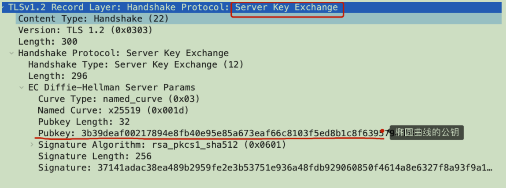

这个过程服务器做了三件事：

- 选择了**名为** **named_curve** **的椭圆曲线**，选好了椭圆曲线相当于椭圆曲线基点 G 也定好了，这些都会公开给客户端；

- ⽣成随机数作为服务端椭圆曲线的私钥，保留到本地；

- 根据基点 G 和私钥计算出**服务端的椭圆曲线公钥**，这个会公开给客户端。

为了保证这个椭圆曲线的公钥不被第三⽅篡改，服务端会⽤ RSA 签名算法给服务端的椭圆曲线公钥做个签名。

随后，就是「**Server Hello Done**」消息，服务端跟客户端表明：“这些就是我提供的信息，打招呼完毕”。

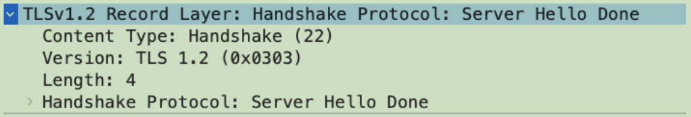

⾄此，TLS 两次握⼿就已经完成了，⽬前客户端和服务端通过明⽂共享了这⼏个信息：**Client Random、Server Random 、使用的椭圆曲线、椭圆曲线基点 G、服务端椭圆曲线的公钥**，这⼏个信息很重要，是后续⽣成会话密钥的材料。

*3.*客户端回应

客户端收到服务器的回应之后，⾸先通过浏览器或者操作系统中的 CA 公钥，确认服务器的数字证书的真实性。

如果证书没有问题，客户端会⽣成⼀个随机数作为客户端椭圆曲线的私钥，然后再根据服务端前⾯给的信息，⽣成**客户端的椭圆曲线公钥**，然后⽤「**Client Key Exchange**」消息发给服务端。

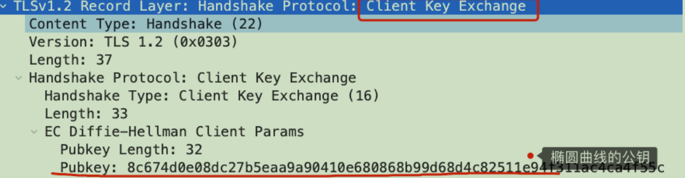

⾄此，双⽅都有对⽅的椭圆曲线公钥、⾃⼰的椭圆曲线私钥、椭圆曲线基点 G。于是，双⽅都计算出点（x， y），其中 x 坐标值双⽅都是⼀样的，前⾯说 ECDHE 算法时候，说 x 是会话密钥，**但实际应用中，x 还不是最终的会话密钥**。

**最终的会话密钥，就是⽤「客户端随机数 + 服务端随机数+ x（ECDHE算法算出的共享密钥） 」三个材料⽣成的**。

算好会话密钥后，客户端会发⼀个「**Change Cipher Spec**」消息，告诉服务端后续改⽤对称算法加密通信。

接着，客户端会发「**Encrypted Handshake Message**」消息，把之前发送的数据做⼀个摘要，再⽤对称密钥加密⼀下，让服务端做个验证，验证下本次⽣成的对称密钥是否可以正常使⽤。

*4.* 服务器的最后回应

发「**Change Cipher Spec**」和「**Encrypted Handshake Message**」消息，如果双⽅都验证加密和解密没问题，那么握⼿正式完成。于是，就可以正常收发加密的 HTTP 请求和响应了。

## 如何优化Https？


# 消息队列

用途：**异步处理、服务解耦、流量控制**

## 模型（2种）

### 队列模型

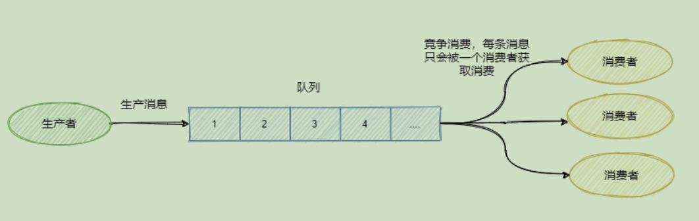

### 发布订阅模块

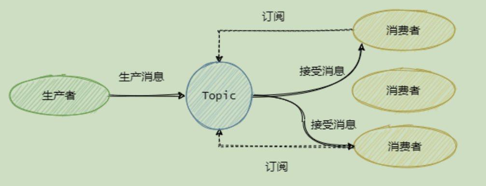

>RabbitMQ 采用队列模型， RocketMQ 和 Kafka 采用发布/订阅模型。

在物理上除了副本拷贝之外，一条消息在 Broker 中只会有一份，每个消费组会有自己的 offset 即消

费点位来标识消费到的位置。在消费点位之前的消息表明已经消费过了。当然这个 offset 是队列级别

的。每个消费组都会维护订阅的 Topic 下的每个队列的 offset 。

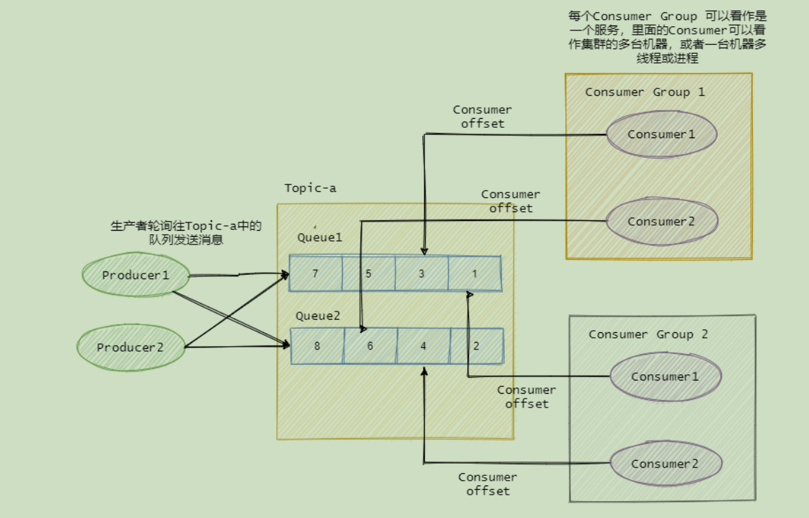

## 如何保证消息不丢失

只要**配置得当**，消息就不会丢。

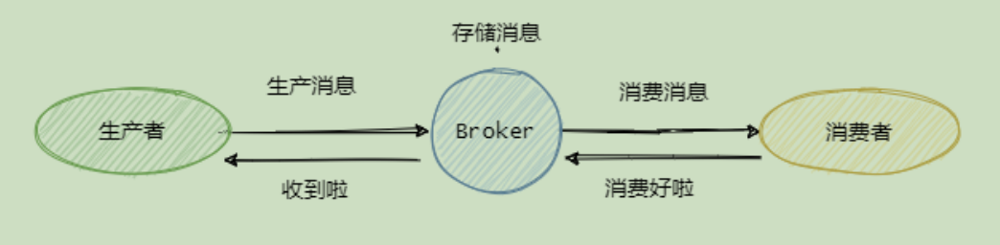

一共有三个阶段，分别是**生产消息、存储消息和消费消息**。我们从这三个阶段分别入手来看看

如何确保消息不会丢失。

### **生产消息**

生产者发送消息至 Broker ，需要处理 Broker 的响应，不论是同步还是异步发送消息，同步和异步回

调都需要做好 try-catch ，妥善的处理响应，如果 Broker 返回写入失败等错误消息，需要重试发送。

当多次发送失败需要作报警，日志记录等。

### **存储消息**

存储消息阶段需要在**消息刷盘之后**再给生产者响应，假设消息写入缓存中就返回响应，那么机器突然断

电这消息就没了，而生产者以为已经发送成功了。

如果 Broker 是集群部署，有多副本机制，即消息不仅仅要写入当前 Broker ,还需要写入副本机中。那

配置成至少写入两台机子后再给生产者响应。这样基本上就能保证存储的可靠了。一台挂了还有一台还

在呢（假如怕两台都挂了..那就再多些）。

### **消费消息**

**消费者真正执行完业务逻辑**之后，再发送给Broker **消费成功**，这才是真正的消费了。

>但是要注意**消息可靠性增强了，性能就下降了**，等待消息刷盘、多副本同步后返回都会影响性能。因此
>
>还是看业务，例如日志的传输可能丢那么一两条关系不大，因此没必要等消息刷盘再响应。

## **如果处理重复消息**

重复消息产生原因：如果只管发，不管broker的响应，不会发生，就是因为需要管broker的响应，要重试。

解决：**幂等**

## **如何保证消息的有序性**

有序性分：**全局有序和部分有序**。

**全局有序**

如果要保证消息的全局有序，首先只能由一个生产者往 Topic 发送消息，并且一个 Topic 内部只能有

一个队列（分区）。消费者也必须是单线程消费这个队列。这样的消息就是全局有序的！

不过一般情况下我们都不需要全局有序，即使是同步 MySQL Binlog 也只需要保证单表消息有序即可。


**部分有序**

因此绝大部分的有序需求是部分有序，部分有序我们就可以将 Topic 内部划分成我们需要的队列数，把

消息通过特定的策略发往固定的队列中，然后每个队列对应一个单线程处理的消费者。这样即完成了部

分有序的需求，又可以通过队列数量的并发来提高消息处理效率。

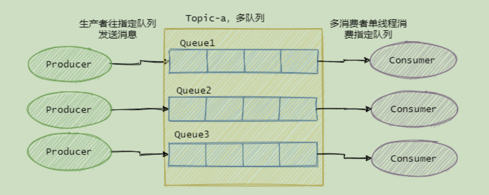

图中我画了多个生产者，一个生产者也可以，只要同类消息发往指定的队列即可。

## **如果处理消息堆积**

消息的堆积往往是因为**生产者的生产速度与消费者的消费速度不匹配**。有可能是因为消息消费失败反复

重试造成的，也有可能就是消费者消费能力弱，渐渐地消息就积压了。

因此我们需要**先定位消费慢的原因**，如果是 bug 则处理 bug ，如果是因为本身消费能力较弱，我们可

以优化下消费逻辑，比如之前是一条一条消息消费处理的，这次我们批量处理，比如数据库的插入，一

条一条插和批量插效率是不一样的。

假如逻辑我们已经都优化了，但还是慢，那就得考虑水平扩容了，增加 Topic 的队列数和消费者数量，

**注意队列数一定要增加**，不然新增加的消费者是没东西消费的。**一个Topic中，一个队列只会分配给一**

**个消费者。**

## **如何设计一个消息队列？**

首先我们需要明确地提出消息中间件的几个重要角色，分别是生产者、消费者、Broker、注册中心。

简述下消息中间件数据流转过程，无非就是生产者生产消息，发送至 Broker，Broker 可以暂缓消息，

然后消费者再从 Broker 获取消息，用于消费。

而注册中心用于服务的发现包括：Broker 的发现、生产者的发现、消费者的发现，当然还包括下线，

可以说服务的高可用离不开注册中心。

然后开始简述实现要点，可以同通信讲起：各模块的通信可以基于 Netty 然后自定义协议来实现，注册

中心可以利用 zookeeper、consul、eureka、nacos 等等，也可以像 RocketMQ 自己实现简单的

namesrv （这一句话就都是关键词）。

为了考虑扩容和整体的性能，采用分布式的思想，像 Kafka 一样采取分区理念，一个 Topic 分为多个

partition，并且为保证数据可靠性，采取多副本存储，即 Leader 和 follower，根据性能和数据可靠的

权衡提供异步和同步的刷盘存储。

并且利用选举算法保证 Leader 挂了之后 follower 可以顶上，保证消息队列的高可用。

也同样为了提高消息队列的可靠性利用本地文件系统来存储消息，并且采用顺序写的方式来提高性能。

可根据消息队列的特性利用内存映射、零拷贝进一步的提升性能，还可利用像 Kafka 这种批处理思想提

高整体的吞吐。


# Spring

## 单例下的线程安全？

> 类中的成员变量，会共享，导致了线程安全问题。
>
> 解决：
>
> - 不用成员变量（基本不可能）
> - ThreadLocal（推荐）

## Bean作用域

singleton、prototype、request、session、global-session(用于web组件开发，老旧技术)


# 漫漫的源码路

## Spring

### 常用注解

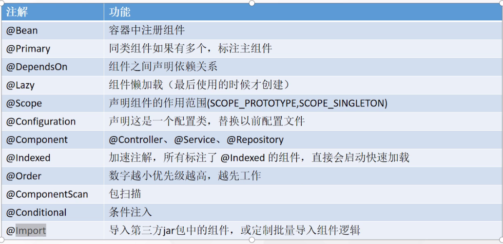

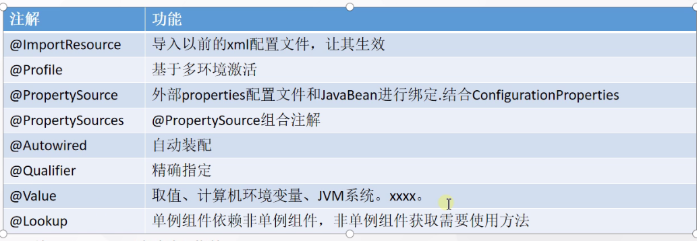

